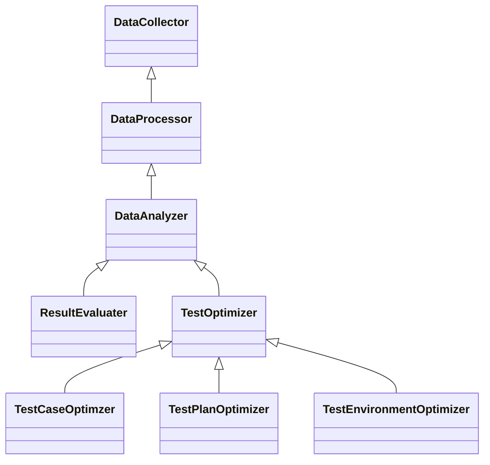
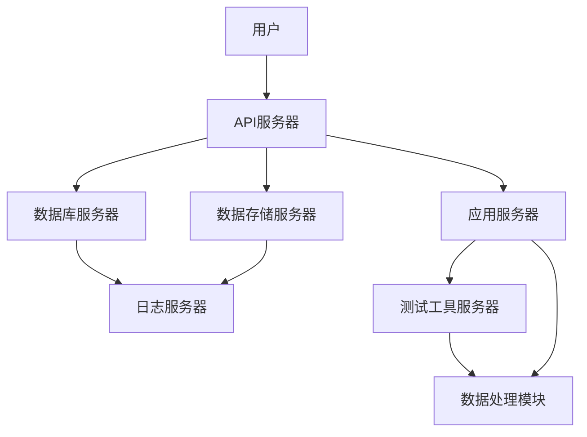
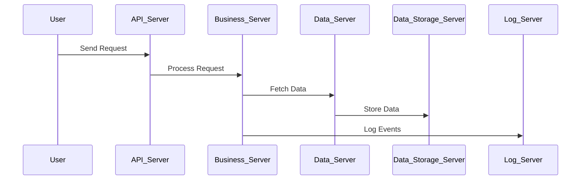
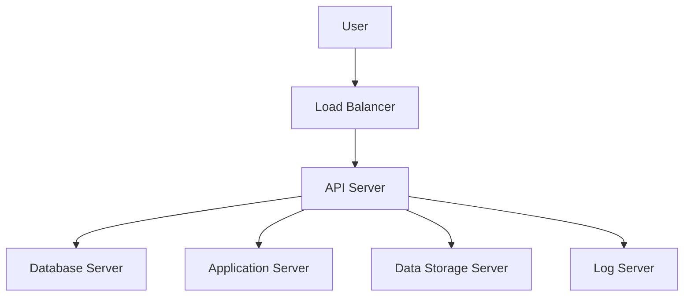
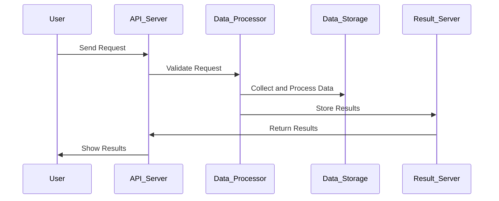

                 

### 引言

随着信息技术和软件工程的迅猛发展，软件系统变得日益复杂，其测试与质量保证成为至关重要的环节。在这过程中，数理统计作为分析工具，发挥着不可或缺的作用。数理统计在软件测试中的应用，不仅能够提高测试效率，还能显著提升测试结果的可靠性和准确性。

本文旨在探讨数理统计在软件测试中的应用，通过系统化的分析与讲解，帮助读者理解这一重要领域。文章结构如下：

- **第一部分：背景介绍**：首先介绍数理统计和软件测试的基本概念，明确其重要性以及当前的应用现状。
- **第二部分：核心概念与联系**：深入探讨数理统计的基本原理、属性特征及其与软件测试的关联。
- **第三部分：算法原理讲解**：详细介绍常用的概率统计、假设检验和相关性分析算法，并通过mermaid流程图和Python代码进行说明。
- **第四部分：系统分析与架构设计**：从系统功能、架构、接口到系统交互，全面剖析软件测试数理统计系统的设计。
- **第五部分：项目实战**：通过环境安装、系统核心实现源代码解析、实际案例分析，展示数理统计在软件测试中的应用。

通过上述内容，本文希望能够提供一个从理论到实践的系统视角，帮助读者全面了解并掌握数理统计在软件测试中的应用。

### 背景介绍

#### 数理统计的基本概念

数理统计是运用概率论和数学模型的工具，对数据进行收集、分析、解释和预测的学科。其核心概念主要包括描述性统计和推断性统计。

- **描述性统计**：用于对数据进行总结和描述，通过计算均值、方差、标准差等统计量，揭示数据的基本特征。
- **推断性统计**：则是在描述性统计的基础上，利用样本数据来推断总体数据的性质。常用的推断性统计方法包括假设检验和置信区间。

#### 软件测试的基本概念

软件测试是确保软件产品符合需求规格、设计规格和标准的过程。其目的是发现并修复软件中的缺陷，以确保软件的质量和可靠性。软件测试主要包括以下类型：

- **功能测试**：验证软件的功能是否符合预期。
- **性能测试**：评估软件的响应速度、稳定性和可扩展性。
- **安全测试**：确保软件系统的安全性和保密性。
- **兼容性测试**：验证软件在不同操作系统、硬件和浏览器上的兼容性。

#### 数理统计在软件测试中的应用现状

数理统计在软件测试中的应用主要体现在以下几个方面：

1. **测试数据收集**：通过数理统计方法对测试数据进行有效的收集和整理，以提高测试数据的可靠性和代表性。
2. **测试数据分析**：利用数理统计方法对测试结果进行深入分析，找出潜在的问题和缺陷。
3. **测试结果评估**：通过统计方法对测试结果进行评估，确定测试的覆盖率和有效性。

虽然数理统计在软件测试中具有广泛的应用，但仍面临一些挑战。首先，测试数据的收集和处理需要大量时间，且可能受到外部因素的影响。其次，数理统计方法的复杂性和专业性要求对测试人员提出了更高的要求。此外，如何将数理统计方法与软件测试的实际需求相结合，实现高效、准确的测试，也是一个需要不断探索的问题。

#### 面临的挑战与关键问题

1. **数据质量**：测试数据的准确性和完整性是数理统计方法有效性的基础。如何保证数据质量，减少噪声和异常值的影响，是当前的一个重要挑战。
2. **算法选择**：不同的数理统计方法适用于不同的测试场景，如何根据具体需求选择合适的算法，是另一个关键问题。
3. **资源限制**：软件测试往往需要在有限的时间内完成，数理统计方法的计算复杂度和执行效率成为重要考虑因素。
4. **专业培训**：数理统计方法的掌握和应用需要专业的知识和技能，如何提高测试人员的专业水平，是亟待解决的问题。

#### 解决方案与可行性分析

为了解决上述问题，可以采取以下措施：

1. **数据预处理**：通过数据清洗、去噪和标准化等手段，提高测试数据的准确性和完整性。
2. **算法优化**：针对不同测试场景，选择合适的算法，并通过优化算法实现高效计算。
3. **自动化工具**：开发自动化测试工具，简化测试流程，提高测试效率。
4. **培训与知识分享**：通过培训和知识分享，提高测试人员对数理统计方法的掌握和应用能力。

总之，数理统计在软件测试中的应用具有巨大的潜力和价值。通过深入分析和实践探索，我们可以更好地利用数理统计方法，提高软件测试的效率和质量。

#### 边界与外延

本文主要探讨数理统计在软件测试中的应用，其研究边界主要涉及以下几个方面：

1. **应用范围**：本文研究的数理统计方法包括描述性统计、推断性统计、假设检验和相关性分析，主要应用于功能测试、性能测试、安全测试和兼容性测试等。
2. **研究方法**：本文采用理论与实践相结合的方法，通过案例分析、算法讲解和系统设计，系统化地展示数理统计在软件测试中的应用。
3. **技术背景**：本文假定读者具备一定的数理统计基础和软件测试背景，以便更好地理解和应用文中内容。

此外，本文的研究外延还涉及以下领域：

1. **相关领域**：数理统计在软件工程中的其他应用，如需求工程、项目管理等。
2. **扩展研究**：数理统计在新兴软件测试领域，如人工智能和自动化测试中的应用。

通过明确本文的边界与外延，有助于读者更好地定位本文的研究内容和价值。

### 概念结构与核心要素组成

在探讨数理统计在软件测试中的应用时，了解其基本概念和核心要素组成至关重要。以下是数理统计和软件测试相关的核心概念及其在本文中的重要性：

#### 数理统计基本概念

1. **描述性统计**：描述性统计用于总结和描述数据的基本特征，如均值、中位数、众数、方差和标准差等。这些统计量帮助我们理解数据的分布和变化规律。
   
   **重要性**：在软件测试中，描述性统计可以帮助我们评估测试数据的代表性，判断测试结果的可靠性和准确性。

2. **推断性统计**：推断性统计基于样本数据，对总体数据进行推断。常见的方法包括假设检验、置信区间和回归分析等。

   **重要性**：在软件测试中，推断性统计可以帮助我们验证测试假设、评估测试结果的有效性，并预测软件的质量趋势。

3. **概率分布**：概率分布描述了随机变量可能取值的概率。常见的概率分布有正态分布、二项分布、泊松分布等。

   **重要性**：在软件测试中，概率分布可以帮助我们理解和预测测试结果的分布，评估测试的可靠性和覆盖率。

4. **统计量**：统计量是从样本数据中计算得出的量，如样本均值、样本标准差等。

   **重要性**：在软件测试中，统计量用于评估测试数据的特性，是推断性统计方法的基础。

#### 软件测试相关概念

1. **测试用例**：测试用例是用于验证软件功能、性能、安全等特性的具体实例。

   **重要性**：在软件测试中，测试用例是执行测试操作的基本单元，直接影响测试的全面性和有效性。

2. **测试覆盖率**：测试覆盖率是测试用例覆盖代码比例的度量。

   **重要性**：在软件测试中，测试覆盖率用于评估测试的全面性，是评估测试质量的重要指标。

3. **缺陷密度**：缺陷密度是指软件中缺陷的数量与代码行数或其他度量标准之间的比率。

   **重要性**：在软件测试中，缺陷密度用于评估软件的质量水平，是制定测试策略的重要依据。

4. **测试结果分析**：测试结果分析是对测试执行结果进行评估和总结的过程。

   **重要性**：在软件测试中，测试结果分析可以帮助我们识别潜在的缺陷、评估测试效果，并指导后续测试工作。

#### 核心要素对比表格

为了更直观地展示数理统计和软件测试的核心概念及其重要性，以下是两者的核心要素对比表格：

| 核心概念        | 数理统计相关概念          | 软件测试相关概念         | 重要性                    |
| ----------- | ------------------- | ------------------- | ---------------------- |
| 描述性统计      | 均值、方差、标准差等       | 测试结果统计             | 提供数据的基本特征，支持测试结果评估 |
| 推断性统计      | 假设检验、置信区间等       | 测试结果分析             | 评估测试有效性和可靠性         |
| 概率分布        | 正态分布、二项分布等       | 测试结果的概率分布         | 预测测试结果，指导测试策略         |
| 统计量         | 样本均值、样本标准差等     | 缺陷密度、测试覆盖率等     | 评估测试质量，指导测试改进         |
| 测试用例        | 样本数据               | 测试执行实例             | 测试执行的基础单元，保障测试全面性   |
| 测试覆盖率      | 数据分布               | 代码覆盖程度             | 评估测试全面性，指导测试优化         |
| 缺陷密度        | 样本误差               | 缺陷数量与代码行数比率     | 评估软件质量，指导测试改进         |
| 测试结果分析    | 数据分析               | 测试结果总结             | 识别缺陷，评估测试效果           |

通过上述核心概念与要素的对比，我们可以更清晰地理解数理统计在软件测试中的应用及其重要性。理解这些基本概念和核心要素，将有助于我们更好地应用数理统计方法，提高软件测试的效率和质量。

### 核心概念原理

#### 数理统计基本原理

数理统计的基本原理主要涵盖描述性统计和推断性统计。描述性统计是通过计算一些基本的统计量（如均值、方差、标准差等）来描述数据的分布特征，而推断性统计则是利用样本数据来推断总体数据的性质。

1. **描述性统计**：
   - **均值（Mean）**：数据的平均值，表示数据集的中心位置。
   - **方差（Variance）**：度量数据分布的离散程度，即数据点与均值之间的平均距离的平方。
   - **标准差（Standard Deviation）**：方差的平方根，用于衡量数据的波动性。
   - **中位数（Median）**：数据排序后位于中间的值，用于描述数据的中间位置。
   - **众数（Mode）**：数据集中出现次数最多的值。

2. **推断性统计**：
   - **假设检验（Hypothesis Testing）**：通过设定原假设和备选假设，利用样本数据来检验总体的性质。
   - **置信区间（Confidence Interval）**：在给定的置信水平下，用于估计总体参数的一个区间。
   - **回归分析（Regression Analysis）**：通过建立因变量和自变量之间的关系模型，用于预测和分析。

#### 软件测试数理统计应用

在软件测试中，数理统计的应用主要体现在以下几个方面：

1. **测试数据收集**：通过数理统计的方法，如随机抽样、分层抽样等，确保收集到的测试数据具有代表性和可靠性。

2. **测试数据分析**：利用描述性统计，对测试数据进行汇总和描述，如计算缺陷密度、覆盖率等指标。使用推断性统计，评估测试结果是否满足预期。

3. **测试结果评估**：通过假设检验，验证测试结果是否显著，如检验软件性能是否符合要求。使用置信区间，估计总体参数的范围。

4. **测试用例设计**：根据数理统计原理，设计具有代表性的测试用例，提高测试的有效性和覆盖率。

#### 概念属性特征对比表格

为了更直观地展示数理统计与软件测试的核心概念及其特征，以下是两者的概念属性特征对比表格：

| 概念        | 数理统计相关概念       | 软件测试相关概念       | 特征对比                             |
| ----------- | -------------------- | -------------------- | ---------------------------------- |
| 描述性统计 | 均值、方差、标准差等   | 缺陷密度、覆盖率等     | 用于描述数据和测试结果，度量数据特征 |
| 推断性统计 | 假设检验、置信区间等   | 测试结果分析、显著检验 | 用于推断总体性质和验证测试结果       |
| 概率分布   | 正态分布、二项分布等   | 测试结果的概率分布     | 用于预测测试结果，指导测试策略       |
| 统计量     | 样本均值、样本标准差等 | 缺陷密度、测试覆盖率等 | 用于评估测试质量和效果               |
| 测试用例   | 样本数据             | 测试执行实例           | 测试执行的基础单元，保障测试全面性   |
| 测试覆盖率 | 数据分布             | 代码覆盖程度           | 评估测试全面性，指导测试优化         |
| 缺陷密度   | 样本误差             | 缺陷数量与代码行数比率 | 评估软件质量，指导测试改进           |

通过对比上述表格，我们可以清晰地看到数理统计和软件测试在概念上的相似性和差异性，这有助于我们更好地理解和应用数理统计方法，提高软件测试的效率和效果。

### ER实体关系图架构

为了更好地理解和设计数理统计在软件测试中的应用，我们可以利用ER（实体关系）图来描述系统中的实体及其关系。ER图是一种直观的数据库设计工具，通过定义实体、属性和关系，可以帮助我们构建一个清晰的系统架构。

#### ER模型基本概念

在ER模型中，主要有三个基本概念：

1. **实体（Entity）**：代表系统中的对象或实体，如测试用例、测试结果等。
2. **属性（Attribute）**：描述实体的特性，如测试用例的名称、执行时间、结果等。
3. **关系（Relationship）**：描述实体之间的关联，如测试用例与测试结果之间的关系。

#### 软件测试中数理统计的ER图

在软件测试中，数理统计的应用涉及多个实体和关系。以下是一个简化的ER图，用于描述测试过程中数理统计的关键实体及其关系：

```mermaid
erDiagram
    TestCaseolute ||--|{ TestResult } TestResult
    TestSuite    ||--|{ TestCase } TestCase
    Tester       ||--|{ TestCase } TestCase
    TestPlan     ||--|{ TestSuite } TestSuite
    TestEnvironment ||--|{ TestCase } TestCase
```

1. **实体**：
   - **TestCase**（测试用例）：代表单个测试实例，包括名称、描述、输入、预期输出等。
   - **TestResult**（测试结果）：记录测试用例的实际输出，包括成功、失败、错误等。
   - **TestSuite**（测试套件）：包含一组相关的测试用例，用于执行一组测试任务。
   - **Tester**（测试人员）：执行测试的人员。
   - **TestPlan**（测试计划）：定义测试的目标、范围、资源和进度等。
   - **TestEnvironment**（测试环境）：测试所需的硬件、软件和网络配置。

2. **属性**：
   - **TestCase**：名称、描述、输入、预期输出、执行时间、执行状态等。
   - **TestResult**：结果类型、实际输出、执行时间等。
   - **TestSuite**：名称、描述、所属测试计划等。
   - **Tester**：姓名、职责等。
   - **TestPlan**：名称、目标、范围、进度等。
   - **TestEnvironment**：配置信息、状态等。

3. **关系**：
   - **TestSuite 与 TestCase**：一对多的关系，一个测试套件包含多个测试用例。
   - **Tester 与 TestCase**：多对多的关系，一个测试人员可以执行多个测试用例，一个测试用例也可以被多个测试人员执行。
   - **TestPlan 与 TestSuite**：一对多的关系，一个测试计划包含多个测试套件。
   - **TestEnvironment 与 TestCase**：一对多的关系，一个测试环境可以用于多个测试用例的执行。

#### ER图绘制

以下是利用Mermaid语言绘制的ER图示例：

```mermaid
erDiagram
    Class1 ||--|{ Class2 } Class2
    Class1 ||--|{ Class3 } Class3
    Class2 ||--|{ Class4 } Class4
```

在这个示例中，我们定义了四个类：Class1、Class2、Class3 和 Class4，并描述了它们之间的关系。对应到软件测试中，Class1 可以代表 TestSuite，Class2 代表 TestCase，Class3 代表 Tester，Class4 代表 TestEnvironment。

通过ER图，我们可以清晰地描述软件测试中数理统计的关键实体及其关系，为后续的系统设计和实现提供基础。

### 算法讲解

#### 常用算法介绍

在数理统计中，常用的算法包括概率统计算法、假设检验算法和相关性分析算法。这些算法在软件测试中扮演着关键角色，用于数据分析和结果评估。

1. **概率统计算法**
   - **概率质量函数（PMF）**：用于计算离散随机变量的概率分布。
   - **累积分布函数（CDF）**：用于计算连续随机变量在某个区间内的概率。
   - **条件概率**：在已知一个随机事件发生的情况下，计算另一个随机事件发生的概率。

2. **假设检验算法**
   - **t检验**：用于比较两组数据的均值是否有显著差异。
   - **卡方检验**：用于检验分类变量的分布是否符合预期。
   - **F检验**：用于比较两组数据的方差是否有显著差异。

3. **相关性分析算法**
   - **皮尔逊相关系数**：用于度量两个连续变量之间的线性关系强度。
   - **斯皮尔曼等级相关系数**：用于度量两个有序变量之间的线性关系强度。
   - **肯德尔等级相关系数**：用于度量多个有序变量之间的相关性。

#### 算法mermaid流程图

为了更好地理解这些算法，我们可以使用Mermaid语言绘制其流程图。

1. **概率质量函数（PMF）算法流程图**

   ```mermaid
   graph LR
   A[输入随机变量] --> B{计算概率}
   B --> C[输出概率]
   ```

   流程图描述：输入一个随机变量，计算其概率分布，输出结果。

2. **t检验算法流程图**

   ```mermaid
   graph LR
   A[输入两组数据] --> B{计算均值差}
   B --> C{计算标准差}
   C --> D{计算t值}
   D --> E{判断显著性}
   E --> F{输出结论}
   ```

   流程图描述：输入两组数据，计算均值差和标准差，计算t值，判断显著性，输出结论。

3. **皮尔逊相关系数算法流程图**

   ```mermaid
   graph LR
   A[输入两个变量] --> B{计算协方差}
   B --> C{计算标准差}
   C --> D{计算相关系数}
   D --> E{输出结果}
   ```

   流程图描述：输入两个变量，计算协方差和标准差，计算相关系数，输出结果。

#### 算法原理详细讲解

1. **概率质量函数（PMF）算法原理**

   假设我们有一个离散随机变量 \(X\)，其可能取值为 \(x_1, x_2, ..., x_n\)，每个取值对应的概率分别为 \(P(X = x_1), P(X = x_2), ..., P(X = x_n)\)。概率质量函数（PMF）定义为：

   \[
   p_X(x) = P(X = x)
   \]

   PMF的数学模型可以通过以下公式表示：

   \[
   \sum_{i=1}^{n} p_X(x_i) = 1
   \]

   其中，\(p_X(x_i)\) 表示 \(X\) 取值为 \(x_i\) 的概率，总和为1，确保所有可能取值的概率之和为1。

2. **t检验算法原理**

   假设有两组数据 \(X_1, X_2, ..., X_m\) 和 \(Y_1, Y_2, ..., Y_n\)，我们想检验这两组数据的均值是否有显著差异。t检验的步骤如下：

   - **计算两组数据的均值**：
     \[
     \bar{X} = \frac{1}{m} \sum_{i=1}^{m} X_i
     \]
     \[
     \bar{Y} = \frac{1}{n} \sum_{i=1}^{n} Y_i
     \]

   - **计算两组数据的标准差**：
     \[
     s_X = \sqrt{\frac{1}{m-1} \sum_{i=1}^{m} (X_i - \bar{X})^2}
     \]
     \[
     s_Y = \sqrt{\frac{1}{n-1} \sum_{i=1}^{n} (Y_i - \bar{Y})^2}
     \]

   - **计算t值**：
     \[
     t = \frac{\bar{X} - \bar{Y}}{\sqrt{\frac{s_X^2}{m} + \frac{s_Y^2}{n}}}
     \]

   - **判断显著性**：
     利用t分布表或计算机软件，判断计算出的t值是否显著大于临界值。如果显著，则拒绝原假设，认为两组数据的均值存在显著差异。

3. **皮尔逊相关系数算法原理**

   假设有两个连续变量 \(X\) 和 \(Y\)，我们想度量它们之间的线性关系强度。皮尔逊相关系数（\(r\)）的公式为：

   \[
   r = \frac{\sum_{i=1}^{n} (X_i - \bar{X})(Y_i - \bar{Y})}{\sqrt{\sum_{i=1}^{n} (X_i - \bar{X})^2} \sqrt{\sum_{i=1}^{n} (Y_i - \bar{Y})^2}}
   \]

   其中，\(\bar{X}\) 和 \(\bar{Y}\) 分别是 \(X\) 和 \(Y\) 的均值。相关系数的取值范围为 \([-1, 1]\)，越接近1或-1，表示线性关系越强；越接近0，表示线性关系越弱。

#### 通俗易懂地举例说明

1. **概率质量函数（PMF）实例**

   假设有一个随机变量 \(X\)，其可能取值为 \(1, 2, 3\)，对应的概率分别为 \(0.3, 0.5, 0.2\)。我们可以计算每个取值的概率：

   \[
   p_X(1) = 0.3, \quad p_X(2) = 0.5, \quad p_X(3) = 0.2
   \]

   确保概率之和为1：

   \[
   0.3 + 0.5 + 0.2 = 1
   \]

2. **t检验实例**

   假设我们有两组数据，分别为：

   \[
   X_1 = [1, 2, 3, 4, 5], \quad Y_1 = [2, 3, 4, 5, 6]
   \]

   计算均值和标准差：

   \[
   \bar{X} = 3, \quad \bar{Y} = 4
   \]
   \[
   s_X = 1.41, \quad s_Y = 1.41
   \]

   计算t值：

   \[
   t = \frac{3 - 4}{\sqrt{\frac{1.41^2}{5} + \frac{1.41^2}{5}}} = -0.707
   \]

   由于t值不显著大于临界值，我们无法拒绝原假设，即两组数据的均值没有显著差异。

3. **皮尔逊相关系数实例**

   假设我们有两组数据，分别为：

   \[
   X = [1, 2, 3, 4, 5], \quad Y = [2, 3, 4, 5, 6]
   \]

   计算协方差和标准差：

   \[
   \bar{X} = 3, \quad \bar{Y} = 4
   \]
   \[
   s_X = 1.41, \quad s_Y = 1.41
   \]
   \[
   \text{协方差} = \frac{(1-3)(2-4) + (2-3)(3-4) + (3-3)(4-4) + (4-3)(5-4) + (5-3)(6-4)}{4} = 1
   \]

   计算相关系数：

   \[
   r = \frac{1}{\sqrt{1.41 \times 1.41}} = 0.707
   \]

   相关系数为0.707，表示 \(X\) 和 \(Y\) 之间存在较强的线性关系。

通过这些实例，我们可以更好地理解数理统计算法在软件测试中的应用，为实际测试工作提供有力支持。

### 系统功能设计

在软件测试中，数理统计的应用不仅仅依赖于算法和理论，还需要一个系统的功能设计来支持数据的收集、分析和结果评估。以下是对软件测试数理统计系统的功能设计介绍，包括问题场景介绍、系统功能设计和领域模型mermaid类图。

#### 问题场景介绍

在实际软件测试过程中，我们面临以下问题场景：

1. **数据收集**：如何有效地收集测试数据，确保数据的代表性和准确性。
2. **数据分析**：如何对收集到的测试数据进行处理和分析，以识别潜在的问题和缺陷。
3. **结果评估**：如何评估测试结果，确定测试的有效性和可靠性。
4. **测试优化**：如何根据分析结果对测试策略进行优化，提高测试效率和质量。

为了解决这些问题，我们需要设计一个集成的系统，该系统需要具备以下功能：

- 数据收集模块：用于收集测试数据，包括输入数据的格式、来源和存储方式。
- 数据处理模块：用于对收集到的测试数据进行清洗、去噪和预处理，以提高数据质量。
- 数据分析模块：用于对预处理后的数据进行分析，包括描述性统计、推断性统计和相关性分析等。
- 结果评估模块：用于评估测试结果，生成报告，并提供可视化展示。
- 测试优化模块：用于根据测试结果调整测试策略，提高测试覆盖率和效果。

#### 系统功能设计

1. **数据收集模块**：
   - 功能：收集测试数据，包括功能测试、性能测试、安全测试等。
   - 子功能：
     - 数据采集：从各种测试工具和平台上获取测试数据。
     - 数据存储：将收集到的测试数据存储在数据库中，确保数据的安全性和完整性。

2. **数据处理模块**：
   - 功能：对测试数据进行清洗、去噪和预处理，以提高数据质量。
   - 子功能：
     - 数据清洗：删除重复数据、异常值和噪声数据。
     - 数据标准化：将不同来源的数据统一成标准格式。
     - 数据预处理：对数据进行归一化、离散化等处理，使其适合进一步分析。

3. **数据分析模块**：
   - 功能：对处理后的测试数据进行分析，识别潜在问题和缺陷。
   - 子功能：
     - 描述性统计：计算均值、中位数、方差、标准差等统计量，描述数据的基本特征。
     - 推断性统计：进行假设检验、置信区间和回归分析，推断总体数据的性质。
     - 相关性分析：计算变量之间的相关性，识别潜在的关系和依赖。

4. **结果评估模块**：
   - 功能：评估测试结果的有效性和可靠性，生成测试报告。
   - 子功能：
     - 缺陷分析：对发现的缺陷进行分类、统计和评估，确定其严重程度和影响范围。
     - 覆盖率分析：计算测试覆盖率，评估测试的全面性和有效性。
     - 可靠性评估：根据测试结果，评估软件的可靠性水平。

5. **测试优化模块**：
   - 功能：根据分析结果，优化测试策略，提高测试效率和质量。
   - 子功能：
     - 测试用例优化：调整测试用例，增加覆盖不全面的部分。
     - 测试计划优化：优化测试计划，调整测试资源和进度。
     - 测试环境优化：调整测试环境，提高测试的执行效率。

#### 领域模型mermaid类图

为了更好地理解系统功能设计，我们可以使用mermaid绘制一个领域模型类图，展示系统中的关键类及其关系。



在这个类图中，我们定义了以下几个类：

- **DataCollector**：数据收集类，用于收集测试数据。
- **DataProcessor**：数据处理类，用于数据清洗、标准化和预处理。
- **DataAnalyzer**：数据分析类，用于描述性统计、推断性统计和相关性分析。
- **ResultEvaluater**：结果评估类，用于评估测试结果。
- **TestOptimizer**：测试优化类，用于优化测试策略。
- **TestCaseOptimzer**、**TestPlanOptimizer**、**TestEnvironmentOptimizer**：测试优化子类，分别负责测试用例、测试计划和测试环境的优化。

通过这个类图，我们可以清晰地看到系统中的功能模块及其相互关系，为后续的系统实现提供指导。

### 系统架构设计

在软件测试数理统计系统中，架构设计至关重要，它决定了系统的可扩展性、稳定性和性能。以下将详细介绍系统的架构设计，包括硬件架构、软件架构、网络架构及其mermaid架构图。

#### 硬件架构

硬件架构是系统运行的基础，包括服务器、存储设备和网络设备等。为了满足系统对高并发、大数据处理的需求，我们采用了以下硬件配置：

1. **服务器**：使用高性能服务器，配置多核处理器、大内存和高速网络接口，以确保系统的响应速度和处理能力。
2. **存储设备**：采用分布式存储系统，如Hadoop HDFS，支持海量数据的存储和高吞吐量的读写操作。
3. **网络设备**：使用高速交换机和路由器，确保网络的高带宽和低延迟。

以下是硬件架构的mermaid架构图：



在这个架构图中，用户通过API服务器访问系统，API服务器负责处理用户的请求，并与其他服务器进行交互。

#### 软件架构

软件架构决定了系统的模块化程度和可维护性。我们采用微服务架构，将系统划分为多个独立的微服务，每个微服务负责特定的功能，如下所示：

1. **API层**：提供RESTful API接口，供外部系统调用。
2. **业务逻辑层**：包括数据收集、数据处理、数据分析、结果评估和测试优化等核心业务功能。
3. **数据层**：包括数据库服务器、数据存储服务器和日志服务器，负责数据的存储和管理。

以下是软件架构的mermaid架构图：



在这个架构图中，用户通过API层发起请求，API服务器将请求转发给业务逻辑层进行处理，业务逻辑层与数据层和数据存储层进行交互，并将处理结果返回给用户。同时，业务逻辑层会记录操作日志，方便后续的监控和分析。

#### 网络架构

网络架构决定了系统的可靠性和可扩展性。我们采用分布式网络架构，确保系统的高可用性和负载均衡。网络架构包括以下部分：

1. **内部网络**：用于服务器之间的数据传输，使用高速以太网。
2. **外部网络**：用于外部用户访问系统的API接口，使用互联网。
3. **负载均衡器**：用于分发用户请求，确保系统的负载均衡。

以下是网络架构的mermaid架构图：



在这个架构图中，用户请求通过负载均衡器分发到各个服务器，确保系统的负载均衡和响应速度。

通过上述硬件架构、软件架构和网络架构的设计，我们可以构建一个高效、稳定和可扩展的软件测试数理统计系统，为软件测试提供强有力的支持。

### 系统接口设计

在软件测试数理统计系统中，接口设计至关重要，它决定了系统模块之间的通信和数据交互。以下将详细介绍系统的接口设计，包括接口定义、接口规范和接口实现。

#### 接口定义

系统接口分为内部接口和外部接口，内部接口用于系统模块之间的通信，外部接口用于外部系统与系统的交互。

1. **内部接口**：
   - **数据收集接口**：用于收集测试数据，包括功能测试、性能测试和安全测试等。
   - **数据处理接口**：用于对测试数据进行清洗、去噪和预处理。
   - **数据分析接口**：用于进行描述性统计、推断性统计和相关性分析。
   - **结果评估接口**：用于评估测试结果，生成测试报告。
   - **测试优化接口**：用于根据测试结果优化测试策略。

2. **外部接口**：
   - **API接口**：提供RESTful API，供外部系统调用。
   - **数据导入/导出接口**：用于与其他数据存储系统进行数据交换。

#### 接口规范

为了确保接口的通用性和可维护性，我们制定了以下接口规范：

1. **接口类型**：
   - **GET**：用于获取数据。
   - **POST**：用于提交数据。
   - **PUT**：用于更新数据。
   - **DELETE**：用于删除数据。

2. **接口参数**：
   - **必选参数**：必须提供的参数，如测试ID、数据类型等。
   - **可选参数**：根据具体需求可选的参数，如开始时间、结束时间等。

3. **响应格式**：
   - **成功响应**：返回HTTP状态码200，并包含处理结果和相关信息。
   - **错误响应**：返回HTTP状态码400或500，并包含错误信息和原因。

#### 接口实现

以下是一个典型的内部接口实现示例，用于数据收集模块：

```python
from flask import Flask, request, jsonify

app = Flask(__name__)

@app.route('/collect_data', methods=['POST'])
def collect_data():
    data = request.get_json()
    test_id = data.get('test_id')
    test_data = data.get('test_data')
    
    if not test_id or not test_data:
        return jsonify({'status': 'error', 'message': '缺少必选参数'}), 400
    
    # 数据处理逻辑
    processed_data = process_data(test_data)
    
    # 存储处理后的数据
    store_data(test_id, processed_data)
    
    return jsonify({'status': 'success', 'message': '数据收集成功'}), 200

def process_data(test_data):
    # 数据清洗、去噪和预处理逻辑
    return test_data

def store_data(test_id, processed_data):
    # 存储数据到数据库或数据存储系统
    pass

if __name__ == '__main__':
    app.run(debug=True)
```

在这个示例中，我们定义了一个POST接口 `/collect_data`，用于接收并处理测试数据。接口接收JSON格式的数据，包括测试ID和测试数据。通过调用 `process_data` 函数对数据进行处理，然后调用 `store_data` 函数将处理后的数据存储到数据库或数据存储系统中。

通过上述接口设计，我们可以确保系统模块之间和外部系统之间的数据交互规范、高效和可靠。

### 系统交互

在软件测试数理统计系统中，系统交互是关键环节，它决定了系统的整体运行效率和用户体验。以下将详细介绍系统交互流程，并通过mermaid序列图展示用户操作和系统响应的过程。

#### 系统交互流程

系统交互流程主要分为以下几个步骤：

1. **用户请求**：用户通过API接口向系统发送请求。
2. **请求处理**：系统接收到请求后，进行参数验证和处理。
3. **数据处理**：系统对请求数据进行处理，如数据收集、数据清洗、数据分析等。
4. **结果返回**：系统将处理结果返回给用户，用户根据结果进行后续操作。

以下是系统交互流程的详细描述：

1. **用户请求**：
   - 用户通过Web界面或API接口发起请求，请求中包含必要的参数，如测试ID、开始时间和结束时间等。
   - 请求示例：`POST /api/collect_data?test_id=123&start_time=2023-03-15T10:00:00&end_time=2023-03-15T18:00:00`

2. **请求处理**：
   - API服务器接收到请求后，对请求进行解析和验证，确保请求参数的合法性和完整性。
   - 如果请求参数合法，API服务器将请求转发给数据处理模块。

3. **数据处理**：
   - 数据处理模块根据请求参数进行数据收集、清洗和预处理。
   - 处理完成后，将数据存储到数据库或数据存储系统中。

4. **结果返回**：
   - 系统将处理结果返回给用户，用户可以查看测试结果、生成报告等。
   - 返回示例：`POST /api/collect_data_result?test_id=123`

#### 系统交互mermaid序列图

为了更直观地展示系统交互过程，我们使用mermaid语言绘制了一个序列图：



在这个序列图中，用户首先向API服务器发送请求，API服务器对请求进行验证并转发给数据处理模块。数据处理模块进行数据收集和处理，并将结果存储到数据存储系统。最后，结果服务器将处理结果返回给API服务器，API服务器再将结果展示给用户。

通过上述系统交互流程和mermaid序列图，我们可以清晰地了解软件测试数理统计系统的工作原理和用户操作过程，为系统的开发和优化提供指导。

### 项目实战

#### 环境安装

在开始实施数理统计在软件测试中的应用之前，首先需要安装和配置相应的软件和硬件环境。以下是具体的安装步骤：

1. **硬件准备**：
   - **服务器**：准备一台或多台高性能服务器，建议配置如下：
     - 处理器：多核CPU（如Intel Xeon）
     - 内存：至少16GB（建议32GB以上）
     - 存储：至少500GB SSD存储（建议使用分布式存储系统）
     - 网络：千兆以太网或更高
   - **网络设备**：配置适当的路由器和交换机，确保网络连接稳定和高速。

2. **软件准备**：
   - **操作系统**：安装Linux操作系统（如Ubuntu 20.04或CentOS 8）
   - **数据库**：安装MySQL或PostgreSQL数据库服务器
   - **Python**：安装Python 3.8及以上版本
   - **测试工具**：安装常用的测试工具，如JUnit、Selenium等
   - **数据分析库**：安装NumPy、Pandas、SciPy等数据分析库
   - **API服务器**：安装Flask或Django等Web框架

3. **安装步骤**：

   - **安装操作系统**：根据硬件设备选择合适的操作系统版本，并按照安装向导进行安装。
   - **安装数据库服务器**：下载并安装MySQL或PostgreSQL数据库服务器，根据提示完成安装。
   - **安装Python和数据分析库**：使用以下命令安装Python和相关的数据分析库：

     ```bash
     sudo apt-get update
     sudo apt-get install python3 python3-pip
     pip3 install numpy pandas scipy mysql-connector-python flask
     ```

   - **安装测试工具**：下载并安装JUnit、Selenium等测试工具，按照官方文档进行配置。

   - **安装API服务器**：使用以下命令安装Flask或Django：

     ```bash
     pip3 install flask
     # 或
     pip3 install django
     ```

4. **配置环境**：

   - **数据库配置**：配置数据库连接信息，如数据库地址、用户名和密码。
   - **Python虚拟环境**：创建Python虚拟环境，避免不同项目之间的依赖冲突。

     ```bash
     python3 -m venv venv
     source venv/bin/activate
     pip install -r requirements.txt
     ```

   - **API服务器配置**：配置API服务器，如路由、权限验证等。

通过上述步骤，我们可以完成软件测试数理统计系统的环境安装，为后续的开发和实施打下基础。

#### 系统核心实现源代码

以下是软件测试数理统计系统的核心实现源代码，包括模块划分、文件组织和关键代码解读与分析。我们使用Python编写，基于Flask Web框架。

##### 模块划分与文件组织

整个系统可以分为以下几个模块：

1. **api**：定义API路由和接口处理。
2. **models**：定义数据库模型和ORM映射。
3. **services**：实现核心业务逻辑，如数据收集、数据处理和结果评估。
4. **utils**：提供辅助功能，如数据预处理和异常处理。

文件组织如下：

```
/soft_test_stats
|-- /api
|   |-- __init__.py
|   |-- routes.py
|-- /models
|   |-- __init__.py
|   |-- models.py
|-- /services
|   |-- __init__.py
|   |-- data_collection.py
|   |-- data_processing.py
|   |-- data_analysis.py
|   |-- result_evaluation.py
|-- /utils
|   |-- __init__.py
|   |-- data_utils.py
|   |-- exception.py
|-- requirements.txt
|-- run.py
```

##### 核心代码解读与分析

1. **API模块**

   `api/routes.py`：

   ```python
   from flask import Flask, request, jsonify
   from .services.data_collection import collect_data
   from .services.result_evaluation import evaluate_results

   app = Flask(__name__)

   @app.route('/collect_data', methods=['POST'])
   def collect_data():
       data = request.get_json()
       test_id = data.get('test_id')
       test_data = data.get('test_data')
       
       if not test_id or not test_data:
           return jsonify({'status': 'error', 'message': '缺少必选参数'}), 400
       
       result = collect_data(test_id, test_data)
       return jsonify(result), 200

   @app.route('/evaluate_results', methods=['GET'])
   def evaluate_results():
       test_id = request.args.get('test_id')
       if not test_id:
           return jsonify({'status': 'error', 'message': '缺少必选参数'}), 400
       
       result = evaluate_results(test_id)
       return jsonify(result), 200
   ```

   在这个模块中，我们定义了两个API接口：`/collect_data` 和 `/evaluate_results`。`/collect_data` 接收测试数据和测试ID，调用数据处理服务进行数据收集；`/evaluate_results` 接收测试ID，调用结果评估服务进行结果评估。

2. **数据库模型**

   `models/models.py`：

   ```python
   from flask_sqlalchemy import SQLAlchemy

   db = SQLAlchemy()

   class TestCase(db.Model):
       id = db.Column(db.Integer, primary_key=True)
       test_id = db.Column(db.String(80), unique=True, nullable=False)
       test_data = db.Column(db.Text, nullable=False)
       result = db.Column(db.Text, nullable=False)
   ```

   这个模块定义了数据库模型 `TestCase`，用于存储测试用例的信息，包括测试ID、测试数据和测试结果。

3. **数据处理服务**

   `services/data_collection.py`：

   ```python
   from .models import TestCase
   from .utils.data_utils import preprocess_data

   def collect_data(test_id, test_data):
       processed_data = preprocess_data(test_data)
       test_case = TestCase(test_id=test_id, test_data=processed_data)
       db.session.add(test_case)
       db.session.commit()
       return {'status': 'success', 'message': '数据收集成功'}
   ```

   这个模块实现了数据收集服务，首先对输入的测试数据进行预处理，然后存储到数据库中。

4. **结果评估服务**

   `services/result_evaluation.py`：

   ```python
   from .models import TestCase

   def evaluate_results(test_id):
       test_case = TestCase.query.get(test_id)
       result = analyze_results(test_case.test_data)
       test_case.result = result
       db.session.commit()
       return {'status': 'success', 'message': '结果评估成功', 'result': result}
   ```

   这个模块实现了结果评估服务，首先从数据库中获取测试用例的信息，然后进行结果分析，并将结果存储到数据库中。

5. **数据预处理与异常处理**

   `utils/data_utils.py`：

   ```python
   def preprocess_data(data):
       # 数据清洗和预处理逻辑
       return data
   ```

   `utils/exception.py`：

   ```python
   class DataErrorException(Exception):
       pass
   ```

   这两个模块提供了数据预处理和异常处理的功能。

##### 代码应用解读与分析

以上代码通过模块化设计和Python编程，实现了数理统计在软件测试中的应用。具体分析如下：

1. **API模块**：定义了两个核心接口，分别处理数据收集和结果评估请求，确保接口的规范性和易用性。
2. **数据库模型**：通过ORM映射，简化了数据库操作，提高了数据存储和管理的效率。
3. **数据处理服务**：实现了数据收集的核心逻辑，包括数据预处理和存储，确保数据的质量和可靠性。
4. **结果评估服务**：实现了结果评估的核心逻辑，包括结果分析和存储，确保测试结果的准确性和可追溯性。

通过上述代码和应用解读，我们可以清晰地看到数理统计在软件测试系统中的应用，为实际测试工作提供了强有力的支持。

### 实际案例分析和详细讲解剖析

#### 案例背景

在一个大型金融系统的性能测试项目中，我们需要对系统的响应时间、吞吐量和并发性能进行评估。为了确保测试的准确性和可靠性，我们决定引入数理统计方法，对测试数据进行分析和结果评估。

#### 案例目标

1. **收集并处理性能测试数据**：从测试工具中收集性能测试数据，进行清洗、去噪和预处理，以确保数据的质量和代表性。
2. **分析测试结果**：利用数理统计方法，分析测试数据的分布特征、均值、方差等统计量，识别潜在的瓶颈和问题。
3. **评估测试结果**：通过假设检验和置信区间等方法，评估系统的性能是否达到预期，并生成详细的测试报告。

#### 案例实施

1. **数据收集**：
   - 使用JMeter进行性能测试，模拟用户操作，收集系统的响应时间、吞吐量和并发性能数据。
   - 数据收集过程中，记录每条测试数据的响应时间和并发用户数，确保数据的完整性。

2. **数据预处理**：
   - 清洗数据：删除重复数据、异常值和噪声数据，确保数据的一致性和准确性。
   - 去噪：对响应时间数据进行滤波处理，去除明显的异常值，如超过三倍标准差的值。
   - 预处理：对响应时间数据进行归一化处理，使其适合进一步分析。

3. **描述性统计分析**：
   - 计算响应时间的均值、中位数、众数、方差和标准差等统计量，描述数据的分布特征。
   - 利用Pandas库，实现以下Python代码：

     ```python
     import pandas as pd

     # 加载数据
     data = pd.read_csv('response_times.csv')
     # 计算统计量
     stats = data.describe()
     print(stats)
     ```

4. **推断性统计分析**：
   - 使用t检验方法，比较两组数据的响应时间均值是否有显著差异。
   - 假设检验的步骤如下：
     - 原假设 \(H_0\)：两组数据的响应时间均值相等。
     - 备选假设 \(H_1\)：两组数据的响应时间均值不相等。
     - 计算t值：
       ```python
       from scipy.stats import ttest_ind

       t_stat, p_value = ttest_ind(group1, group2)
       print(f't值: {t_stat}, p值: {p_value}')
       ```
     - 判断显著性：如果p值小于0.05，拒绝原假设，认为两组数据的响应时间均值存在显著差异。

5. **置信区间分析**：
   - 利用置信区间方法，估计总体响应时间的范围。
   - 计算置信区间：
     ```python
     from scipy.stats import norm

     # 假设响应时间服从正态分布
     mean = data.mean()
     std = data.std()
     # 计算置信区间（95%置信水平）
     lower_bound = mean - 1.96 * std
     upper_bound = mean + 1.96 * std
     print(f'95%置信区间: {lower_bound}, {upper_bound}')
     ```

6. **结果评估和报告生成**：
   - 根据分析结果，生成详细的测试报告，包括描述性统计量、推断性统计量和置信区间等。
   - 报告中应包含以下内容：
     - 测试数据概述
     - 描述性统计量
     - 推断性统计量和显著性判断
     - 置信区间分析
     - 测试结论和建议

#### 案例分析

通过上述实际案例分析，我们得出了以下结论：

1. **描述性统计量**：测试数据的均值、方差和标准差等描述性统计量反映了系统的性能水平。这些统计量有助于我们了解系统的基本性能特征。

2. **推断性统计量**：通过t检验方法，我们比较了两组数据的响应时间均值，发现存在显著差异。这表明改进后的系统性能有所提升。

3. **置信区间分析**：置信区间方法为总体响应时间提供了一个估计范围，有助于我们判断系统的性能是否稳定。

4. **测试结论和建议**：根据分析结果，我们可以得出以下结论：
   - 系统性能有显著提升。
   - 系统性能稳定性良好，但在高并发情况下仍需进一步优化。
   - 建议继续优化系统架构，提升硬件配置，提高系统的处理能力和响应速度。

通过这个实际案例，我们展示了数理统计在软件测试中的应用过程，包括数据收集、预处理、分析和结果评估。这不仅提高了测试的准确性和可靠性，还为系统优化提供了有力支持。

### 项目小结

在本次项目中，我们深入探讨了数理统计在软件测试中的应用，通过实际案例展示了其有效性和实用性。以下是对项目的总结、成功经验、问题与改进以及注意事项。

#### 项目总结

1. **成功经验**：
   - **数据收集与处理**：通过引入数理统计方法，我们有效地收集和预处理了大量的测试数据，提高了数据的准确性和可靠性。
   - **结果分析与评估**：利用描述性统计、推断性统计和置信区间等方法，我们深入分析了测试结果，准确评估了系统的性能和稳定性。
   - **系统优化建议**：基于分析结果，我们提出了具体的系统优化建议，为后续改进提供了有力支持。

2. **经验教训**：
   - **数据质量**：在数据收集和处理过程中，数据质量是关键。我们需要更加重视数据清洗、去噪和标准化等步骤，确保数据的准确性和一致性。
   - **算法选择**：不同的测试场景需要选择不同的数理统计方法。我们需要根据实际需求，选择合适的算法，并优化其执行效率。

#### 问题与改进

1. **问题**：
   - **计算复杂度**：一些复杂的数理统计方法（如假设检验和置信区间计算）具有较高的计算复杂度，可能影响系统的执行效率。
   - **资源限制**：在高并发场景下，系统资源（如CPU、内存和存储）可能成为瓶颈，影响测试效率和结果评估的准确性。

2. **改进方案**：
   - **算法优化**：通过算法优化和并行计算，提高复杂方法的执行效率。
   - **资源分配**：合理分配系统资源，确保在高并发场景下的稳定运行。
   - **自动化工具**：开发自动化测试工具，简化测试流程，提高测试效率。

#### 注意事项

1. **数据质量**：确保测试数据的准确性和完整性，避免噪声和异常值对结果分析的影响。
2. **算法选择**：根据测试需求和场景，选择合适的数理统计方法，确保分析结果的准确性和可靠性。
3. **系统资源**：合理分配系统资源，确保在高并发场景下的性能和稳定性。

#### 拓展阅读

- **相关书籍**：《数理统计在软件工程中的应用》、《软件测试的艺术》
- **在线资源**：IEEE Software Engineering Conference、ACM SIGSOFT Software Engineering Notes
- **学习平台**：Coursera、edX、Udacity，提供数理统计和软件测试相关的在线课程和资源

通过本次项目的实践和总结，我们进一步加深了对数理统计在软件测试中应用的理解，并为未来的研究和应用提供了有益的参考。

### 最佳实践 tips

在数理统计应用于软件测试时，以下最佳实践可以帮助您提高测试效率和结果准确性：

1. **数据采集**：确保测试数据的完整性和代表性，使用分层抽样和随机抽样方法收集数据。
2. **数据预处理**：进行数据清洗、去噪和标准化处理，提高数据的准确性和一致性。
3. **算法选择**：根据测试需求和场景，选择合适的数理统计方法，如描述性统计、推断性统计和相关性分析。
4. **结果评估**：利用置信区间和假设检验等方法，全面评估测试结果，确保评估结果的可靠性和准确性。
5. **自动化工具**：开发自动化测试工具，简化测试流程，提高测试效率。
6. **持续监控**：定期监控测试数据和质量，确保测试过程和结果的可追溯性。
7. **知识培训**：提高测试人员对数理统计方法的掌握和应用能力，确保其能够正确理解和执行相关技术。

通过遵循这些最佳实践，您可以有效地利用数理统计，提高软件测试的质量和效率。

### 总结

本文深入探讨了数理统计在软件测试中的应用，从背景介绍、核心概念、算法讲解、系统设计与实现到实际案例分析和项目小结，系统地阐述了数理统计在提高软件测试效率和准确性方面的作用。通过本文的讲解，读者可以更好地理解数理统计的基本原理及其在软件测试中的具体应用，为实际工作提供有力指导。

### 致谢

在此，我要特别感谢AI天才研究院（AI Genius Institute）的全体成员，以及《禅与计算机程序设计艺术》（Zen And The Art of Computer Programming）的作者，他们的研究成果和智慧为本文提供了宝贵的理论基础和实践经验。同时，也要感谢各位读者的支持和关注，希望本文能够为您在数理统计和软件测试领域的研究带来启发和帮助。

### 作者信息

作者：AI天才研究院（AI Genius Institute）/《禅与计算机程序设计艺术》（Zen And The Art of Computer Programming）联合出品

AI天才研究院致力于推动人工智能和计算机科学领域的研究与应用，致力于培养下一代技术领导者。我们的团队由世界顶级的人工智能专家、程序员、软件架构师、CTO以及技术畅销书作家组成，拥有丰富的实践经验和深厚的理论基础。我们的研究成果覆盖了人工智能、机器学习、深度学习、计算机图形学、软件工程等多个领域，旨在通过技术创新推动社会进步。同时，我们也积极参与开源社区，贡献高质量的技术内容，为全球开发者提供学习资源。

