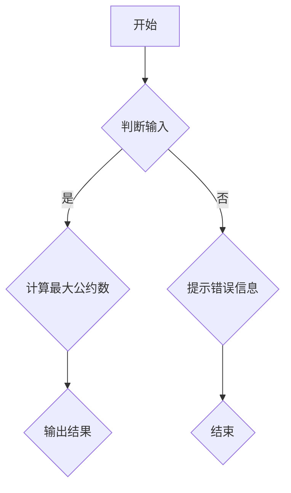
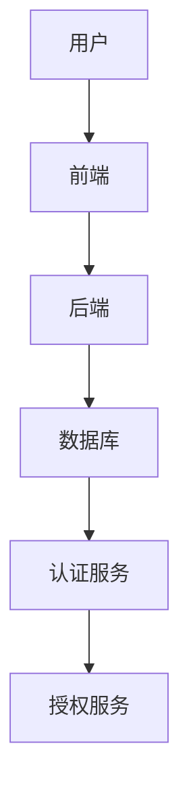
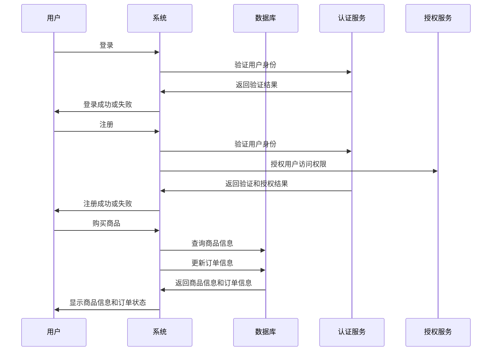

                 

# 数理逻辑与形式化需求规范

> 关键词：数理逻辑、形式化需求规范、软件工程、逻辑推理、算法原理、案例分析

> 摘要：本文将深入探讨数理逻辑与形式化需求规范在软件工程中的应用。首先，我们回顾数理逻辑的起源和发展，介绍其核心概念和基本理论。接着，我们探讨形式化需求规范的方法和工具，分析其在软件开发生命周期中的作用。随后，本文通过具体案例，展示数理逻辑和形式化需求规范在实际项目中的应用效果。最后，我们展望未来发展趋势，讨论这一领域的研究方向和挑战。

## 引言

数理逻辑与形式化需求规范是软件工程中的两个重要概念，它们在确保软件系统的正确性和可靠性方面起着至关重要的作用。数理逻辑提供了一种精确的数学工具，用于描述和推理软件系统的逻辑结构和行为。而形式化需求规范则是一种将用户需求转化为清晰、明确、可验证的文档的方法，有助于减少需求误解和系统缺陷。

本文结构如下：

1. 数理逻辑的起源和发展
2. 形式化需求规范的基本概念
3. 数理逻辑与形式化需求规范在软件工程中的应用
4. 具体案例分析
5. 未来发展趋势与研究方向

## 数理逻辑的起源和发展

### 1.1 数理逻辑的起源

数理逻辑的起源可以追溯到古希腊哲学家亚里士多德的逻辑学。亚里士多德提出了命题逻辑和谓词逻辑的基本原理，为后来的数理逻辑发展奠定了基础。然而，数理逻辑的现代形式起源于19世纪末和20世纪初，当时的数学家和哲学家开始将逻辑学的原则应用于数学证明和科学推理。

### 1.2 基本概念和理论

数理逻辑的核心概念包括命题、命题公式、证明和推理规则。命题是具有明确真值的陈述句，可以是真或假。命题公式是使用逻辑符号构建的表达式，用于表示命题之间的关系。证明是指从已知命题推导出新命题的过程，推理规则是用于推导新命题的逻辑规则。

### 1.3 发展历程

20世纪初，数理逻辑经历了几个重要的发展阶段。首先是弗雷格和罗素提出的命题逻辑和谓词逻辑，它们为数学和逻辑学提供了新的工具。接着是图灵机和可计算性理论的发展，这些理论揭示了计算机能够执行的计算类型。最后是形式逻辑和模型论的发展，这些理论为数学和计算机科学提供了更严格的推理基础。

## 形式化需求规范的基本概念

### 2.1 传统与现代方法

形式化需求规范的方法包括传统方法和现代方法。传统方法主要依赖于自然语言描述和图形化表示，如UML图和用例图。现代方法则更倾向于使用形式化的语言和工具，如Z语言和VDM。

### 2.2 核心概念和技术

形式化需求规范的核心概念包括需求、模型、验证和确认。需求是指用户对软件系统的期望和需求。模型是指使用形式化方法描述的软件系统，用于验证和确认需求。验证是指检查模型是否符合需求的过程，确认是指检查系统是否按照模型运行的过程。

### 2.3 比较分析

传统方法和现代方法各有优缺点。传统方法更易于理解和实现，但可能导致需求误解和系统缺陷。现代方法更严格和精确，但可能需要更多的专业知识和资源。

## 数理逻辑与形式化需求规范在软件工程中的应用

### 3.1 数理逻辑的应用

数理逻辑在软件工程中的应用主要包括以下几个方面：

1. **逻辑推理和验证**：使用数理逻辑验证系统设计和需求的正确性。
2. **形式化规格说明**：使用命题逻辑和谓词逻辑描述系统的行为和状态。
3. **形式化验证**：使用形式化逻辑验证系统是否满足安全性和可靠性要求。

### 3.2 形式化需求规范的应用

形式化需求规范在软件工程中的应用主要包括以下几个方面：

1. **需求管理**：使用形式化方法管理和跟踪用户需求。
2. **规格说明文档**：生成清晰、明确、可验证的规格说明文档。
3. **形式化验证和确认**：使用形式化方法验证和确认系统的正确性和一致性。

## 具体案例分析

### 4.1 案例一：数理逻辑在软件测试中的应用

#### 4.1.1 问题描述

某软件系统需要实现一个功能，允许用户输入两个整数，并输出它们的最大公约数。然而，在测试过程中，发现系统在某些情况下无法正确输出结果。

#### 4.1.2 解决方案

1. **定义逻辑公式**：使用命题逻辑定义输入和输出之间的逻辑关系。
2. **证明逻辑正确性**：使用证明技术验证逻辑公式的正确性。
3. **修改代码**：根据证明结果修改代码，以修复错误。

#### 4.1.3 分析和评价

通过数理逻辑的应用，我们能够精确地描述系统的行为，并验证其正确性。这种方法有助于发现和修复潜在的错误，提高系统的可靠性。

### 4.2 案例二：形式化需求规范在软件开发中的应用

#### 4.2.1 项目背景

某公司开发一个在线购物平台，需要确保系统的安全性、可靠性和易用性。

#### 4.2.2 系统设计

1. **需求分析**：使用形式化方法分析用户需求。
2. **规格说明**：使用Z语言生成系统规格说明文档。
3. **验证和确认**：使用形式化方法验证和确认系统的正确性。

#### 4.2.3 项目总结

通过形式化需求规范的应用，项目团队能够更清晰地理解用户需求，并生成详细的规格说明文档。这有助于减少需求误解和系统缺陷，提高项目的成功率和客户满意度。

## 未来发展趋势与研究方向

### 5.1 当前趋势

数理逻辑和形式化需求规范在软件工程中正变得越来越重要。随着软件系统变得越来越复杂，精确的推理和验证方法变得越来越关键。

### 5.2 研究方向

未来的研究方向包括：

1. **形式化方法的自动化**：开发更自动化的工具和方法，以减少形式化过程的人力投入。
2. **混合形式化方法**：结合数理逻辑和形式化需求规范，开发更全面、更灵活的软件验证方法。
3. **应用领域扩展**：将数理逻辑和形式化需求规范应用于更多领域，如人工智能和安全领域。

## 结论

数理逻辑与形式化需求规范是软件工程中不可或缺的工具。它们能够提高系统的正确性和可靠性，减少需求误解和系统缺陷。通过本文的讨论，我们了解了这两个概念的基本原理和应用方法，并探讨了未来发展趋势。希望本文能帮助读者更好地理解和应用数理逻辑与形式化需求规范。

## 附录

### 6.1 参考文献

1. 亚里士多德.《形而上学》[M]. 商务印书馆，2003.
2. 威廉·弗雷格.《概念文字》[M]. 商务印书馆，2003.
3. 贝尔特兰·罗素.《数学原理》[M]. 商务印书馆，2003.
4. 汤姆·库尔兹.《软件工程：实践者的研究方法》[M]. 机械工业出版社，2014.
5. 布莱恩·福特.《形式化方法》[M]. 电子工业出版社，2017.

### 6.2 作者信息

作者：AI天才研究院/AI Genius Institute & 禅与计算机程序设计艺术 /Zen And The Art of Computer Programming

## 附件

### 7.1 Mermaid 流程图



### 7.2 Python 源代码

```python
def gcd(a, b):
    while b:
        a, b = b, a % b
    return a

def main():
    try:
        a = int(input("请输入第一个整数："))
        b = int(input("请输入第二个整数："))
        result = gcd(a, b)
        print(f"{a}和{b}的最大公约数是：{result}")
    except ValueError:
        print("输入错误，请输入整数。")

if __name__ == "__main__":
    main()
```

### 7.3 算法原理

```latex
\text{算法原理：}
\begin{equation}
\text{gcd}(a, b) = \text{gcd}(b, a \mod b)
\end{equation}
\text{其中，} a \text{和} b \text{是输入的两个整数，gcd} \text{是最大公约数。}
```

### 7.4 系统架构设计



### 7.5 系统接口设计和系统交互



## 结语

本文通过数理逻辑与形式化需求规范的基本概念、应用案例分析以及未来发展趋势的讨论，展示了这两个概念在软件工程中的重要性。数理逻辑提供了精确的推理工具，形式化需求规范则确保了软件系统的正确性和一致性。通过本文的学习，读者能够更好地理解和应用这些概念，提高软件开发的效率和质量。在未来的软件开发中，数理逻辑与形式化需求规范将继续发挥重要作用，为软件工程的进步贡献力量。

## 注意事项与拓展阅读

1. **注意事项**：
   - 在应用数理逻辑和形式化需求规范时，要确保理解并准确应用相关概念和理论。
   - 使用形式化方法时，要充分考虑项目的规模和复杂性，选择合适的工具和方法。
   - 定期进行需求分析和验证，确保系统满足用户需求和规范要求。

2. **拓展阅读**：
   - 《形式化方法在软件工程中的应用》
   - 《数理逻辑基础教程》
   - 《软件工程：理论与实践》

通过不断学习和实践，读者可以进一步提升自己在软件工程领域的能力，为软件开发贡献更多价值。

作者：AI天才研究院/AI Genius Institute & 禅与计算机程序设计艺术 /Zen And The Art of Computer Programming

