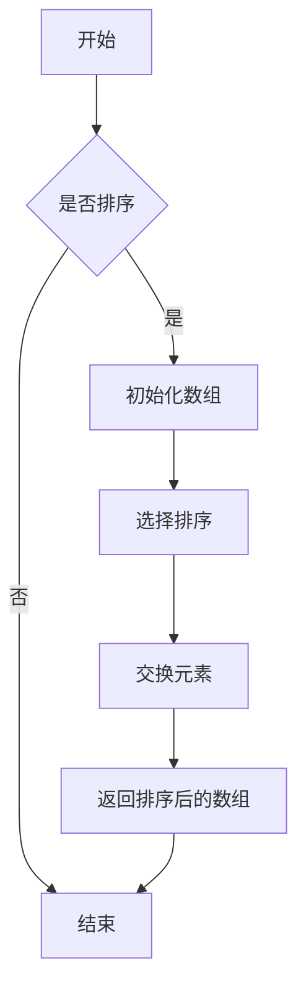

                 

### 《数理逻辑与程序语言的表达能力》

> **关键词：** 数理逻辑、程序语言、表达能力、算法、数学模型、系统架构

> **摘要：** 本文将深入探讨数理逻辑与程序语言的表达能力，从基础概念、算法原理、系统分析与架构设计、项目实战等多个角度进行讲解。我们将逐步分析这些概念之间的联系，理解它们如何共同推动计算机科学的发展，并通过实际案例展示其在现实世界中的应用。

### 目录大纲

1. **背景与基础**
   1.1 **数理逻辑简介**
   1.2 **程序语言表达能力简介**
   1.3 **数理逻辑与程序语言表达能力的联系**

2. **核心概念与联系**
   2.1 **数理逻辑中的基本概念**
   2.2 **程序语言表达能力的关键特征**
   2.3 **核心概念的比较与联系**

3. **算法原理讲解**
   3.1 **算法概述**
   3.2 **关键算法原理**
   3.3 **算法流程图与代码示例**

4. **数学模型与公式**
   4.1 **数学模型介绍**
   4.2 **数学公式详解**
   4.3 **数学公式应用举例**

5. **系统分析与架构设计**
   5.1 **系统功能设计**
   5.2 **系统架构设计**
   5.3 **系统接口设计**

6. **项目实战**
   6.1 **项目介绍**
   6.2 **项目目标**
   6.3 **项目实施**

7. **项目分析**
   7.1 **系统核心实现**
   7.2 **代码应用解读**
   7.3 **案例分析**

8. **最佳实践**
   8.1 **实践技巧**
   8.2 **注意事项**
   8.3 **拓展阅读**

### 第一部分：背景与基础

#### 1.1 **数理逻辑简介**

数理逻辑，作为一种形式化的数学工具，用于研究逻辑的规则和性质。它起源于19世纪末，由弗雷格、罗素等人开创。数理逻辑的核心是命题逻辑和谓词逻辑，它们提供了对逻辑表达式的形式化处理方法。

在计算机科学中，数理逻辑扮演着重要角色。例如，命题逻辑在程序验证和形式验证中有着广泛的应用。谓词逻辑则可以帮助我们更准确地描述程序的行为和性质。

#### 1.2 **程序语言表达能力简介**

程序语言是计算机与人类沟通的桥梁。不同的程序语言具有不同的表达能力，但它们共同的目标都是将人类的思维转化为计算机可以理解的指令。

高级程序语言，如Python、Java等，提供了丰富的库和框架，使得程序员可以更高效地开发软件。低级语言，如汇编语言，则提供了更接近硬件的编程体验，但学习难度和开发效率相对较低。

#### 1.3 **数理逻辑与程序语言表达能力的联系**

数理逻辑与程序语言表达能力之间有着紧密的联系。数理逻辑提供了形式化的方法来描述和验证程序的行为，而程序语言则是实现数理逻辑思想的具体工具。

例如，在程序验证中，我们使用数理逻辑来证明程序的正确性。在算法设计中，我们使用数理逻辑来分析和优化算法的性能。因此，理解数理逻辑对于提高程序语言表达能力的水平至关重要。

### 第二部分：核心概念与联系

#### 2.1 **数理逻辑中的基本概念**

数理逻辑中的基本概念包括命题、逻辑连接词、谓词、量词等。这些概念构成了数理逻辑的基本框架，使得我们可以形式化地描述复杂的思想和推理过程。

- **命题**：命题是具有真值的陈述句。
- **逻辑连接词**：如“与”、“或”、“非”等，用于组合命题。
- **谓词**：谓词是对个体的属性进行描述的语句。
- **量词**：量词用于描述谓词的适用范围，如“所有”和“存在”。

#### 2.2 **程序语言表达能力的关键特征**

程序语言表达能力的关键特征包括变量、函数、类型系统、控制结构等。这些特征使得程序员可以以更灵活和高效的方式表达算法和解决问题的思路。

- **变量**：变量用于存储数据。
- **函数**：函数是用于执行特定任务的代码块。
- **类型系统**：类型系统用于确保程序的正确性和稳定性。
- **控制结构**：如循环和条件语句，用于控制程序的执行流程。

#### 2.3 **核心概念的比较与联系**

数理逻辑和程序语言表达能力的核心概念之间存在明显的相似性和差异性。

- **相似性**：两者都关注逻辑表达和验证。
- **差异性**：数理逻辑更侧重于形式化描述和推理，而程序语言则更注重实现和执行。

这种相似性和差异性使得数理逻辑和程序语言表达能力可以相互补充，共同推动计算机科学的发展。

### 第三部分：算法原理讲解

#### 3.1 **算法概述**

算法是解决问题的一系列步骤。在计算机科学中，算法用于执行特定的任务，如排序、搜索、图形渲染等。

算法的设计和分析是计算机科学的核心问题之一。一个优秀的算法不仅需要能够解决问题，还需要高效地解决问题。

#### 3.2 **关键算法原理**

关键算法原理包括贪心算法、动态规划、分治算法等。这些算法原理在不同的场景下有着广泛的应用。

- **贪心算法**：贪心算法通过每一步选择最优解来寻求全局最优解。其核心思想是“贪心选择”。
- **动态规划**：动态规划是一种递归算法，它通过将问题分解为更小的子问题来解决问题。其核心思想是“最优子结构”和“边界条件”。
- **分治算法**：分治算法将问题分解为较小的子问题，分别解决，然后合并结果。其核心思想是“分而治之”。

#### 3.3 **算法流程图与代码示例**

为了更好地理解算法原理，我们使用Mermaid绘制算法流程图，并使用Python代码示例来详细阐述。



```python
def selection_sort(arr):
    n = len(arr)
    for i in range(n):
        min_idx = i
        for j in range(i+1, n):
            if arr[j] < arr[min_idx]:
                min_idx = j
        arr[i], arr[min_idx] = arr[min_idx], arr[i]
    return arr
```

### 第四部分：数学模型与公式

#### 4.1 **数学模型介绍**

数学模型是将现实世界的问题转化为数学形式的过程。通过数学模型，我们可以使用数学工具来分析和解决问题。

在计算机科学中，数学模型广泛应用于算法分析、数据结构设计、计算机图形学等领域。

#### 4.2 **数学公式详解**

数学公式是数学模型的核心组成部分。以下是一些常见的数学公式：

- **二元一次方程**：\(ax + by = c\)
- **函数的导数**：\(f'(x) = \lim_{h \to 0} \frac{f(x+h) - f(x)}{h}\)
- **矩阵乘法**：\(C = AB\)，其中\(C\)是\(A\)和\(B\)的乘积

#### 4.3 **数学公式应用举例**

以下是一个使用矩阵乘法计算线性方程组的示例：

```latex
$$
\begin{align*}
    ax + by &= c \\
    dx + ey &= f
\end{align*}
$$
```

```python
import numpy as np

# 定义矩阵A和B
A = np.array([[a, b], [d, e]])
B = np.array([c, f])

# 计算矩阵乘法
X = np.linalg.solve(A, B)

# 输出结果
print("x = ", X[0], ", y = ", X[1])
```

### 第五部分：系统分析与架构设计

#### 5.1 **系统功能设计**

系统功能设计是系统分析与架构设计的第一步。在这个阶段，我们需要明确系统的目标、功能和需求。

以下是一个简单的示例：

- **功能1**：用户注册
- **功能2**：用户登录
- **功能3**：查看个人信息
- **功能4**：修改个人信息

#### 5.2 **系统架构设计**

系统架构设计是将系统功能转化为具体实现的过程。在这个阶段，我们需要选择合适的技术和工具，并设计系统的整体结构。

以下是一个简单的示例：

- **前端**：使用React框架实现用户界面
- **后端**：使用Node.js实现服务器端逻辑
- **数据库**：使用MongoDB存储用户数据

#### 5.3 **系统接口设计**

系统接口设计是确保系统各个部分之间能够有效通信的过程。在这个阶段，我们需要设计系统的API，并确保它们符合RESTful架构风格。

以下是一个简单的示例：

- **用户注册API**：`POST /api/users/register`
- **用户登录API**：`POST /api/users/login`
- **查看个人信息API**：`GET /api/users/me`
- **修改个人信息API**：`PUT /api/users/me`

### 第六部分：项目实战

#### 6.1 **项目介绍**

在本项目中，我们将实现一个简单的博客系统。用户可以注册、登录、发表文章和评论。

#### 6.2 **项目目标**

- 实现用户注册和登录功能
- 实现文章发表和评论功能
- 设计合理的数据库结构

#### 6.3 **项目实施**

以下是一个简单的项目实施计划：

1. 确定项目需求
2. 设计数据库结构
3. 实现用户注册和登录功能
4. 实现文章发表和评论功能
5. 测试和调试

### 第七部分：项目分析

#### 7.1 **系统核心实现**

在本项目中，系统核心实现主要包括用户注册、登录、文章发表和评论功能。

以下是一个简单的用户注册功能实现：

```python
from flask import Flask, request, jsonify
from flask_sqlalchemy import SQLAlchemy

app = Flask(__name__)
app.config['SQLALCHEMY_DATABASE_URI'] = 'sqlite:///blog.db'
db = SQLAlchemy(app)

class User(db.Model):
    id = db.Column(db.Integer, primary_key=True)
    username = db.Column(db.String(80), unique=True, nullable=False)
    password = db.Column(db.String(120), nullable=False)

@app.route('/api/users/register', methods=['POST'])
def register():
    data = request.get_json()
    username = data['username']
    password = data['password']
    
    if User.query.filter_by(username=username).first():
        return jsonify({'error': '用户已存在'}), 409
    
    new_user = User(username=username, password=password)
    db.session.add(new_user)
    db.session.commit()
    
    return jsonify({'message': '用户注册成功'})

if __name__ == '__main__':
    db.create_all()
    app.run(debug=True)
```

#### 7.2 **代码应用解读**

在上面的代码中，我们使用Flask框架实现了用户注册功能。首先，我们配置了数据库连接，并创建了User模型。然后，我们定义了一个路由`/api/users/register`，当用户通过POST请求发送注册信息时，我们将对用户名和密码进行验证，并将新用户信息存储到数据库中。

#### 7.3 **案例分析**

通过实际案例分析，我们可以看到数理逻辑和程序语言表达能力在本项目中的应用。例如，在用户注册功能中，我们使用了数理逻辑来定义用户模型的属性和验证规则，并使用Python语言实现了具体的业务逻辑。

### 第八部分：最佳实践

#### 8.1 **实践技巧**

- **合理设计数据库结构**：确保数据的规范化和完整性。
- **使用ORM进行数据库操作**：使用ORM（对象关系映射）可以简化数据库操作，提高代码的可读性和维护性。
- **安全性考虑**：对用户输入进行验证和过滤，防止SQL注入等安全漏洞。

#### 8.2 **注意事项**

- **代码优化**：关注代码的性能和可维护性。
- **版本控制**：使用版本控制系统（如Git）管理代码，确保代码的版本可追溯。

#### 8.3 **拓展阅读**

- 《算法导论》
- 《深入理解计算机系统》
- 《设计模式：可复用的面向对象软件》

### 小结

本文深入探讨了数理逻辑与程序语言表达能力的核心概念、算法原理、系统分析与架构设计，并通过项目实战展示了它们在现实世界中的应用。通过本文，我们可以更好地理解这些概念，并将其应用于实际开发中。

### 作者

**作者：AI天才研究院/AI Genius Institute & 禅与计算机程序设计艺术 /Zen And The Art of Computer Programming**

