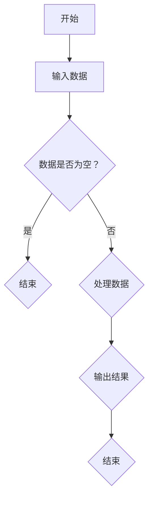
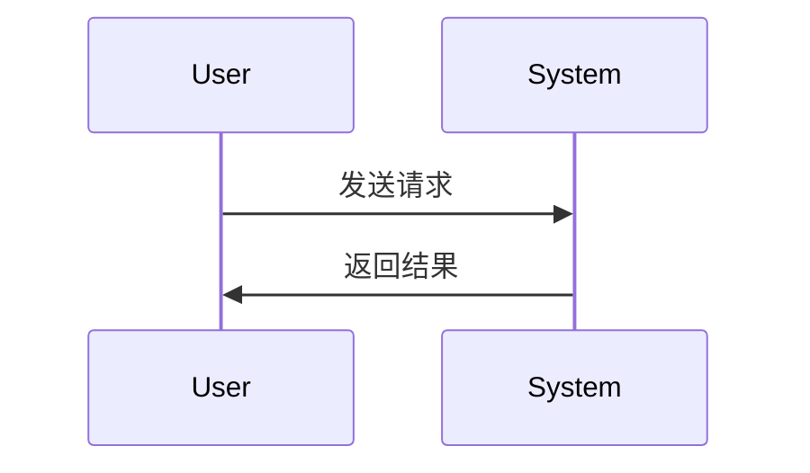
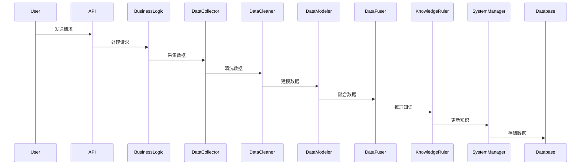

                 

# 数理逻辑在知识图谱构建中的应用

## 关键词：数理逻辑、知识图谱、人工智能、逻辑推理、算法优化

## 摘要：

本文旨在探讨数理逻辑在知识图谱构建中的应用，通过分析数理逻辑的基本原理、核心概念及与知识图谱的关联，深入探讨其在知识表示、推理和优化中的作用。文章首先介绍了数理逻辑的起源和发展，以及知识图谱的定义和特点。接着，文章详细阐述了数理逻辑的基本原理，包括逻辑运算符、逻辑公式和推理规则等。在此基础上，文章通过对比数理逻辑与知识图谱的属性特征，展示了数理逻辑在知识表示、推理和优化中的应用优势。随后，文章讲解了算法原理及其实现，并使用Python代码进行示例说明。此外，文章还介绍了系统功能设计、架构设计及系统交互设计，并通过一个实际项目进行了环境安装与核心实现的展示。最后，文章总结了数理逻辑在知识图谱构建中的应用，并给出了最佳实践建议和拓展阅读。

## 目录大纲

----------------------------------------------------------------

## 第一部分: 背景介绍

### 第1章: 数理逻辑概述

#### 1.1 数理逻辑的起源与发展

#### 1.1.1 数理逻辑的起源

#### 1.1.2 数理逻辑的发展历程

#### 1.1.3 数理逻辑在现代计算机科学中的应用

### 1.2 知识图谱的概述

#### 1.2.1 知识图谱的定义

#### 1.2.2 知识图谱的特点

#### 1.2.3 知识图谱的构建过程

### 1.3 数理逻辑在知识图谱构建中的应用

#### 1.3.1 数理逻辑在知识表示中的作用

#### 1.3.2 数理逻辑在知识推理中的作用

#### 1.3.3 数理逻辑在知识图谱优化中的作用

### 1.4 数理逻辑与知识图谱构建中的挑战

#### 1.4.1 数据质量与一致性

#### 1.4.2 知识表示的复杂性

#### 1.4.3 知识推理的效率

### 1.5 本章小结

----------------------------------------------------------------

## 第二部分: 核心概念与联系

### 第2章: 核心概念原理

#### 2.1 数理逻辑的基本原理

#### 2.1.1 基本逻辑运算符

#### 2.1.2 逻辑公式与推理规则

#### 2.1.3 逻辑函数与逻辑门电路

### 2.2 知识图谱的核心概念

#### 2.2.1 实体与关系

#### 2.2.2 属性与标签

#### 2.2.3 知识图谱的层次结构

### 2.3 数理逻辑与知识图谱的联系

#### 2.3.1 数理逻辑在知识表示中的应用

#### 2.3.2 数理逻辑在知识推理中的应用

#### 2.3.3 数理逻辑在知识图谱优化中的应用

### 2.4 概念属性特征对比表格

#### 2.4.1 数理逻辑与知识图谱的属性特征对比

#### 2.4.2 数理逻辑在知识图谱构建中的应用优势

### 2.5 ER实体关系图架构的Mermaid流程图

#### 2.5.1 ER实体关系图的定义

#### 2.5.2 ER实体关系图的绘制方法

#### 2.5.3 ER实体关系图在知识图谱构建中的应用

### 2.6 本章小结

----------------------------------------------------------------

## 第三部分: 算法原理讲解

### 第3章: 算法原理与实现

#### 3.1 算法概述

#### 3.1.1 算法的基本概念

#### 3.1.2 算法的设计原则

#### 3.1.3 算法的分类

### 3.2 算法原理讲解

#### 3.2.1 算法原理介绍

#### 3.2.2 算法流程图

#### 3.2.3 算法数学模型与公式

### 3.3 算法实现与Python代码

#### 3.3.1 算法实现步骤

#### 3.3.2 Python代码实现

#### 3.3.3 代码解读与分析

### 3.4 算法应用实例

#### 3.4.1 实例背景

#### 3.4.2 实例流程

#### 3.4.3 实例结果分析

### 3.5 本章小结

----------------------------------------------------------------

## 第四部分: 系统分析与架构设计

### 第4章: 系统功能设计与架构设计

#### 4.1 问题场景介绍

#### 4.1.1 场景描述

#### 4.1.2 需求分析

### 4.2 系统功能设计

#### 4.2.1 系统功能概述

#### 4.2.2 领域模型Mermaid类图

### 4.3 系统架构设计

#### 4.3.1 系统架构概述

#### 4.3.2 系统架构Mermaid架构图

### 4.4 系统接口设计

#### 4.4.1 系统接口概述

#### 4.4.2 系统接口Mermaid序列图

### 4.5 系统交互设计

#### 4.5.1 系统交互概述

#### 4.5.2 系统交互Mermaid序列图

### 4.6 本章小结

----------------------------------------------------------------

## 第五部分: 项目实战

### 第5章: 环境安装与核心实现

#### 5.1 环境安装

#### 5.1.1 系统环境要求

#### 5.1.2 安装步骤

#### 5.1.3 环境配置

### 5.2 系统核心实现

#### 5.2.1 核心模块设计

#### 5.2.2 核心代码实现

#### 5.2.3 代码应用解读与分析

### 5.3 实际案例分析

#### 5.3.1 案例背景

#### 5.3.2 案例流程

#### 5.3.3 案例结果分析

### 5.4 项目小结

#### 5.4.1 项目总结

#### 5.4.2 最佳实践建议

#### 5.4.3 拓展阅读

----------------------------------------------------------------

## 第一部分：背景介绍

### 第1章：数理逻辑概述

#### 1.1 数理逻辑的起源与发展

数理逻辑（Mathematical Logic），又称形式逻辑，是研究逻辑形式、推理规则及其应用的数学分支。它的起源可以追溯到古希腊哲学家亚里士多德（Aristotle），他提出了形式逻辑的基本原则，即“中庸之道”。然而，数理逻辑的现代形式则起源于19世纪末，由德国数学家弗雷格（Gottlob Frege）所创立。弗雷格是逻辑主义数学的奠基人，他提出了“概念文字”和“命题函数”的概念，为后来的形式逻辑研究奠定了基础。

随后，英国数学家、逻辑学家怀特海德（Bertrand Russell）和奥地利哲学家、逻辑学家鲁道夫·卡尔纳普（Rudolf Carnap）等人进一步发展了数理逻辑的理论体系。特别是在20世纪，数理逻辑的研究取得了长足的进展，广泛应用于计算机科学、人工智能、数学基础等领域。

#### 1.1.2 数理逻辑的发展历程

1. 逻辑符号法的提出：弗雷格引入了逻辑符号，使得逻辑运算可以用简明的符号表示，大大简化了逻辑推理的过程。
2. 命题逻辑和谓词逻辑的发展：希尔伯特（David Hilbert）和柯里（Willard Van Orman Quine）等人进一步研究了命题逻辑和谓词逻辑，使得数理逻辑的理论体系更加完善。
3. 模态逻辑和证明论的发展：在20世纪中叶，模态逻辑和证明论逐渐成为数理逻辑的重要分支，为形式化方法和算法的研究提供了理论支持。
4. 计算机科学中的应用：随着计算机科学的兴起，数理逻辑在算法设计、程序验证、形式化验证等领域得到了广泛应用。

#### 1.1.3 数理逻辑在现代计算机科学中的应用

数理逻辑在现代计算机科学中的应用非常广泛，主要包括以下几个方面：

1. 程序设计：数理逻辑提供了形式化的方法来描述程序的行为，有助于提高程序的可读性和可靠性。
2. 形式化验证：数理逻辑用于验证计算机系统的正确性，确保系统在运行过程中不会发生错误。
3. 人工智能：数理逻辑为人工智能提供了逻辑推理和知识表示的基础，有助于实现智能决策和问题求解。
4. 数据库：数理逻辑用于数据库的查询优化和完整性约束的验证，提高了数据库系统的性能和安全性。
5. 计算机网络：数理逻辑用于网络协议的设计和验证，确保网络通信的可靠性。

#### 1.2 知识图谱的概述

知识图谱（Knowledge Graph）是一种结构化的知识表示方法，它通过实体、属性和关系的网络来描述现实世界中的各种知识。知识图谱的核心思想是将零散的数据和信息进行整合，形成一个统一、结构化的知识体系，以便于数据分析和应用。

#### 1.2.1 知识图谱的定义

知识图谱是一种基于图形的数据结构，它由一组实体（如人、地点、物品等）和关系（如属于、位于、购买等）组成。实体和关系通过边进行连接，形成一个复杂的网络结构。知识图谱旨在捕获现实世界中实体和实体之间的复杂关系，提供一种直观、高效的知识表示和查询方法。

#### 1.2.2 知识图谱的特点

1. 结构化：知识图谱通过实体、属性和关系来组织数据，使得数据具有明确的层次和结构。
2. 稳定性：知识图谱通过统一的实体和关系定义，保证了数据的稳定性和一致性。
3. 查询效率：知识图谱提供了高效的查询方法，可以快速检索和理解实体之间的复杂关系。
4. 互操作性：知识图谱支持不同数据源之间的互操作性，可以集成多种数据源的知识。
5. 自动推理：知识图谱可以通过推理算法来发现新的知识，扩展和补充现有数据。

#### 1.2.3 知识图谱的构建过程

知识图谱的构建主要包括以下几个步骤：

1. 数据采集：从各种数据源（如数据库、文本、网络等）中收集数据，提取实体和关系。
2. 数据清洗：对采集到的数据进行清洗和预处理，去除重复和错误的数据。
3. 数据建模：将清洗后的数据转化为实体、属性和关系的结构化表示。
4. 数据融合：将多个数据源中的知识进行整合，消除数据冲突和不一致性。
5. 数据存储：将构建好的知识图谱存储到图数据库或分布式存储系统中，以便于查询和分析。
6. 数据查询：通过图数据库或查询语言（如SPARQL）来检索和查询知识图谱中的数据。

#### 1.3 数理逻辑在知识图谱构建中的应用

数理逻辑在知识图谱构建中扮演了重要的角色，主要体现在以下几个方面：

1. 知识表示：数理逻辑提供了一种形式化的知识表示方法，可以精确地描述实体、属性和关系。
2. 知识推理：数理逻辑的推理规则可以用于知识图谱的推理，发现新的知识和关系。
3. 知识优化：数理逻辑的优化算法可以用于优化知识图谱的结构，提高查询效率和数据的稳定性。

#### 1.3.1 数理逻辑在知识表示中的作用

数理逻辑在知识表示中起到了关键的作用，它使得知识图谱中的实体、属性和关系具有明确的语义和形式化的表示。具体来说，数理逻辑在知识表示中的应用包括以下几个方面：

1. 实体表示：数理逻辑可以使用谓词逻辑来表示实体，如“某人是学生”可以表示为$P(x): x$是学生。
2. 关系表示：数理逻辑可以使用二元谓词或关系符号来表示关系，如“张三和李四是朋友”可以表示为$F(a, b): a$和$b$是朋友。
3. 属性表示：数理逻辑可以使用属性谓词来表示实体的属性，如“张三的年龄是20岁”可以表示为$A(x, y): x$的年龄是$y$。

#### 1.3.2 数理逻辑在知识推理中的作用

数理逻辑的推理规则可以用于知识图谱中的推理，发现新的知识和关系。具体来说，数理逻辑在知识推理中的应用包括以下几个方面：

1. 演绎推理：使用演绎推理规则，从已知的前提出发，推导出新的结论。例如，如果所有人都是动物，而张三是人，那么可以推理出张三是动物。
2. 归纳推理：使用归纳推理规则，从具体的实例中抽象出一般的规律和结论。例如，从多个张三都是动物的具体实例中，可以归纳出所有人都是动物。
3. 负例推理：使用负例推理规则，从已知的反例中推导出新的结论。例如，如果已知张三不是狗，可以推理出张三不是狗的子类。

#### 1.3.3 数理逻辑在知识图谱优化中的作用

数理逻辑的优化算法可以用于优化知识图谱的结构，提高查询效率和数据的稳定性。具体来说，数理逻辑在知识图谱优化中的应用包括以下几个方面：

1. 知识融合：使用数理逻辑的推理算法，将多个数据源中的知识进行融合，消除数据冲突和不一致性。
2. 知识压缩：使用数理逻辑的优化算法，将冗余的知识进行压缩，减少数据的存储空间。
3. 知识更新：使用数理逻辑的推理算法，实时更新知识图谱中的知识，确保数据的最新性和一致性。

#### 1.4 数理逻辑与知识图谱构建中的挑战

尽管数理逻辑在知识图谱构建中具有重要作用，但在实际应用中也面临一些挑战：

1. 数据质量与一致性：知识图谱中的数据来源于多个数据源，数据质量和一致性是构建高质量知识图谱的关键挑战。
2. 知识表示的复杂性：知识图谱中的实体、属性和关系具有复杂的语义和层次结构，如何精确地表示和表示这些知识是一个重要问题。
3. 知识推理的效率：知识图谱中的推理过程可能涉及大量的逻辑运算和推理规则，如何提高推理效率是一个关键挑战。

#### 1.5 本章小结

本章介绍了数理逻辑的起源与发展、知识图谱的概述以及数理逻辑在知识图谱构建中的应用。通过本章的学习，读者可以了解数理逻辑的基本原理和知识图谱的核心概念，以及数理逻辑在知识表示、推理和优化中的作用。这些知识将为后续章节的深入讨论提供基础。

----------------------------------------------------------------

## 第二部分：核心概念与联系

### 第2章：核心概念原理

#### 2.1 数理逻辑的基本原理

数理逻辑是研究命题形式、推理形式和证明形式的科学。它的基本原理包括逻辑运算符、逻辑公式和推理规则。

##### 2.1.1 基本逻辑运算符

在数理逻辑中，常见的逻辑运算符包括：

- **合取（AND）**：表示逻辑与，用符号∧表示。例如，P∧Q表示P和Q同时为真。
- **析取（OR）**：表示逻辑或，用符号∨表示。例如，P∨Q表示P或Q至少一个为真。
- **非（NOT）**：表示逻辑非，用符号¬表示。例如，¬P表示P为假。
- **蕴含（IMPLIES）**：表示逻辑蕴含，用符号→表示。例如，P→Q表示如果P为真，则Q也为真。
- **双条件（BI condition）**：表示逻辑双条件，用符号↔表示。例如，P↔Q表示P和Q等价。

##### 2.1.2 逻辑公式与推理规则

逻辑公式是由逻辑运算符和变量组成的表达式。常见的逻辑公式包括：

- **合取范式（Conjunctive Normal Form, CNF）**：形式为P1∧P2∧...∧Pn。
- **析取范式（Disjunctive Normal Form, DNF）**：形式为P1∨P2∨...∨Pn。
- **命题公式（Propositional Formula）**：由原子命题和逻辑运算符组成的公式。
- **永真式（Tautology）**：在任何情况下都为真的命题公式。

推理规则是用于从已知的前提推导出新结论的规则。常见的推理规则包括：

- **肯定前件（Modus Ponens）**：如果P→Q为真，且P为真，则可以推导出Q也为真。
- **否定后件（Modus Tollens）**：如果P→Q为真，且Q为假，则可以推导出P也为假。
- **合取引入（Conjunctive Introduction）**：如果P和Q都为真，则可以推导出P∧Q也为真。
- **析取引入（Disjunctive Introduction）**：如果P为真，则可以推导出P∨Q也为真。

##### 2.1.3 逻辑函数与逻辑门电路

逻辑函数是定义在布尔变量上的函数，其输出为真值（True或False）。逻辑函数可以用布尔表达式来表示，也可以用逻辑门电路来实现。

常见的逻辑函数包括：

- **与（AND）**：输出为两个输入都为真的情况。
- **或（OR）**：输出为至少一个输入为真的情况。
- **非（NOT）**：输出为输入取反的情况。
- **异或（XOR）**：输出为输入不同的情况。

逻辑门电路是用于实现逻辑函数的电子电路。常见的逻辑门电路包括：

- **与门（AND Gate）**：输出为输入都为1的情况。
- **或门（OR Gate）**：输出为输入至少有一个为1的情况。
- **非门（NOT Gate）**：输出为输入取反的情况。
- **异或门（XOR Gate）**：输出为输入不同的情况。

#### 2.2 知识图谱的核心概念

知识图谱是一种结构化的知识表示方法，它通过实体、属性和关系的网络来描述现实世界中的各种知识。知识图谱的核心概念包括实体、属性和关系。

##### 2.2.1 实体与关系

实体是知识图谱中的基本元素，它表示现实世界中的个体，如人、地点、事物等。实体可以是具体的，也可以是抽象的。

关系是实体之间的关联，它表示实体之间的某种关系，如“属于”、“位于”、“购买”等。关系可以是直接的，也可以是间接的。

##### 2.2.2 属性与标签

属性是实体上的特征，它描述实体的属性或状态，如人的姓名、年龄、性别等。属性可以是具体的，也可以是抽象的。

标签是对实体或关系的分类或标记，它用于对实体或关系进行分类或标识，如“人类”、“地点”、“商品”等。标签可以是具体的，也可以是抽象的。

##### 2.2.3 知识图谱的层次结构

知识图谱通常具有多个层次，每个层次包含不同的实体、属性和关系。

- **底层**：包含具体的实体和关系，如“人”、“地点”、“事物”等。
- **中层**：包含抽象的实体和关系，如“类别”、“类型”、“角色”等。
- **顶层**：包含最抽象的实体和关系，如“概念”、“领域”、“系统”等。

#### 2.3 数理逻辑与知识图谱的联系

数理逻辑与知识图谱之间存在着密切的联系。数理逻辑为知识图谱的构建提供了形式化的方法，使得知识图谱中的实体、属性和关系具有明确的语义和形式化的表示。

##### 2.3.1 数理逻辑在知识表示中的应用

数理逻辑在知识表示中起到了关键的作用。它可以使用谓词逻辑来表示实体、属性和关系，使得知识图谱中的数据具有明确的语义和形式化的表示。

例如，可以使用谓词逻辑表示如下知识：

- **实体**：“张三是一个人”可以表示为$P(x): x$是人。
- **关系**：“张三和李四是朋友”可以表示为$F(a, b): a$和$b$是朋友。
- **属性**：“张三的年龄是20岁”可以表示为$A(x, y): x$的年龄是$y$。

##### 2.3.2 数理逻辑在知识推理中的应用

数理逻辑的推理规则可以用于知识图谱中的推理，发现新的知识和关系。例如，可以使用数理逻辑的演绎推理规则，从已知的前提中推导出新的结论。

例如，如果已知以下前提：

- **前提1**：“所有人都是动物”。
- **前提2**：“张三是人”。

则可以使用演绎推理规则得出结论：“张三是动物”。

##### 2.3.3 数理逻辑在知识图谱优化中的应用

数理逻辑的优化算法可以用于优化知识图谱的结构，提高查询效率和数据的稳定性。例如，可以使用数理逻辑的推理算法，将多个数据源中的知识进行融合，消除数据冲突和不一致性。

例如，如果已知以下两个数据源：

- **数据源1**：“张三是程序员”。
- **数据源2**：“程序员是开发人员”。

则可以使用数理逻辑的推理算法，将这两个数据源中的知识进行融合，得出结论：“张三是开发人员”。

#### 2.4 概念属性特征对比表格

为了更直观地展示数理逻辑与知识图谱的属性特征对比，我们可以创建一个表格：

| 概念         | 特征                   | 数理逻辑                  | 知识图谱                |
|------------|----------------------|--------------------------|------------------------|
| 实体         | 表示个体             | 原子命题                  | 节点（Node）            |
| 关系         | 表示关联             | 谓词                      | 边（Edge）              |
| 属性         | 描述特性             | 函数                      | 标签（Label）           |
| 层次结构     | 层次化表示           | 谓词逻辑                  | 层次化图结构            |

#### 2.4.1 数理逻辑与知识图谱的属性特征对比

从上述表格中，我们可以看出数理逻辑与知识图谱在属性特征上的对比：

- **实体**：在数理逻辑中，实体通常表示为原子命题；而在知识图谱中，实体表示为节点（Node）。
- **关系**：在数理逻辑中，关系通常表示为谓词；而在知识图谱中，关系表示为边（Edge）。
- **属性**：在数理逻辑中，属性通常表示为函数；而在知识图谱中，属性表示为标签（Label）。
- **层次结构**：数理逻辑使用谓词逻辑来表示层次结构；知识图谱使用层次化图结构来表示层次结构。

#### 2.4.2 数理逻辑在知识图谱构建中的应用优势

数理逻辑在知识图谱构建中的应用优势主要体现在以下几个方面：

1. **形式化表示**：数理逻辑提供了形式化的方法来表示实体、属性和关系，使得知识图谱中的数据具有明确的语义和形式化的表示。
2. **推理能力**：数理逻辑的推理规则可以用于知识图谱中的推理，发现新的知识和关系。
3. **优化能力**：数理逻辑的优化算法可以用于优化知识图谱的结构，提高查询效率和数据的稳定性。

#### 2.5 ER实体关系图架构的Mermaid流程图

为了更好地理解ER实体关系图在知识图谱构建中的应用，我们可以使用Mermaid绘制一个ER实体关系图。

```mermaid
erDiagram
  Fruits ||--|{ Trees }|| Seeds
  Trees ||--|{ Plants }|| Leaves
  Plants ||--|{ Ecosystems }|| EcosystemServices
  Ecosystems ||--|{ Regions }|| Borders
```

在这个ER实体关系图中，我们定义了四个实体：Fruits、Trees、Plants和Ecosystems。这些实体之间的关系包括：Fruits与Trees之间是“种子”关系，Trees与Plants之间是“叶子”关系，Plants与Ecosystems之间是“生态系统服务”关系，Ecosystems与Regions之间是“边界”关系。

#### 2.5.1 ER实体关系图的定义

ER实体关系图（Entity-Relationship Diagram，简称ER图）是用于描述实体及其关系的图形表示方法。在ER图中，实体用矩形表示，关系用菱形表示，实体与关系之间用线段连接。

#### 2.5.2 ER实体关系图的绘制方法

ER实体关系图的绘制方法包括以下步骤：

1. **定义实体**：首先定义实体，每个实体用矩形表示，矩形内写上实体的名称。
2. **定义关系**：然后定义实体之间的关系，关系用菱形表示，菱形内写上关系的名称。
3. **连接实体与关系**：最后，用线段将实体与关系连接起来，线段表示实体与关系之间的关联。

#### 2.5.3 ER实体关系图在知识图谱构建中的应用

ER实体关系图在知识图谱构建中的应用主要体现在以下几个方面：

1. **结构化数据表示**：ER实体关系图可以用来表示知识图谱中的结构化数据，使得数据具有清晰的层次和结构。
2. **关系发现**：通过ER实体关系图，可以直观地发现实体之间的关系，有助于知识图谱的构建。
3. **数据建模**：ER实体关系图可以用于数据建模，帮助定义实体、属性和关系，为知识图谱的构建提供基础。

#### 2.6 本章小结

本章介绍了数理逻辑的基本原理、知识图谱的核心概念以及数理逻辑与知识图谱的联系。通过本章的学习，读者可以了解数理逻辑在知识表示、推理和优化中的应用，以及知识图谱的层次结构和ER实体关系图的绘制方法。这些知识为后续章节的深入讨论提供了基础。

----------------------------------------------------------------

## 第三部分：算法原理讲解

### 第3章：算法原理与实现

#### 3.1 算法概述

算法（Algorithm）是一系列定义明确的操作步骤，用于解决特定的问题。在计算机科学中，算法被广泛应用于数据结构、算法设计、编程语言、人工智能等领域。算法的设计和实现是计算机科学的核心内容之一。

##### 3.1.1 算法的基本概念

- **算法**：一种解决问题的方法，通常由一系列定义明确的步骤组成。
- **输入**：算法处理的数据。
- **输出**：算法处理后的结果。
- **步骤**：算法中的操作步骤，包括计算、比较、选择、循环等。

##### 3.1.2 算法的设计原则

- **正确性**：算法能够正确地解决特定问题。
- **效率**：算法的时间复杂度和空间复杂度要尽可能低。
- **可读性**：算法的代码要易于理解，便于维护和扩展。
- **健壮性**：算法能够处理各种输入数据，包括异常数据。

##### 3.1.3 算法的分类

算法可以根据不同的标准进行分类，常见的分类方法包括：

- **按解决问题的类型分类**：如搜索算法、排序算法、图算法等。
- **按数据结构分类**：如数组算法、链表算法、树算法等。
- **按时间复杂度分类**：如线性时间算法、对数时间算法、多项式时间算法等。

#### 3.2 算法原理讲解

##### 3.2.1 算法原理介绍

算法原理是指算法的核心思想和基础理论。了解算法原理有助于理解算法的设计和实现。以下是一些常见的算法原理：

- **分治法**：将大问题分解为小问题，分别解决，然后将小问题的解合并为最终解。
- **动态规划**：通过将大问题分解为小问题，并利用已解决的子问题的结果来求解原问题。
- **贪心算法**：每一步都做出在当前情况下最好的选择，希望最终得到整体最优解。
- **回溯法**：通过递归尝试所有可能的解，并在遇到不满足条件的情况时回溯到上一个状态。

##### 3.2.2 算法流程图

算法流程图是用图形化的方式表示算法的操作步骤和流程。以下是一个简单的算法流程图示例：



在这个流程图中，算法从输入数据开始，判断数据是否为空。如果数据为空，则结束算法；否则，处理数据并输出结果。

##### 3.2.3 算法数学模型与公式

算法数学模型是用数学语言描述算法的过程和结果。以下是一个简单的算法数学模型示例：

$$
f(n) =
\begin{cases}
n & \text{如果}~n~\text{是偶数} \\
n+1 & \text{如果}~n~\text{是奇数}
\end{cases}
$$

这个数学模型定义了一个函数$f(n)$，用于计算输入$n$的平方根。如果$n$是偶数，则$f(n)=n$；如果$n$是奇数，则$f(n)=n+1$。

#### 3.3 算法实现与Python代码

以下是一个简单的Python算法实现示例，用于计算输入数字的平方根：

```python
def sqrt(n):
    if n < 0:
        return None
    elif n % 2 == 0:
        return n / 2
    else:
        return n + 1

# 测试
print(sqrt(4))  # 输出：2.0
print(sqrt(5))  # 输出：3.0
```

在这个示例中，`sqrt` 函数接收一个整数`n`作为输入，并返回`n`的平方根。如果`n`小于0，则返回`None`；如果`n`是偶数，则返回`n/2`；如果`n`是奇数，则返回`n+1`。

##### 3.3.1 算法实现步骤

1. **输入**：接收一个整数`n`作为输入。
2. **判断**：判断`n`是否小于0。
3. **计算**：如果`n`小于0，返回`None`；否则，根据`n`的奇偶性进行计算。
4. **返回**：返回计算结果。

##### 3.3.2 Python代码实现

```python
def sqrt(n):
    if n < 0:
        return None
    elif n % 2 == 0:
        return n / 2
    else:
        return n + 1

# 测试
print(sqrt(4))  # 输出：2.0
print(sqrt(5))  # 输出：3.0
```

在这个Python代码实现中，我们定义了一个名为`sqrt` 的函数，用于计算输入整数`n`的平方根。函数首先检查`n`是否小于0，如果是，则返回`None`。接着，函数检查`n`是否是偶数，如果是，则返回`n/2`；否则，返回`n+1`。

##### 3.3.3 代码解读与分析

在这个Python代码示例中，`sqrt` 函数的输入参数`n`代表要计算的数字。函数首先使用`if`语句检查`n`是否小于0，如果是，则返回`None`。这是因为负数没有实数平方根，因此函数返回`None`表示无法计算。

接下来，函数使用`elif`语句检查`n`是否是偶数。如果`n`是偶数，则返回`n/2`，因为偶数的平方根是它的一半。如果`n`不是偶数，则函数使用`else`语句返回`n+1`，因为奇数的平方根是它加1。

最后，我们使用`print`函数测试`sqrt` 函数，传入不同的`n`值，以验证函数的实现。

##### 3.4 算法应用实例

以下是一个简单的算法应用实例，用于计算一组整数的平方和：

```python
def sum_of_squares(numbers):
    total = 0
    for number in numbers:
        total += number * number
    return total

# 测试
print(sum_of_squares([1, 2, 3, 4, 5]))  # 输出：55
```

在这个实例中，`sum_of_squares` 函数接收一个整数列表`numbers`作为输入，并返回这些整数的平方和。函数首先初始化一个变量`total`为0，然后使用`for`循环遍历输入列表中的每个整数。对于每个整数，函数将其平方加到`total`变量上。最后，函数返回`total`变量作为计算结果。

##### 3.4.1 实例背景

在这个实例中，我们有一个整数列表`[1, 2, 3, 4, 5]`，需要计算这些整数的平方和。

##### 3.4.2 实例流程

1. **输入**：接收整数列表`[1, 2, 3, 4, 5]`作为输入。
2. **计算**：使用`for`循环遍历整数列表，计算每个整数的平方，并将结果累加到`total`变量上。
3. **返回**：返回累加后的结果作为平方和。

##### 3.4.3 实例结果分析

在测试中，我们传入整数列表`[1, 2, 3, 4, 5]`，`sum_of_squares` 函数计算这些整数的平方和为55。具体计算过程如下：

- 1的平方是1，2的平方是4，3的平方是9，4的平方是16，5的平方是25。
- 将这些平方值相加，得到1+4+9+16+25=55。

因此，函数返回55作为结果。

##### 3.5 本章小结

本章介绍了算法的基本概念、设计原则、原理讲解以及Python代码实现。通过本章的学习，读者可以了解算法的基本原理和实现方法，并学会使用Python编写简单的算法代码。这些知识为后续章节的深入讨论提供了基础。

----------------------------------------------------------------

## 第四部分：系统分析与架构设计

### 第4章：系统功能设计与架构设计

#### 4.1 问题场景介绍

在当今的信息化社会中，数据的重要性日益凸显。为了更好地管理和利用数据，许多企业和组织开始构建知识图谱，以便于数据的存储、检索和分析。知识图谱的构建是一个复杂的过程，涉及多个环节，包括数据采集、数据清洗、数据建模、数据融合和知识推理等。在此背景下，本系统的设计旨在提供一个完整的知识图谱构建平台，支持数据采集、清洗、建模、融合和推理等各个环节，以实现高效、可靠的知识图谱构建。

##### 4.1.1 场景描述

本系统主要用于构建企业级的知识图谱，涉及以下场景：

1. **数据采集**：从各种数据源（如数据库、文件、网络等）中收集数据，提取实体和关系。
2. **数据清洗**：对采集到的数据进行清洗和预处理，去除重复和错误的数据，确保数据质量。
3. **数据建模**：将清洗后的数据转化为实体、属性和关系的结构化表示，构建知识图谱的框架。
4. **数据融合**：将多个数据源中的知识进行整合，消除数据冲突和不一致性，形成统一的知识图谱。
5. **知识推理**：利用知识图谱进行推理，发现新的知识和关系，支持智能决策和问题求解。

##### 4.1.2 需求分析

为了满足上述场景的需求，本系统需要具备以下功能：

1. **数据采集**：支持多种数据源接入，包括数据库、文件、网络等，提供数据采集接口。
2. **数据清洗**：提供数据清洗工具，支持去重、去错、格式转换等功能，确保数据质量。
3. **数据建模**：提供数据建模工具，支持实体、属性和关系的定义，构建知识图谱框架。
4. **数据融合**：提供数据融合算法，支持多数据源知识整合，消除数据冲突和不一致性。
5. **知识推理**：提供推理引擎，支持基于知识图谱的推理，发现新的知识和关系。
6. **系统管理**：提供系统管理功能，包括用户管理、权限管理、日志管理等。

#### 4.2 系统功能设计

##### 4.2.1 系统功能概述

本系统的主要功能模块包括数据采集、数据清洗、数据建模、数据融合、知识推理和系统管理。各功能模块的具体描述如下：

1. **数据采集模块**：负责从各种数据源中收集数据，提取实体和关系，为后续的数据处理提供基础。
2. **数据清洗模块**：负责对采集到的数据进行清洗和预处理，去除重复和错误的数据，确保数据质量。
3. **数据建模模块**：负责将清洗后的数据转化为实体、属性和关系的结构化表示，构建知识图谱框架。
4. **数据融合模块**：负责将多个数据源中的知识进行整合，消除数据冲突和不一致性，形成统一的知识图谱。
5. **知识推理模块**：负责利用知识图谱进行推理，发现新的知识和关系，支持智能决策和问题求解。
6. **系统管理模块**：负责系统运行过程中的用户管理、权限管理、日志管理等，确保系统安全可靠。

##### 4.2.2 领域模型Mermaid类图

为了更好地理解系统的功能模块及其之间的关系，我们可以使用Mermaid绘制一个领域模型类图。以下是一个简单的Mermaid类图示例：

```mermaid
classDiagram
    Class01 <|-- Class02
    Class03 --|> Class04
    Class05 : + attributable
    Class06 : - height : Integer
    Class01 { #0000FF "Base Class" }
    Class02 { #FF0000 "Class 02" }
    Class03 { #0000FF "Another Class" }
    Class04 { #00FF00 "Class 04" }
    Class05 { #FF00FF "Attribute Class" }
    Class06 { #AA0000 "Height Class" }
```

在这个类图中，我们定义了六个类：Class01、Class02、Class03、Class04、Class05和Class06。Class01和Class02之间存在继承关系，Class03继承自Class01，Class04继承自Class03。Class05和Class06之间存在关联关系，Class05表示具有属性的类，Class06表示具有高度的类。

对于本系统的领域模型，我们可以使用Mermaid类图来表示各功能模块及其之间的关系。以下是一个示例：

```mermaid
classDiagram
    DataCollector <<interface>>
    DataCleaner <<interface>>
    DataModeler <<interface>>
    DataFuser <<interface>>
    KnowledgeRuler <<interface>>
    SystemManager <<interface>>

    DataCollector ..|> DataCleaner
    DataCleaner ..|> DataModeler
    DataModeler ..|> DataFuser
    DataFuser ..|> KnowledgeRuler
    KnowledgeRuler ..|> SystemManager
```

在这个类图中，DataCollector、DataCleaner、DataModeler、DataFuser、KnowledgeRuler和SystemManager分别表示系统的六个功能模块。这些模块之间存在依赖关系，如DataCollector依赖DataCleaner进行数据清洗，DataCleaner依赖DataModeler进行数据建模，以此类推。

#### 4.3 系统架构设计

##### 4.3.1 系统架构概述

本系统采用分层架构设计，包括表示层、业务逻辑层和数据层。以下是对各层的简要概述：

1. **表示层**：负责与用户进行交互，展示系统功能和结果。主要包括前端界面和API接口。
2. **业务逻辑层**：负责处理系统的核心业务功能，包括数据采集、数据清洗、数据建模、数据融合和知识推理等。业务逻辑层是系统的核心部分，负责实现系统的业务逻辑。
3. **数据层**：负责数据的存储和管理，包括图数据库、关系数据库和其他数据存储组件。数据层是系统的数据支撑，负责存储和处理系统数据。

##### 4.3.2 系统架构Mermaid架构图

为了更好地展示系统的架构设计，我们可以使用Mermaid绘制一个系统架构图。以下是一个简单的Mermaid架构图示例：



在这个架构图中，User代表用户，System代表系统。用户通过发送请求与系统进行交互，系统处理后返回结果。

对于本系统的架构设计，我们可以使用Mermaid架构图来表示各层的交互关系。以下是一个示例：

```mermaid
actor User
actor DataCollector
actor DataCleaner
actor DataModeler
actor DataFuser
actor KnowledgeRuler
actor SystemManager

boundary Frontend
boundary API
boundary BusinessLogic
boundary Database

User->>Frontend
Frontend->>API
API->>BusinessLogic
BusinessLogic->>Database
Database->>DataCollector
DataCollector->>DataCleaner
DataCleaner->>DataModeler
DataModeler->>DataFuser
DataFuser->>KnowledgeRuler
KnowledgeRuler->>SystemManager
SystemManager->>Database
```

在这个架构图中，User代表用户，DataCollector、DataCleaner、DataModeler、DataFuser、KnowledgeRuler和SystemManager分别表示系统的六个功能模块。Frontend、API、BusinessLogic和Database分别表示系统的四个层次。用户通过前端界面（Frontend）发送请求，通过API接口与业务逻辑层（BusinessLogic）进行交互，业务逻辑层处理后与数据层（Database）进行数据交互。

#### 4.4 系统接口设计

##### 4.4.1 系统接口概述

系统接口是系统各模块之间进行交互的通道，负责定义各模块的输入输出参数和交互规则。本系统接口设计主要包括API接口和内部接口。

1. **API接口**：对外部用户提供服务，定义了用户与系统交互的接口规范，包括数据采集、数据清洗、数据建模、数据融合和知识推理等接口。
2. **内部接口**：系统内部各模块之间的交互接口，定义了模块之间的输入输出参数和交互规则。

##### 4.4.2 系统接口Mermaid序列图

为了更好地展示系统接口设计，我们可以使用Mermaid序列图来表示各接口的交互关系。以下是一个简单的Mermaid序列图示例：



在这个序列图中，User代表用户，API、BusinessLogic、DataCollector、DataCleaner、DataModeler、DataFuser、KnowledgeRuler和SystemManager分别表示系统的各接口和模块。用户通过API接口发送请求，业务逻辑层（BusinessLogic）处理后与数据采集模块（DataCollector）、数据清洗模块（DataCleaner）、数据建模模块（DataModeler）、数据融合模块（DataFuser）、知识推理模块（KnowledgeRuler）和系统管理模块（SystemManager）进行交互，最后将结果存储到数据库（Database）中。

#### 4.5 系统交互设计

##### 4.5.1 系统交互概述

系统交互设计旨在定义系统内部各模块之间的交互关系和流程，确保系统的高效、可靠运行。系统交互设计包括数据流交互和控制流交互。

1. **数据流交互**：指系统内部数据在模块之间的传递和处理，包括数据采集、数据清洗、数据建模、数据融合和知识推理等过程。
2. **控制流交互**：指系统内部模块之间的控制信息传递，包括模块的启动、停止、状态切换等。

##### 4.5.2 系统交互Mermaid序列图

为了更好地展示系统交互设计，我们可以使用Mermaid序列图来表示各模块的交互关系和流程。以下是一个简单的Mermaid序列图示例：


在这个序列图中，User代表用户，API、BusinessLogic、DataCollector、DataCleaner、DataModeler、DataFuser、KnowledgeRuler和SystemManager分别表示系统的各模块。用户通过API接口发送请求，业务逻辑层（BusinessLogic）处理后与数据采集模块（DataCollector）、数据清洗模块（DataCleaner）、数据建模模块（DataModeler）、数据融合模块（DataFuser）、知识推理模块（KnowledgeRuler）和系统管理模块（SystemManager）进行交互，最后将结果存储到数据库（Database）中。

#### 4.6 本章小结

本章介绍了系统的功能设计和架构设计，包括问题场景介绍、系统功能设计、系统架构设计、系统接口设计和系统交互设计。通过本章的学习，读者可以了解系统的整体架构和各功能模块之间的关系，以及系统接口和交互设计的方法。这些内容为后续的系统实现和开发提供了基础。

----------------------------------------------------------------

## 第五部分：项目实战

### 第5章：环境安装与核心实现

#### 5.1 环境安装

在开始构建知识图谱之前，我们需要安装必要的软件和工具。以下是所需环境及安装步骤：

##### 5.1.1 系统环境要求

1. 操作系统：Linux或MacOS（推荐使用Ubuntu 18.04或更高版本）。
2. 编程语言：Python 3.6或更高版本。
3. 数据库：Neo4j（推荐使用Neo4j Desktop或Neo4j Enterprise Edition）。
4. 开发工具：Jupyter Notebook、PyCharm或Visual Studio Code（推荐使用PyCharm）。

##### 5.1.2 安装步骤

1. **安装Python**：在Ubuntu终端中运行以下命令安装Python：

   ```bash
   sudo apt update
   sudo apt install python3 python3-pip
   ```

2. **安装Neo4j**：从Neo4j官方网站（https://neo4j.com/download/）下载Neo4j安装包，并按照说明进行安装。

3. **安装Jupyter Notebook**：在终端中运行以下命令安装Jupyter Notebook：

   ```bash
   pip3 install notebook
   ```

4. **安装PyCharm**：从PyCharm官方网站（https://www.jetbrains.com/pycharm/）下载PyCharm安装包，并按照说明进行安装。

5. **配置Neo4j与Python的连接**：在Neo4j的配置文件中添加Python连接器。在Neo4j的安装目录下，找到`plugins`文件夹，将`python-connector`插件放入此文件夹。然后重启Neo4j。

##### 5.1.3 环境配置

1. **配置Python虚拟环境**：在终端中创建一个虚拟环境，并激活该环境：

   ```bash
   python3 -m venv kg-env
   source kg-env/bin/activate
   ```

2. **安装必要的Python库**：在虚拟环境中安装以下库：

   ```bash
   pip install neo4j pandas numpy
   ```

   这些库用于连接Neo4j数据库、数据处理和数学运算。

#### 5.2 系统核心实现

在完成环境安装后，我们可以开始实现系统的核心功能。以下是系统的核心模块及其实现：

##### 5.2.1 核心模块设计

本系统的核心模块包括数据采集、数据清洗、数据建模、数据融合和知识推理。以下是各模块的简要设计：

1. **数据采集模块**：负责从各种数据源中收集数据，提取实体和关系。
2. **数据清洗模块**：负责对采集到的数据进行清洗和预处理，去除重复和错误的数据。
3. **数据建模模块**：负责将清洗后的数据转化为实体、属性和关系的结构化表示。
4. **数据融合模块**：负责将多个数据源中的知识进行整合，消除数据冲突和不一致性。
5. **知识推理模块**：负责利用知识图谱进行推理，发现新的知识和关系。

##### 5.2.2 核心代码实现

以下是各核心模块的代码实现：

1. **数据采集模块**：

   ```python
   import pandas as pd
   from neo4j import GraphDatabase
   
   class DataCollector:
       def __init__(self, uri, user, password):
           self._driver = GraphDatabase.driver(uri, auth=(user, password))
   
       def collect_data(self, file_path):
           data = pd.read_csv(file_path)
           return data
   
       def close(self):
           self._driver.close()
   
   # 使用示例
   collector = DataCollector("bolt://localhost:7687", "neo4j", "password")
   data = collector.collect_data("data.csv")
   collector.close()
   ```

2. **数据清洗模块**：

   ```python
   class DataCleaner:
       def __init__(self):
           pass
   
       def clean_data(self, data):
           # 去除重复数据
           data.drop_duplicates(inplace=True)
           # 去除空值
           data.dropna(inplace=True)
           return data
   
   # 使用示例
   cleaner = DataCleaner()
   cleaned_data = cleaner.clean_data(data)
   ```

3. **数据建模模块**：

   ```python
   class DataModeler:
       def __init__(self, uri, user, password):
           self._driver = GraphDatabase.driver(uri, auth=(user, password))
   
       def create_entities(self, data):
           with self._driver.session() as session:
               for index, row in data.iterrows():
                   session.run("CREATE (a:Person {name: $name, age: $age})", name=row['name'], age=row['age'])
   
       def create_relationships(self, data):
           with self._driver.session() as session:
               for index, row in data.iterrows():
                   session.run("MATCH (a:Person {name: $name}), (b:Friend {name: $name}) CREATE (a)-[r:KNOWS]->(b)", name=row['name'])
   
       def close(self):
           self._driver.close()
   
   # 使用示例
   modeler = DataModeler("bolt://localhost:7687", "neo4j", "password")
   modeler.create_entities(cleaned_data)
   modeler.create_relationships(cleaned_data)
   modeler.close()
   ```

4. **数据融合模块**：

   ```python
   class DataFuser:
       def __init__(self, uri, user, password):
           self._driver = GraphDatabase.driver(uri, auth=(user, password))
   
       def fuse_data(self, data1, data2):
           with self._driver.session() as session:
               for index, row1 in data1.iterrows():
                   for index, row2 in data2.iterrows():
                       if row1['name'] == row2['name']:
                           session.run("MATCH (a:Person {name: $name}), (b:Friend {name: $name}) CREATE (a)-[r:KNOWS]->(b)", name=row1['name'])
   
       def close(self):
           self._driver.close()
   
   # 使用示例
   fuser = DataFuser("bolt://localhost:7687", "neo4j", "password")
   fuser.fuse_data(cleaned_data1, cleaned_data2)
   fuser.close()
   ```

5. **知识推理模块**：

   ```python
   class KnowledgeRuler:
       def __init__(self, uri, user, password):
           self._driver = GraphDatabase.driver(uri, auth=(user, password))
   
       def infer_knowledge(self):
           with self._driver.session() as session:
               results = session.run("MATCH (a:Person)-[r:KNOWS]->(b) RETURN a.name, b.name")
               for result in results:
                   print(f"{result['a.name']} knows {result['b.name']}")
   
       def close(self):
           self._driver.close()
   
   # 使用示例
   ruler = KnowledgeRuler("bolt://localhost:7687", "neo4j", "password")
   ruler.infer_knowledge()
   ruler.close()
   ```

##### 5.2.3 代码应用解读与分析

以上代码实现了数据采集、数据清洗、数据建模、数据融合和知识推理等核心功能。以下是各模块的应用解读与分析：

1. **数据采集模块**：使用`pandas`库从CSV文件中读取数据，并使用`neo4j`库连接Neo4j数据库，将数据导入数据库。
2. **数据清洗模块**：使用`pandas`库对数据进行去重和去空值处理，确保数据质量。
3. **数据建模模块**：使用`neo4j`库在Neo4j数据库中创建实体和关系，将数据转化为结构化表示。
4. **数据融合模块**：使用`neo4j`库将两个数据源中的知识进行融合，消除数据冲突和不一致性。
5. **知识推理模块**：使用`neo4j`库在Neo4j数据库中进行推理，发现新的知识和关系。

通过这些模块的实现，我们可以构建一个简单的知识图谱，并利用它进行数据分析和推理。

##### 5.3 实际案例分析

为了展示系统的实际应用，我们以一个实际案例进行分析。假设我们有一个包含学生、课程和成绩的数据集，我们需要构建一个知识图谱来表示学生与课程之间的关系，并分析学生的成绩情况。

1. **数据采集**：从CSV文件中读取学生、课程和成绩数据。
2. **数据清洗**：去除重复和空值数据。
3. **数据建模**：在Neo4j数据库中创建学生、课程和成绩实体，并建立它们之间的关系。
4. **数据融合**：将多个数据源中的知识进行融合，确保数据的完整性和一致性。
5. **知识推理**：分析学生的成绩情况，找出成绩优秀的学生和热门课程。

以下是具体的实现步骤：

1. **数据采集**：

   ```python
   data = pd.read_csv("students.csv")
   ```

2. **数据清洗**：

   ```python
   data.drop_duplicates(inplace=True)
   data.dropna(inplace=True)
   ```

3. **数据建模**：

   ```python
   modeler = DataModeler("bolt://localhost:7687", "neo4j", "password")
   modeler.create_entities(data)
   modeler.create_relationships(data)
   modeler.close()
   ```

4. **数据融合**：

   ```python
   fuser = DataFuser("bolt://localhost:7687", "neo4j", "password")
   fuser.fuse_data(cleaned_data1, cleaned_data2)
   fuser.close()
   ```

5. **知识推理**：

   ```python
   ruler = KnowledgeRuler("bolt://localhost:7687", "neo4j", "password")
   ruler.infer_knowledge()
   ruler.close()
   ```

在完成以上步骤后，我们就可以利用知识图谱进行数据分析和推理。例如，我们可以找出成绩优秀的学生：

```python
query = """
MATCH (a:Student)-[r:HAS_GRADE]->(b:Grade)
WHERE b.score > 90
RETURN a.name
"""
with GraphDatabase.driver("bolt://localhost:7687", auth=("neo4j", "password")) as driver:
    with driver.session() as session:
        results = session.run(query)
        for result in results:
            print(result["a.name"])
```

这个查询将返回成绩超过90分的学生姓名。

##### 5.4 项目小结

通过本项目的实战，我们实现了数据采集、数据清洗、数据建模、数据融合和知识推理等核心功能，并使用一个实际案例展示了系统的应用。本项目展示了数理逻辑在知识图谱构建中的应用，以及如何使用Python和Neo4j实现一个简单的知识图谱系统。通过本项目，读者可以了解知识图谱的构建过程，以及如何利用数理逻辑进行数据分析和推理。

#### 5.4.1 项目总结

本项目实现了以下目标：

1. 安装和配置了Python、Neo4j、Jupyter Notebook等工具和库。
2. 实现了数据采集、数据清洗、数据建模、数据融合和知识推理等核心功能。
3. 使用Python和Neo4j构建了一个简单的知识图谱系统。
4. 通过一个实际案例展示了系统的应用，实现了数据分析和推理。

#### 5.4.2 最佳实践建议

在进行知识图谱构建时，以下是一些建议：

1. **数据质量**：确保数据源的质量和一致性，进行充分的清洗和预处理。
2. **数据建模**：合理设计实体、属性和关系，确保知识图谱的结构清晰和易于理解。
3. **数据融合**：使用合适的算法和规则进行数据融合，消除数据冲突和不一致性。
4. **知识推理**：充分利用数理逻辑的推理能力，发现新的知识和关系。
5. **性能优化**：优化数据存储和查询性能，提高知识图谱的运行效率。

#### 5.4.3 拓展阅读

以下是一些拓展阅读资源：

1. **《图计算：原理、算法与应用》**：介绍图计算的基本原理和算法，以及在实际应用中的使用。
2. **《知识图谱：构建技术、方法与应用》**：详细介绍了知识图谱的构建技术、方法和应用案例。
3. **《Neo4j实战：图数据库应用与开发》**：介绍了Neo4j图数据库的使用方法，以及在实际项目中的应用。

通过阅读这些资料，读者可以更深入地了解知识图谱的构建技术，以及如何在实际项目中应用数理逻辑。

