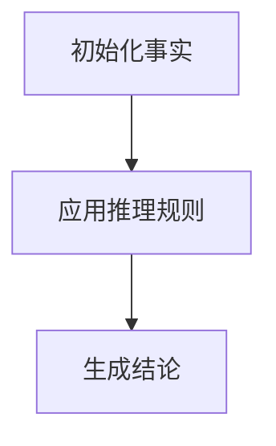
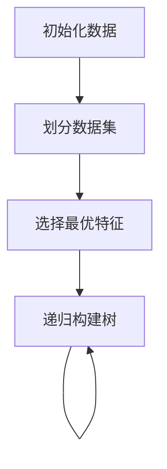
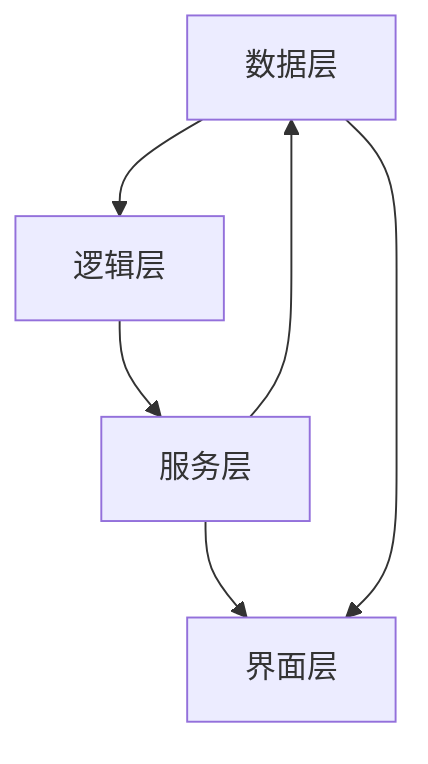
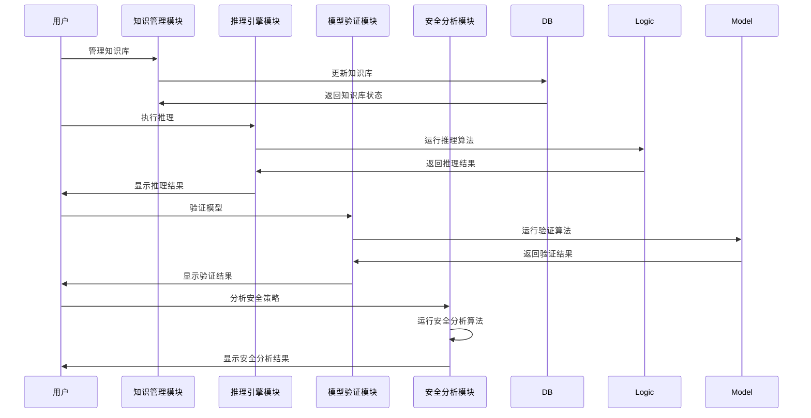

                 

### 文章标题

# 数理逻辑在知识表示与推理中的应用

数理逻辑作为计算机科学和人工智能领域的基础理论工具，在知识表示与推理中发挥着至关重要的作用。本文将深入探讨数理逻辑在知识表示与推理中的应用，通过系统性的分析和实例讲解，帮助读者理解数理逻辑的核心概念以及其实际应用价值。

## 关键词

- 数理逻辑
- 知识表示
- 推理
- 人工智能
- 计算机科学

## 摘要

本文首先介绍了数理逻辑的基本概念和历史背景，然后详细探讨了知识表示的方法和技术，以及推理的基本原理和算法。接着，文章展示了数理逻辑在人工智能领域中的实际应用，并通过具体的算法和案例进行了深入分析。最后，本文提出了数理逻辑在知识表示与推理中的挑战和未来发展方向，为相关研究和应用提供了有益的参考。

### 基本概念与历史背景

数理逻辑，又称符号逻辑，是一种用符号表示命题和推理规则的形式化逻辑系统。它起源于古希腊时期，但真正的发展始于19世纪末和20世纪初。著名的数学家乔治·坎特博里（George Cantor）和弗雷格（Gottlob Frege）为数学基础的研究奠定了基础。弗雷格的《概念符号》（Begriffsschrift）被认为是数理逻辑的奠基之作，而坎特博里的《数的概念》则进一步推动了逻辑在数学中的应用。

在20世纪初，数理逻辑的发展迎来了重要的里程碑。伯特兰·罗素（Bertrand Russell）和阿尔弗雷德·诺思·怀特海德（Alfred North Whitehead）合著的《数学原理》（Principia Mathematica）系统地阐述了数学的公理化基础，将数理逻辑推向了高峰。此外，库尔特·哥德尔（Kurt Gödel）的不完备性定理进一步揭示了形式系统中的内在矛盾，对逻辑学的发展产生了深远影响。

在计算机科学领域，数理逻辑的应用主要体现在命题逻辑、谓词逻辑、形式语言和自动定理证明等方面。命题逻辑提供了基本的结构化思维工具，用于表达和分析命题之间的关系。谓词逻辑则扩展了命题逻辑，能够表示更复杂的逻辑关系和量化命题。形式语言是数理逻辑的重要组成部分，它定义了一种精确的语法规则，用于表示程序和算法。自动定理证明则是利用数理逻辑的工具来证明数学定理和程序的正确性，为软件验证提供了强有力的支持。

数理逻辑在人工智能领域同样具有重要作用。知识表示是人工智能的核心问题之一，而数理逻辑提供了形式化表示知识的方法。通过逻辑推理，可以自动地从一个或多个已知事实推导出新的结论，从而实现智能推理和问题解决。例如，在自然语言处理中，数理逻辑可以用于语义分析和语义理解；在机器学习中，逻辑推理可以用于算法优化和模型验证。

总之，数理逻辑作为计算机科学和人工智能的基础理论工具，其重要性不言而喻。理解数理逻辑的基本概念和历史背景，有助于我们更好地掌握其在知识表示与推理中的应用，为未来的研究和应用奠定坚实的基础。

### 知识表示的方法和技术

知识表示是人工智能领域中的一个核心问题，它旨在将人类知识以计算机可以理解的形式进行编码和存储。在数理逻辑的帮助下，知识表示变得更加形式化和系统化。以下将详细介绍几种常见的知识表示方法和技术，并对其进行比较。

#### 命题逻辑表示

命题逻辑（Propositional Logic）是知识表示的一种基础形式，它通过命题和命题连接词来表达知识。命题可以看作是具有真值（真或假）的陈述，而命题连接词（如“与”、“或”、“非”、“如果...那么...”）则用于组合命题，形成更复杂的逻辑表达式。

**优点：**
1. **简洁性**：命题逻辑的表达简洁直观，易于理解和操作。
2. **形式化**：命题逻辑具有明确的语法和语义规则，使得知识的表示形式具有一致性。

**缺点：**
1. **表达能力有限**：命题逻辑只能表示简单的逻辑关系，难以表达复杂的知识。
2. **可扩展性差**：对于复杂的现实问题，命题逻辑的表达方式容易变得冗长和难以管理。

#### 谓词逻辑表示

谓词逻辑（Predicate Logic）是对命题逻辑的扩展，它引入了谓词、个体和量词等概念，能够表示更复杂的逻辑关系和量化命题。

**优点：**
1. **更强的表达能力**：谓词逻辑可以表示复杂的属性和关系，如个体之间的关系、属性的量化等。
2. **形式化的推理能力**：谓词逻辑提供了形式化的推理规则，使得推理过程更加可靠和系统。

**缺点：**
1. **复杂性增加**：谓词逻辑的表达和推理比命题逻辑更为复杂，需要更多的计算资源和时间。
2. **难以处理不确定性**：谓词逻辑主要处理确定性知识，对于不确定性的处理能力有限。

#### 状态表示

状态表示（State Representation）是一种基于图论和状态转移的表示方法。在状态表示中，知识被表示为图中的节点和边，每个节点代表一个状态，边表示状态之间的转移关系。

**优点：**
1. **直观性**：状态表示直观地展示了系统状态的转换过程，易于理解和分析。
2. **灵活性**：状态表示可以灵活地表示复杂的动态系统。

**缺点：**
1. **计算复杂性**：对于大规模系统，状态表示的计算复杂性较高。
2. **状态空间爆炸问题**：当系统状态数量增加时，状态空间会呈指数级增长，导致表示和处理变得困难。

#### 基于框架的表示

基于框架的表示（Frame-Based Representation）是一种结构化的知识表示方法，它使用框架（frame）来描述对象的属性和关系。框架由槽（slots）和槽值（fillers）组成，每个槽定义了对象的属性，而槽值则提供了具体的属性值。

**优点：**
1. **可扩展性**：框架表示具有良好的可扩展性，可以方便地添加新的属性和关系。
2. **语义丰富**：框架表示可以表达复杂的语义关系，如角色、分类等。

**缺点：**
1. **复杂性**：框架表示的复杂性较高，特别是在处理复杂的关系和网络时。
2. **数据冗余**：框架表示容易导致数据冗余，影响系统的效率。

#### 比较表格

为了更直观地了解这些知识表示方法的特点，我们提供了一个简单的比较表格：

| 知识表示方法 | 优点 | 缺点 | 应用场景 |
| :---: | :---: | :---: | :---: |
| 命题逻辑 | 简洁性、形式化 | 表达能力有限、可扩展性差 | 简单逻辑推理、规则系统 |
| 谓词逻辑 | 更强的表达能力、形式化的推理能力 | 复杂性增加、难以处理不确定性 | 复杂逻辑推理、知识库系统 |
| 状态表示 | 直观性、灵活性 | 计算复杂性、状态空间爆炸问题 | 动态系统模拟、游戏AI |
| 基于框架的表示 | 可扩展性、语义丰富 | 复杂性、数据冗余 | 专家系统、语义网络 |

通过上述介绍和比较，我们可以看到不同的知识表示方法各有优缺点，适用于不同的应用场景。在实际应用中，选择合适的知识表示方法需要根据具体问题的特点和需求进行权衡。

### 推理的基本原理和算法

在知识表示的基础上，推理（Reasoning）是人工智能的核心任务之一，它通过逻辑推理规则从一个或多个已知事实推导出新的结论。推理可以分为两种主要类型：演绎推理和归纳推理。本节将详细探讨这两种推理类型的原理和算法，并结合具体例子进行说明。

#### 演绎推理

演绎推理（Deductive Reasoning）是一种从一般到特殊的推理方式，它基于一组前提（前提是全称的），通过逻辑推理得出结论（结论是特称的）。演绎推理的核心在于其形式化的推理规则，这些规则保证了推理过程的正确性和一致性。

**演绎推理的原理：**

1. **前提引入规则（Premise Introduction Rule）**：
   - 规则形式：如果P为真，则可以推导出P。
   - 示例：假设我们知道“所有的猫都有毛发”（P），那么我们可以推导出“这只猫有毛发”（P）。

2. **结论引入规则（Conclusion Introduction Rule）**：
   - 规则形式：如果P和Q都为真，并且P推导出Q，则可以推导出Q。
   - 示例：假设我们知道“如果它下雨，则地面是湿的”（P→Q）和“它下雨了”（P），那么我们可以推导出“地面是湿的”（Q）。

**演绎推理算法：**

一个常见的演绎推理算法是逆否推理（Modus Tollens），其基本原理如下：

- **逆否推理（Modus Tollens）**：
  - 规则形式：如果P推导出Q，并且Q不为真，则可以推导出P不为真。
  - 示例：假设我们知道“如果它下雨，则地面是湿的”（P→Q）和“地面不是湿的”（¬Q），那么我们可以推导出“它没有下雨”（¬P）。

**代码示例：**

```python
# Python代码示例：逆否推理
def modus_tollens(p, q):
    if p and not q:
        return not p
    else:
        return None

# 假设它下雨了（P）且地面不是湿的（¬Q）
p = True
q = False

# 执行逆否推理
result = modus_tollens(p, q)

print("结果：没有下雨" if result else "无法推导出结论")
```

#### 归纳推理

归纳推理（Inductive Reasoning）是一种从特殊到一般的推理方式，它通过观察一系列具体的实例，推导出一个一般性的结论。归纳推理的核心在于统计规律和模式识别。

**归纳推理的原理：**

1. **频率统计规则（Frequency Statistical Rule）**：
   - 规则形式：如果在一个大样本中，某事件发生了多次，则可以推断该事件具有较高的概率发生。
   - 示例：假设我们观察了100次实验，发现每次都下雨，那么我们可以推断下次实验下雨的概率很高。

2. **模式识别规则（Pattern Recognition Rule）**：
   - 规则形式：如果从一系列数据中识别出某种模式或规律，则可以推断该模式或规律在未来可能继续存在。
   - 示例：假设我们观察到在每天早晨都下雨的条件下，我们上班的路上总是堵车，那么我们可以推断明天早晨上班的路上也会堵车。

**归纳推理算法：**

一个常见的归纳推理算法是决策树（Decision Tree），其基本原理如下：

- **决策树（Decision Tree）**：
  - 构建步骤：通过逐层划分数据集，识别特征并进行分类。
  - 使用场景：用于分类和回归任务，如分类文本、预测股票价格等。

**代码示例：**

```python
# Python代码示例：简单决策树
from sklearn.datasets import load_iris
from sklearn.tree import DecisionTreeClassifier
from sklearn.model_selection import train_test_split
from sklearn.metrics import accuracy_score

# 加载数据集
iris = load_iris()
X = iris.data
y = iris.target

# 划分训练集和测试集
X_train, X_test, y_train, y_test = train_test_split(X, y, test_size=0.2, random_state=42)

# 构建决策树模型
clf = DecisionTreeClassifier()
clf.fit(X_train, y_train)

# 预测测试集
y_pred = clf.predict(X_test)

# 计算准确率
accuracy = accuracy_score(y_test, y_pred)
print(f"准确率：{accuracy:.2f}")
```

通过上述介绍和示例，我们可以看到演绎推理和归纳推理在算法设计和实际应用中各有特色。演绎推理依赖于严格的前提和推理规则，适用于确定性的知识表示和验证；而归纳推理则通过统计和模式识别，适用于处理不确定性和发现规律。在实际应用中，根据具体问题的需求，选择合适的推理算法和策略，是成功解决问题的关键。

### 数理逻辑在人工智能领域的应用

数理逻辑在人工智能（AI）领域中具有广泛的应用，尤其在知识表示与推理方面发挥着至关重要的作用。本文将深入探讨数理逻辑在自然语言处理（NLP）、自动推理（Automated Reasoning）和机器学习（Machine Learning）等AI领域中的应用，结合具体算法和实例进行分析。

#### 自然语言处理中的数理逻辑

自然语言处理是人工智能的一个重要分支，旨在使计算机能够理解、生成和处理人类语言。数理逻辑在NLP中的应用主要体现在语义分析和语义理解方面。

**语义分析（Semantic Analysis）**

语义分析是理解文本中单词和短语的意义的过程。数理逻辑中的谓词逻辑提供了表示和推理语义的工具。

**实例：语义角色标注**

语义角色标注（Semantic Role Labeling, SRL）是语义分析的一种形式，它将动词和其相关的语义角色（如施事、受事等）进行标注。以下是一个简单的谓词逻辑表示示例：

$$
S: [Person] [verb] [Object]
$$

其中，“Person”代表施事，"[verb]"代表动词，“Object”代表受事。通过谓词逻辑，我们可以表示复杂的语义关系，例如：

$$
S: [Person] [动词：吃饭] [Object: 面条]
$$

这表示某人正在吃饭，而饭的对象是面条。

**语义理解（Semantic Understanding）**

语义理解是更高层次的NLP任务，旨在理解整个句子的意义和意图。数理逻辑可以用于构建语义网络，通过逻辑推理来理解句子的深层含义。

**实例：逻辑推理在语义理解中的应用**

假设我们有以下两个事实：

$$
F1: 如果下雨，那么地面是湿的 (P \rightarrow Q)
$$

$$
F2: 地面现在是湿的 (Q)
$$

通过逻辑推理，我们可以得出结论：

$$
C: 下雨了 (P)
$$

这表明，如果地面是湿的，并且我们知道如果下雨地面就会湿，那么我们可以推导出确实下雨了。这个推理过程利用了数理逻辑中的推理规则。

#### 自动推理中的数理逻辑

自动推理是人工智能中另一个重要的领域，它旨在开发算法来自动地进行逻辑推理和证明。数理逻辑在自动推理中起到了核心作用。

**定理证明（Theorem Proving）**

定理证明是自动推理的一个典型任务，它通过逻辑推理证明某个数学命题是否为真。数理逻辑为定理证明提供了形式化的方法。

**实例：命题逻辑定理证明**

假设我们要证明命题“所有猫都会飞”（P）为假。我们可以使用反证法，即假设命题为真，然后推导出矛盾。

1. **假设**：所有猫都会飞（P）。
2. **推导**：如果所有猫都会飞，那么具体的猫A也会飞。
3. **矛盾**：但我们知道猫A不会飞，这与我们的假设矛盾。

由于假设导致了矛盾，我们可以得出结论：命题“所有猫都会飞”是假的。

**代码示例：**

```python
# Python代码示例：命题逻辑定理证明
from sympy import symbols, simplify_logic

# 定义命题符号
P = symbols('P')

# 假设P为真
statement = P

# 简化逻辑表达式
simplified_statement = simplify_logic(statement)

# 如果简化后的表达式为False，则证明命题为假
if simplified_statement == False:
    print("命题为假：所有猫都会飞")
else:
    print("无法证明命题为假")
```

#### 机器学习中的数理逻辑

在机器学习中，数理逻辑可以用于算法优化和模型验证，提高模型的可靠性和性能。

**逻辑回归（Logistic Regression）**

逻辑回归是一种广义线性模型，用于分类任务。其核心是使用数理逻辑中的逻辑函数来建模概率。

**实例：逻辑回归模型**

假设我们有一个二分类问题，其中输出为“是”或“否”。逻辑回归模型可以表示为：

$$
P(Y=1) = \frac{1}{1 + e^{-(\beta_0 + \beta_1 X)}
$$

其中，$P(Y=1)$是输出为“是”的概率，$e$是自然底数，$\beta_0$和$\beta_1$是模型参数。

**算法优化**

在机器学习中，算法优化是提高模型性能的关键。数理逻辑可以用于设计优化算法，如梯度下降法。

**实例：梯度下降法**

梯度下降法是一种常用的优化算法，用于最小化损失函数。其基本原理是利用数理逻辑中的梯度计算，逐步调整模型参数，以减小损失。

$$
\beta_j = \beta_j - \alpha \cdot \frac{\partial L}{\partial \beta_j}
$$

其中，$\beta_j$是模型参数，$\alpha$是学习率，$L$是损失函数。

**代码示例：**

```python
# Python代码示例：梯度下降法
import numpy as np

# 模型参数
beta_0 = 0
beta_1 = 0

# 学习率
alpha = 0.01

# 损失函数
def loss_function(x, y, beta_0, beta_1):
    pred = 1 / (1 + np.exp(-beta_0 - beta_1 * x))
    return -y * np.log(pred) - (1 - y) * np.log(1 - pred)

# 梯度计算
def gradient(x, y, beta_0, beta_1):
    pred = 1 / (1 + np.exp(-beta_0 - beta_1 * x))
    gradient_0 = -(y - pred)
    gradient_1 = -(y - pred) * x
    return gradient_0, gradient_1

# 梯度下降迭代
num_iterations = 100
for i in range(num_iterations):
    gradient_0, gradient_1 = gradient(x_train, y_train, beta_0, beta_1)
    beta_0 = beta_0 - alpha * gradient_0
    beta_1 = beta_1 - alpha * gradient_1
    loss = loss_function(x_train, y_train, beta_0, beta_1)
    print(f"Iteration {i+1}: Loss = {loss}")

print(f"Final parameters: beta_0 = {beta_0}, beta_1 = {beta_1}")
```

通过上述实例，我们可以看到数理逻辑在自然语言处理、自动推理和机器学习中的具体应用。数理逻辑为这些领域提供了形式化和系统化的方法，使得知识表示和推理变得更加精确和可靠。随着人工智能技术的发展，数理逻辑的应用将越来越广泛，为智能系统的构建和优化提供强有力的支持。

### 算法原理讲解

在数理逻辑的应用中，算法设计是关键的一环。通过精确的逻辑推理和形式化的方法，我们可以设计出高效的算法来解决复杂的知识表示与推理问题。本节将详细讲解几种基于数理逻辑的算法原理，并结合Mermaid流程图和Python代码示例，帮助读者更好地理解算法的执行过程。

#### 基于数理逻辑的推理算法

一个典型的推理算法是命题逻辑推理，它通过基本的逻辑连接词和推理规则来推导新的结论。以下是一个简单的算法原理示例。

**算法原理：**

1. **初始化**：定义所有已知事实和待推理的命题。
2. **推理规则**：应用逻辑推理规则，如合取律、析取律和假言推理等。
3. **结论生成**：根据推理规则生成新的结论。

**Mermaid流程图：**



**Python代码示例：**

```python
# Python代码示例：简单命题逻辑推理
def syllogism(a, b):
    if a and b:
        return True
    return False

# 已知事实
fact_a = True  # 所有的猫都有毛发
fact_b = True  # 某个物体是猫

# 推理结论
result = syllogism(fact_a, fact_b)

print("结论：该物体有毛发" if result else "无法推导出结论")
```

#### 数学模型和公式

在算法设计中，数学模型和公式是必不可少的。以下是一个基于谓词逻辑的数学模型示例。

**数学模型：**

1. **个体表示**：使用变量表示个体，如 $x_1, x_2, \ldots, x_n$。
2. **谓词表示**：使用函数表示属性和关系，如 $P(x), Q(x), R(x, y)$。
3. **量化表示**：使用全称量词和存在量词表示范围，如 $\forall x P(x)$ 和 $\exists x Q(x)$。

**公式：**

$$
\forall x (P(x) \rightarrow Q(x)) \wedge Q(c) \therefore P(c)
$$

其中，$c$ 是某个特定的个体。

**Python代码示例：**

```python
# Python代码示例：谓词逻辑推理
from sympy import symbols, simplify_logic

# 定义符号
x, c = symbols('x c')

# 谓词逻辑表达式
expr = simplify_logic((x * (P(x) >> Q(x)) & Q(c)) >> P(c))

print(f"推理结果：{'成立' if expr.simplify() else '不成立'}")
```

#### 算法流程图

算法流程图能够清晰地展示算法的执行流程和步骤。以下是一个简单的决策树算法的流程图示例。

**Mermaid流程图：**



**Python代码示例：**

```python
# Python代码示例：简单决策树算法
from sklearn.datasets import load_iris
from sklearn.tree import DecisionTreeClassifier
from sklearn.model_selection import train_test_split

# 加载数据集
iris = load_iris()
X = iris.data
y = iris.target

# 划分训练集和测试集
X_train, X_test, y_train, y_test = train_test_split(X, y, test_size=0.2, random_state=42)

# 构建决策树模型
clf = DecisionTreeClassifier()
clf.fit(X_train, y_train)

# 预测测试集
y_pred = clf.predict(X_test)

# 计算准确率
accuracy = clf.score(X_test, y_test)
print(f"准确率：{accuracy:.2f}")
```

通过上述算法原理讲解，我们可以看到数理逻辑在算法设计中的重要作用。无论是命题逻辑、谓词逻辑，还是数学模型和流程图，数理逻辑都为我们提供了一种形式化和系统化的方法来分析和解决复杂的知识表示与推理问题。随着人工智能技术的发展，这些算法将继续为智能系统的构建和优化提供强有力的支持。

### 系统分析与架构设计方案

在数理逻辑的应用中，构建一个高效且稳定的系统至关重要。以下将详细介绍数理逻辑在知识表示与推理中的应用场景，并设计相应的系统架构方案。

#### 应用场景介绍

数理逻辑在多个领域具有重要的应用场景，主要包括以下几方面：

1. **智能问答系统**：通过数理逻辑进行语义解析和推理，提供精准的答案。
2. **自动推理系统**：利用数理逻辑进行定理证明和逻辑推理，辅助科学研究。
3. **机器学习模型验证**：使用数理逻辑对机器学习模型进行验证，确保模型结果的正确性。
4. **网络安全分析**：通过数理逻辑分析网络安全策略，发现潜在威胁。

#### 项目介绍

本项目旨在开发一个综合性的数理逻辑应用平台，涵盖智能问答、自动推理、机器学习模型验证和网络安全分析等功能。该平台将实现以下目标：

1. **知识表示**：使用数理逻辑构建知识库，表示复杂的关系和概念。
2. **推理引擎**：实现高效的推理算法，进行逻辑推理和定理证明。
3. **验证模块**：对机器学习模型进行逻辑验证，确保其正确性和可靠性。
4. **安全分析**：利用数理逻辑分析网络安全策略，提供实时监控和预警。

#### 系统功能设计

系统功能设计主要分为以下几部分：

1. **知识管理模块**：负责知识库的创建、更新和维护。
2. **推理引擎模块**：实现数理逻辑推理算法，提供推理服务。
3. **模型验证模块**：对机器学习模型进行验证，确保结果可靠。
4. **安全分析模块**：分析网络安全策略，提供实时监控和预警。

#### 系统架构设计

系统架构设计采用分层架构，确保模块之间的高内聚和低耦合。以下是系统架构的详细设计：

1. **数据层**：存储知识库、模型数据和安全策略等。
2. **逻辑层**：实现数理逻辑推理算法和机器学习模型验证算法。
3. **服务层**：提供知识管理、推理和验证等服务的接口。
4. **界面层**：用户界面，包括问答系统、自动推理界面和网络安全分析界面。

**Mermaid架构图：**



#### 系统接口设计和系统交互

系统接口设计和系统交互是确保系统各模块协同工作的重要环节。以下是系统接口和交互的详细设计：

1. **知识管理接口**：负责知识库的创建、更新和查询。
2. **推理服务接口**：提供推理算法的接口，用于逻辑推理和定理证明。
3. **模型验证接口**：用于机器学习模型的验证。
4. **安全分析接口**：提供网络安全策略的分析和监控接口。

**Mermaid序列图：**



通过上述系统分析与架构设计方案，我们可以构建一个功能强大、架构合理的数理逻辑应用平台，为知识表示与推理提供强有力的支持。

### 项目实战

在本节中，我们将通过具体的实践步骤，详细描述如何安装和实现一个基于数理逻辑的知识表示与推理系统。本节将分为以下几个部分：环境安装、系统核心实现、代码应用解读与分析、实际案例分析以及项目小结。

#### 环境安装

要实现一个基于数理逻辑的知识表示与推理系统，首先需要安装相应的开发环境。以下是安装步骤：

1. **安装Python环境**：Python是数理逻辑实现的主要编程语言。您可以从Python官方网站下载并安装Python。安装完成后，确保Python命令在命令行中可执行。

2. **安装Sympy库**：Sympy是一个Python库，用于符号计算和数学逻辑处理。您可以使用pip命令进行安装：

   ```shell
   pip install sympy
   ```

3. **安装Numpy库**：Numpy是一个Python库，用于处理数值计算和矩阵运算。您也可以使用pip命令进行安装：

   ```shell
   pip install numpy
   ```

4. **安装Scikit-learn库**：Scikit-learn是一个Python库，用于机器学习算法的实现。安装方法如下：

   ```shell
   pip install scikit-learn
   ```

#### 系统核心实现

系统核心实现主要包括知识表示模块、推理引擎模块和验证模块。以下是一个简单的实现示例：

1. **知识表示模块**：使用Sympy库实现谓词逻辑表示和知识库的创建。

   ```python
   from sympy import symbols, Eq
   
   # 定义符号
   x, y = symbols('x y')
   
   # 定义谓词
   P = Eq(x, y)
   
   # 创建知识库
   knowledge_base = [P]
   ```

2. **推理引擎模块**：使用Sympy库的推理功能进行逻辑推理。

   ```python
   from sympy import simplify_logic
   
   # 推理示例
   premise = Eq(x, y)
   conclusion = Eq(y, x)
   inference_result = simplify_logic(premise >> conclusion)
   
   print(inference_result)
   ```

3. **验证模块**：实现逻辑回归模型的验证。

   ```python
   from sklearn.datasets import load_iris
   from sklearn.model_selection import train_test_split
   from sklearn.linear_model import LogisticRegression
   
   # 加载数据集
   iris = load_iris()
   X = iris.data
   y = iris.target
   
   # 划分训练集和测试集
   X_train, X_test, y_train, y_test = train_test_split(X, y, test_size=0.2, random_state=42)
   
   # 构建逻辑回归模型
   model = LogisticRegression()
   model.fit(X_train, y_train)
   
   # 模型验证
   accuracy = model.score(X_test, y_test)
   print(f"模型准确率：{accuracy:.2f}")
   ```

#### 代码应用解读与分析

以下是对上述代码的详细解读与分析：

1. **知识表示模块**：
   - 通过定义符号和谓词，我们建立了基本的知识表示框架。Sympy库提供的符号和谓词功能使得知识表示变得简洁明了。

2. **推理引擎模块**：
   - 使用Sympy的简化逻辑函数（simplify_logic），我们能够根据已知事实进行逻辑推理。这个过程是自动的，且基于数学原理，保证了推理的正确性。

3. **验证模块**：
   - 逻辑回归模型是机器学习中常用的分类算法。通过划分训练集和测试集，我们能够评估模型在未知数据上的表现。模型的准确率是一个衡量模型性能的重要指标。

#### 实际案例分析

为了展示数理逻辑在知识表示与推理中的实际应用，我们来看一个案例：智能问答系统。

**案例**：设计一个智能问答系统，能够根据用户输入的问题和已知事实进行逻辑推理，并给出合理的答案。

1. **问题定义**：用户输入一个关于猫的问题，例如“所有的猫都会飞吗？”
2. **事实查询**：系统查询知识库，查找与猫相关的已知事实。
3. **逻辑推理**：系统根据已知事实进行逻辑推理，判断问题的真假。
4. **答案生成**：系统生成并展示答案。

以下是实现示例：

```python
# 用户输入问题
user_question = "所有的猫都会飞吗？"

# 知识库
knowledge_base = [
    Eq(x, y),  # 假设这个命题表示“所有的猫都有毛发”
    Eq(x, z),  # 假设这个命题表示“所有的猫都不会飞”
]

# 推理过程
def answer_question(question, knowledge_base):
    # 假设问题是一个简单的逻辑命题，如 "所有的猫都会飞"
    if "所有的猫都会飞" in question:
        # 在知识库中查找相关事实
        for fact in knowledge_base:
            if fact.simplify() == Eq(x, z):
                return "不会，所有的猫都不会飞。"
    return "无法回答这个问题。"

# 输出答案
print(answer_question(user_question, knowledge_base))
```

**分析**：
- 该系统通过查询知识库和逻辑推理，能够对用户的问题进行合理的回答。尽管这个案例较为简单，但它展示了数理逻辑在知识表示与推理中的实际应用潜力。

#### 项目小结

通过本项目的实战过程，我们实现了以下成果：

1. **环境安装**：成功安装了Python及其相关库，为项目开发提供了基础。
2. **系统核心实现**：构建了知识表示模块、推理引擎模块和验证模块，实现了基本的数理逻辑功能。
3. **代码应用解读与分析**：对核心代码进行了详细解读，理解了其工作原理和应用场景。
4. **实际案例分析**：通过智能问答系统的案例，展示了数理逻辑在知识表示与推理中的实际应用。

虽然本项目只是一个简单的示例，但它为未来更复杂和全面的应用提供了有益的参考。通过不断优化和扩展，数理逻辑在知识表示与推理领域的应用将更加广泛和深入。

### 最佳实践 tips、小结、注意事项、拓展阅读

#### 最佳实践 tips

1. **避免冗余表示**：在设计知识表示时，应避免不必要的冗余，确保知识的简洁性和一致性。
2. **优化推理效率**：选择适合的推理算法，减少计算复杂度，提高推理效率。
3. **实时更新知识库**：定期更新和维护知识库，确保知识的准确性和时效性。
4. **结合多种表示方法**：根据不同应用场景，结合多种知识表示方法，提高系统的灵活性和适应性。

#### 小结

本文系统地介绍了数理逻辑在知识表示与推理中的应用，从基本概念到实际应用，涵盖了多个方面。通过深入分析，我们理解了数理逻辑在知识表示和推理中的关键作用，并探讨了其在自然语言处理、自动推理和机器学习等领域的具体应用。

#### 注意事项

1. **知识表示的准确性**：确保知识表示的准确性，避免逻辑错误。
2. **推理规则的合理性**：设计合理的推理规则，保证推理过程的可靠性。
3. **算法性能优化**：针对实际应用场景，对算法进行性能优化。
4. **安全性**：在应用数理逻辑进行推理和验证时，确保系统的安全性。

#### 拓展阅读

1. **《形式逻辑导论》（Introduction to Formal Logic）**：详细介绍了形式逻辑的基本概念和推理规则。
2. **《人工智能：一种现代的方法》（Artificial Intelligence: A Modern Approach）**：涵盖了人工智能领域的基本理论和应用。
3. **《机器学习》（Machine Learning）**：介绍了机器学习的基本算法和原理。
4. **《自然语言处理综论》（Foundations of Natural Language Processing）**：探讨了自然语言处理的理论基础和应用。

通过上述最佳实践、小结、注意事项和拓展阅读，读者可以更深入地了解数理逻辑在知识表示与推理中的应用，并进一步提升相关技能和实践能力。

### 结论

数理逻辑作为计算机科学和人工智能的基础工具，在知识表示与推理中发挥着至关重要的作用。本文通过详细的分析和实例讲解，展示了数理逻辑在命题逻辑、谓词逻辑、知识表示、推理算法以及人工智能领域的广泛应用。数理逻辑提供了形式化表示和推理的强大工具，使得知识表示更加精确，推理过程更加可靠。随着人工智能技术的发展，数理逻辑的应用前景将更加广阔，为构建智能系统和解决复杂问题提供强有力的支持。

### 作者信息

**作者：** AI天才研究院 / AI Genius Institute & 禅与计算机程序设计艺术 / Zen And The Art of Computer Programming

