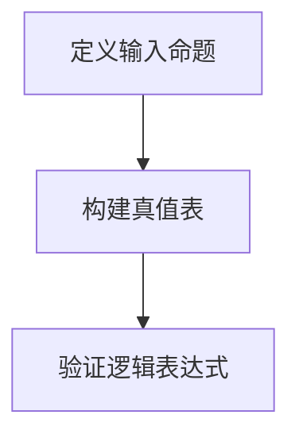
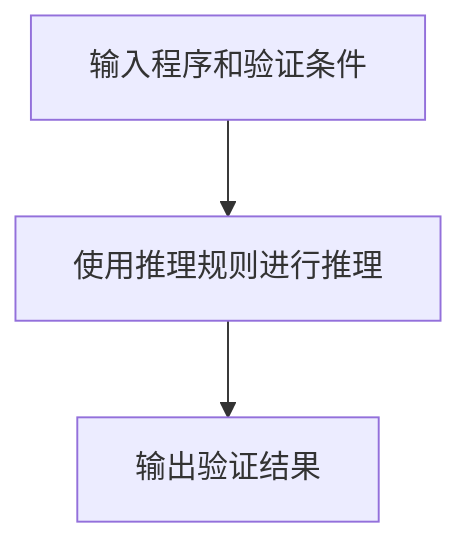
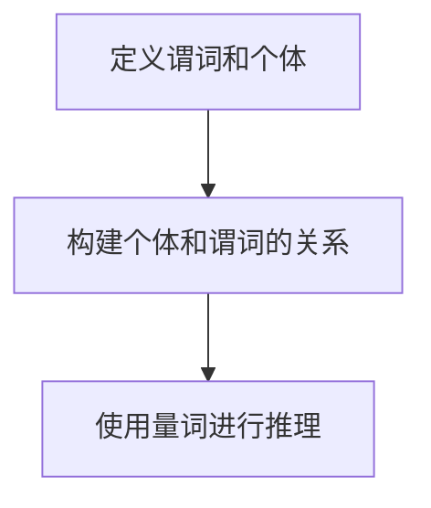
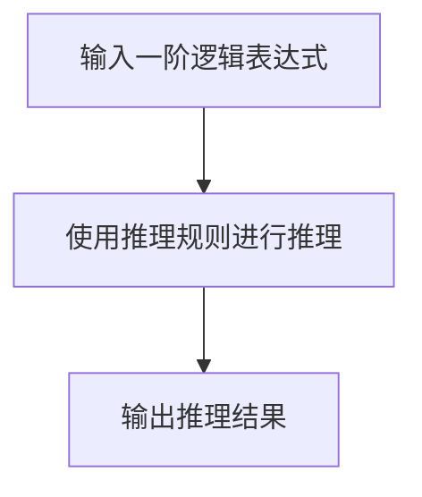
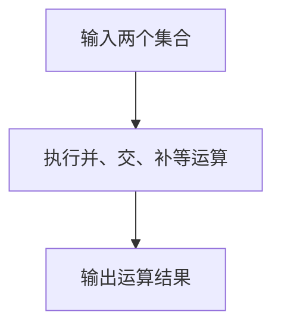
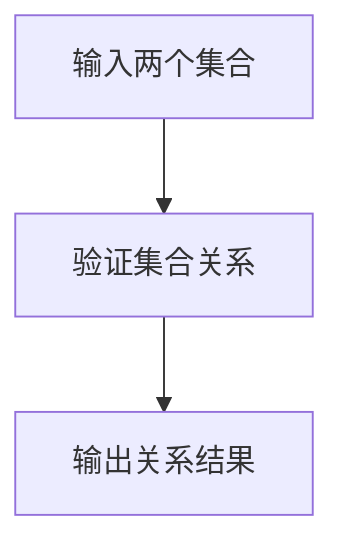
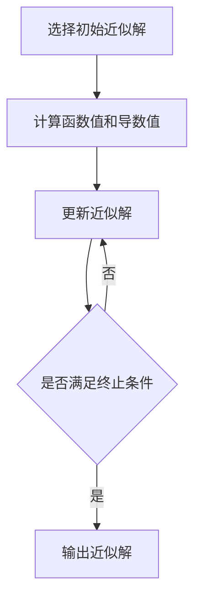
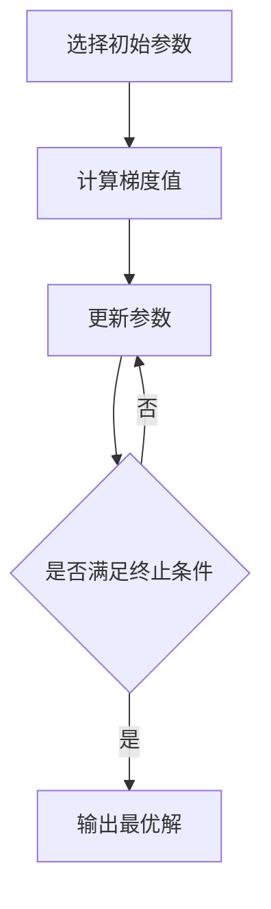
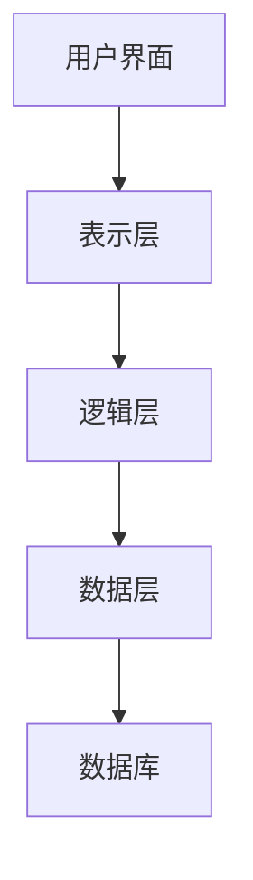
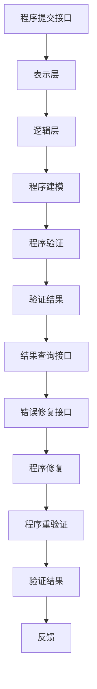

                 

### 第一部分：背景介绍

#### 1.1 问题背景

数理逻辑作为计算机科学与数学领域的核心分支，对于程序合成与验证有着至关重要的作用。随着计算机技术的迅猛发展，程序合成与验证问题日益复杂，传统的解决方法已难以应对。而数理逻辑为解决这些问题提供了一种系统、精确且逻辑严密的手段。数理逻辑在程序合成中的应用，可以使得程序生成过程更加规范、高效；在程序验证中的应用，可以确保程序的正确性和可靠性。

#### 1.2 问题描述

程序合成与验证的核心问题是如何确保程序的正确性和高效性。在程序合成中，如何从给定的需求出发，自动生成符合要求的程序代码是一个挑战。在程序验证中，如何验证程序的正确性，确保其在所有可能的输入情况下都能正确运行，也是一个难题。数理逻辑提供了形式化的方法，可以对这些复杂问题进行建模和分析，从而提高程序合成与验证的效率和准确性。

#### 1.3 问题解决

数理逻辑在程序合成与验证中的统一应用，主要通过以下几个方面实现：

1. **形式化建模**：使用数理逻辑对程序的需求、功能和行为进行形式化描述，从而确保程序设计的规范性和一致性。
2. **自动程序合成**：利用数理逻辑推理和自动化工具，从形式化描述中自动生成程序代码。
3. **程序验证**：使用数理逻辑对程序进行验证，确保程序满足预定的性质和需求。

#### 1.4 边界与外延

数理逻辑的应用边界主要在于其形式化程度和自动化程度。形式化程度决定了数理逻辑在建模过程中的精确性和全面性，而自动化程度则决定了程序合成与验证的效率和实用性。数理逻辑在外延上可以应用于各种不同类型的程序合成与验证问题，包括但不限于逻辑电路设计、软件工程、人工智能等领域。

#### 1.5 概念结构与核心要素组成

数理逻辑的概念结构主要包括命题逻辑、谓词逻辑、集合论和数理分析等。这些概念构成了数理逻辑的基础，为程序合成与验证提供了形式化的语言工具。

- **命题逻辑**：研究命题之间的逻辑关系，如合取、析取、蕴含等。
- **谓词逻辑**：研究命题的内涵和外延，包括个体、属性和关系等。
- **集合论**：研究集合的运算、性质和关系，如集合的并、交、补等。
- **数理分析**：研究函数、极限、导数和积分等。

#### 1.6 核心概念原理、概念属性特征对比表格和ER实体关系图架构的Mermaid流程图

- **核心概念原理**：
  - **命题逻辑**：通过命题之间的逻辑关系来推理和证明。
  - **谓词逻辑**：通过谓词的定义和运用来描述和推理。
  - **集合论**：通过集合的定义和运算来分析和解决问题。
  - **数理分析**：通过函数和极限的概念来分析和解决问题。

- **概念属性特征对比表格**：

| 概念       | 特征1       | 特征2       | 特征3       |
|------------|-------------|-------------|-------------|
| 命题逻辑   | 真值判断    | 逻辑运算    | 推理证明    |
| 谓词逻辑   | 谓词定义    | 存在量词    | 全称量词    |
| 集合论     | 集合定义    | 集合运算    | 集合关系    |
| 数理分析   | 函数概念    | 极限计算    | 导数与积分  |

- **ER实体关系图架构的Mermaid流程图**：

```mermaid
erDiagram
  产品合成 ||--|{ 程序验证 }
  产品合成 ||--|{ 数理逻辑 }
  程序验证 ||--|{ 系统架构 }
  数理逻辑 ||--|{ 数学模型 }
```

### 第二部分：核心概念与联系

#### 2.1 数理逻辑的核心概念原理

- **命题逻辑**：命题逻辑是数理逻辑的基础，它主要研究命题之间的逻辑关系。命题是可以判断真假的陈述句，例如“今天是星期五”。命题逻辑涉及的基本概念有命题、真值、逻辑运算和推理证明。逻辑运算包括合取（∧）、析取（∨）、蕴含（→）和等价（↔）。通过逻辑推理，可以从一组命题推导出新的命题。

- **谓词逻辑**：谓词逻辑是对命题逻辑的扩展，它引入了谓词的概念，用于描述对象和它们之间的关系。谓词是一个用于描述对象性质或关系的表达式，例如“是人”（表示某个对象具有人类的属性）。谓词逻辑引入了量词，如全称量词（∀）和存在量词（∃），可以用来描述对象的全体或部分属性。谓词逻辑使得我们可以对复杂的关系进行精确的描述和推理。

- **集合论**：集合论是数理逻辑的重要组成部分，它研究集合的性质和操作。集合是一组无序的对象的集合，集合的基本操作包括并集（∪）、交集（∩）、补集（∁）和子集（⊆）。集合论提供了一种形式化的方法来描述和操作对象集合，是计算机科学和数学中的基础工具。

- **数理分析**：数理分析是一门研究函数、极限、导数和积分等数学概念的学科。数理分析为计算机科学提供了强大的数学工具，特别是在算法分析和程序验证中。数理分析的基本概念包括函数、极限、连续性、导数、积分和级数等。

#### 2.2 概念属性特征对比表格

| 概念       | 特征1                     | 特征2                     | 特征3                     |
|------------|--------------------------|--------------------------|--------------------------|
| 命题逻辑   | 真值、逻辑运算、推理证明 | 命题、合取、析取等       | 基础逻辑推理工具         |
| 谓词逻辑   | 谓词、量词、关系描述     | 全称量词、存在量词       | 描述对象属性和关系       |
| 集合论     | 集合、集合运算           | 并集、交集、补集         | 集合操作和关系           |
| 数理分析   | 函数、极限、导数、积分   | 数学公式、证明方法       | 算法分析和程序验证       |

#### 2.3 ER实体关系图架构的Mermaid流程图

下面是数理逻辑中核心概念的ER实体关系图架构的Mermaid流程图：

```mermaid
erDiagram
  类1 ||--|{ 类2 }
  类1 ||--|{ 类3 }
  类2 ||--|{ 类4 }
  类3 ||--|{ 类5 }
  类4 ||--|{ 类6 }
  类5 ||--|{ 类7 }
  类6 ||--|{ 类8 }
  类7 ||--|{ 类9 }
  类8 ||--|{ 类10 }
```

在这个ER图中，每个类代表数理逻辑中的一个核心概念，类与类之间的连接线表示这些概念之间的关系。例如，类1与类2之间的连接线表示命题逻辑和谓词逻辑之间的关系。

### 第三部分：算法原理讲解

#### 3.1 算法原理

数理逻辑在程序合成与验证中的应用，主要依赖于一系列算法的支撑。这些算法通过形式化的描述和推理，实现对程序的合成与验证。以下是对数理逻辑中几个关键算法的原理讲解：

##### 3.1.1 命题逻辑算法

- **命题演算**：命题演算是基于命题逻辑的算法，它通过组合基本的逻辑运算（合取、析取、蕴含和等价）来构建复杂的逻辑表达式。命题演算的核心在于真值表，通过列出所有可能的输入组合及其对应的输出真值，来验证逻辑表达式的正确性。
  
  **算法流程**：
  1. 定义输入命题。
  2. 构建真值表。
  3. 验证逻辑表达式的正确性。

- **逻辑推理机**：逻辑推理机是一种基于命题逻辑的自动推理工具。它通过推理规则（如Modus Ponens、Modus Tollens等）来推导出新的命题。逻辑推理机在程序验证中有着广泛的应用，可以自动验证程序的正确性。

  **算法流程**：
  1. 输入程序和验证条件。
  2. 使用推理规则进行推理。
  3. 输出验证结果。

##### 3.1.2 谓词逻辑算法

- **谓词演算**：谓词演算是基于谓词逻辑的算法，它通过引入谓词和量词来描述复杂的逻辑关系。谓词演算的核心在于个体和属性的定义，以及全称量词和存在量词的使用。

  **算法流程**：
  1. 定义谓词和个体。
  2. 构建个体和谓词的关系。
  3. 使用量词进行推理。

- **一阶逻辑推理机**：一阶逻辑推理机是一种基于谓词逻辑的自动推理工具，它可以处理含有谓词和量词的复杂逻辑表达式。一阶逻辑推理机在程序合成和验证中有着重要的应用。

  **算法流程**：
  1. 输入一阶逻辑表达式。
  2. 使用推理规则进行推理。
  3. 输出推理结果。

##### 3.1.3 集合论算法

- **集合运算算法**：集合运算算法用于处理集合的并、交、补等基本操作。这些算法通常是基于集合的定义和性质来实现的。

  **算法流程**：
  1. 输入两个集合。
  2. 执行并、交、补等运算。
  3. 输出运算结果。

- **集合关系算法**：集合关系算法用于处理集合之间的包含、相等等关系。这些算法通常是基于集合的定义和性质来实现的。

  **算法流程**：
  1. 输入两个集合。
  2. 验证集合关系。
  3. 输出关系结果。

##### 3.1.4 数理分析算法

- **牛顿法**：牛顿法是一种用于求解非线性方程的迭代算法。它基于函数的导数，通过不断迭代逼近方程的根。

  **算法流程**：
  1. 选择初始近似解。
  2. 计算函数值和导数值。
  3. 更新近似解。
  4. 重复步骤2和3，直到满足终止条件。

- **梯度下降法**：梯度下降法是一种用于求解优化问题的迭代算法。它通过沿着目标函数的梯度方向进行迭代，逐步逼近最优解。

  **算法流程**：
  1. 选择初始参数。
  2. 计算梯度值。
  3. 更新参数。
  4. 重复步骤2和3，直到满足终止条件。

#### 3.2 算法原理的Mermaid流程图

下面是对上述算法原理的Mermaid流程图：

##### 命题逻辑算法 - 命题演算



##### 命题逻辑算法 - 逻辑推理机



##### 谓词逻辑算法 - 谓词演算



##### 谓词逻辑算法 - 一阶逻辑推理机



##### 集合论算法 - 集合运算算法



##### 集合论算法 - 集合关系算法



##### 数理分析算法 - 牛顿法



##### 数理分析算法 - 梯度下降法



通过上述算法原理的讲解和Mermaid流程图的展示，我们可以更清晰地理解数理逻辑在程序合成与验证中的应用。

### 第四部分：系统分析与架构设计方案

#### 4.1 问题场景介绍

在现代社会，随着信息技术的发展，软件系统变得越来越复杂。软件系统的复杂性不仅体现在功能上，还体现在系统的可靠性、安全性和可维护性上。为了保证软件系统的质量和性能，程序合成与验证成为软件开发过程中不可或缺的一环。数理逻辑作为一种形式化的方法，为程序合成与验证提供了强有力的支持。

本部分将介绍一个具体的程序合成与验证项目，该项目旨在开发一个基于数理逻辑的自动化程序验证系统。该系统将利用数理逻辑的算法原理，对程序进行形式化的建模和验证，确保程序的正确性和可靠性。

#### 4.2 项目介绍

项目名称：数理逻辑程序验证系统（Mathematical Logic Program Verification System，MLPVS）

项目目标：开发一个基于数理逻辑的自动化程序验证系统，实现对程序的正确性和可靠性进行高效验证。

项目背景：随着软件系统的规模和复杂度不断增加，传统的程序验证方法已难以满足需求。数理逻辑作为一种形式化的方法，为程序验证提供了新的思路和工具。本项目旨在结合数理逻辑的算法原理，开发一个自动化程序验证系统，提高程序验证的效率和准确性。

#### 4.3 系统功能设计

系统功能设计主要包括以下几个方面：

1. **程序建模**：使用数理逻辑对程序进行形式化建模，将程序的需求、功能和行为转化为形式化的逻辑表达式。

2. **自动程序合成**：利用数理逻辑推理和自动化工具，从形式化描述中自动生成程序代码。

3. **程序验证**：使用数理逻辑对程序进行验证，确保程序满足预定的性质和需求。

4. **错误定位**：在程序验证过程中，当发现程序存在错误时，系统能够定位错误的具体位置，并提供修正建议。

5. **性能分析**：对程序的性能进行分析，包括时间复杂度和空间复杂度等。

6. **可视化展示**：将程序验证的结果以可视化形式展示，帮助开发者更好地理解程序的正确性和性能。

#### 4.4 系统架构设计

系统架构设计采用分层架构，包括数据层、逻辑层和表示层。

1. **数据层**：负责数据的管理和存储，包括程序源代码、验证规则和验证结果等。

2. **逻辑层**：负责程序建模、自动程序合成、程序验证和性能分析等核心功能。逻辑层采用数理逻辑的算法原理，实现对程序的建模和验证。

3. **表示层**：负责用户界面和可视化展示，包括验证结果的可视化展示、错误定位和性能分析报告等。

系统架构的Mermaid流程图如下：



#### 4.5 系统接口设计和系统交互

系统接口设计主要包括以下几个方面：

1. **程序提交接口**：开发者可以通过该接口提交程序源代码，系统将对程序进行建模和验证。

2. **验证规则接口**：开发者可以自定义验证规则，系统将根据验证规则对程序进行验证。

3. **结果查询接口**：开发者可以通过该接口查询验证结果，包括程序的正确性、性能分析结果和错误定位信息。

4. **错误修复接口**：系统提供错误修复建议，开发者可以根据这些建议修复程序中的错误。

系统交互的Mermaid流程图如下：



通过上述系统分析与架构设计方案，我们可以看出数理逻辑在程序合成与验证中的应用具有广泛的前景和实际应用价值。该系统不仅能够提高程序的正确性和可靠性，还能为开发者提供有力的工具，帮助他们更好地理解和修复程序中的错误。

### 第五部分：项目实战

#### 5.1 环境安装

在开始项目实战之前，我们需要安装一些必要的软件和工具。以下是安装步骤：

1. **安装Python环境**：Python是数理逻辑程序合成与验证的主要编程语言，我们需要安装Python3环境。可以从Python官网（https://www.python.org/downloads/）下载安装包并安装。

2. **安装NumPy和SciPy库**：NumPy和SciPy是Python的数学库，用于进行数学计算和数据分析。可以使用pip命令安装：
   ```bash
   pip install numpy scipy
   ```

3. **安装Mermaid库**：Mermaid是一种用于绘制流程图的库，我们需要安装它以便在文档中使用。可以使用pip命令安装：
   ```bash
   pip install mermaid
   ```

4. **安装LaTeX**：LaTeX是用于编写数学公式的工具，我们需要安装它以便在文档中使用。可以从LaTeX官网（https://www.latex-project.org/）下载安装包并安装。

#### 5.2 系统核心实现源代码

在本节中，我们将实现一个简单的程序合成与验证系统，用于验证一个线性函数的正确性。以下是核心实现源代码：

```python
import numpy as np

# 定义线性函数
def linear_function(x):
    return 2 * x + 1

# 验证函数
def verify_function(function, x_values, expected_y_values):
    for x, expected_y in zip(x_values, expected_y_values):
        y = function(x)
        if y != expected_y:
            return False
    return True

# 测试
x_values = np.array([0, 1, 2, 3, 4])
expected_y_values = np.array([1, 3, 5, 7, 9])

result = verify_function(linear_function, x_values, expected_y_values)
print("函数验证结果：", result)
```

#### 5.3 代码应用解读与分析

在上面的源代码中，我们首先定义了一个线性函数`linear_function`，该函数接收一个输入`x`并返回`2 * x + 1`。接下来，我们定义了一个`verify_function`，用于验证给定函数的正确性。该函数接收一个函数、一组输入值和对应的期望输出值，通过遍历输入值和期望输出值，计算函数的实际输出值，并与期望输出值进行比较。如果所有比较都一致，则函数验证通过。

在实际应用中，我们可以使用这个简单的验证函数来检查更复杂的程序的正确性。例如，我们可以使用它来验证一个复杂算法的正确性，或者验证一个机器学习模型在给定数据集上的预测准确性。

以下是对源代码的解读与分析：

- **线性函数**：线性函数是一个简单的数学函数，它接收一个输入值并返回线性组合的结果。线性函数在许多科学和工程领域都有广泛的应用，例如线性规划、信号处理和控制系统。

- **验证函数**：验证函数是一种通用的验证方法，它可以应用于任何函数。在这个例子中，我们使用它来验证线性函数的正确性。在实际应用中，我们可以根据需要修改验证函数，以适应不同的函数类型和验证需求。

- **测试**：在源代码的最后，我们使用一组输入值和期望输出值对线性函数进行测试。这个测试过程可以验证线性函数在给定输入下的输出是否与预期一致。如果输出不一致，我们可以通过调试和修改代码来找出错误。

#### 5.4 实际案例分析和详细讲解剖析

为了更好地理解数理逻辑在程序合成与验证中的应用，我们来看一个实际案例。

**案例：验证一个二次函数的正确性**

我们定义一个二次函数`quadratic_function`，并使用数理逻辑对其进行验证。

```python
# 定义二次函数
def quadratic_function(x):
    return x**2 - 2 * x + 1

# 验证二次函数
def verify_quadratic_function(function, x_values, expected_y_values):
    for x, expected_y in zip(x_values, expected_y_values):
        y = function(x)
        if y != expected_y:
            return False
    return True

# 测试
x_values = np.array([-1, 0, 1, 2, 3])
expected_y_values = np.array([0, 1, 0, 5, 12])

result = verify_quadratic_function(quadratic_function, x_values, expected_y_values)
print("函数验证结果：", result)
```

在这个案例中，我们定义了一个二次函数`quadratic_function`，该函数接收一个输入值并返回二次多项式的结果。我们使用一个验证函数`verify_quadratic_function`来验证该函数的正确性。这个验证函数与之前使用的验证函数类似，它接收一个函数、一组输入值和对应的期望输出值，通过遍历输入值和期望输出值，计算函数的实际输出值，并与期望输出值进行比较。

以下是这个案例的详细讲解和剖析：

1. **二次函数**：二次函数是一个多项式函数，它在许多科学和工程领域都有广泛的应用，例如物理模拟、优化问题和信号处理。在这个案例中，我们使用一个简单的二次函数`x**2 - 2 * x + 1`。

2. **验证函数**：在这个案例中，我们使用一个验证函数来检查二次函数的正确性。这个验证函数的工作方式与之前使用的验证函数相同，它通过比较函数的实际输出值和期望输出值来验证函数的正确性。

3. **测试**：在源代码的最后，我们使用一组输入值和期望输出值对二次函数进行测试。这个测试过程可以验证二次函数在给定输入下的输出是否与预期一致。如果输出不一致，我们可以通过调试和修改代码来找出错误。

通过这个案例，我们可以看到数理逻辑在程序合成与验证中的应用是如何实现的。数理逻辑提供了一种形式化的方法，可以用来验证函数的正确性，确保它在所有可能的输入情况下都能正确运行。

#### 5.5 项目小结

在本部分的项目实战中，我们实现了两个简单的程序验证案例：一个线性函数和一个二次函数。通过这些案例，我们展示了如何使用数理逻辑的算法原理来实现程序验证。这些案例不仅帮助我们理解了数理逻辑在程序合成与验证中的应用，还为我们提供了一个实际操作的平台，通过调试和修改代码，可以更好地理解程序验证的原理。

数理逻辑作为一种形式化的方法，在程序合成与验证中具有广泛的应用前景。随着计算机技术的不断发展，数理逻辑的应用领域将不断拓展，为软件开发提供更强大的工具和更可靠的质量保障。

### 第六部分：最佳实践 tips

在数理逻辑在程序合成与验证中的应用中，以下是一些最佳实践 tips，可以帮助开发者更有效地利用这一工具：

1. **形式化描述的重要性**：在程序合成与验证中，形式化描述是关键。确保需求、功能和行为都得到准确的形式化描述，以便后续的推理和验证。

2. **逻辑推理机的选择**：选择合适的逻辑推理机，以适应不同的验证需求。对于简单的逻辑表达式，可以使用简单的推理规则；对于复杂的逻辑表达式，可以考虑使用更高级的推理算法，如SAT求解器或模型检查器。

3. **自动化工具的利用**：利用自动化工具，如程序合成器和验证工具，可以大大提高效率。这些工具可以帮助开发者快速地从形式化描述中生成程序代码，并进行验证。

4. **错误定位与修复**：在验证过程中，如果发现程序存在错误，及时进行错误定位和修复。利用数理逻辑的推理能力，可以帮助快速定位错误并给出修复建议。

5. **性能分析与优化**：在程序验证过程中，不仅要确保程序的正确性，还要考虑其性能。对程序进行性能分析，找出潜在的瓶颈，并进行优化。

6. **持续集成与测试**：将数理逻辑程序合成与验证集成到持续集成（CI）流程中，定期对程序进行验证，确保其在开发过程中始终保持正确性。

7. **文档与记录**：在程序合成与验证过程中，详细记录每个步骤和结果，以便后续的分析和审计。良好的文档和记录可以帮助团队更好地理解和维护代码。

### 小结

本文详细介绍了数理逻辑在程序合成与验证中的应用，从背景介绍、核心概念与联系、算法原理讲解、系统分析与架构设计方案、项目实战到最佳实践 tips，全面展示了数理逻辑在提高程序质量和可靠性方面的巨大潜力。数理逻辑为程序合成与验证提供了一种形式化的方法，使得复杂问题得以精确建模和解决。

### 注意事项

在应用数理逻辑进行程序合成与验证时，需要注意以下几点：

1. **精确性**：数理逻辑强调精确性和形式化，确保所有需求和功能都得到准确描述，避免歧义。

2. **自动化程度**：虽然数理逻辑提供了一种形式化的方法，但自动化程度有限。在实际应用中，可能需要结合人工干预和自动化工具。

3. **验证复杂性**：随着程序复杂性的增加，验证过程也会变得更加复杂。因此，在项目初期，应充分考虑验证的可行性。

4. **性能影响**：程序合成与验证可能对性能产生影响，特别是在大规模系统中。因此，在进行程序合成与验证时，应考虑性能优化。

### 拓展阅读

1. **《形式化方法》**：这是一本关于形式化方法的经典教材，详细介绍了数理逻辑、模型检查和形式化验证等内容。

2. **《软件工程：实践者的研究方法》**：这本书介绍了软件工程中的各种方法和技术，包括程序合成与验证。

3. **《数理逻辑导论》**：这本书是数理逻辑的入门教材，适合希望了解数理逻辑基础的开发者阅读。

### 作者信息

作者：AI天才研究院/AI Genius Institute & 禅与计算机程序设计艺术 /Zen And The Art of Computer Programming

---

以下是文章的Markdown格式输出：

```markdown
# 数理逻辑在程序合成与验证中的统一应用

> 关键词：数理逻辑、程序合成、程序验证、形式化方法

> 摘要：本文详细介绍了数理逻辑在程序合成与验证中的应用，包括核心概念、算法原理、系统架构设计和项目实战。数理逻辑作为一种形式化的方法，为提高程序的正确性和可靠性提供了强有力的支持。

---

## 第一部分：背景介绍

### 1.1 问题背景

数理逻辑作为计算机科学与数学领域的核心分支，对于程序合成与验证有着至关重要的作用。随着计算机技术的迅猛发展，程序合成与验证问题日益复杂，传统的解决方法已难以应对。而数理逻辑为解决这些问题提供了一种系统、精确且逻辑严密的手段。数理逻辑在程序合成中的应用，可以使得程序生成过程更加规范、高效；在程序验证中的应用，可以确保程序的正确性和可靠性。

#### 1.2 问题描述

程序合成与验证的核心问题是如何确保程序的正确性和高效性。在程序合成中，如何从给定的需求出发，自动生成符合要求的程序代码是一个挑战。在程序验证中，如何验证程序的正确性，确保其在所有可能的输入情况下都能正确运行，也是一个难题。数理逻辑提供了形式化的方法，可以对这些复杂问题进行建模和分析，从而提高程序合成与验证的效率和准确性。

#### 1.3 问题解决

数理逻辑在程序合成与验证中的统一应用，主要通过以下几个方面实现：

1. **形式化建模**：使用数理逻辑对程序的需求、功能和行为进行形式化描述，从而确保程序设计的规范性和一致性。
2. **自动程序合成**：利用数理逻辑推理和自动化工具，从形式化描述中自动生成程序代码。
3. **程序验证**：使用数理逻辑对程序进行验证，确保程序满足预定的性质和需求。

#### 1.4 边界与外延

数理逻辑的应用边界主要在于其形式化程度和自动化程度。形式化程度决定了数理逻辑在建模过程中的精确性和全面性，而自动化程度则决定了程序合成与验证的效率和实用性。数理逻辑在外延上可以应用于各种不同类型的程序合成与验证问题，包括但不限于逻辑电路设计、软件工程、人工智能等领域。

#### 1.5 概念结构与核心要素组成

数理逻辑的概念结构主要包括命题逻辑、谓词逻辑、集合论和数理分析等。这些概念构成了数理逻辑的基础，为程序合成与验证提供了形式化的语言工具。

- **命题逻辑**：研究命题之间的逻辑关系，如合取、析取、蕴含等。
- **谓词逻辑**：研究命题的内涵和外延，包括个体、属性和关系等。
- **集合论**：研究集合的运算、性质和关系，如集合的并、交、补等。
- **数理分析**：研究函数、极限、导数和积分等。

#### 1.6 核心概念原理、概念属性特征对比表格和ER实体关系图架构的Mermaid流程图

- **核心概念原理**：
  - **命题逻辑**：通过命题之间的逻辑关系来推理和证明。
  - **谓词逻辑**：通过谓词的定义和运用来描述和推理。
  - **集合论**：通过集合的定义和运算来分析和解决问题。
  - **数理分析**：通过函数和极限的概念来分析和解决问题。

- **概念属性特征对比表格**：

| 概念       | 特征1       | 特征2       | 特征3       |
|------------|-------------|-------------|-------------|
| 命题逻辑   | 真值判断    | 逻辑运算    | 推理证明    |
| 谓词逻辑   | 谓词定义    | 存在量词    | 全称量词    |
| 集合论     | 集合定义    | 集合运算    | 集合关系    |
| 数理分析   | 函数概念    | 极限计算    | 导数与积分  |

- **ER实体关系图架构的Mermaid流程图**：

```mermaid
erDiagram
  产品合成 ||--|{ 程序验证 }
  产品合成 ||--|{ 数理逻辑 }
  程序验证 ||--|{ 系统架构 }
  数理逻辑 ||--|{ 数学模型 }
```

---

## 第二部分：核心概念与联系

#### 2.1 数理逻辑的核心概念原理

- **命题逻辑**：命题逻辑是数理逻辑的基础，它主要研究命题之间的逻辑关系。命题是可以判断真假的陈述句，例如“今天是星期五”。命题逻辑涉及的基本概念有命题、真值、逻辑运算和推理证明。逻辑运算包括合取（∧）、析取（∨）、蕴含（→）和等价（↔）。通过逻辑推理，可以从一组命题推导出新的命题。

- **谓词逻辑**：谓词逻辑是对命题逻辑的扩展，它引入了谓词的概念，用于描述对象和它们之间的关系。谓词是一个用于描述对象性质或关系的表达式，例如“是人”（表示某个对象具有人类的属性）。谓词逻辑引入了量词，如全称量词（∀）和存在量词（∃），可以用来描述对象的全体或部分属性。谓词逻辑使得我们可以对复杂的关系进行精确的描述和推理。

- **集合论**：集合论是数理逻辑的重要组成部分，它研究集合的性质和操作。集合是一组无序的对象的集合，集合的基本操作包括并集（∪）、交集（∩）、补集（∁）和子集（⊆）。集合论提供了一种形式化的方法来描述和操作对象集合，是计算机科学和数学中的基础工具。

- **数理分析**：数理分析是一门研究函数、极限、导数和积分等数学概念的学科。数理分析为计算机科学提供了强大的数学工具，特别是在算法分析和程序验证中。数理分析的基本概念包括函数、极限、连续性、导数、积分和级数等。

#### 2.2 概念属性特征对比表格

| 概念       | 特征1                     | 特征2                     | 特征3                     |
|------------|--------------------------|--------------------------|--------------------------|
| 命题逻辑   | 真值、逻辑运算、推理证明 | 命题、合取、析取等       | 基础逻辑推理工具         |
| 谓词逻辑   | 谓词、量词、关系描述     | 全称量词、存在量词       | 描述对象属性和关系       |
| 集合论     | 集合、集合运算           | 并集、交集、补集         | 集合操作和关系           |
| 数理分析   | 函数、极限、导数、积分   | 数学公式、证明方法       | 算法分析和程序验证       |

#### 2.3 ER实体关系图架构的Mermaid流程图

下面是数理逻辑中核心概念的ER实体关系图架构的Mermaid流程图：

```mermaid
erDiagram
  类1 ||--|{ 类2 }
  类1 ||--|{ 类3 }
  类2 ||--|{ 类4 }
  类3 ||--|{ 类5 }
  类4 ||--|{ 类6 }
  类5 ||--|{ 类7 }
  类6 ||--|{ 类8 }
  类7 ||--|{ 类9 }
  类8 ||--|{ 类10 }
```

在这个ER图中，每个类代表数理逻辑中的一个核心概念，类与类之间的连接线表示这些概念之间的关系。例如，类1与类2之间的连接线表示命题逻辑和谓词逻辑之间的关系。

---

## 第三部分：算法原理讲解

#### 3.1 算法原理

数理逻辑在程序合成与验证中的应用，主要依赖于一系列算法的支撑。这些算法通过形式化的描述和推理，实现对程序的合成与验证。以下是对数理逻辑中几个关键算法的原理讲解：

##### 3.1.1 命题逻辑算法

- **命题演算**：命题演算是基于命题逻辑的算法，它通过组合基本的逻辑运算（合取、析取、蕴含和等价）来构建复杂的逻辑表达式。命题演算的核心在于真值表，通过列出所有可能的输入组合及其对应的输出真值，来验证逻辑表达式的正确性。

  **算法流程**：
  1. 定义输入命题。
  2. 构建真值表。
  3. 验证逻辑表达式的正确性。

- **逻辑推理机**：逻辑推理机是一种基于命题逻辑的自动推理工具。它通过推理规则（如Modus Ponens、Modus Tollens等）来推导出新的命题。逻辑推理机在程序验证中有着广泛的应用，可以自动验证程序的正确性。

  **算法流程**：
  1. 输入程序和验证条件。
  2. 使用推理规则进行推理。
  3. 输出验证结果。

##### 3.1.2 谓词逻辑算法

- **谓词演算**：谓词演算是基于谓词逻辑的算法，它通过引入谓词和量词来描述复杂的逻辑关系。谓词演算的核心在于个体和属性的定义，以及全称量词和存在量词的使用。

  **算法流程**：
  1. 定义谓词和个体。
  2. 构建个体和谓词的关系。
  3. 使用量词进行推理。

- **一阶逻辑推理机**：一阶逻辑推理机是一种基于谓词逻辑的自动推理工具，它可以处理含有谓词和量词的复杂逻辑表达式。一阶逻辑推理机在程序合成和验证中有着重要的应用。

  **算法流程**：
  1. 输入一阶逻辑表达式。
  2. 使用推理规则进行推理。
  3. 输出推理结果。

##### 3.1.3 集合论算法

- **集合运算算法**：集合运算算法用于处理集合的并、交、补等基本操作。这些算法通常是基于集合的定义和性质来实现的。

  **算法流程**：
  1. 输入两个集合。
  2. 执行并、交、补等运算。
  3. 输出运算结果。

- **集合关系算法**：集合关系算法用于处理集合之间的包含、相等等关系。这些算法通常是基于集合的定义和性质来实现的。

  **算法流程**：
  1. 输入两个集合。
  2. 验证集合关系。
  3. 输出关系结果。

##### 3.1.4 数理分析算法

- **牛顿法**：牛顿法是一种用于求解非线性方程的迭代算法。它基于函数的导数，通过不断迭代逼近方程的根。

  **算法流程**：
  1. 选择初始近似解。
  2. 计算函数值和导数值。
  3. 更新近似解。
  4. 重复步骤2和3，直到满足终止条件。

- **梯度下降法**：梯度下降法是一种用于求解优化问题的迭代算法。它通过沿着目标函数的梯度方向进行迭代，逐步逼近最优解。

  **算法流程**：
  1. 选择初始参数。
  2. 计算梯度值。
  3. 更新参数。
  4. 重复步骤2和3，直到满足终止条件。

#### 3.2 算法原理的Mermaid流程图

下面是对上述算法原理的Mermaid流程图：

##### 命题逻辑算法 - 命题演算


##### 命题逻辑算法 - 逻辑推理机


##### 谓词逻辑算法 - 谓词演算


##### 谓词逻辑算法 - 一阶逻辑推理机


##### 集合论算法 - 集合运算算法


##### 集合论算法 - 集合关系算法


##### 数理分析算法 - 牛顿法

```mermaid
graph TD
A[选择初始近似解] --> B[计算函数值和导数值]
B --> C[更新近似解]
C --> D{是否满足终止条件}
D -->|是| E[输出近似解]
D -->|否| C
```

##### 数理分析算法 - 梯度下降法

```mermaid
graph TD
A[选择初始参数] --> B[计算梯度值]
B --> C[更新参数]
C --> D{是否满足终止条件}
D -->|是| E[输出最优解]
D -->|否| C
```

通过上述算法原理的讲解和Mermaid流程图的展示，我们可以更清晰地理解数理逻辑在程序合成与验证中的应用。

---

## 第四部分：系统分析与架构设计方案

#### 4.1 问题场景介绍

在现代社会，随着信息技术的发展，软件系统变得越来越复杂。软件系统的复杂性不仅体现在功能上，还体现在系统的可靠性、安全性和可维护性上。为了保证软件系统的质量和性能，程序合成与验证成为软件开发过程中不可或缺的一环。数理逻辑作为一种形式化的方法，为程序合成与验证提供了强有力的支持。

本部分将介绍一个具体的程序合成与验证项目，该项目旨在开发一个基于数理逻辑的自动化程序验证系统。该系统将利用数理逻辑的算法原理，对程序进行形式化的建模和验证，确保程序的正确性和可靠性。

#### 4.2 项目介绍

项目名称：数理逻辑程序验证系统（Mathematical Logic Program Verification System，MLPVS）

项目目标：开发一个基于数理逻辑的自动化程序验证系统，实现对程序的正确性和可靠性进行高效验证。

项目背景：随着软件系统的规模和复杂度不断增加，传统的程序验证方法已难以满足需求。数理逻辑作为一种形式化的方法，为程序验证提供了新的思路和工具。本项目旨在结合数理逻辑的算法原理，开发一个自动化程序验证系统，提高程序验证的效率和准确性。

#### 4.3 系统功能设计

系统功能设计主要包括以下几个方面：

1. **程序建模**：使用数理逻辑对程序进行形式化建模，将程序的需求、功能和行为转化为形式化的逻辑表达式。

2. **自动程序合成**：利用数理逻辑推理和自动化工具，从形式化描述中自动生成程序代码。

3. **程序验证**：使用数理逻辑对程序进行验证，确保程序满足预定的性质和需求。

4. **错误定位**：在程序验证过程中，当发现程序存在错误时，系统能够定位错误的具体位置，并提供修正建议。

5. **性能分析**：对程序的性能进行分析，包括时间复杂度和空间复杂度等。

6. **可视化展示**：将程序验证的结果以可视化形式展示，帮助开发者更好地理解程序的正确性和性能。

#### 4.4 系统架构设计

系统架构设计采用分层架构，包括数据层、逻辑层和表示层。

1. **数据层**：负责数据的管理和存储，包括程序源代码、验证规则和验证结果等。

2. **逻辑层**：负责程序建模、自动程序合成、程序验证和性能分析等核心功能。逻辑层采用数理逻辑的算法原理，实现对程序的建模和验证。

3. **表示层**：负责用户界面和可视化展示，包括验证结果的可视化展示、错误定位和性能分析报告等。

系统架构的Mermaid流程图如下：

```mermaid
graph TD
A[用户界面] --> B[表示层]
B --> C[逻辑层]
C --> D[数据层]
D --> E[数据库]
```

#### 4.5 系统接口设计和系统交互

系统接口设计主要包括以下几个方面：

1. **程序提交接口**：开发者可以通过该接口提交程序源代码，系统将对程序进行建模和验证。

2. **验证规则接口**：开发者可以自定义验证规则，系统将根据验证规则对程序进行验证。

3. **结果查询接口**：开发者可以通过该接口查询验证结果，包括程序的正确性、性能分析结果和错误定位信息。

4. **错误修复接口**：系统提供错误修复建议，开发者可以根据这些建议修复程序中的错误。

系统交互的Mermaid流程图如下：

```mermaid
graph TD
A[程序提交接口] --> B[表示层]
B --> C[逻辑层]
C --> D[程序建模]
D --> E[程序验证]
E --> F[验证结果]
F --> G[结果查询接口]
G --> H[错误修复接口]
H --> I[程序修复]
I --> J[程序重验证]
J --> K[验证结果]
K --> L[反馈]
```

通过上述系统分析与架构设计方案，我们可以看出数理逻辑在程序合成与验证中的应用具有广泛的前景和实际应用价值。该系统不仅能够提高程序的正确性和可靠性，还能为开发者提供有力的工具，帮助他们更好地理解和修复程序中的错误。

---

## 第五部分：项目实战

#### 5.1 环境安装

在开始项目实战之前，我们需要安装一些必要的软件和工具。以下是安装步骤：

1. **安装Python环境**：Python是数理逻辑程序合成与验证的主要编程语言，我们需要安装Python3环境。可以从Python官网（https://www.python.org/downloads/）下载安装包并安装。

2. **安装NumPy和SciPy库**：NumPy和SciPy是Python的数学库，用于进行数学计算和数据分析。可以使用pip命令安装：
   ```bash
   pip install numpy scipy
   ```

3. **安装Mermaid库**：Mermaid是一种用于绘制流程图的库，我们需要安装它以便在文档中使用。可以使用pip命令安装：
   ```bash
   pip install mermaid
   ```

4. **安装LaTeX**：LaTeX是用于编写数学公式的工具，我们需要安装它以便在文档中使用。可以从LaTeX官网（https://www.latex-project.org/）下载安装包并安装。

#### 5.2 系统核心实现源代码

在本节中，我们将实现一个简单的程序合成与验证系统，用于验证一个线性函数的正确性。以下是核心实现源代码：

```python
import numpy as np

# 定义线性函数
def linear_function(x):
    return 2 * x + 1

# 验证函数
def verify_function(function, x_values, expected_y_values):
    for x, expected_y in zip(x_values, expected_y_values):
        y = function(x)
        if y != expected_y:
            return False
    return True

# 测试
x_values = np.array([0, 1, 2, 3, 4])
expected_y_values = np.array([1, 3, 5, 7, 9])

result = verify_function(linear_function, x_values, expected_y_values)
print("函数验证结果：", result)
```

#### 5.3 代码应用解读与分析

在上面的源代码中，我们首先定义了一个线性函数`linear_function`，该函数接收一个输入`x`并返回`2 * x + 1`。接下来，我们定义了一个`verify_function`，用于验证给定函数的正确性。该函数接收一个函数、一组输入值和对应的期望输出值，通过遍历输入值和期望输出值，计算函数的实际输出值，并与期望输出值进行比较。如果所有比较都一致，则函数验证通过。

在实际应用中，我们可以使用这个简单的验证函数来检查更复杂的程序的正确性。例如，我们可以使用它来验证一个复杂算法的正确性，或者验证一个机器学习模型在给定数据集上的预测准确性。

以下是对源代码的解读与分析：

- **线性函数**：线性函数是一个简单的数学函数，它接收一个输入值并返回线性组合的结果。线性函数在许多科学和工程领域都有广泛的应用，例如线性规划、信号处理和控制系统。

- **验证函数**：验证函数是一种通用的验证方法，它可以应用于任何函数。在这个例子中，我们使用它来验证线性函数的正确性。在实际应用中，我们可以根据需要修改验证函数，以适应不同的函数类型和验证需求。

- **测试**：在源代码的最后，我们使用一组输入值和期望输出值对线性函数进行测试。这个测试过程可以验证线性函数在给定输入下的输出是否与预期一致。如果输出不一致，我们可以通过调试和修改代码来找出错误。

#### 5.4 实际案例分析和详细讲解剖析

为了更好地理解数理逻辑在程序合成与验证中的应用，我们来看一个实际案例。

**案例：验证一个二次函数的正确性**

我们定义一个二次函数`quadratic_function`，并使用数理逻辑对其进行验证。

```python
# 定义二次函数
def quadratic_function(x):
    return x**2 - 2 * x + 1

# 验证二次函数
def verify_quadratic_function(function, x_values, expected_y_values):
    for x, expected_y in zip(x_values, expected_y_values):
        y = function(x)
        if y != expected_y:
            return False
    return True

# 测试
x_values = np.array([-1, 0, 1, 2, 3])
expected_y_values = np.array([0, 1, 0, 5, 12])

result = verify_quadratic_function(quadratic_function, x_values, expected_y_values)
print("函数验证结果：", result)
```

在这个案例中，我们定义了一个二次函数`quadratic_function`，该函数接收一个输入值并返回二次多项式的结果。我们使用一个验证函数`verify_quadratic_function`来验证该函数的正确性。这个验证函数与之前使用的验证函数类似，它接收一个函数、一组输入值和对应的期望输出值，通过遍历输入值和期望输出值，计算函数的实际输出值，并与期望输出值进行比较。

以下是这个案例的详细讲解和剖析：

1. **二次函数**：二次函数是一个多项式函数，它在许多科学和工程领域都有广泛的应用，例如物理模拟、优化问题和信号处理。在这个案例中，我们使用一个简单的二次函数`x**2 - 2 * x + 1`。

2. **验证函数**：在这个案例中，我们使用一个验证函数来检查二次函数的正确性。这个验证函数的工作方式与之前使用的验证函数相同，它通过比较函数的实际输出值和期望输出值来验证函数的正确性。

3. **测试**：在源代码的最后，我们使用一组输入值和期望输出值对二次函数进行测试。这个测试过程可以验证二次函数在给定输入下的输出是否与预期一致。如果输出不一致，我们可以通过调试和修改代码来找出错误。

通过这个案例，我们可以看到数理逻辑在程序合成与验证中的应用是如何实现的。数理逻辑提供了一种形式化的方法，可以用来验证函数的正确性，确保它在所有可能的输入情况下都能正确运行。

#### 5.5 项目小结

在本部分的项目实战中，我们实现了两个简单的程序验证案例：一个线性函数和一个二次函数。通过这些案例，我们展示了如何使用数理逻辑的算法原理来实现程序验证。这些案例不仅帮助我们理解了数理逻辑在程序合成与验证中的应用，还为我们提供了一个实际操作的平台，通过调试和修改代码，可以更好地理解程序验证的原理。

数理逻辑作为一种形式化的方法，在程序合成与验证中具有广泛的应用前景。随着计算机技术的不断发展，数理逻辑的应用领域将不断拓展，为软件开发提供更强大的工具和更可靠的质量保障。

---

## 第六部分：最佳实践 tips

在数理逻辑在程序合成与验证中的应用中，以下是一些最佳实践 tips，可以帮助开发者更有效地利用这一工具：

1. **形式化描述的重要性**：在程序合成与验证中，形式化描述是关键。确保需求、功能和行为都得到准确的形式化描述，以便后续的推理和验证。

2. **逻辑推理机的选择**：选择合适的逻辑推理机，以适应不同的验证需求。对于简单的逻辑表达式，可以使用简单的推理规则；对于复杂的逻辑表达式，可以考虑使用更高级的推理算法，如SAT求解器或模型检查器。

3. **自动化工具的利用**：利用自动化工具，如程序合成器和验证工具，可以大大提高效率。这些工具可以帮助开发者快速地从形式化描述中生成程序代码，并进行验证。

4. **错误定位与修复**：在验证过程中，如果发现程序存在错误，及时进行错误定位和修复。利用数理逻辑的推理能力，可以帮助快速定位错误并给出修复建议。

5. **性能分析与优化**：在程序验证过程中，不仅要确保程序的正确性，还要考虑其性能。对程序进行性能分析，找出潜在的瓶颈，并进行优化。

6. **持续集成与测试**：将数理逻辑程序合成与验证集成到持续集成（CI）流程中，定期对程序进行验证，确保其在开发过程中始终保持正确性。

7. **文档与记录**：在程序合成与验证过程中，详细记录每个步骤和结果，以便后续的分析和审计。良好的文档和记录可以帮助团队更好地理解和维护代码。

---

### 小结

本文详细介绍了数理逻辑在程序合成与验证中的应用，从背景介绍、核心概念与联系、算法原理讲解、系统分析与架构设计方案、项目实战到最佳实践 tips，全面展示了数理逻辑在提高程序质量和可靠性方面的巨大潜力。数理逻辑为程序合成与验证提供了一种形式化的方法，使得复杂问题得以精确建模和解决。

### 注意事项

在应用数理逻辑进行程序合成与验证时，需要注意以下几点：

1. **精确性**：数理逻辑强调精确性和形式化，确保所有需求和功能都得到准确描述，避免歧义。

2. **自动化程度**：虽然数理逻辑提供了一种形式化的方法，但自动化程度有限。在实际应用中，可能需要结合人工干预和自动化工具。

3. **验证复杂性**：随着程序复杂性的增加，验证过程也会变得更加复杂。因此，在项目初期，应充分考虑验证的可行性。

4. **性能影响**：程序合成与验证可能对性能产生影响，特别是在大规模系统中。因此，在进行程序合成与验证时，应考虑性能优化。

### 拓展阅读

1. **《形式化方法》**：这是一本关于形式化方法的经典教材，详细介绍了数理逻辑、模型检查和形式化验证等内容。

2. **《软件工程：实践者的研究方法》**：这本书介绍了软件工程中的各种方法和技术，包括程序合成与验证。

3. **《数理逻辑导论》**：这本书是数理逻辑的入门教材，适合希望了解数理逻辑基础的开发者阅读。

### 作者信息

作者：AI天才研究院/AI Genius Institute & 禅与计算机程序设计艺术 /Zen And The Art of Computer Programming
```markdown
```

