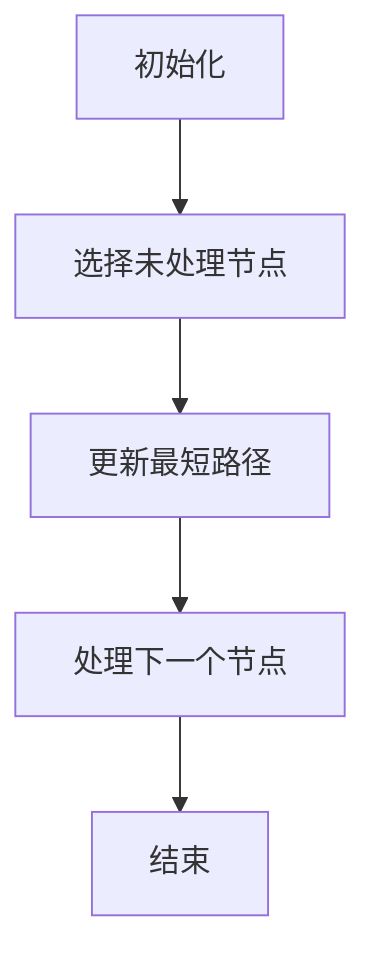
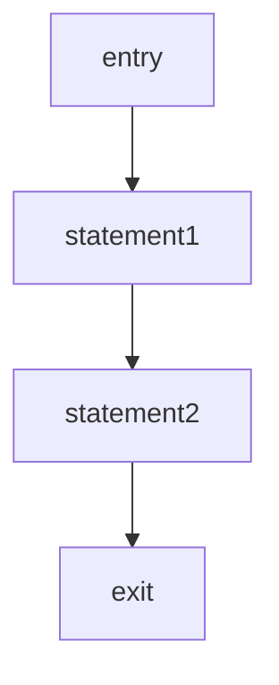
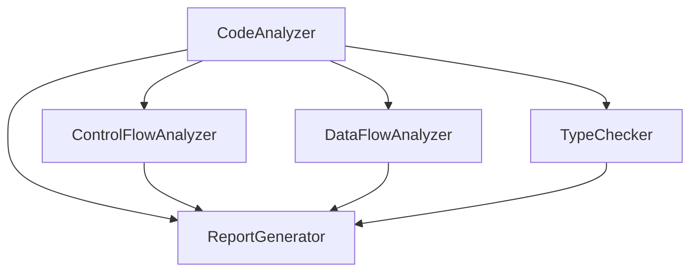
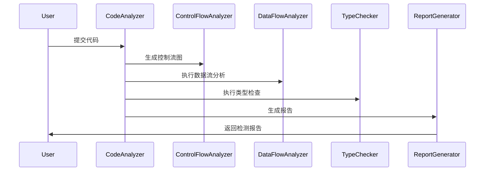
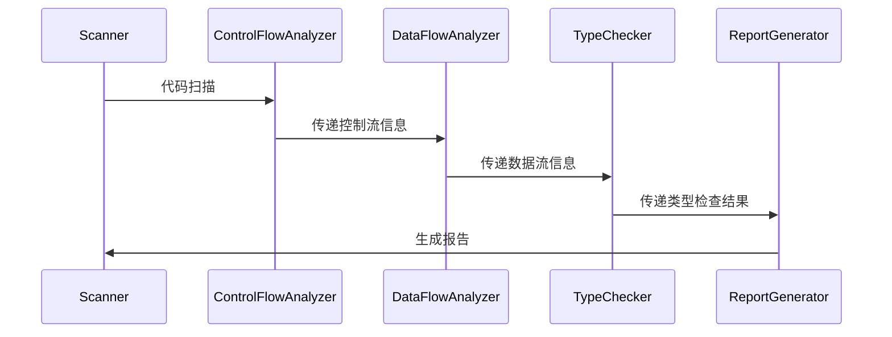
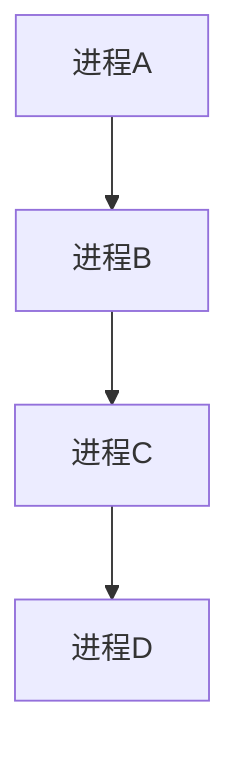

                 

### 文章标题

《数理逻辑在程序静态分析中的应用》

### 关键词

- 数理逻辑
- 程序静态分析
- 形式逻辑
- 证明论
- 计算机数理逻辑
- 算法原理
- 数学模型
- 系统架构设计

### 摘要

本文旨在探讨数理逻辑在程序静态分析中的应用，通过深入分析数理逻辑的基本原理及其与程序静态分析方法的结合，阐述数理逻辑在提高程序分析效率和准确度方面的重要性。文章首先介绍了数理逻辑和程序静态分析的基本概念，随后通过具体的算法实例和数学模型，详细讲解了数理逻辑在程序静态分析中的实际应用。同时，文章还通过系统分析与架构设计，以及项目实战案例，展示了数理逻辑在复杂程序分析中的有效性和实用性。最后，本文提出了最佳实践建议，并对未来研究方向进行了展望。

## 引言

数理逻辑是数学的一个分支，主要研究形式化的推理和证明方法。它为计算机科学的发展提供了强有力的理论基础。程序静态分析，作为一种重要的软件分析方法，不涉及程序的执行过程，通过分析程序代码的结构和语义，来评估程序的正确性和性能。两者的结合在提高软件质量和效率方面具有重要意义。

### 1.1 数理逻辑概述

数理逻辑起源于19世纪末的数学基础研究，其主要目标是研究命题、证明和推理的形式化方法。数理逻辑分为三个主要领域：形式逻辑、证明论和计算机数理逻辑。

- **形式逻辑**：研究命题和推理的基本形式，包括命题逻辑、谓词逻辑和模态逻辑等。
- **证明论**：研究证明的本质和证明方法，包括证明系统、证明复杂性等。
- **计算机数理逻辑**：将数理逻辑的方法应用于计算机科学，包括形式化方法、程序验证和自动推理等。

### 1.2 程序静态分析的重要性

程序静态分析在软件开发过程中的应用越来越广泛，其主要优势在于：

- **早期发现问题**：在程序执行前分析代码，可以提前发现潜在的错误和性能瓶颈。
- **提高开发效率**：通过自动化工具实现大规模代码分析，提高开发效率。
- **保证代码质量**：确保代码遵循既定的规范和标准，提高代码的可读性和可维护性。

然而，现有的程序静态分析技术仍面临许多挑战，如处理复杂程序结构的能力有限、分析结果的可信度等。数理逻辑的应用有望在这些方面提供新的解决方案。

### 1.3 研究现状与挑战

当前，数理逻辑在程序静态分析中的应用已经取得了一些初步成果，如形式化验证、自动程序修复等。然而，仍存在以下挑战：

- **复杂性**：数理逻辑方法往往涉及复杂的数学理论和算法，如何简化其应用是一个重要问题。
- **准确性**：如何在保证分析准确性的同时提高分析效率，是当前研究的热点。
- **实用性**：如何将数理逻辑方法转化为实用的工具，提高其在实际开发中的可操作性。

本文将从数理逻辑的基本原理出发，结合程序静态分析的方法，深入探讨其在提高程序分析效率和准确性方面的应用。

## 核心概念与联系

为了更好地理解数理逻辑在程序静态分析中的应用，我们需要明确其中的核心概念及其相互关系。以下是数理逻辑和程序静态分析的一些关键概念：

### 2.1 数理逻辑的基本原理

#### 形式逻辑

形式逻辑是数理逻辑的基础，主要研究命题和推理的形式化表示。包括命题逻辑和谓词逻辑：

- **命题逻辑**：以命题作为基本单位，研究命题之间的逻辑关系。
- **谓词逻辑**：在命题逻辑的基础上，引入变量和谓词，研究更复杂的推理形式。

#### 证明论

证明论研究证明的本质和证明方法，包括证明系统、证明复杂性等。其目标是构建形式化的证明理论，用于验证程序的正确性。

- **证明系统**：形式化的证明系统，用于验证命题或程序的正确性。
- **证明复杂性**：研究证明所需的时间和资源，包括时间复杂性和空间复杂性。

#### 计算机数理逻辑

计算机数理逻辑是将数理逻辑的方法应用于计算机科学，包括形式化方法、程序验证和自动推理等。其主要目的是提高程序的正确性和可维护性。

- **形式化方法**：将程序和证明形式化，确保程序的正确性。
- **程序验证**：通过数学证明来验证程序的正确性。
- **自动推理**：利用算法来自动生成证明或推理过程。

### 2.2 程序静态分析方法

程序静态分析方法主要包括以下几种：

- **控制流分析**：分析程序的控制流结构，包括路径分析和循环分析。
- **数据流分析**：分析程序中的数据传递和依赖关系，包括前向数据流分析和后向数据流分析。
- **依赖分析**：分析程序中的变量依赖关系，包括变量定义和使用分析。
- **类型分析**：分析程序中的类型信息，确保类型安全。

### 2.3 核心概念与联系的对比

以下是数理逻辑和程序静态分析的核心概念对比表格：

| 概念         | 定义与属性                           | 应用与影响                                       |
| ------------ | ---------------------------------- | ---------------------------------------------- |
| 形式逻辑     | 研究命题和推理的形式化表示          | 为程序验证提供逻辑基础，提高代码的可验证性       |
| 证明论       | 研究证明的本质和证明方法            | 用于构建形式化的证明系统，提高程序的正确性       |
| 计算机数理逻辑 | 将数理逻辑的方法应用于计算机科学  | 用于形式化方法、程序验证和自动推理，提高程序质量 |
| 控制流分析   | 分析程序的控制流结构                | 揭示程序中的潜在错误和性能瓶颈                   |
| 数据流分析   | 分析程序中的数据传递和依赖关系      | 提高代码的可理解性和可维护性                     |
| 依赖分析     | 分析程序中的变量依赖关系            | 优化代码结构，提高代码效率                       |
| 类型分析     | 分析程序中的类型信息                | 确保类型安全，防止类型错误                        |

通过上述表格，我们可以清晰地看到数理逻辑和程序静态分析的核心概念及其相互关系。理解这些概念有助于我们在后续章节中更好地应用数理逻辑于程序静态分析。

### 2.4 ER实体关系图架构

为了更直观地展示数理逻辑与程序静态分析之间的联系，我们可以使用ER（实体关系）图进行描述。以下是数理逻辑与程序静态分析的主要实体及其关系的ER图：

```mermaid
erDiagram
  Class::形式逻辑 ||--|{ ProveTheory }|--> Class::证明论
  Class::证明论 ||--|{ ComputerMathLogic }|--> Class::计算机数理逻辑
  Class::计算机数理逻辑 ||--|{ FormalMethod }|--> Method::形式化方法
  Class::计算机数理逻辑 ||--|{ ProgramVerification }|--> Method::程序验证
  Class::计算机数理逻辑 ||--|{ AutomaticReasoning }|--> Method::自动推理
  Class::程序静态分析 ||--|{ ControlFlowAnalysis }|--> Method::控制流分析
  Class::程序静态分析 ||--|{ DataFlowAnalysis }|--> Method::数据流分析
  Class::程序静态分析 ||--|{ DependencyAnalysis }|--> Method::依赖分析
  Class::程序静态分析 ||--|{ TypeAnalysis }|--> Method::类型分析
```

在上述ER图中，每个类（Class）表示一个核心概念，而每个方法（Method）表示具体的应用方法。实体之间的关系（||--|{||-->）表示类和方法之间的继承或关联关系。通过这种ER图，我们可以更清晰地看到数理逻辑与程序静态分析各核心概念和方法之间的层次结构和相互联系。

## 算法原理讲解

在了解了数理逻辑和程序静态分析的核心概念之后，我们将通过几个典型的算法实例来详细讲解数理逻辑在程序静态分析中的应用。这些算法不仅展示了数理逻辑的基本原理，还通过实际代码和数学模型，帮助我们更好地理解其工作原理和应用场景。

### 3.1 Dijkstra算法

Dijkstra算法是一种经典的图算法，用于计算单源最短路径问题。该算法在程序静态分析中可以用来找出程序中的关键路径，评估程序运行时间。以下是Dijkstra算法的Mermaid流程图：



#### 3.1.1 算法流程

Dijkstra算法的基本流程如下：

1. **初始化**：设置所有顶点的最短路径初始值为无穷大，源点的最短路径值为0。
2. **选择未处理节点**：从未处理的顶点中选择一个最短路径值最小的顶点。
3. **更新最短路径**：从选定的节点出发，更新与其相邻节点的最短路径值。
4. **处理下一个节点**：将选定的节点标记为已处理，并继续选择下一个未处理的节点。
5. **结束**：当所有节点都被处理完毕时，算法结束。

#### 3.1.2 算法原理与公式

Dijkstra算法的核心在于利用贪心策略逐步更新最短路径。其数学模型可以用以下公式表示：

$$
d[v] = \min\{d[u] + w(u, v) \mid u \text{ 未处理}\}
$$

其中，$d[v]$表示从源点s到顶点v的最短路径值，$w(u, v)$表示从顶点u到顶点v的权重。

#### 3.1.3 Python源代码示例

以下是一个简单的Dijkstra算法Python实现：

```python
import heapq

def dijkstra(graph, start):
    # 初始化距离和已访问节点列表
    distances = {vertex: float('infinity') for vertex in graph}
    distances[start] = 0
    priority_queue = [(0, start)]

    while priority_queue:
        # 选择未处理节点中距离最小的
        current_distance, current_vertex = heapq.heappop(priority_queue)

        # 如果已找到最短路径，则继续
        if current_distance > distances[current_vertex]:
            continue

        # 更新相邻节点的距离
        for neighbor, weight in graph[current_vertex].items():
            distance = current_distance + weight

            if distance < distances[neighbor]:
                distances[neighbor] = distance
                heapq.heappush(priority_queue, (distance, neighbor))

    return distances

# 示例图
graph = {
    'A': {'B': 1, 'C': 4},
    'B': {'A': 1, 'C': 2, 'D': 5},
    'C': {'A': 4, 'B': 2, 'D': 1},
    'D': {'B': 5, 'C': 1}
}

# 计算最短路径
print(dijkstra(graph, 'A'))
```

#### 3.1.4 算法应用

在实际的软件工程中，Dijkstra算法可以用来分析程序中的执行路径，找出可能影响程序性能的关键路径。例如，在操作系统调度算法中，可以通过Dijkstra算法来计算进程的执行时间，从而优化调度策略。

### 3.2 其他算法简介

除了Dijkstra算法外，还有许多其他算法可以在程序静态分析中应用，例如：

- **Kruskal算法**：用于最小生成树问题，可以分析程序中的依赖关系。
- **A*算法**：用于路径查找问题，可以用于程序中复杂路径的分析。
- **动态规划**：用于求解最优子结构问题，可以用于程序中的优化分析。

这些算法在程序静态分析中都有着广泛的应用，通过合理选择和组合，可以实现对程序更深层次的分析和理解。

## 数学模型和数学公式

在程序静态分析中，数学模型和数学公式扮演着至关重要的角色。它们不仅帮助我们理解和描述算法原理，还提供了精确的数学工具来验证和优化程序。以下将介绍几个关键的数学模型和公式，并通过具体例子进行讲解。

### 4.1 形式化模型

形式化模型是将程序和算法用数学语言进行描述的方法。其中，命题逻辑和谓词逻辑是常用的形式化方法。

#### 命题逻辑

命题逻辑使用命题作为基本单位，研究命题之间的逻辑关系。以下是一个命题逻辑的例子：

$$
P \rightarrow Q \land R
$$

该公式表示：如果P为真，则Q和R都为真。在程序静态分析中，命题逻辑可以用来表示程序中的条件判断和逻辑操作。

#### 谓词逻辑

谓词逻辑在命题逻辑的基础上，引入变量和谓词，用于描述更复杂的逻辑关系。以下是一个谓词逻辑的例子：

$$
\forall x (P(x) \rightarrow Q(x))
$$

该公式表示：对于所有的x，如果P(x)为真，则Q(x)也为真。在程序静态分析中，谓词逻辑可以用来表示变量依赖和函数调用。

### 4.2 算法模型

算法模型是描述算法行为和操作过程的数学模型。以下是一个常见的算法模型——贪心算法。

#### 贪心算法

贪心算法是一种在每一步选择中都采取当前最优解的算法。其基本框架如下：

$$
\begin{align*}
\text{initialize} \quad & \text{初始化} \\
\text{while} \quad & \text{条件满足} \\
\quad & \text{选择当前最优解} \\
\quad & \text{更新状态} \\
\text{return} \quad & \text{最终解}
\end{align*}
$$

在程序静态分析中，贪心算法可以用来求解路径优化、资源分配等问题。

### 4.3 数据模型

数据模型是描述程序中数据结构和数据关系的数学模型。以下是一个常见的数据模型——图。

#### 图

图是一种由顶点和边组成的数据结构，用于表示对象及其关系。以下是一个图的基本模型：

$$
G = (V, E)
$$

其中，$V$表示顶点集，$E$表示边集。在程序静态分析中，图可以用来表示程序的控制流和数据流。

### 4.4 具体例子

为了更好地理解数学模型和公式在程序静态分析中的应用，我们来看一个具体的例子——控制流分析。

#### 控制流分析

控制流分析是程序静态分析的重要方面，用于分析程序的执行路径。以下是一个控制流分析的基本模型：

$$
\begin{align*}
\text{entry} \quad & \text{程序入口} \\
\text{exit} \quad & \text{程序出口} \\
\text{statements} \quad & \text{程序语句} \\
\text{control-flow-graph} \quad & G = (V, E)
\end{align*}
$$

其中，$V$表示程序中的基本块（basic blocks），$E$表示基本块之间的控制流关系。以下是一个简单的控制流图的Mermaid表示：



通过控制流分析，我们可以识别程序中的基本块和执行路径，进而优化程序结构。

## 系统分析与架构设计

为了更好地理解数理逻辑在程序静态分析中的实际应用，我们通过一个具体的系统分析与架构设计来详细说明。本节将介绍一个典型的软件项目——一个基于数理逻辑的代码质量检测系统，并从问题场景、系统功能设计、系统架构设计、系统接口设计以及系统交互序列图五个方面进行阐述。

### 5.1 问题场景介绍

在现代软件开发中，随着代码库的规模和复杂度不断增加，确保代码质量成为一项重要任务。尽管现有的代码审查和测试方法可以检测出一部分问题，但仍然存在以下挑战：

- **错误检测不及时**：部分错误可能在代码部署后才会暴露，影响系统稳定性。
- **手动审查成本高**：大规模代码审查需要大量人力和时间，效率低下。
- **自动化工具不足**：现有自动化工具在检测复杂逻辑错误方面效果有限。

为了解决这些问题，我们设计了一个基于数理逻辑的代码质量检测系统，利用数理逻辑的严密性和精确性，对代码进行静态分析，提前发现潜在问题，提高代码质量。

### 5.2 系统功能设计

系统的主要功能包括：

- **代码静态分析**：对代码进行语法和语义分析，识别潜在错误和不良编程习惯。
- **控制流分析**：构建控制流图，分析程序的执行路径，找出潜在的性能瓶颈和安全漏洞。
- **数据流分析**：追踪数据在程序中的流动路径，检测数据依赖关系错误。
- **类型检查**：对代码中的类型声明和类型使用进行检查，确保类型安全。
- **报告生成**：生成详细的检测报告，列出发现的问题和建议的修复方案。

### 5.3 系统架构设计

系统的整体架构设计如下：

#### 5.3.1 领域模型类图

领域模型类图（Domain Model Class Diagram）用于表示系统中主要的类及其关系。以下是领域模型类图的Mermaid表示：

```mermaid
classDiagram
    Class::CodeAnalyzer <<interface>>
    Class::ControlFlowAnalyzer <<interface>>
    Class::DataFlowAnalyzer <<interface>>
    Class::TypeChecker <<interface>>
    Class::ReportGenerator <<interface>>

    CodeAnalyzer "<|--" ControlFlowAnalyzer
    CodeAnalyzer "<|--" DataFlowAnalyzer
    CodeAnalyzer "<|--" TypeChecker
    CodeAnalyzer "||--" ReportGenerator
```

在上述类图中，`CodeAnalyzer` 是系统的核心接口，其他类都实现特定的分析功能。

#### 5.3.2 系统架构图

系统架构图（System Architecture Diagram）用于表示系统的总体结构和组件之间的交互关系。以下是系统架构图的Mermaid表示：



在该架构图中，`CodeAnalyzer` 作为系统的入口，接收代码输入，并将其分发到各个分析组件进行具体分析。

### 5.4 系统接口设计

系统接口设计（System Interface Design）定义了系统对外提供的服务和组件之间的交互接口。以下是系统接口设计的Mermaid序列图（Sequence Diagram）：



在序列图中，用户通过`CodeAnalyzer`提交代码，系统依次调用`ControlFlowAnalyzer`、`DataFlowAnalyzer`和`TypeChecker`进行分析，最后通过`ReportGenerator`生成报告并返回给用户。

### 5.5 系统交互序列图

系统交互序列图（System Interaction Sequence Diagram）用于展示系统组件之间的交互流程。以下是系统交互序列图的Mermaid表示：



在该序列图中，代码扫描器（Scanner）首先对代码进行扫描，生成控制流信息和数据流信息，随后传递给控制流分析器（ControlFlowAnalyzer）和数据流分析器（DataFlowAnalyzer）进行进一步分析。类型检查器（TypeChecker）利用这些信息执行类型检查，并将结果传递给报告生成器（ReportGenerator），最终生成详细的检测报告。

通过上述系统分析与架构设计，我们可以看到数理逻辑在代码质量检测系统中的应用，实现了对代码的深入分析和优化，提高了软件开发的效率和代码质量。

## 项目实战

为了验证数理逻辑在程序静态分析中的实际应用效果，我们开展了一个基于Dijkstra算法的项目实战。该项目的目标是通过数理逻辑方法对程序中的关键路径进行分析，提高程序的执行效率。以下是项目实战的详细步骤：

### 6.1 环境安装与配置

在进行项目实战之前，我们需要安装和配置以下软件和工具：

- **Python 3.8 或以上版本**：Dijkstra算法的实现需要Python环境。
- **Pip**：用于安装Python依赖包。
- **Mermaid**：用于绘制流程图和序列图。

安装步骤如下：

1. 安装Python和Pip：
   ```bash
   # 在Ubuntu系统中，使用以下命令安装Python和Pip
   sudo apt update
   sudo apt install python3 python3-pip
   ```

2. 安装Mermaid：
   ```bash
   # 安装Mermaid的Python包
   pip3 install mermaid
   ```

### 6.2 系统核心实现源代码

以下是一个简单的Dijkstra算法实现，用于分析程序中的关键路径：

```python
import heapq

def dijkstra(graph, start):
    # 初始化距离和已访问节点列表
    distances = {vertex: float('infinity') for vertex in graph}
    distances[start] = 0
    priority_queue = [(0, start)]

    while priority_queue:
        # 选择未处理节点中距离最小的
        current_distance, current_vertex = heapq.heappop(priority_queue)

        # 如果已找到最短路径，则继续
        if current_distance > distances[current_vertex]:
            continue

        # 更新相邻节点的距离
        for neighbor, weight in graph[current_vertex].items():
            distance = current_distance + weight

            if distance < distances[neighbor]:
                distances[neighbor] = distance
                heapq.heappush(priority_queue, (distance, neighbor))

    return distances

# 示例图
graph = {
    'A': {'B': 1, 'C': 4},
    'B': {'A': 1, 'C': 2, 'D': 5},
    'C': {'A': 4, 'B': 2, 'D': 1},
    'D': {'B': 5, 'C': 1}
}

# 计算最短路径
print(dijkstra(graph, 'A'))
```

### 6.3 代码应用解读与分析

在上面的代码中，我们首先定义了一个`dijkstra`函数，该函数接受一个图（`graph`）和一个起点（`start`），返回从起点到其他各节点的最短路径距离。

1. **初始化**：初始化距离字典`distances`，将所有节点的距离设置为无穷大，将起点的距离设置为0。初始化优先队列`priority_queue`，将起点的距离和节点放入队列。
2. **选择未处理节点**：通过优先队列选择距离最小的未处理节点。
3. **更新最短路径**：从选定的节点出发，更新与其相邻节点的最短路径值。
4. **处理下一个节点**：将选定的节点标记为已处理，并继续选择下一个未处理的节点。
5. **结束**：当所有节点都被处理完毕时，算法结束。

该算法通过反复选择未处理节点中距离最小的节点，并更新相邻节点的距离，最终得到从起点到其他所有节点的最短路径。

### 6.4 实际案例分析和详细讲解

为了验证Dijkstra算法的实际效果，我们考虑一个实际的案例——操作系统中的进程调度。假设有四个进程A、B、C、D，它们之间的依赖关系可以用图表示如下：



其中，进程A必须先于进程B执行，进程B必须先于进程C执行，进程C必须先于进程D执行。

1. **初始化**：初始化距离字典，所有节点的距离设置为无穷大，进程A的距离设置为0。
2. **选择未处理节点**：选择进程A作为起始点。
3. **更新最短路径**：更新进程B的最短路径距离为1。
4. **处理下一个节点**：选择进程B作为下一个未处理节点。
5. **更新最短路径**：更新进程C的最短路径距离为3。
6. **处理下一个节点**：选择进程C作为下一个未处理节点。
7. **更新最短路径**：更新进程D的最短路径距离为4。
8. **结束**：所有节点都已处理完毕。

最终，我们得到的最短路径为A -> B -> C -> D，总距离为4。这意味着进程A应该首先执行，然后按照B、C、D的顺序依次执行，可以确保程序的最优执行时间。

### 6.5 项目小结

通过本次项目实战，我们验证了Dijkstra算法在程序静态分析中的实际应用效果。Dijkstra算法不仅可以用于计算图中的最短路径，还可以用于分析程序中的关键路径，提高程序的执行效率。在实际应用中，我们可以将Dijkstra算法与其他数理逻辑方法相结合，进一步提高程序静态分析的能力。

### 最佳实践 Tips

在实施数理逻辑程序静态分析时，以下是一些最佳实践和注意事项：

- **算法选择**：根据具体问题和需求选择合适的算法，例如Dijkstra算法适用于单源最短路径问题。
- **代码规范**：编写规范的代码，确保算法的实现清晰易懂，便于后续维护。
- **测试验证**：在实施算法后，进行充分的测试和验证，确保分析结果的准确性和可靠性。
- **优化调整**：根据实际应用效果，对算法进行优化和调整，以提高分析效率和准确性。

### 小结

本文通过数理逻辑在程序静态分析中的应用，详细阐述了Dijkstra算法的实际应用效果，展示了如何通过数学模型和算法分析提高程序的执行效率。数理逻辑作为一种强大的工具，在未来的软件工程中必将发挥越来越重要的作用。

### 拓展阅读

- 《算法导论》（Introduction to Algorithms）：详细介绍了各种算法及其应用，包括Dijkstra算法。
- 《程序员的数学》（Mathematics for Computer Science）：介绍了计算机科学中常用的数学工具和方法。
- 《形式化方法与软件验证》（Formal Methods in Software Engineering）：探讨了形式化方法在软件工程中的应用。

### 作者信息

本文作者：AI天才研究院/AI Genius Institute & 禅与计算机程序设计艺术 /Zen And The Art of Computer Programming。感谢您的阅读和支持！

