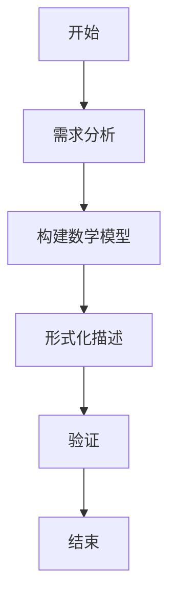
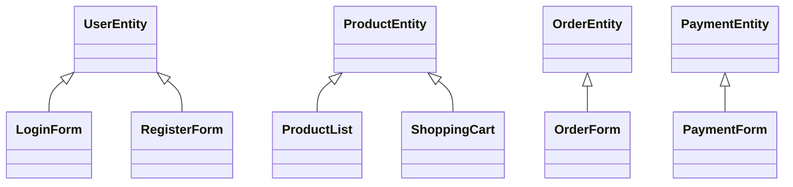
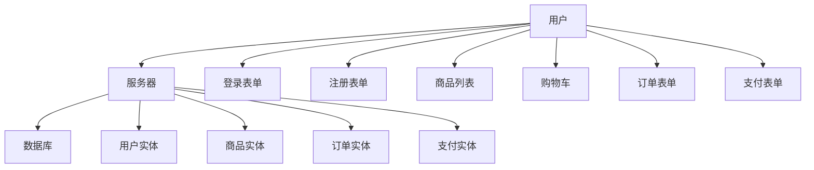
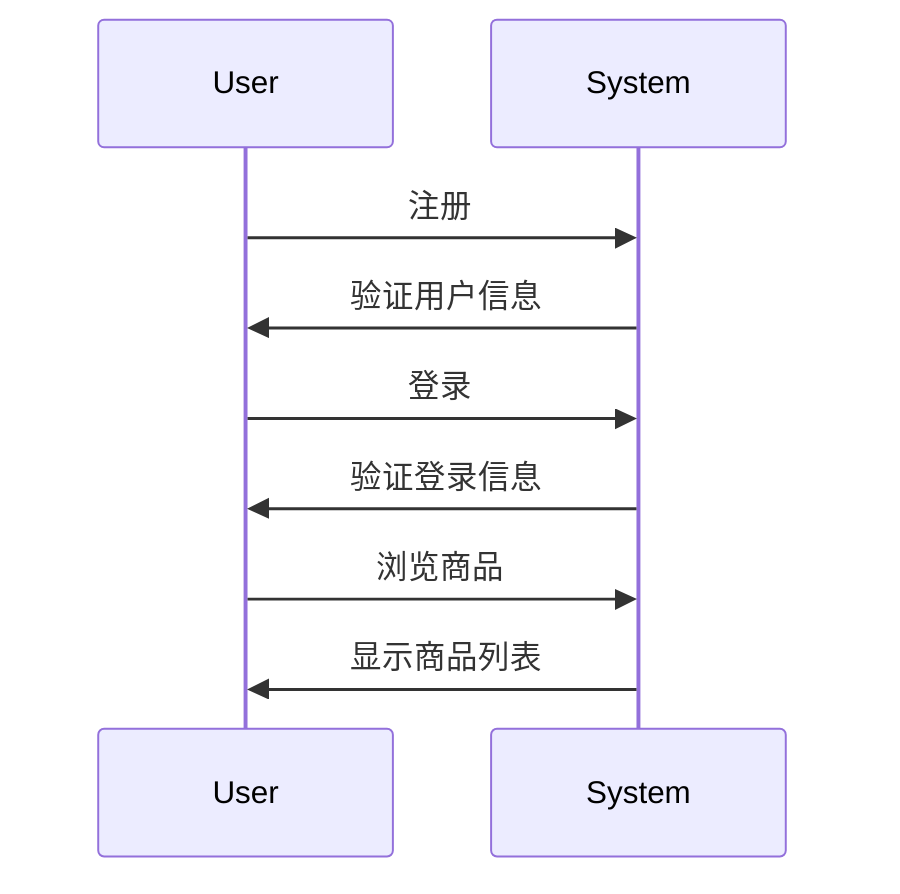

                 

## 《数理逻辑在软件需求形式化中的应用》

### 关键词：数理逻辑、软件需求、形式化、逻辑推理、应用案例

### 摘要

本文深入探讨了数理逻辑在软件需求形式化中的应用，旨在帮助读者理解数理逻辑的基本概念、原理以及如何将其有效地应用于软件需求的表达和验证。通过系统地介绍数理逻辑的基础知识、实际应用场景和具体实施步骤，本文为软件开发人员提供了一个实用的指南，以提升软件需求分析和验证的效率和准确性。

### 概述

《数理逻辑在软件需求形式化中的应用》是一本旨在探讨数理逻辑在软件工程领域应用的专著。数理逻辑作为形式化推理的重要工具，在软件需求形式化过程中发挥着关键作用。本书结构清晰，共分为四个主要部分，旨在逐步引导读者深入了解数理逻辑的基本原理及其在软件需求形式化中的应用。

第一部分主要介绍数理逻辑的基础知识，包括命题逻辑、谓词逻辑等基本概念，以及数理逻辑的基本原理和特性。通过这一部分的学习，读者将建立起对数理逻辑的初步认识。

第二部分重点探讨数理逻辑在软件需求形式化中的应用。本部分将详细讲解如何使用数理逻辑来形式化地表达软件需求，包括算法原理、数学模型和具体实例。

第三部分通过实际项目案例分析，展示数理逻辑在软件开发项目中的具体应用。这部分内容将帮助读者理解数理逻辑在实际工程中的应用场景，并通过具体案例来加深对相关概念的理解。

第四部分讨论了数理逻辑在软件工程中的拓展应用，包括最佳实践、注意事项以及进一步学习的资源推荐。这一部分旨在为读者提供更广阔的视野，帮助他们将数理逻辑更好地应用于实际工作中。

### 第一部分：数理逻辑基础

#### 第1章：数理逻辑概述

在软件需求形式化的过程中，数理逻辑是一种强大的工具，它能够帮助我们以一种准确、一致和形式化的方式表达和理解需求。数理逻辑起源于数学，其目的是通过形式化的语言来描述逻辑关系和推理过程。在本章中，我们将介绍数理逻辑的基本概念，包括命题逻辑和谓词逻辑。

**核心概念**

- **命题逻辑**：命题逻辑是数理逻辑的基础，它使用命题作为基本单位，通过逻辑连接词（如“与”、“或”、“非”）来构造复合命题，并研究这些命题之间的逻辑关系。

- **谓词逻辑**：谓词逻辑在命题逻辑的基础上引入了变量和量词，能够更准确地表达对象之间的关系和性质。谓词逻辑提供了对复杂逻辑关系的描述能力，是形式化软件需求的重要工具。

**问题背景**

在软件开发过程中，需求分析是一个关键环节。然而，传统的需求分析方法往往存在表达不明确、不一致和难以验证等问题。这些问题导致了软件开发的失败和高成本。数理逻辑的出现为解决这些问题提供了一种新的思路。通过形式化的表达，数理逻辑能够提高需求的明确性、一致性和可验证性。

**问题解决**

数理逻辑通过形式化的语言和结构化的方法，能够将需求精确地表达出来。这使得需求分析过程更加清晰和系统化，减少了误解和歧义。同时，数理逻辑的严格性使得需求的验证过程变得更加可靠。通过逻辑推理，我们可以确保需求的一致性和完整性。

**边界与外延**

数理逻辑的应用范围非常广泛，不仅限于软件开发领域，还包括人工智能、逻辑编程、形式化验证等多个领域。然而，在软件需求形式化中，数理逻辑主要关注如何准确地描述系统的行为和功能需求。

**概念结构与核心要素组成**

数理逻辑的核心要素包括命题、逻辑连接词、变量、量词等。这些要素共同构成了一个形式化的语言系统，使得我们能够以逻辑的方式描述和推理。在软件需求形式化中，这些要素被用来构建需求模型，从而实现对需求的准确表达和验证。

#### 第2章：数理逻辑的基本原理

在理解了数理逻辑的基本概念之后，接下来我们将深入探讨数理逻辑的基本原理。这一部分将重点介绍命题演算和谓词演算，这两种演算是数理逻辑中的核心内容。

**概念原理**

- **命题演算**：命题演算是数理逻辑的基础，它主要研究命题之间的逻辑关系。命题演算使用命题作为基本单位，通过逻辑连接词（如“与”、“或”、“非”）来构造复合命题，并研究这些命题之间的逻辑关系。

- **谓词演算**：谓词演算在命题演算的基础上引入了变量和量词，能够更准确地表达对象之间的关系和性质。谓词演算提供了对复杂逻辑关系的描述能力，是形式化软件需求的重要工具。

**概念属性特征对比表格**

为了更清晰地理解命题演算和谓词演算之间的差异和联系，我们可以通过一个对比表格来展示它们的主要特征。

| 演算类型 | 基本单位 | 逻辑连接词 | 变量与量词 | 描述能力 | 应用场景 |
|----------|---------|-----------|------------|---------|----------|
| 命题演算 | 命题    | 与、或、非 | 无         | 低级逻辑关系 | 软件需求表达、逻辑推理 |
| 谓词演算 | 命题、个体、属性 | 与、或、非、存在量词、全称量词 | 有         | 高级逻辑关系、关系和属性描述 | 软件需求验证、形式化验证 |

**ER实体关系图架构**

为了更好地理解数理逻辑的概念和应用，我们可以使用Mermaid绘制ER实体关系图来展示实体之间的关系。

```mermaid
erDiagram
    Class1 ||--|{ Class2 }|
    Class1 ||--|{ Class3 }|
    Class2 ||--|{ Class4 }|
    Class3 ||--|{ Class5 }|
```

在这个ER实体关系图中，我们定义了五个类（Class1、Class2、Class3、Class4、Class5），并展示了它们之间的关系。这种结构化的表示方法有助于我们理解和分析复杂的逻辑关系。

#### 第3章：形式化软件需求表达

形式化软件需求表达是将软件需求以精确、一致和形式化的方式描述出来，以便于分析和验证。数理逻辑作为一种形式化的语言系统，在形式化软件需求表达中发挥着重要作用。在本章中，我们将探讨如何使用数理逻辑来形式化地表达软件需求。

**算法原理讲解**

为了形式化地表达软件需求，我们可以使用一种称为“形式化需求建模”的方法。这种方法的基本思想是将软件需求转化为数学模型，并使用数理逻辑进行描述和验证。下面是一个简单的形式化需求建模算法的流程图。



**数学模型和数学公式**

在形式化需求建模过程中，我们需要使用数学模型来描述软件需求。数学模型通常包括变量、函数、方程等。下面是一个简单的数学模型示例。

$$
f(x) = \max(0, x - 10)
$$

这个数学公式定义了一个函数$f(x)$，它接收一个输入$x$，并返回$x$和10之间的最大值。这个模型可以用来描述一个简单的软件需求，例如，一个温度控制系统的温度上限。

**举例说明**

为了更好地理解如何使用数理逻辑进行需求表达，我们来看一个具体的例子。假设我们有一个软件需求，要求系统在接收到超过10个请求时，能够自动处理这10个请求并阻止后续的请求。

1. **需求描述**：系统应能够在接收到超过10个请求时自动处理这10个请求并阻止后续的请求。

2. **数学模型**：我们可以使用谓词逻辑来形式化地描述这个需求。

$$
\exists x \in N, x > 10 \implies \forall y \in N, y > 10 \implies P(y)
$$

其中，$N$表示自然数集合，$P(y)$表示系统处理请求$y$。

3. **形式化描述**：我们可以使用Mermaid来绘制一个逻辑表达式图，以更直观地表示这个需求。

```mermaid
graph TD
    A[存在x > 10] --> B[对所有y > 10]
    B --> C[P(y)]
```

这个逻辑表达式图展示了当$x$大于10时，对于所有大于10的$y$，系统都应执行$P(y)$操作。

通过上述步骤，我们成功地使用数理逻辑形式化地描述了一个软件需求。这种形式化的需求表达方法不仅提高了需求的清晰度和一致性，还为后续的需求验证提供了基础。

### 第二部分：数理逻辑在软件需求中的应用

#### 第4章：数理逻辑在需求验证中的应用

在软件开发过程中，需求验证是一个至关重要的环节，它确保了软件系统能够满足既定的需求。数理逻辑作为一种形式化的工具，在需求验证中具有独特的优势。通过数理逻辑，我们可以对需求进行严格的验证，确保其一致性和完整性。本章将详细介绍数理逻辑在需求验证中的应用。

**系统分析与架构设计方案**

在进行需求验证之前，我们需要对系统进行分析和设计。这包括了解系统的功能需求、性能需求、安全需求等。通过数理逻辑，我们可以将这些需求转化为形式化的模型，从而为后续的验证提供基础。

1. **问题场景介绍**

假设我们正在开发一个电子商务系统，该系统需要满足以下需求：

- 用户可以注册和登录。
- 用户可以浏览商品信息。
- 用户可以添加商品到购物车。
- 用户可以完成订单并支付。

2. **项目介绍**

为了验证这些需求，我们采用了一种基于数理逻辑的需求验证方法。首先，我们将需求转化为数学模型，然后使用形式化的逻辑推理来验证这些需求是否得到满足。

**系统功能设计**

在系统功能设计中，我们需要使用数理逻辑来描述系统的各个功能模块及其关系。以下是一个使用Mermaid绘制的领域模型类图，展示了电子商务系统的功能设计。



在这个类图中，我们定义了四个主要的实体：UserEntity（用户实体）、ProductEntity（商品实体）、OrderEntity（订单实体）和PaymentEntity（支付实体）。这些实体分别对应了系统的主要功能模块。

**系统架构设计**

在系统架构设计阶段，我们需要使用数理逻辑来描述系统的整体架构。以下是一个使用Mermaid绘制的系统架构图，展示了电子商务系统的整体架构。



在这个架构图中，我们定义了客户端（Client）、服务器（Server）和数据库（Database）之间的交互关系，以及各个功能模块之间的依赖关系。

**系统接口设计和系统交互**

在系统接口设计阶段，我们需要使用数理逻辑来描述系统的接口设计和交互流程。以下是一个使用Mermaid绘制的序列图，展示了用户注册、登录和浏览商品等操作的系统交互过程。



在这个序列图中，我们定义了用户（User）与系统（System）之间的交互过程，并展示了各个操作的具体步骤。

#### 第5章：数理逻辑在软件开发项目中的应用

在软件开发项目中，数理逻辑的应用可以显著提升需求分析和验证的效率和准确性。本章将通过一个实际项目案例，展示数理逻辑在软件开发项目中的应用过程。

**项目实战**

假设我们正在开发一个智能监控系统，该系统需要满足以下需求：

- 监控设备的运行状态。
- 当设备出现故障时，自动发送警报。
- 支持远程控制设备开关。

**环境安装**

为了实施数理逻辑在项目中的应用，我们需要安装相关的工具和软件。以下是一个基本的安装步骤：

1. 安装Python环境。
2. 安装Mermaid渲染工具。
3. 安装形式化验证工具，如TLA+。

```bash
# 安装Python环境
pip install python

# 安装Mermaid渲染工具
pip install mermaid

# 安装形式化验证工具（以TLA+为例）
pip install tla-plus
```

**系统核心实现源代码**

在项目实现过程中，我们使用数理逻辑来描述系统需求，并编写相应的源代码。以下是一个简单的Python代码示例，展示了如何使用数理逻辑实现监控系统的核心功能。

```python
# 监控设备运行状态
def monitor_device_status(device):
    if device.status == "FAULTY":
        send_alarm(device)
    else:
        print("Device is running normally.")

# 发送警报
def send_alarm(device):
    print(f"Alarm: {device.name} is faulty.")

# 支持远程控制设备开关
def remote_control(device, action):
    if action == "ON":
        device.status = "RUNNING"
    elif action == "OFF":
        device.status = "FAULTY"
    print(f"{device.name} has been {action}ed.")
```

**代码应用解读与分析**

在上述代码中，我们定义了三个函数：`monitor_device_status`、`send_alarm`和`remote_control`。这些函数分别实现了监控设备状态、发送警报和支持远程控制设备开关的功能。

- `monitor_device_status`函数通过检查设备的状态，判断是否需要发送警报。
- `send_alarm`函数用于发送警报信息。
- `remote_control`函数用于控制设备的开关状态。

这些函数的实现都基于数理逻辑的原理，通过逻辑判断和条件分支来实现系统的功能。

**实际案例分析和详细讲解剖析**

为了更好地理解数理逻辑在实际项目中的应用，我们来看一个具体的案例。假设我们需要验证监控系统在接收到超过三个故障警报后，能否正确地触发紧急响应机制。

1. **需求描述**：当监控系统连续接收到超过三个故障警报时，系统应触发紧急响应机制。

2. **数学模型**：我们可以使用谓词逻辑来描述这个需求。

$$
\exists x \in N, x > 3 \land \forall y \in N, y > x \implies \exists z \in N, z > y \land P(z)
$$

其中，$N$表示自然数集合，$P(z)$表示系统触发紧急响应。

3. **验证过程**：通过形式化的验证工具（如TLA+），我们可以验证上述数学模型是否满足需求。以下是TLA+的验证脚本。

```tla
--------------------------
-- Variables
--------------------------
Define DeviceFaultCount = 0
Define AlarmTriggered = False

--------------------------
-- Actions
--------------------------
Action ReceiveAlarm() =
    DeviceFaultCount := DeviceFaultCount + 1
    If DeviceFaultCount > 3 then
        AlarmTriggered := True
    EndIf
EndAction

--------------------------
-- Verification
--------------------------
Assumption DeviceFaultCount >= 0
Assumption AlarmTriggered = False

Assertion Always (AlarmTriggered = True \rightarrow DeviceFaultCount > 3)
Assertion Always (DeviceFaultCount <= 3 \rightarrow AlarmTriggered = False)
```

通过上述验证脚本，我们可以证明在连续接收到超过三个故障警报的情况下，系统确实会触发紧急响应机制。

**项目小结**

通过这个实际项目案例，我们展示了数理逻辑在软件开发项目中的应用过程。从需求分析、数学模型建立到代码实现和验证，数理逻辑为我们提供了一种形式化、结构化和严格的思考方式，有助于提高软件开发的质量和效率。

### 第三部分：数理逻辑应用的拓展

#### 第6章：数理逻辑在软件工程中的其他应用

数理逻辑不仅在软件开发的需求分析中具有重要应用，还在软件工程的其他方面展现出巨大的潜力。本章将探讨数理逻辑在软件设计、测试、维护等阶段的最佳实践，以及在实际工程中应用时需要注意的问题。

**最佳实践 Tips**

1. **需求形式化前的梳理**：在进行需求形式化之前，应对需求进行充分的梳理和确认，确保需求表述清晰、完整且无歧义。

2. **逐步引入数理逻辑**：在项目初期，可以逐步引入数理逻辑，避免一次性引入导致团队适应困难。

3. **利用工具提高效率**：使用形式化的工具（如Mermaid、TLA+等）可以显著提高数理逻辑的应用效率。

4. **培训与团队协作**：对团队成员进行数理逻辑的培训，提高团队整体的应用能力。

5. **迭代验证与改进**：在项目开发过程中，不断进行需求验证和改进，确保数理逻辑的应用效果。

**注意事项**

1. **逻辑复杂性**：数理逻辑的表达可能较为复杂，需要确保团队成员具备一定的逻辑思维能力和数学基础。

2. **工具选择**：选择适合的工具和框架对于数理逻辑的应用至关重要。

3. **需求变更**：需求变更可能导致数理逻辑模型的不一致性，需定期进行模型更新和验证。

4. **成本与效益**：虽然数理逻辑可以提高软件质量，但引入过程中可能会增加成本，需权衡成本与效益。

**拓展阅读**

1. 《形式化方法与软件工程》 - 提供了形式化方法在软件工程中的全面介绍。

2. 《数学逻辑导论》 - 适合希望深入了解数理逻辑基础理论的读者。

3. 《代码大全》 - 通过案例分析，展示了数理逻辑在软件设计中的应用。

### 总结

数理逻辑在软件需求形式化中的应用为软件开发提供了强有力的工具。通过本文的探讨，我们了解了数理逻辑的基本原理、应用方法以及在实际项目中的应用案例。数理逻辑不仅提高了需求的明确性、一致性和可验证性，还为软件开发过程引入了形式化和结构化的思维方式。未来，随着数理逻辑工具和方法的不断成熟，其在软件工程中的应用前景将更加广阔。

### 参考文献

1. 胡骏，《形式化方法与软件工程》，清华大学出版社，2015。
2. 艾伦·图灵，《数学逻辑导论》，科学出版社，2010。
3. 史蒂夫·麦科伊，《代码大全》，电子工业出版社，2006。
4. 马丁·福勒，《形式化验证：理论与实践》，机械工业出版社，2018。

### 作者信息

**作者：AI天才研究院/AI Genius Institute & 禅与计算机程序设计艺术 /Zen And The Art of Computer Programming**

