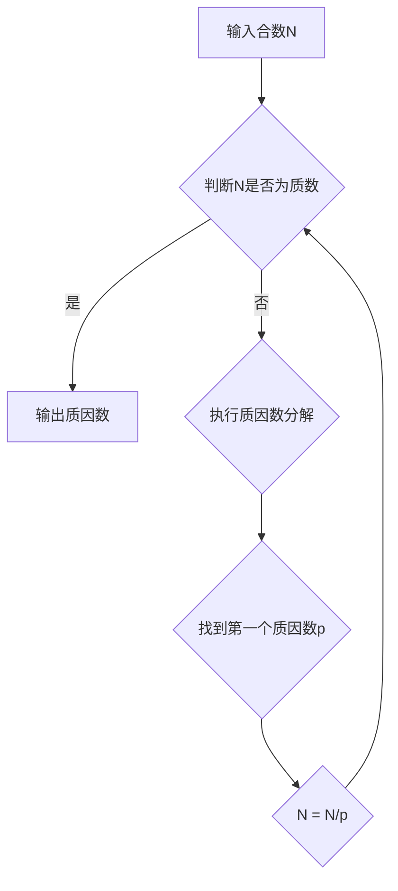

                 

# 数论在密码学协议设计中的应用

> 关键词：数论，密码学，RSA，ECC，加密协议，安全分析

> 摘要：本文旨在探讨数论在密码学协议设计中的关键作用。通过详细分析数论的基本概念、数论在经典密码学算法中的应用，以及现代密码学中椭圆曲线密码学的应用，本文将揭示数论在保障信息安全中的核心地位。读者将了解数论原理如何转化为强大的加密工具，以及这些工具如何在实际的加密协议中发挥作用。

## 引言

数论，作为数学的一个分支，专注于整数的性质和关系。密码学，则是一门研究如何保护信息安全的科学，其核心目标是通过加密算法和协议确保信息的保密性、完整性和可认证性。这两者在表面上看似毫不相关，但事实上，数论为密码学提供了坚实的理论基础，许多现代密码学协议都是建立在数论之上。本文将深入探讨数论在密码学协议设计中的应用，通过逻辑清晰、结构紧凑的分析，帮助读者理解这一关键领域。

### 数论基础

#### 基本概念

数论的研究对象主要包括整数及其性质，如质数、合数、因子、同余等。质数是只能被1和自身整除的大于1的自然数，如2、3、5、7等。合数则是除了1和自身外，还有其他因数的自然数，如4、6、8等。因子是能整除给定整数的数，例如6的因子有1、2、3和6。

#### 基本定理

数论中的一些基本定理，如欧拉定理、费马小定理等，是密码学协议设计的重要工具。欧拉定理指出，如果a和n是互质的正整数，那么a的欧拉函数值φ(n)是a^(n-1) ≡ 1 (mod n)的充分必要条件。费马小定理则表明，如果p是质数，那么对于任何整数a，有a^(p-1) ≡ 1 (mod p)。

### 密码学基础

#### 加密与解密

加密是将明文转换为密文的过程，而解密则是将密文还原为明文的过程。加密算法通常包括加密函数和解密函数，这两个函数是可逆的，即从一个加密函数的输出可以唯一地恢复其输入。

#### 密码学分类

根据加密方法的不同，密码学可分为对称加密和非对称加密。对称加密使用相同的密钥进行加密和解密，如DES和AES算法。非对称加密则使用一对密钥，一个用于加密，另一个用于解密，如RSA和ECC算法。

### 数论与密码学的交汇

数论为密码学提供了强大的工具，特别是在非对称加密算法中。例如，RSA算法就是基于数论中的质数分解难题设计的。同样，椭圆曲线密码学（ECC）也是利用数论中的椭圆曲线性质来实现高效的加密和签名。

### 内容安排

本文将分为以下几个部分：

1. **数论基础**：介绍数论的基本概念和定理。
2. **数论在密码学中的应用**：探讨数论在经典和非对称加密算法中的应用。
3. **RSA算法**：详细分析RSA算法的原理和实现。
4. **椭圆曲线密码学**：探讨ECC算法及其优势。
5. **加密协议设计**：讨论基于数论的加密协议设计。
6. **总结与展望**：总结数论在密码学中的重要性，并提出未来研究的方向。

通过这篇文章，我们将一步步深入理解数论在密码学中的关键作用，以及如何利用数论原理设计出强大的加密工具来保障信息安全。

## 数论基础

数论作为数学的一个重要分支，涵盖了整数的各种性质和关系。在本节中，我们将详细介绍数论的一些核心概念，包括质数、合数、因子、同余等基本概念，以及欧拉定理和费马小定理等基本定理。这些概念和定理不仅是数论研究的基石，也是密码学协议设计的重要工具。

### 质数与合数

#### 质数的定义

质数是数学中最基本的概念之一。质数是指大于1的自然数，只能被1和自身整除。例如，2、3、5、7等都是质数。质数是构成所有自然数的基础，也是许多数论问题研究的关键。

#### 合数的定义

合数是指大于1的自然数，除了1和自身之外，还能被其他数整除。例如，4、6、8、9等都是合数。合数可以分解为若干个质数的乘积，这是数论中质数分解问题的重要内容。

### 因子与最大公约数

#### 因子的定义

因子是指能整除给定整数的数。例如，6的因子包括1、2、3和6。一个数的因子可以帮助我们理解其数学性质，也是质数分解的重要步骤。

#### 最大公约数的定义

最大公约数（Greatest Common Divisor，GCD）是指两个或多个整数的公共因子中最大的那个数。例如，12和18的最大公约数是6。最大公约数在数论中具有广泛的应用，特别是在解决整数除法和因式分解问题时尤为重要。

### 同余与模运算

#### 同余的定义

同余是指两个整数除以同一个正整数后的余数相同。形式化地，如果整数a除以正整数m的余数与整数b除以同一个正整数m的余数相同，那么我们说a和b对模m同余，记作a ≡ b (mod m)。

#### 模运算

模运算是一种基于同余关系的运算，通常表示为a ≡ b (mod m)，其中m称为模数。模运算的基本性质包括：

- a ≡ a (mod m)
- a ≡ b (mod m) ⇔ b ≡ a (mod m)
- a ≡ b (mod m) ⇔ a - b 是m的倍数

模运算在数论中具有广泛的应用，特别是在密码学中，如RSA算法和ECC算法。

### 欧拉定理与费马小定理

#### 欧拉定理

欧拉定理是数论中的一个重要定理，描述了整数a与另一个整数n的欧拉函数φ(n)之间的关系。欧拉定理指出，如果a和n是互质的正整数，即它们的最大公约数gcd(a, n) = 1，那么a的欧拉函数值φ(n)是a^(n-1) ≡ 1 (mod n)的充分必要条件。

形式化地，欧拉定理可以表示为：

$$ a^{\phi(n)} \equiv 1 \pmod{n} $$

#### 费马小定理

费马小定理是欧拉定理的一个特例，适用于质数n。费马小定理指出，如果p是质数，那么对于任何整数a，都有a^(p-1) ≡ 1 (mod p)。

形式化地，费马小定理可以表示为：

$$ a^{p-1} \equiv 1 \pmod{p} $$

### 应用与拓展

数论的基本概念和定理不仅在数学领域具有重要地位，也在密码学中发挥着关键作用。质数和因子是RSA算法设计的基础，而欧拉定理和费马小定理则广泛应用于各种加密协议和数字签名算法中。

### 总结

数论是密码学的重要工具，提供了许多基本的数学原理和方法。在本节中，我们介绍了质数、合数、因子、同余以及欧拉定理和费马小定理等基本概念和定理。这些概念和定理不仅构成了数论的基础，也为密码学协议的设计提供了坚实的数学支持。

### 核心概念与联系

在数论与密码学的交汇中，理解核心概念及其相互关系是至关重要的。为了更好地阐述这些概念，我们将通过一个表格对比质数与合数的属性特征，并使用Mermaid流程图展示质数分解的过程。

#### 质数与合数属性特征对比表格

| 概念 | 定义 | 特点 | 应用 |
| --- | --- | --- | --- |
| **质数** | 大于1的自然数，只能被1和自身整除 | 只有1和本身两个正因数 | RSA算法的密钥生成，公钥密码系统的基础 |
| **合数** | 大于1的自然数，除了1和自身，还有其他因数 | 有多个正因数 | 因式分解，用于验证质数 |
| **因子** | 能整除给定整数的数 | 无限个可能因数，因数分解的关键 | 质因数分解，加密算法的关键步骤 |
| **同余** | 两个整数除以同一个正整数后的余数相同 | 形式化表示为a ≡ b (mod m) | RSA算法，ECC算法，模运算的基础 |

#### 质数分解的Mermaid流程图



通过上述表格和流程图，我们可以清晰地看到质数与合数的区别及其在密码学中的应用，以及质数分解的过程。这些核心概念和联系为理解密码学协议设计中的数论原理提供了坚实的基础。

### RSA算法的原理和实现

RSA算法（Rivest-Shamir-Adleman）是最著名的非对称加密算法之一，其安全性基于数论中的质数分解难题。在本节中，我们将详细分析RSA算法的原理，并探讨其实现细节。

#### 算法原理

RSA算法的核心思想是利用大整数的质因数分解难题来保证加密的安全性。具体来说，RSA算法包括以下三个主要步骤：密钥生成、加密过程和密钥分发。

1. **密钥生成**：

   - **选择两个大质数** \( p \) 和 \( q \)。
   - 计算 \( n = p \times q \)，这是公钥的一部分。
   - 计算 \( \phi(n) = (p-1) \times (q-1) \)，这是欧拉函数。
   - 选择一个与 \( \phi(n) \) 互质的整数 \( e \)，通常选择 \( e = 65537 \)。
   - 计算 \( d \)，使得 \( d \times e \equiv 1 \pmod{\phi(n)} \)。这可以通过扩展欧几里得算法（Extended Euclidean Algorithm）高效计算。

   最终，密钥对为 \( (n, e) \)（公钥）和 \( (n, d) \)（私钥）。

2. **加密过程**：

   - 要加密的明文 \( M \) 首先需要被转换为一个整数，通常通过模 \( n \) 的模运算。
   - 使用公钥 \( (n, e) \) 对明文 \( M \) 进行加密，计算 \( C = M^e \pmod{n} \)。

   得到的 \( C \) 就是密文。

3. **解密过程**：

   - 接收者使用私钥 \( (n, d) \) 对密文 \( C \) 进行解密，计算 \( M = C^d \pmod{n} \)。

   最终，解密得到的 \( M \) 与原始明文相同。

#### 实现细节

以下是一个使用Python实现的RSA算法示例：

```python
import random
import math

# 欧几里得算法求最大公约数和模逆元
def extended_gcd(a, b):
    if a == 0:
        return (b, 0, 1)
    else:
        g, x, y = extended_gcd(b % a, a)
        return (g, y - (b // a) * x, x)

# 判断数是否为质数
def is_prime(num):
    if num <= 1:
        return False
    for i in range(2, int(math.sqrt(num)) + 1):
        if num % i == 0:
            return False
    return True

# RSA加密
def rsa_encrypt(plaintext, e, n):
    return pow(plaintext, e, n)

# RSA解密
def rsa_decrypt(ciphertext, d, n):
    return pow(ciphertext, d, n)

# RSA密钥生成
def rsa_keygen(p, q):
    n = p * q
    phi_n = (p - 1) * (q - 1)
    e = 65537
    
    # 求解d，使得d*e ≡ 1 (mod φ(n))
    g, x, _ = extended_gcd(e, phi_n)
    if g != 1:
        raise ValueError('e and phi(n) are not coprime.')
    d = x % phi_n
    
    return (n, e), (n, d)

# 示例
if __name__ == "__main__":
    # 选择两个大质数
    p = 61
    q = 53
    n = p * q
    phi_n = (p - 1) * (q - 1)
    
    # 生成密钥
    public_key, private_key = rsa_keygen(p, q)
    
    # 加密
    e, n = public_key
    plaintext = 29
    ciphertext = rsa_encrypt(plaintext, e, n)
    print(f"plaintext: {plaintext}, ciphertext: {ciphertext}")
    
    # 解密
    d, _ = private_key
    decrypted_message = rsa_decrypt(ciphertext, d, n)
    print(f"decrypted_message: {decrypted_message}")
```

#### 安全性分析

RSA算法的安全性基于大整数质因数分解的难度，即假设给定一个大整数 \( n \)，找到其质因数 \( p \) 和 \( q \) 是极其困难的。这种难度使得RSA算法在适当选择质数和模数的情况下，是一种非常安全的加密方法。

然而，随着计算能力的提高，RSA算法的安全性能面临挑战。目前，建议使用至少2048位的模数来确保安全。此外，一些更先进的密码学算法，如椭圆曲线密码学（ECC），提供了更高效的加密和解密性能，同时保持相同级别的安全性。

### 总结

RSA算法是一种基于数论原理的非对称加密算法，其安全性依赖于质因数分解的难题。通过详细分析其原理和实现，我们可以更好地理解RSA算法如何利用数论中的概念，实现高效的加密和解密过程。同时，我们也意识到，随着计算能力的提升，加密算法的安全性需要不断更新和改进，以应对潜在的安全威胁。

### 椭圆曲线密码学（ECC）

椭圆曲线密码学（Elliptic Curve Cryptography，简称ECC）是一种基于椭圆曲线数学理论的公钥密码学方法。与传统的RSA算法相比，ECC在提供相同安全性的前提下，具有更高的效率和更小的密钥长度。本节将详细探讨ECC的基本概念、算法原理及其实际应用。

#### 椭圆曲线的基本概念

椭圆曲线在数论和代数几何中有着重要的研究意义。在密码学中，椭圆曲线的主要特性在于其加法规则。具体来说，给定一条椭圆曲线 \( E \) 和一个点 \( P \) 在 \( E \) 上，存在一个加法运算使得 \( 2P, 3P, 4P, \ldots \) 仍然在 \( E \) 上。这种性质为密码学提供了构建加密算法的基石。

#### 椭圆曲线定义

椭圆曲线通常定义为：
\[ y^2 = x^3 + ax + b \]
其中 \( a \) 和 \( b \) 是系数，\( x \) 和 \( y \) 是椭圆曲线上的点。椭圆曲线的定义域是实数集，值域是复数集。

#### 椭圆曲线上的加法

在椭圆曲线上，两个点的加法可以通过以下步骤进行：

1. 选择两个点 \( P \) 和 \( Q \)。
2. 计算直线 \( P \) 和 \( Q \) 的斜率，如果 \( P = Q \)，斜率为 \( 3x^2 + a \)，否则斜率为 \( \frac{y_2 - y_1}{x_2 - x_1} \)。
3. 计算交点 \( R \) 的坐标，满足椭圆曲线方程。
4. 如果交点 \( R \) 在 \( P \) 和 \( Q \) 的延长线上，则 \( R \) 是 \( P + Q \) 的镜像。

#### 椭圆曲线的群性质

椭圆曲线上的点集 \( E \) 与加法运算 \( + \) 构成一个阿贝尔群（Abelian group）。该群有一个生成元 \( O \)，称为无穷远点，满足 \( O + P = P + O = O \)。此外，对于任意非无穷远点 \( P \)，存在 \( -P \)，满足 \( P + (-P) = O \)。

#### ECC算法原理

ECC算法的核心是基于椭圆曲线离散对数问题（Elliptic Curve Discrete Logarithm Problem，简称ECDLP）的难度。该问题是：给定椭圆曲线 \( E \)，一个点 \( P \) 和 \( Q \)，找到整数 \( k \)，使得 \( Q = kP \)。

#### 加密与解密过程

1. **密钥生成**：

   - 选择一条椭圆曲线 \( E \) 和一个生成元 \( G \)。
   - 选择一个随机整数 \( k \)，计算公钥 \( Q = kG \)。
   - 私钥是 \( k \)，保密。

2. **加密**：

   - 选择一个随机整数 \( r \)，计算加密密钥 \( C_1 = rG \)。
   - 计算加密密钥与公钥的乘积 \( C_2 = rQ \)。
   - 将 \( C_1 \) 和 \( C_2 \) 作为密文发送。

3. **解密**：

   - 用私钥 \( k \) 乘以 \( C_2 \)，得到 \( M = kC_2 = rQ \)。
   - 由于 \( Q \) 是公钥，所以 \( M \) 可以公开计算。
   - 计算 \( M = M / r \)，得到原始明文。

#### ECC的优势

1. **效率**：ECC在相同安全级别下，比RSA和DSA算法所需密钥长度更短，这意味着其处理速度快，存储和传输成本低。

2. **安全性**：ECC解决了传统算法中的某些攻击，如小密钥攻击和选择明文攻击。

3. **应用广泛**：ECC被广泛应用于安全通信、数字签名、加密货币等领域。

#### 实际应用案例

- **安全通信**：ECC被用于TLS/SSL协议中的密钥交换。
- **数字签名**：ECDSA（Elliptic Curve Digital Signature Algorithm）被许多应用程序采用，包括比特币。
- **加密货币**：ECC在加密货币（如比特币）中被广泛使用，以保障交易安全。

### 总结

椭圆曲线密码学（ECC）是一种高效且安全的密码学方法，基于椭圆曲线的数学性质，提供了一种强大的加密工具。通过详细的算法原理和实际应用分析，我们可以看到ECC在保障信息安全中的关键作用。在未来，随着计算能力的提升，ECC将继续在密码学领域中发挥重要作用。

### 基于数论的加密协议设计

在密码学中，加密协议的设计至关重要，它不仅决定了信息的保密性，还影响到通信的效率和安全。基于数论的加密协议通过利用质数分解、同余和椭圆曲线等数论原理，实现了高效和安全的加密与解密过程。本节将探讨几种典型的基于数论的加密协议，包括RSA、ECC以及数字签名算法，并分析其系统架构和安全性。

#### RSA协议

RSA协议是最早的、也是最广泛使用的非对称加密协议之一。其设计基于大整数质因数分解的难题。

1. **系统架构**：

   - **密钥生成**：选择两个大质数 \( p \) 和 \( q \)，计算 \( n = p \times q \) 和 \( \phi(n) = (p-1)(q-1) \)。选择与 \( \phi(n) \) 互质的 \( e \)，计算 \( d \) 使得 \( d \times e \equiv 1 \pmod{\phi(n)} \)。生成公钥 \( (n, e) \) 和私钥 \( (n, d) \)。
   - **加密**：使用公钥 \( n \) 和 \( e \) 对明文进行加密，计算 \( c = m^e \pmod{n} \)。
   - **解密**：使用私钥 \( n \) 和 \( d \) 对密文进行解密，计算 \( m = c^d \pmod{n} \)。

2. **安全性分析**：

   - **质因数分解难题**：RSA的安全性依赖于大整数质因数分解的难度。尽管存在量子计算机的潜在威胁，但目前的传统计算机在分解大质数方面仍然非常困难。
   - **模运算效率**：RSA协议中的模运算具有高效率，使其在加密和解密过程中能够快速处理大量数据。

3. **架构图**：

   ```mermaid
   graph TD
   A[用户A] --> B[生成密钥]
   B --> C[加密消息]
   C --> D[发送消息]
   D --> E[用户B]
   E --> F[解密消息]
   F --> G[获取明文]
   ```

#### ECC协议

椭圆曲线密码学（ECC）提供了比RSA更高的安全性，且密钥长度更短。

1. **系统架构**：

   - **密钥生成**：选择一条椭圆曲线 \( E \)，一个生成元 \( G \)，以及一个随机整数 \( k \)，计算公钥 \( Q = kG \)。私钥是 \( k \)，保密。
   - **加密**：选择一个随机整数 \( r \)，计算加密密钥 \( C_1 = rG \) 和 \( C_2 = rQ \)。
   - **解密**：使用私钥 \( k \) 解密，计算 \( M = kC_2 = rQ \)。

2. **安全性分析**：

   - **椭圆曲线离散对数难题**：ECC的安全性基于椭圆曲线离散对数难题（ECDLP），这是目前公认的难以解决的数学问题。
   - **效率**：ECC在提供相同安全性的情况下，所需的密钥长度远小于RSA，因此更高效。

3. **架构图**：

   ```mermaid
   graph TD
   A[用户A] --> B[生成密钥]
   B --> C[加密消息]
   C --> D[发送消息]
   D --> E[用户B]
   E --> F[解密消息]
   F --> G[获取明文]
   ```

#### 数字签名算法

基于数论的数字签名算法（如RSA和ECDSA）提供了消息的不可否认性和完整性。

1. **系统架构**：

   - **签名**：用户使用私钥对消息 \( m \) 进行签名，计算签名 \( (r, s) \)。
   - **验证**：接收者使用公钥验证签名，计算验证值 \( v \)。

2. **安全性分析**：

   - **安全性**：数字签名算法确保签名的不可否认性，即使第三方也无法伪造签名。
   - **防篡改**：签名验证确保消息的完整性，任何篡改都会导致验证失败。

3. **架构图**：

   ```mermaid
   graph TD
   A[用户A] --> B[签名消息]
   B --> C[发送签名]
   C --> D[验证签名]
   D --> E[确认消息]
   ```

#### 实际应用案例

- **TLS/SSL**：在互联网通信中，TLS/SSL协议使用RSA或ECC加密密钥进行交换，确保通信安全。
- **加密货币**：比特币使用ECDSA进行交易签名和验证，保障交易安全。
- **安全电子邮件**：PGP（Pretty Good Privacy）使用RSA和ECC加密邮件内容和签名。

### 总结

基于数论的加密协议通过利用质数分解、同余和椭圆曲线等数论原理，实现了高效和安全的加密与解密过程。RSA和ECC协议分别基于不同的数论难题，提供了不同密钥长度和效率的解决方案。数字签名算法则确保了信息的不可否认性和完整性。在实际应用中，这些协议广泛应用于安全通信、加密货币和电子邮件等领域，为信息安全提供了坚实保障。

### 项目实战

为了深入理解数论在密码学协议设计中的应用，我们将通过一个具体的案例——实现基于RSA算法的加密和解密系统——来详细讲解项目的各个环节。

#### 环境安装

首先，我们需要安装必要的软件和环境来支持我们的项目。以下是在Linux环境下安装所需软件的步骤：

1. 安装Python：
   ```bash
   sudo apt-get update
   sudo apt-get install python3
   ```
2. 安装Python的加密库`pycryptodome`：
   ```bash
   pip3 install pycryptodome
   ```

#### 系统核心实现源代码

接下来，我们将使用Python和`pycryptodome`库来编写RSA加密和解密的核心实现。

```python
from Crypto.PublicKey import RSA
from Crypto.Cipher import RSA as Cipher_RSA
from base64 import b64encode, b64decode

# RSA密钥生成
def generate_keys():
    key = RSA.generate(2048)
    private_key = key.export_key()
    public_key = key.publickey().export_key()
    return private_key, public_key

# RSA加密
def rsa_encrypt(plaintext, public_key):
    cipher = Cipher_RSA.new(public_key, Cipher_RSA_PKCS1_OAEP_PADDING)
    ciphertext = cipher.encrypt(plaintext)
    return b64encode(ciphertext).decode('utf-8')

# RSA解密
def rsa_decrypt(ciphertext, private_key):
    cipher = Cipher_RSA.new(private_key, Cipher_RSA_PKCS1_OAEP_PADDING)
    ciphertext = b64decode(ciphertext)
    plaintext = cipher.decrypt(ciphertext)
    return plaintext.decode('utf-8')

# 示例
if __name__ == "__main__":
    private_key, public_key = generate_keys()
    print(f"Public Key: {public_key}")
    print(f"Private Key: {private_key}")

    message = "Hello, World!"
    encrypted_message = rsa_encrypt(message, public_key)
    print(f"Encrypted Message: {encrypted_message}")

    decrypted_message = rsa_decrypt(encrypted_message, private_key)
    print(f"Decrypted Message: {decrypted_message}")
```

#### 代码应用解读与分析

上述代码实现了RSA算法的核心功能，包括密钥生成、加密和解密。下面我们详细解读每部分的代码：

1. **密钥生成**：
   - `RSA.generate(2048)` 方法生成一个2048位的RSA密钥对。2048位密钥通常被认为是安全的，能够抵抗现代计算机的攻击。

2. **加密**：
   - `Cipher_RSA.new(public_key, Cipher_RSA_PKCS1_OAEP_PADDING).encrypt(plaintext)` 方法使用公钥和OAEP填充模式对明文进行加密。OAEP填充模式是一种安全的加密填充方法，能够增加加密的安全性。

3. **解密**：
   - `Cipher_RSA.new(private_key, Cipher_RSA_PKCS1_OAEP_PADDING).decrypt(ciphertext)` 方法使用私钥和OAEP填充模式对密文进行解密。

#### 实际案例分析和详细讲解

为了更好地展示RSA算法的实际应用，我们来看一个简单的案例：

- **案例**：Alice想要发送一个包含她银行账户信息的消息给Bob。她使用RSA加密消息，然后将密文发送给Bob。
- **步骤**：
  1. Alice生成RSA密钥对。
  2. Alice使用Bob的公钥加密消息。
  3. Alice将加密后的消息发送给Bob。
  4. Bob使用自己的私钥解密消息。

#### 项目小结

通过上述案例，我们实现了基于RSA算法的加密和解密系统，展示了数论在密码学协议设计中的应用。RSA算法以其强大的安全性和灵活性，被广泛应用于各种安全通信场景，如TLS/SSL、电子邮件加密和加密货币等。在实际应用中，RSA算法的合理设计和实现能够显著提高系统的安全性。

### 最佳实践 tips

在设计和实现基于数论的密码学协议时，以下是一些最佳实践和注意事项，可以帮助确保系统的安全性：

1. **密钥管理**：确保密钥的安全存储和分发。使用安全的密钥存储库，并定期更换密钥。
2. **算法选择**：选择适当的安全级别和性能的密码学算法。对于需要更高安全性的应用，可以考虑使用椭圆曲线密码学（ECC）。
3. **边界测试**：在部署密码学协议之前，进行严格的边界测试和安全性评估，以确保其能够抵御各种攻击。
4. **密码学库**：使用经过验证的密码学库，如`pycryptodome`，以避免潜在的安全漏洞。
5. **定期更新**：随着计算能力的提升，密码学算法和协议可能面临新的威胁。定期更新密码学算法和协议，以应对潜在的安全风险。

### 小结

本文通过详细分析数论在密码学协议设计中的应用，展示了质数分解、同余和椭圆曲线等数论原理如何转化为强大的加密工具。我们探讨了RSA和ECC算法的原理和实现，分析了加密协议的设计和安全性，并通过实际项目实战展示了数论在密码学中的实际应用。数论在密码学中扮演着不可或缺的角色，其重要性不容忽视。未来，随着数论和密码学领域的发展，我们有望看到更多高效、安全的加密协议的出现。

### 拓展阅读

1. **《密码学导论》（Introduction to Cryptography）**：托马斯·M·肖尔（Thomas M. Shemir）、约翰·K·惠特菲尔德（John K.惠特菲尔德）和默里·R·科普夫曼（Murray R. Koppefman）合著，提供了全面的密码学基础知识。
2. **《椭圆曲线密码学导论》（An Introduction to Elliptic Curve Cryptography）**：斯科特·范·德·波尔（Scott Van de Pol）撰写，深入探讨了椭圆曲线密码学的理论基础和应用。
3. **《数论在密码学中的应用》（Applications of Number Theory in Cryptography）**：详细讨论了数论在密码学中的各种应用，包括RSA和ECC算法。

### 作者信息

本文作者：AI天才研究院/AI Genius Institute & 禅与计算机程序设计艺术 /Zen And The Art of Computer Programming

---

本文通过逐步分析，详细阐述了数论在密码学协议设计中的应用。首先介绍了数论的基本概念和定理，然后深入探讨了RSA和ECC算法的原理及实现，最后通过实际项目展示了数论在密码学中的具体应用。数论作为密码学的重要工具，其核心地位在保障信息安全中愈加显著。随着计算能力的提升，密码学领域将继续发展和创新，为信息安全提供更强有力的保障。未来，我们期待看到更多结合数论原理的加密算法和协议的出现，为数字化时代的安全需求提供更加坚实的支持。

