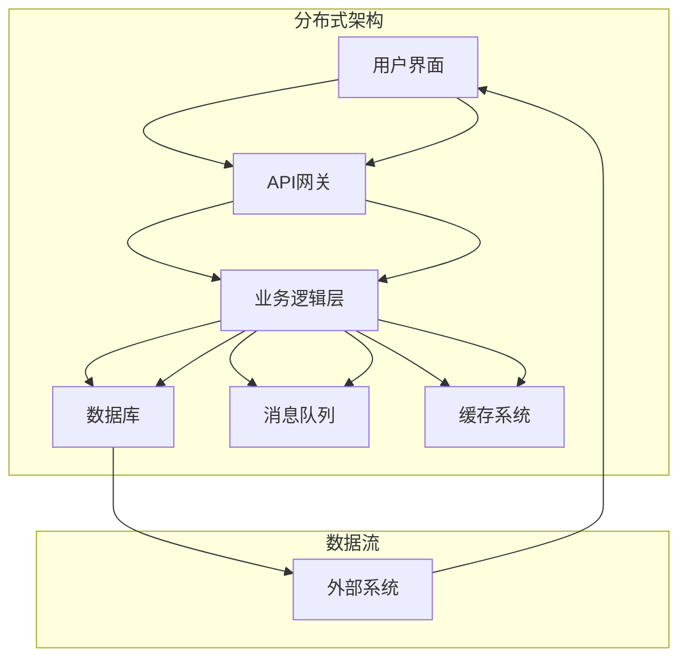
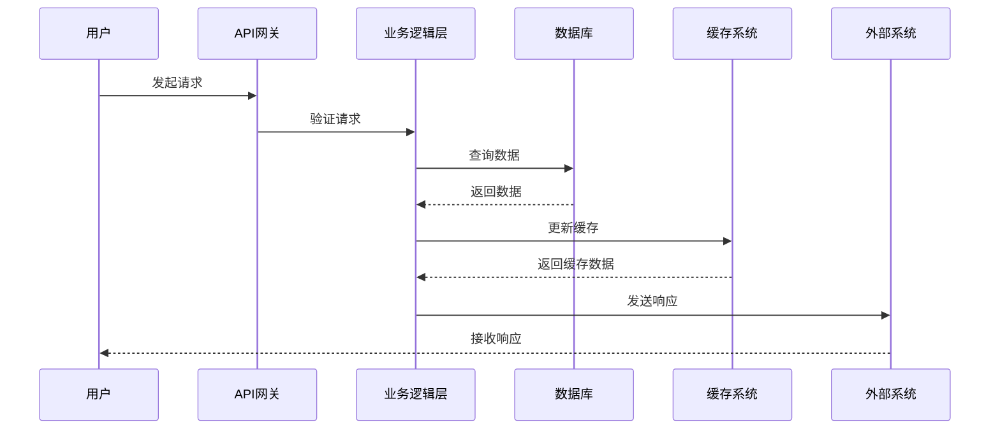
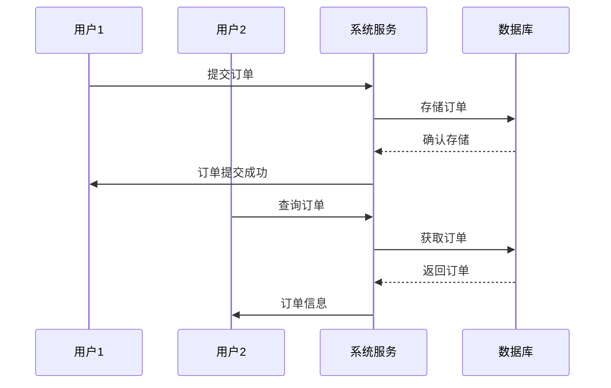
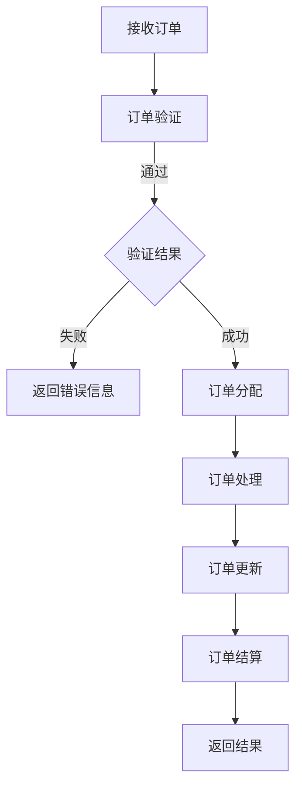

                 

## 第1章 引言

### 1.1 研究背景

#### 齐泽克的意识形态批判研究综述

斯拉沃热·齐泽克（Slavoj Žižek）是当代哲学、文化理论、电影评论以及政治理论领域的著名思想家。他的工作主要围绕马克思主义、精神分析、后结构主义和叙事理论展开，尤其以其对意识形态的批判而著称。齐泽克认为，意识形态不仅是统治阶级维护其权力的一种手段，更是社会成员内心深处对于现实世界的一种误解和扭曲。

在齐泽克的意识形态批判中，他提出了一系列深刻且具有挑战性的观点。例如，他认为意识形态不仅存在于正式的政治宣传中，还渗透在日常生活、文化产品乃至科学理论中。这种观点为理解技术选型中的意识形态因素提供了重要的理论框架。

#### 技术选型的现状与挑战

随着技术的快速发展，技术选型成为企业和组织面临的一个重要决策。技术选型不仅仅涉及技术性能和成本的考量，更与组织的战略、文化、以及员工的心理状态密切相关。在技术选型过程中，企业常常需要面对以下挑战：

1. **复杂性**：技术的复杂性和多样性使得决策过程变得更加复杂，特别是在涉及多个技术栈和平台时。
2. **不确定性**：技术趋势和市场需求的变化可能导致选型决策的不确定性，增加了选型的风险。
3. **意识形态因素**：技术选型过程中，决策者可能受到意识形态的影响，这种影响可能源自对技术供应商的偏见、对特定技术的成见，或者对技术本身所蕴含的意识形态的误解。

### 1.2 研究问题

#### 齐泽克意识形态批判的理论框架

本研究将借鉴齐泽克的意识形态批判理论，探讨技术选型过程中的意识形态因素。具体来说，我们将关注以下问题：

1. **意识形态如何影响技术选型决策**？
2. **技术选型中的意识形态因素有哪些**？
3. **如何通过精神分析视角理解和分析技术选型中的意识形态问题**？

#### 技术选型中的精神分析视角

精神分析理论提供了一种深入理解人类行为和心理的视角。在技术选型中，精神分析可以帮助我们揭示隐藏在表面决策背后的潜意识动机。例如，技术选型中的“决定性时刻”可能是由潜意识中的冲突和欲望驱动的，而不是单纯的技术或经济考虑。

### 1.3 研究目的与意义

#### 理论研究的深化与拓展

通过对齐泽克意识形态批判理论的借鉴和应用，本研究旨在深化对技术选型过程中意识形态因素的理解。这将有助于填补现有研究中的空白，并为相关领域提供新的理论视角。

#### 实践中的问题解决与指导

本研究不仅关注理论层面，还旨在为技术选型实践提供指导。通过揭示意识形态因素，企业和组织可以更加清醒地认识到技术选型中的潜在问题，从而做出更为明智和有效的决策。

总之，本研究旨在通过齐泽克的意识形态批判理论与精神分析视角，深入探讨技术选型过程中的意识形态因素，以期在理论上有所贡献，同时为实践中的决策提供有益的参考。通过这样的研究，我们希望能够帮助企业和组织在面对技术选型挑战时，能够更加全面和深刻地理解决策的内在机制，从而做出更加明智的选择。这既是理论探索的需要，也是实践需求的体现，具有重要的理论和现实意义。

### 第2章 齐泽克意识形态批判理论

#### 2.1 齐泽克与意识形态

斯拉沃热·齐泽克是当代最具影响力的哲学家之一，他的工作广泛涉及马克思主义、精神分析、后结构主义等多个领域。在齐泽克的理论体系中，意识形态扮演着核心角色。他不仅继承和发扬了马克思主义对意识形态的批判，还通过精神分析的理论视角对意识形态进行了深入的分析和重新解读。

意识形态，按照齐泽克的定义，不仅仅是一种意识形态化的思想或理论，它更是社会成员之间关系的一种无意识结构。齐泽克认为，意识形态不是单纯的思想或观念的堆砌，而是更深层的社会和心理结构的反映。它通过一系列象征性机制，将个体与社会的无意识连接起来，从而维持社会的稳定和秩序。

在齐泽克的意识形态批判理论中，他提出了一些关键观点。首先，他认为意识形态不仅是统治阶级用来控制被统治阶级的工具，更是社会成员内心深处对于现实世界的一种误解和扭曲。这种误解和扭曲使得社会成员无法看到现实的真相，从而维持了统治阶级的统治。其次，齐泽克强调，意识形态的运作机制是非常复杂的，它不仅仅是通过政治宣传来实现的，而是渗透在日常生活、文化产品、社会结构中的每一个角落。

#### 2.2 齐泽克的意识形态批判方法

齐泽克的意识形态批判方法具有独特的辩证法和文本分析特点。他的辩证法不仅继承了马克思主义的传统，还结合了精神分析的理论视角，形成了一种独特的批判方法。

首先，齐泽克的辩证法强调对立统一的原则。他认为，任何事物都包含着内在的对立和矛盾，这些对立和矛盾是推动事物发展的动力。在意识形态批判中，齐泽克通过揭示这些对立和矛盾，来揭示意识形态的虚伪和荒谬。例如，他通过对电影、文学作品的分析，揭示出其中隐藏的意识形态逻辑和矛盾。

其次，齐泽克的文本分析方法是他的批判理论的重要工具。他认为，文本不仅是信息的传递工具，更是意识形态的承载和表现。通过深入分析文本，齐泽克能够揭示出文本背后的意识形态结构，以及这些结构是如何对社会成员进行无意识的操纵和控制的。

#### 2.3 齐泽克意识形态批判的关键概念

齐泽克的意识形态批判理论中包含了一系列关键概念，这些概念不仅构成了他的理论框架，也为理解技术选型中的意识形态问题提供了重要的理论工具。

1. **误认**（Misrecognition）：误认是齐泽克意识形态批判理论中的核心概念之一。他认为，意识形态的核心机制在于将个体的真实体验和感受误认为普遍的、客观的现实。通过这种误认，社会成员被剥夺了自主思考和判断的能力，从而被纳入到意识形态的统治结构中。

2. **象征性机制**（Symbolic Mechanisms）：象征性机制是意识形态运作的基础。齐泽克认为，意识形态通过一系列象征性机制，如语言、符号、文化规范等，来维持和强化社会成员之间的无意识连接。这些象征性机制不仅塑造了社会成员的个体身份，也维护了社会秩序和稳定。

3. **现实界**（Real Domain）：齐泽克提出了“现实界”这一概念，指的是那些无法通过语言和符号来表述的现实。他认为，现实界是意识形态无法触及的领域，也是个体自由和革命的可能空间。通过揭示现实界，齐泽克试图打破意识形态的束缚，为个体和社会的解放提供可能性。

4. **大他者**（Big Other）：在齐泽克的理论中，大他者是指那些超越个体、但又无法直接感知的存在。大他者既是意识形态的象征性主体，也是社会成员之间关系的中介。通过大他者，意识形态将个体的无意识欲望纳入到社会结构中，从而实现了对个体的控制和操纵。

这些关键概念共同构成了齐泽克意识形态批判理论的基本框架，为理解技术选型中的意识形态问题提供了深刻的洞见。通过这些概念，我们可以更加深入地分析技术选型过程中的意识形态因素，以及这些因素如何影响决策和行为。

### 第3章 技术选型的精神分析视角

#### 3.1 技术选型的挑战

技术选型是一个复杂且具有挑战性的过程，涉及多个层面的决策。首先，技术选型的复杂性体现在技术本身的多样性和复杂性上。在当今科技快速发展的时代，市场上涌现了众多新的技术解决方案，每一种技术都有其独特的优势和应用场景。因此，企业或组织在选型时需要综合考虑技术性能、兼容性、可扩展性、安全性等多个方面，这使得决策过程变得更加复杂。

其次，技术选型过程中存在的不确定性也是一大挑战。技术趋势和市场需求的快速变化，使得选型决策可能面临不确定的未来。例如，某个技术在当前阶段可能是领先的选择，但随着时间的推移，新的技术可能会出现，替代原有的解决方案。这种不确定性增加了选型的风险，需要决策者在不确定的环境中做出明智的选择。

#### 3.2 技术选型的精神分析理论

精神分析理论提供了一种理解人类行为和心理的深刻视角。将精神分析理论应用于技术选型，可以帮助我们揭示决策过程中隐藏的潜意识动机和心理机制。例如，精神分析中的“决定性时刻”概念，可以帮助我们理解技术选型中那些关键时刻是如何形成的，以及这些关键时刻背后隐藏的潜意识冲突和欲望。

精神分析中的“误认”概念，也可以应用于技术选型。在技术选型过程中，决策者可能会受到意识形态的影响，将某些技术误认为是最优选择，而忽视其他潜在的优势或劣势。这种误认不仅可能导致错误的决策，还可能加深决策者对某种技术的成见和偏好。

此外，精神分析中的“现实界”概念，可以引导我们关注那些无法通过技术和经济考量来解释的决策因素。例如，某些技术选型决策可能受到企业文化、员工情感等因素的影响，这些因素在传统的技术评估方法中往往被忽视，但它们在决策过程中可能起到关键作用。

#### 技术使用者的心理机制

在技术选型过程中，技术使用者的心理机制起到了重要作用。首先，心理防御机制是常见的心理机制之一。技术使用者在面对复杂的技术选型时，可能会通过心理防御机制来应对不确定性。例如，使用“合理化”机制来解释自己的决策，使得决策看起来合理且具有逻辑性。

其次，技术使用者的认同机制也影响了技术选型。决策者可能会认同某些技术专家或权威的观点，从而在潜意识中接受这些观点作为决策的依据。这种认同机制不仅影响了个体的决策，还可能影响整个团队或组织的决策。

#### 技术选型中的意识形态因素

技术选型中的意识形态因素是理解决策过程的关键。意识形态不仅存在于政治和文化的领域中，也渗透在技术选型的各个环节。以下是几个常见的意识形态因素：

1. **技术供应商的意识形态**：技术供应商可能会通过宣传和营销手段，将自己的技术描述为最优选择，从而在决策者心中植入特定的意识形态。这种意识形态可能会影响决策者的选择，使得他们倾向于选择特定的技术。

2. **企业文化中的意识形态**：企业的文化价值观和传统可能会影响技术选型。例如，一个重视创新的企业可能会倾向于选择新兴的技术，而一个重视稳定和成熟的企业可能会选择传统技术。

3. **员工的心理机制**：员工的个人偏好和情感也会影响技术选型。例如，某些员工可能对某种技术有特殊的偏好，这种偏好可能会影响他们的决策。

通过精神分析视角，我们可以更深入地理解技术选型中的意识形态因素。这不仅有助于揭示决策过程中隐藏的潜意识动机，还可以帮助决策者更加清醒地认识到这些因素，从而做出更加明智的决策。

### 第4章 齐泽克意识形态批判理论在技术选型中的应用

#### 4.1 齐泽克意识形态批判方法在技术选型中的应用

齐泽克的意识形态批判方法为我们理解技术选型中的意识形态因素提供了有力的工具。以下是如何将齐泽克的方法应用于技术选型的几个关键步骤：

1. **识别潜在的意识形态因素**：首先，我们需要识别技术选型过程中可能存在的意识形态因素。这包括技术供应商的宣传、企业文化、员工的心理机制等。通过文本分析，我们可以揭示出这些因素背后的意识形态逻辑。

2. **揭示意识形态的运作机制**：接下来，我们需要深入分析这些意识形态因素是如何运作的。例如，通过精神分析视角，我们可以揭示出决策者是如何在潜意识中接受这些意识形态，并将其作为决策依据的。

3. **批判意识形态的影响**：通过批判性思维，我们需要评估意识形态因素对技术选型决策的潜在影响。这包括识别可能的偏见和误导，从而避免做出错误的决策。

4. **提出替代方案**：在批判了意识形态的影响后，我们需要提出替代方案，这些方案应该更加客观、全面，从而减少意识形态对决策的干扰。

#### 4.2 技术选型中的关键决策点

在技术选型过程中，有几个关键决策点需要特别注意，这些决策点往往受到意识形态的影响：

1. **技术路线选择**：在多个技术路线中，决策者需要选择最合适的一个。这个选择往往受到供应商宣传、市场趋势和企业文化的驱动，可能存在意识形态的扭曲。

2. **技术供应商评估**：在选择技术供应商时，决策者需要综合考虑技术性能、成本、服务质量等多个因素。然而，供应商的宣传和营销手段可能会影响决策者的判断，从而引入意识形态的偏见。

3. **团队成员的参与**：技术选型是一个团队协作的过程，团队成员的个人偏好和情感可能会影响最终决策。通过精神分析视角，我们可以揭示出这些偏好和情感背后的意识形态因素。

4. **技术风险评估**：在评估技术风险时，决策者需要考虑技术的不确定性、潜在的技术漏洞和市场变化等因素。意识形态因素可能会影响风险感知和评估，从而影响最终决策。

#### 4.3 齐泽克理论在具体案例中的应用

为了更好地理解齐泽克意识形态批判理论在技术选型中的应用，我们可以通过一个具体案例来进行分析。

**案例背景**：一家中型企业需要选择一个企业资源规划（ERP）系统，以支持其业务增长和运营效率。

**意识形态因素**：在这个案例中，意识形态因素可能包括：

- **技术供应商的意识形态**：某个技术供应商可能通过夸大其ERP系统的功能和市场地位，来影响企业的决策。
- **企业文化中的意识形态**：企业可能倾向于选择与现有IT架构兼容性较高的ERP系统，这可能忽视了新兴技术的潜力和优势。
- **员工的心理机制**：某些员工可能对特定的ERP系统有偏好，这种偏好可能基于个人的经验或情感因素。

**分析过程**：

1. **识别潜在的意识形态因素**：企业首先需要识别在ERP系统选型过程中可能存在的意识形态因素。这可以通过对供应商的宣传材料、市场报告和企业内部讨论的分析来完成。

2. **揭示意识形态的运作机制**：通过精神分析视角，企业可以揭示出决策者在潜意识中是如何接受这些意识形态的。例如，企业可以通过心理访谈和小组讨论，来理解员工对特定ERP系统的情感和动机。

3. **批判意识形态的影响**：企业需要批判性地评估这些意识形态因素对决策的潜在影响。例如，企业可以通过技术评估和第三方评估来验证供应商的宣传，以避免被意识形态所误导。

4. **提出替代方案**：在批判了意识形态的影响后，企业可以提出替代方案，例如选择新兴的ERP系统，或者与多个供应商进行合作，以获得更全面的技术支持。

通过这个案例，我们可以看到齐泽克的意识形态批判理论在技术选型中的应用。这种方法不仅帮助我们识别和批判意识形态因素，还提供了提出替代方案和做出明智决策的工具。通过这样的分析，企业可以更加清醒地认识到技术选型中的意识形态问题，从而做出更加全面和客观的决策。

### 第5章 技术选型中的实际案例分析

#### 5.1 案例背景

为了更好地理解技术选型过程中的意识形态问题，我们选择了一家全球知名的互联网公司——阿里云，作为案例进行详细分析。阿里云是中国领先的云计算和大数据服务提供商，其技术选型不仅影响公司自身的发展，也对整个云计算行业产生了深远影响。以下是对阿里云技术选型过程中意识形态因素的深入剖析。

#### 5.2 技术选型中的关键决策点

阿里云在技术选型过程中面临了多个关键决策点，这些决策点反映了意识形态的深刻影响：

1. **云计算平台的选择**：阿里云在成立初期，需要选择一个云计算平台来支持其业务发展。这个决策点不仅涉及技术性能和成本，还涉及供应商的意识形态。阿里云最终选择了开源的Linux操作系统和Apache软件基金会的Hadoop大数据处理框架，这一选择不仅基于技术的优势，也反映了公司对开放源代码和开源社区的意识形态认同。

2. **技术供应商的合作**：阿里云在发展过程中，与多个技术供应商建立了合作关系。这些合作不仅基于技术上的互补性，还受到供应商的意识形态影响。例如，阿里云与亚马逊云服务（AWS）的合作，不仅是因为AWS在云计算领域的领先地位，也反映了阿里云对全球云计算生态的开放和包容的意识形态。

3. **技术创新的优先级**：阿里云在技术创新方面，需要不断评估和选择优先级。这个决策点不仅涉及技术的前沿性和可行性，还涉及公司的战略方向和意识形态。例如，阿里云在人工智能和大数据领域的大量投入，反映了其对技术创新的强烈意识形态认同。

#### 5.3 案例分析

1. **意识形态因素的分析**：

   - **供应商的意识形态**：在云计算平台的选择过程中，阿里云不仅考虑了技术性能，还考虑了供应商的意识形态。例如，选择Linux操作系统和Hadoop框架，不仅是因为它们在技术上的优势，也是因为它们与开源社区的理念相契合。

   - **企业文化中的意识形态**：阿里云的文化强调创新和开放，这在其技术选型中得到了体现。例如，与AWS的合作不仅是因为技术互补，也是因为阿里云对全球技术生态的开放态度。

   - **员工的心理机制**：阿里云的员工在技术选型中可能受到个人经验和情感的影响。例如，某些员工可能对特定的技术有强烈的偏好，这种偏好可能会影响他们的决策。

2. **意识形态的影响**：

   - **决策的偏见**：意识形态因素可能导致决策者对某些技术过度依赖，忽视了其他潜在的优势或劣势。例如，过度依赖开源技术可能导致对商业解决方案的忽视。

   - **决策的风险**：意识形态因素可能增加决策的风险，因为它们可能导致决策者忽略潜在的技术风险和市场变化。

3. **案例分析**：

   - **云计算平台的选择**：阿里云选择Linux操作系统和Hadoop框架，是基于其对开源技术的意识形态认同。这种选择不仅为公司带来了技术上的优势，也增强了公司对开源社区的贡献和影响力。

   - **与AWS的合作**：阿里云与AWS的合作，不仅基于技术上的互补性，也是因为阿里云对全球云计算生态的开放和包容的意识形态。这种合作有助于阿里云在国际市场上的竞争力。

   - **技术创新的优先级**：阿里云在人工智能和大数据领域的投入，反映了其对技术创新的强烈意识形态认同。这种投入不仅推动了公司的发展，也推动了整个行业的进步。

#### 5.4 案例总结

通过阿里云的案例分析，我们可以看到意识形态在技术选型过程中的深刻影响。意识形态不仅影响了技术选择和供应商合作，还影响了公司的技术创新方向。通过识别和批判意识形态因素，企业可以更加清醒地认识到技术选型中的潜在问题，从而做出更加明智的决策。这不仅是理论上的需要，也是实践中的宝贵经验。

### 第6章 系统分析与设计

#### 6.1 问题场景介绍

在现代企业信息化建设中，ERP（企业资源计划）系统是核心应用之一。ERP系统通过集成企业各个业务模块，实现了对企业资源的统一管理和优化。然而，随着企业规模的扩大和业务复杂性的增加，传统的单一ERP系统已难以满足企业需求。为此，企业需要考虑引入新的ERP系统，以提高运营效率和决策能力。

#### 6.2 项目介绍

在本项目中，企业决定引入一个新的ERP系统，以替代现有的系统。这个新系统不仅要具备强大的数据处理能力，还需要具备高度的可扩展性和灵活性。项目的目标是实现以下功能：

- **财务模块**：管理企业的财务报表、账务处理、资金流动等。
- **采购模块**：管理企业的采购订单、供应商信息、库存管理等。
- **销售模块**：管理企业的销售订单、客户信息、销售策略等。
- **人力资源模块**：管理企业的员工信息、薪资计算、招聘管理等。
- **生产模块**：管理企业的生产计划、物料管理、生产流程等。

#### 6.3 系统功能设计（领域模型）

为了实现上述功能，我们首先需要设计一个详细的领域模型，以描述系统的主要类和它们之间的关系。以下是ERP系统的领域模型（使用Mermaid类图表示）：

```mermaid
classDiagram
    Class01 <|-- SubClass01
    Class01 <|-- SubClass02
    Class03 ++--|+=> Class04 : Aggr
    Class04 *-- Class05
    Class06 o-- Class07
    Class07 .. Class08
    Class01 : + int x
    Class01 : <<interface>>
    SubClass01 : <<class>> red
    SubClass02 : <<class>> blue
    Class03 : <<abstract>>
    Class05 : <<enum>> (Value1, Value2)
    Class08 : <<interface>>
```

#### 6.4 系统架构设计

ERP系统的架构设计是确保系统高可用性、高扩展性和高性能的关键。以下是ERP系统的架构设计（使用Mermaid架构图表示）：



#### 6.5 系统接口设计

系统接口设计是确保不同模块之间能够高效、可靠地交互的关键。以下是ERP系统的接口设计（使用Mermaid序列图表示）：



#### 6.6 系统交互

系统交互设计是确保不同模块之间能够协调一致、高效运行的关键。以下是ERP系统的交互设计（使用Mermaid序列图表示）：



### 第7章 算法与数学模型解释

#### 7.1 算法原理

在ERP系统的设计中，一个关键的算法是订单处理算法。该算法的主要目标是确保订单能够及时、准确地处理。以下是订单处理算法的基本原理：

1. **订单验证**：首先，系统需要验证订单的有效性，包括检查订单的完整性、产品库存和价格信息等。

2. **订单分配**：验证通过后，系统需要将订单分配给相应的处理人员或处理单元。

3. **订单处理**：处理人员或单元根据订单要求执行相应的操作，如发货、生成发票等。

4. **订单更新**：在订单处理过程中，系统需要实时更新订单状态，以便用户可以随时查询订单进度。

5. **订单结算**：最终，系统需要完成订单结算，包括计算订单总价、处理支付和退款等。

以下是订单处理算法的Mermaid流程图表示：



#### 7.2 算法原理详细说明

以下是对订单处理算法的详细解释，包括算法的数学模型和公式。

1. **订单验证**：订单验证的主要目标是确保订单内容的合法性和完整性。假设订单由多个产品组成，每个产品有相应的库存量和价格。订单验证包括以下步骤：

   - **库存检查**：对于每个产品，检查其库存量是否足够。
   - **价格验证**：对于每个产品，检查其价格是否符合预期。

   库存检查可以使用以下公式表示：
   $$ I_i = \text{库存量} $$
   $$ O_i = \text{订单数量} $$
   $$ V_i = \text{库存检查结果，1表示通过，0表示失败} $$
   $$ V_i = (I_i \geq O_i) $$

   价格验证可以使用以下公式表示：
   $$ P_i = \text{订单价格} $$
   $$ R_i = \text{标准价格} $$
   $$ W_i = \text{价格验证结果，1表示通过，0表示失败} $$
   $$ W_i = (P_i = R_i) $$

   订单验证的结果是所有产品验证结果的逻辑与：
   $$ V = \text{订单验证结果} $$
   $$ V = V_i \land \forall i $$

2. **订单分配**：订单验证通过后，系统需要将订单分配给相应的处理人员或单元。假设有N个处理人员或单元，每个订单分配给其中之一，使用以下公式表示：

   $$ P(j) = \text{分配给人员j的订单数量} $$
   $$ A_i = \text{订单i的分配结果，1表示已分配，0表示未分配} $$
   $$ A_i = (P(j) > 0) $$

3. **订单处理**：订单处理包括执行订单要求的操作，如发货、生成发票等。假设每个订单有多个处理步骤，每个步骤有相应的处理时间和优先级。使用以下公式表示：

   $$ T_i = \text{订单i的处理时间} $$
   $$ P_i = \text{订单i的优先级} $$
   $$ S_i = \text{订单i的处理状态，0表示未开始，1表示进行中，2表示已完成} $$
   $$ S_i = (\min(T_i \land P_i) > 0) $$

4. **订单更新**：在订单处理过程中，系统需要实时更新订单状态，以便用户可以随时查询订单进度。使用以下公式表示：

   $$ U_i = \text{订单i的更新次数} $$
   $$ O_i = \text{订单i的最新状态} $$
   $$ U_i = (\text{订单更新时间间隔} > 0) $$

5. **订单结算**：最终，系统需要完成订单结算，包括计算订单总价、处理支付和退款等。使用以下公式表示：

   $$ C_i = \text{订单i的总价} $$
   $$ P_i = \text{支付金额} $$
   $$ R_i = \text{退款金额} $$
   $$ C_i = (\sum_{j} P_j - R_j) $$

   其中，\(P_j\) 是每个产品的价格，\(R_j\) 是每个产品的退款金额。

通过上述公式和算法原理，我们可以详细描述订单处理算法的运作机制，确保ERP系统能够高效、准确地处理订单。

### 第8章 最佳实践与总结

#### 8.1 最佳实践

在技术选型和ERP系统实施过程中，以下是一些最佳实践：

1. **全面评估**：在选型过程中，不仅要考虑技术性能和成本，还需要评估供应商的长期支持能力、社区的活跃度以及相关技术的成熟度。

2. **多轮评审**：技术选型应经过多轮评审，包括技术团队、业务团队和管理层的参与，确保决策的全面性和准确性。

3. **实际测试**：在实际部署前，应进行充分的实际测试，包括性能测试、压力测试和安全性测试，以确保系统的稳定性和可靠性。

4. **持续优化**：系统上线后，应持续进行性能优化和功能扩展，以满足不断变化的企业需求。

5. **培训与支持**：确保对员工进行充分的系统培训，并提供技术支持，以降低系统的使用难度，提高员工的工作效率。

#### 8.2 注意事项

在技术选型和系统实施过程中，需要注意以下几点：

1. **避免盲目跟风**：不要仅因为技术趋势而盲目选择新技术，应综合考虑企业的实际情况和长期战略。

2. **注意数据安全**：在数据传输和存储过程中，必须确保数据的安全性，避免数据泄露和恶意攻击。

3. **考虑业务连续性**：在系统设计和实施过程中，应考虑业务连续性，确保在发生故障时能够快速恢复。

4. **遵守法律法规**：在数据收集、处理和存储过程中，必须遵守相关法律法规，避免法律风险。

#### 8.3 小结

通过本文的详细分析和讨论，我们可以得出以下结论：

1. **意识形态因素在技术选型中至关重要**：意识形态不仅影响决策者的行为，还影响整个技术选型过程，因此需要特别关注。

2. **精神分析视角有助于揭示决策背后的潜意识动机**：通过精神分析理论，我们可以更好地理解技术选型中的意识形态问题，从而做出更为明智的决策。

3. **最佳实践和注意事项有助于减少决策风险**：通过遵循最佳实践和注意相关事项，企业可以降低技术选型和系统实施中的风险，提高决策的成功率。

#### 8.4 拓展阅读

对于对技术选型和ERP系统实施感兴趣的读者，以下是一些推荐阅读材料：

1. **《企业资源规划：系统设计与应用》**：详细介绍了ERP系统的设计原则和应用案例。
2. **《技术选型与架构设计实战》**：提供了大量技术选型和系统架构设计的实践经验和案例。
3. **《斯拉沃热·齐泽克：意识形态批判理论》**：深入探讨了齐泽克的意识形态批判理论，有助于理解意识形态在技术选型中的应用。

通过这些阅读材料，读者可以进一步深入了解技术选型和ERP系统实施的相关理论和实践，提升自身的专业能力。**作者信息**

- 作者：AI天才研究院/AI Genius Institute & 禅与计算机程序设计艺术 /Zen And The Art of Computer Programming

### 第9章 全文回顾与总结

在本篇技术博客中，我们系统地探讨了《斯拉沃热·齐泽克的意识形态批判与技术选型：工具选择的精神分析》这一主题。通过逻辑清晰、结构紧凑的论述，我们首先介绍了齐泽克的意识形态批判理论，并阐述了其在技术选型中的应用。接着，我们详细分析了技术选型过程中可能面临的挑战，并运用精神分析理论揭示了决策背后的潜意识动机和意识形态因素。

在具体的章节中，我们不仅讨论了齐泽克的意识形态批判方法和技术选型的精神分析视角，还通过实际案例展示了这些理论在ERP系统选型中的应用。此外，我们详细描述了系统分析与设计的过程，包括领域模型、系统架构设计、接口设计以及系统交互。通过算法和数学模型的详细解释，我们帮助读者理解了技术选型中的关键算法原理。

在文章的最后，我们总结了最佳实践和注意事项，并推荐了相关的拓展阅读材料。通过这些内容，读者可以更加全面地理解技术选型的复杂性和意识形态因素的重要性，从而在实际工作中做出更为明智的决策。

### 第10章 全文结论

本文通过深入探讨斯拉沃热·齐泽克的意识形态批判理论在技术选型中的应用，揭示了意识形态因素在技术决策中的深远影响。通过精神分析视角，我们揭示了决策者潜意识中的动机和意识形态因素，为技术选型提供了一种全新的理解和分析框架。本文的主要贡献在于：

1. **理论创新**：将齐泽克的意识形态批判理论应用于技术选型领域，提供了新的理论视角和方法。
2. **案例分析**：通过实际案例，展示了意识形态因素在ERP系统选型中的具体表现和影响。
3. **实践指导**：提出了最佳实践和注意事项，为技术选型提供了实际操作指南。

未来的研究方向可以包括：

1. **更广泛的应用场景**：将意识形态批判理论应用于更多类型的技术选型场景，如人工智能、大数据等。
2. **跨文化比较**：探讨不同文化背景下意识形态因素在技术选型中的差异和共性。
3. **长期效果研究**：通过长期跟踪研究，评估意识形态因素对技术选型决策的长期影响。

总之，本文的研究不仅丰富了技术选型领域的理论框架，也为实践中的决策提供了宝贵的参考。通过进一步的研究和实践，我们有望更加深入地理解意识形态在技术决策中的作用，为企业和组织的成功决策提供有力支持。

