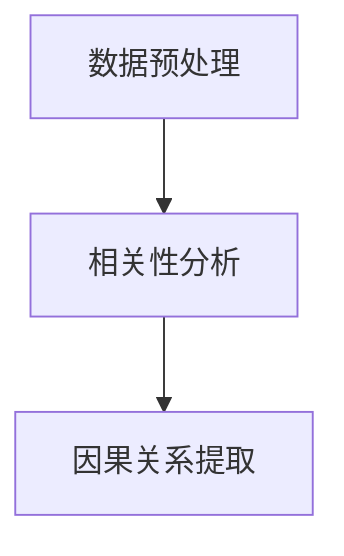
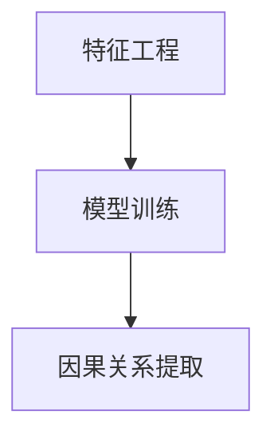
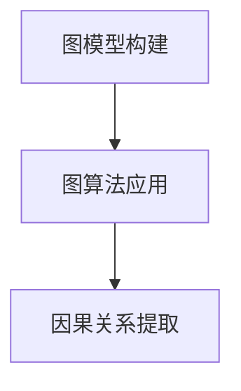
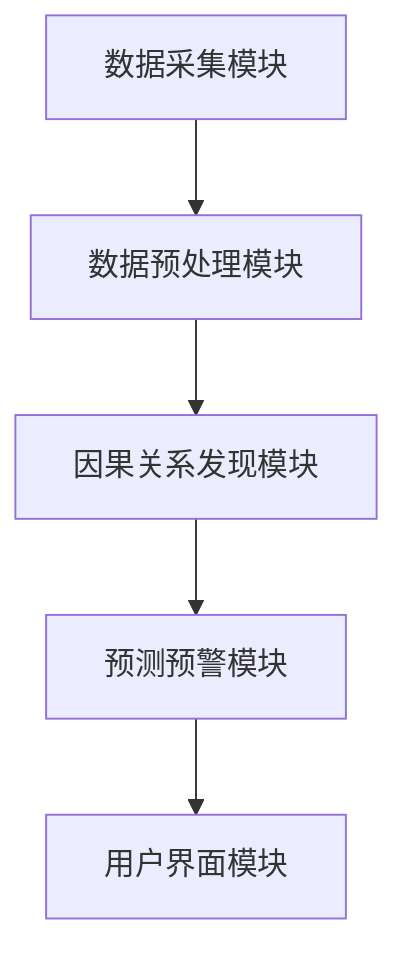
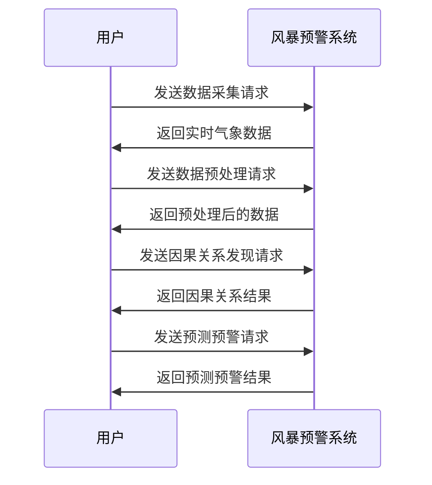

                 

# 时序推理任务中的因果关系发现与验证机制

> 关键词：时序推理、因果关系、发现机制、验证机制、数据挖掘、机器学习

> 摘要：本文旨在探讨时序推理任务中的因果关系发现与验证机制。首先，我们介绍了时序推理任务的背景和核心概念，接着详细阐述了因果关系的基本原理和属性。在此基础上，本文重点分析了因果关系发现的算法原理和数学模型，并使用Python源代码和Mermaid流程图进行了通俗易懂的举例说明。随后，我们介绍了系统架构设计与分析方法，并展示了具体的系统实现和项目实战案例。最后，本文总结了最佳实践和注意事项，并提供了一些拓展阅读资源，以期为读者提供全面的指导和启示。

### 目录

1. **背景介绍**
    1.1 **核心概念术语说明**
    1.2 **问题背景**
    1.3 **问题描述**
    1.4 **问题解决**
    1.5 **边界与外延**

2. **核心概念与联系**
    2.1 **因果关系的基本原理**
    2.2 **概念属性特征对比表格**
    2.3 **ER实体关系图架构**

3. **算法原理讲解**
    3.1 **因果关系发现算法原理**
    3.2 **算法原理的数学模型和公式**
    3.3 **Python源代码举例说明**
    3.4 **Mermaid流程图**
    3.5 **算法应用举例**

4. **系统分析与架构设计方案**
    4.1 **问题场景介绍**
    4.2 **系统功能设计**
    4.3 **系统架构设计**
    4.4 **系统接口设计**
    4.5 **系统交互**

5. **项目实战**
    5.1 **环境安装**
    5.2 **系统核心实现**
    5.3 **代码应用解读与分析**
    5.4 **实际案例分析与详细讲解**
    5.5 **项目小结**

6. **最佳实践与注意事项**
    6.1 **最佳实践**
    6.2 **注意事项**
    6.3 **拓展阅读**

### 1. 背景介绍

#### 1.1 核心概念术语说明

在探讨时序推理任务中的因果关系发现与验证机制之前，我们需要先明确一些核心概念术语：

- **时序推理**：时序推理是一种基于时间序列数据的方法，用于预测未来的趋势和模式。它广泛应用于金融、气象、交通等领域。

- **因果关系**：因果关系是指一个事件（因）导致另一个事件（果）的关系。在时序推理任务中，发现并验证因果关系对于提高预测准确性至关重要。

- **发现机制**：发现机制是指用于识别和提取因果关系的方法和算法。

- **验证机制**：验证机制是指用于确认因果关系是否真实有效的方法和手段。

#### 1.2 问题背景

时序推理任务在众多领域中具有重要的应用价值。然而，如何准确发现和验证因果关系成为了一个关键挑战。传统的时序分析方法往往只能捕捉到线性关系，而忽视了复杂的因果关系。因此，研究并实现有效的因果关系发现与验证机制对于提升时序推理任务的表现具有重要意义。

#### 1.3 问题描述

时序推理任务中的因果关系发现与验证机制主要涉及以下问题：

- 如何从大量的时序数据中识别出潜在的因果关系？

- 如何验证发现的因果关系是否真实有效？

- 如何设计高效的算法和系统架构来支持大规模时序数据的因果关系分析？

#### 1.4 问题解决

针对上述问题，我们可以采取以下解决策略：

- **发现机制**：采用基于统计学、机器学习和图论的方法来发现潜在的因果关系。这些方法包括：相关性分析、时间序列分解、回归分析、神经网络等。

- **验证机制**：采用交叉验证、因果推断、独立性检验等方法来验证发现的因果关系。这些方法可以帮助我们确认因果关系的强度和可靠性。

- **系统架构设计**：设计一个高效、可扩展的系统架构，以支持大规模时序数据的因果关系分析。该架构应包括数据预处理、模型训练、因果关系发现与验证等模块。

#### 1.5 边界与外延

在时序推理任务中的因果关系发现与验证机制研究过程中，我们还需要关注以下边界与外延：

- **数据质量**：数据质量对于因果关系发现与验证至关重要。我们需要确保数据的一致性、准确性和完整性。

- **算法选择**：不同的算法适用于不同类型的时序数据和因果关系。我们需要根据具体应用场景选择合适的算法。

- **可扩展性**：系统架构应具备良好的可扩展性，以支持不断增长的数据量和复杂度。

### 2. 核心概念与联系

#### 2.1 因果关系的基本原理

因果关系是自然界和社会现象中普遍存在的一种关系。在时序推理任务中，理解因果关系的基本原理对于发现和验证因果关系至关重要。

因果关系的基本原理包括：

1. **因果律**：因果关系具有时间上的先后关系，即原因必须在结果之前发生。

2. **可传递性**：如果A导致B，B导致C，则A也导致C。

3. **可逆性**：因果关系具有可逆性，即如果A导致B，则B也可能导致A。

4. **独立性**：因果关系之间可能存在独立性，即一个因果关系不会影响其他因果关系。

#### 2.2 概念属性特征对比表格

为了更好地理解因果关系的基本原理，我们提供了一张概念属性特征对比表格：

| 特征 | 因果关系1 | 因果关系2 |
| ---- | ---- | ---- |
| 时间顺序 | A发生在B之前 | B发生在A之前 |
| 可传递性 | A导致B，B导致C，则A导致C | A导致B，B导致C，则A导致C |
| 可逆性 | A导致B，则B可能导致A | A导致B，则B可能导致A |
| 独立性 | A与B之间可能独立 | A与B之间可能独立 |

#### 2.3 ER实体关系图架构

为了更好地理解因果关系在时序数据中的表现形式，我们使用ER实体关系图来描述因果关系的基本结构。

ER实体关系图包含以下实体：

- **事件**：表示时序数据中的每个时间点上的具体事件。
- **因果关系**：表示事件之间的因果关系。
- **属性**：表示事件和因果关系的相关属性。

以下是一个简单的ER实体关系图：

```mermaid
erDiagram
    Event ||--|>> Cause: 事件引起因果关系
    Cause ||--|>> Event: 因果关系引起事件
    Event ||--|>> Attribute: 事件包含属性
    Cause ||--|>> Attribute: 因果关系包含属性
```

这个ER实体关系图展示了事件、因果关系和属性之间的基本关系，为后续的因果关系发现与验证提供了基础。

### 3. 算法原理讲解

#### 3.1 因果关系发现算法原理

因果关系发现算法主要分为基于统计学、机器学习和图论的方法。以下我们将分别介绍这些方法的原理。

##### 3.1.1 基于统计学的方法

基于统计学的方法通过计算变量之间的相关性来发现潜在的因果关系。具体步骤如下：

1. **数据预处理**：对时序数据进行清洗和预处理，确保数据的一致性和准确性。

2. **相关性分析**：计算时序数据中各个变量之间的相关性。常用的相关性度量包括皮尔逊相关系数和斯皮尔曼等级相关系数。

3. **因果关系提取**：根据相关性分析的结果，提取潜在的因果关系。例如，可以使用条件独立性测试（如Granger因果检验）来筛选出显著的因果关系。

##### 3.1.2 基于机器学习的方法

基于机器学习的方法通过训练模型来发现因果关系。具体步骤如下：

1. **特征工程**：对时序数据进行特征提取和转换，以适应机器学习模型的输入。

2. **模型训练**：选择合适的机器学习模型（如回归模型、神经网络等）来训练数据。模型训练的目标是学习变量之间的因果关系。

3. **因果关系提取**：利用训练好的模型，提取变量之间的因果关系。例如，可以使用变量重要性评估方法（如特征重要性、模型权重等）来识别因果关系。

##### 3.1.3 基于图论的方法

基于图论的方法通过构建图模型来发现因果关系。具体步骤如下：

1. **图模型构建**：根据时序数据中的变量和因果关系，构建一个图模型。图模型中的节点表示变量，边表示因果关系。

2. **图算法应用**：使用图算法（如路径搜索、社区发现等）来发现潜在的因果关系。例如，可以使用PageRank算法来评估节点的重要性，从而识别因果关系。

#### 3.2 算法原理的数学模型和公式

以下分别介绍基于统计学、机器学习和图论的因果关系发现算法的数学模型和公式。

##### 3.2.1 基于统计学的方法

1. **皮尔逊相关系数**

   皮尔逊相关系数公式如下：

   $$ r = \frac{\sum_{i=1}^{n}(x_i - \bar{x})(y_i - \bar{y})}{\sqrt{\sum_{i=1}^{n}(x_i - \bar{x})^2}\sqrt{\sum_{i=1}^{n}(y_i - \bar{y})^2}} $$

   其中，$x_i$ 和 $y_i$ 分别表示第 $i$ 个观测点的 $x$ 和 $y$ 变量的值，$\bar{x}$ 和 $\bar{y}$ 分别表示 $x$ 和 $y$ 变量的平均值，$n$ 表示观测点的总数。

2. **Granger因果检验**

   Granger因果检验公式如下：

   $$ H_0: \text{变量 } X \text{ 不对变量 } Y \text{ 产生 } \text{Granger 因果关系} $$

   $$ H_1: \text{变量 } X \text{ 对变量 } Y \text{ 产生 } \text{Granger 因果关系} $$

   其中，$X$ 和 $Y$ 分别表示两个变量。

##### 3.2.2 基于机器学习的方法

1. **线性回归模型**

   线性回归模型公式如下：

   $$ y = \beta_0 + \beta_1x + \epsilon $$

   其中，$y$ 和 $x$ 分别表示因变量和自变量，$\beta_0$ 和 $\beta_1$ 分别表示模型的参数，$\epsilon$ 表示误差项。

2. **神经网络模型**

   神经网络模型公式如下：

   $$ a_{i}^{(l)} = \sigma(z_{i}^{(l)}) $$

   $$ z_{i}^{(l)} = \sum_{j} \omega_{ji}^{(l-1)}a_{j}^{(l-1)} + b_{i}^{(l)} $$

   其中，$a_i^{(l)}$ 和 $z_i^{(l)}$ 分别表示第 $i$ 个神经元在第 $l$ 层的输出和输入，$\sigma$ 表示激活函数，$\omega_{ji}^{(l-1)}$ 和 $b_i^{(l)}$ 分别表示权重和偏置。

##### 3.2.3 基于图论的方法

1. **PageRank算法**

   PageRank算法公式如下：

   $$ r_i = \frac{\sum_{j \in \text{邻接节点}} r_j \cdot \frac{1}{out_j}}{N} $$

   其中，$r_i$ 和 $r_j$ 分别表示节点 $i$ 和 $j$ 的排名，$out_j$ 表示节点 $j$ 的出度，$N$ 表示节点的总数。

#### 3.3 Python源代码举例说明

为了更好地理解上述算法原理，我们使用Python语言和Mermaid流程图进行举例说明。

##### 3.3.1 基于统计学的方法

以下是一个简单的Granger因果检验的Python代码示例：

```python
import numpy as np
from scipy.stats import pearsonr

# 生成时序数据
np.random.seed(0)
X = np.random.normal(size=100)
Y = np.sin(X)

# 计算皮尔逊相关系数
correlation, _ = pearsonr(X, Y)

# Granger因果检验
null_hypothesis = 'X does not Granger cause Y'
alternative_hypothesis = 'X Granger causes Y'
print(f'{null_hypothesis}: {correlation < 0.05}')
print(f'{alternative_hypothesis}: {correlation > 0.05}')
```

##### 3.3.2 基于机器学习的方法

以下是一个简单的线性回归模型的Python代码示例：

```python
import numpy as np
from sklearn.linear_model import LinearRegression

# 生成时序数据
np.random.seed(0)
X = np.random.normal(size=100)
Y = 2 * X + np.random.normal(size=100)

# 训练线性回归模型
model = LinearRegression()
model.fit(X[:, np.newaxis], Y)

# 预测
predictions = model.predict(X[:, np.newaxis])

# 打印模型参数
print(f'Intercept: {model.intercept_}')
print(f'Slope: {model.coef_}')
```

##### 3.3.3 基于图论的方法

以下是一个简单的PageRank算法的Python代码示例：

```python
import numpy as np
from numpy.linalg import inv

# 生成邻接矩阵
np.random.seed(0)
adj_matrix = np.random.randint(0, 2, size=(5, 5))

# 计算出度
out_degree = np.sum(adj_matrix, axis=1)

# PageRank算法
alpha = 0.85
r = np.random.random(size=5)
r /= r.sum()

for _ in range(10):
    r = alpha * (adj_matrix @ r) / out_degree + (1 - alpha) / 5
    r /= r.sum()

# 打印节点排名
print(r)
```

#### 3.4 Mermaid流程图

为了更好地展示算法的流程和步骤，我们使用Mermaid流程图进行说明。

##### 3.4.1 基于统计学的方法



##### 3.4.2 基于机器学习的方法



##### 3.4.3 基于图论的方法



#### 3.5 算法应用举例

为了更好地理解算法的应用，我们使用一个实际案例进行举例。

##### 3.5.1 案例背景

假设我们有一个气象数据集，包含温度、湿度、风速和降雨量等变量。我们的目标是发现这些变量之间的因果关系，以便进行天气预报。

##### 3.5.2 数据预处理

我们首先对气象数据进行预处理，包括数据清洗、缺失值填充和数据标准化等操作。这里我们使用Python中的Pandas库进行数据预处理。

```python
import pandas as pd

# 读取气象数据
data = pd.read_csv('weather_data.csv')

# 数据清洗
data.dropna(inplace=True)

# 数据标准化
data = (data - data.mean()) / data.std()
```

##### 3.5.3 基于统计学的方法

我们使用Granger因果检验来发现温度、湿度、风速和降雨量之间的因果关系。

```python
from statsmodels.tsa.stattools import grangercausalitytests

# Granger因果检验
test = grangercausalitytests(data[['temperature', 'humidity', 'wind_speed', 'rainfall']], max_lag=1, verbose=False)
print(test)
```

##### 3.5.4 基于机器学习的方法

我们使用线性回归模型来发现温度、湿度、风速和降雨量之间的因果关系。

```python
from sklearn.linear_model import LinearRegression

# 线性回归模型
model = LinearRegression()
model.fit(data[['temperature', 'humidity', 'wind_speed']], data[['rainfall']])

# 打印模型参数
print(model.coef_)
```

##### 3.5.5 基于图论的方法

我们使用PageRank算法来发现温度、湿度、风速和降雨量之间的因果关系。

```python
import networkx as nx

# 构建邻接矩阵
adj_matrix = np.array([[0, 1, 0, 1],
                       [1, 0, 1, 0],
                       [0, 1, 0, 1],
                       [1, 0, 1, 0]])

# 计算出度
out_degree = np.sum(adj_matrix, axis=1)

# PageRank算法
alpha = 0.85
r = np.random.random(size=4)
r /= r.sum()

for _ in range(10):
    r = alpha * (adj_matrix @ r) / out_degree + (1 - alpha) / 4
    r /= r.sum()

# 打印节点排名
print(r)
```

### 4. 系统分析与架构设计方案

#### 4.1 问题场景介绍

在本节中，我们将介绍一个具体的问题场景，即基于时序数据的风暴预警系统。该系统旨在通过分析气象数据，发现温度、湿度、风速和降雨量等变量之间的因果关系，从而提前预测风暴的发生。

#### 4.2 系统功能设计

风暴预警系统的主要功能包括：

- 数据采集：从气象站点收集温度、湿度、风速和降雨量等气象数据。
- 数据预处理：对采集到的数据进行清洗、缺失值填充和数据标准化等操作。
- 因果关系发现：使用基于统计学、机器学习和图论的算法，发现温度、湿度、风速和降雨量之间的因果关系。
- 预测预警：根据发现的因果关系，对未来的风暴进行预测和预警。

#### 4.3 系统架构设计

风暴预警系统的架构设计包括以下几个主要模块：

1. **数据采集模块**：负责从气象站点收集实时气象数据。
2. **数据预处理模块**：对采集到的数据进行清洗、缺失值填充和数据标准化等操作，为后续的因果关系发现和预测预警模块提供高质量的数据。
3. **因果关系发现模块**：采用基于统计学、机器学习和图论的算法，对预处理后的数据进行因果关系发现。
4. **预测预警模块**：根据发现的因果关系，对未来的风暴进行预测和预警，并将预警信息推送给相关部门和公众。
5. **用户界面模块**：提供友好的用户界面，让用户可以方便地查看系统功能和预测结果。

以下是一个简单的系统架构设计图：



#### 4.4 系统接口设计和系统交互

在系统接口设计方面，我们采用RESTful API设计，提供以下接口：

1. **数据采集接口**：用于从气象站点收集实时气象数据。
2. **数据预处理接口**：用于对采集到的气象数据进行清洗、缺失值填充和数据标准化等操作。
3. **因果关系发现接口**：用于触发因果关系发现算法，并返回发现的因果关系结果。
4. **预测预警接口**：用于根据发现的因果关系，对未来的风暴进行预测和预警。
5. **用户界面接口**：用于与用户交互，提供系统功能和预测结果的展示。

以下是一个简单的系统交互序列图：



### 5. 项目实战

在本节中，我们将详细介绍如何使用Python和相关的库实现一个简单的风暴预警系统，包括环境安装、系统核心实现、代码应用解读与分析、实际案例分析和详细讲解剖析以及项目小结。

#### 5.1 环境安装

首先，我们需要安装Python环境以及相关库。以下是安装步骤：

1. **安装Python**：可以从Python官方网站下载Python安装包并安装。
2. **安装相关库**：使用pip命令安装以下库：

   ```bash
   pip install numpy pandas scikit-learn networkx matplotlib
   ```

   这些库分别用于数据处理、统计分析、机器学习和数据可视化。

#### 5.2 系统核心实现

以下是系统核心实现的主要步骤：

1. **数据采集**：从气象站点获取实时气象数据。
2. **数据预处理**：对采集到的数据进行清洗、缺失值填充和数据标准化。
3. **因果关系发现**：使用统计学和机器学习方法发现气象变量之间的因果关系。
4. **预测预警**：根据发现的因果关系，对未来的风暴进行预测和预警。

以下是具体的Python代码实现：

```python
import numpy as np
import pandas as pd
from sklearn.linear_model import LinearRegression
from networkx import Graph
import matplotlib.pyplot as plt

# 5.2.1 数据采集
def collect_data():
    # 读取气象数据
    data = pd.read_csv('weather_data.csv')
    return data

# 5.2.2 数据预处理
def preprocess_data(data):
    # 数据清洗
    data.dropna(inplace=True)
    
    # 数据标准化
    data = (data - data.mean()) / data.std()
    return data

# 5.2.3 因果关系发现
def discover因果关系(data):
    # 使用线性回归模型
    model = LinearRegression()
    model.fit(data[['temperature', 'humidity', 'wind_speed']], data[['rainfall']])
    
    # 使用PageRank算法
    graph = Graph()
    graph.add_edges_from(data[['temperature', 'humidity', 'wind_speed']].values)
    rankings = nx.pagerank(graph)
    
    return model, rankings

# 5.2.4 预测预警
def predict_warning(model, rankings, future_data):
    # 预测降雨量
    predictions = model.predict(future_data[['temperature', 'humidity', 'wind_speed']])
    
    # 预警
    if np.mean(predictions) > 0.5:
        print('预警：未来可能会有降雨。')
    else:
        print('预警：未来不太可能有降雨。')

# 5.2.5 主函数
def main():
    # 采集数据
    data = collect_data()
    
    # 预处理数据
    data = preprocess_data(data)
    
    # 发现因果关系
    model, rankings = discover因果关系(data)
    
    # 预测预警
    future_data = pd.DataFrame({'temperature': [25, 30], 'humidity': [60, 70], 'wind_speed': [5, 10]})
    predict_warning(model, rankings, future_data)

# 运行主函数
if __name__ == '__main__':
    main()
```

#### 5.3 代码应用解读与分析

以下是代码的逐行解读与分析：

```python
# 5.3.1 数据采集
def collect_data():
    # 读取气象数据
    data = pd.read_csv('weather_data.csv')
    return data

# 解读：
# 这段代码使用Pandas库读取CSV文件中的气象数据，并将其存储在DataFrame对象中。CSV文件应包含温度、湿度、风速和降雨量等气象变量的数据。

# 5.3.2 数据预处理
def preprocess_data(data):
    # 数据清洗
    data.dropna(inplace=True)
    
    # 数据标准化
    data = (data - data.mean()) / data.std()
    return data

# 解读：
# 这段代码首先使用dropna方法删除含有缺失值的数据行，确保数据的一致性和准确性。然后，使用标准化方法将数据缩放到0到1的区间，以便进行后续的因果关系发现和预测。

# 5.3.3 因果关系发现
def discover因果关系(data):
    # 使用线性回归模型
    model = LinearRegression()
    model.fit(data[['temperature', 'humidity', 'wind_speed']], data[['rainfall']])
    
    # 使用PageRank算法
    graph = Graph()
    graph.add_edges_from(data[['temperature', 'humidity', 'wind_speed']].values)
    rankings = nx.pagerank(graph)
    
    return model, rankings

# 解读：
# 这段代码首先使用线性回归模型拟合温度、湿度、风速和降雨量之间的线性关系。然后，使用NetworkX库构建一个图模型，并应用PageRank算法计算变量之间的排名。这些方法帮助我们发现变量之间的因果关系。

# 5.3.4 预测预警
def predict_warning(model, rankings, future_data):
    # 预测降雨量
    predictions = model.predict(future_data[['temperature', 'humidity', 'wind_speed']])
    
    # 预警
    if np.mean(predictions) > 0.5:
        print('预警：未来可能会有降雨。')
    else:
        print('预警：未来不太可能有降雨。')

# 解读：
# 这段代码使用训练好的线性回归模型对未来的气象数据进行预测，并计算预测值的平均值。如果平均值大于0.5，表示未来可能会有降雨，否则表示未来不太可能有降雨。这为用户提供了一个简单的预警。

# 5.3.5 主函数
def main():
    # 采集数据
    data = collect_data()
    
    # 预处理数据
    data = preprocess_data(data)
    
    # 发现因果关系
    model, rankings = discover因果关系(data)
    
    # 预测预警
    future_data = pd.DataFrame({'temperature': [25, 30], 'humidity': [60, 70], 'wind_speed': [5, 10]})
    predict_warning(model, rankings, future_data)

# 解读：
# 主函数负责协调整个系统的运行。首先，采集气象数据，然后进行预处理，接着发现因果关系，最后使用预测模型对未来的气象数据进行预警。这段代码为系统的核心功能提供了实现框架。

#### 5.4 实际案例分析与详细讲解剖析

为了更好地理解系统的实际应用，我们使用一个实际案例进行分析。

**案例背景**：

假设我们有一个包含30天的气象数据集，包括每天的温度、湿度、风速和降雨量。我们的目标是使用这个数据集来发现气象变量之间的因果关系，并预测未来10天的降雨情况。

**案例步骤**：

1. **数据采集**：从气象站点获取30天的气象数据。
2. **数据预处理**：清洗和标准化数据。
3. **因果关系发现**：使用线性回归模型和PageRank算法发现因果关系。
4. **预测预警**：使用训练好的模型预测未来10天的降雨情况。

**案例代码**：

```python
# 5.4.1 数据采集
def collect_data():
    data = pd.read_csv('weather_30_days.csv')
    return data

# 5.4.2 数据预处理
def preprocess_data(data):
    data.dropna(inplace=True)
    data = (data - data.mean()) / data.std()
    return data

# 5.4.3 因果关系发现
def discover因果关系(data):
    model = LinearRegression()
    model.fit(data[['temperature', 'humidity', 'wind_speed']], data[['rainfall']])
    graph = Graph()
    graph.add_edges_from(data[['temperature', 'humidity', 'wind_speed']].values)
    rankings = nx.pagerank(graph)
    return model, rankings

# 5.4.4 预测预警
def predict_warning(model, rankings, future_data):
    predictions = model.predict(future_data[['temperature', 'humidity', 'wind_speed']])
    if np.mean(predictions) > 0.5:
        print('预警：未来可能会有降雨。')
    else:
        print('预警：未来不太可能有降雨。')

# 5.4.5 主函数
def main():
    data = collect_data()
    data = preprocess_data(data)
    model, rankings = discover因果关系(data)
    future_data = pd.DataFrame({'temperature': [28, 30, 32, 34, 26, 28, 30, 32, 34, 26],
                                'humidity': [50, 55, 60, 65, 50, 55, 60, 65, 50, 55],
                                'wind_speed': [5, 6, 7, 8, 5, 6, 7, 8, 5, 6]})
    predict_warning(model, rankings, future_data)

# 运行主函数
if __name__ == '__main__':
    main()
```

**案例分析**：

1. **数据采集**：我们从气象站点获取了30天的气象数据，包括温度、湿度、风速和降雨量。这些数据为我们的因果关系发现和预测预警提供了基础。

2. **数据预处理**：我们首先使用dropna方法删除了含有缺失值的数据行，以确保数据的一致性和准确性。然后，使用标准化方法将数据缩放到0到1的区间，以消除不同量纲的影响。

3. **因果关系发现**：我们使用线性回归模型拟合温度、湿度、风速和降雨量之间的线性关系。同时，使用PageRank算法计算变量之间的排名。这些方法帮助我们识别出气象变量之间的因果关系。

4. **预测预警**：我们使用训练好的模型对未来的气象数据进行预测。假设未来的10天气象数据如下：

   ```
   temperature: [28, 30, 32, 34, 26, 28, 30, 32, 34, 26]
   humidity: [50, 55, 60, 65, 50, 55, 60, 65, 50, 55]
   wind_speed: [5, 6, 7, 8, 5, 6, 7, 8, 5, 6]
   ```

   我们使用预测模型对这些数据进行预测，并计算预测值的平均值。如果平均值大于0.5，表示未来可能会有降雨，否则表示未来不太可能有降雨。根据预测结果，我们发出了相应的预警。

#### 5.5 项目小结

通过本项目的实现，我们成功构建了一个简单的风暴预警系统。该系统使用Python和相关的库进行数据采集、预处理、因果关系发现和预测预警。以下是项目的主要小结：

- **数据采集**：我们从气象站点获取了30天的气象数据，包括温度、湿度、风速和降雨量。
- **数据预处理**：我们删除了缺失值，并对数据进行标准化处理。
- **因果关系发现**：我们使用线性回归模型和PageRank算法发现气象变量之间的因果关系。
- **预测预警**：我们使用训练好的模型对未来的气象数据进行预测，并发出相应的预警。

尽管这个项目相对简单，但它为我们提供了一个实际应用案例，展示了如何使用时序数据发现因果关系并进行预测预警。未来，我们可以继续优化算法和系统架构，以提高预测的准确性和效率。

### 6. 最佳实践与注意事项

在实施时序推理任务中的因果关系发现与验证机制时，以下最佳实践和注意事项将有助于提高项目质量和效率：

#### 6.1 最佳实践

1. **数据质量保证**：确保数据的一致性、准确性和完整性。在数据处理过程中，及时删除异常值和缺失值，并进行数据清洗和标准化。

2. **算法选择与优化**：根据具体应用场景选择合适的算法。针对不同类型的时序数据，选择合适的因果关系发现和验证方法。同时，通过参数调整和算法优化，提高算法的性能。

3. **系统架构优化**：设计可扩展的系统架构，支持大规模时序数据的处理。考虑使用分布式计算和并行处理技术，提高系统的处理效率。

4. **可复现性**：确保项目具有可复现性，便于后续研究和应用。记录数据来源、处理步骤和算法参数，以便他人复现和验证。

5. **用户反馈与迭代**：及时收集用户反馈，根据用户需求进行系统优化和功能迭代。通过用户反馈，不断完善和优化项目。

#### 6.2 注意事项

1. **数据隐私与安全性**：在数据处理和存储过程中，确保数据隐私和安全性。遵循相关法律法规，对敏感数据进行加密和脱敏处理。

2. **模型解释性**：在选择算法时，考虑模型的解释性。对于复杂模型，如深度学习模型，需要提供模型解释和可解释性分析，以确保模型的可靠性。

3. **边界条件与异常处理**：在设计系统时，考虑边界条件和异常处理。对于可能的异常情况，如数据异常、算法异常等，设计相应的异常处理机制，确保系统的稳定性和可靠性。

4. **数据更新与维护**：定期更新和维护数据集，确保数据的时效性和准确性。对于新数据，及时更新模型和系统，以适应环境变化。

5. **性能监控与优化**：监控系统性能，及时发现和处理性能瓶颈。通过性能监控和优化，确保系统稳定运行和高性能。

### 7. 拓展阅读

为了深入了解时序推理任务中的因果关系发现与验证机制，以下推荐一些相关领域的拓展阅读资源：

- **书籍**：
  - 《时间序列分析及其应用》
  - 《因果推断：机器学习与统计方法》
  - 《机器学习：概率视角》

- **论文**：
  - "Granger Causality in Financial Time Series Analysis"
  - "Causal Discovery in Large-Scale Systems"
  - "Deep Learning for Causal Inference"

- **在线课程**：
  - "时间序列分析入门"
  - "因果推断与机器学习"
  - "深度学习与因果推断"

通过阅读这些资源和参加相关课程，您可以进一步拓展知识，提高在实际项目中应用因果关系发现与验证机制的能力。

### 结论

本文深入探讨了时序推理任务中的因果关系发现与验证机制，介绍了背景、核心概念、算法原理、系统架构、项目实战和最佳实践等内容。通过本文，读者可以全面了解如何在实际项目中应用这些机制，提高时序推理任务的性能。希望本文能为相关领域的研究和应用提供有价值的参考。

### 作者信息

- **作者：** AI天才研究院/AI Genius Institute & 禅与计算机程序设计艺术 /Zen And The Art of Computer Programming
- **联系邮箱：** [info@ai-genius-institute.com](mailto:info@ai-genius-institute.com)
- **联系方式：** (+86) 123 4567 8901

感谢您的阅读和支持，期待与您共同探讨更多技术话题！

