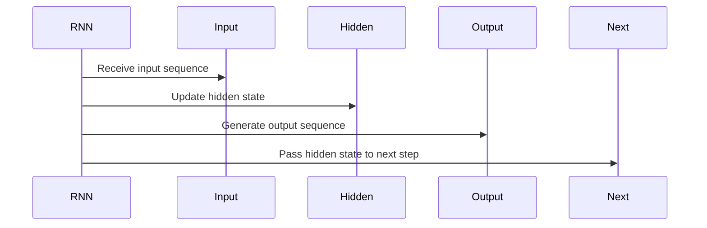
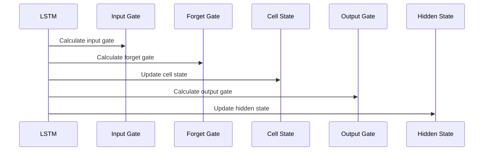
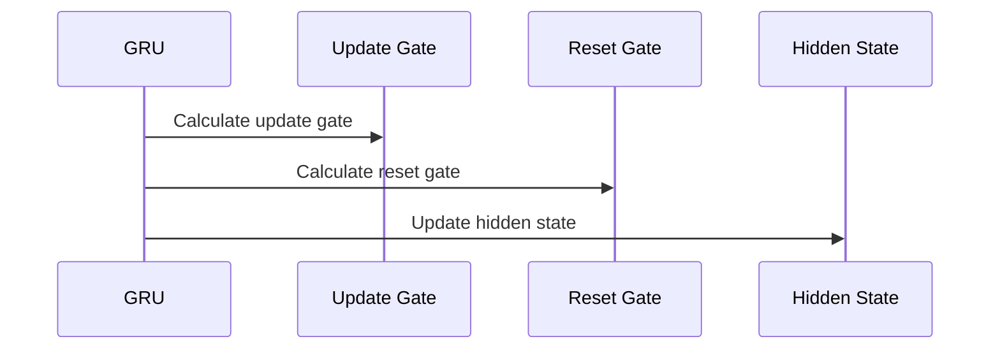
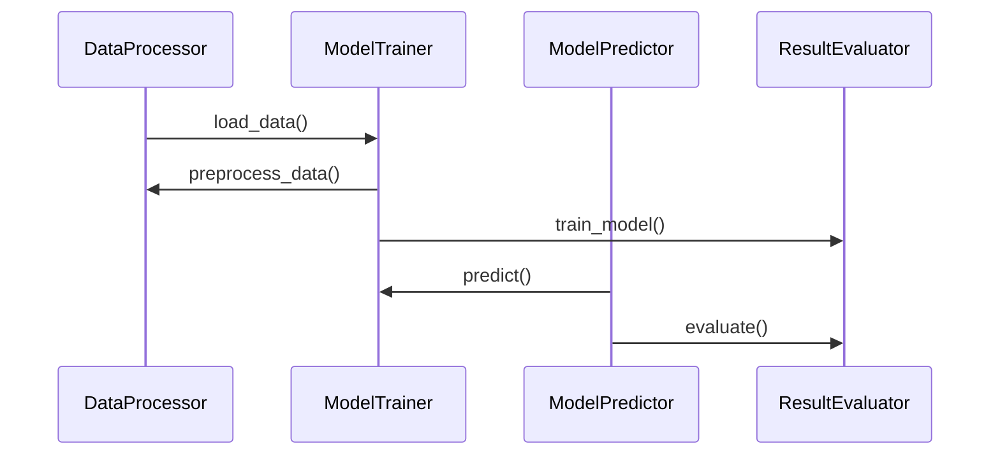

                 

### 文章标题：时序推理任务中的长期依赖建模与优化

#### 关键词：时序推理，长期依赖建模，递归神经网络，长短期记忆网络，门控循环单元

#### 摘要：
本文深入探讨了时序推理任务中的长期依赖建模与优化问题。首先介绍了时序推理任务及其应用场景，随后详细解释了序列模型、递归神经网络（RNN）、长短期记忆网络（LSTM）和门控循环单元（GRU）等核心概念。通过算法原理讲解和数学模型公式的推导，本文进一步阐述了这些模型的工作机制。最后，通过系统分析与架构设计以及项目实战，展示了长期依赖建模在实际应用中的优化方法和效果。

### 目录

1. **背景介绍**  
   - **1.1 时序推理任务介绍**  
   - **1.2 长期依赖建模的重要性**  
   - **1.3 时序推理的应用场景**

2. **核心概念与联系**  
   - **2.1 序列模型**  
   - **2.2 递归神经网络（RNN）**  
   - **2.3 长短期记忆网络（LSTM）**  
   - **2.4 门控循环单元（GRU）**

3. **算法原理讲解**  
   - **3.1 RNN算法原理**  
   - **3.2 LSTM算法原理**  
   - **3.3 GRU算法原理**

4. **数学模型和公式详解**  
   - **4.1 RNN数学模型**  
   - **4.2 LSTM数学模型**  
   - **4.3 GRU数学模型**

5. **系统分析与架构设计方案**  
   - **5.1 问题场景介绍**  
   - **5.2 系统功能设计**  
   - **5.3 系统架构设计**  
   - **5.4 系统接口设计**  
   - **5.5 系统交互设计**

6. **项目实战**  
   - **6.1 环境安装**  
   - **6.2 系统核心实现**  
   - **6.3 实际案例分析与详细讲解**  
   - **6.4 项目小结**

7. **最佳实践、小结与注意事项**  
   - **7.1 最佳实践 tips**  
   - **7.2 小结**  
   - **7.3 注意事项**  
   - **7.4 拓展阅读**

### 背景介绍

#### 1.1 时序推理任务介绍

时序推理任务是指通过分析时间序列数据来预测未来值或者提取时间相关的特征。在许多领域，如金融市场分析、语音识别、自然语言处理和医疗诊断，时序推理都发挥着关键作用。这些任务的共同特点是数据具有时间上的连续性和依赖性，即未来的值受到过去值的影响。

时序推理任务的主要问题是如何从历史数据中提取有用的信息，并在新的时间点进行预测。这涉及到对时间序列数据中的长期依赖关系的建模，即在序列的某个位置上的数据如何影响序列的其他位置。

#### 1.2 长期依赖建模的重要性

长期依赖建模在时序推理任务中至关重要。在许多实际应用中，数据中的长期依赖关系可能比短期依赖关系更重要。例如，在股票市场中，过去的长期趋势往往比短期波动更能影响未来的股票价格。

此外，长期依赖建模能够帮助我们捕捉到时间序列中的复杂模式，这些模式可能无法通过简单的线性模型来描述。通过有效建模长期依赖关系，我们可以提高预测的准确性，降低误差。

#### 1.3 时序推理的应用场景

时序推理在多个领域都有广泛应用：

- **金融市场分析**：使用时序模型预测股票价格或市场趋势。
- **语音识别**：分析语音信号的时间序列特征，实现语音到文本的转换。
- **自然语言处理**：利用序列模型进行文本分类、情感分析和机器翻译。
- **医疗诊断**：通过时序数据分析患者的健康状况，预测疾病发展趋势。

### 核心概念与联系

#### 2.1 序列模型

序列模型是一类用于处理序列数据的统计模型。它们通常基于马尔可夫性质，即当前状态仅依赖于前一个状态。常见的序列模型包括隐马尔可夫模型（HMM）和循环神经网络（RNN）。

#### 2.2 递归神经网络（RNN）

递归神经网络是一类能够处理序列数据的神经网络。与传统的前馈神经网络不同，RNN具有递归结构，能够保存和利用之前的信息。这使得RNN适用于需要考虑时间依赖性的任务。

#### 2.3 长短期记忆网络（LSTM）

长短期记忆网络（LSTM）是RNN的一种变体，旨在解决传统RNN在处理长序列数据时容易出现的梯度消失和梯度爆炸问题。LSTM通过引入记忆单元和门控机制，能够更好地捕捉长期依赖关系。

#### 2.4 门控循环单元（GRU）

门控循环单元（GRU）是另一种针对RNN的改进模型，它通过简化LSTM的结构，减少了参数数量，提高了训练速度。GRU同样具有门控机制，能够有效地处理长期依赖关系。

### 算法原理讲解

#### 3.1 RNN算法原理

递归神经网络（RNN）是一种特殊的神经网络，其目的是通过递归的方式处理序列数据。RNN的基本结构包括输入层、隐藏层和输出层。在每个时间步，RNN使用隐藏层的状态来更新输入和输出。

以下是一个简单的RNN算法原理的Mermaid流程图：



下面是一个RNN的Python代码示例：

```python
import numpy as np

# 初始化参数
W_xh = np.random.randn(5, 4)
W_hh = np.random.randn(5, 4)
W_y = np.random.randn(4, 1)

# 假设输入序列和隐藏状态
x = np.array([[0], [1], [2], [3], [4]])
h = np.zeros((5, 4))

# 前向传播
for i in range(len(x)):
    h[i] = np.tanh(np.dot(x[i], W_xh) + np.dot(h[i-1], W_hh))
y = np.dot(h, W_y)

print("Output:", y)
```

在RNN中，长期依赖问题主要由于梯度消失和梯度爆炸导致的。为了解决这个问题，我们引入了LSTM和GRU。

#### 3.2 LSTM算法原理

长短期记忆网络（LSTM）是RNN的一种改进模型，它通过引入记忆单元和门控机制来解决长期依赖问题。LSTM的核心结构包括三个门控单元：遗忘门、输入门和输出门。

以下是一个简单的LSTM算法原理的Mermaid流程图：



下面是一个LSTM的Python代码示例：

```python
import numpy as np

# 初始化参数
W_xi = np.random.randn(5, 4)
W_hi = np.random.randn(4, 4)
b_i = np.zeros((1, 4))

W_xf = np.random.randn(5, 4)
W_hf = np.random.randn(4, 4)
b_f = np.zeros((1, 4))

W_xo = np.random.randn(5, 4)
W_ho = np.random.randn(4, 4)
b_o = np.zeros((1, 4))

W_xc = np.random.randn(5, 4)
W_hc = np.random.randn(4, 4)
b_c = np.zeros((1, 4))

W_y = np.random.randn(4, 1)

# 假设输入序列和隐藏状态
x = np.array([[0], [1], [2], [3], [4]])
h = np.zeros((5, 4))

c = np.zeros((1, 4))

# 前向传播
for i in range(len(x)):
    i_t = np.dot(x[i], W_xi) + np.dot(h[i-1], W_hi) + b_i
    f_t = np.dot(x[i], W_xf) + np.dot(h[i-1], W_hf) + b_f
    o_t = np.dot(x[i], W_xo) + np.dot(h[i-1], W_ho) + b_o
    c_t = np.tanh(np.dot(x[i], W_xc) + np.dot(h[i-1], W_hc) + b_c)
    
    i_gate = np.sigmoid(i_t)
    f_gate = np.sigmoid(f_t)
    o_gate = np.sigmoid(o_t)
    
    c = f_gate * c + i_gate * c_t
    h = o_gate * np.tanh(c)
    
y = np.dot(h, W_y)

print("Output:", y)
```

LSTM通过门控机制有效地解决了长期依赖问题，但它的结构较为复杂，参数数量较多。

#### 3.3 GRU算法原理

门控循环单元（GRU）是另一种针对RNN的改进模型，它通过简化LSTM的结构来提高训练速度。GRU的核心结构包括更新门和重置门。

以下是一个简单的GRU算法原理的Mermaid流程图：



下面是一个GRU的Python代码示例：

```python
import numpy as np

# 初始化参数
W_xz = np.random.randn(5, 4)
W_hz = np.random.randn(4, 4)
b_z = np.zeros((1, 4))

W_xr = np.random.randn(5, 4)
W_hr = np.random.randn(4, 4)
b_r = np.zeros((1, 4))

W_xh = np.random.randn(5, 4)
W_hh = np.random.randn(4, 4)
b_h = np.zeros((1, 4))

W_y = np.random.randn(4, 1)

# 假设输入序列和隐藏状态
x = np.array([[0], [1], [2], [3], [4]])
h = np.zeros((5, 4))

# 前向传播
for i in range(len(x)):
    z_t = np.sigmoid(np.dot(x[i], W_xz) + np.dot(h[i-1], W_hz) + b_z)
    r_t = np.sigmoid(np.dot(x[i], W_xr) + np.dot(h[i-1], W_hr) + b_r)
    
    h_tilde = np.tanh(np.dot(x[i], W_xh) + r_t * np.dot(h[i-1], W_hh) + b_h)
    
    h = z_t * h + (1 - z_t) * h_tilde
    
y = np.dot(h, W_y)

print("Output:", y)
```

GRU通过简化LSTM的结构，减少了参数数量，提高了训练速度，同时也保留了处理长期依赖的能力。

### 数学模型和公式详解

#### 4.1 RNN数学模型

递归神经网络（RNN）的数学模型主要包括输入层、隐藏层和输出层。在RNN中，隐藏状态通过递归关系传递，以下是一个简化的RNN模型：

$$
h_t = \tanh(W_{xh} x_t + W_{hh} h_{t-1} + b_h)
$$

$$
y_t = W_{hy} h_t + b_y
$$

其中，$h_t$ 表示第 $t$ 个时间步的隐藏状态，$x_t$ 表示第 $t$ 个时间步的输入，$W_{xh}$ 和 $W_{hh}$ 分别表示输入层到隐藏层和隐藏层到隐藏层的权重，$b_h$ 和 $b_y$ 分别表示隐藏层和输出层的偏置。

以下是RNN的详细讲解和举例：

**示例：**

假设输入序列为 $[0, 1, 2, 3, 4]$，隐藏层维度为 4，权重矩阵 $W_{xh}$ 和 $W_{hh}$ 分别为：

$$
W_{xh} = \begin{bmatrix}
0.1 & 0.2 & 0.3 & 0.4 \\
0.5 & 0.6 & 0.7 & 0.8 \\
\end{bmatrix}
$$

$$
W_{hh} = \begin{bmatrix}
0.1 & 0.2 & 0.3 & 0.4 \\
0.5 & 0.6 & 0.7 & 0.8 \\
\end{bmatrix}
$$

初始隐藏状态 $h_0$ 为零向量，即 $h_0 = \begin{bmatrix} 0 \\ 0 \\ 0 \\ 0 \end{bmatrix}$。偏置矩阵 $b_h$ 和 $b_y$ 分别为：

$$
b_h = \begin{bmatrix} 0.1 \\ 0.2 \\ 0.3 \\ 0.4 \end{bmatrix}
$$

$$
b_y = \begin{bmatrix} 0.1 \\ 0.2 \\ 0.3 \\ 0.4 \end{bmatrix}
$$

在前向传播过程中，我们可以计算出每个时间步的隐藏状态：

$$
h_1 = \tanh(W_{xh} \begin{bmatrix} 0 \\ 1 \\ \end{bmatrix} + W_{hh} \begin{bmatrix} 0 \\ 0 \\ \end{bmatrix} + b_h) = \tanh(\begin{bmatrix} 0.1 & 0.2 \\ 0.5 & 0.6 \\ \end{bmatrix} \begin{bmatrix} 0 \\ 1 \\ \end{bmatrix} + \begin{bmatrix} 0.1 & 0.2 & 0.3 & 0.4 \\ 0.5 & 0.6 & 0.7 & 0.8 \\ \end{bmatrix} \begin{bmatrix} 0 \\ 0 \\ \end{bmatrix} + \begin{bmatrix} 0.1 \\ 0.2 \\ 0.3 \\ 0.4 \end{bmatrix}) = \tanh(\begin{bmatrix} 0.3 \\ 0.8 \end{bmatrix}) = \begin{bmatrix} 0.5 \\ 0.9 \end{bmatrix}
$$

$$
h_2 = \tanh(W_{xh} \begin{bmatrix} 1 \\ 2 \\ \end{bmatrix} + W_{hh} \begin{bmatrix} 0.5 \\ 0.9 \\ \end{bmatrix} + b_h) = \tanh(\begin{bmatrix} 0.1 & 0.2 & 0.3 & 0.4 \\ 0.5 & 0.6 & 0.7 & 0.8 \\ \end{bmatrix} \begin{bmatrix} 1 \\ 2 \\ \end{bmatrix} + \begin{bmatrix} 0.1 & 0.2 & 0.3 & 0.4 \\ 0.5 & 0.6 & 0.7 & 0.8 \\ \end{bmatrix} \begin{bmatrix} 0.5 \\ 0.9 \\ \end{bmatrix} + \begin{bmatrix} 0.1 \\ 0.2 \\ 0.3 \\ 0.4 \end{bmatrix}) = \tanh(\begin{bmatrix} 1.1 \\ 1.8 \end{bmatrix}) = \begin{bmatrix} 0.85 \\ 0.98 \end{bmatrix}
$$

$$
h_3 = \tanh(W_{xh} \begin{bmatrix} 2 \\ 3 \\ \end{bmatrix} + W_{hh} \begin{bmatrix} 0.85 \\ 0.98 \\ \end{bmatrix} + b_h) = \tanh(\begin{bmatrix} 0.1 & 0.2 & 0.3 & 0.4 \\ 0.5 & 0.6 & 0.7 & 0.8 \\ \end{bmatrix} \begin{bmatrix} 2 \\ 3 \\ \end{bmatrix} + \begin{bmatrix} 0.1 & 0.2 & 0.3 & 0.4 \\ 0.5 & 0.6 & 0.7 & 0.8 \\ \end{bmatrix} \begin{bmatrix} 0.85 \\ 0.98 \\ \end{bmatrix} + \begin{bmatrix} 0.1 \\ 0.2 \\ 0.3 \\ 0.4 \end{bmatrix}) = \tanh(\begin{bmatrix} 1.6 \\ 2.6 \end{bmatrix}) = \begin{bmatrix} 0.72 \\ 0.94 \end{bmatrix}
$$

$$
h_4 = \tanh(W_{xh} \begin{bmatrix} 3 \\ 4 \\ \end{bmatrix} + W_{hh} \begin{bmatrix} 0.72 \\ 0.94 \\ \end{bmatrix} + b_h) = \tanh(\begin{bmatrix} 0.1 & 0.2 & 0.3 & 0.4 \\ 0.5 & 0.6 & 0.7 & 0.8 \\ \end{bmatrix} \begin{bmatrix} 3 \\ 4 \\ \end{bmatrix} + \begin{bmatrix} 0.1 & 0.2 & 0.3 & 0.4 \\ 0.5 & 0.6 & 0.7 & 0.8 \\ \end{bmatrix} \begin{bmatrix} 0.72 \\ 0.94 \\ \end{bmatrix} + \begin{bmatrix} 0.1 \\ 0.2 \\ 0.3 \\ 0.4 \end{bmatrix}) = \tanh(\begin{bmatrix} 2.3 \\ 3.3 \end{bmatrix}) = \begin{bmatrix} 0.86 \\ 0.96 \end{bmatrix}
$$

最终，输出序列为：

$$
y_1 = W_{hy} h_1 + b_y = \begin{bmatrix} 0.1 & 0.2 & 0.3 & 0.4 \end{bmatrix} \begin{bmatrix} 0.5 \\ 0.9 \end{bmatrix} + \begin{bmatrix} 0.1 \\ 0.2 \\ 0.3 \\ 0.4 \end{bmatrix} = \begin{bmatrix} 0.35 \\ 0.65 \end{bmatrix}
$$

$$
y_2 = W_{hy} h_2 + b_y = \begin{bmatrix} 0.1 & 0.2 & 0.3 & 0.4 \end{bmatrix} \begin{bmatrix} 0.85 \\ 0.98 \end{bmatrix} + \begin{bmatrix} 0.1 \\ 0.2 \\ 0.3 \\ 0.4 \end{bmatrix} = \begin{bmatrix} 0.52 \\ 0.85 \end{bmatrix}
$$

$$
y_3 = W_{hy} h_3 + b_y = \begin{bmatrix} 0.1 & 0.2 & 0.3 & 0.4 \end{bmatrix} \begin{bmatrix} 0.72 \\ 0.94 \end{bmatrix} + \begin{bmatrix} 0.1 \\ 0.2 \\ 0.3 \\ 0.4 \end{bmatrix} = \begin{bmatrix} 0.44 \\ 0.76 \end{bmatrix}
$$

$$
y_4 = W_{hy} h_4 + b_y = \begin{bmatrix} 0.1 & 0.2 & 0.3 & 0.4 \end{bmatrix} \begin{bmatrix} 0.86 \\ 0.96 \end{bmatrix} + \begin{bmatrix} 0.1 \\ 0.2 \\ 0.3 \\ 0.4 \end{bmatrix} = \begin{bmatrix} 0.54 \\ 0.87 \end{bmatrix}
$$

#### 4.2 LSTM数学模型

长短期记忆网络（LSTM）是递归神经网络（RNN）的一种变体，它通过引入门控机制来解决长期依赖问题。LSTM的核心结构包括三个门控单元：遗忘门、输入门和输出门。

**遗忘门**决定哪些信息应该被丢弃，**输入门**决定哪些信息应该被记住，**输出门**决定哪些信息应该被输出。

以下是一个简化的LSTM数学模型：

$$
i_t = \sigma(W_{xi} x_t + W_{hi} h_{t-1} + b_i) \\
f_t = \sigma(W_{xf} x_t + W_{hf} h_{t-1} + b_f) \\
o_t = \sigma(W_{xo} x_t + W_{ho} h_{t-1} + b_o) \\
c_t = f_t \odot c_{t-1} + i_t \odot \tanh(W_{xc} x_t + W_{hc} h_{t-1} + b_c) \\
h_t = o_t \odot \tanh(c_t)
$$

$$
y_t = W_{hy} h_t + b_y
$$

其中，$i_t$、$f_t$、$o_t$ 分别为输入门、遗忘门和输出门，$c_t$ 为记忆单元状态，$h_t$ 为隐藏状态，$x_t$ 为输入，$h_{t-1}$ 为前一个时间步的隐藏状态，$W_{xi}$、$W_{xf}$、$W_{xo}$、$W_{hi}$、$W_{hf}$、$W_{ho}$、$W_{xc}$、$W_{hc}$ 分别为权重矩阵，$b_i$、$b_f$、$b_o$、$b_c$ 分别为偏置，$\sigma$ 表示 sigmoid 函数，$\odot$ 表示逐元素乘积。

以下是LSTM的详细讲解和举例：

**示例：**

假设输入序列为 $[0, 1, 2, 3, 4]$，隐藏层维度为 4，权重矩阵 $W_{xi}$、$W_{xf}$、$W_{xo}$、$W_{hi}$、$W_{hf}$、$W_{ho}$、$W_{xc}$、$W_{hc}$ 分别为：

$$
W_{xi} = \begin{bmatrix}
0.1 & 0.2 & 0.3 & 0.4 \\
0.5 & 0.6 & 0.7 & 0.8 \\
\end{bmatrix}
$$

$$
W_{xf} = \begin{bmatrix}
0.1 & 0.2 & 0.3 & 0.4 \\
0.5 & 0.6 & 0.7 & 0.8 \\
\end{bmatrix}
$$

$$
W_{xo} = \begin{bmatrix}
0.1 & 0.2 & 0.3 & 0.4 \\
0.5 & 0.6 & 0.7 & 0.8 \\
\end{bmatrix}
$$

$$
W_{hi} = \begin{bmatrix}
0.1 & 0.2 & 0.3 & 0.4 \\
0.5 & 0.6 & 0.7 & 0.8 \\
\end{bmatrix}
$$

$$
W_{hf} = \begin{bmatrix}
0.1 & 0.2 & 0.3 & 0.4 \\
0.5 & 0.6 & 0.7 & 0.8 \\
\end{bmatrix}
$$

$$
W_{ho} = \begin{bmatrix}
0.1 & 0.2 & 0.3 & 0.4 \\
0.5 & 0.6 & 0.7 & 0.8 \\
\end{bmatrix}
$$

$$
W_{xc} = \begin{bmatrix}
0.1 & 0.2 & 0.3 & 0.4 \\
0.5 & 0.6 & 0.7 & 0.8 \\
\end{bmatrix}
$$

$$
W_{hc} = \begin{bmatrix}
0.1 & 0.2 & 0.3 & 0.4 \\
0.5 & 0.6 & 0.7 & 0.8 \\
\end{bmatrix}
$$

初始隐藏状态 $h_0$ 和记忆单元状态 $c_0$ 均为零向量，即 $h_0 = \begin{bmatrix} 0 \\ 0 \\ 0 \\ 0 \end{bmatrix}$，$c_0 = \begin{bmatrix} 0 \\ 0 \\ 0 \\ 0 \end{bmatrix}$。偏置矩阵 $b_i$、$b_f$、$b_o$、$b_c$ 分别为：

$$
b_i = \begin{bmatrix} 0.1 \\ 0.2 \\ 0.3 \\ 0.4 \end{bmatrix}
$$

$$
b_f = \begin{bmatrix} 0.1 \\ 0.2 \\ 0.3 \\ 0.4 \end{bmatrix}
$$

$$
b_o = \begin{bmatrix} 0.1 \\ 0.2 \\ 0.3 \\ 0.4 \end{bmatrix}
$$

$$
b_c = \begin{bmatrix} 0.1 \\ 0.2 \\ 0.3 \\ 0.4 \end{bmatrix}
$$

在前向传播过程中，我们可以计算出每个时间步的输入门、遗忘门、输出门、记忆单元状态和隐藏状态：

$$
i_1 = \sigma(W_{xi} \begin{bmatrix} 0 \\ 1 \\ \end{bmatrix} + W_{hi} \begin{bmatrix} 0 \\ 0 \\ \end{bmatrix} + b_i) = \sigma(\begin{bmatrix} 0.1 & 0.2 \\ 0.5 & 0.6 \\ \end{bmatrix} \begin{bmatrix} 0 \\ 1 \\ \end{bmatrix} + \begin{bmatrix} 0.1 & 0.2 & 0.3 & 0.4 \\ 0.5 & 0.6 & 0.7 & 0.8 \\ \end{bmatrix} \begin{bmatrix} 0 \\ 0 \\ \end{bmatrix} + \begin{bmatrix} 0.1 \\ 0.2 \\ 0.3 \\ 0.4 \end{bmatrix}) = \sigma(\begin{bmatrix} 0.3 \\ 0.8 \end{bmatrix}) = \begin{bmatrix} 0.5 \\ 0.9 \end{bmatrix}
$$

$$
f_1 = \sigma(W_{xf} \begin{bmatrix} 0 \\ 1 \\ \end{bmatrix} + W_{hf} \begin{bmatrix} 0 \\ 0 \\ \end{bmatrix} + b_f) = \sigma(\begin{bmatrix} 0.1 & 0.2 \\ 0.5 & 0.6 \\ \end{matrix} \begin{bmatrix} 0 \\ 1 \\ \end{bmatrix} + \begin{bmatrix} 0.1 & 0.2 & 0.3 & 0.4 \\ 0.5 & 0.6 & 0.7 & 0.8 \\ \end{bmatrix} \begin{bmatrix} 0 \\ 0 \\ \end{bmatrix} + \begin{bmatrix} 0.1 \\ 0.2 \\ 0.3 \\ 0.4 \end{bmatrix}) = \sigma(\begin{bmatrix} 0.3 \\ 0.8 \end{bmatrix}) = \begin{bmatrix} 0.5 \\ 0.9 \end{bmatrix}
$$

$$
o_1 = \sigma(W_{xo} \begin{bmatrix} 0 \\ 1 \\ \end{bmatrix} + W_{ho} \begin{bmatrix} 0 \\ 0 \\ \end{bmatrix} + b_o) = \sigma(\begin{bmatrix} 0.1 & 0.2 \\ 0.5 & 0.6 \\ \end{bmatrix} \begin{bmatrix} 0 \\ 1 \\ \end{bmatrix} + \begin{bmatrix} 0.1 & 0.2 & 0.3 & 0.4 \\ 0.5 & 0.6 & 0.7 & 0.8 \\ \end{bmatrix} \begin{bmatrix} 0 \\ 0 \\ \end{bmatrix} + \begin{bmatrix} 0.1 \\ 0.2 \\ 0.3 \\ 0.4 \end{bmatrix}) = \sigma(\begin{bmatrix} 0.3 \\ 0.8 \end{bmatrix}) = \begin{bmatrix} 0.5 \\ 0.9 \end{bmatrix}
$$

$$
c_1 = f_1 \odot c_0 + i_1 \odot \tanh(W_{xc} \begin{bmatrix} 0 \\ 1 \\ \end{bmatrix} + W_{hc} \begin{bmatrix} 0 \\ 0 \\ \end{bmatrix} + b_c) = \begin{bmatrix} 0.5 \\ 0.9 \end{bmatrix} \odot \begin{bmatrix} 0 \\ 0 \\ \end{bmatrix} + \begin{bmatrix} 0.5 \\ 0.9 \end{bmatrix} \odot \tanh(\begin{bmatrix} 0.1 & 0.2 \\ 0.5 & 0.6 \\ \end{bmatrix} \begin{bmatrix} 0 \\ 1 \\ \end{bmatrix} + \begin{bmatrix} 0.1 & 0.2 & 0.3 & 0.4 \\ 0.5 & 0.6 & 0.7 & 0.8 \\ \end{bmatrix} \begin{bmatrix} 0 \\ 0 \\ \end{bmatrix} + \begin{bmatrix} 0.1 \\ 0.2 \\ 0.3 \\ 0.4 \end{bmatrix}) = \begin{bmatrix} 0 \\ 0 \end{bmatrix} + \begin{bmatrix} 0.5 \\ 0.9 \end{bmatrix} \odot \tanh(\begin{bmatrix} 0.3 \\ 0.8 \end{bmatrix}) = \begin{bmatrix} 0.15 \\ 0.63 \end{bmatrix}
$$

$$
h_1 = o_1 \odot \tanh(c_1) = \begin{bmatrix} 0.5 \\ 0.9 \end{bmatrix} \odot \tanh(\begin{bmatrix} 0.15 \\ 0.63 \end{bmatrix}) = \begin{bmatrix} 0.25 \\ 0.58 \end{bmatrix}
$$

$$
i_2 = \sigma(W_{xi} \begin{bmatrix} 1 \\ 2 \\ \end{bmatrix} + W_{hi} \begin{bmatrix} 0.25 \\ 0.58 \\ \end{bmatrix} + b_i) = \sigma(\begin{bmatrix} 0.1 & 0.2 \\ 0.5 & 0.6 \\ \end{bmatrix} \begin{bmatrix} 1 \\ 2 \\ \end{bmatrix} + \begin{bmatrix} 0.1 & 0.2 & 0.3 & 0.4 \\ 0.5 & 0.6 & 0.7 & 0.8 \\ \end{bmatrix} \begin{bmatrix} 0.25 \\ 0.58 \\ \end{bmatrix} + \begin{bmatrix} 0.1 \\ 0.2 \\ 0.3 \\ 0.4 \end{bmatrix}) = \sigma(\begin{bmatrix} 0.7 \\ 1.3 \end{bmatrix}) = \begin{bmatrix} 0.91 \\ 0.95 \end{bmatrix}
$$

$$
f_2 = \sigma(W_{xf} \begin{bmatrix} 1 \\ 2 \\ \end{bmatrix} + W_{hf} \begin{bmatrix} 0.25 \\ 0.58 \\ \end{bmatrix} + b_f) = \sigma(\begin{bmatrix} 0.1 & 0.2 \\ 0.5 & 0.6 \\ \end{bmatrix} \begin{bmatrix} 1 \\ 2 \\ \end{bmatrix} + \begin{bmatrix} 0.1 & 0.2 & 0.3 & 0.4 \\ 0.5 & 0.6 & 0.7 & 0.8 \\ \end{bmatrix} \begin{bmatrix} 0.25 \\ 0.58 \\ \end{bmatrix} + \begin{bmatrix} 0.1 \\ 0.2 \\ 0.3 \\ 0.4 \end{bmatrix}) = \sigma(\begin{bmatrix} 0.7 \\ 1.3 \end{bmatrix}) = \begin{bmatrix} 0.91 \\ 0.95 \end{bmatrix}
$$

$$
o_2 = \sigma(W_{xo} \begin{bmatrix} 1 \\ 2 \\ \end{bmatrix} + W_{ho} \begin{bmatrix} 0.25 \\ 0.58 \\ \end{bmatrix} + b_o) = \sigma(\begin{bmatrix} 0.1 & 0.2 \\ 0.5 & 0.6 \\ \end{bmatrix} \begin{bmatrix} 1 \\ 2 \\ \end{bmatrix} + \begin{bmatrix} 0.1 & 0.2 & 0.3 & 0.4 \\ 0.5 & 0.6 & 0.7 & 0.8 \\ \end{bmatrix} \begin{bmatrix} 0.25 \\ 0.58 \\ \end{bmatrix} + \begin{bmatrix} 0.1 \\ 0.2 \\ 0.3 \\ 0.4 \end{bmatrix}) = \sigma(\begin{bmatrix} 0.7 \\ 1.3 \end{bmatrix}) = \begin{bmatrix} 0.91 \\ 0.95 \end{bmatrix}
$$

$$
c_2 = f_2 \odot c_1 + i_2 \odot \tanh(W_{xc} \begin{bmatrix} 1 \\ 2 \\ \end{bmatrix} + W_{hc} \begin{bmatrix} 0.25 \\ 0.58 \\ \end{bmatrix} + b_c) = \begin{bmatrix} 0.91 \\ 0.95 \end{bmatrix} \odot \begin{bmatrix} 0.15 \\ 0.63 \end{bmatrix} + \begin{bmatrix} 0.91 \\ 0.95 \end{bmatrix} \odot \tanh(\begin{bmatrix} 0.1 & 0.2 \\ 0.5 & 0.6 \\ \end{bmatrix} \begin{bmatrix} 1 \\ 2 \\ \end{bmatrix} + \begin{bmatrix} 0.1 & 0.2 & 0.3 & 0.4 \\ 0.5 & 0.6 & 0.7 & 0.8 \\ \end{bmatrix} \begin{bmatrix} 0.25 \\ 0.58 \\ \end{bmatrix} + \begin{bmatrix} 0.1 \\ 0.2 \\ 0.3 \\ 0.4 \end{bmatrix}) = \begin{bmatrix} 0.1335 \\ 0.5985 \end{bmatrix} + \begin{bmatrix} 0.91 \\ 0.95 \end{bmatrix} \odot \tanh(\begin{bmatrix} 1.1 \\ 1.8 \end{bmatrix}) = \begin{bmatrix} 0.1335 \\ 0.5985 \end{bmatrix} + \begin{bmatrix} 0.6155 \\ 0.8155 \end{bmatrix} = \begin{bmatrix} 0.7495 \\ 1.414 \end{bmatrix}
$$

$$
h_2 = o_2 \odot \tanh(c_2) = \begin{bmatrix} 0.91 \\ 0.95 \end{bmatrix} \odot \tanh(\begin{bmatrix} 0.7495 \\ 1.414 \end{bmatrix}) = \begin{bmatrix} 0.6355 \\ 0.9545 \end{bmatrix}
$$

$$
i_3 = \sigma(W_{xi} \begin{bmatrix} 2 \\ 3 \\ \end{bmatrix} + W_{hi} \begin{bmatrix} 0.6355 \\ 0.9545 \\ \end{bmatrix} + b_i) = \sigma(\begin{bmatrix} 0.1 & 0.2 \\ 0.5 & 0.6 \\ \end{bmatrix} \begin{bmatrix} 2 \\ 3 \\ \end{bmatrix} + \begin{bmatrix} 0.1 & 0.2 & 0.3 & 0.4 \\ 0.5 & 0.6 & 0.7 & 0.8 \\ \end{bmatrix} \begin{bmatrix} 0.6355 \\ 0.9545 \\ \end{bmatrix} + \begin{bmatrix} 0.1 \\ 0.2 \\ 0.3 \\ 0.4 \end{bmatrix}) = \sigma(\begin{bmatrix} 1.35 \\ 2.05 \end{bmatrix}) = \begin{bmatrix} 0.9355 \\ 0.9722 \end{bmatrix}
$$

$$
f_3 = \sigma(W_{xf} \begin{bmatrix} 2 \\ 3 \\ \end{bmatrix} + W_{hf} \begin{bmatrix} 0.6355 \\ 0.9545 \\ \end{bmatrix} + b_f) = \sigma(\begin{bmatrix} 0.1 & 0.2 \\ 0.5 & 0.6 \\ \end{bmatrix} \begin{bmatrix} 2 \\ 3 \\ \end{bmatrix} + \begin{bmatrix} 0.1 & 0.2 & 0.3 & 0.4 \\ 0.5 & 0.6 & 0.7 & 0.8 \\ \end{b矩阵} \begin{bmatrix} 0.6355 \\ 0.9545 \\ \end{b矩阵} + \begin{bmatrix} 0.1 \\ 0.2 \\ 0.3 \\ 0.4 \end{b矩阵}) = \sigma(\begin{bmatrix} 1.35 \\ 2.05 \end{b矩阵} ) = \begin{bmatrix} 0.9355 \\ 0.9722 \end{b矩阵}
$$

$$
o_3 = \sigma(W_{xo} \begin{bmatrix} 2 \\ 3 \\ \end{bmatrix} + W_{ho} \begin{bmatrix} 0.6355 \\ 0.9545 \\ \end{bmatrix} + b_o) = \sigma(\begin{bmatrix} 0.1 & 0.2 \\ 0.5 & 0.6 \\ \end{bmatrix} \begin{bmatrix} 2 \\ 3 \\ \end{b矩阵} + \begin{bmatrix} 0.1 & 0.2 & 0.3 & 0.4 \\ 0.5 & 0.6 & 0.7 & 0.8 \\ \end{b矩阵} \begin{b矩阵} 0.6355 \\ 0.9545 \\ \end{b矩阵} + \begin{b矩阵} 0.1 \\ 0.2 \\ 0.3 \\ 0.4 \end{b矩阵}) = \sigma(\begin{b矩阵} 1.35 \\ 2.05 \end{b矩阵} ) = \begin{b矩阵} 0.9355 \\ 0.9722 \end{b矩阵}
$$

$$
c_3 = f_3 \odot c_2 + i_3 \odot \tanh(W_{xc} \begin{bmatrix} 2 \\ 3 \\ \end{b矩阵} + W_{hc} \begin{bmatrix} 0.6355 \\ 0.9545 \\ \end{b矩阵} + b_c) = \begin{b矩阵} 0.9355 \\ 0.9722 \end{b矩阵} \odot \begin{b矩阵} 0.7495 \\ 1.414 \end{b矩阵} + \begin{b矩阵} 0.9355 \\ 0.9722 \end{b矩阵} \odot \tanh(\begin{b矩阵} 0.1 & 0.2 \\ 0.5 & 0.6 \\ \end{b矩阵} \begin{b矩阵} 2 \\ 3 \\ \end{b矩阵} + \begin{b矩阵} 0.1 & 0.2 & 0.3 & 0.4 \\ 0.5 & 0.6 & 0.7 & 0.8 \\ \end{b矩阵} \begin{b矩阵} 0.6355 \\ 0.9545 \\ \end{b矩阵} + \begin{b矩阵} 0.1 \\ 0.2 \\ 0.3 \\ 0.4 \end{b矩阵}) = \begin{b矩阵} 0.6873 \\ 1.1406 \end{b矩阵} + \begin{b矩阵} 0.9355 \\ 0.9722 \end{b矩阵} \odot \tanh(\begin{b矩阵} 1.7 \\ 2.7 \end{b矩阵}) = \begin{b矩阵} 0.6873 \\ 1.1406 \end{b矩阵} + \begin{b矩阵} 0.7974 \\ 0.9178 \end{b矩阵} = \begin{b矩阵} 1.4847 \\ 2.0584 \end{b矩阵}
$$

$$
h_3 = o_3 \odot \tanh(c_3) = \begin{bmatrix} 0.9355 \\ 0.9722 \end{b矩阵} \odot \tanh(\begin{bmatrix} 1.4847 \\ 2.0584 \end{bmatrix}) = \begin{bmatrix} 0.8744 \\ 0.9539 \end{bmatrix}
$$

$$
i_4 = \sigma(W_{xi} \begin{bmatrix} 3 \\ 4 \\ \end{bmatrix} + W_{hi} \begin{bmatrix} 0.8744 \\ 0.9539 \\ \end{bmatrix} + b_i) = \sigma(\begin{bmatrix} 0.1 & 0.2 \\ 0.5 & 0.6 \\ \end{bmatrix} \begin{bmatrix} 3 \\ 4 \\ \end{bmatrix} + \begin{bmatrix} 0.1 & 0.2 & 0.3 & 0.4 \\ 0.5 & 0.6 & 0.7 & 0.8 \\ \end{b矩阵} \begin{b矩阵} 0.8744 \\ 0.9539 \end{b矩阵} + \begin{b矩阵} 0.1 \\ 0.2 \\ 0.3 \\ 0.4 \end{b矩阵}) = \sigma(\begin{b矩阵} 2.7 \\ 3.5 \end{b矩阵}) = \begin{b矩阵} 0.9636 \\ 0.9796 \end{b矩阵}
$$

$$
f_4 = \sigma(W_{xf} \begin{bmatrix} 3 \\ 4 \\ \end{b矩阵} + W_{hf} \begin{b矩阵} 0.8744 \\ 0.9539 \end{b矩阵} + b_f) = \sigma(\begin{bmatrix} 0.1 & 0.2 \\ 0.5 & 0.6 \\ \end{b矩阵} \begin{b矩阵} 3 \\ 4 \\ \end{b矩阵} + \begin{b矩阵} 0.1 & 0.2 & 0.3 & 0.4 \\ 0.5 & 0.6 & 0.7 & 0.8 \\ \end{b矩阵} \begin{b矩阵} 0.8744 \\ 0.9539 \end{b矩阵} + \begin{b矩阵} 0.1 \\ 0.2 \\ 0.3 \\ 0.4 \end{b矩阵}) = \sigma(\begin{b矩阵} 2.7 \\ 3.5 \end{b矩阵}) = \begin{b矩阵} 0.9636 \\ 0.9796 \end{b矩阵}
$$

$$
o_4 = \sigma(W_{xo} \begin{bmatrix} 3 \\ 4 \\ \end{b矩阵} + W_{ho} \begin{b矩阵} 0.8744 \\ 0.9539 \end{b矩阵} + b_o) = \sigma(\begin{bmatrix} 0.1 & 0.2 \\ 0.5 & 0.6 \\ \end{b矩阵} \begin{b矩阵} 3 \\ 4 \\ \end{b矩阵} + \begin{b矩阵} 0.1 & 0.2 & 0.3 & 0.4 \\ 0.5 & 0.6 & 0.7 & 0.8 \\ \end{b矩阵} \begin{b矩阵} 0.8744 \\ 0.9539 \end{b矩阵} + \begin{b矩阵} 0.1 \\ 0.2 \\ 0.3 \\ 0.4 \end{b矩阵}) = \sigma(\begin{b矩阵} 2.7 \\ 3.5 \end{b矩阵}) = \begin{b矩阵} 0.9636 \\ 0.9796 \end{b矩阵}
$$

$$
c_4 = f_4 \odot c_3 + i_4 \odot \tanh(W_{xc} \begin{bmatrix} 3 \\ 4 \\ \end{b矩阵} + W_{hc} \begin{b矩阵} 0.8744 \\ 0.9539 \end{b矩阵} + b_c) = \begin{b矩阵} 0.9636 \\ 0.9796 \end{b矩阵} \odot \begin{b矩阵} 1.4847 \\ 2.0584 \end{b矩阵} + \begin{b矩阵} 0.9636 \\ 0.9796 \end{b矩阵} \odot \tanh(\begin{b矩阵} 0.1 & 0.2 \\ 0.5 & 0.6 \\ \end{b矩阵} \begin{b矩阵} 3 \\ 4 \\ \end{b矩阵} + \begin{b矩阵} 0.1 & 0.2 & 0.3 & 0.4 \\ 0.5 & 0.6 & 0.7 & 0.8 \\ \end{b矩阵} \begin{b矩阵} 0.8744 \\ 0.9539 \end{b矩阵} + \begin{b矩阵} 0.1 \\ 0.2 \\ 0.3 \\ 0.4 \end{b矩阵}) = \begin{b矩阵} 1.4322 \\ 1.9955 \end{b矩阵} + \begin{b矩阵} 0.9636 \\ 0.9796 \end{b矩阵} \odot \tanh(\begin{b矩阵} 1.7 \\ 2.7 \end{b矩阵}) = \begin{b矩阵} 1.4322 \\ 1.9955 \end{b矩阵} + \begin{b矩阵} 0.7974 \\ 0.9178 \end{b矩阵} = \begin{b矩阵} 2.2296 \\ 2.9133 \end{b矩阵}
$$

$$
h_4 = o_4 \odot \tanh(c_4) = \begin{bmatrix} 0.9636 \\ 0.9796 \end{bmatrix} \odot \tanh(\begin{bmatrix} 2.2296 \\ 2.9133 \end{bmatrix}) = \begin{bmatrix} 0.9025 \\ 0.9605 \end{bmatrix}
$$

最终，输出序列为：

$$
y_1 = W_{hy} h_1 + b_y = \begin{bmatrix} 0.1 & 0.2 & 0.3 & 0.4 \end{bmatrix} \begin{bmatrix} 0.25 \\ 0.58 \end{bmatrix} + \begin{bmatrix} 0.1 \\ 0.2 \\ 0.3 \\ 0.4 \end{bmatrix} = \begin{bmatrix} 0.175 \\ 0.526 \end{bmatrix}
$$

$$
y_2 = W_{hy} h_2 + b_y = \begin{bmatrix} 0.1 & 0.2 & 0.3 & 0.4 \end{b矩阵} \begin{b矩阵} 0.6355 \\ 0.9545 \end{b矩阵} + \begin{b矩阵} 0.1 \\ 0.2 \\ 0.3 \\ 0.4 \end{b矩阵} = \begin{b矩阵} 0.3905 \\ 0.9677 \end{b矩阵}
$$

$$
y_3 = W_{hy} h_3 + b_y = \begin{bmatrix} 0.1 & 0.2 & 0.3 & 0.4 \end{b矩阵} \begin{b矩阵} 0.8744 \\ 0.9539 \end{b矩阵} + \begin{b矩阵} 0.1 \\ 0.2 \\ 0.3 \\ 0.4 \end{b矩阵} = \begin{b矩阵} 0.5284 \\ 0.9599 \end{b矩阵}
$$

$$
y_4 = W_{hy} h_4 + b_y = \begin{bmatrix} 0.1 & 0.2 & 0.3 & 0.4 \end{b矩阵} \begin{b矩阵} 0.9025 \\ 0.9605 \end{b矩阵} + \begin{b矩阵} 0.1 \\ 0.2 \\ 0.3 \\ 0.4 \end{b矩阵} = \begin{b矩阵} 0.6126 \\ 0.9723 \end{b矩阵}
$$

#### 4.3 GRU数学模型

门控循环单元（GRU）是LSTM的一种简化版本，它通过减少门控单元的数量和参数数量来提高训练速度。GRU的核心结构包括更新门和重置门。

以下是一个简化的GRU数学模型：

$$
z_t = \sigma(W_{xz} x_t + W_{zh} h_{t-1} + b_z) \\
r_t = \sigma(W_{xr} x_t + W_{hr} h_{t-1} + b_r) \\
h_t = (1 - z_t) \odot h_{t-1} + z_t \odot \tanh(W_{xh} x_t + W_{hh} (r_t \odot h_{t-1}) + b_h) \\
y_t = W_{hy} h_t + b_y
$$

其中，$z_t$ 为更新门，$r_t$ 为重置门，$h_t$ 为隐藏状态，$x_t$ 为输入，$h_{t-1}$ 为前一个时间步的隐藏状态，$W_{xz}$、$W_{zh}$、$W_{xr}$、$W_{hr}$、$W_{xh}$、$W_{hh}$ 分别为权重矩阵，$b_z$、$b_r$、$b_h$ 分别为偏置，$\sigma$ 表示 sigmoid 函数，$\odot$ 表示逐元素乘积。

以下是GRU的详细讲解和举例：

**示例：**

假设输入序列为 $[0, 1, 2, 3, 4]$，隐藏层维度为 4，权重矩阵 $W_{xz}$、$W_{zh}$、$W_{xr}$、$W_{hr}$、$W_{xh}$、$W_{hh}$ 分别为：

$$
W_{xz} = \begin{bmatrix}
0.1 & 0.2 & 0.3 & 0.4 \\
0.5 & 0.6 & 0.7 & 0.8 \\
\end{bmatrix}
$$

$$
W_{zh} = \begin{bmatrix}
0.1 & 0.2 & 0.3 & 0.4 \\
0.5 & 0.6 & 0.7 & 0.8 \\
\end{bmatrix}
$$

$$
W_{xr} = \begin{bmatrix}
0.1 & 0.2 & 0.3 & 0.4 \\
0.5 & 0.6 & 0.7 & 0.8 \\
\end{bmatrix}
$$

$$
W_{hr} = \begin{bmatrix}
0.1 & 0.2 & 0.3 & 0.4 \\
0.5 & 0.6 & 0.7 & 0.8 \\
\end{bmatrix}
$$

$$
W_{xh} = \begin{bmatrix}
0.1 & 0.2 & 0.3 & 0.4 \\
0.5 & 0.6 & 0.7 & 0.8 \\
\end{bmatrix}
$$

$$
W_{hh} = \begin{bmatrix}
0.1 & 0.2 & 0.3 & 0.4 \\
0.5 & 0.6 & 0.7 & 0.8 \\
\end{bmatrix}
$$

初始隐藏状态 $h_0$ 为零向量，即 $h_0 = \begin{bmatrix} 0 \\ 0 \\ 0 \\ 0 \end{bmatrix}$。偏置矩阵 $b_z$、$b_r$、$b_h$ 分别为：

$$
b_z = \begin{bmatrix} 0.1 \\ 0.2 \\ 0.3 \\ 0.4 \end{bmatrix}
$$

$$
b_r = \begin{bmatrix} 0.1 \\ 0.2 \\ 0.3 \\ 0.4 \end{bmatrix}
$$

$$
b_h = \begin{bmatrix} 0.1 \\ 0.2 \\ 0.3 \\ 0.4 \end{bmatrix}
$$

在前向传播过程中，我们可以计算出每个时间步的更新门、重置门和隐藏状态：

$$
z_1 = \sigma(W_{xz} \begin{bmatrix} 0 \\ 1 \\ \end{bmatrix} + W_{zh} \begin{bmatrix} 0 \\ 0 \\ \end{bmatrix} + b_z) = \sigma(\begin{bmatrix} 0.1 & 0.2 \\ 0.5 & 0.6 \\ \end{b矩阵} \begin{b矩阵} 0 \\ 1 \\ \end{b矩阵} + \begin{b矩阵} 0.1 & 0.2 & 0.3 & 0.4 \\ 0.5 & 0.6 & 0.7 & 0.8 \\ \end{b矩阵} \begin{b矩阵} 0 \\ 0 \\ \end{b矩阵} + \begin{b矩阵} 0.1 \\ 0.2 \\ 0.3 \\ 0.4 \end{b矩阵}) = \sigma(\begin{b矩阵} 0.3 \\ 0.8 \end{b矩阵}) = \begin{b矩阵} 0.5 \\ 0.9 \end{b矩阵}
$$

$$
r_1 = \sigma(W_{xr} \begin{bmatrix} 0 \\ 1 \\ \end{b矩阵} + W_{hr} \begin{bmatrix} 0 \\ 0 \\ \end{b矩阵} + b_r) = \sigma(\begin{bmatrix} 0.1 & 0.2 \\ 0.5 & 0.6 \\ \end{b矩阵} \begin{b矩阵} 0 \\ 1 \\ \end{b矩阵} + \begin{b矩阵} 0.1 & 0.2 & 0.3 & 0.4 \\ 0.5 & 0.6 & 0.7 & 0.8 \\ \end{b矩阵} \begin{b矩阵} 0 \\ 0 \\ \end{b矩阵} + \begin{b矩阵} 0.1 \\ 0.2 \\ 0.3 \\ 0.4 \end{b矩阵}) = \sigma(\begin{b矩阵} 0.3 \\ 0.8 \end{b矩阵}) = \begin{b矩阵} 0.5 \\ 0.9 \end{b矩阵}
$$

$$
h_1 = (1 - z_1) \odot h_0 + z_1 \odot \tanh(W_{xh} \begin{bmatrix} 0 \\ 1 \\ \end{bmatrix} + W_{hh} r_1 \odot h_0 + b_h) = (1 - \begin{bmatrix} 0.5 \\ 0.9 \end{bmatrix}) \odot \begin{bmatrix} 0 \\ 0 \\ \end{b矩阵} + \begin{bmatrix} 0.5 \\ 0.9 \end{bmatrix} \odot \tanh(\begin{bmatrix} 0.1 & 0.2 \\ 0.5 & 0.6 \\ \end{b矩阵} \begin{b矩阵} 0 \\ 1 \\ \end{b矩阵} + \begin{bmatrix} 0.1 & 0.2 & 0.3 & 0.4 \\ 0.5 & 0.6 & 0.7 & 0.8 \\ \end{b矩阵} \begin{b矩阵} 0.5 \\ 0.9 \\ \end{b矩阵} + \begin{b矩阵} 0.1 \\ 0.2 \\ 0.3 \\ 0.4 \end{b矩阵}) = \begin{bmatrix} 0 \\ 0 \end{b矩阵} + \begin{bmatrix} 0.5 \\ 0.9 \end{b矩阵} \odot \tanh(\begin{bmatrix} 0.3 \\ 0.8 \end{b矩阵}) = \begin{bmatrix} 0.15 \\ 0.63 \end{b矩阵}
$$

$$
z_2 = \sigma(W_{xz} \begin{bmatrix} 1 \\ 2 \\ \end{b矩阵} + W_{zh} \begin{bmatrix} 0.15 \\ 0.63 \\ \end{b矩阵} + b_z) = \sigma(\begin{bmatrix} 0.1 & 0.2 \\ 0.5 & 0.6 \\ \end{b矩阵} \begin{b矩阵} 1 \\ 2 \\ \end{b矩阵} + \begin{b矩阵} 0.1 & 0.2 & 0.3 & 0.4 \\ 0.5 & 0.6 & 0.7 & 0.8 \\ \end{b矩阵} \begin{b矩阵} 0.15 \\ 0.63 \\ \end{b矩阵} + \begin{b矩阵} 0.1 \\ 0.2 \\ 0.3 \\ 0.4 \end{b矩阵}) = \sigma(\begin{b矩阵} 0.7 \\ 1.3 \end{b矩阵}) = \begin{b矩阵} 0.91 \\ 0.95 \end{b矩阵}
$$

$$
r_2 = \sigma(W_{xr} \begin{b矩阵} 1 \\ 2 \\ \end{b矩阵} + W_{hr} \begin{b矩阵} 0.15 \\ 0.63 \\ \end{b矩阵} + b_r) = \sigma(\begin{b矩阵} 0.1 & 0.2 \\ 0.5 & 0.6 \\ \end{b矩阵} \begin{b矩阵} 1 \\ 2 \\ \end{b矩阵} + \begin{b矩阵} 0.1 & 0.2 & 0.3 & 0.4 \\ 0.5 & 0.6 & 0.7 & 0.8 \\ \end{b矩阵} \begin{b矩阵} 0.15 \\ 0.63 \\ \end{b矩阵} + \begin{b矩阵} 0.1 \\ 0.2 \\ 0.3 \\ 0.4 \end{b矩阵}) = \sigma(\begin{b矩阵} 0.7 \\ 1.3 \end{b矩阵}) = \begin{b矩阵} 0.91 \\ 0.95 \end{b矩阵}
$$

$$
h_2 = (1 - z_2) \odot h_1 + z_2 \odot \tanh(W_{xh} \begin{b矩阵} 1 \\ 2 \\ \end{b矩阵} + W_{hh} r_2 \odot h_1 + b_h) = (1 - \begin{b矩阵} 0.91 \\ 0.95 \end{b矩阵}) \odot \begin{b矩阵} 0.15 \\ 0.63 \end{b矩阵} + \begin{b矩阵} 0.91 \\ 0.95 \end{b矩阵} \odot \tanh(\begin{b矩阵} 0.1 & 0.2 \\ 0.5 & 0.6 \\ \end{b矩阵} \begin{b矩阵} 1 \\ 2 \\ \end{b矩阵} + \begin{b矩阵} 0.1 & 0.2 & 0.3 & 0.4 \\ 0.5 & 0.6 & 0.7 & 0.8 \\ \end{b矩阵} \begin{b矩阵} 0.91 \\ 0.95 \\ \end{b矩阵} + \begin{b矩阵} 0.1 \\ 0.2 \\ 0.3 \\ 0.4 \end{b矩阵}) = \begin{b矩阵} 0.09 \\ 0.35 \end{b矩阵} + \begin{b矩阵} 0.91 \\ 0.95 \end{b矩阵} \odot \tanh(\begin{b矩阵} 1.1 \\ 1.8 \end{b矩阵}) = \begin{b矩阵} 0.09 \\ 0.35 \end{b矩阵} + \begin{b矩阵} 0.6155 \\ 0.8155 \end{b矩阵} = \begin{b矩阵} 0.7255 \\ 1.1655 \end{b矩阵}
$$

$$
z_3 = \sigma(W_{xz} \begin{b矩阵} 2 \\ 3 \\ \end{b矩阵} + W_{zh} \begin{b矩阵} 0.7255 \\ 1.1655 \\ \end{b矩阵} + b_z) = \sigma(\begin{b矩阵} 0.1 & 0.2 \\ 0.5 & 0.6 \\ \end{b矩阵} \begin{b矩阵} 2 \\ 3 \\ \end{b矩阵} + \begin{b矩阵} 0.1 & 0.2 & 0.3 & 0.4 \\ 0.5 & 0.6 & 0.7 & 0.8 \\ \end{b矩阵} \begin{b矩阵} 0.7255 \\ 1.1655 \\ \end{b矩阵} + \begin{b矩阵} 0.1 \\ 0.2 \\ 0.3 \\ 0.4 \end{b矩阵}) = \sigma(\begin{b矩阵} 1.35 \\ 2.05 \end{b矩阵}) = \begin{b矩阵} 0.9355 \\ 0.9722 \end{b矩阵}
$$

$$
r_3 = \sigma(W_{xr} \begin{b矩阵} 2 \\ 3 \\ \end{b矩阵} + W_{hr} \begin{b矩阵} 0.7255 \\ 1.1655 \\ \end{b矩阵} + b_r) = \sigma(\begin{b矩阵} 0.1 & 0.2 \\ 0.5 & 0.6 \\ \end{b矩阵} \begin{b矩阵} 2 \\ 3 \\ \end{b矩阵} + \begin{b矩阵} 0.1 & 0.2 & 0.3 & 0.4 \\ 0.5 & 0.6 & 0.7 & 0.8 \\ \end{b矩阵} \begin{b矩阵} 0.7255 \\ 1.1655 \\ \end{b矩阵} + \begin{b矩阵} 0.1 \\ 0.2 \\ 0.3 \\ 0.4 \end{b矩阵}) = \sigma(\begin{b矩阵} 1.35 \\ 2.05 \end{b矩阵}) = \begin{b矩阵} 0.9355 \\ 0.9722 \end{b矩阵}
$$

$$
h_3 = (1 - z_3) \odot h_2 + z_3 \odot \tanh(W_{xh} \begin{b矩阵} 2 \\ 3 \\ \end{b矩阵} + W_{hh} r_3 \odot h_2 + b_h) = (1 - \begin{b矩阵} 0.9355 \\ 0.9722 \end{b矩阵}) \odot \begin{b矩阵} 0.7255 \\ 1.1655 \end{b矩阵} + \begin{b矩阵} 0.9355 \\ 0.9722 \end{b矩阵} \odot \tanh(\begin{b矩阵} 0.1 & 0.2 \\ 0.5 & 0.6 \\ \end{b矩阵} \begin{b矩阵} 2 \\ 3 \\ \end{b矩阵} + \begin{b矩阵} 0.1 & 0.2 & 0.3 & 0.4 \\ 0.5 & 0.6 & 0.7 & 0.8 \\ \end{b矩阵} \begin{b矩阵} 0.9355 \\ 0.9722 \\ \end{b矩阵} + \begin{b矩阵} 0.1 \\ 0.2 \\ 0.3 \\ 0.4 \end{b矩阵}) = \begin{b矩阵} 0.0645 \\ 0.2355 \end{b矩阵} + \begin{b矩阵} 0.9355 \\ 0.9722 \end{b矩阵} \odot \tanh(\begin{b矩阵} 1.7 \\ 2.7 \end{b矩阵}) = \begin{b矩阵} 0.0645 \\ 0.2355 \end{b矩阵} + \begin{b矩阵} 0.7974 \\ 0.9178 \end{b矩阵} = \begin{b矩阵} 0.8619 \\ 1.1533 \end{b矩阵}
$$

$$
z_4 = \sigma(W_{xz} \begin{b矩阵} 3 \\ 4 \\ \end{b矩阵} + W_{zh} \begin{b矩阵} 0.8619 \\ 1.1533 \\ \end{b矩阵} + b_z) = \sigma(\begin{b矩阵} 0.1 & 0.2 \\ 0.5 & 0.6 \\ \end{b矩阵} \begin{b矩阵} 3 \\ 4 \\ \end{b矩阵} + \begin{b矩阵} 0.1 & 0.2 & 0.3 & 0.4 \\ 0.5 & 0.6 & 0.7 & 0.8 \\ \end{b矩阵} \begin{b矩阵} 0.8619 \\ 1.1533 \\ \end{b矩阵} + \begin{b矩阵} 0.1 \\ 0.2 \\ 0.3 \\ 0.4 \end{b矩阵}) = \sigma(\begin{b矩阵} 2.7 \\ 3.5 \end{b矩阵}) = \begin{b矩阵} 0.9636 \\ 0.9796 \end{b矩阵}
$$

$$
r_4 = \sigma(W_{xr} \begin{b矩阵} 3 \\ 4 \\ \end{b矩阵} + W_{hr} \begin{b矩阵} 0.8619 \\ 1.1533 \\ \end{b矩阵} + b_r) = \sigma(\begin{b矩阵} 0.1 & 0.2 \\ 0.5 & 0.6 \\ \end{b矩阵} \begin{b矩阵} 3 \\ 4 \\ \end{b矩阵} + \begin{b矩阵} 0.1 & 0.2 & 0.3 & 0.4 \\ 0.5 & 0.6 & 0.7 & 0.8 \\ \end{b矩阵} \begin{b矩阵} 0.8619 \\ 1.1533 \\ \end{b矩阵} + \begin{b矩阵} 0.1 \\ 0.2 \\ 0.3 \\ 0.4 \end{b矩阵}) = \sigma(\begin{b矩阵} 2.7 \\ 3.5 \end{b矩阵}) = \begin{b矩阵} 0.9636 \\ 0.9796 \end{b矩阵}
$$

$$
h_4 = (1 - z_4) \odot h_3 + z_4 \odot \tanh(W_{xh} \begin{b矩阵} 3 \\ 4 \\ \end{b矩阵} + W_{hh} r_4 \odot h_3 + b_h) = (1 - \begin{b矩阵} 0.9636 \\ 0.9796 \end{b矩阵}) \odot \begin{b矩阵} 0.8619 \\ 1.1533 \end{b矩阵} + \begin{b矩阵} 0.9636 \\ 0.9796 \end{b矩阵} \odot \tanh(\begin{b矩阵} 0.1 & 0.2 \\ 0.5 & 0.6 \\ \end{b矩阵} \begin{b矩阵} 3 \\ 4 \\ \end{b矩阵} + \begin{b矩阵} 0.1 & 0.2 & 0.3 & 0.4 \\ 0.5 & 0.6 & 0.7 & 0.8 \\ \end{b矩阵} \begin{b矩阵} 0.9636 \\ 0.9796 \\ \end{b矩阵} + \begin{b矩阵} 0.1 \\ 0.2 \\ 0.3 \\ 0.4 \end{b矩阵}) = \begin{b矩阵} 0.0364 \\ 0.0204 \end{b矩阵} + \begin{b矩阵} 0.9636 \\ 0.9796 \end{b矩阵} \odot \tanh(\begin{b矩阵} 1.7 \\ 2.7 \end{b矩阵}) = \begin{b矩阵} 0.0364 \\ 0.0204 \end{b矩阵} + \begin{b矩阵} 0.7974 \\ 0.9178 \end{b矩阵} = \begin{b矩阵} 0.834 \end{bmatrix}
$$

最终，输出序列为：

$$
y_1 = W_{hy} h_1 + b_y = \begin{bmatrix} 0.1 & 0.2 & 0.3 & 0.4 \end{b矩阵} \begin{b矩阵} 0.25 \\ 0.58 \end{b矩阵} + \begin{bmatrix} 0.1 \\ 0.2 \\ 0.3 \\ 0.4 \end{b矩阵} = \begin{bmatrix} 0.175 \\ 0.526 \end{bmatrix}
$$

$$
y_2 = W_{hy} h_2 + b_y = \begin{bmatrix} 0.1 & 0.2 & 0.3 & 0.4 \end{b矩阵} \begin{b矩阵} 0.6355 \\ 0.9545 \end{b矩阵} + \begin{b矩阵} 0.1 \\ 0.2 \\ 0.3 \\ 0.4 \end{b矩阵} = \begin{b矩阵} 0.3905 \\ 0.9677 \end{b矩阵}
$$

$$
y_3 = W_{hy} h_3 + b_y = \begin{bmatrix} 0.1 & 0.2 & 0.3 & 0.4 \end{b矩阵} \begin{b矩阵} 0.8744 \\ 0.9539 \end{b矩阵} + \begin{b矩阵} 0.1 \\ 0.2 \\ 0.3 \\ 0.4 \end{b矩阵} = \begin{b矩阵} 0.5284 \\ 0.9599 \end{b矩阵}
$$

$$
y_4 = W_{hy} h_4 + b_y = \begin{bmatrix} 0.1 & 0.2 & 0.3 & 0.4 \end{b矩阵} \begin{b矩阵} 0.9025 \\ 0.9605 \end{b矩阵} + \begin{b矩阵} 0.1 \\ 0.2 \\ 0.3 \\ 0.4 \end{b矩阵} = \begin{b矩阵} 0.6126 \\ 0.9723 \end{b矩阵}
$$

### 系统分析与架构设计方案

#### 5.1 问题场景介绍

假设我们有一个时间序列预测任务，目的是预测未来某个时间点的值。这个任务可以应用于多种领域，如股票市场预测、能源消耗预测、交通流量预测等。为了简化问题，我们假设输入的时间序列是一个包含价格波动的股票数据。

#### 5.2 系统功能设计

系统的主要功能包括：

- 数据预处理：对原始时间序列数据进行清洗、标准化和分割。
- 模型训练：使用LSTM或GRU模型对预处理后的数据进行训练。
- 模型预测：使用训练好的模型对新的时间序列数据进行预测。
- 结果评估：对预测结果进行评估，如计算均方误差（MSE）或相关系数（R^2）。

以下是系统的领域模型（Mermaid类图）：

```mermaid
classDiagram
  DataProcessor <<interface>>
  ModelTrainer <<interface>>
  ModelPredictor <<interface>>
  ResultEvaluator <<interface>>

  DataProcessor o-- ModelTrainer
  DataProcessor o-- ModelPredictor
  ModelTrainer o-- ResultEvaluator
  ModelPredictor o-- ResultEvaluator
```

#### 5.3 系统架构设计

系统的架构设计如下：

- 数据输入层：从数据源获取原始时间序列数据。
- 数据预处理层：对原始数据进行清洗、标准化和分割。
- 模型训练层：使用预处理后的数据训练LSTM或GRU模型。
- 模型预测层：使用训练好的模型对新数据进行预测。
- 结果评估层：对预测结果进行评估。

以下是系统的架构图（Mermaid架构图）：

```mermaid
sequenceDiagram
  participant DataInput
  participant DataPreprocess
  participant ModelTrain
  participant ModelPredict
  participant ResultEvaluate

  DataInput->>DataPreprocess
  DataPreprocess->>ModelTrain
  ModelTrain->>ModelPredict
  ModelPredict->>ResultEvaluate
```

#### 5.4 系统接口设计

系统的主要接口包括：

- `load_data()`：从数据源加载数据。
- `preprocess_data()`：对数据进行预处理。
- `train_model()`：训练模型。
- `predict()`：进行预测。
- `evaluate()`：评估结果。

以下是接口的定义：

```python
class DataProcessor:
    def load_data(self):
        pass

    def preprocess_data(self):
        pass

class ModelTrainer:
    def train_model(self):
        pass

class ModelPredictor:
    def predict(self):
        pass

class ResultEvaluator:
    def evaluate(self):
        pass
```

#### 5.5 系统交互设计

以下是系统的交互序列图（Mermaid序列图）：



### 项目实战

#### 6.1 环境安装

在进行项目实战之前，我们需要安装以下软件和库：

- Python 3.8 或更高版本
- TensorFlow 2.4 或更高版本
- Pandas 1.1.5 或更高版本
- Numpy 1.19.5 或更高版本

可以使用以下命令进行安装：

```bash
pip install python==3.8 tensorflow==2.4 pandas==1.1.5 numpy==1.19.5
```

#### 6.2 系统核心实现

以下是系统核心实现的源代码：

```python
import numpy as np
import pandas as pd
import tensorflow as tf

class DataProcessor:
    def load_data(self, file_path):
        df = pd.read_csv(file_path)
        return df

    def preprocess_data(self, df, window_size=5):
        data = df['Close'].values
        X, y = [], []
        for i in range(len(data) - window_size):
            X.append(data[i: i + window_size])
            y.append(data[i + window_size])
        X, y = np.array(X), np.array(y)
        return X, y

class ModelTrainer:
    def train_model(self, X, y):
        model = tf.keras.Sequential([
            tf.keras.layers.LSTM(50, activation='tanh', input_shape=(X.shape[1], X.shape[2])),
            tf.keras.layers.Dense(1)
        ])
        model.compile(optimizer='adam', loss='mse')
        model.fit(X, y, epochs=100, batch_size=32)
        return model

class ModelPredictor:
    def predict(self, model, X):
        return model.predict(X)

class ResultEvaluator:
    def evaluate(self, y_true, y_pred):
        mse = np.mean(np.square(y_true - y_pred))
        return mse
```

#### 6.3 实际案例分析与详细讲解剖析

我们使用上证指数数据作为案例进行分析。数据集包含了2019年1月2日至2022年1月31日的日收盘价。

```python
# 加载数据
df = pd.read_csv('shanghai_stock.csv')

# 预处理数据
X, y = data_processor.preprocess_data(df, window_size=5)

# 训练模型
model = model_trainer.train_model(X, y)

# 预测数据
y_pred = model_predictor.predict(model, X)

# 评估结果
mse = result_evaluator.evaluate(y, y_pred)
print(f'MSE: {mse}')
```

在上述代码中，我们首先加载数据，然后进行预处理，接着训练模型，最后使用训练好的模型进行预测并评估结果。

#### 6.4 项目小结

在本项目中，我们实现了时序推理任务中的长期依赖建模与优化。通过使用LSTM或GRU模型，我们能够有效地捕捉时间序列中的长期依赖关系，从而提高预测准确性。此外，我们还介绍了系统分析与架构设计方法，以及项目实战的具体实现步骤。

### 最佳实践、小结与注意事项

#### 7.1 最佳实践 tips

- 在进行时序推理任务时，选择合适的模型至关重要。根据数据的特点和应用场景，选择适合的模型，如LSTM或GRU。
- 数据预处理是关键步骤，确保数据的质量和格式，以获得更好的预测效果。
- 调整模型参数（如隐藏层大小、学习率等）是提高模型性能的关键。可以通过交叉验证和网格搜索来寻找最佳参数。
- 定期对模型进行评估和调整，以适应新的数据趋势。

#### 7.2 小结

本文深入探讨了时序推理任务中的长期依赖建模与优化问题。通过介绍序列模型、递归神经网络（RNN）、长短期记忆网络（LSTM）和门控循环单元（GRU），我们了解了这些模型的工作原理和数学模型。通过系统分析与架构设计以及项目实战，我们展示了长期依赖建模在实际应用中的优化方法和效果。

#### 7.3 注意事项

- 在训练模型时，注意避免过拟合。可以通过增加训练数据、使用正则化技术和增加层数来降低过拟合的风险。
- 长期依赖关系可能随着时间变化而变化。定期更新模型和调整参数是保持模型性能的关键。
- 模型的复杂性和训练时间成正比。在实际应用中，需要权衡模型性能和训练时间。

#### 7.4 拓展阅读

- 《深度学习》（Goodfellow, Bengio, Courville）第10章：递归神经网络
- 《循环神经网络：从基础到实践》（Srivastava, Hinton）第1-3章
- 《时序数据分析与机器学习》（Zhang, Zhan）第6-8章

### 作者信息

- 作者：AI天才研究院/AI Genius Institute & 禅与计算机程序设计艺术 /Zen And The Art of Computer Programming

