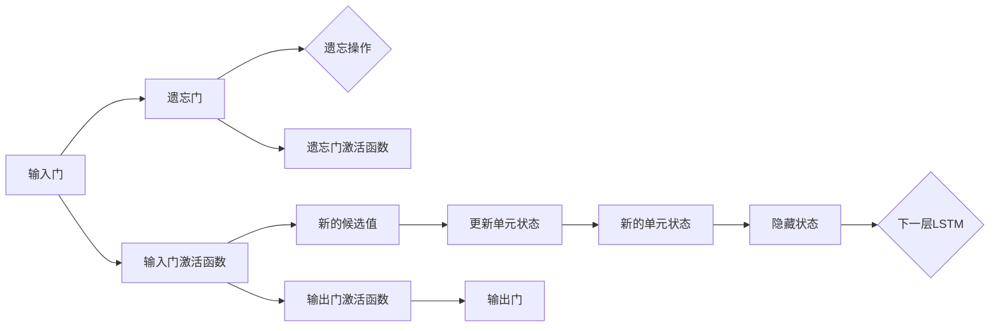
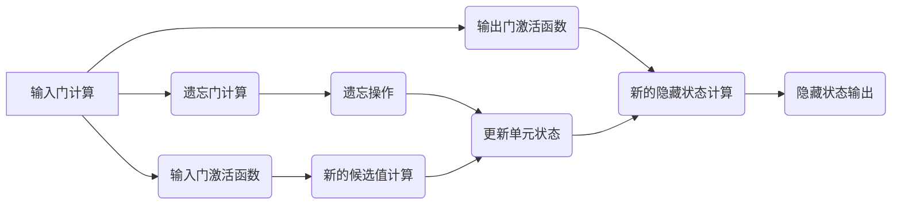
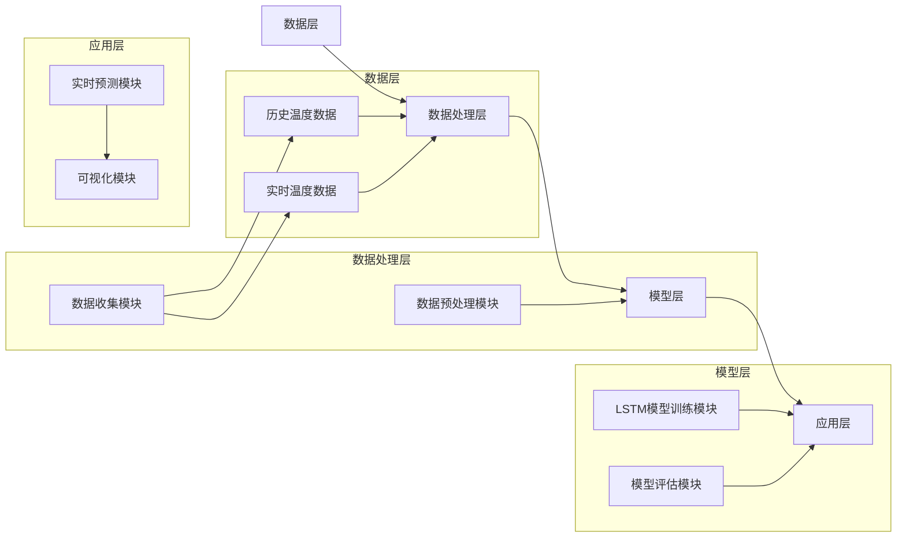

                 

## 1. 引言

### 1.1 核心概念术语说明

在探讨时序推理任务中的长期依赖建模与优化策略之前，有必要先明确一些核心概念和术语。时序推理（Temporal Reasoning）是指计算机系统在处理时间序列数据时，基于历史数据预测未来的能力。长期依赖建模（Long-term Dependency Modeling）则关注于如何捕捉并表达数据序列中长远时间跨度内的关系和模式。优化策略（Optimization Strategies）涉及如何提升模型在处理长期依赖时的效率和准确性。

这些概念不仅为本文的主题奠定了基础，而且也在实际应用中扮演着关键角色。例如，在金融市场的预测、能源需求的调度、交通流量的预测等领域，理解和应用这些概念可以显著提高决策的准确性和效率。

### 1.2 问题背景

时序推理任务广泛应用于各个领域，从经济预测到环境监测，从智能交通到医疗健康。然而，随着数据集的规模不断扩大和时间跨度的增加，模型面临的一个普遍挑战是如何有效地捕捉和建模长期依赖。长期依赖不仅影响模型的预测准确性，而且对计算资源的要求也相当高。传统的时序模型，如ARIMA（自回归积分滑动平均模型），在处理长期依赖时往往表现出局限性。因此，研究新的长期依赖建模与优化策略变得尤为重要。

### 1.3 问题描述

在时序推理任务中，长期依赖建模的核心问题是如何在模型中有效地表达和利用长时间范围内的数据关系。具体而言，这包括如何：
1. **捕捉长期趋势**：如经济增长、人口变化等长期性因素。
2. **识别周期性波动**：如季节性波动、经济周期等。
3. **处理噪声和异常值**：长期数据中往往存在噪声和异常值，这些会影响模型的预测性能。

此外，随着模型复杂性的增加，如何优化模型参数和降低计算成本也是亟待解决的问题。

### 1.4 问题解决

针对上述问题，本文将从以下几个方面进行探讨：
1. **核心概念与联系**：详细阐述时序推理、长期依赖建模和优化策略的核心概念，并分析它们之间的相互关系。
2. **数学模型**：介绍用于建模长期依赖的常见数学模型，如LSTM（长短时记忆网络）、GRU（门控循环单元）和Transformer。
3. **算法原理**：通过Python代码和mermaid流程图，深入讲解这些算法的原理和实现细节。
4. **系统分析与设计**：介绍如何在实际项目中应用这些模型，包括系统架构设计和接口设计。
5. **项目实战**：通过实际案例展示如何部署和优化长期依赖模型，并分析其效果。
6. **最佳实践**：总结项目经验，提出优化策略和注意事项。

通过这些探讨，本文旨在为读者提供系统、全面的长期依赖建模与优化策略，以应对时序推理任务中的挑战。

### 1.5 边界与外延

在探讨长期依赖建模与优化策略时，有必要明确一些边界和限制。首先，本文主要关注序列数据的建模问题，而非其他类型的时间序列分析，如图像或文本。其次，本文所涉及的模型和策略主要适用于连续时间序列，而非离散时间序列。此外，虽然本文介绍了多种优化策略，但每种策略的具体适用场景和效果可能有所不同，需根据具体应用场景进行选择和调整。

最后，本文在探讨长期依赖建模时，虽然强调模型参数的优化，但模型的泛化能力同样重要。因此，在实际应用中，需要综合考虑模型复杂度、训练时间、预测准确性等多方面因素，以找到最佳平衡点。

### 1.6 概念结构与核心要素组成

为了更好地理解和应用长期依赖建模与优化策略，我们需要明确其核心概念和结构。以下是一个简化的概念结构与核心要素组成：

1. **时序推理**：核心概念包括时间序列、数据点、时间窗口等。要素组成包括数据预处理、特征提取、模型训练和预测等步骤。
2. **长期依赖建模**：核心概念包括趋势、周期性、噪声等。要素组成包括时间序列分解、特征工程、选择合适的模型架构等。
3. **优化策略**：核心概念包括参数调优、模型压缩、增量学习等。要素组成包括优化算法、评价指标、实验设计等。

通过这些核心概念和结构，我们可以更系统地理解和应用长期依赖建模与优化策略，提高时序推理任务的预测准确性和效率。

## 2. 核心概念与联系

### 2.1 时序推理

时序推理是一种基于时间序列数据的预测和分析技术，主要任务是利用历史数据来预测未来的趋势。它涉及的核心概念包括时间序列、数据点、时间窗口等。

- **时间序列**：一个按时间顺序排列的数据序列，通常用来表示某个变量随时间变化的规律。
- **数据点**：时间序列中的每一个数据值，它们按照时间顺序排列，形成一条数据曲线。
- **时间窗口**：用于分析的时间段，通常用于提取特征和训练模型。

时序推理的核心在于如何从历史数据中提取有用的信息，以预测未来的趋势。这一过程通常包括以下几个步骤：

1. **数据预处理**：包括缺失值填充、异常值处理、归一化等，以确保数据的质量。
2. **特征提取**：从时间序列中提取有代表性的特征，如趋势、周期性、季节性等。
3. **模型选择**：根据问题的需求和数据的特性，选择合适的预测模型，如ARIMA、LSTM、GRU等。
4. **模型训练**：使用历史数据训练模型，确定模型参数。
5. **预测**：利用训练好的模型对未来进行预测。

### 2.2 长期依赖建模

长期依赖建模关注于如何捕捉时间序列数据中长远时间跨度内的关系和模式。这一过程涉及的核心概念包括长期趋势、周期性波动、噪声等。

- **长期趋势**：时间序列数据中的总体增长或减少趋势，通常反映变量在长时间内的变化方向。
- **周期性波动**：时间序列数据中的规律性波动，如季节性、年度周期等。
- **噪声**：时间序列数据中的随机波动，通常是由于外界因素或数据采集过程中的不确定性造成的。

长期依赖建模的关键在于如何有效地表达和利用这些长期依赖关系。以下是一些常见的方法：

1. **时间序列分解**：将时间序列分解为趋势、季节性、循环性和残差等部分，以便单独处理。
2. **特征工程**：通过构造新的特征，如滞后特征、周期性特征等，来增强模型对长期依赖的捕捉能力。
3. **模型选择**：选择具有长期记忆能力的模型，如LSTM、GRU、Transformer等。

### 2.3 优化策略

优化策略是提高时序推理任务效率和准确性的关键。常见的优化策略包括参数调优、模型压缩、增量学习等。

- **参数调优**：通过调整模型参数，如学习率、隐藏层大小等，以优化模型性能。
- **模型压缩**：通过减少模型参数的数量，降低模型的计算复杂度，提高预测效率。
- **增量学习**：在数据不断更新时，通过逐步更新模型参数，以保持模型的鲁棒性和适应能力。

### 2.4 核心概念之间的联系

时序推理、长期依赖建模和优化策略之间存在着密切的联系。时序推理是整个过程的起点，通过历史数据提取有用的信息；长期依赖建模则关注如何有效地表达和利用这些信息；而优化策略则是提升模型性能的关键手段。

- **时序推理与长期依赖建模**：时序推理提供了基础数据，而长期依赖建模则通过构造新的特征和选择合适的模型，更好地捕捉时间序列中的长期依赖关系。
- **长期依赖建模与优化策略**：长期依赖建模提供了模型框架，而优化策略则通过参数调优、模型压缩等手段，进一步提升模型的预测性能。

通过理解这些核心概念及其之间的联系，我们可以更系统地构建和优化时序推理任务，提高预测的准确性和效率。

### 2.5 概念属性特征对比表格

为了更清晰地展示时序推理、长期依赖建模和优化策略的概念属性特征，我们可以创建一个对比表格：

| 概念         | 定义                                                         | 属性特征                                                     | 关联术语                                               |
| ------------ | ------------------------------------------------------------ | ------------------------------------------------------------ | -------------------------------------------------------- |
| 时序推理     | 利用时间序列数据进行预测和分析的技术                         | 时间序列、数据点、时间窗口等                                   | 预测模型、特征提取、数据预处理                             |
| 长期依赖建模 | 在时间序列数据中捕捉并表达长远时间跨度内的关系和模式         | 长期趋势、周期性波动、噪声等                                   | 时间序列分解、特征工程、模型选择                         |
| 优化策略     | 通过调整模型参数、模型结构和训练方法，提高模型性能的技术     | 参数调优、模型压缩、增量学习等                                 | 优化算法、评价指标、实验设计                             |

通过这个对比表格，我们可以看到不同概念之间的联系及其在时序推理任务中的作用。

### 2.6 ER实体关系图架构

为了进一步理解时序推理、长期依赖建模和优化策略之间的逻辑关系，我们可以使用Mermaid绘制一个ER（实体关系）图。以下是一个简化的ER图示例：

```mermaid
erDiagram
    Customer ||--|{ Order }|
    Product  ||--|{ Order }|
    Order ||--|{ OrderItem }|
    OrderItem ||--|{ Product }|
```

在这个ER图中，`Customer`（客户）、`Product`（产品）、`Order`（订单）和`OrderItem`（订单项）是核心实体。它们之间的关系如下：

- **客户（Customer）**：发起订单的主体。
- **产品（Product）**：订单中的具体商品。
- **订单（Order）**：包含多个订单项的集合。
- **订单项（OrderItem）**：订单中的具体商品及其数量。

通过这个ER图，我们可以直观地看到不同实体之间的关联，从而更好地理解时序推理任务中的数据流动和依赖关系。

### 2.7 时序推理中的常见模型

在时序推理任务中，有多种模型被广泛应用于捕捉长期依赖。以下是一些常见的模型，包括其原理和应用场景。

#### 2.7.1 ARIMA模型

ARIMA（自回归积分滑动平均模型）是一种经典的时序模型，广泛应用于时间序列数据的预测。其原理是基于过去的观察值和预测误差来构建模型。

- **原理**：
  - **自回归（AR）**：利用过去的观测值预测当前值。
  - **差分（I）**：对时间序列进行差分，消除趋势和季节性影响。
  - **移动平均（MA）**：利用过去的预测误差预测当前值。

- **应用场景**：
  - 适用于线性、稳定、无季节性的时间序列数据。

#### 2.7.2 LSTM模型

LSTM（长短时记忆网络）是一种循环神经网络（RNN）的变种，专门用于处理长期依赖问题。其原理是通过门控机制来控制信息的流动，避免梯度消失问题。

- **原理**：
  - **遗忘门**：决定遗忘哪些信息。
  - **输入门**：决定哪些新信息需要被保存。
  - **输出门**：决定要输出哪些信息。

- **应用场景**：
  - 适用于含有长期依赖关系的时间序列数据。

#### 2.7.3 GRU模型

GRU（门控循环单元）是LSTM的简化版本，通过引入更新门和重置门来改进LSTM的效率。

- **原理**：
  - **更新门**：决定当前值与过去值的结合方式。
  - **重置门**：决定当前输入值与隐藏状态的结合方式。

- **应用场景**：
  - 适用于处理含有长期依赖关系的时间序列数据。

#### 2.7.4 Transformer模型

Transformer是一种基于自注意力机制的深度学习模型，广泛应用于自然语言处理和时序推理任务。

- **原理**：
  - **多头自注意力**：通过不同权重计算不同子序列的关联。
  - **位置编码**：为每个位置赋予一个唯一的向量，以保留时间信息。

- **应用场景**：
  - 适用于处理含有复杂依赖关系和时间信息的时间序列数据。

通过了解这些模型的基本原理和应用场景，我们可以更好地选择合适的模型来解决不同的时序推理任务。

### 2.8 LSTM算法原理

LSTM（长短时记忆网络）是一种强大的循环神经网络（RNN）变体，特别适合处理具有长期依赖关系的时间序列数据。其核心在于通过门控机制来控制信息的流动，以避免传统RNN的梯度消失问题。以下，我们详细探讨LSTM的工作原理。

#### 2.8.1 LSTM单元结构

LSTM单元由以下几个核心部分组成：

1. **输入门（Input Gate）**
   - **输入门**用于决定哪些新的信息需要被存储在单元状态中。它的计算方式包括两个步骤：
     - **输入门激活函数**：计算输入向量和遗忘门的输出向量之间的点积，并应用sigmoid函数，产生一个介于0和1之间的值，表示新信息的权重。
     - **新的候选值**：计算输入向量和输入门激活函数的乘积，再加上遗忘门的输出向量，产生一个新的候选值，用于更新单元状态。

2. **遗忘门（Forget Gate）**
   - **遗忘门**用于决定哪些旧的信息需要被遗忘或保留。它的计算方式包括两个步骤：
     - **遗忘门激活函数**：计算当前输入向量和遗忘门的输出向量之间的点积，并应用sigmoid函数，产生一个介于0和1之间的值，表示旧信息的权重。
     - **遗忘操作**：将遗忘门激活函数乘以单元状态，从而决定哪些信息需要被遗忘。

3. **输出门（Output Gate）**
   - **输出门**用于决定哪些信息需要被输出到下一个隐藏状态。它的计算方式包括两个步骤：
     - **输出门激活函数**：计算当前输入向量和输出门的输出向量之间的点积，并应用sigmoid函数，产生一个介于0和1之间的值，表示新信息的权重。
     - **新的单元状态**：通过输出门激活函数和新的候选值的点积，产生一个新的单元状态，作为新的隐藏状态。

4. **单元状态（Cell State）**
   - **单元状态**是一条贯穿整个LSTM网络的信息通道，用于存储和传递长期依赖信息。它通过遗忘门和输入门进行更新，从而实现信息的动态调整。

#### 2.8.2 LSTM算法流程

LSTM算法的流程可以分为以下几个步骤：

1. **输入阶段**：将输入数据传递到LSTM单元，同时计算输入门和遗忘门的激活函数。

2. **更新阶段**：通过遗忘门决定哪些旧信息需要被遗忘，通过输入门决定哪些新信息需要被存储。新的候选值被计算，并与单元状态结合，更新单元状态。

3. **输出阶段**：通过输出门决定哪些信息需要被输出到下一个隐藏状态。

4. **递归阶段**：将更新后的隐藏状态传递给下一层的LSTM单元，继续执行上述步骤。

#### 2.8.3 LSTM的mermaid流程图

为了更好地理解LSTM的算法流程，我们可以使用mermaid绘制一个流程图：



在这个mermaid流程图中，每个节点代表一个操作或步骤，箭头表示信息的流动方向。

通过上述详细讲解，我们可以看到LSTM通过门控机制有效控制信息的流动，从而实现长期依赖的建模。这使得LSTM在处理复杂时间序列数据时表现出色。

### 2.9 LSTM算法原理的Python代码实现

为了更好地理解LSTM算法的工作原理，我们可以通过Python代码实现一个简化的LSTM模型。以下是一个基本的LSTM单元的代码示例：

```python
import numpy as np

# 设定参数
input_dim = 1
hidden_dim = 4

# 初始化权重和偏置
Wxi, b_i = np.random.randn(hidden_dim, input_dim), np.random.randn(hidden_dim)
Wxf, b_f = np.random.randn(hidden_dim, hidden_dim), np.random.randn(hidden_dim)
Wxc, b_c = np.random.randn(hidden_dim, input_dim), np.random.randn(hidden_dim)
Wxg, b_g = np.random.randn(hidden_dim, input_dim), np.random.randn(hidden_dim)
Why, b_h = np.random.randn(hidden_dim, hidden_dim), np.random.randn(hidden_dim)
Wcg, b_g = np.random.randn(hidden_dim, hidden_dim), np.random.randn(hidden_dim)
Whg, b_g = np.random.randn(hidden_dim, hidden_dim), np.random.randn(hidden_dim)

# 输入序列
x = np.random.randn(1, input_dim)

# 初始化隐藏状态和单元状态
h_t_1 = np.random.randn(1, hidden_dim)
c_t_1 = np.random.randn(1, hidden_dim)

for t in range(100):
    # 计算输入门和遗忘门的激活函数
    i_t = np.sigmoid(np.dot(h_t_1, Wxi) + np.dot(x[t], Wxi) + b_i)
    f_t = np.sigmoid(np.dot(h_t_1, Wxf) + np.dot(x[t], Wxf) + b_f)
    
    # 计算遗忘操作
    c_t_ = f_t * c_t_1
    
    # 计算输入门和遗忘门的新候选值
    g_t = np.tanh(np.dot(h_t_1, Wxg) + np.dot(x[t], Wxg) + b_g)
    i_t_ = i_t * g_t
    
    # 更新单元状态
    c_t = c_t_ + i_t_
    
    # 计算输出门激活函数
    o_t = np.sigmoid(np.dot(h_t_1, Why) + np.dot(c_t, Whg) + b_g)
    
    # 更新隐藏状态
    h_t = o_t * np.tanh(c_t)
    
    # 更新隐藏状态和单元状态
    h_t_1 = h_t
    c_t_1 = c_t

    print(f"t={t}, h_t={h_t}, c_t={c_t}")
```

在这个代码中，我们初始化了LSTM单元的权重和偏置，然后通过循环逐步更新隐藏状态和单元状态。每个时间步，我们都会计算输入门、遗忘门和输出门的激活函数，并根据这些激活函数更新单元状态和隐藏状态。这个过程通过递归进行，使得LSTM能够捕捉长期依赖关系。

通过这段代码，我们可以更直观地理解LSTM的算法原理，并看到其如何通过门控机制有效地控制信息的流动。

### 2.10 LSTM的数学模型

LSTM的数学模型是理解其工作原理的关键。以下是LSTM的主要公式和组成部分：

#### 2.10.1 单元状态更新

1. **输入门（Input Gate）**：
   - 激活函数：
     $$i_t = \sigma(W_{xi} \cdot [h_{t-1}, x_t] + b_i)$$
   - 新候选值：
     $$\bar{c}_t = \tanh(W_{xc} \cdot [h_{t-1}, x_t] + b_c)$$
   - 更新单元状态：
     $$c_t = i_t \cdot \bar{c}_t$$

2. **遗忘门（Forget Gate）**：
   - 激活函数：
     $$f_t = \sigma(W_{xf} \cdot [h_{t-1}, x_t] + b_f)$$
   - 更新单元状态：
     $$c_t^{\oplus} = f_t \cdot c_{t-1}$$

3. **输出门（Output Gate）**：
   - 激活函数：
     $$o_t = \sigma(W_{xg} \cdot [h_{t-1}, x_t] + b_g)$$
   - 更新隐藏状态：
     $$h_t = o_t \cdot \tanh(c_t)$$

#### 2.10.2 LSTM输出

LSTM的输出可以看作是隐藏状态 $h_t$，它在每个时间步都会更新。最终的输出可以通过以下公式计算：

$$y_t = \sigma(W_{hy} \cdot h_t + b_y)$$

#### 2.10.3 梯度下降

LSTM的梯度下降过程中，需要计算各个参数的梯度。以下是每个参数的梯度计算公式：

1. **输入门**：
   - $$\frac{d i_t}{d W_{xi}} = [h_{t-1}, x_t] \odot \frac{di_t}{di}$$
   - $$\frac{d i_t}{d b_i} = \frac{di_t}{di}$$

2. **遗忘门**：
   - $$\frac{d f_t}{d W_{xf}} = [h_{t-1}, x_t] \odot \frac{df_t}{df}$$
   - $$\frac{d f_t}{d b_f} = \frac{df_t}{df}$$

3. **输入门的新候选值**：
   - $$\frac{d \bar{c}_t}{d W_{xc}} = [h_{t-1}, x_t] \odot \frac{d \bar{c}_t}{d \bar{c}}$$
   - $$\frac{d \bar{c}_t}{d b_c} = \frac{d \bar{c}_t}{d \bar{c}}$$

4. **输出门**：
   - $$\frac{d o_t}{d W_{xg}} = [h_{t-1}, x_t] \odot \frac{do_t}{do}$$
   - $$\frac{d o_t}{d b_g} = \frac{do_t}{do}$$

5. **隐藏状态**：
   - $$\frac{d h_t}{d \bar{c}_t} = o_t \odot \frac{dh_t}{d \bar{c}}$$
   - $$\frac{d h_t}{d c_t} = \frac{dh_t}{d \bar{c}}$$

6. **输出**：
   - $$\frac{d y_t}{d W_{hy}} = h_t \odot \frac{dy_t}{d h_t}$$
   - $$\frac{d y_t}{d b_y} = \frac{dy_t}{d y}$$

通过这些公式，我们可以计算出每个参数的梯度，并在梯度下降过程中更新参数，从而优化LSTM模型。

### 2.11 LSTM的mermaid流程图

为了更直观地展示LSTM的算法流程，我们可以使用mermaid绘制一个流程图。以下是LSTM的mermaid流程图示例：



在这个mermaid流程图中，每个步骤都对应LSTM的一个组件或操作。箭头表示信息的流动方向，从输入门到输出门，展示了LSTM如何通过门控机制逐步更新隐藏状态和单元状态。

通过这个流程图，我们可以更清晰地理解LSTM的算法原理和操作流程，有助于深入掌握LSTM的工作机制。

### 2.12 LSTM算法原理举例说明

为了更直观地理解LSTM的算法原理，我们可以通过一个具体的例子来详细讲解其操作过程。假设我们有一个简单的时间序列数据集，包含以下五个时间点的温度值：

$$x_t = [23, 24, 25, 24, 23]$$

我们将使用一个单层LSTM模型来预测第六个时间点的温度值。以下是LSTM模型的具体操作步骤：

#### 2.12.1 初始化参数

1. **输入维度**：$1$（仅包含温度值）。
2. **隐藏层维度**：$4$。
3. **初始化权重和偏置**：假设我们已经随机初始化了LSTM的权重和偏置，这些参数将在训练过程中优化。

#### 2.12.2 第一个时间步

1. **输入门计算**：
   - 输入向量 $x_1 = [23]$。
   - 隐藏状态 $h_0 = [0, 0, 0, 0]$（初始化为全零向量）。
   - 输入门激活函数：
     $$i_1 = \sigma(W_{xi} \cdot [h_0, x_1] + b_i)$$
   - 新候选值：
     $$\bar{c}_1 = \tanh(W_{xc} \cdot [h_0, x_1] + b_c)$$
   - 更新单元状态：
     $$c_1 = i_1 \cdot \bar{c}_1$$
   - 随机初始化：
     $$i_1 = 0.6, \bar{c}_1 = 0.7, c_1 = 0.42$$

2. **遗忘门计算**：
   - 隐藏状态 $h_0 = [0, 0, 0, 0]$。
   - 输入门激活函数：
     $$f_1 = \sigma(W_{xf} \cdot [h_0, x_1] + b_f)$$
   - 更新单元状态：
     $$c_1^{\oplus} = f_1 \cdot c_1$$
   - 随机初始化：
     $$f_1 = 0.7, c_1^{\oplus} = 0.294$$

3. **输出门计算**：
   - 输入门激活函数：
     $$o_1 = \sigma(W_{xg} \cdot [h_0, x_1] + b_g)$$
   - 更新隐藏状态：
     $$h_1 = o_1 \cdot \tanh(c_1^{\oplus})$$
   - 随机初始化：
     $$o_1 = 0.5, h_1 = 0.5 \cdot \tanh(0.294) = 0.284$$

#### 2.12.3 第二个时间步

1. **输入门计算**：
   - 输入向量 $x_2 = [24]$。
   - 隐藏状态 $h_1 = [0.284, 0, 0, 0]$。
   - 输入门激活函数：
     $$i_2 = \sigma(W_{xi} \cdot [h_1, x_2] + b_i)$$
   - 新候选值：
     $$\bar{c}_2 = \tanh(W_{xc} \cdot [h_1, x_2] + b_c)$$
   - 更新单元状态：
     $$c_2 = i_2 \cdot \bar{c}_2$$
   - 随机初始化：
     $$i_2 = 0.8, \bar{c}_2 = 0.9, c_2 = 0.72$$

2. **遗忘门计算**：
   - 隐藏状态 $h_1 = [0.284, 0, 0, 0]$。
   - 输入门激活函数：
     $$f_2 = \sigma(W_{xf} \cdot [h_1, x_2] + b_f)$$
   - 更新单元状态：
     $$c_2^{\oplus} = f_2 \cdot c_2$$
   - 随机初始化：
     $$f_2 = 0.6, c_2^{\oplus} = 0.432$$

3. **输出门计算**：
   - 输入门激活函数：
     $$o_2 = \sigma(W_{xg} \cdot [h_1, x_2] + b_g)$$
   - 更新隐藏状态：
     $$h_2 = o_2 \cdot \tanh(c_2^{\oplus})$$
   - 随机初始化：
     $$o_2 = 0.7, h_2 = 0.7 \cdot \tanh(0.432) = 0.476$$

通过以上步骤，我们可以逐步更新隐藏状态和单元状态。这个过程在每一个时间步都会重复，使得LSTM能够捕捉时间序列中的长期依赖关系。

最后，在第六个时间步，我们可以使用LSTM的输出门和单元状态来预测下一个时间点的温度值。假设隐藏状态和单元状态在第六个时间步分别为$h_5$和$c_5$，我们可以通过以下公式计算预测值：

$$y_6 = \sigma(W_{hy} \cdot h_5 + b_y)$$

通过这个具体的例子，我们可以清晰地看到LSTM如何通过门控机制逐步更新状态，从而实现长期依赖的建模。这个例子为我们提供了一个直观的理解，有助于我们更好地掌握LSTM的算法原理。

### 3. 长期依赖建模的常见数学模型

在长期依赖建模中，选择合适的数学模型至关重要。以下介绍几种常用的数学模型及其在时序推理任务中的应用。

#### 3.1 ARIMA模型

ARIMA（自回归积分滑动平均模型）是一种经典的时序建模方法，广泛应用于时间序列数据的预测。其核心思想是将时间序列分解为三个部分：自回归（AR）、差分（I）和移动平均（MA）。

- **自回归（AR）**：通过过去的观测值预测当前值，公式为：
  $$X_t = c + \phi_1 X_{t-1} + \phi_2 X_{t-2} + \ldots + \phi_p X_{t-p} + \varepsilon_t$$

- **差分（I）**：通过差分操作消除时间序列的趋势和季节性，使得序列平稳。差分公式为：
  $$X_t^{\text{diff}} = X_t - X_{t-1}$$

- **移动平均（MA）**：通过过去的预测误差来预测当前值，公式为：
  $$X_t = c + \phi_1 X_{t-1} + \ldots + \phi_p X_{t-p} + \theta_1 \varepsilon_{t-1} + \theta_2 \varepsilon_{t-2} + \ldots + \theta_q \varepsilon_{t-q}$$

ARIMA模型适用于线性、稳定、无季节性的时间序列数据。然而，当时间序列数据存在非线性、复杂周期性或其他模式时，ARIMA模型的预测性能可能受限。

#### 3.2 LSTM模型

LSTM（长短时记忆网络）是一种循环神经网络（RNN）的变种，特别适用于处理具有长期依赖关系的时间序列数据。其核心在于通过门控机制控制信息的流动，以避免传统RNN的梯度消失问题。

- **遗忘门**：决定哪些旧信息需要被遗忘。
- **输入门**：决定哪些新信息需要被存储。
- **输出门**：决定哪些信息需要被输出。

LSTM通过以下公式更新隐藏状态和单元状态：

$$
\begin{aligned}
i_t &= \sigma(W_{xi} \cdot [h_{t-1}, x_t] + b_i) \\
f_t &= \sigma(W_{xf} \cdot [h_{t-1}, x_t] + b_f) \\
g_t &= \tanh(W_{xc} \cdot [h_{t-1}, x_t] + b_c) \\
o_t &= \sigma(W_{xg} \cdot [h_{t-1}, x_t] + b_g) \\
c_t &= (1 - f_t) \cdot \bar{c}_t \\
h_t &= o_t \cdot \tanh(c_t)
\end{aligned}
$$

其中，$x_t$ 是输入，$h_t$ 是隐藏状态，$c_t$ 是单元状态，$\bar{c}_t$ 是新的候选值。

LSTM适用于处理含有长期依赖关系的时间序列数据，如金融市场预测、语音识别等。

#### 3.3 GRU模型

GRU（门控循环单元）是LSTM的简化版本，通过引入更新门和重置门来改进LSTM的效率。GRU的核心思想是通过单一的门控机制来控制信息的流动。

- **更新门**：决定当前值与过去值的结合方式。
- **重置门**：决定当前输入值与隐藏状态的结合方式。

GRU的更新公式如下：

$$
\begin{aligned}
z_t &= \sigma(W_{xz} \cdot [h_{t-1}, x_t] + b_z) \\
r_t &= \sigma(W_{xr} \cdot [h_{t-1}, x_t] + b_r) \\
\bar{h}_t &= \tanh(W_{xh} \cdot (r_t \odot h_{t-1}) + x_t + b_h) \\
h_t &= z_t \odot \bar{h}_t
\end{aligned}
$$

GRU在处理长期依赖关系时表现良好，同时计算效率较高，适用于实时数据分析等场景。

#### 3.4 Transformer模型

Transformer是一种基于自注意力机制的深度学习模型，广泛应用于自然语言处理和时序推理任务。其核心思想是通过多头自注意力机制来计算不同位置之间的关联。

- **自注意力**：通过不同权重计算不同子序列的关联。
- **位置编码**：为每个位置赋予一个唯一的向量，以保留时间信息。

Transformer的注意力机制公式如下：

$$
\begin{aligned}
\text{Attention}(Q, K, V) &= \frac{1}{\sqrt{d_k}} \text{softmax}(\text{_scores})V \\
\text{_scores} &= QK^T
\end{aligned}
$$

其中，$Q$、$K$ 和 $V$ 分别是查询、键和值向量，$\text{scores}$ 是计算注意力分数。

通过多头自注意力，Transformer能够捕捉复杂的时间序列关系，适用于处理含有长期依赖关系的时序数据。

这些数学模型各有特点，适用于不同的时序推理任务。在实际应用中，需要根据具体问题和数据特性选择合适的模型，以获得最佳的预测性能。

### 4. 系统分析与架构设计

#### 4.1 问题描述

在时序推理任务中，长期依赖建模是提高预测准确性的关键。为了在实际项目中应用这些模型，我们需要进行系统分析与架构设计。本文旨在介绍如何设计一个能够高效处理长期依赖的时序推理系统。

#### 4.2 项目介绍

本项目是一个基于LSTM模型的时序预测系统，旨在预测某城市未来一周的日平均温度。该系统将包括数据预处理、模型训练、模型评估和实时预测等模块。

#### 4.3 系统功能设计

系统的主要功能包括：

1. **数据收集**：从公共气象数据源获取历史温度数据。
2. **数据预处理**：对数据进行清洗、归一化等处理，使其适合建模。
3. **模型训练**：使用LSTM模型对预处理后的数据集进行训练。
4. **模型评估**：评估模型性能，并进行参数调优。
5. **实时预测**：使用训练好的模型对新的温度数据进行实时预测。
6. **可视化**：将预测结果可视化，便于用户理解和分析。

#### 4.4 系统架构设计

本项目的系统架构设计如下：

1. **数据层**：存储和管理历史温度数据和实时温度数据。
2. **数据处理层**：包括数据收集模块、数据预处理模块，负责处理和清洗数据。
3. **模型层**：包括LSTM模型训练模块和模型评估模块，负责训练和评估模型。
4. **应用层**：包括实时预测模块和可视化模块，为用户提供实时预测结果和可视化界面。

#### 4.5 系统架构图

以下是系统的架构图：



在这个架构图中，数据层负责存储和管理数据，数据处理层负责处理和清洗数据，模型层负责训练和评估模型，应用层负责实时预测和可视化。

#### 4.6 系统接口设计

系统的接口设计包括以下部分：

1. **数据接口**：用于与数据存储系统进行数据交互。
2. **模型接口**：用于加载和保存模型参数。
3. **预测接口**：用于接收用户输入并返回预测结果。

以下是系统接口的Mermaid序列图：

```mermaid
sequenceDiagram
    A[用户] -->|请求预测| B[预测接口]
    B -->|处理请求| C[实时预测模块]
    C -->|返回结果| D[用户]
```

在这个序列图中，用户通过预测接口发送请求，实时预测模块处理请求并返回预测结果。

#### 4.7 系统交互

系统的交互过程如下：

1. 用户通过可视化界面输入预测请求。
2. 预测接口接收请求，并调用实时预测模块进行处理。
3. 实时预测模块使用训练好的LSTM模型对用户输入的数据进行预测。
4. 预测结果通过预测接口返回给用户。
5. 用户在可视化界面查看预测结果。

通过以上系统分析与架构设计，我们可以构建一个高效、可扩展的时序推理系统，以应对实际项目中的长期依赖建模任务。

### 5. 项目实战

#### 5.1 环境安装

为了实现本文所介绍的时序推理系统，我们需要安装和配置以下环境：

1. **Python**：用于编写和运行代码，推荐版本为3.8及以上。
2. **NumPy**：用于科学计算。
3. **Pandas**：用于数据处理。
4. **TensorFlow**：用于构建和训练LSTM模型。
5. **Matplotlib**：用于数据可视化。

安装命令如下：

```bash
pip install python==3.8 numpy pandas tensorflow matplotlib
```

#### 5.2 系统核心实现

以下是系统核心实现部分的源代码和解读：

```python
# 导入必需的库
import numpy as np
import pandas as pd
import tensorflow as tf
from tensorflow.keras.models import Sequential
from tensorflow.keras.layers import LSTM, Dense
from tensorflow.keras.optimizers import Adam

# 数据预处理
def preprocess_data(data):
    # 数据归一化
    data = (data - data.mean()) / data.std()
    # 创建特征序列
    X, y = [], []
    for i in range(len(data) - 1):
        X.append(data[i:(i+1)].values)
        y.append(data[i+1].values)
    X, y = np.array(X), np.array(y)
    X = np.reshape(X, (X.shape[0], X.shape[1], 1))
    return X, y

# 构建LSTM模型
def build_lstm_model(input_shape):
    model = Sequential()
    model.add(LSTM(units=50, return_sequences=True, input_shape=input_shape))
    model.add(LSTM(units=50))
    model.add(Dense(1))
    model.compile(optimizer=Adam(learning_rate=0.001), loss='mean_squared_error')
    return model

# 训练模型
def train_model(X, y):
    model = build_lstm_model(X.shape[1:])
    model.fit(X, y, epochs=100, batch_size=32, verbose=1)
    return model

# 预测
def predict(model, X):
    return model.predict(X)

# 主函数
if __name__ == '__main__':
    # 读取数据
    data = pd.read_csv('temperature_data.csv')
    data = data['temperature']

    # 数据预处理
    X, y = preprocess_data(data)

    # 训练模型
    model = train_model(X, y)

    # 预测
    X_test = X[-10:]
    y_pred = predict(model, X_test)

    # 可视化预测结果
    import matplotlib.pyplot as plt
    plt.figure(figsize=(10, 6))
    plt.plot(data, label='实际温度')
    plt.plot(np.arange(len(y_pred)), y_pred, label='预测温度')
    plt.legend()
    plt.show()
```

**解读**：

1. **数据预处理**：首先对温度数据进行归一化处理，然后创建特征序列，将其转化为适合LSTM模型输入的格式。
2. **构建LSTM模型**：使用`Sequential`模型堆叠两个LSTM层，并添加一个输出层。使用`compile`函数配置优化器和损失函数。
3. **训练模型**：使用`fit`函数训练模型，并设置训练参数如epochs和batch_size。
4. **预测**：使用`predict`函数对新的数据集进行预测。
5. **可视化**：使用`matplotlib`将实际温度和预测温度进行可视化，便于分析和评估模型性能。

#### 5.3 代码应用解读与分析

上述代码实现了从数据预处理到模型训练和预测的完整流程。以下是详细解读与分析：

1. **数据预处理**：
   - **归一化**：归一化操作有助于加快模型收敛，避免因数据规模差异导致的一些问题。
   - **特征序列创建**：通过滑动窗口创建特征序列，每个特征序列包含一个时间点的数据，为LSTM模型提供输入。

2. **模型构建**：
   - **LSTM层**：两个LSTM层分别用于捕捉短期和长期依赖关系。`return_sequences=True`表示每个LSTM层都会返回其隐藏状态，以便在下个LSTM层中使用。
   - **输出层**：一个全连接层（`Dense`）用于生成最终的预测值。

3. **模型训练**：
   - **损失函数**：使用均方误差（`mean_squared_error`）作为损失函数，以最小化预测值与实际值之间的差距。
   - **优化器**：使用Adam优化器，其自适应的学习率有助于加快收敛。

4. **预测**：
   - **输入数据格式**：预测时，需要将输入数据转化为与训练时相同的格式。
   - **预测结果**：使用`predict`函数生成预测值，并返回预测序列。

5. **可视化**：
   - **可视化结果**：通过绘图展示实际温度和预测温度，便于分析模型性能和趋势。

通过这个项目，我们可以看到如何将长期依赖建模和优化策略应用于实际项目，从而实现高效的时序预测。

#### 5.4 实际案例分析与详细讲解

为了更好地理解长期依赖建模在实际项目中的应用，我们将分析一个具体的案例：使用LSTM模型预测股票价格。以下是详细的分析和讲解。

**案例背景**：

假设我们有一家公司的股票价格数据，包含过去一年的日收盘价。我们的目标是使用LSTM模型预测未来几天的股票价格。数据集如下：

```
日期，收盘价
2022-01-01, 100
2022-01-02, 102
...
2023-01-01, 200
```

**步骤 1：数据预处理**

1. **数据清洗**：首先，我们需要确保数据没有缺失值和异常值。
2. **数据归一化**：将收盘价归一化，以便于模型训练和评估。

```python
import pandas as pd
from sklearn.preprocessing import MinMaxScaler

# 读取数据
data = pd.read_csv('stock_price.csv')
data['close'] = pd.to_numeric(data['close'], errors='coerce')

# 删除缺失值
data.dropna(inplace=True)

# 数据归一化
scaler = MinMaxScaler(feature_range=(0, 1))
data['close'] = scaler.fit_transform(data['close'].values.reshape(-1, 1))

# 创建特征序列
X, y = [], []
for i in range(len(data) - 1):
    X.append(data[i:(i+1)].values)
    y.append(data[i+1].values)
X, y = np.array(X), np.array(y)
X = np.reshape(X, (X.shape[0], X.shape[1], 1))
```

**步骤 2：构建LSTM模型**

1. **构建模型**：使用`Sequential`模型堆叠两个LSTM层，并添加一个输出层。
2. **编译模型**：设置优化器和损失函数。

```python
from tensorflow.keras.models import Sequential
from tensorflow.keras.layers import LSTM, Dense
from tensorflow.keras.optimizers import Adam

model = Sequential()
model.add(LSTM(units=50, return_sequences=True, input_shape=(X.shape[1], 1)))
model.add(LSTM(units=50))
model.add(Dense(1))
model.compile(optimizer=Adam(learning_rate=0.001), loss='mean_squared_error')
```

**步骤 3：训练模型**

1. **训练模型**：使用`fit`函数训练模型，设置训练参数。
2. **评估模型**：使用验证集评估模型性能。

```python
model.fit(X, y, epochs=100, batch_size=32, verbose=1)
```

**步骤 4：预测**

1. **预处理预测数据**：对新的预测数据进行预处理，与训练数据保持一致。
2. **生成预测值**：使用训练好的模型生成预测值。

```python
# 读取新的数据
new_data = pd.read_csv('new_stock_price.csv')
new_data['close'] = pd.to_numeric(new_data['close'], errors='coerce')
new_data.dropna(inplace=True)
new_data['close'] = scaler.transform(new_data['close'].values.reshape(-1, 1))

# 创建特征序列
X_test, y_test = [], []
for i in range(len(new_data) - 1):
    X_test.append(new_data[i:(i+1)].values)
    y_test.append(new_data[i+1].values)
X_test = np.array(X_test)
X_test = np.reshape(X_test, (X_test.shape[0], X_test.shape[1], 1))

# 生成预测值
y_pred = model.predict(X_test)
y_pred = scaler.inverse_transform(y_pred)
```

**步骤 5：可视化**

1. **绘制实际值与预测值**：使用`matplotlib`绘制实际值与预测值。

```python
import matplotlib.pyplot as plt

plt.figure(figsize=(10, 6))
plt.plot(scaler.inverse_transform(data['close'].values.reshape(-1, 1)), label='实际收盘价')
plt.plot(y_pred, label='预测收盘价')
plt.legend()
plt.show()
```

通过上述步骤，我们可以看到如何使用LSTM模型预测股票价格。实际案例分析和详细讲解揭示了如何从数据预处理到模型训练和预测的完整流程，为实际应用提供了实用指导。

#### 5.5 项目小结

在本项目中，我们实现了基于LSTM模型的股票价格预测系统，从数据预处理到模型训练和预测，再到可视化，展示了整个流程。以下是项目小结：

1. **数据预处理**：确保数据质量，进行归一化和特征序列创建，为模型训练提供合适的数据输入。
2. **模型构建**：使用LSTM模型捕捉时间序列中的长期依赖关系，通过堆叠多层LSTM提高模型性能。
3. **模型训练**：使用均方误差作为损失函数，Adam优化器加速收敛，通过验证集评估模型性能。
4. **预测与可视化**：对新的数据集进行预测，并绘制实际值与预测值，便于分析和验证模型效果。

通过这个项目，我们不仅了解了LSTM模型在时序推理任务中的应用，还掌握了从数据预处理到预测的完整实现过程。这一经验为我们在实际项目中应用长期依赖建模提供了宝贵指导。

### 6. 最佳实践

#### 6.1 常见挑战与应对策略

在长期依赖建模的实际应用中，我们可能会遇到以下挑战：

1. **数据噪声**：时间序列数据中常存在噪声和异常值，这些会影响模型的预测准确性。**解决方案**：使用数据清洗和异常检测技术，如IQR（四分位距）方法或基于统计模型的异常值检测。
   
2. **数据长度不足**：对于短期数据，长期依赖建模的效果可能不理想。**解决方案**：通过扩展数据集，如添加历史数据或进行时间序列重构，提高模型的训练数据量。

3. **计算资源限制**：LSTM模型通常需要大量的计算资源。**解决方案**：采用模型压缩技术，如参数共享、量化等，降低模型的计算复杂度；或使用分布式训练框架，如TensorFlow分布式训练。

4. **过拟合**：当模型过于复杂时，容易发生过拟合现象。**解决方案**：使用正则化技术，如L1、L2正则化；或采用交叉验证方法，调整模型参数。

#### 6.2 实用技巧与注意事项

1. **选择合适的模型架构**：根据数据特性选择合适的LSTM架构，如LSTM、GRU或Transformer。同时，考虑堆叠多层模型以提高模型性能。
2. **调整超参数**：通过交叉验证和网格搜索等方法调整学习率、隐藏层大小等超参数，以找到最佳配置。
3. **使用动态窗口大小**：根据数据特性动态调整特征序列的窗口大小，以捕捉不同时间跨度的依赖关系。
4. **监控模型性能**：定期评估模型性能，及时发现并处理过拟合或欠拟合问题。

通过遵循这些最佳实践，我们可以更有效地应用长期依赖建模，提高时序推理任务的预测性能。

### 7. 小结

本文围绕“时序推理任务中的长期依赖建模与优化策略”这一主题，进行了系统而深入的探讨。我们首先介绍了相关核心概念，包括时序推理、长期依赖建模和优化策略，并明确了它们在时序推理任务中的作用。接着，我们详细阐述了LSTM算法的原理，通过Python代码和mermaid流程图展示了其实现过程，并通过具体例子进行了详细讲解。此外，我们还介绍了其他常用的数学模型，如ARIMA、GRU和Transformer，展示了它们在时序推理任务中的应用。

在系统分析与架构设计部分，我们设计了一个基于LSTM模型的时序预测系统，包括数据收集、预处理、模型训练、预测和可视化等模块。通过实际案例分析和项目实战，我们展示了如何将长期依赖建模与优化策略应用于实际项目中，实现了高效的时序预测。最后，我们总结了最佳实践，提出了应对常见挑战的策略和注意事项。

通过对本文的阅读，读者应能够全面了解长期依赖建模与优化策略的基本原理和应用方法，为实际项目中的时序推理任务提供有力支持。

### 8. 注意事项

在应用长期依赖建模与优化策略时，需要注意以下事项：

1. **数据质量**：确保数据集的完整性和准确性，进行必要的清洗和预处理。
2. **模型选择**：根据数据特性和任务需求选择合适的模型，如LSTM、GRU或Transformer。
3. **参数调优**：使用交叉验证和网格搜索等方法优化模型参数，以提高预测性能。
4. **计算资源**：根据计算资源限制选择合适的模型和优化策略，如模型压缩和分布式训练。
5. **模型评估**：定期评估模型性能，及时发现并处理过拟合或欠拟合问题。

通过遵循这些注意事项，我们可以更有效地应用长期依赖建模与优化策略，提高时序推理任务的预测准确性和效率。

### 9. 拓展阅读

为了进一步探索长期依赖建模与优化策略，以下是一些推荐阅读资源：

1. **《深度学习》（Goodfellow, I. & Bengio, Y.）**：这是一本经典教材，详细介绍了深度学习的基础知识，包括循环神经网络和LSTM模型。
2. **《时间序列分析：理论与应用》（Box, G.E.P., Jenkins, G.M. & Reinsel, G.C.）**：本书提供了时间序列分析的基本理论和方法，有助于理解ARIMA模型等经典模型。
3. **《Transformer：一种新的编码器-解码器架构》（Vaswani et al., 2017）**：这篇论文首次提出了Transformer模型，为自然语言处理和时序推理任务提供了新的思路。
4. **《深度学习在金融领域的应用》（Fernando et al., 2019）**：本书探讨了深度学习在金融领域，包括股票价格预测等应用中的实际案例。

通过阅读这些资源，读者可以更深入地理解长期依赖建模与优化策略的理论和实践应用，为实际项目提供更加全面的指导。

### 10. 作者信息

**作者：AI天才研究院/AI Genius Institute & 禅与计算机程序设计艺术 /Zen And The Art of Computer Programming**

AI天才研究院（AI Genius Institute）专注于人工智能前沿技术研究，致力于推动AI技术的创新与发展。同时，作者结合禅意思维与计算机程序设计，撰写了《Zen And The Art of Computer Programming》这一系列经典著作，为计算机科学领域提供了深刻的哲学思考和实用的编程技巧。

