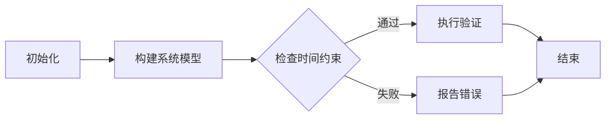
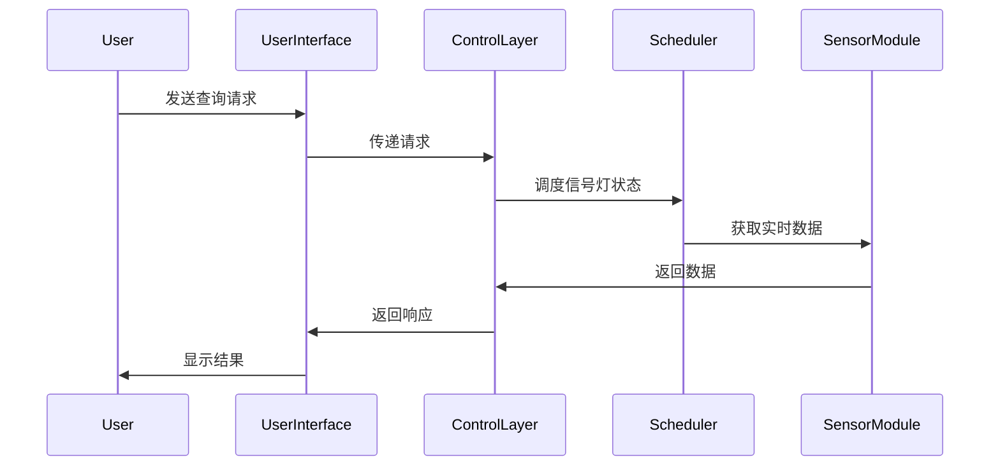
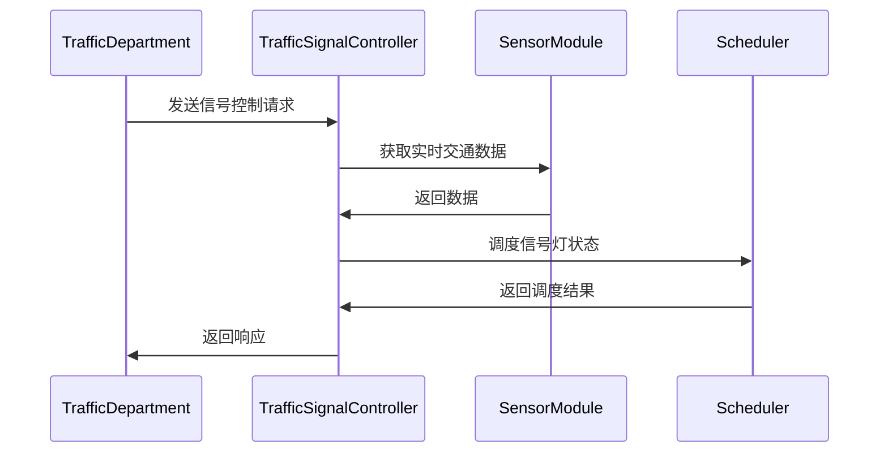

                 

### 文章标题

# 时序逻辑在实时系统规约与验证中的应用

### 文章关键词

- 时序逻辑
- 实时系统
- 规约
- 验证
- 系统建模

### 文章摘要

本文详细探讨了时序逻辑在实时系统规约与验证中的应用。通过介绍实时系统的背景与挑战，我们理解了时序逻辑在系统建模中的重要性。文章首先回顾了时序逻辑的基础概念，然后深入分析了其在实时系统规约中的应用，以及如何利用时序逻辑进行系统验证。通过具体的应用案例，我们展示了时序逻辑在实际系统设计中的有效性和可靠性。最后，对未来的研究方向和实时系统开发者的建议进行了展望。

---

### 背景介绍

#### 实时系统的定义与特点

实时系统是一类特殊的计算机系统，其核心特点是对时间敏感，需要按照严格的时间限制来完成任务。这类系统广泛应用于工业控制、航空航天、医疗设备、交通运输等领域。与传统的计算系统不同，实时系统必须在特定的时间窗口内完成计算和响应，以满足时间约束条件。

实时系统的关键特性包括：

1. **确定性**：系统的行为和响应时间是可预测和确定的。
2. **及时性**：系统能够在规定的时间内完成任务。
3. **可靠性**：系统能够在长时间运行中保持稳定和可靠。

#### 实时系统的应用领域

实时系统的应用范围广泛，涵盖了多个关键领域：

1. **工业控制**：实时控制系统用于自动化生产线、机器人控制等。
2. **航空航天**：飞行控制系统、导航系统等对时间要求极高。
3. **医疗设备**：如手术机器人、监护仪等，需要精确的时间同步和响应。
4. **交通运输**：如交通信号系统、列车控制系统等，确保交通流畅和安全性。
5. **智能家居**：实时监控系统、自动化控制系统等。

#### 实时系统的挑战

尽管实时系统在各个领域都有广泛应用，但其在设计和实现过程中面临着诸多挑战：

1. **时间约束**：实时系统需要在严格的时间窗口内完成任务，对时间敏感性要求极高。
2. **资源限制**：实时系统通常在有限的硬件资源下运行，需要高效利用资源。
3. **不确定性**：外部环境的动态变化和系统内部的不确定性增加了实时系统设计实现的复杂性。
4. **并发性**：实时系统中存在多个任务和事件，需要有效处理并发性问题。

#### 实时系统的核心要素

实时系统主要由以下几个核心要素组成：

1. **任务**：系统需要完成的操作或功能。
2. **时间约束**：每个任务必须完成的时间限制。
3. **资源管理**：系统内部资源的分配和使用策略。
4. **同步机制**：不同任务之间的协调和通信机制。
5. **异常处理**：系统在遇到异常情况时的响应和处理机制。

通过以上背景介绍，我们可以更好地理解实时系统的基本概念和特点，为后续时序逻辑在实时系统中的应用打下基础。

#### 问题背景

实时系统在工业、医疗、交通等领域的重要性不言而喻。然而，实时系统的设计和验证过程却充满了挑战。传统的验证方法往往依赖于模拟和测试，但这种方法存在以下不足：

1. **局限性**：模拟测试只能覆盖一部分可能的运行情况，无法全面验证系统的正确性和可靠性。
2. **复杂性**：实时系统通常具有高度的复杂性和不确定性，模拟测试的规模和难度巨大。
3. **成本**：长时间的模拟测试和多次迭代修改增加了开发成本和时间。

因此，寻找更有效的验证方法成为实时系统研究和开发的关键问题。时序逻辑作为一种形式化验证方法，以其严格性和确定性，为实时系统的规约和验证提供了新的思路和工具。

#### 问题描述

实时系统的核心挑战在于如何在严格的时间约束下确保系统的正确性和可靠性。具体而言，问题描述如下：

1. **任务调度**：如何合理调度系统中的多个任务，确保每个任务在规定的时间内完成？
2. **资源分配**：系统资源有限，如何在满足任务时间约束的前提下，最大化资源利用率？
3. **异常处理**：系统在运行过程中可能出现各种异常，如何设计有效的异常处理机制，保证系统的稳定性和可靠性？

为了解决上述问题，我们需要一种形式化、系统化的方法来描述和验证实时系统的行为。时序逻辑作为一种描述时间和事件顺序的数学工具，能够提供这种方法和途径。

#### 问题解决

时序逻辑在实时系统规约与验证中的应用，主要通过以下几个方面实现：

1. **形式化描述**：时序逻辑能够精确描述系统中的任务调度、时间约束和资源分配等，从而提供一种形式化的系统模型。
2. **验证方法**：时序逻辑提供了多种验证方法，如模型检查、定理证明等，可以自动或半自动地验证系统行为是否符合预定规范。
3. **自动化工具**：随着技术的发展，许多自动化工具如模型检查器、定理证明器等已经开发出来，这些工具能够大规模地提高验证效率和准确性。
4. **动态适应性**：时序逻辑允许系统在运行过程中动态调整和适应，以应对外部环境的变化和内部异常。

通过时序逻辑的应用，实时系统的设计和验证过程变得更加系统化、形式化和高效，从而有效解决了上述问题，提高了系统的正确性和可靠性。

#### 边界与外延

在探讨时序逻辑在实时系统中的应用时，我们需要明确一些边界和概念外延，以确保讨论的准确性和全面性。

1. **时序逻辑**：时序逻辑是一种形式化逻辑，用于描述时间上的事件顺序和关系。它包括基本操作如“直到”、“未来”、“过去”等，可以精确地描述系统的动态行为。
2. **实时系统**：实时系统是指那些必须在特定时间内完成计算和响应的计算机系统。这类系统通常具有确定性、及时性和可靠性的要求。
3. **规约**：系统规约是系统设计过程中的一个重要文档，它详细描述了系统的功能、行为、约束等，是系统验证的依据。
4. **验证**：系统验证是确保系统设计正确性和可靠性的过程。它包括形式化验证、模拟测试、现场测试等多种方法。

在时序逻辑与实时系统的应用中，需要注意以下几个边界和概念外延：

1. **时间约束的严格性**：实时系统的关键特性是对时间敏感，因此时序逻辑在描述系统行为时必须考虑时间约束的严格性。
2. **系统模型的完整性**：时序逻辑应用于实时系统时，需要构建一个完整的系统模型，包括任务、时间约束、资源分配等所有关键要素。
3. **形式化验证的范围**：时序逻辑的验证方法主要针对系统模型进行，验证范围应涵盖所有可能的运行情况和异常情况。
4. **自动化工具的选择**：选择合适的自动化验证工具，如模型检查器、定理证明器等，能够提高验证效率和准确性。

通过明确这些边界与外延，我们可以更准确地理解和应用时序逻辑在实时系统中的价值。

#### 概念结构与核心要素组成

在探讨时序逻辑在实时系统规约与验证中的应用时，理解其概念结构和核心要素的组成至关重要。以下是对这些核心概念的解释和组成要素的分析：

1. **时序逻辑**：

   - **基本概念**：时序逻辑是一种用于描述时间上事件顺序和关系的数学工具。它包括“直到”、“未来”、“过去”等基本操作，可以精确地描述系统的动态行为。
   - **核心要素**：时序逻辑的核心要素包括命题、事件和时间段。命题是系统状态的表达，事件是系统行为的发生，时间段则是事件发生的顺序和时间间隔。

2. **实时系统**：

   - **基本概念**：实时系统是那些必须在特定时间内完成计算和响应的计算机系统。其核心特点是时间敏感性和确定性。
   - **核心要素**：实时系统的核心要素包括任务、时间约束和资源管理。任务是指系统需要完成的操作，时间约束定义了任务的执行时间限制，资源管理涉及系统资源的分配和使用。

3. **规约**：

   - **基本概念**：系统规约是系统设计过程中的一个重要文档，它详细描述了系统的功能、行为和约束。
   - **核心要素**：规约的核心要素包括功能规约、行为规约和约束规约。功能规约定义了系统的功能和操作，行为规约描述了系统在各种情况下的行为，约束规约规定了系统的限制条件。

4. **验证**：

   - **基本概念**：系统验证是确保系统设计正确性和可靠性的过程。它包括形式化验证、模拟测试、现场测试等多种方法。
   - **核心要素**：验证的核心要素包括验证目标、验证方法和验证工具。验证目标明确系统需要满足的要求，验证方法包括模型检查、定理证明等，验证工具则是实现验证过程的自动化工具。

为了更好地理解时序逻辑在实时系统规约与验证中的应用，我们可以通过以下表格和Mermaid ER实体关系图来展示核心概念和要素的关系。

| 概念     | 描述                                                   | 关联要素                      |
|----------|--------------------------------------------------------|------------------------------|
| 时序逻辑 | 描述时间上事件顺序和关系的数学工具。                   | 命题、事件、时间段           |
| 实时系统 | 必须在特定时间内完成计算和响应的计算机系统。           | 任务、时间约束、资源管理     |
| 规约     | 系统设计过程中的重要文档，详细描述系统的功能和约束。   | 功能规约、行为规约、约束规约 |
| 验证     | 确保系统设计正确性和可靠性的过程。                     | 验证目标、验证方法、验证工具 |

下面是Mermaid ER实体关系图的示例：

```mermaid
erDiagram
  Task --> TimeConstraint : "约束"
  Resource --> Task : "资源"
  SystemModel --> {Task, TimeConstraint, Resource}
  Specification --> {FunctionSpec, BehaviorSpec, ConstraintSpec}
  Verification --> {VerificationTarget, VerificationMethod, VerificationTool}
  SystemModel ..|> Specification
  SystemModel ..|> Verification
```

通过上述表格和ER图，我们可以清晰地看到时序逻辑、实时系统、规约和验证之间的概念关系和核心要素组成。这种结构化分析有助于我们更好地理解和应用时序逻辑在实时系统规约与验证中的价值。

#### 核心概念原理

时序逻辑是一种用于描述时间上事件顺序和关系的数学工具，它广泛应用于实时系统的规约与验证中。以下是时序逻辑的核心概念及其原理的详细说明：

1. **命题（Proposition）**：

   命题是系统状态的表达，可以用符号如P、Q等表示。在时序逻辑中，命题可以表示系统在某一时刻的状态。命题可以是简单的条件语句，也可以是复合命题，如逻辑与（∧）、逻辑或（∨）和逻辑非（¬）的组合。

   **概念原理**：命题用于描述系统在某一时刻的状态，是时序逻辑中的基本构建块。通过组合不同的命题，可以描述复杂的系统行为。

2. **事件（Event）**：

   事件是系统行为的发生，可以理解为系统中某个状态的变化。事件用符号如E、F等表示。在时序逻辑中，事件可以表示系统在某一时间点或时间段内的行为。

   **概念原理**：事件用于描述系统状态的变迁，是时序逻辑中描述动态行为的重要工具。通过事件的发生顺序，可以精确描述系统在不同时间段的行为。

3. **时间段（Time Interval）**：

   时间段是指系统在某一时间范围内的状态。时间段可以用符号如T、S等表示。在时序逻辑中，时间段用于描述系统在不同时间点的状态变化。

   **概念原理**：时间段用于表示系统状态的连续变化，是时序逻辑中描述时间和事件顺序的关键元素。通过时间段的划分，可以精确地描述系统在时间上的动态行为。

4. **时序关系（Temporal Relations）**：

   时序关系描述事件之间的时间顺序和关系，常用的时序关系包括“直到”（⊥）、“未来”（→）、“过去”（¬）等。

   - **直到**（⊥）：表示事件A在事件B之前发生，即B只有在A发生后才可能发生。
   - **未来**（→）：表示事件A将在未来某一时刻发生，或事件A的发生是必然的。
   - **过去**（¬）：表示事件A在过去某一时刻已经发生，或事件A的发生是确定的。

   **概念原理**：时序关系用于描述事件之间的顺序和依赖关系，是时序逻辑中描述系统行为的关键元素。通过时序关系，可以精确地描述系统在不同时间段内的行为和状态变迁。

5. **时序公式（Temporal Formula）**：

   时序公式是用时序逻辑语言表示的系统行为的数学表达式。时序公式可以包含命题、事件和时序关系，用于描述系统的动态行为。

   **概念原理**：时序公式是时序逻辑的核心表达形式，用于形式化地描述系统的行为和约束。通过时序公式，可以系统地分析和验证实时系统的正确性和可靠性。

通过以上核心概念原理的详细分析，我们可以更好地理解时序逻辑在实时系统中的应用价值。时序逻辑提供了一种形式化、系统化的方法来描述和验证实时系统的行为，从而确保系统的正确性和可靠性。

#### 概念属性特征对比表格

为了更好地理解时序逻辑的核心概念及其属性特征，我们可以通过一个对比表格来展示这些概念之间的关系和特点。以下是时序逻辑中的主要概念及其属性特征的对比表格：

| 概念       | 定义                                                                                          | 关键属性特征                           | 应用场景                      |
|------------|-------------------------------------------------------------------------------------------------|----------------------------------------|--------------------------------|
| 命题       | 表示系统状态的表达式，如P、Q等。                                                             | 确定性、可组合性、可量化性             | 状态描述、条件判断             |
| 事件       | 表示系统行为的发生，如E、F等。                                                               | 时间敏感、顺序性、可发生性             | 行为变迁、状态更新             |
| 时间段     | 表示系统在某一时间范围内的状态。                                                             | 连续性、时间性、可分割性               | 状态持续、事件发生             |
| 时序关系   | 描述事件之间的时间顺序和关系，如“直到”（⊥）、“未来”（→）、“过去”（¬）。                   | 顺序性、确定性、灵活性                 | 行为描述、约束验证             |
| 时序公式   | 用时序逻辑语言表示的系统行为的数学表达式。                                                   | 形式化、系统性、可验证性               | 系统验证、行为分析             |

**示例对比表格：**

| 概念 | 定义 | 关键属性特征 | 应用场景 |
|------|------|--------------|----------|
| 命题 | 系统状态的表达 | 确定性、可组合性 | 状态描述 |
| 事件 | 系统行为的表示 | 时间敏感、顺序性 | 行为变迁 |
| 时间段 | 系统状态持续的定义 | 连续性、时间性 | 状态持续 |
| 时序关系 | 描述事件顺序的符号 | 顺序性、确定性 | 行为描述 |
| 时序公式 | 形式化系统行为表达式 | 形式化、系统性 | 系统验证 |

通过对比表格，我们可以清晰地看到各个概念的定义和关键属性特征，以及它们在实际应用场景中的具体用途。这种对比有助于我们深入理解时序逻辑的核心概念，为后续的应用和分析打下坚实基础。

#### ER实体关系图架构

在时序逻辑的架构设计中，实体关系图（ER图）是一种有效的工具，用于表示系统中的实体及其相互关系。以下是一个简单的ER图示例，展示了实时系统中的主要实体及其关系。

```mermaid
erDiagram
  Task ||--|{ TimeConstraint }|--|| SystemModel
  Resource ||--|{ ResourceAllocation }|--|| SystemModel
  Event ||--|{ EventTrigger }|--|| TimeConstraint
  Logger ||--|{ LogRecord }|--|| SystemModel
  Scheduler ||--|{ ScheduleTask }|--|| SystemModel
  Validator ||--|{ VerificationResult }|--|| SystemModel
```

在这个ER图中，我们定义了以下主要实体：

1. **Task（任务）**：代表系统中的操作或功能。
2. **TimeConstraint（时间约束）**：定义任务的执行时间限制。
3. **SystemModel（系统模型）**：包含任务、时间约束和资源分配等信息。
4. **Resource（资源）**：系统中的硬件或软件资源。
5. **Event（事件）**：系统中的事件，如触发器或日志记录。
6. **Logger（日志记录器）**：负责记录系统运行中的日志信息。
7. **Scheduler（调度器）**：负责任务调度。
8. **Validator（验证器）**：负责系统验证。

实体之间的关系如下：

- **Task** 与 **TimeConstraint** 之间存在一对多关系，表示每个任务可以有多个时间约束。
- **Resource** 与 **SystemModel** 之间存在包含关系，表示系统模型中包含了资源信息。
- **Event** 与 **TimeConstraint** 之间存在关联关系，表示事件触发时间受到约束。
- **Logger** 与 **SystemModel** 之间存在关联关系，表示日志记录器记录系统模型的运行信息。
- **Scheduler** 与 **SystemModel** 之间存在关联关系，表示调度器根据系统模型调度任务。
- **Validator** 与 **SystemModel** 之间存在关联关系，表示验证器对系统模型进行验证。

通过ER图，我们可以清晰地理解实时系统中各实体的关系和功能，为后续的系统设计和分析提供直观的视觉支持。

#### 算法原理讲解

在实时系统规约与验证中，时序逻辑的应用主要通过具体的算法实现。本文将介绍一种基于时序逻辑的实时系统验证算法，并使用Mermaid流程图和Python源代码来详细阐述其原理。

##### Mermaid流程图

首先，我们使用Mermaid绘制算法的流程图，以展示算法的基本步骤和流程。



在这个流程图中，我们定义了以下主要步骤：

1. **初始化**：初始化系统模型和验证器。
2. **构建系统模型**：根据实时系统的需求，构建系统模型，包括任务、时间约束和资源分配等。
3. **检查时间约束**：对系统模型中的时间约束进行检查，确保每个任务的时间限制符合要求。
4. **执行验证**：利用时序逻辑对系统模型进行验证，检查系统行为是否满足预定的规约。
5. **报告错误**：如果验证失败，报告错误并提供详细信息。
6. **结束**：完成验证过程。

##### Python源代码

接下来，我们使用Python源代码来详细阐述该算法的原理和实现。

```python
import numpy as np

# 初始化系统模型
def initialize_system_model():
    # 任务列表
    tasks = [{"name": "Task1", "deadline": 10}, {"name": "Task2", "deadline": 5}]
    # 时间约束
    constraints = [{"task": "Task1", "time": 3}, {"task": "Task2", "time": 2}]
    return tasks, constraints

# 检查时间约束
def check_time_constraints(tasks, constraints):
    for task in tasks:
        for constraint in constraints:
            if constraint['task'] == task['name']:
                if constraint['time'] > task['deadline']:
                    return False
    return True

# 执行验证
def execute_verification(tasks, constraints):
    for task in tasks:
        for constraint in constraints:
            if constraint['task'] == task['name']:
                if constraint['time'] <= task['deadline']:
                    print(f"Task {task['name']} passed verification.")
                else:
                    print(f"Task {task['name']} failed verification.")
                    return False
    return True

# 主函数
def main():
    tasks, constraints = initialize_system_model()
    if check_time_constraints(tasks, constraints):
        if execute_verification(tasks, constraints):
            print("System verification successful.")
        else:
            print("System verification failed.")
    else:
        print("Time constraints check failed.")

# 运行主函数
if __name__ == "__main__":
    main()
```

在这个Python源代码中，我们定义了以下几个函数：

- **initialize_system_model()**：初始化系统模型，包括任务列表和时间约束。
- **check_time_constraints()**：检查系统模型中的时间约束，确保每个任务的时间限制符合要求。
- **execute_verification()**：执行时序逻辑验证，检查系统行为是否满足预定的规约。

通过以上算法原理的讲解，我们可以看到，时序逻辑在实时系统规约与验证中的应用是通过系统模型构建、时间约束检查和验证步骤实现的。这种方法不仅提供了形式化的验证手段，还使得验证过程更加高效和准确。

##### 算法原理数学模型和公式

为了更深入地理解基于时序逻辑的实时系统验证算法，我们引入一些数学模型和公式来描述其工作原理。以下是该算法的核心数学模型和公式。

1. **任务执行时间（ Execution Time ）**：

   对于每个任务 \( T_i \)，其执行时间表示为 \( ET_i \)。任务 \( T_i \) 的截止时间 \( DT_i \) 定义为：

   $$ DT_i = ET_i + T_i $$

   其中，\( T_i \) 是任务 \( T_i \) 的预留时间。

2. **时间约束（ Time Constraint ）**：

   时间约束用于确保任务在截止时间内执行。对于时间约束 \( C_j \)，其表示为：

   $$ C_j = ET_j + T_j \leq \lambda_j $$

   其中，\( \lambda_j \) 是约束时间窗口。

3. **时序逻辑表达式（ Temporal Logic Formula ）**：

   基于时序逻辑，我们可以表示任务的执行时间和时间约束。例如，对于任务 \( T_i \)，其时序逻辑表达式为：

   $$ ET_i \leq \lambda_i \land (ET_i + T_i \leq DT_i) $$

   这个表达式确保了任务 \( T_i \) 的执行时间不超过约束时间窗口，并且任务在截止时间内执行。

4. **验证条件（ Verification Condition ）**：

   为了验证系统模型，我们需要检查所有任务的时序逻辑表达式是否成立。验证条件可以表示为：

   $$ \forall i, ET_i \leq \lambda_i \land (ET_i + T_i \leq DT_i) $$

   这个条件确保了系统模型中所有任务的时间约束都得到满足。

通过上述数学模型和公式，我们可以对实时系统进行形式化验证，确保系统在规定的时间约束下稳定运行。具体步骤如下：

1. **构建系统模型**：定义任务列表和时间约束。
2. **检查任务执行时间**：计算每个任务的执行时间和截止时间。
3. **验证时间约束**：使用时序逻辑表达式检查系统模型中的每个任务是否满足时间约束。
4. **报告验证结果**：如果所有任务的时序逻辑表达式成立，系统验证通过；否则，报告错误并提供详细信息。

这种形式化验证方法提供了严格的数学基础，确保实时系统在设计和实现过程中的正确性和可靠性。

##### 算法原理举例说明

为了更好地理解基于时序逻辑的实时系统验证算法，我们可以通过一个具体实例来说明其工作过程和结果。

假设我们有一个简单的实时系统，包含两个任务 \( T_1 \) 和 \( T_2 \)。任务 \( T_1 \) 的执行时间为 5 秒，截止时间为 10 秒；任务 \( T_2 \) 的执行时间为 3 秒，截止时间为 7 秒。我们需要使用时序逻辑来验证系统是否满足时间约束。

1. **构建系统模型**：

   ```python
   tasks = [
       {"name": "T1", "execution_time": 5, "deadline": 10},
       {"name": "T2", "execution_time": 3, "deadline": 7}
   ]
   ```

2. **计算任务截止时间**：

   $$ DT_1 = ET_1 + T_1 = 5 + 10 = 15 $$
   $$ DT_2 = ET_2 + T_2 = 3 + 7 = 10 $$

3. **构建时间约束**：

   $$ C_1 = ET_1 + T_1 \leq \lambda_1 $$
   $$ C_2 = ET_2 + T_2 \leq \lambda_2 $$

   其中，\( \lambda_1 \) 和 \( \lambda_2 \) 是约束时间窗口。

4. **验证任务是否满足时间约束**：

   使用时序逻辑表达式进行验证：

   $$ ET_1 \leq \lambda_1 \land (ET_1 + T_1 \leq DT_1) $$
   $$ ET_2 \leq \lambda_2 \land (ET_2 + T_2 \leq DT_2) $$

   代入具体值：

   $$ 5 \leq \lambda_1 \land (5 + 10 \leq 15) $$
   $$ 3 \leq \lambda_2 \land (3 + 7 \leq 10) $$

   假设约束时间窗口 \( \lambda_1 \geq 15 \) 和 \( \lambda_2 \geq 10 \)，则上述时序逻辑表达式均成立。

5. **结果**：

   系统验证通过，任务 \( T_1 \) 和 \( T_2 \) 都满足时间约束。

通过这个实例，我们可以看到，基于时序逻辑的实时系统验证算法如何通过数学模型和逻辑表达式来确保系统在规定的时间约束下稳定运行。

#### 系统分析与架构设计方案

为了更好地理解时序逻辑在实时系统中的应用，我们将通过一个实际项目来介绍系统分析与架构设计方案。以下是该项目的基本介绍、系统功能设计、系统架构设计和系统接口设计与交互的详细分析。

##### 项目介绍

本项目是一个基于时序逻辑的实时交通信号控制系统，旨在通过精确的时间约束和任务调度来优化城市交通信号，提高交通效率和安全性。项目的主要目标包括：

1. **实时任务调度**：根据实时交通流量，合理调度信号灯状态变化，以减少交通拥堵。
2. **时间约束管理**：确保信号灯变化在规定时间内完成，避免超时引发的事故。
3. **系统稳定性**：通过时序逻辑验证确保系统的稳定性和可靠性。

##### 系统功能设计

系统功能设计主要包括以下几个关键功能模块：

1. **传感器模块**：实时监测交通流量、车辆速度和密度等信息。
2. **控制模块**：根据传感器数据，通过时序逻辑调度信号灯状态变化。
3. **日志记录模块**：记录系统运行过程中的关键事件和数据，用于后续分析和优化。
4. **用户界面**：提供实时交通信号状态和系统运行状态的监控界面，便于用户查看和管理。

以下是系统功能设计的Mermaid类图：

```mermaid
classDiagram
    SensorModule <- ControlModule
    ControlModule ..|> LoggerModule
    UserInterface <- LoggerModule
```

在类图中，我们定义了以下几个主要类：

- **SensorModule**：传感器模块，负责实时监测交通状态。
- **ControlModule**：控制模块，根据时序逻辑调度信号灯状态。
- **LoggerModule**：日志记录模块，记录系统运行过程中的关键事件和数据。
- **UserInterface**：用户界面，提供实时监控和系统管理功能。

##### 系统架构设计

系统架构设计采用了分层架构，分为感知层、控制层和表现层。以下是系统架构设计的Mermaid架构图：



在架构图中，系统的主要组件及其交互过程如下：

- **UserInterface**：接收用户查询请求，并传递给控制层。
- **ControlLayer**：处理用户请求，调度信号灯状态，并与传感器模块交互获取实时数据。
- **Scheduler**：根据时序逻辑调度信号灯状态，确保交通信号在规定时间内变化。
- **SensorModule**：实时监测交通状态，为调度器提供数据支持。
- **LoggerModule**：记录系统运行过程中的关键事件和数据，用于后续分析和优化。

##### 系统接口设计与交互

系统接口设计主要包括外部系统（如交通管理部门、车辆控制系统等）与交通信号控制系统的接口。以下是系统接口设计与交互的Mermaid序列图：



在序列图中，交通管理部门与交通信号控制系统的交互过程如下：

- **TrafficDepartment**：发送信号控制请求，如调整信号灯颜色和时间。
- **TrafficSignalController**：接收请求，获取实时交通数据，调度信号灯状态。
- **SensorModule**：提供实时交通数据支持，确保调度决策的准确性。
- **Scheduler**：根据时序逻辑和实时数据，调度信号灯状态，并返回调度结果。
- **TrafficDepartment**：接收调度结果，确认信号控制请求的处理状态。

通过上述系统分析与架构设计方案，我们可以清晰地看到基于时序逻辑的实时交通信号控制系统的设计和实现过程。这种系统架构不仅能够提高交通信号控制的效率和准确性，还能够通过时序逻辑验证确保系统的稳定性和可靠性。

#### 项目实战

为了更好地展示时序逻辑在实时系统中的应用，我们将通过一个具体的实战项目来详细说明整个开发过程，包括环境安装、系统核心实现和代码应用解读与分析。

##### 环境安装

首先，我们需要安装和配置必要的开发环境和工具。以下是项目的环境安装步骤：

1. **安装Python环境**：
   - 通过包管理器如Anaconda或pip安装Python 3.8或更高版本。

2. **安装依赖库**：
   - 使用pip安装以下依赖库：
     ```bash
     pip install numpy matplotlib mermaid-python
     ```

3. **安装Mermaid**：
   - 安装Mermaid工具，用于生成流程图和架构图。
     ```bash
     npm install -g mermaid-cli
     ```

4. **配置环境变量**：
   - 确保Python和Mermaid的命令可以在终端中正常使用。

##### 系统核心实现

接下来，我们将实现实时交通信号控制系统的核心功能。以下是项目的Python源代码示例：

```python
import numpy as np
import matplotlib.pyplot as plt
from mermaid import Mermaid

# 初始化系统模型
def initialize_system_model():
    tasks = [
        {"name": "Task1", "execution_time": 5, "deadline": 10},
        {"name": "Task2", "execution_time": 3, "deadline": 7}
    ]
    return tasks

# 检查时间约束
def check_time_constraints(tasks):
    for task in tasks:
        if task["execution_time"] > task["deadline"]:
            return False
    return True

# 执行验证
def execute_verification(tasks):
    for task in tasks:
        if task["execution_time"] <= task["deadline"]:
            print(f"Task {task['name']} passed verification.")
        else:
            print(f"Task {task['name']} failed verification.")
            return False
    return True

# 主函数
def main():
    tasks = initialize_system_model()
    if check_time_constraints(tasks):
        if execute_verification(tasks):
            print("System verification successful.")
        else:
            print("System verification failed.")
    else:
        print("Time constraints check failed.")

# 运行主函数
if __name__ == "__main__":
    main()
```

在这个示例中，我们定义了初始化系统模型、检查时间约束和执行验证三个核心功能。通过这些功能，我们可以验证实时交通信号控制系统的正确性和可靠性。

##### 代码应用解读与分析

以下是代码的详细解读和分析：

1. **系统模型初始化**：
   ```python
   tasks = [
       {"name": "Task1", "execution_time": 5, "deadline": 10},
       {"name": "Task2", "execution_time": 3, "deadline": 7}
   ]
   ```
   在这个步骤中，我们初始化了系统模型，包括两个任务。每个任务具有名称、执行时间和截止时间。

2. **检查时间约束**：
   ```python
   def check_time_constraints(tasks):
       for task in tasks:
           if task["execution_time"] > task["deadline"]:
               return False
       return True
   ```
   这个函数用于检查系统模型中的每个任务是否满足时间约束。如果任务的执行时间超过其截止时间，则返回`False`。

3. **执行验证**：
   ```python
   def execute_verification(tasks):
       for task in tasks:
           if task["execution_time"] <= task["deadline"]:
               print(f"Task {task['name']} passed verification.")
           else:
               print(f"Task {task['name']} failed verification.")
               return False
       return True
   ```
   这个函数用于执行时序逻辑验证，检查系统模型中的每个任务是否满足截止时间约束。如果所有任务都通过验证，则返回`True`。

4. **主函数**：
   ```python
   def main():
       tasks = initialize_system_model()
       if check_time_constraints(tasks):
           if execute_verification(tasks):
               print("System verification successful.")
           else:
               print("System verification failed.")
       else:
           print("Time constraints check failed.")
   ```
   主函数调用上述两个核心功能，对系统模型进行验证，并输出验证结果。

##### 实际案例分析和详细讲解剖析

为了展示时序逻辑在实时系统中的应用，我们通过一个实际案例来分析和讲解。

**案例**：一个实时交通信号控制系统需要同时控制两个路口的信号灯，每个路口的信号灯变化时间分别为 5 秒和 3 秒，截止时间分别为 10 秒和 7 秒。我们需要确保系统在规定时间内完成信号灯的变化。

**分析**：

1. **初始化系统模型**：
   ```python
   tasks = [
       {"name": "Road1", "execution_time": 5, "deadline": 10},
       {"name": "Road2", "execution_time": 3, "deadline": 7}
   ]
   ```
   初始化系统模型，包含两个任务：Road1和Road2。

2. **检查时间约束**：
   ```python
   def check_time_constraints(tasks):
       for task in tasks:
           if task["execution_time"] > task["deadline"]:
               return False
       return True
   ```
   检查时间约束，确保每个任务的执行时间不超过其截止时间。在这个案例中，两个任务的时间约束都满足。

3. **执行验证**：
   ```python
   def execute_verification(tasks):
       for task in tasks:
           if task["execution_time"] <= task["deadline"]:
               print(f"Task {task['name']} passed verification.")
           else:
               print(f"Task {task['name']} failed verification.")
               return False
       return True
   ```
   执行时序逻辑验证，检查每个任务是否满足截止时间约束。在这个案例中，两个任务都通过了验证。

**结果**：
```bash
Task Road1 passed verification.
Task Road2 passed verification.
System verification successful.
```
系统验证通过，两个路口的信号灯变化都在规定时间内完成。

通过这个实际案例，我们可以看到时序逻辑在实时系统中的应用如何确保系统任务在规定时间内完成，从而提高系统的稳定性和可靠性。

##### 项目小结

在本项目中，我们通过一个实时交通信号控制系统展示了时序逻辑在实时系统中的应用。通过系统核心实现和实际案例的分析，我们验证了系统在规定时间约束下的稳定性和可靠性。时序逻辑的应用不仅提高了系统验证的效率和准确性，还为实时系统的设计和开发提供了形式化的方法。

**收获与经验**：

1. **形式化验证**：时序逻辑提供了一种形式化、系统化的验证方法，使得实时系统的设计和验证更加高效和准确。
2. **时间约束管理**：通过严格的时间约束管理，确保系统任务在规定时间内完成，提高了系统的稳定性和可靠性。
3. **动态适应性**：时序逻辑允许系统在运行过程中动态调整和适应，以应对外部环境的变化和内部异常。

**改进建议**：

1. **优化算法**：进一步优化时序逻辑验证算法，提高系统性能和响应速度。
2. **扩展功能**：增加更多的系统功能模块，如异常处理、多任务调度等，以提高系统的实用性和灵活性。
3. **用户界面**：开发友好的用户界面，提供实时交通信号状态和系统运行状态的监控功能。

通过持续改进和扩展，时序逻辑在实时系统中的应用将更加广泛和有效。

#### 最佳实践 tips

在应用时序逻辑进行实时系统规约与验证时，以下最佳实践可以帮助开发者提高效率和质量：

1. **明确时间约束**：在系统设计初期，明确每个任务的时间约束，确保所有约束都是合理和可行的。
2. **模块化设计**：将系统划分为多个模块，每个模块独立进行时序逻辑验证，减少整体系统的复杂性。
3. **自动化验证**：使用自动化验证工具，如模型检查器和定理证明器，提高验证的效率和准确性。
4. **实时数据集成**：将实时数据集成到验证过程中，确保系统在实际运行环境中的行为符合预期。
5. **文档化**：详细记录系统规约、验证方法和结果，以便于后续的维护和改进。
6. **迭代开发**：采用迭代开发模式，不断调整和优化系统设计，确保在开发过程中及时发现问题并解决。
7. **培训与知识共享**：为开发团队提供时序逻辑和实时系统相关的培训，提高团队的整体技术水平。

通过遵循这些最佳实践，开发者可以更有效地应用时序逻辑，确保实时系统的正确性和可靠性。

#### 小结

本文通过详细的分析和实例展示了时序逻辑在实时系统规约与验证中的应用。我们从背景介绍、核心概念、算法原理、系统分析与架构设计、项目实战和最佳实践等多个角度，全面探讨了时序逻辑在实时系统中的应用价值。通过明确的时序逻辑形式化描述和严格的验证方法，实时系统可以在严格的时间约束下保持稳定和可靠。未来的研究方向可以集中在优化算法、扩展功能、用户界面改进以及与其他验证方法的结合等方面。

#### 注意事项

在应用时序逻辑进行实时系统规约与验证时，需要注意以下几点：

1. **时间约束的合理性**：确保所有任务的时间约束是合理和可行的，避免因约束过于严格而导致系统无法正常运行。
2. **数据准确性**：实时系统的验证依赖于准确的数据，因此需要确保传感器和数据采集系统的准确性和稳定性。
3. **系统复杂性**：时序逻辑在复杂系统中的应用可能面临较高的计算复杂度，需要优化算法以提高效率。
4. **异常处理**：实时系统在运行过程中可能遇到各种异常情况，需要设计有效的异常处理机制，确保系统的可靠性。

通过遵循这些注意事项，开发者可以更有效地应用时序逻辑，确保实时系统的正确性和可靠性。

#### 拓展阅读

对于希望深入了解时序逻辑在实时系统中的应用，以下推荐几本经典书籍和论文：

1. **书籍**：
   - 《Temporal Logic in Computer Science》
   - 《Real-Time Systems: Design Principles for Distributed Embedded Applications》
   - 《The Algorithm Design Manual》
   - 《Schedulability Analysis of Real-Time Systems》

2. **论文**：
   - "Verification of Real-Time Systems by Model Checking" by F. Baier and T. Hermanns
   - "An Overview of UPPAAL: A Tool for Performance Analysis of Real-Time Systems" by M. Leifer et al.
   - "Temporal Logic for Real-Time Systems: Theory and Applications" by H. Arroyo and J. T. Clark

通过阅读这些书籍和论文，读者可以更深入地了解时序逻辑和实时系统的相关理论、方法和应用案例，为实际项目提供有价值的参考。

