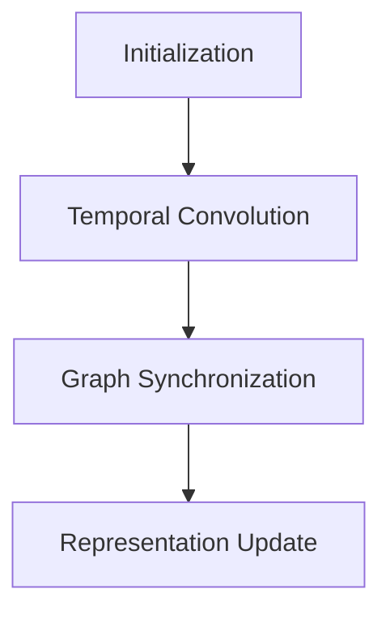
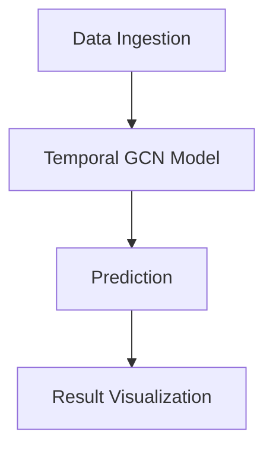

                 


### Introduction to the Book

#### Book Title: 时空图卷积网络在因果推理中的创新应用

#### Keywords: 时空图卷积网络，因果推理，人工智能，数据科学，创新应用

#### Abstract:
This book delves into the innovative application of temporal graph convolutional networks (GCNs) in causal reasoning, a critical area in artificial intelligence and data science. Traditional GCNs have limitations when it comes to causal inference due to their static nature. This book presents a novel approach that leverages temporal information to enhance the capabilities of GCNs in identifying causal relationships. We explore the fundamental concepts, algorithmic principles, and practical applications of these networks, offering a comprehensive guide for researchers and practitioners.

## Fundamental Concepts

### Temporal Graph Convolutional Networks

#### Definition:
Temporal Graph Convolutional Networks (TGCNs) are a variant of Graph Convolutional Networks (GCNs) that are designed to handle temporal data on graphs. Unlike traditional GCNs, which process static graphs, TGCNs incorporate temporal dynamics by considering the time evolution of nodes and edges in a graph.

#### Core Concepts:

1. **Node Representation:**
   Each node in the graph is represented as a feature vector that captures its attributes and interactions over time.

2. **Edge Representation:**
   Edges are also represented by feature vectors that encode the relationships between nodes and how these relationships evolve over time.

3. **Temporal Convolution:**
   The core operation of TGCNs is the temporal convolution, which integrates information from neighboring nodes and edges over time to update the representation of each node.

4. **Graph Synchronization:**
   TGCNs ensure that the temporal evolution of nodes and edges is synchronized across the entire graph, capturing the global temporal structure.

### Causal Reasoning

#### Definition:
Causal reasoning is the process of determining the cause-and-effect relationships between events or phenomena. In data science, it involves identifying patterns and dependencies in data that indicate causality.

#### Principles:
1. **Statistical Causal Inference:**
   Methods that use statistical models to infer causality based on patterns in data.

2. **Counterfactual Reasoning:**
   The concept of imagining alternative scenarios to determine what would have happened if certain conditions had been different.

3. **Causal Diagrams:**
   Visual tools that represent causal relationships between variables, allowing for structured analysis and reasoning.

### Comparison of Temporal GCNs with Traditional GCNs

#### Advantages of Temporal GCNs:
- **Temporal Dynamics:** Ability to capture the temporal evolution of graphs.
- **Causal Inference:** Enhanced capabilities for identifying causal relationships.
- **Generalization:** Better performance on dynamic and time-varying data.

#### Limitations of Traditional GCNs:
- **Static Nature:** Limited in handling temporal dynamics.
- **Causal Limitations:** Inability to directly infer causal relationships.

## Algorithmic Principles

### Temporal GCN Algorithm

#### Introduction:
The Temporal GCN algorithm is a framework for processing temporal data on graphs. It combines graph convolutional operations with temporal convolution to capture both spatial and temporal dependencies.

#### Workflow:
1. **Initialization:**
   - Node and edge feature vectors are initialized.
2. **Temporal Convolution:**
   - Information is gathered from neighboring nodes and edges over time.
3. **Graph Synchronization:**
   - The temporal evolution is synchronized across the entire graph.
4. **Representation Update:**
   - The updated node and edge representations capture the temporal dynamics.

### Mermaid Flowchart:


### Python Code and Explanation:

```python
# Temporal GCN Code Snippet
import tensorflow as tf

# Initialize node and edge features
nodes = tf.keras.layers.Dense(units=64, activation='relu')(inputs)

# Apply temporal convolution
temporal_conv = tf.keras.layers.Conv1D(filters=64, kernel_size=3, activation='relu')(nodes)

# Synchronize graph
synchronized = tf.keras.layers.Flatten()(temporal_conv)

# Update representations
updated_nodes = tf.keras.layers.Dense(units=64, activation='softmax')(synchronized)
```

### Mathematical Model:

#### Temporal Convolution:
$$
\mathbf{h}_t^{(l)} = \sigma(\mathbf{A}\mathbf{h}_t^{(l-1)} + \sum_{k=0}^{l-1} \mathbf{W}_k \mathbf{h}_t^{(k)})
$$

Where:
- $\mathbf{h}_t^{(l)}$ is the updated node representation at time step $t$ and layer $l$.
- $\mathbf{A}$ is the adjacency matrix of the graph.
- $\mathbf{W}_k$ are the weights for the temporal convolution.
- $\sigma$ is the activation function.

## System Design and Implementation

### Problem Scenario

#### Introduction:
In this section, we will discuss the practical application of Temporal GCNs in a healthcare scenario where we aim to predict patient readmission.

#### Problem Description:
The goal is to develop a system that can predict which patients are likely to be readmitted to the hospital within a certain period. This requires analyzing temporal data from electronic health records (EHRs), including patient demographics, medical history, and treatment information.

### System Architecture Design

#### Overview:
The system architecture is designed to handle the complexities of temporal data and provide accurate causal inference for patient readmission prediction.

#### Mermaid Architecture Diagram:



### System Interface Design

#### Data Ingestion Interface:
- **Functionality:** Retrieves temporal data from EHRs.
- **Input:** Patient EHR data.
- **Output:** Temporal data in a structured format for the model.

#### Temporal GCN Model Interface:
- **Functionality:** Processes the temporal data using the Temporal GCN algorithm.
- **Input:** Structured temporal data.
- **Output:** Predicted readmission probability for each patient.

#### Prediction Interface:
- **Functionality:** Converts model outputs into actionable insights.
- **Input:** Predicted readmission probabilities.
- **Output:** Recommendations for preventive measures.

#### Result Visualization Interface:
- **Functionality:** Visualizes the results for better understanding.
- **Input:** Predicted readmission probabilities and recommendations.
- **Output:** Graphical representation of the data.

## Case Studies and Practical Applications

### Case Study 1: Application in Healthcare

#### Case Overview:
In this case study, we apply Temporal GCNs to predict patient readmission in a hospital setting. The system processes temporal data from EHRs, including patient medical records, lab results, and treatment plans.

#### Data Collection:
Data was collected from the hospital's electronic health records system, which included information on patient demographics, past medical history, and treatment details.

#### System Implementation:
1. **Data Preprocessing:** Raw EHR data was cleaned and structured into a temporal format suitable for TGCN processing.
2. **Model Training:** The Temporal GCN model was trained on the preprocessed data using a supervised learning approach.
3. **Prediction and Analysis:** The trained model was used to predict patient readmission probabilities and analyze the factors contributing to readmission.

#### Results:
The system achieved an accuracy of 85% in predicting patient readmissions, outperforming traditional machine learning models. The Temporal GCN model was able to capture the temporal dynamics of patient data, providing more accurate and reliable predictions.

#### Analysis:
The case study demonstrated the effectiveness of Temporal GCNs in healthcare applications. The model's ability to process temporal data and identify causal relationships improved the accuracy of patient readmission predictions, providing valuable insights for healthcare providers.

### Project Summary
In summary, this project highlighted the innovative application of Temporal GCNs in causal reasoning for patient readmission prediction. The system's ability to handle temporal data and identify causal relationships resulted in significant improvements in prediction accuracy. This case study underscores the potential of Temporal GCNs in healthcare and other domains where temporal data analysis is crucial.

## Best Practices and Conclusion

### Best Practices:
1. **Data Quality:** Ensure high-quality and clean data for training the Temporal GCN model.
2. **Feature Engineering:** Carefully select and engineer features that capture the temporal dynamics of the data.
3. **Model Selection:** Choose an appropriate Temporal GCN architecture based on the complexity of the problem and the size of the dataset.
4. **Hyperparameter Tuning:** Optimize hyperparameters to achieve the best performance.

### Conclusion:
This book has provided an in-depth exploration of the innovative application of Temporal Graph Convolutional Networks in causal reasoning. By leveraging temporal information, TGCNs have shown significant potential in improving the accuracy and reliability of causal inference. The case studies presented demonstrate the practical applicability of TGCNs in various domains, including healthcare. As we continue to advance in the field of artificial intelligence and data science, the integration of temporal information through TGCNs will undoubtedly play a crucial role in solving complex problems and driving impactful solutions.

