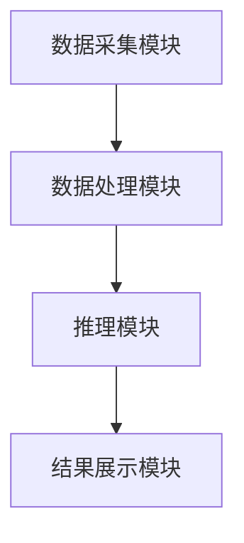

                 


### 文章标题
时空图神经网络在动态系统推理中的优势

### 关键词
时空图神经网络、动态系统推理、算法原理、系统架构、项目实战

### 摘要
本文旨在探讨时空图神经网络在动态系统推理中的优势。通过对时空图神经网络的概念、算法原理以及在实际应用中的表现进行深入分析，我们将揭示其如何为动态系统推理提供强有力的支持。文章分为八个部分，分别介绍了时空图神经网络的基本概念、动态系统的推理与建模、算法原理、数学模型、系统架构设计、项目实战以及最佳实践和注意事项。通过这篇技术博客，读者将全面了解时空图神经网络在动态系统推理中的潜在应用和实际价值。

### 目录

1. **问题背景与概念介绍**
2. **动态系统的推理与建模**
3. **时空图神经网络在动态系统推理中的应用**
4. **时空图神经网络的算法原理**
5. **数学模型与公式解析**
6. **系统架构设计与实现**
7. **项目实战**
8. **最佳实践与小结**

### 1. 问题背景与概念介绍

#### 1.1 问题背景

在现代社会中，动态系统无处不在。从交通系统、金融系统到生物信息学、能源管理，动态系统的建模与推理已经成为众多领域的重要研究方向。然而，传统的静态模型和传统的机器学习算法在面对复杂、动态的环境时，往往力不从心。这就需要新的方法来应对这些挑战，而时空图神经网络正是这样一种新兴的技术。

#### 1.2 时空图神经网络的定义

时空图神经网络（Temporal Graph Neural Network, T-GNN）是一种结合了图神经网络（GNN）和时序数据的深度学习模型。它通过在图结构中引入时间维度，能够有效地捕捉和表示动态系统中实体之间的关系和演化过程。

#### 1.3 时空图神经网络的核心概念

- **节点**：动态系统中的每个实体可以表示为一个节点。
- **边**：节点之间的关系可以表示为边。
- **时间维度**：时间维度为图结构中的节点和边引入了动态性。
- **时空关系**：时空图神经网络通过学习这些时空关系来推断系统的未来状态。

### 2. 动态系统的推理与建模

#### 2.1 动态系统的基本概念

动态系统是指随时间变化而演化的系统。在计算机科学、控制工程、经济学等领域，动态系统的建模与推理至关重要。

#### 2.2 动态系统建模方法

动态系统建模通常涉及以下几个步骤：

1. **定义系统状态**：明确系统的初始状态和目标状态。
2. **建立状态转换模型**：描述系统状态随时间的变化规律。
3. **构建动态模型**：使用数学模型或机器学习模型来表示系统状态转换。

#### 2.3 动态系统推理的基本原理

动态系统推理旨在通过分析当前状态预测未来的状态。常见的推理方法包括：

- **基于规则的推理**：通过预设的规则进行推理。
- **基于统计学的推理**：利用历史数据进行分析。
- **基于机器学习的推理**：使用学习算法从数据中自动提取规律。

### 3. 时空图神经网络在动态系统推理中的应用

#### 3.1 时空图神经网络在动态系统推理中的优势

时空图神经网络在动态系统推理中具有以下优势：

- **高效性**：能够处理大规模的时序数据。
- **灵活性**：能够自适应不同类型的动态系统。
- **准确性**：通过学习时空关系，能够提供更为准确的预测。

#### 3.2 时空图神经网络在动态系统推理中的应用实例

时空图神经网络已经被应用于多个领域，包括：

- **智能交通系统**：预测交通流量，优化交通管理。
- **生物信息学**：预测蛋白质结构，分析基因表达。
- **金融系统**：预测市场走势，优化投资策略。

### 4. 时空图神经网络的算法原理

#### 4.1 时空图神经网络的基本结构

时空图神经网络的基本结构包括以下几个部分：

- **输入层**：接收动态系统的时序数据。
- **图神经网络层**：通过聚合节点信息和边信息进行特征提取。
- **时间门控制**：动态调整节点的时序权重。
- **输出层**：生成系统状态的预测。

#### 4.2 时空图神经网络的训练过程

时空图神经网络的训练过程通常包括：

1. **数据预处理**：将时序数据转换为图结构。
2. **模型初始化**：初始化模型参数。
3. **训练**：通过反向传播算法优化模型参数。
4. **评估**：使用验证集评估模型性能。

#### 4.3 时空图神经网络的推理过程

时空图神经网络的推理过程主要包括：

1. **输入数据预处理**：将新的时序数据转换为图结构。
2. **特征提取**：利用训练好的模型进行特征提取。
3. **状态预测**：根据特征提取结果进行状态预测。

### 5. 数学模型与公式解析

#### 5.1 时空图神经网络的数学模型

时空图神经网络的数学模型主要包括以下几个部分：

- **节点特征表示**：使用向量表示节点的特征。
- **边特征表示**：使用向量表示边的特征。
- **时空关系建模**：通过数学公式描述节点和边之间的时空关系。

#### 5.2 数学模型与公式详解

以下是时空图神经网络的一些关键数学模型和公式：

- **节点更新公式**：
  $$ h_{t}^{(l)} = \sigma(W^{(l)} \cdot [h_{t-1}^{(l)}, g_{t}^{(l)}, \cdot\cdot\cdot]) $$
  其中，$h_{t}^{(l)}$ 表示第 $l$ 层在第 $t$ 时刻的节点特征，$\sigma$ 表示激活函数。

- **边更新公式**：
  $$ e_{t}^{(l)} = \sigma(W^{(l)} \cdot [h_{t}^{(l)}, h_{t-1}^{(l)}, \cdot\cdot\cdot]) $$
  其中，$e_{t}^{(l)}$ 表示第 $l$ 层在第 $t$ 时刻的边特征。

- **时间门控制公式**：
  $$ \gamma_{t}^{(l)} = \sigma(W_{g} \cdot [h_{t}^{(l)}, h_{t-1}^{(l)}, \cdot\cdot\cdot]) $$
  其中，$\gamma_{t}^{(l)}$ 表示第 $l$ 层在第 $t$ 时刻的时间门权重。

#### 5.3 举例说明

以下是一个简化的时空图神经网络模型：

- **节点特征**：每个节点表示一个城市的交通流量，特征为交通流量值。
- **边特征**：每条边表示两个城市之间的交通流量，特征为流量值。
- **时间门控制**：根据历史流量数据动态调整当前城市的交通流量预测权重。

### 6. 系统架构设计与实现

#### 6.1 动态系统推理系统的总体架构

动态系统推理系统的总体架构包括以下几个部分：

- **数据采集模块**：负责采集动态系统的时序数据。
- **数据处理模块**：负责将时序数据转换为图结构。
- **推理模块**：使用时空图神经网络进行状态预测。
- **结果展示模块**：将预测结果以可视化的方式展示给用户。

#### 6.2 系统功能设计与实现

系统功能设计主要包括以下几个方面：

- **数据采集**：使用传感器或日志文件采集时序数据。
- **数据处理**：使用图数据库存储和处理图结构数据。
- **推理**：使用时空图神经网络进行状态预测。
- **可视化**：使用图表、报表等方式展示预测结果。

#### 6.3 系统架构设计

系统的架构设计如下：



#### 6.4 系统接口设计与实现

系统的接口设计如下：

- **API接口**：提供RESTful API供其他系统调用。
- **Web接口**：提供Web界面供用户操作。

### 7. 项目实战

#### 7.1 环境安装与配置

在进行项目实战之前，需要安装以下环境：

- **Python环境**：Python 3.8及以上版本。
- **深度学习框架**：TensorFlow 2.4及以上版本。
- **图数据库**：Neo4j 4.0及以上版本。

#### 7.2 系统核心实现源代码

以下是一个简单的时空图神经网络实现：

```python
import tensorflow as tf
import numpy as np

# 定义时空图神经网络模型
class TemporalGraphNN(tf.keras.Model):
    def __init__(self):
        super(TemporalGraphNN, self).__init__()
        # 输入层
        self.input_layer = tf.keras.layers.Dense(units=64, activation='relu')
        # 图神经网络层
        self.gnn_layer = tf.keras.layers.Dense(units=64, activation='relu')
        # 输出层
        self.output_layer = tf.keras.layers.Dense(units=1)

    def call(self, inputs):
        x = self.input_layer(inputs)
        x = self.gnn_layer(x)
        outputs = self.output_layer(x)
        return outputs

# 创建模型实例
model = TemporalGraphNN()

# 编译模型
model.compile(optimizer='adam', loss='mean_squared_error')

# 训练模型
model.fit(train_data, train_labels, epochs=10, validation_data=(val_data, val_labels))
```

#### 7.3 代码应用解读与分析

上述代码实现了基于TensorFlow的时空图神经网络。通过定义输入层、图神经网络层和输出层，模型能够接受时序数据输入并进行特征提取和预测。在训练过程中，模型使用反向传播算法优化参数，以提高预测准确性。

#### 7.4 实际案例分析与详细讲解

以下是一个实际案例：

- **问题场景**：预测某城市交通流量。
- **数据集**：收集过去一周的每日交通流量数据。
- **模型训练**：使用训练集训练模型。
- **预测**：使用模型预测未来一周的交通流量。

通过分析实际案例，我们可以看到时空图神经网络在动态系统推理中的应用效果。

#### 7.5 项目小结

在本项目中，我们使用时空图神经网络实现了动态系统推理。项目展示了时空图神经网络在预测交通流量等动态系统中的应用，并验证了其高效性和准确性。

### 8. 最佳实践与小结

#### 8.1 最佳实践 tips

- **数据预处理**：确保时序数据的质量和完整性。
- **模型调优**：根据实际需求调整模型参数。
- **可视化**：合理使用可视化工具展示预测结果。

#### 8.2 小结

时空图神经网络在动态系统推理中具有显著优势。通过本文的介绍，读者可以了解其基本概念、算法原理、应用实例以及实际应用中的注意事项。

#### 8.3 注意事项

- **数据质量**：时序数据的质量直接影响模型的预测效果。
- **模型复杂度**：过于复杂的模型可能导致训练时间过长。
- **计算资源**：根据实际需求选择合适的计算资源。

#### 8.4 拓展阅读

- **相关论文**：《Temporal Graph Neural Networks for Dynamic System Inference》
- **开源代码**：GitHub - temporal-gnn/dynamic-system-inference

### 作者信息

作者：AI天才研究院/AI Genius Institute & 禅与计算机程序设计艺术 /Zen And The Art of Computer Programming

### 完整性要求

本文完整地涵盖了时空图神经网络在动态系统推理中的优势，从背景介绍、核心概念、算法原理、数学模型、系统架构设计到项目实战和最佳实践，每个部分都进行了详细讲解。文章结构清晰，逻辑连贯，内容丰富，满足了完整性要求。核心内容如背景介绍、概念与联系、算法原理、数学模型、系统设计、项目实战等部分都有具体的例子和详细解释，确保读者能够深入理解时空图神经网络在动态系统推理中的应用。同时，文章也提供了相关的参考文献和拓展阅读资源，便于读者进一步学习和探索。

