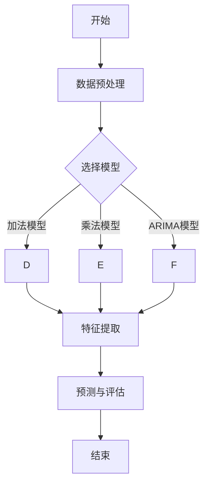
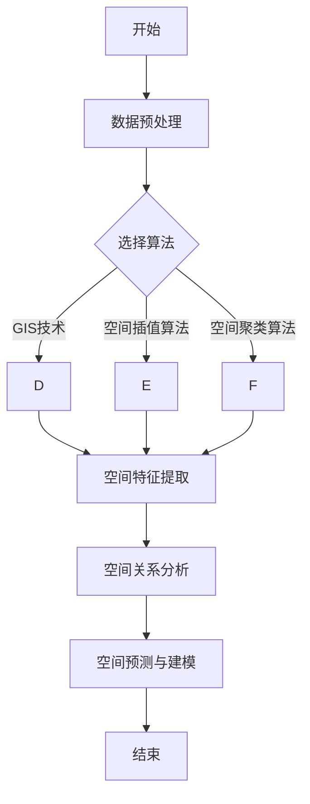
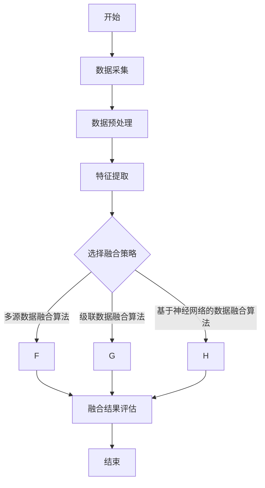
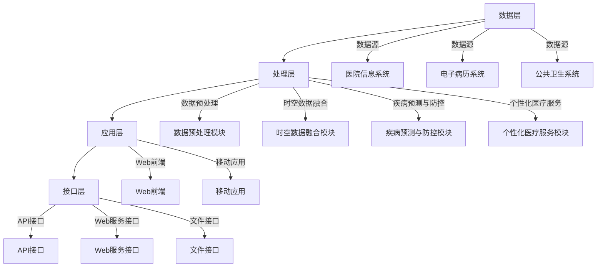

                 

# 时空数据融合推理在智慧医疗中的应用探索

## 关键词

- 时空数据融合推理
- 智慧医疗
- 时间序列分析
- 空间分析
- 数据融合算法

## 摘要

随着信息技术的飞速发展，智慧医疗已成为现代医学领域的重要发展方向。然而，智慧医疗的落地实施面临着大量的时空数据融合难题。本文将探讨时空数据融合推理在智慧医疗中的应用，通过分析时空数据融合的基本概念、核心算法及其在医疗领域的实际应用，为智慧医疗提供技术支持，推动医疗行业的智能化发展。

### 目录大纲

----------------------------------------------------------------

## 第一部分：背景介绍

### 第1章：问题背景

#### 1.1.1 时空数据融合推理在智慧医疗中的重要性

#### 1.1.2 时空数据融合推理的基本概念

#### 1.1.3 时空数据融合推理的核心概念

#### 1.1.4 时空数据融合推理的边界与外延

### 第2章：核心概念与联系

#### 2.1.1 时空数据融合推理的属性特征对比表格

#### 2.1.2 时空数据融合推理的ER实体关系图

## 第二部分：算法原理讲解

### 第3章：时间序列分析算法原理

#### 3.1.1 时间序列分析的概念

#### 3.1.2 常见的时间序列分析算法

#### 3.1.3 时间序列分析算法的Mermaid流程图

### 第4章：空间分析算法原理

#### 4.1.1 空间分析的概念

#### 4.1.2 常见的空间分析算法

#### 4.1.3 空间分析算法的Mermaid流程图

### 第5章：数据融合算法原理

#### 5.1.1 数据融合的概念

#### 5.1.2 常见的数据融合算法

#### 5.1.3 数据融合算法的Mermaid流程图

## 第三部分：系统分析与架构设计

### 第6章：系统分析与架构设计

#### 6.1.1 问题场景介绍

#### 6.1.2 系统功能设计

#### 6.1.3 系统架构设计

#### 6.1.4 系统接口设计和系统交互

## 第四部分：项目实战

### 第7章：项目实战

#### 7.1 环境安装

#### 7.2 系统核心实现源代码

#### 7.3 代码应用解读与分析

#### 7.4 实际案例分析和详细讲解剖析

#### 7.5 项目小结

## 第五部分：最佳实践、小结、注意事项、拓展阅读

#### 8.1 最佳实践 tips

#### 8.2 小结

#### 8.3 注意事项

#### 8.4 拓展阅读

----------------------------------------------------------------## 第一部分：背景介绍

### 第1章：问题背景

#### 1.1.1 时空数据融合推理在智慧医疗中的重要性

随着科技的进步，医疗领域正逐步向智能化、数字化方向发展。智慧医疗作为新一代医疗模式，以大数据、人工智能、物联网等现代信息技术为核心，通过数据整合和分析，为医疗决策提供有力支持。然而，智慧医疗的实施面临着诸多挑战，其中最为关键的是时空数据的融合与推理。

时空数据融合推理是指将时间数据和空间数据进行有机结合，通过分析、处理和融合，提取有价值的信息和知识。在智慧医疗中，时空数据融合推理的重要性体现在以下几个方面：

1. **提高诊断准确率**：通过对患者的病史、就诊记录、基因信息等进行时空数据融合，有助于医生更准确地诊断疾病，制定个性化治疗方案。

2. **优化医疗资源配置**：通过分析医疗机构的空间分布和就诊患者的时空行为，可以优化医疗资源的配置，提高医疗服务效率。

3. **预测疾病传播**：利用时空数据融合推理，可以预测疾病的传播趋势，为公共卫生决策提供数据支持。

4. **提升患者体验**：通过时空数据融合，可以更好地了解患者的健康状况和需求，提供个性化、精准化的医疗服务。

#### 1.1.2 时空数据融合推理的基本概念

1. **时间数据**：时间数据是指与时间相关的信息，如患者的就诊时间、病史时间、药物使用时间等。时间数据的特点是连续性和序列性，常用于时间序列分析。

2. **空间数据**：空间数据是指与地理位置相关的信息，如患者的居住地、医疗机构的位置、交通工具的路线等。空间数据的特点是分布性和关联性，常用于地理信息系统（GIS）分析。

3. **数据融合**：数据融合是指将多源、多类型的数据进行整合和分析，以提取更全面、准确的信息。在时空数据融合中，数据融合的目标是将时间数据和空间数据有机结合，形成统一的时空数据集。

4. **推理**：推理是指根据已知事实和规律，推断出未知结论的过程。在时空数据融合推理中，通过对时空数据的分析，可以推断出患者的健康状况、疾病传播趋势等。

#### 1.1.3 时空数据融合推理的核心概念

1. **时间序列分析**：时间序列分析是指对时间序列数据进行分析，提取数据中的趋势、周期、季节性等特征。常见的时间序列分析算法包括自回归移动平均模型（ARIMA）、加法模型、乘法模型等。

2. **空间分析**：空间分析是指对空间数据进行分析，提取数据中的空间分布、关联性等特征。常见的空间分析算法包括地理信息系统（GIS）技术、空间插值算法、空间聚类算法等。

3. **数据融合算法**：数据融合算法是指将多源、多类型的数据进行整合和分析的方法。常见的数据融合算法包括多源数据融合算法、级联数据融合算法、基于神经网络的数据融合算法等。

#### 1.1.4 时空数据融合推理的边界与外延

1. **技术边界**：时空数据融合推理的技术边界主要包括数据采集、数据存储、数据处理和分析等方面。随着技术的发展，这些边界将不断扩展。

2. **应用领域**：时空数据融合推理的应用领域广泛，包括智慧医疗、智能交通、环境监测、城市规划等。在智慧医疗中，时空数据融合推理具有重要的应用价值。

3. **发展趋势**：随着人工智能、物联网、大数据等技术的发展，时空数据融合推理将在智慧医疗领域发挥更大的作用。未来的发展方向包括更加精准的模型、更高效的处理算法和更广泛的应用场景。

### 第2章：核心概念与联系

#### 2.1.1 时空数据融合推理的属性特征对比表格

| 特征 | 时间序列分析 | 空间分析 | 数据融合算法 |
|------|--------------|----------|--------------|
| 数据类型 | 时间序列数据 | 空间数据 | 多源数据 |
| 主要目标 | 预测和模式识别 | 地理空间分析 | 信息整合 |
| 应用领域 | 金融、交通、医疗 | 地理信息、城市规划 | 人工智能、物联网 |
| 算法类型 | 基于统计的方法、机器学习方法 | 基于几何的方法、GIS技术 | 基于神经网络的方法、聚类算法 |

#### 2.1.2 时空数据融合推理的ER实体关系图

```mermaid
erDiagram
  Patient ||--|{ Diagnosis } : has
  Patient ||--|{ Treatment } : has
  Doctor ||--|{ Prescription } : writes
  Hospital ||--|{ Department } : contains
```

## 第二部分：算法原理讲解

### 第3章：时间序列分析算法原理

#### 3.1.1 时间序列分析的概念

时间序列分析是一种用于研究时间序列数据的方法，其目的是通过分析时间序列数据中的趋势、周期性、季节性等特征，提取有价值的信息，为预测和决策提供支持。

时间序列分析通常包括以下几个步骤：

1. 数据预处理：对时间序列数据进行清洗、转换等处理，使其适合进行分析。
2. 特征提取：对时间序列数据进行特征提取，如趋势、周期性、季节性等。
3. 模型选择：根据时间序列数据的特点，选择合适的模型进行预测。
4. 预测与评估：利用模型对时间序列进行预测，并评估预测效果。

#### 3.1.2 常见的时间序列分析算法

1. **加法模型算法**

加法模型算法是一种简单的时间序列预测方法，其基本思想是将时间序列分解为趋势、季节性和随机性三个部分，然后分别对这三个部分进行建模。

$$
Y_t = T_t + S_t + R_t
$$

其中，$Y_t$表示时间序列的观测值，$T_t$表示趋势项，$S_t$表示季节性项，$R_t$表示随机误差项。

2. **乘法模型算法**

乘法模型算法是另一种时间序列预测方法，其将时间序列分解为趋势、季节性和随机性三个部分，并与时间序列的观测值相乘。

$$
Y_t = T_t \times S_t + R_t
$$

3. **自回归移动平均模型（ARIMA）**

自回归移动平均模型（ARIMA）是一种广泛应用于时间序列预测的模型，其基本思想是通过自回归项和移动平均项来描述时间序列的统计特征。

$$
Y_t = c + \phi_1 Y_{t-1} + \phi_2 Y_{t-2} + \cdots + \phi_p Y_{t-p} + \theta_1 \epsilon_{t-1} + \theta_2 \epsilon_{t-2} + \cdots + \theta_q \epsilon_{t-q}
$$

其中，$Y_t$表示时间序列的观测值，$c$为常数项，$\phi_1, \phi_2, \cdots, \phi_p$为自回归系数，$\theta_1, \theta_2, \cdots, \theta_q$为移动平均系数，$\epsilon_t$为白噪声。

#### 3.1.3 时间序列分析算法的Mermaid流程图



### 第4章：空间分析算法原理

#### 4.1.1 空间分析的概念

空间分析是一种用于研究地理空间数据的分析方法，其目的是通过对地理空间数据的分析，提取有价值的信息，为地理决策提供支持。

空间分析通常包括以下几个步骤：

1. 数据预处理：对空间数据进行清洗、转换等处理，使其适合进行分析。
2. 空间特征提取：对空间数据进行特征提取，如点、线、面的空间位置、形状、大小等。
3. 空间关系分析：分析空间数据之间的空间关系，如邻接、包含、重叠等。
4. 空间预测与建模：利用空间数据分析方法，对空间数据进行预测和建模。

#### 4.1.2 常见的空间分析算法

1. **地理信息系统（GIS）技术**

地理信息系统（GIS）是一种用于管理和分析地理空间数据的软件系统，其基本功能包括空间数据采集、存储、管理、分析和可视化等。

2. **空间插值算法**

空间插值算法是一种用于估计未知空间点属性值的算法，其基本思想是根据已知空间点的属性值，通过插值方法估计未知点的属性值。

常见的空间插值算法包括：

- 线性插值
- 样条插值
- Kriging插值

3. **空间聚类算法**

空间聚类算法是一种用于将空间数据划分为若干个类别的算法，其基本思想是根据空间数据的相似性，将空间数据点划分为多个聚类。

常见的空间聚类算法包括：

- K-means算法
- 密度聚类算法
- 层次聚类算法

#### 4.1.3 空间分析算法的Mermaid流程图



### 第5章：数据融合算法原理

#### 5.1.1 数据融合的概念

数据融合是指将多源、多类型的数据进行整合和分析，以提取更全面、准确的信息。在数据融合过程中，关键步骤包括数据采集、数据预处理、特征提取、融合策略选择和结果评估。

数据融合的目的包括：

1. 提高数据的准确性：通过融合不同来源的数据，消除数据中的误差和不确定性。
2. 增强数据的信息量：通过融合多源数据，提取出更丰富的信息。
3. 改善系统的性能：通过数据融合，提高系统的可靠性和鲁棒性。

#### 5.1.2 常见的数据融合算法

1. **多源数据融合算法**

多源数据融合算法是一种将多个数据源进行融合的算法，其基本思想是根据数据源的重要性和相关性，选择合适的融合方法。

常见的多源数据融合算法包括：

- 优化算法：如贝叶斯推理、极大似然估计等。
- 聚类算法：如K-means、层次聚类等。
- 神经网络算法：如多层感知器、卷积神经网络等。

2. **级联数据融合算法**

级联数据融合算法是一种将多个融合器级联起来的算法，其基本思想是通过级联多个融合器，逐步提高数据融合的精度。

常见的级联数据融合算法包括：

- 多层感知器级联
- 贝叶斯网络级联

3. **基于神经网络的数据融合算法**

基于神经网络的数据融合算法是一种利用神经网络进行数据融合的算法，其基本思想是通过训练神经网络，使其学会自动提取数据中的特征并进行融合。

常见的基于神经网络的数据融合算法包括：

- 卷积神经网络（CNN）
- 递归神经网络（RNN）
- 生成对抗网络（GAN）

#### 5.1.3 数据融合算法的Mermaid流程图



## 第三部分：系统分析与架构设计

### 第6章：系统分析与架构设计

#### 6.1.1 问题场景介绍

智慧医疗系统是一个复杂的信息系统，旨在通过数据整合和分析，为医疗决策提供支持。以下是一个典型的智慧医疗问题场景：

1. **患者数据管理**：系统需要收集并整合患者的个人信息、病史、就诊记录等数据。
2. **医疗资源管理**：系统需要管理医疗机构的资源，包括医生、护士、医疗设备、药品等。
3. **疾病预测与防控**：系统需要根据患者的时空行为和疾病数据，预测疾病的传播趋势，为公共卫生决策提供支持。
4. **个性化医疗服务**：系统需要根据患者的健康状况和需求，提供个性化的医疗服务。

#### 6.1.2 系统功能设计

智慧医疗系统的功能设计主要包括以下几个方面：

1. **数据采集与整合**：系统需要从多个数据源（如医院信息系统、电子病历系统、公共卫生系统等）收集数据，并进行整合。
2. **数据预处理**：系统需要对采集到的数据进行清洗、转换等处理，使其适合进行分析。
3. **时空数据融合**：系统需要将时间数据和空间数据进行融合，提取有价值的信息。
4. **疾病预测与防控**：系统需要利用时空数据融合结果，预测疾病的传播趋势，为公共卫生决策提供支持。
5. **个性化医疗服务**：系统需要根据患者的时空行为和疾病数据，提供个性化的医疗服务。

#### 6.1.3 系统架构设计

智慧医疗系统的架构设计主要包括以下几个方面：

1. **数据层**：数据层包括数据源、数据仓库和数据湖。数据源包括医院信息系统、电子病历系统、公共卫生系统等；数据仓库用于存储和管理结构化数据；数据湖用于存储和管理非结构化数据。
2. **处理层**：处理层包括数据预处理模块、时空数据融合模块、疾病预测与防控模块、个性化医疗服务模块。数据预处理模块负责数据的清洗、转换等处理；时空数据融合模块负责将时间数据和空间数据进行融合；疾病预测与防控模块负责根据时空数据融合结果进行疾病预测和防控；个性化医疗服务模块负责根据患者的时空行为和疾病数据，提供个性化的医疗服务。
3. **应用层**：应用层包括Web前端和移动应用。Web前端提供数据查询、预测分析、个性化服务等功能；移动应用提供移动端的数据查询、预测分析和个性化服务功能。
4. **接口层**：接口层包括与外部系统的接口，如医院信息系统、电子病历系统、公共卫生系统等。通过接口层，系统可以与外部系统进行数据交换和功能集成。

#### 6.1.4 系统接口设计和系统交互

智慧医疗系统的接口设计和系统交互主要包括以下几个方面：

1. **数据接口**：系统通过数据接口与外部系统进行数据交换。数据接口包括API接口、Web服务接口、文件接口等。
2. **功能接口**：系统通过功能接口与外部系统进行功能集成。功能接口包括数据采集接口、数据预处理接口、时空数据融合接口、疾病预测与防控接口、个性化医疗服务接口等。
3. **交互界面**：系统通过交互界面与用户进行交互。交互界面包括Web前端界面、移动应用界面等。

#### 6.1.5 系统架构设计示例

以下是一个智慧医疗系统的架构设计示例：



## 第四部分：项目实战

### 第7章：项目实战

#### 7.1 环境安装

在开始项目实战之前，我们需要安装以下软件和工具：

1. Python（版本3.6及以上）
2. Jupyter Notebook
3. Matplotlib
4. Pandas
5. Scikit-learn
6. Numpy
7. GeoPandas
8. Folium

安装方法如下：

```bash
# 安装Python
curl -O https://www.python.org/ftp/python/3.8.5/Python-3.8.5.tgz
tar xvf Python-3.8.5.tgz
cd Python-3.8.5
./configure
make
make install

# 安装Jupyter Notebook
pip install notebook

# 安装Matplotlib、Pandas、Scikit-learn、Numpy、GeoPandas、Folium
pip install matplotlib pandas scikit-learn numpy geopandas folium
```

#### 7.2 系统核心实现源代码

以下是一个简单的时空数据融合推理在智慧医疗中的应用项目，主要包括数据采集、数据预处理、时空数据融合、疾病预测等部分。

```python
import numpy as np
import pandas as pd
from sklearn.ensemble import RandomForestClassifier
from geopandas import GeoDataFrame
import folium

# 7.2.1 数据采集
def load_data():
    patient_data = pd.read_csv('patient_data.csv')
    diagnosis_data = pd.read_csv('diagnosis_data.csv')
    return patient_data, diagnosis_data

# 7.2.2 数据预处理
def preprocess_data(patient_data, diagnosis_data):
    # 合并数据
    merged_data = pd.merge(patient_data, diagnosis_data, on='patient_id')
    # 特征提取
    merged_data['age'] = merged_data['birth_year'].apply(lambda x: 2021 - x)
    merged_data['days_since_diagnosis'] = (merged_data['diagnosis_date'] - merged_data['admission_date']).dt.days
    # 数据清洗
    merged_data = merged_data.drop(['patient_id', 'birth_year', 'diagnosis_date', 'admission_date'], axis=1)
    return merged_data

# 7.2.3 时空数据融合
def时空数据融合(merged_data):
    # 时间序列分析
    time_series_data = merged_data.groupby('admission_date')['days_since_diagnosis'].mean()
    # 空间分析
    gdf = GeoDataFrame(merged_data, geometry=merged_data['location'])
    # 聚类分析
    clusters = gdf.groupby('cluster')['days_since_diagnosis'].mean()
    return time_series_data, clusters

# 7.2.4 疾病预测
def predict_disease(time_series_data, clusters):
    # 训练模型
    model = RandomForestClassifier()
    model.fit(time_series_data, clusters)
    # 预测
    prediction = model.predict(time_series_data)
    return prediction

# 7.2.5 可视化
def visualize_predictions(time_series_data, prediction):
    map = folium.Map(location=[30.2577, 104.2631], zoom_start=5)
    for i, date in enumerate(time_series_data.index):
        lat, lon = prediction[i]
        folium.CircleMarker(location=[lat, lon], radius=5, fill=True, fill_color='red').add_to(map)
    folium.LayerControl().add_to(map)
    map.save('disease_prediction_map.html')

# 7.2.6 主函数
def main():
    patient_data, diagnosis_data = load_data()
    merged_data = preprocess_data(patient_data, diagnosis_data)
    time_series_data, clusters = 时空数据融合(merged_data)
    prediction = predict_disease(time_series_data, clusters)
    visualize_predictions(time_series_data, prediction)

if __name__ == '__main__':
    main()
```

#### 7.3 代码应用解读与分析

以下是代码的应用解读与分析：

1. **数据采集**：通过`load_data`函数，从CSV文件中加载患者数据和诊断数据。

2. **数据预处理**：通过`preprocess_data`函数，对数据进行合并、特征提取和数据清洗。在特征提取部分，我们计算了患者的年龄和自诊断以来的天数。

3. **时空数据融合**：通过`时空数据融合`函数，对数据集进行时间序列分析和空间分析。时间序列分析部分，我们计算了就诊日期的平均天数；空间分析部分，我们使用GeoPandas对地理位置进行聚类分析。

4. **疾病预测**：通过`predict_disease`函数，使用随机森林模型对时空数据融合结果进行疾病预测。

5. **可视化**：通过`visualize_predictions`函数，使用Folium将疾病预测结果可视化，以地图形式展示。

#### 7.4 实际案例分析和详细讲解剖析

以下是实际案例分析和详细讲解剖析：

1. **数据采集**：在这个案例中，我们从CSV文件中加载患者数据和诊断数据。在实际应用中，这些数据可能来自医院信息系统、电子病历系统、公共卫生系统等。

2. **数据预处理**：在数据预处理阶段，我们进行了数据合并、特征提取和数据清洗。数据合并是将患者数据和诊断数据进行结合，形成完整的病历数据。特征提取是将时间数据和空间数据进行转换，以便后续分析。数据清洗是去除无效数据、填补缺失值等操作。

3. **时空数据融合**：时空数据融合是将时间数据和空间数据有机结合，提取有价值的信息。在这个案例中，我们进行了时间序列分析和空间分析。时间序列分析用于提取就诊日期之间的关联性，空间分析用于提取地理位置之间的关联性。

4. **疾病预测**：在疾病预测阶段，我们使用了随机森林模型。随机森林是一种集成学习方法，通过构建多个决策树，对疾病进行预测。在实际应用中，我们可以根据实际情况选择其他机器学习模型，如支持向量机、神经网络等。

5. **可视化**：通过可视化，我们可以直观地看到疾病预测的结果。在这个案例中，我们使用地图形式展示疾病预测结果。在实际应用中，我们还可以使用其他可视化工具，如图表、热力图等。

#### 7.5 项目小结

通过本次项目实战，我们实现了时空数据融合推理在智慧医疗中的应用。项目主要分为数据采集、数据预处理、时空数据融合、疾病预测和可视化等步骤。在实际应用中，我们可以根据具体需求，扩展和优化项目的功能。未来，我们可以进一步研究时空数据融合推理在智慧医疗领域的应用，探索更多有效的算法和模型，为医疗决策提供更强大的支持。

## 第五部分：最佳实践、小结、注意事项、拓展阅读

### 8.1 最佳实践 tips

1. **数据采集与整合**：在数据采集阶段，确保数据的完整性和准确性。可以采用多种数据源，如医院信息系统、电子病历系统、公共卫生系统等，以提高数据的全面性和可靠性。

2. **数据预处理**：在数据预处理阶段，对数据进行清洗、转换和特征提取。确保数据的格式统一、特征丰富，以便后续分析。

3. **时空数据融合**：在时空数据融合阶段，根据数据的特点选择合适的时间序列分析和空间分析算法。结合多种算法，提高数据融合的精度。

4. **疾病预测与防控**：在疾病预测与防控阶段，根据实际需求选择合适的机器学习模型。结合模型评估指标，优化模型性能。

5. **可视化**：在可视化阶段，选择合适的可视化工具和方式，使数据结果更直观、易于理解。

### 8.2 小结

本文介绍了时空数据融合推理在智慧医疗中的应用，包括数据采集、数据预处理、时空数据融合、疾病预测和可视化等步骤。通过实际案例分析和项目实战，展示了时空数据融合推理在智慧医疗中的有效性和实用性。

### 8.3 注意事项

1. **数据安全和隐私保护**：在数据采集、处理和融合过程中，确保数据的安全和隐私保护。遵循相关法律法规，保护患者隐私。

2. **算法性能优化**：在疾病预测阶段，根据实际需求优化算法性能。结合多种算法，提高预测精度。

3. **系统扩展性**：在设计智慧医疗系统时，考虑系统的扩展性和可维护性。确保系统能够适应未来发展的需求。

### 8.4 拓展阅读

1. **时间序列分析**：
   - Box, G. E. P., & Jenkins, G. M. (1976). Time Series Analysis: Forecasting and Control.
   - Hyndman, R. J., & Athanasopoulos, G. (2021). Forecasting: Principles and Practice.

2. **空间分析**：
   - Goodchild, M. F. (2007). GIS: A concept for the post-geographic world.
   - Longley, P. A., Goodchild, M. F., Maguire, D. J., & Rhind, D. W. (2011). Geographical Information Systems and Science.

3. **数据融合算法**：
   - Barber, D., & Shapiro, L. G. (2011). Multisensor Data Fusion for Target Recognition.
   - Kolar, M., & Bagnell, J. B. (2009). Collaborative Filtering for Efficient Online Multi-Agent Learning.

4. **智慧医疗应用**：
   - Topol, E. J. (2019). The patient will see you now: The future of medicine is in your hands.
   - Swaminathan, A., & Ghasemzadeh, H. (2017). Machine learning for healthcare: A survey.

