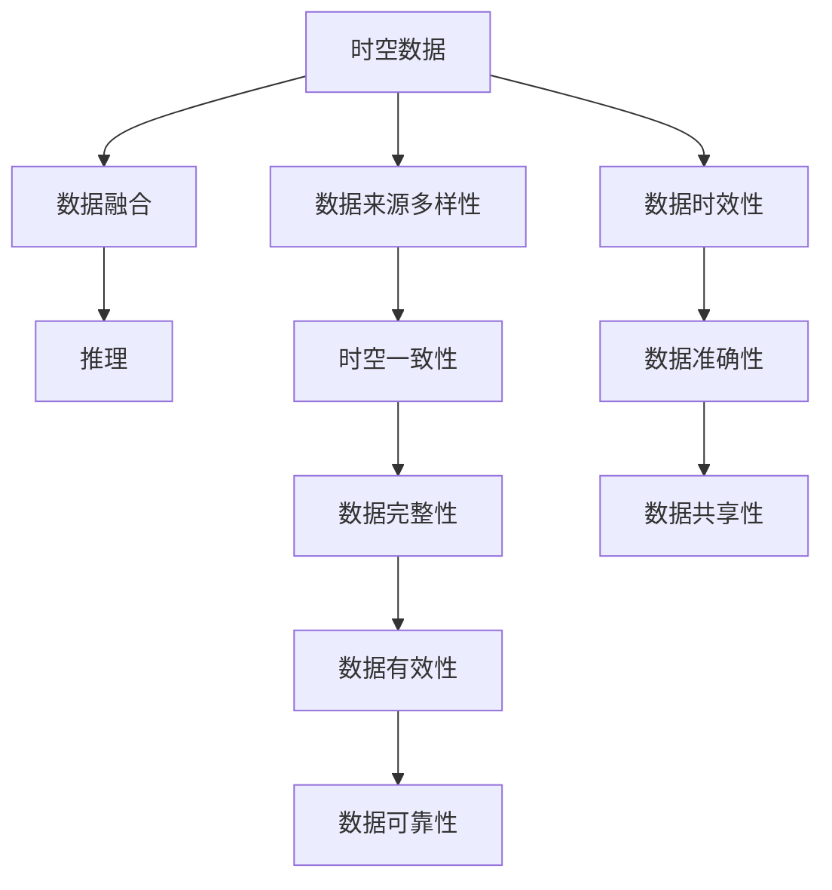
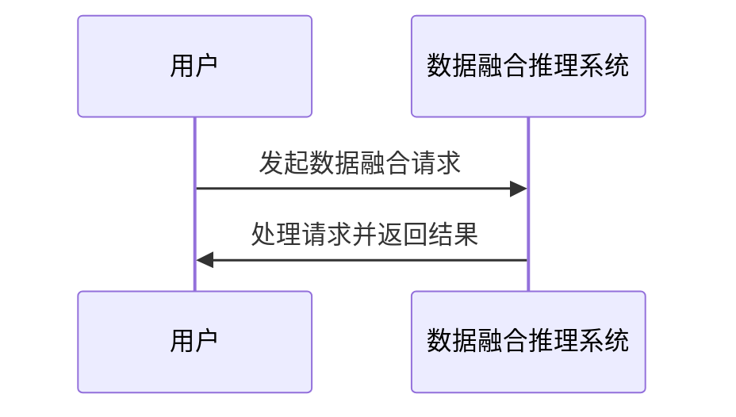

                 

# 时空数据融合推理在智慧城市中的应用探索

## 关键词

- 时空数据融合
- 智慧城市
- 数据融合算法
- 交通管理
- 环境监测

## 摘要

随着信息技术和人工智能的快速发展，智慧城市建设已成为全球城市发展的趋势。在智慧城市建设中，时空数据融合推理技术作为一种关键性技术，被广泛应用于交通管理、公共安全、环境监测等多个领域。本文将探讨时空数据融合推理在智慧城市中的应用，通过分析其基本原理和应用实例，提出系统架构设计和未来发展趋势。

## 目录大纲

----------------------------------------------------------------

# 时空数据融合推理在智慧城市中的应用探索

## 第一部分: 时空数据融合推理概述

### 第1章: 问题背景与核心概念

#### 1.1.1 问题背景

- 智慧城市的发展需求
- 时空数据融合的重要性

#### 1.1.2 核心概念

- 时空数据
- 数据融合
- 推理

#### 1.1.3 概念关系图

### 第2章: 时空数据融合的基本原理

#### 2.1 数据融合技术分类

- 低层次数据融合
- 中高层次数据融合
- 混合层次数据融合

#### 2.2 数据融合方法

- 聚类方法
- 粒子滤波方法
- 贝叶斯推理方法

#### 2.3 数据融合算法

- 聚类算法
- 卡方检验
- 最大似然估计

#### 2.4 数据融合性能评估指标

- 准确率
- 精确率
- 召回率

## 第二部分: 智慧城市中的时空数据融合应用

### 第3章: 时空数据融合在交通管理中的应用

#### 3.1 时空数据融合在交通管理中的应用

- 交通流量预测
- 路网拥堵监测

### 第4章: 数据融合算法在智慧城市中的应用实例

#### 4.1 交通流量预测应用实例

- 数据采集与预处理
- 算法实现与性能评估
- 应用效果分析

#### 4.2 跨区域犯罪追踪应用实例

- 数据融合模型构建
- 算法实现与优化
- 实际案例剖析

#### 4.3 空气质量监测应用实例

- 数据采集与处理
- 数据融合算法应用
- 环境监测效果评估

## 第三部分: 时空数据融合推理系统架构设计与实现

### 第5章: 时空数据融合推理系统架构设计与实现

#### 5.1 系统架构设计

- 硬件架构
- 软件架构

#### 5.2 系统功能模块

- 数据采集模块
- 数据预处理模块
- 数据融合模块
- 推理模块

#### 5.3 系统接口设计与实现

- 数据接口
- 控制接口

#### 5.4 系统交互序列图

## 第四部分: 时空数据融合推理在智慧城市中的未来发展趋势

### 第6章: 时空数据融合推理在智慧城市中的未来发展趋势

#### 6.1 技术发展展望

- 大数据处理技术的发展
- 人工智能技术的进步

#### 6.2 应用领域拓展

- 新兴行业应用
- 跨学科融合应用

#### 6.3 挑战与机遇

- 数据隐私保护
- 算法安全性

## 第五部分: 总结与展望

### 第7章: 总结与展望

#### 7.1 主要内容回顾

- 时空数据融合的基本原理
- 应用实例
- 系统架构设计与实现

#### 7.2 本书贡献

- 对时空数据融合推理在智慧城市中的应用提供了全面、系统的理论框架和实践指导

#### 7.3 展望未来

- 时空数据融合推理在智慧城市中的广泛应用前景
- 进一步研究的方向与建议

----------------------------------------------------------------

## 第一部分: 时空数据融合推理概述

### 第1章: 问题背景与核心概念

#### 1.1.1 问题背景

智慧城市是指利用信息通信技术（ICT），通过全面透彻的感知、宽带泛在的互联和智能融合的应用，实现城市可持续发展的一种新的城市发展模式。智慧城市的发展需求日益增长，如交通管理、公共安全、环境监测等，这些需求迫切需要高效的数据融合处理技术。

时空数据融合是指将来自不同来源、不同格式、不同尺度和不同时态的时空数据进行整合和融合，使其能够在一个统一的时空框架下进行进一步分析。时空数据融合在智慧城市中的应用具有重要意义，主要体现在以下几个方面：

1. **提高数据利用率**：通过对时空数据的融合，可以消除数据孤岛，提高数据利用率，为智慧城市建设提供更全面和准确的数据支持。
2. **提升决策能力**：通过时空数据融合，可以实现实时数据的融合和分析，为城市规划和管理提供实时决策支持，提高决策的准确性和效率。
3. **优化资源配置**：时空数据融合可以提供更精准的空间和时间信息，有助于优化城市资源的配置，提高城市管理效率。

#### 1.1.2 核心概念

**时空数据**：时空数据是同时包含时间和空间属性的数据，如交通流量数据、环境监测数据、社会安全数据等。时空数据通常以时间序列的形式记录，同时具有空间分布的特征。

**数据融合**：数据融合是指将多个数据源的数据通过一定的方法进行整合和处理，使其能够在同一框架下进行进一步的分析和应用。数据融合的目标是提高数据的质量、准确性和一致性。

**推理**：推理是指从已知信息中推断出新信息的过程。在时空数据融合中，推理可以用于预测未来的交通状况、评估环境质量、追踪犯罪活动等。

#### 1.1.3 概念关系图

在智慧城市建设中，时空数据融合推理技术起着关键作用。通过时空数据融合，可以实现对复杂城市环境的实时监测和分析，为智慧城市的可持续发展提供技术支撑。本章将在此基础上，进一步探讨时空数据融合的基本原理和应用实例，为后续章节的深入分析奠定基础。

### 第2章: 时空数据融合的基本原理

#### 2.1 数据融合技术分类

数据融合技术的分类可以从不同的角度进行，常见的分类方法包括数据层次、处理方法和应用场景等。

- **按数据层次分类**：
  - **低层次数据融合**：对原始数据进行直接处理，如数据去噪、特征提取等。
  - **中高层次数据融合**：对处理后的数据进行更高层次的分析和综合，如模式识别、决策支持等。
  - **混合层次数据融合**：结合低层次和中高层次数据融合的特点，对原始数据和已处理数据同时进行融合。

- **按处理方法分类**：
  - **基于统计的方法**：使用统计学原理和方法对数据进行融合，如均值融合、中值融合等。
  - **基于人工智能的方法**：利用人工智能技术，如神经网络、支持向量机等，对数据进行融合。
  - **基于信息论的方法**：基于信息熵、互信息等理论，对数据进行融合。

- **按应用场景分类**：
  - **静态数据融合**：主要用于对静态数据的处理，如环境监测、设施管理等。
  - **动态数据融合**：主要用于对动态数据的处理，如交通管理、应急响应等。

#### 2.2 数据融合方法

数据融合方法的选择取决于数据的特点和应用需求。以下是几种常见的数据融合方法：

- **聚类方法**：通过聚类算法将不同数据源的数据按照相似性进行分组，然后对每组数据进行分析和处理。

- **粒子滤波方法**：利用粒子滤波算法，通过对粒子进行采样和权重计算，实现对数据的融合。

- **贝叶斯推理方法**：基于贝叶斯定理，通过对先验概率和条件概率的计算，实现对数据的融合。

#### 2.3 数据融合算法

数据融合算法是实现数据融合的核心。以下是几种常见的数据融合算法：

- **聚类算法**：如K-means算法、层次聚类算法等，通过对数据集进行聚类，实现对数据的初步融合。

- **卡方检验**：用于评估两个分类变量之间的相关性，通过计算卡方统计量，判断两个变量是否相互独立。

- **最大似然估计**：通过最大化似然函数，估计数据源的概率分布，从而实现数据的融合。

#### 2.4 数据融合性能评估指标

数据融合的性能评估是确保数据融合效果的关键。以下是几种常见的数据融合性能评估指标：

- **准确率**：用于评估分类算法的性能，准确率越高，算法的准确性越高。

- **精确率**：用于评估分类算法的精确度，精确率越高，算法的精确度越高。

- **召回率**：用于评估分类算法的召回能力，召回率越高，算法的召回能力越强。

通过上述基本原理的介绍，我们可以看到，时空数据融合技术是一项复杂且关键的技术。在智慧城市建设中，通过有效的数据融合，可以实现对城市运行的实时监测和预测，为城市的管理和决策提供有力的支持。接下来，我们将进一步探讨时空数据融合在智慧城市中的应用实例。

### 第3章: 时空数据融合在智慧城市中的时空数据融合应用

#### 3.1 时空数据融合在交通管理中的应用

交通管理是智慧城市中至关重要的一个领域，通过时空数据融合，可以实现对交通状况的实时监测和预测，从而优化交通管理策略，提高交通运行效率。

**交通流量预测**：交通流量预测是交通管理中的关键环节，通过对历史交通流量数据的分析，结合实时交通数据，可以预测未来一段时间内的交通流量变化。时空数据融合在交通流量预测中的应用主要包括以下步骤：

1. **数据采集与预处理**：采集历史交通流量数据和实时交通数据，包括车辆速度、流量、密度等指标。对数据进行清洗和预处理，去除噪声和异常值，确保数据的质量。

2. **数据融合**：将历史交通流量数据和实时交通数据融合，通过聚类、粒子滤波等方法，对数据集进行融合，提取出有用的信息。

3. **模型训练与预测**：使用融合后的数据，建立交通流量预测模型，如ARIMA模型、神经网络模型等，进行模型训练和预测。

4. **结果评估与优化**：评估预测模型的准确性，对模型进行优化和调整，以提高预测的准确性。

**路网拥堵监测**：路网拥堵监测是交通管理中的另一个重要任务，通过实时监测道路的拥堵情况，可以及时调整交通信号灯控制策略，减少交通拥堵。时空数据融合在路网拥堵监测中的应用主要包括以下步骤：

1. **数据采集与预处理**：采集实时交通数据，包括车辆位置、速度、密度等指标。对数据进行清洗和预处理，确保数据的质量。

2. **数据融合**：将不同来源的交通数据融合，通过聚类、贝叶斯推理等方法，提取出有用的信息，判断道路的拥堵情况。

3. **拥堵评估与预警**：根据融合后的数据，评估道路的拥堵程度，对即将出现的拥堵情况进行预警，为交通管理部门提供决策支持。

#### 3.2 时空数据融合在公共安全中的应用

公共安全是智慧城市建设的核心目标之一，通过时空数据融合，可以实现对公共安全的实时监测和预警，提高城市的安全管理水平。

**灾害监测与预警**：灾害监测与预警是公共安全中的重要任务，通过实时监测气象、地质等数据，可以提前预警自然灾害的发生。时空数据融合在灾害监测与预警中的应用主要包括以下步骤：

1. **数据采集与预处理**：采集气象、地质等数据，包括温度、湿度、地震波等指标。对数据进行清洗和预处理，确保数据的质量。

2. **数据融合**：将不同来源的灾害数据进行融合，通过聚类、贝叶斯推理等方法，提取出有用的信息，判断灾害发生的可能性。

3. **预警与响应**：根据融合后的数据，预测灾害发生的概率，对即将发生的灾害进行预警，并制定相应的应急响应措施。

**跨区域犯罪追踪**：跨区域犯罪追踪是公共安全中的一个难题，通过时空数据融合，可以实现对犯罪活动的实时追踪和预警。时空数据融合在跨区域犯罪追踪中的应用主要包括以下步骤：

1. **数据采集与预处理**：采集犯罪活动数据，包括犯罪地点、时间、手段等指标。对数据进行清洗和预处理，确保数据的质量。

2. **数据融合**：将不同区域的犯罪数据进行融合，通过聚类、粒子滤波等方法，提取出有用的信息，追踪犯罪活动的规律。

3. **犯罪预警与防范**：根据融合后的数据，预测犯罪活动的可能性，对潜在的犯罪活动进行预警，并制定相应的防范措施。

#### 3.3 时空数据融合在环境监测中的应用

环境监测是智慧城市建设中的一项重要任务，通过时空数据融合，可以实现对环境质量的实时监测和评估，为环境保护和治理提供科学依据。

**空气质量监测**：空气质量监测是环境监测中的重要内容，通过实时监测空气中的污染物浓度，可以评估空气质量状况。时空数据融合在空气质量监测中的应用主要包括以下步骤：

1. **数据采集与预处理**：采集空气质量监测数据，包括PM2.5、PM10、CO、SO2等指标。对数据进行清洗和预处理，确保数据的质量。

2. **数据融合**：将不同监测点的空气质量数据进行融合，通过聚类、贝叶斯推理等方法，提取出有用的信息，评估空气质量状况。

3. **污染预警与治理**：根据融合后的数据，预测空气污染的发生概率，对即将发生的污染进行预警，并制定相应的治理措施。

**水质监测**：水质监测是环境监测中的另一个重要内容，通过实时监测水体中的污染物浓度，可以评估水质状况。时空数据融合在水质监测中的应用主要包括以下步骤：

1. **数据采集与预处理**：采集水质监测数据，包括氨氮、总磷、溶解氧等指标。对数据进行清洗和预处理，确保数据的质量。

2. **数据融合**：将不同监测点的

