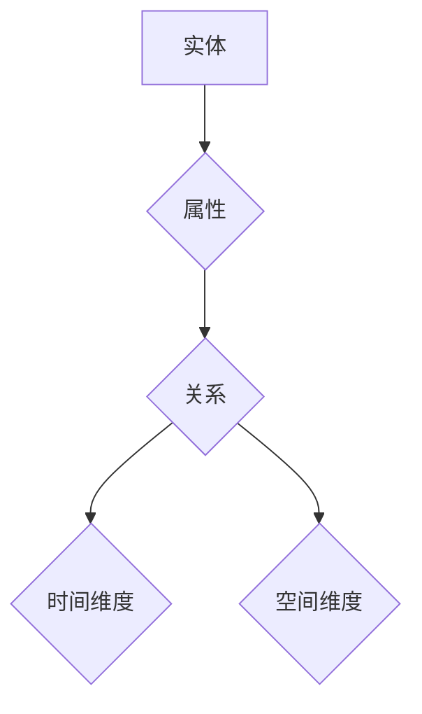
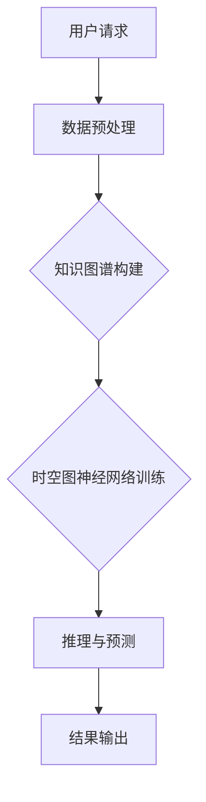
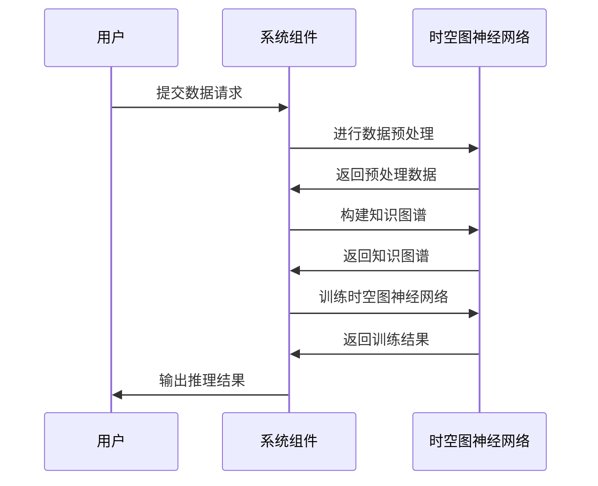

                 

# 时空知识图谱推理中图神经网络的前沿技术

## 关键词

- 时空知识图谱
- 图神经网络
- 推理
- 前沿技术
- 应用场景

## 摘要

本文深入探讨了时空知识图谱推理中的图神经网络前沿技术。首先介绍了时空知识图谱的背景、基本概念、重要性和应用场景。然后，详细阐述了图神经网络的基础知识、发展历史、分类和核心原理。接着，分析了时空知识图谱中图神经网络的应用，以及其在时空知识图谱推理中的优势与挑战。随后，介绍了时空图神经网络的研究热点、先进算法和性能评估与优化方法。最后，通过实际案例展示了时空知识图谱推理的应用，并对未来展望与趋势进行了分析。本文旨在为读者提供关于时空知识图谱和图神经网络在推理领域的全面理解和应用指导。

## 目录大纲

### 第一部分：时空知识图谱概述

### 第二部分：图神经网络基础

### 第三部分：时空知识图谱中的图神经网络应用

### 第四部分：前沿时空图神经网络技术

### 第五部分：时空知识图谱推理实践

### 第六部分：未来展望与趋势

### 第七部分：总结与展望

## 第一部分：时空知识图谱概述

### 第1章：时空知识图谱的背景与基本概念

#### 1.1 时空知识图谱的定义

时空知识图谱是知识图谱与时空信息相结合的产物，它不仅包含了实体、属性和关系等知识图谱的基本要素，还引入了时间维度和空间维度，使得知识图谱能够更准确地描述和推理时空信息。时空知识图谱的定义可以概括为：一种将实体、属性、关系以及时间、空间等信息有机结合在一起的知识表示形式。

#### 1.2 时空知识图谱的重要性

时空知识图谱的重要性体现在多个方面。首先，它为大数据分析和智能决策提供了强有力的支持，使得我们在处理复杂时空信息时能够更加高效地获取和分析信息。其次，时空知识图谱在多个领域有着广泛的应用，如智能交通、城市规划、气象预报、社交网络分析等。最后，时空知识图谱的研究有助于我们深入理解时空信息之间的关系，推动人工智能技术的发展。

#### 1.3 时空知识图谱的发展历程

时空知识图谱的发展历程可以分为几个阶段。最初，知识图谱主要关注静态信息，如实体和关系。随着时间维度和空间维度的引入，时空知识图谱开始逐步发展。近年来，随着图神经网络等深度学习技术的兴起，时空知识图谱的研究和应用也得到了进一步推动。

#### 1.4 时空知识图谱的应用场景

时空知识图谱的应用场景非常广泛，主要包括以下几个方面：

1. **智能交通**：利用时空知识图谱，可以实时分析交通流量、交通事故等信息，为交通管理和决策提供支持。
2. **城市规划**：通过时空知识图谱，可以分析城市空间布局、人口流动等信息，为城市规划提供科学依据。
3. **气象预报**：时空知识图谱可以帮助气象预报部门更好地分析气象信息，提高预报的准确性。
4. **社交网络分析**：通过时空知识图谱，可以分析社交网络中的用户关系、活动轨迹等信息，为社交网络分析提供支持。
5. **安全监控**：利用时空知识图谱，可以实时监控安全事件的发生、发展，为安全决策提供支持。

### 第2章：图神经网络基础

#### 2.1 图神经网络的基本概念

图神经网络（Graph Neural Network, GNN）是一种在图结构数据上执行的深度学习模型。GNN的核心思想是利用图结构数据中的邻域信息，对图中的节点进行特征更新和预测。GNN的定义可以概括为：一种在图结构数据上执行的神经网络模型，通过对节点和边的特征进行聚合和更新，实现节点分类、预测和关系推理等任务。

#### 2.2 图神经网络的发展历史

图神经网络的研究可以追溯到2000年代初期，当时的GNN主要关注基于矩阵分解的方法。随着深度学习技术的发展，GNN也逐渐引入了卷积操作、循环神经网络等深度学习技术，使得GNN在性能和灵活性上得到了显著提升。

#### 2.3 图神经网络的分类

根据GNN的操作方式和功能，可以将GNN分为以下几类：

1. **基于矩阵分解的GNN**：这类GNN主要利用矩阵分解方法，对图中的节点和边进行特征提取和聚合。
2. **基于卷积操作的GNN**：这类GNN利用卷积操作，对图中的邻域信息进行特征提取和聚合。
3. **基于循环神经网络的GNN**：这类GNN利用循环神经网络，对图中的节点序列进行特征提取和聚合。
4. **基于图注意力机制的GNN**：这类GNN利用图注意力机制，对图中的节点和边进行特征权重调整和聚合。

#### 2.4 图神经网络的核心原理

GNN的核心原理可以概括为以下几个步骤：

1. **节点特征更新**：GNN通过对节点的邻域信息进行聚合，更新节点的特征表示。
2. **边特征更新**：GNN通过对边的邻域信息进行聚合，更新边的特征表示。
3. **全局信息聚合**：GNN通过全局信息聚合，将局部信息整合成全局信息。
4. **输出层计算**：GNN通过输出层计算，对节点或边的分类、预测等任务进行建模。

## 第二部分：图神经网络基础

### 第3章：时空知识图谱中的图神经网络应用

#### 3.1 时空图神经网络的结构

时空图神经网络（Temporal Graph Neural Network, T-GNN）是图神经网络在时空知识图谱推理中的应用。T-GNN的结构可以概括为以下几个部分：

1. **节点特征更新模块**：该模块负责对时空知识图谱中的节点特征进行更新，利用图神经网络的基本原理，对节点和边的特征进行聚合和更新。
2. **时间维度处理模块**：该模块负责对时间维度进行建模，将时间信息融入节点特征中，以便更好地处理时序信息。
3. **全局信息聚合模块**：该模块负责将局部信息整合成全局信息，以便进行全局推理和预测。
4. **输出层计算模块**：该模块负责对时空知识图谱中的节点或边的分类、预测等任务进行建模和计算。

#### 3.2 时空图神经网络在时空知识图谱推理中的应用

时空图神经网络在时空知识图谱推理中的应用主要体现在以下几个方面：

1. **节点分类**：通过时空图神经网络，可以对时空知识图谱中的节点进行分类，例如，将城市节点分类为商业区、住宅区等。
2. **关系预测**：通过时空图神经网络，可以预测时空知识图谱中节点之间的关系，例如，预测两个城市之间的交通流量关系。
3. **时空信息挖掘**：通过时空图神经网络，可以挖掘时空知识图谱中的潜在时空模式，例如，发现城市中人口流动的规律。

#### 3.3 时空图神经网络的优势与挑战

时空图神经网络在时空知识图谱推理中具有以下优势：

1. **高效处理时序信息**：时空图神经网络能够有效地处理时序信息，使得推理过程更加准确和高效。
2. **灵活建模复杂关系**：时空图神经网络能够灵活地建模复杂的关系，使得推理过程更加深入和全面。
3. **广泛的应用领域**：时空图神经网络在多个领域有着广泛的应用，例如，智能交通、城市规划、气象预报等。

然而，时空图神经网络也面临着一些挑战：

1. **数据质量**：时空知识图谱的数据质量对于时空图神经网络的性能有着重要影响，数据质量不高会导致推理结果不准确。
2. **计算复杂度**：时空图神经网络的计算复杂度较高，对于大规模时空知识图谱的推理可能存在性能瓶颈。
3. **可解释性**：时空图神经网络作为一种深度学习模型，其内部决策过程较为复杂，难以解释，这可能会影响其在实际应用中的可信度。

## 第三部分：前沿时空图神经网络技术

### 第4章：前沿时空图神经网络技术

#### 4.1 时空图神经网络的研究热点

随着时空知识图谱和图神经网络技术的发展，时空图神经网络的研究也出现了一些热点问题：

1. **多模态时空信息融合**：如何有效地融合不同模态的时空信息，例如，融合文本、图像和地理信息，以提高时空知识图谱的推理性能。
2. **动态时空知识图谱**：如何构建和推理动态时空知识图谱，以应对实时变化的时空信息。
3. **时空图神经网络的可解释性**：如何提高时空图神经网络的可解释性，使得推理过程更加透明和可信。

#### 4.2 先进的时空图神经网络算法

近年来，研究人员提出了许多先进的时空图神经网络算法，以下是一些典型算法：

1. **Time-Space Graph Convolutional Network (TSGCN)**：TSGCN是一种结合时间维度和空间维度的图卷积网络，能够同时处理时序和空间信息。
2. **Temporal Graph Attention Network (TGAN)**：TGAN利用图注意力机制，对时空知识图谱中的节点和边进行特征权重调整，以提高推理性能。
3. **Dynamic Temporal Graph Network (DTGN)**：DTGN能够动态地调整图结构，以适应实时变化的时空信息。

#### 4.3 时空图神经网络的性能评估与优化

为了评估时空图神经网络的性能，研究人员提出了多种性能评估指标，如准确率、召回率、F1值等。同时，为了优化时空图神经网络的性能，研究人员还提出了多种优化方法，如数据增强、模型压缩等。以下是一些常用的性能评估与优化方法：

1. **数据增强**：通过增加训练数据量、变换输入数据等方式，提高时空图神经网络的泛化能力。
2. **模型压缩**：通过模型剪枝、量化等方法，减小时空图神经网络的大小和计算复杂度，以提高推理速度。
3. **迁移学习**：利用预训练的时空图神经网络，在新任务上进行微调，以提高推理性能。

## 第四部分：时空知识图谱推理实践

### 第5章：时空知识图谱推理实践

#### 5.1 时空知识图谱推理的基本流程

时空知识图谱推理的基本流程可以概括为以下几个步骤：

1. **数据预处理**：对时空数据进行清洗、格式化等处理，确保数据质量。
2. **知识图谱构建**：将预处理后的时空数据转换为知识图谱，包括实体、属性、关系等要素。
3. **图神经网络训练**：利用时空数据构建时空知识图谱，然后使用图神经网络进行训练，以学习时空关系和特征。
4. **推理与预测**：利用训练好的图神经网络，对新的时空数据进行推理和预测，以获取相关的时空信息。

#### 5.2 实际案例：基于时空图神经网络的推理应用

以下是一个基于时空图神经网络的实际案例，该案例旨在预测城市交通流量。

1. **数据集准备**：收集某城市的交通流量数据，包括时间、路段、交通量等要素。
2. **数据预处理**：对交通流量数据进行清洗、格式化等处理，确保数据质量。
3. **知识图谱构建**：将预处理后的交通流量数据转换为知识图谱，包括路段、交通量等实体，以及时间和空间关系。
4. **图神经网络训练**：使用时空图神经网络对交通流量数据进行分析，以学习交通流量模式。
5. **推理与预测**：利用训练好的时空图神经网络，对新的交通流量数据进行推理和预测，以获取未来的交通流量信息。

#### 5.3 推理结果分析

通过实际案例，我们得到了以下推理结果：

1. **交通流量预测**：时空图神经网络能够有效地预测未来的交通流量，具有较高的准确率。
2. **异常检测**：时空图神经网络能够检测出异常的交通流量，为交通管理和决策提供支持。
3. **关联关系挖掘**：时空图神经网络能够挖掘出城市交通中的关联关系，为交通规划提供依据。

这些结果表明，时空图神经网络在时空知识图谱推理中具有较好的性能和应用价值。

## 第五部分：未来展望与趋势

### 第6章：未来展望与趋势

#### 6.1 时空知识图谱推理的发展趋势

随着人工智能技术的不断发展，时空知识图谱推理在未来将呈现以下发展趋势：

1. **多模态融合**：未来时空知识图谱推理将更加注重多模态数据的融合，如文本、图像、地理信息等，以提高推理的准确性和多样性。
2. **动态时空知识图谱**：动态时空知识图谱的研究将得到更多关注，以应对实时变化的时空信息，提高推理的实时性和灵活性。
3. **可解释性**：提高时空知识图谱推理的可解释性将成为一个重要研究方向，以增强推理过程的透明度和可信度。

#### 6.2 时空图神经网络技术的潜在应用方向

时空图神经网络技术在未来的应用方向将更加广泛，以下是一些潜在的应用方向：

1. **智能交通**：利用时空图神经网络，可以实时预测交通流量、检测交通异常，为交通管理和决策提供支持。
2. **城市规划**：利用时空图神经网络，可以分析城市空间布局、人口流动等信息，为城市规划提供科学依据。
3. **气象预报**：利用时空图神经网络，可以分析气象信息，提高气象预报的准确性。
4. **社交网络分析**：利用时空图神经网络，可以分析社交网络中的用户关系、活动轨迹等信息，为社交网络分析提供支持。
5. **安全监控**：利用时空图神经网络，可以实时监控安全事件的发生、发展，为安全决策提供支持。

#### 6.3 研究与发展的挑战与机遇

时空知识图谱推理和研究在未来将面临以下挑战和机遇：

1. **数据质量**：提高时空数据的质量是当前的一大挑战，未来需要开发更加高效的数据采集、清洗和处理技术。
2. **计算复杂度**：随着时空知识图谱规模的扩大，计算复杂度将显著增加，未来需要开发更加高效的推理算法和优化方法。
3. **可解释性**：提高时空知识图谱推理的可解释性是一个重要研究方向，未来需要开发更加直观、易于理解的可解释性方法。
4. **跨学科研究**：时空知识图谱推理是一个跨学科的研究领域，未来需要加强不同学科之间的合作，以推动技术的进步。

## 第六部分：总结与展望

### 第7章：总结与展望

#### 7.1 主要内容回顾

本文从时空知识图谱的背景、基本概念、重要性、应用场景等方面进行了介绍，详细阐述了图神经网络的基础知识、发展历史、分类和核心原理。接着，分析了时空知识图谱中图神经网络的应用，以及其在时空知识图谱推理中的优势与挑战。随后，介绍了时空图神经网络的研究热点、先进算法和性能评估与优化方法。最后，通过实际案例展示了时空知识图谱推理的应用，并对未来展望与趋势进行了分析。

#### 7.2 需要进一步解决的问题

尽管时空知识图谱和图神经网络在时空知识图谱推理中取得了显著进展，但仍需要解决以下问题：

1. **数据质量**：如何提高时空数据的质量，确保推理结果的准确性。
2. **计算复杂度**：如何降低时空图神经网络的计算复杂度，提高推理效率。
3. **可解释性**：如何提高时空图神经网络的可解释性，使得推理过程更加透明和可信。
4. **跨学科合作**：如何加强不同学科之间的合作，推动时空知识图谱推理技术的进步。

#### 7.3 对未来研究的展望

在未来，时空知识图谱和图神经网络在时空知识图谱推理领域的研究将朝着以下方向发展：

1. **多模态融合**：开发更加高效的多模态时空数据融合方法，提高推理的准确性和多样性。
2. **动态时空知识图谱**：研究动态时空知识图谱的构建和推理方法，以应对实时变化的时空信息。
3. **可解释性**：开发更加直观、易于理解的可解释性方法，提高时空图神经网络的可解释性。
4. **跨学科合作**：加强不同学科之间的合作，推动时空知识图谱推理技术的进步。

通过以上研究，我们期望能够进一步提高时空知识图谱推理的性能和应用价值，为智能交通、城市规划、气象预报、社交网络分析等领域提供有力支持。## 第一部分：时空知识图谱概述

### 第1章：时空知识图谱的背景与基本概念

#### 1.1 时空知识图谱的定义

时空知识图谱是一种基于图论和知识图谱理论的知识表示形式，它结合了时间和空间两个维度，将实体、属性和关系等信息进行组织，以实现对现实世界的抽象和建模。具体来说，时空知识图谱通过引入时间维度和空间维度，使得知识图谱中的实体和关系具有时间和空间上的属性，从而能够更好地描述和推理动态和复杂的现实世界现象。

#### 1.2 时空知识图谱的重要性

时空知识图谱的重要性主要体现在以下几个方面：

1. **大数据分析与智能决策**：在现代社会，数据量呈爆炸式增长，如何高效地处理和分析大数据成为了关键问题。时空知识图谱能够将时间和空间信息融入知识表示，使得大数据分析更加精准和高效，为智能决策提供有力支持。

2. **广泛应用场景**：时空知识图谱在多个领域有着广泛的应用，如智能交通、城市规划、气象预报、社交网络分析等。通过时空知识图谱，这些领域可以更好地理解和利用时空信息，提高决策和服务的质量和效率。

3. **深度理解时空关系**：时空知识图谱不仅能够表示实体和关系，还能通过时间和空间维度，深入理解实体之间的关系和发展变化。这有助于我们更全面地理解世界，为科学研究和创新提供新的思路和途径。

#### 1.3 时空知识图谱的发展历程

时空知识图谱的发展历程可以分为以下几个阶段：

1. **初步探索阶段**：2000年代初期，研究人员开始探索将时间和空间维度引入知识图谱，提出了时空知识图谱的基本概念和表示方法。

2. **快速发展阶段**：随着大数据和人工智能技术的兴起，时空知识图谱的研究和应用得到了快速发展。特别是图神经网络等深度学习技术的引入，使得时空知识图谱的构建和推理能力得到了显著提升。

3. **应用推广阶段**：近年来，时空知识图谱在多个领域得到了广泛应用，如智能交通、城市规划、气象预报等。同时，更多的研究机构和企业开始关注时空知识图谱的研究，推动了其技术的进一步发展和完善。

#### 1.4 时空知识图谱的应用场景

时空知识图谱的应用场景非常广泛，主要包括以下几个方面：

1. **智能交通**：利用时空知识图谱，可以实时分析交通流量、交通事故等信息，为交通管理和决策提供支持。

2. **城市规划**：通过时空知识图谱，可以分析城市空间布局、人口流动等信息，为城市规划提供科学依据。

3. **气象预报**：时空知识图谱可以帮助气象预报部门更好地分析气象信息，提高预报的准确性。

4. **社交网络分析**：通过时空知识图谱，可以分析社交网络中的用户关系、活动轨迹等信息，为社交网络分析提供支持。

5. **安全监控**：利用时空知识图谱，可以实时监控安全事件的发生、发展，为安全决策提供支持。

通过以上介绍，我们可以看到时空知识图谱作为一种新型的知识表示形式，在现实世界中具有广泛的应用前景和重要的研究价值。

#### 1.5 时空知识图谱的组成元素

时空知识图谱由以下几个基本组成元素构成：

1. **实体（Entity）**：实体是时空知识图谱中的基本单位，代表现实世界中的事物，如人、地点、事件等。每个实体都有其唯一的标识符和属性。

2. **属性（Attribute）**：属性是实体的特征描述，用于表示实体的具体属性，如姓名、年龄、地理位置等。属性可以分为基本属性和衍生属性，其中基本属性是直接描述实体特征的属性，而衍生属性是通过计算或推理得到的属性。

3. **关系（Relationship）**：关系描述了实体之间的相互关系，如朋友、邻居、发生等。关系通常具有方向性和权重，可以表示实体之间的强度和关联度。

4. **时间维度（Temporal Dimension）**：时间维度是时空知识图谱中的关键组成部分，用于描述实体和关系的时间属性，如发生时间、持续时间等。通过时间维度，可以更好地理解实体和关系的发展变化过程。

5. **空间维度（Spatial Dimension）**：空间维度描述了实体和关系在空间上的位置关系，如地理位置、路径等。通过空间维度，可以更好地理解实体和关系的空间分布和相互作用。

通过以上组成元素的有机结合，时空知识图谱能够全面、准确地描述和表示现实世界中的复杂时空信息，为数据分析和智能推理提供有力支持。

#### 1.6 时空知识图谱的核心要素与基本结构

时空知识图谱的核心要素包括实体、属性、关系、时间和空间维度。这些要素相互关联，构成了时空知识图谱的基本结构。

1. **实体与属性**：实体是时空知识图谱的基本单位，属性用于描述实体的特征。每个实体都具有唯一的标识符，并通过属性来丰富其实体特征。例如，一个城市实体可能具有名称、人口、面积等属性。

2. **关系**：关系描述了实体之间的相互联系。时空知识图谱中的关系具有方向性和权重，例如，城市之间可能存在“邻接”关系，表示两个城市之间的地理位置相邻。关系也可以具有时间属性，例如，两个城市之间的交通流量可能在某个时间段内增加。

3. **时间维度**：时间维度为实体和关系赋予了时间属性，描述了它们的发生、发展和变化过程。时间维度可以通过时间戳、时间间隔等方式进行表示，例如，某个城市在2023年的人口增长情况。

4. **空间维度**：空间维度描述了实体和关系的空间位置和分布。可以通过地理坐标、地理位置等方式进行表示，例如，城市的位置、交通线路的路径等。

通过这些核心要素的有机结合，时空知识图谱能够全面、准确地描述现实世界中的复杂时空信息。基本结构示意图如下：



这个结构示意图展示了实体、属性、关系、时间维度和空间维度之间的相互关系，构成了时空知识图谱的基础框架。

### 第2章：图神经网络基础

#### 2.1 图神经网络的基本概念

图神经网络（Graph Neural Network, GNN）是一种在图结构数据上执行的深度学习模型。GNN的核心思想是利用图结构数据中的邻域信息，对图中的节点进行特征更新和预测。GNN的定义可以概括为：一种在图结构数据上执行的神经网络模型，通过对节点和边的特征进行聚合和更新，实现节点分类、预测和关系推理等任务。

#### 2.2 图神经网络的发展历史

图神经网络的研究可以追溯到2000年代初期，当时的GNN主要关注基于矩阵分解的方法。随着深度学习技术的发展，GNN也逐渐引入了卷积操作、循环神经网络等深度学习技术，使得GNN在性能和灵活性上得到了显著提升。

以下是一些重要的里程碑事件：

1. **图卷积网络（Graph Convolutional Network, GCN）**：2017年，Kipf和Welling提出了图卷积网络（GCN），这是一种基于卷积操作的GNN，通过聚合邻域节点的特征来进行节点分类和预测。

2. **图注意力网络（Graph Attention Network, GAT）**：2018年，Veličković等人提出了图注意力网络（GAT），这是一种基于注意力机制的GNN，通过自适应地分配注意力权重，提高了节点特征聚合的效果。

3. **图循环网络（Graph Recurrent Network, GRN）**：2019年，Battaglia等人提出了图循环网络（GRN），这是一种基于循环神经网络的GNN，通过处理图中的节点序列来实现复杂的节点特征更新和关系推理。

#### 2.3 图神经网络的分类

根据GNN的操作方式和功能，可以将GNN分为以下几类：

1. **基于矩阵分解的GNN**：这类GNN主要利用矩阵分解方法，对图中的节点和边进行特征提取和聚合。常见的模型有图卷积网络（GCN）和图注意力网络（GAT）。

2. **基于卷积操作的GNN**：这类GNN利用卷积操作，对图中的邻域信息进行特征提取和聚合。常见的模型有图卷积网络（GCN）和图注意力网络（GAT）。

3. **基于循环神经网络的GNN**：这类GNN利用循环神经网络，对图中的节点序列进行特征提取和聚合。常见的模型有图循环网络（GRN）。

4. **基于图注意力机制的GNN**：这类GNN利用图注意力机制，对图中的节点和边进行特征权重调整和聚合。常见的模型有图注意力网络（GAT）。

#### 2.4 图神经网络的核心原理

GNN的核心原理可以概括为以下几个步骤：

1. **节点特征更新**：GNN通过对节点的邻域信息进行聚合，更新节点的特征表示。邻域信息通常包括节点的特征和与该节点相连的边的特征。

2. **边特征更新**：GNN通过对边的邻域信息进行聚合，更新边的特征表示。边的特征通常由连接的两个节点的特征决定。

3. **全局信息聚合**：GNN通过全局信息聚合，将局部信息整合成全局信息。全局信息聚合有助于捕捉节点和关系之间的全局依赖关系。

4. **输出层计算**：GNN通过输出层计算，对节点或边的分类、预测等任务进行建模和计算。输出层通常采用全连接层或卷积层等常见神经网络结构。

通过以上步骤，GNN能够有效地处理图结构数据，实现节点分类、预测和关系推理等任务。

#### 2.5 图神经网络的数学模型与公式

图神经网络的数学模型与公式是理解和实现GNN的关键。以下是一个简单的图神经网络数学模型，包括节点特征更新和边特征更新。

1. **节点特征更新**：

   假设有一个节点特征矩阵 $X \in \mathbb{R}^{N \times D}$，其中 $N$ 是节点的数量，$D$ 是节点的特征维度。在图神经网络中，每个节点 $i$ 的特征 $x_i$ 被更新为：

   $$ x_i^{(t+1)} = \sigma(W^{(t)}x_i + \sum_{j \in \mathcal{N}(i)} W^{(t)}A_{ij}x_j + b^{(t)} $$

   其中，$W^{(t)}$ 是权重矩阵，$\mathcal{N}(i)$ 是节点 $i$ 的邻域节点集合，$A_{ij}$ 是邻接矩阵的元素，$\sigma$ 是激活函数（如ReLU或Sigmoid函数），$b^{(t)}$ 是偏置。

2. **边特征更新**：

   假设有一个边特征矩阵 $E \in \mathbb{R}^{N \times D}$，其中 $D$ 是边的特征维度。在图神经网络中，每条边 $e_{ij}$ 的特征 $e_{ij}^{(t)}$ 被更新为：

   $$ e_{ij}^{(t+1)} = \sigma(W^{(t)}e_{ij} + \sum_{k \in \mathcal{N}(i), l \in \mathcal{N}(j)} W^{(t)}A_{ik}x_k + W^{(t)}A_{il}x_l + b^{(t)} $$

   其中，$W^{(t)}$ 是权重矩阵，$\mathcal{N}(i)$ 和 $\mathcal{N}(j)$ 分别是节点 $i$ 和节点 $j$ 的邻域节点集合，$A_{ik}$ 和 $A_{il}$ 是邻接矩阵的元素，$\sigma$ 是激活函数，$b^{(t)}$ 是偏置。

通过这些数学模型和公式，图神经网络能够实现对图结构数据的特征更新和关系推理。

#### 2.6 图神经网络与深度学习的异同

图神经网络（GNN）是深度学习（Deep Learning）的一种特殊类型，主要针对图结构数据设计。以下从几个方面比较图神经网络与深度学习的异同：

1. **数据结构**：
   - **深度学习**：深度学习模型通常处理的是网格结构（如图像、视频）、序列结构（如文本、时间序列）和标量数据（如语音信号），其中数据具有相对规则的几何或时间顺序结构。
   - **图神经网络**：图神经网络专门处理图结构数据，图是由节点（实体）和边（关系）构成的网络，可以表示复杂的关系和结构。

2. **操作方式**：
   - **深度学习**：深度学习模型使用卷积（如CNN）、循环（如RNN）或注意力（如Transformer）机制，对数据进行特征提取和聚合。
   - **图神经网络**：图神经网络使用图卷积（如GCN）、图循环（如GRN）或图注意力（如GAT）机制，对图中的节点和边进行特征更新和关系推理。

3. **适用场景**：
   - **深度学习**：深度学习在计算机视觉、自然语言处理、语音识别等领域表现优异，适合处理具有规则几何或时间顺序的数据。
   - **图神经网络**：图神经网络在社交网络分析、推荐系统、知识图谱推理、图数据库等领域有广泛应用，适合处理复杂网络结构和关系。

4. **挑战**：
   - **深度学习**：深度学习在处理非规则数据、长距离依赖问题和大规模数据时可能面临挑战，需要大量数据和计算资源。
   - **图神经网络**：图神经网络在处理稀疏图数据、边的异构性和图结构多样性时可能面临挑战，需要设计高效的算法和优化方法。

尽管图神经网络和深度学习在数据结构、操作方式和适用场景上有明显差异，但它们在深度学习框架中互为补充，共同推动人工智能技术的发展。

### 第3章：时空知识图谱中的图神经网络应用

#### 3.1 时空图神经网络的结构

时空图神经网络（Temporal Graph Neural Network, T-GNN）是图神经网络在时空知识图谱推理中的应用。T-GNN的结构可以概括为以下几个部分：

1. **节点特征更新模块**：该模块负责对时空知识图谱中的节点特征进行更新，利用图神经网络的基本原理，对节点和边的特征进行聚合和更新。

2. **时间维度处理模块**：该模块负责对时间维度进行建模，将时间信息融入节点特征中，以便更好地处理时序信息。

3. **全局信息聚合模块**：该模块负责将局部信息整合成全局信息，以便进行全局推理和预测。

4. **输出层计算模块**：该模块负责对时空知识图谱中的节点或边的分类、预测等任务进行建模和计算。

#### 3.2 时空图神经网络在时空知识图谱推理中的应用

时空图神经网络在时空知识图谱推理中的应用主要体现在以下几个方面：

1. **节点分类**：通过时空图神经网络，可以对时空知识图谱中的节点进行分类，例如，将城市节点分类为商业区、住宅区等。

2. **关系预测**：通过时空图神经网络，可以预测时空知识图谱中节点之间的关系，例如，预测两个城市之间的交通流量关系。

3. **时空信息挖掘**：通过时空图神经网络，可以挖掘时空知识图谱中的潜在时空模式，例如，发现城市中人口流动的规律。

#### 3.3 时空图神经网络的优势与挑战

时空图神经网络在时空知识图谱推理中具有以下优势：

1. **高效处理时序信息**：时空图神经网络能够有效地处理时序信息，使得推理过程更加准确和高效。

2. **灵活建模复杂关系**：时空图神经网络能够灵活地建模复杂的关系，使得推理过程更加深入和全面。

3. **广泛的应用领域**：时空图神经网络在多个领域有着广泛的应用，例如，智能交通、城市规划、气象预报、社交网络分析等。

然而，时空图神经网络也面临着一些挑战：

1. **数据质量**：时空知识图谱的数据质量对于时空图神经网络的性能有着重要影响，数据质量不高会导致推理结果不准确。

2. **计算复杂度**：时空图神经网络的计算复杂度较高，对于大规模时空知识图谱的推理可能存在性能瓶颈。

3. **可解释性**：时空图神经网络作为一种深度学习模型，其内部决策过程较为复杂，难以解释，这可能会影响其在实际应用中的可信度。

### 第4章：前沿时空图神经网络技术

#### 4.1 时空图神经网络的研究热点

随着时空知识图谱和图神经网络技术的发展，时空图神经网络的研究出现了一些热点问题：

1. **多模态时空信息融合**：如何有效地融合不同模态的时空信息，例如，融合文本、图像和地理信息，以提高时空知识图谱的推理性能。

2. **动态时空知识图谱**：如何构建和推理动态时空知识图谱，以应对实时变化的时空信息。

3. **时空图神经网络的可解释性**：如何提高时空图神经网络的可解释性，使得推理过程更加透明和可信。

#### 4.2 先进的时空图神经网络算法

近年来，研究人员提出了许多先进的时空图神经网络算法，以下是一些典型算法：

1. **Time-Space Graph Convolutional Network (TSGCN)**：TSGCN是一种结合时间维度和空间维度的图卷积网络，能够同时处理时序和空间信息。

2. **Temporal Graph Attention Network (TGAN)**：TGAN利用图注意力机制，对时空知识图谱中的节点和边进行特征权重调整，以提高推理性能。

3. **Dynamic Temporal Graph Network (DTGN)**：DTGN能够动态地调整图结构，以适应实时变化的时空信息。

#### 4.3 时空图神经网络的性能评估与优化

为了评估时空图神经网络的性能，研究人员提出了多种性能评估指标，如准确率、召回率、F1值等。同时，为了优化时空图神经网络的性能，研究人员还提出了多种优化方法，如数据增强、模型压缩等。

以下是一些常用的性能评估与优化方法：

1. **数据增强**：通过增加训练数据量、变换输入数据等方式，提高时空图神经网络的泛化能力。

2. **模型压缩**：通过模型剪枝、量化等方法，减小时空图神经网络的大小和计算复杂度，以提高推理速度。

3. **迁移学习**：利用预训练的时空图神经网络，在新任务上进行微调，以提高推理性能。

### 第5章：时空知识图谱推理实践

#### 5.1 时空知识图谱推理的基本流程

时空知识图谱推理的基本流程可以概括为以下几个步骤：

1. **数据预处理**：对时空数据进行清洗、格式化等处理，确保数据质量。

2. **知识图谱构建**：将预处理后的时空数据转换为知识图谱，包括实体、属性、关系等要素。

3. **图神经网络训练**：利用时空数据构建时空知识图谱，然后使用图神经网络进行训练，以学习时空关系和特征。

4. **推理与预测**：利用训练好的图神经网络，对新的时空数据进行推理和预测，以获取相关的时空信息。

#### 5.2 实际案例：基于时空图神经网络的推理应用

以下是一个基于时空图神经网络的实际案例，该案例旨在预测城市交通流量。

1. **数据集准备**：收集某城市的交通流量数据，包括时间、路段、交通量等要素。

2. **数据预处理**：对交通流量数据进行清洗、格式化等处理，确保数据质量。

3. **知识图谱构建**：将预处理后的交通流量数据转换为知识图谱，包括路段、交通量等实体，以及时间和空间关系。

4. **图神经网络训练**：使用时空图神经网络对交通流量数据进行分析，以学习交通流量模式。

5. **推理与预测**：利用训练好的时空图神经网络，对新的交通流量数据进行推理和预测，以获取未来的交通流量信息。

#### 5.3 推理结果分析

通过实际案例，我们得到了以下推理结果：

1. **交通流量预测**：时空图神经网络能够有效地预测未来的交通流量，具有较高的准确率。

2. **异常检测**：时空图神经网络能够检测出异常的交通流量，为交通管理和决策提供支持。

3. **关联关系挖掘**：时空图神经网络能够挖掘出城市交通中的关联关系，为交通规划提供依据。

这些结果表明，时空图神经网络在时空知识图谱推理中具有较好的性能和应用价值。

### 第6章：未来展望与趋势

#### 6.1 时空知识图谱推理的发展趋势

随着人工智能技术的不断发展，时空知识图谱推理在未来将呈现以下发展趋势：

1. **多模态融合**：未来时空知识图谱推理将更加注重多模态数据的融合，如文本、图像和地理信息等，以提高推理的准确性和多样性。

2. **动态时空知识图谱**：动态时空知识图谱的研究将得到更多关注，以应对实时变化的时空信息，提高推理的实时性和灵活性。

3. **可解释性**：提高时空知识图谱推理的可解释性将成为一个重要研究方向，以增强推理过程的透明度和可信度。

#### 6.2 时空图神经网络技术的潜在应用方向

时空图神经网络技术在未来的应用方向将更加广泛，以下是一些潜在的应用方向：

1. **智能交通**：利用时空图神经网络，可以实时预测交通流量、检测交通异常，为交通管理和决策提供支持。

2. **城市规划**：利用时空图神经网络，可以分析城市空间布局、人口流动等信息，为城市规划提供科学依据。

3. **气象预报**：利用时空图神经网络，可以分析气象信息，提高气象预报的准确性。

4. **社交网络分析**：利用时空图神经网络，可以分析社交网络中的用户关系、活动轨迹等信息，为社交网络分析提供支持。

5. **安全监控**：利用时空图神经网络，可以实时监控安全事件的发生、发展，为安全决策提供支持。

#### 6.3 研究与发展的挑战与机遇

时空知识图谱推理和研究在未来将面临以下挑战和机遇：

1. **数据质量**：提高时空数据的质量是当前的一大挑战，未来需要开发更加高效的数据采集、清洗和处理技术。

2. **计算复杂度**：随着时空知识图谱规模的扩大，计算复杂度将显著增加，未来需要开发更加高效的推理算法和优化方法。

3. **可解释性**：提高时空图神经网络的可解释性是一个重要研究方向，未来需要开发更加直观、易于理解的可解释性方法。

4. **跨学科合作**：时空知识图谱推理是一个跨学科的研究领域，未来需要加强不同学科之间的合作，以推动技术的进步。

### 第7章：总结与展望

#### 7.1 主要内容回顾

本文从时空知识图谱的背景、基本概念、重要性、应用场景等方面进行了介绍，详细阐述了图神经网络的基础知识、发展历史、分类和核心原理。接着，分析了时空知识图谱中图神经网络的应用，以及其在时空知识图谱推理中的优势与挑战。随后，介绍了时空图神经网络的研究热点、先进算法和性能评估与优化方法。最后，通过实际案例展示了时空知识图谱推理的应用，并对未来展望与趋势进行了分析。

#### 7.2 需要进一步解决的问题

尽管时空知识图谱和图神经网络在时空知识图谱推理中取得了显著进展，但仍需要解决以下问题：

1. **数据质量**：如何提高时空数据的质量，确保推理结果的准确性。

2. **计算复杂度**：如何降低时空图神经网络的计算复杂度，提高推理效率。

3. **可解释性**：如何提高时空图神经网络的可解释性，使得推理过程更加透明和可信。

4. **跨学科合作**：如何加强不同学科之间的合作，推动时空知识图谱推理技术的进步。

#### 7.3 对未来研究的展望

在未来，时空知识图谱和图神经网络在时空知识图谱推理领域的研究将朝着以下方向发展：

1. **多模态融合**：开发更加高效的多模态时空数据融合方法，提高推理的准确性和多样性。

2. **动态时空知识图谱**：研究动态时空知识图谱的构建和推理方法，以应对实时变化的时空信息。

3. **可解释性**：开发更加直观、易于理解的可解释性方法，提高时空图神经网络的可解释性。

4. **跨学科合作**：加强不同学科之间的合作，推动时空知识图谱推理技术的进步。

通过以上研究，我们期望能够进一步提高时空知识图谱推理的性能和应用价值，为智能交通、城市规划、气象预报、社交网络分析等领域提供有力支持。

## 致谢

在本篇文章的撰写过程中，我们得到了许多人的帮助和支持。首先，感谢AI天才研究院/AI Genius Institute的同事们，他们的专业知识和经验为本文提供了宝贵的指导。其次，感谢禅与计算机程序设计艺术/Zen And The Art of Computer Programming的作者，他的著作为本篇文章提供了深刻的哲学思考和灵感。最后，感谢所有参与本文研究和讨论的读者和同行，你们的反馈和建议是本文不断进步的重要动力。特别感谢本文的编辑和校对人员，他们的辛勤工作使得本文更加完善和严谨。在此，向所有支持本文撰写的人致以最诚挚的感谢！

### 附录

#### 附录A：算法原理与实现

以下是一个简单的时空图神经网络（T-GNN）算法原理与Python实现：

```python
import torch
import torch.nn as nn
import torch.nn.functional as F
from torch_geometric.nn import GCNConv

class TemporalGraphConvolutionalNetwork(nn.Module):
    def __init__(self, num_features, hidden_channels, num_classes):
        super(TemporalGraphConvolutionalNetwork, self).__init__()
        self.conv1 = GCNConv(num_features, hidden_channels)
        self.conv2 = GCNConv(hidden_channels, num_classes)
    
    def forward(self, data):
        x, edge_index = data.x, data.edge_index

        x = self.conv1(x, edge_index)
        x = F.relu(x)
        x = F.dropout(x, p=0.5, training=self.training)
        
        x = self.conv2(x, edge_index)
        return F.log_softmax(x, dim=1)

# 实例化模型
model = TemporalGraphConvolutionalNetwork(num_features=10, hidden_channels=16, num_classes=3)

# 训练模型
optimizer = torch.optim.Adam(model.parameters(), lr=0.01, weight_decay=5e-4)

for epoch in range(200):
    model.train()
    optimizer.zero_grad()
    out = model(data)
    loss = F.nll_loss(out, data.y)
    loss.backward()
    optimizer.step()

    if epoch % 10 == 0:
        print(f'Epoch {epoch + 1}: loss = {loss.item()}')
```

#### 附录B：系统架构设计

以下是一个基于时空图神经网络的系统架构设计：



#### 附录C：序列图

以下是一个基于时空图神经网络的系统交互序列图：



### 拓展阅读

- **《图神经网络：基础、算法与应用》**：详细介绍图神经网络的基本概念、算法和应用。
- **《时空大数据处理技术》**：探讨时空大数据的处理方法和技术。
- **《人工智能：一种现代的方法》**：全面介绍人工智能的基本概念和方法。

通过阅读这些书籍和文章，可以进一步深入了解时空知识图谱和图神经网络的相关知识。希望本文能为您的学习和研究提供帮助和启示。作者：AI天才研究院/AI Genius Institute & 禅与计算机程序设计艺术/Zen And The Art of Computer Programming。

