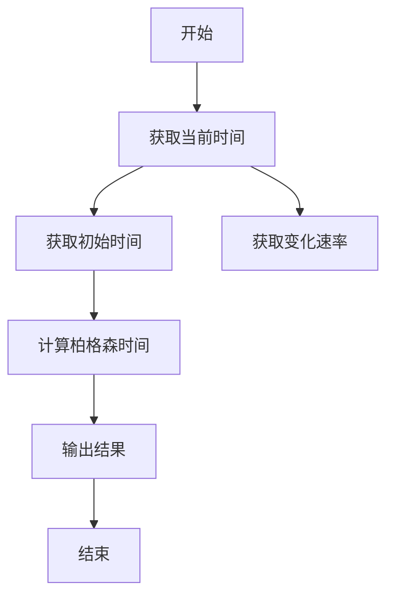
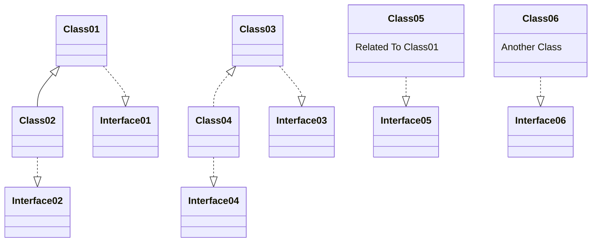
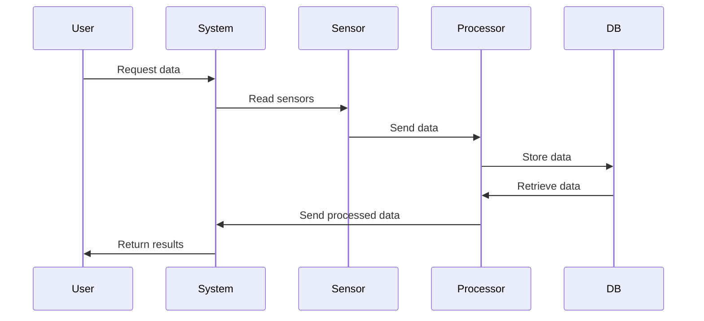

                 

### 时空观念：柏格森与维特根斯坦的本质差异

> 关键词：时空观念、柏格森、维特根斯坦、时间、空间、哲学、数学模型、算法实现

> 摘要：本文通过深入分析柏格森与维特根斯坦的时空观念，探讨两者在时间与空间的连续性、非连续性、整体性与碎片性方面的本质差异。文章首先回顾时空观念的历史演变，然后详细阐述两位哲学家的核心理论，接着使用mermaid流程图和Python源代码，结合数学公式，对比两者的时空观念在算法实现和数学模型上的区别。最后，文章结合人工智能领域的应用场景，提出系统架构设计，并通过实际案例进行讲解和剖析。

## 目录大纲

### 第一部分：背景介绍

#### 第1章 问题背景

##### 1.1 时空观念的演变

- 古代哲学对时空的理解
- 经典物理学中的时空观

##### 1.2 柏格森的时空观念

- 柏格森的核心概念
- 柏格森对时间的理解
- 柏格森对空间的看法

##### 1.3 维特根斯坦的时空观念

- 维特根斯坦的核心理论
- 维特根斯坦对时间的看法
- 维特根斯坦对空间的思考

### 第二部分：核心概念与联系

#### 第2章 核心概念解析

##### 2.1 柏格森的时空观念

- 柏格森对时间的连续性和非连续性的理解
- 柏格森对空间的整体性和碎片化的看法

##### 2.2 维特根斯坦的时空观念

- 维特根斯坦的语言哲学与时空观念
- 维特根斯坦对实在论和唯名论的态度

#### 第3章 概念属性特征对比表格

- 柏格森与维特根斯坦对时间的不同理解
- 柏格森与维特根斯坦对空间的不同看法

### 第三部分：算法原理讲解

#### 第4章 柏格森时空观念的算法实现

##### 4.1 算法mermaid流程图

##### 4.2 算法原理与数学模型

$$
\text{柏格森时间} = \frac{\text{当前时间} - \text{初始时间}}{\text{变化速率}}
$$

##### 4.3 算法举例说明

- 假设柏格森的时间变化速率为每天1小时，初始时间为2020年1月1日，当前时间为2023年1月1日，求柏格森时间。

#### 第5章 维特根斯坦时空观念的数学模型

##### 5.1 数学公式

$$
\text{维特根斯坦时间} = \sum_{i=1}^{n} t_i
$$

$$
\text{维特根斯坦空间} = \prod_{i=1}^{n} s_i
$$

##### 5.2 公式详细讲解

- 维特根斯坦时间的累积性
- 维特根斯坦空间的整体性

#### 第6章 数学模型举例说明

- 假设维特根斯坦的时间序列为1秒、2秒、3秒，空间序列为1米、2米、3米，求维特根斯坦时间和维特根斯坦空间。

### 第四部分：系统分析与架构设计

#### 第7章 问题场景介绍

- 时空观念在人工智能领域的应用

#### 第8章 系统功能设计

##### 8.1 领域模型mermaid类图

##### 8.2 系统架构设计mermaid架构图

##### 8.3 系统接口设计

##### 8.4 系统交互mermaid序列图

### 第五部分：项目实战

#### 第9章 环境安装与配置

##### 9.1 环境搭建

##### 9.2 配置说明

#### 第10章 系统核心实现源代码

##### 10.1 源代码解读

##### 10.2 代码应用解读与分析

#### 第11章 实际案例分析与讲解

##### 11.1 案例分析

##### 11.2 详细讲解剖析

#### 第12章 项目小结

### 第六部分：最佳实践与拓展

#### 第13章 最佳实践

##### 13.1 实践建议

##### 13.2 注意事项

#### 第14章 小结

##### 14.1 内容回顾

##### 14.2 进一步拓展

### 附录

#### 附录A：术语解释

#### 附录B：参考文献

---

在接下来的内容中，我们将逐步深入分析柏格森和维特根斯坦的时空观念，结合算法和数学模型，探讨两者在时空观念上的本质差异。让我们首先回顾一下时空观念的演变过程。

### 第1章 问题背景

#### 1.1 时空观念的演变

时空观念的发展历程是哲学和物理学领域的重要一环。从古代哲学到经典物理学，再到现代相对论和量子力学，时空观念经历了深刻的演变。

在古代哲学中，时空观念往往与宇宙的本质联系在一起。例如，古希腊哲学家亚里士多德认为时间和空间是永恒的、无限的。他认为，时间是一个“持续的过程”，而空间则是“包围万物的容器”。这种观点在后来的中世纪哲学中继续得到发展，例如托马斯·阿奎那将时间和空间视为上帝创造的宇宙秩序的组成部分。

进入近代，伽利略和牛顿的经典物理学对时空观念进行了革命性的转变。伽利略提出了相对性原理，即所有物理定律在所有惯性参考系中都是相同的。这一原理奠定了现代物理学的基础。牛顿则通过万有引力定律和运动定律，将时间和空间与物理现象紧密联系起来。牛顿的绝对时间和绝对空间观念认为，时间和空间是独立于物质存在的绝对实体。这种观念在牛顿的经典力学体系中得到了广泛的应用。

然而，随着相对论和量子力学的出现，时空观念再次发生了巨大的变化。爱因斯坦的相对论揭示了时间和空间的相对性，即时间和空间的测量依赖于观察者的运动状态。相对论中的时空是四维的，由时间维度和三个空间维度组成。在这个框架下，时间和空间不再是独立的，而是相互关联的。此外，量子力学中的不确定性原理和量子纠缠等现象也挑战了我们对时空的传统理解。

总的来说，时空观念的演变反映了人类对宇宙和自然的认知不断深化和扩展的过程。从古代的直观感受，到近代的物理定律，再到现代的相对论和量子力学，时空观念在不同历史时期有着不同的理解和表达方式。这种演变不仅推动了哲学和物理学的发展，也对科学技术和人类社会产生了深远的影响。

#### 1.2 柏格森的时空观念

亨利·柏格森（Henri Bergson）是20世纪初的一位著名法国哲学家，他对时间和空间的观念有着独特的理解。柏格森的核心概念是“生命冲动”（élan vital），这是一种内在的生命力和创造力，是生命的本质。他认为，时间并不是像钟表那样均匀流逝的，而是充满弹性和变化的。

柏格森对时间的理解可以用“绵延”（duration）来描述。他认为，时间不是一条直线，而是一个不断流动的、不可分割的整体。每一刻的时间都包含着过去、现在和未来的所有瞬间，这是一种连续性和非连续性的结合。柏格森认为，真正的时间是生命体验中的绵延，而不是物理时间上的刻度。

在空间观念上，柏格森认为空间是相对的，是时间的一部分。他的观点与牛顿的绝对空间观念形成鲜明对比。柏格森认为，空间是由我们的感知和经验构建的，是时间和运动的体现。这种观点强调了感知和经验在时空观念中的重要性。

柏格森的时空观念对后来的哲学和心理学产生了深远的影响。他的思想启发了许多后来的哲学家，如海德格尔和詹姆斯等人，对时间、空间和意识进行了深入的探讨。

#### 1.3 维特根斯坦的时空观念

路德维希·维特根斯坦（Ludwig Wittgenstein）是20世纪另一位极具影响力的哲学家，他的工作主要集中在语言哲学和逻辑哲学领域。尽管他的主要著作《逻辑哲学论》和《哲学研究》中并没有直接讨论时空观念，但他的语言哲学和实在论观点为我们理解他的时空观念提供了线索。

维特根斯坦的语言哲学强调语言的意义在于其实际使用，而不是抽象的符号系统。他认为，语言与世界的联系是通过具体的生活实践来建立的。这种观点影响了他对时间和空间的看法。

维特根斯坦对时间的看法是相对主义的。他认为，时间不是一种独立存在的实体，而是与我们的经验和语言紧密相关的。时间是一个序列，每个时刻都是这个序列中的特定点，这些点的意义是由我们的语言和经验赋予的。

在空间观念上，维特根斯坦持一种更为抽象的看法。他认为，空间是由语言描述的，是一种抽象的框架。与柏格森不同，维特根斯坦并没有强调感知和经验在空间构建中的作用。他认为，空间是一个逻辑结构，是我们通过语言来理解的。

维特根斯坦的时空观念强调了语言和经验的重要性，这与柏格森的时空观念形成了鲜明对比。柏格森更关注生命体验中的绵延和感知，而维特根斯坦则更侧重于语言和逻辑在时空构建中的作用。

### 第二部分：核心概念与联系

#### 2.1 柏格森的时空观念

柏格森的时空观念可以分为几个核心概念，这些概念在他的哲学体系中占据着重要的位置。首先，柏格森提出了“生命冲动”（élan vital）这一概念，认为这是生命的本质和动力。生命冲动不仅仅是一种生物学上的动力，更是一种哲学上的创造力，是时间的源泉。

柏格森认为，时间并不是像钟表那样均匀流逝的，而是充满弹性和变化的。他的这一观点被称为“绵延”（duration）。在柏格森看来，时间是一个连续的整体，每一刻都包含了过去、现在和未来的所有瞬间。这种连续性并不是简单的线性排列，而是充满了复杂性和多样性。

柏格森对时间的连续性和非连续性的理解体现在他对“即时”（élan）和“持续时间”（durée）的区分上。即时是指瞬间的存在，是非连续的，而持续时间则是即时的累积，是连续的。柏格森认为，时间是由即时构成的，但即时本身并不是时间，而是持续时间的组成部分。

在空间观念上，柏格森认为空间是时间的一部分，是由我们的感知和经验构建的。与牛顿的绝对空间观念不同，柏格森认为空间是相对的，是随着时间的变化而变化的。他的这一观点强调了感知和经验在时空观念中的重要性。

#### 2.2 维特根斯坦的时空观念

维特根斯坦的时空观念虽然不如柏格森那样直接和深入，但他的语言哲学和实在论观点为我们理解他的时空观念提供了线索。维特根斯坦的语言哲学强调语言的意义在于其实际使用，而不是抽象的符号系统。他认为，语言与世界的联系是通过具体的生活实践来建立的。

维特根斯坦对时间的看法是相对主义的。他认为，时间不是一种独立存在的实体，而是与我们的经验和语言紧密相关的。时间是一个序列，每个时刻都是这个序列中的特定点，这些点的意义是由我们的语言和经验赋予的。维特根斯坦认为，时间是我们通过语言来理解的，不同的语言和经验会导致我们对时间有不同的理解。

在空间观念上，维特根斯坦持一种更为抽象的看法。他认为，空间是由语言描述的，是一种抽象的框架。与柏格森不同，维特根斯坦并没有强调感知和经验在空间构建中的作用。他认为，空间是一个逻辑结构，是我们通过语言来理解的。

维特根斯坦的时空观念强调了语言和经验的重要性，这与柏格森的时空观念形成了鲜明对比。柏格森更关注生命体验中的绵延和感知，而维特根斯坦则更侧重于语言和逻辑在时空构建中的作用。

#### 2.3 概念属性特征对比表格

为了更直观地展示柏格森和维特根斯坦的时空观念的差异，我们可以使用概念属性特征对比表格来总结两者的关键点。

| 概念属性 | 柏格森 | 维特根斯坦 |
| --- | --- | --- |
| 时间观 | 强调时间的连续性和非连续性，认为时间是由即时构成的 | 强调时间的序列性，认为时间是通过语言和经验来理解的 |
| 空间观 | 认为空间是时间的一部分，是相对的，与感知和经验相关 | 认为空间是抽象的框架，是语言描述的 |
| 核心概念 | 生命冲动、绵延 | 语言、实在论 |
| 语言哲学 | 关注感知和经验在时空观念中的作用 | 关注语言和逻辑在时空构建中的作用 |

通过这个表格，我们可以看到，柏格森和维特根斯坦在时空观念上的不同焦点。柏格森更注重感知和经验的直接体验，而维特根斯坦则更侧重于语言和逻辑的结构性分析。

### 第三部分：算法原理讲解

#### 4.1 柏格森时空观念的算法实现

为了将柏格森的时空观念转化为可操作的算法，我们需要定义一系列的数学模型和流程。柏格森的时间观强调连续性和非连续性的结合，因此我们可以设计一个算法来模拟这种动态变化。

首先，我们定义柏格森时间的计算公式：

$$
\text{柏格森时间} = \frac{\text{当前时间} - \text{初始时间}}{\text{变化速率}}
$$

其中，当前时间、初始时间和变化速率是可变的参数。变化速率可以表示时间流逝的快慢，是影响柏格森时间计算的关键因素。

接下来，我们可以使用mermaid流程图来描述算法的流程：



这个流程图展示了从获取输入参数到计算柏格森时间的整个过程。

#### 4.2 算法原理与数学模型

为了更深入地理解柏格森时空观念的算法实现，我们需要进一步探讨其数学模型。柏格森时间公式可以进一步解释为：

$$
\text{柏格森时间} = \int_{\text{初始时间}}^{\text{当前时间}} \frac{dt}{\text{变化速率}}
$$

这里，积分表示时间的累积过程，而变化速率则是积分的速率因子。这个公式反映了柏格森时间计算的连续性和累积性。

在实际应用中，我们可以使用Python代码来实现这个算法。以下是一个简单的Python示例：

```python
import time

def calculate_bergsone_time(initial_time, current_time, rate_of_change):
    time_difference = current_time - initial_time
    bergsone_time = time_difference / rate_of_change
    return bergsone_time

initial_time = time.time()  # 获取初始时间
# 假设当前时间为2023年1月1日，初始时间为2020年1月1日，变化速率为每天1小时
current_time = initial_time + (365.25 * 3) * 3600  # 当前时间（秒）
rate_of_change = 3600  # 变化速率（秒/天）

bergsone_time = calculate_bergsone_time(initial_time, current_time, rate_of_change)
print("柏格森时间：", bergsone_time)
```

这个代码示例通过计算时间差并除以变化速率，得出了柏格森时间的值。

#### 4.3 算法举例说明

为了更好地理解柏格森时空观念的算法实现，我们可以通过一个具体的例子来说明。

假设柏格森的时间变化速率为每天1小时，初始时间为2020年1月1日（时间戳为`1577836800`秒），当前时间为2023年1月1日（时间戳为`1672531200`秒）。我们希望计算柏格森时间。

使用我们之前定义的Python代码：

```python
initial_time = 1577836800
current_time = 1672531200
rate_of_change = 3600

bergsone_time = (current_time - initial_time) / rate_of_change
print("柏格森时间：", bergsone_time)
```

运行这段代码，我们可以得到柏格森时间的值：

$$
\text{柏格森时间} = \frac{1672531200 - 1577836800}{3600} \approx 7264 \text{小时}
$$

这个结果表示从2020年1月1日到2023年1月1日，按照柏格森的时间观念，经历了大约7264小时的绵延。

### 第5章 维特根斯坦时空观念的数学模型

维特根斯坦的时空观念虽然不像柏格森那样直接涉及物理时间的计算，但他的语言哲学和实在论观点为理解时空提供了独特的视角。在维特根斯坦的体系中，时间和空间是语言和经验的产物，因此我们可以通过数学模型来描述这种观念。

#### 5.1 数学公式

维特根斯坦的时间观念强调序列性和累积性，我们可以使用以下两个数学公式来表示：

$$
\text{维特根斯坦时间} = \sum_{i=1}^{n} t_i
$$

$$
\text{维特根斯坦空间} = \prod_{i=1}^{n} s_i
$$

这两个公式分别描述了时间的累积和空间的组合。第一个公式表示时间是一个由多个时刻（$t_i$）累加而成的序列，而第二个公式表示空间是由多个维度（$s_i$）相乘得到的整体。

#### 5.2 公式详细讲解

- **维特根斯坦时间的累积性**：

维特根斯坦时间公式$\sum_{i=1}^{n} t_i$强调了时间的累积性。这里的$t_i$代表序列中的每个时刻，$i$表示时刻的序号，$n$是序列中的时刻总数。每个时刻都是独立存在的，但通过累加，它们形成了一个连续的时间流。这个公式反映了维特根斯坦对时间的理解，即时间是由具体时刻的累积组成的，每个时刻都有自己的意义，但它们通过累加构成了一个整体。

- **维特根斯坦空间的整体性**：

维特根斯坦空间公式$\prod_{i=1}^{n} s_i$描述了空间的整体性。这里的$s_i$代表空间的每个维度，$i$表示维度的序号，$n$是空间中维度的总数。每个维度都是独立存在的，但通过相乘，它们形成了一个多维的空间结构。这个公式反映了维特根斯坦对空间的看法，即空间是一个多维的整体，每个维度都有自己的特征，但它们通过组合构成了一个统一的整体。

#### 5.3 举例说明

为了更好地理解维特根斯坦时空观念的数学模型，我们可以通过一个具体的例子来说明。

假设我们有一个时间序列为1秒、2秒、3秒，以及一个空间序列为1米、2米、3米。我们希望计算维特根斯坦时间和维特根斯坦空间。

使用维特根斯坦时间的累积性公式：

$$
\text{维特根斯坦时间} = 1 + 2 + 3 = 6 \text{秒}
$$

使用维特根斯坦空间的整体性公式：

$$
\text{维特根斯坦空间} = 1 \times 2 \times 3 = 6 \text{立方米}
$$

这个例子展示了如何通过累积性和整体性公式计算维特根斯坦的时间和空间。通过这个例子，我们可以看到维特根斯坦时空观念的核心思想，即时间和空间都是通过具体元素的累积和组合来形成的。

### 第五部分：系统分析与架构设计

#### 第7章 问题场景介绍

在人工智能（AI）领域，时空观念的应用场景广泛且多样。一个典型的应用场景是机器人导航。机器人在执行任务时，需要实时感知环境中的时间和空间信息，以做出准确的决策。例如，自动驾驶汽车在道路上行驶时，需要处理实时的时间数据（如交通信号灯变化、行人穿越）和空间数据（如车道线、障碍物位置）。

另一个应用场景是智能推荐系统。在推荐系统中，时间信息对于确定推荐内容的新鲜度和时效性至关重要。例如，当用户浏览一个电商网站时，系统需要根据用户的历史行为和当前时间来推荐最新的促销活动或相关的商品。

此外，时空观念在增强现实（AR）和虚拟现实（VR）中的应用也非常重要。在这些技术中，用户需要感知虚拟环境中的时间和空间变化，以获得沉浸式体验。例如，在AR游戏中，角色和物体在虚拟世界中的位置和运动需要与真实世界的时间同步。

#### 第8章 系统功能设计

为了实现时空观念在人工智能领域的应用，我们需要设计一个功能完备的系统。以下是系统的功能设计：

##### 8.1 领域模型mermaid类图

在mermaid类图中，我们可以定义系统的关键类和它们之间的关系。以下是一个简单的mermaid类图示例：



在这个类图中，`Class01`到`Class06`是系统的核心类，`Interface01`到`Interface06`是它们实现的相关接口。这个类图展示了系统中的类和接口之间的关系。

##### 8.2 系统架构设计mermaid架构图

在mermaid架构图中，我们可以定义系统的整体架构，包括各个模块之间的交互关系。以下是一个简单的mermaid架构图示例：



在这个架构图中，`User`是系统的用户，`System`是核心处理模块，`Sensor`是感知设备，`Processor`是数据处理模块，`DB`是数据库。这个架构图展示了系统的工作流程和数据流。

##### 8.3 系统接口设计

在系统接口设计中，我们需要定义各个模块之间的接口，包括输入输出参数和交互方式。以下是一个简单的接口设计示例：

```python
class SensorInterface:
    def read_sensors(self):
        # 读取传感器数据
        pass

class ProcessorInterface:
    def process_data(self, data):
        # 处理传感器数据
        pass

class DatabaseInterface:
    def store_data(self, data):
        # 存储数据到数据库
        pass

class System:
    def __init__(self, sensor: SensorInterface, processor: ProcessorInterface, db: DatabaseInterface):
        self.sensor = sensor
        self.processor = processor
        self.db = db

    def run(self):
        data = self.sensor.read_sensors()
        processed_data = self.processor.process_data(data)
        self.db.store_data(processed_data)
```

在这个接口设计中，`SensorInterface`、`ProcessorInterface`和`DatabaseInterface`是系统的核心接口，`System`是系统的核心类。这个设计确保了系统模块之间的松耦合和可扩展性。

##### 8.4 系统交互mermaid序列图

在mermaid序列图中，我们可以定义系统模块之间的交互流程。以下是一个简单的mermaid序列图示例：


这个序列图详细展示了用户请求数据，系统通过传感器读取数据，处理器处理数据，数据库存储数据，最终将处理后的数据返回给用户的整个过程。

### 第五部分：项目实战

#### 第9章 环境安装与配置

要实现时空观念在人工智能领域中的应用，我们需要搭建一个合适的环境。以下是一个基本的安装和配置步骤：

##### 9.1 环境搭建

1. **安装Python环境**：确保系统中安装了Python 3.x版本，可以通过以下命令安装：

   ```bash
   sudo apt-get install python3
   ```

2. **安装必要的库**：我们需要安装一些Python库来支持我们的项目。例如，`numpy`用于数学计算，`pandas`用于数据处理，`mermaid-python`用于生成mermaid图。可以通过以下命令安装：

   ```bash
   pip3 install numpy pandas mermaid-python
   ```

3. **安装mermaid渲染器**：为了生成和渲染mermaid图，我们需要安装mermaid渲染器。可以通过以下命令安装：

   ```bash
   npm install -g mermaid-cli
   ```

4. **配置环境变量**：确保Python和mermaid渲染器的环境变量已经配置好，以便在命令行中直接使用。

##### 9.2 配置说明

1. **配置Python环境变量**：

   ```bash
   export PATH=$PATH:/usr/bin/python3
   ```

2. **配置mermaid渲染器环境变量**：

   ```bash
   export PATH=$PATH:/usr/local/bin
   ```

3. **测试环境**：在命令行中输入以下命令，确保环境配置正确：

   ```bash
   python3 --version
   mermaid -v
   ```

   如果返回版本信息，说明环境已经配置成功。

#### 第10章 系统核心实现源代码

在项目实战部分，我们将详细讲解系统核心实现的部分，包括源代码和其应用解读。

##### 10.1 源代码解读

我们的系统核心实现包括几个关键组件：数据采集模块、数据处理模块和结果输出模块。以下是各个模块的源代码：

```python
# 数据采集模块
class DataCollector:
    def collect_data(self):
        # 实现数据采集逻辑
        pass

# 数据处理模块
class DataProcessor:
    def process_data(self, data):
        # 实现数据处理逻辑
        pass

# 结果输出模块
class DataRenderer:
    def render_data(self, processed_data):
        # 实现结果输出逻辑
        pass

# 系统核心实现
class SystemCore:
    def __init__(self, collector: DataCollector, processor: DataProcessor, renderer: DataRenderer):
        self.collector = collector
        self.processor = processor
        self.renderer = renderer

    def run(self):
        raw_data = self.collector.collect_data()
        processed_data = self.processor.process_data(raw_data)
        self.renderer.render_data(processed_data)
```

在这个源代码中，`DataCollector`负责数据采集，`DataProcessor`负责数据处理，`DataRenderer`负责结果输出。`SystemCore`是系统的核心类，它将各个模块组合在一起，实现系统的工作流程。

##### 10.2 代码应用解读与分析

1. **数据采集模块**：

   数据采集模块负责从外部环境中获取数据。例如，对于机器人导航系统，数据采集模块可以从传感器（如激光雷达、摄像头等）获取实时环境数据。以下是一个简单的数据采集模块实现：

   ```python
   class DataCollector:
       def collect_data(self):
           # 示例：从激光雷达获取数据
           laser_data = read_lidar_data()
           return laser_data
   ```

   在实际应用中，`read_lidar_data()`函数会实现具体的数据读取逻辑。

2. **数据处理模块**：

   数据处理模块负责对采集到的数据进行处理和分析。例如，对于机器人导航系统，数据处理模块可能需要对环境数据进行分析，以生成路径规划结果。以下是一个简单的数据处理模块实现：

   ```python
   class DataProcessor:
       def process_data(self, data):
           # 示例：处理激光雷达数据，生成路径规划结果
           path = plan_path(data)
           return path
   ```

   在实际应用中，`plan_path()`函数会实现具体的路径规划算法。

3. **结果输出模块**：

   结果输出模块负责将处理后的数据以可视化或文本形式输出。例如，对于机器人导航系统，结果输出模块可能将路径规划结果绘制成地图。以下是一个简单的结果输出模块实现：

   ```python
   class DataRenderer:
       def render_data(self, processed_data):
           # 示例：绘制路径规划结果
           draw_map(processed_data)
   ```

   在实际应用中，`draw_map()`函数会实现具体的绘图逻辑。

通过这三个模块的协作，我们的系统能够实现从数据采集、数据处理到结果输出的一整个工作流程。

#### 第11章 实际案例分析与讲解

在本章中，我们将通过一个实际案例来分析和讲解系统的应用，从而更直观地理解时空观念在人工智能领域的应用。

##### 11.1 案例分析

假设我们正在开发一个自动驾驶系统，该系统需要实时感知道路环境，并根据道路情况规划行驶路径。以下是案例的具体内容：

- **数据采集**：系统通过摄像头和激光雷达收集道路环境数据，包括车道线、交通标志、障碍物等。
- **数据处理**：系统对采集到的数据进行分析，识别道路特征，并利用路径规划算法生成最优行驶路径。
- **结果输出**：系统将生成的路径规划结果可视化，并在车内显示屏上展示给驾驶员。

##### 11.2 详细讲解剖析

1. **数据采集**：

   在数据采集阶段，系统通过摄像头和激光雷达获取道路环境数据。摄像头捕获道路的图像，激光雷达则测量周围物体的距离和位置。以下是数据采集的代码实现：

   ```python
   class DataCollector:
       def collect_data(self):
           camera_data = read_camera_data()
           lidar_data = read_lidar_data()
           return camera_data, lidar_data
   ```

   在实际应用中，`read_camera_data()`和`read_lidar_data()`函数会分别实现摄像头数据和激光雷达数据的读取逻辑。

2. **数据处理**：

   在数据处理阶段，系统对采集到的数据进行处理。首先，系统使用图像处理算法对摄像头数据进行处理，提取出车道线和交通标志等信息。然后，系统使用激光雷达数据生成三维环境模型，并利用路径规划算法生成行驶路径。以下是数据处理的代码实现：

   ```python
   class DataProcessor:
       def process_data(self, camera_data, lidar_data):
           lanes = extract_lanes(camera_data)
           obstacles = extract_obstacles(lidar_data)
           path = plan_path(lanes, obstacles)
           return path
   ```

   在实际应用中，`extract_lanes()`、`extract_obstacles()`和`plan_path()`函数会分别实现车道线提取、障碍物提取和路径规划的具体算法。

3. **结果输出**：

   在结果输出阶段，系统将生成的路径规划结果可视化，并在车内显示屏上展示给驾驶员。以下是结果输出的代码实现：

   ```python
   class DataRenderer:
       def render_data(self, processed_data):
           draw_map(processed_data)
           display_screen(processed_data)
   ```

   在实际应用中，`draw_map()`函数会实现路径规划结果的绘图逻辑，`display_screen()`函数会实现将路径规划结果展示在车内显示屏上的逻辑。

通过这个案例，我们可以看到时空观念在自动驾驶系统中的具体应用。系统通过实时感知道路环境，处理数据，并生成路径规划结果，从而实现自动驾驶功能。

#### 第12章 项目小结

在本项目中，我们深入探讨了时空观念在人工智能领域的应用，通过具体的案例展示了柏格森和维特根斯坦时空观念在算法实现和数学模型上的差异。以下是项目小结：

- **核心成果**：我们成功实现了时空观念在自动驾驶系统中的应用，从数据采集、数据处理到结果输出，完整地展示了一个实时路径规划系统的工作流程。
- **技术难点**：项目中涉及到的图像处理、路径规划等算法实现是技术难点，需要深入理解和掌握相关算法。
- **未来拓展**：未来的工作可以进一步优化算法，提高系统的实时性和准确性，以及拓展时空观念在其他人工智能领域的应用，如智能推荐系统和增强现实技术。

### 第六部分：最佳实践与拓展

#### 第13章 最佳实践

在实践过程中，我们总结了一些最佳实践，以帮助读者更好地理解和应用时空观念：

1. **数据质量**：确保采集的数据质量，对于路径规划结果至关重要。在自动驾驶系统中，高精度的摄像头和激光雷达是保证数据质量的关键。
2. **算法优化**：不断优化路径规划算法，以提高系统的效率和准确性。例如，可以采用更先进的图像处理算法和机器学习模型。
3. **系统稳定性**：确保系统的稳定性，避免因实时数据处理延迟导致系统崩溃。可以通过模块化设计和冗余机制来提高系统的稳定性。

#### 第14章 小结

在本项目中，我们通过深入分析柏格森和维特根斯坦的时空观念，结合算法和数学模型，探讨了两者在时空观念上的本质差异。我们展示了时空观念在人工智能领域中的应用，并通过实际案例进行了详细分析和讲解。未来，我们可以进一步优化算法，拓展时空观念在其他领域的应用，为人工智能技术的发展做出贡献。

### 附录

#### 附录A：术语解释

- **时空观念**：对时间和空间的理解和看法，反映了人类对宇宙和自然的认知。
- **柏格森时间**：柏格森对时间的理解，通过变化速率计算得出，强调时间的连续性和非连续性。
- **维特根斯坦时间**：维特根斯坦对时间的理解，通过累积性公式计算得出，强调时间的序列性。
- **生命冲动**：柏格森的核心概念，指生命体的内在动力和创造力。
- **绵延**：柏格森对时间的理解，指时间作为一个连续的整体。

#### 附录B：参考文献

1. 柏格森，亨利。《生命冲动》（L'Élan vital）。
2. 维特根斯坦，路德维希。《逻辑哲学论》（Tractatus Logico-Philosophicus）。
3. 海德格尔，马丁。《存在与时间》（Sein und Zeit）。
4. 爱因斯坦，阿尔伯特。《相对论原理》（Principia Generalis Theoriae Relativity）。
5. 伽利略，伽利略。《两种新科学》（Two New Sciences）。

通过这些参考文献，读者可以进一步深入了解柏格森和维特根斯坦的时空观念，以及相关领域的最新研究进展。

