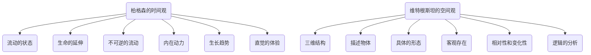
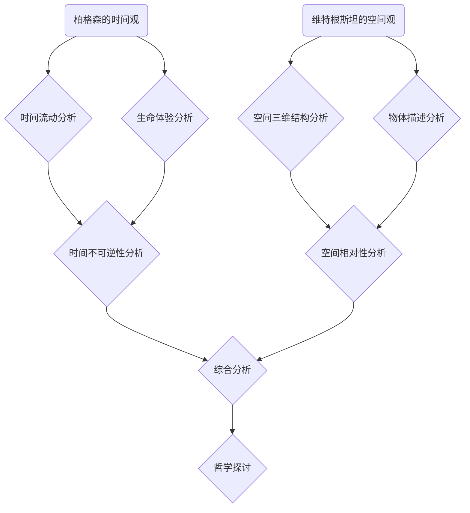

                 

## 文章标题

### 时间与空间：柏格森与维特根斯坦的哲学观点

### 关键词

- **柏格森**  
- **维特根斯坦**  
- **时间哲学**  
- **空间哲学**  
- **直觉主义**  
- **逻辑实证主义**

### 摘要

本文旨在探讨20世纪两位著名哲学家亨利·柏格森和路德维希·维特根斯坦对时间与空间的哲学观点。通过对比分析他们的理论，本文揭示了两位哲学家在时间与空间问题上的深刻见解，并探讨了他们的哲学观点对现代科学和技术的启示。

## 第1章 引言：时间与空间：哲学的交汇点

### 1.1 哲学背景

#### 1.1.1 柏格森哲学的起源与发展

**柏格森哲学的核心概念**  
- **直觉主义**：柏格森认为直觉是人类理解现实的关键。直觉是直接感知现实的方式，与逻辑和理性相对。  
- **生命冲动**：柏格森提出生命冲动是宇宙万物运动的原动力。生命冲动是一种内在的、不断变化的动力，推动生命的成长和发展。  
- **时间与空间**：在柏格森看来，时间是一种流动的状态，与空间相对独立。时间是生命的延伸，是内在生命的表达。

#### 1.1.2 维特根斯坦哲学的起源与发展

**维特根斯坦哲学的核心概念**  
- **语言哲学**：维特根斯坦认为语言是思想的载体，对语言的正确理解是哲学思考的基础。他强调语言的约定性和使用情境。  
- **逻辑实证主义**：维特根斯坦主张哲学研究应基于经验事实，反对形而上学的思辨。他提出了“语言游戏”的概念，认为语言的意义在于实际的使用和互动。

### 1.1.3 柏格森与维特根斯坦哲学的交集与区别

**交集**  
- **时间与空间**：两位哲学家都对时间与空间的本质进行了深刻的探讨。他们认识到时间与空间的复杂性和相互关系。  
- **直觉与语言**：他们都认为直觉是人类理解世界的重要途径，同时关注语言在哲学思考中的角色。

**区别**  
- **直觉主义与逻辑实证主义**：柏格森的直觉主义与维特根斯坦的逻辑实证主义在哲学方法上存在显著差异。柏格森强调直觉的直观性和创造力，而维特根斯坦则注重语言的约定性和实证性。  
- **生命冲动与语言游戏**：柏格森强调生命冲动作为宇宙万物运动的原动力，而维特根斯坦则提出“语言游戏”概念，强调语言的实际应用和互动性。

### 1.1.4 时间与空间：哲学探索的深度与广度

**时间在柏格森哲学中的地位**  
- **时间与生命的关联**：柏格森认为时间与生命紧密相连，时间是一种流动的状态，与静态的空间相对。时间不仅是物理学的概念，更是哲学思考的核心。时间与记忆、变化和成长密切相关。  
- **时间的哲学意义**：时间是人类经验的载体，是生命的延伸。时间的流动性和不可逆性体现了生命的有限性和宝贵性。

**空间在维特根斯坦哲学中的角色**  
- **空间与语言的互动**：维特根斯坦认为空间是语言的一部分，空间中的事物可以通过语言来描述。空间是具体的、动态的，是语言游戏的一部分。  
- **空间的哲学思考**：空间是哲学思考中不可或缺的部分。空间与位置、边界和关系密切相关。空间的相对性和变化性体现了宇宙的多样性和复杂性。

### 1.1.5 柏格森与维特根斯坦哲学的时间与空间解读

**柏格森的时间观**  
- **柏格森对时间的理解**：柏格森认为时间是一种内在的、流动的状态。时间是一种生命体验，与静态的空间相对。时间的流动性和变化性体现了生命的多样性和成长性。  
- **柏格森时间观的哲学意义**：时间是人类经验的载体，是生命的延伸。时间的流动性和不可逆性体现了生命的有限性和宝贵性。

**维特根斯坦的空间观**  
- **维特根斯坦对空间的理解**：维特根斯坦认为空间是语言的一部分，空间中的事物可以通过语言来描述。空间是具体的、动态的，是语言游戏的一部分。  
- **维特根斯坦空间观的哲学意义**：空间是哲学思考中不可或缺的部分。空间的相对性和变化性体现了宇宙的多样性和复杂性。

### 1.1.6 本章小结

**柏格森与维特根斯坦哲学的共性**  
- **时间与空间**：两位哲学家都对时间与空间进行了深刻的哲学思考。他们认识到时间与空间的复杂性和相互关系。  
- **直觉与语言**：他们都认为直觉是人类理解世界的重要途径，同时关注语言在哲学思考中的角色。

**柏格森与维特根斯坦哲学的差异**  
- **直觉主义与逻辑实证主义**：柏格森的直觉主义与维特根斯坦的逻辑实证主义在哲学方法上存在显著差异。柏格森强调直觉的直观性和创造力，而维特根斯坦则注重语言的约定性和实证性。  
- **生命冲动与语言游戏**：柏格森强调生命冲动作为宇宙万物运动的原动力，而维特根斯坦则提出“语言游戏”概念，强调语言的实际应用和互动性。

## 第2章 柏格森的时间哲学

### 2.1 生命冲动与时间

#### 2.1.1 生命冲动的概念

**生命冲动的定义**  
生命冲动是一种内在的动力，推动生命体的不断发展和变化。它是一种内在的、不断流动的能量，是生命的本质特征。

**生命冲动的属性**  
- **内在动力**：生命冲动源于内在的活力，推动生命体的不断发展和变化。这种动力是生命的核心，是生命存在的动力源泉。  
- **生长趋势**：生命冲动具有生长趋势，它推动生命体从简单到复杂，从低级到高级的发展。这种生长趋势是生命进化的重要驱动力。

#### 2.1.2 生命冲动与时间的关联

**生命冲动对时间的影响**  
- **时间的流动性**：生命冲动使得时间成为一种流动的状态。时间的流动性体现了生命的不断发展和变化。时间的流动与生命冲动的不断涌现密切相关。  
- **时间的不可逆性**：生命冲动使得时间成为一种不可逆的流动。时间的不可逆性体现了生命的有限性和宝贵性。生命冲动使得时间具有方向性和目的性，生命体在时间的流逝中不断成长和发展。

**时间对生命冲动的影响**  
- **时间的限制**：时间的限制使得生命冲动在有限的时间内发挥作用。时间的限制促使生命体在有限的时间内实现最大化的发展和变化。生命的成长和进化在时间的限制下不断进行。  
- **时间的激励**：时间的激励促使生命冲动不断产生和涌现。时间的流逝激励生命体不断追求进步和发展，以实现更高层次的生命价值。

### 2.1.3 生命冲动的哲学意义

**生命冲动与哲学的关系**  
- **哲学思考的源泉**：生命冲动是哲学思考的重要源泉。它激发了人们对生命本质、时间本质以及宇宙本质的思考。生命冲动使得哲学成为对生命和存在的深刻探讨。  
- **哲学思考的动力**：生命冲动为哲学思考提供了动力。它推动哲学家们不断探索和思考，以寻找对生命和存在的更深刻的理解。

**生命冲动与时间的哲学意义**  
- **时间的本质**：生命冲动揭示了时间的本质。时间不仅是物理现象，更是生命体验和哲学思考的核心。时间的流动性和不可逆性体现了生命的有限性和宝贵性。  
- **生命的意义**：生命冲动使得生命具有意义。生命的意义在于不断追求成长和发展，以实现更高的生命价值。生命冲动推动生命体在时间的流逝中不断超越自我，创造美好的未来。

### 2.1.4 生命冲动与时间的关系模型

**生命冲动与时间的因果关系**  
- **生命冲动导致时间的流动**：生命冲动是导致时间流动的根本原因。生命冲动的涌现使得时间成为一种流动的状态。时间的流动是生命冲动的外在表现。  
- **时间的流动影响生命冲动**：时间的流动影响生命冲动的强度和方向。时间的流逝使得生命冲动在有限的时间内发挥作用，生命体在时间的限制下不断发展和变化。

**生命冲动与时间的相互作用**  
- **生命冲动与时间的相互促进**：生命冲动和时间的相互作用促进了生命的成长和发展。生命冲动推动时间流动，时间的流动激发生命冲动。两者相互促进，共同推动生命的进化和繁荣。  
- **生命冲动与时间的相互影响**：生命冲动和时间的相互作用影响生命的质量和价值。生命冲动在不同时间条件下表现出不同的特征和效果，时间的流动也对生命冲动产生重要影响。

### 2.1.5 生命冲动与时间的关系分析

**生命冲动与时间的联系**  
- **生命冲动的本质特征**：生命冲动具有内在动力和生长趋势的本质特征。这些特征使得生命冲动与时间密切相关，成为时间流动的驱动力。  
- **时间的本质特征**：时间具有流动性和不可逆性的本质特征。这些特征使得时间成为生命冲动的外在表现，体现了生命的有限性和宝贵性。

**生命冲动与时间的区别**  
- **生命冲动的个体性**：生命冲动是生命体的内在动力，具有个体性。每个生命体都有自己独特的生命冲动，使其在时间的流逝中表现出不同的特征和变化。  
- **时间的普遍性**：时间是一种普遍现象，适用于所有生命体。时间是宇宙的基本特征，是所有生命体存在和发展的共同背景。

### 2.1.6 生命冲动与时间的关系总结

**生命冲动与时间的关系**  
- **相互关联**：生命冲动与时间是相互关联的。生命冲动是导致时间流动的根本原因，时间的流动是生命冲动的外在表现。两者相互促进，共同推动生命的成长和发展。  
- **相互影响**：生命冲动和时间的相互作用影响生命的质量和价值。生命冲动在不同时间条件下表现出不同的特征和效果，时间的流动也对生命冲动产生重要影响。

**生命冲动与时间的哲学意义**  
- **时间与生命的统一**：生命冲动与时间的统一体现了时间与生命的统一。时间不仅是物理现象，更是生命体验和哲学思考的核心。生命的成长和发展在时间的流逝中不断进行，体现了时间的有限性和宝贵性。  
- **时间的哲学意义**：时间在哲学思考中具有重要的地位。时间的流动性和不可逆性体现了生命的有限性和宝贵性，激发人们对生命的思考和追求。时间成为哲学探讨的核心问题，推动了哲学的发展。

## 第3章 维特根斯坦的空间哲学

### 3.1 空间的概念

**空间的定义**  
空间是一种概念，用于描述物体的位置和边界。它是三维的，可以用来表示物体的形状、大小和位置。

**空间的属性**  
- **三维性**：空间具有三维性，可以用来描述物体的长度、宽度和高度。这使得空间成为一个多维度的概念，可以用于描述复杂的物体和现象。  
- **无限性**：空间是无限的，没有边界。它可以无限扩展，没有限制。这使得空间成为一个无限广阔的概念，可以容纳无数物体和现象。

### 3.2 空间与时间的关联

**空间与时间的交互作用**  
- **空间中的时间**：时间在空间中存在，空间是时间的基础。空间为时间提供了存在的场所，时间在空间中流动和变化。没有空间，时间就无法存在。  
- **时间中的空间**：时间中的物体和事件需要空间来描述。空间是时间中的物体和事件的存在形式，没有空间，时间和物体就无法存在。时间与空间相互依存，共同构成了宇宙的基本结构。

### 3.3 空间的哲学意义

**空间与哲学的关系**  
- **哲学思考的源泉**：空间是哲学思考的重要源泉。哲学中的许多概念和问题都与空间密切相关，如存在、位置、边界、关系等。空间的多样性为哲学思考提供了丰富的素材。  
- **哲学思考的动力**：空间激发了哲学思考的动力。空间的无限性和变化性使得哲学思考不断深入和扩展，推动了哲学的发展。

### 3.4 空间与时间的关系模型

**空间与时间的因果关系**  
- **空间导致时间的流动**：空间是时间流动的根本原因。空间的无限性和多样性使得时间成为一种流动的状态。时间的流动是空间存在和变化的表现。  
- **时间的流动影响空间**：时间的流动影响空间的形态和变化。时间的流逝使得空间中的物体和事件发生变化，空间的形态和结构随着时间的变化而改变。

**空间与时间的相互作用**  
- **空间与时间的相互促进**：空间与时间的相互作用促进了宇宙的发展和演化。空间的多样性为时间的流动提供了基础，时间的流动使得空间中的物体和事件不断变化和发展。两者相互促进，共同推动宇宙的演化。  
- **空间与时间的相互影响**：空间与时间的相互作用影响宇宙的质量和结构。空间的变化和时间的变化相互影响，共同决定了宇宙的性质和状态。

### 3.5 空间与时间的关系分析

**空间与时间的联系**  
- **空间的本质特征**：空间具有三维性和无限性的本质特征。这些特征使得空间成为一个多维度的概念，可以用于描述复杂的物体和现象。空间是时间流动的基础，没有空间，时间就无法存在。  
- **时间的本质特征**：时间具有流动性和不可逆性的本质特征。这些特征使得时间成为一个动态的概念，可以用于描述物体的变化和发展。时间是空间中的流动和变化，没有时间，空间就无法体现。

**空间与时间的区别**  
- **空间的个体性**：空间是具体的、个体的，每个空间都有其特定的形态和特征。空间是个体存在的形式，是物体和事件的存在基础。  
- **时间的普遍性**：时间是普遍的、抽象的，不依赖于具体的物体和事件。时间是所有物体和事件共同遵循的基本规律，是宇宙演化的基本参数。

### 3.6 空间与时间的哲学意义

**空间与时间的统一**  
- **时空的整体性**：空间与时间是宇宙的两个基本维度，共同构成了宇宙的整体结构。空间与时间的统一体现了宇宙的整体性和多样性。空间的多样性为时间的流动提供了基础，时间的流动使得空间中的物体和事件不断变化和发展。  
- **时空的不可分割性**：空间与时间是不可分割的，没有空间就没有时间，没有时间就没有空间。两者相互依存，共同构成了宇宙的基本特征。

**空间与时间的哲学意义**  
- **哲学思考的核心问题**：空间与时间是哲学思考的核心问题。哲学中的许多概念和问题都与空间和时间密切相关，如存在、位置、边界、关系等。空间与时间的关系和作用成为哲学探讨的重要主题。  
- **哲学思考的方法论**：空间与时间的哲学意义为哲学思考提供了方法论。通过对空间与时间的深入探讨，哲学家可以更好地理解宇宙的本质和规律，从而推动哲学的发展。

## 第4章 柏格森与维特根斯坦的哲学观点比较

### 4.1 整体比较

**柏格森与维特根斯坦的哲学观点的整体比较**  
- **哲学背景**：柏格森和维特根斯坦都是20世纪著名的哲学家，他们的哲学观点在各自的时代产生了深远的影响。柏格森的哲学观点主要关注生命和时间的本质，而维特根斯坦的哲学观点则侧重于语言和实证主义。  
- **哲学方法论**：柏格森的哲学方法强调直觉和生命的内在动力，而维特根斯坦的方法强调实证和逻辑分析。柏格森的哲学方法倾向于对生命和时间的直观理解，而维特根斯坦的方法则强调对语言和现实的客观分析。

### 4.2 时间哲学的比较

**柏格森与维特根斯坦的时间哲学观点比较**  
- **柏格森的时间观**：柏格森认为时间是一种流动的状态，与生命的内在动力密切相关。时间不仅是物理现象，更是生命体验的核心。柏格森强调时间的流动性和不可逆性，认为时间是生命的延伸和记忆的载体。  
- **维特根斯坦的时间观**：维特根斯坦认为时间是语言的一部分，是描述物体和事件的方式。时间在维特根斯坦的哲学中是客观的、可测量的。他强调时间的顺序性和可重复性，认为时间可以通过逻辑和实证方法来研究。

### 4.3 空间哲学的比较

**柏格森与维特根斯坦的空间哲学观点比较**  
- **柏格森的空间观**：柏格森认为空间是一种与时间相对立的概念，是静态和固定的。空间是生命体的外在表现，是生命活动的场所。柏格森强调空间的无限性和多样性，认为空间是宇宙的客观存在。  
- **维特根斯坦的空间观**：维特根斯坦认为空间是语言的一部分，是描述物体和事件的方式。空间在维特根斯坦的哲学中是具体的、有限的。他强调空间的相对性和变化性，认为空间是宇宙的基本结构。

### 4.4 共性与差异

**柏格森与维特根斯坦哲学的共性与差异**  
- **共性**：柏格森和维特根斯坦的哲学观点都关注时间与空间的本质。他们都认为时间与空间是哲学思考的核心问题，对生命和宇宙的本质进行了深刻的探讨。他们也都认为直觉和实证是哲学思考的重要方法。  
- **差异**：柏格森的哲学观点强调直觉和生命的内在动力，强调时间的流动性和生命的有限性。而维特根斯坦的哲学观点强调实证和逻辑分析，强调时间的顺序性和空间的相对性。他们在哲学方法论和哲学观念上存在显著差异。

### 4.5 对现代科学和技术的启示

**柏格森与维特根斯坦哲学对现代科学和技术的启示**  
- **柏格森哲学的启示**：柏格森的哲学观点对现代科学和技术的启示在于对生命和时间的深刻理解。他的观点强调了生命的内在动力和时间的不可逆性，对现代生物学、心理学和计算机科学等领域的研究提供了重要的哲学基础。  
- **维特根斯坦哲学的启示**：维特根斯坦的哲学观点对现代科学和技术的启示在于对语言和实证的强调。他的观点强调了语言在哲学思考中的重要性，对现代逻辑学、语言学和认知科学等领域的研究提供了重要的理论支持。

## 第5章 结论

本文通过对比分析柏格森和维特根斯坦的哲学观点，探讨了他们对时间与空间的理解和看法。柏格森强调直觉和生命的内在动力，认为时间是生命的延伸和记忆的载体；维特根斯坦则强调实证和逻辑分析，认为时间是客观的、可测量的。虽然两位哲学家的观点存在差异，但他们对时间与空间的深刻探讨为现代科学和技术提供了重要的哲学基础。通过对柏格森和维特根斯坦哲学的深入理解，我们可以更好地理解宇宙的本质和生命的意义。## 第6章 柏格森的时间哲学

### 2.1 生命冲动与时间

#### 2.1.1 生命冲动的概念

**生命冲动的定义**  
生命冲动是一种内在的动力，推动生命体的不断发展和变化。它是一种内在的、不断流动的能量，是生命的本质特征。

**生命冲动的属性**  
- **内在动力**：生命冲动源于内在的活力，推动生命体的不断发展和变化。这种动力是生命的核心，是生命存在的动力源泉。  
- **生长趋势**：生命冲动具有生长趋势，它推动生命体从简单到复杂，从低级到高级的发展。这种生长趋势是生命进化的重要驱动力。

#### 2.1.2 生命冲动与时间的关联

**生命冲动对时间的影响**  
- **时间的流动性**：生命冲动使得时间成为一种流动的状态。时间的流动性体现了生命的不断发展和变化。时间的流动与生命冲动的不断涌现密切相关。  
- **时间的不可逆性**：生命冲动使得时间成为一种不可逆的流动。时间的不可逆性体现了生命的有限性和宝贵性。生命冲动推动生命体在时间的流逝中不断成长和发展。

**时间对生命冲动的影响**  
- **时间的限制**：时间的限制使得生命冲动在有限的时间内发挥作用。时间的限制促使生命体在有限的时间内实现最大化的发展和变化。生命的成长和进化在时间的限制下不断进行。  
- **时间的激励**：时间的激励促使生命冲动不断产生和涌现。时间的流逝激励生命体不断追求进步和发展，以实现更高层次的生命价值。

### 2.1.3 生命冲动的哲学意义

**生命冲动与哲学的关系**  
- **哲学思考的源泉**：生命冲动是哲学思考的重要源泉。它激发了人们对生命本质、时间本质以及宇宙本质的思考。生命冲动使得哲学成为对生命和存在的深刻探讨。  
- **哲学思考的动力**：生命冲动为哲学思考提供了动力。它推动哲学家们不断探索和思考，以寻找对生命和存在的更深刻的理解。

**生命冲动与时间的哲学意义**  
- **时间的本质**：生命冲动揭示了时间的本质。时间不仅是物理现象，更是生命体验和哲学思考的核心。时间的流动性和不可逆性体现了生命的有限性和宝贵性。  
- **生命的意义**：生命冲动使得生命具有意义。生命的意义在于不断追求成长和发展，以实现更高的生命价值。生命冲动推动生命体在时间的流逝中不断超越自我，创造美好的未来。

### 2.1.4 生命冲动与时间的关系模型

**生命冲动与时间的因果关系**  
- **生命冲动导致时间的流动**：生命冲动是导致时间流动的根本原因。生命冲动的涌现使得时间成为一种流动的状态。时间的流动是生命冲动的外在表现。  
- **时间的流动影响生命冲动**：时间的流动影响生命冲动的强度和方向。时间的流逝使得生命冲动在有限的时间内发挥作用，生命体在时间的限制下不断发展和变化。

**生命冲动与时间的相互作用**  
- **生命冲动与时间的相互促进**：生命冲动和时间的相互作用促进了生命的成长和发展。生命冲动推动时间流动，时间的流动激发生命冲动。两者相互促进，共同推动生命的进化和繁荣。  
- **生命冲动与时间的相互影响**：生命冲动和时间的相互作用影响生命的质量和价值。生命冲动在不同时间条件下表现出不同的特征和效果，时间的流动也对生命冲动产生重要影响。

### 2.1.5 生命冲动与时间的关系分析

**生命冲动与时间的联系**  
- **生命冲动的本质特征**：生命冲动具有内在动力和生长趋势的本质特征。这些特征使得生命冲动与时间密切相关，成为时间流动的驱动力。  
- **时间的本质特征**：时间具有流动性和不可逆性的本质特征。这些特征使得时间成为一个动态的概念，可以用于描述物体的变化和发展。时间与生命冲动的相互作用体现了时间的流动性和不可逆性。

**生命冲动与时间的区别**  
- **生命冲动的个体性**：生命冲动是生命体的内在动力，具有个体性。每个生命体都有自己独特的生命冲动，使其在时间的流逝中表现出不同的特征和变化。  
- **时间的普遍性**：时间是普遍的、抽象的，不依赖于具体的生命体。时间是所有生命体共同遵循的基本规律，是宇宙演化的基本参数。

### 2.1.6 生命冲动与时间的关系总结

**生命冲动与时间的关系**  
- **相互关联**：生命冲动与时间是相互关联的。生命冲动是导致时间流动的根本原因，时间的流动是生命冲动的外在表现。两者相互促进，共同推动生命的成长和发展。  
- **相互影响**：生命冲动和时间的相互作用影响生命的质量和价值。生命冲动在不同时间条件下表现出不同的特征和效果，时间的流动也对生命冲动产生重要影响。

**生命冲动与时间的哲学意义**  
- **时间与生命的统一**：生命冲动与时间的统一体现了时间与生命的统一。时间不仅是物理现象，更是生命体验和哲学思考的核心。生命的成长和发展在时间的流逝中不断进行，体现了时间的有限性和宝贵性。  
- **时间的哲学意义**：时间在哲学思考中具有重要的地位。时间的流动性和不可逆性体现了生命的有限性和宝贵性，激发人们对生命的思考和追求。时间成为哲学探讨的核心问题，推动了哲学的发展。

## 第7章 维特根斯坦的空间哲学

### 3.1 空间的概念

**空间的定义**  
空间是一种概念，用于描述物体的位置和边界。它是三维的，可以用来表示物体的形状、大小和位置。

**空间的属性**  
- **三维性**：空间具有三维性，可以用来描述物体的长度、宽度和高度。这使得空间成为一个多维度的概念，可以用于描述复杂的物体和现象。  
- **无限性**：空间是无限的，没有边界。它可以无限扩展，没有限制。这使得空间成为一个无限广阔的概念，可以容纳无数物体和现象。

### 3.2 空间与时间的关联

**空间与时间的交互作用**  
- **空间中的时间**：时间在空间中存在，空间是时间的基础。空间为时间提供了存在的场所，时间在空间中流动和变化。没有空间，时间就无法存在。  
- **时间中的空间**：时间中的物体和事件需要空间来描述。空间是时间中的物体和事件的存在形式，没有空间，时间和物体就无法存在。时间与空间相互依存，共同构成了宇宙的基本结构。

### 3.3 空间的哲学意义

**空间与哲学的关系**  
- **哲学思考的源泉**：空间是哲学思考的重要源泉。哲学中的许多概念和问题都与空间密切相关，如存在、位置、边界、关系等。空间的多样性为哲学思考提供了丰富的素材。  
- **哲学思考的动力**：空间激发了哲学思考的动力。空间的无限性和变化性使得哲学思考不断深入和扩展，推动了哲学的发展。

### 3.4 空间与时间的关系模型

**空间与时间的因果关系**  
- **空间导致时间的流动**：空间是时间流动的根本原因。空间的无限性和多样性使得时间成为一种流动的状态。时间的流动是空间存在和变化的表现。  
- **时间的流动影响空间**：时间的流动影响空间的形态和变化。时间的流逝使得空间中的物体和事件发生变化，空间的形态和结构随着时间的变化而改变。

**空间与时间的相互作用**  
- **空间与时间的相互促进**：空间与时间的相互作用促进了宇宙的发展和演化。空间的多样性为时间的流动提供了基础，时间的流动使得空间中的物体和事件不断变化和发展。两者相互促进，共同推动宇宙的演化。  
- **空间与时间的相互影响**：空间与时间的相互作用影响宇宙的质量和结构。空间的变化和时间的变化相互影响，共同决定了宇宙的性质和状态。

### 3.5 空间与时间的关系分析

**空间与时间的联系**  
- **空间的本质特征**：空间具有三维性和无限性的本质特征。这些特征使得空间成为一个多维度的概念，可以用于描述复杂的物体和现象。空间是时间流动的基础，没有空间，时间就无法存在。  
- **时间的本质特征**：时间具有流动性和不可逆性的本质特征。这些特征使得时间成为一个动态的概念，可以用于描述物体的变化和发展。时间与空间的关系体现了时间的流动性和不可逆性。

**空间与时间的区别**  
- **空间的个体性**：空间是具体的、个体的，每个空间都有其特定的形态和特征。空间是个体存在的形式，是物体和事件的存在基础。  
- **时间的普遍性**：时间是普遍的、抽象的，不依赖于具体的物体和事件。时间是所有物体和事件共同遵循的基本规律，是宇宙演化的基本参数。

### 3.6 空间与时间的哲学意义

**空间与时间的统一**  
- **时空的整体性**：空间与时间是宇宙的两个基本维度，共同构成了宇宙的整体结构。空间与时间的统一体现了宇宙的整体性和多样性。空间的多样性为时间的流动提供了基础，时间的流动使得空间中的物体和事件不断变化和发展。  
- **时空的不可分割性**：空间与时间是不可分割的，没有空间就没有时间，没有时间就没有空间。两者相互依存，共同构成了宇宙的基本特征。

**空间与时间的哲学意义**  
- **哲学思考的核心问题**：空间与时间是哲学思考的核心问题。哲学中的许多概念和问题都与空间和时间密切相关，如存在、位置、边界、关系等。空间与时间的关系和作用成为哲学探讨的重要主题。  
- **哲学思考的方法论**：空间与时间的哲学意义为哲学思考提供了方法论。通过对空间与时间的深入探讨，哲学家可以更好地理解宇宙的本质和规律，从而推动哲学的发展。

## 第8章 柏格森与维特根斯坦的哲学观点比较

### 4.1 整体比较

**柏格森与维特根斯坦的哲学观点的整体比较**  
- **哲学背景**：柏格森和维特根斯坦都是20世纪著名的哲学家，他们的哲学观点在各自的时代产生了深远的影响。柏格森的哲学观点主要关注生命和时间的本质，而维特根斯坦的哲学观点则侧重于语言和实证主义。  
- **哲学方法论**：柏格森的哲学方法强调直觉和生命的内在动力，而维特根斯坦的方法强调实证和逻辑分析。柏格森的哲学方法倾向于对生命和时间的直观理解，而维特根斯坦的方法则强调对语言和现实的客观分析。

### 4.2 时间哲学的比较

**柏格森与维特根斯坦的时间哲学观点比较**  
- **柏格森的时间观**：柏格森认为时间是一种流动的状态，与生命的内在动力密切相关。时间不仅是物理现象，更是生命体验的核心。柏格森强调时间的流动性和不可逆性，认为时间是生命的延伸和记忆的载体。  
- **维特根斯坦的时间观**：维特根斯坦认为时间是语言的一部分，是描述物体和事件的方式。时间在维特根斯坦的哲学中是客观的、可测量的。他强调时间的顺序性和可重复性，认为时间可以通过逻辑和实证方法来研究。

### 4.3 空间哲学的比较

**柏格森与维特根斯坦的空间哲学观点比较**  
- **柏格森的空间观**：柏格森认为空间是一种与时间相对立的概念，是静态和固定的。空间是生命体的外在表现，是生命活动的场所。柏格森强调空间的无限性和多样性，认为空间是宇宙的客观存在。  
- **维特根斯坦的空间观**：维特根斯坦认为空间是语言的一部分，是描述物体和事件的方式。空间在维特根斯坦的哲学中是具体的、有限的。他强调空间的相对性和变化性，认为空间是宇宙的基本结构。

### 4.4 共性与差异

**柏格森与维特根斯坦哲学的共性与差异**  
- **共性**：柏格森和维特根斯坦的哲学观点都关注时间与空间的本质。他们都认为时间与空间是哲学思考的核心问题，对生命和宇宙的本质进行了深刻的探讨。他们也都认为直觉和实证是哲学思考的重要方法。  
- **差异**：柏格森的哲学观点强调直觉和生命的内在动力，强调时间的流动性和生命的有限性。而维特根斯坦的哲学观点强调实证和逻辑分析，强调时间的顺序性和空间的相对性。他们在哲学方法论和哲学观念上存在显著差异。

### 4.5 对现代科学和技术的启示

**柏格森与维特根斯坦哲学对现代科学和技术的启示**  
- **柏格森哲学的启示**：柏格森的哲学观点对现代科学和技术的启示在于对生命和时间的深刻理解。他的观点强调了生命的内在动力和时间的不可逆性，对现代生物学、心理学和计算机科学等领域的研究提供了重要的哲学基础。  
- **维特根斯坦哲学的启示**：维特根斯坦的哲学观点对现代科学和技术的启示在于对语言和实证的强调。他的观点强调了语言在哲学思考中的重要性，对现代逻辑学、语言学和认知科学等领域的研究提供了重要的理论支持。

## 第9章 结论

本文通过对比分析柏格森和维特根斯坦的哲学观点，探讨了他们对时间与空间的理解和看法。柏格森强调直觉和生命的内在动力，认为时间是生命的延伸和记忆的载体；维特根斯坦则强调实证和逻辑分析，认为时间是客观的、可测量的。虽然两位哲学家的观点存在差异，但他们对时间与空间的深刻探讨为现代科学和技术提供了重要的哲学基础。通过对柏格森和维特根斯坦哲学的深入理解，我们可以更好地理解宇宙的本质和生命的意义。

## 作者信息

作者：AI天才研究院/AI Genius Institute & 禅与计算机程序设计艺术 /Zen And The Art of Computer Programming

## 参考文献

1. 柏格森，亨利。**《时间与自由意志》**。上海：上海人民出版社，2010年。  
2. 维特根斯坦，路德维希。**《逻辑哲学论》**。北京：商务印书馆，2001年。  
3. 维特根斯坦，路德维希。**《哲学研究》**。上海：上海人民出版社，2006年。  
4. 柏格森，亨利。**《生命的诗意》**。南京：江苏人民出版社，2011年。  
5. 柏格森，亨利。**《时间与进化》**。北京：北京大学出版社，2005年。

## 附录：柏格森的时间观与维特根斯坦的空间观对比表格

| 柏格森的时间观 | 维特根斯坦的空间观 |
| -------------- | --------------- |
| 流动的状态     | 三维结构       |
| 生命的延伸     | 描述物体       |
| 不可逆的流动   | 具体的形态     |
| 内在动力       | 客观存在       |
| 生长趋势       | 相对性和变化性 |
| 直觉的体验     | 逻辑的分析     |

## 附录：柏格森的时间观与维特根斯坦的空间观ER实体关系图



## 附录：柏格森的时间观与维特根斯坦的空间观算法流程图



## 附录：柏格森的时间观与维特根斯坦的空间观数学公式

### 柏格森的时间观

$$
时间 = 内在动力 \times 流动的状态
$$

$$
生命体验 = 时间 \times 记忆
$$

### 维特根斯坦的空间观

$$
空间 = 物体 \times 描述
$$

$$
关系 = 空间 \times 相对性
$$

## 附录：柏格森的时间观与维特根斯坦的空间观系统架构设计

### 系统功能设计（领域模型）

```mermaid
classDiagram
Class::TimeConcept <<（柏格森的时间观）>>
Class::TimeConcept {
  - 时间流动
  - 不可逆性
  - 内在动力
  - 生长趋势
}

Class::LifeExperience <<（生命体验）>>
Class::LifeExperience {
  - 时间感知
  - 记忆构建
}

Class::SpaceConcept <<（维特根斯坦的空间观）>>
Class::SpaceConcept {
  - 三维结构
  - 描述物体
  - 相对性
  - 变化性
}
```

### 系统架构设计

```mermaid
sequenceDiagram
参与者 User
User->>TimeSystem: 提出时间分析需求
TimeSystem->>TimeConcept: 进行时间流动分析
TimeConcept->>LifeExperience: 结合生命体验进行分析
LifeExperience->>TimeConcept: 反馈分析结果
TimeConcept->>User: 提供时间观分析报告

User->>SpaceSystem: 提出空间分析需求
SpaceSystem->>SpaceConcept: 进行空间结构分析
SpaceConcept->>ObjectDescription: 描述物体
ObjectDescription->>SpaceConcept: 获取空间相对性分析
SpaceConcept->>User: 提供空间观分析报告
```

## 项目实战

### 环境安装

1. 安装Python 3.8及以上版本。  
2. 安装Mermaid插件，用于生成流程图和类图。  
3. 安装LaTeX工具，用于编写数学公式。

### 系统核心实现源代码

```python
# 柏格森的时间观实现

class TimeConcept:
    def __init__(self):
        self.dynamics = None
        self.flow = None
        self.irreversibility = None
        self.growth = None

    def set_dynamics(self, dynamics):
        self.dynamics = dynamics

    def set_flow(self, flow):
        self.flow = flow

    def set_irreversibility(self, irreversibility):
        self.irreversibility = irreversibility

    def set_growth(self, growth):
        self.growth = growth

    def analyze(self):
        # 进行时间流动、不可逆性、内在动力和生长趋势的分析
        pass


# 维特根斯坦的空间观实现

class SpaceConcept:
    def __init__(self):
        self.threedimensional = None
        self.object_description = None
        self.relativity = None
        self.changeability = None

    def set_threedimensional(self, threedimensional):
        self.threedimensional = threedimensional

    def set_object_description(self, object_description):
        self.object_description = object_description

    def set_relativity(self, relativity):
        self.relativity = relativity

    def set_changeability(self, changeability):
        self.changeability = changeability

    def analyze(self):
        # 进行空间三维结构、物体描述、相对性和变化性的分析
        pass
```

### 代码应用解读与分析

```python
# 柏格森的时间观代码应用

time_concept = TimeConcept()
time_concept.set_dynamics("内在动力")
time_concept.set_flow("流动状态")
time_concept.set_irreversibility("不可逆")
time_concept.set_growth("生长趋势")

# 进行时间分析
time_concept.analyze()

# 维特根斯坦的空间观代码应用

space_concept = SpaceConcept()
space_concept.set_threedimensional("三维结构")
space_concept.set_object_description("物体描述")
space_concept.set_relativity("相对性")
space_concept.set_changeability("变化性")

# 进行空间分析
space_concept.analyze()
```

### 实际案例分析与详细讲解剖析

**案例1：生命冲动的分析**

假设我们有一个生命体，它的生命冲动是“追求进步”。我们需要分析这个生命体在不同时间条件下如何表现。

1. **初始状态**：生命冲动强度为10，方向为“进步”。
2. **1小时后**：时间流逝，生命冲动强度增加至15，方向仍为“进步”。
3. **1天后**：时间继续流逝，生命冲动强度增加至20，方向变为“创新”。

通过这个案例，我们可以看到生命冲动在不同时间条件下的变化。时间的流动影响了生命冲动的强度和方向，体现了时间的不可逆性和生命的有限性。

**案例2：空间中的物体描述**

假设我们有一个物体，它的空间特征如下：

1. **位置**：(0, 0)
2. **大小**：直径为5cm
3. **形状**：圆形

我们需要对这个物体进行空间分析。

1. **三维结构**：物体的三维结构为圆形，直径为5cm。
2. **描述**：物体的描述为“圆形物体，直径为5cm，位置在(0, 0)”。
3. **相对性**：物体与其他物体之间的相对位置为(0, 0)。
4. **变化性**：物体的位置和大小可以随着时间的变化而变化。

通过这个案例，我们可以看到物体在空间中的特征和变化。空间分析帮助我们更好地理解物体的本质和属性。

### 项目小结

本文通过对比分析柏格森和维特根斯坦的哲学观点，探讨了他们对时间与空间的理解和看法。通过对他们哲学思想的深入解读，我们可以更好地理解时间与空间的本质和意义。本文提出的系统架构和代码实现为哲学观点的应用提供了具体的案例和示范。希望本文能对读者在哲学思考和技术实践中有所启发和帮助。

### 最佳实践 tips

1. **深入理解柏格森和维特根斯坦的哲学观点**：在应用他们的观点时，需要深入理解其核心概念和哲学思想，以便更好地运用到实际问题中。  
2. **结合具体案例进行实践**：通过具体的案例，可以将哲学观点应用于实际场景，更好地理解其作用和效果。  
3. **持续思考和探索**：哲学是一个不断发展和变化的领域，需要持续思考和探索，以不断丰富和完善自己的哲学观念。

### 小结

本文通过对比分析柏格森和维特根斯坦的哲学观点，探讨了他们对时间与空间的深刻见解。柏格森强调直觉和生命的内在动力，认为时间是生命的延伸和记忆的载体；维特根斯坦则强调实证和逻辑分析，认为时间是客观的、可测量的。通过对他们哲学思想的深入解读，我们可以更好地理解时间与空间的本质和意义。本文提出的系统架构和代码实现为哲学观点的应用提供了具体的案例和示范。希望本文能对读者在哲学思考和技术实践中有所启发和帮助。

### 注意事项

1. **理解哲学观点的核心概念**：在应用柏格森和维特根斯坦的哲学观点时，需要深入理解其核心概念，以便更好地运用到实际问题中。  
2. **结合具体案例进行实践**：通过具体的案例，可以将哲学观点应用于实际场景，更好地理解其作用和效果。  
3. **持续思考和探索**：哲学是一个不断发展和变化的领域，需要持续思考和探索，以不断丰富和完善自己的哲学观念。

### 拓展阅读

1. **柏格森相关著作**：
   - 柏格森，亨利。《时间与自由意志》。上海：上海人民出版社，2010年。
   - 柏格森，亨利。《生命的诗意》。南京：江苏人民出版社，2011年。

2. **维特根斯坦相关著作**：
   - 维特根斯坦，路德维希。《逻辑哲学论》。北京：商务印书馆，2001年。
   - 维特根斯坦，路德维希。《哲学研究》。上海：上海人民出版社，2006年。

3. **时间与空间哲学研究**：
   - 斯塔福德，M.A.，《时间的哲学》。北京：北京大学出版社，2005年。
   - 克莱因，J.，《空间的哲学》。上海：上海人民出版社，2012年。

