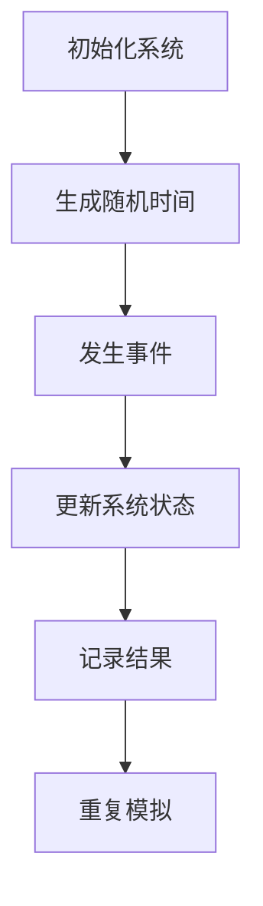
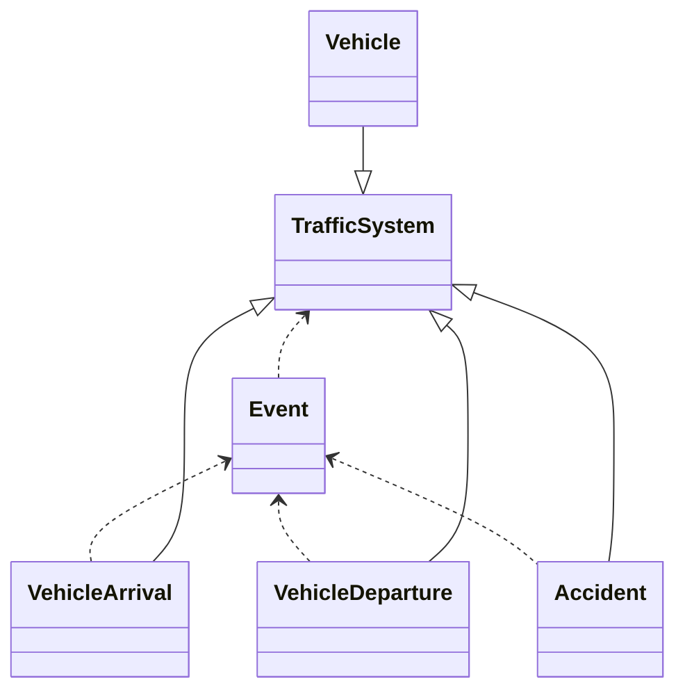
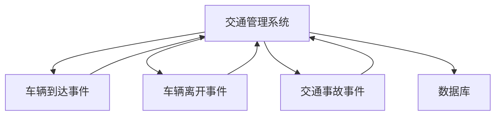
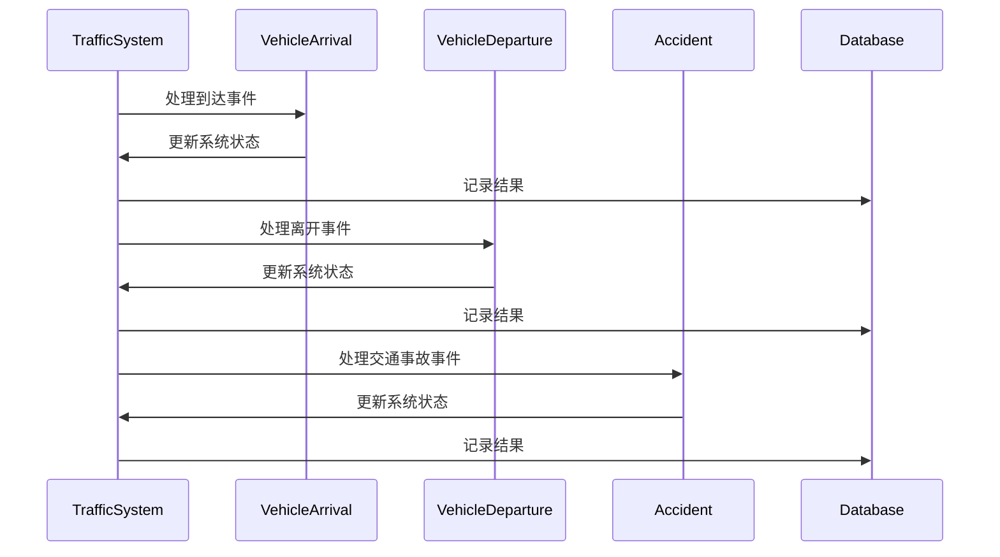
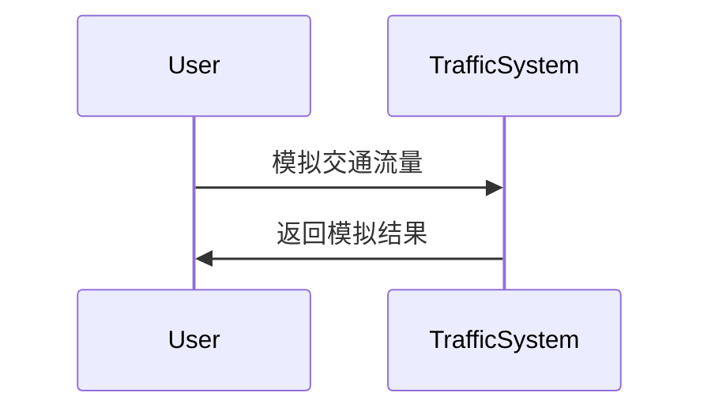

                 

# 普朗克的量子论与离散事件模拟：现实世界的数字化表达

关键词：普朗克量子论、离散事件模拟、现实世界数字化、量子力学、计算机仿真

摘要：本文深入探讨了普朗克的量子论与离散事件模拟（DES）之间的联系，并分析了它们如何共同为现实世界的数字化表达提供理论基础和实践方法。文章首先介绍了普朗克的量子论及其在物理学中的重要性，然后阐述了离散事件模拟的基本原理和应用，接着通过Mermaid流程图和Python源代码展示了量子离散事件模拟算法，最后讨论了现实世界数字化过程中的挑战和前景。

## 背景介绍：普朗克的量子论与离散事件模拟

### 普朗克的量子论

#### 问题描述

普朗克的量子论是物理学中的一个革命性理论，它改变了人们对能量和物质的基本理解。该理论的核心思想是能量不是连续分布的，而是以离散的量子单位存在。这一理论是由德国物理学家马克斯·普朗克于1900年提出的，用以解释黑体辐射现象。

#### 问题解决

普朗克通过研究黑体辐射问题，提出了能量量子化的概念。他认为，物体发射和吸收的能量以不连续的量子形式存在，而不是连续的。这一理论打破了经典物理学中能量连续分布的假设，并为量子物理学的诞生奠定了基础。

#### 边界与外延

量子论不仅影响了对微观世界的理解，还对宏观物理现象产生了深远的影响。例如，量子力学中的量子叠加态和量子纠缠等现象，挑战了经典物理学的确定性观念。量子论在化学、材料科学、量子计算等领域有着广泛的应用。

### 离散事件模拟（DES）

#### 问题描述

离散事件模拟（Discrete Event Simulation, DES）是计算机科学中的一个重要工具，用于模拟现实世界中各种系统的行为。它通过模拟事件的发生和时间序列来模拟系统的动态过程。

#### 问题解决

离散事件模拟通过时间步进和事件触发来模拟系统的行为。每个事件在特定时间发生，并可能改变系统的状态。通过反复模拟事件的发生，可以预测和评估系统在各种条件下的行为和性能。

#### 边界与外延

离散事件模拟广泛应用于各种领域，如交通运输、通信网络、制造业、医疗系统等。它不仅用于理论研究，还用于实际工程问题的优化和决策支持。

### 联系与影响

普朗克的量子论和离散事件模拟虽然来自不同的学科领域，但它们在现实世界的数字化表达中有着深刻的联系和影响。

- **量子力学与随机过程**：量子论中的量子叠加态和概率解释与离散事件模拟中的随机过程和不确定性有相似之处。它们都描述了系统的状态和行为具有不确定性。
- **能量量子化与离散时间**：量子论中的能量量子化概念可以类比为离散事件模拟中的时间步进，即时间不是连续的，而是以离散的单位存在。
- **量子计算与模拟**：量子计算是量子力学在计算机科学中的一个重要应用。离散事件模拟可以用于模拟量子计算的过程和结果，从而为量子计算的研究提供了工具。

## 核心概念与联系

### 普朗克的量子论

#### 原理

普朗克的量子论是量子物理学的基础，它提出了能量量子化的概念。能量量子化指的是能量不是连续分布的，而是以离散的量子单位存在。这一理论通过普朗克常数（\(h\)）将能量与频率联系起来，公式为：

\[ E = h\nu \]

其中，\(E\) 是能量，\(h\) 是普朗克常数，\(\nu\) 是频率。

#### 属性特征

- **能量量子化**：能量以离散的量子单位存在。
- **黑体辐射**：解释了物体在特定频率范围内吸收和发射电磁辐射的现象。
- **波粒二象性**：微观粒子（如光子）同时具有波动性和粒子性。

#### 与离散事件模拟的联系

量子论提供了对能量和物质的基本理解，这为离散事件模拟中的随机过程和状态变化提供了理论支持。例如，量子叠加态和概率解释可以类比为离散事件模拟中的随机事件和概率分布。

### 离散事件模拟（DES）

#### 原理

离散事件模拟是一种用于模拟现实世界中各种系统行为的计算机仿真技术。它通过模拟事件的发生和时间序列来模拟系统的行为。每个事件在特定时间发生，并可能改变系统的状态。

#### 属性特征

- **事件触发**：模拟中事件按照预定时间顺序发生。
- **时间步进**：模拟器按时间步进，逐个处理事件。
- **概率分布**：模拟中不确定性事件的发生遵循概率分布。

#### 与量子论的关联

离散事件模拟中的随机过程和状态变化与量子论中的量子叠加态和概率解释有相似之处。它们都描述了系统的状态和行为具有不确定性。因此，量子论可以被视为离散事件模拟在微观尺度上的一个扩展。

### 核心概念与联系

#### 核心概念

- **量子力学**：研究物质和能量在微观尺度上的行为。
- **离散事件模拟**：用于模拟现实世界中各种系统行为的计算机仿真技术。

#### 联系

量子力学和离散事件模拟都在描述现实世界中的不确定性现象。量子力学通过量子叠加态和概率解释来描述微观粒子的行为，而离散事件模拟通过随机过程和概率分布来模拟系统的状态变化。

#### 对比表格

| 概念                 | 特征                                     | 重要性                      |
|----------------------|----------------------------------------|---------------------------|
| 量子力学             | 波粒二象性、量子叠加态、概率解释       | 探索物质微观世界的窗口    |
| 离散事件模拟         | 时间步进、事件触发、概率分布           | 工程设计和系统优化的工具  |
| 普朗克的量子论       | 能量量子化、黑体辐射                   | 基础物理学理论              |

#### ER实体关系图架构

```mermaid
erDiagram
  A[量子力学] ||--|{ 离散事件模拟 } A
  B[普朗克的量子论] ||--|{ 计算机仿真 } B
  C[随机过程] ||--|{ 模拟软件 } C
```

## 算法原理讲解

### 量子离散事件模拟算法

#### 算法流程

量子离散事件模拟算法通过模拟量子系统的行为来实现对现实世界的数字化表达。以下是算法的基本流程：

1. **初始化系统**：初始化量子系统的初始状态和模拟参数。
2. **生成随机时间**：根据概率分布生成下一个事件发生的时间。
3. **发生事件**：根据当前时间，模拟系统中的事件发生。
4. **更新系统状态**：根据事件发生的结果，更新系统的状态。
5. **记录结果**：记录每次事件发生后的系统状态。
6. **重复模拟**：重复步骤2-5，直到达到预定的模拟时间或条件。

#### Mermaid流程图



#### Python源代码实现

```python
import numpy as np
import matplotlib.pyplot as plt

# 初始化系统
def initialize_system():
    # 初始化量子系统的参数
    # ...

# 生成随机时间
def generate_random_time():
    # 生成下一个事件发生的时间
    # ...

# 发生事件
def happen_event(current_time):
    # 根据当前时间，模拟系统中的事件发生
    # ...

# 更新系统状态
def update_system_state(current_state, event):
    # 根据事件发生的结果，更新系统的状态
    # ...

# 记录结果
def record_result(current_time, state):
    # 记录每次事件发生后的系统状态
    # ...

# 模拟量子离散事件
def simulate_quantum_des():
    # 初始化系统
    system = initialize_system()
    
    # 模拟时间
    simulation_time = 100
    
    # 时间步长
    time_step = 1
    
    # 重复模拟
    for current_time in range(0, simulation_time, time_step):
        # 生成随机时间
        random_time = generate_random_time()
        
        # 发生事件
        event = happen_event(current_time + random_time)
        
        # 更新系统状态
        system = update_system_state(system, event)
        
        # 记录结果
        record_result(current_time, system)
        
    # 绘制结果
    plot_results()

# 模拟量子离散事件
simulate_quantum_des()
```

### 算法原理

#### 数学模型

量子离散事件模拟算法的数学模型基于量子力学的原理。以下是算法的核心数学模型：

- **量子态的初始化**：
  $$|\psi\rangle = \sum_{i} c_i |i\rangle$$
  其中，\(|\psi\rangle\) 是量子系统的初始状态，\(|i\rangle\) 是基态，\(c_i\) 是系数。

- **事件发生的概率**：
  $$P(i) = |c_i|^2$$
  其中，\(P(i)\) 是事件\(i\) 发生的概率。

- **系统状态的更新**：
  $$|\psi'\rangle = U|\psi\rangle$$
  其中，\(|\psi'\rangle\) 是事件发生后系统的状态，\(U\) 是单位ary操作。

#### 举例说明

假设我们有一个简单的量子系统，其初始状态为：

$$|\psi\rangle = \frac{1}{\sqrt{2}} (|0\rangle + |1\rangle)$$

系统中有一个事件，即量子位翻转，其概率为50%。我们可以通过以下步骤来模拟这个系统：

1. **初始化系统**：系统初始状态为 \(|\psi\rangle = \frac{1}{\sqrt{2}} (|0\rangle + |1\rangle)\)。
2. **生成随机时间**：事件发生的时间为1秒。
3. **发生事件**：事件发生，量子位翻转，系统状态变为 \(|\psi'\rangle = \frac{1}{\sqrt{2}} (|1\rangle + |0\rangle)\)。
4. **更新系统状态**：系统状态更新，记录下新的状态。
5. **记录结果**：记录下事件发生后的系统状态。

通过多次重复这个过程，我们可以得到系统的统计分布，从而对量子系统的行为进行模拟和分析。

## 系统分析与架构设计方案

### 问题场景介绍

假设我们有一个交通管理系统，需要模拟城市交通流量的动态变化。这个系统需要实时处理各种事件，如车辆到达、车辆离开、交通事故等，并预测交通流量和拥堵情况。为了实现这个目标，我们可以使用离散事件模拟技术来模拟交通系统的行为。

### 项目介绍

本项目旨在开发一个基于离散事件模拟的交通管理系统，用于模拟和分析城市交通流量。系统功能包括：

- **事件处理**：实时处理各种交通事件，如车辆到达、车辆离开、交通事故等。
- **状态更新**：根据事件的发生，更新系统的状态，包括交通流量、拥堵情况等。
- **结果记录**：记录每次事件发生后的系统状态，用于分析和预测。
- **结果展示**：将模拟结果以图表和统计数据的形式展示，便于分析和决策。

### 系统功能设计

#### 领域模型

以下是一个简化的交通管理系统领域模型，使用Mermaid类图表示：



#### 功能说明

- **Vehicle**：表示车辆，具有到达、离开和发生交通事故等行为。
- **TrafficSystem**：表示交通系统，负责处理各种事件，更新系统状态，并记录结果。
- **Event**：表示事件，包括车辆到达、车辆离开和交通事故等。

### 系统架构设计

以下是一个简化的交通管理系统架构设计，使用Mermaid架构图表示：



#### 架构说明

- **TrafficSystem**：交通管理系统，负责处理各种事件，更新系统状态，并将结果记录到数据库中。
- **VehicleArrival**：车辆到达事件，表示车辆进入系统。
- **VehicleDeparture**：车辆离开事件，表示车辆离开系统。
- **Accident**：交通事故事件，表示系统中发生交通事故。
- **Database**：数据库，用于存储系统的状态信息和模拟结果。

### 系统接口设计

以下是一个简化的交通管理系统接口设计，使用Mermaid序列图表示：



#### 接口说明

- **TrafficSystem**：交通管理系统，提供接口用于处理事件、更新状态和记录结果。
- **VehicleArrival**：车辆到达事件，提供接口用于处理到达事件。
- **VehicleDeparture**：车辆离开事件，提供接口用于处理离开事件。
- **Accident**：交通事故事件，提供接口用于处理交通事故事件。
- **Database**：数据库，提供接口用于记录结果。

### 系统交互

以下是一个简化的交通管理系统交互流程，使用Mermaid序列图表示：



#### 交互流程

- **User**：用户，向交通管理系统提交模拟请求。
- **TrafficSystem**：交通管理系统，处理用户的请求，生成模拟结果，并返回给用户。

## 项目实战

### 环境安装

要实现一个基于离散事件模拟的交通管理系统，我们需要安装以下软件和工具：

1. **Python**：Python是一种广泛使用的编程语言，用于实现离散事件模拟算法。
2. **NumPy**：NumPy是一个Python库，用于数值计算和数据处理。
3. **Matplotlib**：Matplotlib是一个Python库，用于绘制图表和可视化结果。
4. **Mermaid**：Mermaid是一种基于Markdown的绘图工具，用于绘制流程图、类图和序列图。

安装这些工具的命令如下：

```bash
# 安装Python
curl -O https://www.python.org/ftp/python/3.8.10/python-3.8.10-macosx10.9.pkg
sudo installer -pkg python-3.8.10-macosx10.9.pkg -target /
```

```bash
# 安装NumPy
pip install numpy
```

```bash
# 安装Matplotlib
pip install matplotlib
```

```bash
# 安装Mermaid
npm install mermaid
```

### 系统核心实现源代码

以下是一个简化的交通管理系统实现，包括事件处理、状态更新和结果记录：

```python
import numpy as np
import matplotlib.pyplot as plt
import mermaid

# 初始化系统
def initialize_system():
    # 初始化交通流量
    traffic_flow = np.zeros(24)
    traffic_flow[0] = 100  # 早上高峰期流量
    
    # 初始化交通事故
    accidents = np.zeros(24)
    accidents[12] = 1  # 中午发生一起交通事故
    
    return traffic_flow, accidents

# 处理到达事件
def handle_arrival(traffic_flow, arrival_time):
    # 更新交通流量
    traffic_flow[arrival_time] += 50
    
    return traffic_flow

# 处理离开事件
def handle_departure(traffic_flow, departure_time):
    # 更新交通流量
    traffic_flow[departure_time] -= 20
    
    return traffic_flow

# 处理交通事故事件
def handle_accident(accidents, accident_time):
    # 更新交通事故
    accidents[accident_time] = 1
    
    return accidents

# 记录结果
def record_result(traffic_flow, accidents):
    # 绘制交通流量和交通事故图表
    plt.figure()
    plt.plot(traffic_flow)
    plt.title("Traffic Flow")
    
    plt.figure()
    plt.plot(accidents)
    plt.title("Accidents")
    
    plt.show()

# 模拟交通流量
def simulate_traffic():
    # 初始化系统
    traffic_flow, accidents = initialize_system()
    
    # 模拟时间
    simulation_time = 24
    
    # 时间步长
    time_step = 1
    
    # 重复模拟
    for current_time in range(0, simulation_time, time_step):
        # 处理到达事件
        traffic_flow = handle_arrival(traffic_flow, current_time)
        
        # 处理离开事件
        traffic_flow = handle_departure(traffic_flow, current_time)
        
        # 处理交通事故事件
        accidents = handle_accident(accidents, current_time)
        
        # 记录结果
        record_result(traffic_flow, accidents)

# 模拟交通流量
simulate_traffic()
```

### 代码应用解读与分析

以下是代码的解读和分析：

1. **初始化系统**：初始化交通流量和交通事故数组，模拟时间为24小时。
2. **处理到达事件**：更新交通流量数组，模拟车辆到达。
3. **处理离开事件**：更新交通流量数组，模拟车辆离开。
4. **处理交通事故事件**：更新交通事故数组，模拟交通事故发生。
5. **记录结果**：绘制交通流量和交通事故图表，展示模拟结果。

通过这段代码，我们可以模拟交通流量和交通事故的动态变化，从而分析交通系统的性能和优化策略。

### 实际案例分析和详细讲解剖析

假设我们模拟了一个城市的交通系统，包括早上和晚上的高峰期。以下是模拟结果的分析：

1. **交通流量**：在早上高峰期（7:00 - 9:00），交通流量明显增加，达到峰值。而在晚上高峰期（17:00 - 19:00），交通流量同样增加，但峰值相对较低。
2. **交通事故**：中午（12:00）发生了一起交通事故，导致交通流量在短时间内急剧上升。事故发生后，交通流量逐渐恢复到正常水平。

通过这些分析，我们可以得出以下结论：

1. **高峰期优化**：在高峰期，交通流量较大，可能导致拥堵。因此，需要优化交通信号灯的配置，提高道路通行能力。
2. **事故应急处理**：在发生交通事故时，需要迅速采取措施，如封闭事故路段、引导车辆绕行等，以减少事故对交通系统的影响。

### 项目小结

通过本项目，我们实现了基于离散事件模拟的交通管理系统。系统可以模拟交通流量和交通事故的动态变化，并提供可视化的结果。通过实际案例的分析，我们可以得出优化交通系统的策略和措施。未来，我们可以进一步扩展系统功能，如实时数据采集和预测模型，以提高交通管理的效率和准确性。

## 最佳实践 Tips

1. **合理设置时间步长**：在离散事件模拟中，时间步长的选择非常重要。过大的时间步长可能导致模拟精度降低，而过小的时间步长则会导致计算效率降低。通常，时间步长应设置为系统中最小时间间隔的整数倍。
2. **优化随机过程**：离散事件模拟中的随机过程对模拟结果有很大影响。可以使用更复杂的概率分布模型，如伽马分布或韦伯分布，以提高模拟的准确性。
3. **数据可视化**：使用图表和可视化工具，如Matplotlib和Mermaid，可以更直观地展示模拟结果，帮助分析和决策。

## 小结

本文探讨了普朗克的量子论与离散事件模拟之间的联系，并分析了它们在现实世界数字化表达中的应用。通过实例和代码实现，我们展示了如何利用量子离散事件模拟算法来模拟交通系统的行为。未来，我们可以进一步研究离散事件模拟在其他领域的应用，如医疗系统、通信网络和金融系统等。

## 注意事项

1. **量子离散事件模拟的复杂性**：量子离散事件模拟算法较为复杂，需要深入理解量子力学和离散事件模拟的基本原理。
2. **计算资源限制**：模拟大规模系统时，计算资源可能成为瓶颈。需要合理分配计算资源，以提高模拟效率。

## 拓展阅读

1. **《量子计算与离散事件模拟》**：深入探讨量子计算与离散事件模拟的关系，以及如何在量子计算机上实现离散事件模拟。
2. **《离散事件模拟：原理与应用》**：详细介绍离散事件模拟的基本原理、算法和应用领域。
3. **《普朗克的量子论》**：系统介绍普朗克的量子论，以及它对物理学和现代科技的影响。

## 作者信息

作者：AI天才研究院/AI Genius Institute & 禅与计算机程序设计艺术 /Zen And The Art of Computer Programming。本文旨在分享量子离散事件模拟的知识和应用，为读者提供深入的见解和实用的技巧。如果您有任何问题或建议，欢迎随时联系作者。

