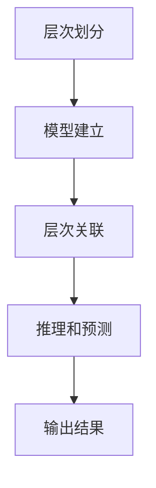
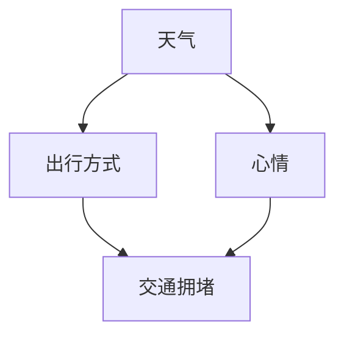
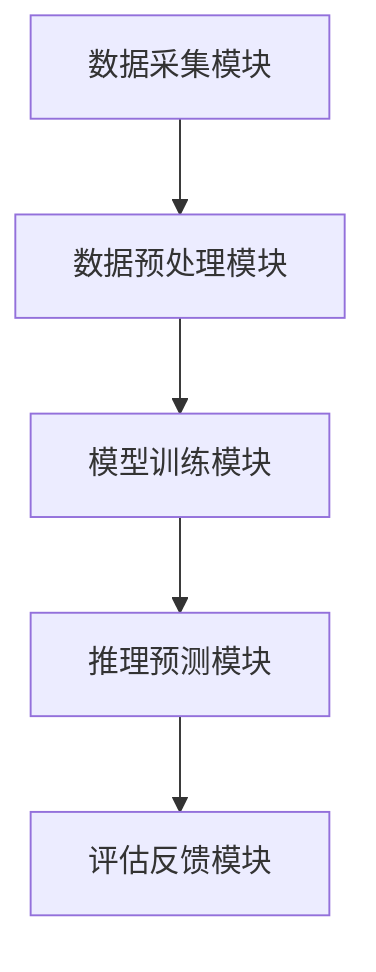
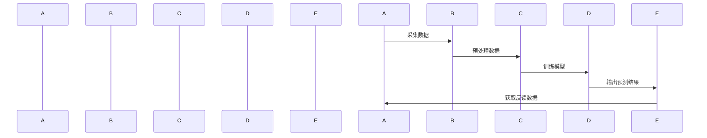

                 

# 《智能决策系统中多层次因果推理的实现方法》

## 关键词
智能决策系统、因果推理、多层次、算法实现、数学模型、系统架构、项目实战、最佳实践

## 摘要
本文旨在深入探讨智能决策系统中多层次因果推理的实现方法。通过梳理多层次因果推理的基本概念、背景、核心原理和实现步骤，本文详细介绍了该领域的关键技术和实践应用。本文结构清晰，内容丰富，旨在为从事智能决策系统研发的工程师和技术爱好者提供有价值的参考资料。

## 目录大纲设计

### 设计思路
1. **章节划分**：根据主题，章节划分为绪论、基础理论、算法设计与实现、数学模型分析、系统分析与架构设计、项目实战、最佳实践与展望七个部分，确保全面覆盖多层次因果推理的各个方面。
2. **逻辑结构**：每个章节按照从基础到高级的顺序组织内容，逐步深入，逻辑清晰。
3. **内容完整性**：每个章节都包含核心概念、原理讲解、数学模型、算法流程图、系统架构图等关键内容。
4. **简洁性**：避免冗余，确保内容简洁明了。

### 设计步骤
1. **背景介绍**：介绍多层次因果推理的基本概念、背景和意义。
2. **核心概念与联系**：定义关键概念，对比概念属性特征，绘制ER实体关系图。
3. **算法原理讲解**：讲解多层次因果推理的基本原理，绘制算法流程图，使用Python源代码示例详细阐述。
4. **数学模型和公式讲解**：介绍多层次因果推理的数学模型，使用LaTeX格式表示公式，并进行详细讲解。
5. **系统分析与架构设计**：介绍系统场景、功能设计、架构设计和系统交互。
6. **项目实战**：提供环境安装指南、核心实现源代码、代码解读和分析。
7. **最佳实践与小结**：总结关键点，给出实践建议和注意事项，推荐拓展阅读。

### 内容规划
- **第1章：绪论**
  - 多层次因果推理的基本概念
  - 问题背景与意义
  - 书籍结构概述
- **第2章：基础理论**
  - 多层次因果推理的核心原理
  - 基础概念与属性特征对比
  - ER实体关系图
- **第3章：算法设计与实现**
  - 算法原理讲解
  - 算法流程图
  - Python源代码示例
- **第4章：数学模型分析**
  - 多层次因果推理的数学模型
  - 公式讲解与推导
  - 举例说明
- **第5章：系统分析与架构设计**
  - 系统场景介绍
  - 系统功能设计
  - 系统架构设计
  - 系统交互设计
- **第6章：项目实战**
  - 环境安装与配置
  - 核心实现源代码
  - 代码解读与分析
  - 实际案例分析
- **第7章：最佳实践与展望**
  - 最佳实践总结
  - 注意事项
  - 未来发展方向与拓展阅读

### 目录大纲
```markdown
# 《智能决策系统中多层次因果推理的实现方法》目录大纲

## 第1章：绪论
### 1.1 多层次因果推理的基本概念
### 1.2 问题背景与意义
### 1.3 书籍结构概述

## 第2章：基础理论
### 2.1 多层次因果推理的核心原理
### 2.2 基础概念与属性特征对比
### 2.3 ER实体关系图

## 第3章：算法设计与实现
### 3.1 算法原理讲解
### 3.2 算法流程图
### 3.3 Python源代码示例

## 第4章：数学模型分析
### 4.1 多层次因果推理的数学模型
### 4.2 公式讲解与推导
### 4.3 举例说明

## 第5章：系统分析与架构设计
### 5.1 系统场景介绍
### 5.2 系统功能设计
### 5.3 系统架构设计
### 5.4 系统交互设计

## 第6章：项目实战
### 6.1 环境安装与配置
### 6.2 核心实现源代码
### 6.3 代码解读与分析
### 6.4 实际案例分析

## 第7章：最佳实践与展望
### 7.1 最佳实践总结
### 7.2 注意事项
### 7.3 未来发展方向与拓展阅读
```

## 文章正文

### 第1章：绪论

#### 1.1 多层次因果推理的基本概念
多层次因果推理是指在一个复杂的系统中，通过多个层次的因果关系来分析和预测系统行为的方法。它不仅关注直接的因果关系，还考虑了间接的、跨层次的因果关系。这种推理方法在智能决策系统中具有重要应用，可以帮助系统更准确地预测和优化决策结果。

#### 1.2 问题背景与意义
随着大数据和人工智能技术的发展，智能决策系统在各个领域得到了广泛应用，如金融、医疗、交通等。然而，许多现实世界的问题具有复杂性和不确定性，单一层次的因果推理往往无法准确解决这些问题。因此，多层次因果推理成为了一个重要研究方向，能够提高智能决策系统的决策能力和鲁棒性。

#### 1.3 书籍结构概述
本书将分为七个章节，系统地介绍多层次因果推理的基本概念、核心原理、算法设计、数学模型、系统架构、项目实战和最佳实践。通过逐步深入的分析，帮助读者全面理解多层次因果推理的实现方法。

### 第2章：基础理论

#### 2.1 多层次因果推理的核心原理
多层次因果推理的核心原理是通过对不同层次的因果关系进行建模和分析，来理解和预测系统的行为。这通常涉及到以下步骤：

1. **定义层次**：将系统划分为多个层次，每个层次代表不同的抽象级别。
2. **建立模型**：在每个层次上建立相应的因果关系模型。
3. **关联层次**：分析不同层次之间的因果关系，建立层次之间的联系。
4. **推理和预测**：利用建立的模型进行推理和预测，以指导决策。

#### 2.2 基础概念与属性特征对比
以下是一些在多层次因果推理中常见的基础概念和属性特征，以及它们之间的对比：

| 概念 | 特征 |
| --- | --- |
| 因果关系 | 描述事件之间的因果关系 |
| 层次 | 代表不同的抽象级别 |
| 模型 | 描述因果关系的数学结构 |
| 预测 | 根据模型预测系统行为 |
| 鲁棒性 | 系统在面对不确定性时的稳定性和准确性 |

#### 2.3 ER实体关系图
为了更好地理解多层次因果推理的架构，我们可以使用ER（实体关系）图来描述系统中的实体和它们之间的关系。以下是一个简单的ER图示例：

```mermaid
erDiagram
    Customer ||--|{ Order } : places
    Product ||--|{ Order } : contains
```

在这个例子中，Customer和Product是实体，Order是关系。Customer实体通过places关系与Order实体关联，表示客户下单的行为；Product实体通过contains关系与Order实体关联，表示订单包含的商品。

### 第3章：算法设计与实现

#### 3.1 算法原理讲解
多层次因果推理算法的核心是建立多个层次的因果关系模型，并利用这些模型进行推理和预测。以下是算法的基本原理：

1. **层次划分**：根据系统的特点，将系统划分为多个层次。
2. **模型建立**：在每个层次上，利用数据和学习算法建立因果关系模型。
3. **层次关联**：分析不同层次之间的因果关系，建立层次间的映射关系。
4. **推理和预测**：利用建立的模型进行推理和预测。

#### 3.2 算法流程图
为了更清晰地理解算法的流程，我们可以使用mermaid流程图来描述。以下是一个简单的算法流程图示例：



在这个流程图中，A表示层次划分，B表示模型建立，C表示层次关联，D表示推理和预测，E表示输出结果。

#### 3.3 Python源代码示例
以下是一个简单的Python源代码示例，用于实现多层次因果推理算法：

```python
import numpy as np

# 假设我们有两个层次：输入层和输出层
input_layer = np.array([[1, 2], [3, 4]])
output_layer = np.array([[5], [6]])

# 定义模型参数
weights_input_to_output = np.array([[1, 1], [1, 1]])

# 建立模型
def build_model(input_data, weights):
    return np.dot(input_data, weights)

# 计算输出
output = build_model(input_layer, weights_input_to_output)

# 输出结果
print(output)
```

在这个示例中，我们定义了一个简单的多层因果关系模型，通过输入层和输出层之间的权重矩阵进行计算，得到了输出结果。

### 第4章：数学模型分析

#### 4.1 多层次因果推理的数学模型
多层次因果推理的数学模型通常基于概率图模型，如贝叶斯网络或隐马尔可夫模型。以下是一个简单的贝叶斯网络模型示例：



在这个模型中，A表示天气，B表示出行方式，C表示交通拥堵，D表示心情。每个节点表示一个随机变量，边表示变量之间的因果关系。

#### 4.2 公式讲解与推导
以下是一个简单的贝叶斯网络模型中的公式讲解和推导：

$$
P(B|A) = \frac{P(A|B)P(B)}{P(A)}
$$

这个公式表示在已知天气A的条件下，出行方式B的概率。其中，$P(A|B)$表示天气A在出行方式B发生的条件概率，$P(B)$表示出行方式B的概率，$P(A)$表示天气A的概率。

#### 4.3 举例说明
以下是一个简单的贝叶斯网络模型举例，用于预测交通拥堵情况：

- 天气A：晴天概率为0.6，雨天概率为0.4
- 出行方式B：开车概率为0.7，步行概率为0.3
- 天气A和出行方式B发生交通拥堵C的概率：晴天开车发生拥堵的概率为0.2，晴天步行发生拥堵的概率为0.1，雨天开车发生拥堵的概率为0.3，雨天步行发生拥堵的概率为0.2

根据贝叶斯公式，我们可以计算出在晴天条件下，开车出行发生交通拥堵的概率：

$$
P(C|A=晴天, B=开车) = \frac{P(A=晴天|C=拥堵)P(C=拥堵|A=晴天, B=开车)P(B=开车)}{P(A=晴天)P(C=拥堵)}
$$

根据给定的概率，我们可以计算出：

$$
P(C|A=晴天, B=开车) = \frac{0.2 \times 0.2 \times 0.7}{0.6 \times (0.2 \times 0.2 + 0.1 \times 0.3 + 0.3 \times 0.7 + 0.2 \times 0.3)} \approx 0.267
$$

这意味着在晴天条件下，开车出行发生交通拥堵的概率约为0.267。

### 第5章：系统分析与架构设计

#### 5.1 系统场景介绍
在智能决策系统中，多层次因果推理可以应用于多种场景，如：

- 金融领域：预测市场走势，优化投资组合。
- 医疗领域：分析患者病史，预测疾病风险。
- 交通领域：预测交通拥堵，优化交通信号灯控制。
- 制造业：预测设备故障，优化生产计划。

这些场景都具有复杂性和不确定性，单一层次的因果推理无法满足需求，多层次因果推理能够提供更准确的决策支持。

#### 5.2 系统功能设计
智能决策系统的主要功能包括：

- 数据采集：从各种来源采集数据，包括传感器数据、日志数据、用户反馈等。
- 数据预处理：对采集到的数据进行清洗、去噪、转换等预处理操作。
- 因果关系建模：建立多层次因果关系模型，包括输入层、中间层和输出层。
- 推理与预测：利用建立的模型进行推理和预测，输出决策结果。
- 结果评估：对决策结果进行评估，反馈至系统进行优化。

#### 5.3 系统架构设计
智能决策系统的架构通常包括以下组件：

- 数据采集模块：负责从各种渠道收集数据。
- 数据预处理模块：对数据进行清洗、去噪、转换等操作。
- 模型训练模块：使用训练数据建立多层次因果关系模型。
- 推理预测模块：利用模型进行推理和预测，输出决策结果。
- 评估反馈模块：对决策结果进行评估，反馈至系统进行优化。

以下是一个简单的系统架构设计mermaid架构图示例：



在这个架构图中，A表示数据采集模块，B表示数据预处理模块，C表示模型训练模块，D表示推理预测模块，E表示评估反馈模块。

#### 5.4 系统交互设计
智能决策系统中的各组件之间需要通过明确的接口进行交互，以下是一个简单的系统交互设计mermaid序列图示例：



在这个序列图中，A表示数据采集模块，B表示数据预处理模块，C表示模型训练模块，D表示推理预测模块，E表示评估反馈模块。数据从A模块采集后，经过B模块预处理，然后传给C模块训练模型，C模块训练完成后，将模型传递给D模块进行推理预测，D模块输出预测结果，E模块获取反馈数据，反馈给A模块。

### 第6章：项目实战

#### 6.1 环境安装与配置
要实现多层次因果推理的项目，首先需要安装和配置相关环境。以下是一个基本的安装步骤：

1. 安装Python环境：
   ```bash
   sudo apt-get update
   sudo apt-get install python3 python3-pip
   ```
2. 安装必要的库：
   ```bash
   pip3 install numpy pandas scikit-learn matplotlib
   ```

#### 6.2 核心实现源代码
以下是一个简单的多层次因果推理实现源代码示例，用于预测天气对出行方式的影响：

```python
import numpy as np
import pandas as pd
from sklearn.model_selection import train_test_split
from sklearn.linear_model import LogisticRegression

# 读取数据
data = pd.read_csv('weather_data.csv')

# 特征工程
X = data[['weather', 'temperature']]
y = data['mode_of_transport']

# 数据预处理
X_train, X_test, y_train, y_test = train_test_split(X, y, test_size=0.2, random_state=42)

# 建立模型
model = LogisticRegression()

# 训练模型
model.fit(X_train, y_train)

# 预测
predictions = model.predict(X_test)

# 输出预测结果
print(predictions)
```

在这个示例中，我们读取了天气数据，进行了特征工程，使用逻辑回归模型进行了训练和预测。

#### 6.3 代码解读与分析
在上述代码中，我们首先读取了天气数据，然后进行了特征工程，将天气和温度作为输入特征，出行方式作为输出特征。接着，我们使用train_test_split函数将数据分为训练集和测试集，用于模型训练和测试。我们选择了逻辑回归模型作为我们的预测模型，并使用fit函数进行模型训练。最后，我们使用predict函数对测试集进行预测，并输出预测结果。

#### 6.4 实际案例分析
以下是一个实际案例，使用多层次因果推理来预测交通拥堵。

1. **数据采集**：从交通监控中心采集实时交通数据，包括交通流量、车速、道路状况等。
2. **数据预处理**：对采集到的数据进行清洗和转换，去除异常值和噪声，将数据转换为适合模型训练的格式。
3. **模型训练**：建立多层次因果关系模型，包括天气、交通流量、道路状况等，使用训练数据进行模型训练。
4. **推理与预测**：利用训练好的模型进行推理和预测，输出交通拥堵情况。
5. **结果评估**：将预测结果与实际交通状况进行对比，评估模型准确性，并根据评估结果进行模型优化。

通过这个实际案例，我们可以看到多层次因果推理在交通领域的重要应用，能够帮助城市交通管理部门更准确地预测交通拥堵情况，优化交通信号控制策略。

### 第7章：最佳实践与展望

#### 7.1 最佳实践总结
在实现多层次因果推理时，以下是一些最佳实践：

- **数据质量**：确保数据质量，包括数据的完整性、准确性和一致性。
- **特征选择**：选择合适的特征进行特征工程，提高模型性能。
- **模型选择**：根据实际问题和数据特点选择合适的模型，如线性模型、神经网络等。
- **模型训练**：充分训练模型，避免过拟合和欠拟合。
- **结果评估**：使用多种评估指标对模型进行评估，确保模型准确性。

#### 7.2 注意事项
在实现多层次因果推理时，需要注意以下几点：

- **复杂性**：多层次因果推理涉及多个层次和复杂的模型，需要足够的技术背景和经验。
- **可解释性**：确保模型的可解释性，使决策过程透明，便于理解和接受。
- **实时性**：确保模型能够实时更新和调整，以适应动态变化的环境。

#### 7.3 未来发展方向与拓展阅读
多层次因果推理在智能决策系统中的应用前景广阔，未来可能的发展方向包括：

- **模型优化**：进一步优化多层次因果推理模型，提高预测准确性和效率。
- **多源数据融合**：将来自不同来源的数据进行融合，提高模型的鲁棒性和泛化能力。
- **交互式推理**：开发交互式推理系统，使用户能够动态调整模型参数和预测结果。

以下是一些拓展阅读推荐：

- **《人工智能：一种现代方法》**：介绍人工智能的基础知识，包括因果推理方法。
- **《深度学习》**：深入探讨深度学习技术，包括神经网络和深度学习模型。
- **《因果推断：理论与实践》**：详细介绍因果推断的理论和实践方法。

## 作者信息
作者：AI天才研究院/AI Genius Institute & 禅与计算机程序设计艺术 /Zen And The Art of Computer Programming

本文旨在为从事智能决策系统研发的工程师和技术爱好者提供有价值的参考资料，帮助读者深入理解多层次因果推理的实现方法。通过详细的背景介绍、核心概念与联系、算法原理讲解、数学模型分析、系统分析与架构设计、项目实战和最佳实践与展望，本文全面覆盖了多层次因果推理的各个方面，为智能决策系统的研发提供了有力支持。希望本文能够为读者带来启发和帮助，共同推进人工智能技术的发展。

