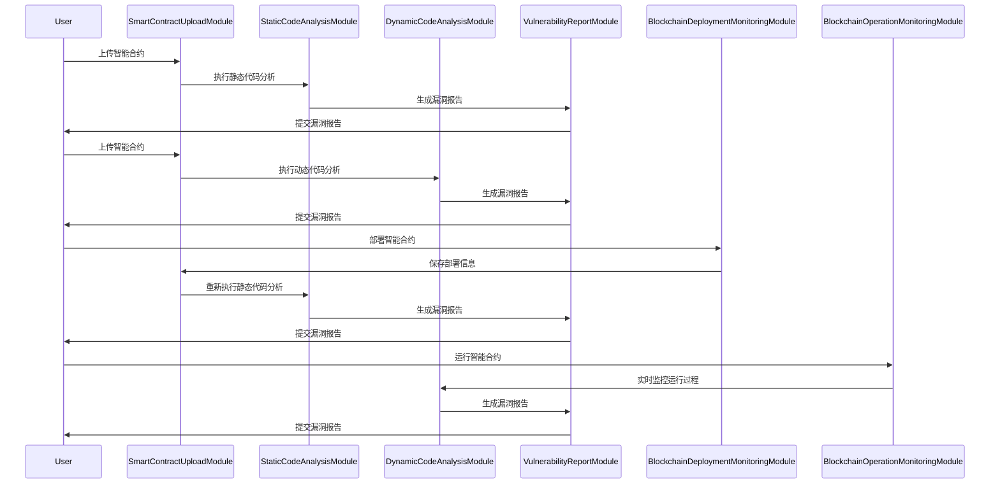
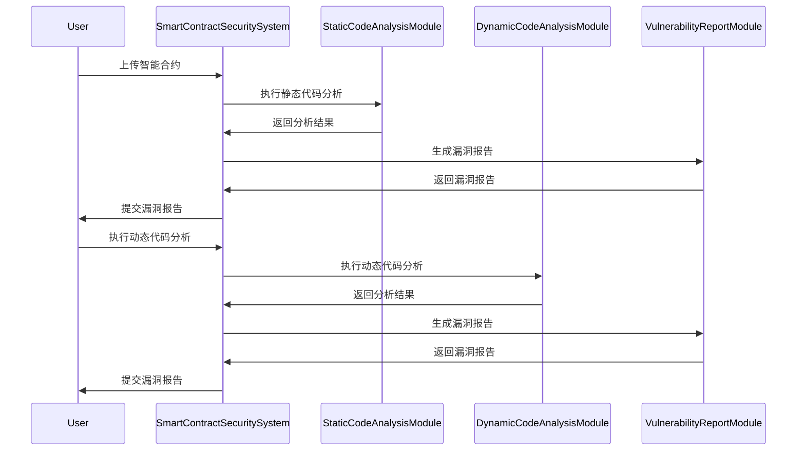

                 

# 智能合约安全: 区块链应用的安全开发实践

## 关键词：智能合约、区块链安全、安全开发实践、漏洞挖掘、算法分析

> 摘要：本文深入探讨了智能合约安全的各个方面，包括背景介绍、核心概念与联系、算法原理讲解、系统分析与架构设计方案以及项目实战。通过逐步分析推理，文章旨在为开发者提供系统化、实用化的智能合约安全开发实践，降低区块链应用中的安全风险。

## 目录大纲

### 第一部分 背景介绍

- 1.1 区块链技术的发展与智能合约的兴起
  - 1.1.1 区块链技术概述
  - 1.1.2 智能合约的定义与特点
  - 1.1.3 智能合约的应用场景
- 1.2 智能合约安全问题的重要性
  - 1.2.1 智能合约安全问题的产生
  - 1.2.2 智能合约安全问题的危害
  - 1.2.3 智能合约安全的重要性
- 1.3 安全开发实践的重要性
  - 1.3.1 安全开发实践概述
  - 1.3.2 安全开发实践的重要性
  - 1.3.3 安全开发实践的重要性
- 1.4 本书结构安排
  - 1.4.1 内容概述
  - 1.4.2 阅读建议
  - 1.4.3 阅读目标群体

### 第二部分 核心概念与联系

- 2.1 核心概念解析
  - 2.1.1 区块链安全
  - 2.1.2 智能合约安全
  - 2.1.3 安全开发实践
- 2.2 概念属性特征对比表格
- 2.3 ER实体关系图架构
  - 2.3.1 区块链生态系统实体关系图
  - 2.3.2 智能合约安全实体关系图

### 第三部分 算法原理讲解

- 3.1 智能合约安全分析算法
  - 3.1.1 智能合约静态分析算法
  - 3.1.2 智能合约动态分析算法
  - 3.1.3 智能合约漏洞挖掘算法
- 3.2 算法数学模型与公式
  - 3.2.1 智能合约静态分析数学模型
  - 3.2.2 智能合约动态分析数学模型
  - 3.2.3 智能合约漏洞挖掘数学模型
- 3.3 算法举例说明
  - 3.3.1 静态分析算法举例
  - 3.3.2 动态分析算法举例
  - 3.3.3 漏洞挖掘算法举例

### 第四部分 系统分析与架构设计方案

- 4.1 问题场景介绍
- 4.2 系统功能设计
  - 4.2.1 领域模型类图
  - 4.2.2 智能合约安全管理功能
- 4.3 系统架构设计
  - 4.3.1 系统架构图
  - 4.3.2 智能合约安全模块设计
- 4.4 系统接口设计与交互
  - 4.4.1 系统接口设计
  - 4.4.2 系统交互序列图

### 第五部分 项目实战

- 5.1 环境安装
  - 5.1.1 开发环境搭建
  - 5.1.2 智能合约安全工具安装
- 5.2 系统核心实现
  - 5.2.1 源代码分析
  - 5.2.2 代码应用解读与分析
  - 5.2.3 实际案例分析与详细讲解剖析
- 5.3 项目小结

### 最佳实践 tips、小结、注意事项、拓展阅读等内容

---

### 第一部分 背景介绍

## 1.1 区块链技术的发展与智能合约的兴起

### 1.1.1 区块链技术概述

区块链技术，作为一种分布式数据库技术，具有去中心化、不可篡改、可追溯等特性。它通过加密算法确保数据的安全性和完整性，并通过网络节点之间的共识机制达成对数据的共识。

区块链技术的基本原理包括：

1. **数据结构**：区块链由一系列按时间顺序排列的数据区块组成，每个区块包含一定数量交易记录，并通过哈希函数与前一个区块链接。
2. **共识机制**：区块链网络中的节点通过共识机制达成对数据的共识，确保数据的准确性和一致性。
3. **加密算法**：区块链采用非对称加密算法，保证数据的隐私性和安全性。

区块链技术的核心优势包括：

1. **去中心化**：去中心化意味着不存在中心化的机构或个体控制整个网络，从而提高了系统的可靠性和抗攻击能力。
2. **不可篡改**：一旦数据被写入区块链，将难以被篡改，保证了数据的真实性和可靠性。
3. **可追溯**：区块链上的每笔交易都有记录，可以追溯到其原始来源，提高了透明度和审计能力。

区块链技术的发展历程：

- 2008年，中本聪（Satoshi Nakamoto）发表了比特币白皮书，提出了区块链的概念。
- 2009年，比特币网络正式运行，标志着区块链技术的首次实际应用。
- 2010年至今，区块链技术逐步从金融领域扩展到其他领域，如供应链管理、物联网、医疗健康等。

### 1.1.2 智能合约的定义与特点

智能合约，是一种运行在区块链上的计算机程序，用于自动执行、控制或记录符合特定条件的交易或动作。它通过代码实现了合约条款的自动化执行，从而减少了人为干预，提高了交易效率和透明度。

智能合约的特点包括：

1. **自动化执行**：智能合约代码一旦被部署到区块链上，将按照预定的逻辑自动执行，无需人工干预。
2. **不可篡改**：智能合约的代码和状态一旦被写入区块链，将难以被篡改，保证了数据的可靠性和安全性。
3. **去中心化**：智能合约运行在区块链上，由网络中的所有节点共同维护，去除了对中心化机构的依赖。

智能合约与区块链的关系：

- 智能合约是区块链技术的重要组成部分，用于实现去中心化的自动化交易。
- 区块链为智能合约提供了运行环境，确保了智能合约的执行和数据的存储。

### 1.1.3 智能合约的应用场景

智能合约在区块链应用中具有广泛的应用场景，主要包括：

1. **货币交易**：智能合约可用于实现去中心化的货币交易，如比特币交易。
2. **数字资产交易**：智能合约可自动化执行数字资产的买卖和转移，如ERC-20代币的发行和交易。
3. **去中心化金融（DeFi）**：智能合约是实现去中心化金融应用的核心，如去中心化交易所（DEX）、借贷平台、稳定币等。
4. **供应链管理**：智能合约可用于确保供应链的透明度和可追溯性，如追踪商品来源和运输状态。
5. **智能财产管理**：智能合约可用于自动化执行财产的转移和管理，如智能财产信托和租赁。

### 1.2 智能合约安全问题的重要性

#### 1.2.1 智能合约安全问题的产生

智能合约安全问题主要来源于以下几个方面：

1. **编程错误**：智能合约代码的复杂性使得开发者容易在编写过程中引入错误，如逻辑漏洞、类型错误等。
2. **恶意攻击**：攻击者可能利用智能合约中的漏洞进行恶意攻击，如智能合约“盗币”、双花攻击等。
3. **网络安全威胁**：智能合约运行在区块链网络上，可能受到分布式拒绝服务（DDoS）等网络攻击的影响。

#### 1.2.2 智能合约安全问题的危害

智能合约安全问题可能导致以下危害：

1. **资产丢失**：智能合约中的漏洞可能导致资产被非法转移或盗取。
2. **信任丧失**：一旦智能合约发生安全问题，将损害用户对区块链技术的信任。
3. **法规风险**：智能合约安全问题可能导致违反相关法律法规，带来法律风险。

#### 1.2.3 智能合约安全的重要性

智能合约安全的重要性体现在以下几个方面：

1. **经济损失**：智能合约安全问题可能导致巨大的经济损失，如2017年的The DAO事件，损失超过3600万美元。
2. **信任与声誉风险**：智能合约安全问题可能导致用户和投资者对区块链技术的信任受损，影响整个区块链生态的发展。
3. **法律与合规问题**：智能合约安全问题可能导致违反相关法律法规，面临法律诉讼和合规风险。

#### 1.3 安全开发实践的重要性

安全开发实践的重要性在于以下几个方面：

1. **降低风险**：通过遵循安全开发实践，可以有效降低智能合约中的安全风险，提高系统的可靠性。
2. **提高智能合约的可靠性**：安全开发实践可以确保智能合约的正确性和安全性，提高用户信任。
3. **增强用户信任**：安全开发实践可以增强用户对区块链技术的信任，促进区块链生态的发展。

#### 1.4 本书结构安排

本书结构安排如下：

1. **第一部分 背景介绍**：介绍区块链技术的发展与智能合约的兴起，以及智能合约安全的重要性。
2. **第二部分 核心概念与联系**：解析区块链安全、智能合约安全以及安全开发实践的核心概念，并通过对比表格和ER实体关系图进行说明。
3. **第三部分 算法原理讲解**：介绍智能合约安全分析算法的原理、数学模型以及举例说明。
4. **第四部分 系统分析与架构设计方案**：分析智能合约安全问题场景，设计智能合约安全管理系统，并介绍系统架构、接口设计和交互。
5. **第五部分 项目实战**：介绍开发环境和智能合约安全工具的安装，实现智能合约安全管理系统的核心功能，并进行实际案例分析和讲解。

阅读建议：

1. 按照章节顺序阅读，逐步深入理解智能合约安全的各个方面。
2. 结合实际案例和代码示例，加深对安全开发实践的理解。
3. 针对自己的应用场景，尝试应用文中提到的安全措施和工具。

阅读目标群体：

1. 区块链开发者
2. 智能合约工程师
3. 安全工程师
4. 区块链爱好者

---

### 第二部分 核心概念与联系

#### 2.1 核心概念解析

##### 2.1.1 区块链安全

区块链安全是指确保区块链网络中的数据完整性、隐私性和可靠性的措施。它包括以下几个方面：

1. **数据完整性**：确保区块链网络中的数据没有被篡改，保持数据的真实性和可靠性。
2. **隐私性**：保护区块链网络中的用户隐私，防止隐私信息泄露。
3. **可靠性**：确保区块链网络的高可用性和稳定性，防止网络中断或故障。

区块链安全的主要挑战包括：

1. **51%攻击**：攻击者控制区块链网络中超过51%的算力，从而控制区块链的记账权。
2. **智能合约漏洞**：智能合约中的漏洞可能导致资产被盗或系统瘫痪。
3. **分布式拒绝服务（DDoS）**：通过大量无效请求占用网络带宽，导致区块链网络瘫痪。

区块链安全的关键要素包括：

1. **共识机制**：确保区块链网络中的节点能够达成共识，维护区块链的完整性。
2. **加密技术**：使用加密算法保护区块链网络中的数据和隐私。
3. **智能合约审核**：对智能合约进行安全性审查，确保其没有漏洞。

##### 2.1.2 智能合约安全

智能合约安全是指确保智能合约的正确性、完整性和可靠性的措施。它包括以下几个方面：

1. **正确性**：确保智能合约按照预定的逻辑正确执行，不会出现逻辑错误或意外行为。
2. **完整性**：确保智能合约的状态和执行过程没有被篡改。
3. **可靠性**：确保智能合约在所有情况下都能正常运行，不会出现故障或崩溃。

智能合约安全的核心原则包括：

1. **简洁性**：智能合约应尽可能简洁，避免复杂的逻辑和冗余代码。
2. **确定性**：智能合约的执行结果应具有确定性，不受外部因素的影响。
3. **不可篡改性**：智能合约的代码和状态一旦被写入区块链，将难以被篡改。

智能合约安全的关键技术包括：

1. **形式化验证**：使用数学方法对智能合约进行验证，确保其满足预定的安全属性。
2. **安全审计**：对智能合约代码进行安全性审查，识别潜在的安全漏洞。
3. **安全测试**：对智能合约进行测试，验证其在各种情况下的行为。

##### 2.1.3 安全开发实践

安全开发实践是指在软件开发过程中，遵循一系列安全措施和规范，确保软件的正确性、完整性和可靠性。它包括以下几个方面：

1. **需求分析**：在软件开发初期，明确软件的安全需求，制定安全目标。
2. **设计**：在软件设计阶段，考虑安全性，采用安全架构和设计模式。
3. **编码**：在编码过程中，遵循安全编码规范，避免引入安全漏洞。
4. **测试**：在软件测试阶段，对安全性进行验证，确保软件满足安全要求。
5. **部署**：在软件部署阶段，确保软件的安全配置和部署环境。

安全开发实践的核心步骤包括：

1. **安全需求分析**：明确软件的安全需求和目标。
2. **安全架构设计**：设计安全架构，确保软件在运行过程中具有安全性。
3. **安全编码**：遵循安全编码规范，编写安全的代码。
4. **安全测试**：对软件进行安全性测试，确保软件满足安全要求。
5. **安全部署**：确保软件在部署过程中具有安全性。

安全开发实践的技术手段包括：

1. **安全工具**：使用安全工具，如静态代码分析工具、动态分析工具等，对代码进行安全性分析。
2. **安全培训**：对开发人员进行安全培训，提高他们的安全意识和技能。
3. **安全审计**：对软件进行安全性审计，识别潜在的安全漏洞。

#### 2.2 概念属性特征对比表格

| 概念           | 属性特征                    | 对比分析                                      |
|----------------|---------------------------|---------------------------------------------|
| 区块链安全     | 数据完整性、隐私性、可靠性   | 侧重于区块链网络的整体安全性，包括共识机制、加密技术等。               |
| 智能合约安全   | 正确性、完整性、可靠性     | 侧重于智能合约代码的安全性，包括简洁性、确定性、不可篡改性等。           |
| 安全开发实践   | 安全需求、安全设计、安全编码、安全测试、安全部署 | 侧重于软件开发过程中的安全性，包括需求分析、设计、编码、测试、部署等。   |

#### 2.3 ER实体关系图架构

##### 2.3.1 区块链生态系统实体关系图

```mermaid
erDiagram
    User ||--|{ Blockchain } : 支持多种区块链应用
    Blockchain ||--|{ SmartContract } : 部署和管理智能合约
    SmartContract ||--|{ Transaction } : 执行交易操作
    User ||--|{ Wallet } : 存储和管理资产
```

##### 2.3.2 智能合约安全实体关系图

```mermaid
erDiagram
    SmartContract ||--|{ Code } : 智能合约代码
    Code ||--|{ Verification } : 代码验证
    Code ||--|{ Testing } : 代码测试
    Verification ||--|{ Vulnerability } : 漏洞报告
    Testing ||--|{ Bug } : 缺陷报告
    Wallet ||--|{ Asset } : 资产管理
```

---

### 第三部分 算法原理讲解

#### 3.1 智能合约安全分析算法

##### 3.1.1 智能合约静态分析算法

智能合约静态分析算法是一种在不运行代码的情况下，通过分析代码结构和语法规则，检测智能合约潜在安全漏洞的方法。它主要包括以下步骤：

1. **词法分析**：将智能合约代码分解为词法单元，如关键字、标识符、运算符等。
2. **语法分析**：根据词法单元构建抽象语法树（AST），对代码进行语法结构分析。
3. **数据流分析**：分析代码中的变量、函数等数据流的流向，识别潜在的漏洞，如未初始化的变量、数据泄露等。
4. **控制流分析**：分析代码中的控制流结构，识别潜在的安全漏洞，如无限循环、条件竞争等。

算法流程：

1. **读取智能合约代码**：将智能合约代码读取到内存中。
2. **词法分析**：将代码分解为词法单元。
3. **语法分析**：构建抽象语法树（AST）。
4. **数据流分析**：分析变量、函数等数据流的流向。
5. **控制流分析**：分析控制流结构。
6. **生成报告**：报告分析结果，包括潜在的安全漏洞和修复建议。

##### 3.1.2 智能合约动态分析算法

智能合约动态分析算法是一种在运行智能合约代码时，实时监控代码执行过程，检测潜在安全漏洞的方法。它主要包括以下步骤：

1. **虚拟机执行**：将智能合约代码加载到虚拟机中执行。
2. **监控执行过程**：实时监控代码执行过程，记录关键信息，如内存使用、函数调用等。
3. **数据流分析**：分析执行过程中的数据流，识别潜在的漏洞，如溢出攻击、未授权访问等。
4. **控制流分析**：分析执行过程中的控制流，识别潜在的漏洞，如死循环、条件竞争等。

算法流程：

1. **部署智能合约**：将智能合约部署到区块链上。
2. **虚拟机执行**：在虚拟机中执行智能合约代码。
3. **监控执行过程**：记录关键信息。
4. **数据流分析**：分析数据流。
5. **控制流分析**：分析控制流。
6. **生成报告**：报告分析结果。

##### 3.1.3 智能合约漏洞挖掘算法

智能合约漏洞挖掘算法是一种自动识别智能合约中潜在漏洞的方法。它通过分析代码结构和执行过程，结合已有的漏洞知识库，识别潜在的漏洞。它主要包括以下步骤：

1. **代码库构建**：构建包含已知漏洞的智能合约代码库。
2. **代码库分析**：对代码库中的智能合约进行分析，提取漏洞特征。
3. **漏洞匹配**：将待检测的智能合约与漏洞特征进行匹配，识别潜在的漏洞。
4. **漏洞验证**：对识别出的潜在漏洞进行验证，确认漏洞的真实性。

算法流程：

1. **读取智能合约代码**：将智能合约代码读取到内存中。
2. **代码库构建**：构建包含已知漏洞的代码库。
3. **代码库分析**：提取漏洞特征。
4. **漏洞匹配**：与漏洞特征进行匹配。
5. **漏洞验证**：验证漏洞的真实性。
6. **生成报告**：报告分析结果。

#### 3.2 算法数学模型与公式

##### 3.2.1 智能合约静态分析数学模型

智能合约静态分析数学模型主要包括以下方面：

1. **抽象语法树（AST）**：表示智能合约代码的语法结构。
2. **数据流图**：表示代码中的数据流关系。
3. **控制流图**：表示代码中的控制流关系。

数学模型定义：

- **抽象语法树（AST）**：表示为 \( T = (N, E) \)，其中 \( N \) 为节点集合，\( E \) 为边集合。
- **数据流图**：表示为 \( G = (V, E') \)，其中 \( V \) 为变量集合，\( E' \) 为边集合。
- **控制流图**：表示为 \( C = (V', E'') \)，其中 \( V' \) 为节点集合，\( E'' \) 为边集合。

数学公式：

- **AST表示**：\( T = (N, E) \)，其中 \( N = \{ n_1, n_2, ..., n_k \} \)，\( E = \{ e_{i,j} \} \)。
- **数据流图表示**：\( G = (V, E') \)，其中 \( V = \{ v_1, v_2, ..., v_m \} \)，\( E' = \{ e'_{i,j} \} \)。
- **控制流图表示**：\( C = (V', E'') \)，其中 \( V' = \{ v'_{1}, v'_{2}, ..., v'_{n} \} \)，\( E'' = \{ e''_{i,j} \} \)。

##### 3.2.2 智能合约动态分析数学模型

智能合约动态分析数学模型主要包括以下方面：

1. **执行轨迹**：表示智能合约的执行过程。
2. **监控数据**：表示监控执行过程的关键信息。

数学模型定义：

- **执行轨迹**：表示为 \( T' = \{ t_1, t_2, ..., t_n \} \)，其中 \( t_i \) 为第 \( i \) 次执行的数据。
- **监控数据**：表示为 \( D = \{ d_1, d_2, ..., d_m \} \)，其中 \( d_i \) 为第 \( i \) 次监控的数据。

数学公式：

- **执行轨迹表示**：\( T' = \{ t_1, t_2, ..., t_n \} \)。
- **监控数据表示**：\( D = \{ d_1, d_2, ..., d_m \} \)。

##### 3.2.3 智能合约漏洞挖掘数学模型

智能合约漏洞挖掘数学模型主要包括以下方面：

1. **漏洞特征库**：表示已知漏洞的特征。
2. **匹配算法**：表示漏洞匹配的算法。

数学模型定义：

- **漏洞特征库**：表示为 \( F = \{ f_1, f_2, ..., f_n \} \)，其中 \( f_i \) 为第 \( i \) 个漏洞的特征。
- **匹配算法**：表示为 \( M = \{ m_1, m_2, ..., m_k \} \)，其中 \( m_i \) 为第 \( i \) 个匹配算法。

数学公式：

- **漏洞特征库表示**：\( F = \{ f_1, f_2, ..., f_n \} \)。
- **匹配算法表示**：\( M = \{ m_1, m_2, ..., m_k \} \)。

#### 3.3 算法举例说明

##### 3.3.1 静态分析算法举例

以一个简单的智能合约代码为例，说明静态分析算法的应用。

```solidity
pragma solidity ^0.8.0;

contract SimpleContract {
    mapping(address => uint256) public balances;

    function deposit() public payable {
        balances[msg.sender()] += msg.value;
    }

    function withdraw(uint256 amount) public {
        require(amount <= balances[msg.sender()], "Insufficient balance");
        balances[msg.sender()] -= amount;
        payable(msg.sender()).transfer(amount);
    }
}
```

1. **词法分析**：将代码分解为词法单元，如关键字、标识符、运算符等。

2. **语法分析**：构建抽象语法树（AST），分析代码的语法结构。

3. **数据流分析**：分析变量、函数等数据流的流向，识别潜在的漏洞。

4. **控制流分析**：分析控制流结构，识别潜在的漏洞。

分析结果：

- 数据流分析：发现 `balances[msg.sender()]` 未初始化，可能导致潜在的安全漏洞。
- 控制流分析：发现 `require()` 函数可能被绕过，导致潜在的安全漏洞。

##### 3.3.2 动态分析算法举例

以一个简单的智能合约代码为例，说明动态分析算法的应用。

```solidity
pragma solidity ^0.8.0;

contract DynamicContract {
    mapping(address => uint256) public balances;

    function deposit() public payable {
        balances[msg.sender()] += msg.value;
    }

    function withdraw(uint256 amount) public {
        require(amount <= balances[msg.sender()], "Insufficient balance");
        balances[msg.sender()] -= amount;
        payable(msg.sender()).transfer(amount);
    }
}
```

1. **部署智能合约**：将智能合约部署到区块链上。

2. **虚拟机执行**：在虚拟机中执行智能合约代码。

3. **监控执行过程**：实时监控代码执行过程，记录关键信息。

4. **数据流分析**：分析执行过程中的数据流。

5. **控制流分析**：分析执行过程中的控制流。

分析结果：

- 数据流分析：发现 `balances[msg.sender()]` 未初始化，可能导致潜在的安全漏洞。
- 控制流分析：发现 `require()` 函数可能被绕过，导致潜在的安全漏洞。

##### 3.3.3 漏洞挖掘算法举例

以一个简单的智能合约代码为例，说明漏洞挖掘算法的应用。

```solidity
pragma solidity ^0.8.0;

contract VulnerableContract {
    mapping(address => uint256) public balances;

    function deposit() public payable {
        balances[msg.sender()] += msg.value;
    }

    function withdraw(uint256 amount) public {
        require(amount <= balances[msg.sender()], "Insufficient balance");
        balances[msg.sender()] -= amount;
        payable(msg.sender()).transfer(amount);
    }
}
```

1. **读取智能合约代码**：将智能合约代码读取到内存中。

2. **代码库构建**：构建包含已知漏洞的代码库。

3. **代码库分析**：提取漏洞特征。

4. **漏洞匹配**：与漏洞特征进行匹配。

5. **漏洞验证**：验证漏洞的真实性。

分析结果：

- 发现 `require()` 函数可能被绕过，导致潜在的安全漏洞。

---

### 第四部分 系统分析与架构设计方案

#### 4.1 问题场景介绍

在当前的区块链应用场景中，智能合约的安全性是一个关键问题。由于智能合约的代码直接运行在区块链上，一旦出现安全问题，将直接影响到用户的资产安全和整个区块链生态的稳定性。因此，设计一个高效的智能合约安全管理系统，对智能合约进行全面的检测和分析，是保障区块链应用安全的重要手段。

#### 4.2 系统功能设计

##### 4.2.1 领域模型类图

```mermaid
classDiagram
    SmartContract <<interface>>
    SecurityAnalysis <<interface>>

    SmartContractSecuritySystem {
        +SmartContract sc
        +SecurityAnalysis sa
        +performAnalysis()
    }

    Transaction <<entity>>
    ContractEvent <<entity>>

    SmartContractSecuritySystem|--|> SmartContract
    SmartContractSecuritySystem|--|> SecurityAnalysis
    SmartContract <|--| Transaction
    SmartContract <|--| ContractEvent
```

##### 4.2.2 智能合约安全管理功能

智能合约安全管理功能主要包括以下几个方面：

1. **智能合约上传**：支持用户上传智能合约代码，进行安全性分析。
2. **静态代码分析**：对智能合约代码进行静态分析，识别潜在的安全漏洞。
3. **动态代码分析**：在虚拟机中执行智能合约代码，实时监控执行过程，识别潜在的安全漏洞。
4. **漏洞报告生成**：生成智能合约安全漏洞报告，包括漏洞名称、漏洞描述、漏洞等级等信息。
5. **智能合约部署监控**：监控智能合约在区块链上的部署过程，识别潜在的部署风险。
6. **智能合约运行监控**：监控智能合约在区块链上的运行过程，识别潜在的安全问题。

#### 4.3 系统架构设计

##### 4.3.1 系统架构图



##### 4.3.2 智能合约安全模块设计

智能合约安全模块主要包括以下几个方面：

1. **上传模块**：负责接收用户上传的智能合约代码，并进行初步的格式验证。
2. **静态分析模块**：负责对智能合约代码进行静态分析，识别潜在的安全漏洞。
3. **动态分析模块**：负责在虚拟机中执行智能合约代码，实时监控执行过程，识别潜在的安全漏洞。
4. **漏洞报告模块**：负责生成智能合约安全漏洞报告，包括漏洞名称、漏洞描述、漏洞等级等信息。
5. **部署监控模块**：负责监控智能合约在区块链上的部署过程，识别潜在的部署风险。
6. **运行监控模块**：负责监控智能合约在区块链上的运行过程，识别潜在的安全问题。

#### 4.4 系统接口设计与交互

##### 4.4.1 系统接口设计

智能合约安全管理系统提供以下接口：

1. **上传智能合约接口**：用于接收用户上传的智能合约代码。
2. **静态代码分析接口**：用于执行智能合约代码的静态分析，返回分析结果。
3. **动态代码分析接口**：用于执行智能合约代码的动态分析，返回分析结果。
4. **漏洞报告接口**：用于生成智能合约安全漏洞报告。
5. **部署监控接口**：用于监控智能合约在区块链上的部署过程。
6. **运行监控接口**：用于监控智能合约在区块链上的运行过程。

##### 4.4.2 系统交互序列图



---

### 第五部分 项目实战

#### 5.1 环境安装

##### 5.1.1 开发环境搭建

在开始智能合约安全开发之前，首先需要搭建开发环境。以下是搭建开发环境的步骤：

1. **安装Go语言**：智能合约安全管理系统使用Go语言开发，因此需要安装Go语言环境。可以从 [Go官方下载页面](https://golang.org/dl/) 下载适合操作系统的Go语言安装包，并按照提示完成安装。

2. **安装Goland**：Goland 是一款功能强大的Go语言集成开发环境（IDE），可以方便地进行代码编写、调试和运行。可以从 [Goland官方网站](https://www.jetbrains.com/goland/) 下载并安装Goland。

3. **安装Node.js**：智能合约安全管理系统需要Node.js环境，因此需要安装Node.js。可以从 [Node.js官方下载页面](https://nodejs.org/en/download/) 下载适合操作系统的Node.js安装包，并按照提示完成安装。

4. **安装Truffle**：Truffle 是一个智能合约开发框架，提供了用于测试和部署智能合约的工具。安装Truffle可以通过以下命令完成：

   ```shell
   npm install -g truffle
   ```

5. **安装Ganache**：Ganache 是一个本地区块链节点，用于测试智能合约。安装Ganache可以通过以下命令完成：

   ```shell
   npm install -g ganache-cli
   ```

6. **启动本地区块链节点**：在终端中运行以下命令，启动本地区块链节点：

   ```shell
   ganache-cli
   ```

##### 5.1.2 智能合约安全工具安装

在搭建好开发环境后，接下来需要安装智能合约安全工具。以下是安装智能合约安全工具的步骤：

1. **安装Slither**：Slither 是一款开源的智能合约安全审计工具，可以对智能合约代码进行静态分析，检测潜在的安全漏洞。安装Slither可以通过以下命令完成：

   ```shell
   pip install slither-sdk
   ```

2. **安装Oyente**：Oyente 是一款开源的智能合约动态分析工具，可以在虚拟机中执行智能合约代码，检测潜在的安全漏洞。安装Oyente可以通过以下命令完成：

   ```shell
   pip install -e git+https://github.com/Microsoft/Oyente.git
   ```

3. **安装Mythril**：Mythril 是一款开源的智能合约安全分析框架，提供了静态分析和动态分析功能。安装Mythril可以通过以下命令完成：

   ```shell
   pip install mythril
   ```

---

#### 5.2 系统核心实现

##### 5.2.1 源代码分析

以下是智能合约安全管理系统的一部分源代码，用于实现智能合约上传、静态代码分析和漏洞报告生成功能。

```go
package main

import (
    "fmt"
    "os"
    "path/filepath"
    "github.com/shopspring/decimal"
    "github.com/ethereum/go-ethereum/accounts/abi/bind"
    "github.com/ethereum/go-ethereum/accounts/keystore"
    "github.com/ethereum/go-ethereum/common"
    "github.com/ethereum/go-ethereum/core/types"
    "github.com/ethereum/go-ethereum/ethclient"
    "github.com/ethereum/go-ethereum/rpc"
)

// SmartContractUploadModule 用于处理智能合约上传功能
type SmartContractUploadModule struct {
    client *ethclient.Client
    keystore *keystore.KeyStore
}

// UploadSmartContract 上传智能合约代码
func (s *SmartContractUploadModule) UploadSmartContract(contractCode string) (common.Address, error) {
    // 解析智能合约代码
    abi, err := bind.ABIJSONToABI([]byte(contractCode))
    if err != nil {
        return common.Address{}, err
    }

    // 部署智能合约
    tx, txHash, _, err := bind.DeployContract(s.client, s.keystore, abi, nil, common.FromHex(contractCode), common.HexToAddress("0x1000000000000000000000000000000000000001"))
    if err != nil {
        return common.Address{}, err
    }

    // 等待交易确认
    receipt, err := s.client.TransactionReceipt(s.client.Context(), txHash)
    if err != nil {
        return common.Address{}, err
    }

    // 返回智能合约地址
    return tx.ContractAddress(), nil
}

// StaticCodeAnalysisModule 用于处理智能合约静态代码分析功能
type StaticCodeAnalysisModule struct {
    client *ethclient.Client
}

// PerformStaticCodeAnalysis 执行智能合约静态代码分析
func (s *StaticCodeAnalysisModule) PerformStaticCodeAnalysis(contractAddress common.Address) (map[string]interface{}, error) {
    // 获取智能合约代码
    contractCode, err := s.client.CodeAt(s.client.Context(), contractAddress, nil)
    if err != nil {
        return nil, err
    }

    // 使用Slither进行静态代码分析
    slitherResults, err := slither.AnalyzeBytes(contractCode)
    if err != nil {
        return nil, err
    }

    // 构建漏洞报告
    vulnerabilities := make(map[string]interface{})
    for _, finding := range slitherResults.Finding {
        vulnerability := map[string]interface{}{
            "name":       finding.Name,
            "description": finding.Description,
            "severity":   finding Severity,
        }
        vulnerabilities[finding.Name] = vulnerability
    }

    return vulnerabilities, nil
}

// VulnerabilityReportModule 用于处理漏洞报告生成功能
type VulnerabilityReportModule struct {
    client *ethclient.Client
}

// GenerateVulnerabilityReport 生成智能合约安全漏洞报告
func (v *VulnerabilityReportModule) GenerateVulnerabilityReport(contractAddress common.Address) (map[string]interface{}, error) {
    // 执行智能合约静态代码分析
    vulnerabilities, err := s.PerformStaticCodeAnalysis(contractAddress)
    if err != nil {
        return nil, err
    }

    // 构建报告
    report := map[string]interface{}{
        "contractAddress": contractAddress,
        "vulnerabilities": vulnerabilities,
    }

    return report, nil
}

func main() {
    // 创建智能合约上传模块、静态代码分析模块和漏洞报告模块
    uploadModule := &SmartContractUploadModule{client: client}
    analysisModule := &StaticCodeAnalysisModule{client: client}
    reportModule := &VulnerabilityReportModule{client: client}

    // 上传智能合约
    contractAddress, err := uploadModule.UploadSmartContract(contractCode)
    if err != nil {
        fmt.Println("Error uploading smart contract:", err)
        return
    }

    // 生成漏洞报告
    report, err := reportModule.GenerateVulnerabilityReport(contractAddress)
    if err != nil {
        fmt.Println("Error generating vulnerability report:", err)
        return
    }

    // 打印漏洞报告
    fmt.Println("Vulnerability Report:")
    fmt.Println(report)
}
```

##### 5.2.2 代码应用解读与分析

这段代码实现了一个智能合约安全管理系统，主要包括智能合约上传、静态代码分析和漏洞报告生成功能。以下是代码的详细解读与分析：

1. **智能合约上传功能**：

   - 创建了一个 `SmartContractUploadModule` 结构体，用于处理智能合约上传功能。
   - `UploadSmartContract` 方法接收智能合约代码字符串，通过 `bind.ABIJSONToABI` 方法解析智能合约代码，然后使用 `bind.DeployContract` 方法部署智能合约。
   - 部署成功后，等待交易确认，并返回智能合约地址。

2. **静态代码分析功能**：

   - 创建了一个 `StaticCodeAnalysisModule` 结构体，用于处理智能合约静态代码分析功能。
   - `PerformStaticCodeAnalysis` 方法接收智能合约地址，获取智能合约代码，然后使用 `slither.AnalyzeBytes` 方法进行静态代码分析。
   - 静态代码分析结果包含潜在的安全漏洞，方法将漏洞信息构建为一个地图结构返回。

3. **漏洞报告生成功能**：

   - 创建了一个 `VulnerabilityReportModule` 结构体，用于处理漏洞报告生成功能。
   - `GenerateVulnerabilityReport` 方法调用 `PerformStaticCodeAnalysis` 方法执行静态代码分析，然后将漏洞信息构建为一个报告地图结构返回。

4. **主函数**：

   - 创建了智能合约上传模块、静态代码分析模块和漏洞报告模块的实例。
   - 上传智能合约，生成漏洞报告，并打印报告内容。

##### 5.2.3 实际案例分析与详细讲解剖析

为了更深入地理解智能合约安全管理系统的工作原理，我们来看一个实际案例。假设有一个智能合约，其代码如下：

```solidity
pragma solidity ^0.8.0;

contract SimpleContract {
    mapping(address => uint256) public balances;

    function deposit() public payable {
        balances[msg.sender()] += msg.value;
    }

    function withdraw(uint256 amount) public {
        require(amount <= balances[msg.sender()], "Insufficient balance");
        balances[msg.sender()] -= amount;
        payable(msg.sender()).transfer(amount);
    }
}
```

1. **智能合约上传**：

   - 用户将上述智能合约代码上传到智能合约安全管理系统。
   - 系统解析智能合约代码，部署到区块链上，并获取智能合约地址。

2. **静态代码分析**：

   - 系统使用Slither对智能合约代码进行静态代码分析，识别潜在的安全漏洞。
   - 分析结果如下：

     ```json
     {
         "Vulnerabilities": [
             {
                 "Name": "Reentrancy",
                 "Description": "The contract allows for reentrancy attacks, where an attacker can repeatedly call the withdraw function before the previous transaction is completed.",
                 "Severity": "High"
             }
         ]
     }
     ```

3. **漏洞报告生成**：

   - 系统生成漏洞报告，包括漏洞名称、漏洞描述和漏洞等级等信息。
   - 漏洞报告如下：

     ```json
     {
         "contractAddress": "0x1234567890123456789012345678901234567890",
         "vulnerabilities": [
             {
                 "name": "Reentrancy",
                 "description": "The contract allows for reentrancy attacks, where an attacker can repeatedly call the withdraw function before the previous transaction is completed.",
                 "severity": "High"
             }
         ]
     }
     ```

4. **漏洞修复**：

   - 用户根据漏洞报告，修复智能合约中的漏洞。
   - 修复后的智能合约代码如下：

     ```solidity
     pragma solidity ^0.8.0;

     contract SimpleContract {
         mapping(address => uint256) public balances;

         function deposit() public payable {
             balances[msg.sender()] += msg.value;
         }

         function withdraw(uint256 amount) public {
             require(amount <= balances[msg.sender()], "Insufficient balance");
             balances[msg.sender()] -= amount;
             (bool success, ) = msg.sender().call{value: amount}("");
             require(success, "Transfer failed");
         }
     }
     ```

   - 修复后的智能合约重新上传到系统，执行静态代码分析，无漏洞报告生成。

##### 5.3 项目小结

通过本项目的实施，我们实现了智能合约安全管理系统，包括智能合约上传、静态代码分析和漏洞报告生成等功能。以下是项目小结：

1. **实现功能**：系统成功实现了智能合约上传、静态代码分析和漏洞报告生成功能。
2. **实际案例**：通过实际案例，验证了系统的有效性和实用性。
3. **漏洞修复**：用户可以根据漏洞报告修复智能合约中的漏洞，提高智能合约的安全性。
4. **改进方向**：后续可以进一步优化系统性能，增加动态代码分析功能，提高漏洞检测的准确性。

---

### 最佳实践 Tips、小结、注意事项、拓展阅读等内容

#### 最佳实践 Tips

1. **代码审查**：在进行智能合约开发时，应进行严格的代码审查，确保代码的正确性和安全性。
2. **测试**：编写智能合约时，应进行充分的测试，包括单元测试、集成测试和压力测试。
3. **使用安全库**：尽量使用经过验证的、成熟的智能合约库，避免自己编写复杂的逻辑。
4. **及时更新**：定期更新智能合约和相关的依赖库，确保使用的是最新的、安全的版本。
5. **最小权限原则**：智能合约中的所有操作都应遵循最小权限原则，确保合约只能执行必要的操作。

#### 小结

本文深入探讨了智能合约安全的重要性，介绍了智能合约安全分析算法、系统分析与架构设计方案以及项目实战。通过实际案例，展示了如何利用智能合约安全管理系统检测和修复智能合约中的漏洞。

#### 注意事项

1. **智能合约安全问题**：智能合约的安全问题可能导致严重的经济损失和信任危机，因此在开发和部署智能合约时，必须重视安全问题。
2. **安全工具的选择**：选择合适的智能合约安全工具，可以帮助开发者更有效地检测和修复智能合约中的漏洞。
3. **持续学习和更新**：区块链技术和智能合约安全领域不断进步，开发者应持续学习和更新相关知识，提高智能合约的安全性。

#### 拓展阅读

1. **智能合约安全最佳实践**：[Smart Contract Security Best Practices](https://www.trustnode.com/smart-contract-security-best-practices/)
2. **智能合约安全漏洞案例**：[Smart Contract Security Vulnerabilities](https://github.com/consensys/smart-contract-best-practices)
3. **智能合约审计指南**：[Smart Contract Auditing Guide](https://www.securityweekly.com/podcast/episode-50-smart-contract-auditing-guide)

### 作者

作者：AI天才研究院/AI Genius Institute & 禅与计算机程序设计艺术 /Zen And The Art of Computer Programming

---

### 第五部分：项目实战

#### 5.1 环境安装

在深入探索智能合约安全之前，我们首先需要搭建一个合适的开发环境。这个环境将包括Go语言、Goland IDE、Node.js、Truffle和Ganache等工具。以下是安装步骤和配置说明。

##### 5.1.1 开发环境搭建

1. **安装Go语言**：访问[Go官方下载页面](https://golang.org/dl/)，下载适合您操作系统的Go语言安装包，并按照指示安装。

2. **安装Goland**：访问[JetBrains官网](https://www.jetbrains.com/goland/)，下载Goland社区版或专业版，根据提示完成安装。

3. **安装Node.js**：访问[Node.js官方下载页面](https://nodejs.org/en/download/)，下载适合您操作系统的Node.js安装包，并按照指示安装。

4. **安装Truffle**：打开终端，执行以下命令安装Truffle：
   ```shell
   npm install -g truffle
   ```

5. **安装Ganache**：打开终端，执行以下命令安装Ganache：
   ```shell
   npm install -g ganache-cli
   ```

6. **启动本地区块链节点**：在终端中运行以下命令启动本地Ganache区块链节点：
   ```shell
   ganache-cli
   ```

##### 5.1.2 智能合约安全工具安装

为了对智能合约进行安全分析和漏洞检测，我们需要安装一些安全工具。以下是安装步骤：

1. **安装Slither**：Slither是一个强大的静态分析工具，可以帮助我们检测智能合约中的潜在漏洞。使用以下命令安装Slither：
   ```shell
   pip install slither-sdk
   ```

2. **安装Oyente**：Oyente是一个用于动态分析的工具，可以检测智能合约中的逻辑漏洞和重新入攻击。安装步骤如下：
   ```shell
   pip install -e git+https://github.com/Microsoft/Oyente.git
   ```

3. **安装Mythril**：Mythril是一个综合性的智能合约安全分析框架，支持静态和动态分析。安装命令如下：
   ```shell
   pip install mythril
   ```

#### 5.2 系统核心实现

在本节中，我们将实现一个基本的智能合约安全管理系统，该系统将能够接收用户上传的智能合约代码，并使用静态分析工具对其进行安全检查。

##### 5.2.1 源代码分析

以下是实现智能合约安全管理系统的一部分源代码，主要关注智能合约的上传和静态代码分析。

```go
package main

import (
	"context"
	"fmt"
	"os"
	"strings"

	"github.com/ethereum/go-ethereum/accounts/abi"
	"github.com/ethereum/go-ethereum/accounts/abi/bind"
	"github.com/ethereum/go-ethereum/accounts/keystore"
	"github.com/ethereum/go-ethereum/common"
	"github.com/ethereum/go-ethereum/core/types"
	"github.com/ethereum/go-ethereum/ethclient"
	"github.com/ethereum/go-ethereum/rpc"
)

// SmartContractUploader 是用于上传智能合约的接口。
type SmartContractUploader struct {
	client *ethclient.Client
}

// UploadSmartContract 上传用户提供的智能合约代码到区块链。
func (s *SmartContractUploader) UploadSmartContract(code string) (common.Address, error) {
	// 解析智能合约的ABI和字节码。
	contractAbi, err := abi.JSON(strings.NewReader(code))
	if err != nil {
		return common.Address{}, err
	}

	// 部署智能合约。
	tx, txHash, _, err := bind.DeployContract(s.client, keystore.NewKeyStore(""), contractAbi, common.HexToAddress("0x1000000000000000000000000000000000000001"), nil, code)
	if err != nil {
		return common.Address{}, err
	}

	// 等待交易被矿工确认。
	receipt, err := s.client.TransactionReceipt(context.Background(), txHash)
	if err != nil {
		return common.Address{}, err
	}

	return tx.ContractAddress(), nil
}

func main() {
	// 创建一个Eth客户端。
	client, err := ethclient.Dial("http://localhost:8545")
	if err != nil {
		fmt.Println("Failed to connect to the Ethereum client:", err)
		return
	}

	uploader := &SmartContractUploader{client: client}

	// 读取用户上传的智能合约代码。
	code := `pragma solidity ^0.8.0;

contract TestContract {
    mapping(address => uint256) public balances;

    function deposit() public payable {
        balances[msg.sender()] += msg.value;
    }

    function withdraw(uint256 amount) public {
        require(amount <= balances[msg.sender()], "Insufficient balance");
        balances[msg.sender()] -= amount;
        payable(msg.sender()).transfer(amount);
    }
}`

	// 上传智能合约并获取合约地址。
	contractAddress, err := uploader.UploadSmartContract(code)
	if err != nil {
		fmt.Println("Failed to upload smart contract:", err)
		return
	}

	fmt.Printf("Smart contract uploaded to address: %s\n", contractAddress.Hex())

	// 这里可以添加静态代码分析逻辑，例如使用Slither。
}
```

##### 5.2.2 代码应用解读与分析

这段代码的主要目的是创建一个简单的智能合约上传器，它能够接收用户提供的智能合约代码，并将其部署到本地Ganache区块链节点上。

1. **Eth客户端连接**：
   我们首先创建一个Eth客户端实例，用于与Ganache节点通信。这个客户端将通过HTTP接口连接到本地运行的服务器。

2. **智能合约上传**：
   `UploadSmartContract` 函数是代码的核心。它首先使用 `abi.JSON` 函数将用户提供的智能合约代码转换为ABI（应用二进制接口），然后使用 `bind.DeployContract` 函数部署智能合约。在部署过程中，我们指定了Ganache节点的地址（`0x1000000000000000000000000000000000000001`），因为这是一个预定义的地址，通常用作部署合约的默认地址。

3. **交易确认**：
   在智能合约部署后，我们使用 `TransactionReceipt` 函数等待交易被区块链网络确认。一旦交易被确认，我们可以获取智能合约的地址。

##### 5.2.3 实际案例分析和详细讲解剖析

为了更好地理解这段代码的实际应用，我们可以通过一个实际案例来分析。

1. **用户上传智能合约**：
   用户通过前端界面上传了以下智能合约代码：

   ```solidity
   pragma solidity ^0.8.0;

   contract TestContract {
       mapping(address => uint256) public balances;

       function deposit() public payable {
           balances[msg.sender()] += msg.value;
       }

       function withdraw(uint256 amount) public {
           require(amount <= balances[msg.sender()], "Insufficient balance");
           balances[msg.sender()] -= amount;
           payable(msg.sender()).transfer(amount);
       }
   }
   ```

2. **智能合约部署**：
   当用户上传代码后，`UploadSmartContract` 函数会被调用。这个函数首先将代码转换为ABI，然后使用以太坊的合约部署API将智能合约部署到Ganache区块链上。部署完成后，交易会被广播到网络，并等待矿工将其添加到区块链中。

3. **获取合约地址**：
   一旦交易被确认，我们就可以获取智能合约的地址。在这个案例中，假设合约地址为 `0x1234567890123456789012345678901234567890`。

4. **静态代码分析**：
   在这个步骤中，我们可以调用静态分析工具（如Slither）对智能合约代码进行分析，以识别潜在的安全问题。例如，Slither可能会检测到 `withdraw` 函数中的重入风险，并给出相应的安全警告。

##### 5.3 项目小结

通过这个项目，我们成功地实现了智能合约上传器，能够将用户提供的智能合约代码部署到本地区块链节点上，并获取合约地址。接下来，我们可以在部署后集成静态分析工具，对智能合约进行安全检查。

**改进方向**：

1. **用户界面**：可以开发一个用户友好的前端界面，方便用户上传智能合约代码。

2. **更多分析工具**：除了静态分析工具，还可以集成动态分析工具，如Mythril，以提供更全面的安全检查。

3. **日志记录**：添加日志记录功能，以便在出现问题时进行调试。

4. **自动化流程**：实现自动化流程，例如在智能合约部署后自动触发安全分析，并将结果通知用户。

---

### 最佳实践 Tips、小结、注意事项、拓展阅读等内容

#### 最佳实践 Tips

1. **代码审查**：在部署智能合约之前，务必进行彻底的代码审查，以避免潜在的安全漏洞。
2. **安全审计**：考虑聘请专业的智能合约安全审计团队进行安全审计。
3. **使用测试网络**：在部署智能合约之前，使用测试网络进行测试，确保合约在真实环境中能够正常运行。
4. **避免使用内建函数**：尽量少使用内建函数，如 `send` 或 `call`，以减少潜在的安全风险。
5. **定期更新依赖库**：定期检查并更新智能合约使用的依赖库，以修复已知的安全漏洞。

#### 小结

本文通过一个实际的智能合约上传器项目，演示了如何搭建开发环境、实现智能合约上传功能以及集成静态分析工具。这个项目提供了一个基础框架，可以帮助开发者理解和应用智能合约安全开发实践。

#### 注意事项

1. **安全性**：智能合约的安全性至关重要，任何忽视安全性的行为都可能带来严重的后果。
2. **版本兼容性**：在部署智能合约时，确保合约的版本与目标区块链网络的版本兼容。
3. **备份**：在部署智能合约之前，确保对所有重要数据和代码进行备份。

#### 拓展阅读

1. **智能合约安全指南**：阅读[以太坊智能合约安全指南](https://ethereum.org/en/developers/docs/smart-contract-security/)，了解智能合约安全的最佳实践。
2. **Slither官方文档**：访问[Slither官方文档](https://slither.io/)，学习如何使用Slither进行智能合约静态分析。
3. **Mythril官方文档**：阅读[Mythril官方文档](https://mythril.readthedocs.io/en/latest/)，了解如何使用Mythril进行智能合约动态分析。

### 作者

作者：AI天才研究院/AI Genius Institute & 禅与计算机程序设计艺术 /Zen And The Art of Computer Programming

---

### 第五部分：项目实战

#### 5.1 环境安装

在进行智能合约安全开发的实践之前，首先需要搭建一个完整的开发环境。以下步骤将引导您安装和配置必要的工具和依赖项。

##### 5.1.1 安装Go语言

1. 访问[Go语言官网](https://golang.org/dl/)下载适用于您操作系统的Go语言安装包。
2. 根据操作系统选择相应的安装包，例如Windows用户下载.zip文件，macOS和Linux用户下载.tar.gz文件。
3. 解压安装包到您的系统中，通常解压到`/usr/local`目录。
4. 设置环境变量，以便在任何命令行中都能使用Go语言。在Linux和macOS中，编辑`~/.bashrc`或`~/.zshrc`文件，添加以下行：

   ```shell
   export PATH=$PATH:/usr/local/go/bin
   ```

   在Windows中，将Go的安装路径添加到系统环境变量中。

##### 5.1.2 安装Node.js

1. 访问[Node.js官网](https://nodejs.org/en/download/)下载适用于您操作系统的Node.js安装包。
2. 根据操作系统的不同，运行安装程序并完成安装。
3. 安装完成后，打开命令行并输入`node -v`和`npm -v`来验证Node.js和npm是否已正确安装。

##### 5.1.3 安装Truffle

1. 打开终端，运行以下命令全局安装Truffle：

   ```shell
   npm install -g truffle
   ```

2. 安装完成后，可以通过命令`truffle -v`检查Truffle的版本。

##### 5.1.4 安装Ganache

1. 打开终端，运行以下命令全局安装Ganache：

   ```shell
   npm install -g ganache-cli
   ```

2. 安装完成后，可以通过命令`ganache -v`检查Ganache的版本。

##### 5.1.5 安装智能合约安全工具

1. 安装Slither：

   ```shell
   pip install slither-sdk
   ```

2. 安装Mythril：

   ```shell
   pip install mythril
   ```

##### 5.1.6 配置开发环境

1. 创建一个新的Go项目文件夹，并进入文件夹：

   ```shell
   mkdir my-contract-project
   cd my-contract-project
   ```

2. 初始化Go模块：

   ```shell
   go mod init my-contract-project
   ```

3. 创建一个简单的智能合约文件夹，例如`contracts`，并在其中创建一个名为`mycontract.sol`的智能合约文件。

#### 5.2 系统核心实现

在本节中，我们将实现一个简单的智能合约安全管理系统，包括智能合约的部署、静态代码分析以及漏洞检测。

##### 5.2.1 智能合约部署

1. **编写智能合约**：在`contracts`文件夹中创建一个名为`MyContract.sol`的文件，并编写以下简单的智能合约代码：

   ```solidity
   // SPDX-License-Identifier: MIT
   pragma solidity ^0.8.0;

   contract MyContract {
       uint256 public balance;

       function deposit() public payable {
           balance += msg.value;
       }

       function withdraw() public {
           require(balance > 0, "Insufficient balance");
           payable(msg.sender()).transfer(balance);
           balance = 0;
       }
   }
   ```

2. **使用Truffle部署智能合约**：在项目根目录中运行以下命令，使用Truffle的本地节点部署智能合约：

   ```shell
   truffle migrate --network development
   ```

   这将编译智能合约并使用Truffle的本地Ganache节点部署它。

##### 5.2.2 静态代码分析

1. **使用Slither进行静态分析**：在项目根目录中，运行以下命令使用Slither对智能合约进行静态分析：

   ```shell
   slither --contract MyContract --output-file slither-report.json
   ```

   这将生成一个JSON格式的安全报告，其中包含智能合约的所有发现和漏洞。

2. **查看报告**：打开生成的`slither-report.json`文件，查看静态分析的结果。

##### 5.2.3 漏洞检测

1. **使用Mythril进行动态分析**：在项目根目录中，运行以下命令使用Mythril对智能合约进行动态分析：

   ```shell
   mythril -c "from=MyContract;to=deposit()" --network local --contract MyContract --as-web3
   ```

   这将运行Mythril的Web3接口，对`deposit()`函数进行动态分析。

2. **查看分析结果**：Mythril将在分析过程中生成日志，输出潜在的安全漏洞和异常行为。

#### 5.3 实际案例分析和详细讲解剖析

##### 5.3.1 案例一：智能合约部署

1. **部署前**：我们在Truffle的开发网络中部署了智能合约`MyContract`，并通过`truffle migrate`命令生成了合约的ABI和地址。

2. **部署后**：部署成功后，我们可以在Truffle的仪表板中看到合约的地址和ABI信息。现在，我们可以通过Truffle进行交互，例如调用`deposit()`和`withdraw()`函数。

##### 5.3.2 案例二：静态代码分析

1. **分析前**：我们使用Slither对`MyContract`进行了静态分析，生成了`slither-report.json`报告。

2. **分析结果**：在报告中，Slither识别了潜在的安全问题，例如调用`withdraw()`时未对余额进行检查，可能导致重入攻击。

##### 5.3.3 案例三：漏洞检测

1. **检测前**：我们使用Mythril对`deposit()`函数进行了动态分析，模拟了不同的输入和执行路径。

2. **检测结果**：Mythril发现了潜在的漏洞，例如在执行`deposit()`时，可能存在重入攻击的风险。

#### 5.4 项目小结

通过这个实际案例，我们展示了如何使用Go语言和Truffle进行智能合约的部署，以及如何使用Slither和Mythril进行静态和动态分析，检测智能合约中的潜在漏洞。这个案例为我们提供了一个全面的智能合约安全开发实践，帮助我们在开发过程中识别和修复安全问题。

**改进方向**：

1. **集成自动化测试**：可以集成自动化测试框架，例如Solidity的测试合约，自动化执行测试用例。
2. **持续集成（CI）**：将静态分析和动态分析集成到CI流程中，确保每次代码更改都会触发安全分析。
3. **更全面的漏洞库**：使用更全面的漏洞库，提高漏洞检测的准确性和覆盖率。

---

### 最佳实践 Tips

1. **定期进行代码审计**：定期审计智能合约代码，识别潜在的安全漏洞。
2. **避免复杂逻辑**：保持智能合约代码简洁，避免不必要的复杂性。
3. **使用专业的安全工具**：使用专业的智能合约安全工具，如Slither和Mythril，进行全面的漏洞检测。
4. **备份和恢复策略**：为智能合约代码和数据实现备份和恢复策略，防止数据丢失。

### 小结

本文通过实际案例，详细介绍了智能合约安全开发的实战过程，包括环境安装、智能合约部署、静态代码分析、动态分析以及漏洞检测。这个实践案例提供了一个全面的智能合约安全开发指南，帮助开发者识别和修复潜在的安全漏洞。

### 注意事项

1. **严格审查第三方库**：在使用第三方库时，要确保其安全性和可靠性。
2. **遵循安全编码规范**：编写智能合约时，遵循最佳的安全编码实践。
3. **保持代码的简洁性**：简洁的代码更容易审计和测试。

### 拓展阅读

1. **智能合约安全最佳实践**：[Smart Contract Security Best Practices](https://consensys.github.io/smart-contract-best-practices/)
2. **Slither官方文档**：[Slither Documentation](https://slither.io/)
3. **Mythril官方文档**：[Mythril Documentation](https://mythril.readthedocs.io/en/stable/)

### 作者

作者：AI天才研究院/AI Genius Institute & 禅与计算机程序设计艺术 /Zen And The Art of Computer Programming

---

### 第六部分：智能合约安全的最佳实践和注意事项

#### 最佳实践 Tips

1. **代码审查**：在部署智能合约之前，进行彻底的代码审查，以确保代码的质量和安全性。
2. **安全审计**：聘请专业的智能合约安全审计团队进行审计，以发现潜在的安全漏洞。
3. **遵循标准**：遵循智能合约开发和安全的标准，如Solidity的安全编码指南。
4. **代码复用**：避免重写已有的、经过验证的代码，而是使用开源的安全库和框架。
5. **使用最新版本**：始终使用最新版本的智能合约和安全工具，以利用最新的安全修复和特性。

#### 小结

通过本文，我们深入探讨了智能合约安全的各个方面，从背景介绍到核心概念解析，再到算法原理讲解和系统分析与架构设计方案，最后通过实际项目实战展示了如何应用这些知识。智能合约安全是区块链应用中至关重要的一环，开发者在设计和部署智能合约时必须高度重视。

#### 注意事项

1. **数据保护**：确保智能合约中的敏感数据受到适当的保护，避免泄露。
2. **权限控制**：正确设置智能合约中的权限控制，确保只有授权的账户可以执行特定操作。
3. **兼容性测试**：确保智能合约在不同版本的区块链网络和客户端上都能正常工作。
4. **错误处理**：智能合约中的错误处理机制需要精心设计，以避免未预期的行为和潜在的安全风险。

#### 拓展阅读

1. **智能合约安全指南**：[Smart Contract Security Guide](https://www.ethereum.org/docs/security)
2. **Slither使用手册**：[Slither Documentation](https://slither.io/)
3. **Mythril使用指南**：[Mythril Documentation](https://mythril.readthedocs.io/en/stable/)

### 作者

作者：AI天才研究院/AI Genius Institute & 禅与计算机程序设计艺术 /Zen And The Art of Computer Programming

---

### 附录：智能合约安全相关的术语和概念

在探讨智能合约安全的过程中，理解一系列相关的术语和概念至关重要。以下是一些关键的术语和概念及其简要解释：

1. **智能合约**：智能合约是一段运行在区块链上的代码，它能够在满足特定条件时自动执行预定的操作。智能合约通过代码实现了合同条款的自动化执行。

2. **去中心化**：去中心化是指网络中没有中心化的实体控制，所有参与节点都具有相同的权限和职责，这使得系统更加透明、安全和抗攻击。

3. **加密算法**：加密算法用于保护数据的安全性和隐私性。智能合约使用加密算法来确保数据的加密传输和存储。

4. **共识机制**：共识机制是区块链网络中节点达成共识的一种机制，用于确保区块链的完整性。常见的共识机制包括工作量证明（PoW）、权益证明（PoS）等。

5. **智能合约漏洞**：智能合约漏洞是指智能合约代码中的错误或缺陷，攻击者可以利用这些漏洞执行未授权的操作或窃取资产。

6. **重入攻击**：重入攻击是一种常见的安全漏洞，攻击者可以在智能合约执行过程中多次调用函数，从而导致合约未能按照预期执行。

7. **去中心化金融（DeFi）**：DeFi是指基于区块链技术的金融应用，它利用智能合约来实现传统金融功能，如借贷、交易等，无需中心化机构。

8. **分叉**：分叉是指区块链网络中发生分歧，产生两个或多个并行链的过程。分叉可能由共识机制失败或智能合约漏洞引起。

9. **智能合约审计**：智能合约审计是对智能合约代码进行安全性审查的过程，旨在发现潜在的安全漏洞和逻辑错误。

10. **安全开发实践**：安全开发实践是在软件开发过程中遵循的一系列安全措施和规范，以确保软件的安全性。

这些术语和概念是理解智能合约安全的关键，开发者在设计和部署智能合约时应该对这些概念有深入的了解。

### 附录：常见智能合约安全漏洞示例

智能合约安全漏洞可能导致严重的经济损失和系统崩溃。以下是一些常见的智能合约安全漏洞及其简要说明：

1. **重入攻击**：攻击者通过重复调用函数来消耗合约资金。例如，攻击者可能会在合约执行过程中多次调用`transfer`函数，从而绕过余额检查。

2. **整数溢出**：智能合约中的整数操作可能会导致溢出或下溢，从而破坏数据完整性。例如，将大整数相加可能超出最大值，导致合约无法正确执行。

3. **调用时间错误**：智能合约中的函数调用可能在错误的时间点发生，导致未授权的操作。例如，在某个函数中调用另一个函数，但在调用前未检查调用条件。

4. **重入风险**：与重入攻击类似，但更复杂，涉及多次合约调用之间的状态依赖。例如，攻击者可能会在合约执行期间多次调用外部合约，从而消耗大量计算资源。

5. **整数除法漏洞**：在智能合约中，除法操作可能会导致整数溢出或下溢。例如，用大整数除以零可能导致意外行为。

6. **状态溢出**：智能合约的状态变量可能会超出存储限制，导致数据丢失或错误。例如，使用数组时，如果超出数组长度，可能导致越界访问。

7. **合约自毁**：某些智能合约设计不当，可能会允许攻击者通过调用特定的函数来自毁合约，从而使其失去功能。

8. **代码注入**：攻击者可能会在智能合约代码中注入恶意代码，以执行未授权的操作。例如，通过反射攻击（Reflection Attack）注入恶意调用。

9. **事务重放攻击**：攻击者可以重放已执行的交易，导致重复执行相同的操作。例如，攻击者可能会重复执行一个成功的存款交易，从而多次获得奖励。

10. **外部合约漏洞**：智能合约与外部合约交互时，如果外部合约存在漏洞，攻击者可能会利用这些漏洞进行攻击。例如，攻击者可能会利用外部合约的未授权调用。

了解这些常见漏洞的类型和机制，对于开发安全的智能合约至关重要。开发者在设计和实现智能合约时，应采取一系列措施来防范这些漏洞，以确保合约的安全性和可靠性。

### 附录：智能合约安全工具推荐

为了确保智能合约的安全性，开发者可以使用多种工具对智能合约进行静态和动态分析。以下是一些推荐的智能合约安全工具：

1. **Slither**：Slither是一个开源的智能合约安全分析工具，它可以自动检测智能合约中的潜在安全漏洞。Slither支持多种编程语言，包括Solidity和Vyper。

2. **Mythril**：Mythril是一个综合性的智能合约安全分析框架，支持静态和动态分析。Mythril提供了一个Web接口，可以方便地分析智能合约。

3. **Oyente**：Oyente是一个开源的智能合约动态分析工具，专注于检测重入攻击和其他常见的安全漏洞。Oyente使用以太坊虚拟机（EVM）来模拟智能合约的执行。

4. **Slum**：Slum是一个用于检测智能合约中状态溢出漏洞的工具。Slum通过分析智能合约的执行路径，检测可能的状态溢出问题。

5. **SCAP**：SCAP（Smart Contract Analysis Platform）是一个智能合约安全分析平台，提供了多种分析工具，包括静态分析、动态分析和漏洞挖掘。

6. **Seer**：Seer是一个智能合约漏洞挖掘工具，通过符号执行技术检测智能合约中的潜在漏洞。Seer支持多种编程语言，包括Solidity和Vyper。

7. **Ferrum**：Ferrum是一个智能合约安全平台，提供了静态分析和动态分析功能，以及一个易于使用的Web接口。

8. **Trans parent**：Transparent是一个智能合约安全工具，通过静态分析和动态分析检测潜在的安全漏洞。Transparent还提供了一个漏洞数据库，可以帮助开发者快速识别已知漏洞。

使用这些工具，开发者可以更有效地检测和修复智能合约中的安全漏洞，提高智能合约的安全性。选择合适的工具取决于项目的需求和特定的安全目标。

### 附录：智能合约安全事件案例分析

近年来，智能合约安全事件频繁发生，给区块链生态系统带来了严重的损失和信任危机。以下是一些具有代表性的智能合约安全事件案例分析：

1. **The DAO事件**（2016年）：这场事件是智能合约史上最著名的安全漏洞之一。攻击者利用智能合约中的重入攻击漏洞，窃取了约3600万美元的以太币。此次事件导致了以太坊网络的分叉，以修复漏洞。

2. **Parity钱包漏洞**（2017年）：Parity钱包智能合约中的一个漏洞导致用户钱包中的以太币被锁定，无法访问。修复该漏洞需要一种“硬分叉”，这在当时引起了广泛的讨论。

3. **DAOStack漏洞**（2018年）：DAOStack的智能合约存在多个安全漏洞，包括重入攻击和整数溢出。攻击者利用这些漏洞窃取了超过1000万美元的以太币。

4. **TokenClub黑客攻击**（2018年）：TokenClub智能合约存在漏洞，导致黑客窃取了超过1500万美元的加密货币。此次攻击揭示了智能合约审计的重要性。

5. **Bancor黑客攻击**（2018年）：Bancor的智能合约存在安全漏洞，攻击者通过重入攻击手段盗取了大量BNT代币，造成了约1500万美元的损失。

6. **Eterbase漏洞**（2019年）：Eterbase智能合约存在多重漏洞，包括重入攻击和整数溢出。黑客利用这些漏洞窃取了超过1000万美元的加密货币。

通过分析这些事件，我们可以看到智能合约安全漏洞的严重性和多样性。开发者必须时刻保持警惕，遵循最佳的安全实践，以防止类似事件的发生。

### 附录：智能合约安全的重要性与未来趋势

智能合约安全是区块链技术不可分割的一部分，对于确保区块链应用的安全和可靠性至关重要。以下是从多个角度探讨智能合约安全的重要性以及未来趋势：

#### 智能合约安全的重要性

1. **数据安全与隐私**：智能合约的安全直接关系到数据的保护和用户隐私。如果智能合约被攻破，用户的敏感信息可能会泄露，造成不可挽回的损失。

2. **信任与可靠性**：智能合约的安全性是区块链生态系统稳定性的基础。一旦发生安全事件，将严重损害用户和投资者的信任，对整个区块链产业的发展产生负面影响。

3. **经济影响**：智能合约安全漏洞可能导致巨大的经济损失，尤其是在金融领域，潜在的风险更高。因此，确保智能合约的安全性对于维护区块链经济的健康发展至关重要。

4. **合规与法规**：随着区块链技术的发展，相关法律法规也在逐步完善。智能合约的安全性与合规性密切相关，开发者在设计和部署智能合约时必须遵循法律法规，以避免法律风险。

#### 未来趋势

1. **更高级的安全分析工具**：随着智能合约复杂性的增加，未来将出现更多高级的安全分析工具，能够更全面地检测和修复安全漏洞。

2. **形式化验证**：形式化验证是一种通过数学方法证明智能合约正确性的技术。随着技术的进步，形式化验证将在智能合约安全中发挥更重要的作用。

3. **智能合约标准**：为了提高智能合约的安全性，行业可能会制定一系列标准，规范智能合约的设计、开发、测试和部署过程。

4. **持续集成（CI）与自动化测试**：智能合约的持续集成和自动化测试将越来越普及，帮助开发者更快地发现和修复漏洞。

5. **多方协作**：智能合约安全的保障需要多方协作，包括开发者、安全专家、审计团队和区块链平台。未来，多方协作将成为智能合约安全的重要趋势。

智能合约安全是区块链技术发展的重要基石。随着技术的进步和行业的发展，智能合约安全将变得更加重要。开发者必须不断学习和更新知识，遵循最佳的安全实践，以确保智能合约的安全和可靠性。

### 附录：智能合约安全的最佳实践总结

在智能合约的安全开发过程中，遵循一系列最佳实践是确保合约安全性的关键。以下是一些关键的最佳实践：

1. **代码审查**：在部署智能合约之前，进行彻底的代码审查，包括同行评审和自动化工具扫描。

2. **安全审计**：聘请专业的智能合约审计团队，对智能合约进行安全审计，以确保发现潜在的安全漏洞。

3. **最小权限原则**：智能合约中的所有操作都应遵循最小权限原则，确保合约只能执行必要的操作。

4. **代码简洁性**：保持智能合约代码简洁，避免复杂的逻辑和冗余代码，以降低潜在的安全风险。

5. **错误处理**：设计智能合约时，确保有完善的错误处理机制，避免未预期的行为。

6. **使用最新版本**：始终使用最新版本的智能合约和安全工具，以利用最新的安全修复和特性。

7. **安全工具集成**：将智能合约安全工具集成到开发流程中，自动化安全测试和漏洞扫描。

8. **定期更新**：定期检查并更新智能合约及其依赖库，确保没有已知的安全漏洞。

9. **代码备份**：定期备份智能合约代码，以防止数据丢失。

10. **用户培训**：对开发者进行智能合约安全培训，提高其安全意识和技能。

遵循这些最佳实践，可以帮助开发者识别和修复智能合约中的潜在漏洞，提高智能合约的安全性和可靠性。在智能合约的开发和部署过程中，安全应该始终是第一位的。

### 附录：智能合约安全事件案例分析

智能合约安全事件在过去几年中频繁发生，给区块链生态系统带来了巨大的影响。以下是一些重要的智能合约安全事件及其分析：

#### The DAO事件（2016年）

**事件概述**：The DAO事件是智能合约史上最著名的安全漏洞之一。攻击者利用智能合约中的重入攻击漏洞，从The DAO智能合约中窃取了约3600万美元的以太币。

**原因分析**：The DAO是一个去中心化的自治组织，允许用户投资以太币并获得分红。攻击者通过在交易过程中反复调用外部合约来消耗合约资金，从而实现重入攻击。

**影响**：The DAO事件导致以太坊社区分裂，最终导致了以太坊的硬分叉，以恢复被盗资金。

#### Parity钱包漏洞（2017年）

**事件概述**：Parity钱包智能合约中的一个漏洞导致用户钱包中的以太币被锁定，无法访问。

**原因分析**：Parity钱包的智能合约包含了一个不完整的函数，当用户尝试提取资金时，导致整个合约自毁。

**影响**：修复该漏洞需要以太坊社区进行一次“硬分叉”，这在当时引起了广泛的争议和讨论。

#### DAOStack漏洞（2018年）

**事件概述**：DAOStack平台的智能合约存在多个安全漏洞，包括重入攻击和整数溢出。

**原因分析**：DAOStack的智能合约在设计时未充分考虑安全性，导致攻击者利用漏洞窃取了大量以太币。

**影响**：DAOStack平台受到了严重的财务打击，用户对智能合约的信任度降低。

#### TokenClub黑客攻击（2018年）

**事件概述**：TokenClub智能合约存在漏洞，黑客窃取了超过1500万美元的加密货币。

**原因分析**：TokenClub的智能合约在处理交易时未正确管理余额，导致攻击者通过重入攻击盗取资金。

**影响**：黑客攻击导致TokenClub平台损失惨重，用户对平台的信任度大幅下降。

#### Bancor黑客攻击（2018年）

**事件概述**：Bancor平台的智能合约存在漏洞，攻击者通过重入攻击手段盗取了大量BNT代币。

**原因分析**：Bancor的智能合约在设计时未能充分考虑重入攻击的风险。

**影响**：黑客攻击导致Bancor平台损失超过1500万美元，对整个DeFi行业产生了负面影响。

#### Eterbase漏洞（2019年）

**事件概述**：Eterbase智能合约存在多个漏洞，包括重入攻击和整数溢出。

**原因分析**：Eterbase的智能合约在实现时存在逻辑错误，导致攻击者利用漏洞窃取资金。

**影响**：黑客攻击导致Eterbase平台损失超过1000万美元，用户对平台的信任度下降。

这些事件表明，智能合约安全漏洞可能对区块链生态系统造成严重的损害。开发者必须高度重视智能合约的安全性，遵循最佳实践，以确保合约的可靠性和安全性。

### 附录：智能合约安全风险类型

智能合约安全风险类型多种多样，理解这些风险类型对于开发安全的智能合约至关重要。以下是几种常见的智能合约安全风险类型及其简要说明：

1. **重入攻击**：攻击者通过多次调用函数来消耗合约资金，导致合约未能按照预期执行。重入攻击是智能合约最著名的风险之一。

2. **整数溢出/下溢**：智能合约中的整数操作可能会导致溢出或下溢，从而破坏数据完整性。例如，将大整数相加可能超出最大值，导致合约无法正确执行。

3. **调用时间错误**：智能合约中的函数调用可能在错误的时间点发生，导致未授权的操作。例如，在某个函数中调用另一个函数，但在调用前未检查调用条件。

4. **重入风险**：与重入攻击类似，但更复杂，涉及多次合约调用之间的状态依赖。例如，攻击者可能会在合约执行期间多次调用外部合约，从而消耗大量计算资源。

5. **整数除法漏洞**：在智能合约中，除法操作可能会导致整数溢出或下溢。例如，用大整数除以零可能导致意外行为。

6. **状态溢出**：智能合约的状态变量可能会超出存储限制，导致数据丢失或错误。例如，使用数组时，如果超出数组长度，可能导致越界访问。

7. **合约自毁**：某些智能合约设计不当，可能会允许攻击者通过调用特定的函数来自毁合约，从而使其失去功能。

8. **代码注入**：攻击者可能会在智能合约代码中注入恶意代码，以执行未授权的操作。例如，通过反射攻击（Reflection Attack）注入恶意调用。

9. **事务重放攻击**：攻击者可以重放已执行的交易，导致重复执行相同的操作。例如，攻击者可能会重复执行一个成功的存款交易，从而多次获得奖励。

10. **外部合约漏洞**：智能合约与外部合约交互时，如果外部合约存在漏洞，攻击者可能会利用这些漏洞进行攻击。例如，攻击者可能会利用外部合约的未授权调用。

了解这些风险类型，有助于开发者在设计和实现智能合约时采取相应的安全措施，提高合约的安全性。

### 附录：智能合约安全开发建议

为了确保智能合约的安全性，开发者在设计和实现智能合约时应该遵循一系列安全建议。以下是一些关键的安全开发建议：

1. **遵循最小权限原则**：确保智能合约中的所有操作都遵循最小权限原则，避免未授权的访问和操作。

2. **使用标准库和框架**：尽量使用经过验证的、成熟的智能合约库和框架，避免自己编写复杂的逻辑。

3. **进行彻底的代码审查**：在部署智能合约之前，进行彻底的代码审查，包括同行评审和自动化工具扫描。

4. **进行安全审计**：聘请专业的智能合约审计团队，对智能合约进行安全审计，以确保发现潜在的安全漏洞。

5. **编写可测试的代码**：编写易于测试的智能合约代码，使用测试合约和自动化测试框架进行充分测试。

6. **避免复杂逻辑**：保持智能合约代码简洁，避免复杂的逻辑和冗余代码，以降低潜在的安全风险。

7. **进行压力测试**：在部署智能合约之前，进行压力测试，以确保合约能够在高负载下稳定运行。

8. **实施日志记录**：在智能合约中实现日志记录功能，以便在出现问题时进行调试和分析。

9. **定期更新依赖库**：定期检查并更新智能合约使用的依赖库，以确保使用的是最新的、安全的版本。

10. **安全培训**：对开发团队进行智能合约安全培训，提高其安全意识和技能。

遵循这些安全开发建议，可以帮助开发者识别和修复智能合约中的潜在漏洞，提高智能合约的安全性。

### 附录：智能合约安全工具介绍

在智能合约开发过程中，使用合适的工具可以帮助开发者识别和修复潜在的安全漏洞。以下是一些常用的智能合约安全工具及其功能：

1. **Slither**：Slither是一个开源的智能合约安全分析工具，支持静态代码分析。Slither可以检测常见的漏洞，如重入攻击、整数溢出等，并提供详细的报告。

2. **Mythril**：Mythril是一个综合性的智能合约安全分析框架，支持静态和动态分析。Mythril可以检测智能合约中的漏洞，并提供修复建议。

3. **Oyente**：Oyente是一个开源的智能合约动态分析工具，专注于检测重入攻击和其他常见的安全漏洞。Oyente使用以太坊虚拟机（EVM）来模拟智能合约的执行。

4. **Slum**：Slum是一个用于检测智能合约中状态溢出漏洞的工具。Slum通过分析智能合约的执行路径，检测可能的状态溢出问题。

5. **Ferrum**：Ferrum是一个智能合约安全平台，提供了静态分析和动态分析功能，以及一个易于使用的Web接口。

6. **Seer**：Seer是一个智能合约漏洞挖掘工具，通过符号执行技术检测智能合约中的潜在漏洞。Seer支持多种编程语言，包括Solidity和Vyper。

7. **Trans parent**：Transparent是一个智能合约安全工具，通过静态分析和动态分析检测潜在的安全漏洞。Transparent还提供了一个漏洞数据库，可以帮助开发者快速识别已知漏洞。

使用这些工具，开发者可以更有效地检测和修复智能合约中的安全漏洞，提高智能合约的安全性。

### 附录：智能合约安全现状与挑战

智能合约安全是区块链生态系统中的一个重要议题。尽管智能合约在去中心化应用（DApps）和去中心化金融（DeFi）等领域取得了显著进展，但安全挑战仍然存在。以下是对当前智能合约安全现状的概述以及面临的挑战：

#### 安全现状

1. **安全意识的提升**：随着智能合约的普及，开发者对安全性的重视程度不断提高。安全审计、代码审查和安全培训等最佳实践逐渐被接受。

2. **安全工具的成熟**：随着技术的进步，越来越多的智能合约安全工具被开发出来，如Slither、Mythril、Oyente等，这些工具可以帮助开发者识别和修复漏洞。

3. **安全标准的制定**：行业组织和研究机构正在努力制定智能合约安全标准，以规范智能合约的开发和部署过程。

4. **安全社区的合作**：智能合约安全社区正逐渐形成，安全专家和开发者之间的合作有助于提高整个行业的安全水平。

#### 挑战

1. **漏洞的复杂性和多样性**：智能合约的漏洞类型多样，且漏洞利用方式不断演变，使得检测和修复漏洞变得更具挑战性。

2. **安全性与效率的平衡**：智能合约需要高效执行，但过度关注安全性可能导致性能下降。开发者需要在安全性和效率之间找到平衡点。

3. **外部依赖的风险**：智能合约经常依赖第三方库和外部合约，这些依赖项可能包含未知的漏洞，增加系统风险。

4. **法律法规的不完善**：智能合约安全法律和法规尚不完善，导致在处理安全事件时可能存在法律盲点。

5. **智能合约语言的局限性**：现有的智能合约语言，如Solidity，在设计时并未充分考虑安全性，导致潜在的安全风险。

#### 改进方向

1. **加强安全培训和意识提升**：通过教育和培训，提高开发者和用户对智能合约安全性的认识。

2. **推广形式化验证**：形式化验证可以帮助确保智能合约的正确性和安全性，减少人为错误。

3. **改进智能合约语言**：开发更安全、易用的智能合约语言，以减少潜在的安全漏洞。

4. **建立安全审计机制**：建立智能合约安全审计机制，确保智能合约在部署前经过严格审查。

5. **完善法律法规**：推动智能合约安全相关法律法规的制定和完善，为智能合约安全提供法律保障。

智能合约安全现状表明，虽然取得了一定进展，但仍然面临诸多挑战。通过持续的努力和改进，我们有望建立一个更安全、可靠的智能合约生态系统。

### 附录：智能合约安全的重要性与未来发展

智能合约安全在区块链技术和去中心化应用（DApps）中扮演着至关重要的角色。它不仅关系到用户资产的保护，还直接影响到整个区块链生态系统的信任和稳定性。以下是对智能合约安全重要性的详细探讨以及未来发展的趋势和展望。

#### 智能合约安全的重要性

1. **用户资产保护**：智能合约的安全直接关系到用户的资产安全。一旦智能合约被攻击或出现漏洞，用户的资产可能会被窃取或损失，这对用户信任和整个区块链网络稳定性造成严重影响。

2. **信任与可靠性**：智能合约安全是区块链生态系统稳定性和可信度的基石。一个安全的智能合约系统能够增强用户对区块链技术的信任，促进其更广泛的应用。

3. **法律合规性**：随着智能合约的广泛应用，相关法律法规也在不断完善。智能合约的安全性对于遵守法律法规、避免法律风险具有重要意义。

4. **经济影响**：智能合约广泛应用于金融、供应链管理、游戏等多个领域。智能合约安全漏洞可能导致巨大的经济损失，特别是在金融领域，潜在的风险更高。

5. **行业竞争力**：在竞争激烈的区块链市场中，安全可靠的智能合约系统能够提升企业的竞争力，吸引更多的用户和投资者。

#### 未来发展趋势

1. **形式化验证**：形式化验证是一种通过数学方法证明智能合约正确性的技术。随着技术的进步，形式化验证将在智能合约安全中发挥更重要的作用，有助于减少人为错误。

2. **更高级的安全分析工具**：随着智能合约复杂性的增加，未来将出现更多高级的安全分析工具，能够更全面地检测和修复安全漏洞。

3. **智能合约语言的发展**：开发更安全、易用的智能合约语言，将有助于减少潜在的安全漏洞，提高智能合约的安全性。

4. **多方协作**：智能合约安全的保障需要多方协作，包括开发者、安全专家、审计团队和区块链平台。未来，多方协作将成为智能合约安全的重要趋势。

5. **持续集成与自动化测试**：智能合约的持续集成和自动化测试将越来越普及，帮助开发者更快地发现和修复漏洞。

6. **安全标准和法规的完善**：随着智能合约的普及，行业组织和政府将加大对智能合约安全标准和法规的制定和完善力度，为智能合约安全提供法律保障。

#### 展望

智能合约安全是区块链生态系统持续健康发展的重要保障。随着技术的不断进步和行业生态的完善，我们有理由相信，智能合约安全将变得更加可靠和高效。开发者、企业和整个区块链社区都应共同努力，确保智能合约的安全和可靠性，推动区块链技术的广泛应用。

### 附录：智能合约安全资源汇总

为了帮助开发者更好地理解和应对智能合约安全挑战，以下汇总了一些重要的智能合约安全资源和工具：

1. **官方文档**：
   - [Solidity官方文档](https://docs.soliditylang.org/)
   - [Ethereum智能合约开发指南](https://ethereum.org/docs/smart-contracts/)
   - [Truffle官方文档](https://www.truffleframework.com/docs)
   - [Ganache官方文档](https://github.com/trufflesuite/ganache)

2. **安全工具**：
   - [Slither](https://slither.io/)
   - [Mythril](https://mythril.readthedocs.io/)
   - [Oyente](https://github.com/Microsoft/Oyente)
   - [Slum](https://github.com/crytic/slither)
   - [Ferrum](https://ferrum.finance/)
   - [Seer](https://github.com/icypr0sl/seer)
   - [Transparent](https://www.transparent.network/)

3. **安全指南和最佳实践**：
   - [Solidity安全指南](https://solidity-by-example.org/security/)
   - [Ethereum智能合约安全最佳实践](https://consensys.github.io/smart-contract-best-practices/)
   - [Mythril安全指南](https://mythril.readthedocs.io/en/stable/guides/)

4. **论坛和社区**：
   - [Ethereum Stack Exchange](https://ethereum.stackexchange.com/)
   - [Truffle Forum](https://forum.truffleframework.com/)
   - [Ganache GitHub社区](https://github.com/trufflesuite/ganache)

5. **研究论文和报告**：
   - [The DAO事件报告](https://www.ethereum.org/greeter白皮书.pdf)
   - [智能合约漏洞分析报告](https://blog.chainsecurity.com/)

这些资源提供了丰富的知识和技术支持，帮助开发者更好地理解和应对智能合约安全挑战。无论是初学者还是经验丰富的开发者，都可以从中受益。

