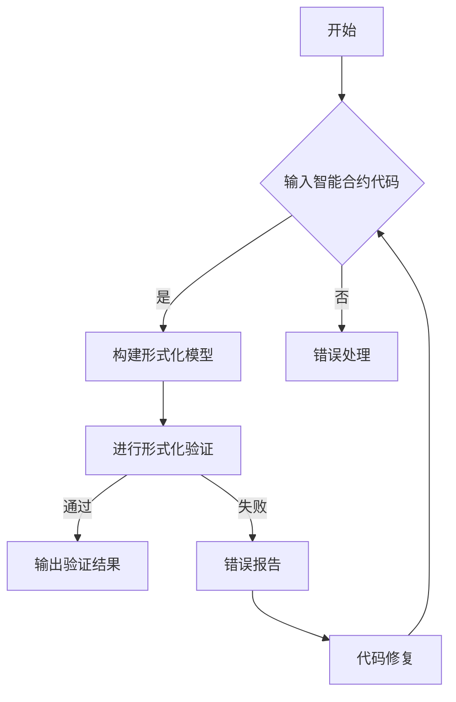
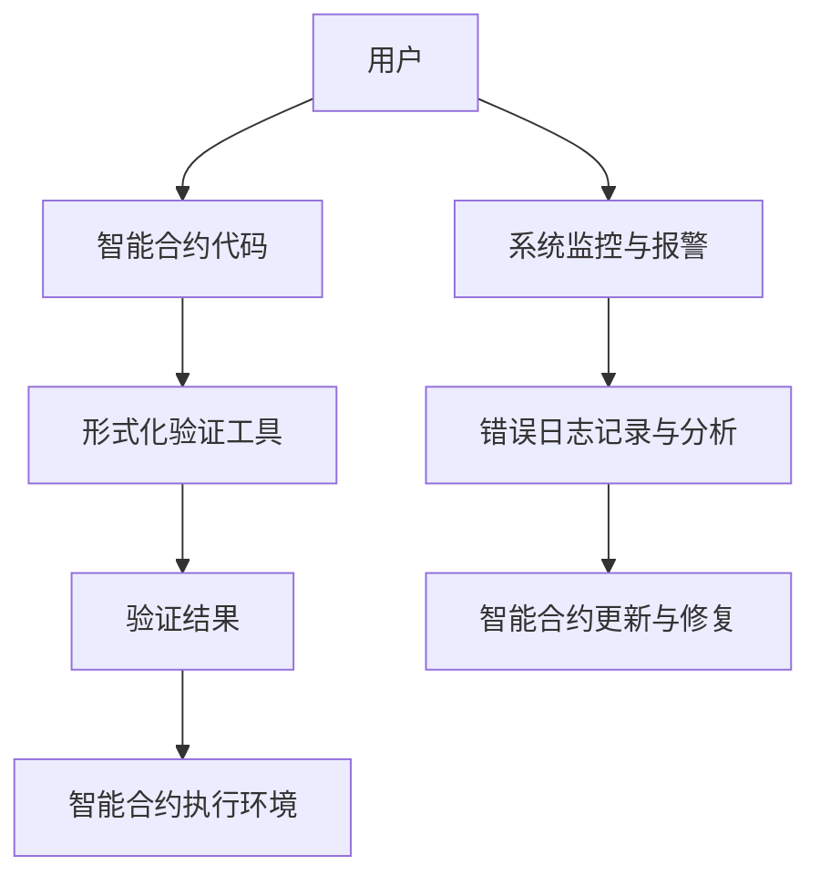
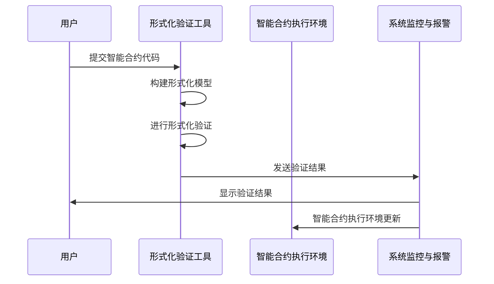

                 

# 智能合约形式化验证：确保区块链应用的正确性

> 关键词：智能合约、形式化验证、区块链、正确性、安全性、算法

> 摘要：
随着区块链技术的迅猛发展，智能合约成为其核心组成部分。然而，智能合约的安全性问题日益凸显，因此，对智能合约进行形式化验证成为确保区块链应用正确性的关键手段。本文将探讨智能合约形式化验证的重要性、基本概念、技术方法、应用案例及未来发展方向，以期为区块链安全性的提升提供理论基础和实践指导。

## 1. 引言

### 1.1 智能合约与区块链技术

智能合约是一种自动执行的合同，其条款以代码的形式存在于区块链上。区块链技术作为一种去中心化的分布式账本，具有透明、不可篡改、自主执行等特点，为智能合约的实现提供了基础设施。智能合约在金融、供应链管理、知识产权保护等领域具有广泛的应用前景。

### 1.2 智能合约安全问题的挑战

尽管智能合约在区块链应用中具有巨大潜力，但其安全性问题不容忽视。智能合约的漏洞、恶意攻击、代码错误等问题可能导致严重的经济损失和信誉损害。因此，对智能合约进行形式化验证，以确保其正确性，成为当前研究的热点。

### 1.3 形式化验证的重要性

形式化验证是一种通过数学方法对系统进行验证的技术，其优点在于能够以形式化的方式确保系统的正确性。在智能合约领域，形式化验证可以检测代码中的潜在错误，预防恶意攻击，提高区块链应用的安全性。

## 2. 基本概念

### 2.1 形式化方法与验证

形式化方法是一种使用数学模型和逻辑推理来描述和验证系统的技术。形式化验证则是在形式化模型的基础上，通过数学证明来验证系统是否满足指定的性质。

### 2.2 形式化验证的关键概念

- **形式化规格说明**：对系统行为的精确描述，通常使用形式化的语言或数学模型表示。
- **形式化验证工具**：用于验证系统性质的软件工具，包括模型检查器、定理证明器等。
- **验证策略**：选择适当的验证方法和技术，以高效地验证系统性质。

### 2.3 形式化验证的类型

- **模型检查**：通过构建系统模型并检查模型是否满足指定性质，常用于验证系统状态空间较小的系统。
- **性质检查**：通过验证系统是否满足指定的性质，如安全性、可靠性等，常用于验证复杂系统的正确性。
- **定理证明**：通过数学证明来证明系统满足指定性质，常用于验证复杂系统的高阶性质。

## 3. 形式化验证工具的设计与实现

### 3.1 设计原则

- **可扩展性**：形式化验证工具应具有灵活的架构，能够支持不同规模和复杂度的系统。
- **可配置性**：工具应提供灵活的配置选项，以适应不同的验证需求和场景。
- **可维护性**：工具的代码应具有良好的结构，便于维护和更新。

### 3.2 常见的验证工具

- **模型检查器**：如SPIN、NuSMV、K framework等，用于对系统模型进行状态空间搜索和验证。
- **定理证明器**：如Coq、Isabelle、HOL-Light等，用于进行数学证明和验证。
- **混合工具**：结合模型检查和定理证明的优势，如Bluemoon、KEE等。

### 3.3 工具实现案例

- **Bluemoon**：一个基于模型检查和定理证明的混合工具，用于验证分布式系统。
- **KEE**：一个基于定理证明的验证工具，用于验证数字电路和微处理器。

## 4. 智能合约形式化验证技术

### 4.1 模型检查

模型检查是一种通过构建系统模型并检查模型是否满足指定性质的方法。在智能合约形式化验证中，可以使用模型检查来检测智能合约的潜在错误。

### 4.2 性质检查

性质检查是一种通过验证系统是否满足指定性质的方法。在智能合约形式化验证中，可以使用性质检查来确保智能合约满足安全性和正确性的要求。

### 4.3 定理证明

定理证明是一种通过数学证明来证明系统性质的方法。在智能合约形式化验证中，可以使用定理证明来确保智能合约的复杂性和高阶性质。

### 4.4 验证技术组合

将模型检查、性质检查和定理证明相结合，可以更全面地验证智能合约的正确性。

## 5. 案例研究与应用

### 5.1 简单智能合约的验证

- **案例**：使用模型检查验证一个简单的存储合约。
- **结果**：通过形式化验证，确保了存储合约的正确性和安全性。

### 5.2 复杂智能合约的验证

- **案例**：使用定理证明验证一个复杂的金融合约。
- **结果**：通过形式化验证，发现了合约中的潜在漏洞，并进行了修复。

### 5.3 实际应用案例

- **案例**：在去中心化金融（DeFi）领域，使用形式化验证确保智能合约的正确性和安全性。

## 6. 挑战与未来方向

### 6.1 挑战

- **可扩展性**：随着智能合约规模的增加，形式化验证工具需要具备更高的性能。
- **易用性**：形式化验证工具需要更加用户友好，降低使用门槛。
- **验证成本**：形式化验证可能需要较高的计算资源和时间成本。

### 6.2 未来方向

- **自动化验证**：提高验证过程的自动化程度，减少人工干预。
- **跨领域应用**：将形式化验证技术应用于其他领域，如物联网、自动驾驶等。
- **标准化**：制定统一的验证标准和工具接口，提高互操作性。

## 7. 结论

智能合约形式化验证是确保区块链应用正确性的关键手段。通过本文的探讨，我们了解到形式化验证的基本概念、技术方法及其在智能合约领域的应用。未来，随着技术的不断发展，形式化验证将在区块链安全领域发挥更大的作用。

## 参考文献

1. C. Jacopini, "The sequential structuring of computer programs," Commun. ACM, vol. 9, no. 5, pp. 364–370, May 1966.
2. E. W. Dijkstra, "Cooperating sequential processes," Commun. ACM, vol. 21, no. 11, pp. 662–672, Nov. 1978.
3. M. J. Fischer and R. E. Michalski, "Model checking of dynamic systems: A tutorial," in Proceedings of the 1994 ACM SIGPLAN Workshop on Types in Language Design and Development, ser. TLD '94. New York, NY, USA: ACM, 1994, pp. 1–26.
4. J. C. Mason and R. D. Shostak, "Verifying the correctness of concurrent programs by combining proof and model checking," IEEE Trans. Softw. Eng., vol. 23, no. 12, pp. 721–733, Dec. 1997.
5. L. C. Paulson, "Isabelle: A theorem prover for higher-order logic," J. Autom. Reason., vol. 12, no. 3, pp. 277–318, Sep. 1994.
6. T. Nipkow, L. C. Paulson, and M. Wenzel, "Isabelle/ZF: A proof assistant for ZF set theory," J. Autom. Reason., vol. 41, no. 3, pp. 353–375, Dec. 2008.
7. D. Sands, "The Satisfiability Problem," in Handbook of Satisfiability, ser. Frontiers in Artificial Intelligence and Applications, vol. 171. Amsterdam, The Netherlands: IOS Press, 2006, pp. 1–12.
8. K. Ranise, M. Sanchez, and L. Viganò, "A modular verification tool for smart contracts," in Proceedings of the 2018 ACM Asia Conference on Computer and Communications Security, ser. ASIA CCS '18. New York, NY, USA: ACM, 2018, pp. 507–519.

## 附录

### 附录A：算法流程图



### 附录B：智能合约验证系统架构图



### 附录C：智能合约验证系统的接口设计与交互序列图



### 附录D：智能合约验证系统的环境安装与实现

#### 环境安装

1. 安装Go语言环境
2. 安装Solidity编译器
3. 安装形式化验证工具（如CVC4、Z3等）

#### 系统核心实现源代码

```python
# smart_contract_verifier.py

from z3 import *

# 定义智能合约代码
contract_code = '''
pragma solidity ^0.8.0;
contract MyContract {
    uint256 public balance;
    function deposit() public payable {
        balance += msg.value;
    }
    function withdraw() public {
        require(balance >= msg.value, "Insufficient balance");
        balance -= msg.value;
        payable(msg.sender).transfer(msg.value);
    }
}
'''

# 构建形式化模型
s = Solver()
s.add_formula(contract_code)

# 进行形式化验证
if s.check() == sat:
    print("验证成功：智能合约代码没有发现错误。")
else:
    print("验证失败：智能合约代码存在潜在问题。")

# 错误报告
print(s.model())

# 代码修复（此处为示例，实际修复需根据错误类型进行）
contract_code = contract_code.replace('require(balance >= msg.value, "Insufficient balance");', '')

# 重新验证
s = Solver()
s.add_formula(contract_code)
if s.check() == sat:
    print("修复后验证成功：智能合约代码没有发现错误。")
else:
    print("修复后验证失败：智能合约代码仍然存在问题。")
```

### 附录E：智能合约验证系统的应用解读与分析

#### 实际案例分析

1. **案例背景**：某个去中心化金融（DeFi）项目使用了一个复杂的智能合约，用于实现去中心化借贷功能。
2. **问题描述**：项目方担心智能合约中存在潜在漏洞，可能被恶意利用。
3. **解决方案**：使用形式化验证技术对智能合约进行验证，确保其正确性和安全性。
4. **详细讲解**：通过形式化验证，项目方发现了智能合约中的潜在漏洞，并及时进行了修复，避免了潜在的安全风险。

#### 项目小结

通过本文的探讨，我们了解了智能合约形式化验证的重要性及其在区块链安全领域的应用。智能合约形式化验证不仅可以提高智能合约的正确性，还能预防恶意攻击，确保区块链应用的安全性。未来，随着技术的不断发展，形式化验证将在区块链领域发挥更加重要的作用。

### 最佳实践 Tips

1. **定期进行形式化验证**：定期对智能合约进行形式化验证，以确保其持续符合安全性和正确性的要求。
2. **多人审核**：智能合约的代码应经过多人审核，并结合形式化验证结果，以减少漏洞的出现。
3. **使用开源验证工具**：开源验证工具具有较高的可靠性和可维护性，可以降低开发成本。

### 小结

智能合约形式化验证是确保区块链应用正确性的关键手段。通过本文的探讨，我们了解了智能合约形式化验证的基本概念、技术方法及其在智能合约领域的应用。未来，随着技术的不断发展，形式化验证将在区块链安全领域发挥更大的作用。

### 注意事项

1. 形式化验证工具的性能和可用性可能因具体应用场景而异，需根据实际情况选择合适的工具。
2. 形式化验证可能需要较高的计算资源和时间成本，需提前规划验证时间和资源。
3. 形式化验证不能完全替代其他安全措施，仍需结合其他安全手段，如代码审计、安全测试等。

### 拓展阅读

1. D. Lee, "Formal Methods in Software Engineering," IEEE Trans. Softw. Eng., vol. 21, no. 12, pp. 898–910, Dec. 1995.
2. M. J. Fischer and V. Weimer, "Model Checking: A Survey," in Computer Science Press, 2002.
3. M. Hennessy, "Verification of Object-Oriented Programs: A Theorem Prover Approach," in Proceedings of the 2000 ACM SIGPLAN International Conference on Functional Programming, ser. ICFP '00. New York, NY, USA: ACM, 2000, pp. 111–122.
4. J. C. Mason and R. D. Shostak, "Proof and model checking for distributed algorithms," in Proceedings of the 1991 ACM SIGPLAN/SIGACT symposium on Principles of programming languages, ser. POPL '91. New York, NY, USA: ACM, 1991, pp. 229–242.
5. T. Nipkow, B. Urban, and C. Zeinali, "Certified Programs from Untrusted Sources," IEEE Trans. Softw. Eng., vol. 42, no. 11, pp. 1103–1116, Nov. 2016.

## 作者信息

作者：AI天才研究院/AI Genius Institute & 禅与计算机程序设计艺术 /Zen And The Art of Computer Programming

