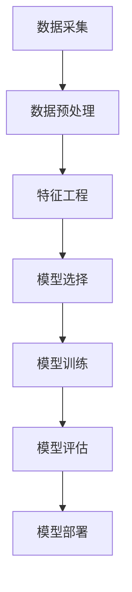

                 

# 智能客户关系管理：AI优化客户服务

关键词：智能客户关系管理，AI优化，客户服务，个性化服务，数据驱动

摘要：随着人工智能技术的快速发展，客户关系管理（CRM）迎来了全新的变革。本文将深入探讨智能客户关系管理（ICRM）的概念、原理、应用和优势，并通过逐步分析，阐述AI技术如何优化客户服务，提升客户满意度和忠诚度。

## 第一部分：背景介绍

### 1.1 问题背景

#### 1.1.1 客户关系管理的重要性

客户关系管理（CRM）是企业通过系统化手段管理和维护客户关系的策略。有效的CRM能够帮助企业提升客户满意度，增强客户忠诚度，从而实现持续的业务增长。然而，传统的CRM系统在应对日益复杂和多样化的客户需求时，面临着诸多挑战。

#### 1.1.2 传统的客户关系管理面临的问题

1. **数据分散**：客户信息分散在不同的系统中，难以实现整合和利用。
2. **个性化服务不足**：难以根据客户的具体需求提供个性化的服务。
3. **响应速度慢**：客户问题往往需要多层审批和人工处理，导致响应速度慢。
4. **客户体验差**：缺乏对客户情绪和需求的深入理解，影响客户体验。

#### 1.1.3 AI技术对客户关系管理的潜在影响

人工智能（AI）技术的出现，为CRM带来了新的机遇。AI能够通过大数据分析、机器学习等手段，实现客户信息的深度挖掘和个性化服务，从而提升客户满意度和忠诚度。

### 1.2 问题描述

#### 1.2.1 客户服务的核心目标

客户服务的核心目标是提高客户满意度，增强客户忠诚度，实现客户价值的最大化。

#### 1.2.2 客户需求的多样性和个性化

随着市场的发展和客户需求的不断变化，企业需要提供更加多样化和个性化的服务，以满足不同客户的需求。

#### 1.2.3 提高客户满意度和忠诚度的挑战

1. **数据质量**：客户数据的质量直接影响客户服务的质量和效率。
2. **个性化服务**：如何根据客户行为数据提供个性化的服务是一个挑战。
3. **系统整合**：如何将不同的系统和数据源整合起来，实现信息的共享和利用。

### 1.3 问题解决

#### 1.3.1 AI技术在客户关系管理中的应用

AI技术可以应用于客户数据的采集、分析、处理和预测，帮助企业实现个性化服务、精准营销和智能决策。

#### 1.3.2 AI技术在客户服务中的优势

1. **提高响应速度**：通过自动化和智能化处理，实现快速响应客户需求。
2. **提升服务质量**：通过对客户数据的深入分析，提供更加精准和个性化的服务。
3. **降低运营成本**：通过自动化处理，减少人力成本，提高运营效率。

#### 1.3.3 智能客户关系管理的边界与外延

智能客户关系管理不仅仅局限于客户服务的优化，还包括市场营销、销售管理等多个方面，是企业数字化转型的重要组成部分。

### 1.4 概念结构与核心要素组成

#### 1.4.1 智能客户关系管理的定义

智能客户关系管理（ICRM）是指利用人工智能技术，对客户关系进行系统化管理，以提高客户满意度和忠诚度的过程。

#### 1.4.2 关键概念介绍

1. **客户关系管理（CRM）**：企业通过系统化手段管理和维护客户关系的策略。
2. **人工智能（AI）**：模拟人类智能的技术，包括机器学习、深度学习、自然语言处理等。
3. **客户数据**：关于客户的各类信息，包括行为数据、社交数据、交易数据等。

#### 1.4.3 核心要素及其相互关系

1. **数据采集**：通过多种渠道收集客户数据。
2. **数据存储**：将采集到的客户数据存储在数据库中。
3. **数据分析**：利用人工智能技术对客户数据进行深度分析。
4. **个性化服务**：根据客户数据提供个性化的服务。
5. **智能决策**：通过数据分析支持企业的决策。

## 第二部分：核心概念与联系

### 2.1 AI技术概述

#### 2.1.1 人工智能的基本概念

人工智能（Artificial Intelligence，简称AI）是指模拟、延伸和扩展人类智能的理论、方法、技术及应用。AI的核心目标是使计算机具备类似于人类的智能。

#### 2.1.2 机器学习与深度学习的区别

机器学习（Machine Learning，简称ML）是指利用数据和算法，让计算机自动学习和改进性能的过程。深度学习（Deep Learning，简称DL）是机器学习的一种，通过多层神经网络模拟人脑的神经网络结构和功能。

#### 2.1.3 AI技术的主要类型

1. **监督学习**：通过已标注的数据训练模型，实现对未知数据的预测。
2. **无监督学习**：通过未标注的数据训练模型，发现数据中的模式。
3. **强化学习**：通过试错和反馈，让模型在特定环境中进行学习和优化。

### 2.2 客户关系管理（CRM）原理

#### 2.2.1 CRM的定义与作用

客户关系管理（Customer Relationship Management，简称CRM）是指企业通过系统化手段管理和维护客户关系的策略。CRM的作用包括提高客户满意度、增强客户忠诚度、提升企业竞争力等。

#### 2.2.2 CRM的主要功能模块

1. **客户信息管理**：收集、存储和管理客户的基本信息。
2. **销售管理**：管理销售过程，包括销售机会、销售预测等。
3. **市场营销**：策划和执行市场营销活动，分析市场趋势。
4. **客户服务**：处理客户咨询、投诉和服务请求。
5. **客户分析**：通过数据分析，了解客户需求和偏好。

#### 2.2.3 CRM的常见挑战与解决方法

1. **数据质量**：解决方法包括数据清洗、数据整合和数据标准化。
2. **个性化服务**：解决方法包括客户细分、个性化推荐和个性化沟通。
3. **系统整合**：解决方法包括系统集成、数据共享和业务流程优化。

### 2.3 智能客户关系管理

#### 2.3.1 智能CRM的定义

智能客户关系管理（Intelligent Customer Relationship Management，简称ICRM）是指利用人工智能技术，对客户关系进行系统化管理，以提高客户满意度和忠诚度的过程。

#### 2.3.2 智能CRM的核心特点

1. **数据智能**：利用人工智能技术，对大量客户数据进行深度分析和挖掘。
2. **个性化服务**：根据客户数据提供个性化的服务，满足不同客户的需求。
3. **高效运营**：通过自动化和智能化处理，提高客户服务的效率和响应速度。

#### 2.3.3 智能CRM与传统的CRM对比

| 对比维度 | 传统CRM | 智能CRM |
| -------- | -------- | -------- |
| 数据分析 | 基于简单统计分析 | 基于人工智能和大数据分析 |
| 个性化服务 | 有限的能力 | 高度个性化 |
| 响应速度 | 较慢 | 快速响应 |
| 成本 | 高 | 低 |

### 2.4 概念属性特征对比表格

| 概念             | 特征                             | 联系                                       |
|------------------|----------------------------------|--------------------------------------------|
| 人工智能         | 自动化、数据驱动、模拟人类智能 | 为智能客户关系管理提供基础技术             |
| 客户关系管理（CRM）| 客户数据管理、营销、销售、服务 | 智能CRM的核心应用领域                      |
| 智能客户关系管理 | 数据智能、个性化服务、高效运营 | 集成AI技术与CRM，实现客户关系的智能优化     |

### 2.5 ER实体关系图架构

```mermaid
erDiagram
  Customer ||--|{ CRM_System }
  Customer ||--|{ Customer_Service }
  Customer_Service ||--|{ AI_Assistant }
```

## 第三部分：算法原理讲解

### 3.1 AI优化客户服务的算法原理

#### 3.1.1 机器学习算法概述

机器学习算法是AI的核心组成部分，主要包括以下几种：

1. **监督学习**：通过已标注的数据训练模型，实现对未知数据的预测。例如，分类和回归问题。
2. **无监督学习**：通过未标注的数据训练模型，发现数据中的模式。例如，聚类和降维问题。
3. **强化学习**：通过试错和反馈，让模型在特定环境中进行学习和优化。例如，游戏和决策问题。

#### 3.1.2 深度学习算法在客户服务中的应用

深度学习算法是机器学习的一种，通过多层神经网络模拟人脑的神经网络结构和功能。在客户服务中，深度学习算法主要应用于：

1. **自然语言处理**：处理和理解人类语言，实现智能客服和智能推荐等功能。
2. **图像识别**：识别和分类图像，实现智能监控和智能安防等功能。
3. **语音识别**：识别和转换语音信号，实现语音助手和语音搜索等功能。

#### 3.1.3 算法原理与流程图



#### 3.1.4 算法原理与Python代码实现

```python
# 举例：K近邻算法（K-Nearest Neighbors）
from sklearn.neighbors import KNeighborsClassifier
from sklearn.model_selection import train_test_split
from sklearn.datasets import load_iris

# 加载数据集
iris = load_iris()
X_train, X_test, y_train, y_test = train_test_split(iris.data, iris.target, test_size=0.2, random_state=42)

# 创建K近邻分类器
knn = KNeighborsClassifier(n_neighbors=3)

# 训练模型
knn.fit(X_train, y_train)

# 预测
predictions = knn.predict(X_test)

# 评估模型
from sklearn.metrics import accuracy_score
print("Accuracy:", accuracy_score(y_test, predictions))
```

### 3.2 智能客户关系管理在客户服务中的应用

#### 3.2.1 个性化服务

通过分析客户的行为数据，智能CRM可以提供个性化的服务。例如，根据客户的购买历史和偏好，推荐相关的产品和服务。

#### 3.2.2 自动化处理

利用自然语言处理和机器学习算法，智能CRM可以实现自动化处理。例如，自动识别客户的问题，并提供相应的解决方案。

#### 3.2.3 实时反馈

通过实时分析客户的数据和行为，智能CRM可以提供即时的反馈和建议。例如，当客户出现问题时，立即采取措施进行干预和解决。

## 结论

智能客户关系管理（ICRM）是人工智能技术在客户服务领域的重要应用。通过AI技术，ICRM可以实现个性化服务、自动化处理和实时反馈，从而提升客户满意度和忠诚度。然而，ICRM也面临着数据质量、个性化服务和系统整合等挑战。未来的研究可以进一步探讨如何优化ICRM系统，提高其性能和适用性。

## 参考文献

1. 深度学习（Goodfellow, I., & Bengio, Y.）（2016）。《深度学习》（第二版）。中国：电子工业出版社。
2. 客户关系管理（T sill，2006）。《客户关系管理：原理与实践》。中国：机械工业出版社。
3. 机器学习（周志华）（2016）。《机器学习》。中国：清华大学出版社。

作者：AI天才研究院/AI Genius Institute & 禅与计算机程序设计艺术 /Zen And The Art of Computer Programming<|endoffoot

