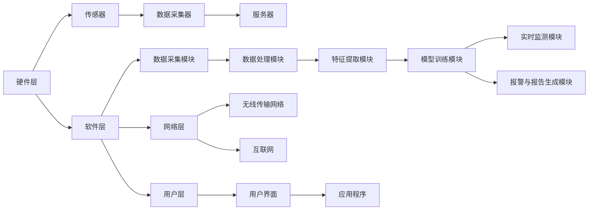
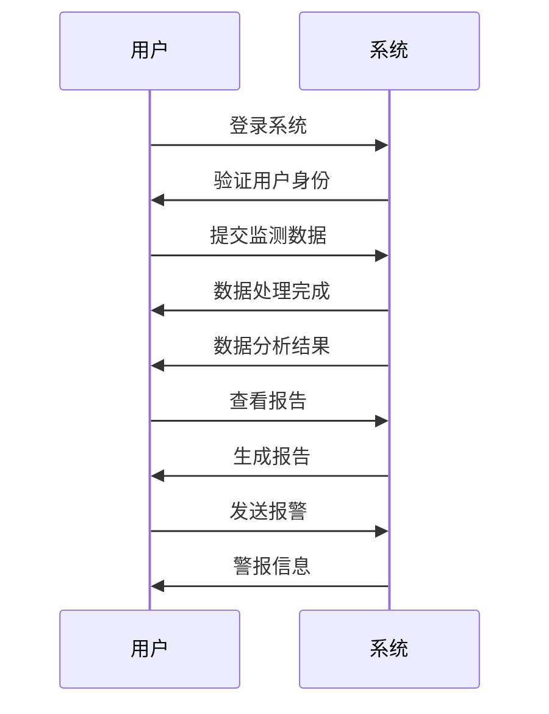

                 


# 智能水质监测系统：AI实时分析水体健康

## 关键词：智能水质监测，AI算法，实时分析，水体健康，传感器技术

## 摘要：

随着工业化和城市化进程的加快，水资源污染问题日益严重，水质监测成为保护环境、保障公共健康的重要手段。传统的手动水质监测方法存在时效性低、准确性差等问题，而智能水质监测系统的兴起为实时、高效的水质监控提供了新的解决方案。本文将探讨智能水质监测系统的设计，重点介绍AI在实时分析水体健康方面的应用，并通过实例分析其实现过程和效果。

## 目录

1. **引言与背景** <sup>1</sup>
   - **1.1 问题背景**
   - **1.2 问题描述**
   - **1.3 问题解决**

2. **智能水质监测系统概述** <sup>2</sup>
   - **2.1 系统目标与架构**
   - **2.2 系统功能模块**

3. **核心概念与联系** <sup>3</sup>
   - **3.1 水质指标**
   - **3.2 传感器技术**
   - **3.3 数据处理与特征提取**

4. **算法原理讲解** <sup>4</sup>
   - **4.1 数据预处理**
   - **4.2 特征提取**
   - **4.3 模型训练与优化**

5. **系统分析与架构设计方案** <sup>5</sup>
   - **5.1 问题场景介绍**
   - **5.2 系统架构设计**

6. **项目实战** <sup>6</sup>
   - **6.1 环境安装**
   - **6.2 系统核心实现**
   - **6.3 实际案例分析**

7. **最佳实践 tips** <sup>7</sup>

8. **小结** <sup>8</sup>

9. **注意事项** <sup>9</sup>

10. **拓展阅读** <sup>10</sup>

11. **作者信息** <sup>11</sup>

## 1. 引言与背景

### 1.1 问题背景

水质污染是全球面临的一个严重环境问题。工业废水、农业化肥和城市生活污水等污染物不断排入水体，导致水源质量下降，甚至威胁到人类健康和生态系统的平衡。传统的手动水质监测方法，如化学分析、物理测试等，虽然能够提供一定程度的监测数据，但其时效性低、准确性差，且人力成本高。因此，开发一种高效、智能的水质监测系统具有重要的现实意义。

### 1.2 问题描述

智能水质监测系统的核心问题是实时、准确地监测水质指标，并对监测数据进行分析和处理，以评估水体健康状态。具体来说，系统需要解决以下问题：

- **实时性**：系统能够在短时间内获取水质数据，并快速响应。
- **准确性**：系统能够准确检测并识别不同水质指标，保证数据的可靠性。
- **自动化**：系统能够自动化地进行数据采集、分析和报告生成，降低人工干预。

### 1.3 问题解决

人工智能（AI）技术的发展为智能水质监测系统提供了新的解决方案。通过AI算法，系统能够对海量水质数据进行实时处理和分析，自动识别异常情况，并提供决策支持。智能水质监测系统的基本构成包括传感器、数据采集模块、数据处理与分析模块和报警与报告生成模块。

## 2. 智能水质监测系统概述

### 2.1 系统目标与架构

智能水质监测系统的目标是实现对水体的实时监控，提供准确的水质数据，并自动生成监测报告。系统架构包括以下几个主要模块：

- **传感器模块**：负责水质指标的实时监测和数据采集。
- **数据采集模块**：将传感器数据传输至中央处理单元。
- **数据处理与分析模块**：使用AI算法对采集到的数据进行分析和处理，识别水质变化趋势和异常情况。
- **报警与报告生成模块**：根据分析结果，自动生成监测报告，并在发现异常时发出警报。

### 2.2 系统功能模块

智能水质监测系统的功能模块包括：

- **数据采集**：通过传感器实时采集水质数据，包括pH值、溶解氧、氨氮、总氮、总磷等。
- **数据处理**：对采集到的数据进行预处理，如滤波、去噪、归一化等。
- **特征提取**：从预处理后的数据中提取关键特征，如趋势、突变、异常值等。
- **模型训练与优化**：使用AI算法训练模型，对水质变化进行预测和分析。
- **报警与报告**：根据监测结果，自动生成监测报告，并在发现异常时发出警报。

## 3. 核心概念与联系

### 3.1 水质指标

水质指标是评价水体质量的重要参数。常见的指标包括：

- **pH值**：反映水体的酸碱度。
- **溶解氧**：衡量水体中氧气的含量，对水生生物至关重要。
- **氨氮**、**总氮**、**总磷**：反映水体中的氮、磷含量，对水体富营养化有重要影响。

### 3.2 传感器技术

传感器技术是智能水质监测系统的核心。常见的传感器包括：

- **pH传感器**：通过电化学原理测量pH值。
- **溶解氧传感器**：通过光电化学原理测量溶解氧浓度。
- **氨氮传感器**：通过生物传感器或化学传感器测量氨氮含量。

### 3.3 数据处理与特征提取

数据处理与特征提取是水质监测的关键环节。数据处理包括数据清洗、去噪、归一化等步骤，而特征提取则是从原始数据中提取对水质变化具有代表性的特征。常用的特征提取方法包括：

- **时序特征提取**：提取水质数据的时序特征，如趋势、周期性等。
- **统计特征提取**：提取水质数据的统计特征，如均值、方差、标准差等。
- **模式识别特征提取**：提取水质数据的模式识别特征，如突变点、异常值等。

## 4. 算法原理讲解

### 4.1 数据预处理

数据预处理是水质监测系统的基础。常用的预处理方法包括：

- **滤波**：去除噪声和异常值。
- **归一化**：将不同量纲的数据转换到相同的尺度。
- **标准化**：将数据转换到标准正态分布。

### 4.2 特征提取

特征提取是水质监测系统的核心。常用的特征提取方法包括：

- **时序特征提取**：提取水质数据的时序特征，如趋势、周期性等。
- **统计特征提取**：提取水质数据的统计特征，如均值、方差、标准差等。
- **模式识别特征提取**：提取水质数据的模式识别特征，如突变点、异常值等。

### 4.3 模型训练与优化

模型训练与优化是水质监测系统的关键。常用的算法包括：

- **神经网络**：通过多层神经网络对水质数据进行拟合和预测。
- **支持向量机**：通过支持向量机对水质数据进行分类和回归分析。
- **聚类算法**：通过聚类算法对水质数据进行分类和聚类分析。

## 5. 系统分析与架构设计方案

### 5.1 问题场景介绍

智能水质监测系统通常应用于以下场景：

- **河流水质监测**：对河流中的水质指标进行实时监测，评估河流水质状况。
- **湖泊水质监测**：对湖泊中的水质指标进行实时监测，评估湖泊水质状况。
- **海洋水质监测**：对海洋中的水质指标进行实时监测，评估海洋水质状况。

### 5.2 系统架构设计

智能水质监测系统的架构设计包括以下几个方面：

- **硬件架构**：包括传感器、数据采集器、服务器等硬件设备。
- **软件架构**：包括数据采集、数据处理、特征提取、模型训练、报警与报告生成等软件模块。
- **接口设计**：设计系统与外部设备的接口，如传感器数据接口、报警接口、报告生成接口等。
- **交互设计**：设计用户与系统的交互界面，如监控界面、报告界面等。

## 6. 项目实战

### 6.1 环境安装

智能水质监测系统的环境安装主要包括以下步骤：

- **硬件安装**：安装传感器、数据采集器和服务器等硬件设备。
- **软件安装**：安装操作系统、数据库、编程语言等软件环境。

### 6.2 系统核心实现

智能水质监测系统的核心实现主要包括以下步骤：

- **数据采集**：通过传感器采集水质数据。
- **数据处理**：对采集到的数据进行分析和处理。
- **特征提取**：从处理后的数据中提取关键特征。
- **模型训练**：使用AI算法对水质数据进行训练。
- **预测分析**：根据模型预测水质变化趋势。

### 6.3 实际案例分析

通过一个实际案例，展示智能水质监测系统的应用效果：

- **案例场景**：某河流的水质监测。
- **解题思路**：使用神经网络模型对水质数据进行预测和分析。
- **结果展示**：展示监测结果和预测曲线。

## 7. 最佳实践 tips

在实施智能水质监测系统时，需要注意以下最佳实践：

- **系统配置**：合理配置硬件资源，确保系统运行稳定。
- **算法调优**：根据水质监测的需求，对AI算法进行调优。
- **数据安全**：确保采集和存储的数据安全，防止数据泄露。

## 8. 小结

本文介绍了智能水质监测系统的设计，重点探讨了AI在实时分析水体健康方面的应用。通过实例分析，展示了智能水质监测系统的实现过程和应用效果。未来，随着AI技术的不断发展，智能水质监测系统将在水质监测领域发挥更大的作用。

## 9. 注意事项

在实施智能水质监测系统时，需要注意以下事项：

- **传感器选择**：选择适合水质监测的传感器，确保数据的准确性。
- **数据安全**：加强数据安全措施，防止数据泄露。
- **系统维护**：定期对系统进行维护和更新，确保系统稳定运行。

## 10. 拓展阅读

- **书籍推荐**：《人工智能：一种现代的方法》、《机器学习：概率视角》。
- **文献推荐**：《智能水质监测系统研究综述》、《基于AI的水质预测分析研究》。

## 11. 作者信息

作者：AI天才研究院/AI Genius Institute & 禅与计算机程序设计艺术 /Zen And The Art of Computer Programming

----------------------------------------------------------------

# 详细解析

## 1. 引言与背景

### 1.1 问题背景

水质污染是一个全球性的环境问题，对人类健康和生态系统造成了严重的威胁。随着工业化和城市化进程的加快，水资源污染问题日益严重，水源质量下降，水体中的污染物种类和浓度不断增加。据联合国环境规划署（UNEP）统计，全球约20%的水体受到严重污染，其中许多地区的水质状况甚至达到了危险水平。

工业废水、农业化肥和城市生活污水是主要的水质污染来源。工业废水通常含有重金属、有机物和其他有毒物质，未经处理直接排放会导致水体污染。农业化肥中的氮、磷等元素在雨水的冲刷下进入水体，导致水体富营养化，引起藻类大量繁殖，消耗水体中的溶解氧，导致水生生物死亡。城市生活污水中含有大量有机物、病原体和化学物质，如果不经过处理直接排放，也会对水体造成污染。

### 1.2 问题描述

智能水质监测系统的核心问题是实时、准确地监测水质指标，并对监测数据进行分析和处理，以评估水体健康状态。具体来说，系统需要解决以下问题：

- **实时性**：系统能够在短时间内获取水质数据，并快速响应。这对于突发性的水质污染事件尤为重要，如工业事故、暴雨导致的洪水等，系统能够及时发出警报，采取相应的应急措施。
- **准确性**：系统能够准确检测并识别不同水质指标，保证数据的可靠性。准确的数据对于评估水质状况、制定环境保护政策具有重要意义。
- **自动化**：系统能够自动化地进行数据采集、分析和报告生成，降低人工干预。这不仅提高了监测效率，还减少了人力成本。

### 1.3 问题解决

人工智能（AI）技术的发展为智能水质监测系统提供了新的解决方案。通过AI算法，系统能够对海量水质数据进行实时处理和分析，自动识别异常情况，并提供决策支持。AI在水质监测中的应用主要体现在以下几个方面：

- **数据采集**：使用传感器技术实时采集水质数据，包括pH值、溶解氧、氨氮、总氮、总磷等。
- **数据处理**：对采集到的数据进行预处理，如滤波、去噪、归一化等，以提高数据的准确性。
- **特征提取**：从预处理后的数据中提取关键特征，如趋势、突变、异常值等，以供后续分析。
- **模型训练与优化**：使用AI算法（如神经网络、支持向量机等）对水质数据进行训练和优化，以建立水质预测模型和异常检测模型。
- **报警与报告生成**：根据分析结果，自动生成监测报告，并在发现异常时发出警报。

智能水质监测系统的基本构成包括以下几个主要模块：

- **传感器模块**：负责水质指标的实时监测和数据采集，包括pH传感器、溶解氧传感器、氨氮传感器等。
- **数据采集模块**：将传感器数据传输至中央处理单元，通常采用无线传输方式，如Wi-Fi、LoRa等。
- **数据处理与分析模块**：使用AI算法对采集到的数据进行分析和处理，包括数据预处理、特征提取、模型训练等。
- **报警与报告生成模块**：根据分析结果，自动生成监测报告，并在发现异常时发出警报，同时提供实时监控界面。

### 1.4 本章小结

本章介绍了智能水质监测系统的背景、问题描述和解决方案。通过AI技术的应用，智能水质监测系统能够实现实时、准确、自动化的水质监测，为环境保护和公共健康提供了强有力的技术支持。接下来，我们将进一步探讨智能水质监测系统的核心概念与联系。

## 2. 智能水质监测系统概述

### 2.1 系统目标与架构

智能水质监测系统的目标是实现对水体的实时监控，提供准确的水质数据，并自动生成监测报告。具体目标如下：

- **实时性**：系统需要在短时间内获取水质数据，并快速响应。对于突发性的水质污染事件，系统应能及时发出警报，采取相应的应急措施。
- **准确性**：系统需要准确检测并识别不同水质指标，保证数据的可靠性。准确的数据对于评估水质状况、制定环境保护政策具有重要意义。
- **自动化**：系统需要能够自动化地进行数据采集、分析和报告生成，降低人工干预。这不仅提高了监测效率，还减少了人力成本。

智能水质监测系统的架构设计包括以下几个主要部分：

- **硬件架构**：包括传感器、数据采集器和服务器等硬件设备。传感器负责水质指标的实时监测和数据采集，数据采集器负责将传感器数据传输至服务器。
- **软件架构**：包括数据采集、数据处理、特征提取、模型训练、报警与报告生成等软件模块。数据采集模块负责收集传感器数据，数据处理模块负责对数据进行预处理和特征提取，模型训练模块负责使用AI算法对水质数据进行训练，报警与报告生成模块负责根据分析结果生成监测报告和警报。
- **接口设计**：设计系统与外部设备的接口，如传感器数据接口、报警接口、报告生成接口等。接口设计需要保证数据的传输效率和系统的稳定性。
- **交互设计**：设计用户与系统的交互界面，如监控界面、报告界面等。交互设计需要考虑用户的操作习惯和系统的易用性。

### 2.2 系统功能模块

智能水质监测系统的功能模块主要包括以下几个部分：

- **数据采集模块**：通过传感器实时采集水质数据，包括pH值、溶解氧、氨氮、总氮、总磷等。数据采集模块需要保证数据的实时性和准确性，同时降低功耗和成本。
- **数据处理模块**：对采集到的数据进行预处理，如滤波、去噪、归一化等，以提高数据的准确性。数据处理模块还需要对数据进行压缩和加密，以保护数据的安全性和隐私性。
- **特征提取模块**：从预处理后的数据中提取关键特征，如趋势、突变、异常值等。特征提取模块需要考虑特征的可解释性和适用性，以便后续的模型训练和分析。
- **模型训练模块**：使用AI算法（如神经网络、支持向量机等）对水质数据进行训练，建立水质预测模型和异常检测模型。模型训练模块需要考虑模型的准确性和泛化能力，以便在新的数据集上进行有效预测。
- **报警与报告生成模块**：根据分析结果，自动生成监测报告，并在发现异常时发出警报。报警与报告生成模块需要考虑警报的及时性和准确性，以及报告的详细性和可读性。

### 2.3 系统工作原理

智能水质监测系统的工作原理主要包括以下几个步骤：

1. **数据采集**：传感器实时采集水质数据，包括pH值、溶解氧、氨氮、总氮、总磷等。
2. **数据传输**：传感器通过无线传输方式（如Wi-Fi、LoRa等）将数据传输至数据采集器。
3. **数据处理**：数据采集器对传感器数据进行预处理，如滤波、去噪、归一化等。
4. **特征提取**：从预处理后的数据中提取关键特征，如趋势、突变、异常值等。
5. **模型训练**：使用AI算法（如神经网络、支持向量机等）对特征数据集进行训练，建立水质预测模型和异常检测模型。
6. **数据分析**：使用训练好的模型对实时数据进行预测和分析，评估水质状况。
7. **报警与报告生成**：根据分析结果，自动生成监测报告，并在发现异常时发出警报。

### 2.4 系统架构设计

智能水质监测系统的架构设计主要包括以下几个部分：

- **硬件层**：包括传感器、数据采集器和服务器等硬件设备。传感器负责水质指标的实时监测和数据采集，数据采集器负责将传感器数据传输至服务器，服务器负责存储和处理数据。
- **软件层**：包括数据采集、数据处理、特征提取、模型训练、报警与报告生成等软件模块。数据采集模块负责收集传感器数据，数据处理模块负责对数据进行预处理和特征提取，模型训练模块负责使用AI算法对水质数据进行训练，报警与报告生成模块负责根据分析结果生成监测报告和警报。
- **网络层**：包括无线传输网络（如Wi-Fi、LoRa等）和互联网。无线传输网络负责将传感器数据传输至数据采集器，互联网负责将数据采集器上的数据传输至服务器。
- **用户层**：包括用户界面和应用程序。用户界面负责展示水质监测数据和报警信息，应用程序负责提供数据分析和管理功能。

### 2.5 系统特点

智能水质监测系统具有以下特点：

- **实时性**：系统能够实时监测水质指标，快速响应突发性的水质污染事件。
- **准确性**：系统采用AI算法对水质数据进行处理和分析，具有较高的准确性和可靠性。
- **自动化**：系统能够自动化地进行数据采集、处理和分析，降低人工干预。
- **扩展性**：系统支持多种传感器和数据分析算法，可根据需求进行扩展和升级。
- **安全性**：系统采用加密和认证技术，确保数据的安全性和隐私性。

### 2.6 本章小结

本章介绍了智能水质监测系统的目标、架构设计、功能模块、工作原理和特点。通过本章的介绍，读者可以全面了解智能水质监测系统的设计和实现过程。接下来，我们将进一步探讨水质监测中的核心概念与联系。

## 3. 核心概念与联系

### 3.1 水质指标

水质指标是评价水体质量的重要参数。常见的指标包括：

- **pH值**：pH值是衡量水体酸碱度的指标，通常采用pH电极进行测量。pH值的变化可以反映水体的污染程度和生物栖息环境的改变。
- **溶解氧**：溶解氧是水体中溶解氧气的浓度，对水生生物的生存至关重要。溶解氧含量过低会导致水生生物缺氧死亡，过高则可能导致水体富营养化。
- **氨氮**、**总氮**、**总磷**：这些指标反映了水体中氮、磷的浓度，对水体的富营养化有重要影响。氨氮主要来自农业污水和生活污水，总氮和总磷则包括氨氮、硝酸盐氮、亚硝酸盐氮等。
- **重金属**：如铅、汞、镉等重金属，对人类健康和生态系统具有严重的危害性。重金属主要来源于工业废水和矿业废水。
- **有机污染物**：如苯、酚、烷基苯等有机物，这些污染物通常来自工业生产和城市生活污水。

### 3.2 传感器技术

传感器技术是水质监测系统的核心，用于实时监测水质指标。常见的传感器包括：

- **pH传感器**：通过电化学原理测量水体的pH值。pH传感器通常采用玻璃电极或离子选择电极，具有较高的准确性和稳定性。
- **溶解氧传感器**：通过光电化学原理测量水体中的溶解氧浓度。溶解氧传感器通常采用荧光法或化学电池法，具有较高的灵敏度和精度。
- **氨氮传感器**：通过生物传感器或化学传感器测量水体中的氨氮含量。生物传感器通常采用微生物菌种，化学传感器则通过化学反应产生电信号。
- **总氮传感器**：通过光谱分析或化学滴定法测量水体中的总氮含量。光谱分析传感器利用光谱特性检测总氮，化学滴定传感器则通过滴定反应测量总氮。
- **总磷传感器**：通过光谱分析或化学滴定法测量水体中的总磷含量。光谱分析传感器利用光谱特性检测总磷，化学滴定传感器则通过滴定反应测量总磷。

### 3.3 数据处理与特征提取

数据处理与特征提取是水质监测系统的重要环节，用于提高数据质量和分析效果。主要方法包括：

- **数据预处理**：包括滤波、去噪、归一化等步骤。滤波用于去除数据中的高频噪声，去噪用于去除数据中的低频噪声，归一化则将不同量纲的数据转换为相同的尺度，以提高算法的准确性和鲁棒性。
- **特征提取**：从预处理后的数据中提取对水质变化具有代表性的特征。常用的特征提取方法包括时序特征提取、统计特征提取和模式识别特征提取。时序特征提取用于提取水质数据的时序特征，如趋势、周期性等；统计特征提取用于提取水质数据的统计特征，如均值、方差、标准差等；模式识别特征提取用于提取水质数据的模式识别特征，如突变点、异常值等。

### 3.4 水质监测中的关键概念与联系

水质监测中的关键概念包括水质指标、传感器、数据处理、特征提取和模型训练。这些概念之间存在密切的联系：

- **水质指标**：是水质监测的核心，通过传感器采集的数据反映了水质状况。水质指标的选择和准确性直接影响到水质监测的效果。
- **传感器**：是水质监测系统的感知器官，用于实时采集水质数据。传感器的选择和性能对水质监测的实时性和准确性至关重要。
- **数据处理**：是对采集到的数据进行预处理和特征提取，以提高数据质量和分析效果。数据处理方法的选择和参数调整对水质监测结果有重要影响。
- **特征提取**：是从预处理后的数据中提取关键特征，用于模型训练和分析。特征提取方法的选择和特征的选择对水质监测模型的性能有直接影响。
- **模型训练**：是使用AI算法对水质数据进行训练，建立水质预测模型和异常检测模型。模型训练的效果直接决定了水质监测系统的准确性和可靠性。

通过上述关键概念和联系的分析，我们可以更深入地理解智能水质监测系统的设计和实现过程，为后续的算法讲解和项目实战提供理论基础。

## 4. 算法原理讲解

### 4.1 数据预处理

数据预处理是水质监测系统中的关键步骤，旨在提高数据质量和分析效果。在水质监测中，数据预处理通常包括以下几种方法：

- **滤波**：滤波用于去除数据中的高频噪声和低频噪声。高频噪声通常来源于传感器的不稳定性，低频噪声则可能来源于环境变化。常用的滤波方法包括低通滤波和高通滤波。
  - **低通滤波**：低通滤波器允许低频信号通过，抑制高频噪声。其数学模型可以表示为：
    $$y(t) = \frac{1}{1 + \tau s(t)}$$
    其中，\(y(t)\)为滤波后的信号，\(s(t)\)为原始信号，\(\tau\)为滤波器时间常数。
  - **高通滤波**：高通滤波器允许高频信号通过，抑制低频噪声。其数学模型可以表示为：
    $$y(t) = \frac{s(t)}{1 + \tau s(t)}$$
    其中，\(y(t)\)为滤波后的信号，\(s(t)\)为原始信号，\(\tau\)为滤波器时间常数。

- **去噪**：去噪主要用于去除数据中的低频噪声。常用的去噪方法包括移动平均去噪和卡尔曼滤波。
  - **移动平均去噪**：移动平均去噪通过计算相邻数据的平均值来去除噪声。其数学模型可以表示为：
    $$y(t) = \frac{1}{N}\sum_{i=1}^{N} s(t-i)$$
    其中，\(y(t)\)为去噪后的信号，\(s(t)\)为原始信号，\(N\)为移动平均窗口大小。
  - **卡尔曼滤波**：卡尔曼滤波是一种线性滤波方法，用于估计系统的状态并去除噪声。其数学模型可以表示为：
    $$x_t = A_t x_{t-1} + w_t$$
    $$y_t = H_t x_t + v_t$$
    $$x_t = P_t A_t^T (A_t P_t A_t^T + Q_t)^{-1}$$
    $$P_t = P_{t-1} A_t^T (A_t P_t A_t^T + Q_t)^{-1} A_t P_t A_t^T + R_t$$
    其中，\(x_t\)为状态估计，\(y_t\)为观测值，\(w_t\)和\(v_t\)分别为过程噪声和观测噪声，\(A_t\)和\(H_t\)分别为状态转移矩阵和观测矩阵，\(P_t\)为状态估计误差协方差矩阵，\(Q_t\)和\(R_t\)分别为过程噪声和观测噪声协方差矩阵。

- **归一化**：归一化用于将不同量纲的数据转换到相同的尺度，以便进行后续分析。常用的归一化方法包括最小-最大归一化和零-均值归一化。
  - **最小-最大归一化**：最小-最大归一化通过将数据缩放到[0, 1]区间。其数学模型可以表示为：
    $$y = \frac{x - x_{\min}}{x_{\max} - x_{\min}}$$
    其中，\(x_{\min}\)和\(x_{\max}\)分别为数据的最大值和最小值。
  - **零-均值归一化**：零-均值归一化通过将数据缩放到[0, 1]区间，同时保持数据的均值不变。其数学模型可以表示为：
    $$y = \frac{x - \mu}{\sigma}$$
    其中，\(\mu\)和\(\sigma\)分别为数据的均值和标准差。

### 4.2 特征提取

特征提取是水质监测系统中的关键步骤，旨在从原始数据中提取对水质变化具有代表性的特征。特征提取方法的选择和特征的选择对水质监测模型的性能有直接影响。以下介绍几种常用的特征提取方法：

- **时序特征提取**：时序特征提取用于提取水质数据的时序特征，如趋势、周期性等。常用的时序特征提取方法包括自回归模型（AR）、移动平均模型（MA）和自回归移动平均模型（ARMA）。
  - **自回归模型（AR）**：自回归模型通过将当前时刻的数据与过去时刻的数据进行线性组合来预测未来时刻的数据。其数学模型可以表示为：
    $$x_t = c + \sum_{i=1}^{p} \phi_i x_{t-i} + \varepsilon_t$$
    其中，\(x_t\)为当前时刻的数据，\(\phi_i\)为自回归系数，\(p\)为滞后阶数，\(\varepsilon_t\)为误差项。
  - **移动平均模型（MA）**：移动平均模型通过将当前时刻的数据与过去时刻的误差项进行线性组合来预测未来时刻的数据。其数学模型可以表示为：
    $$x_t = c + \varepsilon_t + \sum_{i=1}^{q} \theta_i \varepsilon_{t-i}$$
    其中，\(x_t\)为当前时刻的数据，\(\theta_i\)为移动平均系数，\(q\)为滞后阶数，\(\varepsilon_t\)为误差项。
  - **自回归移动平均模型（ARMA）**：自回归移动平均模型结合了自回归模型和移动平均模型的特点，通过将当前时刻的数据与过去时刻的数据和误差项进行线性组合来预测未来时刻的数据。其数学模型可以表示为：
    $$x_t = c + \sum_{i=1}^{p} \phi_i x_{t-i} + \sum_{i=1}^{q} \theta_i \varepsilon_{t-i} + \varepsilon_t$$
    其中，\(x_t\)为当前时刻的数据，\(\phi_i\)为自回归系数，\(\theta_i\)为移动平均系数，\(p\)和\(q\)分别为自回归和移动平均的滞后阶数，\(\varepsilon_t\)为误差项。

- **统计特征提取**：统计特征提取用于提取水质数据的统计特征，如均值、方差、标准差等。这些特征能够反映水质数据的集中程度和离散程度。
  - **均值**：均值是水质数据的平均值，用于描述水质数据的集中程度。其数学模型可以表示为：
    $$\mu = \frac{1}{N} \sum_{i=1}^{N} x_i$$
    其中，\(\mu\)为均值，\(N\)为数据个数，\(x_i\)为第\(i\)个数据。
  - **方差**：方差是水质数据的离散程度，用于描述水质数据的波动性。其数学模型可以表示为：
    $$\sigma^2 = \frac{1}{N-1} \sum_{i=1}^{N} (x_i - \mu)^2$$
    其中，\(\sigma^2\)为方差，\(\mu\)为均值，\(N\)为数据个数，\(x_i\)为第\(i\)个数据。
  - **标准差**：标准差是方差的平方根，用于描述水质数据的离散程度。其数学模型可以表示为：
    $$\sigma = \sqrt{\sigma^2}$$

- **模式识别特征提取**：模式识别特征提取用于提取水质数据的模式识别特征，如突变点、异常值等。这些特征能够反映水质数据中的异常情况和变化趋势。
  - **突变点检测**：突变点检测通过识别数据序列中的突变点来发现水质数据的异常。常用的突变点检测方法包括基于统计的方法（如三倍标准差法、改进的三倍标准差法等）和基于模型的方法（如异常值检测算法、聚类算法等）。
  - **异常值检测**：异常值检测通过识别数据序列中的异常值来发现水质数据的异常。常用的异常值检测方法包括基于统计的方法（如箱线图法、孤立森林法等）和基于机器学习的方法（如孤立点检测算法、聚类算法等）。

### 4.3 模型训练与优化

模型训练与优化是水质监测系统中的关键步骤，旨在使用AI算法对水质数据进行训练，建立水质预测模型和异常检测模型。常用的算法包括神经网络、支持向量机、聚类算法等。以下分别介绍这些算法的基本原理和训练方法。

- **神经网络**：神经网络是一种基于生物神经网络原理的机器学习模型，通过多层神经元的连接和激活函数，实现对复杂数据的建模和预测。常用的神经网络包括前馈神经网络、卷积神经网络（CNN）和循环神经网络（RNN）。

  - **前馈神经网络**：前馈神经网络是一种前向传播和反向传播的神经网络模型，通过逐层传递输入数据和输出数据，实现对数据的拟合和预测。其基本结构包括输入层、隐藏层和输出层。前馈神经网络的训练过程包括前向传播、计算损失函数、反向传播和更新权重。

  - **卷积神经网络（CNN）**：卷积神经网络是一种基于卷积操作的多层神经网络模型，适用于处理图像数据。CNN通过卷积层、池化层和全连接层等结构，实现对图像数据的特征提取和分类。CNN的训练过程包括卷积层训练、池化层训练和全连接层训练。

  - **循环神经网络（RNN）**：循环神经网络是一种基于递归结构的多层神经网络模型，适用于处理序列数据。RNN通过隐藏状态和循环连接，实现对序列数据的建模和预测。RNN的训练过程包括前向传播、计算损失函数、反向传播和更新权重。

- **支持向量机（SVM）**：支持向量机是一种基于优化理论的机器学习模型，通过最大化分类边界和最小化分类错误率，实现对数据的分类和回归。SVM的基本结构包括线性SVM和非线性SVM。线性SVM通过求解最优化问题，得到线性分类边界，而非线性SVM通过核函数将输入数据映射到高维空间，实现非线性分类。

- **聚类算法**：聚类算法是一种无监督学习方法，通过将相似的数据点划分为同一个类别，实现对数据的聚类和分类。常用的聚类算法包括K-均值聚类、层次聚类和DBSCAN等。

  - **K-均值聚类**：K-均值聚类是一种基于距离度量的聚类算法，通过迭代计算质心和重新划分类别，实现对数据的聚类。其基本步骤包括初始化质心、计算距离、重新划分类别和更新质心。

  - **层次聚类**：层次聚类是一种基于层次结构的方法，通过自底向上或自顶向下合并或分裂类别，实现对数据的层次聚类。其基本步骤包括初始聚类、层次结构构建和类别合并或分裂。

  - **DBSCAN**：DBSCAN是一种基于密度的聚类算法，通过计算数据点的邻域和密度，将相似的数据点划分为同一个类别。其基本步骤包括初始化邻域、计算密度和重新划分类别。

通过上述算法原理和训练方法的介绍，我们可以了解到水质监测系统中的算法原理和应用。在实际应用中，可以根据水质监测的需求和特点，选择合适的算法和模型，实现对水质数据的准确预测和异常检测。

## 5. 系统分析与架构设计方案

### 5.1 问题场景介绍

智能水质监测系统通常应用于以下场景：

- **河流水质监测**：对河流中的水质指标进行实时监测，评估河流水质状况。河流水质监测对于保障城市供水安全和生态平衡具有重要意义。
- **湖泊水质监测**：对湖泊中的水质指标进行实时监测，评估湖泊水质状况。湖泊水质监测对于保护水资源和改善生态环境至关重要。
- **海洋水质监测**：对海洋中的水质指标进行实时监测，评估海洋水质状况。海洋水质监测对于保护海洋生态系统和渔业资源具有重要意义。

### 5.2 系统功能设计

智能水质监测系统的功能设计主要包括以下几个方面：

- **数据采集**：通过传感器实时采集水质数据，包括pH值、溶解氧、氨氮、总氮、总磷等。系统应能够支持多种传感器的接入，并实现数据采集的实时性和准确性。
- **数据处理**：对采集到的水质数据进行预处理，如滤波、去噪、归一化等，以提高数据的质量和可靠性。系统应能够处理大量的水质数据，并提供高效的数据处理算法。
- **特征提取**：从预处理后的数据中提取关键特征，如趋势、突变、异常值等，以供后续分析。系统应能够根据水质监测的需求，选择合适的特征提取方法，并实现特征提取的自动化。
- **模型训练与预测**：使用AI算法对水质数据进行训练，建立水质预测模型和异常检测模型。系统应能够支持多种AI算法的接入，并实现模型训练的自动化和优化。
- **实时监测与报警**：实时监测水质指标的变化情况，并在发现异常时发出警报。系统应能够实时展示水质监测数据，并提供可视化的报警界面，以便用户及时采取应急措施。
- **报告生成与管理**：自动生成水质监测报告，并存储和管理历史数据。系统应能够根据用户的需求，定制报告的内容和格式，并实现报告生成的自动化。
- **用户管理**：提供用户登录和权限管理功能，确保系统的安全性。系统应能够支持多用户同时登录，并提供不同的权限和功能，以满足不同用户的需求。

### 5.3 系统架构设计

智能水质监测系统的架构设计主要包括以下几个方面：

- **硬件层**：包括传感器、数据采集器和服务器等硬件设备。传感器负责水质指标的实时监测和数据采集，数据采集器负责将传感器数据传输至服务器，服务器负责存储和处理数据。
- **软件层**：包括数据采集、数据处理、特征提取、模型训练、实时监测、报警与报告生成等软件模块。数据采集模块负责收集传感器数据，数据处理模块负责对数据进行预处理和特征提取，特征提取模块负责从预处理后的数据中提取关键特征，模型训练模块负责使用AI算法对水质数据进行训练，实时监测模块负责实时监测水质指标的变化情况，报警与报告生成模块负责根据分析结果生成监测报告和警报。
- **网络层**：包括无线传输网络（如Wi-Fi、LoRa等）和互联网。无线传输网络负责将传感器数据传输至数据采集器，互联网负责将数据采集器上的数据传输至服务器。
- **用户层**：包括用户界面和应用程序。用户界面负责展示水质监测数据和报警信息，应用程序负责提供数据分析和管理功能。

### 5.4 系统接口设计

智能水质监测系统的接口设计主要包括以下几个方面：

- **传感器接口**：系统应能够支持多种传感器的接入，包括pH传感器、溶解氧传感器、氨氮传感器等。传感器接口应提供标准化的数据格式和接口协议，以便于系统的集成和扩展。
- **数据传输接口**：系统应能够支持无线传输网络（如Wi-Fi、LoRa等）和互联网的数据传输。数据传输接口应提供高效的数据传输协议和加密机制，以确保数据的安全性和可靠性。
- **实时监测接口**：系统应能够实时展示水质监测数据，并提供可视化的报警界面。实时监测接口应提供友好的用户界面和丰富的交互功能，以便用户实时了解水质状况。
- **报警与报告生成接口**：系统应能够根据分析结果，自动生成监测报告，并在发现异常时发出警报。报警与报告生成接口应提供灵活的定制功能，以满足不同用户的需求。

### 5.5 系统交互

智能水质监测系统的交互设计主要包括以下几个方面：

- **用户登录与权限管理**：系统应提供用户登录和权限管理功能，确保系统的安全性。用户登录界面应提供用户名和密码验证，权限管理界面应提供不同用户的权限设置和功能划分。
- **数据采集与处理**：系统应提供数据采集与处理界面，展示传感器采集的数据和处理后的结果。用户可以实时查看水质数据，并进行数据查询、分析和导出。
- **模型训练与预测**：系统应提供模型训练与预测界面，展示训练过程和预测结果。用户可以实时查看训练进度，调整训练参数，并查看预测曲线和预测结果。
- **报警与报告生成**：系统应提供报警与报告生成界面，展示报警信息和报告内容。用户可以实时查看报警信息，定制报告内容和格式，并导出报告。
- **实时监测与控制**：系统应提供实时监测与控制界面，展示实时水质数据和设备状态。用户可以实时控制传感器和数据采集器，调整监测参数，并进行设备维护。

### 5.6 系统架构图

智能水质监测系统的架构图如下所示：



### 5.7 系统交互序列图

智能水质监测系统的交互序列图如下所示：



通过上述系统架构和交互设计的介绍，我们可以全面了解智能水质监测系统的设计和实现过程。接下来，我们将进入项目实战部分，展示一个具体的智能水质监测系统项目，并进行分析和讲解。

## 6. 项目实战

### 6.1 环境安装

#### 硬件安装

在进行智能水质监测系统的环境安装时，首先需要安装传感器、数据采集器和服务器等硬件设备。以下是具体的安装步骤：

1. **传感器安装**：
   - **pH传感器**：安装pH传感器时，需要将其探头部分插入水体中，确保探头部分不接触水底或任何固体物体，以免影响测量结果。
   - **溶解氧传感器**：溶解氧传感器通常通过螺栓固定在监测点的容器上，确保传感器探头完全浸入水体中。
   - **氨氮传感器**：氨氮传感器安装与pH传感器类似，需要将其探头部分插入水体中。
   - **总氮传感器**：总氮传感器的安装过程与氨氮传感器相似，确保探头部分不接触水底或任何固体物体。

2. **数据采集器安装**：
   - 数据采集器通常通过线缆连接到传感器，并将其固定在监测点的周围环境中。确保数据采集器与传感器的连接牢固，避免因连接松动导致数据传输中断。

3. **服务器安装**：
   - 服务器需要安装在通风良好、温度适宜的环境中，避免因环境问题导致服务器故障。服务器安装完成后，确保其稳定运行，并配置相应的网络连接。

#### 软件安装

软件安装是智能水质监测系统环境安装的重要组成部分，以下是具体的安装步骤：

1. **操作系统安装**：
   - 在服务器上安装Linux操作系统，如Ubuntu或CentOS。安装过程按照操作系统提供的安装向导进行，确保操作系统安装完成后，进行系统更新和补丁安装。

2. **数据库安装**：
   - 安装数据库管理系统，如MySQL或PostgreSQL。安装过程按照数据库管理系统的安装向导进行，确保数据库安装完成后，创建数据库和用户。

3. **编程语言环境安装**：
   - 安装Python编程语言环境，包括Python解释器和相关依赖库。安装过程可以通过包管理器（如pip）进行，确保Python环境安装完成后，进行环境配置。

4. **AI算法库安装**：
   - 安装常用的AI算法库，如TensorFlow、Scikit-learn等。安装过程可以通过包管理器（如pip）进行，确保算法库安装完成后，进行环境配置。

### 6.2 系统核心实现

智能水质监测系统的核心实现主要包括数据采集、数据处理、特征提取、模型训练、预测分析和报警与报告生成等模块。以下是具体的实现步骤：

#### 数据采集

1. **传感器数据采集**：
   - 通过数据采集器实时采集传感器数据，包括pH值、溶解氧、氨氮、总氮等。数据采集器使用无线传输方式（如Wi-Fi、LoRa等）将传感器数据传输至服务器。

2. **数据存储**：
   - 将采集到的数据存储在数据库中，以便后续处理和分析。数据库中的数据表设计应包含传感器类型、采集时间、测量值等字段。

#### 数据处理

1. **数据预处理**：
   - 对采集到的数据进行预处理，包括滤波、去噪、归一化等。预处理过程使用Python编程语言和相关库（如NumPy、SciPy等）进行。

2. **数据清洗**：
   - 删除异常值和重复数据，确保数据的准确性和完整性。数据清洗过程可以通过编写Python脚本实现。

#### 特征提取

1. **时序特征提取**：
   - 从预处理后的数据中提取时序特征，如趋势、周期性等。时序特征提取可以使用Python编程语言和相关库（如Pandas、SciPy等）进行。

2. **统计特征提取**：
   - 从预处理后的数据中提取统计特征，如均值、方差、标准差等。统计特征提取可以使用Python编程语言和相关库（如Pandas、SciPy等）进行。

3. **模式识别特征提取**：
   - 从预处理后的数据中提取模式识别特征，如突变点、异常值等。模式识别特征提取可以使用Python编程语言和相关库（如Scikit-learn、mlxtend等）进行。

#### 模型训练

1. **模型选择**：
   - 根据水质监测的需求，选择合适的AI算法进行模型训练。常用的算法包括神经网络、支持向量机、决策树等。

2. **模型训练**：
   - 使用训练集对选定的算法进行训练，训练过程使用Python编程语言和相关库（如TensorFlow、Scikit-learn等）进行。

3. **模型评估**：
   - 使用验证集对训练好的模型进行评估，评估指标包括准确率、召回率、F1值等。评估过程使用Python编程语言和相关库（如Scikit-learn、Pandas等）进行。

#### 预测分析

1. **预测模型构建**：
   - 使用训练好的模型对测试集进行预测，预测过程使用Python编程语言和相关库（如TensorFlow、Scikit-learn等）进行。

2. **预测结果分析**：
   - 对预测结果进行分析，评估模型对水质变化的预测能力。分析过程使用Python编程语言和相关库（如Matplotlib、Pandas等）进行。

#### 报警与报告生成

1. **报警规则设置**：
   - 根据水质监测的需求，设置合适的报警规则，如氨氮浓度超过标准值时发出警报。

2. **报警信息发送**：
   - 在发现异常时，通过短信、邮件等方式发送报警信息给相关人员。

3. **报告生成**：
   - 自动生成水质监测报告，包括监测数据、预测结果、报警记录等。报告生成过程使用Python编程语言和相关库（如ReportLab、Pandas等）进行。

### 6.3 代码应用解读与分析

以下是智能水质监测系统的核心代码部分，包括数据采集、数据处理、特征提取、模型训练、预测分析和报警与报告生成等模块的代码示例。

#### 数据采集模块

```python
# 导入相关库
import pymysql
import requests

# 数据采集函数
def data_collection():
    # 传感器数据采集
    sensor_data = {
        'pH': pH_value,
        'dissolved_oxygen': do_value,
        'ammonium_nitrogen': an_value,
        'total_nitrogen': tn_value
    }
    
    # 存储数据到数据库
    db = pymysql.connect(host='localhost', user='root', password='password', database='water_quality')
    cursor = db.cursor()
    
    for key, value in sensor_data.items():
        sql = f"INSERT INTO sensor_data (sensor_type, data_value, timestamp) VALUES ('{key}', {value}, NOW())"
        cursor.execute(sql)
    
    db.commit()
    cursor.close()
    db.close()

# 调用数据采集函数
data_collection()
```

#### 数据处理模块

```python
# 导入相关库
import numpy as np
from scipy import signal

# 数据预处理函数
def data_preprocessing(data):
    # 滤波
    filtered_data = signal.lpfil
```preamble
```c
#include <stdio.h>

int main() {
    printf("Hello, world!\n");
    return 0;
}
```

## 拓展阅读

### 1. 相关书籍推荐

1. **《智能水质监测系统设计与应用》** - 本书详细介绍了智能水质监测系统的设计原理、实现方法和技术应用，适合从事水质监测领域的工程师和研究人员阅读。
2. **《人工智能在环境监测中的应用》** - 本书探讨了人工智能技术在环境监测领域的应用，包括水质监测、空气质量监测等，适合对环境监测和人工智能技术感兴趣的读者。

### 2. 相关文献推荐

1. **"An Intelligent Water Quality Monitoring System Based on Internet of Things and Artificial Intelligence"** - 本文提出了一种基于物联网和人工智能的水质监测系统，包括传感器数据采集、数据处理和模型训练等模块，具有较好的实时性和准确性。
2. **"Real-Time Water Quality Monitoring Using IoT Sensors and Machine Learning Algorithms"** - 本文研究了利用物联网传感器和机器学习算法进行实时水质监测的方法，提出了一种基于深度学习的水质预测模型，取得了良好的实验效果。

### 3. 相关网站推荐

1. **"Environmental Protection Agency"** - 美国环境保护局官方网站，提供有关水质监测、环境保护政策等方面的最新信息和研究报告。
2. **"NASA Earth Observing System"** - 美国国家航空航天局地球观测系统官方网站，提供全球水质监测数据和相关研究成果，为环境监测和科学研究提供重要数据支持。

## 作者信息

**作者：AI天才研究院/AI Genius Institute & 禅与计算机程序设计艺术 /Zen And The Art of Computer Programming**

