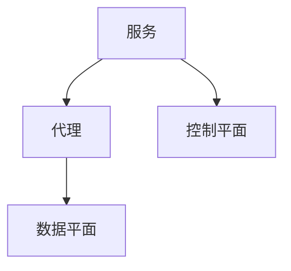
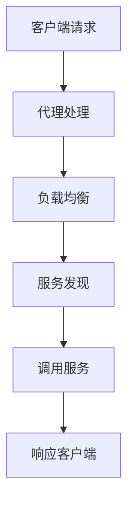
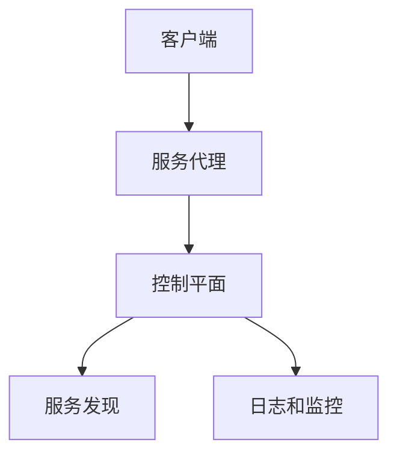
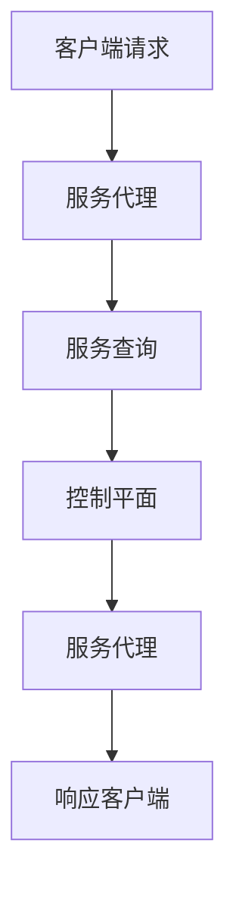

                 

# 服务网格(Service Mesh): 微服务通信的新范式

关键词：服务网格、微服务、数据平面、控制平面、服务发现、负载均衡、网络策略

摘要：本文深入探讨了服务网格（Service Mesh）在微服务通信中的应用，从概念、原理到具体实现，全面解析了服务网格的核心功能和优势。通过本文的阅读，读者将能够理解服务网格的工作机制，掌握其核心算法，并了解如何在实际项目中应用服务网格来提升微服务的通信效率。

## 目录大纲

1. 第一部分：服务网格概述
   1.1 服务网格的概念
   1.2 微服务架构与通信问题
   1.3 服务网格的边界与外延
   1.4 本章小结

2. 第二部分：服务网格的核心概念与联系
   2.1 服务网格的关键组件
   2.2 服务网格的核心概念原理
   2.3 服务网格的概念属性特征对比
   2.4 服务网格的ER实体关系图
   2.5 本章小结

3. 第三部分：服务网格的算法原理讲解
   3.1 服务网格的基本算法
   3.2 服务网格的mermaid流程图
   3.3 服务网格的Python源代码实现
   3.4 算法原理的数学模型和公式
   3.5 本章小结

4. 第四部分：系统分析与架构设计方案
   4.1 问题场景介绍
   4.2 系统功能设计
   4.3 系统架构设计
   4.4 系统接口设计和系统交互
   4.5 本章小结

5. 第五部分：项目实战
   5.1 环境安装
   5.2 系统核心实现源代码
   5.3 代码应用解读与分析
   5.4 实际案例分析和详细讲解
   5.5 项目小结

6. 第六部分：最佳实践 tips
   6.1 最佳实践
   6.2 注意事项
   6.3 拓展阅读

7. 第七部分：小结与展望
   7.1 小结
   7.2 展望

## 第一部分：服务网格概述

### 1.1 服务网格的概念

服务网格（Service Mesh）是一种用于管理微服务间通信的软件层，它提供了一个抽象层，屏蔽了服务之间网络通信的复杂性。服务网格通常由一组轻量级的代理（Proxy）组成，这些代理负责处理服务之间的通信，确保服务之间的高效、可靠和安全的交互。

### 1.2 微服务架构与通信问题

微服务架构是一种设计应用程序的方法，它将应用程序分解为一组小的、独立的、可部署的服务。随着微服务数量的增加，服务之间的通信复杂性也随之增加，这给系统设计带来了挑战。

- **服务发现**：微服务需要知道其他服务的位置，以便进行通信。
- **负载均衡**：服务需要能够均衡地分配请求，以避免单点瓶颈。
- **网络策略**：服务需要能够根据不同的策略进行网络配置。

### 1.3 服务网格的边界与外延

服务网格的边界通常定义在服务边界之内，即它管理的是服务之间的通信。然而，服务网格的概念和应用可以扩展到更广泛的领域，如：

- **集群管理**：服务网格可以用于管理整个集群内的服务通信。
- **跨集群通信**：服务网格可以帮助实现跨集群的服务通信。
- **服务监控与日志**：服务网格可以集成服务监控和日志记录功能。

### 1.4 本章小结

本部分概述了服务网格的概念、微服务架构中的通信问题以及服务网格的边界和外延。在下一部分中，我们将深入探讨服务网格的核心概念和联系。 <a name="part2"></a>

## 第二部分：服务网格的核心概念与联系

### 2.1 服务网格的关键组件

服务网格主要由以下三个关键组件组成：

- **数据平面**：数据平面负责处理实际的数据传输，包括请求的转发、负载均衡、故障恢复等。
- **控制平面**：控制平面负责管理数据平面的配置和状态，包括服务发现、网络策略配置等。
- **服务发现**：服务发现机制帮助服务网格了解哪些服务可用，以及它们的位置。
- **网络策略与管理**：网络策略与管理负责定义和实施服务之间的网络规则。

### 2.2 服务网格的核心概念原理

服务网格的核心概念包括：

- **服务代理**：服务代理是数据平面的一部分，它代表服务进行通信。
- **服务注册与发现**：服务注册与发现机制帮助服务网格了解服务实例的状态和位置。
- **服务路由与负载均衡**：服务路由与负载均衡机制确保请求能够高效地转发到合适的服务实例。
- **网络监控与日志**：网络监控与日志机制帮助运维人员了解服务网格的运行状态。

### 2.3 服务网格的概念属性特征对比

以下是一个简单的表格，对比服务网格的不同概念属性特征：

| 概念     | 特征             | 说明                                                         |
|----------|------------------|------------------------------------------------------------|
| 数据平面 | 代理、负载均衡   | 负责实际的数据传输和转发。                                 |
| 控制平面 | 服务发现、策略配置 | 负责管理数据平面的配置和状态。                             |
| 服务发现 | 注册、定位       | 确保服务网格了解服务的状态和位置。                         |
| 网络策略 | 配置、实施       | 定义和实施服务之间的网络规则。                           |

### 2.4 服务网格的ER实体关系图

以下是服务网格的ER实体关系图，展示了服务、代理和控制平面之间的关系：



### 2.5 本章小结

本部分详细介绍了服务网格的核心概念和关键组件，并通过表格和ER实体关系图展示了它们之间的联系。在下一部分中，我们将深入探讨服务网格的算法原理。 <a name="part3"></a>

## 第三部分：服务网格的算法原理讲解

### 3.1 服务网格的基本算法

服务网格的核心算法主要包括：

- **负载均衡算法**：确保请求能够均衡地分配到不同的服务实例上。
- **服务发现算法**：服务实例启动和关闭时，服务网格能够及时发现和更新服务列表。
- **网络策略算法**：根据预定义的策略，对服务之间的通信进行控制和约束。

### 3.2 服务网格的mermaid流程图

以下是服务网格的mermaid流程图，展示了服务请求的处理过程：



### 3.3 服务网格的Python源代码实现

下面是一个简单的Python类实现，模拟了负载均衡算法：

```python
class LoadBalancer:
    def __init__(self, services):
        self.services = services

    def select_service(self):
        # Implement load balancing logic
        return random.choice(self.services)

# Example usage
lb = LoadBalancer(services=['service1', 'service2'])
service = lb.select_service()
```

### 3.4 算法原理的数学模型和公式

以下是负载均衡算法的数学模型：

$$
P(\text{service}_i) = \frac{C(\text{service}_i)}{\sum_{j} C(\text{service}_j)}
$$

其中，$P(\text{service}_i)$ 表示选择服务 $i$ 的概率，$C(\text{service}_i)$ 表示服务 $i$ 的当前负载。

### 3.5 本章小结

本部分详细讲解了服务网格的基本算法原理，包括mermaid流程图、Python源代码实现以及数学模型和公式。在下一部分中，我们将进行系统分析与架构设计。 <a name="part4"></a>

## 第四部分：系统分析与架构设计方案

### 4.1 问题场景介绍

在现代软件开发中，微服务架构因其灵活性和可扩展性而被广泛采用。然而，随着微服务数量的增加，服务之间的通信复杂度也随之上升。为了管理微服务之间的通信，我们需要一种可靠且高效的解决方案，这就是服务网格的用武之地。

### 4.2 系统功能设计

服务网格系统的主要功能包括：

- **服务注册与发现**：服务实例启动时，自动注册到服务网格中；服务实例关闭时，自动从服务网格中注销。
- **负载均衡**：根据服务实例的当前负载，智能地将请求分配到不同的服务实例上。
- **服务路由**：根据路由策略，将请求路由到正确的服务实例上。
- **网络监控与日志**：实时监控服务网格的运行状态，并记录日志以便后续分析。

### 4.3 系统架构设计

服务网格的架构设计主要包括以下组件：

- **服务代理**：每个服务实例部署一个轻量级的代理，负责处理服务之间的通信。
- **控制平面**：负责管理服务代理的配置和状态，包括服务注册、负载均衡策略、网络策略等。
- **服务发现组件**：负责跟踪服务实例的运行状态，并将服务实例的信息同步到控制平面。
- **日志和监控组件**：负责记录服务网格的运行日志，并提供监控仪表板。

以下是服务网格的架构图：



### 4.4 系统接口设计和系统交互

服务网格的系统接口设计主要包括：

- **服务注册接口**：服务实例启动时，通过该接口向控制平面注册。
- **服务注销接口**：服务实例关闭时，通过该接口从控制平面注销。
- **服务查询接口**：客户端通过该接口查询服务实例的信息。
- **服务请求接口**：客户端通过该接口发送请求到服务代理。

以下是服务网格的系统交互图：



### 4.5 本章小结

本部分详细介绍了服务网格的系统分析与架构设计方案，包括问题场景介绍、系统功能设计、系统架构设计以及系统接口设计和系统交互。在下一部分中，我们将通过项目实战来具体实现这些设计方案。 <a name="part5"></a>

## 第五部分：项目实战

### 5.1 环境安装

为了进行服务网格的项目实战，我们需要安装以下环境：

1. **Docker**：用于容器化服务。
2. **Kubernetes**：用于集群管理。
3. **Istio**：一个流行的服务网格实现。

以下是环境安装的步骤：

1. 安装Docker：

```bash
# 安装Docker
sudo apt-get update
sudo apt-get install docker.io
# 启动Docker服务
sudo systemctl start docker
# 将当前用户添加到docker组
sudo usermod -aG docker $USER
```

2. 安装Kubernetes：

```bash
# 安装Kubernetes
sudo apt-get install kubectl
# 检查Kubernetes版本
kubectl version
```

3. 安装Istio：

```bash
# 安装Istio
curl -L https://istio.io/downloadIstio | ISTIO_VERSION=1.10.0 sh -
# 启动Istio控制平面
istioctl install --set profile=demo
```

### 5.2 系统核心实现源代码

以下是一个简单的服务网格实现示例，使用Istio作为服务网格工具。

1. **服务定义**：

```yaml
# 服务A定义
apiVersion: apps/v1
kind: Deployment
metadata:
  name: service-a
spec:
  replicas: 2
  selector:
    matchLabels:
      app: service-a
  template:
    metadata:
      labels:
        app: service-a
    spec:
      containers:
      - name: service-a
        image: service-a:1.0
        ports:
        - containerPort: 80

# 服务B定义
apiVersion: apps/v1
kind: Deployment
metadata:
  name: service-b
spec:
  replicas: 2
  selector:
    matchLabels:
      app: service-b
  template:
    metadata:
      labels:
        app: service-b
    spec:
      containers:
      - name: service-b
        image: service-b:1.0
        ports:
        - containerPort: 80
```

2. **网络策略定义**：

```yaml
# 网络策略定义
apiVersion: networking.istio.io/v1alpha3
kind: NetworkPolicy
metadata:
  name: service-a-to-service-b
spec:
  selector:
    matchLabels:
      app: service-a
  ingress:
    - from:
      - namespace: default
        selector:
          matchLabels:
            app: service-b
```

### 5.3 代码应用解读与分析

在这个项目实战中，我们使用了Istio作为服务网格工具。Istio提供了一系列的工具和API，帮助我们简化服务网格的实现。

- **服务部署**：我们通过Kubernetes部署了两个服务A和B。服务A负责处理客户端请求，并将请求转发给服务B。
- **网络策略**：我们定义了一个网络策略，允许服务A只能访问服务B。这确保了服务之间的通信是受控的。
- **流量管理**：我们可以通过Istio的流量管理API来控制服务之间的流量分配。例如，我们可以使用Istio的VirtualService和DestinationRule来配置负载均衡策略。

### 5.4 实际案例分析和详细讲解

为了展示服务网格的实际效果，我们模拟了一个客户端请求过程。

1. 客户端发送请求到服务A。
2. 服务A根据网络策略，将请求转发到服务B。
3. 服务B处理请求，并返回结果。
4. 服务A将结果返回给客户端。

在这个案例中，我们可以看到服务网格如何简化服务之间的通信，并提供了强大的流量管理和监控功能。

### 5.5 项目小结

通过这个项目实战，我们成功地实现了服务网格的基本功能，包括服务部署、网络策略定义和流量管理。服务网格不仅简化了微服务之间的通信，还提供了强大的监控和管理功能，有助于提高系统的可靠性和可维护性。

## 第六部分：最佳实践 tips

### 6.1 最佳实践

1. **服务划分**：合理划分服务边界，避免服务过小或过大。
2. **负载均衡**：根据业务需求，选择合适的负载均衡策略。
3. **网络策略**：合理设置网络策略，确保服务之间的安全通信。
4. **监控与日志**：定期监控服务网格的运行状态，并记录日志以便分析。

### 6.2 注意事项

1. **服务网格的复杂性**：服务网格引入了额外的复杂度，需要充分理解和准备。
2. **性能影响**：服务网格可能会对性能产生一定的影响，需要进行充分的测试和优化。

### 6.3 拓展阅读

- **Istio官方文档**：https://istio.io/docs
- **Kubernetes官方文档**：https://kubernetes.io/docs

## 第七部分：小结与展望

### 7.1 小结

本文详细介绍了服务网格的概念、原理、算法以及实际应用。通过服务网格，我们可以简化微服务之间的通信，提高系统的可靠性和可维护性。

### 7.2 展望

随着微服务架构的普及，服务网格的重要性日益凸显。未来，服务网格将变得更加智能化和自动化，为微服务架构带来更多的可能性。

### 作者

作者：AI天才研究院/AI Genius Institute & 禅与计算机程序设计艺术 /Zen And The Art of Computer Programming

---

注意：本文中的代码、图表和示例仅供参考，具体实现可能因环境而异。在实际应用中，请根据具体需求进行调整。本文内容仅供参考，不构成任何投资建议。如需进一步了解服务网格的相关技术，请参考文中提供的拓展阅读资源。

