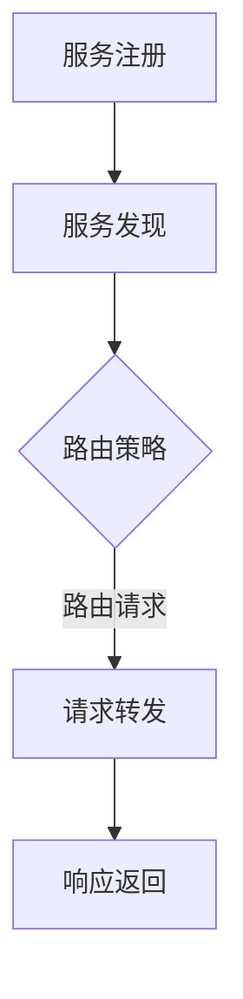
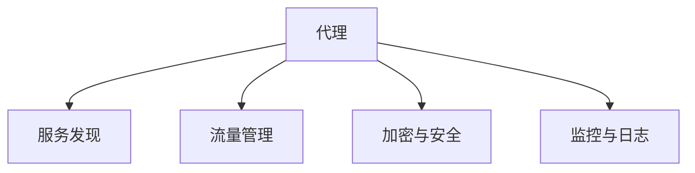
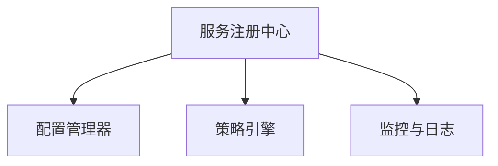
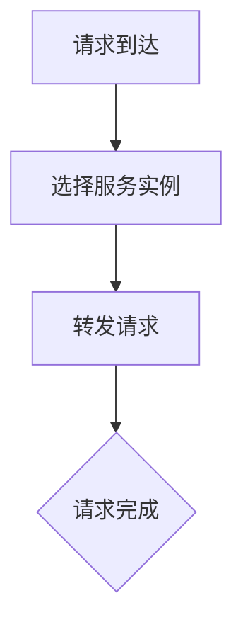
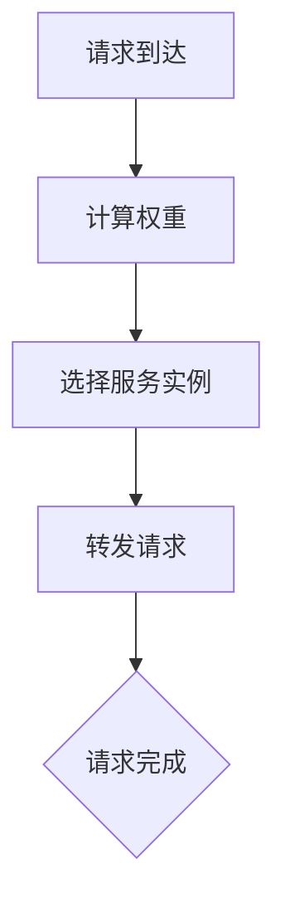
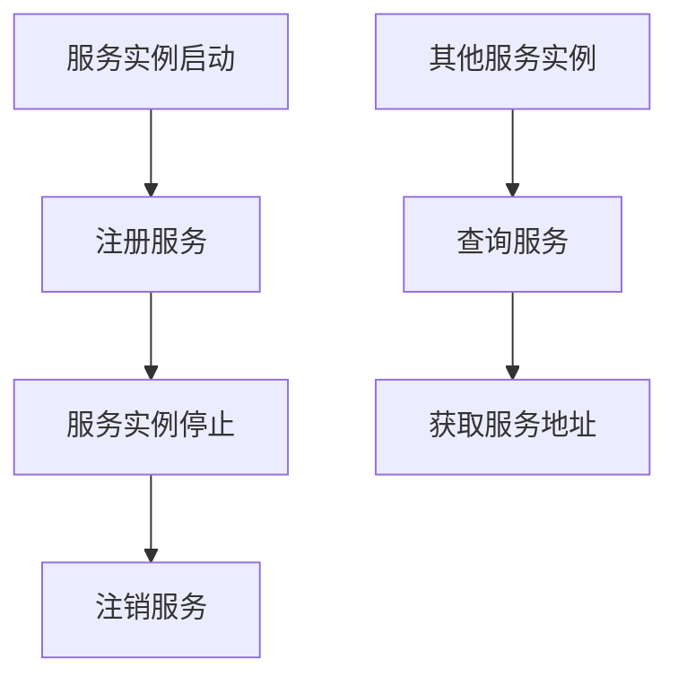
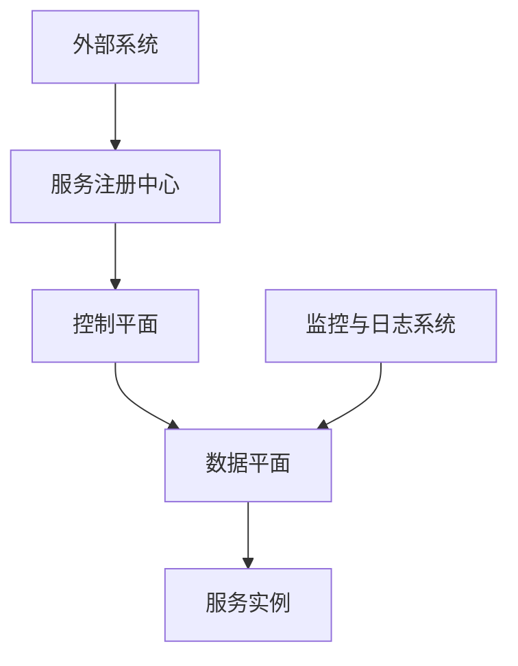

                 

### 第1章：服务网格的起源与发展

#### 1.1 服务网格的产生背景

服务网格（Service Mesh）是近年来随着微服务架构（Microservices Architecture）的兴起而逐渐流行起来的一个概念。微服务架构旨在将大型单体应用程序分解为多个独立运行的小型服务，每个服务负责不同的业务功能。这种解耦合的方式提高了系统的可维护性和可扩展性，但也带来了新的挑战。

在传统的单体架构中，所有的服务都是紧密耦合的，所有的通信都是通过直接调用的方式进行。而在微服务架构中，服务之间的通信变得复杂，需要考虑服务发现、负载均衡、故障转移、安全性等问题。为了解决这些问题，服务网格应运而生。

服务网格是一个抽象层，它运行于应用程序（服务）的旁边，负责管理服务之间的通信。它通过将通信外部化，为微服务提供了独立的通信基础设施，从而简化了服务之间的通信复杂性。

#### 1.1.1 微服务架构的挑战

微服务架构在提供灵活性和可扩展性的同时，也带来了以下挑战：

1. **服务发现**：微服务运行在分布式环境中，服务实例的数量和位置可能在运行时变化。如何快速、可靠地发现服务实例成为了一个问题。
2. **负载均衡**：为了确保服务的可用性，需要根据服务实例的负载情况，动态地将请求分配到不同的实例上。
3. **故障转移**：当某个服务实例发生故障时，需要快速地将流量转移到健康的服务实例上。
4. **安全性**：服务之间的通信需要加密和身份验证，以确保数据的安全和服务的完整性。
5. **监控和日志**：随着服务数量的增加，监控和日志管理变得更加复杂。

#### 1.1.2 服务网格的定义与作用

服务网格是一个独立的通信层，用于管理服务之间的通信。它通常由一组轻量级的代理（通常称为“sidecars”）和服务发现、负载均衡、故障转移、加密等基础设施服务组成。服务网格的作用主要包括：

1. **服务发现**：服务网格通过服务发现机制，帮助服务实例发现和连接到其他服务实例。
2. **负载均衡**：服务网格根据一定的策略，将请求分配到不同的服务实例上，确保服务的可用性和性能。
3. **故障转移**：当某个服务实例发生故障时，服务网格能够快速地将流量转移到健康的服务实例上。
4. **安全性**：服务网格提供了加密和身份验证机制，确保服务之间的通信是安全的。
5. **监控和日志**：服务网格提供了监控和日志收集功能，帮助开发人员和管理人员更好地了解服务的运行状况。

#### 1.1.3 控制平面与数据平面的基本概念

在服务网格中，控制平面（Control Plane）和数据平面（Data Plane）是两个核心组成部分。

1. **控制平面**：控制平面负责管理服务网格的配置、服务发现、流量路由、故障转移等策略。它通常包括服务注册中心、配置管理器、策略引擎等组件。控制平面是一个集中式服务，负责为数据平面提供指令。
   
2. **数据平面**：数据平面是服务网格中的实际通信层，负责处理服务之间的请求和响应。它通常由一组代理（如Envoy、Istio等）组成，这些代理监听和转发服务之间的请求。数据平面是分布式的，运行在每个服务实例旁边。

#### 1.1.4 服务网格的起源

服务网格的概念最早由Netflix和Twitter等公司在实际项目中提出，并在后来逐渐得到业界的广泛认可。2016年，Linkerd项目的创始人Kubernetes社区的活动，标志着服务网格正式进入人们的视野。

服务网格的兴起，不仅解决了微服务通信中的复杂性问题，也为云原生架构（Cloud Native Architecture）的发展提供了坚实的基础。随着容器技术（如Docker和Kubernetes）的普及，服务网格的应用场景越来越广泛。

#### 1.1.5 服务网格的发展趋势

随着微服务架构和云原生技术的不断演进，服务网格也在不断发展。以下是服务网格的一些发展趋势：

1. **支持多种协议**：服务网格正逐渐支持更多的通信协议，如HTTP/2、gRPC、HTTP/3等，以满足不同场景的需求。
2. **更丰富的功能**：服务网格正在引入更多的功能，如动态配置、智能路由、弹性伸缩等，以提高系统的灵活性和可扩展性。
3. **与云服务的集成**：服务网格正在与云服务提供商（如AWS、Azure、Google Cloud等）的API进行集成，以便更好地支持云原生应用。
4. **开源生态的繁荣**：随着服务网格的流行，越来越多的开源项目涌现，如Istio、Linkerd、Conduit等，为开发者提供了丰富的选择。

在接下来的章节中，我们将深入探讨服务网格的核心概念，包括控制平面和数据平面的具体实现、工作原理以及它们之间的关系。通过这些内容，读者将能够更好地理解服务网格的本质，并掌握如何在实际项目中应用服务网格。

### 第2章：服务网格核心概念与联系

#### 2.1 控制平面与数据平面的定义

在服务网格架构中，控制平面（Control Plane）和数据平面（Data Plane）是两个关键组成部分，它们各自承担不同的职能，但紧密协作，共同确保微服务之间的通信高效、可靠和安全。

##### 2.1.1 控制平面的特点

控制平面主要负责管理服务网格中的策略配置、服务发现、流量路由等核心功能。其特点如下：

1. **集中管理**：控制平面通常由一个或多个集中式服务组成，如服务注册中心、配置管理器、策略引擎等。这些服务集中管理服务网格中的配置和策略，为数据平面提供指令。
2. **策略制定**：控制平面定义了服务网格中的流量管理策略，如负载均衡、服务发现、故障转移等。这些策略通常以配置文件的形式存储，并实时更新。
3. **服务注册与发现**：控制平面负责服务实例的注册和发现。当新的服务实例启动时，它会将自身的地址信息注册到服务注册中心，供其他服务实例发现和连接。
4. **安全性与监控**：控制平面提供加密、身份验证等安全功能，确保服务之间的通信是安全的。同时，它还负责收集和监控服务网格的运行数据，为运维提供支持。

##### 2.1.2 数据平面的特点

数据平面则负责实际的服务通信，它是服务网格中的实际通信层，通常由一组轻量级的代理组成，如Envoy、Istio等。其特点如下：

1. **分布式部署**：数据平面代理运行在每一个服务实例旁边，与服务实例共同运行。这使得数据平面能够直接拦截和转发服务之间的请求和响应，无需修改服务代码。
2. **透明代理**：数据平面代理以透明代理的方式工作，即在服务实例之间插入一个代理，拦截和转发请求。这使得服务实例无需知道其他服务的具体位置，即可进行通信。
3. **高效通信**：数据平面代理提供了高效的通信协议，如HTTP/2、gRPC等，支持零延迟的请求处理和响应。
4. **可扩展性**：数据平面代理的设计使其能够轻松扩展，支持更多的服务实例和更大的流量处理能力。

#### 2.2 服务网格的工作原理

服务网格的工作原理可以概括为以下步骤：

1. **服务注册**：当服务实例启动时，它将自己的地址信息注册到服务注册中心。
2. **服务发现**：其他服务实例通过服务注册中心发现可用的服务实例。
3. **流量路由**：控制平面根据预设的策略，将请求路由到合适的服务实例。
4. **请求处理**：数据平面代理拦截并转发请求，确保请求能够高效、安全地到达目标服务实例。
5. **响应返回**：目标服务实例处理后，将响应返回给请求者，数据平面代理负责转发响应。
6. **监控与日志**：数据平面代理和控制系统负责收集和监控服务网格的运行数据，为运维提供支持。

#### 2.3 控制平面与数据平面的关系

控制平面和数据平面虽然功能不同，但它们是紧密协作的关系。以下是它们之间的交互机制：

1. **配置更新**：控制平面定期更新数据平面的配置，如服务地址、流量策略等。数据平面根据新的配置调整其行为。
2. **流量控制**：控制平面定义了流量路由策略，数据平面根据这些策略转发请求。例如，当某个服务实例发生故障时，控制平面可以通知数据平面将流量转移到其他健康的服务实例。
3. **监控反馈**：数据平面代理收集的监控数据反馈给控制平面，帮助控制平面做出更准确的决策。例如，当检测到某个服务的性能下降时，控制平面可以调整流量策略，减轻该服务的负载。

#### 2.4 Mermaid流程图和表格

为了更好地理解控制平面与数据平面的工作原理和关系，我们可以使用Mermaid流程图和表格来可视化这些概念。

**控制平面的工作原理（Mermaid流程图）**：



**控制平面与数据平面的关系（表格）**：

| 功能 | 控制平面 | 数据平面 |
| --- | --- | --- |
| 服务注册与发现 | 负责服务实例的注册与发现 | 依赖控制平面的服务发现信息 |
| 流量路由 | 定义流量路由策略 | 根据策略转发请求 |
| 配置更新 | 定期更新数据平面的配置 | 根据新配置调整行为 |
| 安全性与监控 | 提供加密、身份验证等安全功能 | 收集和监控运行数据 |

通过以上内容，我们可以清晰地理解服务网格中的控制平面和数据平面的基本概念、特点、工作原理以及它们之间的关系。在接下来的章节中，我们将进一步深入探讨数据平面和控制平面的具体实现，帮助读者更好地掌握服务网格的核心技术和应用。

### 第3章：服务网格数据平面深入探讨

数据平面是服务网格中的实际通信层，负责处理服务实例之间的请求和响应。在这一章中，我们将深入探讨数据平面的组成部分、实现方式、常见协议以及与控制平面的交互机制。

#### 3.1 数据平面的组成部分

数据平面的核心组件是代理（sidecar proxy），它运行在每一个服务实例旁边，充当服务实例之间的通信桥梁。以下是数据平面的主要组成部分：

1. **代理**：代理是数据平面的核心组件，它负责拦截和转发服务实例之间的请求。代理通常是无状态的，这意味着每个请求都会独立处理，不会保存之前的请求信息。

2. **服务发现**：服务发现是数据平面的一个关键功能，它负责在运行时动态地发现服务实例的位置和状态。服务发现通常依赖于控制平面提供的信息，如服务注册中心。

3. **流量管理**：流量管理是数据平面的另一个核心功能，它负责根据预定的策略将请求路由到不同的服务实例上。流量管理策略包括负载均衡、服务发现、故障转移等。

4. **加密与安全**：数据平面负责确保服务之间的通信是安全的。它使用加密协议（如TLS）保护数据传输，并提供身份验证和授权机制。

5. **监控与日志**：数据平面代理收集服务网格的运行数据，如请求速率、响应时间、错误日志等。这些数据对于监控和服务优化至关重要。

#### 3.2 数据平面的实现方式

数据平面的实现方式有多种，以下是几种常见的实现方式：

1. **透明代理**：透明代理是一种常见的实现方式，它不改变应用程序的代码，而是在服务实例之间插入代理，拦截和转发请求。这种方式的优点是部署简单，无需修改应用程序代码。缺点是可能会引入一定的性能开销。

2. **全量代理**：全量代理是将代理与应用程序一起部署，通常使用容器编排工具（如Kubernetes）进行管理。这种方式在性能上优于透明代理，因为代理和应用在同一个进程中，减少了网络跳数。缺点是需要修改应用程序的部署方式。

3. **边车代理**：边车代理（sidecar proxy）是一种轻量级的代理，它与应用程序部署在同一容器中，但独立运行。这种方式在性能和部署方式上介于透明代理和全量代理之间，是一种较为流行的实现方式。

#### 3.3 常见协议

数据平面通常支持多种通信协议，以适应不同的应用场景。以下是几种常见的协议：

1. **HTTP/2**：HTTP/2 是 HTTP 协议的升级版，它提供了多路复用、头部压缩等功能，提高了通信效率。服务网格通常支持 HTTP/2，以提供更好的性能。

2. **gRPC**：gRPC 是一个高性能、通用的 RPC 通信协议，它基于 HTTP/2 协议实现，并支持多种语言。gRPC 的设计目标是减少开销，提高通信效率，特别适合于微服务架构。

3. **mTLS**：mTLS（多跳 TLS）是一种安全通信协议，它通过在多个代理之间传递 TLS 证书，确保通信的安全性。mTLS 可以有效防止中间人攻击，是服务网格中常用的安全协议。

4. **WebSockets**：WebSockets 是一种基于 TCP 协议的全双工通信协议，它提供了一种持久、双向的通信通道。服务网格可以通过支持 WebSockets，为实时通信应用提供更好的支持。

#### 3.4 数据平面与控制平面的交互机制

数据平面与控制平面的交互机制是服务网格的关键组成部分，以下是几种常见的交互方式：

1. **配置推送**：控制平面定期向数据平面推送配置信息，如服务地址、流量策略等。数据平面根据新配置调整其行为。

2. **监控数据上报**：数据平面代理定期向控制平面上报监控数据，如请求速率、响应时间等。控制平面使用这些数据进行分析和优化。

3. **流量路由**：控制平面根据预设的流量管理策略，动态地将请求路由到不同的服务实例上。数据平面根据控制平面的指令转发请求。

4. **服务发现**：控制平面负责服务实例的注册和发现，数据平面通过服务注册中心获取服务实例的信息。

#### 3.5 Mermaid流程图和表格

为了更好地理解数据平面的组成部分和与控制平面的交互机制，我们可以使用 Mermaid 流程图和表格来可视化这些概念。

**数据平面的组成部分（Mermaid流程图）**：



**数据平面与控制平面的交互机制（表格）**：

| 交互方式 | 描述 |
| --- | --- |
| 配置推送 | 控制平面定期向数据平面推送配置信息 |
| 监控数据上报 | 数据平面定期向控制平面上报监控数据 |
| 流量路由 | 控制平面根据策略动态路由请求 |
| 服务发现 | 数据平面通过服务注册中心获取服务信息 |

通过以上内容，我们可以深入理解服务网格中的数据平面，包括其组成部分、实现方式、常见协议以及与控制平面的交互机制。在接下来的章节中，我们将进一步探讨控制平面的设计模式、API模型和流量管理策略，帮助读者全面掌握服务网格的核心技术。

### 第4章：服务网格控制平面详解

控制平面是服务网格中的核心组件，它负责管理服务网格中的配置、服务发现、流量路由等策略，确保服务之间的通信高效、可靠和安全。在这一章中，我们将详细介绍控制平面的设计模式、API模型和流量管理策略。

#### 4.1 控制平面的设计模式

控制平面的设计模式通常采用集中式管理的方式，其核心组件包括服务注册中心、配置管理器、策略引擎等。以下是控制平面的常见设计模式：

1. **服务注册中心**：服务注册中心负责服务实例的注册和发现。当服务实例启动时，它会将自己的地址信息注册到服务注册中心，其他服务实例可以通过服务注册中心发现可用的服务实例。常见的服务注册中心包括Consul、Zookeeper、etcd等。

2. **配置管理器**：配置管理器负责管理服务网格的配置信息，如服务地址、流量策略、加密配置等。配置管理器通常采用分布式配置中心，如Spring Cloud Config、Apache ZooKeeper等。

3. **策略引擎**：策略引擎负责根据预设的策略，动态地调整流量路由、故障转移等。策略引擎通常实现负载均衡、熔断、限流等功能，以确保服务之间的通信是高效和可靠的。

4. **监控与日志**：监控与日志系统负责收集服务网格的运行数据，如请求速率、响应时间、错误日志等。这些数据对于运维和性能优化至关重要。常见的监控与日志系统包括Prometheus、ELK（Elasticsearch、Logstash、Kibana）等。

#### 4.2 API模型

控制平面的API模型是服务网格与外部系统（如应用程序、监控工具等）交互的接口。以下是控制平面的常见API模型：

1. **服务注册与发现API**：服务注册与发现API用于服务实例的注册和发现。当服务实例启动时，它可以通过该API向服务注册中心注册自身，其他服务实例可以通过该API发现可用的服务实例。

2. **配置管理API**：配置管理API用于读取和更新服务网格的配置信息。应用程序可以通过该API获取服务地址、流量策略等配置信息，并根据需要进行配置更新。

3. **策略管理API**：策略管理API用于管理流量路由、故障转移等策略。运维人员可以通过该API设置负载均衡策略、熔断阈值等，以优化服务网格的运行。

4. **监控与日志API**：监控与日志API用于收集和查询服务网格的运行数据。监控工具可以通过该API获取请求速率、响应时间、错误日志等数据，进行实时监控和分析。

#### 4.3 流量管理策略

流量管理是控制平面的核心功能之一，它负责根据预定的策略，动态地将请求路由到不同的服务实例上。以下是几种常见的流量管理策略：

1. **负载均衡**：负载均衡策略用于将请求分配到不同的服务实例上，以避免单个实例过载。常见的负载均衡算法包括轮询、最少连接数、源地址哈希等。

2. **服务发现**：服务发现策略用于在运行时动态地发现服务实例的位置和状态。当服务实例发生故障时，服务发现机制可以自动地将流量转移到其他健康的服务实例上。

3. **故障转移**：故障转移策略用于当某个服务实例发生故障时，自动地将流量转移到其他健康的服务实例上。常见的故障转移策略包括自动重试、熔断等。

4. **加密与身份验证**：加密与身份验证策略用于确保服务之间的通信是安全的。加密策略使用TLS等加密协议保护数据传输，身份验证策略确保只有授权的服务实例可以访问其他服务。

#### 4.4 Mermaid流程图和表格

为了更好地理解控制平面的设计模式、API模型和流量管理策略，我们可以使用Mermaid流程图和表格来可视化这些概念。

**控制平面的设计模式（Mermaid流程图）**：



**API模型（表格）**：

| API | 描述 |
| --- | --- |
| 服务注册与发现API | 用于服务实例的注册和发现 |
| 配置管理API | 用于读取和更新配置信息 |
| 策略管理API | 用于管理流量路由、故障转移等策略 |
| 监控与日志API | 用于收集和查询运行数据 |

**流量管理策略（表格）**：

| 策略 | 描述 |
| --- | --- |
| 负载均衡 | 将请求分配到不同的服务实例上 |
| 服务发现 | 动态地发现服务实例的位置和状态 |
| 故障转移 | 当服务实例发生故障时，自动转移流量 |
| 加密与身份验证 | 确保服务之间的通信是安全的 |

通过以上内容，我们可以全面了解服务网格中的控制平面，包括其设计模式、API模型和流量管理策略。在接下来的章节中，我们将进一步探讨服务网格中的算法原理，帮助读者深入理解服务网格的核心技术。

### 第5章：服务网格算法原理讲解

服务网格的核心功能之一是流量管理，这涉及到多种算法，包括流量分配算法、负载均衡策略和服务发现机制。在这一章中，我们将详细讲解这些算法的原理，并通过Mermaid流程图和Python代码来阐述。

#### 5.1 流量分配算法

流量分配算法是服务网格中的关键组件，它决定了请求如何在不同服务实例之间分配。以下是几种常见的流量分配算法：

1. **轮询调度算法**：轮询调度算法是最简单的一种算法，它将请求按顺序分配到各个服务实例上。例如，如果有三个服务实例，第一个请求分配到第一个实例，第二个请求分配到第二个实例，第三个请求分配到第三个实例，然后循环开始。

   ```python
   def round_robin(servers, requests):
       for request in requests:
           server = servers.pop(0)
           server.handle_request(request)
           servers.append(server)
   ```

2. **最少连接数算法**：最少连接数算法根据当前服务实例的连接数来分配请求，将请求分配到连接数最少的服务实例上。这种方法可以确保负载均衡，防止某些服务实例过载。

   ```python
   def least_connections(servers, requests):
       min_connections = min(len(server.connections) for server in servers)
       for request in requests:
           for server in servers:
               if len(server.connections) == min_connections:
                   server.handle_request(request)
                   break
   ```

3. **源地址哈希算法**：源地址哈希算法根据请求的源IP地址进行哈希计算，将请求分配到对应的服务实例上。这种方法可以确保来自同一客户端的请求总是被分配到同一个服务实例上。

   ```python
   def source_hash(servers, requests):
       hash_map = {server.ip: server for server in servers}
       for request in requests:
           source_ip = request.source_ip
           server = hash_map.get(source_ip)
           server.handle_request(request)
   ```

#### 5.2 负载均衡策略

负载均衡策略是流量分配算法的具体实现，它决定了如何在多个服务实例之间分配请求。以下是几种常见的负载均衡策略：

1. **加权轮询**：加权轮询算法根据每个服务实例的权重分配请求，权重较大的实例会接收更多的请求。

   ```python
   def weighted_round_robin(servers, requests, weights):
       for request in requests:
           max_weight = max(weights)
           selected_server = servers[weights.index(max_weight)]
           selected_server.handle_request(request)
           weights[selected_server.index] = 0
           weights = [w + 1 for w in weights]
   ```

2. **最小连接数**：最小连接数策略将请求分配到当前连接数最小的服务实例上。

   ```python
   def minimum_connections(servers, requests):
       for request in requests:
           min_connections = min(len(server.connections) for server in servers)
           for server in servers:
               if len(server.connections) == min_connections:
                   server.handle_request(request)
                   break
   ```

3. **哈希负载均衡**：哈希负载均衡根据请求的源IP地址使用哈希函数分配请求到服务实例上。

   ```python
   def hash_load_balancer(servers, requests):
       for request in requests:
           source_ip = request.source_ip
           hash_value = hash(source_ip) % len(servers)
           server = servers[hash_value]
           server.handle_request(request)
   ```

#### 5.3 服务发现机制

服务发现机制用于在运行时动态地发现服务实例的位置和状态，常见的实现方式包括服务注册中心和DNS服务。

1. **服务注册中心**：服务注册中心是一种分布式服务发现机制，服务实例启动时会向注册中心注册自己的地址和状态，其他服务实例可以通过注册中心发现可用的服务实例。

   ```python
   class ServiceRegistry:
       def __init__(self):
           self.services = {}

       def register(self, service_name, service_ip):
           self.services[service_name] = service_ip

       def discover(self, service_name):
           return self.services.get(service_name)
   ```

2. **DNS服务**：DNS服务通过DNS记录实现服务发现，服务实例启动时会在DNS中注册自己的地址，其他服务实例可以通过DNS查询服务实例的地址。

   ```python
   import dns.resolver

   def discover_service(service_name):
       resolver = dns.resolver.Resolver()
       answers = resolver.resolve(service_name, 'A')
       return [answer.to_text() for answer in answers]
   ```

#### Mermaid流程图

为了更好地理解这些算法的原理，我们可以使用Mermaid流程图来可视化它们。

**轮询调度算法（Mermaid流程图）**：



**加权轮询调度算法（Mermaid流程图）**：



**服务注册中心（Mermaid流程图）**：



通过以上内容，我们可以深入理解服务网格中的流量分配算法、负载均衡策略和服务发现机制，并通过Python代码和Mermaid流程图详细讲解这些算法的原理。这些算法和服务机制共同构成了服务网格的核心技术，为微服务的可靠通信提供了坚实的基础。

### 第6章：服务网格系统分析与架构设计方案

服务网格作为一个分布式系统，其设计目标是实现微服务之间的可靠、高效和安全的通信。在这一章中，我们将详细分析服务网格系统，并提供一个完整的架构设计方案。

#### 6.1 问题场景介绍

随着微服务架构的普及，企业应用逐渐由传统的单体架构转向分布式架构。然而，分布式架构带来了诸多挑战，如服务发现、负载均衡、故障转移、安全性等。为了解决这些问题，企业需要引入服务网格这一通信基础设施。以下是一个典型的服务网格应用场景：

1. **服务实例动态增加与减少**：随着用户流量的变化，系统需要动态地增加或减少服务实例的数量，以保持服务的稳定性和性能。
2. **服务实例故障与恢复**：在分布式环境中，服务实例可能会因为各种原因（如硬件故障、软件错误等）发生故障，需要能够快速检测并恢复。
3. **跨服务调用性能优化**：服务之间的通信需要高效，减少网络延迟和请求处理时间，以保持系统的响应速度。
4. **安全性保障**：服务之间的通信需要加密和身份验证，确保数据传输的安全性和服务的完整性。

#### 6.2 项目介绍

本节我们将介绍一个具体的服务网格项目，该项目旨在构建一个高可用、高性能和安全的微服务架构。项目的主要目标包括：

1. **服务发现**：实现服务实例的动态注册和发现，支持服务的动态扩展和负载均衡。
2. **流量管理**：提供负载均衡、故障转移、流量控制等功能，优化服务之间的通信性能。
3. **安全性**：实现服务之间的加密通信和身份验证，保障数据传输的安全。
4. **监控与日志**：收集服务网格的运行数据，提供实时监控和日志分析功能。

#### 6.3 系统功能设计

服务网格系统的主要功能包括服务注册与发现、流量管理、安全管理和监控与日志等。以下是系统功能设计的详细说明：

1. **服务注册与发现**：
   - **服务注册**：服务实例启动时，向服务注册中心注册自身，包括服务名称、IP地址和端口号等信息。
   - **服务发现**：其他服务实例通过服务注册中心发现可用的服务实例，并进行服务调用。

2. **流量管理**：
   - **负载均衡**：根据预设的策略，如轮询、最少连接数等，将请求分配到不同的服务实例上，确保服务的负载均衡。
   - **故障转移**：当某个服务实例发生故障时，自动将流量转移到其他健康的服务实例上，确保服务的可用性。
   - **流量控制**：根据系统负载情况，限制单个服务实例的请求处理能力，防止系统过载。

3. **安全管理**：
   - **加密通信**：使用TLS等加密协议，确保服务之间的通信是安全的。
   - **身份验证**：实现服务实例的身份验证，确保只有授权的服务实例可以访问其他服务。

4. **监控与日志**：
   - **监控数据收集**：收集服务网格的运行数据，如请求速率、响应时间、错误日志等。
   - **日志分析**：提供日志分析功能，帮助运维人员快速定位问题和优化系统。

#### 6.4 系统架构设计

服务网格的系统架构设计需要考虑以下几个方面：

1. **服务注册中心**：服务注册中心是服务发现的基础，负责服务实例的注册和发现。常见的服务注册中心包括Consul、Zookeeper、etcd等。

2. **控制平面**：控制平面负责管理服务网格的配置和策略，包括服务注册与发现、流量管理、安全管理等。控制平面通常由一组集中式服务组成，如服务发现器、策略引擎、配置管理器等。

3. **数据平面**：数据平面是服务网格的实际通信层，由一组代理组成，如Envoy、Istio等。数据平面代理负责拦截和转发服务实例之间的请求，实现流量管理和安全性。

4. **监控与日志系统**：监控与日志系统负责收集服务网格的运行数据，并提供实时监控和日志分析功能。常见的监控与日志系统包括Prometheus、ELK（Elasticsearch、Logstash、Kibana）等。

**Mermaid类图**：

```mermaid
classDiagram
    ServiceRegistry <<interface>> "服务注册中心"
    ServiceDiscoverer <<interface>> "服务发现器"
    PolicyEngine <<interface>> "策略引擎"
    ConfigManager <<interface>> "配置管理器"
    SidecarProxy <<class>> "数据平面代理"
    Monitor <<class>> "监控与日志系统"
    ServiceRegistry --|> ServiceDiscoverer
    ServiceRegistry --|> PolicyEngine
    ServiceRegistry --|> ConfigManager
    ServiceDiscoverer --|> SidecarProxy
    PolicyEngine --|> SidecarProxy
    ConfigManager --|> SidecarProxy
    Monitor --|> SidecarProxy
```

**Mermaid架构图**：



**系统接口设计**：

1. **服务注册接口**：服务实例通过该接口向服务注册中心注册自身，包括服务名称、IP地址和端口号等信息。
2. **服务发现接口**：其他服务实例通过该接口从服务注册中心发现可用的服务实例。
3. **流量管理接口**：用于配置负载均衡策略、故障转移策略等。
4. **加密与身份验证接口**：用于配置加密协议和身份验证策略。

**系统交互流程**：

1. **服务实例启动**：服务实例启动后，向服务注册中心注册自身。
2. **服务调用**：其他服务实例通过服务发现接口发现可用的服务实例，并进行服务调用。
3. **流量管理**：控制平面根据预设的流量管理策略，动态调整服务实例之间的请求路由。
4. **监控与日志**：监控与日志系统收集服务网格的运行数据，并提供实时监控和日志分析功能。

通过以上内容，我们可以清晰地理解服务网格系统的功能设计、架构设计以及接口设计和交互流程。在接下来的章节中，我们将通过一个实际项目实战，进一步展示服务网格的实现和应用。

### 第7章：服务网格项目实战

在本章中，我们将通过一个实际项目来展示服务网格的实现和应用。这个项目将涵盖环境安装、核心实现、代码解析、案例分析以及项目总结等环节。

#### 7.1 环境安装与配置

首先，我们需要安装和配置服务网格所需的环境。以下是一个基本的安装步骤：

1. **安装Docker**：Docker是一个开源的应用容器引擎，用于打包、发布和运行应用。您可以从[Docker官网](https://www.docker.com/)下载并安装Docker。

2. **安装Kubernetes**：Kubernetes是一个开源的容器编排平台，用于自动化容器化应用程序的部署、扩展和管理。您可以选择使用Minikube在本机运行Kubernetes集群，或者安装到云服务提供商的集群中。

3. **安装服务网格组件**：对于本案例，我们将使用Istio作为服务网格的实现。您可以从[Istio官网](https://istio.io/)下载Istio，并按照官方文档进行安装。

   ```shell
   istioctl install --set profile=demo
   ```

4. **配置虚拟服务**：在Istio中，虚拟服务（Virtual Service）定义了服务之间的流量路由策略。以下是一个简单的虚拟服务配置示例：

   ```yaml
   apiVersion: networking.istio.io/v1alpha3
   kind: VirtualService
   metadata:
     name: my-service
   spec:
     hosts:
     - "*"
     http:
     - route:
       - destination:
           name: my-service
   ```

5. **部署服务实例**：在Kubernetes集群中部署服务实例，并确保它们可以相互通信。

   ```shell
   kubectl apply -f <service-definition.yml>
   ```

#### 7.2 系统核心实现

服务网格的核心实现包括数据平面代理和控制平面的配置和管理。以下是关键步骤：

1. **配置数据平面代理**：数据平面代理（如Envoy）负责拦截和转发服务实例之间的请求。在Istio中，Envoy代理被自动配置和管理。您可以通过Istio的控制平面来配置Envoy代理的流量路由、加密和安全策略。

2. **配置控制平面**：控制平面负责管理服务网格的配置和策略。在Istio中，控制平面包括Pilot、Citadel和Galley等组件。Pilot负责将配置信息传递给数据平面代理，Citadel负责身份验证和加密配置，Galley负责验证和部署配置。

3. **配置服务注册与发现**：在服务网格中，服务注册与发现是动态流量管理的基础。您可以使用Consul、Zookeeper或etcd等服务注册中心，确保服务实例能够及时注册和被发现。

4. **配置流量管理策略**：流量管理策略包括负载均衡、故障转移和流量控制等。您可以使用Istio的流量管理API来配置这些策略。

   ```shell
   istioctl create -f <traffic-policy.yml>
   ```

5. **配置加密与安全**：在服务网格中，确保服务之间的通信是安全的至关重要。您可以使用mTLS来启用加密和身份验证。

   ```shell
   istioctl install -n istio-system --set profile=demo policies=enabled
   ```

#### 7.3 代码应用解读与分析

为了更好地理解服务网格的代码实现，我们将分析几个关键组件的代码：

1. **Envoy代理配置**：Envoy代理的配置文件定义了代理的行为，包括监听器、路由规则和过滤器等。以下是Envoy配置文件的示例片段：

   ```yaml
   static_resources:
     listeners:
     - name: listener_0
       address:
         socket_address: { address: 0.0.0.0, port_value: 80 }
       filter_chains:
       - filters:
         - name: envoy.http_connection_manager
           config:
             stat_prefix: ingress_http
             route_config:
               name: local_route
               virtual_hosts:
               - name: backend
                 domains:
                 - "*"
                 routes:
                 - match:
                     prefix: "/"
                   route:
                     cluster: backend
             http_filters:
             - name: envoy.router
   ```

2. **Istio控制平面配置**：Istio的控制平面组件（如Pilot）负责管理服务网格的配置。以下是Pilot组件的核心代码片段，展示了如何处理服务注册和配置更新：

   ```go
   func (p *Pilot) syncConfig() {
       // Fetch service and mesh configuration from etcd
       services, err := p.etcdClient.GetServices()
       if err != nil {
           log.Errorf("Error fetching services: %v", err)
           return
       }

       // Update the service registry
       p.serviceRegistry.Update(services)

       // Push the updated configuration to the data plane
       for _, service := range services {
           // Generate and push the Envoy configuration for each service
           envoyConfig, err := p.generateServiceConfig(service)
           if err != nil {
               log.Errorf("Error generating Envoy config for service %s: %v", service.Name, err)
               continue
           }
           p.pushConfig(service.Name, envoyConfig)
       }
   }
   ```

3. **服务注册与发现**：服务注册与发现是服务网格的核心功能之一。以下是使用Consul作为服务注册中心的代码片段：

   ```go
   func registerService(service *Service) error {
       // Register the service with the Consul agent
       reg := &consulapi.AgentServiceRegistration{
           ID:                service.Name,
           Service:           service.Name,
           Tags:              []string{"http"},
           Address:           service.Address,
           Port:              service.Port,
           Check:             &consulapi.AgentServiceCheck{},
           Meta:              map[string]string{"istio": "enabled"},
       }
       return api.Agent().ServiceRegister(reg)
   }
   ```

#### 7.4 实际案例分析与讲解

为了更好地展示服务网格的实际应用，我们来看一个简单的案例：一个电商系统的用户服务（User Service）和商品服务（Product Service）之间的通信。以下是案例的分析和讲解：

1. **服务实例启动**：用户服务和商品服务实例启动后，它们会自动注册到服务注册中心。

2. **服务调用**：当用户请求商品详情时，用户服务会调用商品服务。服务调用通过服务网格的数据平面代理进行转发。

3. **流量管理**：服务网格的控制平面根据预设的负载均衡策略，将用户服务的请求分配到多个商品服务实例上。

4. **故障转移**：如果某个商品服务实例发生故障，控制平面会自动将流量转移到健康的服务实例上。

5. **安全性**：服务网格确保所有通信都是加密的，使用mTLS进行身份验证和加密。

**案例示例**：

用户服务发送一个GET请求到商品服务的`/products/123`路径。服务网格的工作流程如下：

1. **用户服务发送请求**：用户服务发送一个HTTP GET请求到`http://product-service/products/123`。

2. **数据平面代理处理**：数据平面代理（如Envoy）拦截请求，并将其转发到控制平面。

3. **控制平面处理**：控制平面根据负载均衡策略选择一个健康的产品服务实例，并将请求转发给该实例。

4. **商品服务处理请求**：商品服务实例接收到请求后，返回产品详情。

5. **数据平面代理转发响应**：数据平面代理将商品服务的响应转发回用户服务。

6. **安全性验证**：在请求和响应过程中，数据平面代理确保通信是加密的，并验证服务实例的身份。

#### 7.5 项目总结

通过本案例，我们展示了如何使用服务网格实现微服务之间的可靠、高效和安全的通信。以下是对项目的主要总结：

1. **服务注册与发现**：服务网格通过服务注册中心和动态配置实现了服务实例的注册和发现，确保了服务的动态扩展和负载均衡。

2. **流量管理**：通过控制平面，服务网格提供了灵活的流量管理策略，如负载均衡和故障转移，提高了系统的可用性和性能。

3. **安全性**：服务网格确保了服务之间的通信是加密的，并实现了身份验证，提高了系统的安全性。

4. **监控与日志**：服务网格提供了监控和日志功能，帮助运维人员实时监控和排查问题。

服务网格为微服务架构提供了强大的通信基础设施，通过合理的配置和管理，可以极大地提高系统的可维护性和可扩展性。在实际应用中，开发者可以根据具体需求选择合适的服务网格解决方案，实现高效、可靠的微服务通信。

### 最佳实践、小结、注意事项与拓展阅读

#### 最佳实践

1. **服务注册与发现**：确保服务实例在启动时自动注册到服务注册中心，并配置健康检查，及时更新服务状态。
2. **流量管理**：根据业务需求选择合适的负载均衡策略，如轮询、最少连接数等，确保请求分配的公平性和效率。
3. **安全性**：在服务网格中启用mTLS，确保服务之间的通信是加密和身份验证的。
4. **监控与日志**：集成Prometheus、Grafana等监控工具，实时监控服务网格的运行状况，及时发现和处理问题。

#### 小结

本文详细介绍了服务网格的数据平面和控制平面的基本概念、实现方式、工作原理以及它们之间的交互机制。通过实际项目实战，我们展示了服务网格在微服务架构中的应用，强调了服务注册与发现、流量管理、安全性和监控的重要性。

#### 注意事项

1. **数据平面代理的兼容性**：在选择数据平面代理时，确保它与您的应用程序和运行环境兼容。
2. **服务网格的性能开销**：尽管服务网格提供了很多便利，但也可能引入一定的性能开销，需在部署前进行充分的性能测试。
3. **配置管理**：服务网格的配置管理至关重要，确保配置的正确性和及时更新，以避免服务中断。

#### 拓展阅读

1. **Istio官方文档**：[https://istio.io/docs/](https://istio.io/docs/)
2. **Linkerd官方文档**：[https://linkerd.io/docs/](https://linkerd.io/docs/)
3. **微服务架构最佳实践**：[https://martinfowler.com/microservices/](https://martinfowler.com/microservices/)
4. **云原生架构与容器技术**：[https://kubernetes.io/docs/home/](https://kubernetes.io/docs/home/)

通过本文的学习，读者可以全面了解服务网格的核心技术，为实际项目中的应用打下坚实的基础。希望本文能为您在微服务架构的实践中提供有价值的参考和指导。

