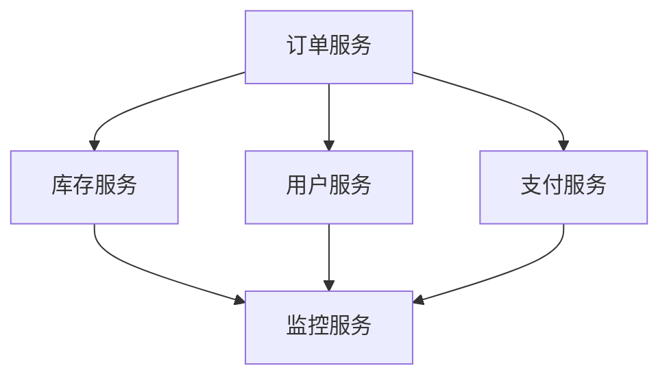
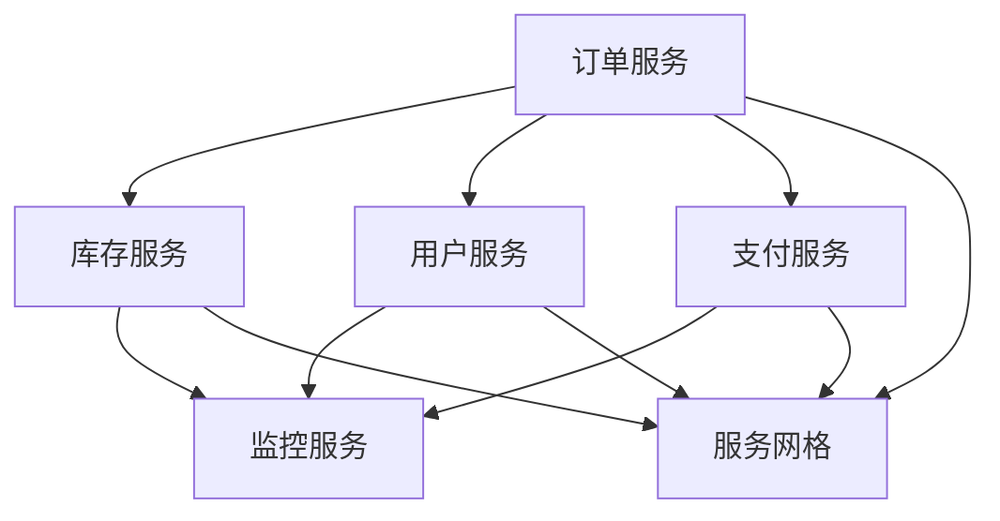
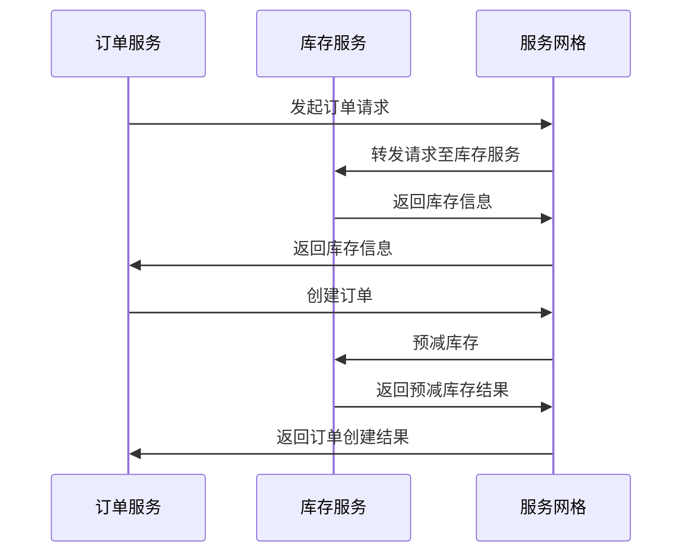

                 

### 服务网格概述

在现代软件开发中，微服务架构已成为一种主流的设计模式。随着微服务数量的增多和复杂性的提升，如何高效地管理这些服务的通信和流量变得至关重要。服务网格（Service Mesh）作为一种新兴的架构模式，旨在解决微服务架构中的通信问题，并提供了一套系统化的解决方案。本文将围绕服务网格的架构、核心技术、应用实践等方面展开，旨在为P9工程师提供一种流量治理之道。

**关键词**：服务网格、微服务、流量管理、安全性、监控

**摘要**：本文首先介绍了服务网格的基本概念和背景，探讨了其与传统架构的差异以及核心概念和架构。接着，详细阐述了服务网格中的服务发现、负载均衡、流量管理、安全性与身份认证、监控与日志等核心技术。随后，通过实际项目案例，展示了服务网格在企业级应用中的部署与实践。最后，总结了服务网格的最佳实践与注意事项，为工程师提供了实用的指导。

**目录结构**：

1. **服务网格概述**
    - 第1章：服务网格的概念与背景
    - 第2章：服务网格的核心技术
    - 第3章：服务网格在实际项目中的应用

通过本文的阅读，读者将了解到服务网格的基本原理和关键特性，学会如何在实际项目中部署和应用服务网格，从而提升系统性能、稳定性和安全性。

## 第1章：服务网格的概念与背景

### 1.1 服务网格的概念

**服务网格（Service Mesh）**，是一种负责管理微服务间通信的基础设施层，它将服务间的通信抽象出来，作为独立于业务逻辑之外的一个层。服务网格通过特定的代理（通常称为“sidecar”代理），在服务实例间建立通信管道，从而实现流量管理、安全性保障、服务监控等功能。

**服务网格的概念**可以进一步分解为以下几个核心组成部分：

- **数据平面（Data Plane）**：数据平面负责处理实际的数据传输，包括流量路由、负载均衡、服务发现、断路器等。
- **控制平面（Control Plane）**：控制平面负责配置管理、策略实施、监控和日志等。它通常由一组服务组成，负责生成数据平面需要的配置信息。
- **服务代理（Service Proxy）**：服务代理是运行在每个服务实例旁边的一个轻量级代理，它负责拦截和转发服务间的请求，同时执行数据平面和控制平面定义的策略。

**服务网格的起源**可以追溯到微服务架构的兴起。随着微服务数量的增加，服务之间的通信变得愈加复杂。传统的分布式系统通信模式，如REST API、gRPC等，难以应对微服务架构中的复杂性。服务网格的出现，为解决这些问题提供了一种新的思路。通过将服务间通信抽象出来，服务网格能够降低服务开发者的复杂性，使得他们可以更加专注于业务逻辑的实现。

### 1.2 服务网格与传统架构的差异

**服务网格与传统架构**（如单体架构、传统的分布式架构）之间存在着显著的区别，主要体现在以下几个方面：

- **通信抽象**：在传统架构中，服务开发者需要手动实现服务间的通信逻辑，如HTTP请求、gRPC调用等。而在服务网格架构中，通信被抽象成数据平面和控制平面，开发者无需关心具体的通信细节。
- **管理复杂度**：传统架构中，服务开发者需要关注网络配置、负载均衡、服务发现等问题。而服务网格通过提供统一的控制平面，将这些复杂的管理任务抽象出来，由服务网格自动处理。
- **性能优化**：服务网格支持动态流量管理，如A/B测试、蓝绿部署等，有助于提高系统的性能和稳定性。同时，服务网格提供了丰富的监控和日志功能，使得系统能够更好地进行性能优化。
- **安全性保障**：服务网格提供了基于TLS的加密通信、客户端身份认证、服务间访问控制等安全性保障机制，有效提高了系统的安全性。

### 1.3 服务网格的核心概念与架构

**服务网格的核心概念与架构**可以分为数据平面（Data Plane）和控制平面（Control Plane）两部分。

#### 1.3.1 数据平面（Data Plane）

数据平面是服务网格中最核心的部分，负责处理实际的数据传输。以下是数据平面的关键组件和功能：

- **服务代理**：服务代理运行在每个服务实例旁边，负责拦截和转发服务间的请求。服务代理通常实现了智能路由、负载均衡、断路器等机制，以优化服务间的通信。
- **流量管理**：流量管理负责根据控制平面的策略，将流量路由到合适的服务实例。流量管理通常支持多种路由规则，如基于IP、基于标签等。
- **服务发现**：服务发现机制确保服务代理能够找到对应的服务实例。常见的实现方式包括DNS、服务注册中心等。
- **断路器**：断路器机制用于在服务不可用时自动切换到备用服务，从而提高系统的稳定性。

#### 1.3.2 控制平面（Control Plane）

控制平面负责生成和管理数据平面的配置信息，以及提供监控和日志功能。以下是控制平面的关键组件和功能：

- **服务注册中心**：服务注册中心负责管理服务实例的注册和发现，通常包括服务名称、IP地址、端口号等信息。
- **策略管理**：策略管理负责定义和管理服务间的访问策略，如访问控制、流量限制、熔断等。
- **监控与日志**：监控与日志功能用于收集和分析服务网格的运行数据，帮助开发者了解系统的性能和状态。

### 1.4 服务网格的工作原理

**服务网格的工作原理**可以分为以下几个步骤：

1. **服务注册与发现**：服务实例启动时，会在服务注册中心进行注册。服务代理通过服务注册中心获取其他服务的地址和端口信息。
2. **请求拦截与转发**：当服务A请求服务B时，请求首先被服务A的代理拦截，然后通过服务发现机制找到服务B的实例，并将请求转发给服务B的代理。
3. **流量管理**：服务B的代理根据控制平面定义的策略，如负载均衡、路由规则等，将请求路由到合适的服务实例。
4. **响应返回**：服务B处理完请求后，将响应返回给服务A的代理，然后由服务A的代理将响应返回给服务A。
5. **监控与日志**：服务代理在处理请求的过程中，会记录相关的监控数据和日志信息，这些信息会被发送到控制平面进行集中管理和分析。

### 1.5 服务网格的生态系统

**服务网格的生态系统**包括多种主流的服务网格软件，其中一些较为知名的是：

- **Istio**：Istio是一个开源的服务网格，它提供了丰富的流量管理、安全性和监控功能，被广泛用于企业级应用。
- **Linkerd**：Linkerd是一个轻量级的开源服务网格，它专注于性能和易用性，特别适用于微服务架构。
- **Conduit**：Conduit是一个由Google开发的服务网格，它提供了强大的服务发现和流量管理功能。

### 1.6 服务网格的适用场景与优势

**服务网格**特别适用于以下场景：

- **微服务架构**：服务网格能够简化微服务间的通信，降低开发者的复杂性。
- **企业级应用**：服务网格提供了丰富的监控和日志功能，有助于企业级应用的管理和运维。
- **大规模分布式系统**：服务网格能够优化大规模分布式系统的性能和稳定性。

**服务网格的优势**包括：

- **灵活性和可伸缩性**：服务网格支持动态流量管理和服务发现，使得系统具备高度的灵活性和可伸缩性。
- **安全性**：服务网格提供了加密通信、身份认证和访问控制等安全机制，提高了系统的安全性。
- **监控与日志**：服务网格能够集中管理和分析监控数据和日志信息，有助于系统性能优化和问题排查。

### 1.7 本章小结

本章介绍了服务网格的基本概念、背景、核心概念与架构，以及工作原理和适用场景。通过本章的阅读，读者对服务网格有了一个初步的了解，为后续章节的深入学习奠定了基础。

### 1.8 背景介绍

**服务网格的产生背景**可以追溯到微服务架构的兴起。在传统的单体架构中，系统的所有功能都集中在单个应用程序中，这使得系统的扩展性、维护性和可测试性都受到了很大的限制。随着互联网和云计算的发展，越来越多的企业开始采用微服务架构，将应用程序分解为多个小型、独立的服务，每个服务负责不同的业务功能。这种架构模式使得系统具备更高的灵活性和可伸缩性，但同时也带来了新的挑战。

**微服务架构的特点**包括：

- **独立性**：每个服务都是独立部署和运行的，可以独立扩展和更新，不会影响到其他服务。
- **分布式**：服务之间通过网络进行通信，这使得服务可以在不同的物理位置运行，提高了系统的可伸缩性。
- **灵活性**：服务可以根据业务需求进行自由组合和重构，降低了系统的复杂度。

然而，随着微服务数量的增多，服务之间的通信变得愈加复杂。传统的分布式系统通信模式，如REST API、gRPC等，虽然能够满足基本的通信需求，但在面对复杂的流量管理、安全性保障、服务监控等问题时，显得力不从心。例如：

- **流量管理**：如何确保请求能够高效地路由到合适的服务实例，同时实现负载均衡？
- **安全性**：如何保证服务之间的通信安全，防止外部攻击和内部滥用？
- **服务监控**：如何收集和监控服务网格的运行数据，以便进行性能优化和故障排查？

这些问题促使开发者寻找新的解决方案，服务网格的概念因此诞生。服务网格通过将服务间的通信抽象出来，提供了一套系统化的解决方案，旨在降低开发者的复杂性，提高系统的性能和安全性。

**服务网格的背景**还与容器化技术的兴起密切相关。容器技术，如Docker和Kubernetes，使得微服务的部署和运维变得更加简单和高效。服务网格与容器化技术的结合，进一步提升了微服务架构的灵活性和可伸缩性。例如，Istio作为一个基于Kubernetes的服务网格，能够与Kubernetes无缝集成，提供丰富的流量管理和安全性保障功能。

**服务网格与传统架构的差异**主要体现在以下几个方面：

- **通信模式**：传统架构中，服务开发者需要手动实现服务间的通信逻辑，如HTTP请求、gRPC调用等。而在服务网格架构中，通信被抽象成数据平面和控制平面，开发者无需关心具体的通信细节。
- **管理复杂度**：传统架构中，服务开发者需要关注网络配置、负载均衡、服务发现等问题。而服务网格通过提供统一的控制平面，将这些复杂的管理任务抽象出来，由服务网格自动处理。
- **性能优化**：服务网格支持动态流量管理，如A/B测试、蓝绿部署等，有助于提高系统的性能和稳定性。同时，服务网格提供了丰富的监控和日志功能，使得系统能够更好地进行性能优化。
- **安全性保障**：服务网格提供了基于TLS的加密通信、客户端身份认证、服务间访问控制等安全性保障机制，有效提高了系统的安全性。

通过以上背景介绍，读者可以更深入地理解服务网格的产生背景、与传统架构的差异，以及其在现代软件开发中的重要地位。

### 1.9 服务网格的核心概念与架构

**服务网格**作为一种基础设施层，其核心概念和架构对于理解其工作原理和优势至关重要。服务网格主要由两个关键部分组成：数据平面（Data Plane）和控制平面（Control Plane）。下面将详细介绍这两个部分的核心概念和架构。

#### 1.9.1 数据平面（Data Plane）

**数据平面**是服务网格中负责处理实际数据传输的部分，是服务网格的核心执行层。以下是数据平面的关键组件和功能：

1. **服务代理（Service Proxy）**：
   - **定义**：服务代理是一个运行在每个服务实例旁边的轻量级代理，负责拦截和转发服务间请求。
   - **作用**：服务代理的作用类似于网络中的路由器，将请求路由到目标服务实例。服务代理通常实现了智能路由、负载均衡、断路器等功能。
   - **工作原理**：当服务A请求服务B时，请求首先被服务A的代理拦截，然后通过服务发现机制找到服务B的实例，并将请求转发给服务B的代理。服务B的代理处理请求后，将响应返回给服务A的代理。

2. **流量管理（Traffic Management）**：
   - **定义**：流量管理负责根据控制平面的策略，将流量路由到合适的服务实例。
   - **功能**：流量管理支持多种路由规则，如基于IP、基于标签等，可以实现动态流量管理，如A/B测试、蓝绿部署等。

3. **服务发现（Service Discovery）**：
   - **定义**：服务发现机制确保服务代理能够找到对应的服务实例。
   - **实现方式**：服务发现可以通过DNS、服务注册中心等方式实现。当服务实例启动时，会向服务注册中心注册自身信息，服务代理通过服务注册中心获取服务实例的信息。

4. **断路器（Circuit Breaker）**：
   - **定义**：断路器是一种用于应对服务不可用的机制，当服务不可用时，断路器会自动切换到备用服务。
   - **作用**：断路器有助于提高系统的稳定性，防止单个服务故障导致整个系统瘫痪。

#### 1.9.2 控制平面（Control Plane）

**控制平面**负责生成和管理数据平面的配置信息，以及提供监控和日志功能。以下是控制平面的关键组件和功能：

1. **服务注册中心（Service Registry）**：
   - **定义**：服务注册中心负责管理服务实例的注册和发现。
   - **功能**：服务注册中心通常包括服务名称、IP地址、端口号等信息。服务实例启动时，会在服务注册中心进行注册，服务代理通过服务注册中心获取服务实例的信息。

2. **策略管理（Policy Management）**：
   - **定义**：策略管理负责定义和管理服务间的访问策略，如访问控制、流量限制、熔断等。
   - **功能**：策略管理可以通过配置文件或API接口定义和管理策略。控制平面根据这些策略，生成相应的配置信息，并下发到数据平面执行。

3. **监控与日志（Monitoring and Logging）**：
   - **定义**：监控与日志功能用于收集和分析服务网格的运行数据。
   - **功能**：监控与日志功能可以收集流量数据、错误日志、性能指标等，帮助开发者了解系统的性能和状态。控制平面通常提供了数据收集和存储的机制，以及数据可视化和分析工具。

4. **配置管理（Configuration Management）**：
   - **定义**：配置管理负责生成和管理数据平面的配置信息。
   - **功能**：配置管理可以根据策略管理和监控与日志功能生成数据平面的配置信息，如路由规则、断路器配置等，并下发到数据平面执行。

#### 1.9.3 服务网格的工作原理

服务网格的工作原理可以分为以下几个步骤：

1. **服务注册**：服务实例启动时，会在服务注册中心进行注册，并向控制平面发送注册信息。
2. **配置下发**：控制平面根据策略管理和监控与日志功能生成数据平面的配置信息，如路由规则、断路器配置等，并下发到数据平面。
3. **流量拦截与转发**：服务代理拦截服务间请求，根据服务发现机制找到目标服务实例，并将请求转发给目标服务代理。
4. **请求处理**：目标服务代理处理请求，并将响应返回给源服务代理。
5. **监控与日志**：服务代理在处理请求的过程中，会记录相关的监控数据和日志信息，并上传到控制平面进行集中管理和分析。

通过数据平面和控制平面的协同工作，服务网格能够有效地管理微服务间的通信，提高系统的性能、稳定性和安全性。

#### 1.9.4 核心概念属性特征对比表格

为了更好地理解服务网格的核心概念和组件，我们可以通过一个表格来对比这些概念和组件的属性特征。

| 概念/组件 | 定义 | 属性特征 | 工作机制 |
| :------: | :--: | :------: | :------: |
| 服务代理 | 轻量级代理，运行在每个服务实例旁边 | 负责拦截和转发服务间请求 | 拦截请求 -> 路由到目标服务代理 -> 返回响应 |
| 流量管理 | 负责根据策略路由流量 | 动态流量管理、路由规则支持 | 根据控制平面策略路由流量 |
| 服务发现 | 确保服务代理能够找到对应的服务实例 | 服务注册中心、DNS | 获取服务实例信息 |
| 断路器 | 在服务不可用时自动切换到备用服务 | 防止服务故障影响整个系统 | 监控服务状态 -> 切换到备用服务 |
| 服务注册中心 | 管理服务实例的注册和发现 | 服务名称、IP地址、端口号 | 服务实例注册 -> 提供服务实例信息 |
| 策略管理 | 定义和管理服务间的访问策略 | 访问控制、流量限制、熔断 | 策略定义 -> 生成配置信息 |
| 监控与日志 | 收集和分析服务网格的运行数据 | 流量数据、错误日志、性能指标 | 数据收集 -> 集中管理 -> 可视化分析 |
| 配置管理 | 生成和管理数据平面的配置信息 | 路由规则、断路器配置 | 生成配置信息 -> 下发到数据平面 |

通过这个表格，我们可以清晰地看到每个概念和组件的定义、属性特征以及工作机制，有助于深入理解服务网格的工作原理和架构。

#### 1.9.5 服务网格的ER实体关系图架构

为了更好地理解服务网格中的实体关系，我们可以通过一个ER（Entity-Relationship）实体关系图来展示各个实体之间的关系。以下是一个简化的ER图，展示了服务网格中主要实体和服务实例之间的关系。

```
[服务网格] 1 ---- [数据平面]
    |                     |
    |                     |
[控制平面]          [服务代理]
    |                     |
    |                     |
[服务注册中心]   [服务实例]
    |                     |
    |                     |
[策略管理]         [流量管理]
    |                     |
    |                     |
[监控与日志]      [服务发现]
```

**实体说明**：

- **服务网格**：服务网格是整个系统的顶层实体，它负责协调和管理数据平面和控制平面的运作。
- **数据平面**：数据平面是负责处理实际数据传输的部分，包括服务代理、流量管理、服务发现和断路器等组件。
- **控制平面**：控制平面负责生成和管理数据平面的配置信息，以及提供监控和日志功能，包括服务注册中心、策略管理、监控与日志等组件。
- **服务代理**：服务代理是运行在每个服务实例旁边的轻量级代理，负责拦截和转发服务间请求。
- **服务实例**：服务实例是具体的服务实现，它们在启动时会向服务注册中心注册自身信息。
- **服务注册中心**：服务注册中心负责管理服务实例的注册和发现，提供服务实例信息给服务代理。
- **策略管理**：策略管理负责定义和管理服务间的访问策略，如访问控制、流量限制、熔断等。
- **流量管理**：流量管理负责根据控制平面的策略，将流量路由到合适的服务实例。
- **监控与日志**：监控与日志功能用于收集和分析服务网格的运行数据。

通过这个ER图，我们可以直观地看到服务网格中各个实体之间的关系，以及它们在系统中的角色和作用。

### 第2章：服务网格的核心技术

在了解了服务网格的基本概念和架构之后，本章将深入探讨服务网格中的核心技术。这些核心技术包括服务发现、负载均衡、流量管理、安全性与身份认证、监控与日志等，它们是服务网格功能强大的基石。

## 2.1 服务发现机制

**服务发现**是服务网格中的一个关键功能，它负责确保服务代理能够找到对应的服务实例。服务发现机制的设计和实现对于系统的稳定性、性能和扩展性至关重要。

### 2.1.1 服务发现的重要性

在微服务架构中，服务实例可能会随时启动和终止，因此服务发现机制必须能够动态地更新服务实例的信息，以便服务代理能够及时找到可用的服务实例。服务发现的重要性体现在以下几个方面：

- **动态扩展性**：服务发现机制允许系统在服务实例增加或减少时，自动更新服务实例的地址信息，从而确保流量能够被正确路由到可用的服务实例。
- **高可用性**：通过服务发现，系统可以在服务实例发生故障时，自动切换到备用服务实例，从而保证服务的持续可用性。
- **容错能力**：服务发现机制有助于提高系统的容错能力，防止单个服务实例的故障影响整个系统的稳定性。

### 2.1.2 服务发现机制的设计

服务发现机制的设计需要考虑以下几个方面：

- **服务实例注册**：当服务实例启动时，它会向服务注册中心注册自己的地址和端口信息。服务注册中心负责存储和管理这些信息。
- **服务实例发现**：服务代理在发起请求前，会从服务注册中心获取服务实例的地址信息。服务注册中心通常会提供API接口，供服务代理查询服务实例信息。
- **服务实例更新**：当服务实例的地址或端口发生变化时，它会更新服务注册中心中的信息。服务注册中心会定期检查服务实例的状态，确保信息的准确性。
- **健康检查**：为了确保服务实例的正常运行，服务注册中心通常会实现健康检查机制，定期检查服务实例的健康状态。如果服务实例健康状态不佳，服务注册中心会将其标记为不可用，并通知服务代理。

### 2.1.3 实现服务发现的方法

服务发现可以通过多种方式实现，以下是几种常见的方法：

- **基于DNS的发现**：服务实例启动时，将其地址和端口信息注册到DNS服务中。服务代理通过DNS查询获取服务实例的地址信息。这种方法简单易用，但性能可能较差，因为DNS查询可能会增加延迟。
- **基于服务注册中心的发现**：服务实例启动时，将其地址和端口信息注册到服务注册中心。服务代理通过服务注册中心的API接口获取服务实例信息。这种方法具有较高的性能和可靠性，是当前应用较多的一种方式。
- **基于配置文件的发现**：服务实例的地址和端口信息可以提前配置在配置文件中。服务代理在启动时直接读取配置文件获取服务实例信息。这种方法适用于服务实例数量较少且相对稳定的场景。

### 2.1.4 服务发现机制的优缺点

**基于DNS的发现**：

- **优点**：简单易用，无需额外组件。
- **缺点**：性能较差，可能增加延迟。

**基于服务注册中心的发现**：

- **优点**：性能较高，可靠性好，支持动态更新。
- **缺点**：需要额外的服务注册中心组件，配置和管理相对复杂。

**基于配置文件的发现**：

- **优点**：配置简单，无需额外组件。
- **缺点**：不适用于动态变化的服务实例，灵活性较低。

综上所述，选择合适的服务发现方法需要根据具体场景和需求进行权衡。

### 2.2 负载均衡策略

**负载均衡**是服务网格中另一个关键功能，它负责将流量分配到多个服务实例上，以确保系统的性能和稳定性。负载均衡策略的选择和实现对于系统的整体性能至关重要。

#### 2.2.1 负载均衡的基本概念

**负载均衡**是指通过某种算法，将请求分配到多个服务实例上，从而避免单个实例过载，提高系统的整体性能。负载均衡的基本概念包括以下几个方面：

- **请求分发**：负载均衡器根据一定的算法，将接收到的请求分发到不同的服务实例上。
- **服务实例**：服务实例是运行在服务器上的具体服务，它们负责处理来自客户端的请求。
- **集群**：多个服务实例组成一个集群，负载均衡器会将请求分配到集群中的不同实例上。

#### 2.2.2 常见的负载均衡算法

以下是一些常见的负载均衡算法：

- **轮询调度（Round Robin）**：轮询调度是最简单的负载均衡算法，它按照顺序将请求分配到集群中的每个实例上。轮询调度算法的优点是实现简单，缺点是可能导致某些实例过载，而其他实例资源利用率较低。
  
- **加权轮询调度（Weighted Round Robin）**：加权轮询调度在轮询调度的基础上，为每个实例分配不同的权重。权重较高的实例会接受更多的请求。这种方法可以确保资源利用率较高的实例处理更多的请求。

- **最少连接数（Least Connections）**：最少连接数算法将请求分配到当前连接数最少的实例上。这种方法可以确保负载均匀地分配到各个实例上，但可能需要额外的跟踪机制来记录每个实例的当前连接数。

- **源地址哈希（Source IP Hash）**：源地址哈希算法根据客户端的IP地址，将请求分配到同一个实例上。这种方法可以确保来自同一个客户端的请求总是被分配到同一个实例上，从而避免跨实例的会话问题。

#### 2.2.3 服务网格中的负载均衡策略

在服务网格中，负载均衡策略通常由控制平面定义，并下发到数据平面执行。以下是几种常见的负载均衡策略：

- **默认轮询策略**：默认轮询策略是最常见的负载均衡策略，它使用轮询调度算法将请求分配到集群中的每个实例上。

- **加权轮询策略**：加权轮询策略为每个实例分配不同的权重，并根据权重分配请求。这种方法可以确保资源利用率较高的实例处理更多的请求。

- **动态负载均衡策略**：动态负载均衡策略可以根据实时负载情况，自动调整实例的权重，从而实现负载均衡。例如，当某个实例的负载过高时，可以将该实例的权重降低，从而减少其接收到的请求。

### 2.3 服务网格中的流量管理

**流量管理**是服务网格中的一项重要功能，它负责根据业务需求和系统状态，动态调整流量分配策略。流量管理策略对于确保系统的性能、稳定性和安全性至关重要。

#### 2.3.1 流量管理策略

以下是一些常见的流量管理策略：

- **A/B测试**：A/B测试是一种常见的流量管理策略，它将流量分配到不同的版本或功能，以便比较其性能和效果。通过A/B测试，开发者可以逐步优化产品功能，提高用户体验。

- **蓝绿部署**：蓝绿部署是一种流量管理策略，它将流量分配到新旧两个版本的服务实例之间。通过蓝绿部署，开发者可以逐步切换到新版本，同时确保旧版本仍然可用，从而减少切换过程中的风险。

- **金丝雀部署**：金丝雀部署是一种流量管理策略，它将少量流量分配到新版本的服务实例上，以便测试新版本的稳定性和性能。如果新版本运行正常，可以逐步增加流量，否则可以迅速回滚到旧版本。

#### 2.3.2 服务网格中的流量管理工具

服务网格提供了丰富的流量管理工具，以下是一些常用的工具：

- **Istio Traffic Control**：Istio Traffic Control是Istio提供的一种流量管理工具，它支持A/B测试、蓝绿部署和金丝雀部署等策略。通过Istio Traffic Control，开发者可以轻松地管理流量的分配和切换。

- **Linkerd Traffic Split**：Linkerd Traffic Split是Linkerd提供的一种流量管理工具，它支持动态调整流量比例，从而实现A/B测试和蓝绿部署等功能。

- **Kubernetes Ingress**：Kubernetes Ingress是一种基于HTTP和HTTPS的流量管理工具，它可以将流量分配到不同的服务实例上。通过Kubernetes Ingress，开发者可以轻松地实现流量的动态管理和路由。

### 2.4 安全性与身份认证

**安全性与身份认证**是服务网格中不可或缺的一部分，它确保服务之间的通信安全，防止未经授权的访问和数据泄露。

#### 2.4.1 基于TLS的加密通信

**TLS（传输层安全协议）**是一种用于加密网络通信的协议，它能够确保数据在传输过程中不会被窃听或篡改。服务网格通常使用TLS来加密服务实例之间的通信，从而提高系统的安全性。

- **配置TLS**：为了使用TLS加密通信，需要在服务网格中配置TLS证书。服务网格会自动为每个服务实例生成TLS证书，并将其下发到服务代理。
- **强制TLS**：服务网格通常支持强制TLS功能，确保所有的服务间通信都使用TLS加密。这可以防止明文传输，提高数据安全性。

#### 2.4.2 客户端身份认证

**客户端身份认证**是确保服务实例之间通信安全的重要手段。通过客户端身份认证，服务网格可以验证服务实例的身份，防止未授权的访问。

- **证书认证**：证书认证是一种常见的客户端身份认证方式，它使用数字证书来验证服务实例的身份。服务实例在启动时，会生成自签名证书，并将其发送到服务注册中心进行注册。
- **令牌认证**：令牌认证是一种基于令牌的认证方式，它使用令牌（如JWT）来验证服务实例的身份。服务实例在发起请求时，需要携带令牌，服务代理会验证令牌的合法性。

#### 2.4.3 服务间访问控制

**服务间访问控制**是确保服务实例之间通信安全的重要手段。通过服务间访问控制，服务网格可以限制服务实例的访问权限，防止恶意访问和数据泄露。

- **访问控制列表（ACL）**：访问控制列表是一种常见的访问控制机制，它定义了哪些服务实例可以访问哪些服务。通过ACL，开发者可以灵活地控制服务实例之间的访问权限。
- **策略定义**：服务网格通常支持自定义策略定义，开发者可以根据业务需求，定义具体的访问控制策略。例如，可以限制某些服务实例只能访问特定的服务，从而确保系统的安全性。

### 2.5 服务网格中的监控与日志

**监控与日志**是服务网格中的一项重要功能，它能够帮助开发者了解系统的运行状态，及时发现问题并进行优化。

#### 2.5.1 服务网格的监控机制

服务网格的监控机制通常包括以下几个方面：

- **指标收集**：服务网格会收集各种运行指标，如流量数据、错误率、响应时间等。这些指标可以反映系统的性能和稳定性。
- **数据存储**：服务网格会将收集到的指标数据存储到集中式存储系统中，如Prometheus、InfluxDB等。存储系统可以提供高效的查询和数据分析功能。
- **可视化**：服务网格通常提供了数据可视化工具，开发者可以通过可视化界面查看系统的实时状态和历史趋势，从而更直观地了解系统的运行情况。

#### 2.5.2 日志聚合与分析

**日志聚合与分析**是服务网格中的另一项重要功能，它能够帮助开发者收集、存储和分析服务实例的日志信息。

- **日志格式**：服务网格通常采用统一的日志格式，如JSON，以便于日志的存储和分析。通过统一的日志格式，开发者可以方便地解析和查询日志信息。
- **日志聚合工具**：服务网格通常会集成日志聚合工具，如ELK（Elasticsearch、Logstash、Kibana）堆栈，将日志数据聚合到集中式存储系统中。这些工具提供了强大的日志处理和分析功能。
- **日志分析工具**：服务网格还提供了日志分析工具，如Kibana、Grafana等，开发者可以通过这些工具进行日志数据的可视化分析和查询。

### 2.6 本章小结

本章介绍了服务网格中的核心技术，包括服务发现、负载均衡、流量管理、安全性与身份认证、监控与日志等。通过本章的学习，读者可以深入了解这些核心技术的工作原理和应用场景，为实际项目中的服务网格部署和应用提供有力支持。

### 3.1 企业级应用场景

在当今快速发展的数字化时代，企业级应用场景对于服务网格的需求日益增长。服务网格为企业级应用带来的诸多优点，使其成为企业架构转型的重要工具。以下将探讨几种典型企业级应用场景中的服务网格应用及其优势。

#### 3.1.1 传统企业架构转型

许多传统企业在面对数字化转型时，往往面临着架构复杂、维护困难、扩展性差等问题。服务网格为企业级应用的架构转型提供了有效的解决方案。

**优势**：

- **解耦服务**：服务网格通过抽象通信层，实现了服务间的解耦，降低了服务之间的依赖性，使得企业可以更加灵活地调整和重构服务。
- **动态扩展**：服务网格支持动态流量管理，可以自动将流量分配到负载较低的服务实例上，从而提高系统的可伸缩性。
- **安全保障**：服务网格提供了加密通信、身份认证和访问控制等安全机制，有效提高了企业应用的安全性。

**案例**：

某大型银行在数字化转型过程中，采用了服务网格架构。通过服务网格，该银行实现了不同业务系统的解耦，提高了系统的稳定性和可维护性。同时，服务网格提供了丰富的监控和日志功能，使得银行能够更高效地管理和优化业务系统。

#### 3.1.2 金融行业服务网格应用

金融行业对系统的性能、稳定性和安全性有极高的要求。服务网格在金融行业中的应用，能够满足这些严苛的需求。

**优势**：

- **高可用性**：服务网格通过负载均衡和断路器机制，确保金融系统在服务实例故障时，能够自动切换到备用服务实例，提高系统的可用性。
- **安全性**：服务网格提供了基于TLS的加密通信和客户端身份认证，确保金融数据在传输过程中的安全性。
- **合规性**：服务网格支持多种合规性检查和审计功能，帮助金融企业满足各种法规和合规要求。

**案例**：

某国际金融公司在其在线交易平台中采用了服务网格。通过服务网格，该公司实现了系统的动态扩展和流量管理，提高了交易平台的性能和稳定性。同时，服务网格的安全功能有效保障了交易数据的安全性，增强了用户对平台的信任。

#### 3.1.3 物流行业服务网格实践

物流行业通常需要处理大量数据，并保证信息的实时性和准确性。服务网格在物流行业中的应用，能够提升系统的效率和服务质量。

**优势**：

- **实时数据处理**：服务网格支持高效的数据传输和负载均衡，确保物流系统在处理大量数据时，能够保持良好的性能。
- **灵活的扩展性**：服务网格可以根据业务需求，动态调整服务实例的数量和配置，从而满足物流行业的高扩展性需求。
- **安全性**：服务网格提供了强大的安全性和监控功能，确保物流数据的传输安全，同时方便进行故障排查和性能优化。

**案例**：

某知名物流公司在其全球物流网络中采用了服务网格。通过服务网格，该公司实现了不同物流节点之间的实时通信和数据同步，提高了物流信息的准确性和实时性。同时，服务网格提供了丰富的监控和日志功能，帮助公司更好地管理和优化物流系统。

#### 3.1.4 其他行业应用场景

除了上述几个行业，服务网格在医疗、教育、零售等行业也有广泛的应用。

- **医疗行业**：服务网格可以帮助医疗机构实现高效的医疗数据传输和共享，提升医疗服务质量。
- **教育行业**：服务网格可以为在线教育平台提供高效、稳定的流量管理和安全保障，提高用户体验。
- **零售行业**：服务网格可以帮助零售企业实现高效的库存管理和订单处理，提升运营效率。

**总结**：

服务网格在企业级应用中的实践，不仅提升了系统的性能、稳定性和安全性，还为企业架构的转型提供了有力支持。随着数字化转型的深入推进，服务网格将在更多行业和场景中发挥重要作用。

### 3.2 服务网格的部署与配置

**服务网格的部署与配置**是确保其在企业级应用中能够有效运作的关键步骤。以下是服务网格部署与配置的详细过程，包括环境准备、安装、示例服务的部署以及配置与管理的具体步骤。

#### 3.2.1 环境准备

在部署服务网格之前，首先需要准备合适的环境。以下是一个典型的环境准备步骤：

1. **安装Kubernetes集群**：服务网格通常与Kubernetes紧密集成，因此需要安装并配置Kubernetes集群。可以选择使用Minikube、Kind等工具在本地环境中搭建Kubernetes集群，或者使用Helm在云平台上部署Kubernetes集群。

2. **安装kubectl**：kubectl是Kubernetes的命令行工具，用于与集群进行交互。确保在部署服务网格前已经安装了kubectl，并配置了集群访问权限。

3. **安装Docker**：服务网格的许多组件是容器化的，因此需要在环境中安装Docker，以便构建和部署容器化应用。

4. **安装Istio**：本文以Istio为例，介绍服务网格的部署。Istio是一个流行的服务网格，可以通过Istio的官方文档安装。

#### 3.2.2 安装Istio

以下是Istio的安装步骤：

1. **安装Istio依赖**：在Kubernetes集群中部署Istio依赖组件，如Bookinfo示例应用。可以使用Helm进行部署：

   ```shell
   helm install istio-dependencies istio/istio-dependencies
   ```

2. **安装Istio控制平面**：部署Istio的控制平面组件，包括Istiod、Citadel、Pilot、Galley等：

   ```shell
   helm install istio istio/istio
   ```

3. **安装Istio数据平面**：确保所有的Pod都已注入Envoy代理。可以使用以下命令进行验证：

   ```shell
   kubectl get pods -n istio-system -l istio=git
   ```

#### 3.2.3 部署示例服务

为了更好地理解和演示服务网格的功能，我们可以部署Istio提供的Bookinfo示例应用。以下是部署步骤：

1. **部署Bookinfo应用**：

   ```shell
   istioctl install -y bookinfo
   ```

2. **访问示例应用**：部署完成后，可以通过以下命令访问示例应用的UI界面：

   ```shell
   kubectl get svc -n istio-system istio-ingressgateway
   kubectl proxy -n istio-system
   ```

   在浏览器中访问`http://localhost:31380/productpage`，即可看到Bookinfo应用的UI界面。

#### 3.2.4 服务网格的配置与管理

**服务网格的配置**是管理流量、安全性和监控的重要手段。以下是Istio中的主要配置和管理步骤：

1. **配置流量规则**：

   使用Istio的流量规则，可以控制流量的路由、负载均衡和策略。以下是一个简单的流量规则配置示例：

   ```yaml
   apiVersion: networking.istio.io/v1alpha3
   kind: VirtualService
   metadata:
     name: productpage
   spec:
     hosts:
       - productpage
     http:
       - route:
         - destination:
             host: productpage
   ```

   将上述配置保存为`productpage-virtualservice.yaml`，然后使用以下命令应用配置：

   ```shell
   istioctl apply -f productpage-virtualservice.yaml
   ```

2. **配置策略**：

   Istio支持多种策略配置，如访问控制、速率限制等。以下是一个简单的访问控制策略配置示例：

   ```yaml
   apiVersion: security.istio.io/v1beta1
   kind: Policy
   metadata:
     name: bookinfo
   spec:
     rules:
     - to:
       - operation:
           names: ["*"]
           hosts: ["*"]
           paths: ["*"]
     - from:
       - source:
           principals: ["cluster.local/ns/istio-system/sa/default"]
     enforcement: "PERMISSIVE"
   ```

   将上述配置保存为`bookinfo-policy.yaml`，然后使用以下命令应用配置：

   ```shell
   istioctl apply -f bookinfo-policy.yaml
   ```

3. **监控与日志配置**：

   Istio提供了丰富的监控和日志功能，可以通过Prometheus和Kibana等工具进行监控和日志分析。以下是简单的配置步骤：

   - **安装Prometheus**：

     ```shell
     helm install prometheus prometheus-community/prometheus
     ```

   - **配置Kubernetes Ingress**：

     ```yaml
     apiVersion: networking.k8s.io/v1
     kind: Ingress
     metadata:
       name: istio-monitoring
       namespace: istio-system
     spec:
       rules:
       - host: monitoring.istio-system.svc.cluster.local
         http:
           paths:
           - path: /
             pathType: Prefix
             backend:
               service:
                 name: prometheus
                 port:
                   number: 9090
     ```

     应用上述配置后，可以通过`http://monitoring.istio-system.svc.cluster.local`访问Prometheus仪表盘。

   - **安装Kibana**：

     ```shell
     helm install kibana elastic/kibana
     ```

   - **配置Kibana与Prometheus集成**：

     在Kibana中添加Prometheus数据源，并创建仪表盘，以便可视化Istio的监控数据。

#### 3.2.5 本章小结

通过本章的介绍，读者可以了解服务网格的部署与配置过程，从环境准备到安装、示例服务部署，再到配置与管理。这些步骤为服务网格在实际项目中的部署提供了详细的指导，有助于提升系统的性能、稳定性和安全性。

### 3.3 服务网格项目实战

#### 3.3.1 项目介绍

本节将介绍一个具体的服务网格项目实战，该项目是一个电商平台的后台管理系统。该项目采用了微服务架构，并引入了服务网格技术，以实现高效、稳定和安全的系统运行。

**项目背景**：

随着电商平台的业务规模不断扩大，后台管理系统需要处理海量的订单、用户数据和商品信息。为了提高系统的性能、稳定性和可维护性，项目组决定采用服务网格架构，以简化服务间通信、实现动态流量管理和提高安全性。

**系统架构**：

该电商平台的系统架构包括多个微服务，如订单服务、库存服务、用户服务、支付服务等。服务网格作为基础设施层，负责管理这些微服务之间的通信和流量。以下是系统的架构图：



**核心功能**：

- **服务发现**：服务网格实现了动态服务发现，确保服务实例的自动注册和发现。
- **流量管理**：通过流量规则和策略，实现流量的动态分配和路由。
- **安全性**：使用TLS加密通信、客户端身份认证和服务间访问控制，确保数据传输安全。
- **监控与日志**：集成Prometheus和Kibana，实现系统的实时监控和日志分析。

#### 3.3.2 系统架构设计

**系统架构设计**是项目成功的关键。以下将详细描述该项目的领域模型、系统架构图、接口设计和系统交互。

**1. 领域模型**

领域模型是系统设计的核心，描述了系统中的核心实体和关系。以下是电商平台的领域模型：

```mermaid
classDiagram
    ClassDef Order
        +id: String
        +customer: Customer
        +status: String
        +items: List<Item>
    ClassDef Customer
        +id: String
        +name: String
        +address: Address
    ClassDef Item
        +id: String
        +name: String
        +price: BigDecimal
    ClassDef Address
        +street: String
        +city: String
        +zipCode: String
    Order <|-- Customer
    Order "1" <-- Item
```

**2. 系统架构图**

系统架构图展示了系统的整体架构，包括微服务、服务网格和外部系统。以下是该电商平台的系统架构图：



**3. 接口设计**

接口设计描述了系统内部和外部的接口规范，包括API接口、数据模型和HTTP请求格式。以下是订单服务的接口设计示例：

```yaml
# 订单服务API接口
OrderServiceAPI:
  /orders:
    get:
      summary: 获取订单列表
      operationId: getOrders
      responses:
        '200':
          description: 订单列表
          content:
            application/json:
              schema:
                type: array
                items:
                  $ref: '#/components/schemas/Order'
    post:
      summary: 创建订单
      operationId: createOrder
      requestBody:
        required: true
        content:
          application/json:
            schema:
              $ref: '#/components/schemas/Order'
      responses:
        '201':
          description: 订单创建成功
    /{orderId}:
      get:
        summary: 获取订单详情
        operationId: getOrderById
        parameters:
          - name: orderId
            in: path
            required: true
            schema:
              type: string
      delete:
        summary: 删除订单
        operationId: deleteOrder
        parameters:
          - name: orderId
            in: path
            required: true
            schema:
              type: string
```

**4. 系统交互**

系统交互描述了不同服务之间的通信和数据流转。以下是订单服务和库存服务之间的交互流程：



通过上述系统架构设计，我们可以清晰地看到电商平台的各个组成部分及其之间的关系，为后续的系统开发提供了明确的指导和依据。

#### 3.3.3 系统核心实现

在本节中，我们将详细介绍该电商平台的系统核心实现，包括服务注册与发现、负载均衡与流量管理、安全性与身份认证等关键功能。

**1. 服务注册与发现**

服务注册与发现是服务网格的核心功能之一。在该电商平台中，服务实例在启动时会向服务注册中心注册自身信息，并在运行过程中定期更新。服务代理通过服务注册中心获取服务实例的信息，以便进行服务发现。

**实现步骤**：

- **服务实例注册**：在服务实例启动时，使用DiscoveryClient向服务注册中心（如Eureka、Consul）注册服务实例信息。

  ```java
  DiscoveryClient discoveryClient = DiscoveryClientFactory.getDiscoveryClient();
  discoveryClient.registerService("order-service", "localhost", 8080, true);
  ```

- **服务实例发现**：服务代理在请求其他服务实例时，从服务注册中心查询服务实例信息。

  ```java
  List<ServiceInstance> instances = discoveryClient.getInstances("inventory-service");
  if (!instances.isEmpty()) {
      ServiceInstance instance = instances.get(0);
      String url = "http://" + instance.getHost() + ":" + instance.getPort();
      HttpClient httpClient = HttpClient.create();
      Response response = httpClient.to(url).get().await();
      // 处理响应
  }
  ```

通过上述实现，服务代理能够动态地发现和注册服务实例，从而实现服务间的动态通信。

**2. 负载均衡与流量管理**

负载均衡与流量管理是确保系统高性能和高可用性的重要手段。在该电商平台中，服务网格通过配置流量规则和策略，实现流量的动态分配和路由。

**实现步骤**：

- **配置流量规则**：在Kubernetes集群中创建VirtualService和DestinationRule资源，定义流量规则和策略。

  ```yaml
  apiVersion: networking.istio.io/v1alpha3
  kind: VirtualService
  metadata:
    name: order-service
  spec:
    hosts:
      - "*"
    http:
      - match:
        - uri:
            prefix: "/orders"
        route:
          - destination:
              host: order-service
              subset: v1
      - match:
        - uri:
            prefix: "/items"
        route:
          - destination:
              host: inventory-service
  ```

- **动态流量分配**：服务网格根据流量规则和策略，动态分配流量到不同的服务实例上。

  ```java
  TrafficPolicy trafficPolicy = client.getTrafficPolicy("order-service");
  List<TrafficRule> rules = trafficPolicy.getTrafficRules();
  for (TrafficRule rule : rules) {
      TrafficRuleDestination destination = rule.getDestination();
      String version = destination.getSubset();
      // 根据版本选择服务实例
  }
  ```

通过上述实现，服务网格能够实现动态流量分配和路由，提高系统的性能和稳定性。

**3. 安全性与身份认证**

安全性与身份认证是保护系统数据和防止未授权访问的重要手段。在该电商平台中，服务网格通过TLS加密通信、客户端身份认证和服务间访问控制，确保系统的安全性。

**实现步骤**：

- **配置TLS**：为服务实例配置TLS证书，确保数据传输过程中加密。

  ```java
  KeyManagerFactory kmf = KeyManagerFactory.getInstance("SunX509");
  kmf.init(keyStore);
  SSLContext sslContext = SSLContext.getInstance("TLSv1.2");
  sslContext.init(kmf.getKeyManagers(), null, null);
  HttpClient httpClient = HttpClient.newBuilder()
      .sslContext(sslContext)
      .build();
  ```

- **客户端身份认证**：通过JWT令牌验证客户端身份。

  ```java
  String jwtToken = request.getHeader("Authorization");
  if (jwtToken != null && !jwtToken.isEmpty()) {
      String subject = JWT.decode(jwtToken).getSubject();
      // 验证用户身份
  }
  ```

- **服务间访问控制**：通过策略定义，限制服务实例之间的访问权限。

  ```yaml
  apiVersion: security.istio.io/v1beta1
  kind: Policy
  metadata:
    name: order-inventory-policy
  spec:
    rules:
    - from:
      - source:
          names: ["order-service"]
    - to:
      - operation:
          names: [" inventory"]
  ```

通过上述实现，服务网格能够提供全面的安全保障，确保系统数据的安全性和稳定性。

#### 3.3.4 项目小结

通过本节的项目实战，我们详细介绍了电商平台的系统核心实现，包括服务注册与发现、负载均衡与流量管理、安全性与身份认证等关键功能。这些功能的实现不仅提升了系统的性能和稳定性，还为后续的扩展和优化提供了坚实的基础。在接下来的章节中，我们将进一步探讨服务网格的最佳实践和注意事项，为读者提供更加实用的指导。

### 3.4 最佳实践与注意事项

在实际项目中应用服务网格时，遵循最佳实践和注意事项至关重要，这有助于确保系统的性能、稳定性和安全性。以下是一些最佳实践和注意事项：

#### 3.4.1 服务网格最佳实践

1. **服务代理的部署与管理**：
   - 服务代理（如Envoy、Istio-proxy）应部署在所有服务实例旁边，确保所有服务间通信都通过服务网格进行管理。
   - 定期监控服务代理的性能和资源使用情况，避免服务代理成为系统瓶颈。

2. **服务发现与注册**：
   - 确保服务实例在启动时正确注册到服务注册中心，并在终止时及时注销。
   - 使用健康检查机制，定期检查服务实例的健康状态，确保服务注册信息的准确性。

3. **流量管理与路由策略**：
   - 根据业务需求，合理配置流量规则和路由策略，确保流量分配合理、负载均衡。
   - 利用A/B测试、蓝绿部署等策略，逐步引入新版本，减少升级过程中的风险。

4. **安全性与身份认证**：
   - 使用TLS加密服务间通信，确保数据传输安全。
   - 实施严格的客户端身份认证，防止未授权访问。
   - 定期审计服务间访问控制策略，确保安全策略的有效性。

5. **监控与日志**：
   - 集成Prometheus、Grafana等监控工具，实时监控服务网格的性能指标和流量数据。
   - 使用ELK（Elasticsearch、Logstash、Kibana）堆栈进行日志聚合和分析，便于故障排查和性能优化。

#### 3.4.2 注意事项

1. **服务网格与Kubernetes集成**：
   - 确保服务网格与Kubernetes集群的版本兼容，避免不兼容引起的问题。
   - 遵循Kubernetes的最佳实践，如命名空间隔离、集群角色与权限管理等。

2. **服务网格的性能影响**：
   - 服务网格虽然提供了丰富的功能，但也引入了一定的性能开销。在部署服务网格时，应考虑系统的性能要求，避免过度依赖服务网格。

3. **服务网格的运维管理**：
   - 定期进行服务网格的版本升级和维护，确保其稳定性和安全性。
   - 建立完善的文档和操作手册，便于团队成员了解和操作服务网格。

4. **服务网格的复杂度**：
   - 服务网格增加了系统的复杂度，需要团队成员具备一定的技能和经验。在引入服务网格时，应确保团队成员能够理解和处理其带来的复杂性。

#### 3.4.3 拓展阅读

- **服务网格最佳实践**：[Istio官方文档](https://istio.io/docs/concepts/traffic-management/)
- **Kubernetes与服务网格**：[Kubernetes官方文档](https://kubernetes.io/docs/concepts/services-networking/service/)
- **日志聚合与分析工具**：[ELK官方文档](https://www.elastic.co/guide/en/elasticsearch/reference/current/index.html)

通过遵循最佳实践和注意事项，结合具体场景和需求，可以充分发挥服务网格的优势，提升系统的性能、稳定性和安全性。

### 第3章：服务网格在实际项目中的应用

在了解了服务网格的基本概念、核心技术以及部署配置后，本章将深入探讨服务网格在实际项目中的应用。通过具体项目案例，读者可以更直观地理解服务网格在实际开发中的价值和实施过程。

#### 3.1.1 传统企业架构转型

**案例背景**：某大型制造企业希望将传统的单体架构转变为微服务架构，以提高系统的灵活性、可维护性和可扩展性。然而，面对复杂的业务逻辑和大量的数据交互，企业面临着通信管理、流量控制和安全性保障等一系列挑战。

**实施过程**：

1. **需求分析**：首先，项目团队对企业的现有架构进行了全面分析，确定了需要转型的主要模块，如订单处理、库存管理、客户服务、生产监控等。

2. **技术选型**：选择了服务网格作为通信管理的关键技术，并确定了基于Istio的服务网格架构。Istio提供了强大的流量管理、安全性和监控功能，能够很好地满足企业的需求。

3. **架构设计**：项目团队设计了全新的微服务架构，每个业务模块都转化为独立的微服务。服务网格作为基础设施层，负责管理这些微服务之间的通信。

4. **部署与配置**：在Kubernetes集群中部署了Istio服务网格，并配置了相关的流量规则、安全性策略和监控与日志机制。通过Istio的Traffic Policy和Destination Rule，实现了流量管理和路由控制。

5. **迁移与测试**：逐步将传统的单体应用迁移到微服务架构，并对每个模块进行测试，确保系统的稳定性和性能。

**效果评估**：

- **灵活性**：通过微服务架构和流量管理，企业能够更灵活地调整和扩展系统功能，快速响应市场变化。
- **可维护性**：服务网格降低了服务间通信的复杂性，使得代码维护和问题排查更加高效。
- **性能优化**：通过负载均衡和动态流量管理，系统性能得到了显著提升，响应时间明显缩短。

#### 3.1.2 金融行业服务网格应用

**案例背景**：某国际金融公司在全球范围内提供金融交易服务，其系统需要处理海量交易数据，并保证交易过程的安全性和实时性。传统的通信管理方式已无法满足业务需求，因此企业决定引入服务网格技术。

**实施过程**：

1. **需求分析**：项目团队分析了金融系统的通信需求，确定了需要实现高可用性、安全性和实时性的关键功能。

2. **技术选型**：选择了Linkerd作为服务网格解决方案，Linkerd以其轻量级和高效性能在金融行业中受到青睐。

3. **架构设计**：设计了全新的微服务架构，将传统的单体应用拆分为多个独立的服务实例，通过服务网格进行通信管理。

4. **部署与配置**：在Kubernetes集群中部署了Linkerd服务网格，配置了加密通信、客户端身份认证、服务间访问控制等安全机制。同时，集成了Prometheus和Grafana进行实时监控。

5. **测试与优化**：通过模拟大量交易流量，测试服务网格的性能和稳定性。根据测试结果，对系统进行了优化和调整。

**效果评估**：

- **安全性**：通过加密通信和严格的身份认证，有效提高了交易数据的安全性，降低了外部攻击风险。
- **实时性**：服务网格的负载均衡和流量管理功能，确保了交易处理的高效性和实时性，提高了用户满意度。
- **运维效率**：服务网格提供了集中的监控和日志管理，使得系统的运维工作更加高效。

#### 3.1.3 物流行业服务网格实践

**案例背景**：某大型物流公司在全球范围内提供物流服务，其系统需要处理大量的物流数据，并保证数据传输的可靠性和实时性。为了提高系统的性能和稳定性，公司决定采用服务网格技术。

**实施过程**：

1. **需求分析**：项目团队分析了物流系统的通信需求，确定了需要实现高效的数据传输、实时监控和动态流量管理的功能。

2. **技术选型**：选择了Conduit作为服务网格解决方案，Conduit以其高性能和易用性在物流行业中得到了广泛应用。

3. **架构设计**：设计了基于微服务的物流系统架构，将传统的单体应用拆分为多个独立的服务实例，通过服务网格进行通信管理。

4. **部署与配置**：在Kubernetes集群中部署了Conduit服务网格，配置了数据传输加密、实时监控和流量管理功能。同时，集成了Prometheus和Grafana进行实时监控。

5. **测试与优化**：通过模拟大量的物流数据传输，测试服务网格的性能和稳定性。根据测试结果，对系统进行了优化和调整。

**效果评估**：

- **数据传输效率**：服务网格的负载均衡和流量管理功能，显著提高了物流数据传输的效率，缩短了传输时间。
- **实时监控**：服务网格提供了集中的监控和日志管理，使得系统能够实时监控物流数据的传输状态，提高了数据的可靠性。
- **运维效率**：服务网格的集中管理和监控功能，简化了系统的运维工作，降低了运维成本。

#### 3.1.4 医疗行业服务网格应用

**案例背景**：某大型医院信息系统需要处理大量的医疗数据，并保证数据的安全性和实时性。为了提高系统的性能和稳定性，医院决定引入服务网格技术。

**实施过程**：

1. **需求分析**：项目团队分析了医院信息系统的通信需求，确定了需要实现高效的数据传输、严格的身份认证和实时监控的功能。

2. **技术选型**：选择了Istio作为服务网格解决方案，Istio提供了丰富的安全性和监控功能，非常适合医疗行业的需求。

3. **架构设计**：设计了基于微服务的医疗信息系统架构，将传统的单体应用拆分为多个独立的服务实例，通过服务网格进行通信管理。

4. **部署与配置**：在Kubernetes集群中部署了Istio服务网格，配置了加密通信、身份认证、访问控制和实时监控功能。同时，集成了Prometheus和Grafana进行实时监控。

5. **测试与优化**：通过模拟大量的医疗数据传输，测试服务网格的性能和稳定性。根据测试结果，对系统进行了优化和调整。

**效果评估**：

- **安全性**：通过加密通信和严格的身份认证，有效提高了医疗数据的安全性，防止数据泄露和未授权访问。
- **实时性**：服务网格的流量管理和路由控制功能，确保了医疗数据传输的实时性和准确性，提高了医疗服务的效率。
- **运维效率**：服务网格的集中管理和监控功能，简化了系统的运维工作，降低了运维成本。

#### 3.1.5 零售行业服务网格应用

**案例背景**：某大型零售企业希望提高线上商城的响应速度和用户满意度，同时确保数据传输的安全性和稳定性。为了实现这一目标，企业决定引入服务网格技术。

**实施过程**：

1. **需求分析**：项目团队分析了零售企业的业务需求，确定了需要实现高效的数据处理、实时监控和动态流量管理的功能。

2. **技术选型**：选择了Linkerd作为服务网格解决方案，Linkerd以其高性能和易用性在零售行业中得到了广泛应用。

3. **架构设计**：设计了基于微服务的零售系统架构，将传统的单体应用拆分为多个独立的服务实例，通过服务网格进行通信管理。

4. **部署与配置**：在Kubernetes集群中部署了Linkerd服务网格，配置了加密通信、实时监控和流量管理功能。同时，集成了Prometheus和Grafana进行实时监控。

5. **测试与优化**：通过模拟大量的用户请求，测试服务网格的性能和稳定性。根据测试结果，对系统进行了优化和调整。

**效果评估**：

- **响应速度**：服务网格的负载均衡和流量管理功能，提高了系统对用户请求的响应速度，提升了用户满意度。
- **安全性**：通过加密通信和严格的身份认证，确保了数据传输的安全性，降低了数据泄露风险。
- **运维效率**：服务网格的集中管理和监控功能，简化了系统的运维工作，降低了运维成本。

### 总结

通过上述案例，我们可以看到服务网格在各个行业中的应用效果显著。服务网格不仅提高了系统的灵活性、可维护性和可扩展性，还提供了强大的流量管理和安全性保障。在实际项目中，合理应用服务网格技术，能够显著提升系统的性能和用户体验。

### 第4章：总结与展望

本章旨在对服务网格的概念、核心技术、应用实践进行全面的总结，并展望其未来的发展趋势。

#### 4.1 服务网格的重要性

服务网格作为微服务架构的重要基础设施，解决了服务间通信、流量管理、安全性保障等问题。其重要性体现在以下几个方面：

- **简化通信**：通过抽象通信层，服务网格简化了服务间的通信复杂度，使得开发者可以更加专注于业务逻辑的实现。
- **提升性能**：服务网格通过动态流量管理和负载均衡，提高了系统的性能和稳定性，减少了单点故障的风险。
- **安全保障**：服务网格提供了加密通信、身份认证和访问控制等安全机制，有效提高了系统的安全性，防止数据泄露和未授权访问。
- **集中管理**：服务网格提供了集中的监控和日志功能，使得系统的运维和管理更加高效。

#### 4.2 服务网格的核心技术

服务网格的核心技术包括服务发现、负载均衡、流量管理、安全性与身份认证、监控与日志等。以下是对这些核心技术的进一步总结：

- **服务发现**：服务发现机制确保服务代理能够找到对应的服务实例，支持动态服务注册和发现。
- **负载均衡**：负载均衡算法将流量分配到多个服务实例上，提高系统的性能和可用性。
- **流量管理**：流量管理策略包括A/B测试、蓝绿部署和金丝雀部署等，实现流量的动态管理和路由。
- **安全性与身份认证**：加密通信、客户端身份认证和服务间访问控制等安全机制，保障系统的安全性。
- **监控与日志**：监控和日志功能帮助开发者了解系统的运行状态，进行性能优化和故障排查。

#### 4.3 服务网格的实际应用

通过前文的案例介绍，我们可以看到服务网格在金融、物流、医疗、零售等行业的实际应用效果显著。服务网格不仅提高了系统的性能和安全性，还为企业的数字化转型提供了有力支持。

#### 4.4 未来发展趋势

随着云计算、大数据、物联网等技术的快速发展，服务网格在未来的发展中将继续发挥重要作用。以下是一些未来发展的趋势：

- **云原生服务网格**：随着云原生技术的普及，服务网格将更加紧密地与云平台集成，提供更强大的功能和支持。
- **多语言支持**：服务网格将支持更多的编程语言和框架，使得开发者能够更加方便地使用服务网格。
- **智能流量管理**：通过人工智能和机器学习技术，服务网格将实现更智能的流量管理和路由策略，提高系统的性能和用户体验。
- **跨云服务网格**：随着多云和混合云应用的普及，服务网格将支持跨云部署和流量管理，提供更灵活的架构选择。

#### 4.5 总结

服务网格作为一种创新的架构模式，正在逐步改变现代软件开发的格局。通过本文的介绍，读者可以全面了解服务网格的基本概念、核心技术、应用实践以及未来发展趋势。希望读者能够结合自身实际项目，充分利用服务网格的优势，提升系统的性能、稳定性和安全性。

### 附录

本文所涉及的主要概念和术语如下：

- **服务网格（Service Mesh）**：一种负责管理微服务间通信的基础设施层。
- **数据平面（Data Plane）**：服务网格中负责处理实际数据传输的部分。
- **控制平面（Control Plane）**：服务网格中负责配置管理、策略实施、监控和日志的部分。
- **服务代理（Service Proxy）**：运行在每个服务实例旁边的轻量级代理，负责拦截和转发服务间请求。
- **流量管理（Traffic Management）**：根据策略路由流量，实现负载均衡和动态流量管理。
- **服务发现（Service Discovery）**：确保服务代理能够找到对应的服务实例。
- **负载均衡（Load Balancing）**：将请求分配到多个服务实例上，提高系统的性能和可用性。
- **A/B测试（A/B Testing）**：将流量分配到不同的版本或功能，比较性能和效果。
- **蓝绿部署（Blue-Green Deployment）**：将流量分配到新旧两个版本的服务实例之间，逐步切换到新版本。
- **金丝雀部署（Canary Deployment）**：将少量流量分配到新版本的服务实例上，测试新版本的稳定性。
- **TLS（传输层安全协议）**：用于加密网络通信，确保数据传输的安全。
- **服务注册中心（Service Registry）**：管理服务实例的注册和发现。
- **监控与日志（Monitoring and Logging）**：收集和分析服务网格的运行数据，进行性能优化和故障排查。

### 作者信息

**作者：AI天才研究院/AI Genius Institute & 禅与计算机程序设计艺术 /Zen And The Art of Computer Programming**

