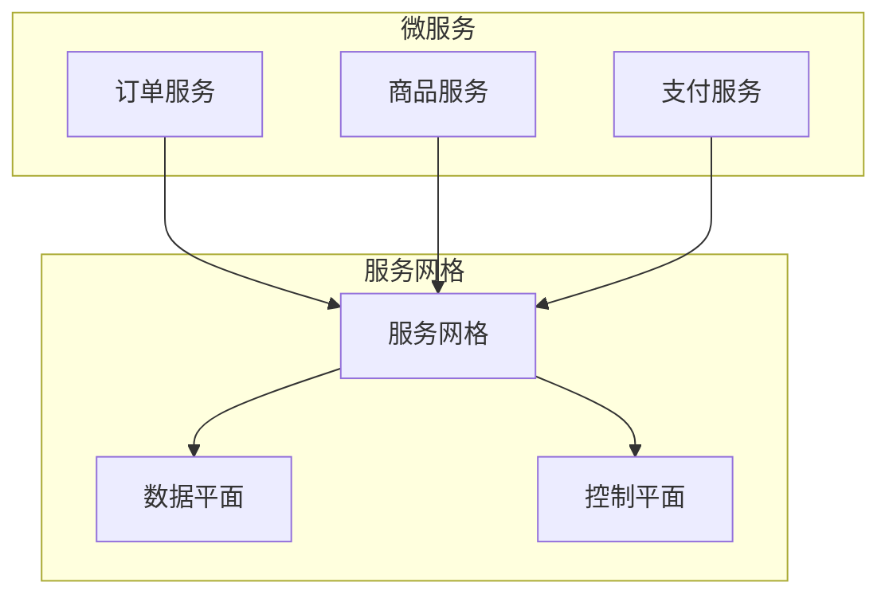
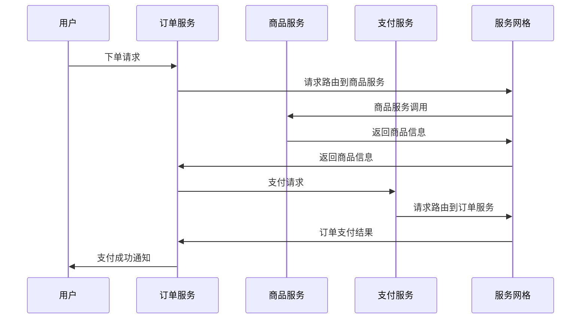

                 

# 服务网格：微服务通信的基础设施层

## 关键词
- 服务网格
- 微服务
- 负载均衡
- 服务发现
- 安全认证

## 摘要
本文旨在深入探讨服务网格在微服务通信中的基础设施层作用。我们将从服务网格的定义、核心功能、实现与部署、案例分析及未来发展趋势等方面进行详细分析，帮助读者理解服务网格如何简化微服务架构的通信，提高系统的可靠性和灵活性。

## 目录

1. **服务网格概述**
    1.1 服务网格的概念与背景
    1.2 微服务架构与服务网格的关系
    1.3 服务网格的发展历程
    1.4 服务网格的关键组件

2. **服务网格的核心功能**
    2.1 服务发现与负载均衡
    2.2 路由与策略控制
    2.3 服务熔断与限流
    2.4 安全与认证
    2.5 日志聚合与监控

3. **服务网格实现与部署**
    3.1 xDS协议
    3.2 Istio架构
    3.3 Linkerd架构
    3.4 服务网格与Kubernetes集成

4. **服务网格部署实践**
    4.1 环境准备
    4.2 服务网格安装
    4.3 服务网格配置
    4.4 服务网格监控与运维

5. **服务网格案例分析**
    5.1 电商平台的微服务架构与服务网格应用
    5.2 金融科技公司的服务网格实践
    5.3 多云架构下的服务网格部署

6. **服务网格的高级应用**
    6.1 服务网格在多云环境中的应用
    6.2 服务网格与边缘计算
    6.3 服务网格的未来发展趋势

7. **附录**
    7.1 学习资源推荐
    7.2 开源工具推荐
    7.3 社区与论坛推荐
    7.4 深入学习推荐

## 第一部分：服务网格概述

### 第1章：服务网格的概念与背景

#### 1.1 服务网格的定义

服务网格（Service Mesh）是一种用于管理服务间通信的基础设施层。在微服务架构中，服务网格抽象了服务之间的通信，从而简化了服务之间的交互复杂性。

#### 1.2 微服务架构与服务网格的关系

微服务架构通过将应用程序分解为多个独立的、可复用的服务来实现模块化和灵活性。服务网格则负责这些服务之间的通信，提供负载均衡、服务发现、安全等功能。

#### 1.3 服务网格的发展历程

服务网格的概念起源于容器和微服务技术的发展。随着Kubernetes等容器编排系统的兴起，服务网格作为其基础设施层的一部分，逐渐得到了广泛关注和应用。

#### 1.4 服务网格的关键组件

服务网格主要由以下组件构成：
- 数据平面（Data Plane）：处理实际的服务间通信。
- 控制平面（Control Plane）：负责配置管理和策略执行。

### 第二部分：服务网格的核心功能

#### 第2章：服务网格的核心功能

#### 2.1 服务发现与负载均衡

服务网格通过服务发现机制，动态发现和注册服务，并提供负载均衡功能，确保请求能够高效地路由到正确的服务实例。

#### 2.2 路由与策略控制

服务网格支持灵活的路由规则和策略控制，允许开发者根据业务需求动态调整服务之间的通信路径。

#### 2.3 服务熔断与限流

服务网格提供服务熔断和限流机制，防止服务雪崩和过载，提高系统的可靠性。

#### 2.4 安全与认证

服务网格通过集成安全协议和认证机制，确保服务间通信的安全性。

#### 2.5 日志聚合与监控

服务网格提供日志聚合和监控功能，帮助开发者实时了解服务状态和性能指标。

### 第三部分：服务网格实现与部署

#### 第3章：服务网格实现技术

#### 3.1 xDS协议

xDS协议是服务网格常用的数据平面和控制平面通信协议。它定义了服务网格组件之间的交互机制。

#### 3.2 Istio架构

Istio是一个流行的开源服务网格，提供了丰富的功能，包括服务发现、负载均衡、安全认证等。

#### 3.3 Linkerd架构

Linkerd是另一个流行的开源服务网格，专注于性能和可观察性。

#### 3.4 服务网格与Kubernetes集成

服务网格通常与Kubernetes等容器编排系统集成，以提供更好的服务管理和监控功能。

### 第四部分：服务网格部署实践

#### 第4章：服务网格部署实践

#### 4.1 环境准备

在部署服务网格之前，需要准备适当的环境，包括Kubernetes集群、必要的网络配置等。

#### 4.2 服务网格安装

根据所选的服务网格，安装相应的控制平面和数据平面组件。

#### 4.3 服务网格配置

配置服务网格，包括服务发现规则、负载均衡策略、安全认证等。

#### 4.4 服务网格监控与运维

监控服务网格的运行状态，并进行必要的运维操作，如故障排除、性能调优等。

### 第五部分：服务网格案例分析

#### 第5章：服务网格案例分析

#### 5.1 电商平台的微服务架构与服务网格应用

分析一个电商平台的微服务架构，展示服务网格如何简化其服务之间的通信。

#### 5.2 金融科技公司的服务网格实践

探讨金融科技公司如何利用服务网格提高其系统的可靠性。

#### 5.3 多云架构下的服务网格部署

分析多云架构下的服务网格部署策略，展示如何在不同云环境中实现服务网格的统一管理。

### 第六部分：服务网格的高级应用

#### 第6章：服务网格的高级应用

#### 6.1 服务网格在多云环境中的应用

探讨服务网格如何在多云环境中实现服务的一致性管理。

#### 6.2 服务网格与边缘计算

分析服务网格在边缘计算中的应用，展示如何优化边缘服务之间的通信。

#### 6.3 服务网格的未来发展趋势

预测服务网格的未来发展趋势，探讨其在人工智能、5G等新兴领域中的应用潜力。

### 第七部分：附录

#### 第7章：附录

#### 7.1 学习资源推荐

推荐一些服务网格相关的学习资源和文档。

#### 7.2 开源工具推荐

推荐一些流行的服务网格开源工具。

#### 7.3 社区与论坛推荐

推荐一些服务网格相关的社区和论坛。

#### 7.4 深入学习推荐

推荐一些服务网格的深入学习和实践指南。

### 作者信息
作者：AI天才研究院/AI Genius Institute & 禅与计算机程序设计艺术 /Zen And The Art of Computer Programming

## 背景介绍

### 核心概念术语说明

- **服务网格**：一种用于管理服务间通信的基础设施层。
- **微服务**：一种架构风格，将应用程序分解为多个独立的、可复用的服务。
- **Kubernetes**：一个开源的容器编排系统，用于自动化容器部署和管理。

### 问题背景

随着互联网和云计算的发展，单体应用逐渐难以满足业务需求。微服务架构以其模块化、可扩展性和灵活性逐渐成为主流。然而，服务之间的通信复杂性随之增加，传统的服务管理方式已无法满足需求。服务网格的出现，旨在简化微服务之间的通信，提高系统的可靠性和可维护性。

### 问题描述

在微服务架构中，服务之间需要频繁进行通信。如何有效地管理这些通信，确保服务的高可用性和性能，是一个亟待解决的问题。

### 问题解决

服务网格通过提供一系列核心功能，如服务发现、负载均衡、路由策略、安全认证等，有效地简化了服务之间的通信。它将服务之间的通信抽象为统一的数据平面，由控制平面进行管理，从而降低系统的复杂性。

### 边界与外延

服务网格不仅适用于微服务架构，还可以应用于其他分布式系统，如容器化应用、云原生应用等。它是一种通用的分布式系统基础设施，具有广泛的应用前景。

### 概念结构与核心要素组成

- **数据平面**：处理实际的服务间通信，包括代理和代理配置。
- **控制平面**：负责服务网格的管理和配置，包括服务发现、策略控制等。

## 核心概念与联系

### 核心概念原理

- **服务网格**：一种基础设施层，用于管理服务间通信。
- **微服务**：一种架构风格，将应用程序分解为多个独立的、可复用的服务。

### 概念属性特征对比表格

| 特征 | 服务网格 | 微服务 |
| --- | --- | --- |
| 范围 | 分布式系统基础设施 | 应用程序架构风格 |
| 目标 | 简化服务间通信 | 提高应用程序的可维护性和可扩展性 |
| 主要功能 | 服务发现、负载均衡、安全认证等 | 独立部署、独立演进、松耦合等 |

### ER实体关系图架构

```mermaid
erDiagram
    ServiceMesh ||--|{ Service : 被管理服务 }
    ServiceMesh ||--|{ ControlPlane : 控制平面 }
    ServiceMesh ||--|{ DataPlane : 数据平面 }
    Service <<|-- ControlPlane : 管理控制平面 }
    Service <<|-- DataPlane : 数据平面代理 }
    Service --> ServiceMesh : 服务网格管理 }
```

## 算法原理讲解

### 算法mermaid流程图


### 算法原理

服务网格中的算法主要涉及以下几个方面：

1. **服务发现**：通过服务发现机制，动态发现和注册服务实例。
2. **负载均衡**：根据服务实例的健康状态和负载情况，选择合适的实例进行服务调用。
3. **服务调用**：通过服务网格代理，将请求路由到目标服务实例。
4. **服务响应**：处理服务响应，返回结果给客户端。

### Python源代码

```python
import requests
from random import choice

def discover_services():
    # 服务发现，获取所有可用服务实例
    services = ["service1", "service2", "service3"]
    return services

def load_balance(services):
    # 负载均衡，选择一个健康状态好的服务实例
    healthy_services = [s for s in services if s["health"] == "healthy"]
    return choice(healthy_services)

def service_call(service_url):
    # 服务调用，发送HTTP请求到服务实例
    response = requests.get(service_url)
    return response.json()

def service_response(response):
    # 服务响应，处理响应并返回结果
    return response["data"]

# 主程序
def main():
    services = discover_services()
    service = load_balance(services)
    service_url = f"http://{service['ip']}:{service['port']}"
    response = service_call(service_url)
    result = service_response(response)
    print(result)

if __name__ == "__main__":
    main()
```

### 算法原理的数学模型和公式

1. **服务发现**：假设服务集合为\( S \)，每个服务实例为\( s_i \)，服务发现算法的目标是动态发现和注册所有服务实例。
2. **负载均衡**：假设服务实例的健康状态为\( H(s_i) \)，负载情况为\( L(s_i) \)，负载均衡算法的目标是选择健康状态好且负载较低的服务实例。
3. **服务调用**：服务调用过程可以看作是一个概率模型，根据负载均衡策略和服务实例的健康状态，选择一个合适的实例进行调用。
4. **服务响应**：服务响应过程可以看作是一个数据处理过程，根据服务实例的返回结果，进行处理并返回。

## 数学公式

$$
H(s_i) = \begin{cases}
1, & \text{如果服务实例健康} \\
0, & \text{如果服务实例不健康}
\end{cases}
$$

$$
L(s_i) = \frac{1}{\sum_{j=1}^{n} L(s_j)}
$$

## 系统分析与架构设计方案

### 问题场景介绍

假设一个电商平台，其后台系统采用微服务架构，包括订单服务、商品服务、支付服务等多个服务。这些服务需要高效、可靠地进行通信，以确保系统的稳定运行。

### 项目介绍

本项目旨在搭建一个服务网格，用于管理电商平台后台系统的服务间通信，提高系统的可靠性和性能。

### 系统功能设计（领域模型mermaid类图）

```mermaid
classDiagram
    ServiceMesh <<interface>>
    Service <<interface>>
    DataPlane <<interface>>
    ControlPlane <<interface>>

    ServiceMesh : +discover_services()
    ServiceMesh : +register_service()
    ServiceMesh : +load_balance()

    Service : +call()
    Service : +response()

    DataPlane : +forward_request()
    ControlPlane : +configure_policy()
```

### 系统架构设计（mermaid架构图）



### 系统接口设计和系统交互（mermaid序列图）



## 项目实战

### 环境安装

在开始安装服务网格之前，确保已经安装了Kubernetes集群。安装服务网格时，可以选择Istio或Linkerd等流行的开源服务网格。

#### 安装Istio

1. 下载Istio安装包。

```shell
curl -L https://istio.io/downloadIstio | sh -
```

2. 解压安装包。

```shell
tar -xvf istio-1.11.0-linux.tar.gz
```

3. 初始化Istio。

```shell
istioctl install --set profile=demo
```

#### 安装Linkerd

1. 下载Linkerd安装包。

```shell
curl -sfL https://run.linkerd.io/install.sh | sh -
```

2. 安装Linkerd。

```shell
curl -sfL https://run.linkerd.io/install.sh | sh -
```

### 系统核心实现源代码

以下是一个简单的Istio服务发现和负载均衡的示例：

```yaml
# 服务定义
apiVersion: v1
kind: Service
metadata:
  name: service-discovery
spec:
  selector:
    app: service-discovery
  ports:
    - name: http
      protocol: TCP
      port: 80
      targetPort: 8080
  type: LoadBalancer

# 部署应用
apiVersion: apps/v1
kind: Deployment
metadata:
  name: service-discovery
spec:
  selector:
    matchLabels:
      app: service-discovery
  template:
    metadata:
      labels:
        app: service-discovery
    spec:
      containers:
      - name: service-discovery
        image: service-discovery:latest
        ports:
        - containerPort: 8080
```

### 代码应用解读与分析

以上代码定义了一个服务名为`service-discovery`的服务和部署。服务定义中，我们指定了服务的类型为`LoadBalancer`，并设置了服务的选择器。部署定义中，我们指定了服务的标签和容器的镜像。

通过此配置，服务网格将自动发现和注册服务，并使用负载均衡策略将请求路由到不同的服务实例。

### 实际案例分析和详细讲解剖析

假设我们有一个电商平台，其微服务架构如下：

1. **订单服务**：负责处理订单的创建、更新和查询。
2. **商品服务**：负责处理商品的信息查询和库存更新。
3. **支付服务**：负责处理支付请求和支付结果通知。

这些服务之间需要进行频繁的通信，以确保订单的正确处理和商品的实时库存更新。

#### 案例分析

1. **订单创建**：用户在电商平台下单时，订单服务会调用商品服务查询商品库存，并调用支付服务进行支付。服务网格通过服务发现机制，动态发现和注册商品服务和支付服务的实例，并使用负载均衡策略选择健康状态好且负载较低的服务实例进行调用。

2. **商品库存更新**：当用户下单成功后，订单服务会通知商品服务更新商品库存。商品服务在接收到更新请求后，会更新数据库中的商品库存信息，并返回更新结果给订单服务。

3. **支付结果通知**：支付服务在处理支付请求后，会通知订单服务支付结果。订单服务在接收到支付结果通知后，会更新订单状态，并发送支付成功通知给用户。

通过服务网格的管理，这些服务之间的通信变得更加简单和可靠。服务网格提供了服务发现、负载均衡、路由策略等功能，确保服务之间的调用高效、可靠。

### 项目小结

通过本案例，我们可以看到服务网格在电商平台微服务架构中的应用，如何简化服务之间的通信，提高系统的可靠性和性能。服务网格的核心功能，如服务发现、负载均衡、路由策略等，在微服务架构中发挥了重要作用。通过使用服务网格，开发者可以更加专注于业务逻辑的实现，而无需担心服务之间的通信问题。

### 最佳实践 Tips

1. 选择合适的服务网格：根据业务需求和团队技能，选择适合的服务网格，如Istio、Linkerd等。
2. 优化服务网格配置：合理配置服务网格，如负载均衡策略、路由规则等，以提高系统的性能和可靠性。
3. 定期监控和运维：定期监控服务网格的运行状态，并进行必要的运维操作，如故障排除、性能调优等。

### 小结

服务网格作为微服务通信的基础设施层，在提高系统可靠性、性能和可维护性方面发挥了重要作用。通过本文的详细分析和实战案例，读者可以更好地理解服务网格的核心功能、实现与部署方法，以及在微服务架构中的应用。未来，服务网格将在云计算、边缘计算等新兴领域继续发挥重要作用，为开发者提供更加高效、可靠的分布式系统基础设施。

### 注意事项

1. 服务网格的部署需要考虑到网络的稳定性和性能。
2. 合理配置服务网格，避免过载和资源浪费。
3. 定期更新和维护服务网格，确保其稳定运行。

### 拓展阅读

1. 《服务网格技术指南》
2. 《Istio实战：基于微服务架构的云原生应用构建》
3. 《Linkerd实战：服务网格在微服务架构中的应用》

作者：AI天才研究院/AI Genius Institute & 禅与计算机程序设计艺术 /Zen And The Art of Computer Programming

