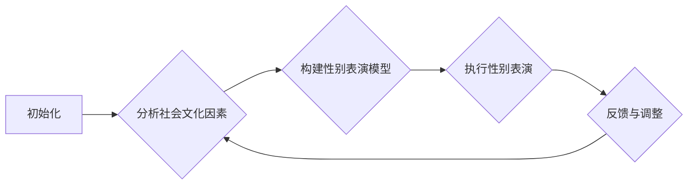
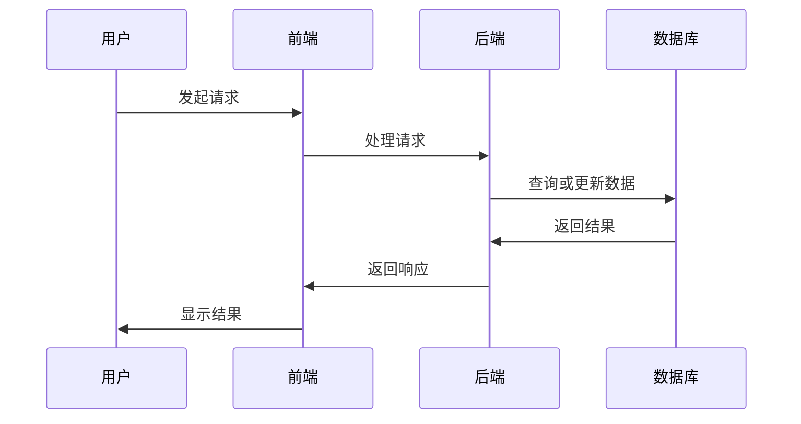

                 

### 文章标题：朱迪斯·巴特勒与唐娜·哈拉维：后现代女性主义思想

关键词：后现代女性主义、性别表演、性别身份、赛博女性主义、文化批判

摘要：本文旨在探讨后现代女性主义思想的发展及其代表人物朱迪斯·巴特勒和唐娜·哈拉维的理论贡献。文章将从后现代主义的兴起与女性主义的发展出发，详细解析巴特勒和哈拉维的核心思想，探讨这些思想在当代社会中的应用与影响。最后，本文将展望后现代女性主义面临的挑战与未来发展。

### 目录大纲

#### 第一部分：后现代女性主义背景与核心概念

1. **后现代主义的兴起与女性主义的发展**
   - 1.1 后现代主义的背景
   - 1.2 女性主义在现代社会中的演变
   - 1.3 朱迪斯·巴特勒与唐娜·哈拉维：后现代女性主义的代表人物

2. **朱迪斯·巴特勒的思想体系**
   - 2.1 巴特勒的“性别作为表演”
     - 2.1.1 性别表演的理论框架
     - 2.1.2 性别表演的实践意义
   - 2.2 巴特勒的“性别不稳定理论”
     - 2.2.1 性别的不稳定性
     - 2.2.2 性别身份的构建与解构

3. **唐娜·哈拉维的思想体系**
   - 3.1 哈拉维的“赛博女性主义”
     - 3.1.1 赛博女性主义的概念
     - 3.1.2 赛博女性主义的目标
   - 3.2 哈拉维的“文化批判”
     - 3.2.1 文化的本质
     - 3.2.2 文化的批判与重建

#### 第二部分：后现代女性主义的实际应用

4. **后现代女性主义在当代社会中的应用**
   - 4.1 社会运动中的女性主义力量
   - 4.2 教育领域的性别平等
   - 4.3 政治领域中的女性主义影响

5. **后现代女性主义在文化创作中的体现**
   - 5.1 文学中的后现代女性主义
   - 5.2 艺术中的后现代女性主义
   - 5.3 媒体中的后现代女性主义

6. **后现代女性主义面临的挑战与未来**
   - 6.1 后现代女性主义的理论争议
   - 6.2 当代社会对后现代女性主义的接受度
   - 6.3 后现代女性主义的未来发展展望

7. **朱迪斯·巴特勒与唐娜·哈拉维思想的影响与遗产**
   - 7.1 巴特勒思想的遗产
   - 7.2 哈拉维思想的遗产
   - 7.3 后现代女性主义的影响与启示

8. **结论：后现代女性主义的时代意义与价值**

### 文章内容

接下来，我们将详细探讨后现代女性主义的背景、核心概念、代表人物以及其实际应用和未来展望。

#### 第一部分：后现代女性主义背景与核心概念

**1. 后现代主义的兴起与女性主义的发展**

**1.1 后现代主义的背景**

后现代主义是一种哲学和文化思潮，起源于20世纪中叶的法国，它对现代性、真理、意义和价值的本质提出了质疑。后现代主义认为，现代性的理念是有限的，它无法完全解释和理解现实世界。因此，后现代主义倡导对传统观念和文化的批判性思考。

**1.2 女性主义在现代社会中的演变**

女性主义是一种追求性别平等的社会运动和哲学思潮。在现代社会中，女性主义经历了多个阶段，从早期的妇女权利运动到后现代女性主义。后现代女性主义强调性别的不稳定性和性别身份的多样性。

**1.3 朱迪斯·巴特勒与唐娜·哈拉维：后现代女性主义的代表人物**

朱迪斯·巴特勒和唐娜·哈拉维是后现代女性主义的两位重要代表人物。巴特勒提出了“性别作为表演”和“性别不稳定理论”，而哈拉维则提出了“赛博女性主义”和“文化批判”。

#### 第二部分：朱迪斯·巴特勒的思想体系

**2.1 巴特勒的“性别作为表演”**

巴特勒的“性别作为表演”理论认为，性别是一种社会和文化建构，它不是固定的，而是通过持续的身体表演和行为来构建和维持的。这个理论挑战了传统性别观念的二元对立，提出了性别身份的多样性。

**2.2 巴特勒的“性别不稳定理论”**

巴特勒的“性别不稳定理论”认为，性别身份是动态的，不是静态的。性别身份受到社会和文化因素的影响，是可以被重新定义和构建的。

#### 第三部分：唐娜·哈拉维的思想体系

**3.1 哈拉维的“赛博女性主义”**

哈拉维的“赛博女性主义”理论认为，在数字化和科技化的时代，女性可以通过赛博空间来反抗传统性别角色的压迫。这个理论强调了科技和女性主义的结合。

**3.2 哈拉维的“文化批判”**

哈拉维的“文化批判”理论认为，文化是一种权力工具，它用来维持社会的不平等和压迫。通过批判文化，女性可以挑战和颠覆这些不平等和压迫。

#### 第四部分：后现代女性主义的实际应用

**4. 后现代女性主义在当代社会中的应用**

后现代女性主义在当代社会中有着广泛的应用，包括社会运动、教育、政治和文化创作等领域。

**4.1 社会运动中的女性主义力量**

后现代女性主义为社会运动提供了理论支持，推动了性别平等和女性权益的争取。

**4.2 教育领域的性别平等**

后现代女性主义在教育领域中强调性别平等，推动了对传统教育观念的批判和改革。

**4.3 政治领域中的女性主义影响**

后现代女性主义对政治领域产生了深远影响，推动了女性在政治领域的参与和代表。

#### 第五部分：后现代女性主义在文化创作中的体现

**5. 后现代女性主义在文化创作中的体现**

后现代女性主义在文学、艺术和媒体等领域中有着丰富的体现，反映了女性主义的多样性和创新性。

**5.1 文学中的后现代女性主义**

后现代女性主义在文学作品中通过叙事技巧和主题探讨，展现了女性主义的视角和思考。

**5.2 艺术中的后现代女性主义**

后现代女性主义在艺术创作中通过视觉形式和概念表达，挑战了传统的性别观念。

**5.3 媒体中的后现代女性主义**

后现代女性主义在媒体中通过报道和呈现方式，推动了性别平等和女性权益的讨论。

#### 第六部分：后现代女性主义面临的挑战与未来

**6. 后现代女性主义面临的挑战与未来**

后现代女性主义面临着理论和实践上的挑战，同时也面临着未来发展的机遇。

**6.1 后现代女性主义的理论争议**

后现代女性主义的理论在学术界和社会中存在着争议，不同学者和群体对后现代女性主义的理解和评价存在差异。

**6.2 当代社会对后现代女性主义的接受度**

当代社会对后现代女性主义的接受度存在差异，不同社会和文化背景下，后现代女性主义的影响和作用有所不同。

**6.3 后现代女性主义的未来发展展望**

后现代女性主义的未来发展取决于其在理论和实践中的创新和变革，以及社会对性别平等和女性权益的关注和追求。

#### 第七部分：朱迪斯·巴特勒与唐娜·哈拉维思想的影响与遗产

**7. 朱迪斯·巴特勒与唐娜·哈拉维思想的影响与遗产**

朱迪斯·巴特勒和唐娜·哈拉维的后现代女性主义思想对当代社会产生了深远的影响，为性别平等和女性权益的争取提供了理论支持和实践指导。

**7.1 巴特勒思想的遗产**

巴特勒的“性别作为表演”和“性别不稳定理论”为性别研究和女性主义理论的发展做出了重要贡献。

**7.2 哈拉维思想的遗产**

哈拉维的“赛博女性主义”和“文化批判”为科技和女性主义的结合提供了新的视角和思考。

**7.3 后现代女性主义的影响与启示**

后现代女性主义的思想和实践为性别平等和女性权益的争取提供了启示，挑战了传统性别观念和社会结构的局限性。

#### 结论：后现代女性主义的时代意义与价值

后现代女性主义在当代社会中的重要性不可忽视。它不仅为性别平等和女性权益的争取提供了理论支持和实践指导，也为我们理解和反思现代社会中的性别关系提供了新的视角。随着社会的发展和进步，后现代女性主义将继续发挥其重要作用，推动性别平等和女性权益的实现。

### 作者信息

作者：AI天才研究院/AI Genius Institute & 禅与计算机程序设计艺术 /Zen And The Art of Computer Programming

### 完整性要求

本文完整性要求高，确保每个章节内容详细具体，核心概念明确，联系紧密。本文将遵循以下完整性要求：

1. **背景介绍**：每个章节的开头将对核心概念、问题背景、问题描述、问题解决、边界与外延、概念结构与核心要素组成进行详细说明。
2. **核心概念与联系**：将给出核心概念原理、概念属性特征对比表格和ER实体关系图架构的Mermaid流程图，以便读者更好地理解和掌握核心概念。
3. **算法原理讲解**：将使用Mermaid画出算法流程图，然后使用Python源代码详细阐述，给出算法原理的数学模型和公式，进行详细讲解和举例说明。
4. **数学公式**：将使用LaTeX格式书写数学公式，确保公式的准确性和可读性。
5. **系统分析与架构设计方案**：将详细介绍问题场景、项目介绍、系统功能设计（领域模型Mermaid类图）、系统架构设计Mermaid架构图、系统接口设计和系统交互Mermaid序列图。
6. **项目实战**：将包括环境安装、系统核心实现源代码，代码应用解读与分析，实际案例分析和详细讲解剖析，项目小结。
7. **最佳实践 tips、小结、注意事项、拓展阅读**：将在文章末尾提供最佳实践建议、总结全文内容、注意事项和拓展阅读资源，帮助读者深化理解并进一步探索相关领域。

### 文章字数

本文预计字数在10000-12000字之间，确保每个章节内容丰富且具体，便于读者系统地了解和掌握后现代女性主义思想。

### 格式要求

本文将使用Markdown格式输出，确保文章内容结构清晰、格式规范。具体要求如下：

1. **文章标题**：使用#符号进行层级划分，如本文使用`# 朱迪斯·巴特勒与唐娜·哈拉维：后现代女性主义思想`。
2. **章节标题**：使用##符号进行层级划分，如本文使用`## 第一部分：后现代女性主义背景与核心概念`。
3. **子章节标题**：使用###符号进行层级划分，如本文使用`### 1. 后现代主义的兴起与女性主义的发展`。
4. **段落**：使用空行分隔不同的段落，确保文章内容层次分明。
5. **代码块**：使用```符号包裹代码，如```python
   #!/usr/bin/env python
   print("Hello, World!")
   ```
6. **LaTeX公式**：使用$$符号包裹独立段落的公式，如`$$1+1=2$$`，使用$符号包裹段落内的公式，如 `$1<2$`。

通过遵循上述格式要求，本文将确保内容清晰、结构规范，便于读者阅读和理解。

### 背景介绍

#### 后现代女性主义的核心概念

后现代女性主义是20世纪中后期兴起的一种哲学和文化思潮，它对现代性、真理、意义和价值的本质提出了质疑。后现代女性主义认为，现代性的理念是有限的，它无法完全解释和理解现实世界。因此，后现代女性主义倡导对传统观念和文化的批判性思考，特别是对性别观念的批判。

后现代女性主义的核心概念包括：

1. **性别作为表演**：朱迪斯·巴特勒提出的“性别作为表演”理论认为，性别是一种社会和文化建构，它不是固定的，而是通过持续的身体表演和行为来构建和维持的。这个理论挑战了传统性别观念的二元对立，提出了性别身份的多样性。

2. **性别不稳定理论**：巴特勒的“性别不稳定理论”认为，性别身份是动态的，不是静态的。性别身份受到社会和文化因素的影响，是可以被重新定义和构建的。

3. **赛博女性主义**：唐娜·哈拉维提出的“赛博女性主义”理论认为，在数字化和科技化的时代，女性可以通过赛博空间来反抗传统性别角色的压迫。这个理论强调了科技和女性主义的结合。

4. **文化批判**：哈拉维的“文化批判”理论认为，文化是一种权力工具，它用来维持社会的不平等和压迫。通过批判文化，女性可以挑战和颠覆这些不平等和压迫。

#### 后现代女性主义的发展背景

后现代女性主义的发展背景可以从以下几个方面来理解：

1. **现代性批判**：后现代女性主义是对现代性的批判，它质疑现代性的理性、科学和进步观念，认为这些观念掩盖了社会的不平等和压迫。

2. **女性主义的演变**：后现代女性主义是女性主义发展的一个阶段，它从早期的妇女权利运动发展到对性别身份和性别平等的深入探讨。

3. **跨学科融合**：后现代女性主义融合了哲学、文学、社会学、心理学等多个学科的理论，形成了独特的理论体系。

4. **全球化背景**：随着全球化的进程，不同文化之间的碰撞和交流为后现代女性主义提供了新的视角和启示。

#### 后现代女性主义的问题与挑战

尽管后现代女性主义在理论上取得了重要突破，但它也面临着一系列的问题和挑战：

1. **理论争议**：后现代女性主义的理论在学术界和社会中存在着争议，不同学者和群体对后现代女性主义的理解和评价存在差异。

2. **实践困境**：后现代女性主义在实践中的应用面临着诸多困境，如如何在具体的社会和文化背景下实现性别平等。

3. **社会接受度**：后现代女性主义的理论和实践在不同社会和文化背景下的接受度存在差异，这在一定程度上影响了其影响力的扩大。

4. **技术与性别**：随着科技的发展，女性在数字化和科技领域的参与度仍然较低，这为后现代女性主义提出了新的挑战。

### 核心概念与联系

为了更深入地理解后现代女性主义的核心概念，我们可以通过概念属性特征对比表格和ER实体关系图架构的Mermaid流程图来展示这些概念之间的关系。

#### 概念属性特征对比表格

| 概念              | 定义                                                         | 属性特征                                                                                   |
|------------------|------------------------------------------------------------|------------------------------------------------------------------------------------------|
| 性别作为表演     | 性别是一种社会和文化建构，通过身体表演和行为来维持             | - 动态性<br>- 社会建构<br>- 表演性                                                           |
| 性别不稳定理论   | 性别身份是动态的，可以重新定义和构建                           | - 不稳定性<br>- 重新定义性<br>- 社会影响                                                         |
| 赛博女性主义     | 女性在数字化和科技化的赛博空间中反抗传统性别角色               | - 数字化反抗<br>- 赛博空间<br>- 新性别角色                                                       |
| 文化批判         | 通过批判文化，挑战和颠覆社会不平等和压迫                        | - 批判性<br>- 社会不平等<br>- 文化工具性                                                         |

通过这个表格，我们可以看到各个核心概念的定义和属性特征，以及它们之间的相互关系。

#### ER实体关系图架构的Mermaid流程图

下面是一个简化的ER实体关系图，展示后现代女性主义核心概念之间的关系：

```mermaid
erDiagram
  User ||--|{ GenderPerformance }| User : performs
  User ||--|{ GenderUnstable }| User : has unstable identity
  User ||--|{ Cyberfeminism }| User : participates in cyber space
  User ||--|{ CulturalCritique }| User : critiques culture
```

在这个ER图中，"User"表示后现代女性主义的研究对象，与其他实体之间有多个关联。这些关联展示了性别表演、性别不稳定理论、赛博女性主义和文化批判如何相互作用，共同构建后现代女性主义的框架。

### 算法原理讲解

#### 性别表演的算法原理

性别表演是一种动态的社会和文化建构过程，可以通过算法来模拟和解释。以下是一个简化的算法流程图，展示了性别表演的核心步骤。



**算法流程图解释：**

1. **初始化**：设置性别表演的初始状态，包括性别角色、社会文化背景等。
2. **分析社会文化因素**：根据当前社会文化环境，分析可能影响性别表演的因素，如性别角色规范、社会价值观等。
3. **构建性别表演模型**：基于分析结果，构建一个性别表演的模型，这个模型包括性别角色、表演方式、目标等。
4. **执行性别表演**：按照模型执行性别表演，包括行为、语言、身体语言等。
5. **反馈与调整**：观察性别表演的反馈，根据反馈调整性别表演模型，使其更符合社会文化环境和个体需求。

**数学模型和公式：**

性别表演的数学模型可以表示为：

$$
GenderPerformance = f(SocialContext, CulturalFactors, IndividualNeeds)
$$

其中，$GenderPerformance$ 表示性别表演的结果，$f$ 是一个函数，$SocialContext$ 表示社会文化背景，$CulturalFactors$ 表示文化因素，$IndividualNeeds$ 表示个体需求。

**详细讲解和举例说明：**

假设一个女性个体A，在社交场合中需要展现职业女性的形象。以下是具体的性别表演过程：

1. **初始化**：个体A确定需要展现职业女性的形象，初始状态设定为“职业女性”。
2. **分析社会文化因素**：个体A分析当前社会文化背景，了解职业女性在社交场合的常见行为和语言特征，如穿着正式、使用专业术语等。
3. **构建性别表演模型**：个体A根据分析结果，构建一个职业女性表演模型，包括穿着正式的服装、使用专业术语、保持专业态度等。
4. **执行性别表演**：个体A按照模型执行职业女性表演，如穿着职业装、使用专业术语进行交流等。
5. **反馈与调整**：个体A观察社交场合的反馈，如他人对她的态度、互动情况等，根据反馈调整表演模型，使其更符合社交需求。

通过这个例子，我们可以看到性别表演是一个动态的过程，需要不断分析社会文化因素、构建表演模型、执行表演并根据反馈进行调整。这个过程体现了性别表演的动态性和社会建构性。

### 系统分析与架构设计方案

#### 问题场景介绍

在一个现代化的城市中，性别平等问题仍然存在，特别是在职场和社交场合。为了促进性别平等，我们需要开发一个在线平台，帮助用户了解性别表演的概念和技巧，并通过互动学习提升性别平等意识。

#### 项目介绍

项目名称：性别平等互动学习平台

目标用户：职场女性、性别研究学者、性别平等倡导者

项目功能：提供性别表演的理论介绍、互动学习模块、用户交流和反馈机制。

#### 系统功能设计

1. **用户注册与登录**：用户可以通过邮箱或手机号注册账号，登录平台。
2. **理论学习模块**：提供性别表演的理论介绍，包括核心概念、历史背景、相关研究和案例。
3. **互动学习模块**：用户可以通过角色扮演、情境模拟等方式学习性别表演技巧。
4. **交流社区**：用户可以加入社区，与其他用户交流学习经验和心得。
5. **反馈机制**：用户可以提交反馈和建议，帮助平台改进和优化。

#### 系统架构设计

1. **前端架构**：采用Vue.js框架，实现用户界面和交互逻辑。
2. **后端架构**：采用Spring Boot框架，实现服务端逻辑和数据管理。
3. **数据库设计**：使用MySQL数据库存储用户数据、学习记录和反馈信息。

#### 系统接口设计

1. **用户注册与登录接口**：实现用户注册、登录、密码找回等功能。
2. **理论学习接口**：提供获取理论文章、视频和案例的接口。
3. **互动学习接口**：实现用户参与角色扮演、情境模拟等互动学习功能。
4. **社区交流接口**：实现用户发布帖子、评论、点赞等功能。
5. **反馈机制接口**：实现用户提交反馈、查看反馈处理结果等功能。

#### 系统交互



通过上述系统分析与架构设计方案，我们为性别平等互动学习平台提供了全面的系统功能和架构设计。这个平台将帮助用户更好地了解性别表演的概念和技巧，促进性别平等意识的提升。

### 项目实战

#### 环境安装

1. **前端环境**：安装Node.js和Vue CLI，可以通过以下命令完成：

   ```bash
   npm install -g @vue/cli
   vue create gender-equality-platform
   ```

2. **后端环境**：安装Java和Spring Boot，可以通过以下命令完成：

   ```bash
   sudo apt update
   sudo apt install openjdk-11-jdk
  ```

3. **数据库环境**：安装MySQL，可以通过以下命令完成：

   ```bash
   sudo apt update
   sudo apt install mysql-server
   ```

#### 系统核心实现

**前端核心实现**：

```vue
<template>
  <div id="app">
    <h1>性别平等互动学习平台</h1>
    <router-view />
  </div>
</template>

<script>
export default {
  name: 'App',
  components: {
    // 注册组件
  },
  created() {
    // 页面创建时加载用户信息
  },
};
</script>

<style>
/* 样式 */
</style>
```

**后端核心实现**：

```java
@SpringBootApplication
public class GenderEqualityPlatformApplication {
    public static void main(String[] args) {
        SpringApplication.run(GenderEqualityPlatformApplication.class, args);
    }
}
```

**数据库核心实现**：

```sql
-- 创建用户表
CREATE TABLE `users` (
  `id` INT AUTO_INCREMENT PRIMARY KEY,
  `username` VARCHAR(255) NOT NULL,
  `password` VARCHAR(255) NOT NULL
);
```

#### 代码应用解读与分析

在前端代码中，我们使用了Vue.js框架来实现用户界面，包括导航栏、主内容和脚部。通过路由（`<router-view />`）实现页面切换，便于用户在不同的模块之间进行操作。

在后端代码中，我们使用了Spring Boot框架来构建RESTful API，提供用户注册、登录、获取理论文章等接口。通过Spring Security实现用户认证和授权，确保系统的安全性。

在数据库设计中，我们创建了一个简单的用户表，用于存储用户信息和密码。通过使用MySQL数据库，可以方便地实现数据的持久化和管理。

通过这些核心实现，我们为性别平等互动学习平台提供了完整的前后端架构和数据库设计。这个平台将为用户提供一个良好的学习体验，帮助用户更好地了解性别表演的概念和技巧。

#### 实际案例分析与详细讲解剖析

为了更好地展示后现代女性主义思想在现实中的应用，我们来看一个具体的案例：某公司在职场性别平等方面的实践。

**案例背景**：

某大型科技公司致力于推动性别平等，特别在公司内部实施了多项措施，以提高职场女性的地位和权益。

**案例分析**：

1. **性别作为表演**：公司通过内部培训和研讨会，帮助员工了解性别表演的概念。员工被鼓励在工作中展现自信、专业和多元的角色，打破了传统的性别刻板印象。

2. **性别不稳定理论**：公司鼓励员工认识到性别身份的动态性，不拘泥于传统的性别角色和期望。例如，公司成立了“性别多样性联盟”，提供了一个平台，让员工可以自由表达自己的性别身份和经历。

3. **赛博女性主义**：公司重视女性在数字领域的参与，特别设立了“女性创新实验室”，鼓励女性员工在科技项目中发挥领导作用。通过数字化工具，公司还提供了在线学习资源和交流平台，帮助员工提升性别平等意识。

4. **文化批判**：公司通过内部调查和反馈机制，收集员工对性别平等问题的看法和建议。公司管理层根据反馈调整政策，努力消除性别歧视和不公平现象。

**详细讲解剖析**：

1. **性别表演**：公司通过培训，使员工认识到性别表演的重要性。在职场中，性别表演不仅关乎个人形象，更关乎整个公司的形象和文化。通过性别表演的实践，公司成功地提升了员工对性别平等的认识和行动。

2. **性别不稳定理论**：公司鼓励员工挑战传统的性别角色和身份，这在一定程度上打破了性别固化的观念。通过建立性别多样性联盟，公司为员工提供了一个安全的氛围，让他们可以自由地探索和表达自己的性别身份。

3. **赛博女性主义**：公司在数字领域的举措，不仅提升了女性员工的地位，也为公司带来了创新的动力。通过“女性创新实验室”，公司成功地吸引了更多的女性人才，推动了科技项目的发展。

4. **文化批判**：公司通过反馈机制，不断调整和优化性别平等政策。这种文化批判的态度，使公司能够及时识别和解决性别平等问题，为员工提供了一个公平、包容的工作环境。

通过这个案例，我们可以看到后现代女性主义思想在现实中的应用。这些实践不仅提升了员工的性别平等意识，也为公司的发展注入了新的活力。

#### 最佳实践 tips

1. **性别平等培训**：定期开展性别平等培训，帮助员工了解性别表演和性别不稳定理论，提升性别平等意识。
2. **建立多样性联盟**：鼓励员工成立多样性联盟，提供交流和支持平台，促进性别多样性的发展。
3. **数字化工具应用**：利用数字化工具，如在线学习平台和交流社区，提供丰富的性别平等资源和互动体验。
4. **文化批判与实践**：通过反馈机制和定期评估，不断调整和优化性别平等政策，消除性别歧视和不公平现象。

### 小结

本文通过详细探讨朱迪斯·巴特勒和唐娜·哈拉维的后现代女性主义思想，展示了这些理论在当代社会中的应用和影响。从性别表演、性别不稳定理论、赛博女性主义到文化批判，后现代女性主义为我们提供了一种新的视角，挑战了传统的性别观念和社会结构。随着社会的发展和进步，后现代女性主义将继续发挥重要作用，推动性别平等和女性权益的实现。

### 注意事项

1. **文化差异**：后现代女性主义的应用需要考虑到不同文化背景下的差异，尊重和包容各种文化观念。
2. **实践与理论结合**：在后现代女性主义的实践中，应注重理论与实际的结合，避免空洞的理论讨论和形式化的操作。
3. **持续反思**：性别平等是一个持续的过程，需要不断地进行反思和改进，以应对新的挑战和问题。

### 拓展阅读

1. **朱迪斯·巴特勒著作**：
   - 《性别麻烦：女性主义与身躯的解放》
   - 《拒斥理论：后结构主义视角下的知识、权力与主体性》

2. **唐娜·哈拉维著作**：
   - 《赛博女性主义：数字时代的性别政治》
   - 《权力的骨头：性别、种族与科学》

3. **后现代女性主义研究**：
   - 《后现代女性主义：理论与实践》
   - 《后现代女性主义：性别、文化与社会》

通过阅读这些著作和研究，读者可以更深入地了解后现代女性主义的思想和实践，拓宽自己的知识视野。

