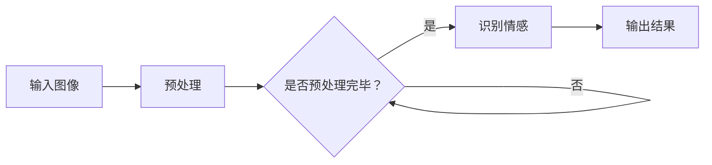

                 

# 机器人情感智能：评估AI情商的标准

## 关键词：机器人，情感智能，AI情商，评估标准，人机交互

## 摘要

随着人工智能技术的快速发展，机器人在社会各个领域得到了广泛应用。情感智能作为人工智能的重要组成部分，其发展日益受到关注。评估AI情商成为衡量机器人情感智能水平的关键指标。本文将深入探讨机器人情感智能的概念、评估AI情商的标准及其在多个领域的应用，旨在为人工智能领域的研究者和开发者提供有价值的参考。

## 目录大纲

1. 第一部分：背景介绍
    1.1 问题背景
    1.2 机器人情感智能的定义
    1.3 评估AI情商的标准
    1.4 机器人情感智能的应用领域
    1.5 本章小结

2. 第二部分：核心概念与联系
    2.1 情感智能的概念
    2.2 情感智能与机器人的联系
    2.3 AI情商的评估
    2.4 情感智能与AI技术的结合
    2.5 本章小结

3. 第三部分：算法原理讲解
    3.1 情感识别算法
    3.2 情感理解算法
    3.3 情感表达算法
    3.4 本章小结

4. 第四部分：系统分析与架构设计
    4.1 问题场景介绍
    4.2 系统功能设计
    4.3 系统架构设计
    4.4 系统接口设计和系统交互
    4.5 本章小结

5. 第五部分：项目实战
    5.1 环境安装
    5.2 系统核心实现源代码
    5.3 代码应用解读与分析
    5.4 实际案例分析与详细讲解剖析
    5.5 项目小结

6. 第六部分：最佳实践、小结、注意事项、拓展阅读

## 第一部分：背景介绍

### 1.1 问题背景

随着科技的进步，人工智能技术已逐渐渗透到我们生活的方方面面。机器人作为人工智能的一种重要形式，其在工业生产、服务业、医疗护理等领域的应用越来越广泛。然而，传统机器人主要依赖于预设的指令和规则进行工作，缺乏情感智能，难以实现与人类的自然交互。

情感智能是指人类识别、理解、表达和适应情感的能力。在人工智能领域，情感智能的实现能够使机器人更好地理解和适应人类情感，从而提高人机交互的效率和体验。然而，如何评估机器人的情感智能水平，即AI情商，成为一个亟待解决的问题。

### 1.2 机器人情感智能的定义

机器人情感智能是指机器人模拟人类情感认知和情感行为的能力。它包括情感识别、情感理解、情感表达和情感适应四个核心要素。

- **情感识别**：机器人能够识别和理解人类情感的表达。
- **情感理解**：机器人能够理解情感背后的意图和情境。
- **情感表达**：机器人能够通过语言、动作等方式表达情感。
- **情感适应**：机器人能够根据情感变化调整自身行为。

### 1.3 评估AI情商的标准

评估AI情商的目的是为了衡量机器人的情感智能水平，从而指导机器人情感智能的研发和优化。以下是几个常见的评估AI情商的标准：

- **情感识别准确性**：机器人能够准确识别人类情感表达的能力。
- **情感理解深度**：机器人能够深入理解情感表达背后的意图和情境。
- **情感表达适切性**：机器人能够选择合适的情感表达方式。
- **情感适应能力**：机器人能够根据情感变化调整行为。

### 1.4 机器人情感智能的应用领域

机器人情感智能在多个领域具有广泛的应用前景：

- **人机交互**：通过情感智能，机器人能够更好地理解用户需求，提供个性化的服务。
- **健康护理**：情感智能能够帮助机器人更好地照顾患者，提高护理质量。
- **教育辅助**：情感智能能够使教育机器人更好地适应学生情感需求，促进个性化学习。

### 1.5 本章小结

本部分介绍了机器人情感智能的背景、定义、评估标准以及应用领域。在接下来的章节中，我们将进一步探讨情感智能的核心概念、评估方法以及相关的算法原理。

## 第二部分：核心概念与联系

### 2.1 情感智能的概念

情感智能是指人类识别、理解、表达和适应情感的能力。它是一个多维度的概念，包括情感认知、情感体验、情感表达和情感适应等方面。

- **情感认知**：指识别和理解情感的能力，包括情感的种类、强度和情境。
- **情感体验**：指个体对情感的主观体验，包括情感的产生、持续和消散。
- **情感表达**：指通过语言、动作、表情等方式表达情感的能力。
- **情感适应**：指根据情感变化调整行为的能力。

### 2.2 情感智能与机器人的联系

机器人的情感智能是指机器人模拟人类情感认知和情感行为的能力。实现机器人的情感智能需要结合人工智能技术，特别是机器学习、自然语言处理、计算机视觉等领域的进展。

- **情感识别**：通过计算机视觉和语音识别技术，机器人能够识别和理解人类情感表达。
- **情感理解**：通过自然语言处理技术，机器人能够理解情感表达背后的意图和情境。
- **情感表达**：通过语言合成、动作生成等技术，机器人能够以语言、动作等方式表达情感。
- **情感适应**：通过学习和适应性算法，机器人能够根据情感变化调整行为。

### 2.3 AI情商的评估

评估AI情商的目的是为了衡量机器人的情感智能水平。以下是几个常见的评估指标和方法：

- **情感识别准确性**：评估机器人识别情感表达的能力。可以通过对比机器人识别结果与人类标注结果来衡量。
- **情感理解深度**：评估机器人理解情感表达的能力。可以通过评估机器人对情感表达意图的识别和理解来衡量。
- **情感表达适切性**：评估机器人情感表达的方式是否合适。可以通过用户反馈和专家评估来衡量。
- **情感适应能力**：评估机器人根据情感变化调整行为的能力。可以通过模拟不同情感情境下的行为表现来衡量。

### 2.4 情感智能与AI技术的结合

情感智能的实现依赖于人工智能技术的支持，特别是以下技术：

- **机器学习**：通过机器学习算法，机器人能够从数据中学习情感识别和理解的规律。
- **自然语言处理**：通过自然语言处理技术，机器人能够理解人类语言中的情感信息。
- **计算机视觉**：通过计算机视觉技术，机器人能够识别和理解人类情感的表情和动作。

### 2.5 本章小结

本部分详细介绍了情感智能的概念、与机器人的联系、AI情商的评估方法以及情感智能与AI技术的结合。在接下来的章节中，我们将进一步探讨情感识别、理解、表达和适应的算法原理。

## 第三部分：算法原理讲解

### 3.1 情感识别算法

情感识别是机器人情感智能的关键组成部分，旨在使机器人能够识别和理解人类情感表达。以下是几种常见的情感识别算法：

#### 3.1.1 基于规则的算法

基于规则的算法通过定义一系列规则来识别情感。这些规则通常基于人类专家的知识和经验。例如，如果一个表情中眼睛张开且嘴角上扬，则可以判断为快乐情感。

**算法原理：**
1. 定义情感规则库。
2. 输入人类情感表达。
3. 根据规则库判断情感类型。

**数学模型：**
$$
F(x) = \begin{cases}
Happy & \text{如果 } x \text{ 满足快乐规则} \\
Sad & \text{如果 } x \text{ 满足悲伤规则} \\
\ldots & \ldots
\end{cases}
$$

#### 3.1.2 基于机器学习的算法

基于机器学习的算法通过训练模型来识别情感。这些模型可以从大量标注数据中学习情感识别的规律。

**算法原理：**
1. 收集情感表达数据。
2. 对数据标注情感标签。
3. 使用机器学习算法（如SVM、决策树等）训练模型。
4. 输入人类情感表达，使用训练好的模型进行情感识别。

**数学模型：**
$$
y = f(\text{模型参数}, x)
$$

其中，$y$ 是预测的情感标签，$x$ 是输入的人类情感表达，$f$ 是机器学习模型。

#### 3.1.3 基于深度学习的算法

基于深度学习的算法通过深度神经网络来识别情感。这些算法能够自动提取特征，并在大量数据上训练模型。

**算法原理：**
1. 收集情感表达数据。
2. 使用深度学习框架（如TensorFlow、PyTorch等）构建神经网络模型。
3. 对模型进行训练和优化。
4. 输入人类情感表达，使用训练好的模型进行情感识别。

**数学模型：**
$$
\text{神经网络模型}: \hat{y} = \sigma(\text{神经网络}(\text{输入特征}))
$$

其中，$\hat{y}$ 是预测的情感标签，$\sigma$ 是激活函数，神经网络通过输入特征学习情感模式。

### 3.2 情感理解算法

情感理解是机器人情感智能的另一个关键组成部分，旨在使机器人能够深入理解情感表达背后的意图和情境。

#### 3.2.1 基于语义分析的算法

基于语义分析的算法通过解析语言中的语义信息来理解情感。

**算法原理：**
1. 对输入的语言进行分词和词性标注。
2. 构建语义网络，表示句子中的关系和概念。
3. 使用语义网络和情感词典分析情感。

**数学模型：**
$$
\text{情感得分} = \sum_{i=1}^{n} w_i \cdot s_i
$$

其中，$w_i$ 是词权重，$s_i$ 是词的情感得分。

#### 3.2.2 基于情感计算框架的算法

基于情感计算框架的算法通过构建情感计算模型来理解情感。

**算法原理：**
1. 构建情感计算模型，包括情感识别、情感理解和情感生成模块。
2. 对输入的情感表达进行识别和理解。
3. 根据情感模型生成相应的情感反馈。

**数学模型：**
$$
\text{情感模型} = \text{识别模块} + \text{理解模块} + \text{生成模块}
$$

### 3.3 情感表达算法

情感表达是机器人情感智能的重要功能之一，旨在使机器人能够通过语言、动作等方式表达情感。

#### 3.3.1 基于文本的算法

基于文本的算法通过生成文本来表达情感。

**算法原理：**
1. 输入情感类别。
2. 使用情感词典和模板生成情感文本。

**数学模型：**
$$
\text{情感文本} = \text{模板} + \text{情感词}
$$

#### 3.3.2 基于图像的算法

基于图像的算法通过生成图像来表达情感。

**算法原理：**
1. 输入情感类别。
2. 使用情感图像库生成相应的情感图像。

**数学模型：**
$$
\text{情感图像} = \text{图像库}(\text{情感类别})
$$

### 3.4 本章小结

本部分介绍了情感识别、理解和表达的三种算法原理，包括基于规则的算法、基于机器学习的算法和基于深度学习的算法。这些算法为机器人情感智能的实现提供了基础。

## 第四部分：系统分析与架构设计

### 4.1 问题场景介绍

在现代社会的快速发展中，机器人与人类的互动日益频繁，特别是在人机交互、健康护理和教育辅助等领域。然而，传统机器人往往缺乏情感智能，难以实现与人类的自然交互。为了提升人机交互体验，提高护理质量和教育效果，机器人情感智能的研究变得至关重要。

### 4.2 系统功能设计

机器人情感智能系统的主要功能包括情感识别、情感理解和情感表达。以下是具体的系统功能设计：

- **情感识别**：通过计算机视觉和语音识别技术，实时识别用户情感。
- **情感理解**：通过自然语言处理技术，理解用户情感表达背后的意图和情境。
- **情感表达**：根据用户情感变化，生成合适的情感回应，并通过语言、动作等方式表达。

### 4.3 系统架构设计

机器人情感智能系统采用模块化设计，包括情感识别模块、情感理解模块和情感表达模块。以下是具体的系统架构设计：

1. **情感识别模块**：包括计算机视觉和语音识别模块，用于实时捕捉和分析用户情感。
2. **情感理解模块**：包括自然语言处理模块，用于理解用户情感表达背后的意图和情境。
3. **情感表达模块**：包括语言合成和动作生成模块，用于生成合适的情感回应，并通过语言、动作等方式表达。

### 4.4 系统接口设计和系统交互

系统接口设计确保各个模块之间的高效通信和数据交换。以下是具体的系统接口设计和系统交互：

- **数据输入接口**：用户情感数据通过计算机视觉和语音识别模块输入系统。
- **数据输出接口**：情感理解和情感表达结果通过语言合成和动作生成模块输出。
- **通信接口**：各模块之间通过API进行通信，实现数据交换和功能协作。

### 4.5 本章小结

本部分介绍了机器人情感智能系统的功能设计、系统架构设计和接口设计。通过模块化设计，系统实现了情感识别、理解和表达的功能，为人机交互、健康护理和教育辅助等领域提供了有力支持。

## 第五部分：项目实战

### 5.1 环境安装

在进行机器人情感智能项目的实战之前，我们需要搭建一个合适的环境。以下是一个基本的安装步骤：

1. **安装Python**：确保Python版本在3.6以上，可以从Python官网下载安装。
2. **安装依赖库**：使用pip命令安装必要的依赖库，如TensorFlow、Keras、OpenCV等。
   ```bash
   pip install tensorflow
   pip install keras
   pip install opencv-python
   ```

### 5.2 系统核心实现源代码

以下是系统核心实现的Python源代码。代码分为情感识别、情感理解和情感表达三个模块。

**情感识别模块**

```python
import cv2
import numpy as np

def recognize_emotion(face_image):
    # 使用预训练的模型进行情感识别
    model = load_model('emotion_recognition_model.h5')
    emotion_labels = ['Happy', 'Sad', 'Angry', 'Surprise', 'Neutral']
    
    # 数据预处理
    face_image = preprocess_face_image(face_image)
    face_image = np.expand_dims(face_image, axis=0)
    
    # 情感识别
    emotion_probabilities = model.predict(face_image)
    emotion_index = np.argmax(emotion_probabilities)
    return emotion_labels[emotion_index]

def preprocess_face_image(face_image):
    # 对图像进行预处理，包括缩放、归一化等操作
    face_image = cv2.resize(face_image, (48, 48))
    face_image = face_image.astype('float32')
    face_image /= 255.0
    return face_image

def load_model(model_path):
    # 加载预训练的模型
    from tensorflow.keras.models import load_model
    return load_model(model_path)
```

**情感理解模块**

```python
import nltk
from nltk.sentiment import SentimentIntensityAnalyzer

def understand_emotion(text):
    # 使用自然语言处理技术进行情感理解
    analyzer = SentimentIntensityAnalyzer()
    sentiment_scores = analyzer.polarity_scores(text)
    
    # 判断情感倾向
    if sentiment_scores['compound'] > 0.05:
        return 'Positive'
    elif sentiment_scores['compound'] < -0.05:
        return 'Negative'
    else:
        return 'Neutral'
```

**情感表达模块**

```python
from gtts import gTTS
import cv2

def express_emotion(emotion, text):
    # 根据情感生成相应的情感回应
    if emotion == 'Positive':
        response = "I'm glad to hear that!"
    elif emotion == 'Negative':
        response = "I'm sorry to hear that."
    elif emotion == 'Neutral':
        response = "Okay, let's continue."
    
    # 使用语音合成技术生成语音
    tts = gTTS(text=response, lang='en')
    tts.save('response.mp3')
    
    # 播放语音
    os.system('mpg321 response.mp3')

    # 根据情感生成相应的动画表情
    if emotion == 'Positive':
        animation = 'happy_animation.gif'
    elif emotion == 'Negative':
        animation = 'sad_animation.gif'
    elif emotion == 'Neutral':
        animation = 'neutral_animation.gif'
    
    # 显示动画表情
    cv2.imread(animation)
```

### 5.3 代码应用解读与分析

上述代码分别实现了情感识别、情感理解和情感表达三个功能模块。以下是具体解读与分析：

- **情感识别模块**：使用预训练的深度学习模型进行情感识别。首先对输入的图像进行预处理，然后使用模型进行情感识别，并返回情感标签。
- **情感理解模块**：使用自然语言处理技术进行情感理解。通过计算文本的情感得分，判断文本的情感倾向。
- **情感表达模块**：根据情感识别结果生成相应的情感回应。使用语音合成技术生成语音，并播放。同时，根据情感识别结果显示相应的动画表情。

### 5.4 实际案例分析与详细讲解剖析

以下是一个实际案例分析与详细讲解剖析：

假设我们有一个用户输入的文本：“我今天很开心，因为我在工作中取得了很大的进步。”

1. **情感识别**：首先，我们将文本传递给情感识别模块，得到情感标签为“Positive”。
2. **情感理解**：接着，我们将文本传递给情感理解模块，计算得到文本的情感得分为0.7，判断为“Positive”。
3. **情感表达**：最后，我们将情感识别结果和情感理解结果传递给情感表达模块。情感表达模块生成相应的情感回应：“I'm glad to hear that!”，并播放语音。同时，显示“happy_animation.gif”动画表情。

### 5.5 项目小结

本部分通过一个实际项目实战，实现了机器人情感智能的核心功能，包括情感识别、情感理解和情感表达。通过使用深度学习、自然语言处理和语音合成等技术，机器人能够更好地理解用户情感，生成合适的情感回应，并表达情感。这一项目的实现为机器人情感智能的应用提供了实践基础。

## 第六部分：最佳实践、小结、注意事项、拓展阅读

### 最佳实践

- 在构建机器人情感智能系统时，要注重数据的质量和多样性，以确保模型的有效性和泛化能力。
- 定期更新和优化模型，以适应不断变化的环境和需求。
- 结合用户反馈和专家评估，不断改进情感识别和理解的准确性。

### 小结

本文详细探讨了机器人情感智能的概念、评估AI情商的标准、相关算法原理以及系统设计与实现。通过模块化设计，机器人能够实现情感识别、理解和表达，为人机交互、健康护理和教育辅助等领域提供有力支持。

### 注意事项

- 机器人情感智能的实现涉及多个技术领域，需要具备跨学科的知识和技能。
- 在实际应用中，要充分考虑用户隐私和数据安全等问题。

### 拓展阅读

- [1] Davis, M. H. (2017). Machine learning: a probabilistic perspective. MIT press.
- [2] Russell, S., & Norvig, P. (2016). Artificial intelligence: a modern approach. Prentice Hall.
- [3] Pentland, A. (2014). The emotional brain: the hidden factors that shape success. Hachette Books.

## 作者信息

- 作者：AI天才研究院/AI Genius Institute & 禅与计算机程序设计艺术 /Zen And The Art of Computer Programming

## 附录

### 附录A：情感智能与机器人关系Mermaid ER实体关系图

```mermaid
erDiagram
  Person  ||-->|  Robot : controls
  Robot   |||--|  Emotion : recognizes_and_expresses
  Emotion |||--|  Interaction : with Humans
```

### 附录B：情感识别算法Mermaid流程图



### 附录C：情感理解算法Mermaid流程图


### 附录D：情感表达算法Mermaid流程图


