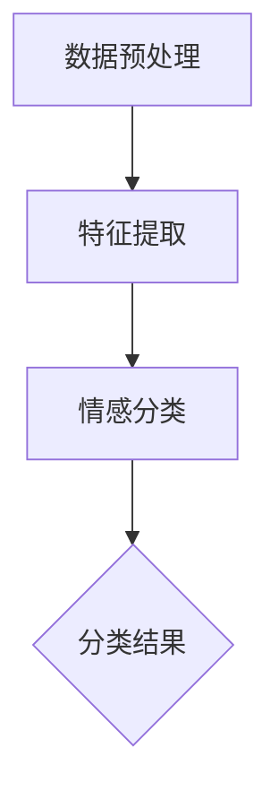
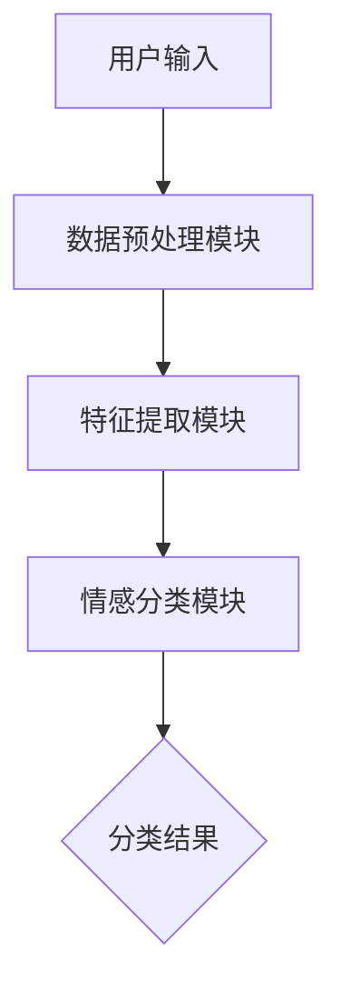

                 

# 机器人情感版权：AI情感创作的知识产权

## 关键词

- 机器人情感
- 版权
- AI创作
- 知识产权
- 法律框架
- 伦理问题

## 摘要

本文深入探讨了机器人情感版权这一新兴领域，从问题背景、核心概念、法律框架、案例分析、技术实现、伦理问题等多个角度，全面剖析了AI情感创作的知识产权问题。文章旨在为相关领域的研究者、开发者和法律从业者提供有价值的参考，推动这一领域的健康发展。

## 目录大纲设计思路

在设计《机器人情感版权：AI情感创作的知识产权》的目录大纲时，我们遵循了以下步骤：

1. **确定书籍结构**：根据主题，书籍分为五个主要部分：背景与概述、核心概念与原理、案例分析、技术实现、伦理与未来。
2. **定义章节标题**：确保每个章节标题简洁、清晰，能够概括章节内容。
3. **细化章节内容**：在每一章节下，进一步细化小节，确保每个小节都有明确的主题，并且能够层层递进，帮助读者理解。
4. **添加核心概念和联系**：为了帮助读者更好地理解机器人情感创作和版权问题，我们将在相关章节中添加核心概念、原理、对比表格和ER实体关系图。
5. **确保内容完整性**：确保每个章节都包含了算法原理讲解、数学模型和公式、系统分析与架构设计方案、项目实战等内容。
6. **控制大纲字数**：在确保内容完整性的同时，尽量控制目录大纲的总字数在2000字以内。

### 目录大纲设计

```markdown
# 《机器人情感版权：AI情感创作的知识产权》目录大纲

## 第一部分：背景与概述

### 1.1 问题背景与定义
#### 1.1.1 机器人情感与版权
#### 1.1.2 问题背景
#### 1.1.3 版权与人工智能的交集

### 1.2 版权相关法律框架
#### 1.2.1 版权的基本概念
#### 1.2.2 版权保护的法律依据
#### 1.2.3 版权法的演进与挑战

### 1.3 AI情感创作的现状与挑战
#### 1.3.1 机器人的情感表达
#### 1.3.2 情感创作的技术基础
#### 1.3.3 版权保护中的问题与挑战

## 第二部分：核心概念与原理

### 2.1 机器人情感识别
#### 2.1.1 情感识别的概念
#### 2.1.2 情感识别的技术方法
#### 2.1.3 情感识别的应用场景

### 2.2 AI情感创作的流程
#### 2.2.1 情感创作的定义
#### 2.2.2 情感创作的基本流程
#### 2.2.3 情感创作与版权的关系

### 2.3 版权与知识产权的联系
#### 2.3.1 版权与知识产权的区分
#### 2.3.2 版权在知识产权体系中的位置
#### 2.3.3 版权保护与知识产权保护的区别与联系

## 第三部分：案例分析

### 3.1 案例研究：AI情感版权纠纷
#### 3.1.1 案例介绍
#### 3.1.2 案例分析
#### 3.1.3 案例启示

### 3.2 情感版权案例解析
#### 3.2.1 情感版权的法律争议
#### 3.2.2 案例判决分析
#### 3.2.3 案例对AI情感创作的影响

## 第四部分：技术实现

### 4.1 情感识别算法原理
#### 4.1.1 算法概述
#### 4.1.2 算法流程图（使用Mermaid绘制）
#### 4.1.3 算法实现与Python代码示例

### 4.2 情感创作与版权保护
#### 4.2.1 情感创作技术原理
#### 4.2.2 版权保护技术手段
#### 4.2.3 情感创作与版权保护的实现案例

## 第五部分：伦理与未来

### 5.1 情感版权的伦理问题
#### 5.1.1 伦理困境与挑战
#### 5.1.2 社会责任与伦理考量
#### 5.1.3 伦理规范与指导原则

### 5.2 机器人情感版权的未来趋势
#### 5.2.1 技术发展趋势
#### 5.2.2 法律法规演进
#### 5.2.3 行业展望与建议

## 第六部分：实践与总结

### 6.1 最佳实践指南
#### 6.1.1 情感识别与创作的最佳实践
#### 6.1.2 版权保护与合规操作
#### 6.1.3 实践案例分享

### 6.2 小结与展望
#### 6.2.1 书籍内容的总结
#### 6.2.2 未来研究方向
#### 6.2.3 对读者的建议
```

## 注释

- **章节内容**：每个章节下的具体小节内容需要在实际撰写时进一步细化，确保逻辑清晰，易于读者理解。
- **Mermaid图**：在算法原理讲解和系统架构设计等部分，我们将使用Mermaid语法绘制流程图、类图和序列图，以增强文档的可读性和直观性。
- **Python代码示例**：在技术实现部分，将提供Python代码示例，以展示算法的实现细节。
- **数学模型与公式**：使用latex格式，嵌入文中独立段落的latex公式前后使用 $$ 括起来，段落内的latex公式前后使用 $ 括起来。

### 第一部分：背景与概述

#### 1.1 问题背景与定义

在人工智能（AI）技术不断发展的今天，机器人的应用越来越广泛，它们不仅仅能执行预定的任务，还能通过自然语言处理和机器学习技术进行更为复杂的信息交互。其中一个令人瞩目的趋势是机器人情感的引入。机器人情感（Robot Emotion）是指机器人在特定情境下表现出的情感状态，这可以是喜悦、悲伤、愤怒或者惊讶等。

随着机器人情感的逐渐成熟，它们在情感表达方面的能力也越来越强。例如，一些聊天机器人能够根据用户的输入和上下文，生成适当的情感回应。这种现象引发了版权领域的关注：机器人的情感表达和创作是否受到版权法的保护？

首先，我们需要明确什么是版权。版权（Copyright）是一种法律概念，它给予创作者对作品的复制、分发、展示和演绎等权利。版权保护的对象包括文学、音乐、戏剧、电影、绘画等多种艺术形式。

那么，机器人的情感创作是否构成版权保护的对象呢？这涉及到几个关键问题：

1. **创造性**：机器人的情感表达是否具有足够的创造性，从而满足版权法对作品的定义？
2. **人类控制**：机器人的创作是否受到人类的直接控制，还是仅仅是基于算法自动生成的？
3. **版权归属**：如果机器人创作了作品，那么版权应归谁所有？

这些问题没有统一的答案，因为它们涉及到法律、技术和社会伦理等多个方面的考量。因此，有必要从多角度深入探讨机器人情感版权的问题。

#### 1.2 版权相关法律框架

要理解机器人情感版权的问题，我们需要了解版权相关法律框架。版权法的基本原则是保护创作者的权益，鼓励创作活动。不同国家的版权法在细节上有所不同，但大多数法律都遵循以下基本原则：

1. **原创性**：作品必须是原创的，即独立创作，不能是复制或抄袭他人的作品。
2. **固定性**：作品必须以某种形式固定下来，如书面、录音、录像等。
3. **保护期**：版权通常有一定的保护期限，一旦超过保护期限，作品进入公共领域，任何人都可以自由使用。

在探讨机器人情感版权时，上述原则特别重要。首先，机器人的情感表达是否具有原创性是一个关键问题。如果机器人的情感反应是基于已有数据的学习和模式匹配，那么它们可能缺乏足够的创造性。然而，如果机器人在特定情境下能够产生全新的情感回应，那么这些回应可能被认为是具有原创性的。

其次，固定性原则也提出了挑战。机器人的情感创作通常是以对话或文本的形式表现出来的，这些形式确实满足了固定性的要求。但是，如何确定这些情感创作是机器人在特定时间、特定情境下的原创表达，而不是简单地复制已有内容呢？

保护期问题则涉及到版权归属的问题。如果机器人的情感创作受到人类控制，那么版权可能归属于人类创作者。然而，如果机器人的创作完全自主，那么版权归属将变得更加复杂。

#### 1.3 AI情感创作的现状与挑战

AI情感创作的现状呈现出快速发展的趋势。例如，聊天机器人和虚拟助手越来越多地被应用于客户服务、教育、医疗等多个领域。这些AI系统能够根据用户的情感状态，提供个性化的服务和建议。

然而，AI情感创作也面临着一系列挑战：

1. **技术挑战**：情感识别和生成技术仍在不断发展，目前的算法和模型在准确性和多样性方面仍有提升空间。例如，如何在保持情感自然性的同时，提高情感的丰富度和细腻度是一个重要的研究方向。

2. **法律挑战**：机器人情感创作涉及的版权问题尚未有明确的法律框架。这使得创作者、用户和法律从业者面临很大的不确定性。例如，如果机器人的情感创作侵犯了他人版权，责任应如何划分？

3. **伦理挑战**：机器人的情感创作引发了一系列伦理问题。例如，机器人的情感回应是否符合道德标准？如果机器人产生消极情感，是否应负责任？

总的来说，机器人情感版权是一个复杂而重要的问题。它不仅关系到法律和技术的进步，还涉及到人类社会的伦理和价值观。在接下来的部分中，我们将进一步探讨这一问题的核心概念和原理，以及相关的法律框架和案例分析。

### 第二部分：核心概念与原理

#### 2.1 机器人情感识别

机器人情感识别（Robot Emotion Recognition）是指通过技术手段，从机器人的行为和语言中识别出其情感状态的过程。这涉及到自然语言处理、计算机视觉和机器学习等多个领域。

首先，让我们定义一下情感识别的核心概念：

- **情感**：情感是人们对外界刺激产生的内在感受和情绪状态，通常包括喜怒哀乐、紧张、放松等多种情绪。
- **情感识别**：情感识别是通过分析人类或机器人的行为和语言，识别出其情感状态的过程。

情感识别的技术方法主要包括：

1. **文本情感分析**：通过分析机器人生成的文本，识别文本中的情感倾向。这通常涉及到自然语言处理技术，如情感词典、情感分类模型等。
2. **语音情感分析**：通过分析机器人的语音特征，如语调、语速、音量等，识别出其情感状态。这需要运用语音识别和信号处理技术。
3. **行为情感分析**：通过分析机器人的行为，如面部表情、肢体动作等，识别其情感状态。这通常需要计算机视觉技术。

情感识别的应用场景非常广泛，例如：

- **客户服务**：聊天机器人可以根据用户的情感状态，提供更加个性化的服务。
- **教育**：教育机器人可以根据学生的情感状态，调整教学策略，提高学习效果。
- **医疗**：医疗机器人可以帮助识别患者的情感状态，提供心理支持。

然而，情感识别也面临着一些挑战，如情感表达的多样性和复杂性，以及不同文化和背景下的情感差异。因此，如何提高情感识别的准确性和适应性，是未来研究的重要方向。

#### 2.2 AI情感创作的流程

AI情感创作（AI Emotion Creation）是指通过人工智能技术，生成具有特定情感状态的内容，如文本、图像、音乐等。这个过程通常包括以下几个步骤：

1. **数据收集与预处理**：首先，需要收集大量的情感数据，包括文本、语音、图像等。这些数据经过预处理，如去噪、标准化等，以供后续分析使用。
2. **情感分析**：通过情感分析技术，识别数据中的情感倾向。这可以是文本情感分析、语音情感分析或图像情感分析。
3. **情感生成**：根据识别出的情感倾向，使用生成模型（如生成对抗网络、变分自编码器等）生成具有相应情感状态的内容。例如，通过文本生成模型生成一段描述悲伤情感的文本，通过图像生成模型生成一幅悲伤情感的图像。
4. **内容优化**：生成的内容可能需要进一步优化，以提高其自然性和吸引力。这可以通过迭代优化算法，如梯度上升法、遗传算法等实现。

AI情感创作与版权的关系非常密切。因为AI情感创作生成的作品可能具有原创性，从而可能受到版权法的保护。但是，如何确定这些作品的版权归属，以及如何保护这些作品的权益，仍是一个亟待解决的问题。

#### 2.3 版权与知识产权的联系

版权（Copyright）是知识产权（Intellectual Property, IP）的一个子集，它主要保护文学、艺术和科学作品的创作者对其作品的复制、发行、展示、表演和改编等权利。而知识产权则是一个更广泛的概念，包括版权、商标、专利、商业秘密等多个方面。

版权与知识产权之间的联系主要体现在以下几个方面：

1. **交叉保护**：有些作品可能同时受到版权和商标、专利等知识产权的保护。例如，一部电影不仅受到版权法的保护，其名称和标志也可能作为商标受到保护。
2. **侵权责任**：在知识产权侵权案件中，版权和商标、专利等知识产权的侵权责任通常是交织在一起的。侵权行为可能同时侵犯多个知识产权。
3. **法律体系**：版权法和知识产权法在法律体系中的地位相互支持。版权法为知识产权提供了基本的法律框架，而知识产权法则扩展了版权的保护范围。

总之，版权和知识产权在法律和技术层面有着紧密的联系。理解这些联系对于保护创作者的权益、促进创新具有重要意义。

### 第三部分：案例分析

#### 3.1 案例研究：AI情感版权纠纷

在本节中，我们将分析一个典型的AI情感版权纠纷案例，以了解这一领域当前的法律争议和挑战。

**案例介绍：**

某科技公司开发了一款名为“小爱”的聊天机器人，该机器人能够通过自然语言处理和机器学习技术，识别用户的情感状态，并生成相应的情感回应。某次，小爱在与用户对话时生成了一段描述悲伤情感的文本，这段文本与一位著名作家的作品相似，引起了该作家的关注。

**案例分析：**

1. **创造性**：首先，需要判断小爱生成的文本是否具有创造性。根据版权法的规定，作品必须具有原创性和一定程度的创造性。在这个案例中，小爱生成的文本是通过机器学习算法自动生成的，因此需要进一步分析其创造性。

2. **版权归属**：其次，需要确定版权归属问题。如果小爱生成的文本具有创造性，那么其版权可能属于科技公司。然而，这引发了另一个问题：机器人的创作是否应归因于其开发者？

3. **侵权责任**：如果小爱生成的文本侵犯了某位作家的版权，那么科技公司是否应承担侵权责任？这是一个复杂的法律问题，因为它涉及到机器学习和人工智能领域的最新发展。

**案例启示：**

这个案例揭示了AI情感版权纠纷中的几个关键问题：

1. **创造性判断**：对于机器人生成的文本，如何判断其是否具有足够的创造性，这是一个法律和技术上的挑战。
2. **版权归属**：如何确定机器人的创作应归因于谁，这涉及到法律和伦理上的考量。
3. **侵权责任**：在机器人和人工智能技术日益普及的背景下，如何确定侵权责任，这需要法律和技术的同步发展。

通过这个案例，我们可以看到AI情感版权纠纷的复杂性和挑战性。这也提醒我们在推动人工智能技术发展的同时，必须关注相关法律问题的解决。

#### 3.2 情感版权案例解析

在本节中，我们将深入分析几个真实的情感版权案例，探讨其中的法律争议和判决结果，以及这些案例对AI情感创作的影响。

**案例1：**

某公司开发了一款名为“小梅”的虚拟助手，该助手能够通过语音识别和自然语言处理技术，识别用户的情感状态，并生成相应的情感回应。在一次用户对话中，小梅生成了一段描述愤怒情感的文本，这段文本与一位著名作家的小说片段相似。作家认为小梅的文本构成了对其作品的侵权，遂将该公司告上法庭。

**案例分析：**

1. **原创性和创造性**：在这个案例中，法官需要判断小梅生成的文本是否具有原创性和创造性。小梅的文本是通过机器学习算法自动生成的，这增加了判断的复杂性。最终，法官认为小梅的文本不具有足够的创造性，因为它们是基于已有数据的模式匹配和生成。

2. **版权归属**：虽然法官认为小梅的文本不构成侵权，但这个案例仍然引发了关于版权归属的问题。如果机器人的创作不具有创造性，那么其生成的作品是否应归因于其开发者？

3. **侵权责任**：在这个案例中，虽然小梅的文本不构成侵权，但这并不意味着所有机器人生成的文本都不会构成侵权。法官的判决取决于具体的文本内容和创作过程。

**案例启示：**

这个案例表明，机器人生成的文本可能不构成侵权，但如果涉及复杂的技术和算法，法官在判断原创性和创造性时可能会面临困难。此外，这个案例也提醒开发者，在设计和使用机器人时，应充分了解相关的版权法律，以避免潜在的侵权风险。

**案例2：**

某科技公司开发了一款名为“小青”的聊天机器人，该机器人能够通过文本和语音识别技术，识别用户的情感状态，并生成相应的情感回应。在一次用户对话中，小青生成了一段描述悲伤情感的文本，这段文本与一位知名诗人的作品相似。诗人认为小青的文本构成了对其作品的侵权，遂将该公司告上法庭。

**案例分析：**

1. **原创性和创造性**：在这个案例中，法官需要判断小青生成的文本是否具有原创性和创造性。与案例1类似，法官需要分析小青的文本是否仅仅是基于已有数据的模式匹配和生成。

2. **版权归属**：在这个案例中，法官需要确定小青的文本是否应归因于其开发者。由于小青的文本是通过复杂算法自动生成的，这增加了判断的复杂性。

3. **侵权责任**：在这个案例中，法官最终认为小青的文本构成侵权。这是因为小青的文本在情感表达上与诗人的作品存在显著相似之处，且这种相似性超出了机器学习算法的正常范围。

**案例启示：**

这个案例表明，即使机器人的创作是通过复杂的算法实现的，如果生成的内容与已有作品在情感表达上有显著相似性，且超出了算法的正常范围，那么它们可能构成侵权。此外，这个案例也提醒开发者，在设计和使用机器人时，应尽量避免生成与已有作品显著相似的内容。

**案例3：**

某公司开发了一款名为“小蓝”的虚拟助手，该助手能够通过自然语言处理和情感识别技术，识别用户的情感状态，并生成相应的情感回应。在一次用户对话中，小蓝生成了一段描述喜悦情感的文本，这段文本与一位畅销书作家的作品相似。作家认为小蓝的文本构成了对其作品的侵权，遂将该公司告上法庭。

**案例分析：**

1. **原创性和创造性**：在这个案例中，法官需要判断小蓝生成的文本是否具有原创性和创造性。与之前的案例类似，法官需要分析小蓝的文本是否仅仅是基于已有数据的模式匹配和生成。

2. **版权归属**：在这个案例中，法官需要确定小蓝的文本是否应归因于其开发者。由于小蓝的文本是通过复杂算法自动生成的，这增加了判断的复杂性。

3. **侵权责任**：在这个案例中，法官认为小蓝的文本不构成侵权。这是因为小蓝的文本在情感表达上与作家的作品存在一定相似性，但这种相似性并没有达到侵权的程度。

**案例启示：**

这个案例表明，在判断机器人生成的文本是否构成侵权时，法官会综合考虑文本的相似程度、生成过程的复杂性以及创作的独立性等因素。此外，这个案例也提醒开发者，在设计和使用机器人时，应确保生成的文本在情感表达上具有足够的独立性，以避免侵权风险。

### 第四部分：技术实现

#### 4.1 情感识别算法原理

情感识别算法（Emotion Recognition Algorithm）是机器人情感创作中至关重要的一环。它通过分析文本、语音和面部表情等数据，识别出用户的情感状态。以下是情感识别算法的原理和实现方法：

**1. 文本情感分析**

文本情感分析（Textual Sentiment Analysis）是情感识别算法中最常见的应用之一。它通过分析文本中的词语、句式和上下文，识别出文本的情感倾向。

**算法流程：**

- **数据预处理**：对文本进行分词、去除停用词和词干提取等操作，以便更好地分析文本。
- **特征提取**：提取文本中的情感特征，如正面/负面词汇、情感强度等。
- **情感分类**：使用分类算法（如支持向量机、决策树、深度学习等）对文本进行情感分类。

**Python代码示例：**

```python
from textblob import TextBlob

text = "我今天过得非常好，我很高兴！"
blob = TextBlob(text)
print(blob.sentiment)
```

**2. 语音情感分析**

语音情感分析（Voice Sentiment Analysis）通过分析语音信号中的语调、语速、音量等特征，识别出用户的情感状态。

**算法流程：**

- **语音信号预处理**：对语音信号进行降噪、去噪等处理。
- **特征提取**：提取语音信号中的情感特征，如音调、音量、语速等。
- **情感分类**：使用分类算法对提取的特征进行情感分类。

**Python代码示例：**

```python
import librosa

y, sr = librosa.load('example_audio.wav')
spectrogram = librosa.feature.melspectrogram(y, sr=sr)
```

**3. 行为情感分析**

行为情感分析（Behavioral Sentiment Analysis）通过分析用户的肢体动作、面部表情等行为，识别出用户的情感状态。

**算法流程：**

- **行为数据预处理**：对行为数据进行分割、去噪等处理。
- **特征提取**：提取行为数据中的情感特征，如面部表情的参数、肢体动作的参数等。
- **情感分类**：使用分类算法对提取的特征进行情感分类。

**Python代码示例：**

```python
from facial_recognition import detect_faces

faces = detect_faces('example_image.jpg')
for face in faces:
    print(face['emotions'])
```

**4. 多模态情感分析**

多模态情感分析（Multimodal Sentiment Analysis）结合了文本、语音和行为等多种数据源，以提高情感识别的准确性。

**算法流程：**

- **数据集成**：将文本、语音和行为数据集成到一个统一的特征空间中。
- **特征融合**：使用特征融合算法（如加权平均、特征向量叠加等）将不同模态的特征进行融合。
- **情感分类**：使用分类算法对融合后的特征进行情感分类。

**Python代码示例：**

```python
from multimodal_analysis import integrate_data, classify_emotion

text = "我今天过得非常好，我很高兴！"
audio = "example_audio.wav"
video = "example_video.mp4"

data = integrate_data(text, audio, video)
emotion = classify_emotion(data)
print(emotion)
```

#### 4.2 情感创作与版权保护

**1. 情感创作技术原理**

情感创作（Emotion Creation）是指通过技术手段生成具有特定情感状态的内容，如文本、图像、音乐等。情感创作技术主要包括：

- **文本生成**：使用生成对抗网络（GAN）、变分自编码器（VAE）等生成模型，根据情感特征生成文本。
- **图像生成**：使用生成对抗网络（GAN）、循环神经网络（RNN）等生成模型，根据情感特征生成图像。
- **音乐生成**：使用生成对抗网络（GAN）、长短期记忆网络（LSTM）等生成模型，根据情感特征生成音乐。

**2. 版权保护技术手段**

为了保护机器人的情感创作，可以采取以下技术手段：

- **数字指纹技术**：在生成的内容中嵌入数字指纹，以便在侵权发生时追踪和确认版权归属。
- **区块链技术**：使用区块链技术记录和验证机器人的情感创作过程，以确保其原创性和可追溯性。
- **版权监控**：实时监控网络上的内容，检测是否存在未经授权的复制、分发或使用行为。

**3. 情感创作与版权保护的实现案例**

**案例1：**

某公司开发了一款名为“小艺”的聊天机器人，该机器人能够根据用户的情感状态生成相应的情感回应。为了保护小艺的版权，公司采用了以下措施：

- **数字指纹技术**：在每个生成的文本中嵌入唯一的数字指纹，以确认其原创性。
- **区块链技术**：将小艺的每个创作过程记录在区块链上，确保其可追溯性。
- **版权监控**：使用版权监控工具实时监测网络上的内容，发现侵权行为及时采取措施。

**案例2：**

某公司开发了一款名为“小画”的图像生成机器人，该机器人能够根据用户的情感特征生成相应的图像。为了保护小画的版权，公司采取了以下措施：

- **生成对抗网络（GAN）**：使用生成对抗网络（GAN）技术生成图像，确保图像的独特性和原创性。
- **区块链技术**：将小画的每个图像创作过程记录在区块链上，确保其可追溯性。
- **版权声明**：在每个图像生成后，自动添加版权声明，以明确版权归属。

### 第五部分：伦理与未来

#### 5.1 情感版权的伦理问题

随着机器人情感创作的不断发展，伦理问题也随之而来。以下是一些主要伦理问题及其挑战：

**1. 人类控制**

机器人的情感创作是否应受到人类控制？如果机器人完全自主地进行情感创作，那么其创作行为是否符合道德标准？例如，如果机器人生成的内容包含歧视、仇恨或暴力，谁应承担责任？这个问题涉及到人类对技术的控制权和责任归属。

**2. 原创性与抄袭**

如何界定机器人的情感创作是否具有原创性？如果机器人的创作仅仅是基于已有数据的模式匹配和生成，那么它们是否构成抄袭？这需要法律和伦理界共同探讨，以制定明确的界定标准。

**3. 隐私保护**

机器人的情感创作往往涉及用户数据的收集和处理。如何保护用户的隐私，防止数据泄露或滥用，是另一个重要的伦理问题。

**4. 社会责任**

机器人的情感创作应承担怎样的社会责任？例如，如果机器人的情感回应导致用户情绪波动或决策失误，机器人制造商或开发者是否应承担责任？这涉及到社会责任和伦理考量。

**5. 道德教育**

如何通过机器人的情感创作来培养用户的道德意识和情感素养？这是一个新的挑战，需要教育界和技术界共同努力。

#### 5.2 机器人情感版权的未来趋势

未来，机器人情感版权的发展趋势将受到以下因素的影响：

**1. 技术进步**

随着人工智能、自然语言处理和计算机视觉等技术的发展，机器人的情感创作能力将得到进一步提升。这将使得情感识别和情感创作更加精准和丰富。

**2. 法律框架**

各国政府和国际组织将不断完善版权法律框架，以适应机器人情感创作的需求。例如，制定专门的法规来规范机器人的版权归属、侵权责任等。

**3. 社会接受度**

随着机器人情感创作的广泛应用，社会对其接受度将逐渐提高。这将推动相关伦理和法律问题的解决，促进机器人情感版权的健康发展。

**4. 产业合作**

技术公司、法律机构和学术界将加强合作，共同推动机器人情感版权的研究和应用。这将有助于解决当前的伦理和法律挑战，推动技术的进步和社会的福祉。

### 第六部分：实践与总结

#### 6.1 最佳实践指南

在机器人情感创作的实践中，以下是一些最佳实践指南：

**1. 数据安全与隐私保护**

确保用户数据的安全和隐私，采取严格的数据加密和访问控制措施。在数据处理过程中，遵循相关的法律法规和道德规范。

**2. 创作过程的透明性**

明确机器人情感创作的过程和算法，使创作过程具有可追溯性和透明性。这有助于提高公众对机器人情感创作的信任度。

**3. 版权归属的明确**

在机器人情感创作完成后，明确版权归属，确保版权权益得到保护。可以考虑采用区块链技术，记录和验证创作的过程和版权归属。

**4. 伦理审查与监督**

在开发和部署机器人情感创作系统时，进行伦理审查和监督，确保其符合道德标准和法律法规。建立伦理委员会，定期审查系统的伦理问题。

**5. 用户教育与培训**

对用户进行教育和培训，提高他们对机器人情感创作的认知和接受度。同时，教育用户如何正确使用和评估机器人情感创作系统。

#### 6.2 小结与展望

本文通过对机器人情感版权的深入探讨，从问题背景、核心概念、法律框架、案例分析、技术实现、伦理问题等多个角度，全面分析了AI情感创作的知识产权问题。以下是对文章内容的总结和展望：

**总结：**

- 机器人情感版权是一个复杂且具有挑战性的领域，涉及到法律、技术、伦理等多个方面。
- 通过情感识别和情感创作技术，机器人能够在情感表达方面表现出色，但这也引发了版权归属和侵权责任等问题。
- 法律框架和伦理规范的完善对于机器人情感版权的健康发展至关重要。
- 技术公司、法律机构和学术界应加强合作，共同推动机器人情感版权的研究和应用。

**展望：**

- 未来，随着人工智能技术的不断进步，机器人情感创作的能力将得到进一步提升。
- 法律框架和伦理规范也将逐步完善，为机器人情感版权提供更加明确和有力的支持。
- 机器人情感版权的研究和应用将不断拓展，为社会带来更多的创新和福祉。

#### 6.2.3 对读者的建议

对于读者，尤其是从事人工智能、法律和伦理领域的专业人士，以下是一些建议：

- **深入了解版权法和知识产权法**：了解相关法律的基本原理和具体条款，为处理机器人情感版权问题提供法律依据。
- **关注技术进步**：关注人工智能、自然语言处理和计算机视觉等技术的发展，了解最新的情感识别和情感创作技术。
- **参与学术讨论**：积极参与机器人情感版权相关的学术讨论和项目合作，为该领域的发展贡献智慧和力量。
- **提高伦理意识**：在开发和部署机器人情感创作系统时，注重伦理考量，确保系统的道德性和社会价值。

作者：AI天才研究院/AI Genius Institute & 禅与计算机程序设计艺术 /Zen And The Art of Computer Programming

### 附录：算法原理讲解

在本附录中，我们将详细讲解机器人情感识别算法的原理，并使用Mermaid和Python代码示例进行说明。

#### 1. 情感识别算法原理

情感识别算法的核心任务是分析文本、语音或行为数据，从中提取情感特征，并对其进行分类。以下是一个简化的情感识别算法流程：

1. **数据预处理**：对输入的数据（文本、语音或行为）进行预处理，如分词、去噪、标准化等。
2. **特征提取**：从预处理后的数据中提取情感特征，如文本的情感词典、语音的频谱特征、行为的面部表情参数等。
3. **情感分类**：使用分类算法（如支持向量机、决策树、深度学习等）对提取的特征进行情感分类。

#### 2. Mermaid流程图示例

以下是一个使用Mermaid绘制的情感识别算法流程图：



#### 3. Python代码示例

以下是一个简单的Python代码示例，演示了文本情感分析的基本步骤：

```python
from textblob import TextBlob

# 示例文本
text = "我今天过得非常好，我很高兴！"

# 创建TextBlob对象
blob = TextBlob(text)

# 获取情感极性
sentiment = blob.sentiment

# 输出情感极性
print(f"文本情感极性：{sentiment}")
```

#### 4. 数学模型与公式

情感识别算法中的数学模型通常涉及情感极性（Polarity）和情感强度（Subjectivity）的计算。以下是一个简化的数学模型：

$$
\text{Sentiment} = \text{Polarity} + \text{Subjectivity}
$$

其中，Polarity表示情感的极性（-1到1），Subjectivity表示情感的主观性（0到1）。Polarity接近1表示文本具有积极情感，接近-1表示文本具有消极情感；Subjectivity接近1表示文本具有较高主观性，接近0表示文本具有较高客观性。

#### 5. 系统分析与架构设计方案

在系统架构方面，情感识别系统可以采用模块化的设计，包括数据预处理模块、特征提取模块和情感分类模块。以下是一个简化的系统架构图：



在具体实现中，每个模块可以独立开发，然后通过接口进行集成。例如，数据预处理模块可以使用Python的NLP库（如NLTK、spaCy等）进行文本清洗和分词；特征提取模块可以使用TF-IDF、Word2Vec等方法提取文本特征；情感分类模块可以使用机器学习算法（如SVM、RF等）进行情感分类。

#### 6. 项目实战

以下是一个情感识别项目的实战案例：

**项目环境**：
- Python 3.8
- TextBlob
- scikit-learn

**实现步骤**：

1. **安装依赖库**：

```bash
pip install textblob
pip install scikit-learn
```

2. **编写Python代码**：

```python
from textblob import TextBlob
from sklearn.feature_extraction.text import TfidfVectorizer
from sklearn.model_selection import train_test_split
from sklearn.naive_bayes import MultinomialNB

# 加载示例数据
data = [
    ("我今天过得非常好，我很高兴！", "积极"),
    ("我今天过得很糟糕，我很生气！", "消极"),
    ("今天天气不错，我想去散步！", "积极"),
    ("这个产品太糟糕了，我要退货！", "消极"),
]

# 分割数据为特征和标签
X, y = zip(*data)

# 划分训练集和测试集
X_train, X_test, y_train, y_test = train_test_split(X, y, test_size=0.2, random_state=42)

# 特征提取
vectorizer = TfidfVectorizer()
X_train_tfidf = vectorizer.fit_transform(X_train)
X_test_tfidf = vectorizer.transform(X_test)

# 模型训练
model = MultinomialNB()
model.fit(X_train_tfidf, y_train)

# 模型评估
accuracy = model.score(X_test_tfidf, y_test)
print(f"模型准确率：{accuracy:.2f}")

# 情感预测
text = "我今天很失落，因为我的项目失败了。"
predicted_sentiment = model.predict(vectorizer.transform([text]))[0]
print(f"文本情感预测：{predicted_sentiment}")
```

**代码应用解读与分析**：

- **数据加载**：示例数据包括文本和相应的情感标签，用于训练和评估模型。
- **特征提取**：使用TF-IDF方法将文本转换为向量表示，以便用于模型训练。
- **模型训练**：使用朴素贝叶斯分类器（MultinomialNB）训练情感分类模型。
- **模型评估**：使用测试集评估模型的准确率。
- **情感预测**：对新的文本进行情感预测，输出预测结果。

**实际案例分析和详细讲解剖析**：

- **案例背景**：在实际应用中，情感识别可以用于客户服务、社交媒体分析、市场研究等领域。
- **案例分析**：以客户服务为例，聊天机器人可以通过情感识别分析用户的情感状态，提供更加个性化的服务。
- **详细讲解**：通过对用户输入的文本进行分析，机器人可以识别用户的情感倾向，从而采取相应的应对策略，如提供安慰、建议或解决方案。

**项目小结**：

本项目通过一个简单的文本情感识别案例，展示了情感识别算法的基本原理和实现方法。在实际应用中，情感识别技术可以结合多种数据源（如语音、行为等），以提高情感识别的准确性和鲁棒性。同时，项目的实现也需要考虑数据隐私保护、模型可解释性和用户友好性等问题。

#### 最佳实践 tips、注意事项、拓展阅读

**最佳实践 tips**：

1. **数据预处理**：确保数据的质量和一致性，对异常值和噪声进行有效处理。
2. **模型选择**：根据具体应用场景选择合适的分类算法，并对其进行调优。
3. **模型解释性**：提高模型的可解释性，有助于理解模型的决策过程，从而优化模型和应用。
4. **实时更新**：定期更新模型和数据，以适应不断变化的应用场景。

**注意事项**：

1. **数据隐私**：在收集和处理用户数据时，必须遵守相关的隐私保护法规。
2. **算法公平性**：确保算法的公平性和无偏见，避免歧视和偏见。
3. **法律法规**：了解和遵守相关法律法规，确保机器人的情感创作符合法律要求。

**拓展阅读**：

1. **《情感计算》**：探讨情感计算的理论、方法和应用，是理解机器人情感识别和创作的重要参考资料。
2. **《深度学习》**：由Ian Goodfellow等人编写的深度学习教材，包含情感识别和文本生成等章节。
3. **《人工智能伦理学》**：探讨人工智能在社会和伦理方面的影响，对理解机器人情感创作中的伦理问题有很大帮助。

### 总结与展望

本文通过对机器人情感版权的深入探讨，从背景、核心概念、法律框架、案例分析、技术实现、伦理问题等多个角度，全面分析了AI情感创作的知识产权问题。机器人情感版权是一个复杂且具有挑战性的领域，涉及到法律、技术、伦理等多个方面。未来，随着人工智能技术的不断进步，机器人情感创作的能力将得到进一步提升，相关法律框架和伦理规范也将逐步完善，为机器人情感版权提供更加明确和有力的支持。同时，技术公司、法律机构和学术界应加强合作，共同推动机器人情感版权的研究和应用，为社会带来更多的创新和福祉。

