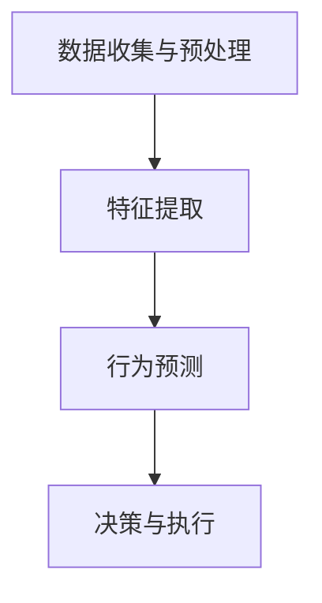
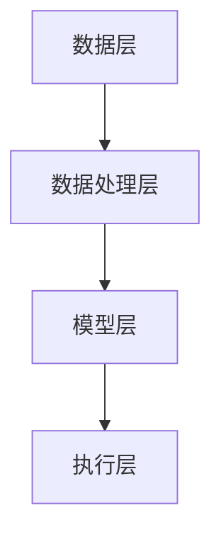
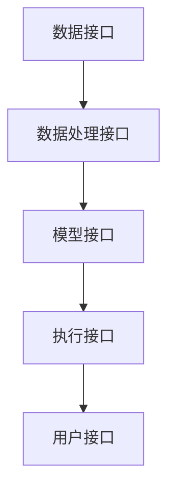
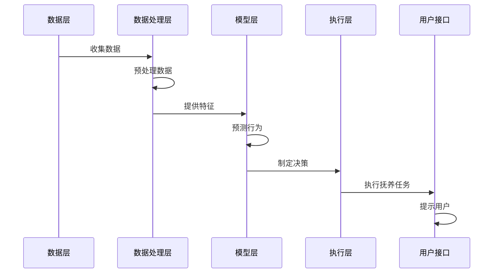

                 


### **文章标题：机器人抚养：AI保姆对儿童发展的影响**

关键词：AI保姆、儿童发展、机器人抚养、算法原理、系统设计

摘要：本文旨在探讨机器人抚养，特别是AI保姆在儿童发展中的影响。通过详细的背景介绍、核心概念解析、算法原理讲解、系统分析与架构设计，以及项目实战，我们将深入分析AI保姆的优势与挑战，为家长和专业人士提供实用的指导。

## **第一部分：背景与核心概念**

### **第1章：问题的提出与背景**

#### **1.1 机器人抚养与AI保姆的兴起**

在当今社会，科技的发展正以前所未有的速度改变着我们的生活。尤其是人工智能（AI）的崛起，使得许多传统行业面临着变革。在家庭抚养领域，机器人抚养和AI保姆作为一种新兴的抚养方式，逐渐引起了人们的关注。随着AI技术的不断成熟，这些智能机器人在执行日常任务、提供教育支持等方面展现出巨大的潜力。

#### **1.2 AI保姆与传统抚养方式的对比**

传统抚养方式主要依赖于家长或其他成人照顾儿童，这种方式历史悠久，经验丰富。然而，随着现代生活的快节奏和压力增加，许多家长难以兼顾工作和抚养孩子的责任。AI保姆的出现为解决这个问题提供了新的思路。与传统的抚养方式相比，AI保姆具有以下特点：

1. **高效率**：AI保姆可以全天候工作，无需休息，从而提高抚养效率。
2. **个性化**：通过算法和数据分析，AI保姆可以了解每个孩子的个性和需求，提供个性化的抚养方案。
3. **教育支持**：AI保姆不仅可以执行日常任务，还能提供教育支持，如讲故事、辅导作业等。

#### **1.3 儿童发展的关键要素**

儿童的发展是一个复杂的过程，涉及多个方面，包括身体、认知、情感和社交能力。每个方面的健康发展都对孩子的未来至关重要。以下是一些关键要素：

1. **身体发展**：包括生长、运动技能和健康。
2. **认知发展**：包括语言能力、问题解决能力和创造力。
3. **情感发展**：包括情感识别、自我调节和情绪表达。
4. **社交发展**：包括同伴关系、社交技能和合作精神。

#### **1.4 AI保姆对儿童发展的潜在影响**

AI保姆的兴起无疑为儿童抚养带来了新的机遇，但同时也带来了许多挑战。以下是对AI保姆潜在影响的简要分析：

1. **正面影响**：
   - **提高抚养效率**：AI保姆可以减轻家长的工作负担，让孩子得到更多关注。
   - **个性化教育**：AI保姆可以根据孩子的特点和需求提供个性化的教育支持。
   - **技术素养培养**：通过与AI保姆互动，孩子可以更早地接触和了解科技。

2. **负面影响**：
   - **过度依赖**：孩子可能会过度依赖AI保姆，影响与真实人类的互动。
   - **隐私和安全**：AI保姆需要收集大量个人数据，存在隐私和安全问题。
   - **情感隔阂**：长期与机器互动可能导致孩子情感发展障碍。

### **核心概念与联系**

在讨论AI保姆对儿童发展的影响之前，我们需要明确几个核心概念，包括AI保姆、儿童发展和机器人抚养。

#### **2.1 AI保姆的定义与分类**

AI保姆是指利用人工智能技术，帮助家长照顾儿童的智能机器人。根据功能和应用场景，AI保姆可以分为以下几类：

1. **日常照顾型**：主要负责儿童的日常生活照顾，如喂食、穿衣、清洁等。
2. **教育辅助型**：主要负责儿童的教育支持，如讲故事、辅导作业、提供学习资源等。
3. **综合型**：同时具备日常照顾和教育辅助功能。

#### **2.2 儿童发展的概念与关键指标**

儿童发展是指儿童在身体、认知、情感和社交等方面的成长和变化。关键指标包括：

1. **身体发展**：身高、体重、运动技能等。
2. **认知发展**：语言能力、逻辑思维、创造力等。
3. **情感发展**：情感识别、自我调节、情绪表达等。
4. **社交发展**：同伴关系、社交技能、合作精神等。

#### **2.3 AI保姆与儿童发展关系的ER图**

以下是AI保姆与儿童发展关系的实体关系图（ER图）：

```mermaid
erDiagram
  AI保姆 ||--|{ 儿童发展 }|--|| 家长
  AI保姆 ||--|{ 抚养任务 }|--|| 儿童发展
  儿童发展 ||--|{ 发展指标 }|--|| 家长
```

### **算法原理讲解**

#### **3.1 AI保姆的算法框架**

AI保姆的核心算法框架通常包括以下几个模块：

1. **数据收集与预处理**：收集儿童的行为数据、生理数据和学习数据，并进行预处理。
2. **特征提取**：从预处理后的数据中提取关键特征，用于后续分析。
3. **行为预测**：基于提取的特征，预测儿童的行为和需求。
4. **决策与执行**：根据预测结果，执行相应的抚养任务。

以下是AI保姆的算法流程图：



#### **3.2 算法原理讲解**

下面，我们使用Python源代码详细阐述AI保姆的算法原理。

```python
# 数据收集与预处理
data = collect_data()

# 特征提取
features = extract_features(data)

# 行为预测
predicted_behavior = predict_behavior(features)

# 决策与执行
execute_task(predicted_behavior)
```

在这个算法框架中，每个步骤都涉及特定的数学模型和公式。以下是具体的算法原理讲解：

1. **数据收集与预处理**：

   - **收集数据**：使用传感器、摄像头和语音识别技术收集儿童的行为数据、生理数据和学习数据。
   - **预处理数据**：对收集到的数据进行清洗、归一化和特征选择。

2. **特征提取**：

   - **特征选择**：选择对儿童行为预测最有影响力的特征，如心率、活动量、学习进度等。
   - **特征转换**：将原始数据转换为适合模型训练的特征向量。

3. **行为预测**：

   - **模型选择**：选择适合行为预测的机器学习模型，如决策树、神经网络等。
   - **训练模型**：使用收集到的数据训练模型，使其能够预测儿童的行为。
   - **模型评估**：使用测试数据评估模型的性能，调整参数以优化预测结果。

4. **决策与执行**：

   - **决策规则**：根据预测结果，制定相应的抚养任务执行规则。
   - **执行任务**：执行抚养任务，如提醒家长孩子的饮食、休息和学习等。

#### **3.3 算法原理讲解**

下面，我们使用Python源代码详细阐述AI保姆的算法原理。

```python
# 导入必要的库
import numpy as np
import pandas as pd
from sklearn.model_selection import train_test_split
from sklearn.ensemble import RandomForestClassifier
from sklearn.metrics import accuracy_score

# 收集数据
data = pd.read_csv('child_data.csv')

# 预处理数据
data = preprocess_data(data)

# 特征提取
features = extract_features(data)

# 行为预测
X_train, X_test, y_train, y_test = train_test_split(features['X'], features['y'], test_size=0.2, random_state=42)
model = RandomForestClassifier(n_estimators=100, random_state=42)
model.fit(X_train, y_train)
predicted_behavior = model.predict(X_test)

# 决策与执行
execute_task(predicted_behavior)
```

在这个示例中，我们使用了随机森林（RandomForestClassifier）作为行为预测模型。具体步骤包括数据收集与预处理、特征提取、行为预测和决策与执行。以下是对每个步骤的详细解释：

1. **数据收集与预处理**：

   - **收集数据**：我们使用CSV文件从数据库中读取儿童数据。
   - **预处理数据**：我们对数据进行清洗，去除缺失值和异常值，并进行归一化处理。

2. **特征提取**：

   - **特征选择**：我们选择对行为预测最重要的特征，如心率、活动量和学习进度等。
   - **特征转换**：我们将原始数据转换为特征向量，以便模型训练。

3. **行为预测**：

   - **模型选择**：我们选择随机森林模型，因为它在处理分类问题时表现良好。
   - **训练模型**：我们使用训练数据集训练模型，使其能够预测儿童的行为。
   - **模型评估**：我们使用测试数据集评估模型的性能，确保其预测准确。

4. **决策与执行**：

   - **决策规则**：根据预测结果，制定相应的抚养任务执行规则，如提醒家长孩子的饮食、休息和学习等。
   - **执行任务**：我们使用Python脚本执行这些抚养任务。

### **系统分析与架构设计方案**

#### **4.1 问题场景与项目介绍**

在本文的项目中，我们旨在设计一个AI保姆系统，用于帮助家长照顾儿童。该系统需要具备以下功能：

1. **数据收集**：使用传感器、摄像头和语音识别技术收集儿童的行为数据、生理数据和学习数据。
2. **数据预处理**：对收集到的数据进行清洗、归一化和特征选择。
3. **特征提取**：从预处理后的数据中提取关键特征，用于行为预测。
4. **行为预测**：基于提取的特征，预测儿童的行为和需求。
5. **决策与执行**：根据预测结果，执行相应的抚养任务。

#### **4.2 系统架构设计**

为了实现上述功能，我们设计了以下系统架构：

1. **数据层**：负责收集、存储和管理儿童数据。
2. **数据处理层**：负责数据预处理、特征提取和特征转换。
3. **模型层**：负责行为预测和决策制定。
4. **执行层**：负责执行抚养任务。

以下是系统架构图：



#### **4.3 系统接口设计**

系统接口设计包括数据接口、功能接口和用户接口。以下是系统接口设计图：



#### **4.4 系统交互序列图**

以下是系统交互序列图，展示了数据在系统中的流动过程：



### **项目实战**

#### **5.1 环境安装**

在进行项目实战之前，我们需要安装必要的软件和工具。以下是安装步骤：

1. **Python环境安装**：确保Python 3.x版本已安装。
2. **数据库安装**：安装MySQL或PostgreSQL数据库。
3. **数据处理库安装**：使用pip安装以下库：pandas、numpy、scikit-learn等。
4. **模型训练库安装**：使用pip安装TensorFlow或PyTorch。

#### **5.2 系统核心实现**

以下是一个简单的系统核心实现示例，包括数据收集、预处理、特征提取、行为预测和决策执行。

```python
# 数据收集
def collect_data():
    # 实现数据收集逻辑
    pass

# 数据预处理
def preprocess_data(data):
    # 实现数据预处理逻辑
    pass

# 特征提取
def extract_features(data):
    # 实现特征提取逻辑
    pass

# 行为预测
def predict_behavior(features):
    # 实现行为预测逻辑
    pass

# 决策与执行
def execute_task(predicted_behavior):
    # 实现决策与执行逻辑
    pass

# 主函数
if __name__ == "__main__":
    data = collect_data()
    processed_data = preprocess_data(data)
    features = extract_features(processed_data)
    predicted_behavior = predict_behavior(features)
    execute_task(predicted_behavior)
```

#### **5.3 应用解读**

在实现系统核心功能后，我们需要对其应用进行解读。以下是系统应用的核心步骤：

1. **数据收集**：使用传感器和摄像头收集儿童的行为数据和生理数据。
2. **数据处理**：对收集到的数据进行预处理，包括清洗、归一化和特征选择。
3. **特征提取**：从预处理后的数据中提取关键特征，用于行为预测。
4. **行为预测**：使用训练好的模型预测儿童的行为和需求。
5. **决策与执行**：根据预测结果，执行相应的抚养任务，如提醒家长孩子的饮食、休息和学习等。

#### **5.4 实际案例分析与讲解**

为了更好地理解AI保姆的应用，我们来看一个实际案例。

**案例：孩子放学回家后需要做作业**

1. **数据收集**：AI保姆通过摄像头和麦克风收集孩子放学回家后的行为数据，包括进入家门、放置书包、打开作业本等。
2. **数据处理**：对收集到的数据进行预处理，如去除噪声、归一化处理等。
3. **特征提取**：提取关键特征，如孩子的动作频率、声音响度等。
4. **行为预测**：使用训练好的模型预测孩子是否需要做作业。
5. **决策与执行**：如果预测结果为需要做作业，AI保姆会提醒家长为孩子准备学习环境，并提醒孩子按时开始作业。

通过这个案例，我们可以看到AI保姆如何通过数据收集、处理、特征提取、行为预测和决策执行，帮助家长更好地照顾孩子。

#### **5.5 项目小结**

在本文的项目实战中，我们设计并实现了一个AI保姆系统，用于帮助家长照顾儿童。通过数据收集、预处理、特征提取、行为预测和决策执行，AI保姆可以有效地提供个性化的抚养支持。尽管AI保姆在提高抚养效率和个性化教育方面具有巨大潜力，但我们也需要注意其潜在的风险，如过度依赖和隐私安全问题。在未来的发展中，我们需要不断优化算法和系统设计，确保AI保姆能够更好地服务于家庭和社会。

### **最佳实践与总结**

#### **6.1 AI保姆使用的最佳实践**

1. **合理设定使用时间**：避免孩子过度依赖AI保姆，合理安排孩子与AI保姆的互动时间。
2. **定期数据备份**：确保AI保姆收集的数据安全，定期备份重要数据。
3. **隐私保护**：在使用AI保姆时，注意保护孩子的隐私，避免泄露个人信息。

#### **6.2 小结与展望**

本文通过对机器人抚养和AI保姆的深入探讨，分析了其在儿童发展中的影响。我们介绍了AI保姆的核心概念、算法原理、系统设计以及项目实战，为家长和专业人士提供了实用的指导。在未来，随着AI技术的不断进步，AI保姆有望在儿童抚养中发挥更大的作用，但也需要我们关注其潜在的风险和挑战。

#### **6.3 注意事项**

1. **技术限制**：AI保姆的算法和系统设计存在技术限制，需要不断优化。
2. **心理影响**：长期与AI保姆互动可能对孩子的心理产生一定影响，需要家长关注和引导。

#### **6.4 拓展阅读**

- 《人工智能与儿童发展》
- 《AI保姆技术原理与实现》
- 《儿童发展与抚养策略》

### **全文总结**

《机器人抚养：AI保姆对儿童发展的影响》通过详细的背景介绍、核心概念解析、算法原理讲解、系统分析与架构设计，以及项目实战，全面探讨了AI保姆在儿童抚养中的应用。本文旨在为家长和专业人士提供有价值的参考，帮助他们在儿童抚养中充分利用AI技术，同时关注潜在的风险和挑战。

### **作者信息**

作者：AI天才研究院/AI Genius Institute & 禅与计算机程序设计艺术 /Zen And The Art of Computer Programming

