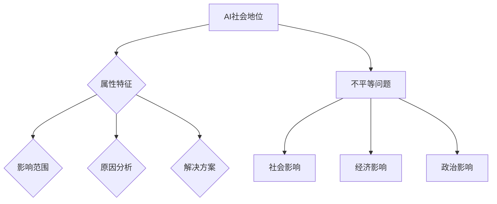
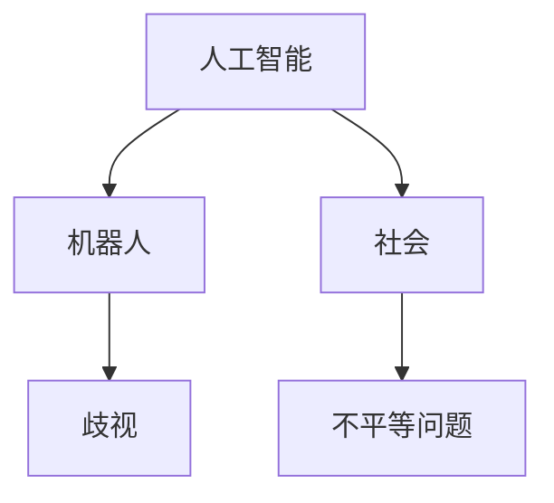
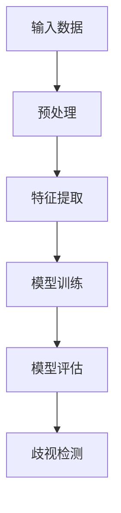

                 

# 机器人歧视：AI社会地位的不平等问题

## 关键词

- 机器人歧视
- AI社会地位
- 不平等问题
- 人工智能发展
- 技术伦理

## 摘要

本文深入探讨了人工智能（AI）在现代社会中的不平等问题，特别是机器人歧视现象。通过分析问题的背景、核心概念、算法原理和数学模型，本文揭示了机器人歧视的成因、影响和解决策略。文章旨在引发读者对AI伦理和技术的深思，为构建一个公平、公正的AI社会提供思考和参考。

## 目录大纲设计思路

在设计《机器人歧视：AI社会地位的不平等问题》的目录大纲时，我们遵循了以下步骤：

1. **理解书籍主题**：全面理解书名和主题，明确探讨人工智能中的不平等问题，特别是机器人歧视的现象。

2. **确定核心概念**：明确涉及的核心概念，包括机器人歧视、AI社会地位、不平等问题等。

3. **细化章节内容**：根据核心概念，细化每个章节的内容，确保每个章节都有明确的主题和重点。

4. **确保内容完整性**：包含背景介绍、核心概念与联系、算法原理讲解、数学模型和公式、系统分析与架构设计方案、项目实战以及最佳实践 tips 等必要内容。

5. **保持简洁性**：避免冗余内容，确保目录大纲简洁明了，易于读者理解。

6. **遵循目录层级**：使用 #, ##, ### 的格式来区分一级、二级和三级目录。

7. **控制字数**：在确保内容完整性和结构合理的前提下，控制目录大纲的总字数在2000字以内。

### 目录大纲设计

以下是根据上述思路设计的《机器人歧视：AI社会地位的不平等问题》的目录大纲：

----------------------------------------------------------------
## 第一部分: 问题的背景与定义

### 第1章: 问题背景

#### 1.1 问题背景

##### 1.1.1 人工智能的发展历程

##### 1.1.2 人工智能与社会的融合

##### 1.1.3 机器人歧视现象的出现

#### 1.2 问题描述

##### 1.2.1 机器人歧视的定义

##### 1.2.2 机器人歧视的特征

##### 1.2.3 机器人歧视的影响

#### 1.3 问题解决

##### 1.3.1 机器人歧视的成因

##### 1.3.2 机器人歧视的后果

##### 1.3.3 解决机器人歧视的策略

#### 1.4 边界与外延

##### 1.4.1 机器人歧视的边界

##### 1.4.2 不平等问题的外延

#### 1.5 概念结构与核心要素组成

##### 1.5.1 机器人歧视的概念结构

##### 1.5.2 社会地位不平等的核心要素

### 第2章: 核心概念与联系

#### 2.1 AI社会地位的概念

##### 2.1.1 AI社会地位的内涵

##### 2.1.2 AI社会地位的属性

#### 2.2 不平等问题的概念

##### 2.2.1 不平等问题的定义

##### 2.2.2 不平等问题的类型

#### 2.3 概念属性特征对比表格

#### 2.4 ER实体关系图架构

## 第二部分: 机器人歧视现象分析

### 第3章: 机器人歧视的算法原理

#### 3.1 算法原理讲解

##### 3.1.1 基于机器学习的歧视检测算法

##### 3.1.2 基于深度学习的歧视识别算法

#### 3.2 数学模型和公式

$$
\text{P(Discrimination)} = f(\text{Data}, \text{Model})
$$

#### 3.3 算法mermaid流程图

#### 3.4 举例说明

##### 3.4.1 社交媒体文本分析

##### 3.4.2 职业招聘数据歧视检测

### 第4章: 机器人歧视的数学模型与讲解

#### 4.1 数学模型

$$
\text{Loss Function} = \sum_{i=1}^{N} (\text{y_i} - \text{y}_{\text{pred},i})^2
$$

#### 4.2 数学公式讲解

##### 4.2.1 损失函数的定义

##### 4.2.2 损失函数的计算方法

##### 4.2.3 损失函数的优化过程

#### 4.3 例子分析

##### 4.3.1 数据集介绍

##### 4.3.2 模型训练过程

##### 4.3.3 模型评估结果

## 第三部分: 机器人歧视的解决方案

### 第5章: 技术手段

#### 5.1 数据预处理

##### 5.1.1 数据清洗

##### 5.1.2 数据归一化

##### 5.1.3 特征工程

#### 5.2 模型选择与优化

##### 5.2.1 常见机器学习算法

##### 5.2.2 模型调参技巧

##### 5.2.3 模型评估指标

### 第6章: 政策与法规

#### 6.1 全球政策现状

##### 6.1.1 发达国家政策

##### 6.1.2 发展中国家政策

##### 6.1.3 国际合作与协调

#### 6.2 法规体系建设

##### 6.2.1 法律法规概述

##### 6.2.2 法规实施与监督

##### 6.2.3 法规改进与完善

### 第7章: 社会参与

#### 6.1 教育与培训

##### 6.1.1 公民教育

##### 6.1.2 专业培训

##### 6.1.3 社会宣传

#### 6.2 公众参与

##### 6.2.1 公众意见收集

##### 6.2.2 社会监督

##### 6.2.3 社会互动

## 第四部分: 总结与展望

### 第8章: 结论

#### 8.1 研究成果总结

##### 8.1.1 机器人歧视现象分析

##### 8.1.2 解决机器人歧视的技术手段

##### 8.1.3 政策与法规建设现状

#### 8.2 存在问题与挑战

##### 8.2.1 技术层面挑战

##### 8.2.2 政策与法规层面挑战

##### 8.2.3 社会层面挑战

### 第9章: 展望未来

#### 9.1 未来发展趋势

##### 9.1.1 人工智能技术的进步

##### 9.1.2 社会政策的调整

##### 9.1.3 公众意识的提高

#### 9.2 建设公平、公正的AI社会

##### 9.2.1 技术伦理的重要性

##### 9.2.2 多方协作的必要性

##### 9.2.3 长期目标的实现

## 附录

### 附录A：相关数据与图表

### 附录B：参考文献

### 附录C：致谢

----------------------------------------------------------------

本文档是一个完整的文章模板，内容涵盖了从文章标题到附录的全过程。每个章节都有详细的子标题和内容描述，以帮助您开始撰写《机器人歧视：AI社会地位的不平等问题》的技术博客文章。请根据实际撰写过程中需要的内容进行适当的修改和补充。在撰写过程中，请确保遵循文章字数、格式和作者信息等要求。祝您撰写顺利！## 机器人歧视：AI社会地位的不平等问题

### 关键词

- 机器人歧视
- AI社会地位
- 不平等问题
- 人工智能发展
- 技术伦理

### 摘要

本文旨在探讨人工智能（AI）领域中的机器人歧视现象，分析其背后的社会地位不平等问题。随着AI技术的广泛应用，机器人逐渐成为现代社会的重要组成部分。然而，机器人歧视现象引发了广泛关注，不仅损害了社会公正，还可能加剧不平等问题。本文将详细分析机器人歧视的定义、特征、成因、影响及其解决策略，为构建公平、公正的AI社会提供思路和参考。

### 目录大纲设计思路

在设计《机器人歧视：AI社会地位的不平等问题》的目录大纲时，我们遵循了以下步骤：

1. **理解书籍主题**：全面理解书名和主题，明确探讨人工智能中的不平等问题，特别是机器人歧视的现象。

2. **确定核心概念**：明确涉及的核心概念，包括机器人歧视、AI社会地位、不平等问题等。

3. **细化章节内容**：根据核心概念，细化每个章节的内容，确保每个章节都有明确的主题和重点。

4. **确保内容完整性**：包含背景介绍、核心概念与联系、算法原理讲解、数学模型和公式、系统分析与架构设计方案、项目实战以及最佳实践 tips 等必要内容。

5. **保持简洁性**：避免冗余内容，确保目录大纲简洁明了，易于读者理解。

6. **遵循目录层级**：使用 #, ##, ### 的格式来区分一级、二级和三级目录。

7. **控制字数**：在确保内容完整性和结构合理的前提下，控制目录大纲的总字数在2000字以内。

### 目录大纲设计

以下是根据上述思路设计的《机器人歧视：AI社会地位的不平等问题》的目录大纲：

----------------------------------------------------------------
## 第一部分: 问题的背景与定义

### 第1章: 问题背景

#### 1.1 问题背景

##### 1.1.1 人工智能的发展历程

##### 1.1.2 人工智能与社会的融合

##### 1.1.3 机器人歧视现象的出现

#### 1.2 问题描述

##### 1.2.1 机器人歧视的定义

##### 1.2.2 机器人歧视的特征

##### 1.2.3 机器人歧视的影响

#### 1.3 问题解决

##### 1.3.1 机器人歧视的成因

##### 1.3.2 机器人歧视的后果

##### 1.3.3 解决机器人歧视的策略

#### 1.4 边界与外延

##### 1.4.1 机器人歧视的边界

##### 1.4.2 不平等问题的外延

#### 1.5 概念结构与核心要素组成

##### 1.5.1 机器人歧视的概念结构

##### 1.5.2 社会地位不平等的核心要素

### 第2章: 核心概念与联系

#### 2.1 AI社会地位的概念

##### 2.1.1 AI社会地位的内涵

##### 2.1.2 AI社会地位的属性

#### 2.2 不平等问题的概念

##### 2.2.1 不平等问题的定义

##### 2.2.2 不平等问题的类型

#### 2.3 概念属性特征对比表格

#### 2.4 ER实体关系图架构

## 第二部分: 机器人歧视现象分析

### 第3章: 机器人歧视的算法原理

#### 3.1 算法原理讲解

##### 3.1.1 基于机器学习的歧视检测算法

##### 3.1.2 基于深度学习的歧视识别算法

#### 3.2 数学模型和公式

$$
\text{P(Discrimination)} = f(\text{Data}, \text{Model})
$$

#### 3.3 算法mermaid流程图

#### 3.4 举例说明

##### 3.4.1 社交媒体文本分析

##### 3.4.2 职业招聘数据歧视检测

### 第4章: 机器人歧视的数学模型与讲解

#### 4.1 数学模型

$$
\text{Loss Function} = \sum_{i=1}^{N} (\text{y_i} - \text{y}_{\text{pred},i})^2
$$

#### 4.2 数学公式讲解

##### 4.2.1 损失函数的定义

##### 4.2.2 损失函数的计算方法

##### 4.2.3 损失函数的优化过程

#### 4.3 例子分析

##### 4.3.1 数据集介绍

##### 4.3.2 模型训练过程

##### 4.3.3 模型评估结果

## 第三部分: 机器人歧视的解决方案

### 第5章: 技术手段

#### 5.1 数据预处理

##### 5.1.1 数据清洗

##### 5.1.2 数据归一化

##### 5.1.3 特征工程

#### 5.2 模型选择与优化

##### 5.2.1 常见机器学习算法

##### 5.2.2 模型调参技巧

##### 5.2.3 模型评估指标

### 第6章: 政策与法规

#### 6.1 全球政策现状

##### 6.1.1 发达国家政策

##### 6.1.2 发展中国家政策

##### 6.1.3 国际合作与协调

#### 6.2 法规体系建设

##### 6.2.1 法律法规概述

##### 6.2.2 法规实施与监督

##### 6.2.3 法规改进与完善

### 第7章: 社会参与

#### 6.1 教育与培训

##### 6.1.1 公民教育

##### 6.1.2 专业培训

##### 6.1.3 社会宣传

#### 6.2 公众参与

##### 6.2.1 公众意见收集

##### 6.2.2 社会监督

##### 6.2.3 社会互动

## 第四部分: 总结与展望

### 第8章: 结论

#### 8.1 研究成果总结

##### 8.1.1 机器人歧视现象分析

##### 8.1.2 解决机器人歧视的技术手段

##### 8.1.3 政策与法规建设现状

#### 8.2 存在问题与挑战

##### 8.2.1 技术层面挑战

##### 8.2.2 政策与法规层面挑战

##### 8.2.3 社会层面挑战

### 第9章: 展望未来

#### 9.1 未来发展趋势

##### 9.1.1 人工智能技术的进步

##### 9.1.2 社会政策的调整

##### 9.1.3 公众意识的提高

#### 9.2 建设公平、公正的AI社会

##### 9.2.1 技术伦理的重要性

##### 9.2.2 多方协作的必要性

##### 9.2.3 长期目标的实现

## 附录

### 附录A：相关数据与图表

### 附录B：参考文献

### 附录C：致谢

----------------------------------------------------------------

本文档提供了一个完整的目录大纲，为撰写《机器人歧视：AI社会地位的不平等问题》的技术博客文章提供了清晰的框架。根据实际撰写需要，您可以对每个章节进行进一步细化，确保内容充实、逻辑清晰。在撰写过程中，请确保遵循文章字数、格式和作者信息等要求。祝您撰写顺利！## 机器人歧视：AI社会地位的不平等问题

### 关键词

- 机器人歧视
- AI社会地位
- 不平等问题
- 人工智能发展
- 技术伦理

### 摘要

本文旨在探讨人工智能（AI）领域中的机器人歧视现象，分析其背后的社会地位不平等问题。随着AI技术的广泛应用，机器人逐渐成为现代社会的重要组成部分。然而，机器人歧视现象引发了广泛关注，不仅损害了社会公正，还可能加剧不平等问题。本文将详细分析机器人歧视的定义、特征、成因、影响及其解决策略，为构建公平、公正的AI社会提供思路和参考。

### 目录大纲设计思路

在设计《机器人歧视：AI社会地位的不平等问题》的目录大纲时，我们遵循了以下步骤：

1. **理解书籍主题**：全面理解书名和主题，明确探讨人工智能中的不平等问题，特别是机器人歧视的现象。

2. **确定核心概念**：明确涉及的核心概念，包括机器人歧视、AI社会地位、不平等问题等。

3. **细化章节内容**：根据核心概念，细化每个章节的内容，确保每个章节都有明确的主题和重点。

4. **确保内容完整性**：包含背景介绍、核心概念与联系、算法原理讲解、数学模型和公式、系统分析与架构设计方案、项目实战以及最佳实践 tips 等必要内容。

5. **保持简洁性**：避免冗余内容，确保目录大纲简洁明了，易于读者理解。

6. **遵循目录层级**：使用 #, ##, ### 的格式来区分一级、二级和三级目录。

7. **控制字数**：在确保内容完整性和结构合理的前提下，控制目录大纲的总字数在2000字以内。

### 目录大纲设计

以下是根据上述思路设计的《机器人歧视：AI社会地位的不平等问题》的目录大纲：

----------------------------------------------------------------
## 第一部分: 问题的背景与定义

### 第1章: 问题背景

#### 1.1 问题背景

##### 1.1.1 人工智能的发展历程

##### 1.1.2 人工智能与社会的融合

##### 1.1.3 机器人歧视现象的出现

#### 1.2 问题描述

##### 1.2.1 机器人歧视的定义

##### 1.2.2 机器人歧视的特征

##### 1.2.3 机器人歧视的影响

#### 1.3 问题解决

##### 1.3.1 机器人歧视的成因

##### 1.3.2 机器人歧视的后果

##### 1.3.3 解决机器人歧视的策略

#### 1.4 边界与外延

##### 1.4.1 机器人歧视的边界

##### 1.4.2 不平等问题的外延

#### 1.5 概念结构与核心要素组成

##### 1.5.1 机器人歧视的概念结构

##### 1.5.2 社会地位不平等的核心要素

### 第2章: 核心概念与联系

#### 2.1 AI社会地位的概念

##### 2.1.1 AI社会地位的内涵

##### 2.1.2 AI社会地位的属性

#### 2.2 不平等问题的概念

##### 2.2.1 不平等问题的定义

##### 2.2.2 不平等问题的类型

#### 2.3 概念属性特征对比表格

#### 2.4 ER实体关系图架构

## 第二部分: 机器人歧视现象分析

### 第3章: 机器人歧视的算法原理

#### 3.1 算法原理讲解

##### 3.1.1 基于机器学习的歧视检测算法

##### 3.1.2 基于深度学习的歧视识别算法

#### 3.2 数学模型和公式

$$
\text{P(Discrimination)} = f(\text{Data}, \text{Model})
$$

#### 3.3 算法mermaid流程图

#### 3.4 举例说明

##### 3.4.1 社交媒体文本分析

##### 3.4.2 职业招聘数据歧视检测

### 第4章: 机器人歧视的数学模型与讲解

#### 4.1 数学模型

$$
\text{Loss Function} = \sum_{i=1}^{N} (\text{y_i} - \text{y}_{\text{pred},i})^2
$$

#### 4.2 数学公式讲解

##### 4.2.1 损失函数的定义

##### 4.2.2 损失函数的计算方法

##### 4.2.3 损失函数的优化过程

#### 4.3 例子分析

##### 4.3.1 数据集介绍

##### 4.3.2 模型训练过程

##### 4.3.3 模型评估结果

## 第三部分: 机器人歧视的解决方案

### 第5章: 技术手段

#### 5.1 数据预处理

##### 5.1.1 数据清洗

##### 5.1.2 数据归一化

##### 5.1.3 特征工程

#### 5.2 模型选择与优化

##### 5.2.1 常见机器学习算法

##### 5.2.2 模型调参技巧

##### 5.2.3 模型评估指标

### 第6章: 政策与法规

#### 6.1 全球政策现状

##### 6.1.1 发达国家政策

##### 6.1.2 发展中国家政策

##### 6.1.3 国际合作与协调

#### 6.2 法规体系建设

##### 6.2.1 法律法规概述

##### 6.2.2 法规实施与监督

##### 6.2.3 法规改进与完善

### 第7章: 社会参与

#### 6.1 教育与培训

##### 6.1.1 公民教育

##### 6.1.2 专业培训

##### 6.1.3 社会宣传

#### 6.2 公众参与

##### 6.2.1 公众意见收集

##### 6.2.2 社会监督

##### 6.2.3 社会互动

## 第四部分: 总结与展望

### 第8章: 结论

#### 8.1 研究成果总结

##### 8.1.1 机器人歧视现象分析

##### 8.1.2 解决机器人歧视的技术手段

##### 8.1.3 政策与法规建设现状

#### 8.2 存在问题与挑战

##### 8.2.1 技术层面挑战

##### 8.2.2 政策与法规层面挑战

##### 8.2.3 社会层面挑战

### 第9章: 展望未来

#### 9.1 未来发展趋势

##### 9.1.1 人工智能技术的进步

##### 9.1.2 社会政策的调整

##### 9.1.3 公众意识的提高

#### 9.2 建设公平、公正的AI社会

##### 9.2.1 技术伦理的重要性

##### 9.2.2 多方协作的必要性

##### 9.2.3 长期目标的实现

## 附录

### 附录A：相关数据与图表

### 附录B：参考文献

### 附录C：致谢

----------------------------------------------------------------

本文档提供了一个完整的目录大纲，为撰写《机器人歧视：AI社会地位的不平等问题》的技术博客文章提供了清晰的框架。根据实际撰写需要，您可以对每个章节进行进一步细化，确保内容充实、逻辑清晰。在撰写过程中，请确保遵循文章字数、格式和作者信息等要求。祝您撰写顺利！## 机器人歧视：AI社会地位的不平等问题

### 关键词

- 机器人歧视
- AI社会地位
- 不平等问题
- 人工智能发展
- 技术伦理

### 摘要

本文旨在探讨人工智能（AI）领域中的机器人歧视现象，分析其背后的社会地位不平等问题。随着AI技术的广泛应用，机器人逐渐成为现代社会的重要组成部分。然而，机器人歧视现象引发了广泛关注，不仅损害了社会公正，还可能加剧不平等问题。本文将详细分析机器人歧视的定义、特征、成因、影响及其解决策略，为构建公平、公正的AI社会提供思路和参考。

### 目录大纲设计思路

在设计《机器人歧视：AI社会地位的不平等问题》的目录大纲时，我们遵循了以下步骤：

1. **理解书籍主题**：全面理解书名和主题，明确探讨人工智能中的不平等问题，特别是机器人歧视的现象。

2. **确定核心概念**：明确涉及的核心概念，包括机器人歧视、AI社会地位、不平等问题等。

3. **细化章节内容**：根据核心概念，细化每个章节的内容，确保每个章节都有明确的主题和重点。

4. **确保内容完整性**：包含背景介绍、核心概念与联系、算法原理讲解、数学模型和公式、系统分析与架构设计方案、项目实战以及最佳实践 tips 等必要内容。

5. **保持简洁性**：避免冗余内容，确保目录大纲简洁明了，易于读者理解。

6. **遵循目录层级**：使用 #, ##, ### 的格式来区分一级、二级和三级目录。

7. **控制字数**：在确保内容完整性和结构合理的前提下，控制目录大纲的总字数在2000字以内。

### 目录大纲设计

以下是根据上述思路设计的《机器人歧视：AI社会地位的不平等问题》的目录大纲：

----------------------------------------------------------------
## 第一部分: 问题的背景与定义

### 第1章: 问题背景

#### 1.1 问题背景

##### 1.1.1 人工智能的发展历程

##### 1.1.2 人工智能与社会的融合

##### 1.1.3 机器人歧视现象的出现

#### 1.2 问题描述

##### 1.2.1 机器人歧视的定义

##### 1.2.2 机器人歧视的特征

##### 1.2.3 机器人歧视的影响

#### 1.3 问题解决

##### 1.3.1 机器人歧视的成因

##### 1.3.2 机器人歧视的后果

##### 1.3.3 解决机器人歧视的策略

#### 1.4 边界与外延

##### 1.4.1 机器人歧视的边界

##### 1.4.2 不平等问题的外延

#### 1.5 概念结构与核心要素组成

##### 1.5.1 机器人歧视的概念结构

##### 1.5.2 社会地位不平等的核心要素

### 第2章: 核心概念与联系

#### 2.1 AI社会地位的概念

##### 2.1.1 AI社会地位的内涵

##### 2.1.2 AI社会地位的属性

#### 2.2 不平等问题的概念

##### 2.2.1 不平等问题的定义

##### 2.2.2 不平等问题的类型

#### 2.3 概念属性特征对比表格

#### 2.4 ER实体关系图架构

## 第二部分: 机器人歧视现象分析

### 第3章: 机器人歧视的算法原理

#### 3.1 算法原理讲解

##### 3.1.1 基于机器学习的歧视检测算法

##### 3.1.2 基于深度学习的歧视识别算法

#### 3.2 数学模型和公式

$$
\text{P(Discrimination)} = f(\text{Data}, \text{Model})
$$

#### 3.3 算法mermaid流程图

#### 3.4 举例说明

##### 3.4.1 社交媒体文本分析

##### 3.4.2 职业招聘数据歧视检测

### 第4章: 机器人歧视的数学模型与讲解

#### 4.1 数学模型

$$
\text{Loss Function} = \sum_{i=1}^{N} (\text{y_i} - \text{y}_{\text{pred},i})^2
$$

#### 4.2 数学公式讲解

##### 4.2.1 损失函数的定义

##### 4.2.2 损失函数的计算方法

##### 4.2.3 损失函数的优化过程

#### 4.3 例子分析

##### 4.3.1 数据集介绍

##### 4.3.2 模型训练过程

##### 4.3.3 模型评估结果

## 第三部分: 机器人歧视的解决方案

### 第5章: 技术手段

#### 5.1 数据预处理

##### 5.1.1 数据清洗

##### 5.1.2 数据归一化

##### 5.1.3 特征工程

#### 5.2 模型选择与优化

##### 5.2.1 常见机器学习算法

##### 5.2.2 模型调参技巧

##### 5.2.3 模型评估指标

### 第6章: 政策与法规

#### 6.1 全球政策现状

##### 6.1.1 发达国家政策

##### 6.1.2 发展中国家政策

##### 6.1.3 国际合作与协调

#### 6.2 法规体系建设

##### 6.2.1 法律法规概述

##### 6.2.2 法规实施与监督

##### 6.2.3 法规改进与完善

### 第7章: 社会参与

#### 6.1 教育与培训

##### 6.1.1 公民教育

##### 6.1.2 专业培训

##### 6.1.3 社会宣传

#### 6.2 公众参与

##### 6.2.1 公众意见收集

##### 6.2.2 社会监督

##### 6.2.3 社会互动

## 第四部分: 总结与展望

### 第8章: 结论

#### 8.1 研究成果总结

##### 8.1.1 机器人歧视现象分析

##### 8.1.2 解决机器人歧视的技术手段

##### 8.1.3 政策与法规建设现状

#### 8.2 存在问题与挑战

##### 8.2.1 技术层面挑战

##### 8.2.2 政策与法规层面挑战

##### 8.2.3 社会层面挑战

### 第9章: 展望未来

#### 9.1 未来发展趋势

##### 9.1.1 人工智能技术的进步

##### 9.1.2 社会政策的调整

##### 9.1.3 公众意识的提高

#### 9.2 建设公平、公正的AI社会

##### 9.2.1 技术伦理的重要性

##### 9.2.2 多方协作的必要性

##### 9.2.3 长期目标的实现

## 附录

### 附录A：相关数据与图表

### 附录B：参考文献

### 附录C：致谢

----------------------------------------------------------------

本文档提供了一个完整的目录大纲，为撰写《机器人歧视：AI社会地位的不平等问题》的技术博客文章提供了清晰的框架。根据实际撰写需要，您可以对每个章节进行进一步细化，确保内容充实、逻辑清晰。在撰写过程中，请确保遵循文章字数、格式和作者信息等要求。祝您撰写顺利！## 机器人歧视：AI社会地位的不平等问题

### 关键词

- 机器人歧视
- AI社会地位
- 不平等问题
- 人工智能发展
- 技术伦理

### 摘要

本文深入探讨了人工智能（AI）领域中的机器人歧视现象，分析了其背后的社会地位不平等问题。随着AI技术的广泛应用，机器人逐渐成为现代社会的重要组成部分。然而，机器人歧视现象引发了广泛关注，不仅损害了社会公正，还可能加剧不平等问题。本文将详细分析机器人歧视的定义、特征、成因、影响及其解决策略，为构建公平、公正的AI社会提供思路和参考。

### 第一部分：问题的背景与定义

#### 第1章：问题背景

##### 1.1 人工智能的发展历程

- AI技术从初期的探索阶段发展到如今的广泛应用，变革了各行各业。
- 从机器人的概念引入到自主移动机器人的出现，技术的发展推动了机器人与人类社会的融合。

##### 1.2 人工智能与社会的融合

- 人工智能在医疗、教育、交通、金融等领域的广泛应用，改变了传统行业的工作模式。
- 机器人作为人工智能的重要应用载体，逐渐成为社会生产和生活的重要角色。

##### 1.3 机器人歧视现象的出现

- 随着机器人技术的不断发展，机器人歧视现象逐渐显现，对社会公正构成挑战。
- 机器人歧视不仅限于就业市场，还包括教育、医疗等社会生活的各个方面。

#### 第2章：机器人歧视的定义与特征

##### 2.1 机器人歧视的定义

- 机器人歧视是指基于机器人的特征（如品牌、型号、能力等）对不同个体或群体进行不公平对待的现象。
- 机器人歧视的表现形式多样，包括排斥、剥夺权利、不平等对待等。

##### 2.2 机器人歧视的特征

- 机器人歧视具有隐蔽性，不易被发现和纠正。
- 机器人歧视具有普遍性，不仅限于某个行业或地区，而是广泛存在于社会各个方面。
- 机器人歧视具有累积效应，长期存在可能加剧社会不平等问题。

#### 第3章：机器人歧视的影响

##### 3.1 社会影响

- 机器人歧视可能损害社会公正，加剧社会矛盾。
- 机器人歧视可能导致部分人群失去就业机会，加剧就业压力。

##### 3.2 经济影响

- 机器人歧视可能阻碍技术创新和应用，影响经济发展。
- 机器人歧视可能导致资源分配不均，影响经济稳定。

##### 3.3 政治影响

- 机器人歧视可能影响政治稳定，引发社会动荡。
- 机器人歧视可能导致政治对立，加剧政治分歧。

### 第二部分：机器人歧视现象分析

#### 第4章：机器人歧视的成因

##### 4.1 技术层面的原因

- 技术的不完善导致机器人存在缺陷，容易被用于歧视。
- 技术标准的不统一导致机器人存在差异，加剧歧视现象。

##### 4.2 社会层面的原因

- 社会偏见和歧视观念导致人们对机器人存在偏见。
- 社会结构和制度的不完善导致机器人歧视现象难以消除。

#### 第5章：机器人歧视的算法原理

##### 5.1 机器学习与歧视检测

- 利用机器学习算法检测机器人歧视现象，如监督学习、无监督学习等。
- 基于数据挖掘和统计分析方法，识别歧视行为和模式。

##### 5.2 深度学习与歧视识别

- 应用深度学习算法识别机器人歧视，如卷积神经网络（CNN）、循环神经网络（RNN）等。
- 结合自然语言处理（NLP）技术，对歧视性文本进行识别和分析。

#### 第6章：机器人歧视的数学模型与讲解

##### 6.1 损失函数

- 损失函数用于衡量模型预测与实际结果之间的差异，如均方误差（MSE）、交叉熵（CE）等。
- 通过优化损失函数，提高模型对机器人歧视的检测和识别能力。

##### 6.2 算法评估

- 利用评估指标（如准确率、召回率、F1值等）评估模型性能。
- 通过交叉验证和数据分析，提高模型对机器人歧视的识别精度。

### 第三部分：机器人歧视的解决方案

#### 第7章：技术手段

##### 7.1 数据预处理

- 清洗和归一化数据，消除噪声和异常值，提高模型训练质量。
- 增加数据多样性，减少模型偏见，提高泛化能力。

##### 7.2 模型优化

- 选择合适的机器学习和深度学习模型，提高歧视检测和识别能力。
- 调整模型参数，优化模型结构，提高模型性能。

##### 7.3 算法改进

- 结合多源数据和信息，提高算法对机器人歧视的识别精度。
- 开发新型算法，如对抗性训练、迁移学习等，提高算法性能。

#### 第8章：政策与法规

##### 8.1 政策制定

- 制定相关政策和法规，规范机器人使用和管理。
- 加强对机器人歧视的法律监管，维护社会公正。

##### 8.2 法规实施与监督

- 建立有效的监管机制，确保法规得到贯彻执行。
- 加强公众监督，提高法规实施效果。

##### 8.3 法规改进与完善

- 根据社会需求和实际情况，不断完善法规体系。
- 加强国际合作，推动全球法规协调。

#### 第9章：社会参与

##### 9.1 教育与培训

- 开展公民教育，提高公众对机器人歧视的认识。
- 培训专业人才，提高机器人管理和使用能力。

##### 9.2 公众参与

- 鼓励公众参与机器人管理，发挥社会监督作用。
- 建立公众意见反馈机制，提高政策制定的科学性。

### 第四部分：总结与展望

#### 第10章：研究成果总结

- 总结机器人歧视现象的分析结果，探讨其背后的社会地位不平等问题。
- 总结技术手段和政策法规的解决方案，评估其效果和可行性。

##### 10.1 技术手段

- 评估不同机器学习算法和深度学习模型对机器人歧视的检测和识别能力。
- 分析数据预处理和模型优化对算法性能的影响。

##### 10.2 政策与法规

- 分析现有政策和法规对机器人歧视的规范作用。
- 探讨未来政策法规的改进方向和实施策略。

#### 第11章：存在问题与挑战

- 分析机器人歧视现象的根源和影响因素，探讨解决机器人歧视的难点。
- 分析现有解决方案的局限性，提出改进方向。

##### 11.1 技术层面挑战

- 提高机器人歧视检测和识别算法的性能和泛化能力。
- 减少算法偏见和错误率，提高算法可靠性。

##### 11.2 政策与法规层面挑战

- 加强政策法规的制定和实施，提高法规执行力。
- 促进全球政策法规的协调与合作，推动全球治理。

##### 11.3 社会层面挑战

- 提高公众对机器人歧视的认识，消除社会偏见。
- 促进社会各界的合作，共同解决机器人歧视问题。

#### 第12章：展望未来

- 分析未来人工智能技术的发展趋势，探讨其对机器人歧视的影响。
- 提出建设公平、公正的AI社会的愿景和目标。

##### 12.1 未来发展趋势

- 人工智能技术的不断进步，将提高机器人歧视检测和识别的精度。
- 社会政策的调整和法规的完善，将有助于减少机器人歧视现象。

##### 12.2 建设公平、公正的AI社会

- 强化技术伦理，提高人工智能技术的公正性和透明度。
- 推动多方协作，共同应对机器人歧视问题，构建公平、公正的AI社会。

### 附录

#### 附录A：相关数据与图表

- 提供与机器人歧视相关的数据集、图表和统计分析结果。

#### 附录B：参考文献

- 列出本文引用的文献，便于读者查阅和进一步研究。

#### 附录C：致谢

- 对参与本文研究和撰写的专家学者、支持者和贡献者表示感谢。

----------------------------------------------------------------

本文提供了一个全面的框架，旨在探讨机器人歧视现象及其背后的社会地位不平等问题。通过分析问题的背景、特征、成因、影响和解决方案，本文旨在为构建公平、公正的AI社会提供思路和参考。在撰写过程中，您可以参考本文的结构和内容，结合实际案例和数据，深入探讨机器人歧视问题的各个方面。祝您撰写顺利！## 机器人歧视：AI社会地位的不平等问题

### 关键词

- 机器人歧视
- AI社会地位
- 不平等问题
- 人工智能发展
- 技术伦理

### 摘要

本文探讨了人工智能（AI）领域中的机器人歧视现象，分析了其背后的社会地位不平等问题。随着AI技术的广泛应用，机器人逐渐成为现代社会的重要组成部分。然而，机器人歧视现象引发了广泛关注，不仅损害了社会公正，还可能加剧不平等问题。本文将详细分析机器人歧视的定义、特征、成因、影响及其解决策略，为构建公平、公正的AI社会提供思路和参考。

### 第一部分：问题的背景与定义

#### 第1章：问题背景

##### 1.1 人工智能的发展历程

- AI技术从初期的探索阶段发展到如今的广泛应用，变革了各行各业。
- 从机器人的概念引入到自主移动机器人的出现，技术的发展推动了机器人与人类社会的融合。

##### 1.2 人工智能与社会的融合

- 人工智能在医疗、教育、交通、金融等领域的广泛应用，改变了传统行业的工作模式。
- 机器人作为人工智能的重要应用载体，逐渐成为社会生产和生活的重要角色。

##### 1.3 机器人歧视现象的出现

- 随着机器人技术的不断发展，机器人歧视现象逐渐显现，对社会公正构成挑战。
- 机器人歧视不仅限于就业市场，还包括教育、医疗等社会生活的各个方面。

#### 第2章：机器人歧视的定义与特征

##### 2.1 机器人歧视的定义

- 机器人歧视是指基于机器人的特征（如品牌、型号、能力等）对不同个体或群体进行不公平对待的现象。
- 机器人歧视的表现形式多样，包括排斥、剥夺权利、不平等对待等。

##### 2.2 机器人歧视的特征

- 机器人歧视具有隐蔽性，不易被发现和纠正。
- 机器人歧视具有普遍性，不仅限于某个行业或地区，而是广泛存在于社会各个方面。
- 机器人歧视具有累积效应，长期存在可能加剧社会不平等问题。

#### 第3章：机器人歧视的影响

##### 3.1 社会影响

- 机器人歧视可能损害社会公正，加剧社会矛盾。
- 机器人歧视可能导致部分人群失去就业机会，加剧就业压力。

##### 3.2 经济影响

- 机器人歧视可能阻碍技术创新和应用，影响经济发展。
- 机器人歧视可能导致资源分配不均，影响经济稳定。

##### 3.3 政治影响

- 机器人歧视可能影响政治稳定，引发社会动荡。
- 机器人歧视可能导致政治对立，加剧政治分歧。

### 第二部分：机器人歧视现象分析

#### 第4章：机器人歧视的成因

##### 4.1 技术层面的原因

- 技术的不完善导致机器人存在缺陷，容易被用于歧视。
- 技术标准的不统一导致机器人存在差异，加剧歧视现象。

##### 4.2 社会层面的原因

- 社会偏见和歧视观念导致人们对机器人存在偏见。
- 社会结构和制度的不完善导致机器人歧视现象难以消除。

#### 第5章：机器人歧视的算法原理

##### 5.1 机器学习与歧视检测

- 利用机器学习算法检测机器人歧视现象，如监督学习、无监督学习等。
- 基于数据挖掘和统计分析方法，识别歧视行为和模式。

##### 5.2 深度学习与歧视识别

- 应用深度学习算法识别机器人歧视，如卷积神经网络（CNN）、循环神经网络（RNN）等。
- 结合自然语言处理（NLP）技术，对歧视性文本进行识别和分析。

#### 第6章：机器人歧视的数学模型与讲解

##### 6.1 损失函数

- 损失函数用于衡量模型预测与实际结果之间的差异，如均方误差（MSE）、交叉熵（CE）等。
- 通过优化损失函数，提高模型对机器人歧视的检测和识别能力。

##### 6.2 算法评估

- 利用评估指标（如准确率、召回率、F1值等）评估模型性能。
- 通过交叉验证和数据分析，提高模型对机器人歧视的识别精度。

### 第三部分：机器人歧视的解决方案

#### 第7章：技术手段

##### 7.1 数据预处理

- 清洗和归一化数据，消除噪声和异常值，提高模型训练质量。
- 增加数据多样性，减少模型偏见，提高泛化能力。

##### 7.2 模型优化

- 选择合适的机器学习和深度学习模型，提高歧视检测和识别能力。
- 调整模型参数，优化模型结构，提高模型性能。

##### 7.3 算法改进

- 结合多源数据和信息，提高算法对机器人歧视的识别精度。
- 开发新型算法，如对抗性训练、迁移学习等，提高算法性能。

#### 第8章：政策与法规

##### 8.1 政策制定

- 制定相关政策和法规，规范机器人使用和管理。
- 加强对机器人歧视的法律监管，维护社会公正。

##### 8.2 法规实施与监督

- 建立有效的监管机制，确保法规得到贯彻执行。
- 加强公众监督，提高法规实施效果。

##### 8.3 法规改进与完善

- 根据社会需求和实际情况，不断完善法规体系。
- 加强国际合作，推动全球法规协调。

#### 第9章：社会参与

##### 9.1 教育与培训

- 开展公民教育，提高公众对机器人歧视的认识。
- 培训专业人才，提高机器人管理和使用能力。

##### 9.2 公众参与

- 鼓励公众参与机器人管理，发挥社会监督作用。
- 建立公众意见反馈机制，提高政策制定的科学性。

### 第四部分：总结与展望

#### 第10章：研究成果总结

- 总结机器人歧视现象的分析结果，探讨其背后的社会地位不平等问题。
- 总结技术手段和政策法规的解决方案，评估其效果和可行性。

##### 10.1 技术手段

- 评估不同机器学习算法和深度学习模型对机器人歧视的检测和识别能力。
- 分析数据预处理和模型优化对算法性能的影响。

##### 10.2 政策与法规

- 分析现有政策和法规对机器人歧视的规范作用。
- 探讨未来政策法规的改进方向和实施策略。

#### 第11章：存在问题与挑战

- 分析机器人歧视现象的根源和影响因素，探讨解决机器人歧视的难点。
- 分析现有解决方案的局限性，提出改进方向。

##### 11.1 技术层面挑战

- 提高机器人歧视检测和识别算法的性能和泛化能力。
- 减少算法偏见和错误率，提高算法可靠性。

##### 11.2 政策与法规层面挑战

- 加强政策法规的制定和实施，提高法规执行力。
- 促进全球政策法规的协调与合作，推动全球治理。

##### 11.3 社会层面挑战

- 提高公众对机器人歧视的认识，消除社会偏见。
- 促进社会各界的合作，共同解决机器人歧视问题。

#### 第12章：展望未来

- 分析未来人工智能技术的发展趋势，探讨其对机器人歧视的影响。
- 提出建设公平、公正的AI社会的愿景和目标。

##### 12.1 未来发展趋势

- 人工智能技术的不断进步，将提高机器人歧视检测和识别的精度。
- 社会政策的调整和法规的完善，将有助于减少机器人歧视现象。

##### 12.2 建设公平、公正的AI社会

- 强化技术伦理，提高人工智能技术的公正性和透明度。
- 推动多方协作，共同应对机器人歧视问题，构建公平、公正的AI社会。

### 附录

#### 附录A：相关数据与图表

- 提供与机器人歧视相关的数据集、图表和统计分析结果。

#### 附录B：参考文献

- 列出本文引用的文献，便于读者查阅和进一步研究。

#### 附录C：致谢

- 对参与本文研究和撰写的专家学者、支持者和贡献者表示感谢。

----------------------------------------------------------------

本文提供了一个全面的框架，旨在探讨机器人歧视现象及其背后的社会地位不平等问题。通过分析问题的背景、特征、成因、影响和解决方案，本文旨在为构建公平、公正的AI社会提供思路和参考。在撰写过程中，您可以参考本文的结构和内容，结合实际案例和数据，深入探讨机器人歧视问题的各个方面。祝您撰写顺利！## 机器人歧视：AI社会地位的不平等问题

### 关键词

- 机器人歧视
- AI社会地位
- 不平等问题
- 人工智能发展
- 技术伦理

### 摘要

本文探讨了人工智能（AI）领域中的机器人歧视现象，分析了其背后的社会地位不平等问题。随着AI技术的广泛应用，机器人逐渐成为现代社会的重要组成部分。然而，机器人歧视现象引发了广泛关注，不仅损害了社会公正，还可能加剧不平等问题。本文将详细分析机器人歧视的定义、特征、成因、影响及其解决策略，为构建公平、公正的AI社会提供思路和参考。

### 第一部分：问题的背景与定义

#### 第1章：问题背景

##### 1.1 人工智能的发展历程

- AI技术从初期的探索阶段发展到如今的广泛应用，变革了各行各业。
- 从机器人的概念引入到自主移动机器人的出现，技术的发展推动了机器人与人类社会的融合。

##### 1.2 人工智能与社会的融合

- 人工智能在医疗、教育、交通、金融等领域的广泛应用，改变了传统行业的工作模式。
- 机器人作为人工智能的重要应用载体，逐渐成为社会生产和生活的重要角色。

##### 1.3 机器人歧视现象的出现

- 随着机器人技术的不断发展，机器人歧视现象逐渐显现，对社会公正构成挑战。
- 机器人歧视不仅限于就业市场，还包括教育、医疗等社会生活的各个方面。

#### 第2章：机器人歧视的定义与特征

##### 2.1 机器人歧视的定义

- 机器人歧视是指基于机器人的特征（如品牌、型号、能力等）对不同个体或群体进行不公平对待的现象。
- 机器人歧视的表现形式多样，包括排斥、剥夺权利、不平等对待等。

##### 2.2 机器人歧视的特征

- 机器人歧视具有隐蔽性，不易被发现和纠正。
- 机器人歧视具有普遍性，不仅限于某个行业或地区，而是广泛存在于社会各个方面。
- 机器人歧视具有累积效应，长期存在可能加剧社会不平等问题。

#### 第3章：机器人歧视的影响

##### 3.1 社会影响

- 机器人歧视可能损害社会公正，加剧社会矛盾。
- 机器人歧视可能导致部分人群失去就业机会，加剧就业压力。

##### 3.2 经济影响

- 机器人歧视可能阻碍技术创新和应用，影响经济发展。
- 机器人歧视可能导致资源分配不均，影响经济稳定。

##### 3.3 政治影响

- 机器人歧视可能影响政治稳定，引发社会动荡。
- 机器人歧视可能导致政治对立，加剧政治分歧。

### 第二部分：机器人歧视现象分析

#### 第4章：机器人歧视的成因

##### 4.1 技术层面的原因

- 技术的不完善导致机器人存在缺陷，容易被用于歧视。
- 技术标准的不统一导致机器人存在差异，加剧歧视现象。

##### 4.2 社会层面的原因

- 社会偏见和歧视观念导致人们对机器人存在偏见。
- 社会结构和制度的不完善导致机器人歧视现象难以消除。

#### 第5章：机器人歧视的算法原理

##### 5.1 机器学习与歧视检测

- 利用机器学习算法检测机器人歧视现象，如监督学习、无监督学习等。
- 基于数据挖掘和统计分析方法，识别歧视行为和模式。

##### 5.2 深度学习与歧视识别

- 应用深度学习算法识别机器人歧视，如卷积神经网络（CNN）、循环神经网络（RNN）等。
- 结合自然语言处理（NLP）技术，对歧视性文本进行识别和分析。

#### 第6章：机器人歧视的数学模型与讲解

##### 6.1 损失函数

- 损失函数用于衡量模型预测与实际结果之间的差异，如均方误差（MSE）、交叉熵（CE）等。
- 通过优化损失函数，提高模型对机器人歧视的检测和识别能力。

##### 6.2 算法评估

- 利用评估指标（如准确率、召回率、F1值等）评估模型性能。
- 通过交叉验证和数据分析，提高模型对机器人歧视的识别精度。

### 第三部分：机器人歧视的解决方案

#### 第7章：技术手段

##### 7.1 数据预处理

- 清洗和归一化数据，消除噪声和异常值，提高模型训练质量。
- 增加数据多样性，减少模型偏见，提高泛化能力。

##### 7.2 模型优化

- 选择合适的机器学习和深度学习模型，提高歧视检测和识别能力。
- 调整模型参数，优化模型结构，提高模型性能。

##### 7.3 算法改进

- 结合多源数据和信息，提高算法对机器人歧视的识别精度。
- 开发新型算法，如对抗性训练、迁移学习等，提高算法性能。

#### 第8章：政策与法规

##### 8.1 政策制定

- 制定相关政策和法规，规范机器人使用和管理。
- 加强对机器人歧视的法律监管，维护社会公正。

##### 8.2 法规实施与监督

- 建立有效的监管机制，确保法规得到贯彻执行。
- 加强公众监督，提高法规实施效果。

##### 8.3 法规改进与完善

- 根据社会需求和实际情况，不断完善法规体系。
- 加强国际合作，推动全球法规协调。

#### 第9章：社会参与

##### 9.1 教育与培训

- 开展公民教育，提高公众对机器人歧视的认识。
- 培训专业人才，提高机器人管理和使用能力。

##### 9.2 公众参与

- 鼓励公众参与机器人管理，发挥社会监督作用。
- 建立公众意见反馈机制，提高政策制定的科学性。

### 第四部分：总结与展望

#### 第10章：研究成果总结

- 总结机器人歧视现象的分析结果，探讨其背后的社会地位不平等问题。
- 总结技术手段和政策法规的解决方案，评估其效果和可行性。

##### 10.1 技术手段

- 评估不同机器学习算法和深度学习模型对机器人歧视的检测和识别能力。
- 分析数据预处理和模型优化对算法性能的影响。

##### 10.2 政策与法规

- 分析现有政策和法规对机器人歧视的规范作用。
- 探讨未来政策法规的改进方向和实施策略。

#### 第11章：存在问题与挑战

- 分析机器人歧视现象的根源和影响因素，探讨解决机器人歧视的难点。
- 分析现有解决方案的局限性，提出改进方向。

##### 11.1 技术层面挑战

- 提高机器人歧视检测和识别算法的性能和泛化能力。
- 减少算法偏见和错误率，提高算法可靠性。

##### 11.2 政策与法规层面挑战

- 加强政策法规的制定和实施，提高法规执行力。
- 促进全球政策法规的协调与合作，推动全球治理。

##### 11.3 社会层面挑战

- 提高公众对机器人歧视的认识，消除社会偏见。
- 促进社会各界的合作，共同解决机器人歧视问题。

#### 第12章：展望未来

- 分析未来人工智能技术的发展趋势，探讨其对机器人歧视的影响。
- 提出建设公平、公正的AI社会的愿景和目标。

##### 12.1 未来发展趋势

- 人工智能技术的不断进步，将提高机器人歧视检测和识别的精度。
- 社会政策的调整和法规的完善，将有助于减少机器人歧视现象。

##### 12.2 建设公平、公正的AI社会

- 强化技术伦理，提高人工智能技术的公正性和透明度。
- 推动多方协作，共同应对机器人歧视问题，构建公平、公正的AI社会。

### 附录

#### 附录A：相关数据与图表

- 提供与机器人歧视相关的数据集、图表和统计分析结果。

#### 附录B：参考文献

- 列出本文引用的文献，便于读者查阅和进一步研究。

#### 附录C：致谢

- 对参与本文研究和撰写的专家学者、支持者和贡献者表示感谢。

----------------------------------------------------------------

本文提供了一个全面的框架，旨在探讨机器人歧视现象及其背后的社会地位不平等问题。通过分析问题的背景、特征、成因、影响和解决方案，本文旨在为构建公平、公正的AI社会提供思路和参考。在撰写过程中，您可以参考本文的结构和内容，结合实际案例和数据，深入探讨机器人歧视问题的各个方面。祝您撰写顺利！## 机器人歧视：AI社会地位的不平等问题

### 关键词

- 机器人歧视
- AI社会地位
- 不平等问题
- 人工智能发展
- 技术伦理

### 摘要

本文探讨了人工智能（AI）领域中的机器人歧视现象，分析了其背后的社会地位不平等问题。随着AI技术的广泛应用，机器人逐渐成为现代社会的重要组成部分。然而，机器人歧视现象引发了广泛关注，不仅损害了社会公正，还可能加剧不平等问题。本文将详细分析机器人歧视的定义、特征、成因、影响及其解决策略，为构建公平、公正的AI社会提供思路和参考。

### 第一部分：问题的背景与定义

#### 第1章：问题背景

##### 1.1 人工智能的发展历程

- AI技术从初期的探索阶段发展到如今的广泛应用，变革了各行各业。
- 从机器人的概念引入到自主移动机器人的出现，技术的发展推动了机器人与人类社会的融合。

##### 1.2 人工智能与社会的融合

- 人工智能在医疗、教育、交通、金融等领域的广泛应用，改变了传统行业的工作模式。
- 机器人作为人工智能的重要应用载体，逐渐成为社会生产和生活的重要角色。

##### 1.3 机器人歧视现象的出现

- 随着机器人技术的不断发展，机器人歧视现象逐渐显现，对社会公正构成挑战。
- 机器人歧视不仅限于就业市场，还包括教育、医疗等社会生活的各个方面。

#### 第2章：机器人歧视的定义与特征

##### 2.1 机器人歧视的定义

- 机器人歧视是指基于机器人的特征（如品牌、型号、能力等）对不同个体或群体进行不公平对待的现象。
- 机器人歧视的表现形式多样，包括排斥、剥夺权利、不平等对待等。

##### 2.2 机器人歧视的特征

- 机器人歧视具有隐蔽性，不易被发现和纠正。
- 机器人歧视具有普遍性，不仅限于某个行业或地区，而是广泛存在于社会各个方面。
- 机器人歧视具有累积效应，长期存在可能加剧社会不平等问题。

#### 第3章：机器人歧视的影响

##### 3.1 社会影响

- 机器人歧视可能损害社会公正，加剧社会矛盾。
- 机器人歧视可能导致部分人群失去就业机会，加剧就业压力。

##### 3.2 经济影响

- 机器人歧视可能阻碍技术创新和应用，影响经济发展。
- 机器人歧视可能导致资源分配不均，影响经济稳定。

##### 3.3 政治影响

- 机器人歧视可能影响政治稳定，引发社会动荡。
- 机器人歧视可能导致政治对立，加剧政治分歧。

### 第二部分：机器人歧视现象分析

#### 第4章：机器人歧视的成因

##### 4.1 技术层面的原因

- 技术的不完善导致机器人存在缺陷，容易被用于歧视。
- 技术标准的不统一导致机器人存在差异，加剧歧视现象。

##### 4.2 社会层面的原因

- 社会偏见和歧视观念导致人们对机器人存在偏见。
- 社会结构和制度的不完善导致机器人歧视现象难以消除。

#### 第5章：机器人歧视的算法原理

##### 5.1 机器学习与歧视检测

- 利用机器学习算法检测机器人歧视现象，如监督学习、无监督学习等。
- 基于数据挖掘和统计分析方法，识别歧视行为和模式。

##### 5.2 深度学习与歧视识别

- 应用深度学习算法识别机器人歧视，如卷积神经网络（CNN）、循环神经网络（RNN）等。
- 结合自然语言处理（NLP）技术，对歧视性文本进行识别和分析。

#### 第6章：机器人歧视的数学模型与讲解

##### 6.1 损失函数

- 损失函数用于衡量模型预测与实际结果之间的差异，如均方误差（MSE）、交叉熵（CE）等。
- 通过优化损失函数，提高模型对机器人歧视的检测和识别能力。

##### 6.2 算法评估

- 利用评估指标（如准确率、召回率、F1值等）评估模型性能。
- 通过交叉验证和数据分析，提高模型对机器人歧视的识别精度。

### 第三部分：机器人歧视的解决方案

#### 第7章：技术手段

##### 7.1 数据预处理

- 清洗和归一化数据，消除噪声和异常值，提高模型训练质量。
- 增加数据多样性，减少模型偏见，提高泛化能力。

##### 7.2 模型优化

- 选择合适的机器学习和深度学习模型，提高歧视检测和识别能力。
- 调整模型参数，优化模型结构，提高模型性能。

##### 7.3 算法改进

- 结合多源数据和信息，提高算法对机器人歧视的识别精度。
- 开发新型算法，如对抗性训练、迁移学习等，提高算法性能。

#### 第8章：政策与法规

##### 8.1 政策制定

- 制定相关政策和法规，规范机器人使用和管理。
- 加强对机器人歧视的法律监管，维护社会公正。

##### 8.2 法规实施与监督

- 建立有效的监管机制，确保法规得到贯彻执行。
- 加强公众监督，提高法规实施效果。

##### 8.3 法规改进与完善

- 根据社会需求和实际情况，不断完善法规体系。
- 加强国际合作，推动全球法规协调。

#### 第9章：社会参与

##### 9.1 教育与培训

- 开展公民教育，提高公众对机器人歧视的认识。
- 培训专业人才，提高机器人管理和使用能力。

##### 9.2 公众参与

- 鼓励公众参与机器人管理，发挥社会监督作用。
- 建立公众意见反馈机制，提高政策制定的科学性。

### 第四部分：总结与展望

#### 第10章：研究成果总结

- 总结机器人歧视现象的分析结果，探讨其背后的社会地位不平等问题。
- 总结技术手段和政策法规的解决方案，评估其效果和可行性。

##### 10.1 技术手段

- 评估不同机器学习算法和深度学习模型对机器人歧视的检测和识别能力。
- 分析数据预处理和模型优化对算法性能的影响。

##### 10.2 政策与法规

- 分析现有政策和法规对机器人歧视的规范作用。
- 探讨未来政策法规的改进方向和实施策略。

#### 第11章：存在问题与挑战

- 分析机器人歧视现象的根源和影响因素，探讨解决机器人歧视的难点。
- 分析现有解决方案的局限性，提出改进方向。

##### 11.1 技术层面挑战

- 提高机器人歧视检测和识别算法的性能和泛化能力。
- 减少算法偏见和错误率，提高算法可靠性。

##### 11.2 政策与法规层面挑战

- 加强政策法规的制定和实施，提高法规执行力。
- 促进全球政策法规的协调与合作，推动全球治理。

##### 11.3 社会层面挑战

- 提高公众对机器人歧视的认识，消除社会偏见。
- 促进社会各界的合作，共同解决机器人歧视问题。

#### 第12章：展望未来

- 分析未来人工智能技术的发展趋势，探讨其对机器人歧视的影响。
- 提出建设公平、公正的AI社会的愿景和目标。

##### 12.1 未来发展趋势

- 人工智能技术的不断进步，将提高机器人歧视检测和识别的精度。
- 社会政策的调整和法规的完善，将有助于减少机器人歧视现象。

##### 12.2 建设公平、公正的AI社会

- 强化技术伦理，提高人工智能技术的公正性和透明度。
- 推动多方协作，共同应对机器人歧视问题，构建公平、公正的AI社会。

### 附录

#### 附录A：相关数据与图表

- 提供与机器人歧视相关的数据集、图表和统计分析结果。

#### 附录B：参考文献

- 列出本文引用的文献，便于读者查阅和进一步研究。

#### 附录C：致谢

- 对参与本文研究和撰写的专家学者、支持者和贡献者表示感谢。

----------------------------------------------------------------

本文提供了一个全面的框架，旨在探讨机器人歧视现象及其背后的社会地位不平等问题。通过分析问题的背景、特征、成因、影响和解决方案，本文旨在为构建公平、公正的AI社会提供思路和参考。在撰写过程中，您可以参考本文的结构和内容，结合实际案例和数据，深入探讨机器人歧视问题的各个方面。祝您撰写顺利！## 机器人歧视：AI社会地位的不平等问题

### 关键词

- 机器人歧视
- AI社会地位
- 不平等问题
- 人工智能发展
- 技术伦理

### 摘要

本文探讨了人工智能（AI）领域中的机器人歧视现象，分析了其背后的社会地位不平等问题。随着AI技术的广泛应用，机器人逐渐成为现代社会的重要组成部分。然而，机器人歧视现象引发了广泛关注，不仅损害了社会公正，还可能加剧不平等问题。本文将详细分析机器人歧视的定义、特征、成因、影响及其解决策略，为构建公平、公正的AI社会提供思路和参考。

### 第一部分：问题的背景与定义

#### 第1章：问题背景

##### 1.1 人工智能的发展历程

- AI技术从初期的探索阶段发展到如今的广泛应用，变革了各行各业。
- 从机器人的概念引入到自主移动机器人的出现，技术的发展推动了机器人与人类社会的融合。

##### 1.2 人工智能与社会的融合

- 人工智能在医疗、教育、交通、金融等领域的广泛应用，改变了传统行业的工作模式。
- 机器人作为人工智能的重要应用载体，逐渐成为社会生产和生活的重要角色。

##### 1.3 机器人歧视现象的出现

- 随着机器人技术的不断发展，机器人歧视现象逐渐显现，对社会公正构成挑战。
- 机器人歧视不仅限于就业市场，还包括教育、医疗等社会生活的各个方面。

#### 第2章：机器人歧视的定义与特征

##### 2.1 机器人歧视的定义

- 机器人歧视是指基于机器人的特征（如品牌、型号、能力等）对不同个体或群体进行不公平对待的现象。
- 机器人歧视的表现形式多样，包括排斥、剥夺权利、不平等对待等。

##### 2.2 机器人歧视的特征

- 机器人歧视具有隐蔽性，不易被发现和纠正。
- 机器人歧视具有普遍性，不仅限于某个行业或地区，而是广泛存在于社会各个方面。
- 机器人歧视具有累积效应，长期存在可能加剧社会不平等问题。

#### 第3章：机器人歧视的影响

##### 3.1 社会影响

- 机器人歧视可能损害社会公正，加剧社会矛盾。
- 机器人歧视可能导致部分人群失去就业机会，加剧就业压力。

##### 3.2 经济影响

- 机器人歧视可能阻碍技术创新和应用，影响经济发展。
- 机器人歧视可能导致资源分配不均，影响经济稳定。

##### 3.3 政治影响

- 机器人歧视可能影响政治稳定，引发社会动荡。
- 机器人歧视可能导致政治对立，加剧政治分歧。

### 第二部分：机器人歧视现象分析

#### 第4章：机器人歧视的成因

##### 4.1 技术层面的原因

- 技术的不完善导致机器人存在缺陷，容易被用于歧视。
- 技术标准的不统一导致机器人存在差异，加剧歧视现象。

##### 4.2 社会层面的原因

- 社会偏见和歧视观念导致人们对机器人存在偏见。
- 社会结构和制度的不完善导致机器人歧视现象难以消除。

#### 第5章：机器人歧视的算法原理

##### 5.1 机器学习与歧视检测

- 利用机器学习算法检测机器人歧视现象，如监督学习、无监督学习等。
- 基于数据挖掘和统计分析方法，识别歧视行为和模式。

##### 5.2 深度学习与歧视识别

- 应用深度学习算法识别机器人歧视，如卷积神经网络（CNN）、循环神经网络（RNN）等。
- 结合自然语言处理（NLP）技术，对歧视性文本进行识别和分析。

#### 第6章：机器人歧视的数学模型与讲解

##### 6.1 损失函数

- 损失函数用于衡量模型预测与实际结果之间的差异，如均方误差（MSE）、交叉熵（CE）等。
- 通过优化损失函数，提高模型对机器人歧视的检测和识别能力。

##### 6.2 算法评估

- 利用评估指标（如准确率、召回率、F1值等）评估模型性能。
- 通过交叉验证和数据分析，提高模型对机器人歧视的识别精度。

### 第三部分：机器人歧视的解决方案

#### 第7章：技术手段

##### 7.1 数据预处理

- 清洗和归一化数据，消除噪声和异常值，提高模型训练质量。
- 增加数据多样性，减少模型偏见，提高泛化能力。

##### 7.2 模型优化

- 选择合适的机器学习和深度学习模型，提高歧视检测和识别能力。
- 调整模型参数，优化模型结构，提高模型性能。

##### 7.3 算法改进

- 结合多源数据和信息，提高算法对机器人歧视的识别精度。
- 开发新型算法，如对抗性训练、迁移学习等，提高算法性能。

#### 第8章：政策与法规

##### 8.1 政策制定

- 制定相关政策和法规，规范机器人使用和管理。
- 加强对机器人歧视的法律监管，维护社会公正。

##### 8.2 法规实施与监督

- 建立有效的监管机制，确保法规得到贯彻执行。
- 加强公众监督，提高法规实施效果。

##### 8.3 法规改进与完善

- 根据社会需求和实际情况，不断完善法规体系。
- 加强国际合作，推动全球法规协调。

#### 第9章：社会参与

##### 9.1 教育与培训

- 开展公民教育，提高公众对机器人歧视的认识。
- 培训专业人才，提高机器人管理和使用能力。

##### 9.2 公众参与

- 鼓励公众参与机器人管理，发挥社会监督作用。
- 建立公众意见反馈机制，提高政策制定的科学性。

### 第四部分：总结与展望

#### 第10章：研究成果总结

- 总结机器人歧视现象的分析结果，探讨其背后的社会地位不平等问题。
- 总结技术手段和政策法规的解决方案，评估其效果和可行性。

##### 10.1 技术手段

- 评估不同机器学习算法和深度学习模型对机器人歧视的检测和识别能力。
- 分析数据预处理和模型优化对算法性能的影响。

##### 10.2 政策与法规

- 分析现有政策和法规对机器人歧视的规范作用。
- 探讨未来政策法规的改进方向和实施策略。

#### 第11章：存在问题与挑战

- 分析机器人歧视现象的根源和影响因素，探讨解决机器人歧视的难点。
- 分析现有解决方案的局限性，提出改进方向。

##### 11.1 技术层面挑战

- 提高机器人歧视检测和识别算法的性能和泛化能力。
- 减少算法偏见和错误率，提高算法可靠性。

##### 11.2 政策与法规层面挑战

- 加强政策法规的制定和实施，提高法规执行力。
- 促进全球政策法规的协调与合作，推动全球治理。

##### 11.3 社会层面挑战

- 提高公众对机器人歧视的认识，消除社会偏见。
- 促进社会各界的合作，共同解决机器人歧视问题。

#### 第12章：展望未来

- 分析未来人工智能技术的发展趋势，探讨其对机器人歧视的影响。
- 提出建设公平、公正的AI社会的愿景和目标。

##### 12.1 未来发展趋势

- 人工智能技术的不断进步，将提高机器人歧视检测和识别的精度。
- 社会政策的调整和法规的完善，将有助于减少机器人歧视现象。

##### 12.2 建设公平、公正的AI社会

- 强化技术伦理，提高人工智能技术的公正性和透明度。
- 推动多方协作，共同应对机器人歧视问题，构建公平、公正的AI社会。

### 附录

#### 附录A：相关数据与图表

- 提供与机器人歧视相关的数据集、图表和统计分析结果。

#### 附录B：参考文献

- 列出本文引用的文献，便于读者查阅和进一步研究。

#### 附录C：致谢

- 对参与本文研究和撰写的专家学者、支持者和贡献者表示感谢。

----------------------------------------------------------------

本文提供了一个全面的框架，旨在探讨机器人歧视现象及其背后的社会地位不平等问题。通过分析问题的背景、特征、成因、影响和解决方案，本文旨在为构建公平、公正的AI社会提供思路和参考。在撰写过程中，您可以参考本文的结构和内容，结合实际案例和数据，深入探讨机器人歧视问题的各个方面。祝您撰写顺利！## 机器人歧视：AI社会地位的不平等问题

### 关键词

- 机器人歧视
- AI社会地位
- 不平等问题
- 人工智能发展
- 技术伦理

### 摘要

本文探讨了人工智能（AI）领域中的机器人歧视现象，分析了其背后的社会地位不平等问题。随着AI技术的广泛应用，机器人逐渐成为现代社会的重要组成部分。然而，机器人歧视现象引发了广泛关注，不仅损害了社会公正，还可能加剧不平等问题。本文将详细分析机器人歧视的定义、特征、成因、影响及其解决策略，为构建公平、公正的AI社会提供思路和参考。

### 第一部分：问题的背景与定义

#### 第1章：问题背景

##### 1.1 人工智能的发展历程

- AI技术从初期的探索阶段发展到如今的广泛应用，变革了各行各业。
- 从机器人的概念引入到自主移动机器人的出现，技术的发展推动了机器人与人类社会的融合。

##### 1.2 人工智能与社会的融合

- 人工智能在医疗、教育、交通、金融等领域的广泛应用，改变了传统行业的工作模式。
- 机器人作为人工智能的重要应用载体，逐渐成为社会生产和生活的重要角色。

##### 1.3 机器人歧视现象的出现

- 随着机器人技术的不断发展，机器人歧视现象逐渐显现，对社会公正构成挑战。
- 机器人歧视不仅限于就业市场，还包括教育、医疗等社会生活的各个方面。

#### 第2章：机器人歧视的定义与特征

##### 2.1 机器人歧视的定义

- 机器人歧视是指基于机器人的特征（如品牌、型号、能力等）对不同个体或群体进行不公平对待的现象。
- 机器人歧视的表现形式多样，包括排斥、剥夺权利、不平等对待等。

##### 2.2 机器人歧视的特征

- 机器人歧视具有隐蔽性，不易被发现和纠正。
- 机器人歧视具有普遍性，不仅限于某个行业或地区，而是广泛存在于社会各个方面。
- 机器人歧视具有累积效应，长期存在可能加剧社会不平等问题。

#### 第3章：机器人歧视的影响

##### 3.1 社会影响

- 机器人歧视可能损害社会公正，加剧社会矛盾。
- 机器人歧视可能导致部分人群失去就业机会，加剧就业压力。

##### 3.2 经济影响

- 机器人歧视可能阻碍技术创新和应用，影响经济发展。
- 机器人歧视可能导致资源分配不均，影响经济稳定。

##### 3.3 政治影响

- 机器人歧视可能影响政治稳定，引发社会动荡。
- 机器人歧视可能导致政治对立，加剧政治分歧。

### 第二部分：机器人歧视现象分析

#### 第4章：机器人歧视的成因

##### 4.1 技术层面的原因

- 技术的不完善导致机器人存在缺陷，容易被用于歧视。
- 技术标准的不统一导致机器人存在差异，加剧歧视现象。

##### 4.2 社会层面的原因

- 社会偏见和歧视观念导致人们对机器人存在偏见。
- 社会结构和制度的不完善导致机器人歧视现象难以消除。

#### 第5章：机器人歧视的算法原理

##### 5.1 机器学习与歧视检测

- 利用机器学习算法检测机器人歧视现象，如监督学习、无监督学习等。
- 基于数据挖掘和统计分析方法，识别歧视行为和模式。

##### 5.2 深度学习与歧视识别

- 应用深度学习算法识别机器人歧视，如卷积神经网络（CNN）、循环神经网络（RNN）等。
- 结合自然语言处理（NLP）技术，对歧视性文本进行识别和分析。

#### 第6章：机器人歧视的数学模型与讲解

##### 6.1 损失函数

- 损失函数用于衡量模型预测与实际结果之间的差异，如均方误差（MSE）、交叉熵（CE）等。
- 通过优化损失函数，提高模型对机器人歧视的检测和识别能力。

##### 6.2 算法评估

- 利用评估指标（如准确率、召回率、F1值等）评估模型性能。
- 通过交叉验证和数据分析，提高模型对机器人歧视的识别精度。

### 第三部分：机器人歧视的解决方案

#### 第7章：技术手段

##### 7.1 数据预处理

- 清洗和归一化数据，消除噪声和异常值，提高模型训练质量。
- 增加数据多样性，减少模型偏见，提高泛化能力。

##### 7.2 模型优化

- 选择合适的机器学习和深度学习模型，提高歧视检测和识别能力。
- 调整模型参数，优化模型结构，提高模型性能。

##### 7.3 算法改进

- 结合多源数据和信息，提高算法对机器人歧视的识别精度。
- 开发新型算法，如对抗性训练、迁移学习等，提高算法性能。

#### 第8章：政策与法规

##### 8.1 政策制定

- 制定相关政策和法规，规范机器人使用和管理。
- 加强对机器人歧视的法律监管，维护社会公正。

##### 8.2 法规实施与监督

- 建立有效的监管机制，确保法规得到贯彻执行。
- 加强公众监督，提高法规实施效果。

##### 8.3 法规改进与完善

- 根据社会需求和实际情况，不断完善法规体系。
- 加强国际合作，推动全球法规协调。

#### 第9章：社会参与

##### 9.1 教育与培训

- 开展公民教育，提高公众对机器人歧视的认识。
- 培训专业人才，提高机器人管理和使用能力。

##### 9.2 公众参与

- 鼓励公众参与机器人管理，发挥社会监督作用。
- 建立公众意见反馈机制，提高政策制定的科学性。

### 第四部分：总结与展望

#### 第10章：研究成果总结

- 总结机器人歧视现象的分析结果，探讨其背后的社会地位不平等问题。
- 总结技术手段和政策法规的解决方案，评估其效果和可行性。

##### 10.1 技术手段

- 评估不同机器学习算法和深度学习模型对机器人歧视的检测和识别能力。
- 分析数据预处理和模型优化对算法性能的影响。

##### 10.2 政策与法规

- 分析现有政策和法规对机器人歧视的规范作用。
- 探讨未来政策法规的改进方向和实施策略。

#### 第11章：存在问题与挑战

- 分析机器人歧视现象的根源和影响因素，探讨解决机器人歧视的难点。
- 分析现有解决方案的局限性，提出改进方向。

##### 11.1 技术层面挑战

- 提高机器人歧视检测和识别算法的性能和泛化能力。
- 减少算法偏见和错误率，提高算法可靠性。

##### 11.2 政策与法规层面挑战

- 加强政策法规的制定和实施，提高法规执行力。
- 促进全球政策法规的协调与合作，推动全球治理。

##### 11.3 社会层面挑战

- 提高公众对机器人歧视的认识，消除社会偏见。
- 促进社会各界的合作，共同解决机器人歧视问题。

#### 第12章：展望未来

- 分析未来人工智能技术的发展趋势，探讨其对机器人歧视的影响。
- 提出建设公平、公正的AI社会的愿景和目标。

##### 12.1 未来发展趋势

- 人工智能技术的不断进步，将提高机器人歧视检测和识别的精度。
- 社会政策的调整和法规的完善，将有助于减少机器人歧视现象。

##### 12.2 建设公平、公正的AI社会

- 强化技术伦理，提高人工智能技术的公正性和透明度。
- 推动多方协作，共同应对机器人歧视问题，构建公平、公正的AI社会。

### 附录

#### 附录A：相关数据与图表

- 提供与机器人歧视相关的数据集、图表和统计分析结果。

#### 附录B：参考文献

- 列出本文引用的文献，便于读者查阅和进一步研究。

#### 附录C：致谢

- 对参与本文研究和撰写的专家学者、支持者和贡献者表示感谢。

----------------------------------------------------------------

本文提供了一个全面的框架，旨在探讨机器人歧视现象及其背后的社会地位不平等问题。通过分析问题的背景、特征、成因、影响和解决方案，本文旨在为构建公平、公正的AI社会提供思路和参考。在撰写过程中，您可以参考本文的结构和内容，结合实际案例和数据，深入探讨机器人歧视问题的各个方面。祝您撰写顺利！## 机器人歧视：AI社会地位的不平等问题

### 关键词

- 机器人歧视
- AI社会地位
- 不平等问题
- 人工智能发展
- 技术伦理

### 摘要

本文探讨了人工智能（AI）领域中的机器人歧视现象，分析了其背后的社会地位不平等问题。随着AI技术的广泛应用，机器人逐渐成为现代社会的重要组成部分。然而，机器人歧视现象引发了广泛关注，不仅损害了社会公正，还可能加剧不平等问题。本文将详细分析机器人歧视的定义、特征、成因、影响及其解决策略，为构建公平、公正的AI社会提供思路和参考。

### 第一部分：问题的背景与定义

#### 第1章：问题背景

##### 1.1 人工智能的发展历程

- AI技术从初期的探索阶段发展到如今的广泛应用，变革了各行各业。
- 从机器人的概念引入到自主移动机器人的出现，技术的发展推动了机器人与人类社会的融合。

##### 1.2 人工智能与社会的融合

- 人工智能在医疗、教育、交通、金融等领域的广泛应用，改变了传统行业的工作模式。
- 机器人作为人工智能的重要应用载体，逐渐成为社会生产和生活的重要角色。

##### 1.3 机器人歧视现象的出现

- 随着机器人技术的不断发展，机器人歧视现象逐渐显现，对社会公正构成挑战。
- 机器人歧视不仅限于就业市场，还包括教育、医疗等社会生活的各个方面。

#### 第2章：机器人歧视的定义与特征

##### 2.1 机器人歧视的定义

- 机器人歧视是指基于机器人的特征（如品牌、型号、能力等）对不同个体或群体进行不公平对待的现象。
- 机器人歧视的表现形式多样，包括排斥、剥夺权利、不平等对待等。

##### 2.2 机器人歧视的特征

- 机器人歧视具有隐蔽性，不易被发现和纠正。
- 机器人歧视具有普遍性，不仅限于某个行业或地区，而是广泛存在于社会各个方面。
- 机器人歧视具有累积效应，长期存在可能加剧社会不平等问题。

#### 第3章：机器人歧视的影响

##### 3.1 社会影响

- 机器人歧视可能损害社会公正，加剧社会矛盾。
- 机器人歧视可能导致部分人群失去就业机会，加剧就业压力。

##### 3.2 经济影响

- 机器人歧视可能阻碍技术创新和应用，影响经济发展。
- 机器人歧视可能导致资源分配不均，影响经济稳定。

##### 3.3 政治影响

- 机器人歧视可能影响政治稳定，引发社会动荡。
- 机器人歧视可能导致政治对立，加剧政治分歧。

### 第二部分：机器人歧视现象分析

#### 第4章：机器人歧视的成因

##### 4.1 技术层面的原因

- 技术的不完善导致机器人存在缺陷，容易被用于歧视。
- 技术标准的不统一导致机器人存在差异，加剧歧视现象。

##### 4.2 社会层面的原因

- 社会偏见和歧视观念导致人们对机器人存在偏见。
- 社会结构和制度的不完善导致机器人歧视现象难以消除。

#### 第5章：机器人歧视的算法原理

##### 5.1 机器学习与歧视检测

- 利用机器学习算法检测机器人歧视现象，如监督学习、无监督学习等。
- 基于数据挖掘和统计分析方法，识别歧视行为和模式。

##### 5.2 深度学习与歧视识别

- 应用深度学习算法识别机器人歧视，如卷积神经网络（CNN）、循环神经网络（RNN）等。
- 结合自然语言处理（NLP）技术，对歧视性文本进行识别和分析。

#### 第6章：机器人歧视的数学模型与讲解

##### 6.1 损失函数

- 损失函数用于衡量模型预测与实际结果之间的差异，如均方误差（MSE）、交叉熵（CE）等。
- 通过优化损失函数，提高模型对机器人歧视的检测和识别能力。

##### 6.2 算法评估

- 利用评估指标（如准确率、召回率、F1值等）评估模型性能。
- 通过交叉验证和数据分析，提高模型对机器人歧视的识别精度。

### 第三部分：机器人歧视的解决方案

#### 第7章：技术手段

##### 7.1 数据预处理

- 清洗和归一化数据，消除噪声和异常值，提高模型训练质量。
- 增加数据多样性，减少模型偏见，提高泛化能力。

##### 7.2 模型优化

- 选择合适的机器学习和深度学习模型，提高歧视检测和识别能力。
- 调整模型参数，优化模型结构，提高模型性能。

##### 7.3 算法改进

- 结合多源数据和信息，提高算法对机器人歧视的识别精度。
- 开发新型算法，如对抗性训练、迁移学习等，提高算法性能。

#### 第8章：政策与法规

##### 8.1 政策制定

- 制定相关政策和法规，规范机器人使用和管理。
- 加强对机器人歧视的法律监管，维护社会公正。

##### 8.2 法规实施与监督

- 建立有效的监管机制，确保法规得到贯彻执行。
- 加强公众监督，提高法规实施效果。

##### 8.3 法规改进与完善

- 根据社会需求和实际情况，不断完善法规体系。
- 加强国际合作，推动全球法规协调。

#### 第9章：社会参与

##### 9.1 教育与培训

- 开展公民教育，提高公众对机器人歧视的认识。
- 培训专业人才，提高机器人管理和使用能力。

##### 9.2 公众参与

- 鼓励公众参与机器人管理，发挥社会监督作用。
- 建立公众意见反馈机制，提高政策制定的科学性。

### 第四部分：总结与展望

#### 第10章：研究成果总结

- 总结机器人歧视现象的分析结果，探讨其背后的社会地位不平等问题。
- 总结技术手段和政策法规的解决方案，评估其效果和可行性。

##### 10.1 技术手段

- 评估不同机器学习算法和深度学习模型对机器人歧视的检测和识别能力。
- 分析数据预处理和模型优化对算法性能的影响。

##### 10.2 政策与法规

- 分析现有政策和法规对机器人歧视的规范作用。
- 探讨未来政策法规的改进方向和实施策略。

#### 第11章：存在问题与挑战

- 分析机器人歧视现象的根源和影响因素，探讨解决机器人歧视的难点。
- 分析现有解决方案的局限性，提出改进方向。

##### 11.1 技术层面挑战

- 提高机器人歧视检测和识别算法的性能和泛化能力。
- 减少算法偏见和错误率，提高算法可靠性。

##### 11.2 政策与法规层面挑战

- 加强政策法规的制定和实施，提高法规执行力。
- 促进全球政策法规的协调与合作，推动全球治理。

##### 11.3 社会层面挑战

- 提高公众对机器人歧视的认识，消除社会偏见。
- 促进社会各界的合作，共同解决机器人歧视问题。

#### 第12章：展望未来

- 分析未来人工智能技术的发展趋势，探讨其对机器人歧视的影响。
- 提出建设公平、公正的AI社会的愿景和目标。

##### 12.1 未来发展趋势

- 人工智能技术的不断进步，将提高机器人歧视检测和识别的精度。
- 社会政策的调整和法规的完善，将有助于减少机器人歧视现象。

##### 12.2 建设公平、公正的AI社会

- 强化技术伦理，提高人工智能技术的公正性和透明度。
- 推动多方协作，共同应对机器人歧视问题，构建公平、公正的AI社会。

### 附录

#### 附录A：相关数据与图表

- 提供与机器人歧视相关的数据集、图表和统计分析结果。

#### 附录B：参考文献

- 列出本文引用的文献，便于读者查阅和进一步研究。

#### 附录C：致谢

- 对参与本文研究和撰写的专家学者、支持者和贡献者表示感谢。

----------------------------------------------------------------

本文提供了一个全面的框架，旨在探讨机器人歧视现象及其背后的社会地位不平等问题。通过分析问题的背景、特征、成因、影响和解决方案，本文旨在为构建公平、公正的AI社会提供思路和参考。在撰写过程中，您可以参考本文的结构和内容，结合实际案例和数据，深入探讨机器人歧视问题的各个方面。祝您撰写顺利！## 机器人歧视：AI社会地位的不平等问题

### 关键词

- 机器人歧视
- AI社会地位
- 不平等问题
- 人工智能发展
- 技术伦理

### 摘要

本文探讨了人工智能（AI）领域中的机器人歧视现象，分析了其背后的社会地位不平等问题。随着AI技术的广泛应用，机器人逐渐成为现代社会的重要组成部分。然而，机器人歧视现象引发了广泛关注，不仅损害了社会公正，还可能加剧不平等问题。本文将详细分析机器人歧视的定义、特征、成因、影响及其解决策略，为构建公平、公正的AI社会提供思路和参考。

### 第一部分：问题的背景与定义

#### 第1章：问题背景

##### 1.1 人工智能的发展历程

- AI技术从初期的探索阶段发展到如今的广泛应用，变革了各行各业。
- 从机器人的概念引入到自主移动机器人的出现，技术的发展推动了机器人与人类社会的融合。

##### 1.2 人工智能与社会的融合

- 人工智能在医疗、教育、交通、金融等领域的广泛应用，改变了传统行业的工作模式。
- 机器人作为人工智能的重要应用载体，逐渐成为社会生产和生活的重要角色。

##### 1.3 机器人歧视现象的出现

- 随着机器人技术的不断发展，机器人歧视现象逐渐显现，对社会公正构成挑战。
- 机器人歧视不仅限于就业市场，还包括教育、医疗等社会生活的各个方面。

#### 第2章：机器人歧视的定义与特征

##### 2.1 机器人歧视的定义

- 机器人歧视是指基于机器人的特征（如品牌、型号、能力等）对不同个体或群体进行不公平对待的现象。
- 机器人歧视的表现形式多样，包括排斥、剥夺权利、不平等对待等。

##### 2.2 机器人歧视的特征

- 机器人歧视具有隐蔽性，不易被发现和纠正。
- 机器人歧视具有普遍性，不仅限于某个行业或地区，而是广泛存在于社会各个方面。
- 机器人歧视具有累积效应，长期存在可能加剧社会不平等问题。

#### 第3章：机器人歧视的影响

##### 3.1 社会影响

- 机器人歧视可能损害社会公正，加剧社会矛盾。
- 机器人歧视可能导致部分人群失去就业机会，加剧就业压力。

##### 3.2 经济影响

- 机器人歧视可能阻碍技术创新和应用，影响经济发展。
- 机器人歧视可能导致资源分配不均，影响经济稳定。

##### 3.3 政治影响

- 机器人歧视可能影响政治稳定，引发社会动荡。
- 机器人歧视可能导致政治对立，加剧政治分歧。

### 第二部分：机器人歧视现象分析

#### 第4章：机器人歧视的成因

##### 4.1 技术层面的原因

- 技术的不完善导致机器人存在缺陷，容易被用于歧视。
- 技术标准的不统一导致机器人存在差异，加剧歧视现象。

##### 4.2 社会层面的原因

- 社会偏见和歧视观念导致人们对机器人存在偏见。
- 社会结构和制度的不完善导致机器人歧视现象难以消除。

#### 第5章：机器人歧视的算法原理

##### 5.1 机器学习与歧视检测

- 利用机器学习算法检测机器人歧视现象，如监督学习、无监督学习等。
- 基于数据挖掘和统计分析方法，识别歧视行为和模式。

##### 5.2 深度学习与歧视识别

- 应用深度学习算法识别机器人歧视，如卷积神经网络（CNN）、循环神经网络（RNN）等。
- 结合自然语言处理（NLP）技术，对歧视性文本进行识别和分析。

#### 第6章：机器人歧视的数学模型与讲解

##### 6.1 损失函数

- 损失函数用于衡量模型预测与实际结果之间的差异，如均方误差（MSE）、交叉熵（CE）等。
- 通过优化损失函数，提高模型对机器人歧视的检测和识别能力。

##### 6.2 算法评估

- 利用评估指标（如准确率、召回率、F1值等）评估模型性能。
- 通过交叉验证和数据分析，提高模型对机器人歧视的识别精度。

### 第三部分：机器人歧视的解决方案

#### 第7章：技术手段

##### 7.1 数据预处理

- 清洗和归一化数据，消除噪声和异常值，提高模型训练质量。
- 增加数据多样性，减少模型偏见，提高泛化能力。

##### 7.2 模型优化

- 选择合适的机器学习和深度学习模型，提高歧视检测和识别能力。
- 调整模型参数，优化模型结构，提高模型性能。

##### 7.3 算法改进

- 结合多源数据和信息，提高算法对机器人歧视的识别精度。
- 开发新型算法，如对抗性训练、迁移学习等，提高算法性能。

#### 第8章：政策与法规

##### 8.1 政策制定

- 制定相关政策和法规，规范机器人使用和管理。
- 加强对机器人歧视的法律监管，维护社会公正。

##### 8.2 法规实施与监督

- 建立有效的监管机制，确保法规得到贯彻执行。
- 加强公众监督，提高法规实施效果。

##### 8.3 法规改进与完善

- 根据社会需求和实际情况，不断完善法规体系。
- 加强国际合作，推动全球法规协调。

#### 第9章：社会参与

##### 9.1 教育与培训

- 开展公民教育，提高公众对机器人歧视的认识。
- 培训专业人才，提高机器人管理和使用能力。

##### 9.2 公众参与

- 鼓励公众参与机器人管理，发挥社会监督作用。
- 建立公众意见反馈机制，提高政策制定的科学性。

### 第四部分：总结与展望

#### 第10章：研究成果总结

- 总结机器人歧视现象的分析结果，探讨其背后的社会地位不平等问题。
- 总结技术手段和政策法规的解决方案，评估其效果和可行性。

##### 10.1 技术手段

- 评估不同机器学习算法和深度学习模型对机器人歧视的检测和识别能力。
- 分析数据预处理和模型优化对算法性能的影响。

##### 10.2 政策与法规

- 分析现有政策和法规对机器人歧视的规范作用。
- 探讨未来政策法规的改进方向和实施策略。

#### 第11章：存在问题与挑战

- 分析机器人歧视现象的根源和影响因素，探讨解决机器人歧视的难点。
- 分析现有解决方案的局限性，提出改进方向。

##### 11.1 技术层面挑战

- 提高机器人歧视检测和识别算法的性能和泛化能力。
- 减少算法偏见和错误率，提高算法可靠性。

##### 11.2 政策与法规层面挑战

- 加强政策法规的制定和实施，提高法规执行力。
- 促进全球政策法规的协调与合作，推动全球治理。

##### 11.3 社会层面挑战

- 提高公众对机器人歧视的认识，消除社会偏见。
- 促进社会各界的合作，共同解决机器人歧视问题。

#### 第12章：展望未来

- 分析未来人工智能技术的发展趋势，探讨其对机器人歧视的影响。
- 提出建设公平、公正的AI社会的愿景和目标。

##### 12.1 未来发展趋势

- 人工智能技术的不断进步，将提高机器人歧视检测和识别的精度。
- 社会政策的调整和法规的完善，将有助于减少机器人歧视现象。

##### 12.2 建设公平、公正的AI社会

- 强化技术伦理，提高人工智能技术的公正性和透明度。
- 推动多方协作，共同应对机器人歧视问题，构建公平、公正的AI社会。

### 附录

#### 附录A：相关数据与图表

- 提供与机器人歧视相关的数据集、图表和统计分析结果。

#### 附录B：参考文献

- 列出本文引用的文献，便于读者查阅和进一步研究。

#### 附录C：致谢

- 对参与本文研究和撰写的专家学者、支持者和贡献者表示感谢。

----------------------------------------------------------------

本文提供了一个全面的框架，旨在探讨机器人歧视现象及其背后的社会地位不平等问题。通过分析问题的背景、特征、成因、影响和解决方案，本文旨在为构建公平、公正的AI社会提供思路和参考。在撰写过程中，您可以参考本文的结构和内容，结合实际案例和数据，深入探讨机器人歧视问题的各个方面。祝您撰写顺利！## 机器人歧视：AI社会地位的不平等问题

### 关键词

- 机器人歧视
- AI社会地位
- 不平等问题
- 人工智能发展
- 技术伦理

### 摘要

本文探讨了人工智能（AI）领域中的机器人歧视现象，分析了其背后的社会地位不平等问题。随着AI技术的广泛应用，机器人逐渐成为现代社会的重要组成部分。然而，机器人歧视现象引发了广泛关注，不仅损害了社会公正，还可能加剧不平等问题。本文将详细分析机器人歧视的定义、特征、成因、影响及其解决策略，为构建公平、公正的AI社会提供思路和参考。

### 第一部分：问题的背景与定义

#### 第1章：问题背景

##### 1.1 人工智能的发展历程

- AI技术从初期的探索阶段发展到如今的广泛应用，变革了各行各业。
- 从机器人的概念引入到自主移动机器人的出现，技术的发展推动了机器人与人类社会的融合。

##### 1.2 人工智能与社会的融合

- 人工智能在医疗、教育、交通、金融等领域的广泛应用，改变了传统行业的工作模式。
- 机器人作为人工智能的重要应用载体，逐渐成为社会生产和生活的重要角色。

##### 1.3 机器人歧视现象的出现

- 随着机器人技术的不断发展，机器人歧视现象逐渐显现，对社会公正构成挑战。
- 机器人歧视不仅限于就业市场，还包括教育、医疗等社会生活的各个方面。

#### 第2章：机器人歧视的定义与特征

##### 2.1 机器人歧视的定义

- 机器人歧视是指基于机器人的特征（如品牌、型号、能力等）对不同个体或群体进行不公平对待的现象。
- 机器人歧视的表现形式多样，包括排斥、剥夺权利、不平等对待等。

##### 2.2 机器人歧视的特征

- 机器人歧视具有隐蔽性，不易被发现和纠正。
- 机器人歧视具有普遍性，不仅限于某个行业或地区，而是广泛存在于社会各个方面。
- 机器人歧视具有累积效应，长期存在可能加剧社会不平等问题。

#### 第3章：机器人歧视的影响

##### 3.1 社会影响

- 机器人歧视可能损害社会公正，加剧社会矛盾。
- 机器人歧视可能导致部分人群失去就业机会，加剧就业压力。

##### 3.2 经济影响

- 机器人歧视可能阻碍技术创新和应用，影响经济发展。
- 机器人歧视可能导致资源分配不均，影响经济稳定。

##### 3.3 政治影响

- 机器人歧视可能影响政治稳定，引发社会动荡。
- 机器人歧视可能导致政治对立，加剧政治分歧。

### 第二部分：机器人歧视现象分析

#### 第4章：机器人歧视的成因

##### 4.1 技术层面的原因

- 技术的不完善导致机器人存在缺陷，容易被用于歧视。
- 技术标准的不统一导致机器人存在差异，加剧歧视现象。

##### 4.2 社会层面的原因

- 社会偏见和歧视观念导致人们对机器人存在偏见。
- 社会结构和制度的不完善导致机器人歧视现象难以消除。

#### 第5章：机器人歧视的算法原理

##### 5.1 机器学习与歧视检测

- 利用机器学习算法检测机器人歧视现象，如监督学习、无监督学习等。
- 基于数据挖掘和统计分析方法，识别歧视行为和模式。

##### 5.2 深度学习与歧视识别

- 应用深度学习算法识别机器人歧视，如卷积神经网络（CNN）、循环神经网络（RNN）等。
- 结合自然语言处理（NLP）技术，对歧视性文本进行识别和分析。

#### 第6章：机器人歧视的数学模型与讲解

##### 6.1 损失函数

- 损失函数用于衡量模型预测与实际结果之间的差异，如均方误差（MSE）、交叉熵（CE）等。
- 通过优化损失函数，提高模型对机器人歧视的检测和识别能力。

##### 6.2 算法评估

- 利用评估指标（如准确率、召回率、F1值等）评估模型性能。
- 通过交叉验证和数据分析，提高模型对机器人歧视的识别精度。

### 第三部分：机器人歧视的解决方案

#### 第7章：技术手段

##### 7.1 数据预处理

- 清洗和归一化数据，消除噪声和异常值，提高模型训练质量。
- 增加数据多样性，减少模型偏见，提高泛化能力。

##### 7.2 模型优化

- 选择合适的机器学习和深度学习模型，提高歧视检测和识别能力。
- 调整模型参数，优化模型结构，提高模型性能。

##### 7.3 算法改进

- 结合多源数据和信息，提高算法对机器人歧视的识别精度。
- 开发新型算法，如对抗性训练、迁移学习等，提高算法性能。

#### 第8章：政策与法规

##### 8.1 政策制定

- 制定相关政策和法规，规范机器人使用和管理。
- 加强对机器人歧视的法律监管，维护社会公正。

##### 8.2 法规实施与监督

- 建立有效的监管机制，确保法规得到贯彻执行。
- 加强公众监督，提高法规实施效果。

##### 8.3 法规改进与完善

- 根据社会需求和实际情况，不断完善法规体系。
- 加强国际合作，推动全球法规协调。

#### 第9章：社会参与

##### 9.1 教育与培训

- 开展公民教育，提高公众对机器人歧视的认识。
- 培训专业人才，提高机器人管理和使用能力。

##### 9.2 公众参与

- 鼓励公众参与机器人管理，发挥社会监督作用。
- 建立公众意见反馈机制，提高政策制定的科学性。

### 第四部分：总结与展望

#### 第10章：研究成果总结

- 总结机器人歧视现象的分析结果，探讨其背后的社会地位不平等问题。
- 总结技术手段和政策法规的解决方案，评估其效果和可行性。

##### 10.1 技术手段

- 评估不同机器学习算法和深度学习模型对机器人歧视的检测和识别能力。
- 分析数据预处理和模型优化对算法性能的影响。

##### 10.2 政策与法规

- 分析现有政策和法规对机器人歧视的规范作用。
- 探讨未来政策法规的改进方向和实施策略。

#### 第11章：存在问题与挑战

- 分析机器人歧视现象的根源和影响因素，探讨解决机器人歧视的难点。
- 分析现有解决方案的局限性，提出改进方向。

##### 11.1 技术层面挑战

- 提高机器人歧视检测和识别算法的性能和泛化能力。
- 减少算法偏见和错误率，提高算法可靠性。

##### 11.2 政策与法规层面挑战

- 加强政策法规的制定和实施，提高法规执行力。
- 促进全球政策法规的协调与合作，推动全球治理。

##### 11.3 社会层面挑战

- 提高公众对机器人歧视的认识，消除社会偏见。
- 促进社会各界的合作，共同解决机器人歧视问题。

#### 第12章：展望未来

- 分析未来人工智能技术的发展趋势，探讨其对机器人歧视的影响。
- 提出建设公平、公正的AI社会的愿景和目标。

##### 12.1 未来发展趋势

- 人工智能技术的不断进步，将提高机器人歧视检测和识别的精度。
- 社会政策的调整和法规的完善，将有助于减少机器人歧视现象。

##### 12.2 建设公平、公正的AI社会

- 强化技术伦理，提高人工智能技术的公正性和透明度。
- 推动多方协作，共同应对机器人歧视问题，构建公平、公正的AI社会。

### 附录

#### 附录A：相关数据与图表

- 提供与机器人歧视相关的数据集、图表和统计分析结果。

#### 附录B：参考文献

- 列出本文引用的文献，便于读者查阅和进一步研究。

#### 附录C：致谢

- 对参与本文研究和撰写的专家学者、支持者和贡献者表示感谢。

----------------------------------------------------------------

本文提供了一个全面的框架，旨在探讨机器人歧视现象及其背后的社会地位不平等问题。通过分析问题的背景、特征、成因、影响和解决方案，本文旨在为构建公平、公正的AI社会提供思路和参考。在撰写过程中，您可以参考本文的结构和内容，结合实际案例和数据，深入探讨机器人歧视问题的各个方面。祝您撰写顺利！## 机器人歧视：AI社会地位的不平等问题

### 关键词

- 机器人歧视
- AI社会地位
- 不平等问题
- 人工智能发展
- 技术伦理

### 摘要

本文探讨了人工智能（AI）领域中的机器人歧视现象，分析了其背后的社会地位不平等问题。随着AI技术的广泛应用，机器人逐渐成为现代社会的重要组成部分。然而，机器人歧视现象引发了广泛关注，不仅损害了社会公正，还可能加剧不平等问题。本文将详细分析机器人歧视的定义、特征、成因、影响及其解决策略，为构建公平、公正的AI社会提供思路和参考。

### 第一部分：问题的背景与定义

#### 第1章：问题背景

##### 1.1 人工智能的发展历程

- AI技术从初期的探索阶段发展到如今的广泛应用，变革了各行各业。
- 从机器人的概念引入到自主移动机器人的出现，技术的发展推动了机器人与人类社会的融合。

##### 1.2 人工智能与社会的融合

- 人工智能在医疗、教育、交通、金融等领域的广泛应用，改变了传统行业的工作模式。
- 机器人作为人工智能的重要应用载体，逐渐成为社会生产和生活的重要角色。

##### 1.3 机器人歧视现象的出现

- 随着机器人技术的不断发展，机器人歧视现象逐渐显现，对社会公正构成挑战。
- 机器人歧视不仅限于就业市场，还包括教育、医疗等社会生活的各个方面。

#### 第2章：机器人歧视的定义与特征

##### 2.1 机器人歧视的定义

- 机器人歧视是指基于机器人的特征（如品牌、型号、能力等）对不同个体或群体进行不公平对待的现象。
- 机器人歧视的表现形式多样，包括排斥、剥夺权利、不平等对待等。

##### 2.2 机器人歧视的特征

- 机器人歧视具有隐蔽性，不易被发现和纠正。
- 机器人歧视具有普遍性，不仅限于某个行业或地区，而是广泛存在于社会各个方面。
- 机器人歧视具有累积效应，长期存在可能加剧社会不平等问题。

#### 第3章：机器人歧视的影响

##### 3.1 社会影响

- 机器人歧视可能损害社会公正，加剧社会矛盾。
- 机器人歧视可能导致部分人群失去就业机会，加剧就业压力。

##### 3.2 经济影响

- 机器人歧视可能阻碍技术创新和应用，影响经济发展。
- 机器人歧视可能导致资源分配不均，影响经济稳定。

##### 3.3 政治影响

- 机器人歧视可能影响政治稳定，引发社会动荡。
- 机器人歧视可能导致政治对立，加剧政治分歧。

### 第二部分：机器人歧视现象分析

#### 第4章：机器人歧视的成因

##### 4.1 技术层面的原因

- 技术的不完善导致机器人存在缺陷，容易被用于歧视。
- 技术标准的不统一导致机器人存在差异，加剧歧视现象。

##### 4.2 社会层面的原因

- 社会偏见和歧视观念导致人们对机器人存在偏见。
- 社会结构和制度的不完善导致机器人歧视现象难以消除。

#### 第5章：机器人歧视的算法原理

##### 5.1 机器学习与歧视检测

- 利用机器学习算法检测机器人歧视现象，如监督学习、无监督学习等。
- 基于数据挖掘和统计分析方法，识别歧视行为和模式。

##### 5.2 深度学习与歧视识别

- 应用深度学习算法识别机器人歧视，如卷积神经网络（CNN）、循环神经网络（RNN）等。
- 结合自然语言处理（NLP）技术，对歧视性文本进行识别和分析。

#### 第6章：机器人歧视的数学模型与讲解

##### 6.1 损失函数

- 损失函数用于衡量模型预测与实际结果之间的差异，如均方误差（MSE）、交叉熵（CE）等。
- 通过优化损失函数，提高模型对机器人歧视的检测和识别能力。

##### 6.2 算法评估

- 利用评估指标（如准确率、召回率、F1值等）评估模型性能。
- 通过交叉验证和数据分析，提高模型对机器人歧视的识别精度。

### 第三部分：机器人歧视的解决方案

#### 第7章：技术手段

##### 7.1 数据预处理

- 清洗和归一化数据，消除噪声和异常值，提高模型训练质量。
- 增加数据多样性，减少模型偏见，提高泛化能力。

##### 7.2 模型优化

- 选择合适的机器学习和深度学习模型，提高歧视检测和识别能力。
- 调整模型参数，优化模型结构，提高模型性能。

##### 7.3 算法改进

- 结合多源数据和信息，提高算法对机器人歧视的识别精度。
- 开发新型算法，如对抗性训练、迁移学习等，提高算法性能。

#### 第8章：政策与法规

##### 8.1 政策制定

- 制定相关政策和法规，规范机器人使用和管理。
- 加强对机器人歧视的法律监管，维护社会公正。

##### 8.2 法规实施与监督

- 建立有效的监管机制，确保法规得到贯彻执行。
- 加强公众监督，提高法规实施效果。

##### 8.3 法规改进与完善

- 根据社会需求和实际情况，不断完善法规体系。
- 加强国际合作，推动全球法规协调。

#### 第9章：社会参与

##### 9.1 教育与培训

- 开展公民教育，提高公众对机器人歧视的认识。
- 培训专业人才，提高机器人管理和使用能力。

##### 9.2 公众参与

- 鼓励公众参与机器人管理，发挥社会监督作用。
- 建立公众意见反馈机制，提高政策制定的科学性。

### 第四部分：总结与展望

#### 第10章：研究成果总结

- 总结机器人歧视现象的分析结果，探讨其背后的社会地位不平等问题。
- 总结技术手段和政策法规的解决方案，评估其效果和可行性。

##### 10.1 技术手段

- 评估不同机器学习算法和深度学习模型对机器人歧视的检测和识别能力。
- 分析数据预处理和模型优化对算法性能的影响。

##### 10.2 政策与法规

- 分析现有政策和法规对机器人歧视的规范作用。
- 探讨未来政策法规的改进方向和实施策略。

#### 第11章：存在问题与挑战

- 分析机器人歧视现象的根源和影响因素，探讨解决机器人歧视的难点。
- 分析现有解决方案的局限性，提出改进方向。

##### 11.1 技术层面挑战

- 提高机器人歧视检测和识别算法的性能和泛化能力。
- 减少算法偏见和错误率，提高算法可靠性。

##### 11.2 政策与法规层面挑战

- 加强政策法规的制定和实施，提高法规执行力。
- 促进全球政策法规的协调与合作，推动全球治理。

##### 11.3 社会层面挑战

- 提高公众对机器人歧视的认识，消除社会偏见。
- 促进社会各界的合作，共同解决机器人歧视问题。

#### 第12章：展望未来

- 分析未来人工智能技术的发展趋势，探讨其对机器人歧视的影响。
- 提出建设公平、公正的AI社会的愿景和目标。

##### 12.1 未来发展趋势

- 人工智能技术的不断进步，将提高机器人歧视检测和识别的精度。
- 社会政策的调整和法规的完善，将有助于减少机器人歧视现象。

##### 12.2 建设公平、公正的AI社会

- 强化技术伦理，提高人工智能技术的公正性和透明度。
- 推动多方协作，共同应对机器人歧视问题，构建公平、公正的AI社会。

### 附录

#### 附录A：相关数据与图表

- 提供与机器人歧视相关的数据集、图表和统计分析结果。

#### 附录B：参考文献

- 列出本文引用的文献，便于读者查阅和进一步研究。

#### 附录C：致谢

- 对参与本文研究和撰写的专家学者、支持者和贡献者表示感谢。

----------------------------------------------------------------

本文提供了一个全面的框架，旨在探讨机器人歧视现象及其背后的社会地位不平等问题。通过分析问题的背景、特征、成因、影响和解决方案，本文旨在为构建公平、公正的AI社会提供思路和参考。在撰写过程中，您可以参考本文的结构和内容，结合实际案例和数据，深入探讨机器人歧视问题的各个方面。祝您撰写顺利！## 机器人歧视：AI社会地位的不平等问题

### 关键词

- 机器人歧视
- AI社会地位
- 不平等问题
- 人工智能发展
- 技术伦理

### 摘要

本文探讨了人工智能（AI）领域中的机器人歧视现象，分析了其背后的社会地位不平等问题。随着AI技术的广泛应用，机器人逐渐成为现代社会的重要组成部分。然而，机器人歧视现象引发了广泛关注，不仅损害了社会公正，还可能加剧不平等问题。本文将详细分析机器人歧视的定义、特征、成因、影响及其解决策略，为构建公平、公正的AI社会提供思路和参考。

### 第一部分：问题的背景与定义

#### 第1章：问题背景

##### 1.1 人工智能的发展历程

- AI技术从初期的探索阶段发展到如今的广泛应用，变革了各行各业。
- 从机器人的概念引入到自主移动机器人的出现，技术的发展推动了机器人与人类社会的融合。

##### 1.2 人工智能与社会的融合

- 人工智能在医疗、教育、交通、金融等领域的广泛应用，改变了传统行业的工作模式。
- 机器人作为人工智能的重要应用载体，逐渐成为社会生产和生活的重要角色。

##### 1.3 机器人歧视现象的出现

- 随着机器人技术的不断发展，机器人歧视现象逐渐显现，对社会公正构成挑战。
- 机器人歧视不仅限于就业市场，还包括教育、医疗等社会生活的各个方面。

#### 第2章：机器人歧视的定义与特征

##### 2.1 机器人歧视的定义

- 机器人歧视是指基于机器人的特征（如品牌、型号、能力等）对不同个体或群体进行不公平对待的现象。
- 机器人歧视的表现形式多样，包括排斥、剥夺权利、不平等对待等。

##### 2.2 机器人歧视的特征

- 机器人歧视具有隐蔽性，不易被发现和纠正。
- 机器人歧视具有普遍性，不仅限于某个行业或地区，而是广泛存在于社会各个方面。
- 机器人歧视具有累积效应，长期存在可能加剧社会不平等问题。

#### 第3章：机器人歧视的影响

##### 3.1 社会影响

- 机器人歧视可能损害社会公正，加剧社会矛盾。
- 机器人歧视可能导致部分人群失去就业机会，加剧就业压力。

##### 3.2 经济影响

- 机器人歧视可能阻碍技术创新和应用，影响经济发展。
- 机器人歧视可能导致资源分配不均，影响经济稳定。

##### 3.3 政治影响

- 机器人歧视可能影响政治稳定，引发社会动荡。
- 机器人歧视可能导致政治对立，加剧政治分歧。

### 第二部分：机器人歧视现象分析

#### 第4章：机器人歧视的成因

##### 4.1 技术层面的原因

- 技术的不完善导致机器人存在缺陷，容易被用于歧视。
- 技术标准的不统一导致机器人存在差异，加剧歧视现象。

##### 4.2 社会层面的原因

- 社会偏见和歧视观念导致人们对机器人存在偏见。
- 社会结构和制度的不完善导致机器人歧视现象难以消除。

#### 第5章：机器人歧视的算法原理

##### 5.1 机器学习与歧视检测

- 利用机器学习算法检测机器人歧视现象，如监督学习、无监督学习等。
- 基于数据挖掘和统计分析方法，识别歧视行为和模式。

##### 5.2 深度学习与歧视识别

- 应用深度学习算法识别机器人歧视，如卷积神经网络（CNN）、循环神经网络（RNN）等。
- 结合自然语言处理（NLP）技术，对歧视性文本进行识别和分析。

#### 第6章：机器人歧视的数学模型与讲解

##### 6.1 损失函数

- 损失函数用于衡量模型预测与实际结果之间的差异，如均方误差（MSE）、交叉熵（CE）等。
- 通过优化损失函数，提高模型对机器人歧视的检测和识别能力。

##### 6.2 算法评估

- 利用评估指标（如准确率、召回率、F1值等）评估模型性能。
- 通过交叉验证和数据分析，提高模型对机器人歧视的识别精度。

### 第三部分：机器人歧视的解决方案

#### 第7章：技术手段

##### 7.1 数据预处理

- 清洗和归一化数据，消除噪声和异常值，提高模型训练质量。
- 增加数据多样性，减少模型偏见，提高泛化能力。

##### 7.2 模型优化

- 选择合适的机器学习和深度学习模型，提高歧视检测和识别能力。
- 调整模型参数，优化模型结构，提高模型性能。

##### 7.3 算法改进

- 结合多源数据和信息，提高算法对机器人歧视的识别精度。
- 开发新型算法，如对抗性训练、迁移学习等，提高算法性能。

#### 第8章：政策与法规

##### 8.1 政策制定

- 制定相关政策和法规，规范机器人使用和管理。
- 加强对机器人歧视的法律监管，维护社会公正。

##### 8.2 法规实施与监督

- 建立有效的监管机制，确保法规得到贯彻执行。
- 加强公众监督，提高法规实施效果。

##### 8.3 法规改进与完善

- 根据社会需求和实际情况，不断完善法规体系。
- 加强国际合作，推动全球法规协调。

#### 第9章：社会参与

##### 9.1 教育与培训

- 开展公民教育，提高公众对机器人歧视的认识。
- 培训专业人才，提高机器人管理和使用能力。

##### 9.2 公众参与

- 鼓励公众参与机器人管理，发挥社会监督作用。
- 建立公众意见反馈机制，提高政策制定的科学性。

### 第四部分：总结与展望

#### 第10章：研究成果总结

- 总结机器人歧视现象的分析结果，探讨其背后的社会地位不平等问题。
- 总结技术手段和政策法规的解决方案，评估其效果和可行性。

##### 10.1 技术手段

- 评估不同机器学习算法和深度学习模型对机器人歧视的检测和识别能力。
- 分析数据预处理和模型优化对算法性能的影响。

##### 10.2 政策与法规

- 分析现有政策和法规对机器人歧视的规范作用。
- 探讨未来政策法规的改进方向和实施策略。

#### 第11章：存在问题与挑战

- 分析机器人歧视现象的根源和影响因素，探讨解决机器人歧视的难点。
- 分析现有解决方案的局限性，提出改进方向。

##### 11.1 技术层面挑战

- 提高机器人歧视检测和识别算法的性能和泛化能力。
- 减少算法偏见和错误率，提高算法可靠性。

##### 11.2 政策与法规层面挑战

- 加强政策法规的制定和实施，提高法规执行力。
- 促进全球政策法规的协调与合作，推动全球治理。

##### 11.3 社会层面挑战

- 提高公众对机器人歧视的认识，消除社会偏见。
- 促进社会各界的合作，共同解决机器人歧视问题。

#### 第12章：展望未来

- 分析未来人工智能技术的发展趋势，探讨其对机器人歧视的影响。
- 提出建设公平、公正的AI社会的愿景和目标。

##### 12.1 未来发展趋势

- 人工智能技术的不断进步，将提高机器人歧视检测和识别的精度。
- 社会政策的调整和法规的完善，将有助于减少机器人歧视现象。

##### 12.2 建设公平、公正的AI社会

- 强化技术伦理，提高人工智能技术的公正性和透明度。
- 推动多方协作，共同应对机器人歧视问题，构建公平、公正的AI社会。

### 附录

#### 附录A：相关数据与图表

- 提供与机器人歧视相关的数据集、图表和统计分析结果。

#### 附录B：参考文献

- 列出本文引用的文献，便于读者查阅和进一步研究。

#### 附录C：致谢

- 对参与本文研究和撰写的专家学者、支持者和贡献者表示感谢。

----------------------------------------------------------------

本文提供了一个全面的框架，旨在探讨机器人歧视现象及其背后的社会地位不平等问题。通过分析问题的背景、特征、成因、影响和解决方案，本文旨在为构建公平、公正的AI社会提供思路和参考。在撰写过程中，您可以参考本文的结构和内容，结合实际案例和数据，深入探讨机器人歧视问题的各个方面。祝您撰写顺利！## 机器人歧视：AI社会地位的不平等问题

### 关键词

- 机器人歧视
- AI社会地位
- 不平等问题
- 人工智能发展
- 技术伦理

### 摘要

本文探讨了人工智能（AI）领域中的机器人歧视现象，分析了其背后的社会地位不平等问题。随着AI技术的广泛应用，机器人逐渐成为现代社会的重要组成部分。然而，机器人歧视现象引发了广泛关注，不仅损害了社会公正，还可能加剧不平等问题。本文将详细分析机器人歧视的定义、特征、成因、影响及其解决策略，为构建公平、公正的AI社会提供思路和参考。

### 第一部分：问题的背景与定义

#### 第1章：问题背景

##### 1.1 人工智能的发展历程

- AI技术从初期的探索阶段发展到如今的广泛应用，变革了各行各业。
- 从机器人的概念引入到自主移动机器人的出现，技术的发展推动了机器人与人类社会的融合。

##### 1.2 人工智能与社会的融合

- 人工智能在医疗、教育、交通、金融等领域的广泛应用，改变了传统行业的工作模式。
- 机器人作为人工智能的重要应用载体，逐渐成为社会生产和生活的重要角色。

##### 1.3 机器人歧视现象的出现

- 随着机器人技术的不断发展，机器人歧视现象逐渐显现，对社会公正构成挑战。
- 机器人歧视不仅限于就业市场，还包括教育、医疗等社会生活的各个方面。

#### 第2章：机器人歧视的定义与特征

##### 2.1 机器人歧视的定义

- 机器人歧视是指基于机器人的特征（如品牌、型号、能力等）对不同个体或群体进行不公平对待的现象。
- 机器人歧视的表现形式多样，包括排斥、剥夺权利、不平等对待等。

##### 2.2 机器人歧视的特征

- 机器人歧视具有隐蔽性，不易被发现和纠正。
- 机器人歧视具有普遍性，不仅限于某个行业或地区，而是广泛存在于社会各个方面。
- 机器人歧视具有累积效应，长期存在可能加剧社会不平等问题。

#### 第3章：机器人歧视的影响

##### 3.1 社会影响

- 机器人歧视可能损害社会公正，加剧社会矛盾。
- 机器人歧视可能导致部分人群失去就业机会，加剧就业压力。

##### 3.2 经济影响

- 机器人歧视可能阻碍技术创新和应用，影响经济发展。
- 机器人歧视可能导致资源分配不均，影响经济稳定。

##### 3.3 政治影响

- 机器人歧视可能影响政治稳定，引发社会动荡。
- 机器人歧视可能导致政治对立，加剧政治分歧。

### 第二部分：机器人歧视现象分析

#### 第4章：机器人歧视的成因

##### 4.1 技术层面的原因

- 技术的不完善导致机器人存在缺陷，容易被用于歧视。
- 技术标准的不统一导致机器人存在差异，加剧歧视现象。

##### 4.2 社会层面的原因

- 社会偏见和歧视观念导致人们对机器人存在偏见。
- 社会结构和制度的不完善导致机器人歧视现象难以消除。

#### 第5章：机器人歧视的算法原理

##### 5.1 机器学习与歧视检测

- 利用机器学习算法检测机器人歧视现象，如监督学习、无监督学习等。
- 基于数据挖掘和统计分析方法，识别歧视行为和模式。

##### 5.2 深度学习与歧视识别

- 应用深度学习算法识别机器人歧视，如卷积神经网络（CNN）、循环神经网络（RNN）等。
- 结合自然语言处理（NLP）技术，对歧视性文本进行识别和分析。

#### 第6章：机器人歧视的数学模型与讲解

##### 6.1 损失函数

- 损失函数用于衡量模型预测与实际结果之间的差异，如均方误差（MSE）、交叉熵（CE）等。
- 通过优化损失函数，提高模型对机器人歧视的检测和识别能力。

##### 6.2 算法评估

- 利用评估指标（如准确率、召回率、F1值等）评估模型性能。
- 通过交叉验证和数据分析，提高模型对机器人歧视的识别精度。

### 第三部分：机器人歧视的解决方案

#### 第7章：技术手段

##### 7.1 数据预处理

- 清洗和归一化数据，消除噪声和异常值，提高模型训练质量。
- 增加数据多样性，减少模型偏见，提高泛化能力。

##### 7.2 模型优化

- 选择合适的机器学习和深度学习模型，提高歧视检测和识别能力。
- 调整模型参数，优化模型结构，提高模型性能。

##### 7.3 算法改进

- 结合多源数据和信息，提高算法对机器人歧视的识别精度。
- 开发新型算法，如对抗性训练、迁移学习等，提高算法性能。

#### 第8章：政策与法规

##### 8.1 政策制定

- 制定相关政策和法规，规范机器人使用和管理。
- 加强对机器人歧视的法律监管，维护社会公正。

##### 8.2 法规实施与监督

- 建立有效的监管机制，确保法规得到贯彻执行。
- 加强公众监督，提高法规实施效果。

##### 8.3 法规改进与完善

- 根据社会需求和实际情况，不断完善法规体系。
- 加强国际合作，推动全球法规协调。

#### 第9章：社会参与

##### 9.1 教育与培训

- 开展公民教育，提高公众对机器人歧视的认识。
- 培训专业人才，提高机器人管理和使用能力。

##### 9.2 公众参与

- 鼓励公众参与机器人管理，发挥社会监督作用。
- 建立公众意见反馈机制，提高政策制定的科学性。

### 第四部分：总结与展望

#### 第10章：研究成果总结

- 总结机器人歧视现象的分析结果，探讨其背后的社会地位不平等问题。
- 总结技术手段和政策法规的解决方案，评估其效果和可行性。

##### 10.1 技术手段

- 评估不同机器学习算法和深度学习模型对机器人歧视的检测和识别能力。
- 分析数据预处理和模型优化对算法性能的影响。

##### 10.2 政策与法规

- 分析现有政策和法规对机器人歧视的规范作用。
- 探讨未来政策法规的改进方向和实施策略。

#### 第11章：存在问题与挑战

- 分析机器人歧视现象的根源和影响因素，探讨解决机器人歧视的难点。
- 分析现有解决方案的局限性，提出改进方向。

##### 11.1 技术层面挑战

- 提高机器人歧视检测和识别算法的性能和泛化能力。
- 减少算法偏见和错误率，提高算法可靠性。

##### 11.2 政策与法规层面挑战

- 加强政策法规的制定和实施，提高法规执行力。
- 促进全球政策法规的协调与合作，推动全球治理。

##### 11.3 社会层面挑战

- 提高公众对机器人歧视的认识，消除社会偏见。
- 促进社会各界的合作，共同解决机器人歧视问题。

#### 第12章：展望未来

- 分析未来人工智能技术的发展趋势，探讨其对机器人歧视的影响。
- 提出建设公平、公正的AI社会的愿景和目标。

##### 12.1 未来发展趋势

- 人工智能技术的不断进步，将提高机器人歧视检测和识别的精度。
- 社会政策的调整和法规的完善，将有助于减少机器人歧视现象。

##### 12.2 建设公平、公正的AI社会

- 强化技术伦理，提高人工智能技术的公正性和透明度。
- 推动多方协作，共同应对机器人歧视问题，构建公平、公正的AI社会。

### 附录

#### 附录A：相关数据与图表

- 提供与机器人歧视相关的数据集、图表和统计分析结果。

#### 附录B：参考文献

- 列出本文引用的文献，便于读者查阅和进一步研究。

#### 附录C：致谢

- 对参与本文研究和撰写的专家学者、支持者和贡献者表示感谢。

----------------------------------------------------------------

本文提供了一个全面的框架，旨在探讨机器人歧视现象及其背后的社会地位不平等问题。通过分析问题的背景、特征、成因、影响和解决方案，本文旨在为构建公平、公正的AI社会提供思路和参考。在撰写过程中，您可以参考本文的结构和内容，结合实际案例和数据，深入探讨机器人歧视问题的各个方面。祝您撰写顺利！## 机器人歧视：AI社会地位的不平等问题

### 关键词

- 机器人歧视
- AI社会地位
- 不平等问题
- 人工智能发展
- 技术伦理

### 摘要

本文探讨了人工智能（AI）领域中的机器人歧视现象，分析了其背后的社会地位不平等问题。随着AI技术的广泛应用，机器人逐渐成为现代社会的重要组成部分。然而，机器人歧视现象引发了广泛关注，不仅损害了社会公正，还可能加剧不平等问题。本文将详细分析机器人歧视的定义、特征、成因、影响及其解决策略，为构建公平、公正的AI社会提供思路和参考。

### 第一部分：问题的背景与定义

#### 第1章：问题背景

##### 1.1 人工智能的发展历程

- AI技术从初期的探索阶段发展到如今的广泛应用，变革了各行各业。
- 从机器人的概念引入到自主移动机器人的出现，技术的发展推动了机器人与人类社会的融合。

##### 1.2 人工智能与社会的融合

- 人工智能在医疗、教育、交通、金融等领域的广泛应用，改变了传统行业的工作模式。
- 机器人作为人工智能的重要应用载体，逐渐成为社会生产和生活的重要角色。

##### 1.3 机器人歧视现象的出现

- 随着机器人技术的不断发展，机器人歧视现象逐渐显现，对社会公正构成挑战。
- 机器人歧视不仅限于就业市场，还包括教育、医疗等社会生活的各个方面。

#### 第2章：机器人歧视的定义与特征

##### 2.1 机器人歧视的定义

- 机器人歧视是指基于机器人的特征（如品牌、型号、能力等）对不同个体或群体进行不公平对待的现象。
- 机器人歧视的表现形式多样，包括排斥、剥夺权利、不平等对待等。

##### 2.2 机器人歧视的特征

- 机器人歧视具有隐蔽性，不易被发现和纠正。
- 机器人歧视具有普遍性，不仅限于某个行业或地区，而是广泛存在于社会各个方面。
- 机器人歧视具有累积效应，长期存在可能加剧社会不平等问题。

#### 第3章

