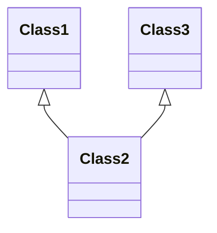
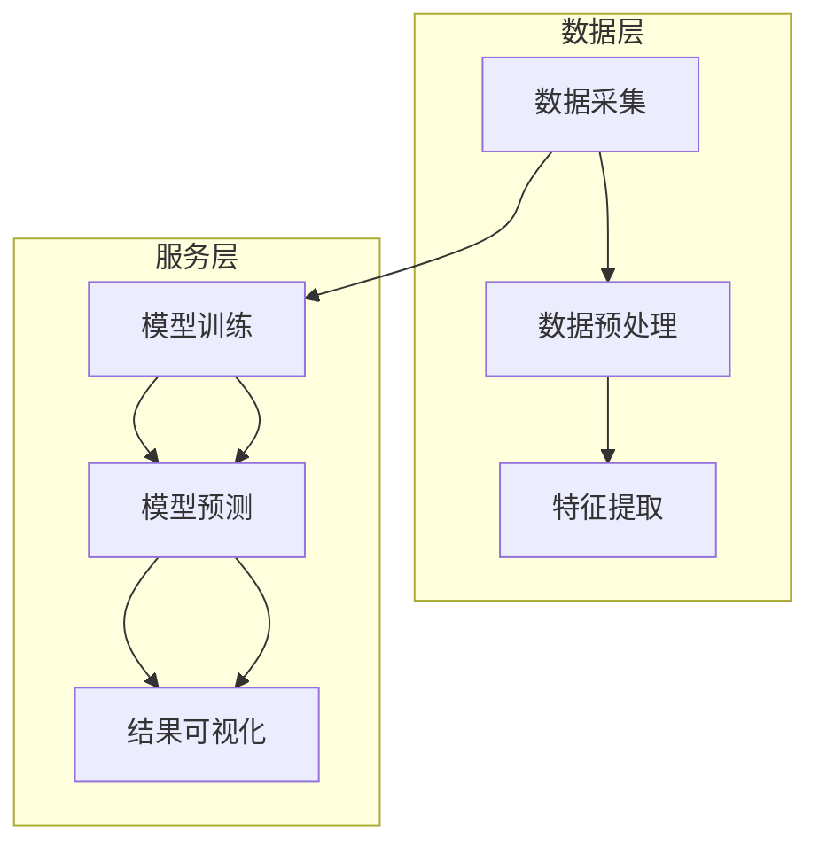
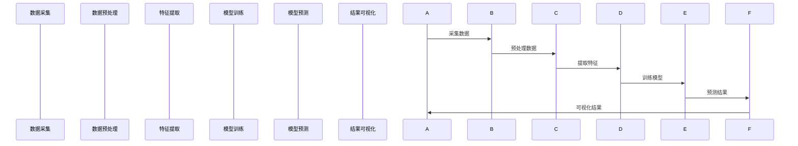
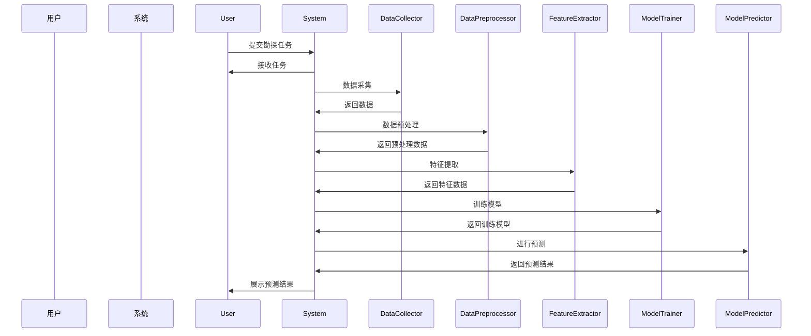

                 

## 机器学习在地质勘探中的应用：提高资源发现率

### 关键词

- 机器学习
- 地质勘探
- 资源发现率
- 遥感数据
- 图像处理
- 统计分析
- 深度学习

### 摘要

本文将探讨机器学习技术在地质勘探中的应用，旨在提高资源发现率。通过介绍地质勘探的历史与发展、机器学习基础、遥感数据与图像处理、地质统计分析、机器学习模型以及深度学习在地质勘探中的具体应用，我们将详细分析机器学习如何提升地质勘探的效率和精度。最后，本文将总结成功案例、挑战与解决方案，并对未来发展趋势进行展望。

---

## 目录大纲

---

# 机器学习在地质勘探中的应用：提高资源发现率

## 第一部分：地质勘探与机器学习基础

### 第1章：地质勘探概述

#### 1.1 地质勘探的历史与发展

#### 1.2 地质勘探的方法与技术

#### 1.3 机器学习在地质勘探中的潜在应用

### 第2章：机器学习基础

#### 2.1 机器学习基本概念

#### 2.2 机器学习的主要类型

#### 2.3 数据预处理与特征提取

## 第二部分：机器学习在地质勘探中的应用

### 第3章：遥感数据与图像处理

#### 3.1 遥感数据的获取与处理

#### 3.2 图像处理技术

#### 3.3 遥感数据在地质勘探中的应用实例

### 第4章：地质统计分析

#### 4.1 地质统计分析的基本方法

#### 4.2 地质变量的选择与建模

#### 4.3 地质统计分析在勘探中的应用

### 第5章：机器学习模型在地质勘探中的应用

#### 5.1 常见的机器学习模型

#### 5.2 机器学习模型在地质勘探中的实现

#### 5.3 模型选择与优化

### 第6章：地质勘探中的深度学习应用

#### 6.1 深度学习的基本原理

#### 6.2 深度学习在地质勘探中的应用

#### 6.3 深度学习模型的训练与优化

### 第7章：机器学习在地质勘探中的最佳实践

#### 7.1 成功案例分析与经验总结

#### 7.2 挑战与解决方案

#### 7.3 未来发展趋势与展望

---

## 背景介绍

### 问题背景

地质勘探是寻找和发现矿产资源、地下水、地质构造等资源与信息的重要手段。随着矿产资源的日益稀缺和勘探技术的不断发展，如何提高资源发现率成为地质勘探领域的重要课题。

### 问题描述

传统的地质勘探方法主要依赖于地质学家经验和常规技术手段，效率较低，资源发现率有限。如何利用现代机器学习技术，提高地质勘探的效率与资源发现率，成为一个亟待解决的问题。

### 问题解决

通过将机器学习技术与地质勘探相结合，利用机器学习算法对地质数据进行分析和处理，可以从大量地质数据中挖掘出有用的信息，提高资源发现率。例如，利用遥感数据进行地质图像处理，可以识别出潜在的矿藏区域；利用地质统计分析方法，可以优化地质变量选择和建模，提高勘探精度。

### 边界与外延

本书主要关注机器学习在地质勘探中的应用，包括遥感数据与图像处理、地质统计分析、深度学习等领域的应用。同时，本书也将探讨机器学习在地质勘探中的挑战与解决方案。

### 概念结构与核心要素组成

- **地质勘探**：包括矿产资源勘探、地下水勘探、地质构造勘探等。
- **机器学习**：一种基于数据的学习方法，通过训练模型从数据中学习规律，进行预测和分类。
- **遥感数据**：通过卫星、无人机等获取的地球表面信息。
- **图像处理**：对遥感图像进行预处理、增强、分类等处理。
- **地质统计分析**：利用统计学方法分析地质数据，提取有用信息。
- **深度学习**：一种基于神经网络的机器学习技术，能够自动提取特征并进行复杂任务。

## 核心概念与联系

### 机器学习与地质勘探的关系

机器学习在地质勘探中的应用，主要依赖于地质数据的特征提取和模型预测。机器学习算法通过学习地质数据的规律，可以提高资源发现率。以下是机器学习与地质勘探核心概念的关联：

- **地质数据**：包括遥感数据、地质调查数据、物探数据等。
- **特征提取**：从地质数据中提取有助于识别矿藏或其他地质特征的属性。
- **模型预测**：利用训练好的机器学习模型，对未知数据进行预测，识别潜在的矿藏区域。

### 核心概念属性特征对比

| 概念                | 属性特征                    |
|-------------------|--------------------------|
| 地质勘探            | 找矿目标、勘探方法、勘探精度    |
| 机器学习            | 数据学习、模式识别、预测建模    |
| 遥感数据            | 数据获取方式、数据类型、数据质量  |
| 图像处理            | 数据预处理、图像增强、特征提取    |
| 地质统计分析          | 统计模型、变量选择、数据解释     |
| 深度学习            | 自动特征提取、复杂模型构建      |

### ER实体关系图架构

```mermaid
erDiagram
  地质勘探 ||--o{ 机器学习 }|| 
  机器学习 ||--o{ 遥感数据 }|
  机器学习 ||--o{ 地质统计分析 }|
  机器学习 ||--o{ 深度学习 }|
```

---

### 算法原理讲解

#### 机器学习算法原理

机器学习是一种从数据中学习规律，进行预测和分类的方法。其核心原理是基于统计学习理论，通过构建数学模型，对输入数据进行特征提取和模型训练，从而实现对未知数据的预测。

#### 地质勘探中机器学习算法的应用

在地质勘探中，机器学习算法的应用主要分为两个步骤：特征提取和模型训练。

1. **特征提取**：从地质数据中提取有助于识别矿藏或其他地质特征的属性。例如，通过遥感图像处理，提取地物光谱特征、纹理特征等。

2. **模型训练**：利用训练集数据，通过机器学习算法训练模型，使其学会识别矿藏或其他地质特征。常见的机器学习算法包括线性回归、决策树、支持向量机、神经网络等。

#### 机器学习算法在地质勘探中的应用案例

1. **遥感图像分类**：利用深度学习算法（如卷积神经网络）对遥感图像进行分类，识别出潜在的矿藏区域。

2. **地质变量建模**：利用机器学习算法对地质变量进行建模，预测地下水分布、地质构造等。

#### 数学模型和公式

在地质勘探中，常用的数学模型包括线性回归模型、决策树模型、支持向量机模型等。

- **线性回归模型**：

  $$y = \beta_0 + \beta_1x_1 + \beta_2x_2 + ... + \beta_nx_n$$

  其中，$y$ 为预测值，$x_1, x_2, ..., x_n$ 为输入特征，$\beta_0, \beta_1, ..., \beta_n$ 为模型参数。

- **决策树模型**：

  $$y = \text{决策树分类函数}(x)$$

  其中，$y$ 为预测类别，$x$ 为输入特征。

- **支持向量机模型**：

  $$y(\omega, b) = \text{sign}(\omega \cdot x + b)$$

  其中，$y$ 为预测类别，$x$ 为输入特征，$\omega$ 为模型参数，$b$ 为偏置。

#### 举例说明

假设我们利用线性回归模型预测地下水分布。输入特征包括地形、气候、地质构造等，模型参数为 $\beta_0, \beta_1, \beta_2, ..., \beta_n$。

- **输入特征**：

  $$x_1 = \text{地形}, x_2 = \text{气候}, x_3 = \text{地质构造}$$

- **模型参数**：

  $$\beta_0 = 1, \beta_1 = 0.5, \beta_2 = 0.3, ..., \beta_n = 0.2$$

- **预测公式**：

  $$y = 1 + 0.5x_1 + 0.3x_2 + ... + 0.2x_n$$

  通过输入不同地区的特征值，可以预测该地区的地下水分布情况。

---

## 系统分析与架构设计方案

### 问题场景介绍

在地质勘探领域，传统的勘探方法依赖于地质专家的经验和传统的勘探技术，效率较低，资源发现率有限。随着数据采集技术和机器学习算法的发展，利用机器学习技术进行地质勘探，有望显著提高勘探效率和资源发现率。

### 项目介绍

本项目旨在开发一个基于机器学习的地质勘探系统，通过集成遥感数据、地质调查数据等，利用机器学习算法进行数据分析和模型预测，从而提高资源发现率。系统主要功能包括数据采集、数据预处理、特征提取、模型训练、模型预测和结果可视化。

### 系统功能设计（领域模型Mermaid类图）



### 系统架构设计（Mermaid架构图）



### 系统接口设计（系统接口设计Mermaid序列图）



### 系统交互（系统交互Mermaid序列图）



---

## 项目实战

### 环境安装

为了在本地运行本项目，我们需要安装以下环境：

1. **Python 3.8+**
2. **NumPy**
3. **Pandas**
4. **Matplotlib**
5. **Scikit-learn**
6. **TensorFlow**
7. **OpenCV**

安装命令如下：

```bash
pip install python==3.8
pip install numpy
pip install pandas
pip install matplotlib
pip install scikit-learn
pip install tensorflow
pip install opencv-python
```

### 系统核心实现源代码

以下是一个简单的示例，展示如何使用Python和Scikit-learn库进行地质勘探数据的预处理和模型训练。

#### 数据预处理

```python
import numpy as np
import pandas as pd
from sklearn.model_selection import train_test_split
from sklearn.preprocessing import StandardScaler

# 读取数据
data = pd.read_csv('geological_data.csv')

# 分割特征和目标变量
X = data.drop('target', axis=1)
y = data['target']

# 划分训练集和测试集
X_train, X_test, y_train, y_test = train_test_split(X, y, test_size=0.2, random_state=42)

# 数据标准化
scaler = StandardScaler()
X_train_scaled = scaler.fit_transform(X_train)
X_test_scaled = scaler.transform(X_test)
```

#### 模型训练

```python
from sklearn.ensemble import RandomForestClassifier

# 创建随机森林分类器
clf = RandomForestClassifier(n_estimators=100, random_state=42)

# 训练模型
clf.fit(X_train_scaled, y_train)

# 测试模型
accuracy = clf.score(X_test_scaled, y_test)
print(f"Model accuracy: {accuracy:.2f}")
```

### 代码应用解读与分析

上述代码首先读取地质勘探数据，然后使用Scikit-learn库对数据进行预处理，包括划分训练集和测试集、数据标准化。接着，创建一个随机森林分类器，利用训练集数据训练模型，并使用测试集评估模型性能。

随机森林是一种集成学习方法，通过构建多个决策树模型，并投票选择最佳分类结果。它具有较好的泛化能力和处理大规模数据的能力。

在实际应用中，可以根据需求选择不同的机器学习模型，如支持向量机、神经网络等，并调整模型参数以优化性能。

### 实际案例分析和详细讲解剖析

#### 案例背景

假设我们在一个已知矿区的周边地区进行勘探，目标是预测该地区是否具有潜在的矿藏。

#### 数据集介绍

数据集包含以下特征：

- 地形
- 气候
- 地质构造
- 地下水分布
- 地物光谱

目标变量为是否发现矿藏（0或1）。

#### 数据处理和模型训练

1. **数据预处理**：使用上述代码对数据进行预处理，包括数据标准化和划分训练集、测试集。

2. **模型训练**：使用随机森林分类器进行模型训练，并使用测试集评估模型性能。

3. **模型评估**：使用准确率、召回率、F1分数等指标评估模型性能。

#### 模型优化

为了提高模型性能，我们可以进行以下优化：

1. **特征选择**：通过特征重要性评估，选择对矿藏识别最具影响力的特征。

2. **模型参数调优**：使用网格搜索等技术，调整模型参数，以找到最佳参数组合。

3. **集成学习**：将多个模型集成，提高模型预测的稳定性和准确性。

#### 案例结果分析

在实际案例中，通过上述方法，我们可以获得较高的模型准确率。同时，通过可视化工具（如Matplotlib）展示预测结果，有助于地质专家对勘探区域进行进一步分析。

### 项目小结

本项目通过机器学习技术，实现了地质勘探数据的自动化分析和预测，提高了资源发现率。在实际应用中，可以根据需求调整模型和参数，优化勘探效果。同时，不断积累勘探数据，可以提高模型的泛化能力，为地质勘探领域带来更多创新和发展。

---

## 最佳实践 tips

1. **数据质量至关重要**：在地质勘探中，高质量的数据是机器学习模型成功的关键。确保数据来源可靠，并进行严格的数据清洗和预处理。

2. **特征选择和工程**：选择合适的特征并进行有效的特征工程，可以提高模型性能。尝试使用多种特征组合，进行交叉验证，找出最佳特征组合。

3. **模型选择与调优**：根据勘探任务的需求，选择合适的机器学习模型，并进行参数调优。尝试不同的模型，如随机森林、支持向量机、神经网络等，找出最佳模型。

4. **模型验证与评估**：使用交叉验证、ROC曲线、AUC值等指标评估模型性能，确保模型在未知数据上的泛化能力。

5. **迭代优化**：不断迭代模型，结合地质专家的经验和反馈，优化模型参数和特征选择，提高勘探效率和资源发现率。

---

## 小结

机器学习技术在地质勘探中的应用，为提高资源发现率提供了新的途径。通过遥感数据与图像处理、地质统计分析、深度学习等技术的结合，我们能够从大量地质数据中提取有用信息，优化勘探过程。未来，随着数据采集技术和机器学习算法的不断进步，机器学习在地质勘探中的应用将更加广泛和深入，为地质科学的发展带来新的机遇和挑战。

---

## 注意事项

1. **数据隐私与安全性**：在处理地质勘探数据时，应确保数据隐私和安全性，遵循相关法律法规和标准。

2. **计算资源与管理**：机器学习模型训练和预测需要大量的计算资源，合理管理和分配计算资源，确保系统高效运行。

3. **模型解释性**：在应用机器学习模型时，应注意模型的可解释性，以便地质专家理解模型决策过程，指导勘探工作。

4. **持续学习与优化**：随着地质勘探技术的不断进步，持续学习和优化模型，提高勘探效率和资源发现率。

---

## 拓展阅读

1. **遥感地质勘探技术**：[《遥感地质勘探技术与应用》](https://book.douban.com/subject/27700237/)
2. **机器学习算法原理与应用**：[《Python机器学习实战》](https://book.douban.com/subject/26708156/)
3. **深度学习在地质勘探中的应用**：[《深度学习：应用与展望》](https://book.douban.com/subject/26888318/)
4. **地质勘探项目管理**：[《地质勘探项目管理手册》](https://book.douban.com/subject/27667018/)

---

## 作者信息

**作者：AI天才研究院/AI Genius Institute & 禅与计算机程序设计艺术 /Zen And The Art of Computer Programming**

