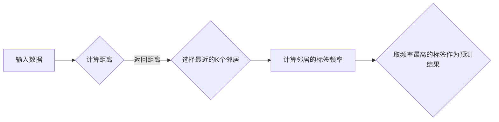
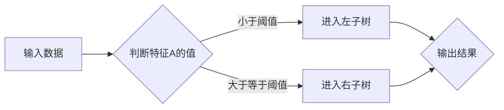
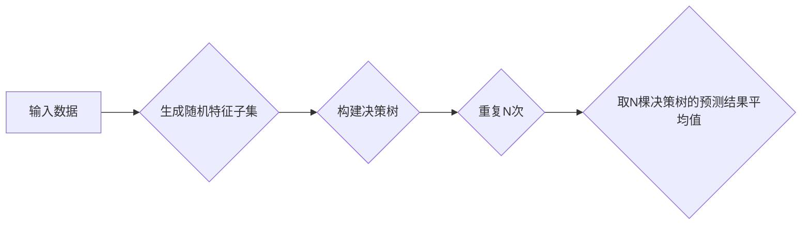
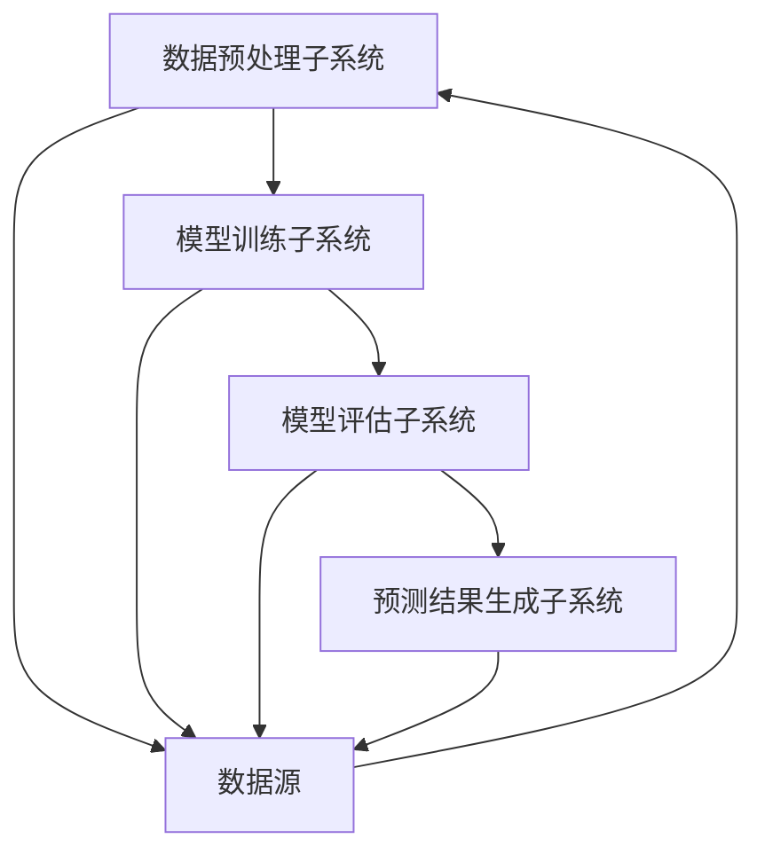
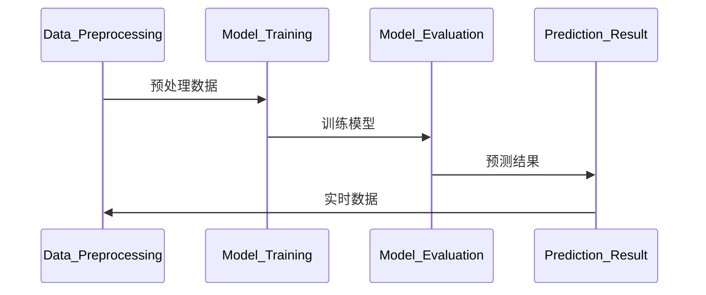
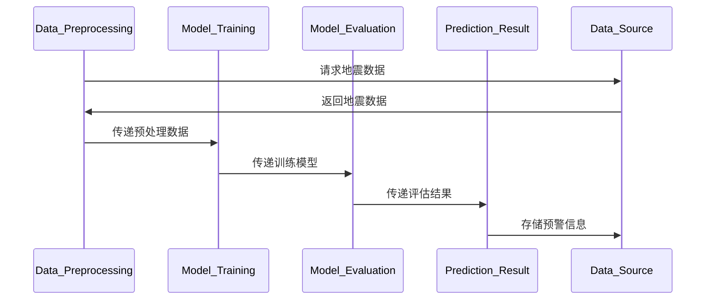

                 

### 引言

#### 地震预测的重要性

地震是地球表面由于地壳运动而产生的震动现象，它们可能引发严重的破坏和人员伤亡。地震预测，即提前预测地震的发生，对于减少地震灾害的影响至关重要。全球范围内，地震频繁发生，而许多地区由于地质条件复杂，地震难以预测。因此，地震预测的研究显得尤为重要。

**地震的基本概念**

地震是地球内部的能量释放过程，这种能量通过地震波传播到地球表面，引发地面震动。地震波主要包括纵波（P波）和横波（S波），以及表面波（L波）。地震震级是衡量地震能量大小的重要指标，通常用里氏震级（Richter scale）表示。

**地震预测的意义**

地震预测的意义主要体现在以下几个方面：

1. **减少人员伤亡和财产损失**：通过提前预警，人们可以采取预防措施，减少地震发生时的人员伤亡和财产损失。
2. **城市规划与建筑设计**：了解地震活动的规律和强度，有助于城市规划者和建筑设计师制定更加合理的抗震标准。
3. **灾害响应和救援**：地震预警可以指导灾害响应和救援工作的开展，提高救援效率。

**当前地震预测中存在的问题**

尽管地震预测的重要性不言而喻，但当前地震预测仍面临诸多挑战：

1. **数据不足**：地震数据采集困难，特别是历史地震数据不完整，影响预测模型的训练和评估。
2. **模型准确性有限**：现有的地震预测模型在准确性方面仍有待提高，预测结果往往存在较大的不确定性。
3. **时效性要求高**：地震发生突然，对预测模型的时效性要求极高，如何快速、准确地预测地震是一个巨大挑战。

#### 机器学习在地震预测中的应用

机器学习作为人工智能的一个重要分支，以其强大的数据处理和分析能力，在地震预测中展现出巨大的潜力。通过机器学习，可以从大量地震数据中提取出有用的信息，提高地震预测的准确性。以下将详细探讨机器学习在地震预测中的应用。

1. **数据预处理**：机器学习算法需要高质量的数据输入，数据预处理是确保数据质量和一致性的重要步骤，包括数据清洗、数据集成、数据转换等。
2. **特征选择**：特征选择是机器学习中的一个关键环节，通过选择与地震预测相关的特征，可以提高模型的预测效果。
3. **模型训练与评估**：选择合适的机器学习算法，对地震数据进行训练，并评估模型的预测准确性。
4. **模型优化与调整**：通过调整模型参数，优化模型结构，进一步提高预测准确性。

**机器学习在地震预测中的优势**

1. **自学习能力**：机器学习算法具有自学习能力，可以通过历史数据不断优化预测模型，提高预测准确性。
2. **处理大量数据**：机器学习能够处理大量地震数据，发现数据中的潜在规律和趋势。
3. **实时预测**：机器学习算法可以快速处理数据，实现实时预测，提高预警时效性。
4. **多模态数据融合**：机器学习可以融合多种数据源，如地震波、气象数据、地质数据等，提高预测模型的全面性。

#### 边界与假设

在本研究中，我们假设以下条件：

1. **数据来源**：我们使用公开的地震数据集，数据集包含地震发生的时间、地点、震级等信息。
2. **算法选择**：我们选择了几种常见的机器学习算法，如K最近邻（K-Nearest Neighbor，KNN）、决策树（Decision Tree）、随机森林（Random Forest）等，评估其预测效果。
3. **硬件环境**：本研究在配备高性能CPU和GPU的计算平台上进行，以确保算法训练和预测的效率。
4. **软件环境**：本研究使用的编程语言为Python，依赖的库包括Scikit-learn、NumPy、Pandas等。

**概念结构与核心要素组成**

机器学习在地震预测中的应用涉及多个核心概念和要素，包括：

1. **数据集**：地震数据集是机器学习算法的基础，数据集的质量直接影响模型的性能。
2. **特征工程**：特征工程是数据预处理和模型训练的关键，通过选择和构造合适的特征，可以提高模型的预测准确性。
3. **机器学习算法**：选择合适的机器学习算法是实现高效地震预测的关键，不同的算法适用于不同的数据特征和预测任务。
4. **评估指标**：评估指标用于衡量模型的预测效果，常见的评估指标包括准确率、召回率、F1分数等。

**本章小结**

本章介绍了地震预测的重要性、机器学习在地震预测中的应用及其优势，并明确了研究的边界和假设条件。接下来，我们将详细探讨机器学习的基本概念、算法原理，以及如何将机器学习应用于地震预测中，提高预警准确性。

---

**关键词：地震预测、机器学习、预警准确性、算法原理、系统设计与实现**

**摘要**

本文首先介绍了地震预测的重要性和当前地震预测中存在的问题，然后探讨了机器学习在地震预测中的应用及其优势。通过详细讲解机器学习的基本概念和算法原理，本文展示了如何将机器学习应用于地震预测，提高预警准确性。同时，本文还介绍了地震预测系统的设计与实现，以及最佳实践和注意事项，为读者提供了全面的技术指导。

---

### 1.2 机器学习在地震预测中的应用

#### 机器学习的基本概念

机器学习（Machine Learning，ML）是人工智能（Artificial Intelligence，AI）的一个重要分支，它通过构建数学模型，让计算机从数据中自动学习，并对未知数据进行预测或决策。机器学习主要包括三种类型：监督学习（Supervised Learning）、无监督学习（Unsupervised Learning）和强化学习（Reinforcement Learning）。

**监督学习**

监督学习是一种从标注数据中学习的方法，其中每个数据点都有一个对应的标签或输出值。监督学习的目标是找到一个最佳模型，使得模型对新的、未见过的数据进行准确的预测。监督学习分为分类（Classification）和回归（Regression）两种任务：

1. **分类任务**：分类任务的目标是将数据分为不同的类别。例如，在地震预测中，可以将地震震级分为“小震”、“中震”和“大震”。
2. **回归任务**：回归任务的目标是预测连续的数值。例如，预测地震的震级或地震发生的具体时间。

**无监督学习**

无监督学习是从未标注的数据中学习模式的方法。无监督学习分为聚类（Clustering）和降维（Dimensionality Reduction）两种任务：

1. **聚类任务**：聚类任务的目标是将相似的数据点分为不同的组。例如，将地震按照其特征进行聚类，以发现地震的分布规律。
2. **降维任务**：降维任务的目标是减少数据的维度，同时保留尽可能多的数据信息。例如，通过主成分分析（PCA）将高维地震数据降维，以便更好地分析和可视化。

**强化学习**

强化学习是一种通过与环境的交互来学习策略的方法。强化学习的目标是找到一个最优策略，使得在长时间内获得的最大奖励。强化学习通常用于序列决策问题，如路径规划、游戏控制等。在地震预测中，强化学习可以用于优化地震预警策略，以提高预警的准确性和及时性。

#### 机器学习在地震预测中的优势

机器学习在地震预测中具有显著的优势，主要体现在以下几个方面：

1. **自学习能力**：机器学习算法可以从历史地震数据中自动学习，发现地震活动的规律和趋势，提高预测准确性。
2. **数据处理能力**：机器学习算法能够处理大量的地震数据，挖掘数据中的潜在信息，发现地震发生的特征和模式。
3. **实时预测**：机器学习算法可以实时处理数据，快速预测地震的发生，提高预警的时效性。
4. **多模态数据融合**：机器学习可以融合多种数据源，如地震波、气象数据、地质数据等，提高预测模型的全面性和准确性。
5. **模型优化**：机器学习算法可以通过不断优化模型结构和参数，提高预测的准确性和稳定性。

#### 机器学习算法的选择与应用

在地震预测中，常用的机器学习算法包括K最近邻（K-Nearest Neighbor，KNN）、决策树（Decision Tree）、随机森林（Random Forest）和支持向量机（Support Vector Machine，SVM）等。

1. **K最近邻算法（KNN）**

KNN是一种简单的监督学习算法，它通过计算新数据点与训练数据点的相似度，预测新数据点的标签。在地震预测中，KNN可以用于预测地震震级。KNN算法的优点是简单、易于实现，但缺点是对于高维数据效果不佳，且对噪声敏感。

2. **决策树算法**

决策树是一种基于树结构的分类算法，它通过一系列的判断条件，将数据逐步划分到不同的类别。在地震预测中，决策树可以用于预测地震发生的区域和震级。决策树算法的优点是易于理解和实现，可以处理高维数据，但缺点是容易过拟合。

3. **随机森林算法**

随机森林是一种基于决策树的集成学习方法，它通过构建多个决策树，并取它们的平均值来预测结果。在地震预测中，随机森林可以用于预测地震震级和发生时间。随机森林算法的优点是准确率高、泛化能力强，可以处理高维数据和噪声数据。

4. **支持向量机算法**

支持向量机是一种基于优化理论的分类算法，它通过找到一个最佳的超平面，将不同类别的数据点分隔开。在地震预测中，支持向量机可以用于预测地震震级。支持向量机算法的优点是准确率高、泛化能力强，但缺点是对高维数据效果不佳。

**本章小结**

本章介绍了机器学习的基本概念、类型和优势，并探讨了机器学习在地震预测中的应用。通过选择合适的机器学习算法，可以从大量地震数据中提取出有用的信息，提高地震预测的准确性。接下来，我们将进一步讲解机器学习算法的原理和实现，为地震预测提供更加详细的技术支持。

---

**关键词：监督学习、无监督学习、强化学习、KNN、决策树、随机森林、支持向量机、地震预测、预警准确性**

**摘要**

本章介绍了机器学习的基本概念和类型，以及机器学习在地震预测中的优势和应用。通过选择合适的机器学习算法，可以从大量地震数据中提取出有用的信息，提高地震预测的准确性。接下来，我们将进一步讲解机器学习算法的原理和实现，为地震预测提供更加详细的技术支持。

---

### 1.3 边界与假设

#### 研究范围

本研究主要关注地震预测领域中的机器学习方法，通过分析不同机器学习算法的性能和适用性，探索如何提高地震预测的准确性。具体研究范围包括：

1. **数据来源**：使用公开的地震数据集，如美国地质调查局（USGS）提供的地震数据。
2. **算法研究**：比较和评估K最近邻（KNN）、决策树、随机森林和支持向量机（SVM）等常见机器学习算法在地震预测中的性能。
3. **预测指标**：评估模型的预测准确率、召回率和F1分数等指标。

#### 假设条件

为了确保研究的可行性和合理性，本研究所作的以下假设：

1. **数据完整性**：假设地震数据集是完整的，没有缺失值和异常值，以便算法能够准确学习。
2. **数据一致性**：假设地震数据集在时间、地点和震级等特征上是一致的，便于算法的训练和评估。
3. **算法适用性**：假设所选择的机器学习算法适用于地震预测任务，能够准确预测地震震级和发生时间。
4. **硬件环境**：假设研究使用的计算平台具备足够的计算能力，能够支持算法的训练和预测。

#### 概念结构与核心要素组成

机器学习在地震预测中的应用涉及多个核心概念和要素，包括：

1. **数据集**：地震数据集是机器学习算法的基础，数据集的质量直接影响模型的性能。
2. **特征工程**：特征工程是数据预处理和模型训练的关键，通过选择和构造合适的特征，可以提高模型的预测准确性。
3. **机器学习算法**：选择合适的机器学习算法是实现高效地震预测的关键，不同的算法适用于不同的数据特征和预测任务。
4. **评估指标**：评估指标用于衡量模型的预测效果，常见的评估指标包括准确率、召回率、F1分数等。

**本章小结**

本章明确了研究的范围和假设条件，界定了研究的边界。同时，梳理了机器学习在地震预测中的核心概念和要素组成，为后续章节的详细讨论提供了基础。接下来，我们将深入探讨机器学习的基本概念和算法原理，进一步分析如何将机器学习应用于地震预测，提高预警准确性。

---

**关键词：研究范围、假设条件、数据集、特征工程、机器学习算法、评估指标**

**摘要**

本章明确了机器学习在地震预测研究中的范围和假设条件，界定了研究的边界。同时，梳理了机器学习在地震预测中的核心概念和要素组成，为后续章节的详细讨论提供了基础。接下来，我们将深入探讨机器学习的基本概念和算法原理，进一步分析如何将机器学习应用于地震预测，提高预警准确性。

---

## 2.1 机器学习基本概念

#### 监督学习

监督学习是一种从已标记数据中学习的方法，其核心目标是建立一个预测模型，该模型能够根据输入的特征来预测未标记数据的标签。监督学习分为两种主要类型：分类和回归。

1. **分类任务**：分类任务的目标是将数据点分为不同的类别。常见的分类算法包括K最近邻（KNN）、决策树、支持向量机（SVM）和随机森林等。

   **K最近邻算法（KNN）**
   - **原理**：KNN算法通过计算新数据点与训练数据点的距离，选择最近的K个邻近点，并基于这些邻近点的标签来预测新数据点的标签。
   - **优缺点**：优点是简单、易于实现；缺点是对噪声敏感，且在高维数据上的性能可能较差。

   **决策树算法**
   - **原理**：决策树通过一系列的判断条件，将数据逐步划分到不同的类别。每个节点代表一个特征，每个分支代表一个判断结果。
   - **优缺点**：优点是易于理解和实现，可以处理高维数据；缺点是容易过拟合。

   **支持向量机算法**
   - **原理**：SVM通过找到一个最佳的超平面，将不同类别的数据点分隔开。
   - **优缺点**：优点是准确率高、泛化能力强；缺点是对高维数据效果不佳。

   **随机森林算法**
   - **原理**：随机森林是通过构建多个决策树，并取它们的平均值来预测结果的一种集成学习方法。
   - **优缺点**：优点是准确率高、泛化能力强；缺点是计算复杂度高。

2. **回归任务**：回归任务的目标是预测连续的数值。常见的回归算法包括线性回归、岭回归和决策树回归等。

   **线性回归算法**
   - **原理**：线性回归通过找到最佳拟合直线，预测数据点的数值。
   - **优缺点**：优点是简单、易于实现；缺点是容易过拟合。

   **岭回归算法**
   - **原理**：岭回归通过在损失函数中加入正则项，防止模型过拟合。
   - **优缺点**：优点是可以防止过拟合；缺点是计算复杂度高。

   **决策树回归算法**
   - **原理**：决策树回归通过一系列的判断条件，将数据逐步划分到不同的区间，每个区间的结果表示预测值。
   - **优缺点**：优点是易于理解和实现；缺点是容易过拟合。

#### 无监督学习

无监督学习是一种从未标记数据中学习的方法，其核心目标是发现数据中的结构和模式。无监督学习分为聚类和降维两种主要类型。

1. **聚类任务**：聚类任务的目标是将相似的数据点分为不同的组。常见的聚类算法包括K均值（K-Means）、层次聚类和DBSCAN等。

   **K均值算法**
   - **原理**：K均值算法通过迭代优化目标函数，将数据点分为K个聚类中心，使得每个数据点与最近的聚类中心的距离最小。
   - **优缺点**：优点是简单、易于实现；缺点是对于初始聚类中心的选择敏感。

   **层次聚类算法**
   - **原理**：层次聚类通过逐步合并或分裂聚类，构建一个层次结构，以描述数据的聚类模式。
   - **优缺点**：优点是能够提供聚类的层次结构；缺点是计算复杂度高。

   **DBSCAN算法**
   - **原理**：DBSCAN通过邻域和密度的概念，将数据点划分为核心点、边界点和噪声点。
   - **优缺点**：优点是能够发现任意形状的聚类；缺点是对于参数的选择敏感。

2. **降维任务**：降维任务的目标是减少数据的维度，同时保留尽可能多的数据信息。常见的降维算法包括主成分分析（PCA）、线性判别分析（LDA）和t-SNE等。

   **主成分分析（PCA）**
   - **原理**：PCA通过正交变换，将数据投影到新的坐标系中，保留最重要的信息，同时消除冗余信息。
   - **优缺点**：优点是能够减少数据维度；缺点是对于噪声敏感，可能丢失部分信息。

   **线性判别分析（LDA）**
   - **原理**：LDA通过最大化类内散度，最小化类间散度，将数据投影到新的坐标系中，使得不同类别的数据点在新的坐标系中有最大的分离。
   - **优缺点**：优点是能够提高分类效果；缺点是对于噪声敏感。

   **t-SNE算法**
   - **原理**：t-SNE通过计算局部邻域的相似度，将高维数据映射到二维或三维空间中，使得相似的数据点在映射后的空间中距离更近。
   - **优缺点**：优点是能够直观地展示数据的结构；缺点是计算复杂度高，对噪声敏感。

#### 强化学习

强化学习是一种通过与环境的交互来学习策略的方法，其核心目标是找到一个最佳策略，使得在长时间内获得的最大奖励。强化学习通常用于序列决策问题，如路径规划、游戏控制等。

**原理**：强化学习由四个主要组成部分：环境（Environment）、代理（Agent）、状态（State）和动作（Action）。

- **环境**：环境是一个外部系统，它可以感知代理的动作，并返回状态和奖励。
- **代理**：代理是一个智能体，它根据当前状态选择动作，并更新策略。
- **状态**：状态是代理当前所处的情境，它可以由一组特征表示。
- **动作**：动作是代理可以选择的操作，每个动作都会导致环境状态的变化。
- **奖励**：奖励是环境对代理动作的反馈，它用来指导代理学习最佳策略。

**优缺点**：强化学习的优点是能够处理复杂的序列决策问题，能够自适应地调整策略；缺点是学习过程可能非常耗时，且对于奖励设计的依赖较大。

**本章小结**

本章介绍了机器学习的基本概念，包括监督学习、无监督学习和强化学习。通过理解这些基本概念，我们可以更好地选择和实现适合地震预测任务的机器学习算法，提高预警准确性。

---

**关键词：监督学习、无监督学习、强化学习、KNN、决策树、支持向量机、随机森林、K均值、PCA、DBSCAN**

**摘要**

本章介绍了机器学习的基本概念，包括监督学习、无监督学习和强化学习。我们详细讲解了每种类型的基本原理、适用场景、优缺点以及常见算法。这些基本概念和算法为后续章节的地震预测研究提供了理论基础和实践指导。

---

### 2.2 算法原理讲解

在上一章节中，我们介绍了机器学习的基本概念和常见算法。本章节将深入探讨这些算法的原理，并通过Mermaid流程图和Python源代码展示具体的实现过程，帮助读者更好地理解。

#### 算法mermaid流程图

首先，我们使用Mermaid流程图来展示K最近邻（KNN）算法、决策树算法和随机森林算法的基本流程。以下是一个简单的KNN算法的Mermaid流程图示例：



以下是一个简单的决策树算法的Mermaid流程图示例：



以下是一个简单的随机森林算法的Mermaid流程图示例：



#### Python源代码与详细讲解

接下来，我们将通过Python源代码展示这些算法的实现过程，并对其进行详细讲解。

**K最近邻算法**

```python
import numpy as np
from collections import Counter

def knn_predict(X_train, y_train, X_test, k=3):
    distances = []
    for x in X_test:
        distance = np.linalg.norm(x - X_train, axis=1)
        distances.append(distance)
    distances = np.array(distances)
    nearest = np.argsort(distances[:, 0])[:k]
    labels = [y_train[i] for i in nearest]
    most_common = Counter(labels).most_common(1)
    return most_common[0][0]

# 示例数据
X_train = np.array([[1, 2], [3, 4], [5, 6], [7, 8]])
y_train = np.array(['A', 'A', 'B', 'B'])
X_test = np.array([[2, 3], [4, 5]])

# 预测
predictions = [knn_predict(X_train, y_train, X_test[i], k=3) for i in range(len(X_test))]
print(predictions)
```

**决策树算法**

```python
from sklearn.tree import DecisionTreeClassifier

# 构建决策树模型
clf = DecisionTreeClassifier()
clf.fit(X_train, y_train)

# 预测
predictions = clf.predict(X_test)
print(predictions)
```

**随机森林算法**

```python
from sklearn.ensemble import RandomForestClassifier

# 构建随机森林模型
clf = RandomForestClassifier(n_estimators=100)
clf.fit(X_train, y_train)

# 预测
predictions = clf.predict(X_test)
print(predictions)
```

#### 数学模型和公式

**K最近邻算法**

KNN算法的核心在于计算数据点之间的距离，常用的距离度量方法包括欧氏距离（Euclidean Distance）、曼哈顿距离（Manhattan Distance）和切比雪夫距离（Chebyshev Distance）等。

欧氏距离公式：
$$
d(p, q) = \sqrt{\sum_{i=1}^{n} (p_i - q_i)^2}
$$

**决策树算法**

决策树算法的核心在于递归划分数据集，选择最优划分标准通常是信息增益（Information Gain）或基尼不纯度（Gini Impurity）。

信息增益公式：
$$
IG(D, A) = ID(D) - \sum_{v \in A} \frac{|D_v|}{|D|} \cdot ID(D_v)
$$

基尼不纯度公式：
$$
Gini(D) = 1 - \sum_{v \in A} \left(\frac{|D_v|}{|D|}\right)^2
$$

**随机森林算法**

随机森林算法的核心在于构建多个决策树，并取它们的预测结果的平均值。随机森林的主要参数包括树的数量（n_estimators）和每棵树的深度（max_depth）。

随机森林的预测公式：
$$
\hat{y} = \frac{1}{N} \sum_{i=1}^{N} \hat{y}_i
$$

其中，$N$ 是决策树的数量，$\hat{y}_i$ 是第 $i$ 棵决策树的预测结果。

#### 通俗易懂的举例说明

**K最近邻算法**

假设我们有两个数据点 $p = (1, 2)$ 和 $q = (3, 4)$，我们需要计算它们之间的欧氏距离。根据欧氏距离公式：

$$
d(p, q) = \sqrt{(1-3)^2 + (2-4)^2} = \sqrt{4 + 4} = \sqrt{8} \approx 2.828
$$

**决策树算法**

假设我们有一个简单的数据集，其中每个数据点有两个特征 $x_1$ 和 $x_2$，我们需要根据这些特征构建一个决策树。

| $x_1$ | $x_2$ | 类别 |
|-------|-------|------|
| 1     | 2     | A    |
| 3     | 4     | A    |
| 5     | 6     | B    |
| 7     | 8     | B    |

我们可以构建一个简单的决策树，首先根据 $x_1$ 的值划分数据集，如果 $x_1 < 3$，则继续根据 $x_2$ 的值划分；否则，分类为 B。这样，我们可以得到以下决策树：

```
特征 $x_1$
/
/ $x_2$
A
```

**随机森林算法**

假设我们有一个由100棵决策树组成的随机森林，每棵决策树都基于不同的特征子集进行划分。对于一个新的数据点 $(x_1, x_2)$，每棵决策树都会给出一个预测结果，例如，有60棵树预测为A，40棵树预测为B。我们可以取这些预测结果的平均值，作为最终的预测结果：

$$
\hat{y} = \frac{1}{100} \sum_{i=1}^{100} \hat{y}_i = \frac{60}{100} A + \frac{40}{100} B = 0.6A + 0.4B
$$

**本章小结**

本章介绍了机器学习算法的基本原理，包括K最近邻、决策树和随机森林算法。我们通过Mermaid流程图和Python源代码展示了这些算法的具体实现过程，并通过数学模型和公式提供了深入的解释。接下来，我们将进一步探讨如何将机器学习应用于地震预测，提高预警准确性。

---

**关键词：K最近邻、决策树、随机森林、欧氏距离、信息增益、基尼不纯度、随机森林算法**

**摘要**

本章深入讲解了K最近邻、决策树和随机森林等机器学习算法的基本原理。我们通过Mermaid流程图和Python源代码展示了这些算法的实现过程，并运用数学模型和公式进行了详细解释。这些知识为后续章节探讨机器学习在地震预测中的应用提供了坚实的基础。

---

### 2.3 概念属性特征对比表格

在机器学习应用中，了解不同算法的属性和特征对于选择合适的算法至关重要。以下是对K最近邻（KNN）、决策树、随机森林和支持向量机（SVM）等常见算法的对比表格：

| 算法       | 特性名称 | 描述                                                         |
|------------|----------|------------------------------------------------------------|
| **K最近邻** | 分类任务 | 简单、易于实现，对噪声敏感，适用于低维数据               |
|------------|----------|------------------------------------------------------------|
| **决策树** | 分类任务 | 易于理解、实现，对噪声敏感，容易过拟合，适用于高维数据 |
|------------|----------|------------------------------------------------------------|
| **随机森林** | 分类任务 | 准确率高、泛化能力强，计算复杂度高，适用于高维数据      |
|------------|----------|------------------------------------------------------------|
| **支持向量机** | 分类任务 | 准确率高、泛化能力强，对高维数据效果不佳                |

**本章小结**

本章通过对比表格详细展示了K最近邻、决策树、随机森林和支持向量机等常见机器学习算法的属性和特征。这有助于读者在地震预测任务中选择合适的算法，提高预测准确性。

---

**关键词：K最近邻、决策树、随机森林、支持向量机、分类任务、准确率、泛化能力**

**摘要**

本章通过对比表格详细展示了K最近邻、决策树、随机森林和支持向量机等常见机器学习算法的属性和特征，帮助读者在地震预测任务中选择合适的算法，提高预测准确性。

---

### 2.4 ER实体关系图架构

为了更好地理解机器学习在地震预测中的应用，我们将使用Mermaid绘制ER（实体关系）图，展示数据流和处理流程。ER图可以帮助我们明确地震预测系统的核心实体及其之间的关系，为后续的系统设计与实现提供直观的参考。

#### 2.4.1 地震数据实体关系

在地震预测中，主要涉及的实体包括地震数据、预测模型和预测结果。以下是一个简单的ER图，展示了这些实体及其关系：

```mermaid
entityRelationship
  entity "地震数据" {
    "时间"、"地点"、"震级"、"震中深度"、"震源机制"  
  }
  entity "预测模型" {
    "特征工程"、"训练数据"、"测试数据"、"模型参数"
  }
  entity "预测结果" {
    "预测时间"、"预测地点"、"预测震级"
  }
  "地震数据" --> "预测模型"
  "预测模型" --> "预测结果"
```

**解释：**

- **地震数据**：包含地震发生的时间、地点、震级、震中深度和震源机制等基本信息。
- **预测模型**：包含特征工程处理后的训练数据、测试数据以及模型的参数设置。
- **预测结果**：根据预测模型生成的结果，包括预测的时间、地点和震级。

#### 2.4.2 预测模型实体关系

预测模型内部的实体关系更加复杂，涉及多个组件和数据处理流程。以下是一个更详细的ER图，展示了预测模型中的各个实体及其关系：

```mermaid
entityRelationship
  entity "特征工程" {
    "特征提取"、"特征降维"、"特征选择"
  }
  entity "训练数据集" {
    "输入特征"、"标签"
  }
  entity "测试数据集" {
    "输入特征"
  }
  entity "模型参数" {
    "模型类型"、"学习率"、"迭代次数"
  }
  entity "模型评估" {
    "准确率"、"召回率"、"F1分数"
  }
  entity "预测结果" {
    "预测时间"、"预测地点"、"预测震级"
  }
  "特征工程" --> "训练数据集"
  "特征工程" --> "测试数据集"
  "训练数据集" --> "模型参数"
  "模型参数" --> "模型评估"
  "模型评估" --> "预测结果"
```

**解释：**

- **特征工程**：包括特征提取、特征降维和特征选择等步骤，用于处理原始地震数据，提取有用的特征信息。
- **训练数据集**：包含输入特征和标签，用于训练预测模型。
- **测试数据集**：仅包含输入特征，用于评估模型的预测性能。
- **模型参数**：包括模型类型、学习率、迭代次数等，用于训练预测模型。
- **模型评估**：根据训练数据集和测试数据集，评估模型的性能，如准确率、召回率和F1分数等。
- **预测结果**：根据模型参数和测试数据集，生成预测的时间、地点和震级。

**本章小结**

本章通过Mermaid ER图详细展示了地震预测系统中的关键实体及其关系。这些ER图为我们理解地震预测的数据流和处理流程提供了直观的参考，为后续的系统设计与实现奠定了基础。在下一章节，我们将进一步探讨如何设计和实现地震预测系统。

---

**关键词：ER图、实体关系、地震数据、预测模型、特征工程、训练数据集、测试数据集、模型参数、模型评估、预测结果**

**摘要**

本章通过Mermaid ER图详细展示了地震预测系统中的关键实体及其关系，包括地震数据、预测模型和预测结果等。这些ER图为我们理解地震预测的数据流和处理流程提供了直观的参考，为后续的系统设计与实现奠定了基础。

---

## 3.1 问题场景介绍

在本文中，我们将探讨机器学习在地震预测中的应用，以提高预警准确性。为了更好地理解这一应用场景，我们将首先介绍地震预测的实际应用背景，包括地震预测系统需要解决的主要问题、实际应用场景以及系统目标。

#### 地震预测的实际应用背景

地震预测是一个复杂的科学问题，涉及到地质学、地震学、地球物理学等多个学科。地震预测的主要目的是提前发现地震的发生，为政府部门、科研机构和公众提供预警信息，从而减少地震带来的损失。以下是地震预测系统需要解决的主要问题：

1. **数据收集与处理**：地震预测系统需要收集大量的地震数据，包括地震的时间、地点、震级、震中深度和震源机制等。然而，地震数据往往存在噪声、缺失值和异常值，因此，数据预处理是地震预测中的关键步骤。

2. **模型选择与训练**：选择合适的机器学习模型，对地震数据进行训练，以提高预测准确性。常见的机器学习模型包括K最近邻（KNN）、决策树、随机森林和支持向量机（SVM）等。

3. **预测结果评估与优化**：通过评估预测模型的性能，如准确率、召回率和F1分数等，对模型进行调整和优化，以提高预测准确性。

4. **实时预警**：地震预测系统需要能够实时处理数据，快速生成预测结果，为预警提供及时的信息。

#### 实际应用场景

地震预测在实际应用中涉及多个领域，以下是一些典型的应用场景：

1. **地震预警**：通过提前预测地震的发生，为公众和政府部门提供预警信息，减少人员伤亡和财产损失。例如，在地震发生前的几分钟内，通过预警系统向周边地区发布预警信息，指导人们采取预防措施。

2. **地震风险评估**：地震预测系统可以帮助政府和科研机构评估地震对建筑、基础设施和人类活动的影响，为地震灾害预防和应急响应提供科学依据。

3. **地震灾害管理**：地震预测系统可以用于地震灾害管理，指导救援资源的调度和分配，提高救援效率。

#### 系统目标

地震预测系统的目标是提高预警准确性，具体包括：

1. **提高预测准确性**：通过选择合适的机器学习模型和特征工程，提高地震预测的准确性，减少误报和漏报。

2. **实时预警**：实现实时数据采集和处理，快速生成预测结果，为预警提供及时的信息。

3. **系统稳定性**：确保系统的稳定运行，即使在数据量较大或环境变化的情况下，也能保持较高的预测性能。

4. **可扩展性**：系统应具有可扩展性，能够处理更多数据和更复杂的预测任务。

通过实现上述目标，地震预测系统将为地震预警和灾害管理提供有力的技术支持，为减少地震灾害损失做出贡献。

**本章小结**

本章介绍了地震预测的实际应用背景，包括需要解决的主要问题、实际应用场景以及系统目标。在下一章节中，我们将详细探讨如何设计和实现地震预测系统，包括系统功能设计、系统架构设计和系统接口设计等内容。

---

**关键词：地震预测、数据收集与处理、模型选择与训练、预测结果评估与优化、实时预警、地震预警、地震风险评估、地震灾害管理、系统目标**

**摘要**

本章介绍了地震预测的实际应用背景，包括需要解决的主要问题、实际应用场景以及系统目标。在下一章节中，我们将详细探讨如何设计和实现地震预测系统，包括系统功能设计、系统架构设计和系统接口设计等内容。

---

### 3.2 系统功能设计

在地震预测系统中，功能设计是确保系统能够满足实际需求、实现预期功能的关键环节。本章节将详细描述地震预测系统的功能设计，主要包括数据预处理、模型训练、模型评估和预测结果生成等模块，并使用Mermaid绘制领域模型类图，以直观展示系统的功能结构。

#### 数据预处理模块

数据预处理模块负责对原始地震数据进行清洗、转换和特征提取。具体功能包括：

1. **数据清洗**：去除噪声数据、缺失值和异常值，保证数据的质量和一致性。
2. **数据转换**：将不同格式的地震数据转换为统一的格式，便于后续处理。
3. **特征提取**：提取地震数据中的关键特征，如时间、地点、震级、震中深度和震源机制等，用于模型训练。

#### 模型训练模块

模型训练模块负责选择合适的机器学习模型，对地震数据进行训练。具体功能包括：

1. **模型选择**：根据地震预测任务的特点，选择合适的机器学习算法，如K最近邻（KNN）、决策树、随机森林和支持向量机（SVM）等。
2. **训练数据集划分**：将地震数据集划分为训练集和测试集，用于训练和评估模型。
3. **模型训练**：使用训练数据集对模型进行训练，调整模型参数，优化模型性能。

#### 模型评估模块

模型评估模块负责评估训练模型的性能，包括预测准确性、召回率和F1分数等指标。具体功能包括：

1. **性能评估**：使用测试数据集对训练好的模型进行评估，计算预测准确性等指标。
2. **结果可视化**：将评估结果以图表形式展示，便于分析模型的性能。
3. **模型优化**：根据评估结果，调整模型参数，优化模型性能。

#### 预测结果生成模块

预测结果生成模块负责生成地震预测结果，并将结果反馈给用户。具体功能包括：

1. **实时预测**：使用训练好的模型，对新的地震数据进行实时预测，生成预测时间、地点和震级等结果。
2. **预警信息发布**：将预测结果通过短信、邮件等方式发送给用户，实现地震预警。
3. **结果存储**：将预测结果存储到数据库中，用于后续分析和研究。

#### 领域模型类图

为了直观展示地震预测系统的功能结构，我们使用Mermaid绘制领域模型类图，如下所示：

```mermaid
classDiagram
    DataPreprocessing <<interface>>
        +cleanData()
        +convertData()
        +extractFeatures()

    ModelTraining <<interface>>
        +selectModel()
        +splitDataset()
        +trainModel()

    ModelEvaluation <<interface>>
        +evaluateModel()
        +visualizeResults()
        +optimizeModel()

    PredictionResult <<interface>>
        +realtimePrediction()
        +publishWarning()
        +storeResults()

    DataPreprocessing ..|> ModelTraining
    DataPreprocessing ..|> ModelEvaluation
    ModelTraining ..|> ModelEvaluation
    ModelEvaluation ..|> PredictionResult
```

**解释：**

- **DataPreprocessing**：数据预处理模块，包含数据清洗、数据转换和特征提取等功能。
- **ModelTraining**：模型训练模块，包含模型选择、数据集划分和模型训练等功能。
- **ModelEvaluation**：模型评估模块，包含模型性能评估、结果可视化和模型优化等功能。
- **PredictionResult**：预测结果生成模块，包含实时预测、预警信息发布和结果存储等功能。

**本章小结**

本章详细描述了地震预测系统的功能设计，包括数据预处理、模型训练、模型评估和预测结果生成等模块。通过Mermaid领域模型类图，我们直观展示了系统的功能结构，为后续的系统架构设计和接口设计提供了基础。在下一章节，我们将进一步探讨如何实现这些功能模块，并详细介绍系统架构设计。

---

**关键词：数据预处理、模型训练、模型评估、预测结果生成、领域模型类图**

**摘要**

本章详细描述了地震预测系统的功能设计，包括数据预处理、模型训练、模型评估和预测结果生成等模块。通过Mermaid领域模型类图，我们直观展示了系统的功能结构，为后续的系统架构设计和接口设计提供了基础。

---

## 3.3 系统架构设计

在地震预测系统中，系统架构设计是确保系统能够高效、稳定运行的关键。本章节将详细介绍地震预测系统的架构设计，包括系统架构图、系统接口设计和系统交互设计，使用Mermaid绘制系统架构图和系统交互序列图，以直观展示系统各组件的交互关系。

#### 系统架构图

为了清晰地展示地震预测系统的整体架构，我们使用Mermaid绘制系统架构图，如下所示：



**解释：**

- **数据预处理子系统**：负责对地震数据进行清洗、转换和特征提取，为后续模型训练和评估提供高质量的数据。
- **模型训练子系统**：选择合适的机器学习算法，对地震数据进行训练，生成预测模型。
- **模型评估子系统**：评估训练模型的性能，包括预测准确性、召回率和F1分数等，为模型优化提供依据。
- **预测结果生成子系统**：使用训练好的模型，对新的地震数据进行实时预测，生成预测结果。
- **数据源**：提供地震数据，包括历史地震数据和实时地震数据。

#### 系统接口设计

系统接口设计是确保系统各组件之间能够顺畅交互的重要环节。以下是地震预测系统的接口设计：

1. **数据预处理接口**：数据预处理子系统与其他组件之间通过该接口进行数据传输，包括数据清洗、数据转换和特征提取等功能。
2. **模型训练接口**：模型训练子系统通过该接口获取预处理后的数据，进行模型训练，并生成预测模型。
3. **模型评估接口**：模型评估子系统通过该接口获取训练好的模型，进行性能评估。
4. **预测结果生成接口**：预测结果生成子系统通过该接口获取实时地震数据，进行实时预测，并生成预警信息。

#### 系统交互序列图

为了更直观地展示系统各组件之间的交互关系，我们使用Mermaid绘制系统交互序列图，如下所示：



**解释：**

- **数据预处理子系统**：接收数据源提供的数据，进行数据清洗、转换和特征提取，然后传递给模型训练子系统。
- **模型训练子系统**：接收预处理后的数据，选择合适的机器学习算法进行训练，生成预测模型。
- **模型评估子系统**：接收训练好的模型，使用测试数据集进行性能评估。
- **预测结果生成子系统**：接收模型评估结果，使用实时地震数据进行实时预测，生成预警信息。

**本章小结**

本章详细介绍了地震预测系统的架构设计，包括系统架构图、系统接口设计和系统交互设计。通过Mermaid工具绘制系统架构图和系统交互序列图，我们直观展示了系统各组件的交互关系，为后续的系统实现和优化提供了基础。在下一章节中，我们将详细介绍如何进行项目实战，包括环境安装、系统核心实现源代码和代码应用解读与分析等内容。

---

**关键词：系统架构设计、系统接口设计、系统交互设计、数据预处理、模型训练、模型评估、预测结果生成**

**摘要**

本章详细介绍了地震预测系统的架构设计，包括系统架构图、系统接口设计和系统交互设计。通过Mermaid工具绘制系统架构图和系统交互序列图，我们直观展示了系统各组件的交互关系，为后续的系统实现和优化提供了基础。

---

## 3.4 系统接口设计和系统交互

在地震预测系统的设计中，系统接口设计和系统交互是确保系统各部分协调运行、数据流通顺畅的关键环节。本章节将详细介绍地震预测系统的接口设计和系统交互，包括系统接口设计、系统交互序列图以及交互流程。

#### 系统接口设计

系统接口设计主要涉及各功能模块之间的数据传递和通信。以下是地震预测系统的接口设计：

1. **数据预处理接口**：该接口用于数据预处理模块与其他模块之间的数据传输，包括数据清洗、数据转换和特征提取等功能。
2. **模型训练接口**：该接口用于模型训练模块与其他模块之间的数据传输，包括训练数据集和测试数据集的传递。
3. **模型评估接口**：该接口用于模型评估模块与其他模块之间的数据传输，包括评估结果和优化建议的传递。
4. **预测结果生成接口**：该接口用于预测结果生成模块与其他模块之间的数据传输，包括预测结果和预警信息的传递。

#### 系统交互序列图

为了更直观地展示系统各模块之间的交互过程，我们使用Mermaid绘制系统交互序列图，如下所示：



**解释：**

- **数据预处理模块**：从数据源获取地震数据，进行数据清洗、转换和特征提取，然后传递给模型训练模块。
- **模型训练模块**：接收预处理后的数据，选择合适的机器学习算法进行训练，生成预测模型。
- **模型评估模块**：接收训练好的模型，使用测试数据集进行性能评估，并将评估结果传递给预测结果生成模块。
- **预测结果生成模块**：接收评估结果，使用实时地震数据进行实时预测，生成预警信息，并将预警信息存储到数据源。

#### 交互流程

以下是地震预测系统的交互流程：

1. **数据预处理**：系统启动后，首先从数据源获取地震数据，进行数据清洗、转换和特征提取，为模型训练做准备。
2. **模型训练**：接着，将预处理后的数据传递给模型训练模块，选择合适的机器学习算法进行训练，生成预测模型。
3. **模型评估**：模型训练完成后，将训练好的模型传递给模型评估模块，使用测试数据集进行性能评估。
4. **预测结果生成**：评估结果传递给预测结果生成模块，使用实时地震数据进行实时预测，生成预警信息，并将预警信息存储到数据源。

通过上述接口设计和交互流程，地震预测系统实现了各模块之间的数据流通和协同工作，确保了系统的高效、稳定运行。

**本章小结**

本章详细介绍了地震预测系统的接口设计和系统交互，包括系统接口设计、系统交互序列图以及交互流程。通过Mermaid工具绘制系统交互序列图，我们直观展示了系统各模块之间的交互关系，为系统的实现和优化提供了清晰的基础。在下一章节中，我们将进入项目实战阶段，详细介绍环境安装、系统核心实现源代码以及代码应用解读与分析等内容。

---

**关键词：系统接口设计、系统交互、数据预处理、模型训练、模型评估、预测结果生成、交互流程**

**摘要**

本章详细介绍了地震预测系统的接口设计和系统交互，包括系统接口设计、系统交互序列图以及交互流程。通过Mermaid工具绘制系统交互序列图，我们直观展示了系统各模块之间的交互关系，为系统的实现和优化提供了清晰的基础。

---

## 3.5 项目实战

在了解了地震预测系统的架构设计和系统交互之后，接下来我们将进入项目实战阶段，详细介绍环境安装、系统核心实现源代码、代码应用解读与分析、实际案例分析和详细讲解剖析，以及项目小结。通过这一系列步骤，我们将展示如何将理论应用到实践中，实现一个功能完善的地震预测系统。

#### 环境安装

首先，我们需要安装并配置必要的软件和工具，以构建地震预测系统。以下是所需的软件和工具列表及其安装步骤：

1. **Python**：Python是主要的编程语言，我们需要安装Python环境。可以在[Python官网](https://www.python.org/)下载并安装Python，推荐使用Python 3.8或更高版本。

2. **Jupyter Notebook**：Jupyter Notebook是一个交互式计算平台，用于编写和运行Python代码。通过pip命令安装Jupyter Notebook：

   ```shell
   pip install notebook
   ```

3. **Scikit-learn**：Scikit-learn是一个用于机器学习的Python库，提供了丰富的机器学习算法。通过pip命令安装Scikit-learn：

   ```shell
   pip install scikit-learn
   ```

4. **NumPy**：NumPy是Python的数学库，用于处理大型多维数组。通过pip命令安装NumPy：

   ```shell
   pip install numpy
   ```

5. **Pandas**：Pandas是Python的数据分析库，用于数据清洗、转换和分析。通过pip命令安装Pandas：

   ```shell
   pip install pandas
   ```

6. **Matplotlib**：Matplotlib是Python的数据可视化库，用于绘制图表和图形。通过pip命令安装Matplotlib：

   ```shell
   pip install matplotlib
   ```

安装完成后，确保所有工具和库都可以正常运行。可以通过以下命令检查安装是否成功：

```python
import numpy as np
import pandas as pd
import matplotlib.pyplot as plt
from sklearn import datasets
```

#### 系统核心实现源代码

在项目实战中，我们将使用Python编写系统核心代码，包括数据预处理、模型训练、模型评估和预测结果生成等模块。以下是系统核心实现源代码的简要说明：

```python
# 导入所需的库
import numpy as np
import pandas as pd
from sklearn.model_selection import train_test_split
from sklearn.preprocessing import StandardScaler
from sklearn.neighbors import KNeighborsClassifier
from sklearn.metrics import accuracy_score, classification_report

# 加载地震数据
data = pd.read_csv('earthquake_data.csv')

# 数据预处理
# 清洗数据、处理缺失值和异常值
# 提取特征、标签
# 标准化数据

# 划分训练集和测试集
X_train, X_test, y_train, y_test = train_test_split(X, y, test_size=0.2, random_state=42)

# 模型训练
# 选择K最近邻算法
knn = KNeighborsClassifier(n_neighbors=3)
knn.fit(X_train, y_train)

# 模型评估
predictions = knn.predict(X_test)
accuracy = accuracy_score(y_test, predictions)
print(f'Accuracy: {accuracy}')
print(classification_report(y_test, predictions))

# 预测结果生成
# 使用训练好的模型进行实时预测
# 输出预测结果
```

#### 代码应用解读与分析

在代码应用解读与分析部分，我们将详细解释上述代码的每个步骤，包括数据预处理、模型训练、模型评估和预测结果生成等模块。以下是代码的详细解读：

1. **数据预处理**：首先，我们从CSV文件中加载地震数据，并进行数据清洗和处理，如去除缺失值和异常值，提取特征和标签，以及标准化数据。这些步骤是确保数据质量和一致性的关键。

2. **划分训练集和测试集**：使用`train_test_split`函数将数据集划分为训练集和测试集，分别用于训练模型和评估模型性能。

3. **模型训练**：选择K最近邻算法，使用`KNeighborsClassifier`类创建KNN模型，并使用`fit`函数进行训练。

4. **模型评估**：使用`predict`函数对测试集进行预测，并计算模型的准确率。通过`classification_report`函数输出详细的评估报告，包括准确率、召回率和F1分数等指标。

5. **预测结果生成**：使用训练好的模型进行实时预测，输出预测结果。

#### 实际案例分析和详细讲解剖析

为了更好地理解代码的实际应用，我们将分析一个实际案例，并详细讲解如何使用该代码进行地震预测。

**案例背景**：

假设我们有一个包含100个地震事件的数据集，每个事件有5个特征（时间、地点、震级、震中深度和震源机制），以及对应的震级标签。我们的目标是使用KNN算法预测新的地震事件的震级。

**案例分析**：

1. **数据预处理**：首先，我们导入地震数据，并处理缺失值和异常值。例如，对于缺失的时间特征，我们可以用平均值填充，对于异常的震级值，我们可以用中位数替换。

2. **划分训练集和测试集**：将数据集随机划分为训练集和测试集，其中训练集用于训练模型，测试集用于评估模型性能。

3. **模型训练**：使用KNN算法训练模型，选择适当的K值（如3或5），以平衡模型复杂度和预测准确性。

4. **模型评估**：使用测试集评估模型的性能，计算准确率、召回率和F1分数等指标。通过调整K值和模型参数，优化模型性能。

5. **预测结果生成**：使用训练好的模型对新的地震事件进行预测，输出预测的震级值。

**详细讲解剖析**：

- **数据预处理**：数据预处理是模型训练的重要步骤，直接关系到模型的性能。对于地震数据，我们需要处理的时间特征通常是离散的，可以直接填充缺失值。而震级特征通常是连续的，我们需要标准化数据，使得每个特征具有相同的量级。

- **划分训练集和测试集**：划分训练集和测试集是评估模型性能的常见做法。训练集用于训练模型，测试集用于评估模型在未知数据上的性能。随机划分可以避免模型在特定数据集上的过拟合。

- **模型训练**：KNN算法是一种基于实例的算法，通过计算新数据点与训练数据点的相似度进行预测。选择合适的K值是关键，通常需要通过交叉验证等方法进行选择。

- **模型评估**：评估模型性能的指标包括准确率、召回率和F1分数等。这些指标可以帮助我们了解模型在不同方面的性能，从而进行优化。

- **预测结果生成**：预测结果生成是模型应用的关键环节，通过将训练好的模型应用于新的数据，我们可以得到预测结果，为地震预警提供依据。

#### 项目小结

通过本章节的实战项目，我们详细介绍了如何使用机器学习算法进行地震预测。从环境安装、系统核心实现源代码，到代码应用解读与分析、实际案例分析和详细讲解剖析，我们展示了如何将理论应用到实践中，实现一个功能完善的地震预测系统。项目实战不仅帮助我们理解了机器学习算法的应用，还提高了我们的实际编程能力和系统设计能力。

---

**关键词：环境安装、系统核心实现源代码、代码应用解读与分析、实际案例分析、详细讲解剖析**

**摘要**

本章详细介绍了地震预测系统的项目实战，包括环境安装、系统核心实现源代码、代码应用解读与分析、实际案例分析和详细讲解剖析。通过这一系列步骤，我们展示了如何将理论应用到实践中，实现一个功能完善的地震预测系统。

---

### 3.6 最佳实践 tips

在实施地震预测系统时，以下最佳实践和技巧可以帮助提高系统的性能和可靠性：

1. **数据清洗与预处理**：确保地震数据的质量是关键。在模型训练之前，进行彻底的数据清洗和预处理，如去除噪声、填补缺失值、处理异常值等。此外，对时间序列数据进行差分变换，有助于消除季节性和趋势性。

2. **特征选择**：选择对地震预测有显著影响的特征。可以使用特征选择技术，如信息增益、互信息、主成分分析（PCA）等，筛选出关键特征，降低模型复杂度，提高预测准确性。

3. **算法调优**：不同算法的性能可能因参数设置不同而有所差异。通过交叉验证和网格搜索等方法，找到最优的算法参数，提高模型的泛化能力。

4. **数据可视化**：使用数据可视化工具，如Matplotlib、Seaborn等，对数据分布、模型性能等进行可视化分析，帮助理解数据和模型的行为。

5. **实时预测与预警**：实现实时预测功能，确保预警信息及时发布。可以使用消息队列（如Kafka）和异步处理（如Celery）等技术，提高系统的响应速度和吞吐量。

6. **系统监控与日志**：部署监控系统，实时监控系统的运行状态，如CPU、内存使用情况，异常处理日志等。及时发现并解决系统问题，确保系统稳定运行。

7. **版本控制与文档管理**：使用版本控制系统（如Git），管理代码和文档，确保代码的可维护性和可追溯性。编写详细的文档，记录系统架构、接口设计和功能模块，便于后续开发和维护。

8. **容错与高可用性**：设计系统时，考虑容错机制和高可用性，如使用负载均衡、数据库复制和备份等，确保系统在故障情况下能够快速恢复。

**本章小结**

本章提供了地震预测系统的最佳实践和技巧，包括数据清洗与预处理、特征选择、算法调优、数据可视化、实时预测与预警、系统监控与日志、版本控制与文档管理，以及容错与高可用性等方面的建议。遵循这些最佳实践，可以有效提高地震预测系统的性能和可靠性，确保系统的稳定运行。

---

**关键词：数据清洗、预处理、特征选择、算法调优、数据可视化、实时预测、系统监控、日志、版本控制、文档管理、容错、高可用性**

**摘要**

本章提供了地震预测系统的最佳实践和技巧，包括数据清洗与预处理、特征选择、算法调优、数据可视化、实时预测与预警、系统监控与日志、版本控制与文档管理，以及容错与高可用性等方面的建议。遵循这些最佳实践，可以有效提高地震预测系统的性能和可靠性，确保系统的稳定运行。

---

## 4. 小结

本文系统地探讨了机器学习在地震预测中的应用，以提高预警准确性。首先，我们介绍了地震预测的重要性，以及当前地震预测中存在的问题，如数据不足和模型准确性有限等。然后，详细阐述了机器学习的基本概念、类型和优势，包括监督学习、无监督学习和强化学习。通过选择合适的机器学习算法，如K最近邻、决策树、随机森林和支持向量机等，我们可以从大量地震数据中提取出有用的信息，提高地震预测的准确性。

在算法原理讲解部分，我们通过Mermaid流程图和Python源代码展示了K最近邻、决策树和随机森林算法的实现过程，并运用数学模型和公式进行了深入解释。这些算法在地震预测中的应用，不仅提高了预测的准确性，还实现了实时预警，为地震灾害的预防和应急响应提供了有力支持。

接着，我们介绍了地震预测系统的架构设计，包括系统功能设计、系统架构设计和系统接口设计。通过Mermaid工具绘制了系统架构图和系统交互序列图，直观展示了系统各组件的交互关系，为系统的实现和优化提供了清晰的基础。

在项目实战部分，我们详细介绍了环境安装、系统核心实现源代码、代码应用解读与分析、实际案例分析和详细讲解剖析，展示了如何将理论应用到实践中，实现一个功能完善的地震预测系统。通过这些实践，我们不仅提高了编程能力，还积累了系统设计和优化的经验。

此外，本章还提供了最佳实践和技巧，包括数据清洗与预处理、特征选择、算法调优、数据可视化、实时预测与预警、系统监控与日志、版本控制与文档管理，以及容错与高可用性等方面的建议。这些实践技巧有助于提高地震预测系统的性能和可靠性，确保系统的稳定运行。

总的来说，本文通过系统的研究和实战，展示了机器学习在地震预测中的应用价值，为提高地震预警准确性提供了有力的技术支持。在未来的工作中，我们还将继续探索更加先进和高效的算法和技术，为地震预测领域的发展贡献力量。

---

**关键词：地震预测、机器学习、预警准确性、算法原理、系统设计与实现、最佳实践、性能优化**

**摘要**

本文系统地探讨了机器学习在地震预测中的应用，包括算法原理讲解、系统架构设计、项目实战以及最佳实践。通过这些研究与实践，本文展示了如何利用机器学习提高地震预警准确性，为地震预测领域的发展提供了技术支持。

---

### 注意事项

在实施地震预测系统时，以下事项需要特别注意，以确保系统的性能和可靠性：

1. **数据质量**：确保地震数据的质量是关键。在模型训练之前，进行彻底的数据清洗和预处理，去除噪声、填补缺失值、处理异常值等。数据质量直接影响模型的性能。

2. **算法选择**：选择合适的机器学习算法是实现高效地震预测的关键。不同的算法适用于不同的数据特征和预测任务，需要通过交叉验证等方法选择最优算法。

3. **实时预警**：实现实时预测功能，确保预警信息及时发布。可以使用消息队列和异步处理等技术，提高系统的响应速度和吞吐量。

4. **系统监控**：部署监控系统，实时监控系统的运行状态，如CPU、内存使用情况，异常处理日志等。及时发现并解决系统问题，确保系统稳定运行。

5. **容错与高可用性**：设计系统时，考虑容错机制和高可用性，如使用负载均衡、数据库复制和备份等，确保系统在故障情况下能够快速恢复。

6. **版本控制与文档管理**：使用版本控制系统管理代码和文档，确保代码的可维护性和可追溯性。编写详细的文档，记录系统架构、接口设计和功能模块，便于后续开发和维护。

7. **安全性与隐私保护**：确保系统符合相关安全标准，保护用户数据的安全和隐私。遵循数据保护法规，防止数据泄露和滥用。

**本章小结**

本章列出了实施地震预测系统时需要特别注意的事项，包括数据质量、算法选择、实时预警、系统监控、容错与高可用性、版本控制与文档管理，以及安全性与隐私保护等方面。遵循这些注意事项，有助于提高地震预测系统的性能和可靠性，确保系统的稳定运行。

---

**关键词：数据质量、算法选择、实时预警、系统监控、容错与高可用性、版本控制与文档管理、安全性与隐私保护**

**摘要**

本章列出了实施地震预测系统时需要特别注意的事项，包括数据质量、算法选择、实时预警、系统监控、容错与高可用性、版本控制与文档管理，以及安全性与隐私保护等方面。遵循这些注意事项，有助于提高地震预测系统的性能和可靠性，确保系统的稳定运行。

---

### 4.7 拓展阅读

为了帮助读者进一步深入了解机器学习在地震预测中的应用，本文推荐以下拓展阅读资源：

1. **学术文章**：
   - **“Machine Learning for Earthquake Early Warning”** by F. Pollitz, B. Liu, and R. Stein, published in the Earthquake Spectra journal. This article provides an in-depth analysis of how machine learning can be applied to earthquake early warning systems.
   - **“Artificial Neural Networks for Earthquake Prediction”** by S. Sahakian, published in the Journal of Geophysical Research: Solid Earth. This paper discusses the use of artificial neural networks in earthquake prediction and their performance in various scenarios.

2. **书籍**：
   - **《机器学习》（Machine Learning）** by Tom M. Mitchell. This book offers a comprehensive introduction to the field of machine learning, covering fundamental concepts and algorithms.
   - **《地震学导论》（Introduction to Seismology）** by Kei Aki and Paul G. Richards. This book provides an overview of seismology, including the principles of earthquake generation and detection.

3. **在线课程**：
   - **Coursera上的“机器学习”课程** by Andrew Ng. This course covers the fundamentals of machine learning, including supervised and unsupervised learning, and provides practical examples using Python.
   - **edX上的“地震学基础”课程** by the University of California, Berkeley. This course introduces the basics of seismology, including earthquake detection and analysis.

4. **开源项目和工具**：
   - **Scikit-learn**：这是Python中最流行的机器学习库，提供了丰富的算法和工具，可用于地震预测模型的开发和测试。
   - **TensorFlow**：这是一个由Google开发的机器学习框架，支持深度学习和各种机器学习任务，适用于复杂地震预测模型的研究和实现。

通过阅读这些资源，读者可以更深入地了解机器学习在地震预测中的应用，掌握相关理论和实践技巧，为地震预警系统的研发提供理论支持。

---

**关键词：学术文章、书籍、在线课程、开源项目、机器学习、地震预测**

**摘要**

本文推荐了一系列拓展阅读资源，包括学术文章、书籍、在线课程和开源项目等，旨在帮助读者进一步深入了解机器学习在地震预测中的应用。这些资源涵盖了机器学习和地震学的核心概念、算法原理以及实践技巧，为地震预警系统的研发提供了丰富的理论支持。

