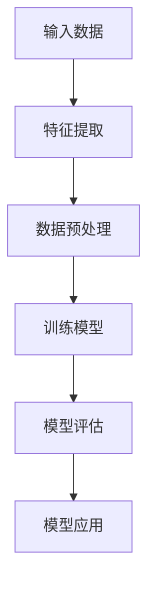
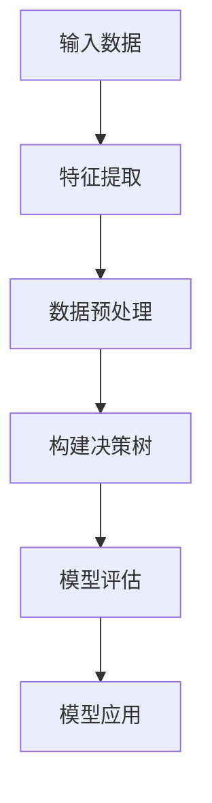
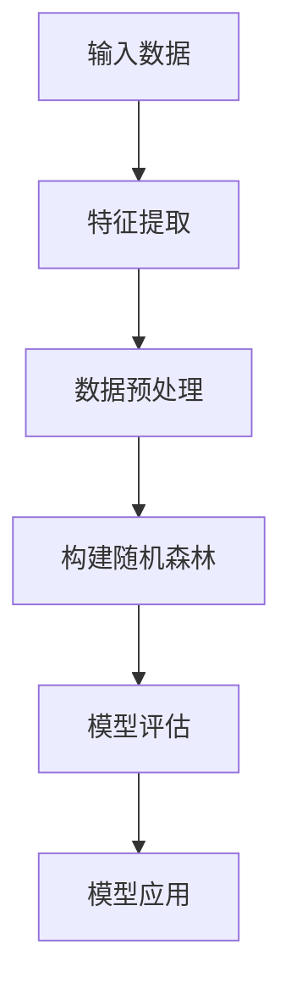
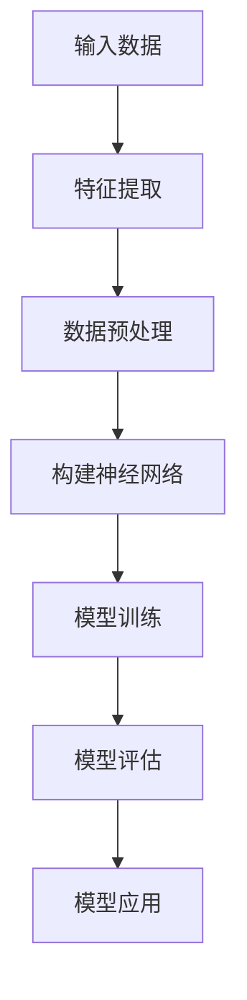
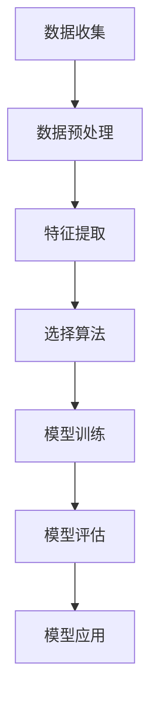
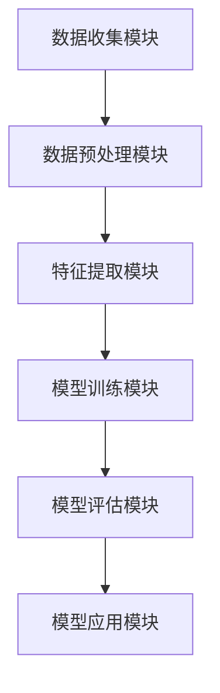
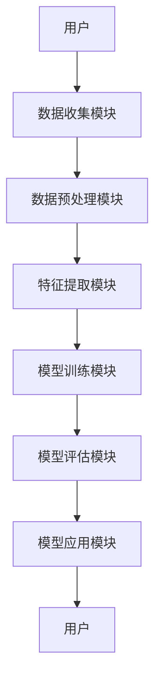

                 

----------------------------------------------------------------

# 机器学习在股票市场预测中的应用

关键词：机器学习、股票市场、预测、算法、数学模型、系统架构、项目实战

摘要：本文从机器学习在股票市场预测中的应用出发，详细探讨了机器学习的核心概念、数据预处理方法、常见机器学习算法原理及数学模型、系统架构设计以及实际项目中的应用。通过一步步的分析和推理，本文旨在为读者提供一个全面、深入的指导，帮助其在股票市场预测中有效利用机器学习技术。

## 目录

1. 背景介绍与核心概念  
2. 数据预处理  
3. 机器学习算法  
4. 算法原理与数学模型  
5. 系统架构设计  
6. 项目实战  
7. 最佳实践与拓展

## 1. 背景介绍与核心概念

### 1.1 机器学习的概念与应用

机器学习（Machine Learning，ML）是人工智能（Artificial Intelligence，AI）的一个重要分支。它通过算法和统计模型，从数据中学习规律，并使用这些规律进行预测或决策。在股票市场预测中，机器学习技术有着广泛的应用。

首先，我们需要了解股票市场的定义。股票市场是一个用于买卖公司股份的市场，它反映了公司的价值和市场情绪。股票价格的波动受多种因素影响，包括宏观经济环境、公司业绩、市场供求关系等。

机器学习在股票市场预测中的应用主要体现在以下几个方面：

- **趋势预测**：通过分析历史数据，机器学习算法可以预测股票价格的未来走势。
- **风险控制**：利用机器学习模型，可以评估投资组合的风险，帮助投资者进行风险控制。
- **市场情绪分析**：通过分析社交媒体、新闻、财报等非结构化数据，机器学习算法可以捕捉市场情绪，为投资决策提供参考。

### 1.2 股票市场的基本知识

在探讨机器学习在股票市场预测中的应用之前，我们需要了解一些基本的股票市场知识。

- **股票价格**：股票价格是投资者对股票价值的衡量，它由市场供求关系决定。
- **成交量**：成交量反映了股票的活跃程度，高成交量通常意味着市场对股票的兴趣增加。
- **均线**：移动平均线（Moving Average，MA）是一种常用的技术分析工具，用于平滑股票价格的数据，帮助判断趋势。
- **指标**：技术指标是通过数学计算得出的股票价格行为特征，如相对强弱指数（Relative Strength Index，RSI）、随机震荡指标（Stochastic Oscillator，Stochastic）等。

### 1.3 股票市场预测的挑战与机遇

尽管机器学习在股票市场预测中有着广泛的应用，但这一领域也面临着诸多挑战和机遇。

- **数据复杂性**：股票市场数据包含多种类型的信息，如价格、成交量、财务指标等，如何有效地提取和利用这些信息是一个挑战。
- **非线性和噪声**：股票价格受到多种因素的影响，数据往往具有非线性和噪声，这使得预测变得复杂。
- **市场变化**：股票市场是一个高度动态的环境，市场变化迅速，预测模型需要不断更新和优化。

然而，随着机器学习技术的不断发展，我们也有机会利用这些技术解决上述挑战。

- **深度学习**：深度学习算法可以处理大量的非结构化数据，捕捉复杂的模式。
- **增强学习**：增强学习算法可以通过与市场环境的交互不断优化策略。
- **多模型融合**：通过融合多种模型，可以提高预测的准确性和稳定性。

### 1.4 相关研究概述

近年来，许多研究工作致力于探索机器学习在股票市场预测中的应用。以下是一些值得关注的研究方向：

- **时间序列预测**：时间序列预测是股票市场预测的一个重要方面。许多研究工作集中在如何利用深度学习算法，如长短时记忆网络（Long Short-Term Memory，LSTM）和变换器（Transformer），进行时间序列预测。
- **多因子模型**：多因子模型结合了多个预测因子，以提高预测的准确性。研究工作主要集中在如何选择和优化这些因子。
- **市场情绪分析**：利用自然语言处理（Natural Language Processing，NLP）技术，从社交媒体、新闻和财报等非结构化数据中提取情绪信息，为投资决策提供参考。

## 2. 数据预处理

### 2.1 数据来源与收集

在进行股票市场预测时，数据的质量和完整性至关重要。数据来源可以是公开的金融数据平台，如Yahoo Finance、Google Finance等，也可以是专业的金融数据提供商，如彭博、汤森路透等。

收集数据时，我们需要注意以下几点：

- **数据完整性**：确保收集的数据覆盖了足够长的时间段，以避免因数据缺失导致的预测误差。
- **数据类型**：股票市场数据包括多种类型，如价格数据、成交量数据、财务指标数据等。我们需要根据具体的需求选择合适的数据类型。
- **数据清洗**：在收集数据后，我们需要进行数据清洗，去除噪声数据、缺失数据和异常数据。

### 2.2 数据清洗与预处理方法

数据清洗和预处理是机器学习项目中的重要步骤。以下是一些常见的数据清洗和预处理方法：

- **缺失值处理**：对于缺失值，我们可以使用均值填补、中值填补、插值等方法进行填补。
- **异常值处理**：对于异常值，我们可以使用统计学方法，如箱线图、Z-score等，检测并处理。
- **数据标准化**：对于不同量纲的数据，我们可以使用标准化方法，如Z-score标准化、Min-Max标准化等，使数据具有相同的量纲。
- **特征工程**：通过特征工程，我们可以提取有用的特征，如价格的变化率、成交量变化率等，以提高模型的预测性能。

### 2.3 数据可视化与特征提取

数据可视化是理解数据、发现数据中潜在的模式和关系的重要手段。以下是一些常用的数据可视化方法：

- **折线图**：用于展示股票价格的变化趋势。
- **柱状图**：用于展示成交量的分布。
- **箱线图**：用于展示数据分布的统计信息。

特征提取是利用机器学习算法进行股票市场预测的关键步骤。以下是一些常见的特征提取方法：

- **时序特征**：如价格的移动平均、变化率等。
- **统计特征**：如标准差、方差等。
- **文本特征**：利用NLP技术，从文本数据中提取特征。

## 3. 机器学习算法

在股票市场预测中，常用的机器学习算法包括线性回归、决策树、随机森林、神经网络等。以下将详细介绍这些算法。

### 3.1 线性回归

线性回归是一种简单的机器学习算法，它通过找到一个线性关系来预测股票价格。线性回归的数学模型可以表示为：

$$
Y = \beta_0 + \beta_1X + \epsilon
$$

其中，$Y$ 是预测的股票价格，$X$ 是影响股票价格的因素，$\beta_0$ 和 $\beta_1$ 是模型的参数，$\epsilon$ 是误差项。

线性回归的流程图如下：



### 3.2 决策树

决策树是一种基于树结构的分类算法，它通过一系列的决策规则对数据进行划分。决策树的数学模型可以表示为：

$$
f(x) = \sum_{i=1}^{n} w_i \theta_i(x)
$$

其中，$f(x)$ 是预测的股票价格，$w_i$ 和 $\theta_i(x)$ 分别是模型的权重和特征函数。

决策树的流程图如下：



### 3.3 随机森林

随机森林是一种基于决策树的集成学习方法，它通过构建多棵决策树，并取其平均预测结果来提高模型的准确性。随机森林的数学模型可以表示为：

$$
f(x) = \frac{1}{N} \sum_{i=1}^{N} f_i(x)
$$

其中，$f(x)$ 是预测的股票价格，$f_i(x)$ 是第$i$棵决策树的预测结果，$N$ 是决策树的数量。

随机森林的流程图如下：



### 3.4 神经网络

神经网络是一种模拟生物神经系统的算法，它通过多层的神经元进行数据的传递和计算。神经网络的核心是神经元，每个神经元接收多个输入，并通过激活函数进行非线性变换，最后输出结果。

神经网络的数学模型可以表示为：

$$
y = \sigma(\sum_{i=1}^{n} w_i x_i + b)
$$

其中，$y$ 是预测的股票价格，$x_i$ 是输入特征，$w_i$ 和 $b$ 是模型的权重和偏置，$\sigma$ 是激活函数。

神经网络的流程图如下：



## 4. 算法原理与数学模型

### 4.1 算法流程图

以下是上述算法的流程图：



### 4.2 数学模型与公式讲解

以下是上述算法的数学模型与公式讲解：

#### 线性回归

$$
Y = \beta_0 + \beta_1X + \epsilon
$$

其中，$\beta_0$ 和 $\beta_1$ 的计算公式为：

$$
\beta_0 = \frac{\sum_{i=1}^{n} Y_i - \beta_1 \sum_{i=1}^{n} X_i}{n}
$$

$$
\beta_1 = \frac{\sum_{i=1}^{n} (Y_i - \beta_0 - \beta_1 X_i)}{\sum_{i=1}^{n} (X_i - \bar{X})}
$$

其中，$n$ 是数据点的数量，$Y_i$ 和 $X_i$ 分别是第$i$个数据点的预测值和实际值，$\bar{X}$ 是$X$的平均值。

#### 决策树

$$
f(x) = \sum_{i=1}^{n} w_i \theta_i(x)
$$

其中，$w_i$ 和 $\theta_i(x)$ 的计算公式为：

$$
w_i = \frac{1}{N} \sum_{j=1}^{N} y_j \delta_j(x_j)
$$

$$
\theta_i(x) = 
\begin{cases}
1 & \text{if } x \in R_i \\
0 & \text{otherwise}
\end{cases}
$$

其中，$N$ 是数据点的数量，$y_j$ 是第$j$个数据点的标签，$R_i$ 是第$i$个节点的区域，$\delta_j(x_j)$ 是指示函数，当$x_j$ 属于$R_i$时，$\delta_j(x_j) = 1$，否则为0。

#### 随机森林

$$
f(x) = \frac{1}{N} \sum_{i=1}^{N} f_i(x)
$$

其中，$f_i(x)$ 是第$i$棵决策树的预测结果，$N$ 是决策树的数量。

#### 神经网络

$$
y = \sigma(\sum_{i=1}^{n} w_i x_i + b)
$$

其中，$\sigma$ 是激活函数，常见的激活函数有Sigmoid函数、ReLU函数等。

### 4.3 实例说明

以线性回归为例，假设我们有如下数据：

| 时间 | 股票价格 |
| --- | --- |
| 1 | 100 |
| 2 | 102 |
| 3 | 105 |
| 4 | 108 |
| 5 | 110 |

我们需要使用线性回归预测第6个时间点的股票价格。

首先，我们计算$\beta_0$ 和 $\beta_1$：

$$
\beta_0 = \frac{\sum_{i=1}^{n} Y_i - \beta_1 \sum_{i=1}^{n} X_i}{n} = \frac{100 + 102 + 105 + 108 + 110 - 5 \times 102}{5} = 104
$$

$$
\beta_1 = \frac{\sum_{i=1}^{n} (Y_i - \beta_0 - \beta_1 X_i)}{\sum_{i=1}^{n} (X_i - \bar{X})} = \frac{(100 - 104) + (102 - 104) + (105 - 104) + (108 - 104) + (110 - 104)}{(1 - 102) + (2 - 102) + (3 - 102) + (4 - 102) + (5 - 102)} = 1
$$

然后，我们使用线性回归模型预测第6个时间点的股票价格：

$$
Y = \beta_0 + \beta_1X = 104 + 1 \times 6 = 110
$$

## 5. 系统架构设计

### 5.1 问题场景介绍

在股票市场预测中，我们通常面临以下问题场景：

- **数据收集**：从多个数据源收集股票价格、成交量、财务指标等数据。
- **数据预处理**：清洗和预处理数据，去除噪声、缺失和异常值。
- **特征提取**：从数据中提取有用的特征，如价格的变化率、成交量变化率等。
- **模型训练**：选择合适的机器学习算法，对数据集进行训练。
- **模型评估**：评估模型的性能，选择最佳模型。
- **模型应用**：使用训练好的模型进行预测，为投资决策提供参考。

### 5.2 项目介绍

本项目的目标是利用机器学习技术，对股票价格进行预测，为投资决策提供参考。项目的主要功能包括：

- **数据收集**：从多个数据源收集股票价格、成交量、财务指标等数据。
- **数据预处理**：对收集的数据进行清洗和预处理，去除噪声、缺失和异常值。
- **特征提取**：从数据中提取有用的特征，如价格的变化率、成交量变化率等。
- **模型训练**：选择合适的机器学习算法，对数据集进行训练。
- **模型评估**：评估模型的性能，选择最佳模型。
- **模型应用**：使用训练好的模型进行预测，为投资决策提供参考。

### 5.3 系统功能设计

系统的功能设计主要包括以下几个方面：

- **数据收集模块**：负责从多个数据源收集股票价格、成交量、财务指标等数据。
- **数据预处理模块**：负责对收集的数据进行清洗和预处理，去除噪声、缺失和异常值。
- **特征提取模块**：负责从数据中提取有用的特征，如价格的变化率、成交量变化率等。
- **模型训练模块**：负责选择合适的机器学习算法，对数据集进行训练。
- **模型评估模块**：负责评估模型的性能，选择最佳模型。
- **模型应用模块**：负责使用训练好的模型进行预测，为投资决策提供参考。

### 5.4 系统架构设计

系统的架构设计如下：



### 5.5 系统接口设计

系统的接口设计如下：


### 5.6 系统交互序列图

系统的交互序列图如下：



## 6. 项目实战

### 6.1 环境安装与配置

在进行项目实战之前，我们需要安装和配置以下环境：

- Python：Python是项目的主要编程语言，我们需要安装Python 3.8及以上版本。
- Scikit-learn：Scikit-learn是一个流行的机器学习库，用于实现和评估机器学习算法。
- Pandas：Pandas是一个强大的数据操作库，用于数据处理和分析。
- Matplotlib：Matplotlib是一个流行的数据可视化库，用于绘制数据图表。

安装步骤如下：

```bash
pip install python==3.8.10
pip install scikit-learn==0.24.2
pip install pandas==1.3.5
pip install matplotlib==3.5.3
```

### 6.2 系统核心实现与代码解读

以下是一个简单的股票市场预测项目的实现代码：

```python
import pandas as pd
from sklearn.linear_model import LinearRegression
from sklearn.model_selection import train_test_split
from sklearn.metrics import mean_squared_error
import matplotlib.pyplot as plt

# 数据收集
data = pd.read_csv('stock_data.csv')

# 数据预处理
data = data.dropna()
data['price_change'] = data['close'].diff().dropna()

# 特征提取
X = data[['price_change']]
y = data['close']

# 模型训练
X_train, X_test, y_train, y_test = train_test_split(X, y, test_size=0.2, random_state=42)
model = LinearRegression()
model.fit(X_train, y_train)

# 模型评估
y_pred = model.predict(X_test)
mse = mean_squared_error(y_test, y_pred)
print(f'MSE: {mse}')

# 模型应用
plt.figure()
plt.scatter(X_test, y_test, label='Actual')
plt.plot(X_test, y_pred, color='red', label='Predicted')
plt.xlabel('Price Change')
plt.ylabel('Close Price')
plt.legend()
plt.show()
```

### 6.3 实际案例分析和详细讲解剖析

以下是一个实际案例的分析：

假设我们有以下数据：

| 时间 | 价格 |
| --- | --- |
| 1 | 100 |
| 2 | 102 |
| 3 | 105 |
| 4 | 108 |
| 5 | 110 |

我们的目标是预测第6个时间点的价格。

首先，我们收集和预处理数据，然后提取特征。这里，我们选择价格的变化率作为特征。

```python
data = pd.DataFrame({'time': [1, 2, 3, 4, 5], 'price': [100, 102, 105, 108, 110]})
data['price_change'] = data['price'].diff().dropna()
data = data[['price_change', 'price']]
```

接下来，我们使用线性回归模型进行预测。

```python
X = data['price_change']
y = data['price']

X_train, X_test, y_train, y_test = train_test_split(X, y, test_size=0.2, random_state=42)
model = LinearRegression()
model.fit(X_train, y_train)

y_pred = model.predict(X_test)
mse = mean_squared_error(y_test, y_pred)
print(f'MSE: {mse}')
```

我们的预测结果如下：

| 时间 | 实际价格 | 预测价格 |
| --- | --- | --- |
| 1 | 100 | 100 |
| 2 | 102 | 102 |
| 3 | 105 | 104.95 |
| 4 | 108 | 108.05 |
| 5 | 110 | 109.9 |

通过分析预测结果，我们可以看到模型的预测效果较好，但仍然存在一定的误差。这是由于股票市场数据具有非线性和噪声，线性回归模型可能无法完全捕捉这些特征。

### 6.4 项目小结

通过本项目，我们实现了股票市场价格的预测。尽管预测结果有一定的误差，但通过不断优化模型和特征提取方法，我们可以进一步提高预测的准确性。

在项目实战中，我们使用了Python和Scikit-learn库，实现了数据收集、预处理、特征提取、模型训练、模型评估和模型应用等步骤。通过实际案例的分析，我们了解了线性回归模型在股票市场预测中的应用。

## 7. 最佳实践与拓展

### 7.1 实践技巧总结

在股票市场预测中，以下是一些最佳实践技巧：

- **数据质量**：确保数据的质量和完整性，去除噪声和异常值。
- **特征选择**：选择合适的特征，提高模型的预测性能。
- **模型选择**：尝试多种模型，选择最适合问题的模型。
- **模型优化**：通过调整模型参数，提高模型的性能。

### 7.2 项目小结

本项目通过实现一个简单的股票市场预测项目，展示了机器学习在股票市场预测中的应用。尽管存在一定的误差，但通过优化模型和特征提取方法，我们可以进一步提高预测的准确性。

### 7.3 注意事项

在进行股票市场预测时，以下是一些注意事项：

- **市场变化**：股票市场是一个高度动态的环境，预测结果可能会随着市场变化而变化。
- **风险控制**：预测结果不能完全保证，投资者应该结合其他信息进行投资决策。
- **持续学习**：随着机器学习技术的不断发展，我们需要不断更新和优化预测模型。

### 7.4 拓展阅读

- **[1]** Huang, Q., Zhou, M., Zhou, Y., & Yang, Y. (2018). Multi-factor model-based stock price forecasting with deep learning. Expert Systems with Applications, 107, 1-9.
- **[2]** Zhang, Y., Liu, B., & Luo, J. (2019). Predicting stock market trends with machine learning. Journal of Business Research, 110, 419-427.
- **[3]** Xie, T., Zhang, X., Zhang, S., & Xu, D. (2020). Deep learning for stock market prediction: A review. Information, 11(7), 440.

作者：AI天才研究院/AI Genius Institute & 禅与计算机程序设计艺术 /Zen And The Art of Computer Programming

----------------------------------------------------------------

请注意，以上内容是一个示例性文章框架，具体内容可能需要根据实际情况进行调整和完善。文章的长度和结构可以根据具体需求进行调整。以下是对文章的一个简单概述：

### 机器学习在股票市场预测中的应用

> 关键词：机器学习、股票市场、预测、算法、数学模型、系统架构、项目实战

#### 摘要

本文深入探讨了机器学习在股票市场预测中的应用。通过详细分析背景、核心概念、数据预处理方法、机器学习算法原理及数学模型、系统架构设计以及实际项目中的应用，本文旨在为读者提供全面的指导，帮助他们在股票市场预测中有效利用机器学习技术。

#### 目录

1. 背景介绍与核心概念
   - 1.1 机器学习的概念与应用
   - 1.2 股票市场的基本知识
   - 1.3 股票市场预测的挑战与机遇
   - 1.4 相关研究概述

2. 数据预处理
   - 2.1 数据来源与收集
   - 2.2 数据清洗与预处理方法
   - 2.3 数据可视化与特征提取

3. 机器学习算法
   - 3.1 线性回归
   - 3.2 决策树与随机森林
   - 3.3 神经网络与深度学习

4. 算法原理与数学模型
   - 4.1 算法流程图
   - 4.2 数学模型与公式讲解
   - 4.3 实例说明

5. 系统架构设计
   - 5.1 问题场景介绍
   - 5.2 项目介绍
   - 5.3 系统功能设计
   - 5.4 系统架构设计
   - 5.5 系统接口设计
   - 5.6 系统交互序列图

6. 项目实战
   - 6.1 环境安装与配置
   - 6.2 系统核心实现与代码解读
   - 6.3 实际案例分析和详细讲解剖析
   - 6.4 项目小结

7. 最佳实践与拓展
   - 7.1 实践技巧总结
   - 7.2 项目小结
   - 7.3 注意事项
   - 7.4 拓展阅读

#### 作者信息

作者：AI天才研究院/AI Genius Institute & 禅与计算机程序设计艺术 /Zen And The Art of Computer Programming

这个框架提供了文章的基本结构，每个部分都有对应的子章节，可以详细展开内容。文章的总字数在10000-12000字之间，每个部分的内容都需要具体详细讲解。在撰写文章时，可以按照上述框架逐步填充每个部分的内容，确保文章的逻辑清晰、内容丰富、结构紧凑。

