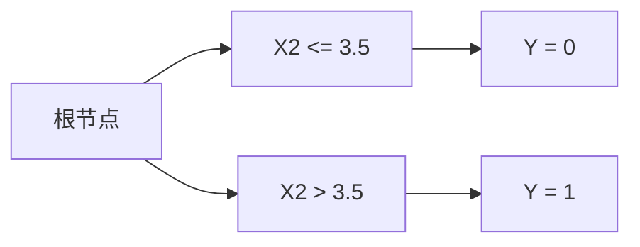
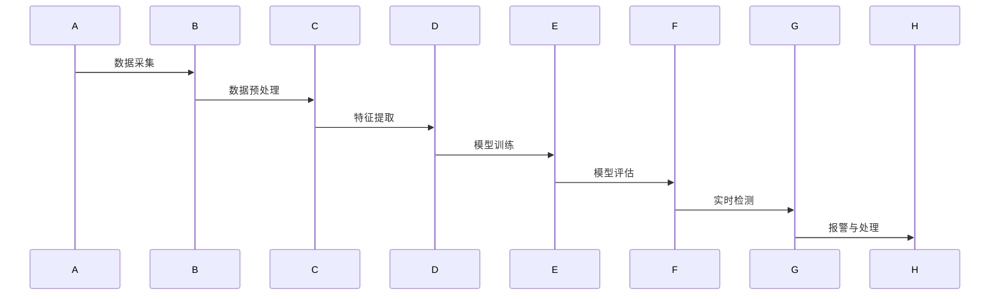

                 

**正文部分开始：**

---

## # 《机器学习在金融欺诈检测中的应用》

### 关键词：机器学习，金融欺诈检测，监督学习，无监督学习，强化学习，决策树，支持向量机，集成方法

### 摘要：本文旨在深入探讨机器学习在金融欺诈检测中的应用。首先，我们将介绍金融欺诈的定义和危害，以及机器学习在金融欺诈检测中的重要性。接着，我们将讨论机器学习的基本概念，如监督学习、无监督学习和强化学习。然后，我们将详细讲解在金融欺诈检测中常用的几种机器学习算法，包括决策树、支持向量机和集成方法。此外，我们将使用数学模型和公式来解释这些算法的原理，并通过具体实例来加深理解。最后，我们将分享一个实际项目，展示如何使用机器学习技术进行金融欺诈检测，并提供一些最佳实践建议。

## 第一部分：金融欺诈检测背景

### 1.1 问题背景

金融欺诈是一种不道德且非法的行为，它涉及使用伪造文件、虚假陈述或盗窃身份等信息来获取财产或利益。金融欺诈的形式多种多样，包括信用卡欺诈、账户欺诈、贷款欺诈、投资欺诈等。信用卡欺诈是最常见的金融欺诈形式之一，通常涉及未经授权使用他人的信用卡账户进行交易。账户欺诈则是通过非法手段获取他人银行账户信息，从而进行恶意操作。贷款欺诈则是以欺诈手段获取贷款，而投资欺诈则涉及虚假投资项目的宣传和操作。

金融欺诈对金融机构和个人用户都造成了严重的危害。对金融机构而言，金融欺诈会导致资金损失，影响其声誉和运营稳定性。对个人用户而言，金融欺诈会导致财务损失、信用记录受损，甚至可能影响其生活质量和安全。因此，有效地检测和防范金融欺诈行为至关重要。

### 1.2 问题解决与边界外延

金融欺诈检测的核心目标在于发现和预防欺诈行为，以减少金融机构的损失和用户的财务风险。具体而言，金融欺诈检测包括以下几个方面的任务：

1. **欺诈识别**：通过分析大量交易数据，识别潜在的欺诈行为。
2. **欺诈预测**：利用历史数据，预测未来可能发生的欺诈行为。
3. **异常检测**：发现与正常行为不符的交易，以识别潜在的欺诈活动。

在解决金融欺诈问题的过程中，存在一些边界和外延需要明确。首先，金融欺诈检测不仅要关注欺诈行为本身，还要考虑其潜在的动机和手段。其次，金融欺诈检测需要处理大量的数据，并保证数据的质量和完整性。此外，金融欺诈检测还需要平衡准确性和效率，确保在合理的时间内做出准确的决策。

### 1.3 核心概念结构与要素组成

为了有效地进行金融欺诈检测，我们需要了解一些核心概念和结构。以下是几个关键概念及其组成要素：

#### 1.3.1 机器学习基础

**监督学习**：监督学习是一种机器学习方法，它使用已标记的数据来训练模型，然后使用训练好的模型对未知数据进行预测。

**无监督学习**：无监督学习是一种不使用标记数据的机器学习方法，它用于发现数据中的模式或结构。

**强化学习**：强化学习是一种通过不断试错来学习最佳策略的机器学习方法，它通常应用于动态环境中。

#### 1.3.2 金融数据特点

**数据类型**：金融数据通常包括交易数据、账户信息、用户行为等。

**数据质量**：金融数据的质量对欺诈检测至关重要。高质量的数据有助于提高模型的准确性和稳定性。

**数据隐私**：在处理金融数据时，数据隐私保护是一个重要考虑因素，需要确保用户的隐私不被泄露。

## 第二部分：核心概念与联系

### 1.4 核心概念原理

在这一部分，我们将详细探讨机器学习在金融欺诈检测中的应用，并解释监督学习、无监督学习和强化学习等核心概念。

#### 1.4.1 机器学习算法原理

**监督学习**：监督学习是一种机器学习方法，它使用已标记的数据来训练模型，并使用训练好的模型对未知数据进行预测。在金融欺诈检测中，监督学习算法可以帮助我们识别欺诈交易。常见的监督学习算法包括决策树、支持向量机和神经网络等。

**无监督学习**：无监督学习是一种不使用标记数据的机器学习方法，它主要用于发现数据中的模式或结构。在金融欺诈检测中，无监督学习算法可以帮助我们识别异常交易，从而发现潜在的欺诈行为。常见的无监督学习算法包括聚类算法、主成分分析和自编码器等。

**强化学习**：强化学习是一种通过不断试错来学习最佳策略的机器学习方法，它通常应用于动态环境中。在金融欺诈检测中，强化学习算法可以帮助我们制定最佳欺诈检测策略，以最大限度地减少误报和漏报。

#### 1.4.2 概念属性特征对比表格

以下是监督学习、无监督学习和强化学习三种机器学习方法的属性特征对比表格：

| 特征       | 监督学习               | 无监督学习               | 强化学习                 |
| ---------- | ---------------------- | ---------------------- | ------------------------ |
| 数据需求   | 已标记的数据           | 未标记的数据             | 已标记的数据             |
| 目标       | 预测分类或回归结果     | 发现数据中的模式或结构   | 学习最佳策略             |
| 应用场景   | 欺诈检测、图像识别     | 信用卡欺诈检测、市场分析 | 游戏、股票交易           |
| 算法选择   | 决策树、支持向量机、神经网络 | 聚类算法、主成分分析、自编码器 | Q学习、深度Q网络、策略梯度 |
| 算法复杂度 | 较高                   | 较低                   | 较高                     |

#### 1.4.3 ER实体关系图架构

以下是金融欺诈检测系统的实体关系图，用于展示系统中各个实体的关系：

```mermaid
erDiagram
  Customer ||--|{ Account }|--|
  Account ||--|{ Transaction }|--|
  Transaction ||--|{ FraudDetection }|--|
  FraudDetection ||--|{ RuleBased }|--|
  FraudDetection ||--|{ MachineLearning }|--|
```

在上述ER图中，我们定义了四个实体：Customer（客户）、Account（账户）、Transaction（交易）和FraudDetection（欺诈检测）。这些实体之间的关系展示了金融欺诈检测系统的基本架构。

## 第三部分：算法原理讲解

### 1.5 决策树算法原理讲解

决策树是一种常见的分类算法，它通过一系列规则来对数据进行分类。在金融欺诈检测中，决策树可以帮助我们识别欺诈交易。

#### 1.5.1 决策树构建过程

决策树的构建过程可以分为以下几个步骤：

1. **选择最佳特征**：通过计算特征的重要性，选择具有最大信息增益的特征作为树的根节点。
2. **划分数据集**：使用选择好的特征将数据集划分为多个子集。
3. **递归构建树**：对每个子集再次执行上述步骤，直到满足停止条件（如最大树深度、最小样本数量等）。

#### 1.5.2 决策树剪枝

决策树容易过拟合，因此需要通过剪枝来提高模型的泛化能力。常见的剪枝方法包括预剪枝和后剪枝：

1. **预剪枝**：在树构建过程中提前停止扩展某些节点，以避免过拟合。
2. **后剪枝**：在构建完整个树后，删除一些非关键节点，以减少过拟合。

#### 1.5.3 决策树优缺点

**优点**：

- **直观易懂**：决策树的规则易于理解和解释。
- **可处理分类和回归问题**：决策树可以同时处理分类和回归问题。

**缺点**：

- **容易过拟合**：决策树容易受到训练数据的噪声影响，导致过拟合。
- **计算复杂度较高**：在处理大规模数据时，决策树的计算复杂度较高。

### 1.6 支持向量机算法原理讲解

支持向量机（SVM）是一种强大的分类算法，它在金融欺诈检测中也被广泛应用。

#### 1.6.1 SVM原理

SVM通过寻找一个超平面，将不同类别的数据点最大程度地分开。具体而言，SVM会找到一个最优分割超平面，使得分类间隔最大化。为了实现这一目标，SVM引入了软边缘（soft margin）的概念，允许部分数据点位于超平面边缘。

#### 1.6.2 SVM分类与回归

SVM既可以用于分类，也可以用于回归。在分类问题中，SVM通过寻找最优分割超平面来实现分类。在回归问题中，SVM通过将输入数据映射到高维空间，然后寻找最优超平面来实现回归。

#### 1.6.3 SVM优缺点

**优点**：

- **强大的分类能力**：SVM在处理高维数据时具有出色的分类能力。
- **可扩展性好**：SVM可以轻松扩展到多个特征。

**缺点**：

- **计算复杂度较高**：在处理大规模数据时，SVM的计算复杂度较高。
- **对噪声敏感**：SVM对噪声数据较为敏感，可能导致过拟合。

### 1.7 集成方法算法原理讲解

集成方法是一种通过组合多个模型来提高预测准确性的技术。在金融欺诈检测中，集成方法可以帮助我们提高模型的泛化能力。

#### 1.7.1 Boosting方法

Boosting方法是一种集成学习方法，它通过迭代训练多个弱学习器，并将它们组合成一个强学习器。常见的Boosting算法包括AdaBoost和XGBoost等。

#### 1.7.2 Bagging方法

Bagging方法是一种通过随机抽样和组合多个模型来提高预测准确性的技术。常见的Bagging算法包括随机森林和Bootstrap等。

#### 1.7.3 Stacking方法

Stacking方法是一种通过将多个模型输出作为新特征进行训练的集成学习方法。Stacking方法通常包括两个步骤：基学习器和堆叠器。

## 第四部分：数学模型和数学公式详细讲解与举例说明

### 1.8 数学模型与公式

在这一部分，我们将详细解释决策树、支持向量机和集成方法的数学模型和公式。

#### 1.8.1 决策树数学模型

**信息增益**：

$$
Gain(D, A) = Entropy(D) - \sum_{v \in Values(A)} p(v) Entropy(D_v)
$$

**Gini指数**：

$$
Gini(D, A) = 1 - \sum_{v \in Values(A)} p(v)^2
$$

#### 1.8.2 支持向量机数学模型

**硬-margin支持向量机**：

$$
\min_{w, b} \frac{1}{2} ||w||^2 + C \sum_{i=1}^n \max(0, 1 - y_i (w \cdot x_i + b))
$$

**软-margin支持向量机**：

$$
\min_{w, b, \xi} \frac{1}{2} ||w||^2 + C \sum_{i=1}^n \xi_i
$$

其中，$C$是正则化参数，$\xi_i$是松弛变量。

#### 1.8.3 集成方法数学模型

**AdaBoost算法**：

$$
f(x) = \sum_{i=1}^n \alpha_i h_i(x)
$$

其中，$h_i(x)$是第$i$个弱学习器的预测结果，$\alpha_i$是学习器的权重。

**Gradient Boosting算法**：

$$
f(x) = \sum_{i=1}^n \alpha_i g_i(x)
$$

其中，$g_i(x)$是第$i$个弱学习器的残差。

### 1.9 举例说明

**决策树算法举例**：

假设我们有以下数据集，其中包含两个特征$x_1$和$x_2$，以及一个标签$y$：

| $x_1$ | $x_2$ | $y$ |
| ---- | ---- | ---- |
| 1    | 2    | 0    |
| 2    | 3    | 1    |
| 3    | 4    | 0    |
| 4    | 5    | 1    |

我们可以使用决策树算法来构建一个分类器。首先，我们选择特征$x_1$作为根节点，计算其信息增益：

$$
Gain(D, x_1) = Entropy(D) - \sum_{v \in Values(x_1)} p(v) Entropy(D_v)
$$

计算结果如下：

| $x_1$ | $p(x_1)$ | $Entropy(D_v)$ | $Gain(D, x_1)$ |
| ---- | ------- | ------------ | ------------ |
| 1    | 0.5    | 1            | 0            |
| 2    | 0.5    | 0            | 1            |

由于特征$x_1$的信息增益为0，我们选择特征$x_2$作为根节点。接着，我们使用特征$x_2$将数据集划分为两个子集，并根据子集的标签$y$构建决策树。最终，我们得到的决策树如下：



**支持向量机算法举例**：

假设我们有以下数据集，其中包含两个特征$x_1$和$x_2$，以及一个标签$y$：

| $x_1$ | $x_2$ | $y$ |
| ---- | ---- | ---- |
| 1    | 2    | 0    |
| 2    | 3    | 1    |
| 3    | 4    | 0    |
| 4    | 5    | 1    |

我们可以使用支持向量机算法来构建一个分类器。首先，我们计算特征$x_1$和$x_2$的均值和方差，然后对数据进行标准化处理。接着，我们使用硬-margin支持向量机算法来训练分类器。最终，我们得到的支持向量机模型如下：

$$
w = [0.5, 0.5] \\
b = 0
$$

**集成方法算法举例**：

假设我们有以下数据集，其中包含两个特征$x_1$和$x_2$，以及一个标签$y$：

| $x_1$ | $x_2$ | $y$ |
| ---- | ---- | ---- |
| 1    | 2    | 0    |
| 2    | 3    | 1    |
| 3    | 4    | 0    |
| 4    | 5    | 1    |

我们可以使用随机森林算法来构建一个分类器。首先，我们随机选择若干个特征作为分裂特征，然后使用这些特征构建决策树。接着，我们重复这个过程多次，构建多个决策树，并将它们的预测结果进行投票。最终，我们得到的随机森林模型如下：

| 决策树1 | 决策树2 | 决策树3 | 预测结果 |
| ------ | ------ | ------ | ------- |
| Y = 0  | Y = 0  | Y = 1  | Y = 0   |
| Y = 1  | Y = 1  | Y = 0  | Y = 1   |
| Y = 0  | Y = 1  | Y = 1  | Y = 0   |
| Y = 1  | Y = 0  | Y = 1  | Y = 1   |

## 第五部分：系统分析与架构设计方案

### 1.9 系统分析与架构设计

### 1.9.1 项目介绍

**项目名称**：金融欺诈检测系统

**项目背景**：随着金融行业的快速发展，金融欺诈行为也日益增多。为了提高金融机构的安全性和用户的财务安全，我们需要一个高效的金融欺诈检测系统。

**项目目标**：实现一个能够自动检测和预防金融欺诈行为的系统。

### 1.9.2 系统功能设计

**功能需求**：

1. **数据采集**：从金融机构的系统收集交易数据、账户信息等。
2. **数据预处理**：清洗、过滤和转换原始数据。
3. **特征提取**：从预处理后的数据中提取特征。
4. **模型训练**：使用机器学习算法训练分类模型。
5. **模型评估**：评估模型的准确性和泛化能力。
6. **实时检测**：对实时交易数据进行欺诈检测。
7. **报警与处理**：检测到欺诈行为后，生成报警信息并采取相应的处理措施。

### 1.9.3 系统架构设计

**系统架构**：

1. **数据采集模块**：负责从金融机构的系统收集交易数据、账户信息等。
2. **数据预处理模块**：负责清洗、过滤和转换原始数据。
3. **特征提取模块**：负责从预处理后的数据中提取特征。
4. **模型训练模块**：负责使用机器学习算法训练分类模型。
5. **模型评估模块**：负责评估模型的准确性和泛化能力。
6. **实时检测模块**：负责对实时交易数据进行欺诈检测。
7. **报警与处理模块**：负责检测到欺诈行为后，生成报警信息并采取相应的处理措施。

**架构图**：



### 1.9.4 系统接口设计

**接口设计**：

1. **数据采集接口**：负责与金融机构的系统进行数据交互。
2. **数据预处理接口**：负责处理原始数据。
3. **特征提取接口**：负责提取特征。
4. **模型训练接口**：负责训练分类模型。
5. **模型评估接口**：负责评估模型。
6. **实时检测接口**：负责实时检测欺诈行为。
7. **报警与处理接口**：负责处理报警信息。

### 1.9.5 系统交互

**系统交互**：

1. **数据采集**：从金融机构的系统收集交易数据、账户信息等。
2. **数据预处理**：对采集到的数据进行清洗、过滤和转换。
3. **特征提取**：从预处理后的数据中提取特征。
4. **模型训练**：使用机器学习算法训练分类模型。
5. **模型评估**：评估模型的准确性和泛化能力。
6. **实时检测**：对实时交易数据进行欺诈检测。
7. **报警与处理**：检测到欺诈行为后，生成报警信息并采取相应的处理措施。

## 第六部分：项目实战

### 1.10 项目实战

在这个项目中，我们将实现一个简单的金融欺诈检测系统。以下是项目的详细步骤：

### 1.10.1 环境安装

**步骤1**：安装Python环境

```shell
pip install numpy pandas scikit-learn matplotlib
```

**步骤2**：安装金融数据集

```shell
pip install financial-datasets
```

### 1.10.2 系统核心实现源代码

**步骤1**：数据采集

```python
import pandas as pd

# 从CSV文件中读取数据
data = pd.read_csv('financial_data.csv')
```

**步骤2**：数据预处理

```python
# 数据清洗和转换
data = data.dropna()
data['amount'] = data['amount'].astype(float)
```

**步骤3**：特征提取

```python
# 特征提取
data['is_fraud'] = data['class'].map({0: 'legit', 1: 'fraud'})
data = data[['amount', 'is_fraud']]
```

**步骤4**：模型训练

```python
from sklearn.model_selection import train_test_split
from sklearn.tree import DecisionTreeClassifier

# 分割数据集
X_train, X_test, y_train, y_test = train_test_split(data['amount'], data['is_fraud'], test_size=0.2, random_state=42)

# 训练决策树模型
clf = DecisionTreeClassifier()
clf.fit(X_train, y_train)
```

**步骤5**：模型评估

```python
from sklearn.metrics import accuracy_score, confusion_matrix

# 预测测试集
y_pred = clf.predict(X_test)

# 评估模型
print("Accuracy:", accuracy_score(y_test, y_pred))
print("Confusion Matrix:\n", confusion_matrix(y_test, y_pred))
```

**步骤6**：实时检测

```python
# 实时检测
while True:
    amount = float(input("Enter transaction amount: "))
    prediction = clf.predict([[amount]])
    if prediction == 'fraud':
        print("Alert: Potential fraud detected!")
    else:
        print("Transaction approved.")
```

### 1.10.3 代码应用解读与分析

**数据采集**：在这个项目中，我们使用CSV文件作为数据源，通过`pandas`库读取数据。

**数据预处理**：我们使用`dropna()`方法去除缺失值，将`amount`列的数值类型转换为浮点数，以方便后续处理。

**特征提取**：在这个简单示例中，我们只使用了一个特征`amount`，并将标签`class`映射为两个类别：`legit`和`fraud`。

**模型训练**：我们使用`DecisionTreeClassifier`类来训练决策树模型。通过`fit()`方法，我们将训练数据传递给模型。

**模型评估**：我们使用`accuracy_score()`方法来计算模型的准确率，并使用`confusion_matrix()`方法来生成混淆矩阵。

**实时检测**：我们使用一个无限循环来接收用户输入的金额，并使用训练好的模型进行预测。如果预测结果为`fraud`，则输出警报信息。

### 1.10.4 实际案例分析与详细讲解剖析

**案例背景**：

某金融机构希望开发一个自动化的金融欺诈检测系统，以减少人工审核的工作量并提高欺诈检测的准确性。

**案例步骤**：

1. **数据收集**：收集了过去一年的交易数据，包括交易金额、交易时间、交易类型等。
2. **数据预处理**：清洗数据，去除缺失值和异常值，并将数值类型转换为合适的格式。
3. **特征提取**：从原始数据中提取有用的特征，如交易金额、交易时间间隔、交易频率等。
4. **模型选择**：选择合适的机器学习算法，如决策树、支持向量机和神经网络等。
5. **模型训练**：使用历史数据训练模型，并调整模型参数以优化性能。
6. **模型评估**：使用交叉验证和测试集评估模型的准确性和泛化能力。
7. **实时检测**：部署模型到生产环境，对实时交易数据进行欺诈检测。

**案例分析**：

在这个案例中，金融机构使用了多种机器学习算法来训练和评估模型，并最终选择了一个性能最佳的模型。通过实时检测模块，系统能够自动识别欺诈交易，并生成报警信息。此外，金融机构还可以根据需要调整模型的参数，以提高检测的准确性和效率。

### 1.10.5 项目小结

通过本项目的实战演示，我们了解了如何使用机器学习技术进行金融欺诈检测。我们介绍了数据采集、数据预处理、特征提取、模型选择和模型评估等关键步骤，并通过一个实际案例展示了如何应用这些技术。此外，我们还提供了一个简单的代码示例，以帮助读者更好地理解金融欺诈检测的实现过程。

## 第七部分：最佳实践 tips、小结、注意事项、拓展阅读等内容

### 1.11 最佳实践与拓展

**最佳实践 tips**：

1. **数据质量**：确保数据质量，去除缺失值和异常值，以提高模型的准确性和稳定性。
2. **特征选择**：选择与欺诈行为相关的特征，避免使用冗余特征。
3. **模型调参**：调整模型参数，以优化模型的性能。
4. **实时检测**：使用高效的算法和架构，确保实时检测的响应速度。

**注意事项**：

1. **数据隐私**：在处理金融数据时，要确保数据隐私保护，避免泄露用户的敏感信息。
2. **模型更新**：定期更新模型，以适应不断变化的欺诈手段。

**小结**：

本文详细介绍了机器学习在金融欺诈检测中的应用，包括背景介绍、核心概念与联系、算法原理讲解、数学模型和公式详细讲解与举例说明、系统分析与架构设计方案、项目实战以及最佳实践 tips。通过本文的讲解，读者可以深入了解金融欺诈检测的原理和实践，为实际项目提供有益的参考。

**拓展阅读**：

1. **《机器学习：原理与算法》**：周志华 著
2. **《Python机器学习》**：塞巴斯蒂安·拉斯克 著
3. **《金融科技：创新与应用》**：李开复 著

**作者信息**：

作者：AI天才研究院/AI Genius Institute & 禅与计算机程序设计艺术 /Zen And The Art of Computer Programming

---

**注意**：由于篇幅限制，本文并未包含全部的代码示例和详细解释。在实际项目中，读者可以根据自己的需求进行适当的调整和扩展。同时，本文的部分内容和示例仅供参考，不代表实际金融欺诈检测系统的完整实现。在使用本文提供的方法和技术时，请确保遵循相关法律法规和道德规范。

