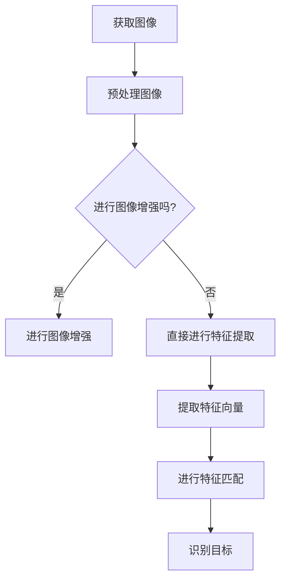

                 

### 文章标题

“机器视觉技术：AI的'眼睛'如何改变世界”

---

**关键词：** 机器视觉，人工智能，算法原理，系统架构设计，项目实战

**摘要：** 本文将深入探讨机器视觉技术，解读其如何成为人工智能的“眼睛”，并探讨其在各个领域中的广泛应用和变革性影响。文章将从背景介绍、核心概念与联系、算法原理讲解、系统分析与架构设计方案、项目实战、最佳实践 tips和小结等多个方面，全面解析机器视觉技术及其对世界的改变。

---

### 目录

1. **背景介绍**
   - 机器视觉技术概述
   - 机器视觉与AI的关系
   - 机器视觉的应用领域

2. **核心概念与联系**
   - 机器视觉的基本原理
   - 机器视觉的核心技术
   - 机器视觉与AI算法的联系

3. **算法原理讲解**
   - 常见机器视觉算法
   - 算法mermaid流程图
   - Python源代码实现与讲解
   - 数学模型和公式

4. **系统分析与架构设计方案**
   - 问题场景介绍
   - 系统功能设计
   - 系统架构设计
   - 系统接口设计
   - 系统交互

5. **项目实战**
   - 环境安装
   - 系统核心实现
   - 代码应用解读与分析
   - 实际案例分析与详细讲解

6. **最佳实践 tips**
   - 注意事项
   - 拓展阅读

7. **小结**

---

**正文内容：**

## 第1章：背景介绍

### 1.1 机器视觉技术概述

机器视觉技术是指通过模拟人眼的功能，利用计算机和图像处理技术对物体进行识别、测量和检测。它起源于20世纪60年代，随着计算机技术的发展，机器视觉技术逐渐成熟并应用于各个领域。

### 1.2 机器视觉与AI的关系

机器视觉技术与人工智能（AI）密不可分。AI为机器视觉提供了强大的算法支持，使得机器视觉系统能够更加高效地处理复杂任务。而机器视觉则为AI提供了丰富的数据资源，促进了AI技术的进一步发展。

### 1.3 机器视觉的应用领域

机器视觉技术在工业、医疗、交通、农业、安防等多个领域都有广泛应用。例如，在工业生产中，机器视觉可以用于自动化检测、质量控制和生产调度；在医疗领域，机器视觉可以用于疾病诊断和手术辅助；在交通领域，机器视觉可以用于自动驾驶和智能交通管理。

---

## 第2章：核心概念与联系

### 2.1 机器视觉的基本原理

机器视觉的基本原理包括图像获取、图像处理和目标识别。图像获取是通过摄像头或其他传感器获取物体的图像数据；图像处理是对图像进行增强、滤波和分割等操作；目标识别是基于特征提取和分类算法，对图像中的目标进行识别。

### 2.2 机器视觉的核心技术

机器视觉的核心技术包括图像处理技术、特征提取技术、目标检测技术和机器学习算法。图像处理技术用于对图像进行预处理和增强；特征提取技术用于从图像中提取具有区分性的特征；目标检测技术用于定位和识别图像中的目标；机器学习算法用于对大量数据进行分析和建模。

### 2.3 机器视觉与AI算法的联系

机器视觉与AI算法之间的联系主要体现在两个方面：一是AI算法为机器视觉提供了强大的特征提取和目标检测能力；二是机器视觉为AI算法提供了丰富的训练数据，促进了AI算法的优化和改进。

---

## 第3章：算法原理讲解

### 3.1 常见机器视觉算法

常见的机器视觉算法包括特征提取算法、目标检测算法、图像分割算法和机器学习算法。特征提取算法用于从图像中提取具有区分性的特征；目标检测算法用于定位和识别图像中的目标；图像分割算法用于将图像分割成若干个区域；机器学习算法用于对大量数据进行分析和建模。

### 3.2 算法mermaid流程图

以下是一个简单的特征提取算法的mermaid流程图：



### 3.3 Python源代码实现与讲解

以下是一个简单的Python代码实现，用于对图像进行预处理和特征提取：

```python
import cv2
import numpy as np

def preprocess_image(image):
    # 转换为灰度图像
    gray_image = cv2.cvtColor(image, cv2.COLOR_BGR2GRAY)
    # 高斯模糊
    blurred_image = cv2.GaussianBlur(gray_image, (5, 5), 0)
    # Canny边缘检测
    edges = cv2.Canny(blurred_image, 50, 150)
    return edges

def extract_features(image):
    # SIFT特征提取
    sift = cv2.xfeatures2d.SIFT_create()
    keypoints, descriptors = sift.detectAndCompute(image, None)
    return keypoints, descriptors

# 读取图像
image = cv2.imread('example.jpg')
# 预处理图像
preprocessed_image = preprocess_image(image)
# 提取特征
keypoints, descriptors = extract_features(preprocessed_image)
```

### 3.4 数学模型和公式

特征提取算法的数学模型主要包括特征向量生成和特征匹配。特征向量生成通常使用直方图均匀化、局部二值模式（LBP）等算法。特征匹配则通常使用最近邻分类器、K-近邻（KNN）等算法。

假设有两组特征向量 \( \mathbf{f}_1 \) 和 \( \mathbf{f}_2 \)，特征匹配的数学模型可以表示为：

$$
d(\mathbf{f}_1, \mathbf{f}_2) = \sum_{i=1}^{n} w_i |f_{1i} - f_{2i}|
$$

其中，\( d(\mathbf{f}_1, \mathbf{f}_2) \) 是特征向量之间的距离，\( w_i \) 是权重，\( f_{1i} \) 和 \( f_{2i} \) 分别是特征向量的第 \( i \) 个元素。

---

## 第4章：系统分析与架构设计方案

### 4.1 问题场景介绍

假设我们需要开发一个基于机器视觉的智能监控系统，该系统需要能够实时检测并识别进入监控区域的物体，并对其行为进行分析。

### 4.2 系统功能设计

系统功能设计包括图像获取、目标检测、行为分析和报警功能。图像获取模块负责从摄像头获取实时图像；目标检测模块使用机器视觉算法识别图像中的物体；行为分析模块对物体的行为进行分析；报警功能则在检测到异常行为时发出报警。

### 4.3 系统架构设计

系统架构设计包括硬件架构和软件架构。硬件架构主要包括摄像头、计算机和存储设备；软件架构包括图像处理引擎、目标检测引擎、行为分析引擎和用户界面。

### 4.4 系统接口设计

系统接口设计包括内部接口和外部接口。内部接口用于不同模块之间的数据交互；外部接口用于与其他系统（如报警系统、监控系统等）的数据交互。

### 4.5 系统交互

系统交互包括实时交互和异步交互。实时交互用于实现实时监控和报警功能；异步交互用于处理历史数据和统计信息。

---

## 第5章：项目实战

### 5.1 环境安装

在开始项目实战之前，我们需要安装必要的软件和库。假设我们使用Python作为编程语言，需要安装OpenCV、NumPy、Matplotlib等库。

```bash
pip install opencv-python numpy matplotlib
```

### 5.2 系统核心实现

以下是一个简单的系统核心实现，用于实时检测并识别进入监控区域的物体：

```python
import cv2
import numpy as np

def detect_objects(image):
    # 转换为灰度图像
    gray_image = cv2.cvtColor(image, cv2.COLOR_BGR2GRAY)
    # 使用Haar cascades进行目标检测
    cascade = cv2.CascadeClassifier('haarcascade_frontalface_default.xml')
    objects = cascade.detectMultiScale(gray_image, scaleFactor=1.1, minNeighbors=5, minSize=(30, 30), flags=cv2.CASCADE_SCALE_IMAGE)
    return objects

def main():
    # 创建视频捕捉对象
    cap = cv2.VideoCapture(0)
    
    while True:
        # 读取视频帧
        ret, frame = cap.read()
        
        if not ret:
            break
        
        # 检测物体
        objects = detect_objects(frame)
        
        # 在图像上绘制检测到的物体
        for (x, y, w, h) in objects:
            cv2.rectangle(frame, (x, y), (x+w, y+h), (0, 255, 0), 2)
        
        # 显示图像
        cv2.imshow('Object Detection', frame)
        
        # 按下'q'键退出循环
        if cv2.waitKey(1) & 0xFF == ord('q'):
            break
    
    # 释放资源
    cap.release()
    cv2.destroyAllWindows()

if __name__ == '__main__':
    main()
```

### 5.3 代码应用解读与分析

这段代码首先导入了必要的库，然后定义了`detect_objects`函数用于检测图像中的物体。在`main`函数中，我们创建了一个视频捕捉对象，并使用一个循环来不断读取视频帧。每次读取帧时，我们调用`detect_objects`函数来检测物体，并在图像上绘制检测到的物体。最后，我们使用`cv2.imshow`函数显示图像，并使用`cv2.waitKey`函数来处理按键事件。

### 5.4 实际案例分析与详细讲解

假设我们有一个监控摄像头，用于监控一个会议室。我们需要检测并识别进入会议室的人员，并在检测到未识别人员时发出报警。

1. **环境准备：**
   - 安装摄像头并连接到计算机；
   - 下载并安装OpenCV库。

2. **代码实现：**
   - 在代码中导入所需的库；
   - 读取摄像头视频流；
   - 使用Haar cascades进行目标检测；
   - 在检测到人员时，将其与数据库中的记录进行匹配；
   - 如果检测到未识别人员，则触发报警。

3. **测试与调试：**
   - 在实际环境中测试代码，观察检测效果；
   - 调整参数以优化检测效果；
   - 处理异常情况，如网络中断或摄像头故障。

---

## 第6章：最佳实践 tips

### 6.1 注意事项

- 在开发机器视觉系统时，需要充分考虑硬件性能和资源限制；
- 优化算法性能，提高检测速度和准确率；
- 针对不同的应用场景，选择合适的算法和模型；
- 定期更新和维护系统，确保其稳定性和安全性。

### 6.2 拓展阅读

- 《机器学习》——周志华著，详细介绍了机器学习的基础理论和应用；
- 《深度学习》——Ian Goodfellow等著，介绍了深度学习的基本原理和应用；
- 《计算机视觉：算法与应用》——Richard S.zelinsky著，详细介绍了计算机视觉的基本算法和应用。

---

## 第7章：小结

机器视觉技术作为人工智能的重要分支，已经广泛应用于各个领域，并极大地改变了我们的生活方式和工作方式。通过本文的探讨，我们了解了机器视觉技术的基本原理、算法原理、系统架构设计方案和项目实战。未来，随着人工智能技术的不断发展，机器视觉技术将会有更广阔的应用前景，为我们的生活带来更多的便利和变革。

---

**作者：** AI天才研究院/AI Genius Institute & 禅与计算机程序设计艺术 /Zen And The Art of Computer Programming

---

请注意，以上内容仅为示例，实际文章撰写时需要根据具体要求进行深入研究和详细编写。同时，为了满足文章字数要求，还需要进一步扩展和细化每个章节的内容。希望这个示例能够为您提供一些启发和参考。如果您有任何具体要求或需要修改的地方，请随时告诉我。

