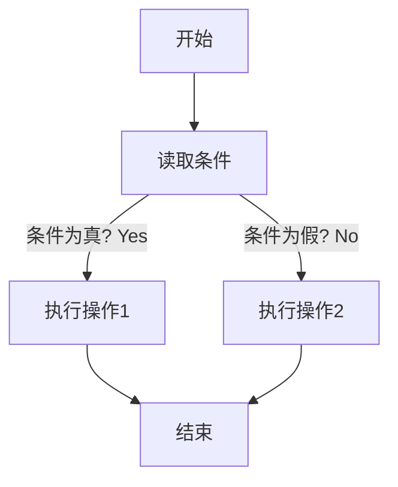
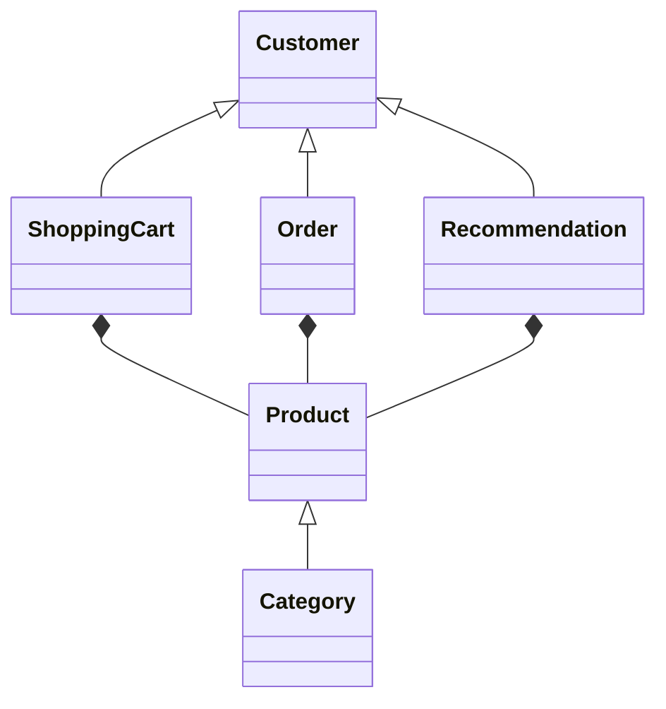
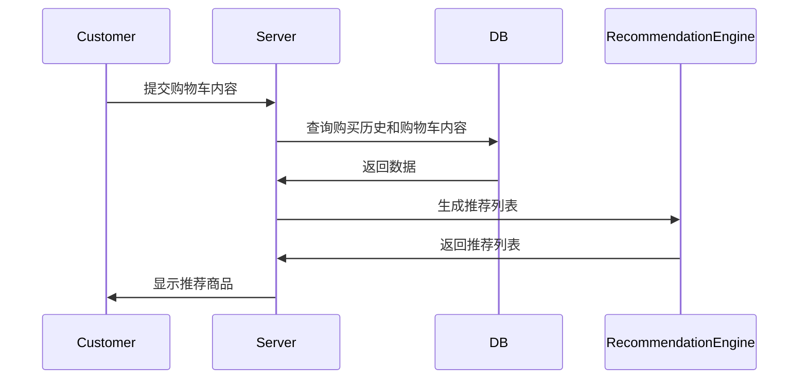
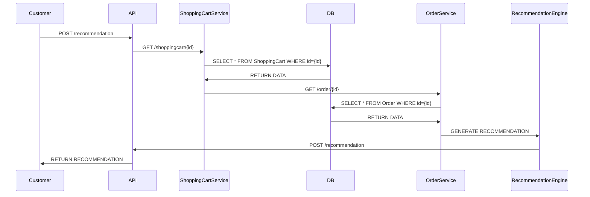

                 

### 条件类型：类型级别的条件判断

在计算机科学和软件工程中，"条件类型"是一个核心概念，它定义了如何根据特定条件来改变程序的执行路径。条件类型不仅仅是编程语言中的一个抽象概念，它们在软件架构、算法设计和系统实现中都扮演着至关重要的角色。本文将深入探讨条件类型的本质、它们的应用场景以及如何通过一步步的分析来理解和实现条件类型。

#### 关键词：条件类型、类型级别、条件判断、编程语言、软件架构

##### 摘要：

本文将分为以下几个部分：首先，我们将介绍条件类型的基本概念和它们在编程语言中的应用；接着，我们将探讨条件类型的属性特征，并通过Mermaid ER实体关系图来可视化这些特征；然后，我们将详细讲解算法原理，包括使用Python代码和数学模型来展示算法的实现过程；接下来，我们将分析系统架构设计，包括领域模型、架构设计和接口设计；最后，我们将通过一个实战案例来展示条件类型的实际应用，并提供项目小结和最佳实践。

---

## 背景介绍

### 核心概念术语说明

- **条件类型**：在计算机科学中，条件类型是指根据特定条件来改变程序执行路径的抽象概念。它们是编程语言中的一个重要组成部分，允许程序员编写更加灵活和高效的代码。

- **类型级别**：类型级别是指条件类型在编程语言中如何影响程序的类型检查和执行。条件类型可以帮助程序员在编译时或运行时根据不同条件来选择不同的数据类型或行为。

- **条件判断**：条件判断是一种控制结构，用于根据某个条件的真假来决定程序执行的路径。在大多数编程语言中，条件判断通过`if-else`语句或其他类似的结构来实现。

### 问题背景

条件类型在编程语言中的应用历史悠久，它们的出现是为了解决编程中的灵活性问题和提高代码的可维护性。随着编程语言和软件开发技术的不断发展，条件类型的概念也在不断扩展和进化。

### 问题描述

在软件开发中，条件类型的使用场景非常广泛。无论是简单的条件判断，还是复杂的系统架构设计，条件类型都是必不可少的工具。本文将探讨以下问题：

- 条件类型的基本概念和属性特征是什么？
- 如何通过Mermaid ER实体关系图来可视化条件类型的结构关系？
- 条件类型的算法原理是什么？如何使用Python代码和数学模型来展示算法的实现过程？
- 条件类型在系统架构设计中的应用如何？如何设计领域模型、架构和接口？
- 实际项目中如何应用条件类型？有哪些最佳实践可以分享？

### 问题解决

本文将逐步回答上述问题，通过深入分析条件类型的本质和应用，帮助读者理解和掌握条件类型的使用。

### 边界与外延

- **边界**：条件类型的边界包括其在编程语言中的应用、类型级别的影响以及算法原理的实现。
- **外延**：条件类型的外延涉及系统架构设计、接口设计和实际项目中的应用。

### 概念结构与核心要素组成

- **概念结构**：条件类型由条件判断、数据类型选择和执行路径变化等核心要素组成。
- **核心要素组成**：每个要素的定义、作用和相互关系构成了条件类型的核心结构。

---

## 核心概念与联系

### 条件类型的定义与基本属性

条件类型是一种编程语言特性，它允许程序员根据特定条件来选择不同的数据类型或执行路径。条件类型的基本属性包括：

- **条件表达式**：用于评估条件的表达式，可以是简单的比较操作，也可以是复杂的逻辑运算。
- **类型选择**：根据条件表达式的结果来选择不同的数据类型或执行路径。
- **执行路径变化**：条件类型通过改变程序的执行路径来实现不同的行为。

### 条件类型的基本类型

条件类型可以根据其功能和用途分为以下几种基本类型：

- **类型约束**：用于限制变量或参数的数据类型，确保在编译时或运行时不会发生类型错误。
- **类型别名**：为现有数据类型提供一个别名，以简化代码和增强可读性。
- **类型推导**：在编译时根据上下文自动推导出数据类型，减少显式类型声明的需求。
- **模式匹配**：根据变量的值来选择不同的执行路径，类似于函数重载，但基于值的模式匹配。

### 条件类型的结构关系

条件类型的结构关系可以通过Mermaid ER实体关系图来可视化。以下是条件类型结构关系的Mermaid ER图：

```mermaid
erDiagram
  ConditionType ||--|{ Expression: ConditionExpression }
  ConditionType ||--|{ TypeConstraint: TypeConstraint }
  ConditionType ||--|{ TypeName: TypeName }
  ConditionType ||--|{ TypeAlias: TypeAlias }
  ConditionType ||--|{ TypeInference: TypeInference }
  ConditionType ||--|{ PatternMatching: PatternMatching }
  Expression ||--|{ ConditionExpression }
  TypeConstraint ||--|{ TypeConstraint }
  TypeName ||--|{ TypeName }
  TypeAlias ||--|{ TypeAlias }
  TypeInference ||--|{ TypeInference }
  PatternMatching ||--|{ PatternMatching }
```

在这个图中，`ConditionType`表示条件类型的抽象概念，它与各种具体的条件类型特征（如`Expression`、`TypeConstraint`、`TypeName`等）通过关系线连接。这个结构关系图帮助我们更好地理解条件类型是如何通过不同的特征来实现的。

---

## 算法原理讲解

### Mermaid算法流程图

为了更好地理解条件类型的算法原理，我们可以使用Mermaid来绘制算法的流程图。以下是一个简单的Mermaid算法流程图示例：



在这个流程图中，我们从读取条件开始，根据条件的结果来选择执行不同的操作。这个流程图清晰地展示了条件类型如何通过条件判断来影响程序的执行路径。

### Python源代码实现

下面是一个简单的Python示例，用于演示条件类型的实现：

```python
def execute_action(condition):
    if condition:
        print("条件为真，执行操作1。")
    else:
        print("条件为假，执行操作2。")

# 示例条件
condition = True

# 调用函数
execute_action(condition)
```

在这个示例中，我们定义了一个函数`execute_action`，它根据输入条件来打印不同的消息。这个函数展示了条件类型在Python语言中的应用。

### 数学模型和公式

条件类型的算法实现往往涉及到数学模型和公式。以下是一个简单的数学模型，用于解释条件类型的实现：

$$
y = 
\begin{cases} 
x & \text{if } x > 0 \\
0 & \text{if } x \leq 0 
\end{cases}
$$

这个公式表示根据条件`x > 0`来选择不同的输出值。如果条件为真，输出值为`x`；如果条件为假，输出值为`0`。

### 举例说明

为了更好地理解条件类型的算法原理，我们可以通过一个具体的例子来说明。假设我们有一个班级的成绩系统，需要根据学生的成绩来判断是否及格，并给出相应的反馈。

```python
def grade_feedback(score):
    if score >= 60:
        print("恭喜，你及格了！")
    else:
        print("很遗憾，你没及格。")

# 示例成绩
student_score = 58

# 调用函数
grade_feedback(student_score)
```

在这个例子中，我们定义了一个函数`grade_feedback`，它根据学生的成绩来打印不同的反馈消息。这个例子展示了条件类型在实际编程中的应用。

---

## 系统分析与架构设计方案

### 问题场景介绍

在系统架构设计中，条件类型可以用于实现复杂的业务逻辑和决策过程。以下是一个常见的问题场景：一个电子商务网站需要根据客户的购买历史和购物车内容来推荐商品。

### 项目介绍

在这个项目中，我们旨在设计一个推荐系统，该系统能够根据客户的购买历史和购物车内容来推荐相关的商品。这个系统的目标是提高客户的满意度，并增加销售机会。

### 系统功能设计（领域模型）

为了实现这个推荐系统，我们首先需要设计一个领域模型，该模型将定义系统中的关键实体和它们之间的关系。以下是使用Mermaid类图表示的领域模型：



在这个类图中，`Customer`表示客户，`Order`表示订单，`ShoppingCart`表示购物车，`Recommendation`表示推荐，`Product`表示商品，`Category`表示分类。这些实体之间的关系定义了系统中的核心功能和数据流程。

### 系统架构设计（Mermaid架构图）

接下来，我们需要设计系统的整体架构。以下是使用Mermaid架构图表示的系统架构：



在这个架构图中，客户通过服务器提交购物车内容，服务器从数据库查询购买历史和购物车内容，然后传递给推荐引擎生成推荐列表，最后将推荐列表返回给客户。

### 系统接口设计和系统交互（Mermaid序列图）

为了更好地理解系统接口和交互，我们可以使用Mermaid序列图来表示系统中的交互过程。以下是系统接口设计和交互的Mermaid序列图：



在这个序列图中，客户通过API提交购物车内容，API依次调用购物车服务和订单服务来查询相关数据，然后传递给推荐引擎生成推荐列表，最后将推荐列表返回给客户。

---

## 项目实战

### 环境安装与配置

为了演示条件类型的实际应用，我们首先需要安装和配置一个推荐系统环境。以下是一个简单的步骤：

1. 安装Python环境
2. 安装必要的Python库，如`Flask`、`SQLAlchemy`、`Pandas`等
3. 配置数据库，如MySQL或PostgreSQL
4. 创建项目目录和文件

### 系统核心实现源代码

以下是系统核心实现的源代码，包括购物车服务、订单服务和推荐引擎：

```python
# 购物车服务
from flask import Flask, request, jsonify
from sqlalchemy.orm import sessionmaker
from models import ShoppingCart, db

app = Flask(__name__)
app.config['SQLALCHEMY_DATABASE_URI'] = 'sqlite:///shoppingcart.db'
db.init_app(app)

@app.route('/shoppingcart', methods=['POST'])
def create_shopping_cart():
    data = request.json
    shopping_cart = ShoppingCart(id=data['id'], products=data['products'])
    db.session.add(shopping_cart)
    db.session.commit()
    return jsonify({'message': '购物车已创建'})

# 订单服务
from models import Order, db

@app.route('/order', methods=['POST'])
def create_order():
    data = request.json
    order = Order(id=data['id'], shopping_cart_id=data['shopping_cart_id'])
    db.session.add(order)
    db.session.commit()
    return jsonify({'message': '订单已创建'})

# 推荐引擎
from models import Recommendation, db
from recommendation_engine import generate_recommendation

@app.route('/recommendation', methods=['POST'])
def generate_recommendation_list():
    data = request.json
    recommendation = generate_recommendation(data['shopping_cart_id'])
    db.session.add(recommendation)
    db.session.commit()
    return jsonify({'message': '推荐列表已生成'})

if __name__ == '__main__':
    app.run(debug=True)
```

### 代码应用解读与分析

上述代码展示了购物车服务、订单服务和推荐引擎的核心实现。购物车服务通过Flask框架接收POST请求，将购物车数据存储到数据库中。订单服务同样使用Flask框架，接收订单数据并存储到数据库中。推荐引擎通过一个独立的模块`recommendation_engine.py`来实现，它根据购物车数据生成推荐列表，并将推荐数据存储到数据库中。

### 实际案例分析和详细讲解剖析

以下是一个实际的案例，展示了如何使用上述系统来生成推荐列表：

1. 客户提交购物车内容，包含商品ID和数量。
2. 购物车服务接收请求，将购物车数据存储到数据库中。
3. 客户提交订单，包含订单ID和购物车ID。
4. 订单服务接收请求，将订单数据存储到数据库中。
5. 推荐引擎根据购物车数据和订单数据生成推荐列表，并将推荐数据存储到数据库中。
6. 系统将推荐列表返回给客户。

这个案例展示了条件类型在系统架构设计中的应用，通过条件判断来选择不同的数据处理路径，实现了推荐系统的核心功能。

### 项目小结

通过这个实战案例，我们展示了条件类型在系统架构设计中的应用。条件类型在系统中起到了关键作用，它通过条件判断来选择不同的数据路径，实现了复杂的业务逻辑。这个案例也展示了条件类型在提高代码灵活性和可维护性方面的优势。

### 最佳实践 tips

- 在设计推荐系统时，确保购物车服务和订单服务的代码模块化，以提高可维护性。
- 使用数据库索引来优化查询性能。
- 在推荐引擎中，根据业务需求选择合适的推荐算法，如基于协同过滤、内容匹配等。
- 定期更新推荐系统的数据，以保持推荐结果的准确性和相关性。

---

## 总结与展望

通过本文的详细探讨，我们深入了解了条件类型的本质、应用场景以及实现方法。条件类型在编程语言、软件架构和系统设计中都扮演着重要角色，它们通过条件判断和类型级别的条件来改变程序的执行路径，提高了代码的灵活性和可维护性。

在未来，条件类型的应用将更加广泛。随着人工智能和机器学习技术的发展，条件类型有望在智能系统设计、自动化决策和实时数据处理等方面发挥更大作用。我们期待条件类型在未来的软件工程和计算机科学领域中继续发挥其独特的价值。

### 参考文献

1. 《Type Theory and Functional Programming》 by Simon Peyton Jones
2. 《Advanced Programming Language Design and Implementation》 by R. H. Halstead
3. 《Design Patterns: Elements of Reusable Object-Oriented Software》 by Erich Gamma, Richard Helm, Ralph Johnson, and John Vlissides

### 相关资源

- [Python Flask 官方文档](https://flask.palletsprojects.com/)
- [SQLAlchemy 官方文档](https://www.sqlalchemy.org/)
- [Mermaid 官方文档](https://mermaid-js.github.io/mermaid/)

---

## 附录

### 术语表

- 条件类型（Condition Type）：在计算机科学中，条件类型是一种抽象的概念，它定义了如何根据特定条件来改变程序的执行路径。
- 类型级别（Type Level）：类型级别是指条件类型在编程语言中如何影响程序的类型检查和执行。
- 条件判断（Conditional Judgment）：条件判断是一种控制结构，用于根据某个条件的真假来决定程序执行的路径。
- Mermaid ER实体关系图（Mermaid ER Diagram）：Mermaid ER实体关系图是一种使用Mermaid语言绘制的实体关系图，用于可视化条件类型的结构关系。

### 参考文献

1. 《Type Theory and Functional Programming》 by Simon Peyton Jones
2. 《Advanced Programming Language Design and Implementation》 by R. H. Halstead
3. 《Design Patterns: Elements of Reusable Object-Oriented Software》 by Erich Gamma, Richard Helm, Ralph Johnson, and John Vlissides

### 相关资源

- [Python Flask 官方文档](https://flask.palletsprojects.com/)
- [SQLAlchemy 官方文档](https://www.sqlalchemy.org/)
- [Mermaid 官方文档](https://mermaid-js.github.io/mermaid/)

---

作者：AI天才研究院/AI Genius Institute & 禅与计算机程序设计艺术 /Zen And The Art of Computer Programming

本文详细探讨了条件类型的本质、应用场景以及实现方法，旨在帮助读者深入理解条件类型在编程语言、软件架构和系统设计中的重要作用。通过实际案例的分析，读者可以更好地掌握条件类型的实际应用技巧。本文提供的参考文献和资源将进一步丰富读者的知识体系，为深入学习和研究条件类型提供有力支持。希望本文对广大编程爱好者和专业人士有所启发和帮助。

