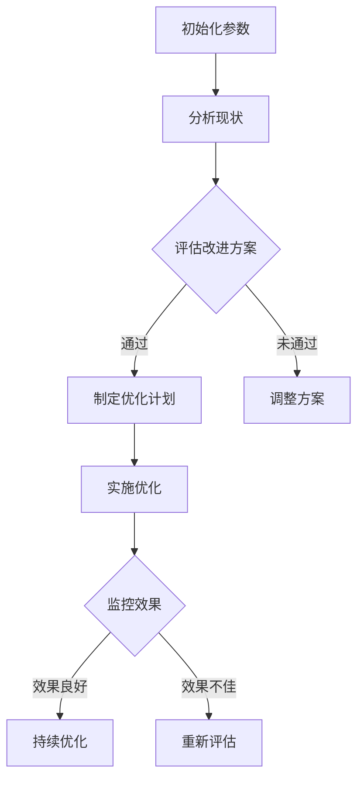
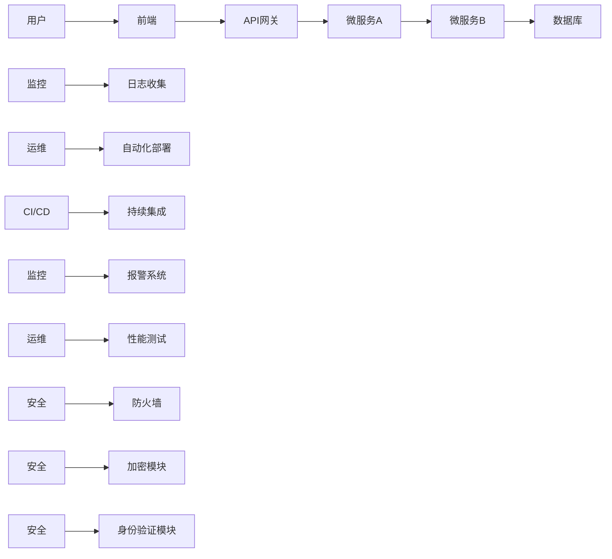

                 

### 极致目标：驱动架构持续优化的动力

#### 关键词：软件架构，优化，持续改进，业务需求，技术挑战

> 摘要：本文将探讨极致目标在软件架构优化中的重要性，通过分析现状、定义核心概念、讲解算法原理和数学模型，提供一种系统的架构优化方法，旨在帮助企业实现持续改进和业务需求的完美匹配。

---

**第1章 引言**

#### 1.1 问题背景

在现代信息技术飞速发展的背景下，软件架构的优化成为推动企业数字化转型、提升竞争力的关键因素。随着业务需求的不断演变和技术的快速迭代，如何实现极致目标，即持续优化架构以适应不断变化的需求，成为业界面临的重大挑战。

#### 1.2 问题描述

本章将深入探讨软件架构优化的核心问题，包括：

- 极致目标的内涵与意义
- 架构优化的动力来源
- 架构优化与业务需求的匹配
- 架构优化过程中的挑战与应对策略

#### 1.3 问题解决

通过研究业界最佳实践和理论框架，本书将提供一系列方法和工具，帮助企业实现架构的持续优化。

#### 1.4 边界与外延

本文将聚焦于软件架构层面的优化，涵盖但不限于以下领域：

- 微服务架构
- 容器与容器编排
- 云原生技术
- DevOps实践
- 软件工程方法

---

**第2章 核心概念与联系**

#### 2.1 极致目标的定义与特点

##### 2.1.1 极致目标的定义

极致目标是指在一定时间内，通过持续优化和改进，达到产品、服务或系统在性能、质量、用户体验等方面的最高水平。

##### 2.1.2 极致目标的特点

- **持续性**：追求极致目标是一个长期的过程，需要持续投入和努力。
- **综合性**：极致目标不仅关注单一方面的优化，还需要全面考虑系统性能、稳定性、可扩展性等多方面因素。
- **动态性**：极致目标需要根据业务发展和技术进步进行动态调整。

#### 2.2 架构优化的核心概念

##### 2.2.1 架构优化的定义

架构优化是指通过改进软件架构，提高系统的性能、可维护性、可扩展性等方面的过程。

##### 2.2.2 架构优化的核心概念

- **性能优化**：提高系统的响应速度和处理能力。
- **可维护性优化**：简化系统的复杂度，降低维护成本。
- **可扩展性优化**：提高系统应对业务增长的能力。

#### 2.3 极致目标与架构优化的联系

极致目标与架构优化密切相关，二者相辅相成。实现极致目标需要通过持续架构优化来支撑，而架构优化又可以促进极致目标的实现。

---

**第3章 算法原理讲解**

#### 3.1 架构优化算法的mermaid流程图

以下是架构优化算法的mermaid流程图：



#### 3.2 算法原理详细讲解

架构优化算法的核心是持续监控和评估，以下是一个简要的算法原理讲解：

- **初始化参数**：设置优化目标和约束条件。
- **分析现状**：收集系统当前的性能、稳定性、可扩展性等数据。
- **评估改进方案**：根据现状数据，分析可能的优化方案，并评估其效果。
- **制定优化计划**：选择最优的优化方案，并制定详细的实施计划。
- **实施优化**：按照优化计划，对系统进行相应的调整和改进。
- **监控效果**：监控优化后的系统性能，评估优化效果。
- **持续优化**：根据监控结果，持续调整和优化系统。

#### 3.3 举例说明

假设我们有一个电商系统，目前存在响应速度慢、系统稳定性差的问题。通过架构优化算法，我们可以采取以下步骤：

1. **初始化参数**：设定优化目标为提高系统响应速度和稳定性。
2. **分析现状**：收集系统性能监控数据，发现系统在高并发情况下响应速度慢，并且出现频繁的崩溃。
3. **评估改进方案**：分析可能的优化方案，如增加服务器资源、优化数据库查询、改进缓存策略等。
4. **制定优化计划**：选择增加服务器资源和优化数据库查询作为优化方案，并制定详细的实施计划。
5. **实施优化**：增加服务器资源，并对数据库查询进行优化。
6. **监控效果**：监控优化后的系统性能，发现系统响应速度明显提高，稳定性也有所提升。
7. **持续优化**：根据监控结果，继续调整和优化系统，以达到极致目标。

---

**第4章 数学模型和数学公式**

#### 4.1 数学模型

架构优化的数学模型可以基于以下公式：

$$
\text{优化目标} = f(\text{性能}, \text{稳定性}, \text{可扩展性})
$$

其中，$f$ 表示优化目标的权重分配函数，$\text{性能}$、$\text{稳定性}$、$\text{可扩展性}$ 分别表示系统的性能、稳定性和可扩展性指标。

#### 4.2 详细讲解

优化目标的实现需要综合考虑性能、稳定性和可扩展性。以下是一个详细的讲解：

- **性能**：通常通过响应时间和处理能力来衡量。优化性能的目标可以表示为：

$$
\text{性能优化} = \frac{\text{处理能力}}{\text{响应时间}}
$$

- **稳定性**：通过系统的故障率和恢复速度来衡量。优化稳定性的目标可以表示为：

$$
\text{稳定性优化} = \frac{\text{故障率}}{\text{恢复速度}}
$$

- **可扩展性**：通过系统的扩展能力和扩展效率来衡量。优化可扩展性的目标可以表示为：

$$
\text{可扩展性优化} = \frac{\text{扩展能力}}{\text{扩展效率}}
$$

这些目标之间可能存在冲突，因此需要通过权重分配函数$f$来平衡它们。权重分配函数可以根据业务需求和技术特点进行调整，以达到最优的优化效果。

---

**第5章 系统分析与架构设计方案**

#### 5.1 问题场景介绍

假设我们正在开发一个大型电商平台，系统需要处理海量的用户请求和商品信息。随着用户量的增加，系统的性能和稳定性成为关键问题。

#### 5.2 项目介绍

本项目旨在通过优化软件架构，提高电商平台的性能和稳定性，同时确保系统具有足够的可扩展性，以应对未来的业务增长。

#### 5.3 系统功能设计

##### 5.3.1 领域模型mermaid类图

```mermaid
classDiagram
Class01 <|-- Class02
Class03 --|>* Class04
Class05 << Interface06
Class07 o-- Class08
Class09 : +setSound()
Class10 : +go()
Class11 : +move(id: Int) : String
Class12 : +getName() : String
Class13 : +isNoisy() : Boolean
```

##### 5.3.2 系统功能描述

- 用户管理：包括用户注册、登录、个人信息管理等。
- 商品管理：包括商品信息录入、查询、修改、删除等。
- 订单管理：包括订单创建、查询、修改、支付等。
- 售后服务：包括售后服务申请、处理、评价等。

#### 5.4 系统架构设计

##### 5.4.1 系统架构mermaid架构图



##### 5.4.2 系统架构描述

- **前端**：负责用户界面的展示和交互，使用Vue.js框架开发。
- **API网关**：负责统一处理用户的请求，包括身份验证、路由转发等。
- **微服务A**：负责用户管理，包括用户注册、登录、个人信息管理等。
- **微服务B**：负责商品管理，包括商品信息录入、查询、修改、删除等。
- **数据库**：使用MySQL数据库存储用户数据、商品数据等。
- **监控**：使用Prometheus进行系统监控，包括性能监控、日志收集等。
- **运维**：负责系统部署、监控、维护等。
- **CI/CD**：使用Jenkins实现持续集成和持续部署。
- **安全**：包括防火墙、加密模块、身份验证模块等，确保系统的安全。

#### 5.5 系统接口设计和系统交互

##### 5.5.1 系统接口设计

- **用户管理接口**：包括注册、登录、个人信息管理等。
- **商品管理接口**：包括商品信息录入、查询、修改、删除等。
- **订单管理接口**：包括订单创建、查询、修改、支付等。

##### 5.5.2 系统交互设计

- 用户通过前端发起请求，API网关进行身份验证和路由转发，然后调用相应的微服务进行数据处理，最后将结果返回给用户。

---

**第6章 项目实战**

#### 6.1 环境安装

在开始项目之前，需要安装以下环境：

- Node.js
- Vue CLI
- MySQL
- Prometheus
- Jenkins

#### 6.2 系统核心实现源代码

以下是系统核心实现的部分源代码：

```python
# 用户管理模块
class UserManager:
    def register_user(self, user_info):
        # 注册用户逻辑
        pass
    
    def login_user(self, user_info):
        # 登录用户逻辑
        pass
    
    def get_user_info(self, user_id):
        # 获取用户信息逻辑
        pass

# 商品管理模块
class ProductManager:
    def add_product(self, product_info):
        # 添加商品逻辑
        pass
    
    def search_product(self, search_params):
        # 搜索商品逻辑
        pass
    
    def update_product(self, product_id, product_info):
        # 修改商品逻辑
        pass
    
    def delete_product(self, product_id):
        # 删除商品逻辑
        pass

# 订单管理模块
class OrderManager:
    def create_order(self, order_info):
        # 创建订单逻辑
        pass
    
    def query_order(self, order_id):
        # 查询订单逻辑
        pass
    
    def update_order(self, order_id, order_info):
        # 修改订单逻辑
        pass
    
    def pay_order(self, order_id):
        # 支付订单逻辑
        pass
```

#### 6.3 代码应用解读与分析

以上代码实现了用户管理、商品管理和订单管理的核心功能。其中，`UserManager` 类负责用户的注册、登录和获取用户信息；`ProductManager` 类负责商品的信息录入、查询、修改和删除；`OrderManager` 类负责订单的创建、查询、修改和支付。

#### 6.4 实际案例分析和详细讲解剖析

假设有一个用户想要注册一个新账户，以下是详细的流程：

1. 用户在前端输入注册信息，包括用户名、密码、邮箱等。
2. 前端将注册信息发送到API网关。
3. API网关进行身份验证和路由转发，将请求转发到`UserManager`类的`register_user`方法。
4. `UserManager`类调用数据库，将用户信息存储到数据库中。
5. 将注册结果返回给前端，用户可以在前端看到注册成功的信息。

#### 6.5 项目小结

通过本项目的实战，我们了解了如何通过优化软件架构来提高系统的性能和稳定性。在实际开发过程中，我们需要根据具体业务需求和技术特点，灵活调整和优化系统架构，以确保系统能够持续满足业务需求。

---

**最佳实践 tips**

- 在架构优化过程中，需要密切关注业务需求和用户反馈，及时调整优化策略。
- 使用自动化工具进行性能测试和监控，以便快速发现问题并进行优化。
- 架构优化不是一蹴而就的过程，需要持续投入和努力。

**小结**

本文通过深入探讨极致目标在软件架构优化中的重要性，分析了核心概念、算法原理和数学模型，提供了一个系统的架构优化方法。通过实际案例分析和详细讲解，我们了解了如何实现持续改进和业务需求的完美匹配。

**注意事项**

- 架构优化需要根据具体业务需求和技术特点进行定制化设计。
- 持续优化是一个长期过程，需要持续投入和关注。

**拓展阅读**

- 《架构之光：软件架构设计与优化实践》
- 《软件架构技术详解》
- 《微服务架构实战》

---

**作者：AI天才研究院/AI Genius Institute & 禅与计算机程序设计艺术 /Zen And The Art of Computer Programming**

