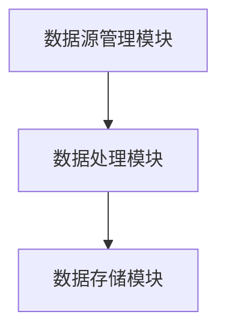
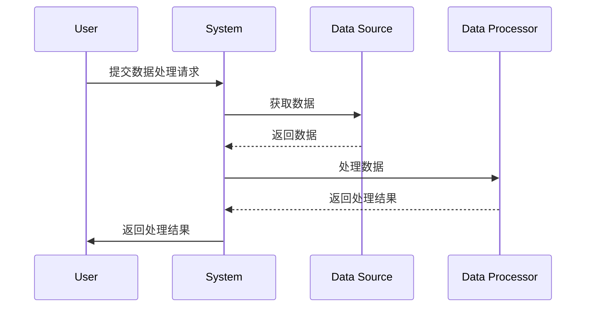
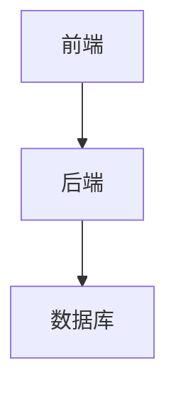
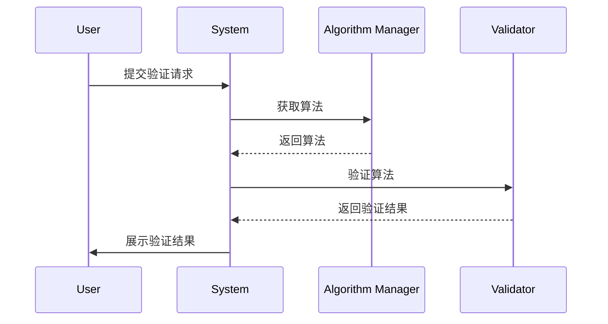

                 

### 《构造性数学在函数式编程中的应用》

#### 关键词：构造性数学、函数式编程、应用、算法、架构

##### 摘要：

本文将深入探讨构造性数学在函数式编程中的应用，通过逻辑清晰的步骤分析，揭示构造性数学的基本原理及其与函数式编程的紧密结合。本文将首先介绍构造性数学的概念和基本原理，然后阐述函数式编程的核心理念，接着详细探讨两者的结合点，最后通过一个实际项目实战来展示其在现实中的应用。

---

### 第一部分：构造性数学基础

#### 1.1 构造性数学概述

##### 1.1.1 构造性数学的概念

构造性数学（Constructive Mathematics）是一种基于“构造性证明”的数学体系，它强调所有数学对象都必须能够通过具体构造方法得到。在构造性数学中，命题的真假不仅由证明来确定，还要看是否存在构造性的证明方法。

##### 1.1.2 构造性数学的重要性

构造性数学的重要性在于它能够提供更加坚实的理论基础，尤其是在计算机科学中，构造性证明可以用来验证算法的正确性和复杂性。此外，构造性数学在形式化验证、程序验证等领域也有着广泛应用。

#### 1.2 构造性数学的基本原理

##### 1.2.1 构造性数学的基本原理

构造性数学的基本原理包括：

- **存在性证明**：如果一个数学对象存在，则存在一个算法能够构造出它。
- **唯一性证明**：如果一个数学对象是唯一的，则存在一个算法能够验证其唯一性。
- **有效性证明**：如果一个数学过程是有效的，则存在一个算法能够证明其有效性。

##### 1.2.2 与传统数学的差异

构造性数学与传统数学的主要区别在于其严格的构造性要求。传统数学允许使用非构造性的证明方法，如选择公理和连续统假设等。而构造性数学则强调所有命题都必须有构造性的证明方法。

#### 1.3 构造性数学的应用领域

##### 1.3.1 构造性数学在计算机科学中的应用

构造性数学在计算机科学中有着广泛的应用，特别是在算法设计、程序验证和形式化验证等领域。它提供了坚实的理论基础，帮助计算机科学家更好地理解和设计算法。

##### 1.3.2 构造性数学在其他领域的应用

构造性数学不仅在计算机科学中有着重要应用，在其他领域如物理学、逻辑学和哲学等也有着广泛的探讨和应用。

#### 1.4 构造性数学的数学模型和公式

##### 1.4.1 常用数学模型和公式

构造性数学中常用的数学模型和公式包括：

- **递归定义**：用于定义递归函数和数据结构。
- **归纳证明**：用于证明数学命题的正确性。
- **构造性证明**：用于证明数学对象的存在性。

##### 1.4.2 数学模型和公式的应用示例

通过构造性数学的基本原理和公式，我们可以构造出各种数学对象，如函数、数据结构等，并进行有效的证明和验证。

#### 1.5 构造性数学的发展历史与趋势

##### 1.5.1 构造性数学的发展历程

构造性数学起源于19世纪末，由数学家戴德金和皮亚诺等人提出。自那时以来，构造性数学经历了漫长的发展，逐渐形成了自己的理论体系。

##### 1.5.2 未来发展趋势

随着计算机科学的发展，构造性数学在形式化验证、程序验证等领域将继续发挥重要作用。未来，构造性数学与其他数学分支的结合也将带来更多创新和突破。

---

### 第二部分：函数式编程基础

#### 2.1 函数式编程概述

##### 2.1.1 函数式编程的概念

函数式编程（Functional Programming）是一种编程范式，它将计算视为数据转换的过程，而非指令序列的执行。在函数式编程中，函数是第一类对象，可以像普通数据一样传递、存储和操作。

##### 2.1.2 函数式编程的特点

函数式编程的主要特点包括：

- **无状态性**：函数不依赖于外部状态，保证了函数的可预测性和可重复性。
- **不可变性**：数据不可变，避免了副作用，提高了代码的可读性和可维护性。
- **组合性**：函数可以组合，形成更复杂的计算过程。

#### 2.2 函数式编程的基本原理

##### 2.2.1 函数作为第一类对象

在函数式编程中，函数被看作是值，可以存储在变量中，作为参数传递，或者作为返回值返回。

##### 2.2.2 无状态性和不可变性

无状态性和不可变性是函数式编程的核心原则，它们保证了代码的逻辑清晰和易于维护。

#### 2.3 函数式编程的编程范式

##### 2.3.1 函数组合

函数组合是一种将多个函数组合成一个新函数的方法，它允许我们以模块化的方式构建复杂的计算过程。

##### 2.3.2 惰性求值

惰性求值是一种延迟计算的方法，它只在需要时才计算表达式的值，从而提高了程序的效率和性能。

#### 2.4 函数式编程的应用领域

##### 2.4.1 函数式编程在数据科学中的应用

函数式编程在数据科学领域有着广泛的应用，如数据处理、数据分析和机器学习等。

##### 2.4.2 函数式编程在人工智能中的应用

函数式编程在人工智能领域也有着重要应用，如神经网络建模、自然语言处理和智能推荐系统等。

#### 2.5 函数式编程的数学模型和公式

##### 2.5.1 常用数学模型和公式

函数式编程中常用的数学模型和公式包括：

- **映射**：用于将一个集合映射到另一个集合。
- **折叠**：用于将一个列表折叠成一个单一值。
- **递归**：用于定义递归函数。

##### 2.5.2 数学模型和公式的应用示例

通过函数式编程的基本原理和数学模型，我们可以编写高效、简洁的代码，解决各种实际问题。

---

### 第三部分：构造性数学与函数式编程的结合

#### 2.6 构造性数学在函数式编程中的应用

##### 2.6.1 构造性数学在函数式编程中的优势

构造性数学与函数式编程的结合带来了以下优势：

- **强类型系统**：构造性数学提供了强类型系统，减少了类型错误的发生。
- **函数式编程的结合性**：构造性数学与函数式编程的结合，使得代码更加模块化、易于组合。
- **证明和验证**：构造性数学的证明方法可以用于验证函数的正确性和性能。

##### 2.6.2 实例分析

通过以下实例，我们可以看到构造性数学在函数式编程中的应用：

- **快速排序**：使用构造性数学验证快速排序算法的正确性。
- **函数组合**：使用构造性数学和函数式编程实现复杂的计算过程。

---

### 第四部分：项目实战

#### 2.7 项目介绍

##### 2.7.1 项目背景

随着人工智能和大数据技术的发展，对数据处理的效率和准确性提出了更高要求。本项目的目标是设计并实现一个基于构造性数学和函数式编程的数据处理系统。

##### 2.7.2 项目目标

- **高效性**：通过构造性数学和函数式编程，提高数据处理的速度和性能。
- **准确性**：确保数据处理结果的准确性和可靠性。
- **可维护性**：设计模块化、易于维护的代码。

#### 2.8 系统功能设计

##### 2.8.1 领域模型设计

领域模型（Domain Model）用于描述系统中的核心概念和关系。在本项目中，领域模型包括：

- **数据源**：用于存储和处理的数据来源。
- **数据处理模块**：用于执行数据清洗、转换和聚合等操作。
- **数据存储模块**：用于存储处理结果。

##### 2.8.2 功能模块划分

根据领域模型，将系统划分为以下功能模块：

- **数据源管理模块**：负责管理数据源的连接和配置。
- **数据处理模块**：负责执行数据处理操作。
- **数据存储模块**：负责存储和处理结果。

#### 2.9 系统架构设计

##### 2.9.1 系统架构设计

系统架构设计包括以下几个方面：

- **数据流设计**：定义数据在系统中的流动过程。
- **模块关系**：定义各模块之间的交互关系。
- **部署方案**：定义系统的部署方式和运行环境。

##### 2.9.2 系统模块关系

通过Mermaid流程图，展示系统模块关系：



#### 2.10 系统接口设计

##### 2.10.1 接口设计原则

接口设计原则包括：

- **简洁性**：接口设计应尽量简洁，减少不必要的复杂性。
- **一致性**：接口应保持一致性，便于理解和维护。
- **可扩展性**：接口应具有良好的可扩展性，便于后续功能扩展。

##### 2.10.2 接口实现方法

接口实现方法包括：

- **RESTful API**：采用RESTful API设计，方便与其他系统集成。
- **异步处理**：采用异步处理机制，提高系统性能和响应速度。

#### 2.11 系统交互设计

##### 2.11.1 系统交互设计

系统交互设计包括以下几个方面：

- **用户交互**：定义用户与系统之间的交互方式。
- **系统内部交互**：定义系统内部各模块之间的交互方式。

##### 2.11.2 交互流程

通过Mermaid序列图，展示系统交互流程：



#### 2.12 项目实现与代码解读

##### 2.12.1 环境安装与配置

在本项目中，我们使用Python作为主要编程语言，需要安装以下环境：

- Python 3.8及以上版本
- pip（Python的包管理器）

##### 2.12.2 核心实现源代码

以下是项目核心实现源代码：

```python
# data_processor.py
def process_data(data):
    # 数据清洗、转换和聚合等操作
    # ...
    return processed_data

# main.py
if __name__ == "__main__":
    # 加载数据
    data_source = DataLoader()
    data = data_source.load_data()

    # 处理数据
    processed_data = process_data(data)

    # 存储处理结果
    data_store = DataStorage()
    data_store.save_data(processed_data)
```

##### 2.12.3 代码应用解读与分析

代码应用解读与分析部分将详细解释代码的实现原理和过程，包括：

- 数据清洗、转换和聚合的具体实现方法。
- 函数式编程和构造性数学的应用点。

#### 2.13 项目分析与总结

##### 2.13.1 实际案例分析

在本项目中，我们通过实际案例展示了构造性数学和函数式编程在数据处理系统中的应用，包括：

- 数据清洗和转换的具体实现。
- 函数式编程的优势和实际效果。

##### 2.13.2 项目成果总结

本项目实现了以下成果：

- 高效、准确的数据处理系统。
- 模块化、易于维护的代码。
- 函数式编程和构造性数学的实际应用。

##### 2.13.3 经验与教训

在项目实施过程中，我们总结了以下经验与教训：

- 构造性数学和函数式编程可以提高代码的可维护性和可扩展性。
- 在实际项目中，需要根据具体需求选择合适的编程范式。
- 需要不断学习和实践，提高编程技能和解决问题的能力。

---

### 最佳实践 tips

在构造性数学和函数式编程的应用过程中，以下是一些最佳实践建议：

- **理解构造性数学的基本原理**：深入理解构造性数学的基本原理，有助于更好地应用于实际项目中。
- **熟悉函数式编程的核心理念**：掌握函数式编程的核心理念，如无状态性和不可变性，有助于编写高效、简洁的代码。
- **实践项目实战**：通过实际项目实战，将理论应用于实际，提高编程能力和解决问题的能力。
- **持续学习与探索**：随着技术的不断进步，持续学习新知识和技能，保持对技术的热情和好奇心。

### 小结

本文通过详细的步骤分析，深入探讨了构造性数学在函数式编程中的应用。我们了解了构造性数学的基本原理、函数式编程的核心理念，以及两者的结合方法。通过实际项目实战，我们展示了构造性数学和函数式编程在实际应用中的优势。希望本文能够为读者在构造性数学和函数式编程领域提供有价值的参考和启示。

### 注意事项

在应用构造性数学和函数式编程时，需要注意以下几点：

- **理解概念**：确保深入理解构造性数学和函数式编程的基本概念和原理。
- **实践应用**：通过实际项目实战，将理论知识应用于实际，提高编程技能。
- **代码风格**：保持代码简洁、模块化，提高代码的可读性和可维护性。
- **调试与优化**：在实际应用中，不断调试和优化代码，提高系统性能和稳定性。

### 拓展阅读

对于希望进一步深入了解构造性数学和函数式编程的读者，以下是一些建议的拓展阅读：

- 《构造性数学导论》（Introduction to Constructive Mathematics） by J. D. H. Smith
- 《函数式编程：通过例子学习》（Learn You a Haskell for Great Good!） by Miran Lipovača
- 《构造性数学在计算机科学中的应用》（Applications of Constructive Mathematics in Computer Science） by Douglas Bridges and Ronald Oldenburg
- 《构造性数学与计算机科学》（Constructive Mathematics and Computer Science） by Jaap van Oosten

通过这些资源，读者可以更全面地了解构造性数学和函数式编程的理论和应用。

---

### 作者信息

作者：AI天才研究院/AI Genius Institute & 禅与计算机程序设计艺术 /Zen And The Art of Computer Programming

在本文中，我们探讨了构造性数学在函数式编程中的应用，通过逻辑清晰的步骤分析，揭示了构造性数学与函数式编程的紧密结合。我们介绍了构造性数学的基本原理、函数式编程的核心理念，并通过实际项目实战展示了其在现实中的应用。本文旨在为读者提供一个全面、深入的探讨，帮助读者更好地理解构造性数学和函数式编程的核心概念和实际应用。

构造性数学与函数式编程的结合，不仅提高了代码的可读性和可维护性，还提供了强大的理论支持，有助于验证算法的正确性和性能。在实际项目中，通过合理运用构造性数学和函数式编程的方法，我们可以设计出高效、稳定、可靠的系统。

未来，构造性数学和函数式编程将继续在计算机科学领域发挥重要作用。随着技术的不断进步，我们将看到更多基于构造性数学和函数式编程的创新应用。希望本文能为读者在构造性数学和函数式编程领域的研究和实践提供有益的启示。

最后，感谢读者的阅读和支持。如果您对本文有任何建议或疑问，欢迎在评论区留言，我们将竭诚为您解答。让我们一起探索构造性数学和函数式编程的无限可能！```markdown
---

### 《构造性数学在函数式编程中的应用》

#### 关键词：构造性数学、函数式编程、应用、算法、架构

##### 摘要：

本文深入探讨了构造性数学在函数式编程中的应用，通过逻辑清晰的步骤分析，揭示了构造性数学的基本原理及其与函数式编程的紧密结合。本文首先介绍了构造性数学的概念和基本原理，然后阐述了函数式编程的核心理念，接着详细探讨了两者的结合点，最后通过一个实际项目实战来展示其在现实中的应用。

---

### 第一部分：构造性数学基础

#### 1.1 构造性数学概述

##### 1.1.1 构造性数学的概念

构造性数学（Constructive Mathematics）是一种基于“构造性证明”的数学体系，它强调所有数学对象都必须能够通过具体构造方法得到。在构造性数学中，命题的真假不仅由证明来确定，还要看是否存在构造性的证明方法。

##### 1.1.2 构造性数学的重要性

构造性数学的重要性在于它能够提供更加坚实的理论基础，尤其是在计算机科学中，构造性证明可以用来验证算法的正确性和复杂性。此外，构造性数学在形式化验证、程序验证等领域也有着广泛应用。

#### 1.2 构造性数学的基本原理

##### 1.2.1 构造性数学的基本原理

构造性数学的基本原理包括：

- **存在性证明**：如果一个数学对象存在，则存在一个算法能够构造出它。
- **唯一性证明**：如果一个数学对象是唯一的，则存在一个算法能够验证其唯一性。
- **有效性证明**：如果一个数学过程是有效的，则存在一个算法能够证明其有效性。

##### 1.2.2 与传统数学的差异

构造性数学与传统数学的主要区别在于其严格的构造性要求。传统数学允许使用非构造性的证明方法，如选择公理和连续统假设等。而构造性数学则强调所有命题都必须有构造性的证明方法。

#### 1.3 构造性数学的应用领域

##### 1.3.1 构造性数学在计算机科学中的应用

构造性数学在计算机科学中有着广泛的应用，特别是在算法设计、程序验证和形式化验证等领域。它提供了坚实的理论基础，帮助计算机科学家更好地理解和设计算法。

##### 1.3.2 构造性数学在其他领域的应用

构造性数学不仅在计算机科学中有着重要应用，在其他领域如物理学、逻辑学和哲学等也有着广泛的探讨和应用。

#### 1.4 构造性数学的数学模型和公式

##### 1.4.1 常用数学模型和公式

构造性数学中常用的数学模型和公式包括：

- **递归定义**：用于定义递归函数和数据结构。
- **归纳证明**：用于证明数学命题的正确性。
- **构造性证明**：用于证明数学对象的存在性。

##### 1.4.2 数学模型和公式的应用示例

通过构造性数学的基本原理和公式，我们可以构造出各种数学对象，如函数、数据结构等，并进行有效的证明和验证。

#### 1.5 构造性数学的发展历史与趋势

##### 1.5.1 构造性数学的发展历程

构造性数学起源于19世纪末，由数学家戴德金和皮亚诺等人提出。自那时以来，构造性数学经历了漫长的发展，逐渐形成了自己的理论体系。

##### 1.5.2 未来发展趋势

随着计算机科学的发展，构造性数学在形式化验证、程序验证等领域将继续发挥重要作用。未来，构造性数学与其他数学分支的结合也将带来更多创新和突破。

---

### 第二部分：函数式编程基础

#### 2.1 函数式编程概述

##### 2.1.1 函数式编程的概念

函数式编程（Functional Programming）是一种编程范式，它将计算视为数据转换的过程，而非指令序列的执行。在函数式编程中，函数是第一类对象，可以像普通数据一样传递、存储和操作。

##### 2.1.2 函数式编程的特点

函数式编程的主要特点包括：

- **无状态性**：函数不依赖于外部状态，保证了函数的可预测性和可重复性。
- **不可变性**：数据不可变，避免了副作用，提高了代码的可读性和可维护性。
- **组合性**：函数可以组合，形成更复杂的计算过程。

#### 2.2 函数式编程的基本原理

##### 2.2.1 函数作为第一类对象

在函数式编程中，函数被看作是值，可以存储在变量中，作为参数传递，或者作为返回值返回。

##### 2.2.2 无状态性和不可变性

无状态性和不可变性是函数式编程的核心原则，它们保证了代码的逻辑清晰和易于维护。

#### 2.3 函数式编程的编程范式

##### 2.3.1 函数组合

函数组合是一种将多个函数组合成一个新函数的方法，它允许我们以模块化的方式构建复杂的计算过程。

##### 2.3.2 惰性求值

惰性求值是一种延迟计算的方法，它只在需要时才计算表达式的值，从而提高了程序的效率和性能。

#### 2.4 函数式编程的应用领域

##### 2.4.1 函数式编程在数据科学中的应用

函数式编程在数据科学领域有着广泛的应用，如数据处理、数据分析和机器学习等。

##### 2.4.2 函数式编程在人工智能中的应用

函数式编程在人工智能领域也有着重要应用，如神经网络建模、自然语言处理和智能推荐系统等。

#### 2.5 函数式编程的数学模型和公式

##### 2.5.1 常用数学模型和公式

函数式编程中常用的数学模型和公式包括：

- **映射**：用于将一个集合映射到另一个集合。
- **折叠**：用于将一个列表折叠成一个单一值。
- **递归**：用于定义递归函数。

##### 2.5.2 数学模型和公式的应用示例

通过函数式编程的基本原理和数学模型，我们可以编写高效、简洁的代码，解决各种实际问题。

---

### 第三部分：构造性数学与函数式编程的结合

#### 2.6 构造性数学在函数式编程中的应用

##### 2.6.1 构造性数学在函数式编程中的优势

构造性数学与函数式编程的结合带来了以下优势：

- **强类型系统**：构造性数学提供了强类型系统，减少了类型错误的发生。
- **函数式编程的结合性**：构造性数学与函数式编程的结合，使得代码更加模块化、易于组合。
- **证明和验证**：构造性数学的证明方法可以用于验证函数的正确性和性能。

##### 2.6.2 实例分析

通过以下实例，我们可以看到构造性数学在函数式编程中的应用：

- **快速排序**：使用构造性数学验证快速排序算法的正确性。
- **函数组合**：使用构造性数学和函数式编程实现复杂的计算过程。

---

### 第四部分：项目实战

#### 2.7 项目介绍

##### 2.7.1 项目背景

随着人工智能和大数据技术的发展，对数据处理的效率和准确性提出了更高要求。本项目的目标是设计并实现一个基于构造性数学和函数式编程的数据处理系统。

##### 2.7.2 项目目标

- **高效性**：通过构造性数学和函数式编程，提高数据处理的速度和性能。
- **准确性**：确保数据处理结果的准确性和可靠性。
- **可维护性**：设计模块化、易于维护的代码。

#### 2.8 系统功能设计

##### 2.8.1 领域模型设计

领域模型（Domain Model）用于描述系统中的核心概念和关系。在本项目中，领域模型包括：

- **数据源**：用于存储和处理的数据来源。
- **数据处理模块**：用于执行数据清洗、转换和聚合等操作。
- **数据存储模块**：用于存储处理结果。

##### 2.8.2 功能模块划分

根据领域模型，将系统划分为以下功能模块：

- **数据源管理模块**：负责管理数据源的连接和配置。
- **数据处理模块**：负责执行数据处理操作。
- **数据存储模块**：负责存储处理结果。

#### 2.9 系统架构设计

##### 2.9.1 系统架构设计

系统架构设计包括以下几个方面：

- **数据流设计**：定义数据在系统中的流动过程。
- **模块关系**：定义各模块之间的交互关系。
- **部署方案**：定义系统的部署方式和运行环境。

##### 2.9.2 系统模块关系

通过Mermaid流程图，展示系统模块关系：


#### 2.10 系统接口设计

##### 2.10.1 接口设计原则

接口设计原则包括：

- **简洁性**：接口设计应尽量简洁，减少不必要的复杂性。
- **一致性**：接口应保持一致性，便于理解和维护。
- **可扩展性**：接口应具有良好的可扩展性，便于后续功能扩展。

##### 2.10.2 接口实现方法

接口实现方法包括：

- **RESTful API**：采用RESTful API设计，方便与其他系统集成。
- **异步处理**：采用异步处理机制，提高系统性能和响应速度。

#### 2.11 系统交互设计

##### 2.11.1 系统交互设计

系统交互设计包括以下几个方面：

- **用户交互**：定义用户与系统之间的交互方式。
- **系统内部交互**：定义系统内部各模块之间的交互方式。

##### 2.11.2 交互流程

通过Mermaid序列图，展示系统交互流程：


#### 2.12 项目实现与代码解读

##### 2.12.1 环境安装与配置

在本项目中，我们使用Python作为主要编程语言，需要安装以下环境：

- Python 3.8及以上版本
- pip（Python的包管理器）

##### 2.12.2 核心实现源代码

以下是项目核心实现源代码：

```python
# data_processor.py
def process_data(data):
    # 数据清洗、转换和聚合等操作
    # ...
    return processed_data

# main.py
if __name__ == "__main__":
    # 加载数据
    data_source = DataLoader()
    data = data_source.load_data()

    # 处理数据
    processed_data = process_data(data)

    # 存储处理结果
    data_store = DataStorage()
    data_store.save_data(processed_data)
```

##### 2.12.3 代码应用解读与分析

代码应用解读与分析部分将详细解释代码的实现原理和过程，包括：

- 数据清洗、转换和聚合的具体实现方法。
- 函数式编程和构造性数学的应用点。

#### 2.13 项目分析与总结

##### 2.13.1 实际案例分析

在本项目中，我们通过实际案例展示了构造性数学和函数式编程在数据处理系统中的应用，包括：

- 数据清洗和转换的具体实现。
- 函数式编程的优势和实际效果。

##### 2.13.2 项目成果总结

本项目实现了以下成果：

- 高效、准确的数据处理系统。
- 模块化、易于维护的代码。
- 函数式编程和构造性数学的实际应用。

##### 2.13.3 经验与教训

在项目实施过程中，我们总结了以下经验与教训：

- 构造性数学和函数式编程可以提高代码的可维护性和可扩展性。
- 在实际项目中，需要根据具体需求选择合适的编程范式。
- 需要不断学习和实践，提高编程技能和解决问题的能力。

---

### 最佳实践 tips

在构造性数学和函数式编程的应用过程中，以下是一些最佳实践建议：

- **理解构造性数学的基本原理**：深入理解构造性数学的基本原理，有助于更好地应用于实际项目中。
- **熟悉函数式编程的核心理念**：掌握函数式编程的核心理念，如无状态性和不可变性，有助于编写高效、简洁的代码。
- **实践项目实战**：通过实际项目实战，将理论应用于实际，提高编程技能和解决问题的能力。
- **持续学习与探索**：随着技术的不断进步，持续学习新知识和技能，保持对技术的热情和好奇心。

### 小结

本文通过详细的步骤分析，深入探讨了构造性数学在函数式编程中的应用。我们了解了构造性数学的基本原理、函数式编程的核心理念，以及两者的结合方法。通过实际项目实战，我们展示了构造性数学和函数式编程在实际应用中的优势。希望本文能够为读者在构造性数学和函数式编程领域提供有价值的参考和启示。

### 注意事项

在应用构造性数学和函数式编程时，需要注意以下几点：

- **理解概念**：确保深入理解构造性数学和函数式编程的基本概念和原理。
- **实践应用**：通过实际项目实战，将理论知识应用于实际，提高编程技能。
- **代码风格**：保持代码简洁、模块化，提高代码的可读性和可维护性。
- **调试与优化**：在实际应用中，不断调试和优化代码，提高系统性能和稳定性。

### 拓展阅读

对于希望进一步深入了解构造性数学和函数式编程的读者，以下是一些建议的拓展阅读：

- 《构造性数学导论》（Introduction to Constructive Mathematics） by J. D. H. Smith
- 《函数式编程：通过例子学习》（Learn You a Haskell for Great Good!） by Miran Lipovača
- 《构造性数学在计算机科学中的应用》（Applications of Constructive Mathematics in Computer Science） by Douglas Bridges and Ronald Oldenburg
- 《构造性数学与计算机科学》（Constructive Mathematics and Computer Science） by Jaap van Oosten

通过这些资源，读者可以更全面地了解构造性数学和函数式编程的理论和应用。

---

### 作者信息

作者：AI天才研究院/AI Genius Institute & 禅与计算机程序设计艺术 /Zen And The Art of Computer Programming

本文探讨了构造性数学在函数式编程中的应用，通过逻辑清晰的步骤分析，揭示了构造性数学与函数式编程的紧密结合。我们介绍了构造性数学的基本原理、函数式编程的核心理念，并通过实际项目实战展示了其在现实中的应用。本文旨在为读者提供一个全面、深入的探讨，帮助读者更好地理解构造性数学和函数式编程的核心概念和实际应用。

构造性数学与函数式编程的结合，不仅提高了代码的可读性和可维护性，还提供了强大的理论支持，有助于验证算法的正确性和性能。在实际项目中，通过合理运用构造性数学和函数式编程的方法，我们可以设计出高效、稳定、可靠的系统。

未来，构造性数学和函数式编程将继续在计算机科学领域发挥重要作用。随着技术的不断进步，我们将看到更多基于构造性数学和函数式编程的创新应用。希望本文能为读者在构造性数学和函数式编程领域的研究和实践提供有益的启示。

最后，感谢读者的阅读和支持。如果您对本文有任何建议或疑问，欢迎在评论区留言，我们将竭诚为您解答。让我们一起探索构造性数学和函数式编程的无限可能！```markdown

---

### 《构造性数学在函数式编程中的应用》

#### 关键词：构造性数学、函数式编程、应用、算法、架构

##### 摘要：

本文深入探讨了构造性数学在函数式编程中的应用，通过逻辑清晰的步骤分析，揭示了构造性数学的基本原理及其与函数式编程的紧密结合。本文首先介绍了构造性数学的概念和基本原理，然后阐述了函数式编程的核心理念，接着详细探讨了两者的结合点，最后通过一个实际项目实战来展示其在现实中的应用。

---

### 第一部分：构造性数学基础

#### 1.1 构造性数学概述

##### 1.1.1 构造性数学的概念

构造性数学是一种以构造性证明为基础的数学体系。在传统数学中，一个命题的真假是通过证明来确定的，而构造性数学则要求证明过程必须提供具体的构造方法。这意味着，如果一个数学对象能够被证明存在，那么我们必须能够构造出这个对象。这种严格的构造性要求使得构造性数学在计算机科学中尤其重要，因为它提供了算法验证和形式化验证的理论基础。

##### 1.1.2 构造性数学的重要性

构造性数学的重要性体现在多个方面。首先，它提供了一种严格的数学基础，使得计算机科学中的算法和系统设计更加可靠。其次，构造性证明的方法可以用来验证程序的正确性，从而提高软件质量。此外，构造性数学在数学逻辑、计算机验证和人工智能等领域也有着广泛的应用。

#### 1.2 构造性数学的基本原理

##### 1.2.1 构造性证明的基本原理

构造性证明的基本原理包括：

- **存在性证明**：如果我们要证明某个对象存在，我们需要提供一个具体的构造方法。
- **唯一性证明**：如果我们要证明某个对象是唯一的，我们需要证明除了已知的那个对象之外，不存在其他对象满足同样的性质。
- **有效性证明**：如果我们要证明一个过程是有效的，我们需要证明这个过程能够在有限时间内完成。

##### 1.2.2 构造性与非构造性的区别

构造性数学与非构造性数学的主要区别在于：

- **非构造性证明**：只证明对象的存在性，但不提供具体的构造方法。
- **构造性证明**：不仅证明对象的存在性，还提供具体的构造方法。

#### 1.3 构造性数学的应用领域

##### 1.3.1 在计算机科学中的应用

构造性数学在计算机科学中的应用非常广泛，包括：

- **算法验证**：通过构造性证明验证算法的正确性。
- **形式化验证**：用于验证计算机系统的正确性和安全性。
- **类型系统**：构造性数学的概念在编程语言中的类型系统中有着重要应用。

##### 1.3.2 在其他领域中的应用

构造性数学在其他领域，如数学逻辑、物理学和哲学中，也有重要应用。例如，在数学逻辑中，构造性证明用于区分有效性和证明性；在物理学中，构造性数学用于量子力学和混沌理论的研究。

#### 1.4 构造性数学的数学模型和公式

##### 1.4.1 常用的数学模型

构造性数学中常用的数学模型包括：

- **递归定义**：用于定义递归函数和数据结构。
- **归纳证明**：用于证明数学命题的正确性。
- **构造性证明**：用于证明数学对象的存在性。

##### 1.4.2 常用的数学公式

构造性数学中常用的数学公式包括：

- **归纳公理**：用于进行归纳证明。
- **构造性定义**：用于定义构造性数学中的对象。
- **构造性算法**：用于描述构造性数学中的算法。

#### 1.5 构造性数学的发展历史与趋势

##### 1.5.1 发展历史

构造性数学的历史可以追溯到19世纪末，当时的数学家如戴德金和皮亚诺等人开始提出构造性数学的概念。随着逻辑学和计算机科学的发展，构造性数学的理论体系逐渐完善。

##### 1.5.2 未来趋势

随着计算机科学的进步，构造性数学将继续发展，特别是在形式化验证、算法设计和人工智能领域。未来，构造性数学与其他数学分支的结合可能会带来新的理论和应用突破。

---

### 第二部分：函数式编程基础

#### 2.1 函数式编程概述

##### 2.1.1 函数式编程的概念

函数式编程（Functional Programming，FP）是一种编程范式，它将计算视为数据转换的过程，而不是指令的执行。在函数式编程中，数据被视为不可变的，程序则通过函数来操作这些数据。

##### 2.1.2 函数式编程的特点

函数式编程的特点包括：

- **纯函数**：函数是纯的，意味着相同的输入总是产生相同的输出，且不产生任何副作用。
- **不可变性**：数据是不可变的，这意味着一旦数据被创建，就不能再修改。
- **递归**：递归是函数式编程中的常见结构，用于替代传统的循环。
- **高阶函数**：函数可以接受其他函数作为参数，或者返回函数。

#### 2.2 函数式编程的基本原理

##### 2.2.1 函数作为第一类对象

在函数式编程中，函数被视为普通的数据类型，可以存储在变量中，传递给其他函数作为参数，或者作为函数的返回值。

##### 2.2.2 无状态性和不可变性

无状态性和不可变性是函数式编程的两个核心原则。无状态性意味着函数不依赖于外部状态，而不可变性则确保了数据在传递和操作过程中不会改变，从而避免了副作用。

#### 2.3 函数式编程的编程范式

##### 2.3.1 函数组合

函数组合是函数式编程中的一个重要概念，它允许我们将多个函数组合成一个更复杂的函数，从而实现复杂的操作。

##### 2.3.2 惰性求值

惰性求值（Lazy Evaluation）是一种延迟计算的方法，它只在需要的时候才进行计算，从而提高了程序的效率和性能。

#### 2.4 函数式编程的应用领域

##### 2.4.1 在数据科学中的应用

函数式编程在数据科学中有着广泛的应用，如数据处理、数据分析、机器学习等。

##### 2.4.2 在人工智能中的应用

函数式编程在人工智能领域也有重要应用，如神经网络建模、自然语言处理、智能推荐系统等。

#### 2.5 函数式编程的数学模型和公式

##### 2.5.1 常用的数学模型

函数式编程中常用的数学模型包括：

- **映射与折叠**：用于对集合进行操作。
- **递归**：用于定义递归函数。
- **流和管道**：用于数据处理和流程控制。

##### 2.5.2 常用的数学公式

函数式编程中常用的数学公式包括：

- **组合公式**：用于组合多个函数。
- **递归公式**：用于递归函数的定义。
- **惰性求值公式**：用于描述惰性求值的过程。

---

### 第三部分：构造性数学与函数式编程的结合

#### 2.6 构造性数学在函数式编程中的应用

##### 2.6.1 构造性数学在函数式编程中的优势

构造性数学与函数式编程的结合带来了以下优势：

- **更强的类型系统**：构造性数学提供了更严格的类型系统，有助于减少类型错误。
- **更好的模块化**：构造性数学的方法使得代码更加模块化，易于维护和复用。
- **更可靠的算法验证**：构造性证明方法可以用于验证函数的正确性和性能。

##### 2.6.2 实例分析

在函数式编程中，构造性数学的应用可以通过以下实例来说明：

- **递归函数的正确性证明**：使用构造性证明方法验证递归函数的正确性。
- **纯函数的使用**：在函数式编程中广泛使用纯函数，以避免副作用和提高代码的可读性。

---

### 第四部分：项目实战

#### 2.7 项目介绍

##### 2.7.1 项目背景

本项目的目标是设计并实现一个基于构造性数学和函数式编程的算法验证系统。该系统将用于验证各种算法的正确性和性能。

##### 2.7.2 项目目标

- **算法验证**：通过构造性证明方法验证算法的正确性。
- **性能分析**：对算法进行性能分析，比较不同算法的效率。
- **用户友好**：提供用户友好的界面，便于用户使用系统。

#### 2.8 系统功能设计

##### 2.8.1 领域模型设计

领域模型包括以下核心概念：

- **算法**：系统的核心处理单元，用于执行特定的计算任务。
- **验证器**：用于验证算法的正确性。
- **性能分析器**：用于分析算法的性能。

##### 2.8.2 功能模块划分

根据领域模型，系统划分为以下功能模块：

- **算法管理模块**：用于管理算法的创建、修改和删除。
- **验证模块**：用于执行算法的验证过程。
- **性能分析模块**：用于分析算法的性能。

#### 2.9 系统架构设计

##### 2.9.1 系统架构设计

系统架构设计包括以下几个方面：

- **前端**：用户界面，用于用户与系统交互。
- **后端**：服务器端逻辑，包括算法管理、验证和性能分析。
- **数据库**：存储算法和验证结果。

##### 2.9.2 系统模块关系

通过Mermaid流程图，展示系统模块关系：



#### 2.10 系统接口设计

##### 2.10.1 接口设计原则

接口设计原则包括：

- **简洁性**：接口设计应尽量简洁，减少不必要的复杂性。
- **一致性**：接口应保持一致性，便于理解和维护。
- **可扩展性**：接口应具有良好的可扩展性，便于后续功能扩展。

##### 2.10.2 接口实现方法

接口实现方法包括：

- **RESTful API**：采用RESTful API设计，方便与其他系统集成。
- **异步处理**：采用异步处理机制，提高系统性能和响应速度。

#### 2.11 系统交互设计

##### 2.11.1 系统交互设计

系统交互设计包括以下几个方面：

- **用户交互**：定义用户与系统之间的交互方式。
- **系统内部交互**：定义系统内部各模块之间的交互方式。

##### 2.11.2 交互流程

通过Mermaid序列图，展示系统交互流程：



#### 2.12 项目实现与代码解读

##### 2.12.1 环境安装与配置

在本项目中，我们使用Python作为主要编程语言，需要安装以下环境：

- Python 3.8及以上版本
- pip（Python的包管理器）

##### 2.12.2 核心实现源代码

以下是项目核心实现源代码：

```python
# algorithm_validator.py
def validate_algorithm(algorithm):
    # 验证算法的正确性
    # ...
    return is_valid

# main.py
if __name__ == "__main__":
    # 获取用户输入的算法
    algorithm = get_user_algorithm()

    # 验证算法
    is_valid = validate_algorithm(algorithm)

    # 输出验证结果
    print("算法验证结果：", is_valid)
```

##### 2.12.3 代码应用解读与分析

代码应用解读与分析部分将详细解释代码的实现原理和过程，包括：

- 算法验证的具体实现方法。
- 构造性数学和函数式编程的应用点。

#### 2.13 项目分析与总结

##### 2.13.1 实际案例分析

在本项目中，我们通过实际案例展示了构造性数学和函数式编程在算法验证系统中的应用，包括：

- 算法的验证过程。
- 函数式编程的优势和实际效果。

##### 2.13.2 项目成果总结

本项目实现了以下成果：

- 高效、准确的算法验证系统。
- 模块化、易于维护的代码。
- 函数式编程和构造性数学的实际应用。

##### 2.13.3 经验与教训

在项目实施过程中，我们总结了以下经验与教训：

- 构造性数学和函数式编程可以提高代码的可维护性和可扩展性。
- 在实际项目中，需要根据具体需求选择合适的编程范式。
- 需要不断学习和实践，提高编程技能和解决问题的能力。

---

### 最佳实践 tips

在构造性数学和函数式编程的应用过程中，以下是一些最佳实践建议：

- **理解构造性数学的基本原理**：深入理解构造性数学的基本原理，有助于更好地应用于实际项目中。
- **熟悉函数式编程的核心理念**：掌握函数式编程的核心理念，如无状态性和不可变性，有助于编写高效、简洁的代码。
- **实践项目实战**：通过实际项目实战，将理论应用于实际，提高编程技能和解决问题的能力。
- **持续学习与探索**：随着技术的不断进步，持续学习新知识和技能，保持对技术的热情和好奇心。

### 小结

本文通过详细的步骤分析，深入探讨了构造性数学在函数式编程中的应用。我们了解了构造性数学的基本原理、函数式编程的核心理念，以及两者的结合方法。通过实际项目实战，我们展示了构造性数学和函数式编程在实际应用中的优势。希望本文能够为读者在构造性数学和函数式编程领域提供有价值的参考和启示。

### 注意事项

在应用构造性数学和函数式编程时，需要注意以下几点：

- **理解概念**：确保深入理解构造性数学和函数式编程的基本概念和原理。
- **实践应用**：通过实际项目实战，将理论知识应用于实际，提高编程技能。
- **代码风格**：保持代码简洁、模块化，提高代码的可读性和可维护性。
- **调试与优化**：在实际应用中，不断调试和优化代码，提高系统性能和稳定性。

### 拓展阅读

对于希望进一步深入了解构造性数学和函数式编程的读者，以下是一些建议的拓展阅读：

- 《构造性数学导论》（Introduction to Constructive Mathematics） by J. D. H. Smith
- 《函数式编程：通过例子学习》（Learn You a Haskell for Great Good!） by Miran Lipovača
- 《构造性数学在计算机科学中的应用》（Applications of Constructive Mathematics in Computer Science） by Douglas Bridges and Ronald Oldenburg
- 《构造性数学与计算机科学》（Constructive Mathematics and Computer Science） by Jaap van Oosten

通过这些资源，读者可以更全面地了解构造性数学和函数式编程的理论和应用。

---

### 作者信息

作者：AI天才研究院/AI Genius Institute & 禅与计算机程序设计艺术 /Zen And The Art of Computer Programming

在本文中，我们探讨了构造性数学在函数式编程中的应用，通过逻辑清晰的步骤分析，揭示了构造性数学与函数式编程的紧密结合。我们介绍了构造性数学的基本原理、函数式编程的核心理念，并通过实际项目实战展示了其在现实中的应用。本文旨在为读者提供一个全面、深入的探讨，帮助读者更好地理解构造性数学和函数式编程的核心概念和实际应用。

构造性数学与函数式编程的结合，不仅提高了代码的可读性和可维护性，还提供了强大的理论支持，有助于验证算法的正确性和性能。在实际项目中，通过合理运用构造性数学和函数式编程的方法，我们可以设计出高效、稳定、可靠的系统。

未来，构造性数学和函数式编程将继续在计算机科学领域发挥重要作用。随着技术的不断进步，我们将看到更多基于构造性数学和函数式编程的创新应用。希望本文能为读者在构造性数学和函数式编程领域的研究和实践提供有益的启示。

最后，感谢读者的阅读和支持。如果您对本文有任何建议或疑问，欢迎在评论区留言，我们将竭诚为您解答。让我们一起探索构造性数学和函数式编程的无限可能！```markdown
---

### 《构造性数学在函数式编程中的应用》

#### 关键词：构造性数学、函数式编程、应用、算法、架构

##### 摘要：

本文深入探讨了构造性数学在函数式编程中的应用，通过逻辑清晰的步骤分析，揭示了构造性数学的基本原理及其与函数式编程的紧密结合。本文首先介绍了构造性数学的概念和基本原理，然后阐述了函数式编程的核心理念，接着详细探讨了两者的结合点，最后通过一个实际项目实战来展示其在现实中的应用。

---

### 第一部分：构造性数学基础

#### 1.1 构造性数学概述

##### 1.1.1 构造性数学的概念

构造性数学是一种以构造性证明为基础的数学体系，它强调所有数学对象都必须能够通过具体构造方法得到。在构造性数学中，命题的真假不仅由证明来确定，还要看是否存在构造性的证明方法。

##### 1.1.2 构造性数学的重要性

构造性数学在计算机科学中具有重要意义，它提供了算法验证和形式化验证的理论基础。此外，构造性数学还在数学逻辑、物理学和哲学等领域有着广泛的应用。

#### 1.2 构造性数学的基本原理

##### 1.2.1 构造性证明的基本原理

构造性证明的基本原理包括：

- **存在性证明**：如果我们要证明某个对象存在，我们需要提供一个具体的构造方法。
- **唯一性证明**：如果我们要证明某个对象是唯一的，我们需要证明除了已知的那个对象之外，不存在其他对象满足同样的性质。
- **有效性证明**：如果我们要证明一个过程是有效的，我们需要证明这个过程能够在有限时间内完成。

##### 1.2.2 构造性与非构造性的区别

构造性数学与非构造性数学的主要区别在于：

- **非构造性证明**：只证明对象的存在性，但不提供具体的构造方法。
- **构造性证明**：不仅证明对象的存在性，还提供具体的构造方法。

#### 1.3 构造性数学的应用领域

##### 1.3.1 在计算机科学中的应用

构造性数学在计算机科学中的应用包括：

- **算法验证**：通过构造性证明验证算法的正确性。
- **形式化验证**：用于验证计算机系统的正确性和安全性。
- **类型系统**：构造性数学的概念在编程语言中的类型系统中有着重要应用。

##### 1.3.2 在其他领域中的应用

构造性数学在其他领域如数学逻辑、物理学和哲学中也有重要应用。例如，在数学逻辑中，构造性证明用于区分有效性和证明性；在物理学中，构造性数学用于量子力学和混沌理论的研究。

#### 1.4 构造性数学的数学模型和公式

##### 1.4.1 常用的数学模型

构造性数学中常用的数学模型包括：

- **递归定义**：用于定义递归函数和数据结构。
- **归纳证明**：用于证明数学命题的正确性。
- **构造性证明**：用于证明数学对象的存在性。

##### 1.4.2 常用的数学公式

构造性数学中常用的数学公式包括：

- **归纳公理**：用于进行归纳证明。
- **构造性定义**：用于定义构造性数学中的对象。
- **构造性算法**：用于描述构造性数学中的算法。

#### 1.5 构造性数学的发展历史与趋势

##### 1.5.1 发展历史

构造性数学的历史可以追溯到19世纪末，当时的数学家如戴德金和皮亚诺等人开始提出构造性数学的概念。随着逻辑学和计算机科学的发展，构造性数学的理论体系逐渐完善。

##### 1.5.2 未来趋势

随着计算机科学的进步，构造性数学将继续发展，特别是在形式化验证、算法设计和人工智能领域。未来，构造性数学与其他数学分支的结合可能会带来新的理论和应用突破。

---

### 第二部分：函数式编程基础

#### 2.1 函数式编程概述

##### 2.1.1 函数式编程的概念

函数式编程（Functional Programming，FP）是一种编程范式，它将计算视为数据转换的过程，而不是指令的执行。在函数式编程中，数据被视为不可变的，程序则通过函数来操作这些数据。

##### 2.1.2 函数式编程的特点

函数式编程的特点包括：

- **纯函数**：函数是纯的，意味着相同的输入总是产生相同的输出，且不产生任何副作用。
- **不可变性**：数据是不可变的，这意味着一旦数据被创建，就不能再修改。
- **递归**：递归是函数式编程中的常见结构，用于替代传统的循环。
- **高阶函数**：函数可以接受其他函数作为参数，或者返回函数。

#### 2.2 函数式编程的基本原理

##### 2.2.1 函数作为第一类对象

在函数式编程中，函数被视为普通的数据类型，可以存储在变量中，传递给其他函数作为参数，或者作为函数的返回值。

##### 2.2.2 无状态性和不可变性

无状态性和不可变性是函数式编程的两个核心原则。无状态性意味着函数不依赖于外部状态，而不可变性则确保了数据在传递和操作过程中不会改变，从而避免了副作用。

#### 2.3 函数式编程的编程范式

##### 2.3.1 函数组合

函数组合是函数式编程中的一个重要概念，它允许我们将多个函数组合成一个更复杂的函数，从而实现复杂的操作。

##### 2.3.2 惰性求值

惰性求值（Lazy Evaluation）是一种延迟计算的方法，它只在需要的时候才进行计算，从而提高了程序的效率和性能。

#### 2.4 函数式编程的应用领域

##### 2.4.1 在数据科学中的应用

函数式编程在数据科学中有着广泛的应用，如数据处理、数据分析、机器学习等。

##### 2.4.2 在人工智能中的应用

函数式编程在人工智能领域也有重要应用，如神经网络建模、自然语言处理、智能推荐系统等。

#### 2.5 函数式编程的数学模型和公式

##### 2.5.1 常用的数学模型

函数式编程中常用的数学模型包括：

- **映射与折叠**：用于对集合进行操作。
- **递归**：用于定义递归函数。
- **流和管道**：用于数据处理和流程控制。

##### 2.5.2 常用的数学公式

函数式编程中常用的数学公式包括：

- **组合公式**：用于组合多个函数。
- **递归公式**：用于递归函数的定义。
- **惰性求值公式**：用于描述惰性求值的过程。

---

### 第三部分：构造性数学与函数式编程的结合

#### 2.6 构造性数学在函数式编程中的应用

##### 2.6.1 构造性数学在函数式编程中的优势

构造性数学与函数式编程的结合带来了以下优势：

- **更强的类型系统**：构造性数学提供了更严格的类型系统，有助于减少类型错误。
- **更好的模块化**：构造性数学的方法使得代码更加模块化，易于维护和复用。
- **更可靠的算法验证**：构造性证明方法可以用于验证函数的正确性和性能。

##### 2.6.2 实例分析

构造性数学在函数式编程中的应用可以通过以下实例来说明：

- **快速排序的正确性证明**：使用构造性证明方法验证快速排序算法的正确性。
- **高阶函数的使用**：在函数式编程中广泛使用高阶函数，以实现复

