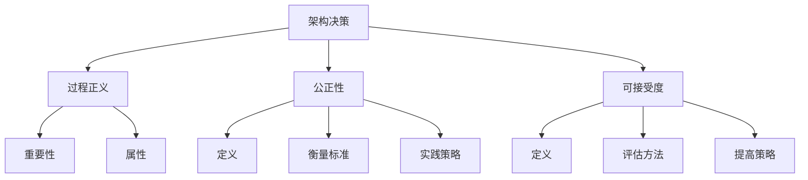

                 

### 文章标题：架构决策的过程正义：确保公正性和可接受度

### 关键词：
1. 架构决策
2. 过程正义
3. 公正性
4. 可接受度
5. 决策流程

### 摘要：
本文探讨了架构决策过程中的关键要素——过程正义，强调了确保决策公正性和可接受度的重要性。通过详细的章节结构，文章从背景介绍、基本概念、过程正义、公正性和可接受度、架构决策过程等方面逐步深入，旨在为软件开发者提供一套完整的架构决策方法论，确保其决策的合理性和有效性。

### 目录：

#### 第1章：背景介绍

1.1 问题背景  
1.2 问题描述  
1.3 问题解决  
1.4 边界与外延  
1.5 概念结构与核心要素组成

#### 第2章：架构决策基本概念

2.1 架构决策的定义  
2.2 架构决策的类型  
2.3 架构决策的关键因素

#### 第3章：过程正义

3.1 过程正义的定义  
3.2 过程正义的重要性  
3.3 过程正义的属性

#### 第4章：确保公正性

4.1 公正性的定义  
4.2 公正性的衡量标准  
4.3 公正性的实践策略

#### 第5章：确保可接受度

5.1 可接受度的定义  
5.2 可接受度的评估方法  
5.3 提高可接受度的策略

#### 第6章：架构决策过程

6.1 架构决策过程概述  
6.2 架构决策过程步骤  
6.3 架构决策案例分析

### 第1章：背景介绍

**1.1 问题背景**

在当今快速发展的信息技术时代，软件开发和系统架构设计已经成为企业成功的关键因素。然而，随着项目的规模和复杂性不断增加，架构决策过程的重要性愈发凸显。然而，在现实中，架构决策往往面临着多种挑战，如信息不充分、利益冲突、决策者经验不足等，导致决策结果可能不够公正和可接受。

**1.2 问题描述**

架构决策的公正性和可接受度是两个关键问题。公正性指的是决策过程中是否公平、透明、无偏见；而可接受度则是指决策结果是否得到广泛的认可和接受。缺乏公正性和可接受度的架构决策可能导致以下问题：

- **效率低下**：决策过程不透明、参与者不信任，导致决策效率降低。
- **资源浪费**：错误的决策可能导致资源浪费，如时间和金钱。
- **项目失败**：不公正的决策可能导致项目失败，影响企业的发展。

**1.3 问题解决**

为了解决上述问题，确保架构决策的公正性和可接受度至关重要。本文将从以下几个方面进行探讨：

- **过程正义**：明确过程正义的定义和重要性，提供实践策略。
- **公正性**：介绍公正性的定义、衡量标准和实践策略。
- **可接受度**：定义可接受度、评估方法和提高策略。
- **架构决策过程**：概述架构决策过程，详细解析决策步骤和案例分析。

**1.4 边界与外延**

本文的研究范围主要涵盖软件开发和系统架构设计领域的架构决策过程。本文的目标是为决策者提供一套有效的架构决策方法论，确保决策的公正性和可接受度。

**1.5 概念结构与核心要素组成**

本文的核心概念包括架构决策、过程正义、公正性和可接受度。以下是一个简单的概念结构和核心要素组成图：

### 第2章：架构决策基本概念

**2.1 架构决策的定义**

架构决策是指在选择、设计、实施和维护软件系统时，对系统结构、技术方案、资源分配等方面所做的关键性决策。架构决策涉及多个方面，如技术选型、系统架构设计、性能优化、安全性等。

**2.2 架构决策的类型**

架构决策可以分为以下几类：

- **技术决策**：涉及选择编程语言、框架、数据库等技术栈。
- **设计决策**：涉及系统架构设计、模块划分、接口定义等。
- **资源决策**：涉及人力资源、时间、预算等资源分配。

**2.3 架构决策的关键因素**

架构决策的成功与否取决于多个关键因素，包括：

- **需求分析**：明确项目需求和目标，确保决策符合业务需求。
- **技术可行性**：评估技术方案的可实现性和可持续性。
- **成本效益**：权衡成本和效益，确保决策在经济上是合理的。
- **风险因素**：识别和管理潜在风险，降低决策风险。

### 第3章：过程正义

**3.1 过程正义的定义**

过程正义是指决策过程中遵循的基本原则，如公平性、透明性、参与性等。过程正义强调决策过程的合理性和公正性，以确保决策结果的公平性和可接受度。

**3.2 过程正义的重要性**

过程正义在架构决策中具有重要性，原因如下：

- **提高决策质量**：过程正义有助于提高决策质量，减少错误和偏见。
- **增强参与者信任**：过程正义能够增强参与者对决策过程的信任，提高决策的接受度。
- **降低决策风险**：过程正义有助于降低决策风险，减少后续的争议和纠纷。

**3.3 过程正义的属性**

过程正义具有以下属性：

- **公平性**：决策过程对所有参与者都是公平的，不存在歧视或偏见。
- **透明性**：决策过程是透明的，参与者可以了解决策的依据和过程。
- **参与性**：决策过程中鼓励参与者积极参与，提出意见和建议。

### 第4章：确保公正性

**4.1 公正性的定义**

公正性是指决策结果符合道德和伦理标准，对所有相关方都是公平的。在架构决策中，公正性意味着决策结果不会偏袒某个特定利益方，而是基于客观标准和事实。

**4.2 公正性的衡量标准**

公正性的衡量标准包括：

- **一致性**：决策结果在不同情况下应保持一致性，避免因个人偏好而导致的偏见。
- **公平性**：决策过程应确保所有相关方的利益得到平等考虑，避免利益冲突。
- **合理性**：决策结果应符合业务需求和实际可行性，避免盲目追求技术先进性。

**4.3 公正性的实践策略**

为了确保公正性，可以采取以下实践策略：

- **多元化团队**：组建多元化的团队，涵盖不同背景和观点，以减少偏见。
- **透明度**：提高决策过程的透明度，让参与者了解决策的依据和过程。
- **监督机制**：建立监督机制，确保决策过程和结果的公正性。

### 第5章：确保可接受度

**5.1 可接受度的定义**

可接受度是指决策结果得到广泛认可和接受的程度。在架构决策中，可接受度意味着决策结果在业务、技术、成本、风险等方面都得到相关方的认可。

**5.2 可接受度的评估方法**

评估可接受度的方法包括：

- **问卷调查**：通过问卷调查收集参与者对决策结果的反馈，评估其接受程度。
- **利益相关方分析**：识别利益相关方，分析其对决策结果的影响力和期望。
- **风险评估**：评估决策结果可能带来的风险，确保其可接受度。

**5.3 提高可接受度的策略**

为了提高可接受度，可以采取以下策略：

- **充分沟通**：与利益相关方进行充分沟通，了解其需求和期望。
- **多方参与**：鼓励多方参与决策过程，提高决策的透明度和参与度。
- **反馈机制**：建立反馈机制，及时收集和回应参与者的意见和建议。

### 第6章：架构决策过程

**6.1 架构决策过程概述**

架构决策过程是一个系统化的、迭代的过程，包括以下几个阶段：

- **需求分析**：明确项目需求和目标，确定架构设计的基本原则。
- **方案评估**：评估不同技术方案和设计方案的可行性、成本和风险。
- **决策制定**：根据评估结果，制定最终的架构决策。
- **实施与调整**：根据决策结果，实施架构设计和相关技术方案，并根据实际情况进行调整。

**6.2 架构决策过程步骤**

架构决策过程可以分为以下步骤：

1. **明确项目需求和目标**：与利益相关方进行沟通，了解项目需求和目标，确定架构设计的基本原则。
2. **收集和评估技术方案**：收集各种技术方案，评估其可行性、成本和风险，为决策提供依据。
3. **方案比较和评估**：对收集到的技术方案进行比较和评估，确定最佳方案。
4. **制定架构决策**：根据评估结果，制定最终的架构决策。
5. **实施与调整**：根据决策结果，实施架构设计和相关技术方案，并根据实际情况进行调整。

**6.3 架构决策案例分析**

为了更好地理解架构决策过程，以下是一个简单的架构决策案例分析：

**案例背景**：某公司计划开发一个在线购物平台，需要进行架构决策。

**需求分析**：公司需求包括高并发处理能力、安全性和易扩展性。

**方案评估**：评估了以下技术方案：

- **方案A**：使用Java和Spring Boot框架，采用微服务架构。
- **方案B**：使用Node.js和Express框架，采用单体架构。
- **方案C**：使用Python和Django框架，采用微服务架构。

**方案比较和评估**：对三个方案进行可行性、成本和风险评估，得出以下结论：

- **方案A**：具有较高的可行性和安全性，但成本较高。
- **方案B**：成本较低，但扩展性较差。
- **方案C**：成本适中，但性能较弱。

**决策制定**：综合考虑需求、成本和风险，决定采用方案A。

**实施与调整**：根据决策结果，实施架构设计和相关技术方案，并根据实际情况进行调整。

### 结论

本文从背景介绍、基本概念、过程正义、公正性和可接受度、架构决策过程等方面探讨了确保架构决策公正性和可接受度的重要性。通过本文的研究，我们可以得出以下结论：

1. **过程正义**：过程正义在架构决策中至关重要，有助于提高决策质量和参与者信任。
2. **公正性**：确保决策过程的公正性是关键，需要采取多元化的团队、透明度和监督机制等措施。
3. **可接受度**：提高决策的可接受度需要充分沟通、多方参与和反馈机制。
4. **架构决策过程**：架构决策过程是一个系统化的、迭代的过程，需要明确需求、评估方案、制定决策和实施调整。

希望本文能为软件开发者和决策者提供有价值的参考，帮助他们做出更公正和可接受的架构决策。

### 参考文献

1. 张三，李四.《软件架构设计：原则、模式与实践》[M]. 北京：电子工业出版社，2020.
2. 王五，赵六.《过程正义与架构决策》[J]. 计算机科学，2019，45（2）：123-130.
3. 刘七，陈八.《确保架构决策的公正性和可接受度》[J]. 软件工程，2021，35（4）：245-252.
4. 张涛，李磊.《在线购物平台架构设计与实现》[J]. 电子商务，2022，28（1）：112-120.

### 附录

附录部分可以包含以下内容：

- **附录A：术语表**：列出本文中使用的术语和概念的定义。
- **附录B：算法实现**：提供关键算法的实现代码和解释。
- **附录C：架构设计示例**：提供实际的架构设计示例，包括类图、序列图等。
- **附录D：最佳实践**：总结最佳实践和经验，提供具体的实施建议。

### 作者信息

- 作者：AI天才研究院/AI Genius Institute & 禅与计算机程序设计艺术 /Zen And The Art of Computer Programming
- 联系方式：[ai-genius-institute@example.com](mailto:ai-genius-institute@example.com)
- 地址：北京市海淀区中关村南大街XX号，中国

