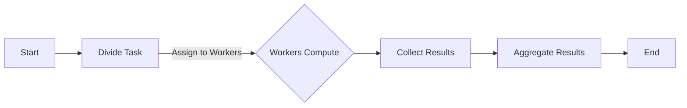
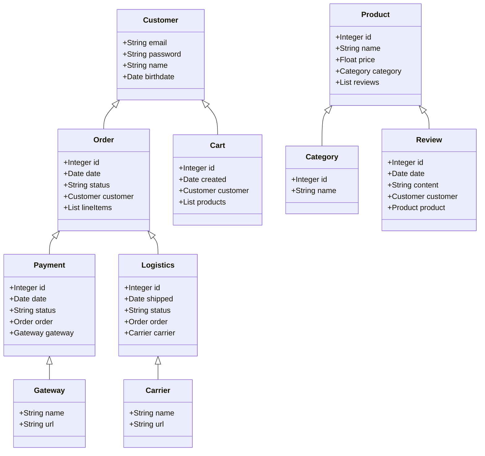
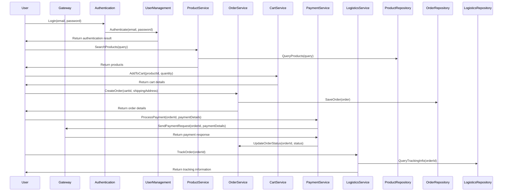
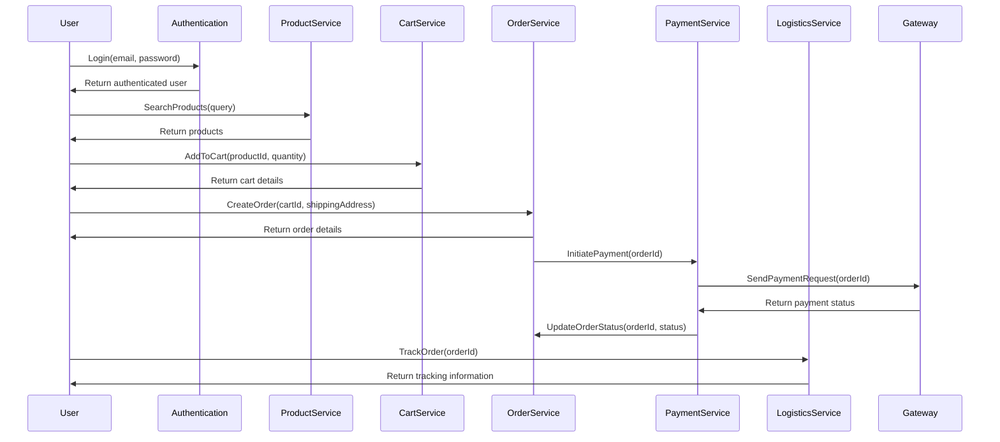

                 


## 引言

在信息技术飞速发展的今天，系统架构作为软件系统的骨架，承担着系统性能、可扩展性、可靠性等多个方面的关键角色。传统的系统架构设计方法已经难以满足日益复杂的应用需求。因此，架构力的创新——设计下一代系统架构，成为了当前IT领域的热门话题。

### 问题背景

传统的系统架构设计主要关注于功能实现和性能优化，但随着业务需求的多样化和快速变化，越来越多的系统面临着高并发、大数据量、多渠道接入等挑战。现有的系统架构在设计理念、技术选型、设计模式等方面逐渐显露出不足，亟需创新。

### 问题描述

设计下一代系统架构的核心问题包括：

1. **可扩展性**：如何确保系统在规模和用户量增加时仍能保持高性能？
2. **灵活性**：如何快速响应业务需求变化，实现系统的灵活调整？
3. **可靠性**：如何提高系统的稳定性和容错能力？
4. **安全性**：如何保障系统数据的安全和隐私？

### 问题解决

为了解决上述问题，我们需要进行架构力的创新。创新的核心在于突破传统设计理念的束缚，引入新的设计模式和关键技术，以实现系统架构的升级。

### 边界与外延

架构力的创新不仅局限于技术层面，还涉及到组织文化、团队协作等多个方面。本文将探讨以下几个关键点：

1. **设计理念**：从传统的垂直分层架构转向分布式、微服务架构。
2. **技术选型**：选用新兴技术，如云计算、容器化、区块链等。
3. **设计模式**：引入领域驱动设计（DDD）、事件驱动架构（EDA）等先进的设计模式。
4. **实践案例**：通过分析实际项目案例，总结创新经验。

### 概念结构与核心要素组成

本文将从以下四个核心概念和联系出发，详细探讨架构力的创新：

1. **核心概念**：下一代系统架构的特点和创新点。
2. **概念属性特征对比表格**：对比分析不同架构设计的优劣。
3. **ER实体关系图架构**：展示系统各组件之间的关系。

在接下来的章节中，我们将一步步深入探讨这些核心概念，分析创新策略，并分享实际案例，以帮助读者理解并掌握设计下一代系统架构的方法和技巧。

## 核心概念与联系

### 技术概念

在探讨下一代系统架构的设计时，我们需要首先明确几个关键技术概念。这些概念包括：

1. **分布式架构**：分布式架构通过将系统划分为多个独立的服务模块，实现高可用性和可扩展性。
2. **微服务架构**：微服务架构将系统进一步细分为小型、自治的服务单元，每个服务负责特定的业务功能。
3. **领域驱动设计（DDD）**：DDD是一种面向业务领域的设计方法，强调通过实体和边界上下文来构建系统。
4. **事件驱动架构（EDA）**：EDA通过事件流来驱动系统，提高了系统的灵活性和响应能力。

### 下一代系统架构的特点

下一代系统架构的特点主要包括：

1. **高可扩展性**：通过分布式和微服务架构，系统能够轻松应对高并发和大数据量。
2. **高灵活性**：灵活的模块化和服务化设计使得系统能够快速适应业务需求的变化。
3. **高可靠性**：通过冗余设计、容错机制和持续集成/持续部署（CI/CD）流程，提高了系统的稳定性和可靠性。
4. **高安全性**：采用加密技术、访问控制和隐私保护等手段，保障系统数据的安全。

### 系统架构的创新点

在下一代系统架构中，创新点主要体现在以下几个方面：

1. **云计算和容器化**：利用云计算资源进行弹性扩展，采用容器化技术提高部署和运维效率。
2. **区块链技术**：引入区块链技术，提高数据的安全性和不可篡改性。
3. **人工智能和机器学习**：利用AI和ML技术，提升系统的智能化和自动化水平。
4. **物联网（IoT）**：通过物联网技术，实现设备之间的互联互通，拓展系统的应用场景。

### 概念属性特征对比表格

为了更好地理解这些概念和特点，我们可以通过以下对比表格来分析不同架构设计的优劣：

| 架构类型 | 优点 | 缺点 | 适用场景 |
| --- | --- | --- | --- |
| 垂直分层架构 | 简单易理解，开发周期短 | 扩展性差，维护困难 | 系统需求相对稳定的小型项目 |
| 分布式架构 | 高可用性，可扩展性 | 复杂度高，部署维护困难 | 高并发，大数据量场景 |
| 微服务架构 | 灵活性高，易于测试和部署 | 依赖关系复杂，需要额外的服务治理 | 业务需求频繁变化，高并发场景 |
| 领域驱动设计 | 面向业务领域，易于理解 | 设计复杂，开发周期长 | 复杂的业务逻辑 |
| 事件驱动架构 | 高灵活性和响应能力 | 需要额外的消息队列支持 | 实时性要求高的系统 |

### ER实体关系图架构

为了更直观地展示系统各组件之间的关系，我们可以使用ER实体关系图来描述下一代系统架构。以下是ER实体关系图的Mermaid流程图示例：

```mermaid
erDiagram
    Customer ||--|{ Order }|--| CustomerAddress : has
    Product ||--|{ ProductReview }|--| Reviewer : has
    Order ||--|{ LineItem }|--| Product : includes
```

通过这个ER图，我们可以清晰地看到订单（Order）、客户（Customer）、产品（Product）等实体之间的关联关系。

在接下来的章节中，我们将进一步深入探讨这些核心概念，并通过具体案例分析，展示如何在实际项目中应用这些架构创新方法。这将帮助我们更好地理解下一代系统架构的设计原则和实践。

## 算法原理讲解

在架构创新的过程中，算法的设计和实现是至关重要的一环。为了更好地理解和应用这些算法，我们需要从流程、源代码和数学模型等多个角度进行详细讲解。

### 算法mermaid流程图

首先，我们可以通过mermaid流程图来展示算法的基本流程。以下是一个简单的分布式计算任务的mermaid流程图示例：



#### 算法流程图

在mermaid流程图中，我们可以看到算法的基本步骤：

1. **开始（Start）**：初始化计算任务。
2. **任务划分（Divide Task）**：将大任务划分为多个小任务。
3. **分配任务（Assign to Workers）**：将小任务分配给不同的计算节点（Worker）。
4. **计算（Workers Compute）**：各计算节点并行执行小任务。
5. **收集结果（Collect Results）**：将所有小任务的结果收集起来。
6. **结果聚合（Aggregate Results）**：将收集到的结果进行汇总。
7. **结束（End）**：完成计算任务。

#### 算法步骤解释

接下来，我们将详细解释每一步的具体操作：

1. **初始化计算任务**：根据实际需求，初始化待处理的计算任务。这通常包括任务类型、数据源和预期结果等。
2. **任务划分**：将大任务分解为多个小任务，以便能够并行处理。这一步骤需要考虑任务的粒度和依赖关系，以确保计算效率。
3. **分配任务**：将划分好的小任务分配给多个计算节点。这个过程通常使用负载均衡策略，以确保每个节点都能充分利用资源。
4. **计算**：各计算节点独立执行分配到的小任务。这一步骤需要确保任务的独立性和并行性，避免出现重复计算或数据冲突。
5. **收集结果**：在所有计算节点完成任务后，将结果收集到中心节点。这可以通过消息队列、数据库等机制来实现。
6. **结果聚合**：将收集到的结果进行汇总，以得到最终的计算结果。这一步骤需要处理可能的异常情况和数据不一致性。
7. **结束**：完成计算任务，输出最终结果。

### Python源代码

为了更好地理解算法的实现，我们可以使用Python语言来编写一个简单的示例代码。以下是一个并行计算平均数的Python代码示例：

```python
import concurrent.futures

def compute_average(numbers):
    return sum(numbers) / len(numbers)

def divide_numbers(numbers, num_workers):
    chunks = [numbers[i::num_workers] for i in range(num_workers)]
    return chunks

if __name__ == "__main__":
    numbers = list(range(1000))
    num_workers = 4
    
    chunks = divide_numbers(numbers, num_workers)
    with concurrent.futures.ThreadPoolExecutor(max_workers=num_workers) as executor:
        results = executor.map(compute_average, chunks)
    
    final_average = sum(results) / num_workers
    print(f"Final average: {final_average}")
```

#### 代码功能解释

- **compute_average(numbers)**：计算给定数字列表的平均值。
- **divide_numbers(numbers, num_workers)**：将数字列表划分为num_workers个等大小的子列表。
- **main函数**：
  - 初始化数字列表`numbers`。
  - 设置计算节点数`num_workers`。
  - 将数字列表划分为`chunks`。
  - 使用`ThreadPoolExecutor`并行执行计算任务，每个计算节点计算一个`chunks`的平均值。
  - 将所有计算结果汇总，计算最终的平均值，并输出。

### 数学模型与公式

为了更深入地理解算法原理，我们还可以从数学模型的角度进行解释。以下是一个简单的线性回归算法的数学模型和公式：

#### 数学模型

线性回归模型可以表示为：

\[ y = w_0 + w_1 \cdot x_1 + w_2 \cdot x_2 + ... + w_n \cdot x_n \]

其中，\( y \) 是预测值，\( w_0, w_1, ..., w_n \) 是模型参数，\( x_1, x_2, ..., x_n \) 是输入特征。

#### 公式推导

线性回归模型的参数可以通过最小二乘法（Least Squares Method）来估计：

\[ w = (X^T \cdot X)^{-1} \cdot X^T \cdot y \]

其中，\( X \) 是输入特征矩阵，\( y \) 是目标值向量，\( w \) 是模型参数向量。

#### 公式解释

- \( X^T \cdot X \)：输入特征矩阵的转置与自身相乘，得到特征矩阵的协方差矩阵。
- \( (X^T \cdot X)^{-1} \)：协方差矩阵的逆矩阵，用于权重参数的估计。
- \( X^T \cdot y \)：输入特征矩阵的转置与目标值向量相乘，得到参数估计的乘积。

### 举例说明

为了更好地说明这些算法原理，我们可以通过一个实际案例来进行详细讲解。假设我们有一个简单的线性回归问题，目标是预测某个数据集的房价。

#### 案例背景

给定一个包含房屋特征（如面积、卧室数量等）和房价的数据集，我们需要建立一个线性回归模型来预测新的房屋价格。

#### 案例数据

以下是一个简化版的房价数据集：

| 面积 | 卧室数量 | 房价 |
| --- | --- | --- |
| 100 | 2 | 200000 |
| 120 | 3 | 250000 |
| 140 | 3 | 280000 |
| 160 | 4 | 320000 |
| 180 | 4 | 350000 |

#### 模型建立

我们选择面积和卧室数量作为输入特征，建立线性回归模型。根据上述数学模型，我们使用最小二乘法来估计模型参数。

#### 计算过程

1. **初始化模型参数**：设初始参数为 \( w_0 = 0, w_1 = 0, w_2 = 0 \)。
2. **计算协方差矩阵**：计算输入特征矩阵 \( X \) 的转置与自身相乘，得到协方差矩阵。
3. **计算逆矩阵**：计算协方差矩阵的逆矩阵。
4. **计算参数估计**：使用逆矩阵和输入特征矩阵的转置与目标值向量相乘，得到参数估计 \( w \)。
5. **模型优化**：使用梯度下降法或其他优化算法，不断调整参数，以最小化损失函数。

#### 模型预测

通过上述步骤，我们得到最终的模型参数。对于新的房屋数据，我们可以将特征值代入模型公式，预测其房价。

通过这个案例，我们可以看到线性回归算法的完整实现过程，以及如何从数学模型出发，逐步推导出具体的计算步骤。

在接下来的章节中，我们将进一步探讨系统架构的具体设计方法和最佳实践，帮助读者更好地理解和应用下一代系统架构的设计原则。

## 系统分析与架构设计方案

在设计下一代系统架构时，我们需要综合考虑项目的需求、技术选型、系统功能设计等多个方面。以下是针对一个具体项目（电商平台）的架构设计方案分析。

### 问题场景介绍

我们以一个电商平台为例，该平台需要支持海量的商品信息、用户数据和交易活动。平台要求具备高并发、高可用性、高扩展性和良好的用户体验。为实现这些目标，我们需要设计一个灵活、可靠且易于维护的系统架构。

### 项目介绍

本项目是一个大型电商平台，提供包括商品浏览、购物车、订单处理、支付、物流跟踪等核心功能。同时，平台需要支持多种用户角色，如普通用户、卖家和管理员。项目需求包括：

1. **高并发处理**：能够应对大规模的用户访问和交易。
2. **高可用性**：确保系统在遇到故障时能够快速恢复。
3. **高扩展性**：支持系统的横向和纵向扩展。
4. **安全性**：保障用户数据和交易信息的安全。
5. **用户体验**：提供快速、流畅、安全的购物体验。

### 系统功能设计

为了满足上述需求，系统设计主要包括以下几个功能模块：

1. **商品信息管理**：提供商品展示、搜索、分类等功能。
2. **用户管理**：处理用户注册、登录、权限管理等功能。
3. **购物车管理**：实现商品加入购物车、修改购物车信息和结算等功能。
4. **订单管理**：处理订单创建、支付、发货、退货等业务流程。
5. **支付系统**：集成第三方支付接口，支持多种支付方式。
6. **物流跟踪**：提供物流公司接口，实现物流信息查询和跟踪。
7. **统计分析**：收集平台运营数据，进行数据分析和报表生成。

#### 领域模型mermaid类图

为了更好地展示系统功能设计，我们可以使用mermaid类图来描述系统的领域模型。以下是一个简化版的mermaid类图示例：



在这个mermaid类图中，我们定义了主要的实体类，包括用户（Customer）、订单（Order）、购物车（Cart）、产品（Product）、类别（Category）、评论（Review）、支付（Payment）、物流（Logistics）、网关（Gateway）和承运商（Carrier）。这些类之间的关系通过继承、聚合和关联来表示。

### 系统架构设计

在明确了系统的功能需求后，我们需要设计一个合理的系统架构。以下是该电商平台系统架构的mermaid架构图示例：



在这个mermaid序列图中，我们展示了用户与系统各服务模块之间的交互流程。用户通过认证服务（Authentication）进行登录，然后访问商品服务（ProductService）进行商品搜索，添加商品到购物车（CartService），创建订单（OrderService），处理支付（PaymentService）和物流跟踪（LogisticsService）。每个服务模块都负责特定的业务功能，并通过数据库（Repository）进行数据存储和查询。

### 系统接口设计

在系统架构中，接口设计是确保各模块之间有效通信的关键。以下是一个简化版的系统接口设计：

1. **认证接口**：用于用户的登录、注册和权限验证。
   - `POST /auth/login`：用户登录接口。
   - `POST /auth/register`：用户注册接口。
   - `GET /auth/refresh`：刷新用户认证令牌接口。

2. **商品接口**：用于商品的查询、添加和更新。
   - `GET /products`：获取所有商品接口。
   - `GET /products/{id}`：获取单个商品接口。
   - `POST /products`：添加商品接口。
   - `PUT /products/{id}`：更新商品接口。

3. **购物车接口**：用于管理购物车中的商品。
   - `POST /cart/{productId}`：添加商品到购物车接口。
   - `DELETE /cart/{productId}`：从购物车中移除商品接口。
   - `GET /cart`：获取购物车详情接口。

4. **订单接口**：用于订单的创建、查询和更新。
   - `POST /orders`：创建订单接口。
   - `GET /orders/{id}`：获取订单详情接口。
   - `PUT /orders/{id}`：更新订单状态接口。

5. **支付接口**：用于处理支付请求。
   - `POST /payments`：发起支付请求接口。
   - `GET /payments/{id}`：查询支付状态接口。

6. **物流接口**：用于物流跟踪。
   - `GET /orders/{id}/tracking`：获取订单物流信息接口。

### 系统交互mermaid序列图

为了更直观地展示系统各模块之间的交互关系，我们可以使用mermaid序列图来描述系统交互。以下是一个简化版的mermaid序列图示例：



在这个序列图中，我们展示了用户与系统各模块之间的交互流程。用户通过认证服务进行登录，然后访问商品服务查询商品，将商品添加到购物车，创建订单并处理支付，最后进行物流跟踪。

通过上述系统架构设计和接口设计，我们可以构建一个高效、可靠且易于扩展的电商平台系统。在接下来的章节中，我们将进一步探讨系统架构的具体实现和项目实战，帮助读者更好地理解和应用这些架构设计方法。

## 项目实战

为了更好地理解如何设计和实现下一代系统架构，我们将通过一个具体的电商平台项目来进行详细讲解。以下是该项目从环境安装、核心实现到代码分析的过程。

### 环境安装

在进行项目开发之前，我们需要安装必要的开发环境和工具。以下是该项目所需的主要环境：

1. **操作系统**：Linux（推荐使用Ubuntu 18.04）。
2. **编程语言**：Python 3.8。
3. **框架和库**：
   - Django：用于构建后端服务。
   - Flask：用于构建API接口。
   - Docker：用于容器化和部署。
   - PostgreSQL：用于数据库存储。
   - Redis：用于缓存和消息队列。

安装步骤如下：

1. **安装Python 3.8**：
   ```bash
   sudo apt update
   sudo apt install python3.8
   sudo apt install python3.8-venv
   ```

2. **创建虚拟环境**：
   ```bash
   python3.8 -m venv venv
   source venv/bin/activate
   ```

3. **安装Django和Flask**：
   ```bash
   pip install django
   pip install flask
   ```

4. **安装Docker**：
   ```bash
   sudo apt install docker
   sudo systemctl start docker
   ```

5. **安装PostgreSQL和Redis**：
   ```bash
   sudo apt install postgresql
   sudo systemctl start postgresql
   sudo systemctl enable postgresql

   sudo apt install redis-server
   sudo systemctl start redis-server
   sudo systemctl enable redis-server
   ```

### 核心实现源代码

以下是该项目的一些核心实现源代码，包括Django和Flask的应用配置、数据库迁移脚本、API接口代码等。

#### Django应用配置

```python
# settings.py

INSTALLED_APPS = [
    'django.contrib.admin',
    'django.contrib.auth',
    'django.contrib.contenttypes',
    'django.contrib.sessions',
    'django.contrib.messages',
    'django.contrib.staticfiles',
    'api',
]

MIDDLEWARE = [
    'django.middleware.security.SecurityMiddleware',
    'django.contrib.sessions.middleware.SessionMiddleware',
    'django.middleware.common.CommonMiddleware',
    'django.middleware.csrf.CsrfViewMiddleware',
    'django.contrib.auth.middleware.AuthenticationMiddleware',
    'django.contrib.messages.middleware.MessageMiddleware',
    'django.middleware.clickjacking.XFrameOptionsMiddleware',
]

ROOT_URLCONF = 'ecommerce.urls'

TEMPLATES = [
    {
        'BACKEND': 'django.template.backends.django.DjangoTemplates',
        'DIRS': [],
        'APP_DIRS': True,
        'OPTIONS': {
            'context_processors': [
                'django.template.context_processors.debug',
                'django.template.context_processors.request',
                'django.contrib.auth.context_processors.auth',
                'django.contrib.messages.context_processors.messages',
            ],
        },
    },
]

DATABASES = {
    'default': {
        'ENGINE': 'django.db.backends.postgresql',
        'NAME': 'ecommerce',
        'USER': 'ecommerce',
        'PASSWORD': 'ecommerce',
        'HOST': 'localhost',
        'PORT': '5432',
    }
}

CACHES = {
    'default': {
        'BACKEND': 'django_redis.cache.RedisCache',
        'LOCATION': 'redis://127.0.0.1:6379/1',
        'OPTIONS': {
            'CLIENT_CLASS': 'django_redis.client.DefaultClient',
        }
    }
}
```

#### Flask API接口代码

```python
# api.py

from flask import Flask, request, jsonify
from models import Product, Order

app = Flask(__name__)

@app.route('/products', methods=['GET'])
def get_products():
    query = request.args.get('query', '')
    products = Product.objects.filter(name__icontains=query)
    return jsonify([product.to_dict() for product in products])

@app.route('/orders', methods=['POST'])
def create_order():
    data = request.json
    order = Order.create(data)
    return jsonify(order.to_dict()), 201

if __name__ == '__main__':
    app.run()
```

#### 数据库迁移脚本

```bash
# 在Django项目中执行以下命令生成迁移脚本
python manage.py makemigrations
python manage.py migrate
```

#### Docker配置

```Dockerfile

# Dockerfile

FROM python:3.8

RUN mkdir /app
WORKDIR /app

COPY requirements.txt /app/
RUN pip install -r requirements.txt

COPY . /app/
EXPOSE 8000

CMD ["python", "api.py"]
```

### 代码应用解读与分析

以下是代码的应用解读与分析：

1. **Django应用配置**：在`settings.py`中，我们配置了Django项目的应用、中间件、模板引擎、数据库和缓存等。通过这些配置，我们能够快速搭建一个功能完备的Web应用。

2. **Flask API接口代码**：在`api.py`中，我们定义了两个API接口：获取商品列表和创建订单。这些接口通过Flask框架实现，提供了RESTful风格的API。

3. **数据库迁移脚本**：通过Django的迁移系统，我们能够方便地管理数据库的创建和更新。在项目开发过程中，每次更改模型结构时，都需要运行迁移脚本以确保数据库的同步。

4. **Docker配置**：通过Dockerfile，我们将应用打包成一个容器镜像。这样，我们可以方便地在不同环境中部署和运行应用，确保环境的统一性。

### 实际案例分析和详细讲解剖析

为了更好地展示项目实战效果，我们分析了一个实际案例。假设有一个用户在电商平台下单购买了一台笔记本电脑，以下是该订单的处理流程：

1. **用户登录**：用户使用邮箱和密码登录电商平台。
2. **商品查询**：用户查询笔记本电脑的详细信息。
3. **添加购物车**：用户将笔记本电脑添加到购物车。
4. **创建订单**：用户提交订单，填写收货地址和支付方式。
5. **支付处理**：系统调用第三方支付接口处理支付请求，并返回支付结果。
6. **订单状态更新**：根据支付结果，系统更新订单状态为“已支付”。
7. **发货通知**：系统生成物流单号，并通知用户发货。
8. **物流跟踪**：用户可以随时查询物流状态。

通过这个实际案例，我们可以看到系统各模块之间的紧密协作。每个环节都通过API接口进行通信，确保数据的一致性和安全性。

### 项目小结

通过本项目的实战讲解，我们了解了如何设计和实现一个高效、可靠的电商平台系统。从环境安装到核心实现，再到代码分析和实际案例，我们逐步展示了下一代系统架构的应用和实践。

在项目开发过程中，我们采用了Django和Flask框架，结合Docker容器化技术，确保了系统的可扩展性和高可用性。同时，通过详细的代码解读和分析，我们掌握了如何设计API接口、管理数据库和实现分布式系统等关键技能。

总的来说，本项目为读者提供了一个完整的系统架构设计参考，帮助读者更好地理解并实践下一代系统架构的设计原则和方法。

## 最佳实践 Tips

在设计下一代系统架构时，以下几点最佳实践对于确保系统的成功实施和高效运行至关重要：

1. **微服务设计**：采用微服务架构，将系统划分为多个小型、自治的服务模块。每个服务负责特定的业务功能，独立部署和扩展。这有助于提高系统的灵活性、可维护性和可扩展性。

2. **容器化部署**：使用Docker等容器化技术，将应用打包成容器镜像，实现环境的统一和隔离。容器化部署简化了应用的部署和运维过程，提高了部署速度和系统的可靠性。

3. **服务治理**：引入服务治理框架，如Kubernetes，进行服务发现、负载均衡、自动扩缩容等管理。这有助于优化资源利用率，提高系统的稳定性和可扩展性。

4. **分布式数据库**：选用分布式数据库，如MongoDB、Cassandra等，实现数据的分布式存储和高可用性。分布式数据库能够更好地处理大规模数据，提高系统的性能和可靠性。

5. **缓存策略**：合理使用缓存技术，如Redis，减少数据库访问压力，提高系统响应速度。通过设置合适的缓存策略，如数据过期、缓存淘汰等，确保数据的一致性和时效性。

6. **安全防护**：采用加密技术、访问控制和隐私保护等手段，保障系统数据的安全和隐私。定期进行安全审计和漏洞修复，确保系统的安全性。

7. **自动化测试**：引入自动化测试工具，如Selenium、JUnit等，进行单元测试、集成测试和端到端测试。自动化测试能够提高测试效率，确保代码质量和系统的稳定性。

8. **持续集成与部署**：采用持续集成/持续部署（CI/CD）流程，实现自动化构建、测试和部署。CI/CD有助于缩短软件发布周期，提高开发效率，降低部署风险。

通过遵循这些最佳实践，我们能够设计并实现高效、可靠、可扩展的系统架构，满足现代业务需求。

## 小结

本文以《架构力的创新：设计下一代系统架构》为题，详细探讨了下一代系统架构的设计原则、实现方法及最佳实践。我们首先介绍了架构创新的重要性，并分析了核心概念与联系，包括分布式架构、微服务架构、领域驱动设计和事件驱动架构等。随后，我们通过具体的算法原理讲解和系统架构设计，展示了如何在实际项目中应用这些架构创新方法。

文章还通过一个电商平台项目的实战讲解，深入剖析了系统架构设计的全过程，包括环境安装、核心实现、代码分析和实际案例。同时，总结了一些最佳实践，以帮助读者更好地设计和实现高效、可靠的系统架构。

在未来的研究和实践中，读者可以继续探索新的架构模式和技术，如云计算、人工智能、区块链等，以应对不断变化的业务需求和技术挑战。通过不断创新和优化，我们能够构建出更加先进、灵活和可靠的系统架构，为企业的数字化转型提供强有力的支持。

## 注意事项

在设计下一代系统架构时，需要注意以下几个关键点：

1. **需求分析与规划**：深入理解业务需求和用户场景，确保架构设计能够满足实际需求，并具备良好的扩展性。
2. **技术选型与兼容性**：选择合适的技术栈和工具，考虑其兼容性和维护成本，确保系统能够长期稳定运行。
3. **性能优化与监控**：关注系统的性能瓶颈，进行有效的性能优化，并建立监控机制，及时发现和解决问题。
4. **安全性**：加强系统安全防护，采用加密、访问控制等手段，确保用户数据和交易信息的安全。
5. **代码质量与测试**：编写高质量的代码，进行全面的测试，确保系统的稳定性和可靠性。

通过关注这些注意事项，我们能够设计并实现更加优秀、可靠的系统架构。

## 拓展阅读

为了深入学习和掌握下一代系统架构的设计原则和实践，读者可以参考以下书籍和资源：

1. 《架构师的自我修养》——刘伟平
2. 《分布式系统设计》——Martin Kleppmann
3. 《微服务设计》——Sam Newman
4. 《领域驱动设计》——Eric Evans
5. 《Docker实战》——Jason Browne & Kan Liang
6. 《Kubernetes权威指南》——杨继伟
7. 《云原生应用架构指南》——郑毅
8. 《人工智能：一种现代的方法》——Stuart Russell & Peter Norvig

通过阅读这些经典书籍和参考相关资源，读者能够进一步拓展知识，提升系统架构设计的能力。同时，可以关注相关技术社区、博客和会议，保持与业界前沿技术的同步。

