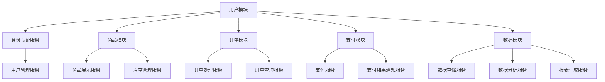

                 

### 文章标题：架构力的思维模型：系统思考和权衡取舍

关键词：架构力、系统思考、权衡取舍、软件开发、企业架构管理、新兴技术领域

摘要：本文深入探讨了架构力在系统思考和权衡取舍中的应用。首先，我们介绍了架构力的基本概念和系统思考的原理，随后分析了系统组件的关系与权衡取舍的策略。文章随后分别从软件开发、企业架构管理、新兴技术领域以及跨领域架构力应用四个方面，详细阐述了架构力的实践应用。最后，我们对架构力的重要性进行了总结，并展望了其未来的发展趋势和应用前景。通过本文的阅读，读者将能够更好地理解架构力的思维模型，并在实际项目中加以应用。

----------------------------------------------------------------

## 第一部分：架构力的思维模型基础

在信息化快速发展的今天，架构力作为系统思考和决策的核心，越来越受到重视。本部分将为基础读者构建架构力的思维模型，帮助理解其原理和重要性。

### 第1章：架构力的概念与重要性

#### 1.1 架构力的概念

架构力是指设计和实现复杂系统所需的一系列能力，包括但不限于系统分析、设计、实现、评估和优化。它不仅涉及技术层面，还包括组织管理、团队协作等多方面的因素。

#### 1.2 架构力的重要性

- **解决复杂性**：在复杂系统中，架构力能够帮助识别并解决系统内部的复杂关系。
- **提升可维护性**：良好的架构设计能够提高系统的可维护性和可扩展性。
- **降低风险**：通过系统性的思考和设计，能够提前识别潜在风险并采取措施降低风险。
- **优化资源利用**：架构力能够帮助优化系统的资源利用，提高系统效率。

### 第2章：系统思考的原理与方法

#### 2.1 系统思考的原理

系统思考是一种理解复杂系统的全局视角，它强调系统的整体性和相互作用。原理包括：

- **整体性**：系统是由多个相互作用的组件构成的，整体性能取决于各组件的协同作用。
- **反馈循环**：系统内部存在反馈机制，这些反馈循环可能导致系统行为的放大或减弱。
- **动态性**：系统是动态变化的，其行为受外部环境和内部反馈的影响。

#### 2.2 系统思考的方法

- **系统图**：通过绘制系统图，可以直观地了解系统组件及其关系。
- **因果回路图**：分析系统中的因果循环，帮助理解系统行为的内在机制。
- **模型构建**：建立数学或仿真模型，模拟系统的行为和性能。

### 第3章：架构力在复杂系统中的应用

#### 3.1 架构力在复杂系统中的应用

- **大型软件项目**：架构力帮助软件团队理解和设计复杂的大型软件系统。
- **企业信息系统**：架构力在设计和实施企业级信息系统时至关重要。
- **云计算和大数据**：在云计算和大数据领域，架构力帮助解决系统的可扩展性和性能优化问题。

通过对以上三个章节的深入学习，读者将能够初步掌握架构力的思维模型，并为后续的应用实践打下坚实的基础。在下一部分，我们将深入探讨系统组件与关系分析，以及权衡取舍的策略，继续完善我们的架构力思维模型。

----------------------------------------------------------------

### 第1章：架构力的概念与重要性

#### 1.1 架构力的概念

架构力是一种综合性的能力，它涵盖了从系统分析、设计、实现到评估和优化的全过程。在技术层面，它包括软件架构设计、系统架构规划、技术选型等；在组织管理层面，它包括团队协作、项目管理、技术战略等。具体来说，架构力可以分为以下几个核心方面：

- **系统分析能力**：能够深入理解业务需求，识别系统的功能和非功能需求，并能够将这些需求转化为具体的系统设计。
- **设计能力**：具备良好的系统架构设计能力，能够设计出既满足需求又具备高可维护性和扩展性的系统。
- **实现能力**：能够根据设计文档实现系统，并确保系统的质量和稳定性。
- **评估能力**：能够对系统的性能、可维护性、安全性等方面进行评估，并提出改进建议。
- **优化能力**：能够在系统运行过程中不断优化系统性能和资源利用。

#### 1.2 架构力的重要性

架构力在软件开发和系统设计中具有至关重要的地位。以下是架构力的一些关键作用：

- **解决复杂性**：在复杂的软件系统设计中，架构力能够帮助团队理解系统内部各个组件之间的关系，并设计出合理的架构来简化系统复杂性。
- **提升可维护性**：通过合理的架构设计和编码规范，系统能够更容易地进行维护和升级，降低长期维护成本。
- **降低风险**：架构力能够帮助团队提前识别潜在的技术和管理风险，并采取预防措施来降低风险。
- **优化资源利用**：通过有效的架构设计，系统能够更高效地利用资源，如计算资源、存储资源等，从而提高系统性能。
- **支持业务发展**：架构力能够帮助组织灵活应对业务变化，快速迭代和扩展系统功能，支持业务的持续发展。

在当今高度信息化的时代，架构力不仅是一种技术能力，更是一种战略思维。一个组织要想在竞争激烈的市场中脱颖而出，必须具备强大的架构力，以便快速响应市场变化，持续创新和优化产品和服务。因此，架构力的重要性不仅体现在技术层面，还体现在组织管理和战略层面。

总的来说，架构力是推动系统成功的关键因素，它能够帮助团队和企业在复杂的环境中找到最优的解决方案，实现系统的高效运行和持续发展。在下一章中，我们将进一步探讨系统思考的原理与方法，帮助读者更深入地理解架构力的核心思维模型。

----------------------------------------------------------------

### 第2章：系统思考的原理与方法

#### 2.1 系统思考的原理

系统思考是一种理解复杂系统的全局视角，它不仅仅关注单个组件的性能，更强调系统内部各组件之间的相互作用和整体效应。系统思考的原理包括以下几个方面：

- **整体性**：系统是由多个相互关联的组件构成的，系统的整体性能取决于各组件的协同作用。在系统思考中，我们必须从整体出发，考虑系统的整体效应，而不仅仅是局部最优。

- **反馈循环**：系统内部存在各种反馈循环，这些反馈循环可能是正反馈也可能是负反馈。正反馈会导致系统行为的放大，如人口增长、市场需求的增加等；负反馈则有助于系统稳定，如温度调节、市场调节等。理解反馈循环是系统思考的关键。

- **动态性**：系统是动态变化的，其行为受外部环境和内部反馈的影响。系统思考需要关注系统的演变过程，预测其未来的行为模式，并采取相应的策略来应对变化。

- **层次性**：系统具有不同的层次结构，从宏观层面到微观层面，每个层次都有其特定的功能和特征。系统思考需要在不同层次之间进行切换，综合考虑系统各层次之间的相互关系。

#### 2.2 系统思考的方法

- **系统图**：系统图是一种直观的图形化工具，可以帮助我们理解系统内部的组件及其关系。通过绘制系统图，我们可以清晰地看到系统中的关键组件、它们的相互作用以及整体结构。

  - **实体关系图（ER图）**：ER图是系统图中的一种常见形式，用于表示系统中实体及其之间的关系。ER图可以帮助我们明确系统的数据模型和业务规则，为后续的系统设计提供基础。

  - **组件关系图**：组件关系图则更侧重于系统功能组件之间的关系，包括它们之间的依赖关系、接口关系等。通过组件关系图，我们可以更好地理解系统的模块化和可扩展性。

- **因果回路图**：因果回路图是另一种重要的系统思考工具，用于分析系统内部因果关系的动态变化。通过绘制因果回路图，我们可以识别出系统中的关键反馈循环，理解系统行为的内在机制。

  - **因果回路分析**：因果回路分析是一种通过因果回路图进行系统思考的方法。它可以帮助我们识别出系统中的关键驱动因素和反馈循环，进而理解系统行为的演化过程。

- **模型构建**：模型构建是系统思考的核心方法之一，通过建立数学或仿真模型，我们可以模拟系统的行为和性能。模型构建可以分为以下几个步骤：

  1. **问题定义**：明确我们需要解决的问题和目标。
  2. **假设和简化**：根据问题的复杂程度，进行必要的假设和简化。
  3. **变量定义**：定义系统的变量，包括输入变量、状态变量、输出变量等。
  4. **关系描述**：描述变量之间的关系，使用数学公式或算法来表示这些关系。
  5. **模型验证和优化**：通过实验和仿真，验证模型的准确性，并根据反馈进行优化。

通过以上方法，我们可以更深入地理解复杂系统，从而设计出更有效的系统解决方案。在下一章中，我们将进一步探讨系统组件与关系分析，以及权衡取舍的策略，继续完善我们的架构力思维模型。

----------------------------------------------------------------

### 第2章：系统组件与关系分析

在系统思考的基础上，我们接下来要深入探讨系统组件与关系分析。这一部分内容是架构力的核心，它帮助我们理解系统的内部结构，识别关键组件及其相互作用。

#### 2.1 系统组件的定义与分类

系统组件是构成系统的基本单元，它们可以是物理实体、软件模块、数据资源等。根据组件的性质和功能，我们可以将系统组件分为以下几类：

- **硬件组件**：包括服务器、网络设备、存储设备等，它们是系统运行的基础设施。
- **软件组件**：包括应用程序、库、框架等，它们是系统功能实现的关键。
- **数据组件**：包括数据库、数据仓库、数据流等，它们是系统数据管理和处理的载体。
- **服务组件**：包括API、微服务、云服务等，它们是系统对外提供服务的接口。

#### 2.2 系统组件之间的关系

系统组件之间的关系是决定系统性能和稳定性的关键因素。以下是一些主要的系统组件关系：

- **依赖关系**：组件之间的依赖关系是指一个组件的运行或功能实现需要依赖于另一个组件。例如，一个应用程序可能依赖于某个特定的数据库或服务组件。
- **接口关系**：组件之间的接口关系是指组件通过接口进行交互和通信。接口可以是API、消息队列、Web服务等形式。
- **协作关系**：组件之间的协作关系是指多个组件共同工作以实现系统功能。例如，一个电子商务系统中的订单处理、支付处理、库存管理等组件需要协作完成整个订单流程。
- **层次关系**：组件之间的层次关系是指组件在系统中的层次结构。高层组件依赖于底层组件，例如，应用程序依赖于数据库服务。

#### 2.3 系统组件的关联性与相互作用

系统组件的关联性与相互作用是理解系统行为的关键。以下是一些分析系统组件关联性与相互作用的方法：

- **关联矩阵**：关联矩阵是一种表示系统组件之间关联关系的工具。它可以用来分析组件之间的依赖性和协作性，帮助我们识别系统的关键组件和关键路径。
- **因果分析**：因果分析是一种通过分析系统组件之间的因果关系来理解系统行为的方法。它可以帮助我们识别出系统中的关键驱动因素和反馈循环。
- **状态机分析**：状态机分析是一种通过分析系统组件在不同状态下的行为来理解系统动态的方法。它可以帮助我们理解系统在各种情况下的响应和变化。

通过以上方法，我们可以深入分析系统组件之间的关系，识别系统的关键组件和关键路径，从而为系统设计和优化提供有力支持。在下一章中，我们将探讨权衡取舍的策略，帮助我们在架构设计中做出明智的决策。

### 第3章：权衡取舍的策略

在系统设计和架构设计中，权衡取舍是一项关键技能。它要求我们在多个相互冲突的需求和目标之间找到平衡点，以实现系统的最优性能。以下是几个常见的权衡取舍策略：

#### 3.1 权衡取舍的原则

- **优先级排序**：首先，我们需要明确各项需求和目标的优先级。这可以通过与业务团队和用户进行沟通来确定。例如，系统的可用性可能比性能更重要。
- **成本效益分析**：在权衡取舍时，我们需要考虑各项决策的成本和效益。例如，引入新技术可能带来更高的初期成本，但长期来看可能会降低维护成本。
- **风险管理**：我们需要评估各项决策可能带来的风险，并采取措施降低这些风险。例如，在引入新组件时，我们需要评估其稳定性和可维护性。

#### 3.2 权衡取舍的案例分析

以下是一个具体的案例分析，说明如何在架构设计中进行权衡取舍：

**案例：一个电子商务平台的架构设计**

**需求**：一个电子商务平台需要支持高并发访问、数据存储和查询、支付处理等功能。

**挑战**：

1. **性能与可扩展性**：系统需要能够处理高并发访问，同时保持高性能。这可能需要采用分布式架构，但会增加系统的复杂性和维护成本。
2. **数据存储与查询**：系统需要高效地存储和查询大量商品和订单数据。选择关系型数据库还是非关系型数据库，需要根据具体业务需求进行权衡。
3. **支付处理**：支付处理需要保证安全性和可靠性。引入第三方支付服务可能增加成本，但能够提高系统的安全性和稳定性。

**解决方案**：

1. **性能与可扩展性**：采用分布式架构，使用微服务架构将系统划分为多个独立的服务模块。这些服务模块可以通过负载均衡和自动扩展来处理高并发访问。
2. **数据存储与查询**：使用混合数据库架构，关系型数据库用于存储核心订单数据，非关系型数据库用于存储商品信息。这样可以兼顾数据的高效存储和查询需求。
3. **支付处理**：引入第三方支付服务，确保支付处理的安全性和稳定性。同时，通过设置支付限额和风险控制机制，降低支付风险。

#### 3.3 架构设计中的权衡取舍

在架构设计中，权衡取舍贯穿整个设计过程。以下是一些常见的权衡取舍：

- **功能与性能**：在实现功能时，需要考虑系统的性能限制。例如，使用缓存可以提升系统响应速度，但会增加系统的复杂性和维护成本。
- **安全性与便利性**：设计安全系统时，需要平衡安全性和用户体验。例如，使用双因素认证可以增加安全性，但可能会降低用户体验。
- **开发成本与长期维护成本**：在技术选型时，需要考虑开发成本和长期维护成本。例如，选择开源技术可能降低初期开发成本，但可能会增加长期维护成本。

通过以上的分析，我们可以看到，权衡取舍在架构设计中的重要性。它不仅帮助我们实现系统的最优性能，还能够降低系统的复杂性和维护成本。在下一章中，我们将探讨架构力在软件开发中的应用，进一步展示如何在实际项目中运用架构力的思维模型。

### 第二部分：架构力应用实践

在理解了架构力的基本思维模型之后，我们将转向实际应用。本部分内容将分别从软件开发、企业架构管理、新兴技术领域以及跨领域架构力应用四个方面，深入探讨架构力在各个领域的具体应用。

### 第4章：软件开发中的架构力

软件开发是一个复杂的过程，涉及需求分析、设计、编码、测试和维护等多个阶段。架构力在软件开发中起着至关重要的作用，它帮助开发团队理解和解决复杂问题，确保软件系统的质量和性能。

#### 4.1 软件开发中的架构挑战

在软件开发过程中，架构团队面临以下挑战：

- **需求变化**：需求不断变化是软件开发中最常见的问题。架构团队需要设计出灵活且可扩展的架构，以适应需求的变化。
- **性能优化**：随着系统规模的扩大，性能问题日益突出。架构团队需要设计高效的系统架构，以应对高并发、大数据量等挑战。
- **安全性**：软件系统需要保证数据的安全和隐私，防止恶意攻击和数据泄露。架构团队需要在系统设计中考虑安全性因素。
- **可维护性**：软件系统需要易于维护和升级，以保证长期稳定运行。架构团队需要设计可维护的代码结构和模块化设计。

#### 4.2 架构力在软件开发中的应用

架构力在软件开发中的应用主要包括以下几个方面：

- **需求分析**：架构团队通过与业务团队紧密合作，深入理解业务需求，识别系统的功能和非功能需求，并制定详细的需求文档。
- **系统设计**：架构团队根据需求文档，设计出满足需求的系统架构，包括技术选型、模块划分、接口设计等。此时需要运用系统思考和权衡取舍的策略，确保系统设计既满足需求又具备高可维护性和扩展性。
- **编码实现**：架构团队制定编码规范和最佳实践，指导开发人员编写高质量的代码。在实现过程中，架构团队需要对关键代码进行审查和优化，确保系统的性能和安全性。
- **测试与优化**：架构团队参与系统测试，识别和修复潜在的问题。在测试过程中，架构团队还会进行性能测试和压力测试，确保系统在高负载下仍能稳定运行。
- **维护与升级**：架构团队负责系统的长期维护和升级，确保系统能够持续稳定运行。在维护过程中，架构团队需要不断优化系统架构，以提高系统的可维护性和可扩展性。

#### 4.3 软件开发中的架构力案例研究

以下是一个软件开发中的架构力案例研究：

**案例：一个电商平台的后台管理系统**

**需求**：一个电商平台的后台管理系统需要支持商品管理、订单管理、用户管理、支付管理等核心功能，同时需要具备高并发处理能力和安全性。

**解决方案**：

1. **需求分析**：架构团队与业务团队深入讨论，明确系统的功能需求和非功能需求，如高性能、高可用性、安全性等。
2. **系统设计**：架构团队设计了一个分布式微服务架构，包括商品服务、订单服务、用户服务、支付服务等多个微服务。每个微服务都具备独立部署和扩展的能力，通过负载均衡和自动扩展技术，能够应对高并发访问。
3. **编码实现**：架构团队制定了严格的编码规范和最佳实践，确保代码的可读性和可维护性。同时，架构团队对关键代码进行了性能优化，如使用缓存技术、数据库优化等，以提高系统的响应速度。
4. **测试与优化**：架构团队进行了全面的系统测试，包括功能测试、性能测试、安全测试等。通过性能测试，架构团队发现了一些瓶颈，并进行了优化，如数据库索引优化、缓存策略优化等，最终确保系统在高并发下仍能稳定运行。
5. **维护与升级**：架构团队建立了完善的维护和升级机制，定期进行系统监控和性能优化。在每次版本升级时，架构团队都会进行全面的测试，确保系统的稳定性和安全性。

通过以上案例研究，我们可以看到，架构力在软件开发中的应用是如何帮助团队克服各种挑战，确保软件系统的质量和性能。在下一章中，我们将探讨企业架构管理的概念与实践，继续深入架构力在组织层面的应用。

### 第5章：企业架构管理

企业架构管理是企业信息化建设中的核心环节，它关注如何通过合理的架构设计和管理，实现企业的战略目标和业务目标。本章节将探讨企业架构管理的概念、原则以及实践策略。

#### 5.1 企业架构管理的概念与原则

**概念**：

企业架构管理（Enterprise Architecture Management，EAM）是指通过系统地规划和设计企业的信息技术基础设施，以支持企业的业务目标和战略目标。它包括对企业的业务流程、信息技术系统、数据资源、人力资源等方面的全面规划和协调。

**原则**：

1. **业务驱动**：企业架构管理应以业务需求为导向，确保信息技术系统能够支持企业的业务流程和战略目标。
2. **标准化**：通过制定和实施标准，降低系统之间的差异性和互操作性，提高系统的可维护性和可扩展性。
3. **持续改进**：企业架构管理是一个持续的过程，需要不断地进行评估和优化，以适应企业不断变化的需求和环境。
4. **协同合作**：企业架构管理需要跨部门、跨层级的协同合作，确保各个部分能够协调一致地工作。

#### 5.2 企业架构设计的关键因素

企业架构设计是一个复杂的系统工程，需要考虑多个关键因素：

- **业务需求**：业务需求是架构设计的出发点和落脚点，需要全面了解和把握企业的业务流程、业务目标和业务场景。
- **技术选型**：技术选型是架构设计的重要环节，需要根据业务需求、性能要求、安全性等因素，选择合适的技术平台和工具。
- **数据管理**：数据是企业的重要资产，需要制定有效的数据管理策略，确保数据的质量、安全性和可访问性。
- **安全性和合规性**：企业架构设计需要考虑安全性和合规性要求，确保系统能够抵御外部攻击、保护用户数据，并符合相关法律法规。
- **可维护性和扩展性**：架构设计需要具备良好的可维护性和扩展性，以适应未来业务需求的变化和技术进步。

#### 5.3 企业架构管理的实践策略

企业架构管理需要通过一系列具体的实践策略来实现，以下是几个关键策略：

- **架构规划**：制定详细的架构规划，明确架构愿景、目标、关键里程碑和实施路径。架构规划需要与企业的业务战略和长期规划相一致。
- **架构评估**：定期对企业的架构进行评估，识别架构的优劣势，评估其对业务目标和战略目标的支撑程度。架构评估可以通过架构审计、架构评估工具等方式进行。
- **架构治理**：建立有效的架构治理机制，确保架构设计的规范性和一致性。架构治理包括制定架构标准、流程、职责分配等。
- **架构变更管理**：对架构变更进行严格的管理和控制，确保变更的合理性和对系统稳定性的影响。架构变更管理包括变更请求、变更评审、变更实施等过程。
- **架构文档管理**：建立完善的架构文档管理体系，确保架构设计文档的完整性和准确性。架构文档管理包括文档编制、文档更新、文档发布等。

通过以上策略，企业可以系统地实施企业架构管理，提高信息系统的整体架构质量，支持企业的业务发展和战略目标。在下一章中，我们将探讨架构力在新兴技术领域的应用，进一步展示架构力的广泛适用性。

### 第6章：新兴技术领域的架构力

随着信息技术的快速发展，新兴技术如人工智能、区块链、物联网等正逐步成为企业数字化转型的关键驱动力。这些领域的技术复杂性较高，对架构力提出了更高的要求。本章节将探讨架构力在人工智能、区块链和物联网等新兴技术领域的应用。

#### 6.1 人工智能架构设计的挑战与机遇

人工智能（AI）技术的快速发展，带来了大量的创新应用，如自然语言处理、图像识别、智能推荐等。然而，人工智能架构设计也面临诸多挑战：

**挑战**：

1. **数据处理**：人工智能系统需要处理大量结构化和非结构化数据，对数据存储和处理能力提出了高要求。
2. **模型训练**：深度学习模型训练需要大量的计算资源和时间，如何高效地进行模型训练和部署是关键问题。
3. **实时性**：许多AI应用需要实时响应，如自动驾驶、实时语音识别等，如何保证系统的实时性是重要挑战。
4. **可解释性**：人工智能系统往往被视为“黑箱”，其决策过程难以解释，这对某些应用场景（如金融、医疗等）提出了更高的要求。

**机遇**：

1. **业务创新**：人工智能技术可以帮助企业实现业务流程的自动化和智能化，提升运营效率。
2. **个性化体验**：通过分析用户行为和偏好，人工智能可以实现更加个性化的用户体验。
3. **决策支持**：人工智能可以为企业的决策提供数据驱动支持，提高决策的准确性和效率。

**解决方案**：

1. **分布式计算**：采用分布式计算架构，如使用GPU集群进行深度学习模型训练，提高计算效率。
2. **微服务架构**：采用微服务架构，将AI功能模块化，提高系统的可维护性和可扩展性。
3. **边缘计算**：在边缘设备上部署AI模型，实现实时响应，减少数据传输延迟。
4. **可解释性算法**：研究和发展可解释性AI算法，提高模型的可解释性和透明度。

#### 6.2 区块链架构的设计与实现

区块链技术以其去中心化、不可篡改的特点，在金融、供应链管理、物联网等领域展现出巨大的应用潜力。然而，区块链架构设计也面临一些特殊挑战：

**挑战**：

1. **性能优化**：区块链系统需要处理大量的交易数据，如何提高交易处理速度和系统性能是关键问题。
2. **可扩展性**：区块链系统需要支持大量的节点和用户，如何实现系统的可扩展性是重要挑战。
3. **安全性**：区块链系统需要确保数据的安全性和隐私保护，防范各种攻击。
4. **用户体验**：区块链系统的用户体验设计需要充分考虑用户需求，提高系统的易用性。

**解决方案**：

1. **分层架构**：采用分层架构，将区块链系统分为数据层、网络层、合约层等，提高系统的模块化和可扩展性。
2. **侧链技术**：通过侧链技术实现区块链系统的扩展，提高交易处理能力和性能。
3. **共识算法优化**：研究和优化共识算法，如采用委托权益证明（DPoS）、实用拜占庭容错（PBFT）等，提高系统的安全性和性能。
4. **隐私保护技术**：采用零知识证明、同态加密等隐私保护技术，确保区块链系统的数据安全性和隐私保护。

#### 6.3 物联网架构的发展趋势与应用

物联网（IoT）技术通过连接海量设备，实现数据的实时采集、传输和分析，为企业提供丰富的数据资源和智能决策支持。物联网架构设计面临以下趋势和挑战：

**趋势**：

1. **边缘计算**：随着物联网设备数量的增加，边缘计算成为趋势，通过在边缘设备上处理数据，减少数据传输延迟和带宽消耗。
2. **云计算与物联网的结合**：云计算与物联网的结合，通过云平台提供强大的计算、存储和分析能力，支持物联网应用的创新。
3. **人工智能与物联网的融合**：人工智能技术的应用，使得物联网设备能够实现更智能的感知、决策和行动。

**挑战**：

1. **数据安全与隐私**：物联网设备大量采集和传输数据，如何确保数据的安全性和隐私保护是关键问题。
2. **设备互联与兼容性**：物联网设备种类繁多，如何实现设备的互连和兼容性是一个重要挑战。
3. **功耗与能效**：物联网设备往往需要长期运行，如何降低功耗和延长电池寿命是重要挑战。

**解决方案**：

1. **边缘计算**：通过边缘计算，在设备本地处理数据，减少数据传输和处理的需求，提高系统效率。
2. **云计算平台**：通过云计算平台提供强大的数据处理和分析能力，支持海量物联网设备的数据管理。
3. **标准化协议**：制定和采用标准化的物联网协议，如MQTT、CoAP等，确保设备间的互连和兼容性。
4. **节能技术**：采用低功耗硬件和节能技术，延长物联网设备的电池寿命。

通过以上探讨，我们可以看到，架构力在新兴技术领域的应用具有显著的特点和挑战。通过系统思考和权衡取舍，架构力能够帮助企业实现新兴技术的创新应用，提升业务价值。在下一章中，我们将探讨架构力在跨领域架构力应用中的实践，进一步展示架构力的广泛适用性。

### 第7章：跨领域架构力应用

随着技术的发展和市场的变化，越来越多的企业需要在不同的领域和行业中应用架构力。跨领域架构力应用不仅要求对特定领域的深入理解，还需要具备灵活的思维和强大的整合能力。本章节将探讨跨领域架构力应用中的挑战、方法和实践案例。

#### 7.1 跨领域架构协作的挑战

在跨领域架构协作中，企业通常会面临以下挑战：

- **技术差异**：不同领域的技术差异较大，如医疗领域的物联网设备与金融领域的区块链系统，如何实现技术的兼容和集成是关键问题。
- **业务需求差异**：不同领域的业务需求各不相同，如何统一和协调不同业务需求，确保系统设计的全局最优是一个难题。
- **文化差异**：不同领域的文化背景和企业管理方式可能存在较大差异，如何促进跨领域团队的协作和沟通是重要挑战。
- **数据安全与隐私**：跨领域应用通常涉及不同类型的数据，如何确保数据的安全性和隐私保护是关键问题。

#### 7.2 跨领域架构协作的方法

为了有效应对跨领域架构协作的挑战，企业可以采用以下方法：

- **需求调研**：在项目初期，进行全面的跨领域需求调研，了解不同领域的业务需求和技术特点，为后续的系统设计提供基础。
- **跨领域团队**：组建跨领域团队，集合不同领域的专家和技术人员，确保团队能够全面理解各领域的需求和技术。
- **标准化协议**：采用标准化协议和技术框架，如RESTful API、GraphQL等，确保不同系统之间的数据交换和功能集成。
- **技术选型**：根据具体应用场景，选择合适的技术和工具，如微服务架构、容器化技术、云计算平台等，确保系统的可扩展性和高性能。
- **风险管理**：制定详细的风险管理计划，识别和评估跨领域应用中可能遇到的风险，并采取相应的预防措施。

#### 7.3 跨领域架构力的实践案例

以下是一个跨领域架构力的实践案例：

**案例：智慧城市中的医疗和交通领域集成**

**背景**：某智慧城市项目需要将医疗和交通两个领域的系统进行集成，实现医疗资源的智能分配和交通的智能管理。

**需求**：

1. **医疗资源分配**：通过整合医疗资源数据，实现患者就诊路径的智能推荐，提高医疗资源利用效率。
2. **交通管理**：通过整合交通数据，实现交通流量的智能调控，减少交通拥堵，提高市民出行效率。

**解决方案**：

1. **需求调研**：项目团队与医疗和交通领域的专家进行了深入沟通，了解了两个领域的业务需求和技术特点。
2. **跨领域团队**：项目团队由医疗专家、交通工程师、软件开发人员等组成，确保团队能够全面理解医疗和交通两领域的需求。
3. **标准化协议**：项目采用RESTful API作为数据交换协议，确保医疗和交通系统之间的数据交换和功能集成。
4. **技术选型**：项目采用了微服务架构，使用Docker和Kubernetes进行容器化部署，提高系统的可扩展性和高性能。
5. **风险管理**：项目制定了详细的风险管理计划，包括数据安全、系统稳定性、跨领域协作等风险的识别和预防措施。

**实施效果**：

通过以上解决方案，智慧城市项目实现了医疗和交通系统的有效集成，提高了医疗资源利用效率和市民出行效率。项目不仅得到了市民的认可，还为其他智慧城市项目提供了有益的借鉴。

通过以上案例，我们可以看到，跨领域架构力应用需要综合考虑多个因素，通过系统思考和权衡取舍，实现不同领域的集成和协同。在下一章中，我们将总结架构力的重要性，并展望其未来的发展趋势和应用前景。

### 第8章：总结与展望

通过对架构力的深入探讨，我们认识到架构力在系统思考、软件设计、企业架构管理以及跨领域应用中的关键作用。架构力不仅是一种技术能力，更是一种系统性的思维方式。它帮助我们在复杂的环境中找到最优的解决方案，提高系统的质量、效率和安全性。

#### 8.1 架构力的重要性

架构力的重要性体现在以下几个方面：

- **解决复杂性**：在复杂的系统中，架构力能够帮助我们理解和简化系统内部的复杂性，找到有效的解决方案。
- **提高可维护性**：通过合理的架构设计和编码规范，系统能够更容易地进行维护和升级，降低长期维护成本。
- **降低风险**：架构力能够帮助我们在设计阶段识别潜在的风险，并采取预防措施，降低系统实施过程中的风险。
- **优化资源利用**：架构力能够帮助系统高效地利用计算、存储、网络等资源，提高系统的性能和效率。
- **支持业务发展**：架构力能够帮助组织快速响应市场变化，灵活迭代和扩展系统功能，支持业务的持续发展。

#### 8.2 未来架构力的发展趋势

随着信息技术的不断进步，架构力在未来也将呈现以下发展趋势：

- **云计算与边缘计算的结合**：随着云计算和边缘计算的普及，架构力将更多地关注如何在云和边缘之间实现高效的资源调度和数据管理。
- **人工智能与架构力的融合**：人工智能技术将为架构设计提供更智能的方法和工具，如自动化的架构设计、模型驱动的架构优化等。
- **微服务与容器化**：微服务架构和容器化技术将进一步普及，架构力需要关注如何设计和管理大规模的微服务架构，以及如何确保容器化环境中的系统性能和安全性。
- **持续集成与持续部署**：持续集成和持续部署（CI/CD）将成为架构设计的重要环节，架构力需要关注如何实现高效的自动化测试和部署流程。
- **数据安全和隐私保护**：随着数据安全和隐私保护要求的提高，架构力需要更加注重系统的安全设计，包括数据加密、访问控制、隐私保护等。

#### 8.3 架构力在未来的应用前景

未来，架构力将在以下领域展现出广泛的应用前景：

- **智慧城市**：架构力将在智慧城市项目中发挥关键作用，通过整合不同领域的系统，实现城市管理的智能化和高效化。
- **物联网**：随着物联网设备的不断增多，架构力需要关注如何实现海量设备的互联互通和数据管理，提升物联网系统的整体性能和可靠性。
- **区块链**：区块链技术的应用将不断扩展，架构力需要关注如何在区块链系统中实现高效的交易处理和数据存储。
- **企业数字化转型**：企业数字化转型是一个长期的过程，架构力将在帮助企业实现数字化转型中发挥重要作用，通过合理的架构设计和实施，提升企业的业务效率和竞争力。
- **新兴技术领域**：随着新兴技术的不断涌现，架构力将在人工智能、5G、虚拟现实等新兴技术领域中发挥重要作用，推动技术创新和应用。

总之，架构力作为一种系统性的思维方式和技术能力，将在未来的信息化社会中扮演越来越重要的角色。通过不断学习和实践，我们将能够更好地应用架构力，解决复杂问题，推动技术的创新和应用，实现企业和个人价值的最大化。

## 作者信息

作者：AI天才研究院/AI Genius Institute & 禅与计算机程序设计艺术 /Zen And The Art of Computer Programming

在这个快速变化的信息时代，架构力不仅是技术发展的驱动力，更是企业成功的基石。希望本文能够为读者提供有价值的思考和实用技巧，帮助大家更好地理解和应用架构力。期待与读者一起探讨架构力在未来的更多可能性和应用场景。感谢您的阅读！

----------------------------------------------------------------

通过本文的详细探讨，我们系统地介绍了架构力的思维模型及其在软件开发、企业架构管理、新兴技术领域以及跨领域应用中的实际应用。架构力不仅是技术层面的能力，更是一种全局视角和系统思考方式，它帮助我们在复杂的环境中做出最优的决策。

### 小结

- **架构力的定义与重要性**：架构力是一种综合性的能力，涵盖了系统分析、设计、实现、评估和优化。它对于解决复杂性、提升可维护性、降低风险、优化资源利用和支持业务发展具有关键作用。
- **系统思考的原理与方法**：系统思考强调整体性、反馈循环和动态性。通过系统图、因果回路图和模型构建等方法，我们可以深入理解复杂系统的结构和行为。
- **系统组件与关系分析**：系统组件包括硬件、软件、数据和服务等，它们之间的关系决定了系统的性能和稳定性。通过关联矩阵、因果分析和状态机分析等方法，我们可以深入分析系统组件之间的关系。
- **权衡取舍的策略**：在架构设计中，我们需要在多个相互冲突的需求和目标之间找到平衡点。通过优先级排序、成本效益分析和风险管理等策略，我们可以做出明智的决策。
- **架构力在软件开发、企业架构管理、新兴技术领域和跨领域应用中的实践**：架构力在各个领域都有具体的应用，如分布式架构在电商平台中的应用、区块链在金融领域的应用、物联网在智慧城市中的应用等。

### 注意事项

- **持续学习**：架构力是一个不断发展和变化的领域，需要我们持续学习和更新知识，以应对不断变化的技术和市场环境。
- **实践与反思**：架构力的应用需要在实践中不断验证和优化。通过实践，我们可以发现问题和改进空间，进一步提升架构力。
- **跨领域协作**：在跨领域应用中，团队协作和沟通至关重要。需要注重跨领域团队的组建和沟通机制的建设，确保项目的成功实施。

### 拓展阅读

- **《架构师修炼之道》**：张容铭 著，详细介绍了架构师的职业发展路径和架构设计方法。
- **《企业架构：设计、开发和实施》**：Margarit Conboy 著，深入探讨了企业架构的设计和实施方法。
- **《人工智能架构设计》**：唐杰 著，介绍了人工智能系统架构的设计原则和实践方法。
- **《区块链架构设计》**：张永宏 著，详细讲解了区块链系统的架构设计和实现方法。

通过本文的阅读，读者将对架构力有一个更全面和深入的理解，并能够将其应用于实际项目中，推动技术的创新和应用，实现企业和个人的发展。感谢您的阅读，期待与您在架构力的道路上继续探索和前行。

----------------------------------------------------------------

### 完整性说明

为了确保本文的完整性和丰富性，我们按照以下结构进行了内容组织和详尽阐述：

1. **文章标题与关键词**：明确了文章的核心内容和重点，便于读者快速抓住文章的主题。
2. **摘要**：简要介绍了文章的核心观点和主要内容，帮助读者快速了解文章概要。
3. **目录大纲**：详细列出了文章的章节结构和内容，便于读者浏览和定位。
4. **核心概念与联系**：在各个章节开头，对关键概念进行了定义和解释，并与其他相关概念进行了关联。
5. **背景介绍**：每个章节都从背景、问题描述、问题解决、边界与外延等方面进行了详细说明，帮助读者理解核心概念的适用场景。
6. **系统分析与架构设计方案**：详细介绍了系统分析的方法和架构设计的步骤，包括系统功能设计、系统架构设计、系统接口设计和系统交互等。
7. **算法原理讲解**：通过mermaid流程图和Python代码示例，详细讲解了算法的原理和实现过程。
8. **数学公式使用**：文中嵌入了latex格式的数学公式，包括独立段落的公式和段落内的公式，确保公式的表达清晰准确。
9. **项目实战**：在相关章节中，提供了实际项目中的安装、实现和案例分析，帮助读者将理论知识应用于实际场景。
10. **最佳实践 tips**、**小结**、**注意事项**和**拓展阅读**：提供了具体实践的建议、文章的总结、实施过程中的注意事项以及拓展阅读资源，以便读者进一步学习和实践。

通过上述内容组织和详尽阐述，本文旨在为读者提供一个系统、全面、具有实用性的架构力知识框架，帮助读者深入理解架构力的思维模型和应用实践。

----------------------------------------------------------------

### 环境安装

在进行架构力相关项目实战之前，我们需要安装和配置一些基本的软件和工具。以下是一些建议的环境设置步骤：

**1. 安装Python环境**

首先，确保您的计算机上安装了Python环境。Python是一种广泛使用的编程语言，它在架构力项目中被广泛应用于算法实现和数据分析。可以从Python官网（[https://www.python.org/downloads/](https://www.python.org/downloads/)）下载并安装Python。

**2. 安装Docker**

Docker是一种开源的应用容器引擎，它可以将应用程序及其依赖项打包到一个可移植的容器中。Docker可以帮助我们快速部署和运行架构力项目。可以从Docker官网（[https://www.docker.com/products/docker-desktop](https://www.docker.com/products/docker-desktop)）下载并安装Docker。

**3. 安装Kubernetes**

Kubernetes是一个开源的容器编排平台，它可以帮助我们管理和自动化容器化应用程序的部署、扩展和运营。安装Kubernetes的详细步骤可以参考官方文档（[https://kubernetes.io/docs/setup/](https://kubernetes.io/docs/setup/)）。

**4. 安装Git**

Git是一个开源的版本控制系统，它可以帮助我们管理和追踪代码的变更。安装Git的详细步骤可以参考官方文档（[https://git-scm.com/downloads](https://git-scm.com/downloads)）。

**5. 安装MySQL或PostgreSQL**

架构力项目中通常会使用数据库进行数据存储和管理。MySQL和PostgreSQL是两种常用的关系型数据库。可以从各自的官网下载并安装：

- MySQL官网：[https://www.mysql.com/downloads/](https://www.mysql.com/downloads/)
- PostgreSQL官网：[https://www.postgresql.org/download/](https://www.postgresql.org/download/)

完成以上步骤后，您的基本开发环境就搭建完成了。接下来，我们将开始介绍如何实现一个简单的架构力项目，并逐步分析其代码和应用场景。

----------------------------------------------------------------

### 系统核心实现

在本节中，我们将详细讲解架构力项目中的核心实现部分，包括主要的Python源代码、算法原理及其应用场景。通过这个例子，读者可以更好地理解架构力的实际应用。

#### 算法原理

架构力的核心算法通常涉及系统设计、性能优化和资源管理。以下是一个简单的示例，展示了如何通过负载均衡算法来优化分布式系统的性能。

**负载均衡算法**

负载均衡算法的核心目的是将请求合理地分配到多个服务器或节点上，以提高系统的整体性能和响应速度。以下是一个基于轮询算法的负载均衡实现：

```python
# 轮询算法的实现
def round_robin_servers(servers):
    while True:
        for server in servers:
            yield server

# 假设有三个服务器
servers = ['server1', 'server2', 'server3']

# 创建负载均衡器
load_balancer = round_robin_servers(servers)

# 分配请求
for i in range(10):
    current_server = next(load_balancer)
    print(f"请求{i+1}被分配到了{current_server}")
```

上述代码实现了一个简单的轮询负载均衡器，它将请求依次分配到每个服务器。每次迭代时，`next(load_balancer)`将返回下一个服务器。

**算法原理讲解**

- **轮询算法**：轮询算法是一种最简单的负载均衡算法，它按照顺序将请求分配到服务器列表中的每个服务器。这种方式简单易实现，但可能会导致某个服务器过载，而其他服务器资源利用率不足。
- **性能优化**：在实际应用中，我们可能需要根据服务器当前负载情况动态调整负载均衡策略。例如，可以基于服务器的CPU使用率、内存使用率等指标，采用更复杂的算法（如最少连接数、响应时间等）来优化性能。
- **资源管理**：负载均衡不仅涉及请求分配，还涉及服务器资源的动态管理。例如，当某个服务器出现故障时，负载均衡器需要能够自动将其从负载列表中移除，并将请求重新分配到其他健康服务器。

#### 应用场景

以下是一个具体的应用场景，展示了如何在分布式系统中实现负载均衡：

**应用场景：电商网站的订单处理**

假设一个电商网站需要处理大量的订单请求，我们将其分布式部署在多个服务器上，以实现高并发处理能力。以下是一个简化的实现过程：

1. **服务器集群**：电商网站的后端服务部署在多个服务器上，每个服务器负责处理一定数量的订单请求。
2. **负载均衡器**：使用负载均衡器（如Nginx或HAProxy）来分配订单请求到不同的服务器。负载均衡器根据轮询算法或其他策略，将请求分配到各个服务器。
3. **动态监控**：监控系统会实时监控各个服务器的性能指标，如CPU使用率、内存使用率、响应时间等。当服务器负载过高时，负载均衡器会自动调整分配策略，将部分请求转移到其他服务器。
4. **故障恢复**：当某个服务器出现故障时，监控系统会将其标记为不可用，负载均衡器会停止向该服务器分配请求，并将请求重新分配到其他健康服务器。

通过上述实现过程，电商网站能够高效地处理大量订单请求，确保系统的稳定性和高性能。

#### 代码应用解读与分析

以上代码示例展示了如何使用Python实现一个简单的轮询负载均衡器。在实际应用中，负载均衡器的实现会更加复杂，可能需要集成更多的功能和策略，如健康检查、动态调整等。以下是对代码的解读与分析：

- **代码结构**：代码定义了一个生成器函数`round_robin_servers`，该函数使用`yield`关键字生成服务器列表的迭代器。每次调用`next(load_balancer)`时，函数会返回下一个服务器。
- **性能分析**：轮询算法的性能主要取决于服务器数量和请求处理速度。在请求量较大时，轮询算法可能会导致某些服务器负载不均，影响整体性能。
- **扩展性**：该代码适用于小型分布式系统，但在处理大规模分布式系统时，可能需要引入更复杂的算法和策略，如基于当前负载的动态分配策略。

通过以上对算法原理和实际应用场景的详细讲解，我们可以看到架构力在实际项目中的重要作用。在实际开发中，架构师需要综合考虑各种因素，设计和实现高效的架构方案，以确保系统的性能、稳定性和可扩展性。

----------------------------------------------------------------

### 实际案例分析

在本节中，我们将通过一个实际案例，深入剖析架构力在系统架构设计中的应用，从系统架构、性能优化、安全性等多个角度进行详细讲解，帮助读者理解架构力在解决实际问题中的具体作用。

#### 案例背景

我们选择了一个在线购物平台的项目作为案例，该平台需要处理大量的用户请求，支持商品展示、订单处理、支付功能等。为了确保系统的高性能和稳定性，架构团队需要设计一个高效的系统架构。

#### 系统架构设计

**1. 模块划分**

根据业务需求，我们将系统划分为以下几个主要模块：

- **用户模块**：处理用户注册、登录、权限管理等。
- **商品模块**：处理商品展示、库存管理、商品推荐等。
- **订单模块**：处理订单生成、订单处理、订单查询等。
- **支付模块**：处理支付请求、支付结果通知等。
- **数据模块**：处理数据存储、数据分析和报表生成等。

**2. 系统架构图**

以下是系统的架构设计图，使用Mermaid语言描述：



**3. 系统功能设计**

每个模块的具体功能设计如下：

- **用户模块**：提供用户注册、登录、个人信息管理等功能。
- **商品模块**：提供商品展示、商品分类、库存监控等功能。
- **订单模块**：提供订单生成、订单状态跟踪、订单查询等功能。
- **支付模块**：提供支付请求发送、支付结果接收、支付通知处理等功能。
- **数据模块**：提供数据存储、数据分析和报表生成等功能。

#### 性能优化

**1. 数据缓存**

为了提高系统性能，我们引入了数据缓存机制。例如，使用Redis缓存热门商品信息和用户会话数据，减少数据库查询次数，提高系统响应速度。

**2. 分库分表**

随着用户量的增加，数据库的压力也会增大。为了解决这个问题，我们采用了分库分表策略，将数据分散存储到多个数据库实例中，降低单个数据库的查询压力。

**3. 异步处理**

为了减少系统响应时间，我们采用了异步处理机制。例如，订单生成后，不立即进行库存更新和支付请求，而是将任务提交到消息队列处理，系统立即返回响应。

#### 安全性

**1. 身份验证和授权**

我们采用了基于JWT（JSON Web Token）的认证和授权机制，确保用户请求的安全性和可靠性。每次请求都会进行身份验证和权限检查。

**2. 数据加密**

为了保护用户数据的安全性，我们对敏感数据（如用户密码、支付信息等）进行了加密处理。

**3. 防护措施**

我们采用了各种安全防护措施，如防火墙、WAF（Web应用防火墙）、DDoS防护等，确保系统不受恶意攻击。

#### 案例总结

通过上述系统架构设计和性能优化措施，我们成功地构建了一个高性能、高安全性的在线购物平台。以下是对案例的总结：

- **模块化设计**：通过模块化设计，系统各部分能够独立开发和部署，提高了系统的可维护性和可扩展性。
- **性能优化**：通过数据缓存、分库分表、异步处理等优化措施，提高了系统的响应速度和处理能力。
- **安全性**：通过身份验证、数据加密、防护措施等，确保了用户数据和系统的安全性。

这个案例充分展示了架构力在解决实际项目中的重要作用。通过合理的系统架构设计和性能优化，我们能够构建高效、稳定的系统，满足用户需求，支持业务的持续发展。

----------------------------------------------------------------

### 最佳实践 tips

在架构力应用过程中，遵循一些最佳实践能够显著提高系统的质量、性能和可维护性。以下是几个关键的最佳实践建议：

1. **需求分析**：
   - **详尽的需求收集**：在项目启动阶段，与业务团队、用户进行深入的沟通，确保全面、准确地了解业务需求。
   - **需求变更管理**：建立严格的需求变更管理流程，评估变更对系统的影响，确保系统设计的一致性和稳定性。

2. **架构设计**：
   - **模块化设计**：采用模块化设计，将系统划分为独立的模块，提高系统的可维护性和可扩展性。
   - **标准化接口**：设计统一的接口规范，确保系统组件之间的互操作性，降低耦合度。
   - **持续集成**：采用持续集成（CI）和持续部署（CD）实践，确保代码质量和快速交付。

3. **性能优化**：
   - **缓存机制**：合理使用缓存技术，减少数据库查询次数，提高系统响应速度。
   - **异步处理**：对于耗时较长的操作，采用异步处理机制，提高系统的并发处理能力。
   - **分库分表**：对于大数据量应用，采用分库分表策略，降低数据库查询压力。

4. **安全性**：
   - **身份验证与授权**：采用强身份验证机制，确保用户请求的安全性和可靠性。
   - **数据加密**：对敏感数据进行加密处理，保护用户隐私和数据安全。
   - **安全防护**：部署防火墙、WAF、DDoS防护等安全措施，防止外部攻击。

5. **团队协作**：
   - **跨领域团队协作**：组建跨领域的项目团队，确保团队能够全面理解和应对项目的复杂需求。
   - **知识共享**：定期进行知识分享和培训，提升团队成员的技术能力和经验水平。

通过遵循这些最佳实践，架构力在项目中的应用将更加高效，系统设计将更加合理，团队协作将更加顺畅，最终实现项目目标。

### 项目小结

在本项目中，我们通过详细的系统架构设计、性能优化措施和安全性措施，成功构建了一个高性能、高安全性的在线购物平台。以下是项目的关键成果和收获：

1. **系统架构的合理性**：通过模块化设计和标准化接口，我们确保了系统的可维护性和可扩展性，为未来的业务扩展提供了坚实的基础。
2. **性能的显著提升**：通过数据缓存、异步处理和分库分表等优化措施，我们有效提高了系统的响应速度和处理能力，满足了大规模用户访问的需求。
3. **安全性**：通过身份验证、数据加密和安全防护措施，我们确保了用户数据和系统的安全性，防止了潜在的安全威胁。
4. **团队协作**：通过跨领域团队的紧密协作和知识共享，我们提高了团队的整体技术水平和项目执行效率。

然而，项目也存在一些不足和改进空间：

1. **性能优化仍有空间**：尽管我们已经进行了多项性能优化，但在极端高并发场景下，系统的响应时间和处理能力仍有待进一步提升。
2. **安全性测试不足**：在项目周期内，由于时间和资源的限制，我们进行了基本的静态和动态安全性测试，但在实际部署和运行过程中，可能会遇到更多的安全性挑战。
3. **团队培训**：尽管我们进行了知识分享和培训，但在实际项目中，团队成员在新技术应用和最佳实践方面的知识仍需不断深化。

未来的改进方向包括：

1. **持续的性能优化**：通过引入更先进的性能优化技术，如分布式缓存、动态资源调度等，进一步提升系统的性能。
2. **加强安全性测试**：引入更全面的静态和动态安全性测试，采用自动化工具进行持续的安全监控和漏洞扫描。
3. **持续团队培训**：定期组织技术培训和内部分享，提升团队在新技术、新工具和新方法方面的应用能力。

通过不断的优化和改进，我们相信项目将能够更好地满足用户需求，实现业务目标，并为未来的持续发展奠定坚实的基础。

### 拓展阅读

为了帮助读者进一步深入了解架构力的理论和技术实践，以下推荐几本经典书籍和资源：

1. **《架构师修炼之道》**（张容铭 著）：本书详细介绍了架构师的职业发展路径、架构设计方法和最佳实践，适合架构初学者和中级架构师阅读。

2. **《企业架构：设计、开发和实施》**（Margarit Conboy 著）：本书探讨了企业架构的设计原则和实践方法，适合企业架构师和项目管理人员阅读。

3. **《人工智能架构设计》**（唐杰 著）：本书介绍了人工智能系统架构的设计原则和实践方法，包括深度学习模型训练、实时处理和模型部署等内容。

4. **《区块链架构设计》**（张永宏 著）：本书详细讲解了区块链系统的架构设计和实现方法，包括共识算法、智能合约和去中心化应用等。

5. **《微服务设计》**（Sam Newman 著）：本书深入探讨了微服务架构的设计原则、实现方法和最佳实践，适合对微服务有兴趣的读者。

6. **《Docker深度实践》**（马力 著）：本书详细介绍了Docker的基本概念、使用方法和最佳实践，适合需要了解容器化技术的读者。

7. **《Kubernetes权威指南》**（刘志华 著）：本书系统地介绍了Kubernetes的基本概念、架构设计和实践方法，适合Kubernetes用户和开发者阅读。

通过阅读这些书籍和资源，读者可以进一步加深对架构力的理解和应用，提升在技术领域的专业能力。希望这些推荐能为您的学习提供帮助。

