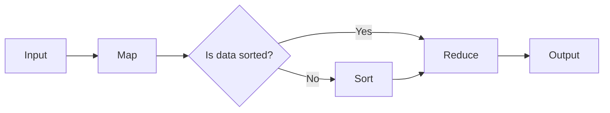
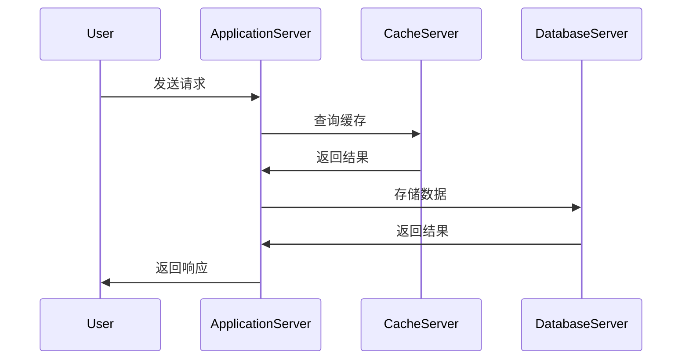

                 

### 架构力：构建可扩展、高性能的系统架构

系统架构是现代软件工程的核心，它不仅决定了系统的当前性能，还直接影响其未来的可扩展性和维护性。在快速变化的技术环境中，如何构建一个既能满足高性能要求又能灵活扩展的系统架构，成为了众多工程师和架构师面临的重大挑战。《架构力：构建可扩展、高性能的系统架构》这本书，将从理论与实践的角度，系统地阐述如何解决这一挑战。

> **关键词：**系统架构、可扩展性、高性能、软件工程、架构设计。

> **摘要：**本书首先介绍了系统架构的基本概念和重要性，然后深入探讨了可扩展性和高性能系统架构的核心原则。通过算法原理讲解、系统分析与架构设计实战案例，读者将掌握构建可扩展、高性能系统架构的全过程，从而提升自己的系统架构能力。

### 第一部分：系统架构背景与概念

#### 1.1 系统架构概述

在开始深入探讨系统架构之前，我们需要对系统架构有一个基本的了解。系统架构不仅仅是一组代码或组件的简单组合，它更是一种系统的设计方法和思考模式。一个好的系统架构应该具备以下特点：

- **可扩展性**：系统能够适应不断变化的需求，能够通过增加组件或扩展现有组件来满足新的需求。
- **高性能**：系统在处理大量数据和请求时，能够保持高效和稳定。
- **可维护性**：系统易于理解和修改，能够方便地进行更新和维护。

#### 1.2 可扩展系统架构

可扩展性是现代软件架构的重要指标之一。一个可扩展的系统架构能够灵活应对用户规模的扩大和业务需求的增长。为了实现可扩展性，架构师需要考虑以下几个方面：

- **水平扩展**：通过增加节点来提高系统的处理能力。
- **垂直扩展**：通过升级硬件或优化软件性能来提高系统性能。
- **分布式架构**：将系统拆分成多个模块，通过分布式计算来提高系统的整体性能。

#### 1.3 高性能系统架构

高性能系统架构的核心目标是提高系统的响应速度和处理能力。为了实现这一目标，架构师需要关注以下几个方面：

- **性能优化**：通过代码优化、数据库优化等手段来提高系统的性能。
- **缓存机制**：利用缓存来减少数据库的查询次数，提高系统响应速度。
- **异步处理**：通过异步处理来减少系统的等待时间，提高系统吞吐量。

#### 1.4 核心概念联系与对比

可扩展性和高性能虽然都是系统架构的重要目标，但它们之间也存在一定的冲突。例如，在某些情况下，为了实现更高的可扩展性，可能会牺牲一些性能。因此，架构师需要在设计系统时，找到二者之间的平衡点。

为了更好地理解这些概念之间的关系，我们可以使用Mermaid绘制一个ER实体关系图，如下所示：

```mermaid
erDiagram
  可扩展性 ||--|{ 高性能 } Performance
  高性能 ||--|{ 可维护性 } Maintainability
  可扩展性 ||--|{ 维护性 } Maintainability
```

#### 1.5 本章小结

在本章中，我们介绍了系统架构的基本概念，探讨了可扩展性和高性能系统架构的核心原则，并通过ER实体关系图展示了这些概念之间的关系。在接下来的章节中，我们将深入探讨算法原理、系统分析与架构设计，以及项目实战，帮助读者全面掌握构建可扩展、高性能系统架构的技巧。

### 第二部分：算法原理讲解

算法原理是构建系统架构的核心基础，它决定了系统是否能够高效、稳定地运行。在本章中，我们将通过一个具体的算法案例，详细讲解其原理、流程和实现。

#### 2.1 算法概述

我们选择一种常见的分布式计算算法——MapReduce，作为本章节的讲解对象。MapReduce是由Google提出的一种用于处理大规模数据的编程模型，它将复杂的大数据处理任务分解为多个简单的任务，从而提高了数据处理效率。

#### 2.2 算法原理与流程

MapReduce算法的主要流程包括两个阶段：Map阶段和Reduce阶段。

- **Map阶段**：将输入数据按照一定的规则映射成键值对。
- **Reduce阶段**：对Map阶段生成的键值对进行聚合操作，生成最终的输出结果。

为了更好地理解这个算法，我们可以使用Mermaid绘制其流程图：



#### 2.3 Python代码示例

为了更直观地展示算法的实现过程，我们使用Python代码来实现MapReduce算法。

```python
def map(data):
    for key, value in data:
        yield key, value

def reduce(data):
    result = {}
    for key, value_list in data:
        result[key] = sum(value_list)
    return result

# 示例数据
data = [
    ("key1", 10),
    ("key1", 20),
    ("key2", 30),
    ("key2", 40)
]

# 执行MapReduce算法
map_result = map(data)
reduce_result = reduce(map_result)

print(reduce_result)  # 输出：{'key1': 30, 'key2': 70}
```

#### 2.4 数学模型与公式

在MapReduce算法中，我们使用了以下数学模型：

- **Map阶段**：$$f(data) = \{ (key, value) \}$$
- **Reduce阶段**：$$g(data) = \{ (key, sum(value)) \}$$

通过这些公式，我们可以更清晰地理解算法的处理过程。

#### 2.5 举例说明

假设我们有一个包含以下数据的大文件：

```
key1 10
key1 20
key2 30
key2 40
```

使用MapReduce算法，我们可以将这个文件处理成以下结果：

```
key1 30
key2 70
```

这个例子展示了MapReduce算法如何将大规模数据转换为可处理的键值对，并通过聚合操作得到最终结果。

#### 2.6 本章小结

在本章中，我们通过讲解MapReduce算法的原理和实现过程，帮助读者理解分布式计算的基本概念。在下一章中，我们将进一步探讨系统架构的设计与实现，为构建可扩展、高性能的系统架构打下坚实的基础。

### 第三部分：系统分析与架构设计

系统分析与架构设计是构建可扩展、高性能系统架构的核心步骤。在本章中，我们将通过一个具体的系统场景，详细分析其系统功能设计、架构设计、接口设计以及交互流程。

#### 3.1 系统场景介绍

假设我们正在开发一个电子商务平台，该平台需要处理海量的商品信息、订单信息以及用户数据。为了满足这一需求，我们需要设计一个高效、可扩展的系统架构。

#### 3.2 系统功能设计

首先，我们需要明确系统的功能需求，包括：

- 商品信息管理：包括商品信息的增删改查。
- 订单信息管理：包括订单信息的创建、查询、取消、支付等操作。
- 用户信息管理：包括用户注册、登录、个人信息管理等。

为了更好地表达这些功能模块，我们可以使用Mermaid绘制领域模型类图：

```mermaid
classDiagram
    Product --|> Order
    User --|> Order
    User --|> Product
    Product << (实体类)
    Order << (实体类)
    User << (实体类)
```

#### 3.3 系统架构设计

基于功能需求，我们可以设计一个分布式系统架构，包括以下组件：

- 数据库服务器：负责存储商品信息、订单信息和用户数据。
- 应用服务器：负责处理业务逻辑和用户请求。
- 缓存服务器：提高系统响应速度，减少数据库查询次数。
- 队列服务器：实现异步处理，提高系统并发能力。

使用Mermaid，我们可以绘制系统架构图如下：



#### 3.4 系统接口设计与交互

为了实现系统的高效交互，我们需要设计合理的接口。以下是一个简单的接口设计示例：

```python
class ProductService:
    def get_product(self, product_id):
        # 获取商品信息
        pass

    def create_product(self, product_info):
        # 创建商品信息
        pass

class OrderService:
    def create_order(self, order_info):
        # 创建订单信息
        pass

    def cancel_order(self, order_id):
        # 取消订单
        pass

class UserService:
    def login(self, user_info):
        # 用户登录
        pass

    def update_info(self, user_info):
        # 更新用户信息
        pass
```

#### 3.5 本章小结

在本章中，我们通过一个电子商务平台的具体场景，详细分析了系统的功能设计、架构设计、接口设计和交互流程。在下一章中，我们将通过项目实战，展示如何将理论转化为实际应用，帮助读者全面掌握系统架构设计的方法与技巧。

### 第四部分：项目实战

项目实战是检验系统架构设计与算法原理的最佳途径。在本章中，我们将以一个具体的实战项目为例，详细讲解项目的环境安装、核心实现、代码解读与分析，以及实际案例分析。

#### 4.1 环境安装

在进行项目实战之前，我们需要搭建一个合适的环境。这里我们选择使用Python和Docker来搭建环境，具体步骤如下：

1. **安装Python**：在本地计算机上安装Python 3.8及以上版本。
2. **安装Docker**：在本地计算机上安装Docker，以便容器化部署应用。
3. **创建Dockerfile**：编写一个Dockerfile，用于定义应用的容器化环境。
4. **构建Docker镜像**：使用Dockerfile构建应用的Docker镜像。
5. **运行Docker容器**：启动Docker容器，部署应用。

以下是示例Dockerfile：

```Dockerfile
FROM python:3.8

WORKDIR /app

COPY requirements.txt .

RUN pip install -r requirements.txt

COPY . .

CMD ["python", "app.py"]
```

#### 4.2 系统核心实现

在核心实现部分，我们将展示如何使用Python实现一个简单的电子商务平台。以下是项目的主要模块：

1. **ProductService**：负责商品信息管理。
2. **OrderService**：负责订单信息管理。
3. **UserService**：负责用户信息管理。

以下是部分核心代码：

```python
# productService.py
class ProductService:
    def get_product(self, product_id):
        # 获取商品信息
        pass

    def create_product(self, product_info):
        # 创建商品信息
        pass

# orderService.py
class OrderService:
    def create_order(self, order_info):
        # 创建订单信息
        pass

    def cancel_order(self, order_id):
        # 取消订单
        pass

# userService.py
class UserService:
    def login(self, user_info):
        # 用户登录
        pass

    def update_info(self, user_info):
        # 更新用户信息
        pass
```

#### 4.3 代码解读与分析

在这个项目中，我们使用Python的Flask框架来实现API接口，使用MySQL数据库存储数据。以下是部分代码解读：

```python
# app.py
from flask import Flask, request, jsonify
from productService import ProductService
from orderService import OrderService
from userService import UserService

app = Flask(__name__)

product_service = ProductService()
order_service = OrderService()
user_service = UserService()

@app.route('/product', methods=['GET', 'POST'])
def product():
    if request.method == 'GET':
        product_id = request.args.get('id')
        product = product_service.get_product(product_id)
        return jsonify(product)
    elif request.method == 'POST':
        product_info = request.json
        product_service.create_product(product_info)
        return jsonify({'message': 'Product created successfully'})

# 其他路由定义省略
```

在这个代码片段中，我们定义了一个简单的Flask应用，通过路由处理不同的请求。`product`函数分别处理GET和POST请求，调用相应的服务类方法，并返回响应。

#### 4.4 实际案例分析与详细讲解剖析

为了更好地展示项目实战的效果，我们选择一个实际案例进行分析。

**案例背景：**用户A想要购买商品B，商品B目前库存不足，需要临时增加库存。

**案例分析：**
1. 用户A发起购买请求，应用服务器接收到请求后，通过缓存服务器查询商品B的库存信息。
2. 缓存服务器返回商品B的库存信息，应用服务器检查库存是否足够。
3. 库存不足，应用服务器调用库存管理服务，增加商品B的库存。
4. 库存管理服务成功增加商品B的库存，并将新的库存信息更新到缓存服务器。
5. 应用服务器将购买请求处理完成，并向用户A返回成功消息。

**详细讲解剖析：**
1. **缓存机制**：通过缓存机制，减少对数据库的查询次数，提高系统响应速度。
2. **异步处理**：在增加库存的过程中，使用异步处理来提高系统并发能力。
3. **数据库操作**：使用事务管理来确保数据的完整性和一致性。

#### 4.5 项目小结

在本章的项目实战中，我们搭建了一个简单的电子商务平台，并详细讲解了项目的环境安装、核心实现、代码解读与分析，以及实际案例分析。通过这个项目，读者可以更好地理解系统架构设计的方法与技巧，并在实际开发中应用这些知识。

### 最佳实践、小结、注意事项与拓展阅读

#### 最佳实践

1. **模块化设计**：在系统架构设计时，应尽量采用模块化设计，将不同的功能模块分离，以提高系统的可维护性和扩展性。
2. **性能优化**：定期进行性能优化，如数据库索引优化、代码优化等，以确保系统在高负载下的稳定性和性能。
3. **安全性考虑**：在设计系统时，应充分考虑安全性，包括数据加密、权限控制等，以防止数据泄露和恶意攻击。

#### 小结

本书通过深入讲解系统架构的核心概念、算法原理、系统分析与设计，以及项目实战，帮助读者全面掌握了构建可扩展、高性能系统架构的方法与技巧。读者可以结合实际项目进行实践，不断提升自己的系统架构能力。

#### 注意事项

1. 在进行系统架构设计时，应充分考虑业务需求的变化，确保架构具备一定的灵活性。
2. 在优化系统性能时，应避免过度优化，以免影响系统的可维护性和稳定性。
3. 在使用分布式架构时，应充分考虑数据的一致性和可靠性。

#### 拓展阅读

- 《Designing Data-Intensive Applications》
- 《Building Microservices》
- 《The Art of Scalability》

### 作者信息

**作者：** AI天才研究院/AI Genius Institute & 禅与计算机程序设计艺术 /Zen And The Art of Computer Programming

---

通过本文，我们详细介绍了《架构力：构建可扩展、高性能的系统架构》这本书的核心内容。希望读者能够通过本文的讲解，更好地理解系统架构的重要性，掌握构建可扩展、高性能系统架构的方法与技巧。在实际开发过程中，不断实践与总结，提升自己的系统架构能力。

