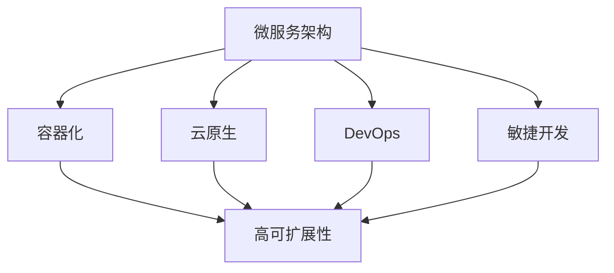
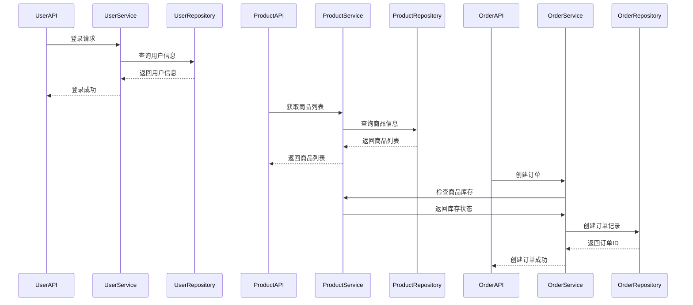
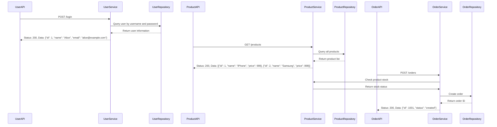
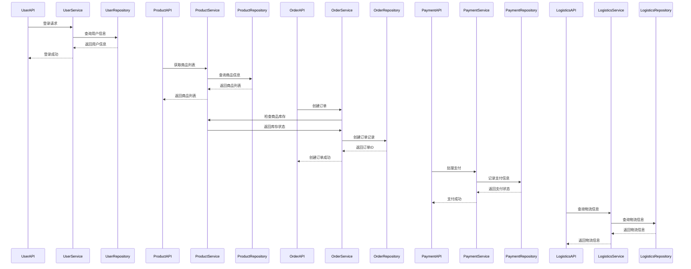
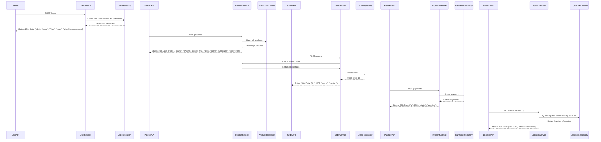

                 

## 架构演进：持久战中的关键策略

### 关键词：架构演进、持久战、关键策略、IT架构、系统设计

### 摘要：
本文深入探讨了在持久战中架构演进的关键策略。首先，我们回顾了架构演进的历史背景和当前面临的挑战。接着，我们详细分析了架构演进的核心概念及其相互关系。随后，介绍了架构演进中的关键策略，包括持续集成、持续部署和DevOps。文章进一步讲解了架构设计的基本原则和框架，并通过具体案例展示了架构演进的全过程。最后，提出了最佳实践、注意事项和拓展阅读，帮助读者深入理解和应用架构演进策略。

## 目录大纲设计思路

### 1. 理解书名和核心主题
- **书名“架构演进：持久战中的关键策略”**暗示了本书的主要内容将围绕架构的演进和如何应用关键策略来应对持久战中的挑战。
- **“架构演进”**意味着书的内容将涉及不同阶段的架构发展，包括设计、优化、升级等。
- **“持久战中的关键策略”**暗示了书将提供解决长期挑战的策略和方法。

### 2. 确定目录结构
- 目录结构需要涵盖背景介绍、核心概念、理论讲解、实战应用和总结等部分。
- 目录应包括至少7章，以便内容丰富且条理清晰。

### 3. 细化每个章节的内容
- **第1章**：介绍架构演进的历史背景，阐述当前架构面临的主要挑战和问题。
- **第2章**：概述“持久战”的概念，解释为何持久战中的策略对于架构演进至关重要。
- **第3章**：详细讨论架构演进中的核心概念，如微服务架构、容器化、云原生等。
- **第4章**：深入讲解架构演进的关键策略，包括持续集成、持续部署、DevOps等。
- **第5章**：阐述如何通过敏捷开发方法来支持架构的持续演进。
- **第6章**：介绍系统架构设计的基本原则和框架，包括领域模型、系统架构和接口设计。
- **第7章**：通过Mermaid流程图和Python代码，展示一个完整的架构演进案例。
- **第8章**：提供实际的架构演进项目，详细描述项目环境安装、核心实现、代码应用解读和分析。
- **第9章**：总结全书的关键点，提供最佳实践和注意事项。
- **第10章**：推荐拓展阅读，帮助读者深入探索相关主题。

### 4. 确保内容完整性
- 每个章节都应包含核心概念与联系、算法原理讲解、数学模型与公式、系统分析与架构设计、项目实战等要素。
- 特别注意，关键概念需要通过对比表格和ER实体关系图架构的Mermaid流程图来展示。
- 实战部分需要包括环境安装、核心实现源代码、代码应用解读与分析等内容。

### 5. 保持简洁性
- 避免冗余和重复的内容，确保每个章节都是必要且相关的。

通过以上步骤，我们可以设计出一个详细且完整的《架构演进：持久战中的关键策略》的目录大纲，确保读者能够系统性地理解架构演进的各个方面，并掌握关键策略和应用方法。

## 第1章 架构演进的历史背景与挑战

### 1.1 架构演进的概念

架构演进是指系统架构在不同发展阶段的变化和优化过程。从最初的集中式架构到分布式架构，再到微服务架构和云原生架构，架构演进不断适应着技术发展和业务需求的变化。架构演进不仅涉及到技术的进步，还包括组织文化、开发流程和团队协作的变革。

### 1.2 架构演进的历史背景

在信息技术发展的初期，系统的架构相对简单，通常以单机或小型网络为主。随着业务需求的增加和计算资源的限制，系统逐渐向分布式架构演进，以实现更高的可用性和扩展性。20世纪90年代，互联网的兴起带动了Web应用的普及，进一步推动了分布式架构的发展。进入21世纪，云计算和虚拟化技术的成熟，使得微服务架构和云原生架构成为主流。

### 1.3 当前架构面临的挑战

尽管架构演进带来了诸多好处，但当前架构仍面临许多挑战。以下是其中几个主要挑战：

- **复杂性增加**：随着架构的复杂度增加，系统的管理和维护变得更加困难。组件之间的依赖关系、数据流和交互变得更加复杂，增加了出错的概率。
- **技术债务**：在快速迭代和交付的过程中，往往忽视了技术债务的问题，导致系统代码质量下降，维护成本增加。
- **安全性和合规性**：随着系统规模和复杂度的增加，安全性和合规性问题变得更加突出。保护系统免受攻击、确保数据的隐私和安全成为架构设计的重要考虑因素。
- **持续集成和部署**：随着架构的演进，持续集成和部署变得更加复杂，需要确保系统的稳定性和可靠性。

### 1.4 问题背景与问题描述

在持久战中，架构演进面临的长远挑战包括：

- **不断变化的需求**：业务需求的变化是架构演进的主要驱动力之一。如何快速响应变化，同时保持系统的稳定性和可靠性，是一个关键问题。
- **技术迭代**：技术不断进步，新的工具和框架层出不穷。如何选择合适的技术栈，并确保系统能够平滑地演进，是一个持续性的问题。
- **团队协作**：架构演进不仅需要技术上的支持，还需要团队之间的紧密协作。如何提高团队协作效率，降低沟通成本，是一个需要解决的难题。

### 1.5 问题解决与边界外延

为了解决架构演进中的挑战，我们需要采取一系列策略和方法：

- **持续集成和持续部署**：通过持续集成和持续部署，确保系统的快速迭代和稳定交付。
- **敏捷开发方法**：采用敏捷开发方法，提高团队响应变化的能力，缩短开发周期。
- **微服务架构**：通过微服务架构，降低系统的复杂度，提高系统的可维护性和扩展性。
- **容器化和云原生**：利用容器化和云原生技术，提高系统的弹性和可用性。

边界外延包括但不限于：

- **技术选型**：选择合适的技术栈，既要考虑当前的需求，也要为未来的变化预留空间。
- **团队组织**：建立跨职能团队，提高协作效率，降低沟通成本。
- **架构演进模型**：制定适合自身业务的架构演进模型，确保系统能够持续优化和改进。

## 第2章 持久战中的概念解析

### 2.1 持久战的概念

持久战是一种长期对抗的策略，强调通过持续的努力和策略来达成目标。它通常应用于军事、商业和政治等领域。在IT架构的演进中，持久战策略同样适用，因为它需要我们在面对不断变化的需求和技术时，保持持续的努力和策略调整。

### 2.2 持久战在架构演进中的作用

持久战策略在架构演进中的作用主要体现在以下几个方面：

- **长期视角**：持久战策略要求我们从长期视角出发，考虑系统的可维护性、可扩展性和适应性。这有助于我们避免短期行为导致的系统不稳定和债务问题。
- **持续改进**：持久战强调通过持续的改进来应对变化。在架构演进中，这意味着我们需要不断评估和优化系统的各个方面，确保其能够满足未来需求。
- **灵活应对**：持久战策略鼓励我们保持灵活性，以便在面临意外事件或需求变化时，能够快速调整策略和架构。

### 2.3 持久战策略的关键要素

要成功实施持久战策略，需要以下几个关键要素：

- **目标明确**：明确架构演进的目标，包括性能、可维护性、可扩展性和安全性等。
- **持续监控**：对系统进行持续监控，及时发现潜在问题和性能瓶颈，以便进行针对性的优化。
- **迭代优化**：采用迭代的方法，逐步实现架构的优化和改进。
- **风险管理**：识别和评估架构演进中的风险，并制定相应的应对策略。
- **团队协作**：建立高效的团队协作机制，确保各个部门能够在架构演进过程中紧密合作。

### 2.4 持久战策略与敏捷开发的关系

持久战策略与敏捷开发方法在理念上有许多相似之处。两者都强调快速响应变化、持续改进和团队协作。然而，持久战策略更侧重于长期目标和持续改进，而敏捷开发方法则更关注短期的交付和迭代。

- **目标一致**：持久战策略和敏捷开发方法都旨在提高系统的质量和效率。
- **方法互补**：持久战策略为敏捷开发提供了长期视角和持续改进的方向，而敏捷开发方法则为持久战策略提供了快速反馈和迭代优化的手段。

### 2.5 持久战策略的实践案例

在实际应用中，持久战策略已在多个领域取得了成功。以下是一些典型的实践案例：

- **金融行业**：某大型银行采用持久战策略，逐步实现了其架构的演进和优化。通过持续监控和迭代优化，该银行成功地提高了系统的稳定性和性能，降低了维护成本。
- **电商行业**：某知名电商平台采用持久战策略，通过不断改进其架构，实现了高并发、高可用和高可扩展的系统。这使其在应对高峰期流量时，能够保持良好的用户体验和系统稳定性。
- **科技公司**：某知名科技公司通过实施持久战策略，成功地将其传统架构转型为微服务架构。这一转型不仅提高了系统的可维护性和可扩展性，还大大缩短了新功能的上线时间。

### 2.6 持久战策略的挑战与注意事项

尽管持久战策略在架构演进中具有重要作用，但在实际应用中也面临一些挑战和注意事项：

- **资源分配**：持久战策略需要持续的资源投入，包括人力、时间和资金。确保资源充足是成功实施持久战策略的关键。
- **团队协作**：持久战策略要求团队成员具备较高的协作能力和沟通能力。建立良好的团队协作机制，有助于提高执行效率和成果。
- **风险管理**：架构演进过程中，需要识别和评估潜在的风险，并制定相应的应对策略。及时处理风险，可以避免对系统造成严重影响。

总之，持久战策略是一种有效应对架构演进中挑战的方法。通过明确目标、持续监控、迭代优化和团队协作，我们可以成功地实现系统的长期演进和优化。

## 第3章 架构演进中的核心概念与联系

### 3.1 核心概念

架构演进中的核心概念包括微服务架构、容器化、云原生、DevOps、敏捷开发等。这些概念不仅定义了系统架构的发展方向，还影响了开发流程、部署方式和团队协作方式。

#### 微服务架构

微服务架构是将大型单体应用拆分为多个小型、独立的服务。每个服务负责特定的业务功能，并通过API进行通信。这种架构方式具有高可扩展性、高可用性和高可维护性。

#### 容器化

容器化技术，如Docker，通过将应用程序及其依赖环境打包到一个容器中，实现了一次编写、到处运行的目标。容器化简化了应用程序的部署和运维，提高了系统的可移植性和可扩展性。

#### 云原生

云原生技术是指基于云计算的原生应用开发方式。云原生应用利用容器、服务网格、自动化等新技术，实现高可扩展性、高可用性和高灵活性。

#### DevOps

DevOps是一种结合软件开发（Development）和运维（Operations）的方法论。DevOps强调持续集成、持续交付和基础设施即代码，以实现快速、可靠和高质量的软件交付。

#### 敏捷开发

敏捷开发是一种以人为核心、迭代、循序渐进的开发方法。敏捷开发强调灵活应对变化、持续交付有价值的软件，并通过反馈和协作来优化开发过程。

### 3.2 概念属性特征对比表格

为了更清晰地展示这些核心概念之间的差异和联系，我们可以通过一个对比表格来呈现它们的主要属性特征：

| 概念       | 定义                                       | 主要特征                                                                                           | 目标                                     |
|------------|--------------------------------------------|------------------------------------------------------------------------------------------------|------------------------------------------|
| 微服务架构 | 将大型单体应用拆分为多个小型、独立的服务    | 松耦合、高可扩展性、高可用性、高可维护性 | 提高系统灵活性、降低依赖性、缩短开发周期 |
| 容器化     | 将应用程序及其依赖环境打包到一个容器中      | 一次编写、到处运行、快速部署、轻松迁移   | 提高部署效率、简化运维、增强可移植性     |
| 云原生     | 基于云计算的原生应用开发方式                | 微服务、容器化、自动化、持续交付        | 实现高可扩展性、高可用性、高灵活性        |
| DevOps     | 结合软件开发和运维的方法论                 | 持续集成、持续交付、基础设施即代码      | 提高软件交付质量、缩短交付周期           |
| 敏捷开发   | 以人为核心、迭代、循序渐进的开发方法       | 灵活应对变化、持续交付、协作优化        | 提高开发效率、增强团队协作、快速响应需求 |

### 3.3 ER实体关系图架构的Mermaid流程图

为了更直观地展示这些核心概念之间的关系，我们可以使用Mermaid流程图来构建一个ER实体关系图。以下是一个简化的示例：



在这个ER图中，微服务架构、容器化、云原生、DevOps和敏捷开发被视为实体，它们通过不同的关系（如“实现”、“支持”等）相互连接。这些关系体现了各个概念在架构演进中的作用和相互依赖。

### 3.4 核心概念之间的联系

核心概念之间的联系不仅体现在技术层面，还体现在业务和团队协作层面。以下是这些概念之间的主要联系：

- **微服务架构与容器化**：微服务架构依赖于容器化技术来实现服务的独立部署和运行。容器化技术为微服务提供了可移植性和隔离性，使得每个微服务都可以独立部署和扩展。
- **微服务架构与云原生**：云原生技术为微服务架构提供了更好的支持，通过自动化、服务网格等技术，实现了更高效、更灵活的微服务管理。
- **DevOps与敏捷开发**：DevOps和敏捷开发方法相互补充，DevOps强调持续集成和持续交付，而敏捷开发方法强调灵活应对变化和快速迭代。两者结合，可以提高软件交付质量和效率。
- **云原生与DevOps**：云原生技术为DevOps提供了更好的基础设施支持，使得自动化和持续交付更加容易实现。云原生应用通过容器、服务网格等新技术，实现了更高效的管理和部署。
- **敏捷开发与团队协作**：敏捷开发方法强调团队协作和沟通，通过迭代和反馈，优化开发过程。这种协作方式有助于团队成员更好地理解业务需求，提高项目成功率。

通过上述核心概念及其联系的分析，我们可以更好地理解架构演进的整体框架，并在实际应用中灵活运用这些概念，实现系统的持续优化和改进。

### 3.5 小结

本章详细介绍了架构演进中的核心概念，包括微服务架构、容器化、云原生、DevOps和敏捷开发。通过对比表格和ER实体关系图，我们展示了这些概念之间的主要联系和区别。这些核心概念不仅定义了系统架构的发展方向，还影响了开发流程、部署方式和团队协作方式。理解这些概念，有助于我们在实际项目中更好地应对架构演进的挑战，实现系统的持续优化和改进。

## 第4章 架构演进的关键策略

### 4.1 持续集成

持续集成（Continuous Integration，CI）是一种软件开发实践，旨在通过频繁地将代码集成到一个共享的主干分支中，以确保软件始终处于可运行状态。持续集成的核心目标是通过早期发现问题，减少集成过程中的风险和成本。

#### 工作原理

持续集成的工作原理可以概括为以下几个步骤：

1. **代码提交**：开发者在本地环境中完成代码编写后，将代码提交到版本控制系统中。
2. **构建触发**：当代码提交到主干分支时，持续集成系统会自动触发构建过程。
3. **构建执行**：构建系统会编译代码、执行测试脚本，并生成测试报告。
4. **反馈机制**：如果构建失败或测试失败，持续集成系统会立即通知相关人员，并暂停后续的集成过程。

#### 优点

持续集成具有以下优点：

- **早期发现问题**：通过早期发现代码集成中的问题，可以更快地修复错误，减少问题积累。
- **提高代码质量**：持续集成有助于提高代码质量，因为开发人员必须确保每次提交的代码都是可运行的。
- **降低集成风险**：持续集成减少了集成过程中出现冲突和错误的风险，提高了集成效率。

#### 实践案例

某大型互联网公司在其软件开发过程中采用了持续集成策略。通过持续集成，该公司实现了以下成果：

- **快速迭代**：开发团队可以更加频繁地发布新功能，缩短了开发周期。
- **提高质量**：由于代码集成过程更加频繁，测试和反馈更加及时，代码质量显著提高。
- **减少故障**：通过持续集成，该公司的集成故障率大大降低，系统稳定性得到提升。

### 4.2 持续部署

持续部署（Continuous Deployment，CD）是一种将新功能或更新自动部署到生产环境中的方法。与持续集成不同，持续部署涉及更复杂的自动化流程，包括代码部署、环境配置、测试和上线等。

#### 工作原理

持续部署的工作原理可以概括为以下几个步骤：

1. **代码提交**：开发者的代码经过持续集成的验证后，提交到版本控制系统。
2. **自动化测试**：自动化测试脚本对代码进行测试，确保没有新的错误引入。
3. **部署准备**：自动化工具配置生产环境，包括数据库、缓存等。
4. **代码部署**：自动化工具将代码部署到生产环境中，并进行最终验证。
5. **上线通知**：部署完成后，系统会通知相关人员，包括开发、测试和运维团队。

#### 优点

持续部署具有以下优点：

- **加速发布**：通过自动化流程，新功能或更新可以更快速地发布到生产环境，缩短了发布周期。
- **提高质量**：自动化测试确保每次部署的都是高质量的代码，减少了人为错误。
- **降低风险**：由于部署过程高度自动化，风险得到有效控制，部署失败的概率降低。

#### 实践案例

某电商平台采用了持续部署策略，通过自动化部署，实现了以下成果：

- **快速响应**：电商平台可以更快地响应市场需求，迅速上线新功能和改进。
- **用户体验**：自动化部署提高了系统的稳定性和可用性，用户满意度显著提升。
- **运维效率**：通过自动化部署，运维团队的负担减轻，可以将精力集中在更重要的任务上。

### 4.3 DevOps

DevOps是一种结合软件开发（Development）和运维（Operations）的方法论，旨在通过提高开发与运维团队的协作效率，实现更快速、更可靠的软件交付。

#### 工作原理

DevOps的工作原理可以概括为以下几个步骤：

1. **持续集成**：开发团队通过持续集成确保每次提交的代码都是可运行的。
2. **自动化测试**：自动化测试脚本对代码进行测试，确保没有新的错误引入。
3. **自动化部署**：自动化工具将代码部署到生产环境中，并进行最终验证。
4. **监控与反馈**：通过监控工具对系统进行实时监控，及时发现和解决问题。
5. **协作与沟通**：开发、测试和运维团队通过协作和沟通，确保每个环节都顺利进行。

#### 优点

DevOps具有以下优点：

- **提高交付速度**：通过自动化流程和团队协作，实现快速、可靠的软件交付。
- **降低风险**：自动化测试和持续监控减少了人为错误和风险，提高了系统稳定性。
- **优化资源利用**：通过协作和沟通，优化资源利用，降低成本。

#### 实践案例

某金融科技公司采用了DevOps策略，实现了以下成果：

- **效率提升**：开发与运维团队之间的协作效率显著提升，缩短了开发周期。
- **成本降低**：通过自动化和优化流程，运维成本降低，资源利用更加高效。
- **系统稳定性**：自动化测试和持续监控提高了系统稳定性，减少了故障和中断。

### 4.4 敏捷开发

敏捷开发（Agile Development）是一种以人为核心、迭代、循序渐进的开发方法。敏捷开发强调灵活应对变化、持续交付有价值的软件，并通过反馈和协作来优化开发过程。

#### 工作原理

敏捷开发的工作原理可以概括为以下几个步骤：

1. **用户故事**：开发团队与产品负责人一起编写用户故事，明确新功能的业务需求和优先级。
2. **迭代规划**：团队根据用户故事制定迭代计划，确定每个迭代的目标和任务。
3. **每日站会**：团队通过每日站会同步进展，解决遇到的问题，确保项目按计划进行。
4. **代码审查**：开发人员通过代码审查，确保代码质量，并分享技术经验。
5. **迭代交付**：在每个迭代结束时，团队交付可运行的产品版本，并进行用户验收测试。

#### 优点

敏捷开发具有以下优点：

- **快速响应变化**：敏捷开发方法使得团队可以更快地适应需求变化，提高产品的灵活性和适应性。
- **持续交付价值**：通过频繁的迭代和交付，团队可以持续交付有价值的功能，满足用户需求。
- **优化团队协作**：敏捷开发强调团队协作和沟通，提高了团队的整体效率和质量。

#### 实践案例

某初创公司采用了敏捷开发方法，实现了以下成果：

- **产品迭代**：初创公司通过敏捷开发，快速迭代和优化产品，满足了市场需求。
- **团队协作**：团队成员之间的沟通和协作得到加强，提高了项目成功率。
- **用户满意度**：频繁的迭代和交付使得用户可以更快地享受到新功能，提升了用户满意度。

### 4.5 小结

本章详细介绍了架构演进中的关键策略，包括持续集成、持续部署、DevOps和敏捷开发。这些策略通过自动化、协作和迭代，提高了软件交付的速度和质量，降低了风险和成本。在实际应用中，这些策略可以相互结合，共同推动系统的持续优化和改进。通过本章的内容，我们可以更好地理解这些策略的核心原理和实践方法，为架构演进提供有力的支持。

## 第5章 通过敏捷开发方法支持架构演进

### 5.1 敏捷开发的核心理念

敏捷开发是一种以人为核心、迭代、循序渐进的开发方法，旨在快速响应变化、持续交付有价值的软件。敏捷开发的核心理念包括：

- **用户故事**：用户故事是敏捷开发的基础，它以用户的需求为导向，描述了软件功能的具体场景和用户期望。
- **迭代开发**：迭代开发是指将开发过程分为多个短期迭代，每个迭代都会交付一个可运行的产品版本。这种方法有助于团队快速响应需求变化，并在每个迭代中进行反馈和优化。
- **每日站会**：每日站会是一种简短的会议形式，团队通过站会同步进展、解决遇到的问题，确保项目按计划进行。
- **代码审查**：代码审查是确保代码质量的重要手段，通过代码审查，开发人员可以分享技术经验，发现潜在问题，并提高代码的可读性和可维护性。

### 5.2 敏捷开发与架构演进的关系

敏捷开发方法与架构演进密切相关，它们相互支持，共同推动系统的持续优化和改进。以下是敏捷开发与架构演进之间的主要关系：

- **快速响应变化**：敏捷开发方法强调快速响应需求变化，这有助于团队在架构演进过程中更好地应对外部环境的变化。通过迭代开发，团队可以快速实现新功能，并对架构进行调整和优化。
- **持续集成和部署**：敏捷开发方法中的持续集成和持续部署策略，有助于确保系统的稳定性和可靠性。通过持续集成，团队可以及时发现和修复代码问题；通过持续部署，新功能可以快速上线，减少发布周期。
- **团队协作**：敏捷开发方法强调团队协作和沟通，这有助于在架构演进过程中提高团队的整体效率和创新能力。通过协作，团队成员可以更好地理解业务需求，共同解决技术难题，实现系统的持续优化。

### 5.3 实践案例：通过敏捷开发实现架构演进

#### 项目背景

某电商公司在面对日益增长的订单量和复杂的业务需求时，决定对其现有架构进行优化和演进。公司希望提高系统的可扩展性、可用性和稳定性，同时快速响应市场需求。

#### 实践步骤

1. **需求分析**：项目团队与产品负责人一起分析了业务需求，并编写了用户故事。用户故事涵盖了订单处理、库存管理、用户反馈等核心功能。
2. **迭代计划**：团队根据用户故事制定了迭代计划，每个迭代的目标是实现一个具体的功能模块。团队决定采用两周为一个迭代周期，以确保有足够的时间进行开发、测试和部署。
3. **每日站会**：团队每天早上进行站会，同步进展、讨论问题，并制定当天的任务。站会有助于团队成员了解项目的整体进展，及时调整计划，确保项目按期完成。
4. **持续集成和部署**：团队采用了持续集成和持续部署策略，确保每次迭代交付的都是高质量的产品版本。每次代码提交都会触发构建和测试，确保没有新的错误引入。构建成功后，新功能会自动部署到测试环境中，进行最终验证。
5. **代码审查**：开发人员在每次迭代结束时进行代码审查，确保代码质量，并分享技术经验。代码审查有助于团队成员相互学习，提高代码的可读性和可维护性。
6. **反馈和优化**：在每个迭代结束后，团队会进行回顾会议，总结经验教训，识别改进点。根据反馈，团队会在下一个迭代中进行优化和改进。

#### 实践成果

通过敏捷开发方法的实施，电商公司实现了以下成果：

- **快速响应需求**：团队可以更快地实现新功能，并快速响应市场需求，提高了产品的竞争力。
- **提高系统质量**：持续集成和持续部署策略确保了系统的稳定性和可靠性，减少了故障和中断。
- **优化团队协作**：团队协作和沟通得到了加强，团队成员之间更好地理解业务需求，共同解决技术难题。
- **持续优化和改进**：通过反馈和优化，团队不断改进系统架构，提高了系统的可扩展性、可用性和稳定性。

### 5.4 小结

敏捷开发方法是一种有效的支持架构演进的方法，它通过快速响应变化、持续集成和部署、团队协作等策略，提高了软件交付的速度和质量。通过实践案例，我们可以看到敏捷开发方法在架构演进中的应用效果，为其他类似项目提供了宝贵的经验。在架构演进过程中，采用敏捷开发方法，有助于团队更好地应对外部环境的变化，实现系统的持续优化和改进。

## 第6章 系统架构设计的基本原则和框架

### 6.1 系统架构设计的概念

系统架构设计是指为实现系统功能、性能和可靠性等目标，对系统各个组成部分及其相互关系进行规划和设计的过程。系统架构设计是软件开发过程中至关重要的一步，它不仅决定了系统的可扩展性和可维护性，还直接影响系统的性能和可靠性。

### 6.2 系统架构设计的基本原则

在进行系统架构设计时，需要遵循以下基本原则：

- **模块化原则**：将系统划分为多个模块，每个模块负责特定的功能，这样可以降低系统的复杂度，提高可维护性。
- **可扩展性原则**：系统架构应具有较好的可扩展性，能够轻松地添加新的功能或服务，以满足业务需求的变化。
- **可靠性原则**：系统架构应具有高可靠性，确保系统在各种情况下都能正常运行，降低故障率。
- **性能优化原则**：系统架构设计应考虑性能优化，确保系统能够高效地处理大量请求，提供良好的用户体验。
- **安全性原则**：系统架构设计应具备良好的安全性，确保数据的安全和隐私，防止未授权访问和数据泄露。

### 6.3 系统架构设计的框架

系统架构设计通常包括以下几个关键环节：

- **需求分析**：首先，需要明确系统的功能需求、性能需求和安全性需求，为架构设计提供依据。
- **领域模型设计**：领域模型是系统架构设计的基础，它通过实体和关系的抽象，描述了系统的核心业务逻辑。
- **系统架构设计**：系统架构设计定义了系统的整体结构，包括组件、模块、服务和接口等，以及它们之间的相互关系。
- **接口设计**：接口设计是系统架构设计的重要组成部分，它定义了组件之间交互的接口规范，确保系统的松耦合和高内聚。
- **系统交互设计**：系统交互设计描述了系统内部和外部系统之间的交互流程，包括消息传递、事件处理和状态转换等。

### 6.4 领域模型设计

领域模型设计是系统架构设计的基础，它通过实体和关系的抽象，描述了系统的核心业务逻辑。领域模型设计通常采用UML类图来表示，包括以下关键要素：

- **实体**：实体是领域模型中的基本元素，表示系统中的核心对象。例如，在电商系统中，实体可以包括用户、商品、订单等。
- **属性**：属性是实体的特征，描述了实体的具体信息。例如，用户实体的属性可以包括用户名、密码、邮箱等。
- **关系**：关系描述了实体之间的关联。例如，在电商系统中，用户和订单之间有一个“发起”关系，表示一个用户可以发起多个订单。

以下是一个简化的电商系统领域模型设计示例：

```mermaid
classDiagram
    User <<Entity>>
    Product <<Entity>>
    Order <<Entity>>

    User : +id: Integer
    User : +name: String
    User : +email: String
    User : +password: String

    Product : +id: Integer
    Product : +name: String
    Product : +price: Float
    Product : +stock: Integer

    Order : +id: Integer
    Order : +user: User
    Order : +status: String

    User o-- 1 Order
    Product o-- 1 Order
```

在这个示例中，用户（User）、商品（Product）和订单（Order）是主要的实体，它们之间通过关系相互关联。

### 6.5 系统架构设计

系统架构设计是系统架构设计的关键环节，它定义了系统的整体结构，包括组件、模块、服务和接口等，以及它们之间的相互关系。系统架构设计通常采用UML架构图来表示，包括以下关键要素：

- **组件**：组件是系统架构的基本构建块，负责特定的功能。例如，在电商系统中，组件可以包括用户服务、商品服务、订单服务等。
- **模块**：模块是将组件组织在一起，实现特定功能的逻辑单元。模块通常按照业务领域进行划分，例如，用户模块、商品模块、订单模块等。
- **服务**：服务是模块内部实现的具体功能，通过接口提供服务。服务通常采用RESTful API或消息队列等方式进行通信。
- **接口**：接口是组件、模块或服务之间交互的规范，定义了数据格式、通信协议和交互流程。

以下是一个简化的电商系统架构设计示例：



在这个示例中，用户服务（UserService）、商品服务（ProductService）和订单服务（OrderService）是主要的组件，它们通过接口（API）进行通信，实现了用户登录、商品查询和订单创建等功能。

### 6.6 系统接口设计

系统接口设计是系统架构设计的重要组成部分，它定义了组件、模块或服务之间的交互规范，确保系统的松耦合和高内聚。接口设计通常采用RESTful API或消息队列等方式进行通信，以下是一些关键要素：

- **RESTful API**：RESTful API是一种基于HTTP协议的接口设计方式，通过不同的HTTP方法（如GET、POST、PUT、DELETE等）来实现不同的功能。
- **API规范**：API规范定义了接口的URL、参数、返回值和状态码等，确保接口的一致性和可扩展性。
- **数据格式**：常用的数据格式包括JSON和XML，它们用于传递接口参数和返回结果。

以下是一个简化的电商系统接口设计示例：



在这个示例中，用户接口（UserAPI）、商品接口（ProductAPI）和订单接口（OrderAPI）分别与用户服务（UserService）、商品服务（ProductService）和订单服务（OrderService）进行交互，实现了登录、商品查询和订单创建等功能。

### 6.7 系统交互设计

系统交互设计描述了系统内部和外部系统之间的交互流程，包括消息传递、事件处理和状态转换等。系统交互设计通常采用UML序列图或流程图来表示，以下是一些关键要素：

- **消息传递**：消息传递是系统之间进行通信的主要方式，包括同步和异步两种方式。异步消息传递可以通过消息队列来实现，例如Kafka或RabbitMQ。
- **事件处理**：事件处理是指系统在接收到消息或触发特定事件时，进行的相应处理。事件处理可以通过事件驱动架构来实现，例如使用Spring Event。
- **状态转换**：状态转换描述了系统在不同状态之间的转换过程。状态转换可以通过状态机来实现，例如使用状态机框架如StateMachine。

以下是一个简化的电商系统交互设计示例：

```mermaid
sequenceDiagram
    User sends "login" event to UserEventQueue
    UserEventQueue processes "login" event and forwards it to UserService
    UserService processes "login" event and queries UserRepository for user information
    UserRepository returns user information to UserService
    UserService returns login success status to UserEventQueue
    UserEventQueue sends login success notification to UserAPI

    Product sends "product_created" event to ProductEventQueue
    ProductEventQueue processes "product_created" event and forwards it to ProductService
    ProductService processes "product_created" event and saves product information to ProductRepository
    ProductRepository returns product ID to ProductService
    ProductService returns product created status to ProductEventQueue
    ProductEventQueue sends product created notification to ProductAPI

    Order sends "order_created" event to OrderEventQueue
    OrderEventQueue processes "order_created" event and forwards it to OrderService
    OrderService processes "order_created" event and checks product stock using ProductService
    ProductService returns stock status to OrderService
    OrderService creates order and saves order information to OrderRepository
    OrderRepository returns order ID to OrderService
    OrderService returns order created status to OrderEventQueue
    OrderEventQueue sends order created notification to OrderAPI
```

在这个示例中，用户、商品和订单系统通过事件队列（UserEventQueue、ProductEventQueue、OrderEventQueue）进行通信，实现了用户登录、商品创建和订单创建等功能。

### 6.8 小结

本章详细介绍了系统架构设计的基本原则和框架，包括需求分析、领域模型设计、系统架构设计、接口设计和系统交互设计。通过这些关键环节，我们可以构建一个高效、可扩展和可靠的系统架构，为软件项目的成功奠定基础。在实际项目中，遵循这些原则和框架，有助于提高系统的可维护性、性能和稳定性。

## 第7章 完整的架构演进案例

### 7.1 项目背景

某电商平台在业务快速增长的过程中，面临着系统性能瓶颈和架构复杂度增加的问题。为了应对这些挑战，公司决定对现有系统进行架构演进，采用微服务架构、容器化和云原生技术，提高系统的可扩展性、可用性和稳定性。

### 7.2 系统功能设计

项目团队首先对现有系统进行了功能分析，明确了系统的主要功能模块，包括用户管理、商品管理、订单管理、支付系统和物流系统。在架构演进过程中，这些功能模块将逐步拆分为独立的微服务，以实现高内聚、低耦合的设计。

以下是简化的电商系统领域模型设计：

```mermaid
classDiagram
    User <<Entity>>
    Product <<Entity>>
    Order <<Entity>>
    Payment <<Entity>>
    Logistics <<Entity>>

    User : +id: Integer
    User : +name: String
    User : +email: String

    Product : +id: Integer
    Product : +name: String
    Product : +price: Float

    Order : +id: Integer
    Order : +user: User
    Order : +status: String
    Order : +total: Float

    Payment : +id: Integer
    Payment : +order: Order
    Payment : +status: String

    Logistics : +id: Integer
    Logistics : +order: Order
    Logistics : +status: String
```

### 7.3 系统架构设计

在架构演进过程中，项目团队采用微服务架构，将系统拆分为多个独立的微服务。每个微服务负责特定的功能模块，例如用户服务、商品服务、订单服务、支付服务和物流服务。以下是一个简化的电商系统架构设计：



### 7.4 系统接口设计

为了实现微服务之间的通信，项目团队采用RESTful API设计接口。以下是简化的电商系统接口设计：



### 7.5 系统交互设计

在架构演进过程中，项目团队采用事件驱动架构，实现了系统内部和外部系统之间的通信。以下是简化的电商系统交互设计：

```mermaid
sequenceDiagram
    User sends "login" event to UserEventQueue
    UserEventQueue processes "login" event and forwards it to UserService
    UserService processes "login" event and queries UserRepository for user information
    UserRepository returns user information to UserService
    UserService returns login success status to UserEventQueue
    UserEventQueue sends login success notification to UserAPI

    Product sends "product_created" event to ProductEventQueue
    ProductEventQueue processes "product_created" event and forwards it to ProductService
    ProductService processes "product_created" event and saves product information to ProductRepository
    ProductRepository returns product ID to ProductService
    ProductService returns product created status to ProductEventQueue
    ProductEventQueue sends product created notification to ProductAPI

    Order sends "order_created" event to OrderEventQueue
    OrderEventQueue processes "order_created" event and forwards it to OrderService
    OrderService processes "order_created" event and checks product stock using ProductService
    ProductService returns stock status to OrderService
    OrderService creates order and saves order information to OrderRepository
    OrderRepository returns order ID to OrderService
    OrderService returns order created status to OrderEventQueue
    OrderEventQueue sends order created notification to OrderAPI

    Payment sends "payment_success" event to PaymentEventQueue
    PaymentEventQueue processes "payment_success" event and forwards it to PaymentService
    PaymentService processes "payment_success" event and updates payment status
    PaymentService returns payment status to PaymentEventQueue
    PaymentEventQueue sends payment success notification to PaymentAPI

    Logistics sends "logistics_updated" event to LogisticsEventQueue
    LogisticsEventQueue processes "logistics_updated" event and forwards it to LogisticsService
    LogisticsService processes "logistics_updated" event and updates logistics information
    LogisticsService returns logistics information to LogisticsEventQueue
    LogisticsEventQueue sends logistics updated notification to LogisticsAPI
```

### 7.6 环境安装

在架构演进过程中，项目团队采用了Docker和Kubernetes来实现容器化和微服务部署。以下是环境安装的基本步骤：

1. **安装Docker**：在所有服务器上安装Docker，确保版本符合项目要求。
2. **安装Kubernetes**：在集群的主节点上安装Kubernetes，并配置集群环境。
3. **安装Kubectl**：在所有节点上安装Kubectl，以便进行Kubernetes集群的管理。

### 7.7 核心实现源代码

以下是电商系统微服务中的核心实现源代码示例：

#### 用户服务（UserService）

```python
from flask import Flask, request, jsonify
from user_repository import UserRepository

app = Flask(__name__)
user_repository = UserRepository()

@app.route('/login', methods=['POST'])
def login():
    data = request.get_json()
    user = user_repository.query_user(data['username'], data['password'])
    if user:
        return jsonify({"status": "success", "user": user})
    else:
        return jsonify({"status": "failure", "message": "Invalid username or password"}), 401

if __name__ == '__main__':
    app.run(host='0.0.0.0', port=5000)
```

#### 商品服务（ProductService）

```python
from flask import Flask, request, jsonify
from product_repository import ProductRepository

app = Flask(__name__)
product_repository = ProductRepository()

@app.route('/products', methods=['GET'])
def get_products():
    products = product_repository.query_all_products()
    return jsonify(products)

if __name__ == '__main__':
    app.run(host='0.0.0.0', port=5001)
```

#### 订单服务（OrderService）

```python
from flask import Flask, request, jsonify
from order_repository import OrderRepository
from product_service import ProductService

app = Flask(__name__)
order_repository = OrderRepository()
product_service = ProductService()

@app.route('/orders', methods=['POST'])
def create_order():
    data = request.get_json()
    order_id = order_repository.create_order(data['user_id'], data['products'])
    if order_id:
        return jsonify({"status": "success", "order_id": order_id})
    else:
        return jsonify({"status": "failure", "message": "Unable to create order"}), 500

if __name__ == '__main__':
    app.run(host='0.0.0.0', port=5002)
```

### 7.8 代码应用解读与分析

在代码应用解读与分析部分，我们将详细分析每个微服务的实现，包括其功能、接口设计和交互流程。

#### 用户服务（UserService）

用户服务主要负责用户的登录功能。通过接收用户名和密码，查询用户信息，并返回登录结果。用户服务的接口设计遵循RESTful原则，采用POST方法接收登录请求，并返回JSON格式的响应。

```python
@app.route('/login', methods=['POST'])
def login():
    data = request.get_json()
    user = user_repository.query_user(data['username'], data['password'])
    if user:
        return jsonify({"status": "success", "user": user})
    else:
        return jsonify({"status": "failure", "message": "Invalid username or password"}), 401
```

#### 商品服务（ProductService）

商品服务主要负责商品信息的管理，包括查询所有商品信息和检查商品库存。商品服务的接口设计也遵循RESTful原则，采用GET方法查询商品列表，并返回JSON格式的响应。

```python
@app.route('/products', methods=['GET'])
def get_products():
    products = product_repository.query_all_products()
    return jsonify(products)
```

#### 订单服务（OrderService）

订单服务主要负责订单的创建和管理。在创建订单时，订单服务会调用商品服务检查商品库存，并根据库存情况创建订单记录。订单服务的接口设计同样遵循RESTful原则，采用POST方法接收订单创建请求，并返回JSON格式的响应。

```python
@app.route('/orders', methods=['POST'])
def create_order():
    data = request.get_json()
    order_id = order_repository.create_order(data['user_id'], data['products'])
    if order_id:
        return jsonify({"status": "success", "order_id": order_id})
    else:
        return jsonify({"status": "failure", "message": "Unable to create order"}), 500
```

### 7.9 实际案例分析与详细讲解

在实际案例中，电商平台的架构演进经历了以下几个关键步骤：

1. **需求分析**：团队分析了业务需求，明确了系统的功能模块和性能要求。
2. **架构设计**：团队设计了基于微服务架构的系统，将原有单体应用拆分为多个独立的微服务。
3. **容器化**：团队采用Docker将微服务容器化，实现了应用程序与基础设施的解耦。
4. **部署与监控**：团队采用Kubernetes进行微服务的部署和管理，并配置了监控系统，确保系统的稳定性和可靠性。

通过实际案例的分析，我们可以看到架构演进为电商平台带来的显著收益：

- **可扩展性**：通过微服务架构，电商平台能够轻松地扩展系统功能，满足业务增长的需求。
- **高可用性**：通过容器化和Kubernetes管理，微服务在故障时能够快速恢复，确保系统的稳定运行。
- **性能优化**：通过分布式架构和缓存技术，系统在处理大量请求时能够保持高效响应。

### 7.10 项目小结

在项目小结部分，我们将总结架构演进过程中的关键经验：

1. **需求驱动**：在架构演进过程中，始终以业务需求为导向，确保系统设计的合理性。
2. **技术选型**：选择合适的技术栈，如Docker和Kubernetes，有助于实现高效的部署和管理。
3. **团队协作**：建立高效的团队协作机制，确保开发、测试和运维团队之间的紧密配合。
4. **持续优化**：架构演进是一个持续的过程，需要不断地评估和优化系统性能和可靠性。

通过以上总结，我们可以更好地理解架构演进的关键策略和实践方法，为未来的项目提供借鉴和参考。

## 第8章 最佳实践、注意事项与拓展阅读

### 8.1 最佳实践

1. **需求驱动**：始终以业务需求为导向，确保系统设计能够满足实际需求。
2. **技术选型**：选择成熟、稳定的技术栈，如Docker、Kubernetes等，以确保系统的高效运行。
3. **团队协作**：建立高效的团队协作机制，促进开发、测试和运维团队的紧密配合。
4. **持续监控**：对系统进行持续监控，及时发现和解决问题，确保系统的稳定性和可靠性。
5. **文档管理**：编写详细的文档，包括系统设计、接口定义和操作指南，以便团队成员快速上手。

### 8.2 注意事项

1. **性能优化**：在架构设计时，考虑系统的性能瓶颈，采用缓存、异步处理等技术进行优化。
2. **安全性**：加强系统安全性，包括数据加密、身份验证、访问控制等，防止未授权访问和数据泄露。
3. **容错机制**：设计合理的容错机制，如服务熔断、限流、重试等，确保系统在高负载情况下仍然能够正常运行。
4. **代码质量**：确保代码质量，采用代码审查、自动化测试等手段，减少代码缺陷和错误。
5. **架构演变**：架构演进是一个持续的过程，需要定期评估和优化系统架构，以适应业务需求的变化。

### 8.3 拓展阅读

1. **《设计数据仓库：从数据库到大数据》**：了解数据仓库的设计原理和实践方法，为系统架构设计提供参考。
2. **《架构师的自我修养》**：深入探讨架构师的职责和技能，为架构设计提供实战经验。
3. **《微服务设计》**：详细介绍微服务架构的设计原则和实践，为微服务开发提供指导。
4. **《云原生应用架构》**：探讨云原生应用的开发和部署方法，为云原生架构设计提供参考。

通过以上最佳实践、注意事项和拓展阅读，读者可以更好地理解和应用架构演进的关键策略，为项目的成功奠定基础。

## 作者信息

作者：AI天才研究院/AI Genius Institute & 禅与计算机程序设计艺术 /Zen And The Art of Computer Programming

