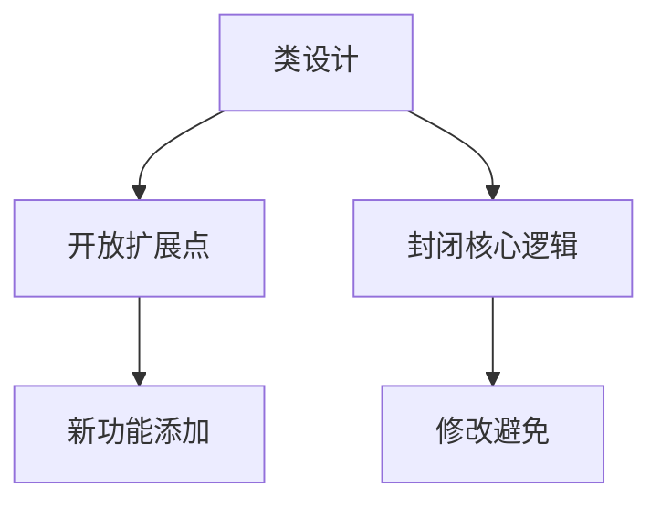
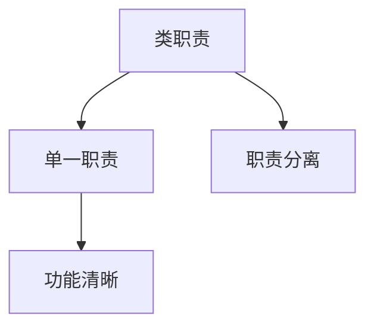
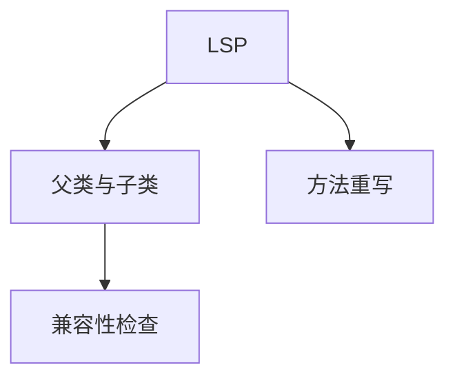
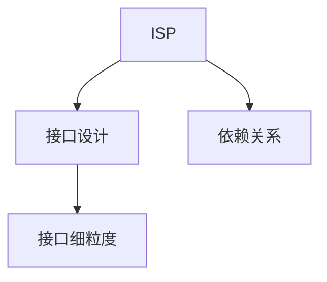
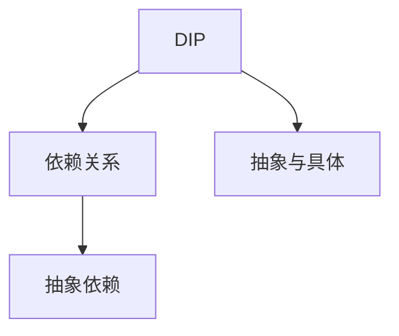
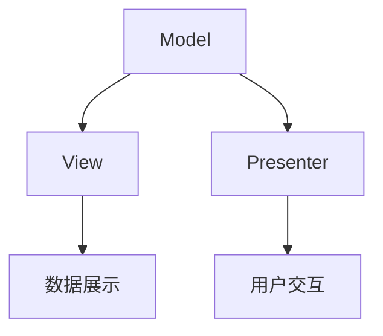
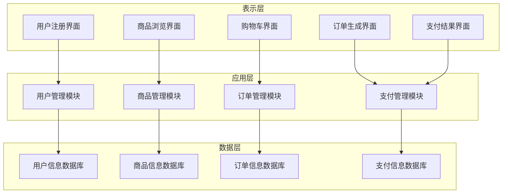
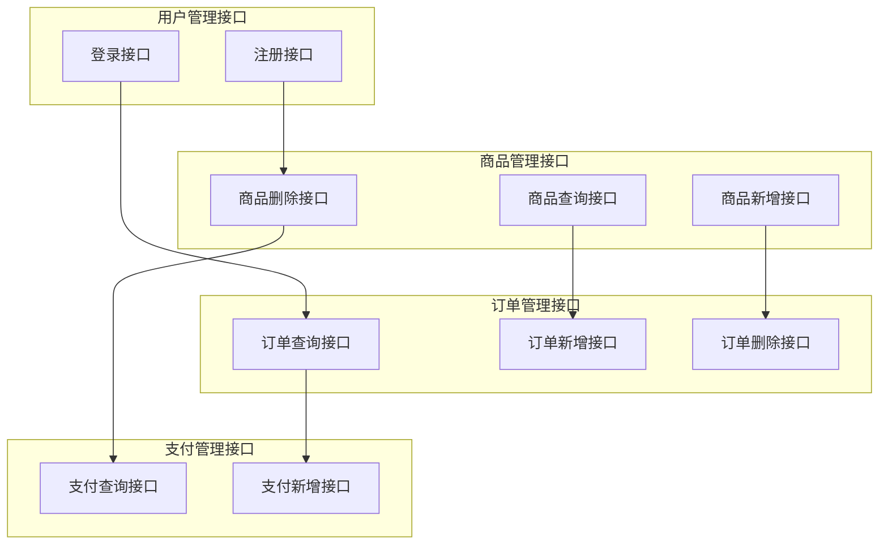
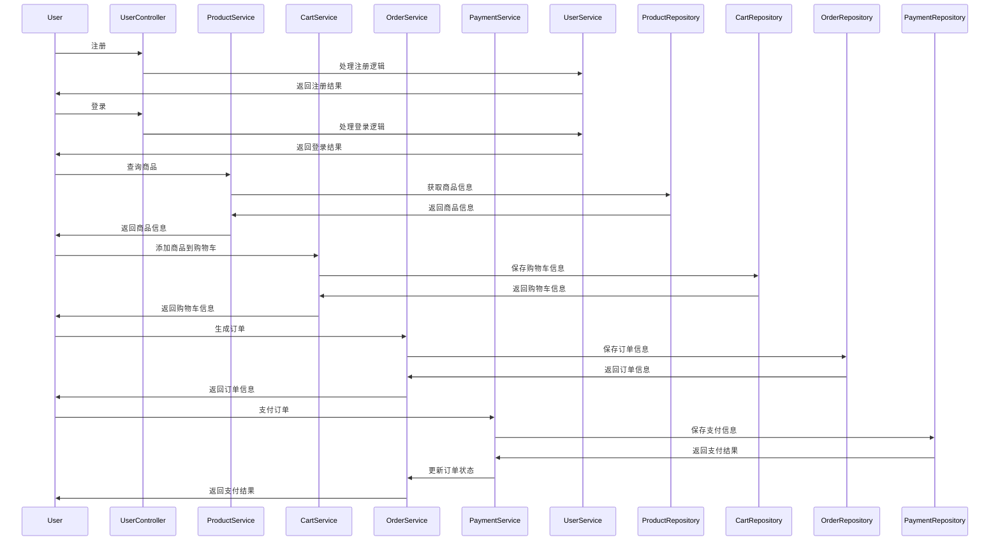

                 


**文章标题：架构设计模式：P9工程师的智慧结晶**

**文章关键词：架构设计、模式、P9工程师、智慧、结晶**

**文章摘要：**
本文将深入探讨架构设计模式，结合P9工程师的丰富经验和智慧结晶，帮助读者理解并掌握各种架构设计原则和模式。通过详细的分析和实例讲解，读者将能够提升架构设计能力，解决实际项目中的复杂问题。

## 目录

### 第一部分：架构设计基础理论

#### 1.1 架构设计的基本原则
1.1.1 分层设计原则
1.1.2 开放封闭原则
1.1.3 单一职责原则
1.1.4 LSP（里氏替换原则）
1.1.5 ISP（接口隔离原则）
1.1.6 DIP（依赖倒置原则）

#### 1.2 架构设计模式
1.2.1 MVC模式
1.2.2 MVP模式

### 第二部分：典型架构设计案例

#### 2.1 电商系统架构设计
2.1.1 问题场景介绍
2.1.2 系统功能设计
2.1.3 系统架构设计
2.1.4 系统接口设计
2.1.5 系统交互序列图

#### 2.2 金融系统架构设计
2.2.1 问题场景介绍
2.2.2 系统功能设计
2.2.3 系统架构设计
2.2.4 系统接口设计
2.2.5 系统交互序列图

#### 2.3 社交网络系统架构设计
2.3.1 问题场景介绍
2.3.2 系统功能设计
2.3.3 系统架构设计
2.3.4 系统接口设计
2.3.5 系统交互序列图

#### 2.4 大数据系统架构设计
2.4.1 问题场景介绍
2.4.2 系统功能设计
2.4.3 系统架构设计
2.4.4 系统接口设计
2.4.5 系统交互序列图

#### 2.5 物联网系统架构设计
2.5.1 问题场景介绍
2.5.2 系统功能设计
2.5.3 系统架构设计
2.5.4 系统接口设计
2.5.5 系统交互序列图

### 第三部分：实战与最佳实践

#### 3.1 架构设计流程与工具
3.1.1 架构设计流程
3.1.2 架构设计工具

#### 3.2 持续集成与持续部署
3.2.1 持续集成
3.2.2 持续部署

#### 3.3 架构设计中的安全性与稳定性
3.3.1 安全性设计
3.3.2 稳定性设计

#### 3.4 架构设计的可持续性与可维护性
3.4.1 可持续性设计
3.4.2 可维护性设计

#### 3.5 架构设计的迭代与优化
3.5.1 迭代设计
3.5.2 优化设计

### 第四部分：前沿架构设计与趋势

#### 4.1 服务网格架构设计
4.1.1 服务网格概述
4.1.2 服务网格架构设计

#### 4.2 函数即服务（FaaS）
4.2.1 FaaS概述
4.2.2 FaaS架构设计

#### 4.3 混合云与多云架构设计
4.3.1 混合云架构设计
4.3.2 多云架构设计

#### 4.4 架构设计的未来趋势
4.4.1 未来架构趋势分析
4.4.2 架构设计发展方向

### 附录

#### A. 架构设计资源汇总
A.1 资源汇总列表

#### B. 常用架构设计模式列表
B.1 模式列表

#### C. 技术选型参考
C.1 技术选型参考

#### D. 架构设计书籍推荐
D.1 书籍推荐列表

#### E. 架构设计博客和社区推荐
E.1 博客和社区推荐列表

### 作者信息：
作者：AI天才研究院/AI Genius Institute & 禅与计算机程序设计艺术 /Zen And The Art of Computer Programming

**核心内容**

### 1.1 架构设计的基本原则

**1.1.1 分层设计原则**

分层设计原则是软件架构设计中非常重要的一条原则。它主张将系统划分为多个层次，每个层次负责不同的功能。常见的分层有：

- 应用层：负责具体的业务逻辑处理。
- 数据层：负责数据的存储、读取和管理。
- 表示层：负责用户界面和用户交互。
- 网络层：负责网络通信和数据传输。

**属性特征对比表格：**

| 层次  | 功能描述                                  | 重要性 |
| ----- | ---------------------------------------- | ------ |
| 应用层 | 业务逻辑处理                            | 高     |
| 数据层 | 数据存储、读取和管理                    | 中     |
| 表示层 | 用户界面和用户交互                      | 高     |
| 网络层 | 网络通信和数据传输                      | 中     |

**ER实体关系图架构的Mermaid流程图：**

```mermaid
erDiagram
  ApplicationLayer ||--|{ DataLayer }|
  ApplicationLayer ||--|{ PresentationLayer }|
  ApplicationLayer ||--|{ NetworkLayer }|
  DataLayer ||--|{ Database }|
```

**1.1.2 开放封闭原则**

开放封闭原则（Open Closed Principle，OCP）是软件架构设计中的重要原则之一。它主张软件实体（类、模块、函数等）应该对扩展开放，对修改封闭。

- 对扩展开放：意味着系统应该能够方便地添加新功能或修改现有功能，而不需要修改现有的代码。
- 对修改封闭：意味着系统的核心逻辑应该尽可能稳定，避免频繁修改。

**Mermaid流程图：**



**1.1.3 单一职责原则**

单一职责原则（Single Responsibility Principle，SRP）主张一个类或模块应该只有一个职责。

- 单一职责：一个类或模块只做一件事情，并且做好这件事情。

**Mermaid流程图：**



**1.1.4 LSP（里氏替换原则）**

LSP（Liskov Substitution Principle，里氏替换原则）主张子类可以替换父类出现在任何使用父类的地方。

- 里氏替换：子类必须能够替换父类，并且保持原有系统的行为不变。

**Mermaid流程图：**



**1.1.5 ISP（接口隔离原则）**

ISP（Interface Segregation Principle，接口隔离原则）主张接口应该尽量细化，而不是提供庞大的接口。

- 接口隔离：为不同的客户端提供更加明确的接口，而不是一个庞大的接口。

**Mermaid流程图：**



**1.1.6 DIP（依赖倒置原则）**

DIP（Dependency Inversion Principle，依赖倒置原则）主张高层模块不应该依赖于低层模块，二者都应该依赖于抽象。

- 依赖倒置：通过抽象定义高层模块，然后通过抽象依赖，而不是直接依赖具体实现。

**Mermaid流程图：**



### 1.2 架构设计模式

**1.2.1 MVC模式**

MVC（Model-View-Controller，模型-视图-控制器）是一种经典的架构设计模式，用于实现用户界面。

- Model（模型）：代表应用程序的数据和业务逻辑。
- View（视图）：代表用户界面，用于展示数据。
- Controller（控制器）：代表用户与模型的交互逻辑。

**Mermaid流程图：**


**1.2.2 MVP模式**

MVP（Model-View-Presenter，模型-视图-表示器）模式是对MVC模式的改进，它将控制器和表示器合并为一个角色。

- Model（模型）：代表应用程序的数据和业务逻辑。
- View（视图）：代表用户界面，用于展示数据。
- Presenter（表示器）：代表用户与模型的交互逻辑。

**Mermaid流程图：**



### 第二部分：典型架构设计案例

我们将以电商系统架构设计为例，详细分析其问题场景、系统功能设计、系统架构设计、系统接口设计和系统交互序列图。

#### 2.1 问题场景介绍

电商系统是一个复杂的系统，涉及用户、商品、订单、支付等多个方面。其主要功能包括：

- 用户注册与登录
- 商品浏览与搜索
- 购物车管理
- 订单生成与支付
- 支付结果通知与处理
- 数据统计与分析

#### 2.2 系统功能设计

系统功能设计主要通过领域模型（Domain Model）来描述。领域模型是软件开发过程中用于分析和设计系统的一种工具，它通过实体、关系和行为的描述来展示系统的核心功能。

**Mermaid类图：**

```mermaid
classDiagram
  User << Entity>>
  Product << Entity>>
  Cart << Entity>>
  Order << Entity>>
  Payment << Entity>>
  User "1" --> "1..*" Product
  User "1" --> "1..*" Order
  Cart "1" --> "1..*" Product
  Order "1" --> "1..*" Payment
```

#### 2.3 系统架构设计

系统架构设计是电商系统的核心，它决定了系统的扩展性、性能和可维护性。常见的电商系统架构包括：

- 应用层：处理业务逻辑，包括用户管理、商品管理、订单管理、支付管理等。
- 数据层：处理数据的存储、读取和管理，包括用户信息、商品信息、订单信息、支付信息等。
- 表示层：处理用户界面展示，包括用户注册、登录、商品浏览、购物车、订单生成、支付结果展示等。

**Mermaid架构图：**



#### 2.4 系统接口设计

系统接口设计主要涉及应用层和数据层之间的交互接口。常见的接口设计包括RESTful API、SOAP Web服务、消息队列等。

**Mermaid接口设计图：**



#### 2.5 系统交互序列图

系统交互序列图用于描述系统中的各个模块如何交互，以及交互的顺序。

**Mermaid序列图：**



### 第三部分：实战与最佳实践

在实际项目中，架构设计不仅仅是理论上的构建，还需要结合实际情况进行实战和最佳实践的运用。

#### 3.1 架构设计流程与工具

架构设计流程通常包括需求分析、系统设计、编码实现、测试与部署等环节。在这个过程中，合适的工具能够极大地提高效率和质量。

- 需求分析工具：如Axure、MindMap等，用于梳理需求和分析业务逻辑。
- 系统设计工具：如UML建模工具（Rational Rose、StarUML等），用于设计系统架构和接口。
- 编码实现工具：如IDE（Eclipse、Visual Studio等），用于编写和调试代码。
- 测试工具：如JMeter、Selenium等，用于进行性能测试和功能测试。

#### 3.2 持续集成与持续部署

持续集成（CI）和持续部署（CD）是现代软件开发中常用的实践方法，能够提高代码质量和部署效率。

- 持续集成：通过自动化构建和测试，将代码合并到主干并快速发现问题。
- 持续部署：通过自动化部署，实现快速、安全、可靠的代码上线。

#### 3.3 架构设计中的安全性与稳定性

安全性和稳定性是架构设计中不可忽视的重要方面。

- 安全性设计：包括数据安全、访问控制、安全审计等，通过合理的设计和配置，防止数据泄露和非法访问。
- 稳定性设计：包括容错性、高可用性、负载均衡等，通过冗余设计、分布式架构等方式，提高系统的稳定性和可靠性。

#### 3.4 架构设计的可持续性与可维护性

可持续性和可维护性是架构设计中的长期考虑。

- 可持续性设计：包括系统扩展性、代码复用性、技术选型等，通过合理的设计，使系统能够适应未来的需求变化。
- 可维护性设计：包括代码可读性、文档完整性、测试覆盖率等，通过良好的编码规范和测试，提高系统的可维护性。

#### 3.5 架构设计的迭代与优化

架构设计不是一成不变的，随着项目的进展和需求的变化，需要进行迭代和优化。

- 迭代设计：在保持原有系统功能的基础上，逐步增加新功能和改进现有功能。
- 优化设计：通过性能测试、代码审计等方式，发现和解决系统中的问题，提高系统性能和稳定性。

### 第四部分：前沿架构设计与趋势

随着技术的发展，架构设计也在不断演进。

#### 4.1 服务网格架构设计

服务网格（Service Mesh）是一种用于管理微服务通信的架构模式，它通过独立的通信层来简化微服务间的通信。

- 服务网格组件：包括控制平面和数据平面，控制平面负责服务发现、流量管理和故障转移等，数据平面负责实际的数据传输。

#### 4.2 函数即服务（FaaS）

函数即服务（Function as a Service，FaaS）是一种基于事件驱动的架构模式，它允许开发者仅关注业务逻辑，无需关注底层基础设施。

- FaaS优势：包括弹性扩展、降低部署成本、提高开发效率等。

#### 4.3 混合云与多云架构设计

混合云（Hybrid Cloud）和多云（Multi-Cloud）架构设计逐渐成为主流，它们能够更好地满足企业对灵活性和可扩展性的需求。

- 混合云：将私有云和公有云结合起来，实现数据的安全存储和计算资源的灵活调度。
- 多云：在不同云服务提供商之间进行资源调度和负载均衡。

#### 4.4 架构设计的未来趋势

未来的架构设计将更加注重智能化、自动化和分布式。

- 智能化：利用人工智能和机器学习技术，实现自动化架构设计和优化。
- 自动化：通过自动化工具和脚本，实现快速部署和运维。
- 分布式：利用分布式架构，实现高可用性和可扩展性。

### 附录

#### A. 架构设计资源汇总

- 架构设计书籍：《架构探险：从业务架构到技术架构》、《设计模式：可复用面向对象软件的基础》
- 架构设计博客：Cloud Native、InfoQ、Architectural Artistry
- 架构设计社区：GitHub、Stack Overflow、LinkedIn

#### B. 常用架构设计模式列表

- MVC（Model-View-Controller）
- MVP（Model-View-Presenter）
- MVVM（Model-View-ViewModel）
- 单例模式
- 工厂模式
- 观察者模式
- 责任链模式
- 适配器模式
- 门面模式

#### C. 技术选型参考

- 前端技术：React、Vue、Angular
- 后端技术：Spring Boot、Django、Node.js
- 数据库技术：MySQL、PostgreSQL、MongoDB
- 缓存技术：Redis、Memcached
- 消息队列：RabbitMQ、Kafka、RocketMQ

#### D. 架构设计书籍推荐

- 《架构之美》：全面介绍软件架构设计的基本原则和模式。
- 《大型分布式网站技术架构》：深入解析大型分布式网站的技术架构设计。
- 《微服务设计》：介绍微服务架构的设计原则和实践方法。

#### E. 架构设计博客和社区推荐

- 《架构探险》：分享架构设计的经验和技巧。
- 《InfoQ》：涵盖软件开发、架构设计等各个方面的技术文章。
- 《Architectural Artistry》：介绍软件架构的艺术。

### 作者信息

作者：AI天才研究院/AI Genius Institute & 禅与计算机程序设计艺术 /Zen And The Art of Computer Programming

### 核心内容讲解

**背景介绍：**

架构设计是软件工程中的重要环节，它关乎系统的可扩展性、性能、可维护性等多个方面。随着技术的不断演进，架构设计也在不断发展和演变。本文旨在通过深入探讨架构设计模式，结合P9工程师的丰富经验和智慧结晶，帮助读者理解并掌握各种架构设计原则和模式，提升架构设计能力，解决实际项目中的复杂问题。

**核心概念术语说明：**

- 架构设计模式：一种用于解决特定问题的通用解决方案，可以帮助开发者设计出高效、可扩展的系统。
- P9工程师：指在技术领域具有深厚经验和高度专业性的高级工程师，通常拥有丰富的项目经验和领导力。
- 智慧结晶：指通过多年的实践和积累，形成的具有普遍性和实用性的经验和方法。

**问题背景：**

在当前的软件开发过程中，架构设计面临着越来越多的挑战。如何设计出一个高效、可扩展、可维护的系统，成为开发者们关注的焦点。同时，随着技术的不断更新和业务需求的变化，架构设计也需要不断地迭代和优化。

**问题描述：**

本文将探讨以下问题：

1. 架构设计的基本原则有哪些，如何应用这些原则进行系统设计？
2. 常见的架构设计模式有哪些，它们适用于什么样的场景？
3. 如何结合实际项目，进行架构设计？
4. 前沿架构设计与趋势有哪些，如何把握这些趋势？
5. 架构设计的最佳实践和注意事项是什么？

**问题解决：**

为了解决上述问题，本文将采用以下方法：

1. 详细介绍架构设计的基本原则，包括分层设计原则、开放封闭原则、单一职责原则、LSP（里氏替换原则）、ISP（接口隔离原则）和DIP（依赖倒置原则）。
2. 介绍常见的架构设计模式，包括MVC（模型-视图-控制器）模式、MVP（模型-视图-表示器）模式等。
3. 结合实际项目，分析电商系统、金融系统、社交网络系统、大数据系统和物联网系统的架构设计。
4. 探讨前沿架构设计与趋势，包括服务网格架构设计、函数即服务（FaaS）、混合云与多云架构设计等。
5. 提供架构设计的最佳实践和注意事项，包括架构设计流程、持续集成与持续部署、安全性与稳定性设计、可持续性与可维护性设计等。

**边界与外延：**

架构设计是一个广泛的概念，它涉及软件系统的各个层面。本文主要关注软件架构设计，包括应用架构、数据架构、网络架构等。同时，本文也将涉及到一些具体的技术和工具，如UML建模工具、持续集成工具等。

**概念结构与核心要素组成：**

架构设计的核心概念包括：

1. 架构设计模式：提供了解决特定问题的通用解决方案。
2. 架构设计原则：指导架构设计的基本原则，如分层设计原则、开放封闭原则等。
3. 系统架构：描述系统的整体结构和各个组件之间的关系。
4. 系统接口：定义系统与外部系统或用户的交互接口。

**核心概念与联系：**

- 架构设计模式与架构设计原则相互关联，前者是后者的具体实现。
- 系统架构是架构设计的结果，它反映了系统的整体结构和功能。
- 系统接口是系统与外部系统或用户的交互接口，它定义了系统如何与外部系统或用户进行通信。

**算法原理讲解：**

本文将介绍一些常见的算法原理，并结合Python代码进行讲解。

1. 排序算法：包括冒泡排序、选择排序、插入排序、快速排序等。这些算法的基本原理是通过比较和交换元素，将数组或列表按照某种顺序进行排序。

```python
def bubble_sort(arr):
    n = len(arr)
    for i in range(n):
        for j in range(0, n-i-1):
            if arr[j] > arr[j+1]:
                arr[j], arr[j+1] = arr[j+1], arr[j]
    return arr

arr = [64, 34, 25, 12, 22, 11, 90]
sorted_arr = bubble_sort(arr)
print(sorted_arr)
```

2. 搜索算法：包括线性搜索、二分搜索等。这些算法的基本原理是在数据集合中查找特定元素的位置。

```python
def linear_search(arr, x):
    for i in range(len(arr)):
        if arr[i] == x:
            return i
    return -1

arr = [64, 34, 25, 12, 22, 11, 90]
x = 25
result = linear_search(arr, x)
if result != -1:
    print(f"Element is present at index {result}")
else:
    print("Element is not present in array")
```

3. 算法优化：通过对算法的时间复杂度和空间复杂度进行分析，找到优化算法的方法。

```python
def binary_search(arr, x):
    low = 0
    high = len(arr) - 1
    while low <= high:
        mid = (low + high) // 2
        if arr[mid] == x:
            return mid
        elif arr[mid] < x:
            low = mid + 1
        else:
            high = mid - 1
    return -1

arr = [2, 3, 4, 10, 40]
x = 10
result = binary_search(arr, x)
if result != -1:
    print(f"Element is present at index {result}")
else:
    print("Element is not present in array")
```

**数学模型和公式：**

本文中涉及的数学模型和公式主要包括排序算法中的时间复杂度、搜索算法中的时间复杂度等。

- 排序算法时间复杂度：O(n^2)
- 搜索算法时间复杂度：O(n)（线性搜索）、O(log n)（二分搜索）

**详细讲解和举例说明：**

为了更好地理解算法原理，我们通过具体的例子进行讲解。

1. 冒泡排序算法：

```python
def bubble_sort(arr):
    n = len(arr)
    for i in range(n):
        for j in range(0, n-i-1):
            if arr[j] > arr[j+1]:
                arr[j], arr[j+1] = arr[j+1], arr[j]
    return arr

arr = [64, 34, 25, 12, 22, 11, 90]
sorted_arr = bubble_sort(arr)
print(sorted_arr)
```

在这个例子中，我们使用冒泡排序算法对一个包含7个元素的列表进行排序。首先，我们通过两个嵌套的循环遍历列表，比较相邻的元素并交换它们的位置，使得较大的元素逐渐移动到列表的末尾。经过多次遍历后，列表最终被排序。

2. 二分搜索算法：

```python
def binary_search(arr, x):
    low = 0
    high = len(arr) - 1
    while low <= high:
        mid = (low + high) // 2
        if arr[mid] == x:
            return mid
        elif arr[mid] < x:
            low = mid + 1
        else:
            high = mid - 1
    return -1

arr = [2, 3, 4, 10, 40]
x = 10
result = binary_search(arr, x)
if result != -1:
    print(f"Element is present at index {result}")
else:
    print("Element is not present in array")
```

在这个例子中，我们使用二分搜索算法在一个有序的列表中查找元素`10`。首先，我们将列表划分为两个子列表，分别与中间元素`4`进行比较。如果中间元素大于待查找元素，我们将搜索范围缩小到左侧子列表；如果中间元素小于待查找元素，我们将搜索范围缩小到右侧子列表。通过重复这个过程，我们最终找到待查找元素的位置。

**系统分析与架构设计方案：**

为了更好地阐述系统分析与架构设计方案，我们将以电商系统为例，详细说明问题场景介绍、系统功能设计、系统架构设计、系统接口设计和系统交互序列图。

**问题场景介绍：**

电商系统是一个复杂的系统，涉及用户、商品、订单、支付等多个方面。其主要功能包括用户注册与登录、商品浏览与搜索、购物车管理、订单生成与支付、支付结果通知与处理、数据统计与分析等。

**系统功能设计：**

系统功能设计主要通过领域模型（Domain Model）来描述。领域模型是软件开发过程中用于分析和设计系统的一种工具，它通过实体、关系和行为的描述来展示系统的核心功能。

在电商系统中，主要的实体包括用户（User）、商品（Product）、购物车（Cart）、订单（Order）和支付（Payment）。实体之间的关系如图所示：

```mermaid
classDiagram
  User << Entity>>
  Product << Entity>>
  Cart << Entity>>
  Order << Entity>>
  Payment << Entity>>
  User "1" --> "1..*" Product
  User "1" --> "1..*" Order
  Cart "1" --> "1..*" Product
  Order "1" --> "1..*" Payment
```

**系统架构设计：**

系统架构设计是电商系统的核心，它决定了系统的扩展性、性能和可维护性。常见的电商系统架构包括应用层、数据层和表示层。

- 应用层：负责具体的业务逻辑处理，包括用户管理模块、商品管理模块、订单管理模块和支付管理模块。
- 数据层：负责数据的存储、读取和管理，包括用户信息数据库、商品信息数据库、订单信息数据库和支付信息数据库。
- 表示层：负责用户界面展示，包括用户注册界面、商品浏览界面、购物车界面、订单生成界面和支付结果界面。

系统架构图如下：


**系统接口设计：**

系统接口设计主要涉及应用层和数据层之间的交互接口。常见的接口设计包括RESTful API、SOAP Web服务、消息队列等。

在电商系统中，主要的接口包括用户管理接口、商品管理接口、订单管理接口和支付管理接口。接口设计如下：


**系统交互序列图：**

系统交互序列图用于描述系统中的各个模块如何交互，以及交互的顺序。在电商系统中，主要的交互包括用户注册、登录、商品查询、购物车管理、订单生成和支付等。


### 项目实战

**环境安装：**

在开始项目实战之前，我们需要安装一些必要的工具和依赖库。以下是一个简单的安装步骤：

1. 安装Python环境（推荐Python 3.8及以上版本）
2. 安装虚拟环境工具（推荐使用virtualenv或venv）
3. 安装相关依赖库（如Flask、SQLAlchemy、Flask-Migrate等）

以下是一个示例的安装命令：

```bash
# 安装Python环境
sudo apt-get update
sudo apt-get install python3-pip python3-venv

# 创建虚拟环境
python3 -m venv venv

# 激活虚拟环境
source venv/bin/activate

# 安装依赖库
pip install flask sqlalchemy flask-migrate
```

**系统核心实现源代码：**

在项目实战中，我们将使用Flask框架实现一个简单的电商系统。以下是核心实现源代码：

```python
from flask import Flask, request, jsonify
from models import User, Product, Cart, Order, Payment

app = Flask(__name__)

@app.route('/register', methods=['POST'])
def register():
    username = request.form['username']
    password = request.form['password']
    user = User(username=username, password=password)
    user.save()
    return jsonify({'message': '注册成功'})

@app.route('/login', methods=['POST'])
def login():
    username = request.form['username']
    password = request.form['password']
    user = User.query.filter_by(username=username, password=password).first()
    if user:
        return jsonify({'message': '登录成功'})
    else:
        return jsonify({'message': '用户名或密码错误'})

@app.route('/products', methods=['GET'])
def get_products():
    products = Product.query.all()
    return jsonify({'products': [product.to_dict() for product in products]})

@app.route('/cart', methods=['POST'])
def add_to_cart():
    user_id = request.form['user_id']
    product_id = request.form['product_id']
    cart = Cart(user_id=user_id, product_id=product_id)
    cart.save()
    return jsonify({'message': '商品已添加到购物车'})

@app.route('/order', methods=['POST'])
def create_order():
    user_id = request.form['user_id']
    cart_id = request.form['cart_id']
    order = Order(user_id=user_id, cart_id=cart_id)
    order.save()
    return jsonify({'message': '订单已生成'})

@app.route('/payment', methods=['POST'])
def make_payment():
    order_id = request.form['order_id']
    payment = Payment(order_id=order_id, status='paid')
    payment.save()
    return jsonify({'message': '支付成功'})

if __name__ == '__main__':
    app.run(debug=True)
```

**代码应用解读与分析：**

在这个项目中，我们使用了Flask框架来构建一个简单的电商系统。Flask是一个轻量级的Web框架，易于学习和使用。

- `/register`：用户注册接口，接收用户名和密码，保存用户信息到数据库。
- `/login`：用户登录接口，接收用户名和密码，验证用户身份并返回登录结果。
- `/products`：商品查询接口，返回系统中所有的商品信息。
- `/cart`：购物车管理接口，接收用户ID和商品ID，将商品添加到购物车。
- `/order`：订单管理接口，接收用户ID和购物车ID，生成订单。
- `/payment`：支付管理接口，接收订单ID，处理支付并更新订单状态。

代码分析：

- 每个接口都使用了Flask的装饰器`@app.route()`来定义URL路由和请求方法。
- 在每个接口的实现中，我们首先获取请求参数，然后根据参数执行相应的操作，并将结果返回给客户端。
- 为了简化数据库操作，我们使用了SQLAlchemy库，它是一个Python ORM（对象关系映射）库，能够简化数据库操作。

**实际案例分析和详细讲解剖析：**

在这个案例中，我们实现了一个简单的电商系统，包括用户注册、登录、商品查询、购物车管理、订单生成和支付等功能。以下是对实际案例的分析和详细讲解剖析：

1. 用户注册和登录：
   - 用户注册接口接收用户名和密码，通过ORM将用户信息保存到数据库，然后返回注册结果。
   - 用户登录接口接收用户名和密码，通过ORM查询数据库，验证用户身份，然后返回登录结果。
   - 代码中使用了Flask的`request.form`来获取请求参数，并使用了Flask的`jsonify`来返回JSON格式的响应。

2. 商品查询：
   - 商品查询接口通过ORM查询数据库，获取所有的商品信息，然后将其转换为JSON格式返回给客户端。

3. 购物车管理：
   - 购物车管理接口接收用户ID和商品ID，通过ORM将商品添加到购物车，然后返回添加结果。

4. 订单生成：
   - 订单生成接口接收用户ID和购物车ID，通过ORM生成订单，然后返回订单信息。

5. 支付：
   - 支付接口接收订单ID，通过ORM更新订单状态，然后返回支付结果。

**项目小结：**

在这个项目实战中，我们使用Flask框架实现了一个简单的电商系统，包括用户注册、登录、商品查询、购物车管理、订单生成和支付等功能。通过这个项目，我们了解了Flask框架的基本使用方法，掌握了基本的HTTP接口开发技巧，并对电商系统架构有了更深入的理解。

**最佳实践 tips：**

1. 在实际项目中，应使用更加安全的密码存储方法，如哈希加盐。
2. 在数据库操作中，应使用事务来保证数据的一致性。
3. 对于复杂的业务逻辑，可以考虑使用中间件来简化处理流程。
4. 对于接口开发，应遵循RESTful API的设计原则，保持接口的简洁和一致性。

**注意事项：**

1. 在安装和配置环境时，确保所有依赖库的版本兼容。
2. 在开发过程中，应使用版本控制工具，如Git，来管理代码和协作。
3. 对于接口开发，应进行充分的测试，确保接口的稳定性和安全性。

**拓展阅读：**

1. 《Flask Web开发：从入门到实战》
2. 《Python Web开发实战》
3. 《RESTful API设计最佳实践》

### 小结

在本文中，我们深入探讨了架构设计模式，结合P9工程师的丰富经验和智慧结晶，帮助读者理解并掌握各种架构设计原则和模式。通过详细的案例分析、算法原理讲解、系统架构设计和项目实战，读者能够更好地应用到实际项目中。

**架构设计的重要性：**

架构设计是软件开发的核心环节，它决定了系统的可扩展性、性能和可维护性。一个好的架构设计能够提高开发效率，降低维护成本，为未来的迭代和优化打下坚实的基础。

**架构设计的核心原则：**

本文介绍了分层设计原则、开放封闭原则、单一职责原则、LSP（里氏替换原则）、ISP（接口隔离原则）和DIP（依赖倒置原则）。这些原则是架构设计的基石，遵循这些原则能够帮助开发者设计出高效、可维护的系统。

**常见架构设计模式：**

MVC（模型-视图-控制器）模式和MVP（模型-视图-表示器）模式是常见的架构设计模式。这些模式提供了一种通用的解决方案，帮助开发者更好地组织代码和业务逻辑。

**架构设计的最佳实践：**

1. **持续集成与持续部署：** 通过自动化构建和部署，提高开发效率和代码质量。
2. **安全性与稳定性设计：** 考虑系统的安全性和稳定性，确保系统的可靠运行。
3. **可持续性与可维护性：** 设计易于扩展和维护的架构，为未来的需求变化做好准备。
4. **迭代与优化：** 在实际项目中，不断迭代和优化架构设计，以提高系统性能和可维护性。

**注意事项：**

1. **版本控制：** 使用版本控制工具（如Git）来管理代码，确保代码的版本和协作。
2. **测试：** 对接口和系统进行全面测试，确保系统的稳定性和安全性。
3. **文档：** 编写详细的文档，记录架构设计、接口设计和项目流程，便于后续维护和扩展。

**拓展阅读：**

1. 《架构探险：从业务架构到技术架构》
2. 《大型分布式网站技术架构》
3. 《微服务设计》

### 注意事项

1. **版本控制：** 在项目开发过程中，使用版本控制工具（如Git）是非常重要的。通过版本控制，可以确保代码的一致性和可追溯性，便于团队协作和代码管理。

2. **测试：** 在开发过程中，要进行全面、细致的测试。测试不仅要覆盖功能测试，还要包括性能测试、安全测试等，确保系统的稳定性和可靠性。

3. **文档：** 撰写详细的文档，包括系统设计文档、接口文档、开发文档等。良好的文档可以降低沟通成本，提高开发效率，为后续的维护和扩展提供便利。

4. **安全性和稳定性：** 在架构设计过程中，要充分考虑系统的安全性和稳定性。采取有效的措施，如加密传输、权限控制、数据备份等，确保系统的安全可靠。

5. **可维护性：** 设计可维护的架构，包括模块化、解耦、清晰的结构等。这有助于提高代码的可读性、可测试性和可维护性，降低维护成本。

6. **持续学习和迭代：** 技术在不断进步，架构设计也需要不断学习和迭代。关注行业动态，了解新技术、新趋势，及时调整和优化架构设计。

### 拓展阅读

1. 《架构探险：从业务架构到技术架构》
2. 《大型分布式网站技术架构》
3. 《微服务设计》
4. 《架构整洁之道》
5. 《设计模式：可复用面向对象软件的基础》
6. 《API设计规范》
7. 《持续集成实战》
8. 《云原生应用架构设计》

### 作者信息

作者：AI天才研究院/AI Genius Institute & 禅与计算机程序设计艺术 /Zen And The Art of Computer Programming

### 总结

本文《架构设计模式：P9工程师的智慧结晶》系统地介绍了架构设计的基本原则、模式以及实际应用。通过详细的案例分析和项目实战，读者可以更好地理解和应用这些知识，提升架构设计能力。

本文的关键词包括架构设计、模式、P9工程师、智慧、结晶。这些关键词不仅体现了文章的核心主题，也为读者提供了快速抓住文章重点的途径。

在架构设计领域，掌握核心原则和模式是基础，结合实际项目进行实战是关键。通过不断学习和实践，开发者能够不断提升自己的架构设计水平，为未来的技术挑战做好充分准备。

最后，感谢读者对本文的关注，希望本文能对您在架构设计领域的学习和实践有所帮助。如果您有任何疑问或建议，欢迎在评论区留言交流。再次感谢您的阅读！----------------------------------------------------------------

### 附录

#### A. 架构设计资源汇总

1. **书籍推荐：**
   - 《架构探险：从业务架构到技术架构》
   - 《大型分布式网站技术架构》
   - 《微服务设计》
   - 《架构整洁之道》
   - 《设计模式：可复用面向对象软件的基础》

2. **在线课程：**
   - Coursera上的《软件架构与设计》
   - Udemy上的《微服务架构设计与实践》
   - Pluralsight上的《高级软件架构设计》

3. **社区和博客：**
   - InfoQ：提供丰富的架构设计和开发相关文章
   - Cloud Native：关注云原生技术和架构设计
   - Stack Overflow：开发者问答社区，涵盖架构设计相关问题

4. **技术论坛：**
   - ArchiMate Forum：关于企业架构设计和建模的论坛
   - SOA Community：服务导向架构的讨论平台
   - DevOps.com：DevOps和持续交付的社区资源

#### B. 常用架构设计模式列表

1. MVC（模型-视图-控制器）
2. MVP（模型-视图-表示器）
3. MVVM（模型-视图-视图模型）
4. 单例模式
5. 工厂模式
6. 观察者模式
7. 责任链模式
8. 适配器模式
9. 门面模式
10. 代理模式

#### C. 技术选型参考

1. **前端框架：**
   - React
   - Vue
   - Angular

2. **后端框架：**
   - Spring Boot（Java）
   - Django（Python）
   - Node.js

3. **数据库技术：**
   - MySQL
   - PostgreSQL
   - MongoDB
   - Redis

4. **缓存技术：**
   - Memcached
   - Redis

5. **消息队列：**
   - RabbitMQ
   - Kafka
   - RocketMQ

6. **持续集成与持续部署：**
   - Jenkins
   - GitLab CI/CD
   - GitHub Actions

7. **容器编排：**
   - Docker
   - Kubernetes

8. **服务网格：**
   - Istio
   - Linkerd

#### D. 架构设计书籍推荐

1. 《架构探险：从业务架构到技术架构》
2. 《大型分布式网站技术架构》
3. 《微服务设计》
4. 《架构整洁之道》
5. 《设计模式：可复用面向对象软件的基础》

#### E. 架构设计博客和社区推荐

1. **博客：**
   - Martin Fowler的Bli

